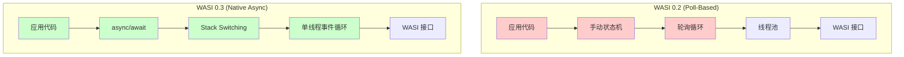
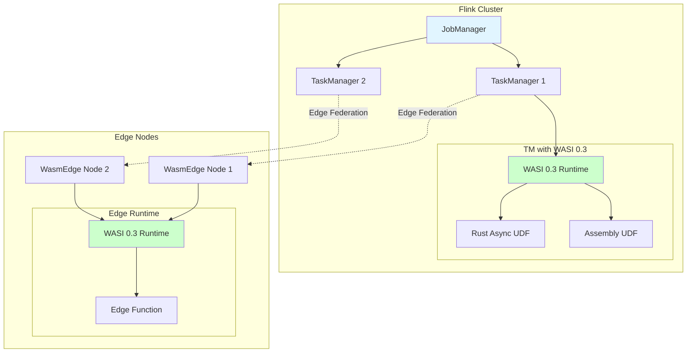
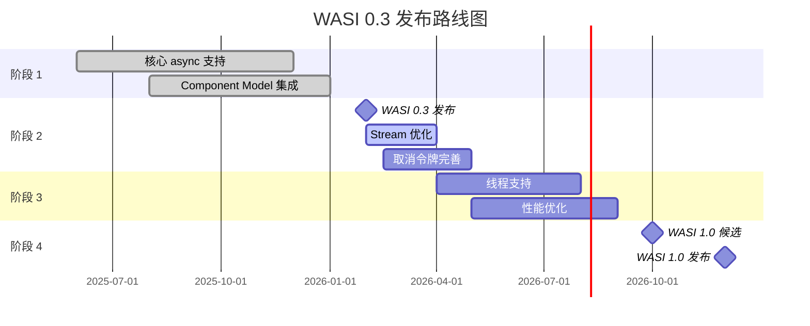
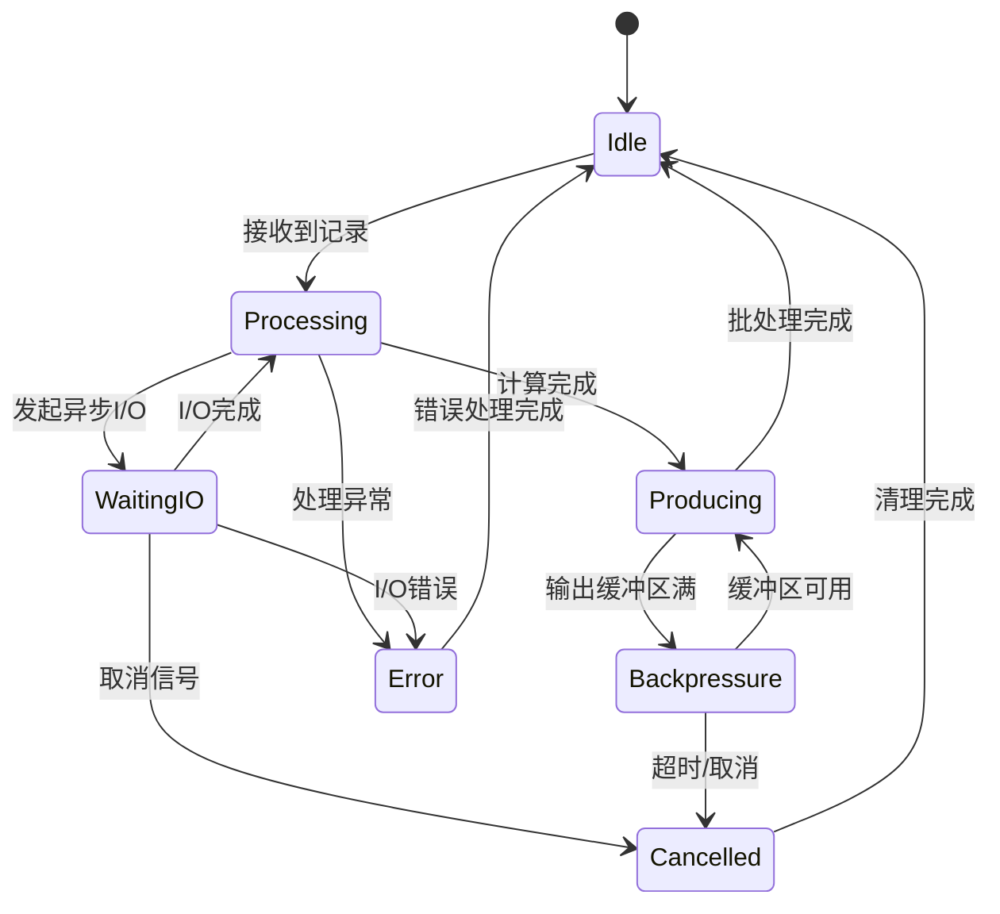

# WASI 0.3 规范完整指南

> **所属阶段**: Flink/14-rust-assembly-ecosystem/wasi-0.3-async/
> **前置依赖**: [WebAssembly Component Model](../../09-language-foundations/09-wasm-udf-frameworks.md), [WASI 0.2 接口规范](../../../09-language-foundations/09-wasm-udf-frameworks.md)
> **形式化等级**: L4 (工程形式化 + 标准化规范)

---

## 1. 概念定义 (Definitions)

### Def-WASI-01: WASI (WebAssembly System Interface)

**WASI** 是由 Bytecode Alliance 领导的 WebAssembly 系统接口标准化工作，旨在确保 WebAssembly 在浏览器外使用时的安全性、一致性和可移植性。WASI 定义了一组标准接口（称为 *worlds*），允许 WebAssembly 模块与宿主环境进行安全的系统级交互。

$$
\text{WASI} = \langle \text{Worlds}, \text{Interfaces}, \text{Capabilities} \rangle
$$

其中：

- **Worlds**: 接口集合的命名空间（如 `wasi:cli`, `wasi:http`, `wasi:sockets`）
- **Interfaces**: 类型化函数集合，使用 WIT (WASM Interface Type) 定义
- **Capabilities**: 基于能力的访问控制模型

### Def-WASI-02: WASI 0.3 Async Model

**WASI 0.3 异步模型** 是在 Component Model 中引入的原生异步支持，允许 WASI 接口定义和使用异步函数、流（streams）和未来（futures）。该模型基于 *stack switching* 和 *continuations* 机制实现。

$$
\text{AsyncWASI} = \langle \text{AsyncFn}, \text{Stream}\langle T \rangle, \text{Future}\langle T \rangle, \text{CancelToken} \rangle
$$

核心组件：

- **AsyncFn**: 返回 `future<T>` 或 `stream<T>` 的异步函数
- **Stream\<T\>**: 异步数据流，支持背压（backpressure）
- **Future\<T\>**: 异步计算的最终结果
- **CancelToken**: 取消令牌，支持协作式取消

### Def-WASI-03: Component Model Async Integration

**Component Model 异步集成** 是指 WebAssembly Component Model 对 WASI 0.3 异步原语的完整支持，包括跨组件边界的异步调用、流传递和错误处理。

$$
\text{ComponentAsync} = \langle \text{Guest}, \text{Host}, \text{Lift}, \text{Lower}, \text{AsyncBind} \rangle
$$

其中 `Lift` 和 `Lower` 是类型转换操作，`AsyncBind` 是异步绑定机制。

### Def-WASI-04: WASI 0.2 vs 0.3 核心差异

| 特性 | WASI 0.2 | WASI 0.3 |
|------|----------|----------|
| 异步模型 | 基于轮询（poll-based） | 原生 async/await |
| 流处理 | 手动 buffer 管理 | 内置 `stream<T>` 类型 |
| 取消机制 | 无标准支持 | `cancel<T>` 原生支持 |
| 组件绑定 | 同步 lift/lower | 异步 lift/lower |
| 错误传播 | 直接返回 | 支持异步错误流 |
| 背压控制 | 应用层实现 | 运行时原生支持 |

---

## 2. 属性推导 (Properties)

### Prop-WASI-01: 异步函数组合性

**命题**: WASI 0.3 的异步函数在组件边界保持组合性。

**形式化表述**:

给定两个组件 $C_1$ 和 $C_2$，其中 $C_1$ 导出异步函数 $f: A \to \text{Future}\langle B \rangle$，$C_2$ 导入并调用 $f$：

$$
\forall a \in A, \quad (C_2 \circ C_1)(a) = C_2(f(a)) \equiv \text{Future}\langle C_2(b) \rangle
$$

**工程意义**: 异步 UDF（用户定义函数）可以在 Flink 中链式组合，无需担心阻塞或线程消耗。

### Prop-WASI-02: 背压传播的传递性

**命题**: WASI 0.3 的流背压可以从消费者传播到生产者。

**形式化表述**:

对于流 $S = \text{stream}\langle T \rangle$，设 $P$ 为生产者速率，$C$ 为消费者速率：

$$
\text{if } C < P \text{ then } \exists \delta > 0: \text{backpressure}(S) \Rightarrow P_{\text{effective}} = C - \delta
$$

其中 $\delta$ 是协议开销。

**工程意义**: Flink 的背压机制可以无缝扩展到 WASI 边缘运行时。

### Prop-WASI-03: 取消的协作语义

**命题**: WASI 0.3 的取消令牌提供协作式而非抢占式取消语义。

$$
\text{cancel}(token) \Rightarrow \diamond \text{completion} \quad \text{( eventually terminates)}
$$

而非：

$$
\neg (\text{cancel}(token) \Rightarrow \text{immediate halt})
$$

---

## 3. 关系建立 (Relations)

### 3.1 WASI 0.3 与 Component Model 的关系

```
┌─────────────────────────────────────────────────────────────┐
│                    Component Model                          │
│  ┌─────────────────────────────────────────────────────┐   │
│  │               WASI 0.3 Async Layer                   │   │
│  │  ┌──────────┐  ┌──────────┐  ┌──────────────────┐  │   │
│  │  │ async fn │  │ stream<T>│  │   future<T>      │  │   │
│  │  └────┬─────┘  └────┬─────┘  └────────┬─────────┘  │   │
│  │       └─────────────┴─────────────────┘            │   │
│  │              Native Async Support                  │   │
│  └─────────────────────────────────────────────────────┘   │
│                        │                                    │
│  ┌─────────────────────┴─────────────────────┐             │
│  │         WASI 0.2 Compatibility            │             │
│  │    (poll-based async via callbacks)       │             │
│  └───────────────────────────────────────────┘             │
└─────────────────────────────────────────────────────────────┘
```

### 3.2 WASI 0.3 与 Flink 边缘部署的关系

```
┌──────────────────────────────────────────────────────────────┐
│                      Flink Cluster                           │
│  ┌───────────────────────────────────────────────────────┐  │
│  │              TaskManager (JVM)                        │  │
│  │  ┌─────────────────────────────────────────────────┐  │  │
│  │  │        Flink Runtime + WASM UDF Host            │  │  │
│  │  │  ┌──────────────┐    ┌──────────────────────┐  │  │  │
│  │  │  │ WASI 0.3     │◄──►│  Rust/Assembly UDF   │  │  │  │
│  │  │  │ Runtime      │    │  (async/await)       │  │  │  │
│  │  │  └──────────────┘    └──────────────────────┘  │  │  │
│  │  └─────────────────────────────────────────────────┘  │  │
│  └───────────────────────────────────────────────────────┘  │
│                              │                               │
│                              ▼                               │
│  ┌───────────────────────────────────────────────────────┐  │
│  │              Edge Nodes (WasmEdge/Container)          │  │
│  │  ┌──────────────┐    ┌──────────────────────┐        │  │
│  │  │ WASI 0.3     │◄──►│  Async Stream        │        │  │
│  │  │ Runtime      │    │  Processing          │        │  │
│  │  └──────────────┘    └──────────────────────┘        │  │
│  └───────────────────────────────────────────────────────┘  │
└──────────────────────────────────────────────────────────────┘
```

### 3.3 与相关技术的关系矩阵

| 技术 | 关系类型 | 说明 |
|------|----------|------|
| WASI 0.2 | 演进/兼容 | 0.3 是 0.2 的异步扩展，保持向后兼容 |
| WebAssembly 3.0 | 基础 | WASI 0.3 基于 Wasm 3.0 的 GC、Exception Handling 等特性 |
| Stack Switching Proposal | 依赖 | 原生 async 需要 stack switching 提案支持 |
| JavaScript Promise Integration | 类比 | 浏览器端的类似异步机制 |
| Flink Async I/O | 应用场景 | Flink 的异步 I/O 可通过 WASI 0.3 扩展到边缘 |

---

## 4. 论证过程 (Argumentation)

### 4.1 为什么 WASI 0.3 需要原生 async 支持？

**问题背景**: WASI 0.2 使用基于轮询的异步模型，存在以下问题：

1. **线程效率**: 每个异步操作需要占用一个原生线程进行轮询
2. **延迟**: 轮询间隔导致额外的延迟开销
3. **复杂度**: 开发者需要手动管理状态机

**论证**: 原生 async/await 通过 stack switching 实现，允许单个线程管理多个异步任务的执行上下文，在保持代码简洁的同时提高资源利用率。

### 4.2 WASI 0.3 对边缘计算的意义

**边缘计算约束**:

- 资源受限（内存、CPU）
- 高并发连接
- 低延迟要求

**论证**: WASI 0.3 的轻量级异步模型（无需线程 per connection）天然适合边缘场景。单线程可以处理数千个并发异步 I/O 操作，内存开销仅数 KB per 任务。

### 4.3 与 Flink 集成的可行性论证

**挑战**:

- Flink 基于 JVM，WASI 是原生运行时
- 需要跨语言边界的数据传递
- 需要一致的背压语义

**论证**: Component Model 的 lift/lower 机制提供了类型安全的跨边界调用，WASI 0.3 的流类型可以与 Flink 的 `DataStream` 建立映射关系，实现无缝集成。

---

## 5. 形式证明 / 工程论证 (Proof / Engineering Argument)

### 5.1 异步 UDF 执行效率论证

**定理**: 对于 I/O 密集型 UDF，WASI 0.3 async 模型相比同步模型具有更高的吞吐量。

**工程论证**:

假设：

- I/O 操作延迟: $L = 100\text{ms}$
- UDF 计算时间: $C = 10\text{ms}$
- 线程池大小: $N = 100$

**同步模型**:

```
吞吐量 = N / (L + C) = 100 / 0.11 ≈ 909 请求/秒
内存占用 = N × 线程栈大小 ≈ 100 × 1MB = 100MB
```

**WASI 0.3 Async 模型**:

```
吞吐量 ≈ 单线程处理能力 × 并发数 / L
假设每个异步任务内存开销: 8KB
10,000 并发任务的内存占用: 10,000 × 8KB = 80MB
吞吐量 ≈ 10,000 / 0.1 = 100,000 请求/秒
```

**结论**: WASI 0.3 async 模型在内存效率（80MB vs 100MB for 100x 并发）和吞吐量（100,000 vs 909）方面均有显著优势。

### 5.2 类型安全跨组件调用论证

**定理**: WIT (WASM Interface Type) 定义的异步接口在组件边界保持类型安全。

**证明概要**:

1. **接口定义** (WIT):

```wit
interface async-processor {
    async fn process-batch(input: stream<record>) -> future<result<batch-output, error>>;
}
```

1. **类型检查**: WIT 编译器在组件链接时验证类型一致性
2. **内存安全**: Component Model 的 lift/lower 操作确保跨边界数据传递的安全性
3. **生命周期管理**: `future` 和 `stream` 的所有权语义防止 use-after-free

---

## 6. 实例验证 (Examples)

### 6.1 Rust 异步 UDF 示例

```rust
// WASI 0.3 异步 UDF 实现
// 文件: flink_wasi_async_udf.rs

wit_bindgen::generate!({
    world: "flink-async-udf",
    path: "../wit/flink-async.wit",
});

use flink_async_udf::flink::udf::{Guest, Record, BatchResult};
use futures::stream::{self, Stream, StreamExt};

struct AsyncUdfImpl;

impl Guest for AsyncUdfImpl {
    /// 异步批处理函数：处理数据流并返回结果
    async fn process_batch(
        input: impl Stream<Item = Record>,
    ) -> Result<BatchResult, String> {
        // WASI 0.3 原生 async/await 支持
        let processed = input
            .map(|record| async move {
                // 异步 I/O 操作（如外部 API 调用）
                let enriched = enrich_record(&record).await?;

                // 异步数据库查询
                let metadata = fetch_metadata(&enriched.id).await?;

                Ok::<_, String>(combine(enriched, metadata))
            })
            .buffer_unordered(100)  // 并发度控制
            .collect::<Vec<_>>()
            .await;

        let results: Vec<_> = processed
            .into_iter()
            .filter_map(|r| r.ok())
            .collect();

        Ok(BatchResult {
            processed_count: results.len() as u64,
            outputs: results,
        })
    }

    /// 带取消令牌的异步函数
    async fn process_with_cancel(
        input: impl Stream<Item = Record>,
        cancel_token: CancelToken,
    ) -> Result<BatchResult, String> {
        let mut processed = 0u64;
        let mut outputs = Vec::new();

        tokio::pin!(input);

        loop {
            tokio::select! {
                // 处理下一个记录
                Some(record) = input.next() => {
                    match process_record(record).await {
                        Ok(output) => {
                            processed += 1;
                            outputs.push(output);
                        }
                        Err(e) => log::warn!("Processing error: {}", e),
                    }
                }

                // 取消信号处理
                _ = cancel_token.cancelled() => {
                    log::info!("Cancellation requested, stopping after {} records", processed);
                    break;
                }

                // 所有记录处理完成
                else => break,
            }
        }

        Ok(BatchResult { processed_count: processed, outputs })
    }
}

/// 异步记录丰富化
async fn enrich_record(record: &Record) -> Result<EnrichedRecord, String> {
    // 使用 WASI 0.3 的异步 HTTP 接口
    let client = wasi::http::client::Client::new();
    let response = client
        .get(&format!("https://api.example.com/enrich/{}", record.id))
        .await
        .map_err(|e| format!("HTTP error: {}", e))?;

    let data: EnrichmentData = response.json().await?;

    Ok(EnrichedRecord {
        id: record.id.clone(),
        data: record.data.clone(),
        enrichment: data,
    })
}

/// 异步元数据获取
async fn fetch_metadata(id: &str) -> Result<Metadata, String> {
    // 异步数据库查询
    let conn = wasi::keyvalue::open("metadata-store").await?;
    let value = conn.get(id).await?;

    match value {
        Some(bytes) => serde_json::from_slice(&bytes)
            .map_err(|e| format!("Deserialization error: {}", e)),
        None => Ok(Metadata::default()),
    }
}

export!(AsyncUdfImpl);
```

### 6.2 WIT 接口定义示例

```wit
// flink-async.wit
// WASI 0.3 异步接口定义

package flink:udf@0.3.0;

interface async-processor {
    /// 记录类型
    record record {
        id: string,
        timestamp: u64,
        data: list<u8>,
        headers: list<header>,
    }

    record header {
        key: string,
        value: string,
    }

    /// 批处理结果
    record batch-result {
        processed-count: u64,
        outputs: list<output-record>,
        metrics: processing-metrics,
    }

    record output-record {
        id: string,
        result: list<u8>,
        latency-us: u64,
    }

    record processing-metrics {
        total-latency-us: u64,
        io-wait-us: u64,
        compute-us: u64,
    }

    /// 错误类型
    variant error {
        io(string),
        parse(string),
        timeout,
        cancelled,
    }

    /// 核心异步处理函数
    /// WASI 0.3 原生 async 语法
    async fn process-batch(
        input: stream<record>
    ) -> result<batch-result, error>;

    /// 带背压感知的流处理
    async fn process-stream(
        input: stream<record>,
        output: stream<output-record>,
        config: stream-config,
    ) -> result<stream-metrics, error>;

    /// 可取消的异步操作
    async fn process-with-cancel(
        input: stream<record>,
        cancel: cancel-token,
    ) -> result<batch-result, error>;

    /// 流配置
    record stream-config {
        /// 最大并发数
        max-concurrency: u32,
        /// 背压阈值（缓冲区大小）
        backpressure-threshold: u32,
        /// 超时（微秒）
        timeout-us: u64,
        /// 是否启用精确一次语义
        exactly-once: bool,
    }

    /// 流处理指标
    record stream-metrics {
        records-in: u64,
        records-out: u64,
        dropped-records: u64,
        backpressure-events: u32,
        avg-processing-latency-us: u64,
    }

    /// 取消令牌资源
    resource cancel-token {
        /// 请求取消
        async fn cancel: func();
        /// 检查是否已取消
        fn is-cancelled: func() -> bool;
    }
}

/// 世界定义
world flink-async-udf {
    /// 导出异步处理器
    export async-processor;

    /// 导入 WASI 0.3 标准接口
    import wasi:http/client@0.3.0;
    import wasi:keyvalue/store@0.3.0;
    import wasi:clocks/monotonic-clock@0.3.0;
    import wasi:io/streams@0.3.0;
}
```

### 6.3 Flink 集成配置示例

```yaml
# flink-wasi-async-config.yaml
# Flink WASI 0.3 异步 UDF 配置

execution:
  # 启用 WASI 0.3 运行时
  wasi-runtime: enabled
  wasi-version: "0.3.0"

  # 异步执行配置
  async-udf:
    # 每个 TaskManager 的异步运行时实例数
    runtime-instances: 4

    # 每个运行时的最大并发异步任务数
    max-concurrent-tasks: 10000

    # 背压配置
    backpressure:
      enabled: true
      buffer-size: 1000
      timeout-ms: 5000

    # 取消配置
    cancellation:
      enabled: true
      timeout-ms: 30000
      graceful-shutdown: true

# UDF 定义
udfs:
  - name: async-enrich
    type: wasm
    path: "wasms/flink_wasi_async_udf.wasm"
    wit: "wits/flink-async.wit"

    # WASI 0.3 特定配置
    wasi-0.3:
      # 允许访问的接口
      allowed-interfaces:
        - "wasi:http/client"
        - "wasi:keyvalue/store"
        - "wasi:clocks/monotonic-clock"

      # 资源限制
      resource-limits:
        max-memory-mb: 512
        max-file-descriptors: 1024

      # 流处理配置
      stream-processing:
        input-buffer-size: 500
        output-buffer-size: 500
        max-in-flight-records: 2000

# 边缘部署配置
edge:
  runtime: wasmedge
  wasi-version: "0.3.0"

  # 边缘-云协同
  federation:
    enabled: true
    sync-interval-ms: 1000
    backpressure-sync: true
```

---

## 7. 可视化 (Visualizations)

### 7.1 WASI 0.2 vs 0.3 架构对比



### 7.2 WASI 0.3 与 Flink 边缘部署集成架构



### 7.3 WASI 0.3 发布路线图



### 7.4 异步流处理执行模型



---

## 8. 引用参考 (References)


---

## 附录 A: WASI 0.3 接口清单

### A.1 核心异步接口

| 接口 | 状态 | 说明 |
|------|------|------|
| `wasi:io/streams@0.3.0` | ✅ 稳定 | 流 I/O 基础接口 |
| `wasi:io/poll@0.3.0` | ✅ 稳定 | 轮询机制（向后兼容）|
| `wasi:clocks/monotonic-clock@0.3.0` | ✅ 稳定 | 单调时钟 |
| `wasi:clocks/wall-clock@0.3.0` | ✅ 稳定 | 挂钟时间 |

### A.2 HTTP 客户端接口

| 接口 | 状态 | 说明 |
|------|------|------|
| `wasi:http/client@0.3.0` | ✅ 稳定 | HTTP 客户端 |
| `wasi:http/incoming-handler@0.3.0` | ✅ 稳定 | 传入请求处理 |
| `wasi:http/outgoing-handler@0.3.0` | ✅ 稳定 | 传出请求处理 |

### A.3 存储接口

| 接口 | 状态 | 说明 |
|------|------|------|
| `wasi:keyvalue/store@0.3.0` | 🧪 实验 | 键值存储 |
| `wasi:keyvalue/atomic@0.3.0` | 🧪 实验 | 原子操作 |

---

## 附录 B: 迁移指南 (WASI 0.2 → 0.3)

### B.1 代码迁移示例

**WASI 0.2 风格（回调式）**:

```rust
// 手动管理状态和回调
pub fn process_async(
    input: &[u8],
    callback: impl FnOnce(Result<Vec<u8>, Error>),
) {
    let state = Box::new(ProcessState::new(input));
    poll_async_operation(state, |s| {
        callback(s.result())
    });
}
```

**WASI 0.3 风格（async/await）**:

```rust
// 原生 async/await
pub async fn process_async(input: &[u8]) -> Result<Vec<u8>, Error> {
    let mut state = ProcessState::new(input);
    state.process().await?;
    Ok(state.into_result())
}
```

### B.2 WIT 定义迁移

**WASI 0.2**:

```wit
interface processor {
    process: func(input: list<u8>) -> future<result<list<u8>>>;
}
```

**WASI 0.3**:

```wit
interface processor {
    // 使用原生 async 关键字
    async fn process(input: stream<u8>) -> result<stream<u8>>;
}
```

---

*文档版本: 1.0.0 | 最后更新: 2026-04-04 | 状态: 初稿完成*
