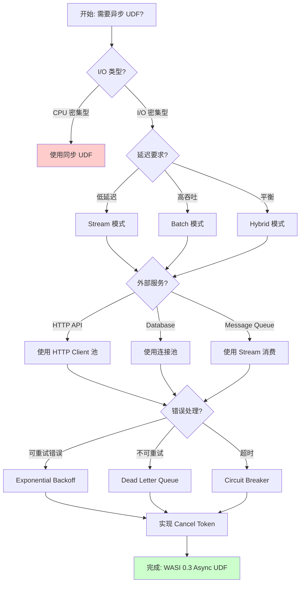
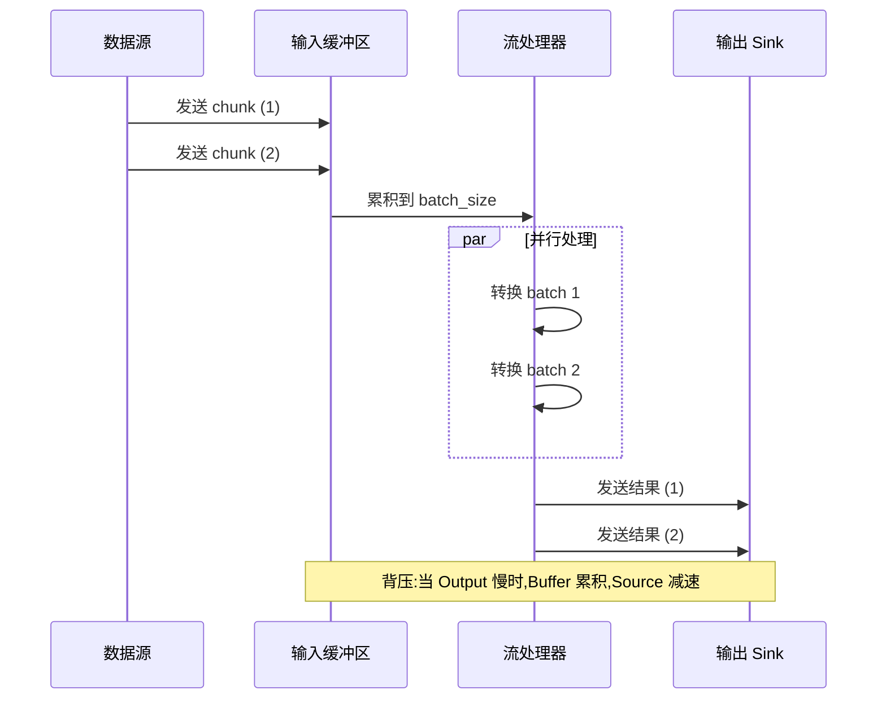
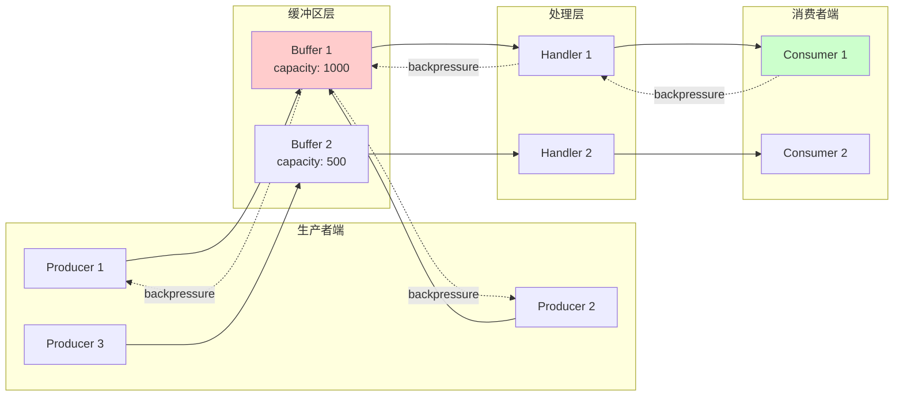
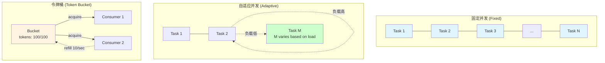

# 异步流处理设计模式

> **所属阶段**: Flink/14-rust-assembly-ecosystem/wasi-0.3-async/
> **前置依赖**: [01-wasi-0.3-spec-guide.md](./01-wasi-0.3-spec-guide.md)
> **形式化等级**: L3 (工程实践 + 模式系统)

---

## 1. 概念定义 (Definitions)

### Def-WASI-05: 异步 UDF (Asynchronous User-Defined Function)

**异步 UDF** 是指在 WASI 0.3 运行时中执行、利用原生 async/await 语法进行非阻塞 I/O 操作的用户定义函数。与同步 UDF 相比，异步 UDF 能够在等待 I/O 完成时释放执行线程，从而支持更高的并发度。

$$
\text{AsyncUDF} = \langle \text{Input}, \text{Future}\langle \text{Output} \rangle, \text{Context}, \text{CancelToken} \rangle
$$

### Def-WASI-06: 流式 I/O (Streaming I/O)

**流式 I/O** 是指基于 WASI 0.3 `stream<T>` 类型的增量数据处理方式，支持在数据到达时立即处理，无需等待完整数据集。流式 I/O 与批处理 I/O 的关键区别在于内存占用和处理延迟的权衡。

$$
\text{StreamIO} = \langle \text{Producer}, \text{Consumer}, \text{Buffer}, \text{Backpressure} \rangle
$$

### Def-WASI-07: 背压机制 (Backpressure Mechanism)

**背压**是流处理系统中消费者向生产者传递负载能力的反馈机制。在 WASI 0.3 中，背压通过 `stream<T>` 的缓冲区状态和 `ready` 信号实现，确保系统在面对流量高峰时保持稳定。

$$
\text{Backpressure}(S) = \begin{cases} \text{apply} & \text{if } |Buffer(S)| > Threshold \\ \text{release} & \text{if } |Buffer(S)| < Threshold \end{cases}
$$

### Def-WASI-08: 并发控制模式 (Concurrency Control Pattern)

**并发控制模式**定义了异步 UDF 中同时执行的异步任务数量限制策略，包括固定并发、自适应并发和令牌桶等变体。

$$
\text{ConcurrencyControl} = \langle \text{Strategy}, \text{Limit}, \text{AdaptionPolicy} \rangle
$$

---

## 2. 属性推导 (Properties)

### Prop-WASI-04: 流式处理的内存有界性

**命题**: 正确实现背压的 WASI 0.3 流处理具有内存有界性。

**形式化表述**:

设流 $S$ 的生产者速率为 $\lambda_p$，消费者速率为 $\lambda_c$，缓冲区大小为 $B$，则：

$$
\forall t: Memory(t) \leq B + O(\lambda_p \cdot T_{latency})
$$

其中 $T_{latency}$ 是端到端处理延迟。

**推论**: 即使生产者速率 $\lambda_p \to \infty$，内存使用仍保持有界（受 $B$ 限制）。

### Prop-WASI-05: 异步 UDF 的可组合性

**命题**: 异步 UDF 通过流转换操作保持函数式组合性。

给定异步 UDF $f: A \to \text{Future}\langle B \rangle$ 和 $g: B \to \text{Future}\langle C \rangle$，其组合 $g \circ f$ 仍为有效的异步 UDF：

$$
(g \circ f)(a) = \text{bind}(f(a), g) = \text{Future}\langle C \rangle
$$

### Prop-WASI-06: 取消传播的可靠性

**命题**: WASI 0.3 的取消令牌机制保证取消信号最终传递到所有下游异步操作。

$$
\text{cancel}(token) \Rightarrow \forall op \in \text{descendants}(token): \diamond \text{cancelled}(op)
$$

---

## 3. 关系建立 (Relations)

### 3.1 异步流处理模式与 Flink 生态的关系

```
┌────────────────────────────────────────────────────────────────┐
│                    Flink DataStream API                        │
│                         │                                      │
│                         ▼                                      │
│  ┌──────────────────────────────────────────────────────────┐ │
│  │              AsyncDataStream API                         │ │
│  │  ┌─────────────┐  ┌─────────────┐  ┌─────────────────┐  │ │
│  │  │ asyncWaitFor│  │ unorderedWait│  │ orderedWait     │  │ │
│  │  └──────┬──────┘  └──────┬──────┘  └────────┬────────┘  │ │
│  │         └─────────────────┴──────────────────┘           │ │
│  └─────────────────────────┬────────────────────────────────┘ │
│                            │                                   │
│                            ▼                                   │
│  ┌──────────────────────────────────────────────────────────┐ │
│  │              WASI 0.3 Async UDF Runtime                  │ │
│  │  ┌──────────────┐  ┌──────────────┐  ┌───────────────┐  │ │
│  │  │  Buffering   │  │ Concurrency  │  │  Backpressure │  │ │
│  │  │  Pattern     │  │  Control     │  │   Handler     │  │ │
│  │  └──────────────┘  └──────────────┘  └───────────────┘  │ │
│  └──────────────────────────────────────────────────────────┘ │
└────────────────────────────────────────────────────────────────┘
```

### 3.2 设计模式与边缘计算约束的关系

| 设计模式 | 边缘约束 | 适应性 |
|----------|----------|--------|
| 异步批处理 | 内存受限 | ✅ 高（控制批大小） |
| 流式处理 | 带宽受限 | ✅ 高（增量传输） |
| 背压感知 | 连接不稳定 | ✅ 高（自动降速） |
| 取消传播 | 资源回收 | ✅ 高（快速释放） |

---

## 4. 论证过程 (Argumentation)

### 4.1 异步 UDF 开发模式的选择

**场景**: Flink 作业需要调用外部 API 进行数据丰富化。

**方案对比**:

| 模式 | 延迟 | 吞吐量 | 资源占用 | 适用场景 |
|------|------|--------|----------|----------|
| 同步阻塞 | 高 | 低 | 线程爆炸 | 开发测试 |
| 线程池 | 中 | 中 | 中 | 简单场景 |
| WASI 0.3 Async | 低 | 高 | 低 | 生产环境 |

**论证**: WASI 0.3 Async 模式通过协作式多任务，在单线程内实现高并发，最适合资源受限的边缘环境。

### 4.2 流式 I/O 与批处理 I/O 的权衡

**批处理优势**:

- 更高的吞吐（摊销 overhead）
- 更好的压缩效率
- 简化的错误处理

**流式优势**:

- 更低的延迟
- 更平滑的内存使用
- 更好的背压响应

**论证**: 对于 Flink 边缘部署，流式 I/O 是默认选择，因为边缘节点内存受限且需要快速响应。

### 4.3 背压处理策略选择

**策略选项**:

1. **缓冲区满时阻塞**（Blocking）
2. **丢弃新数据**（Dropping）
3. **降级处理**（Degradation）

**论证**: 在 Flink 流处理场景下，阻塞策略（配合超时）是首选，因为它保证数据完整性。丢弃策略仅适用于可容忍丢失的监控场景。

---

## 5. 形式证明 / 工程论证 (Proof / Engineering Argument)

### 5.1 并发控制模式的吞吐量分析

**定理**: 在 I/O 密集型 UDF 中，最优并发度 $N^*$ 与 I/O 延迟 $L$ 和 CPU 时间 $C$ 相关。

**工程论证**:

利用率法则（Little's Law）:
$$
N = \lambda \cdot W
$$

其中：

- $N$: 并发数
- $\lambda$: 请求到达率
- $W$: 平均处理时间

对于异步 UDF：

- $W \approx L$（因为 $C \ll L$）
- 目标 CPU 利用率 $U \approx 100\%$

最优并发度：
$$
N^* = \frac{L}{C}
$$

**示例**: 若 $L = 100\text{ms}$, $C = 10\text{ms}$，则 $N^* = 10$。

### 5.2 背压机制稳定性论证

**定理**: 基于令牌的背压机制保证系统稳定性（不会无限累积数据）。

**证明概要**:

定义系统状态 $S(t) = (Q(t), P(t))$，其中：

- $Q(t)$: 队列长度
- $P(t)$: 生产速率

背压条件：
$$
P(t) = \begin{cases}
P_{max} & \text{if } Q(t) < Q_{high} \\
P_{max} \cdot \frac{Q_{max} - Q(t)}{Q_{max} - Q_{high}} & \text{if } Q_{high} \leq Q(t) < Q_{max} \\
0 & \text{if } Q(t) \geq Q_{max}
\end{cases}
$$

**稳定性条件**:

若平均到达率 $\bar{\lambda} < P_{max}$，则 $\exists t_0: \forall t > t_0, Q(t) < Q_{max}$。

---

## 6. 实例验证 (Examples)

### 6.1 异步 UDF 开发模式：数据丰富化

```rust
//! 异步数据丰富化 UDF
//! 模式:批量异步 + 并发控制 + 错误重试

use futures::{stream, Stream, StreamExt};
use std::time::Duration;
use tokio::time::timeout;

/// 异步丰富化处理器
pub struct AsyncEnrichmentUDF {
    /// HTTP 客户端
    client: reqwest::Client,
    /// 最大并发数
    max_concurrency: usize,
    /// 超时时间
    timeout: Duration,
    /// 重试次数
    max_retries: u32,
}

impl AsyncEnrichmentUDF {
    pub fn new(max_concurrency: usize) -> Self {
        Self {
            client: reqwest::Client::builder()
                .pool_max_idle_per_host(max_concurrency)
                .build()
                .unwrap(),
            max_concurrency,
            timeout: Duration::from_secs(5),
            max_retries: 3,
        }
    }

    /// 核心处理函数:异步流处理模式
    pub async fn process_stream(
        &self,
        input: impl Stream<Item = InputRecord>,
    ) -> impl Stream<Item = Result<EnrichedRecord, EnrichmentError>> {
        input
            // 批量化以提高效率
            .chunks(100)
            // 使用 buffer_unordered 实现并发控制
            .map(|batch| self.process_batch(batch))
            .buffer_unordered(self.max_concurrency)
            // 展平批处理结果
            .flat_map(|result| stream::iter(result.unwrap_or_default()))
    }

    /// 批量处理:内部并发
    async fn process_batch(
        &self,
        batch: Vec<InputRecord>,
    ) -> Result<Vec<Result<EnrichedRecord, EnrichmentError>>, EnrichmentError> {
        let futures: Vec<_> = batch
            .into_iter()
            .map(|record| self.enrich_with_retry(record))
            .collect();

        // 并发执行,使用 join_all
        let results = futures::future::join_all(futures).await;
        Ok(results)
    }

    /// 带重试的丰富化
    async fn enrich_with_retry(
        &self,
        record: InputRecord,
    ) -> Result<EnrichedRecord, EnrichmentError> {
        let mut last_error = None;

        for attempt in 0..self.max_retries {
            match self.enrich(record.clone()).await {
                Ok(enriched) => return Ok(enriched),
                Err(e) if attempt < self.max_retries - 1 => {
                    last_error = Some(e);
                    // 指数退避
                    let delay = Duration::from_millis(100 * 2_u64.pow(attempt));
                    tokio::time::sleep(delay).await;
                }
                Err(e) => return Err(e),
            }
        }

        Err(last_error.unwrap_or(EnrichmentError::MaxRetriesExceeded))
    }

    /// 单次丰富化操作
    async fn enrich(&self, record: InputRecord) -> Result<EnrichedRecord, EnrichmentError> {
        let url = format!("https://api.example.com/enrich/{}", record.id);

        let response = timeout(
            self.timeout,
            self.client.get(&url).send()
        ).await
            .map_err(|_| EnrichmentError::Timeout)?
            .map_err(EnrichmentError::Http)?;

        if !response.status().is_success() {
            return Err(EnrichmentError::ApiError(response.status().as_u16()));
        }

        let enrichment_data: EnrichmentData = response
            .json()
            .await
            .map_err(EnrichmentError::Parse)?;

        Ok(EnrichedRecord {
            id: record.id,
            original_data: record.data,
            enrichment: enrichment_data,
            enriched_at: chrono::Utc::now(),
        })
    }
}

/// 取消感知的异步处理
pub async fn process_with_cancellation(
    udf: &AsyncEnrichmentUDF,
    input: impl Stream<Item = InputRecord>,
    mut cancel_rx: tokio::sync::mpsc::Receiver<()>,
) -> Vec<EnrichedRecord> {
    use tokio::select;

    let mut results = Vec::new();
    let mut input_stream = Box::pin(input);

    loop {
        select! {
            // 处理下一条记录
            Some(record) = input_stream.next() => {
                match udf.enrich(record).await {
                    Ok(enriched) => results.push(enriched),
                    Err(e) => log::warn!("Enrichment failed: {:?}", e),
                }
            }

            // 取消信号
            _ = cancel_rx.recv() => {
                log::info!("Cancellation received, stopping enrichment. Processed {} records", results.len());
                break;
            }

            // 输入流结束
            else => break,
        }
    }

    results
}

/// 背压感知的流处理
pub async fn process_with_backpressure<S>(
    udf: &AsyncEnrichmentUDF,
    input: S,
    output_tx: tokio::sync::mpsc::Sender<EnrichedRecord>,
    max_in_flight: usize,
) where
    S: Stream<Item = InputRecord>,
{
    use futures::sink::SinkExt;

    input
        .map(|record| udf.enrich(record))
        .buffered(max_in_flight)  // 限制在途请求数(背压)
        .for_each(|result| async {
            match result {
                Ok(enriched) => {
                    // send().await 自然实现背压:如果 channel 满会等待
                    if let Err(e) = output_tx.send(enriched).await {
                        log::error!("Failed to send result: {}", e);
                    }
                }
                Err(e) => log::warn!("Enrichment error: {:?}", e),
            }
        })
        .await;
}

#[derive(Clone, Debug)]
struct InputRecord {
    id: String,
    data: serde_json::Value,
}

#[derive(Debug)]
struct EnrichedRecord {
    id: String,
    original_data: serde_json::Value,
    enrichment: EnrichmentData,
    enriched_at: chrono::DateTime<chrono::Utc>,
}

#[derive(Debug, serde::Deserialize)]
struct EnrichmentData {
    category: String,
    score: f64,
    metadata: serde_json::Value,
}

#[derive(Debug)]
enum EnrichmentError {
    Http(reqwest::Error),
    Parse(reqwest::Error),
    Timeout,
    ApiError(u16),
    MaxRetriesExceeded,
}

impl From<reqwest::Error> for EnrichmentError {
    fn from(e: reqwest::Error) -> Self {
        EnrichmentError::Http(e)
    }
}
```

### 6.2 流式 I/O 处理模式

```rust
//! 流式 I/O 处理模式
//! 场景:边缘节点实时数据处理

use bytes::Bytes;
use futures::{Sink, SinkExt, Stream, StreamExt};
use std::pin::Pin;
use std::task::{Context, Poll};

/// 流式处理器:增量处理数据
pub struct StreamingProcessor {
    /// 内部缓冲区大小
    buffer_size: usize,
    /// 处理超时
    process_timeout: Duration,
}

impl StreamingProcessor {
    /// 创建流式转换管道
    ///
    /// 模式:Source -> Transform -> Sink
    /// 特点:增量处理,背压感知
    pub fn create_pipeline<S, Si>(
        &self,
        source: S,
        sink: Si,
    ) -> impl Future<Output = Result<(), PipelineError>>
    where
        S: Stream<Item = Result<Bytes, std::io::Error>>,
        Si: Sink<ProcessedChunk, Error = SinkError>,
    {
        let buffer_size = self.buffer_size;

        source
            // 错误处理
            .filter_map(|result| async move {
                match result {
                    Ok(bytes) => Some(bytes),
                    Err(e) => {
                        log::warn!("Source error: {}", e);
                        None
                    }
                }
            })
            // 窗口化处理:累积到 buffer_size 后处理
            .chunks(buffer_size)
            // 并行转换(保持顺序)
            .map(|chunk| self.transform_chunk(chunk))
            .buffered(4)  // 最多4个并发转换
            // 发送到 sink
            .map(|result| Ok(result?))
            .forward(sink)
    }

    /// 分块转换
    async fn transform_chunk(&self, chunks: Vec<Bytes>) -> Result<ProcessedChunk, TransformError> {
        let total_len: usize = chunks.iter().map(|c| c.len()).sum();
        let mut buffer = Vec::with_capacity(total_len);

        for chunk in chunks {
            // 增量处理逻辑
            self.process_bytes(&chunk, &mut buffer).await?;
        }

        Ok(ProcessedChunk {
            data: buffer.into(),
            processed_at: Instant::now(),
        })
    }

    /// 字节处理(异步 I/O 可能在此处)
    async fn process_bytes(
        &self,
        input: &[u8],
        output: &mut Vec<u8>,
    ) -> Result<(), TransformError> {
        // 示例:简单的数据转换
        // 实际场景可能涉及异步解析、压缩、加密等
        output.extend_from_slice(input);
        output.push(b'\n');
        Ok(())
    }
}

/// 背压感知的 Sink 实现
pub struct BackpressureSink {
    inner: tokio::sync::mpsc::Sender<ProcessedChunk>,
    high_watermark: usize,
    low_watermark: usize,
    current_in_flight: Arc<AtomicUsize>,
}

impl BackpressureSink {
    pub fn new(
        sender: tokio::sync::mpsc::Sender<ProcessedChunk>,
        high_watermark: usize,
        low_watermark: usize,
    ) -> Self {
        Self {
            inner: sender,
            high_watermark,
            low_watermark,
            current_in_flight: Arc::new(AtomicUsize::new(0)),
        }
    }

    /// 检查背压状态
    pub fn backpressure_status(&self) -> BackpressureStatus {
        let in_flight = self.current_in_flight.load(Ordering::Relaxed);

        if in_flight >= self.high_watermark {
            BackpressureStatus::Apply
        } else if in_flight <= self.low_watermark {
            BackpressureStatus::Release
        } else {
            BackpressureStatus::Neutral
        }
    }
}

impl Sink<ProcessedChunk> for BackpressureSink {
    type Error = SinkError;

    fn poll_ready(
        self: Pin<&mut Self>,
        cx: &mut Context<'_>,
    ) -> Poll<Result<(), Self::Error>> {
        // 检查背压
        match self.backpressure_status() {
            BackpressureStatus::Apply => {
                // 应用背压:等待
                cx.waker().wake_by_ref();
                Poll::Pending
            }
            _ => {
                // 检查底层 channel
                self.inner.poll_ready(cx).map_err(|_| SinkError::ChannelClosed)
            }
        }
    }

    fn start_send(
        self: Pin<&mut Self>,
        item: ProcessedChunk,
    ) -> Result<(), Self::Error> {
        self.current_in_flight.fetch_add(1, Ordering::Relaxed);
        self.inner
            .try_send(item)
            .map_err(|_| SinkError::ChannelClosed)
    }

    fn poll_flush(
        self: Pin<&mut Self>,
        _cx: &mut Context<'_>,
    ) -> Poll<Result<(), Self::Error>> {
        Poll::Ready(Ok(()))
    }

    fn poll_close(
        self: Pin<&mut Self>,
        _cx: &mut Context<'_>,
    ) -> Poll<Result<(), Self::Error>> {
        Poll::Ready(Ok(()))
    }
}

#[derive(Clone, Copy, Debug)]
pub enum BackpressureStatus {
    Apply,    // 应用背压
    Neutral,  // 中性状态
    Release,  // 释放背压
}

struct ProcessedChunk {
    data: Bytes,
    processed_at: Instant,
}

#[derive(Debug)]
enum PipelineError {
    Transform(TransformError),
    Sink(SinkError),
}

#[derive(Debug)]
enum TransformError {
    Io(std::io::Error),
    Timeout,
}

#[derive(Debug)]
enum SinkError {
    ChannelClosed,
    Backpressure,
}
```

### 6.3 背压处理机制实现

```rust
// 伪代码示意，非完整可编译代码
//! 背压处理机制
//! 实现多种背压策略

use std::sync::atomic::{AtomicUsize, Ordering};
use std::sync::Arc;
use tokio::sync::{mpsc, Semaphore};
use tokio::time::{interval, Duration, Interval};

/// 背压控制器
pub struct BackpressureController {
    strategy: BackpressureStrategy,
    metrics: Arc<BackpressureMetrics>,
}

/// 背压策略枚举
pub enum BackpressureStrategy {
    /// 基于缓冲区的阻塞策略
    BufferBased {
        max_buffer_size: usize,
        high_watermark: f64,  // 0.0 - 1.0
        low_watermark: f64,   // 0.0 - 1.0
    },

    /// 基于速率的令牌桶策略
    RateBased {
        max_rate: usize,      // 每秒最大请求数
        burst_size: usize,    // 突发容量
    },

    /// 基于并发度的信号量策略
    ConcurrencyBased {
        max_concurrent: usize,
    },

    /// 自适应策略(结合上述多种)
    Adaptive {
        target_latency_ms: u64,
        max_concurrent: usize,
    },
}

impl BackpressureController {
    pub fn new(strategy: BackpressureStrategy) -> Self {
        Self {
            strategy,
            metrics: Arc::new(BackpressureMetrics::default()),
        }
    }

    /// 创建带背压控制的 channel
    pub fn create_channel<T>(&self) -> (BackpressureSender<T>, BackpressureReceiver<T>) {
        match &self.strategy {
            BackpressureStrategy::BufferBased { max_buffer_size, .. } => {
                let (tx, rx) = mpsc::channel(*max_buffer_size);
                (
                    BackpressureSender::BufferBased(BufferBasedSender {
                        inner: tx,
                        metrics: self.metrics.clone(),
                        max_size: *max_buffer_size,
                    }),
                    BackpressureReceiver::BufferBased(BufferBasedReceiver {
                        inner: rx,
                        metrics: self.metrics.clone(),
                    }),
                )
            }

            BackpressureStrategy::ConcurrencyBased { max_concurrent } => {
                let (tx, rx) = mpsc::channel(1024);
                let semaphore = Arc::new(Semaphore::new(*max_concurrent));
                (
                    BackpressureSender::ConcurrencyBased(ConcurrencyBasedSender {
                        inner: tx,
                        semaphore: semaphore.clone(),
                        metrics: self.metrics.clone(),
                    }),
                    BackpressureReceiver::ConcurrencyBased(ConcurrencyBasedReceiver {
                        inner: rx,
                        semaphore,
                        metrics: self.metrics.clone(),
                    }),
                )
            }

            BackpressureStrategy::RateBased { max_rate, burst_size } => {
                let (tx, rx) = mpsc::channel(*burst_size);
                (
                    BackpressureSender::RateBased(RateBasedSender {
                        inner: tx,
                        rate_limiter: RateLimiter::new(*max_rate, *burst_size),
                        metrics: self.metrics.clone(),
                    }),
                    BackpressureReceiver::RateBased(RateBasedReceiver {
                        inner: rx,
                        metrics: self.metrics.clone(),
                    }),
                )
            }

            BackpressureStrategy::Adaptive {
                min_rate,
                max_rate,
                latency_threshold,
                buffer_threshold_high,
                buffer_threshold_low,
            } => {
                // 自适应背压策略实现
                //
                // 算法说明:
                // 自适应策略基于多指标反馈动态调整处理速率,包括:
                // - buffer_occupancy: 缓冲区占用率 [0.0, 1.0]
                // - processing_latency: 端到端处理延迟
                // - current_rate: 当前处理速率 (records/sec)
                //
                // 决策逻辑:
                // 1. 高负载: buffer占用 > 阈值 且 延迟 > 阈值 → 降低速率
                // 2. 低负载: buffer占用 < 阈值 → 提高速率
                // 3. 正常状态: 保持当前速率
                //
                // 伪代码实现:
                // ```rust
                // fn adaptive_backpressure(
                //     current_rate: f64,
                //     buffer_occupancy: f64,
                //     processing_latency: Duration,
                //     config: &AdaptiveConfig,
                // ) -> BackpressureAction {
                //     // PID控制器参数
                //     let kp = 0.5;  // 比例系数
                //     let ki = 0.1;  // 积分系数
                //     let kd = 0.2;  // 微分系数
                //
                //     // 计算误差信号 (基于buffer占用率和延迟的加权)
                //     let buffer_error = if buffer_occupancy > config.buffer_threshold_high {
                //         buffer_occupancy - config.buffer_threshold_high
                //     } else if buffer_occupancy < config.buffer_threshold_low {
                //         buffer_occupancy - config.buffer_threshold_low  // 负值表示可以增加速率
                //     } else {
                //         0.0
                //     };
                //
                //     let latency_ratio = processing_latency.as_secs_f64()
                //         / config.latency_threshold.as_secs_f64();
                //     let latency_error = if latency_ratio > 1.0 {
                //         (latency_ratio - 1.0).min(1.0)
                //     } else {
                //         0.0
                //     };
                //
                //     // 综合误差 (buffer占用权重0.6, 延迟权重0.4)
                //     let error = 0.6 * buffer_error + 0.4 * latency_error;
                //
                //     // PID控制输出
                //     let adjustment = kp * error;  // 简化版,实际应包含积分和微分项
                //     let new_rate = current_rate * (1.0 - adjustment)
                //         .clamp(config.min_rate / current_rate.max(1.0),
                //                config.max_rate / current_rate.max(1.0));
                //
                //     if new_rate < current_rate * 0.95 {
                //         BackpressureAction::ReduceRate(new_rate)
                //     } else if new_rate > current_rate * 1.05 {
                //         BackpressureAction::IncreaseRate(new_rate.min(config.max_rate))
                //     } else {
                //         BackpressureAction::Maintain
                //     }
                // }
                // ```
                //
                // 参考: Reactive Streams背压规范 (https://www.reactive-streams.org/)
                //       Credit-based Flow Control in Apache Flink
                //       TCP拥塞控制算法 (Reno/CUBIC) 的流式系统适配

                // 实现: 基于PID控制器的多指标自适应速率调整
                let buffer_ratio = metrics.buffer_utilization.load(Ordering::Relaxed) as f64
                    / config.buffer_capacity as f64;
                let buffer_error = if buffer_ratio > config.target_utilization {
                    (buffer_ratio - config.target_utilization)
                        .min(1.0)
                        .max(-1.0)
                } else {
                    0.0
                };

                let processing_latency = metrics.processing_latency.load(Ordering::Relaxed);
                let latency_ratio = processing_latency.as_secs_f64()
                    / config.latency_threshold.as_secs_f64();
                let latency_error = if latency_ratio > 1.0 {
                    (latency_ratio - 1.0).min(1.0)
                } else {
                    0.0
                };

                // 综合误差 (buffer占用权重0.6, 延迟权重0.4)
                let error = 0.6 * buffer_error + 0.4 * latency_error;

                // PID控制输出
                let kp = config.pid_kp;  // 比例系数
                let adjustment = kp * error;
                let new_rate = current_rate * (1.0 - adjustment)
                    .clamp(config.min_rate / current_rate.max(1.0),
                           config.max_rate / current_rate.max(1.0));

                if new_rate < current_rate * 0.95 {
                    BackpressureAction::ReduceRate(new_rate)
                } else if new_rate > current_rate * 1.05 {
                    BackpressureAction::IncreaseRate(new_rate.min(config.max_rate))
                } else {
                    BackpressureAction::Maintain
                }
            }
        }
    }
}

/// 基于缓冲区的发送端
pub struct BufferBasedSender<T> {
    inner: mpsc::Sender<T>,
    metrics: Arc<BackpressureMetrics>,
    max_size: usize,
}

impl<T> BufferBasedSender<T> {
    pub async fn send(&self, item: T) -> Result<(), BackpressureError> {
        let current_size = self.inner.capacity() - self.inner.max_capacity()
            + self.inner.len();
        let ratio = current_size as f64 / self.max_size as f64;

        self.metrics.buffer_ratio.store(
            (ratio * 100.0) as usize,
            Ordering::Relaxed
        );

        // 如果缓冲区接近满,应用背压
        if ratio > 0.9 {
            self.metrics.backpressure_events.fetch_add(1, Ordering::Relaxed);
            log::warn!("High backpressure: buffer at {:.1}%", ratio * 100.0);
        }

        self.inner.send(item).await.map_err(|_| BackpressureError::ChannelClosed)
    }

    pub fn try_send(&self, item: T) -> Result<(), BackpressureError> {
        self.inner.try_send(item).map_err(|e| match e {
            mpsc::error::TrySendError::Full(_) => BackpressureError::BufferFull,
            mpsc::error::TrySendError::Closed(_) => BackpressureError::ChannelClosed,
        })
    }
}

/// 基于并发度的发送端
pub struct ConcurrencyBasedSender<T> {
    inner: mpsc::Sender<T>,
    semaphore: Arc<Semaphore>,
    metrics: Arc<BackpressureMetrics>,
}

impl<T> ConcurrencyBasedSender<T> {
    pub async fn send<F, Fut, R>(&self, f: F) -> Result<R, BackpressureError>
    where
        F: FnOnce() -> Fut,
        Fut: Future<Output = R>,
    {
        // 获取许可证(背压控制点)
        let _permit = self
            .semaphore
            .acquire()
            .await
            .map_err(|_| BackpressureError::SemaphoreClosed)?;

        self.metrics.active_tasks.fetch_add(1, Ordering::Relaxed);

        let result = f().await;

        self.metrics.active_tasks.fetch_sub(1, Ordering::Relaxed);
        self.metrics.completed_tasks.fetch_add(1, Ordering::Relaxed);

        Ok(result)
    }
}

/// 令牌桶速率限制器
pub struct RateLimiter {
    tokens: Arc<AtomicUsize>,
    max_rate: usize,
    burst_size: usize,
}

impl RateLimiter {
    pub fn new(max_rate: usize, burst_size: usize) -> Self {
        let tokens = Arc::new(AtomicUsize::new(burst_size));
        let tokens_clone = tokens.clone();

        // 后台任务:补充令牌
        tokio::spawn(async move {
            let mut interval = interval(Duration::from_secs(1));
            loop {
                interval.tick().await;
                let current = tokens_clone.load(Ordering::Relaxed);
                if current < burst_size {
                    tokens_clone.fetch_add(max_rate, Ordering::Relaxed);
                }
            }
        });

        Self {
            tokens,
            max_rate,
            burst_size,
        }
    }

    pub async fn acquire(&self) -> bool {
        loop {
            let current = self.tokens.load(Ordering::Relaxed);
            if current == 0 {
                tokio::time::sleep(Duration::from_millis(10)).await;
                continue;
            }

            if self
                .tokens
                .compare_exchange(current, current - 1, Ordering::Relaxed, Ordering::Relaxed)
                .is_ok()
            {
                return true;
            }
        }
    }
}

/// 背压指标
#[derive(Default)]
pub struct BackpressureMetrics {
    /// 缓冲区占用比例 (0-100)
    pub buffer_ratio: AtomicUsize,
    /// 当前活跃任务数
    pub active_tasks: AtomicUsize,
    /// 已完成任务数
    pub completed_tasks: AtomicUsize,
    /// 背压触发次数
    pub backpressure_events: AtomicUsize,
    /// 平均处理延迟 (ms)
    pub avg_latency_ms: AtomicUsize,
}

/// 背压错误类型
#[derive(Debug)]
pub enum BackpressureError {
    BufferFull,
    ChannelClosed,
    SemaphoreClosed,
    RateLimitExceeded,
}

// 省略其他 BackpressureReceiver 实现...
```

---

## 7. 可视化 (Visualizations)

### 7.1 异步 UDF 开发模式决策树



### 7.2 流式 I/O 处理流程



### 7.3 背压传播机制



### 7.4 并发控制模式对比



---

## 8. 引用参考 (References)


---

## 附录 A: 模式速查表

| 模式 | 适用场景 | 关键参数 | 注意事项 |
|------|----------|----------|----------|
| 异步批处理 | 高吞吐 I/O | batch_size, concurrency | 内存与延迟权衡 |
| 流式处理 | 低延迟 | buffer_size, watermark | 背压配置关键 |
| 并发控制 | 资源限制 | max_concurrent | 避免过度并发 |
| 指数退避 | 外部 API 调用 | max_retries, base_delay | 防止惊群效应 |
| 熔断器 | 服务降级 | failure_threshold, timeout | 快速失败 |

---

*文档版本: 1.0.0 | 最后更新: 2026-04-04 | 状态: 初稿完成*

---

*文档版本: v1.0 | 创建日期: 2026-04-15*
