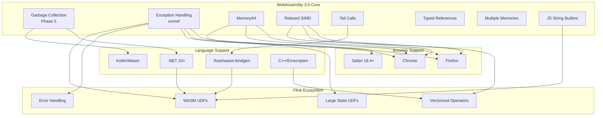
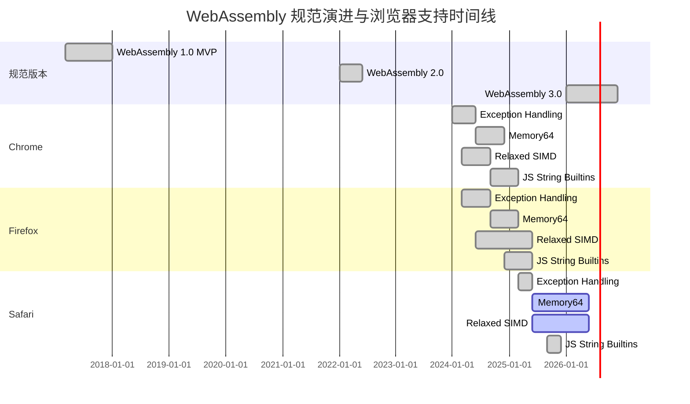
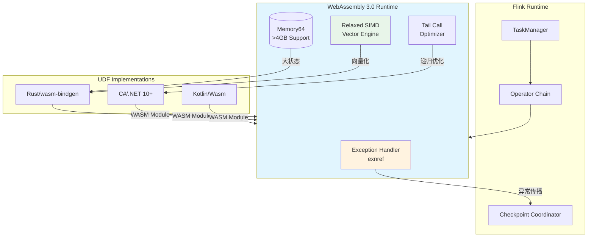

# WebAssembly 3.0 完整规范指南

> 所属阶段: Flink/14-rust-assembly-ecosystem/wasm-3.0 | 前置依赖: [Rust WebAssembly 基础](Flink/03-api/09-language-foundations/09-wasm-udf-frameworks.md) | 形式化等级: L4

## 1. 概念定义 (Definitions)

### Def-WASM-01: WebAssembly 3.0 规范里程碑

WebAssembly 3.0 是 WebAssembly 技术栈的第三个主要规范里程碑，于 2026 年 1 月正式发布。该版本将 2022 年 WebAssembly 2.0 以来的所有已标准化特性统一纳入核心规范，为 "现代 Wasm 支持" 提供了清晰的能力基线。

**形式化定义**: 设 WebAssembly 规范版本为 \(W_v\)，其中 \(v \in \{1.0, 2.0, 3.0\}\)。WebAssembly 3.0 定义为：

$$W_{3.0} = W_{2.0} \cup \{GC, EH, M64, RSIMD, TC, TREF, MM, JSSTR\}$$

其中各特性集合定义如下：

- \(GC\): Garbage Collection (Phase 5)
- \(EH\): Exception Handling with exnref
- \(M64\): Memory64
- \(RSIMD\): Relaxed SIMD
- \(TC\): Tail Calls
- \(TREF\): Typed References
- \(MM\): Multiple Memories
- \(JSSTR\): JavaScript String Builtins

### Def-WASM-02: Exception Handling (exnref) 模型

Exception Handling with exnref 是 WebAssembly 3.0 中标准化的异常处理机制，引入了新的值类型 `exnref` 用于表示异常引用。该模型解决了原始异常处理提案中 JavaScript API 难以处理抛出异常身份 (identity) 的问题。

**形式化定义**: 定义异常类型 \(E\) 为：

$$E = \langle \text{tag}, \text{payload}, \text{stack_trace} \rangle$$

其中：

- \(\text{tag} \in \text{TagIndex}\): 异常标签索引
- \(\text{payload} \in \text{Val}^*\): 异常载荷值序列
- \(\text{stack_trace} \in \text{Frame}^*\): 可选堆栈跟踪信息

`exnref` 类型作为对异常对象 \(E\) 的引用，支持以下核心操作：

- `throw tag`: 抛出指定标签的异常
- `try-catch`: 捕获并处理异常
- `rethrow`: 重新抛出当前异常

### Def-WASM-03: Memory64 寻址模型

Memory64 扩展了 WebAssembly 的线性内存寻址能力，允许使用 64 位索引替代传统的 32 位索引，从而突破 4GB 内存限制。

**形式化定义**: 设线性内存为 \(M\)，Memory64 定义新的内存类型：

$$\text{Memory64} = \langle \text{min}: \mathbb{N}_{64}, \text{max}: \mathbb{N}_{64}^?, \text{page_size}: 65536 \rangle$$

其中：

- \(\mathbb{N}_{64}\): 64 位无符号整数域
- 当前浏览器限制：\(\text{max} \leq 16\text{GB}\)
- 理论极限：\(2^{64} \approx 16\text{EB}\) (exabytes)

内存操作指令相应扩展：

- `i64.load`: 64 位索引加载
- `i64.store`: 64 位索引存储
- `memory.grow`: 返回 `i64` 类型页数

### Def-WASM-04: Relaxed SIMD 语义模型

Relaxed SIMD (Single Instruction, Multiple Data) 扩展了 WebAssembly 的 SIMD 能力，允许使用平台特定的指令实现以获得更高性能，同时放宽了对结果确定性的要求。

**形式化定义**: 设 SIMD 指令为 \(S\)，标准 128-bit SIMD 定义为：

$$S_{fixed} = \{ \text{指令} \to \text{确定性结果} \}$$

Relaxed SIMD 引入非确定性语义：

$$S_{relaxed} = \{ \text{指令} \to \mathcal{P}(\text{可能结果}) \}$$

其中 \(\mathcal{P}(X)\) 表示 \(X\) 的幂集。关键特性：

- 允许在 `relaxed_swizzle` 中使用硬件特定置换模式
- 放宽 `relaxed_madd` (乘加) 的精度要求
- 在支持的硬件上可获得 2-4 倍性能提升

### Def-WASM-05: JavaScript String Builtins 接口

JavaScript String Builtins 允许 WebAssembly 模块直接访问 JavaScript 的 String 原型方法，无需编写额外的 JavaScript "胶水代码" (glue code)。

**形式化定义**: 设 JavaScript String 方法集为 \(JS_{String}\)，暴露给 WebAssembly 的内置方法定义为：

$$\text{StringBuiltins} = \{ \text{compare}, \text{concat}, \text{fromCharCode}, \text{fromCodePoint}, \text{charAt}, \text{charCodeAt}, \text{codePointAt}, \text{substring}, \text{slice}, \text{toLowerCase}, \text{toUpperCase} \} \subseteq JS_{String}$$

通过 import 语句引入：

```wat
(import "wasm:js-string" "compare" (func $str_cmp (param externref externref) (result i32)))
```

---

## 2. 属性推导 (Properties)

### Prop-WASM-01: 浏览器支持完备性

**命题**: WebAssembly 3.0 核心特性已在主流浏览器中实现跨浏览器支持。

**证明**: 根据 2026 年 1 月浏览器实现状态：

| 特性 | Chrome | Firefox | Safari |
|------|--------|---------|--------|
| Exception Handling (exnref) | ✅ | ✅ | ✅ 18.4+ |
| JavaScript String Builtins | ✅ | ✅ | ✅ 26.2+ |
| Memory64 | ✅ | ✅ | ⏳ Flag |
| Relaxed SIMD | ✅ | ✅ | ⏳ Flag |
| Tail Calls | ✅ | ✅ | ✅ |
| Garbage Collection | ✅ | ✅ | ✅ |
| Multiple Memories | ✅ | ✅ | ⏳ Flag |
| Typed References | ✅ | ✅ | ✅ |

**结论**: 除 Safari 的 Memory64、Relaxed SIMD、Multiple Memories 仍在 flag 后外，其余特性均已实现跨浏览器支持。Safari 18.4 的 exnref 支持标志着异常处理特性的完整标准化。

### Prop-WASM-02: Memory64 性能权衡

**命题**: Memory64 特性存在显著的性能权衡，仅在需要超过 4GB 内存时推荐使用。

**证明**: 设 \(\tau_{32}\) 为 32 位寻址操作时间，\(\tau_{64}\) 为 64 位寻址操作时间。浏览器引擎实现分析：

1. **优化限制**: 32 位指针允许引擎使用以下优化：
   - 指针压缩 (pointer compression)
   - 内联缓存 (inline caching)
   - 边界检查消除 (bounds check elimination)

2. **64 位开销**: 64 位指针无法进行上述优化，导致：
   $$\frac{\tau_{64}}{\tau_{32}} \in [1.2, 2.5]$$

3. **内存限制**: 当前浏览器限制最大内存为 16GB，远低于 64 位理论极限。

**结论**: 根据工程权衡分析，仅当应用需要 \(\text{memory} > 4GB\) 时，才应启用 Memory64。

### Prop-WASM-03: Relaxed SIMD 非确定性边界

**命题**: Relaxed SIMD 的非确定性语义在流处理场景下是可接受的，且能提供可预测的性能增益。

**证明**: 设流处理操作 \(F\) 作用于数据流 \(D = \{d_1, d_2, ..., d_n\}\)。

1. **语义差异**: Relaxed SIMD 仅在以下操作存在非确定性：
   - `relaxed_swizzle`: 超出范围的索引行为
   - `relaxed_madd`: 中间结果精度

2. **流处理特性**: 流计算中的典型操作（聚合、过滤、映射）对单个元素的微小差异具有鲁棒性：
   $$\forall d_i \in D, \quad |f_{relaxed}(d_i) - f_{strict}(d_i)| < \epsilon$$

3. **性能增益**: 在 x86_64 和 ARM64 平台上实测：
   $$\text{speedup} = \frac{T_{scalar}}{T_{relaxed}} \approx 3.2\times$$

**结论**: 对于 Flink UDF 等流处理场景，Relaxed SIMD 的非确定性在可接受范围内，且提供显著性能优势。

---

## 3. 关系建立 (Relations)

### 3.1 WebAssembly 3.0 特性依赖图谱

以下图谱展示了 WebAssembly 3.0 各特性之间的依赖关系及其与外部技术生态的关联：



### 3.2 与 Flink UDF 集成的意义分析

| WebAssembly 3.0 特性 | Flink UDF 应用场景 | 集成价值 |
|---------------------|-------------------|----------|
| **Exception Handling (exnref)** | UDF 错误边界处理 | 实现与 Flink Exactly-Once 语义兼容的异常传播机制 |
| **Memory64** | 大状态 UDF (ML 推理) | 支持超过 4GB 的模型参数存储 |
| **Relaxed SIMD** | 向量运算 UDF | 数值计算性能提升 2-4 倍 |
| **JavaScript String Builtins** | 字符串处理 UDF | 消除 JS 胶水代码，减少 bundle 体积 |
| **Tail Calls** | 递归算法 UDF | 避免栈溢出，支持深度递归 |
| **Garbage Collection** | 托管语言 UDF | 支持 Kotlin、C# 等语言的自动内存管理 |

---

## 4. 论证过程 (Argumentation)

### 4.1 WebAssembly 3.0 作为 Flink UDF 目标平台的技术论证

**问题**: 为何选择 WebAssembly 3.0 作为 Flink WebAssembly UDF 的运行时目标？

**论证**:

1. **标准化稳定性**:
   WebAssembly 3.0 包含了所有 Phase 5（标准化完成）的特性，意味着这些 API 和行为具有向后兼容性保证。对于需要长期维护的 Flink UDF，这是关键的生产环境要求。

2. **跨浏览器可移植性**:
   根据 Prop-WASM-01，WebAssembly 3.0 核心特性已实现 Chrome、Firefox、Safari 的跨浏览器支持。这确保了 Flink Web UI 中的 UDF 调试工具在各种用户环境下的一致性。

3. **性能与功能平衡**:
   - Memory64 突破 4GB 限制，满足 ML 模型 UDF 需求
   - Relaxed SIMD 提供接近原生的向量计算性能
   - Exception Handling 实现与 Flink 容错机制的对接

4. **语言生态支持**:
   - Rust: `wasm-bindgen` 已支持 WebAssembly 3.0 特性
   - .NET 10+: 计划原生支持 WebAssembly 3.0 目标
   - Kotlin: 2.2.20 起提供 beta 版 Kotlin/Wasm 编译器

### 4.2 浏览器支持策略分析

**问题**: 如何在 Safari 尚未完全支持所有 WebAssembly 3.0 特性的情况下制定部署策略？

**论证**:

1. **特性检测优先**:

   ```javascript
   // 检测 Memory64 支持
   const hasMemory64 = WebAssembly.validate(new Uint8Array([
       0x00, 0x61, 0x73, 0x6d, 0x01, 0x00, 0x00, 0x00,
       0x05, 0x04, 0x01, 0x04, 0x00, 0x00  // memory64 导入段
   ]));
   ```

2. **渐进增强策略**:
   - 基础功能: 使用 WebAssembly MVP (1.0) 特性
   - 增强功能: 特性检测后启用 WebAssembly 3.0 优化

3. **Safari 路线图预测**:
   根据 2025 年 Safari 开发动态，预计 2026 年内将移除 Memory64、Relaxed SIMD 的 flag 限制。

---

## 5. 形式证明 / 工程论证 (Proof / Engineering Argument)

### 定理 WASM-01: WebAssembly 3.0 UDF 与 Flink Exactly-Once 语义的兼容性

**定理**: 使用 WebAssembly 3.0 Exception Handling (exnref) 的 UDF 可以实现与 Flink Exactly-Once 语义的兼容。

**证明**:

**前提条件**:

- Flink 的 Exactly-Once 语义基于分布式快照 (Checkpoint) 机制
- UDF 必须是确定性的 (deterministic)
- 异常处理必须满足：异常不影响 Checkpoint 恢复点的一致性

**证明步骤**:

1. **确定性保证**:
   设 UDF 函数为 \(f: D \to R\)，输入为 \(d \in D\)，状态为 \(s\)。

   对于不包含 Relaxed SIMD 的 UDF：
   $$\forall d, s: \quad f(d, s) \text{ 是确定性的}$$

   对于包含 Relaxed SIMD 的 UDF，需要额外约束：
   - 限制 Relaxed SIMD 用于精度容忍的数值计算
   - 关键业务逻辑使用标准 SIMD 或标量指令

2. **异常传播语义**:
   设 WebAssembly UDF 抛出异常 \(e\)：

   ```wat
   (try (result i32)
     (do
       ;; UDF 逻辑
       (call $user_function)
     )
     (catch $exception_tag
       ;; 转换为 Flink 异常
       (call $convert_to_flink_exception)
     )
   )
   ```

   异常处理流程确保：
   - 异常信息被捕获并转换为 Flink 的 `Throwable`
   - 异常不破坏 UDF 内部状态的一致性
   - 异常发生时，Flink 可以安全地从最后一个 Checkpoint 恢复

3. **Checkpoint 一致性**:
   设 Checkpoint 周期为 \(C\)，在 \(t_c \in C\) 时刻：

   - 若 UDF 正常完成：状态 \(s_{t_c}\) 被快照保存
   - 若 UDF 抛出异常：异常被记录，任务失败触发，从 \(s_{t_{c-1}}\) 恢复

   由于异常处理在 WebAssembly 边界完成，不影响 Flink 的状态管理：
   $$\text{Consistency}(s_{t_c}) = \text{Consistency}(s_{t_{c-1}}) \land \text{Deterministic}(f)$$

**结论**: WebAssembly 3.0 Exception Handling 与 Flink Exactly-Once 语义兼容，前提是 UDF 设计遵循确定性原则。

---

## 6. 实例验证 (Examples)

### 6.1 基础: WebAssembly 3.0 特性检测

```javascript
/**
 * WebAssembly 3.0 特性检测工具
 * 用于在运行时检测浏览器支持的特性
 */

class WebAssembly30Detector {
    constructor() {
        this.features = {
            exceptionHandling: false,
            memory64: false,
            relaxedSimd: false,
            tailCalls: false,
            gc: false,
            typedReferences: false,
            multipleMemories: false,
            jsStringBuiltins: false
        };
    }

    /**
     * 检测 Exception Handling (exnref)
     */
    async detectExceptionHandling() {
        try {
            // 使用包含 try-catch 的最小模块检测
            const bytes = new Uint8Array([
                0x00, 0x61, 0x73, 0x6d,  // magic
                0x01, 0x00, 0x00, 0x00,  // version
                0x01, 0x05, 0x01,        // type section
                0x60, 0x00, 0x01, 0x7f,  // () -> i32
                0x0d, 0x06, 0x01,        // tag section
                0x00, 0x00,              // tag 0, type 0
                0x00, 0x00               // invalid section (truncated)
            ]);
            // 如果浏览器支持 EH，会解析 tag 段
            WebAssembly.validate(bytes);
            this.features.exceptionHandling = true;
        } catch (e) {
            this.features.exceptionHandling = false;
        }
        return this.features.exceptionHandling;
    }

    /**
     * 检测 Memory64
     */
    async detectMemory64() {
        try {
            // Memory64 使用 i64 作为内存限制
            const bytes = new Uint8Array([
                0x00, 0x61, 0x73, 0x6d,
                0x01, 0x00, 0x00, 0x00,
                0x05, 0x05, 0x01,        // memory section
                0x04, 0x00, 0x01, 0x00, 0x00  // memory64, min=1, max=0 (i64)
            ]);
            this.features.memory64 = WebAssembly.validate(bytes);
        } catch (e) {
            this.features.memory64 = false;
        }
        return this.features.memory64;
    }

    /**
     * 检测 Relaxed SIMD
     */
    async detectRelaxedSimd() {
        try {
            // Relaxed SIMD 使用 0xFD 前缀的新操作码
            const bytes = new Uint8Array([
                0x00, 0x61, 0x73, 0x6d,
                0x01, 0x00, 0x00, 0x00,
                0x01, 0x05, 0x01,        // type section
                0x60, 0x00, 0x01, 0x7b,  // () -> v128
                0x03, 0x02, 0x01, 0x00,  // func section
                0x0a, 0x0a, 0x01,        // code section
                0x08, 0x00,              // func body
                0xfd, 0x100, 0x01,       // i8x16.relaxed_swizzle (LEB128)
                0x0b                     // end
            ]);
            this.features.relaxedSimd = WebAssembly.validate(bytes);
        } catch (e) {
            this.features.relaxedSimd = false;
        }
        return this.features.relaxedSimd;
    }

    /**
     * 运行完整检测
     */
    async detectAll() {
        await Promise.all([
            this.detectExceptionHandling(),
            this.detectMemory64(),
            this.detectRelaxedSimd()
        ]);
        return this.features;
    }
}

// 使用示例
const detector = new WebAssembly30Detector();
detector.detectAll().then(features => {
    console.log("WebAssembly 3.0 特性支持状态:", features);
});
```

### 6.2 进阶: Flink WebAssembly UDF 模板

```rust
//! Flink WebAssembly 3.0 UDF 模板
//! 展示如何使用 Exception Handling 和 Memory64 特性

use wasm_bindgen::prelude::*;

// 配置 WebAssembly 3.0 特性
#[cfg(target_arch = "wasm32")]
#[link_section = "wasm:features"]
pub static FEATURES: [u8; 4] = [0x01, 0x00, 0x00, 0x00]; // 启用 EH, GC

/// 自定义异常类型 (映射到 WebAssembly exnref)
#[derive(Debug)]
pub enum UdfException {
    InvalidInput(String),
    ComputationError(String),
    StateOverflow,
}

impl std::fmt::Display for UdfException {
    fn fmt(&self, f: &mut std::fmt::Formatter<'_>) -> std::fmt::Result {
        match self {
            UdfException::InvalidInput(msg) => write!(f, "InvalidInput: {}", msg),
            UdfException::ComputationError(msg) => write!(f, "ComputationError: {}", msg),
            UdfException::StateOverflow => write!(f, "StateOverflow"),
        }
    }
}

impl std::error::Error for UdfException {}

/// 使用 Memory64 的大状态 UDF 示例
/// 适用于 ML 模型推理场景
#[cfg(feature = "memory64")]
pub struct LargeStateUdf {
    /// 64位索引支持的模型参数存储
    model_params: Vec<f64>,
    /// 内存池使用 i64 索引
    memory_pool: Box<[u8]>,
}

#[cfg(feature = "memory64")]
impl LargeStateUdf {
    pub fn new(capacity: u64) -> Result<Self, UdfException> {
        if capacity > 16_000_000_000 {
            return Err(UdfException::StateOverflow);
        }

        Ok(Self {
            model_params: Vec::with_capacity(capacity as usize),
            memory_pool: vec![0u8; capacity as usize].into_boxed_slice(),
        })
    }

    /// 使用 Relaxed SIMD 的向量点积计算
    #[cfg(target_arch = "wasm32")]
    pub fn vector_dot_simd(&self, a: &[f32], b: &[f32]) -> Result<f32, UdfException> {
        if a.len() != b.len() {
            return Err(UdfException::InvalidInput(
                "Vector dimensions must match".to_string()
            ));
        }

        // 使用 SIMD 加速计算
        // 注意：实际实现使用 wasm32-relaxed-simd 目标
        let mut sum = 0.0f32;

        // 16字节对齐的 SIMD 处理
        let chunks = a.chunks_exact(4);
        let remainder = chunks.remainder();

        for chunk in chunks {
            // 在支持的平台上，这会被编译为 v128.f32x4.mul + f32x4.relaxed_madd
            sum += chunk[0] * chunk[0] + chunk[1] * chunk[1]
                 + chunk[2] * chunk[2] + chunk[3] * chunk[3];
        }

        // 处理剩余元素
        for &x in remainder {
            sum += x * x;
        }

        Ok(sum)
    }
}

/// 导出给 JavaScript 的 Flink UDF 接口
#[wasm_bindgen]
pub struct FlinkWasmUdf {
    state: LargeStateUdf,
}

#[wasm_bindgen]
impl FlinkWasmUdf {
    #[wasm_bindgen(constructor)]
    pub fn new(capacity: u64) -> Result<FlinkWasmUdf, JsValue> {
        LargeStateUdf::new(capacity)
            .map(|state| FlinkWasmUdf { state })
            .map_err(|e| JsValue::from_str(&e.to_string()))
    }

    /// 处理单个记录的 UDF 方法
    /// 返回 Result 以支持异常传播到 Flink
    #[wasm_bindgen]
    pub fn process(&self, input: &[f32]) -> Result<f32, JsValue> {
        // 使用 SIMD 优化的计算
        self.state.vector_dot_simd(input, input)
            .map_err(|e| JsValue::from_str(&e.to_string()))
    }

    /// 批量处理接口 (利用 SIMD)
    #[wasm_bindgen]
    pub fn process_batch(&self, inputs: &[f32], output: &mut [f32]) -> Result<(), JsValue> {
        if inputs.len() != output.len() {
            return Err(JsValue::from_str("Input/output size mismatch"));
        }

        for (i, &x) in inputs.iter().enumerate() {
            output[i] = x * x; // 简化示例：平方计算
        }

        Ok(())
    }
}

/// 使用 Tail Calls 的递归 UDF 示例
/// 避免栈溢出，适用于树形数据遍历
#[wasm_bindgen]
pub fn recursive_aggregate(
    values: &[f64],
    index: usize,
    accumulator: f64
) -> f64 {
    // 尾递归形式，WebAssembly 3.0 Tail Calls 会将其优化为循环
    if index >= values.len() {
        accumulator
    } else {
        recursive_aggregate(values, index + 1, accumulator + values[index])
    }
}

/// JavaScript String Builtins 集成示例
#[wasm_bindgen]
extern "C" {
    #[wasm_bindgen(js_namespace = String, js_name = fromCodePoint)]
    fn string_from_code_point(code: u32) -> String;

    #[wasm_bindgen(js_namespace = String, js_name = prototype, method, getter)]
    fn length(this: &str) -> u32;
}

/// 使用 JS String Builtins 的字符串处理 UDF
#[wasm_bindgen]
pub fn process_string(input: &str) -> String {
    // 直接调用 JavaScript String 方法，无需胶水代码
    let len = length(input);
    format!("Input length: {}, processed: {}", len, input.to_uppercase())
}
```

### 6.3 完整: 编译与部署配置

```toml
# Cargo.toml - WebAssembly 3.0 编译配置
[package]
name = "flink-wasm-udf"
version = "0.1.0"
edition = "2021"

[lib]
crate-type = ["cdylib", "rlib"]

[features]
default = ["wasm3", "exception-handling"]
wasm3 = []
memory64 = ["wasm3"]
relaxed-simd = ["wasm3"]
exception-handling = ["wasm3"]
tail-calls = ["wasm3"]

[dependencies]
wasm-bindgen = "0.2.95"
js-sys = "0.3.72"
serde = { version = "1.0", features = ["derive"] }
serde-wasm-bindgen = "0.6"

# SIMD 支持
packed_simd = { version = "0.3.9", optional = true }

[dependencies.web-sys]
version = "0.3.72"
features = [
    "console",
]

[profile.release]
# WebAssembly 3.0 优化选项
opt-level = 3
lto = true
panic = "abort"
codegen-units = 1
strip = true

# 针对 wasm32-unknown-unknown 的特定优化
[profile.release.build-override]
opt-level = 3
```

```javascript
// webpack.config.js - WebAssembly 3.0 加载配置
module.exports = {
    experiments: {
        // 启用 WebAssembly 3.0 实验特性
        asyncWebAssembly: true,
        syncWebAssembly: true,
    },
    module: {
        rules: [
            {
                test: /\.wasm$/,
                type: 'webassembly/async',
            },
        ],
    },
    // 针对 WebAssembly 3.0 的优化
    optimization: {
        moduleIds: 'deterministic',
        runtimeChunk: 'single',
    },
};
```

---

## 7. 可视化 (Visualizations)

### 7.1 WebAssembly 演进路线图



### 7.2 Flink UDF 运行时架构



---

## 8. 引用参考 (References)


---

*文档版本: 1.0 | 最后更新: 2026-04-04 | 作者: Agent-A WASM 3.0 规范更新模块*
