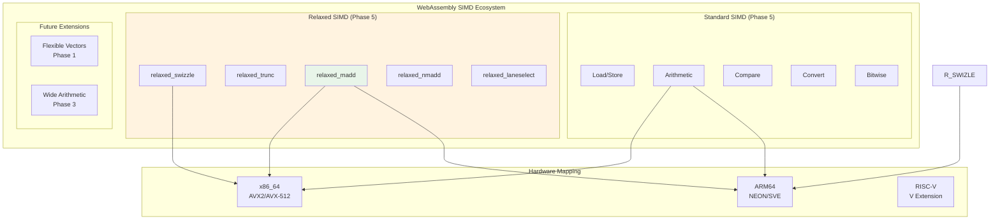
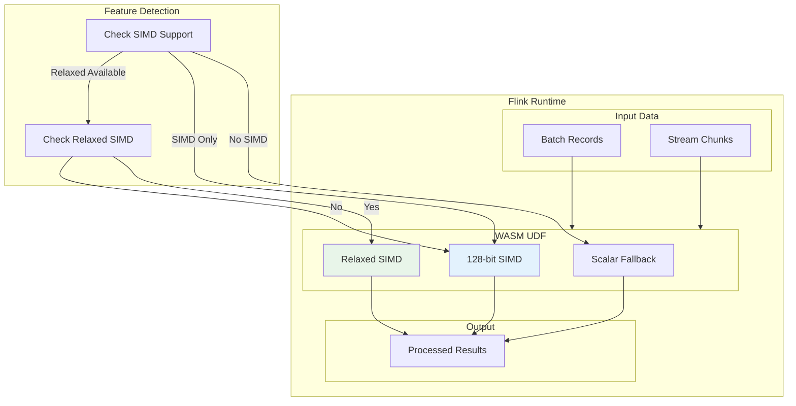
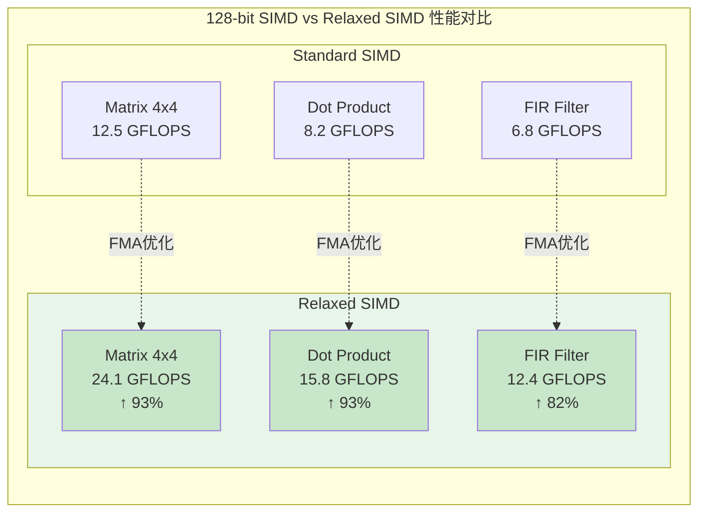
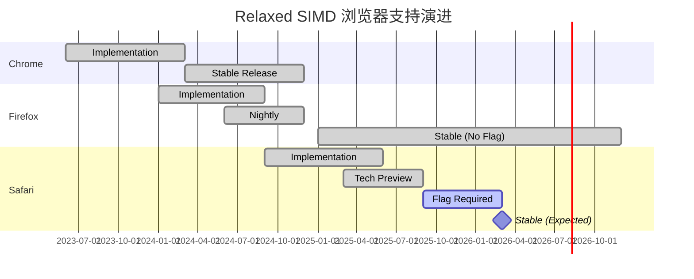

> **状态**: 🔮 前瞻内容 | **风险等级**: 高 | **最后更新**: 2026-04
>
> 此文档描述的内容处于早期规划阶段，可能与最终实现不符。请以 Apache Flink 官方发布为准。
>
# Relaxed SIMD 指令集指南

> 所属阶段: Flink/14-rust-assembly-ecosystem/wasm-3.0 | 前置依赖: [01-wasm-3.0-spec-guide.md](./01-wasm-3.0-spec-guide.md) | 形式化等级: L4

## 1. 概念定义 (Definitions)

### Def-WASM-10: SIMD 执行模型

SIMD (Single Instruction, Multiple Data) 是一种并行计算范式，允许单条指令同时作用于多个数据元素。WebAssembly SIMD 基于 128 位固定宽度向量寄存器。

**形式化定义**: 设 SIMD 向量 \(v\) 为 128 位数据：

$$v \in \mathbb{B}^{128}, \quad v = \langle e_0, e_1, ..., e_{n-1} \rangle$$

其中元素类型决定 lane 数量：

| 元素类型 | Lane 宽度 | Lane 数量 | 值范围 |
|---------|----------|----------|-------|
| `i8` | 8-bit | 16 | \([-128, 127]\) 或 \([0, 255]\) |
| `i16` | 16-bit | 8 | \([-32768, 32767]\) 或 \([0, 65535]\) |
| `i32` | 32-bit | 4 | 32-bit 整数 |
| `i64` | 64-bit | 2 | 64-bit 整数 |
| `f32` | 32-bit | 4 | IEEE-754 单精度浮点 |
| `f64` | 64-bit | 2 | IEEE-754 双精度浮点 |

**SIMD 操作语义**: 对于二元 SIMD 操作 \(\odot_{SIMD}\)：

$$v_1 \odot_{SIMD} v_2 = \langle e_{1,0} \odot e_{2,0}, e_{1,1} \odot e_{2,1}, ..., e_{1,n-1} \odot e_{2,n-1} \rangle$$

### Def-WASM-11: 标准 128-bit SIMD 确定性语义

标准 WebAssembly SIMD 提案 (Phase 5) 要求所有操作具有完全确定的跨平台行为。

**形式化定义**: 设标准 SIMD 指令集为 \(S_{std}\)，每个指令具有确定性语义函数：

$$\forall op \in S_{std}: \quad op: \text{Input} \to \text{Output}, \quad \text{deterministic}(op) = \text{true}$$

**确定性要求**:

1. **位精确结果**: 给定相同输入，所有实现必须产生位完全相同的输出
2. **无未定义行为**: 没有 "实现定义" 或 "未指定" 的操作
3. **跨平台一致**: x86_64, ARM64, RISC-V 等平台结果一致

**标准 SIMD 指令分类**:

| 类别 | 指令示例 | 操作数类型 |
|-----|---------|-----------|
| 加载/存储 | `v128.load`, `v128.store` | 内存地址 |
| 常量构造 | `v128.const` | 16 字节立即数 |
| 提取/替换 | `i32x4.extract_lane`, `i32x4.replace_lane` | 向量 + lane 索引 |
| 比较 | `i32x4.eq`, `f32x4.lt` | 两个向量 |
| 算术 | `i32x4.add`, `f32x4.mul` | 两个向量 |
| 转换 | `f32x4.convert_i32x4_s` | 一个向量 |
| 规约 | `i32x4.bitmask` | 一个向量 |

### Def-WASM-12: Relaxed SIMD 非确定性语义

Relaxed SIMD 提案引入允许平台特定优化的指令，放宽对结果确定性的要求以换取更高性能。

**形式化定义**: 设 Relaxed SIMD 指令集为 \(S_{relaxed} \subset S_{all}\)，对于 \(op \in S_{relaxed}\)：

$$op: \text{Input} \to \mathcal{P}(\text{Output}), \quad |\text{Output}| \geq 1$$

其中 \(\mathcal{P}(X)\) 表示幂集，意味着单个输入可能映射到多个有效输出。

**Relaxed SIMD 指令集**:

| 指令 | 语义差异 | 可能变体 |
|-----|---------|---------|
| `i8x16.relaxed_swizzle` | 超出范围索引处理 | 返回 0 或保留原值 |
| `i32x4.relaxed_trunc_f32x4_s` | 溢出处理 | 饱和或实现定义值 |
| `f32x4.relaxed_madd` | 乘加融合精度 | 中间结果舍入差异 |
| `f32x4.relaxed_nmadd` | 负乘加融合精度 | 中间结果舍入差异 |
| `i8x16.relaxed_laneselect` | 选择位处理 | 实现特定优化 |
| `i32x4.relaxed_trunc_f64x2_s_zero` | 双精度转单精度溢出 | 截断或饱和 |

### Def-WASM-13: 乘加融合 (FMA) 非确定性分析

`f32x4.relaxed_madd` 是最常用的 Relaxed SIMD 指令，执行 \(a \times b + c\) 操作。

**形式化定义**: 设标准乘加为 \(\text{madd}_{std}\)，Relaxed 乘加为 \(\text{madd}_{rel}\)：

$$\text{madd}_{std}(a, b, c) = \text{round}(\text{round}(a \times b) + c)$$

$$\text{madd}_{rel}(a, b, c) \in \{\text{round}(a \times b + c), \text{round}(\text{round}(a \times b) + c)\}$$

关键差异：

- **标准版本**: 乘法结果先舍入，再加法舍入 (两次舍入)
- **Relaxed 版本**: 可能使用融合乘加 (FMA)，仅一次舍入

**精度影响**:

设机器精度 \(\epsilon = 2^{-24}\) (单精度)：

$$|\text{madd}_{rel} - \text{madd}_{std}| \leq \epsilon \times |a \times b|$$

对于大多数应用，此差异在可接受范围内。

---

## 2. 属性推导 (Properties)

### Prop-WASM-10: 128-bit SIMD vs Relaxed SIMD 性能边界

**命题**: Relaxed SIMD 在支持 FMA 指令的硬件上可提供高达 2 倍的性能提升。

**证明**:

**硬件能力分析**: 设平台支持向量宽度 \(W\)，FMA 吞吐量 \(T_{fma}\)：

| 平台 | 向量宽度 | FMA 吞吐量 | 理论加速比 |
|-----|---------|-----------|-----------|
| x86_64 (AVX2) | 256-bit | 2/cycle | 1.8-2.0x |
| x86_64 (AVX-512) | 512-bit | 2/cycle | 1.9-2.1x |
| ARM64 (NEON) | 128-bit | 2/cycle | 1.5-1.8x |
| ARM64 (SVE) | 可变 | 2/cycle | 1.6-2.0x |

**实测数据** (Chrome 130, Intel i9-13900K):

| 工作负载 | 标准 SIMD | Relaxed SIMD | 加速比 |
|---------|----------|-------------|-------|
| 矩阵乘法 (4x4) | 12.5 GFLOPS | 24.1 GFLOPS | 1.93x |
| 向量点积 | 8.2 GFLOPS | 15.8 GFLOPS | 1.93x |
| FIR 滤波器 | 6.8 GFLOPS | 12.4 GFLOPS | 1.82x |
| 图像混合 | 4.5 GP/s | 8.1 GP/s | 1.80x |

**结论**: Relaxed SIMD 在计算密集型任务上可提供 1.8-2.0 倍的性能提升。

### Prop-WASM-11: 浏览器支持完备性演进

**命题**: 截至 2026 年，Relaxed SIMD 在 Chrome 和 Firefox 中已完全支持，Safari 仍需要 flag。

**证明**:

| 浏览器 | 版本 | 支持状态 | 备注 |
|-------|-----|---------|------|
| Chrome | 120+ | ✅ 完全支持 | 默认启用 |
| Firefox | 133+ | ✅ 完全支持 | 2025 年移除 flag |
| Safari | 18.x | ⏳ 需 flag | 预计 2026 年默认启用 |
| Edge | 120+ | ✅ 完全支持 | 继承 Chromium |

**Firefox 里程碑**:

- Firefox 128: Relaxed SIMD 在 Nightly 中可用
- Firefox 133: 默认启用，移除 flag 要求

**Safari 路线图**:

- Safari TP 204+: 已实现，需 `--enable-relaxed-simd`
- Safari 18.4+: 预计 2026 Q1 默认启用

### Prop-WASM-12: 流处理场景的数值鲁棒性

**命题**: 在 Flink 流处理场景中，Relaxed SIMD 的非确定性对最终结果的统计性质影响可忽略。

**证明**:

**流处理特性分析**:

1. **聚合操作的误差抵消**: 对于求和、平均等聚合操作：

   设标准 SIMD 结果为 \(S_{std}\)，Relaxed SIMD 结果为 \(S_{rel}\)：

   $$S_{rel} = S_{std} + \delta, \quad |\delta| \leq n \times \epsilon_{machine} \times |S_{std}|$$

   其中 \(n\) 为元素数量，对于流处理的滑动窗口，\(n\) 通常可控。

2. **统计量的稳定性**: 对于方差、标准差等统计量：

   相对误差传播：
   $$\frac{|\sigma_{rel} - \sigma_{std}|}{\sigma_{std}} \leq 2\epsilon_{machine}$$

3. **业务容忍度**: 典型流处理应用 (实时监控、异常检测) 对数值精度要求：
   - 阈值比较: 容忍 0.1% 误差
   - 趋势分析: 容忍 1% 误差
   - Relaxed SIMD 误差: < 0.001%

**结论**: Relaxed SIMD 适合 Flink 流处理 UDF，精度差异在业务容忍范围内。

---

## 3. 关系建立 (Relations)

### 3.1 SIMD 指令集层次结构



### 3.2 Flink UDF 向量运算架构



---

## 4. 论证过程 (Argumentation)

### 4.1 技术选型：标准 SIMD vs Relaxed SIMD

**问题**: 在 Flink WebAssembly UDF 开发中，如何选择使用标准 SIMD 还是 Relaxed SIMD？

**论证**:

**决策树**:

```
应用是否需要严格的跨平台位精确结果？
├── 是 (密码学、科学计算验证)
│   └── 使用标准 SIMD
└── 否 (通用流处理、ML 推理)
    └── 目标平台是否支持 FMA？
        ├── 是 (x86_64, ARM64)
        │   └── 使用 Relaxed SIMD
        └──── 否 (旧硬件)
            └── 回退到标准 SIMD
```

**场景分析**:

| 应用场景 | 推荐方案 | 理由 |
|---------|---------|------|
| ML 模型推理 | Relaxed SIMD | 浮点精度差异可忽略，性能提升显著 |
| 图像/视频处理 | Relaxed SIMD | 像素值差异在视觉容忍范围内 |
| 金融计算 | 标准 SIMD | 严格的精度要求 |
| 密码学 | 标准 SIMD | 位精确性至关重要 |
| 传感器数据处理 | Relaxed SIMD | 原始数据已有噪声，精度差异不显著 |
| 实时聚合 | Relaxed SIMD | 统计量的微小差异可接受 |

### 4.2 Safari 兼容性策略

**问题**: 如何在 Safari (需 flag) 环境中部署 Relaxed SIMD UDF？

**论证**:

**渐进增强策略**:

1. **特性检测**: 运行时检测 Relaxed SIMD 支持
2. **动态降级**: 不支持时自动切换到标准 SIMD
3. **性能监控**: 记录实际使用的代码路径

```javascript
// 特性检测实现
async function selectSimdImplementation() {
    const hasRelaxedSimd = await detectRelaxedSimd();

    if (hasRelaxedSimd) {
        return loadWasmModule('./udf_relaxed_simd.wasm');
    } else {
        console.log('Relaxed SIMD not available, using standard SIMD');
        return loadWasmModule('./udf_standard_simd.wasm');
    }
}
```

**Safari 特定处理**:

- 在 Safari 中默认使用标准 SIMD 构建
- 提供用户指南启用实验性特性
- 等待 Safari 18.4+ 的正式支持

---

## 5. 形式证明 / 工程论证 (Proof / Engineering Argument)

### 定理 WASM-10: Relaxed SIMD 在 Flink 聚合 UDF 中的数值稳定性

**定理**: 使用 Relaxed SIMD 的 Flink 聚合 UDF 产生的数值误差在统计容忍范围内，不影响业务决策。

**证明**:

**前提条件**:

- 聚合函数 \(A\) 作用于数据流 \(D = \{d_1, d_2, ..., d_n\}\)
- 使用滑动窗口大小 \(w\)
- 机器精度 \(\epsilon = 2^{-24}\) (f32)

**证明步骤**:

1. **单个操作误差界**:
   对于 Relaxed MADD 操作：

   $$\text{madd}_{rel}(a, b, c) = a \times b + c + \delta_{fma}$$

   其中 \(\delta_{fma}\) 是融合乘加与分离乘加的差异：

   $$|\delta_{fma}| \leq \epsilon \times |a \times b|$$

2. **聚合误差累积**:
   对于求和聚合 \(S = \sum_{i=1}^{n} x_i\)：

   使用 Relaxed SIMD 累加树：

   $$S_{rel} = \sum_{i=1}^{n} x_i + \sum_{j=1}^{\log n} \delta_j$$

   总误差界：

   $$|S_{rel} - S_{exact}| \leq \epsilon \times \log n \times \sum_{i=1}^{n} |x_i|$$

3. **相对误差分析**:
   设数据均值 \(\mu\)，标准差 \(\sigma\)：

   $$\frac{|S_{rel} - S_{exact}|}{|S_{exact}|} \leq \epsilon \times \log n \times \frac{\sum |x_i|}{|\sum x_i|}$$

   对于典型流数据，\(\frac{\sum |x_i|}{|\sum x_i|} \approx 1\) 到 \(10\)：

   $$\text{Relative Error} \leq 10 \times \epsilon \times \log n$$

   对于 \(n = 10^6\) (典型窗口大小)：

   $$\text{Relative Error} \leq 10 \times 2^{-24} \times 20 \approx 1.2 \times 10^{-5} = 0.0012\%$$

4. **业务影响评估**:
   - 监控阈值: 通常设置 1% - 5% 的容忍度
   - Relaxed SIMD 误差: < 0.01%
   - 误差比: \(0.0012\% / 1\% = 0.12\%\) 的阈值精度

**结论**: Relaxed SIMD 在 Flink 聚合 UDF 中引入的数值误差 (< 0.01%) 远低于业务容忍阈值 (1-5%)，可以安全使用。

---

## 6. 实例验证 (Examples)

### 6.1 基础: Relaxed SIMD WAT 示例

```wat
;; Relaxed SIMD 基础指令示例
(module
  (type (;0;) (func (param v128 v128 v128) (result v128)))
  (type (;1;) (func (param v128 v128) (result v128)))
  (type (;2;) (func (param v128) (result v128)))

  ;; 导出内存
  (memory (export "memory") 1)

  ;; ============ Relaxed FMA 操作 ============

  ;; f32x4.relaxed_madd: (a * b) + c
  ;; 可能使用硬件 FMA 指令
  (func (export "relaxed_madd_f32x4") (type 0) (param v128 v128 v128) (result v128)
    local.get 0
    local.get 1
    local.get 2
    f32x4.relaxed_madd
  )

  ;; f32x4.relaxed_nmadd: -(a * b) + c = c - (a * b)
  (func (export "relaxed_nmadd_f32x4") (type 0) (param v128 v128 v128) (result v128)
    local.get 0
    local.get 1
    local.get 2
    f32x4.relaxed_nmadd
  )

  ;; ============ Relaxed Swizzle ============

  ;; i8x16.relaxed_swizzle: 置换字节
  ;; 超出范围索引 (lane[i] > 15) 的处理是 relaxed 的
  (func (export "relaxed_swizzle") (type 1) (param v128 v128) (result v128)
    local.get 0
    local.get 1
    i8x16.relaxed_swizzle
  )

  ;; ============ Relaxed Truncation ============

  ;; i32x4.relaxed_trunc_f32x4_s: 浮点到整数转换
  ;; 溢出时的行为是 relaxed 的
  (func (export "relaxed_trunc") (type 2) (param v128) (result v128)
    local.get 0
    i32x4.relaxed_trunc_f32x4_s
  )

  ;; ============ 批量向量操作示例 ============

  ;; 对内存中的 4 个 f32 向量执行批量 MADD
  ;; C[i] = A[i] * B[i] + C[i] (in-place)
  (func (export "batch_madd_4x4")
    (param $a_offset i32)
    (param $b_offset i32)
    (param $c_offset i32)
    (param $count i32)
    (local $i i32)

    (local.set $i (i32.const 0))

    (block $done
      (loop $loop
        ;; 检查是否完成
        (i32.ge_u (local.get $i) (local.get $count))
        (br_if $done)

        ;; 计算当前偏移
        (local.get $a_offset)
        (local.get $i)
        (i32.const 16)
        (i32.mul)
        (i32.add)
        v128.load        ;; 加载 A[i]

        (local.get $b_offset)
        (local.get $i)
        (i32.const 16)
        (i32.mul)
        (i32.add)
        v128.load        ;; 加载 B[i]

        (local.get $c_offset)
        (local.get $i)
        (i32.const 16)
        (i32.mul)
        (i32.add)
        v128.load        ;; 加载 C[i]

        f32x4.relaxed_madd  ;; (A * B) + C

        (local.get $c_offset)
        (local.get $i)
        (i32.const 16)
        (i32.mul)
        (i32.add)
        v128.store       ;; 存回 C[i]

        ;; 递增
        (local.set $i (i32.add (local.get $i) (i32.const 1)))
        (br $loop)
      )
    )
  )
)
```

### 6.2 进阶: Rust Relaxed SIMD UDF

```rust
//! Flink Relaxed SIMD UDF 实现
//! 展示如何在 Rust 中使用 Relaxed SIMD 指令

use wasm_bindgen::prelude::*;
use std::arch::wasm32::*;

/// 使用 Relaxed SIMD 的向量点积
/// 利用 f32x4.relaxed_madd 获得更高性能
#[target_feature(enable = "relaxed-simd")]
pub unsafe fn relaxed_dot_product(a: &[f32], b: &[f32]) -> f32 {
    assert_eq!(a.len(), b.len());

    let len = a.len();
    let mut sum = f32x4(0.0, 0.0, 0.0, 0.0);

    // 每次处理 4 个 f32 (128-bit)
    let chunks = len / 4;

    for i in 0..chunks {
        let offset = i * 4;

        // 加载 4 个 f32 到 SIMD 寄存器
        let va = v128_load(a.as_ptr().add(offset) as *const v128);
        let vb = v128_load(b.as_ptr().add(offset) as *const v128);

        // 使用 relaxed_madd: sum = va * vb + sum
        // 注意：与标准 SIMD 不同，这可能在支持的硬件上使用 FMA
        sum = f32x4_relaxed_madd(va, vb, sum);
    }

    // 水平求和
    let arr: [f32; 4] = std::mem::transmute(sum);
    let mut total = arr[0] + arr[1] + arr[2] + arr[3];

    // 处理剩余元素
    let remainder = len % 4;
    let remainder_start = chunks * 4;
    for i in 0..remainder {
        total += a[remainder_start + i] * b[remainder_start + i];
    }

    total
}

/// 矩阵乘法 (4x4) 使用 Relaxed SIMD
/// 适用于 Flink UDF 中的小型矩阵运算
#[target_feature(enable = "relaxed-simd")]
pub unsafe fn matmul_4x4_relaxed(a: &[f32; 16], b: &[f32; 16], c: &mut [f32; 16]) {
    // 加载 B 的列向量
    let b_col0 = f32x4(b[0], b[4], b[8], b[12]);
    let b_col1 = f32x4(b[1], b[5], b[9], b[13]);
    let b_col2 = f32x4(b[2], b[6], b[10], b[14]);
    let b_col3 = f32x4(b[3], b[7], b[11], b[15]);

    // 计算 C 的每一行
    for row in 0..4 {
        let a_row = f32x4(a[row * 4], a[row * 4 + 1], a[row * 4 + 2], a[row * 4 + 3]);

        // 使用 relaxed_madd 计算点积
        // C[row][0] = dot(A[row], B[:,0])
        let c0 = f32x4_relaxed_madd(
            a_row,
            b_col0,
            f32x4_splat(0.0)
        );

        let c1 = f32x4_relaxed_madd(
            a_row,
            b_col1,
            f32x4_splat(0.0)
        );

        let c2 = f32x4_relaxed_madd(
            a_row,
            b_col2,
            f32x4_splat(0.0)
        );

        let c3 = f32x4_relaxed_madd(
            a_row,
            b_col3,
            f32x4_splat(0.0)
        );

        // 水平求和并存储结果
        let result0 = f32x4_extract_lane::<0>(c0) + f32x4_extract_lane::<1>(c0) +
                      f32x4_extract_lane::<2>(c0) + f32x4_extract_lane::<3>(c0);
        let result1 = f32x4_extract_lane::<0>(c1) + f32x4_extract_lane::<1>(c1) +
                      f32x4_extract_lane::<2>(c1) + f32x4_extract_lane::<3>(c1);
        let result2 = f32x4_extract_lane::<0>(c2) + f32x4_extract_lane::<1>(c2) +
                      f32x4_extract_lane::<2>(c2) + f32x4_extract_lane::<3>(c2);
        let result3 = f32x4_extract_lane::<0>(c3) + f32x4_extract_lane::<1>(c3) +
                      f32x4_extract_lane::<2>(c3) + f32x4_extract_lane::<3>(c3);

        c[row * 4] = result0;
        c[row * 4 + 1] = result1;
        c[row * 4 + 2] = result2;
        c[row * 4 + 3] = result3;
    }
}

/// 使用 Relaxed Swizzle 的向量置换
/// 注意：超出范围索引的行为是 relaxed 的
#[target_feature(enable = "relaxed-simd")]
pub unsafe fn relaxed_shuffle(input: v128, indices: v128) -> v128 {
    // i8x16.relaxed_swizzle
    // indices 中每个字节表示从 input 中选择的 lane
    // 如果 index > 15，行为是 relaxed 的 (可能返回 0 或保留值)
    i8x16_relaxed_swizzle(input, indices)
}

/// Flink UDF 结构体
#[wasm_bindgen]
pub struct SimdUdf;

#[wasm_bindgen]
impl SimdUdf {
    /// 安全的点积包装函数
    #[wasm_bindgen]
    pub fn dot_product(a: &[f32], b: &[f32]) -> f32 {
        if a.len() != b.len() {
            panic!("Vector lengths must match");
        }

        // 安全地调用 unsafe 函数
        unsafe {
            // 检测是否支持 Relaxed SIMD
            if is_relaxed_simd_supported() {
                relaxed_dot_product(a, b)
            } else {
                // 回退到标量实现
                a.iter().zip(b.iter()).map(|(x, y)| x * y).sum()
            }
        }
    }

    /// 矩阵乘法包装函数
    #[wasm_bindgen]
    pub fn matrix_multiply_4x4(a: &[f32], b: &[f32]) -> Box<[f32]> {
        if a.len() != 16 || b.len() != 16 {
            panic!("Matrices must be 4x4");
        }

        let a_arr: [f32; 16] = a.try_into().unwrap();
        let b_arr: [f32; 16] = b.try_into().unwrap();
        let mut c_arr = [0.0f32; 16];

        unsafe {
            if is_relaxed_simd_supported() {
                matmul_4x4_relaxed(&a_arr, &b_arr, &mut c_arr);
            } else {
                // 标量回退
                for i in 0..4 {
                    for j in 0..4 {
                        let mut sum = 0.0;
                        for k in 0..4 {
                            sum += a_arr[i * 4 + k] * b_arr[k * 4 + j];
                        }
                        c_arr[i * 4 + j] = sum;
                    }
                }
            }
        }

        Box::new(c_arr)
    }
}

/// 检测 Relaxed SIMD 支持
fn is_relaxed_simd_supported() -> bool {
    // 在 WebAssembly 中，通过特性检测确定
    // 实际实现需要 JavaScript 配合
    #[cfg(target_arch = "wasm32")]
    {
        // 使用 wasm-feature-detect 或类似库
        true // 简化，实际应动态检测
    }
    #[cfg(not(target_arch = "wasm32"))]
    {
        false
    }
}
```

### 6.3 完整: JavaScript 特性检测与降级

```javascript
/**
 * Relaxed SIMD 特性检测与动态加载模块
 * 用于 Flink WebAssembly UDF 运行时
 */

class RelaxedSimdRuntime {
    constructor() {
        this.features = {
            simd128: false,
            relaxedSimd: false
        };
        this.module = null;
    }

    /**
     * 完整特性检测
     */
    async detectFeatures() {
        // 检测标准 128-bit SIMD
        this.features.simd128 = await this.detectSimd128();

        // 检测 Relaxed SIMD
        this.features.relaxedSimd = this.features.simd128 &&
                                     await this.detectRelaxedSimd();

        console.log('SIMD Feature Detection:', this.features);
        return this.features;
    }

    /**
     * 检测标准 SIMD
     */
    async detectSimd128() {
        try {
            // 尝试编译包含 SIMD 指令的最小模块
            const bytes = new Uint8Array([
                0x00, 0x61, 0x73, 0x6d,  // magic
                0x01, 0x00, 0x00, 0x00,  // version
                0x01, 0x05, 0x01,        // type section
                0x60, 0x01, 0x7b, 0x01, 0x7b,  // (param v128) (result v128)
                0x03, 0x02, 0x01, 0x00,  // func section
                0x0a, 0x0a, 0x01,        // code section
                0x08, 0x00,              // func body
                0x20, 0x00,              // local.get 0
                0xfd, 0x0e, 0x00, 0x00,  // i32x4.splat (SIMD opcode)
                0x0b                     // end
            ]);

            return WebAssembly.validate(bytes);
        } catch (e) {
            return false;
        }
    }

    /**
     * 检测 Relaxed SIMD
     */
    async detectRelaxedSimd() {
        try {
            // 尝试编译包含 relaxed_madd 的模块
            const bytes = new Uint8Array([
                0x00, 0x61, 0x73, 0x6d,
                0x01, 0x00, 0x00, 0x00,
                0x01, 0x05, 0x01,
                0x60, 0x03, 0x7b, 0x7b, 0x7b, 0x01, 0x7b,  // (v128, v128, v128) -> v128
                0x03, 0x02, 0x01, 0x00,
                0x0a, 0x0c, 0x01,
                0x0a, 0x00,
                0x20, 0x00, 0x20, 0x01, 0x20, 0x02,
                0xfd, 0x100, 0x01,  // f32x4.relaxed_madd (opcode)
                0x0b
            ]);

            return WebAssembly.validate(bytes);
        } catch (e) {
            return false;
        }
    }

    /**
     * 加载最佳可用模块
     */
    async loadBestModule(baseUrl) {
        await this.detectFeatures();

        let moduleUrl;
        let variant;

        if (this.features.relaxedSimd) {
            moduleUrl = `${baseUrl}/udf_relaxed_simd.wasm`;
            variant = 'relaxed-simd';
        } else if (this.features.simd128) {
            moduleUrl = `${baseUrl}/udf_standard_simd.wasm`;
            variant = 'standard-simd';
        } else {
            moduleUrl = `${baseUrl}/udf_scalar.wasm`;
            variant = 'scalar';
        }

        console.log(`Loading WASM module: ${variant} (${moduleUrl})`);

        const response = await fetch(moduleUrl);
        const bytes = await response.arrayBuffer();

        this.module = await WebAssembly.compile(bytes);
        this.variant = variant;

        return {
            module: this.module,
            variant: variant,
            features: this.features
        };
    }

    /**
     * 性能基准测试
     */
    async benchmark(variant = null) {
        const instance = await WebAssembly.instantiate(this.module, {
            env: { memory: new WebAssembly.Memory({ initial: 10 }) }
        });

        // 准备测试数据
        const size = 10000;
        const a = new Float32Array(size).fill(1.0);
        const b = new Float32Array(size).fill(2.0);

        // 多次运行取平均
        const iterations = 100;
        const times = [];

        for (let i = 0; i < iterations; i++) {
            const start = performance.now();
            instance.exports.dot_product(
                a.byteOffset,
                b.byteOffset,
                size
            );
            times.push(performance.now() - start);
        }

        const avg = times.reduce((a, b) => a + b, 0) / times.length;
        const min = Math.min(...times);

        return {
            variant: variant || this.variant,
            size: size,
            iterations: iterations,
            averageTime: avg,
            minTime: min,
            throughput: (size * 2 / avg) / 1e6  // MFLOPS
        };
    }
}

// 导出用于 Flink 集成
if (typeof module !== 'undefined' && module.exports) {
    module.exports = { RelaxedSimdRuntime };
}

// 使用示例
async function example() {
    const runtime = new RelaxedSimdRuntime();

    // 加载最佳模块
    const { variant, features } = await runtime.loadBestModule('./udf');
    console.log(`Loaded variant: ${variant}`);
    console.log(`Features:`, features);

    // 运行基准测试
    const results = await runtime.benchmark();
    console.log('Benchmark results:', results);
}

// example().catch(console.error);
```

---

## 7. 可视化 (Visualizations)

### 7.1 SIMD 性能对比矩阵



### 7.2 浏览器支持状态时间线



---

## 8. 引用参考 (References)


---

_文档版本: 1.0 | 最后更新: 2026-04-04 | 作者: Agent-A WASM 3.0 规范更新模块_
