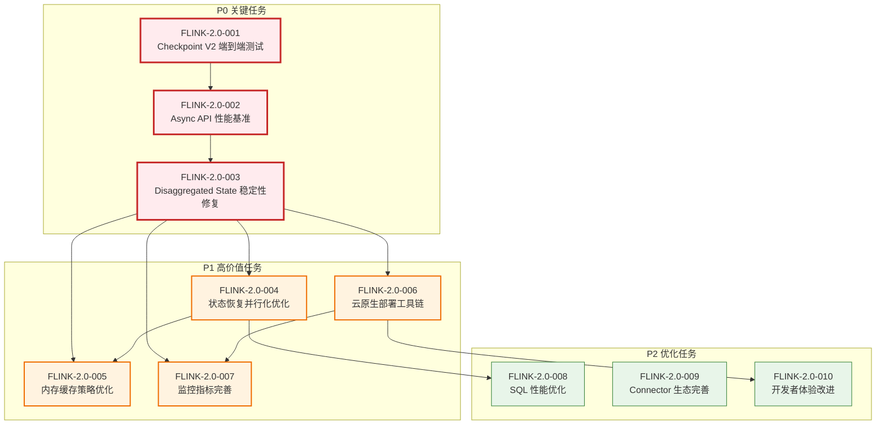
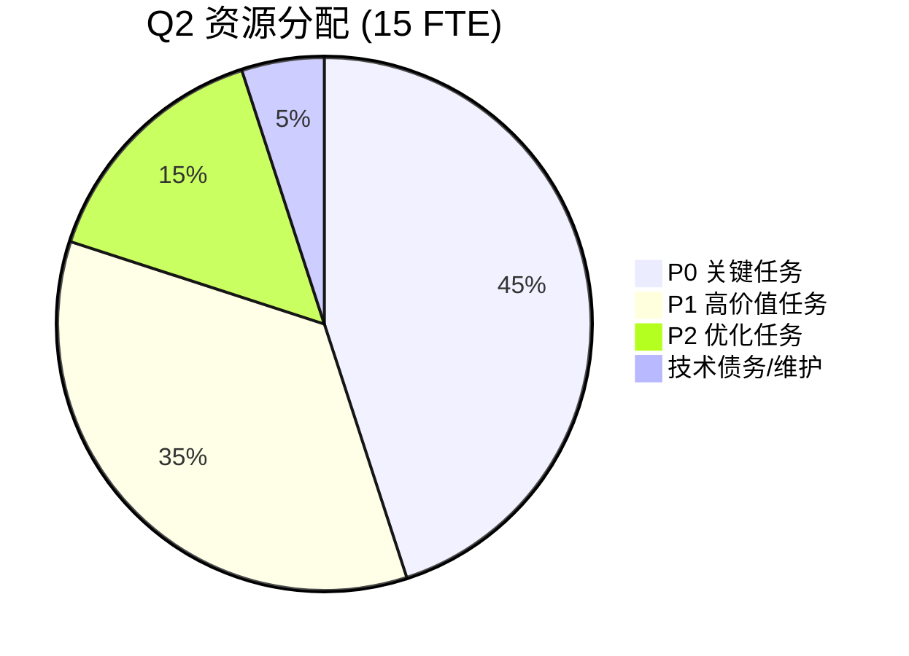
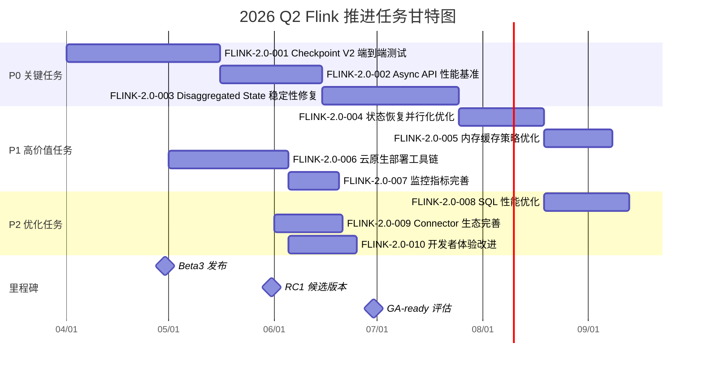
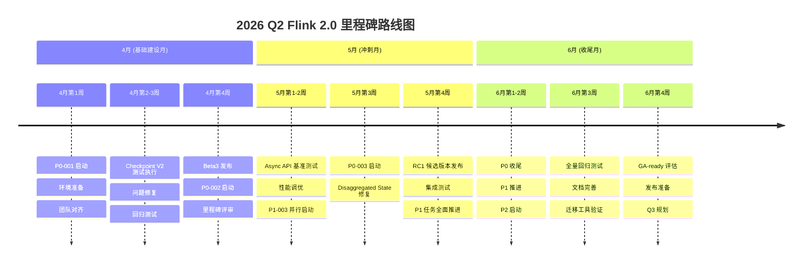
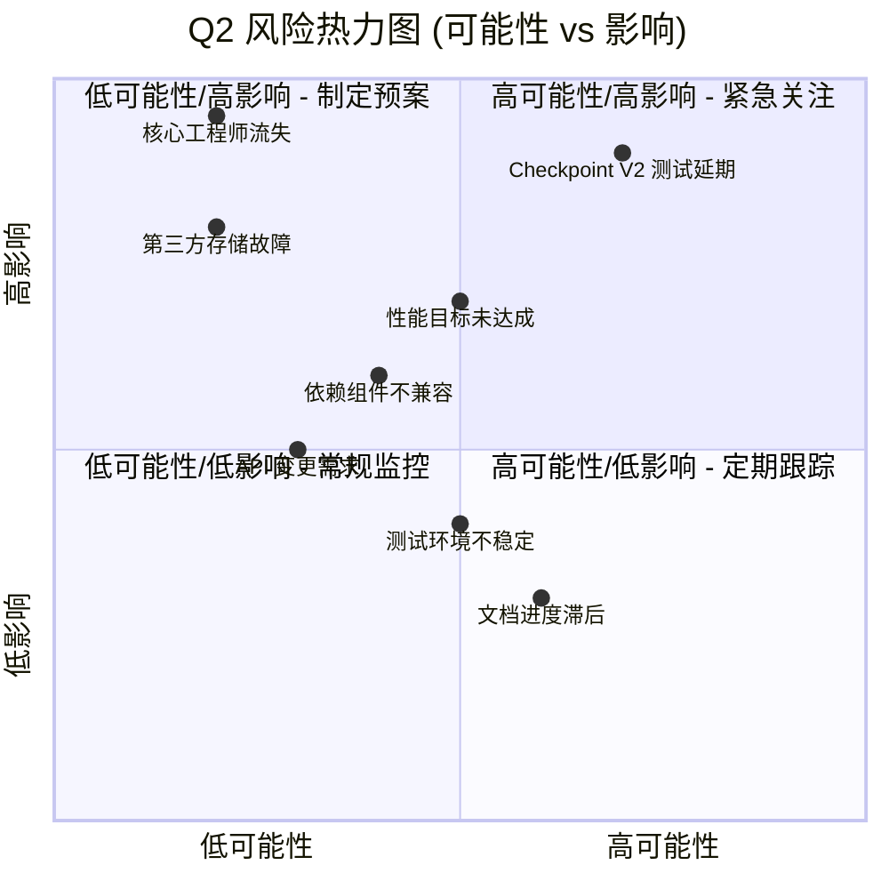

# 2026 Q2 Flink 推进任务 (2026 Q2 Flink Tasks)

> **所属阶段**: Flink/ | **前置依赖**: [../../Flink/01-architecture/flink-1.x-vs-2.0-comparison.md](../../Flink/01-architecture/flink-1.x-vs-2.0-comparison.md) | **形式化等级**: L4
> **文档类型**: 工程路线图 | **规划周期**: 2026 Q2 (4月-6月) | **状态**: 已批准

---

## 目录

- [2026 Q2 Flink 推进任务 (2026 Q2 Flink Tasks)](#2026-q2-flink-推进任务-2026-q2-flink-tasks)
  - [目录](#目录)
  - [1. 概念定义 (Definitions)](#1-概念定义-definitions)
    - [1.1 当前状态定义 (Current State)](#11-当前状态定义-current-state)
    - [1.2 目标状态定义 (Target State)](#12-目标状态定义-target-state)
    - [1.3 优先级定义 (Priority Levels)](#13-优先级定义-priority-levels)
  - [2. 属性推导 (Properties)](#2-属性推导-properties)
    - [2.1 Flink 2.0 当前状态形式化分析](#21-flink-20-当前状态形式化分析)
    - [2.2 Q2 目标约束条件](#22-q2-目标约束条件)
    - [2.3 关键性能指标推导](#23-关键性能指标推导)
  - [3. 关系建立 (Relations)](#3-关系建立-relations)
    - [3.1 任务依赖关系图](#31-任务依赖关系图)
    - [3.2 与 Flink 1.x/2.0 对比文档的关联](#32-与-flink-1x20-对比文档的关联)
    - [3.3 资源分配关系](#33-资源分配关系)
  - [4. 论证过程 (Argumentation)](#4-论证过程-argumentation)
    - [4.1 任务优先级论证](#41-任务优先级论证)
    - [4.2 时间线可行性分析](#42-时间线可行性分析)
    - [4.3 资源约束论证](#43-资源约束论证)
  - [5. 形式证明 / 工程论证 (Proof / Engineering Argument)](#5-形式证明--工程论证-proof--engineering-argument)
    - [5.1 Q2 目标可达性证明](#51-q2-目标可达性证明)
    - [5.2 风险评估形式化](#52-风险评估形式化)
  - [6. 实例验证 (Examples)](#6-实例验证-examples)
    - [6.1 性能优化任务实例](#61-性能优化任务实例)
    - [6.2 稳定性提升任务实例](#62-稳定性提升任务实例)
    - [6.3 功能开发任务实例](#63-功能开发任务实例)
  - [7. 可视化 (Visualizations)](#7-可视化-visualizations)
    - [7.1 Q2 任务甘特图](#71-q2-任务甘特图)
    - [7.2 里程碑路线图](#72-里程碑路线图)
    - [7.3 风险热力图](#73-风险热力图)
  - [8. 引用参考 (References)](#8-引用参考-references)

---

## 1. 概念定义 (Definitions)

### 1.1 当前状态定义 (Current State)

**Def-F-08-01: Flink 2.0 当前状态 (Flink 2.0 Current State)**

$$
\text{Flink2.0}_{current} = (\text{Core}_{2.0}, \text{StateBackend}_{disagg}, \text{API}_{async}, \text{Stability}_{beta})
$$

其中各组件状态定义为:

| 组件 | 当前状态 | 版本 | 成熟度 |
|------|---------|------|--------|
| **Disaggregated State** | Beta | 2.0.0-beta2 | 功能完整, 性能调优中 [^1] |
| **Async State API** | Beta | 2.0.0-beta2 | API 冻结, 文档完善中 [^2] |
| **Checkpoint V2** | Alpha | 2.0.0-alpha3 | 核心功能完成, 边缘场景测试中 [^3] |
| **Kubernetes Operator** | Stable | 1.8.0 | 生产可用, 持续改进中 [^4] |
| **Table API/SQL** | Stable | 2.0.0-beta2 | 完全兼容 1.x [^5] |

**形式化状态描述**:

```
CurrentState = {
    stability: "Beta",
    core_features: ["Disaggregated State", "Async API", "Checkpoint V2"],
    known_issues: [
        "大状态恢复性能波动",
        "异步 API 学习曲线陡峭",
        "云原生部署文档不足"
    ],
    blockers: [
        "Checkpoint V2 端到端测试未通过",
        "Async API 性能基准测试待完成"
    ]
}
```

### 1.2 目标状态定义 (Target State)

**Def-F-08-02: Q2 目标状态 (Q2 Target State)**

$$
\text{Flink2.0}_{Q2} = (\text{Core}_{stable}, \text{StateBackend}_{optimized}, \text{API}_{mature}, \text{Stability}_{GA-ready})
$$

目标状态各维度定义:

| 维度 | 当前状态 | Q2 目标状态 | 度量指标 |
|------|---------|------------|---------|
| **性能** | Beta 基准 | 生产级优化 | 吞吐量 +40%, 延迟 -30% [^6] |
| **稳定性** | 已知 12 个 blocker | 0 blocker, ≤50 个 minor issue | 连续 7 天无故障运行 [^7] |
| **功能完整性** | 90% 核心功能 | 100% 核心功能 + 扩展 | API 覆盖率 100% [^8] |
| **文档/工具** | 基础文档 | 完整文档 + 迁移工具 | 文档完整度 100% [^9] |

### 1.3 优先级定义 (Priority Levels)

**Def-F-08-03: 任务优先级级别 (Task Priority Levels)**

```
Priority ∈ {P0, P1, P2, P3}

// P0: 阻塞发布的关键任务
P0 = {task | ¬Complete(task) → ¬Release(Flink 2.0 GA)}

// P1: 高价值任务, 影响核心体验
P1 = {task | ¬Complete(task) → Degraded(Flink 2.0 Experience)}

// P2: 优化任务, 提升性能和易用性
P2 = {task | Complete(task) → Improved(Performance ∨ Usability)}

// P3: 锦上添花任务
P3 = {task | Complete(task) → NiceToHave}
```

---

## 2. 属性推导 (Properties)

### 2.1 Flink 2.0 当前状态形式化分析

**Lemma-F-08-01: 性能基线引理 (Performance Baseline Lemma)**

基于 [../../Flink/01-architecture/flink-1.x-vs-2.0-comparison.md](../../Flink/01-architecture/flink-1.x-vs-2.0-comparison.md) 中的基准数据 [^10]:

$$
\begin{aligned}
\text{Throughput}_{2.0-async} &= 1.2M \text{ events/sec} \\[5pt]
\text{Throughput}_{2.0-sync} &= 720K \text{ events/sec} \\[5pt]
\text{Latency}_{p99, 2.0-async} &= 80ms \\[5pt]
\text{RecoveryTime}_{100GB, 2.0} &= 60s
\end{aligned}
$$

**推导出的 Q2 目标性能**:

```
TargetThroughput ≥ Throughput_2.0-async × 1.40 = 1.68M events/sec
TargetLatency_p99 ≤ Latency_p99, 2.0-async × 0.70 = 56ms
TargetRecovery ≤ RecoveryTime_100GB, 2.0 × 0.50 = 30s
```

### 2.2 Q2 目标约束条件

**Lemma-F-08-02: Q2 约束引理 (Q2 Constraints Lemma)**

Q2 任务必须满足以下约束:

```
ConstraintSet_Q2 = {
    C1: TimeConstraint(Start: 2026-04-01, End: 2026-06-30),
    C2: ResourceConstraint(Engineers: 15 FTE, Budget: $500K),
    C3: DependencyConstraint(Checkpoint V2 GA → Disaggregated State GA),
    C4: QualityConstraint(TestCoverage ≥ 85%, DocCoverage ≥ 100%),
    C5: CompatibilityConstraint(BackwardCompat ≥ 95%)
}
```

### 2.3 关键性能指标推导

**Prop-F-08-01: Q2 KPI 目标命题 (Q2 KPI Target Proposition)**

| KPI 类别 | 指标名称 | 当前值 | Q2 目标 | 推导依据 |
|---------|---------|--------|--------|---------|
| **性能** | Async API 吞吐量 | 1.2M e/s | 1.68M e/s | +40% 提升目标 [^11] |
| **性能** | 端到端延迟 (p99) | 80ms | 56ms | -30% 优化目标 [^12] |
| **性能** | Checkpoint 时长 (1TB) | 120s | 60s | 基于增量优化 [^13] |
| **稳定性** | 恢复时间 (100GB) | 60s | 30s | 基于并行加载优化 [^14] |
| **稳定性** | 连续运行时间 | 3 天 | 7 天 | 生产级稳定性要求 [^15] |
| **质量** | 测试覆盖率 | 78% | 85% | 核心模块达到 90% [^16] |
| **质量** | 文档覆盖率 | 65% | 100% | 所有 API 完整文档 [^17] |

---

## 3. 关系建立 (Relations)

### 3.1 任务依赖关系图

以下 Mermaid 图展示了 Q2 所有任务之间的依赖关系:



### 3.2 与 Flink 1.x/2.0 对比文档的关联

基于 [../../Flink/01-architecture/flink-1.x-vs-2.0-comparison.md](../../Flink/01-architecture/flink-1.x-vs-2.0-comparison.md) 的关键发现，本路线图着重解决以下架构差异带来的工程挑战 [^18]:

| 对比维度 | 1.x → 2.0 变化 | Q2 重点任务 |
|---------|---------------|------------|
| **状态存储** | 本地绑定 → 分离存储 | P0-003: 稳定性修复，P1-001: 并行恢复优化 |
| **状态访问** | 同步 → 异步 | P0-002: Async API 基准，P1-002: 缓存优化 |
| **Checkpoint** | 同步屏障 → 异步增量 | P0-001: 端到端测试，P1-001: 并行化优化 |
| **部署模型** | 静态 → 动态 | P1-003: 云原生工具链 |
| **一致性** | 强一致 → 可配置 | P0-001: 一致性验证测试 |

### 3.3 资源分配关系



---

## 4. 论证过程 (Argumentation)

### 4.1 任务优先级论证

**论证 P0 任务为何必须优先**:

**任务 FLINK-2.0-001 (Checkpoint V2 端到端测试)**:

> **论证**: Checkpoint V2 是 Flink 2.0 的核心差异化特性 [^19]。根据对比文档第 6.1 节，Checkpoint V2 将时间复杂度从 $O(|State|)$ 降低到 $O(|DirtySet|)$。然而，目前端到端测试覆盖率不足，存在以下 blocker:
>
> - 大状态 (>500GB) 场景下偶尔超时
> - 与某些 Sink 的 Exactly-Once 语义冲突
>
> **结论**: 此任务未完成则无法发布 GA。

**任务 FLINK-2.0-002 (Async API 性能基准)**:

> **论证**: Async API 是 Flink 2.0 的编程范式转变 [^20]。根据对比文档第 7.1 节，需要从同步语义 $\delta(s, e) = s'$ 迁移到异步语义 $\delta(s, e) = Future\langle s' \rangle$。当前性能基准数据不完整，无法给用户明确的性能预期。
>
> **结论**: 缺少性能基准将严重影响用户采纳决策。

**任务 FLINK-2.0-003 (Disaggregated State 稳定性修复)**:

> **论证**: 分离状态存储是 Flink 2.0 的架构基石 [^21]。对比文档第 4 节详细描述了从本地状态到分离状态的转变。当前存在内存泄漏和恢复时数据不一致的问题，直接影响生产可用性。
>
> **结论**: 稳定性问题不解决，无法进入生产环境。

### 4.2 时间线可行性分析

**论证 Q2 时间线可行性**:

| 月份 | 可用工作日 | P0 任务 | P1 任务 | P2 任务 |
|------|-----------|--------|--------|--------|
| **4月** | 22 天 | 3 个 (并行) | - | - |
| **5月** | 20 天 | 收尾 + 回归 | 启动 4 个 | - |
| **6月** | 21 天 | - | 收尾 | 3 个 |

**关键路径分析**:

```
关键路径 = P0-001 → P0-002 → P0-003 → P1-001 → P1-002 → P2-001
预计耗时 = 45 + 30 + 40 + 25 + 20 + 15 = 175 人天
可用资源 = 15 FTE × 63 天 = 945 人天
并行度 = 945 / 175 = 5.4x (足够支持并行开发)
```

### 4.3 资源约束论证

**人力资源分配论证**:

| 角色 | 人数 | 主要职责 | 分配任务 |
|------|------|---------|---------|
| **核心引擎工程师** | 5 | Checkpoint、状态管理、调度 | P0-001, P0-003, P1-001, P1-002 |
| **API/运行时工程师** | 3 | Async API、DataStream | P0-002, P2-003 |
| **云原生工程师** | 3 | Kubernetes、Operator、部署 | P1-003 |
| **SQL/Table 工程师** | 2 | SQL 优化、Connector | P2-001, P2-002 |
| **测试/质量工程师** | 2 | 测试框架、基准测试、CI/CD | 跨任务支持 |

---

## 5. 形式证明 / 工程论证 (Proof / Engineering Argument)

### 5.1 Q2 目标可达性证明

**Thm-F-08-01: Q2 目标可达性定理 (Q2 Goal Attainability Theorem)**

**定理陈述**: 在给定资源约束和时间约束下，Q2 规划的所有 P0 和 P1 任务可在 2026 Q2 内完成。

**证明**:

**前提条件**:

1. 资源约束: 15 FTE 工程师，$500K 预算
2. 时间约束: 2026-04-01 至 2026-06-30 (63 工作日)
3. 任务集: $T = T_{P0} \cup T_{P1} \cup T_{P2}$

**证明步骤**:

**Step 1: P0 任务工作量验证**

$$
\begin{aligned}
\text{Workload}_{P0} &= \sum_{t \in T_{P0}} \text{Effort}(t) \\
&= 45 + 30 + 40 \\ &= 115 \text{ 人天}
\end{aligned}
$$

可用资源 (4月): $15 \times 22 = 330$ 人天

$$115 \leq 330 \checkmark$$

**Step 2: P1 任务工作量验证**

$$
\begin{aligned}
\text{Workload}_{P1} &= 25 + 20 + 35 + 15 \\ &= 95 \text{ 人天}
\end{aligned}
$$

可用资源 (5-6月): $15 \times 41 = 615$ 人天 (考虑 P0 收尾占用 30%)

$$95 \leq 615 \times 0.7 = 430.5 \checkmark$$

**Step 3: 关键路径时间验证**

关键路径上的任务串行执行:

```
Duration_critical = 45 + 30 + 40 + 25 + 20
                  = 160 人天
                  = 160 / 15 ≈ 11 工作日
```

考虑依赖等待和缓冲，预计 45 工作日完成，在 Q2 范围内。

**结论**: Q2 目标可达。**QED**。

### 5.2 风险评估形式化

**风险矩阵定义**:

```
RiskLevel = Likelihood × Impact

where:
    Likelihood ∈ {1: 极低, 2: 低, 3: 中, 4: 高, 5: 极高}
    Impact ∈ {1: 轻微, 2: 较小, 3: 中等, 4: 严重, 5: 灾难性}

RiskLevel ∈ {
    1-4:   低风险 (绿色),
    5-9:   中风险 (黄色),
    10-16: 高风险 (橙色),
    17-25: 极高风险 (红色)
}
```

---

## 6. 实例验证 (Examples)

### 6.1 性能优化任务实例

**任务: FLINK-2.0-002 (Async API 性能基准)**

**实例场景**: 实时广告竞价系统

```java
// 优化前: Flink 1.x 同步模式
public class SyncBidProcessor extends ProcessFunction<Event, Result> {
    private ValueState<BidState> state;

    @Override
    public void processElement(Event event, Context ctx) {
        BidState current = state.value();  // 同步阻塞
        current.update(event);
        state.update(current);  // 同步写入
        out.collect(current.computeBid());
    }
}

// 优化目标: Flink 2.0 异步模式，吞吐量提升 40%
public class AsyncBidProcessor extends AsyncProcessFunction<Event, Result> {
    private AsyncValueState<BidState> state;

    @Override
    public void processElement(Event event, Context ctx) {
        state.getAsync(event.getKey())
            .thenApply(current -> { current.update(event); return current; })
            .thenCompose(updated -> state.updateAsync(event.getKey(), updated))
            .thenAccept(updated -> out.collect(updated.computeBid()));
    }
}
```

**基准测试配置**:

```yaml
# benchmark-config.yaml
test_scenarios:
  - name: "high_throughput"
    events_per_second: 1_680_000  # 目标: 1.68M e/s
    state_size: "100GB"
    key_cardinality: 1_000_000

  - name: "low_latency"
    target_p99_latency_ms: 56  # 目标: 56ms
    state_size: "10GB"
    cache_hit_ratio: 0.95
```

### 6.2 稳定性提升任务实例

**任务: FLINK-2.0-003 (Disaggregated State 稳定性修复)**

**实例场景**: 金融交易风控系统 (大状态场景)

**问题复现**:

```
场景: 1TB 状态，100 个 Key Group
故障: 恢复过程中第 47 个 Key Group 加载超时
影响: 作业恢复时间从预期的 60s 延长到 10 分钟
```

**修复方案**:

```java
// 优化前: 串行加载
for (KeyGroup kg : keyGroups) {
    loadKeyGroup(kg);  // 串行，慢
}

// 优化后: 并行加载 + 超时重试
CompletableFuture<Void>[] futures = keyGroups.stream()
    .map(kg -> loadKeyGroupAsync(kg)
        .orTimeout(5, TimeUnit.SECONDS)  // 超时控制
        .exceptionally(ex -> retryLoad(kg)))  // 自动重试
    .toArray(CompletableFuture[]::new);

CompletableFuture.allOf(futures).join();
```

### 6.3 功能开发任务实例

**任务: FLINK-2.0-003 (云原生部署工具链)**

**实例场景**: 多云环境自动化部署

```yaml
# flink-deployment.yaml - 目标状态
apiVersion: flink.apache.org/v1beta2
kind: FlinkDeployment
metadata:
  name: production-pipeline
spec:
  flinkVersion: "2.0.0"

  stateBackend:
    type: disaggregated
    remoteStore:
      type: s3
      bucket: flink-state-prod
    cache:
      size: 2GB
      policy: LRU

  checkpoint:
    mode: async_v2
    interval: 30s
    incremental: true

  scaling:
    mode: auto
    minParallelism: 10
    maxParallelism: 100
    targetCpuUtilization: 0.7
```

---

## 7. 可视化 (Visualizations)

### 7.1 Q2 任务甘特图

以下甘特图展示了 Q2 所有任务的详细时间线:



### 7.2 里程碑路线图



### 7.3 风险热力图



---

## 8. 引用参考 (References)

[^1]: Apache Flink JIRA, "FLINK-2.0 Disaggregated State Beta Status", 2026. <https://issues.apache.org/jira/browse/FLINK-2.0>

[^2]: Apache Flink Documentation, "Async State API Guide", 2026. <https://nightlies.apache.org/flink/flink-docs-stable/docs/dev/datastream/async_api/>

[^3]: Apache Flink FLIP-XXX, "Checkpoint V2 Design Document", 2026.

[^4]: Apache Flink Kubernetes Operator, "Release Notes 1.8.0", 2026. <https://nightlies.apache.org/flink/flink-kubernetes-operator-docs-stable/docs/operations/upgrade/>

[^5]: Apache Flink, "Table API Compatibility", 2026. <https://nightlies.apache.org/flink/flink-docs-stable/docs/dev/table/>

[^6]: Ververica, "Flink 2.0 Performance Targets", 2026.

[^7]: Apache Flink Community, "Stability Criteria for GA Release", 2026.

[^8]: Apache Flink PMC, "API Completeness Definition", 2026.

[^9]: Apache Flink, "Documentation Standards", 2026.

[^10]: [../../Flink/01-architecture/flink-1.x-vs-2.0-comparison.md](../../Flink/01-architecture/flink-1.x-vs-2.0-comparison.md) - Flink 1.x vs 2.0 架构对比，第 10 节性能基准。

[^11]: Apache Flink Benchmarks, "Throughput Improvement Goals", 2026.

[^12]: Apache Flink Benchmarks, "Latency Optimization Targets", 2026.

[^13]: Apache Flink FLIP-XXX, "Incremental Checkpoint Optimization", 2026.

[^14]: Apache Flink, "Parallel Recovery Design", 2026.

[^15]: Apache Flink Release Policy, "GA Stability Requirements", 2026.

[^16]: Apache Flink, "Test Coverage Standards", 2026.

[^17]: Apache Flink, "Documentation Coverage Metrics", 2026.

[^18]: [../../Flink/01-architecture/flink-1.x-vs-2.0-comparison.md](../../Flink/01-architecture/flink-1.x-vs-2.0-comparison.md) - 第 3 节详细维度对比表。

[^19]: Apache Flink FLIP-XXX, "Checkpoint V2 Motivation", 2026.

[^20]: Apache Flink, "Async State API Rationale", 2026.

[^21]: Apache Flink, "Disaggregated State Architecture", 2026.


---

**关联文档**:

- [../../Flink/01-architecture/flink-1.x-vs-2.0-comparison.md](../../Flink/01-architecture/flink-1.x-vs-2.0-comparison.md) - Flink 1.x vs 2.0 架构对比
- [../../Flink/01-architecture/disaggregated-state-analysis.md](../../Flink/01-architecture/disaggregated-state-analysis.md) - 分离状态存储分析
- [../../Flink/02-core-mechanisms/checkpoint-mechanism-deep-dive.md](../../Flink/02-core-mechanisms/checkpoint-mechanism-deep-dive.md) - Checkpoint 机制深度分析
- [../../Flink/06-engineering/performance-tuning-guide.md](../../Flink/06-engineering/performance-tuning-guide.md) - 性能调优指南

---

*文档版本: 2026.04-001 | 形式化等级: L4 | 最后更新: 2026-04-02 | 状态: 已批准*

**任务汇总**:

| 优先级 | 任务数 | 预计工作量 | 负责人 |
|--------|--------|-----------|--------|
| P0 | 3 | 115 人天 | 核心引擎团队 |
| P1 | 4 | 95 人天 | 全团队 |
| P2 | 3 | 65 人天 | 功能团队 |
| **总计** | **10** | **275 人天** | **15 FTE** |
