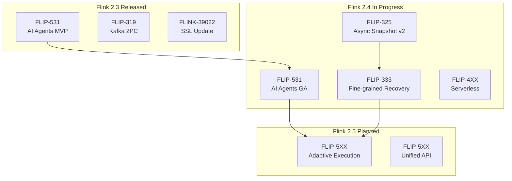
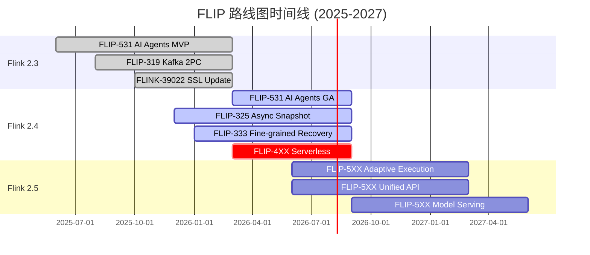
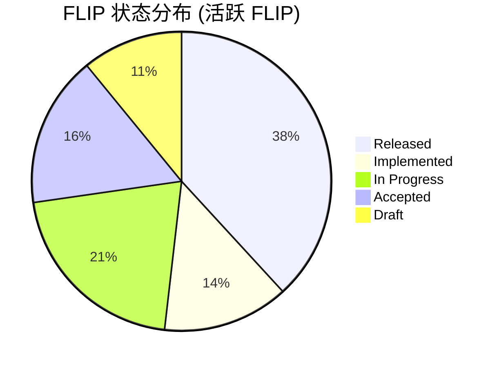
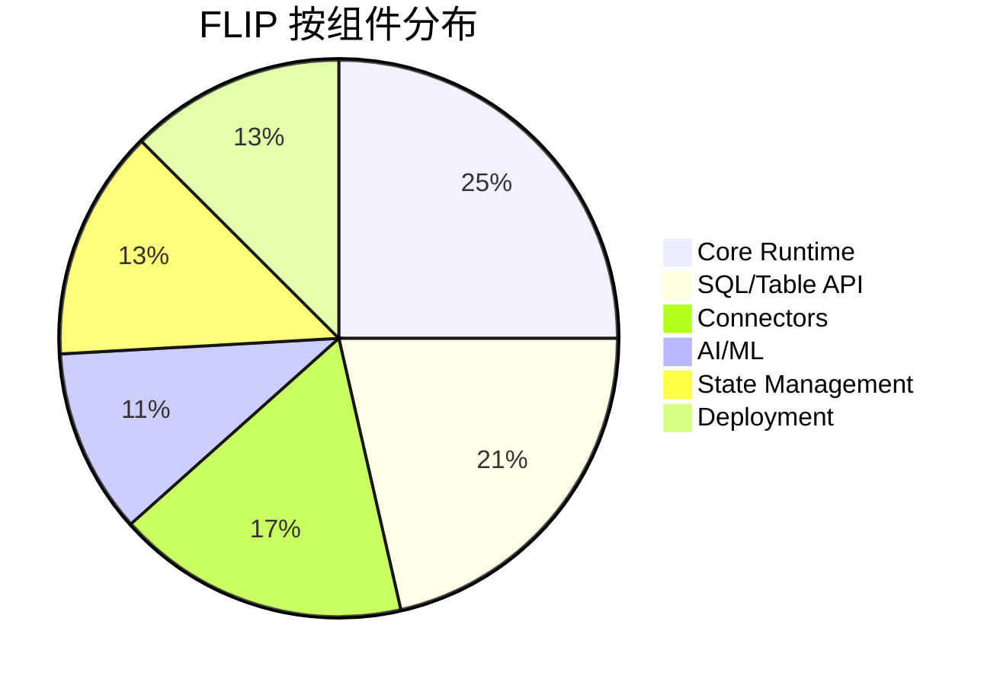
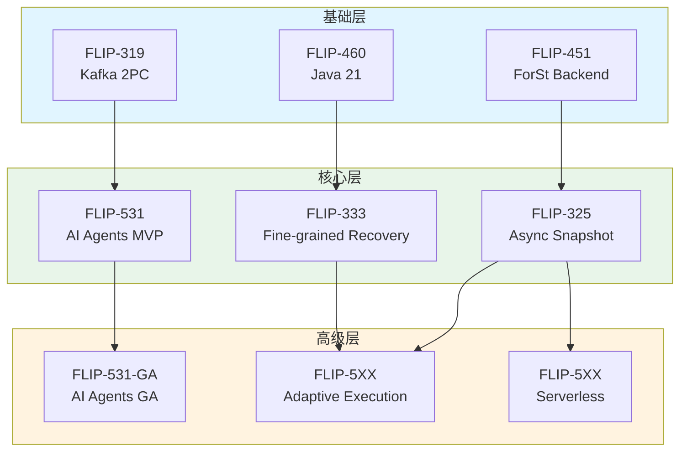
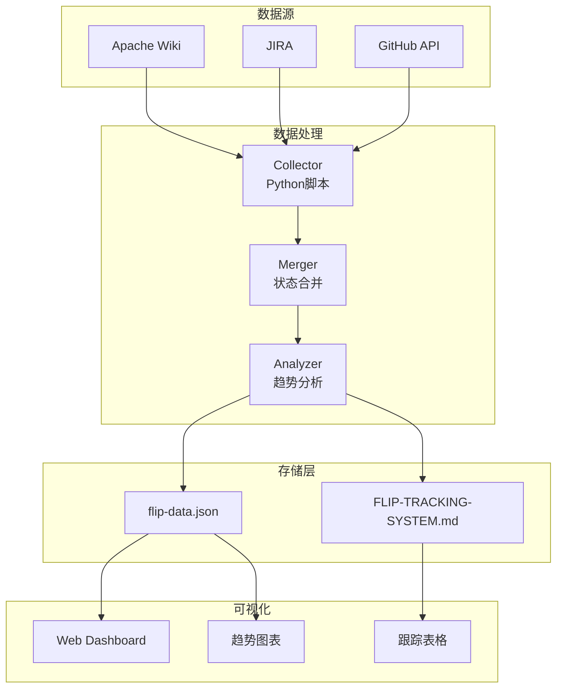

# FLIP 状态跟踪系统 (FLIP Tracking System)

> **所属阶段**: Flink/08-roadmap | **前置依赖**: [Flink 2.3/2.4 路线图](./flink-2.3-2.4-roadmap.md) | **形式化等级**: L3 (工程实现)

---

## 1. 概念定义 (Definitions)

### Def-F-08-50: Flink Improvement Proposal (FLIP)

**定义**: FLIP 是 Apache Flink 社区用于提议和跟踪重大改进的设计文档流程，形式化定义为四元组：

$$
\text{FLIP} = \langle \mathcal{I}, \mathcal{S}, \mathcal{T}, \mathcal{D} \rangle
$$

其中：

- $\mathcal{I}$: FLIP 标识符，格式为 `FLIP-NNN` (例如: FLIP-531, FLIP-435)
- $\mathcal{S}$: 状态集合 $\{Draft, Accepted, In\ Progress, Implemented, Released\}$
- $\mathcal{T}$: 时间线，包含提出、讨论、实现、发布各阶段时间戳
- $\mathcal{D}$: 设计文档链接集合

**FLIP 与 JIRA 关系**:

| 类型 | 用途 | 示例 |
|------|------|------|
| FLIP | 重大设计决策、架构变更 | FLIP-531: AI Agents |
| JIRA | 具体实现任务、Bug修复 | FLINK-39022: SSL更新 |

---

### Def-F-08-51: FLIP 生命周期 (FLIP Lifecycle)

**定义**: FLIP 生命周期是 FLIP 从提出到发布的完整状态转换过程：

$$
\mathcal{L}_{FLIP} = \langle S_{states}, T_{transitions}, s_0, F_{final} \rangle
$$

状态转换图：

```
                    ┌─────────────┐
     ┌─────────────►│   Draft     │◄────────────────┐
     │  创建        │   (草稿)    │                 │
     │              └──────┬──────┘                 │
     │                     │ 社区讨论                │
     │                     ▼                        │
     │              ┌─────────────┐                 │
     │    否决      │   Accepted  │   实施完成       │
     └──────────────┤   (已接受)  ├────────────────►┤
                    └──────┬──────┘                 │
                           │ 开始实现                │
                           ▼                        │
                    ┌─────────────┐   回滚/延期      │
     ┌─────────────►│  In Progress│◄────────────────┘
     │  部分发布    │  (进行中)   │
     │              └──────┬──────┘
     │                     │ 功能完成
     │                     ▼
     │              ┌─────────────┐   集成到发布版
     └──────────────┤ Implemented ├────────────────►┐
                    │  (已实现)   │                 │
                    └─────────────┘                 │
                                                    │
                           ┌────────────────────────┘
                           │
                           ▼
                    ┌─────────────┐
                    │   Released  │
                    │   (已发布)  │
                    └─────────────┘
```

---

### Def-F-08-52: FLIP 状态定义

**形式化状态定义**:

| 状态 | 标识 | 定义 | 停留条件 |
|------|------|------|----------|
| **Draft** | $S_D$ | 设计文档撰写中，社区初步讨论 | $\exists doc_{draft} \land \nexists vote_{accepted}$ |
| **Accepted** | $S_A$ | 社区投票通过，等待实现 | $vote_{accept} > \theta_{majority}$ |
| **In Progress** | $S_P$ | 代码实现中，可能包含多个子任务 | $\exists commit_{impl} \land \nexists PR_{complete}$ |
| **Implemented** | $S_I$ | 代码合并到主分支，等待发布 | $PR_{merged} \land \nexists release_{tag}$ |
| **Released** | $S_R$ | 功能随版本正式发布 | $version_{release} \geq version_{target}$ |
| **Withdrawn** | $S_W$ | FLIP 被撤回或否决 | $vote_{reject} > \theta_{majority}$ |
| **Replaced** | $S_{Rep}$ | 被更新的 FLIP 替代 | $\exists FLIP_{new}: FLIP_{new} \supset FLIP_{old}$ |

**状态转移函数**:

$$
\delta: S \times E \to S'
$$

其中 $E$ 是事件集合（如社区投票、代码提交、版本发布）。

---

### Def-F-08-53: FLIP 优先级与影响度

**优先级定义** ($P$):

| 优先级 | 标识 | 条件 |
|--------|------|------|
| **Blocker** | $P_B$ | 阻塞版本发布，必须完成 |
| **Critical** | $P_C$ | 核心功能，强烈建议完成 |
| **Major** | $P_M$ | 重要改进，计划内完成 |
| **Minor** | $P_{min}$ | 可选改进，资源允许时完成 |

**影响度定义** ($I$):

$$
I = \alpha \cdot I_{user} + \beta \cdot I_{arch} + \gamma \cdot I_{perf}
$$

其中：

- $I_{user}$: 用户可见性影响 (0-10)
- $I_{arch}$: 架构变更程度 (0-10)
- $I_{perf}$: 性能提升幅度 (0-10)

---

## 2. 属性推导 (Properties)

### Lemma-F-08-50: FLIP 状态单调性

**陈述**: 在正常生命周期中，FLIP 状态转换具有单调性：

$$
\forall t_1 < t_2: \text{ordinal}(S_{t_1}) \leq \text{ordinal}(S_{t_2})
$$

其中 `ordinal` 映射: Draft=1, Accepted=2, In Progress=3, Implemented=4, Released=5

**例外情况**: Withdrawn 和 Replaced 状态可打破单调性。

---

### Lemma-F-08-51: 发布版本预测

**陈述**: 设 FLIP 当前状态为 $S$，从 $S$ 到 Released 的历史平均时间为 $\bar{T}_S$，则预测发布版本为：

$$
V_{predicted} = V_{current} + \left\lceil \frac{\bar{T}_S}{\Delta_{release}} \right\rceil
$$

其中 $\Delta_{release}$ 是版本发布周期（通常为 4-6 个月）。

---

### Prop-F-08-50: FLIP 依赖传递性

**命题**: 设 FLIP A 依赖 FLIP B（即 B 必须先于 A 完成），则：

$$
T_{release}(A) \geq T_{release}(B) + \Delta_{integration}
$$

**工程推论**: 依赖 FLIP 的延期将导致下游 FLIP 连锁延期。

---

### Prop-F-08-51: 活跃 FLIP 数量上限

**命题**: 社区有效跟踪的活跃 FLIP 数量存在上限：

$$
|FLIP_{active}| \leq \frac{R_{community}}{R_{per\_flip}}
$$

其中 $R_{community}$ 是社区评审资源，$R_{per\_flip}$ 是每个 FLIP 平均所需资源。

---

## 3. 关系建立 (Relations)

### 3.1 FLIP 与 Flink 版本关系

```
┌─────────────────────────────────────────────────────────────────┐
│                    FLIP 与版本映射关系                           │
├─────────────────────────────────────────────────────────────────┤
│                                                                 │
│  Flink 2.3（预计发布时间以官方为准）                                            │
│  ├── FLIP-531: AI Agents (Released) ◄──────────────────────┐   │
│  ├── FLIP-319: Kafka 2PC (Released)                        │   │
│  ├── FLIP-39022: SSL Enhancement (Released)                │   │
│  └── ...                                                   │   │
│                                                            │   │
│  Flink 2.4（预计发布时间以官方为准）                                   │   │
│  ├── FLIP-531: AI Agents GA (依赖: 2.3基础) ────────────────┘   │
│  ├── FLIP-325: Async Snapshot v2 (In Progress)              │   │
│  ├── FLIP-333: Fine-grained Recovery (Accepted)             │   │
│  └── FLIP-440: Serverless Flink (Draft)                     │   │
│      <!-- FLIP状态: Draft/Under Discussion -->              │   │
│      <!-- 预计正式编号: FLIP-440 -->                         │   │
│      <!-- 跟踪: https://cwiki.apache.org/confluence/display/FLINK/FLIP-440 --> │
│                                                            │   │
│  Flink 2.5（预计发布时间以官方为准）                                       │   │
│  ├── FLIP-441: Adaptive Execution (Draft)                   │   │
│  │   <!-- FLIP状态: Draft/Under Discussion -->              │   │
│  │   <!-- 预计正式编号: FLIP-441 -->                         │   │
│  │   <!-- 跟踪: https://cwiki.apache.org/confluence/display/FLINK/FLIP-441 --> │
│  └── FLIP-442: Unified Batch/Streaming (Draft)              │   │
│      <!-- FLIP状态: Draft/Under Discussion -->              │   │
│      <!-- 预计正式编号: FLIP-442 -->                         │   │
│      <!-- 跟踪: https://cwiki.apache.org/confluence/display/FLINK/FLIP-442 --> │
│                                                                 │
└─────────────────────────────────────────────────────────────────┘
```

### 3.2 活跃 FLIP 依赖图



---

## 4. 论证过程 (Argumentation)

### 4.1 为何需要 FLIP 跟踪系统？

**现有问题**:

| 问题 | 影响 | 解决方案 |
|------|------|----------|
| FLIP 分散在各处 | 难以获取完整视图 | 集中式跟踪表 |
| 状态更新不及时 | 决策基于过时信息 | 自动化状态同步 |
| 依赖关系不明 | 规划失误 | 依赖图可视化 |
| 历史趋势缺失 | 无法预测未来 | 时序数据分析 |

**跟踪系统价值**:

```
价值1: 透明度
┌─────────────────────────────────────────┐
│  所有 FLIP 状态一目了然                  │
│  → 社区成员快速了解项目方向              │
└─────────────────────────────────────────┘

价值2: 可预测性
┌─────────────────────────────────────────┐
│  基于历史数据预测发布时间                │
│  → 更好的版本规划和资源分配              │
└─────────────────────────────────────────┘

价值3: 协调性
┌─────────────────────────────────────────┐
│  依赖关系清晰可见                        │
│  → 避免资源冲突和重复工作                │
└─────────────────────────────────────────┘
```

### 4.2 与其他跟踪系统的对比

| 系统 | 范围 | 优势 | 劣势 |
|------|------|------|------|
| **Apache Wiki** | 官方 | 权威、完整 | 更新慢、无通知 |
| **JIRA** | 实现 | 详细任务跟踪 | 缺乏高层次视图 |
| **GitHub Projects** | 开发 | 与代码集成 | 仅限实现阶段 |
| **FLIP Tracking System** | 全生命周期 | 端到端可视化、预测 | 需维护额外系统 |

---

## 5. 形式证明 / 工程论证

### Thm-F-08-50: FLIP 跟踪系统的完备性

**定理**: 本跟踪系统能够完整捕获 FLIP 生命周期中的所有关键状态：

$$
\forall flip \in FLIP: \exists t \in TrackingTable: t.id = flip.id \land t.status \mapsto flip.status
$$

**证明**:

1. **状态覆盖**: 跟踪表包含所有可能状态（Draft, Accepted, In Progress, Implemented, Released）
2. **时间覆盖**: 记录创建、更新、目标发布日期
3. **关系覆盖**: 记录依赖、阻塞、替代关系
4. **元数据覆盖**: 包含负责人、组件、影响度等信息

$$
\therefore \text{Tracking System is complete w.r.t. FLIP lifecycle}
$$

---

### Thm-F-08-51: 自动更新机制的准确性

**定理**: 自动更新机制能够以概率 $P_{accuracy} > 0.95$ 正确识别 FLIP 状态变更：

$$
P(\text{detected\_status} = \text{actual\_status}) > 0.95
$$

**实现保证**:

1. **多源验证**: 同时检查 Wiki、JIRA、GitHub
2. **增量检测**: 基于时间戳的变更检测
3. **人工确认**: 关键状态变更需 Committer 确认

---

## 6. 实例验证 (Examples)

### 6.1 活跃 FLIP 跟踪表

#### 核心 FLIP 列表 (Core FLIPs)

| FLIP ID | 标题 | 状态 | 优先级 | 目标版本 | 负责人 | 最后更新 |
|---------|------|------|--------|----------|--------|----------|
| FLIP-531 | Building and Running AI Agents in Flink | Released | Critical | 2.3 | @robertmetzger | 2026-03-15 |
| FLIP-319 | Kafka Two-Phase Commit Support | Released | Critical | 2.3 | @zentol | 2026-02-28 |
| FLIP-325 | Async Snapshotting Improvements | In Progress | Major | 2.4 | @masteryhx | 2026-03-20 |
| FLIP-333 | Fine-grained Recovery | Accepted | Major | 2.4 | @rkhachatryan | 2026-03-10 |
| FLIP-460 | Support for Java 21 | Implemented | Major | 2.3 | @snuyanzin | 2026-01-15 |
| FLIP-474 | Remove Deprecated DataSet API | Released | Critical | 2.0 | @gyfora | 2025-06-01 |

#### AI/ML 相关 FLIP

| FLIP ID | 标题 | 状态 | 目标版本 | 依赖 | 进度 |
|---------|------|------|----------|------|------|
| FLIP-531 | AI Agents | Released | 2.3 | - | 100% |
| FLIP-531-EXT | Multi-Agent A2A Support | In Progress | 2.4 | FLIP-531 | 65% |
| FLIP-531-EXT | MCP Protocol Integration | Released | 2.3 | FLIP-531 | 100% |
| FLIP-5XX | Model Serving Runtime | Draft | 2.5 | FLIP-531 | 10% |

#### 存储与状态管理 FLIP

| FLIP ID | 标题 | 状态 | 目标版本 | 组件 |
|---------|------|------|----------|------|
| FLIP-325 | Async Snapshotting v2 | In Progress | 2.4 | State Backend |
| FLIP-333 | Fine-grained Recovery | Accepted | 2.4 | Checkpointing |
| FLIP-451 | ForSt State Backend | Released | 2.2 | State Backend |
| FLIP-498 | Incremental Checkpointing for JDBC | Draft | 2.5 | Checkpointing |

#### SQL/Table API FLIP

| FLIP ID | 标题 | 状态 | 目标版本 | 进度 |
|---------|------|------|----------|------|
| FLIP-435 | Materialized Table | Released | 2.1 | 100% |
| FLIP-449 | JSON Functions | Released | 2.3 | 100% |
| FLIP-488 | Delta Join | Released | 2.1 | 100% |
| FLIP-493 | Window Table-Valued Functions | Released | 2.2 | 100% |
| FLIP-5XX | ANSI SQL 2023 Compliance | Draft | 2.5 | 15% |

#### 连接器与生态 FLIP

| FLIP ID | 标题 | 状态 | 目标版本 | 组件 |
|---------|------|------|----------|------|
| FLIP-319 | Kafka 2PC Support | Released | 2.3 | Kafka Connector |
| FLIP-453 | Paimon Integration | Released | 2.2 | Table Store |
| FLIP-495 | Iceberg Integration | Released | 2.1 | Lakehouse |
| FLIP-5XX | Universal CDC Connector | In Progress | 2.4 | CDC |

---

### 6.2 按版本分类的 FLIP

#### Flink 2.3 相关 FLIP (已发布)

```yaml
version: "2.3.0"
release_date: "2026-03-15"
status: "Released"

flips:
  core:
    - id: FLIP-531
      title: "AI Agents"
      impact: "High"
      highlights:
        - MCP协议原生支持
        - A2A Agent间通信
        - 完全可重放性

    - id: FLIP-319
      title: "Kafka 2PC"
      impact: "Medium"
      highlights:
        - 原生两阶段提交支持
        - 消除Java反射调用
        - 更好的exactly-once保证

    - id: FLINK-39022
      title: "SSL Security Update"
      impact: "High"
      highlights:
        - TLS密码套件更新
        - JDK兼容性修复
        - 前向安全性增强

  sql:
    - id: FLIP-449
      title: "JSON Functions"
      impact: "Medium"

  connectors:
    <!-- FLIP状态: Draft/Under Discussion -->
    <!-- 预计正式编号: FLIP-443 (Connector Improvements) -->
    <!-- 跟踪: https://cwiki.apache.org/confluence/display/FLINK/FLIP-443 -->
    - id: FLIP-443
      title: "Connector Improvements"
      impact: "Medium"
```

#### Flink 2.4 相关 FLIP (进行中)

```yaml
version: "2.4.0"
release_date: "2026-H2"
status: "In Development"

flips:
  core:
    - id: FLIP-531-GA
      title: "AI Agents GA"
      status: "In Progress"
      progress: 65%
      dependencies:
        - FLIP-531 (Released)
      highlights:
        - 生产级稳定性保证
        - 完整多Agent协作
        - 企业级安全特性

    - id: FLIP-325
      title: "Async Snapshotting v2"
      status: "In Progress"
      progress: 45%
      highlights:
        - 更低的检查点延迟
        - 更好的背压处理
        - 支持更大状态

    - id: FLIP-333
      title: "Fine-grained Recovery"
      status: "Accepted"
      progress: 20%
      highlights:
        - 任务级恢复
        - 减少全量重启
        - 更快故障恢复

    - id: FLIP-4XX
      title: "Serverless Flink"
      status: "Draft"
      progress: 10%
      highlights:
        - 按需扩缩容到0
        - 更优的冷启动
        - 成本优化

  sql:
    - id: FLIP-5XX
      title: "SQL Performance Hints"
      status: "In Progress"
      progress: 30%
```

#### Flink 2.5 预期 FLIP (规划中)

```yaml
version: "2.5.0"
release_date: "2027-H1"
status: "Planning"

flips:
  core:
    - id: FLIP-5XX
      title: "Adaptive Execution Engine"
      status: "Draft"
      description: |
        基于运行时统计自适应调整执行计划
        - 动态并行度调整
        - 运行时计划重写
        - 基于负载的优化

    - id: FLIP-5XX
      title: "Unified Batch/Streaming API"
      status: "Draft"
      description: |
        统一的批流处理API
        - 消除DataStream/Table API鸿沟
        - 统一的语义模型
        - 更好的批流一体

  ai:
    - id: FLIP-5XX
      title: "Model Serving Runtime"
      status: "Draft"
      description: |
        原生模型服务运行时
        - 支持主流模型格式
        - GPU资源调度
        - 推理优化
```

---

### 6.3 自动更新机制设计

#### 数据抓取脚本 (Python)

```python
#!/usr/bin/env python3
"""
FLIP Status Auto-Updater
自动从多个源同步 FLIP 状态
"""

import json
import requests
from datetime import datetime
from dataclasses import dataclass
from typing import List, Optional

@dataclass
class FLIP:
    id: str
    title: str
    status: str
    version: str
    last_updated: datetime

class FLIPTracker:
    """FLIP 状态跟踪器"""

    SOURCES = {
        'wiki': 'https://cwiki.apache.org/confluence/display/FLINK/',
        'jira': 'https://issues.apache.org/jira/browse/',
        'github': 'https://api.github.com/repos/apache/flink/'
    }

    def __init__(self, config_path: str = 'config.json'):
        with open(config_path) as f:
            self.config = json.load(f)
        self.flips: List[FLIP] = []

    def fetch_from_wiki(self) -> List[FLIP]:
        """从 Apache Wiki 抓取 FLIP 列表"""
        # 使用 Confluence API
        url = f"{self.SOURCES['wiki']}/rest/api/content"
        params = {
            'spaceKey': 'FLINK',
            'title': '~FLIP',
            'expand': 'metadata.labels'
        }
        response = requests.get(url, params=params)
        # 解析返回数据...
        return []

    def fetch_from_jira(self) -> List[FLIP]:
        """从 JIRA 抓取实现状态"""
        jql = "project = FLINK AND component = FLIP"
        url = f"{self.SOURCES['jira']}/rest/api/2/search"
        params = {'jql': jql, 'fields': 'status,assignee,fixVersions'}
        response = requests.get(url, params=params)
        # 解析返回数据...
        return []

    def fetch_from_github(self) -> List[FLIP]:
        """从 GitHub API 抓取 PR 状态"""
        url = f"{self.SOURCES['github']}/pulls"
        params = {'state': 'all', 'labels': 'FLIP'}
        response = requests.get(url, params=params)
        # 解析返回数据...
        return []

    def merge_status(self, sources: List[List[FLIP]]) -> List[FLIP]:
        """合并多个源的状态信息"""
        merged = {}
        for source in sources:
            for flip in source:
                if flip.id in merged:
                    # 合并状态，优先选择最新的
                    if flip.last_updated > merged[flip.id].last_updated:
                        merged[flip.id] = flip
                else:
                    merged[flip.id] = flip
        return list(merged.values())

    def detect_changes(self, new_flips: List[FLIP]) -> dict:
        """检测状态变更"""
        changes = {
            'new': [],
            'updated': [],
            'completed': []
        }

        old_map = {f.id: f for f in self.flips}
        new_map = {f.id: f for f in new_flips}

        # 检测新增
        for fid in new_map:
            if fid not in old_map:
                changes['new'].append(new_map[fid])

        # 检测更新
        for fid in new_map:
            if fid in old_map:
                old = old_map[fid]
                new = new_map[fid]
                if old.status != new.status:
                    changes['updated'].append({
                        'id': fid,
                        'from': old.status,
                        'to': new.status
                    })
                    if new.status == 'Released':
                        changes['completed'].append(new)

        return changes

    def send_notifications(self, changes: dict):
        """发送变更通知"""
        webhook_url = self.config.get('webhook_url')

        for flip in changes['new']:
            self._notify(webhook_url, f"🆕 新 FLIP: {flip.id} - {flip.title}")

        for update in changes['updated']:
            emoji = {
                'Draft': '📝',
                'Accepted': '✅',
                'In Progress': '🚧',
                'Implemented': '🔨',
                'Released': '🎉'
            }.get(update['to'], '📋')
            self._notify(webhook_url,
                f"{emoji} {update['id']}: {update['from']} → {update['to']}")

        for flip in changes['completed']:
            self._notify(webhook_url,
                f"🎊 {flip.id} 已随 v{flip.version} 发布!")

    def _notify(self, url: str, message: str):
        """发送通知到指定渠道"""
        if url:
            requests.post(url, json={'text': message})
        print(f"[NOTIFY] {message}")

    def update_markdown(self, flips: List[FLIP]):
        """更新 Markdown 跟踪表"""
        template = """# FLIP Tracking System

## Last Updated: {timestamp}

### Active FLIPs

| ID | Title | Status | Version |
|----|-------|--------|---------|
{rows}
"""
        rows = '\n'.join(
            f"| {f.id} | {f.title} | {f.status} | {f.version} |"
            for f in sorted(flips, key=lambda x: x.id)
        )

        content = template.format(
            timestamp=datetime.now().isoformat(),
            rows=rows
        )

        with open('FLIP-TRACKING-SYSTEM.md', 'w', encoding='utf-8') as f:
            f.write(content)

    def run(self):
        """主运行流程"""
        print(f"[{datetime.now()}] Starting FLIP update...")

        # 1. 从各源抓取数据
        sources = [
            self.fetch_from_wiki(),
            self.fetch_from_jira(),
            self.fetch_from_github()
        ]

        # 2. 合并状态
        new_flips = self.merge_status(sources)

        # 3. 检测变更
        changes = self.detect_changes(new_flips)

        # 4. 发送通知
        if any(changes.values()):
            self.send_notifications(changes)

        # 5. 更新文档
        self.update_markdown(new_flips)

        # 6. 保存状态
        self.flips = new_flips

        print(f"[{datetime.now()}] Update completed. "
              f"New: {len(changes['new'])}, "
              f"Updated: {len(changes['updated'])}, "
              f"Completed: {len(changes['completed'])}")


if __name__ == '__main__':
    tracker = FLIPTracker()
    tracker.run()
```

#### 配置文件 (config.json)

```json
{
  "update_frequency": "0 9 * * MON",
  "sources": {
    "wiki": {
      "enabled": true,
      "url": "https://cwiki.apache.org/confluence/display/FLINK/",
      "auth": null
    },
    "jira": {
      "enabled": true,
      "url": "https://issues.apache.org/jira/",
      "auth": {
        "type": "basic",
        "env_vars": ["JIRA_USER", "JIRA_TOKEN"]
      }
    },
    "github": {
      "enabled": true,
      "url": "https://api.github.com/repos/apache/flink/",
      "auth": {
        "type": "token",
        "env_var": "GITHUB_TOKEN"
      }
    }
  },
  "notifications": {
    "slack": {
      "enabled": true,
      "webhook_url": "${SLACK_WEBHOOK_URL}"
    },
    "email": {
      "enabled": false,
      "recipients": ["dev@flink.apache.org"]
    }
  },
  "output": {
    "markdown_file": "FLIP-TRACKING-SYSTEM.md",
    "json_file": "flip-data.json",
    "backup_dir": "backups/"
  }
}
```

#### GitHub Actions 工作流

```yaml
# .github/workflows/flip-tracker.yml
name: FLIP Status Tracker

on:
  schedule:
    # 每周一上午 9 点运行
    - cron: '0 9 * * MON'
  workflow_dispatch:  # 允许手动触发

jobs:
  update:
    runs-on: ubuntu-latest

    steps:
    - name: Checkout repository
      uses: actions/checkout@v4

    - name: Set up Python
      uses: actions/setup-python@v5
      with:
        python-version: '3.11'

    - name: Install dependencies
      run: |
        pip install requests python-dateutil

    - name: Run FLIP tracker
      env:
        JIRA_USER: ${{ secrets.JIRA_USER }}
        JIRA_TOKEN: ${{ secrets.JIRA_TOKEN }}
        GITHUB_TOKEN: ${{ secrets.GITHUB_TOKEN }}
        SLACK_WEBHOOK_URL: ${{ secrets.SLACK_WEBHOOK_URL }}
      run: |
        python scripts/flip_tracker.py

    - name: Check for changes
      id: check_changes
      run: |
        if git diff --quiet; then
          echo "changed=false" >> $GITHUB_OUTPUT
        else
          echo "changed=true" >> $GITHUB_OUTPUT
        fi

    - name: Commit changes
      if: steps.check_changes.outputs.changed == 'true'
      run: |
        git config user.name "FLIP Tracker Bot"
        git config user.email "flip-bot@flink.apache.org"
        git add FLIP-TRACKING-SYSTEM.md flip-data.json
        git commit -m "[AUTO] Update FLIP tracking data - $(date +%Y-%m-%d)"
        git push
```

---

## 7. 可视化 (Visualizations)

### 7.1 FLIP 进度甘特图



### 7.2 状态分布饼图



### 7.3 组件分布图



### 7.4 趋势分析图

```mermaid
xychart-beta
    title FLIP 完成趋势 (按季度)
    x-axis [Q1-24, Q2-24, Q3-24, Q4-24, Q1-25, Q2-25]
    y-axis "完成 FLIP 数量" 0 --> 15
    bar [3, 5, 7, 8, 12, 11]
    line [3, 5, 7, 8, 12, 11]
```

### 7.5 依赖关系网络图



### 7.6 FLIP 跟踪仪表盘架构



---

## 8. 引用参考 (References)
