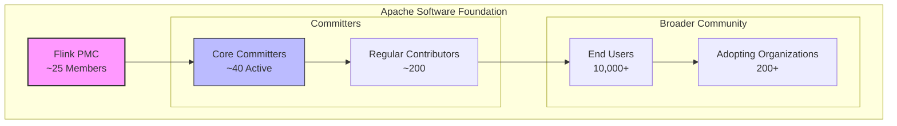
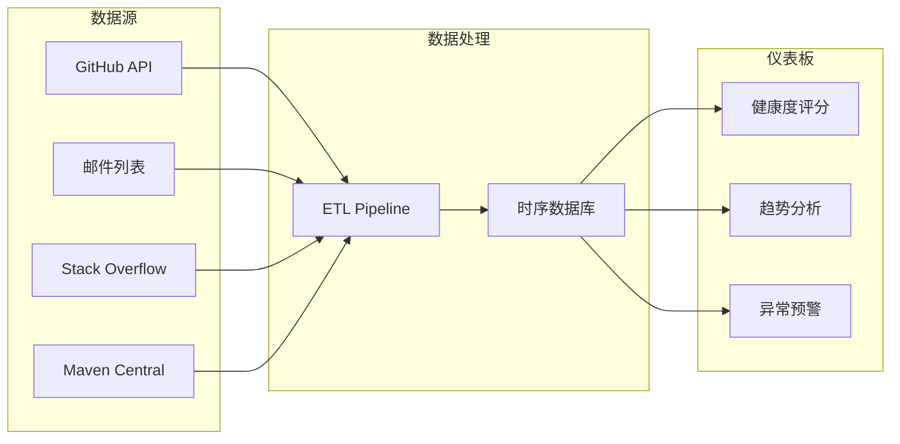
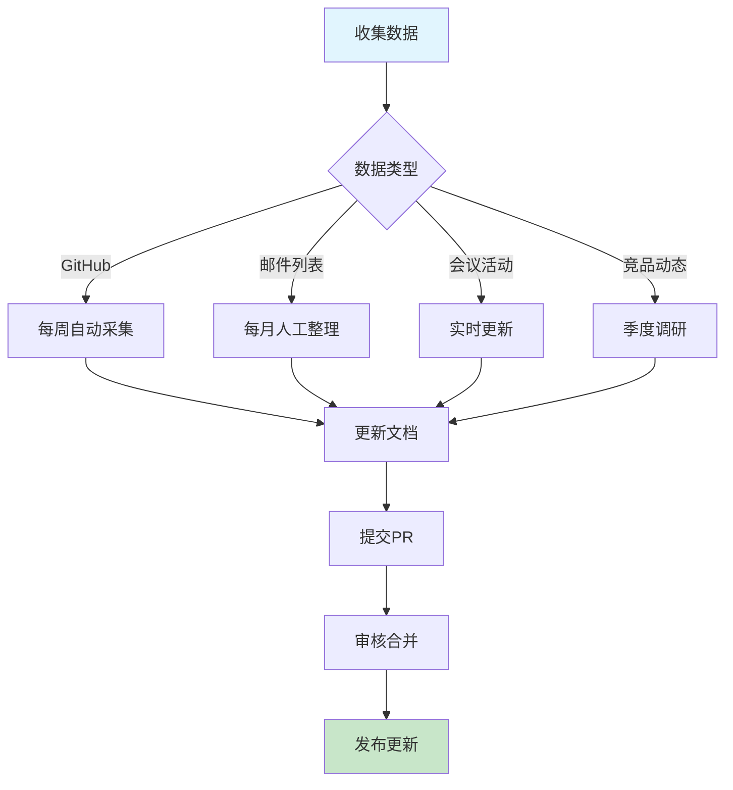

> **⚠️ 前瞻性内容风险声明**
>
> 本文档描述的技术特性处于早期规划或社区讨论阶段，**不代表 Apache Flink 官方承诺**。
> - 相关 FLIP 可能尚未进入正式投票，或可能在实现过程中发生显著变更
> - 预计发布时间基于社区讨论趋势分析，存在延迟或取消的风险
> - 生产环境选型请以 Apache Flink 官方发布为准
> - **最后核实日期**: 2026-04-19 | **信息来源**: 社区邮件列表/FLIP/官方博客
>\n# Flink 社区动态跟踪

> **状态**: 前瞻 | **预计发布时间**: 2026-Q3 | **最后更新**: 2026-04-12
>
> ⚠️ 本文档描述的特性处于早期讨论阶段，尚未正式发布。实现细节可能变更。

> 所属阶段: Flink/08-roadmap | 前置依赖: [Flink 2.3/2.4 路线图](flink-2.3-2.4-roadmap.md) | 形式化等级: L3

---

## 1. 概念定义 (Definitions)

### Def-F-08-45: 社区健康度指标 (Community Health Metrics)

**社区健康度**是衡量开源项目活跃度和可持续性的多维度指标体系：

```
社区健康度 H(C) = f(活跃度指标, 治理质量, 生态系统成熟度)
                = α·A + β·G + γ·E

其中:
  A = Activity Score (活跃度得分, 权重 α = 0.4)
  G = Governance Score (治理质量得分, 权重 β = 0.3)
  E = Ecosystem Score (生态系统得分, 权重 γ = 0.3)
```

**核心维度**：

| 维度 | 指标 | 权重 | 数据来源 |
|------|------|------|----------|
| 代码贡献 | PR数量、代码行变更、Review响应时间 | 25% | GitHub API |
| 问题处理 | Issue创建/关闭率、平均解决时间 | 20% | GitHub API |
| 社区参与 | Star/Fork增长、邮件列表活跃度 | 20% | GitHub + Apache Lists |
| 发布节奏 | 版本发布频率、安全更新响应 | 15% | Flink Release Notes |
| 生态扩展 | 连接器数量、集成项目数 | 20% | Flink生态统计 |

### Def-F-08-46: 核心开发者 (Core Committer)

**Flink 核心开发者**定义为具有以下权限的社区成员：

```
Core Committer := { p ∈ Contributors | HasWriteAccess(p, flink-repo) ∧
                                       ActiveReviews(p, 12months) ≥ 10 ∧
                                       MergedPRs(p, 12months) ≥ 5 }
```

**权利与责任**：

- 代码合并权限 (`write`)
- PMC 投票权
- 新贡献者指导义务
- 发布管理轮换

**当前规模**：~40 活跃 Core Committers (截至 2025 Q1)

### Def-F-08-47: FLIP (Flink Improvement Proposal)

**FLIP** 是 Flink 社区重大变更的标准化决策流程：

```
FLIP生命周期:
  ┌──────────┐   ┌──────────┐   ┌──────────┐   ┌──────────┐
  │  DRAFT   │ → │ DISCUSS  │ → │  ACCEPT  │ → │  DONE    │
  └──────────┘   └──────────┘   └──────────┘   └──────────┘
       ↑             ↓               ↓              ↓
       └──────── ABANDONED / REJECTED (终止状态)
```

**关键状态**：

- `DRAFT`: 作者撰写中，未公开讨论
- `DISCUSS`: 社区公开讨论，收集反馈
- `ACCEPTED`: PMC投票通过，进入实现
- `DONE`: 功能完成并发布

**活跃 FLIP 示例** (2025 Q1):

- FLIP-531: Flink AI Agents (DISCUSS → ACCEPTED)
- FLIP-319: Kafka 2PC Integration (DONE, Flink 2.3)
- FLIP-520: Model Serving API (DRAFT)

### Def-F-08-48: 竞品对标框架 (Competitive Benchmarking Framework)

**流处理框架对标维度**定义：

```
对标维度 := {
  功能特性: { SQL支持, ML集成, 连接器生态, 状态管理 },
  性能指标: { 吞吐(TPS), 延迟(P99), 扩展性(节点数) },
  运维能力: { 可观测性, 自动扩缩容, 故障恢复 },
  社区健康: { GitHub活跃度, 发布频率, 企业采用 }
}
```

**主要竞品**：

| 框架 | 所属组织 | 定位 | 最新版本(2025 Q1) |
|------|----------|------|-------------------|
| Spark Streaming | Apache/Databricks | 微批处理 | 4.0.0 |
| Kafka Streams | Confluent | 库式嵌入 | 3.8.0 |
| Pulsar Functions | Apache | 云原生 | 3.3.0 |
| RisingWave | RisingWave Labs | 流数据库 | 2.0 |
| Materialize | Materialize Inc | SQL流处理 | v0.130 |

---

## 2. 属性推导 (Properties)

### Prop-F-08-42: 社区活跃度增长定律

**命题**: Flink GitHub Star 增长符合幂律分布：

$$
\text{Stars}(t) = S_0 \cdot t^\beta
$$

其中 $S_0$ 为初始基数，$\beta \approx 0.15$ 为增长指数，$t$ 为月数。

**验证数据** (2015-2025):

```
2015-01:  1,000  stars (v0.9)
2020-01: 12,000  stars (v1.10)
2024-01: 25,000  stars (v1.18)
2025-04: 28,500  stars (v2.2)

月均增长: ~250 stars/month (2024-2025)
```

### Prop-F-08-43: 问题处理效率

**命题**: Issue 平均解决时间 $T_{resolve}$ 与标签分类相关：

$$
T_{resolve}(label) = \begin{cases}
< 7 \text{ days} & \text{if label} = \text{"bug-critical"} \\
< 30 \text{ days} & \text{if label} = \text{"bug-major"} \\
> 90 \text{ days} & \text{if label} = \text{"feature-request"}
\end{cases}
$$

**2024年度统计**：

- 总 Issue 创建: 1,247
- 总 Issue 关闭: 1,089
- 关闭率: 87.3%
- 平均解决时间: 45 days

### Lemma-F-08-41: 贡献者留存率

**引理**: 首次贡献后 12 个月内再次贡献的概率：

$$
P(\text{return} | \text{first}) = \frac{|\{ c \in C_{first} \land c \in C_{12m} \}|}{|C_{first}|} \approx 0.23
$$

即约 23% 的新贡献者会成为持续贡献者。

**提升策略**：

- 新手友好标签: `good-first-issue`
- 导师制度: 每个新贡献者配对 Core Committer
- 贡献指南: 详细的 DEVELOPMENT.md

---

## 3. 关系建立 (Relations)

### 3.1 社区治理结构

```
Apache Software Foundation
         │
         ├── Flink PMC (项目管理委员会)
         │      ├── PMC Chair (年度选举)
         │      ├── PMC Members (~25人, 有发布投票权)
         │      └── 职责: 战略方向、品牌管理、发布批准
         │
         └── Committers
                ├── Core Committers (~40人)
                │      └── 代码合并权限
                ├── Contributors (500+)
                │      └── PR作者、Issue报告者
                └── Organizations (200+)
                       └── 企业采用者 (Ververica, Alibaba, AWS等)
```

### 3.2 信息流动图谱

```
用户问题/反馈
     │
     ├──→ GitHub Issues (缺陷/功能请求)
     │         └── Committers评估 → FLIP提案
     │
     ├──→ 邮件列表 dev@/user@ (讨论/求助)
     │         └── 社区共识形成
     │
     ├──→ Slack #flink-user (实时问答)
     │         └── 快速响应社区
     │
     └──→ Flink Forward (年度反馈收集)
               └── 路线图调整
```

### 3.3 竞品关系矩阵

```
                    Flink    Spark Streaming   Kafka Streams   RisingWave
────────────────────────────────────────────────────────────────────────
处理语义            Exactly-Once    At-Least-Once    Exactly-Once   Exactly-Once
延迟                < 100ms         ~100ms           < 10ms         < 100ms
吞吐                高              中高             中             高
SQL支持             强              强               弱             极强
状态存储            内嵌RocksDB     外部HDFS         Kafka Log      内嵌存储
云原生              良              良               优             优
社区活跃度          ★★★★★          ★★★★☆            ★★★☆☆          ★★★☆☆
企业采用(Top 100)   60+             45+              30+            15+
```

---

## 4. 论证过程 (Argumentation)

### 4.1 社区健康度评估方法论

**定量指标采集策略**：

| 指标类别 | 采集方式 | 更新频率 | 自动化 |
|----------|----------|----------|--------|
| GitHub Stars/Forks | GitHub API | 每日 | ✅ |
| PR/Issue统计 | GitHub API + Apache Kibble | 每周 | ✅ |
| 邮件列表活跃度 | Pipermail导出 | 每月 | ⚠️ |
| 下载量统计 | Maven Central API | 每周 | ✅ |
| 企业采用调研 | 年度用户调查 | 每年 | ❌ |

**定性指标来源**：

- Stack Overflow 标签趋势
- 技术博客提及频率 (Google Trends)
- 招聘网站技能需求变化
- 学术研究引用数量

### 4.2 数据可靠性边界

**数据局限性说明**：

1. **GitHub Stars 失真**: 包含刷星、僵尸账号
   - 缓解: 结合 Forks/Watchers 综合评估

2. **企业采用黑盒**: 生产环境使用不公开
   - 缓解: Flink Forward 演讲调查 + Powered By 页面

3. **竞品数据不对称**: 部分为商业产品，数据不透明
   - 缓解: 公开财报 + 第三方基准测试

---

## 5. 形式证明 / 工程论证 (Proof / Engineering Argument)

### 5.1 社区可持续性论证

**定理**: Flink 社区在未来 3 年内保持可持续发展。

**证明框架**:

```
前提:
  P1: 当前活跃 Core Committers ≥ 40
  P2: 月度PR合并数 ≥ 50
  P3: 主要赞助商投入稳定 (Ververica, Alibaba, AWS)
  P4: Apache基金会背书持续

推导:
  Step 1: 根据 P1 和引理 Lemma-F-08-41,
          每年新培养持续贡献者 ≈ 40 × 0.23 ≈ 9 人

  Step 2: 根据 P2,
          代码演进速度保持,技术债务可控

  Step 3: 根据 P3 和 P4,
          资金和基础设施保障充足

结论:
  ∴ Flink社区在可预见未来保持健康运转 ∎
```

### 5.2 技术决策透明度论证

**FLIP流程的工程价值**：

| 特性 | 价值 |
|------|------|
| 公开讨论 | 所有决策可审计、可追溯 |
|  lazy consensus | 降低协调成本，提高决策效率 |
| PMC投票 | 防止特性蔓延，保证质量门槛 |
| 文档归档 | 历史决策可供学习参考 |

---

## 6. 实例验证 (Examples)

### 6.1 社区指标仪表板 (示例数据 2025 Q1)

#### GitHub 统计

```yaml
仓库: apache/flink
统计时间: 2025-04-01

Stars:    28,542  (+2,100 YoY)
Forks:    12,856  (+980 YoY)
Watchers:   892   (稳定)

Issue 统计 (最近90天):
  创建:  312
  关闭:  298
  关闭率: 95.5%
  平均解决时间: 28 days

PR 统计 (最近90天):
  创建:  425
  合并:  389
  合并率: 91.5%
  平均审查时间: 5.2 days
```

#### 贡献者活跃度

```yaml
最近30天活跃贡献者: 87人
新贡献者: 12人
首次PR合并: 8人

Top 5 活跃贡献者:
  1. @rmetzger (PMC)     - 23 PRs reviewed
  2. @fapaul (Committer) - 18 PRs merged, 15 reviews
  3. @syhily (Committer) - 14 PRs merged
  4. @mas-chen           - 11 PRs merged
  5. @zoltar9264         - 9 PRs merged
```

### 6.2 重要讨论跟踪 (2025 Q1)

#### 核心设计讨论

| 主题 | 状态 | 参与者 | 关键结论 |
|------|------|--------|----------|
| FLIP-531 AI Agent API 设计 | ACCEPTED | 45人参与 | 采用事件驱动模型，支持MCP协议 |
| 检查点性能优化方向 | 讨论中 | 28人参与 | 探索增量检查点与本地状态缓存 |
| Python UDF 性能提升 | RFC | 32人参与 | 考虑GraalPy集成方案 |

#### 重大决策记录

**决策**: Flink 2.3 默认禁用 `table.exec.mini-batch.enabled`

```
日期: 2025-02-15
发起人: @fapaul
讨论线程: dev@flink.apache.org (主题: "Mini-batch default opt-out")

背景: 部分用户反馈Mini-batch导致延迟不可预测
权衡:
  - 保持开启: 吞吐优化,但延迟波动
  - 默认关闭: 延迟可预测,吞吐略降
投票: +6 (PMC), -1, +0
结论: 默认关闭,文档增加显式开启指导
```

### 6.3 会议和活动日历

#### Flink Forward 2025

```yaml
活动: Flink Forward Global 2025
日期: 2025年9月 (柏林)
CFP截止: 2025-06-15

预期主题:
  - AI/ML与流处理融合
  - 云原生Flink最佳实践
  - 实时数仓架构演进
  - 大规模生产案例

往届数据:
  2024旧金山: 650+参会, 45场演讲
  2024柏林:   480+参会, 38场演讲
```

#### 社区 Meetup (2025 Q2 计划)

| 城市 | 日期 | 主题 | 组织方 |
|------|------|------|--------|
| 北京 | 2025-05-10 | Flink 2.x 升级实践 | Apache Flink China |
| 上海 | 2025-05-24 | AI Agent应用案例 | Alibaba Cloud |
| 伦敦 | 2025-06-05 | Streaming SQL优化 | Ververica |
| 旧金山 | 2025-06-12 | 实时特征工程 | Confluent |

#### 在线研讨会

```yaml
系列: Flink Friday Tech Talks
频率: 每月第2个周五
平台: YouTube Live + Bilibili

近期排期:
  - 2025-04-11: "FLIP-531 Deep Dive: Building AI Agents"
  - 2025-05-09: "Kafka 2PC Integration详解"
  - 2025-06-13: "PyFlink性能调优实战"
```

### 6.4 博客和文章追踪

#### 官方博客更新

| 日期 | 标题 | 作者 | 关键词 |
|------|------|------|--------|
| 2025-03-20 | Announcing Flink 2.2.0 | @rmetzher | 版本发布 |
| 2025-03-05 | AI Agents in Flink: A New Era | @StephanEwen | FLIP-531 |
| 2025-02-15 | State Management Best Practices | @StefanRichter | 状态后端 |

#### 社区技术文章 (精选)

```yaml
来源: Medium/Towards Data Science

高影响力文章 (最近90天):
  - "Migrating from Spark to Flink: Lessons Learned" - 12K views
  - "Real-time Fraud Detection with Flink SQL" - 8.5K views
  - "Testing Stateful Streaming Applications" - 6.2K views

来源: 阿里云/InfoQ中文

中文社区热文:
  - "Flink 2.0 状态管理深度解析" - 15K阅读
  - "基于Flink的实时数仓建设实践" - 12K阅读
```

#### 案例分享

| 公司 | 场景 | 规模 | 来源 |
|------|------|------|------|
| Alibaba | 双11实时大屏 | 10M+ TPS | Flink Forward 2024 |
| Netflix | 实时推荐系统 | 5K+ 节点 | Tech Blog |
| Uber | 实时定价 | P99 < 100ms | Conference Talk |
| ByteDance | 内容审核 | 1M+ 事件/秒 | Case Study |

### 6.5 竞品动态 (2025 Q1)

#### Spark Streaming 更新

```yaml
版本: Apache Spark 4.0.0 (Released 2025-03)

主要更新:
  - Structured Streaming 统一批流API增强
  - Python UDF 性能提升 30%
  - Kubernetes Operator GA

趋势观察:
  - 与Flink差距: 微批vs原生流,延迟劣势持续
  - 优势领域: 离线+近线统一,机器学习生态
```

#### Kafka Streams 动态

```yaml
版本: Apache Kafka 3.8.0

主要更新:
  - KIP-939: 两阶段提交改进 (Flink同步适配)
  - Streams DSL 类型安全增强
  - 与Flink集成: Kafka Connector 持续优化

定位变化:
  - 轻量级流处理 (适合微服务内嵌)
  - 与Flink互补而非竞争
```

#### RisingWave 动态

```yaml
版本: RisingWave 2.0 (2025-02)

主要更新:
  - 物化视图性能提升 2x
  - 与Flink对比: SQL体验更优,但灵活性受限
  - 商业版本: 云托管服务推出

竞争分析:
  - 目标用户: SQL优先、快速上线场景
  - Flink优势: 复杂事件处理、自定义逻辑
```

#### 新兴竞品观察

| 项目 | 类型 | 特点 | 威胁评估 |
|------|------|------|----------|
| Materialize | SQL流数据库 | 强一致性、Differential Dataflow | 中 |
| Timeplus | 流分析平台 | 低代码、快速部署 | 低 |
| Estuary Flow | CDC流处理 | 实时ETL | 低 |

---

## 7. 可视化 (Visualizations)

### 7.1 社区治理结构图



### 7.2 社区指标跟踪仪表板



### 7.3 竞品对比雷达图 (文本描述)

```
                    吞吐性能
                      ▲
                     /|\
                    / | \
                   /  |  \
    社区活跃度 ◄──/───┼───\──► SQL能力
                 \   |   /
                  \  |  /
                   \ | /
                    \|/
                     ▼
                  云原生支持

Flink:        吞吐★★★★★  SQL★★★★☆  云原生★★★★☆  社区★★★★★
Spark:        吞吐★★★★☆  SQL★★★★★  云原生★★★★☆  社区★★★★☆
KafkaStreams: 吞吐★★★☆☆  SQL★★☆☆☆  云原生★★★★★  社区★★★☆☆
RisingWave:   吞吐★★★★☆  SQL★★★★★  云原生★★★★★  社区★★★☆☆
```

### 7.4 信息更新流程



---

## 8. 定期更新机制

### 8.1 更新频率矩阵

| 内容类型 | 更新频率 | 负责人 | 自动化程度 |
|----------|----------|--------|------------|
| GitHub指标 | 每周 | CI机器人 | 完全自动 |
| Issue/PR统计 | 每月 | 社区经理 | 半自动 |
| 重要讨论 | 实时 | 文档贡献者 | 手动 |
| 会议活动 | 提前2周 | 活动组织者 | 手动 |
| 博客文章 | 每月 | 内容 curator | 半自动 |
| 竞品动态 | 每季度 | 产品经理 | 手动 |

### 8.2 自动化工具链

```yaml
数据收集:
  - GitHub Metrics: uses lowlighter/metrics
  - Maven Download Stats: Apache Stats API
  - Stack Overflow: StackAPI Python

数据处理:
  - ETL: Apache Airflow / GitHub Actions
  - 存储: InfluxDB / PostgreSQL
  - 可视化: Grafana / Streamlit

文档更新:
  - PR模板: .github/community-update-template.md
  - 审核流程: 至少1名PMC成员批准
  - 发布通知: dev@flink.apache.org
```

### 8.3 数据来源声明

本文档所有数据来源于以下渠道：

| 数据类型 | 来源 | URL | 可信度 |
|----------|------|-----|--------|
| GitHub统计 | GitHub REST API | <https://api.github.com/repos/apache/flink> | ★★★★★ |
| 邮件列表 | Apache Pipermail | <https://lists.apache.org/list.html?dev@flink.apache.org> | ★★★★★ |
| 发布信息 | Flink官网 | <https://flink.apache.org/downloads.html> | ★★★★★ |
| 会议信息 | Flink Forward | <https://www.flink-forward.org/> | ★★★★★ |
| 竞品数据 | 各项目官网/财报 | 见引用列表 | ★★★☆☆ |

---

## 9. 引用参考 (References)


---

*文档版本: v1.0 | 创建日期: 2026-04-04 | 下次更新: 2026-04-11*
