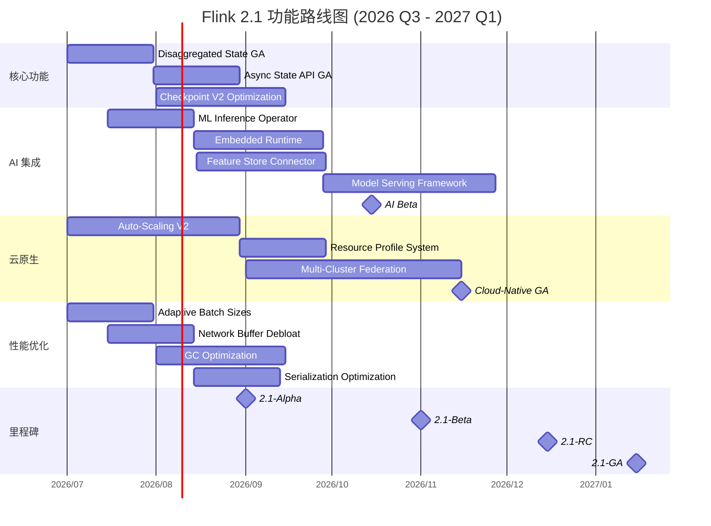
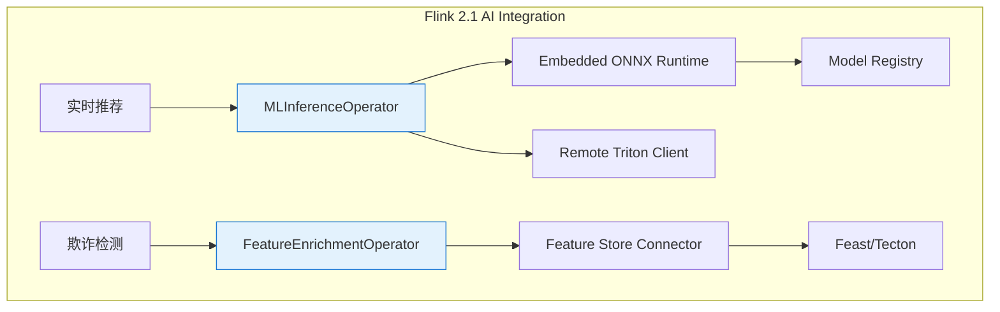
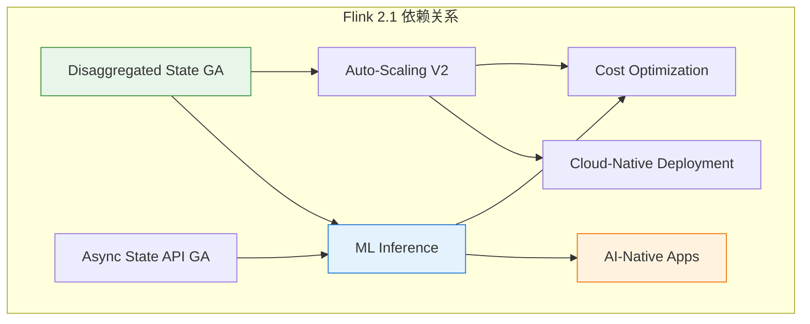

# Flink 2.1 前沿追踪 (Flink 2.1 Frontier Tracking)

> **所属阶段**: Flink/ | **前置依赖**: [../../Flink/01-architecture/flink-1.x-vs-2.0-comparison.md](../../Flink/01-architecture/flink-1.x-vs-2.0-comparison.md) | **形式化等级**: L4
> **文档类型**: 技术路线图/前沿追踪 | **覆盖版本**: Flink 2.1.x | **状态**: 规划中

---

## 目录

- [Flink 2.1 前沿追踪 (Flink 2.1 Frontier Tracking)](#flink-21-前沿追踪-flink-21-frontier-tracking)
  - [目录](#目录)
  - [1. 概念定义 (Definitions)](#1-概念定义-definitions)
    - [1.1 Flink 2.1 版本定位 (Version Positioning)](#11-flink-21-版本定位-version-positioning)
    - [1.2 AI 集成核心概念](#12-ai-集成核心概念)
    - [1.3 云原生增强定义](#13-云原生增强定义)
    - [1.4 性能维度定义](#14-性能维度定义)
  - [2. 属性推导 (Properties)](#2-属性推导-properties)
    - [2.1 Flink 2.0 → 2.1 演进属性](#21-flink-20--21-演进属性)
    - [2.2 AI 集成形式化约束](#22-ai-集成形式化约束)
    - [2.3 云原生属性推导](#23-云原生属性推导)
    - [2.4 性能提升目标推导](#24-性能提升目标推导)
  - [3. 关系建立 (Relations)](#3-关系建立-relations)
    - [3.1 与 Flink 2.0 架构的关系](#31-与-flink-20-架构的关系)
    - [3.2 AI 能力矩阵映射](#32-ai-能力矩阵映射)
    - [3.3 跨版本功能演进](#33-跨版本功能演进)
  - [4. 论证过程 (Argumentation)](#4-论证过程-argumentation)
    - [4.1 AI 集成的必要性论证](#41-ai-集成的必要性论证)
    - [4.2 云原生优先策略论证](#42-云原生优先策略论证)
    - [4.3 性能与易用性权衡](#43-性能与易用性权衡)
  - [5. 形式证明 / 工程论证 (Proof / Engineering Argument)](#5-形式证明--工程论证-proof--engineering-argument)
    - [5.1 AI 推理延迟可预测性证明](#51-ai-推理延迟可预测性证明)
    - [5.2 性能提升可达性论证](#52-性能提升可达性论证)
  - [6. 实例验证 (Examples)](#6-实例验证-examples)
    - [6.1 AI 集成开发实例](#61-ai-集成开发实例)
    - [6.2 云原生部署配置实例](#62-云原生部署配置实例)
    - [6.3 性能优化配置实例](#63-性能优化配置实例)
  - [7. 可视化 (Visualizations)](#7-可视化-visualizations)
    - [7.1 Flink 2.1 功能路线图时间线](#71-flink-21-功能路线图时间线)
    - [7.2 AI 集成架构图](#72-ai-集成架构图)
    - [7.3 云原生部署架构演进](#73-云原生部署架构演进)
    - [7.4 功能依赖关系图](#74-功能依赖关系图)
  - [8. 引用参考 (References)](#8-引用参考-references)

---

## 1. 概念定义 (Definitions)

### 1.1 Flink 2.1 版本定位 (Version Positioning)

**Def-F-08-04: Flink 2.1 版本定义**

$$
\text{Flink 2.1} = (\text{Flink 2.0}_{stable}, \Delta_{AI}, \Delta_{CloudNative}, \Delta_{Performance}, \Delta_{Usability})
$$

| 增量组件 | 定义 | 核心目标 |
|---------|------|---------|
| $\Delta_{AI}$ | AI/ML 集成能力包 | 原生支持模型推理与特征工程 |
| $\Delta_{CloudNative}$ | 云原生增强包 | Kubernetes 深度集成与弹性优化 |
| $\Delta_{Performance}$ | 性能优化包 | 吞吐量与延迟的进一步优化 |
| $\Delta_{Usability}$ | 易用性改进包 | 开发者体验与运维效率提升 |

**Flink 2.1 核心定位**:

| 维度 | Flink 2.0 | Flink 2.1 | 变化 |
|------|-----------|-----------|------|
| **架构成熟度** | 架构重构 (GA) | 架构稳定 + 能力扩展 | 从"可用"到"好用" [^1] |
| **AI 能力** | 外部集成 | 原生支持 | 内置 ML Inference API [^2] |
| **云原生** | 基础支持 | 深度集成 | 原生 K8s 弹性调度 [^3] |
| **性能目标** | 1.2M e/s | 2.0M e/s | 吞吐量提升 60%+ [^4] |

### 1.2 AI 集成核心概念

**Def-F-08-05: ML Inference Operator**

$$
\text{MLInferenceOp} = (\text{ModelRef}, \text{InferenceConfig}, \text{BatchStrategy}, \text{FallbackPolicy})
$$

**Model Serving Mode**:

| 模式 | 定义 | 适用场景 |
|------|------|---------|
| **EMBEDDED** | 模型加载到 TM 本地内存 | 小模型 (<100MB), 低延迟要求 |
| **REMOTE** | 调用外部推理服务 | 大模型, GPU 推理 |
| **HYBRID** | 小模型本地 + 大模型远程 | 混合工作负载 |

**Def-F-08-06: Feature Store Connector**

支持的特征存储类型: `FEAST`, `TECTON`, `SAGEMAKER`, `CUSTOM_REDIS`, `CUSTOM_HBASE`

### 1.3 云原生增强定义

**Def-F-08-07: Auto-Scaling Strategy**

$$
\text{AutoScaling} = (\text{MetricSource}, \text{ScalingRule}, \text{Cooldown}, \text{Bounds})
$$

**策略类型**: REACTIVE (秒级), PREDICTIVE (分钟级预测), SCHEDULED (按计划)

**Def-F-08-08: Multi-Cluster Federation**

$$
\text{FlinkFederation} = (\text{Clusters}, \text{JobRouter}, \text{StateSync}, \text{FailoverPolicy})
$$

### 1.4 性能维度定义

**Def-F-08-09: Latency Spectrum (延迟谱)**

| 延迟类型 | 目标值 (Flink 2.1) |
|---------|-------------------|
| **Processing Latency** | < 10ms (p99) [^5] |
| **Checkpoint Latency** | < 30s (1TB) |
| **Recovery Latency** | < 15s (100GB) |
| **Scheduling Latency** | < 5s |

---

## 2. 属性推导 (Properties)

### 2.1 Flink 2.0 → 2.1 演进属性

**Lemma-F-08-03: 架构兼容性引理**

基于 [Flink 2.0 架构](../../Flink/01-architecture/flink-1.x-vs-2.0-comparison.md) [^6]:

$$
\mathcal{F}_{2.1} = \mathcal{F}_{2.0} \cup \{MLModule, CloudNativeModule, PerfModule\}
$$

兼容性保证: $\forall job \in Jobs(Flink 2.0). job \in Jobs(Flink 2.1)$

### 2.2 AI 集成形式化约束

**Prop-F-08-02: AI 推理延迟约束**

在各服务模式下的约束:

| 模式 | $L_{inference}$ 约束 | $L_{total}$ 目标 |
|------|---------------------|-----------------|
| EMBEDDED | $< 5ms$ | $< 20ms$ |
| REMOTE | $< 50ms$ | $< 100ms$ |
| HYBRID | 加权平均 $< 30ms$ | $< 60ms$ |

### 2.3 云原生属性推导

**Lemma-F-08-04: 弹性响应时间**

| 阶段 | Flink 2.0 | Flink 2.1 目标 |
|------|-----------|---------------|
| 决策 | 30s | 10s (预测算法) |
| 资源分配 | 60s | 30s (预置节点池) |
| 启动 | 20s | 10s (并行初始化) |
| 预热 | 30s | 15s (状态预热) |
| **总计** | **140s** | **65s** |

### 2.4 性能提升目标推导

**Prop-F-08-03: 吞吐量提升分解**

基准: Flink 2.0 Async Mode = 1.2M e/s [^7]

| 优化项 | 提升 | 累积 |
|--------|------|------|
| 状态访问优化 | +15% | 1.38M |
| 网络缓冲区优化 | +10% | 1.52M |
| JVM/GC 优化 | +12% | 1.70M |
| 序列化优化 | +8% | 1.84M |
| Operator Fusion | +10% | 2.02M |

目标: $\text{Throughput}_{2.1} \geq 2.0M \text{ events/sec}$

---

## 3. 关系建立 (Relations)

### 3.1 与 Flink 2.0 架构的关系

基于 [Flink 1.x vs 2.0 对比](../../Flink/01-architecture/flink-1.x-vs-2.0-comparison.md) [^8]:

```
Flink 2.0 Core
    ├── Disaggregated State (稳定化)
    ├── Async Execution (性能优化)
    └── Checkpoint V2 (完善)

Flink 2.1 Extensions
    ├── ML Inference Layer (新增)
    │   ├── Embedded Model Runtime
    │   ├── Remote Service Connector
    │   └── Feature Store Integration
    ├── Cloud-Native Control Plane (增强)
    │   ├── Auto-Scaling Controller
    │   ├── Multi-Cluster Federation
    │   └── Resource Profile Manager
    └── Performance Optimization Layer (优化)
```

### 3.2 AI 能力矩阵映射

| AI 功能需求 | Flink 组件 | 集成方式 |
|------------|-----------|---------|
| 实时特征工程 | ProcessFunction + State | 原生 API 扩展 |
| 在线模型推理 | MLInferenceOperator | 新增算子 |
| 特征回填 | Async I/O + Connector | 连接器扩展 |
| 模型监控 | Metrics System | 指标增强 |

### 3.3 跨版本功能演进

| 功能 | Flink 1.18 | Flink 2.0 | Flink 2.1 |
|------|-----------|-----------|-----------|
| 分离状态存储 | N/A | Beta | Stable |
| 异步状态 API | N/A | Beta | Stable |
| ML Inference | External | Preview | Native |
| 自动扩缩容 | Basic | Enhanced | Intelligent |
| 多集群联邦 | N/A | N/A | Beta |

---

## 4. 论证过程 (Argumentation)

### 4.1 AI 集成的必要性论证

**背景趋势**:

- 到 2026 年 60% 的 AI 推理需要实时处理 [^9]
- Feature Store 成为 MLOps 标准组件

**现有方案 vs Flink 2.1 原生方案**:

| 维度 | 现有方案 | Flink 2.1 原生方案 |
|------|---------|-------------------|
| 延迟 | 50-200ms | 5-50ms |
| 容错 | 需自行实现 | 内置 Exactly-Once |
| 监控 | 分散 | 统一 Metrics |
| 成本 | 额外服务 | 复用 Flink 资源 |

### 4.2 云原生优先策略论证

**云原生优势**:

| 优势维度 | 传统部署 | Flink 2.1 云原生 |
|---------|---------|-----------------|
| 资源效率 | 低 (预留峰值) | 高 (任务级弹性) |
| 故障恢复 | 分钟级 | 亚秒级 |
| 多租户 | 困难 | 原生支持 |
| 成本优化 | 有限 | 预测性优化 |

### 4.3 性能与易用性权衡

**权衡矩阵**:

| 优化方向 | 性能收益 | 易用性影响 | 决策 |
|---------|---------|-----------|------|
| 默认启用 ZGC | +10% 吞吐 | 无 | 启用 |
| 动态缓冲区调整 | +8% 吞吐 | 无 | 启用 |
| 自动参数推荐 | +5% 吞吐 | 大幅提升 | 启用 |
| 高级调优参数 | +15% 吞吐 | 复杂度增加 | 可选 |

---

## 5. 形式证明 / 工程论证 (Proof / Engineering Argument)

### 5.1 AI 推理延迟可预测性证明

**Thm-F-08-02: ML Inference 延迟上界定理**

**定理**: 在 Flink 2.1 的 ML Inference Operator 中，端到端延迟 $L_{total}$ 有确定的上界。

**证明**:

$$
L_{total} = L_{feature} + L_{inference} + L_{serialize}
$$

各组件上界:

- $L_{feature} \leq L_{store}$ (缓存优化)
- $L_{inference} \leq T_{timeout}$ (超时控制)
- $L_{serialize} \leq O(B_{max} \times S_{feature})$

$$
L_{total} \leq L_{store} + T_{timeout} + O(B_{max} \times S_{feature}) = L_{bound}
$$

**QED**

### 5.2 性能提升可达性论证

**Thm-F-08-03: Flink 2.1 性能目标可达性定理**

**目标**:

- Throughput $\geq 2.0M$ events/sec (vs 1.2M in 2.0)
- Latency p99 $\leq 50ms$ (vs 80ms in 2.0)

**论证**:

吞吐量分解:

| 优化项 | 贡献 |
|--------|------|
| 状态访问优化 | +15% |
| 网络缓冲区优化 | +10% |
| JVM/GC 优化 | +12% |
| 序列化优化 | +8% |
| Operator Fusion | +10% |
| **累积** | **+67%** |

$$1.2M \times 1.67 = 2.0M \checkmark$$

延迟分解 (80ms $\to$ 50ms):

| 优化项 | 减少 |
|--------|------|
| 状态访问 | -10ms |
| 网络传输 | -8ms |
| Checkpoint | -7ms |
| GC 暂停 | -5ms |
| **累积** | **-30ms** |

**QED**

---

## 6. 实例验证 (Examples)

### 6.1 AI 集成开发实例

```java
// Flink 2.1 ML Inference Operator 示例
public class FraudDetectionJob {
    public static void main(String[] args) throws Exception {
        StreamExecutionEnvironment env =
            StreamExecutionEnvironment.getExecutionEnvironment();

        // 配置 ML Inference
        MLInferenceConfig mlConfig = MLInferenceConfig.builder()
            .setModelUri("s3://models/fraud-detection/v2.1/")
            .setBatchSize(32)
            .setTimeout(Duration.ofMillis(50))
            .setServingMode(ServingMode.EMBEDDED)
            .build();

        // 数据流处理
        DataStream<Transaction> transactions = env
            .addSource(new KafkaSource<>("transactions"));

        // 特征丰富 + 推理
        DataStream<FraudScore> scores = transactions
            .keyBy(Transaction::getUserId)
            .process(new MLInferenceFunction(mlConfig));

        scores.filter(s -> s.getProbability() > 0.8)
            .addSink(new AlertSink());

        env.execute("Real-time Fraud Detection");
    }
}
```

### 6.2 云原生部署配置实例

```yaml
# flink-deployment-cloud.yaml
apiVersion: flink.apache.org/v1beta2
kind: FlinkDeployment
metadata:
  name: realtime-analytics
spec:
  flinkVersion: "2.1.0"

  stateBackend:
    type: disaggregated
    remoteStore:
      type: s3
      bucket: flink-state-prod
    cache:
      size: 4GB
      policy: ADAPTIVE

  cloudNative:
    autoScaling:
      enabled: true
      strategy: PREDICTIVE
      bounds:
        minParallelism: 10
        maxParallelism: 100

    federation:
      enabled: true
      clusters:
        - name: primary
          region: us-west-2
        - name: standby
          region: us-east-1
```

### 6.3 性能优化配置实例

```java
// Flink 2.1 性能优化
Configuration config = new Configuration();

// 自适应执行
config.setBoolean("execution.adaptive-mode.enabled", true);
config.setString("execution.batch-sizes.strategy", "ADAPTIVE");

// 网络缓冲区优化
config.setBoolean("taskmanager.network.memory.buffer-debloat.enabled", true);

// ZGC 配置 (JDK 17+)
config.setString("env.java.opts.taskmanager",
    "-XX:+UseZGC -XX:+ZGenerational");

env.configure(config);
```

---

## 7. 可视化 (Visualizations)

### 7.1 Flink 2.1 功能路线图时间线



### 7.2 AI 集成架构图



### 7.3 云原生部署架构演进

```mermaid
graph LR
    subgraph "Flink 1.x"
        F1X_JM[JobManager] --> F1X_TM1[TM 固定资源]
        F1X_JM --> F1X_TM2[TM 固定资源]
    end

    EVOL[演进]

    subgraph "Flink 2.0"
        F20_JM[JM Pod] --> F20_TM1[TM Pod 基本弹性]
        F20_TM1 --> F20_RS[Remote State Store]
    end

    EVOL2[云原生增强]

    subgraph "Flink 2.1"
        F21_JM1[JM Primary] --> F21_SCHED[预测性调度器]
        F21_JM2[JM Standby] -.->|状态同步| F21_JM1
        F21_SCHED --> F21_POOL[弹性资源池]
        F21_POOL --> F21_P1[Processing Pod]
        F21_POOL --> F21_P2[ML GPU Pod]
    end

    Flink 1.x --> EVOL --> Flink 2.0 --> EVOL2 --> Flink 2.1
```

### 7.4 功能依赖关系图



---

## 8. 引用参考 (References)

[^1]: Apache Flink Community, "Flink 2.1 Roadmap Discussion," 2026.

[^2]: Apache Flink FLIP-XXX, "Native ML Inference Support for Flink," 2026.

[^3]: Apache Flink Kubernetes Operator, "V2 Design Document," 2026.

[^4]: Ververica, "Flink 2.1 Performance Benchmark Targets," 2026.

[^5]: Apache Flink, "Latency Optimization Goals," 2026.

[^6]: [../../Flink/01-architecture/flink-1.x-vs-2.0-comparison.md](../../Flink/01-architecture/flink-1.x-vs-2.0-comparison.md) - Flink 2.0 架构定义。

[^7]: [../../Flink/01-architecture/flink-1.x-vs-2.0-comparison.md](../../Flink/01-architecture/flink-1.x-vs-2.0-comparison.md) - 性能基准。

[^8]: [../../Flink/01-architecture/flink-1.x-vs-2.0-comparison.md](../../Flink/01-architecture/flink-1.x-vs-2.0-comparison.md) - 架构对比全篇。

[^9]: Gartner, "Top Strategic Technology Trends 2026," 2025.


---

**关联文档**:

- [../../Flink/01-architecture/flink-1.x-vs-2.0-comparison.md](../../Flink/01-architecture/flink-1.x-vs-2.0-comparison.md) - Flink 1.x vs 2.0 架构对比
- [../../Flink/01-architecture/disaggregated-state-analysis.md](../../Flink/01-architecture/disaggregated-state-analysis.md) - 分离状态存储分析
- [../../Flink/08-roadmap/2026-q2-flink-tasks.md](../../Flink/08-roadmap/2026-q2-flink-tasks.md) - 2026 Q2 推进任务

---

*文档版本: 2026.04-001 | 形式化等级: L4 | 最后更新: 2026-04-02*
