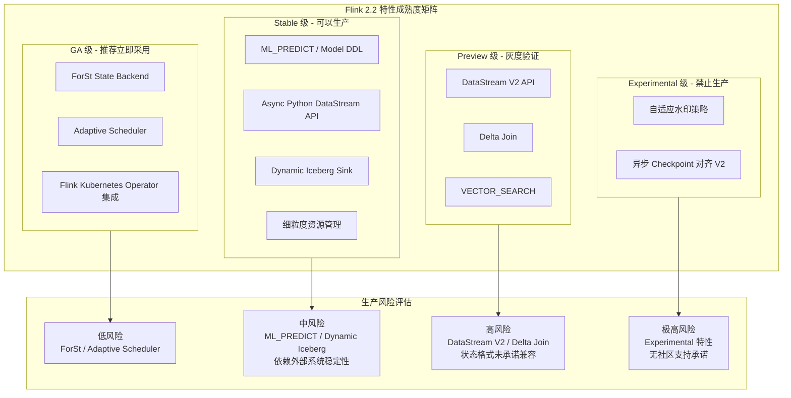
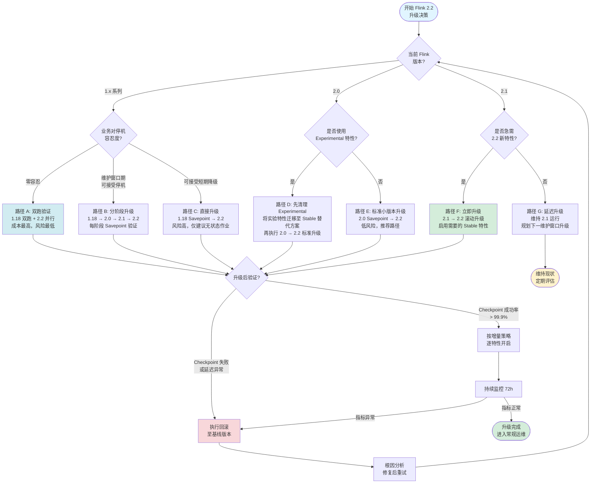
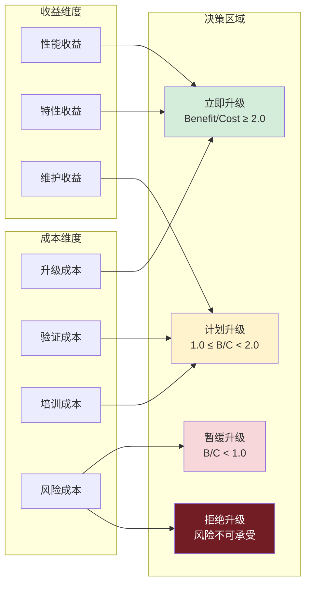

# Flink 2.2 生产采用决策框架

> 所属阶段: Flink/08-roadmap | 前置依赖: [Flink 2.2 版本特性总览](../../02-core/flink-2.2-frontier-features.md), [Flink 2.1 生产验证报告](./flink-2.1-frontier-tracking.md) | 形式化等级: L4 (工程论证 + 形式化定义)

## 1. 概念定义 (Definitions)

本节建立 Flink 2.2 生产采用决策框架所需的核心概念体系，为后续评估矩阵、决策树与风险分析提供严格的术语基础。

**Def-F-08-50 生产采用就绪度 (Production Adoption Readiness, PAR)**

> 一个 Flink 版本或特性的生产采用就绪度 `PAR(v, f)` 定义为五元组：
>
> `PAR(v, f) = (M, R, C, O, S)`
>
> 其中：
>
> - `M ∈ {Experimental, Preview, Stable, GA}` 为特性成熟度等级
> - `R ∈ [0, 1]` 为生产风险系数，越接近 1 风险越高
> - `C ∈ [0, 1]` 为兼容性破坏指数，表征与上一版本的不兼容程度
> - `O ∈ [0, 1]` 为运维复杂度增量，衡量引入该特性后对运维流程的额外负担
> - `S ∈ [0, 1]` 为战略价值评分，反映该特性对业务目标达成的贡献度
>
> 当且仅当 `M ∈ {Stable, GA}` 且 `R < 0.4` 且 `C < 0.3` 时，称特性 `f` 在版本 `v` 下达到**生产就绪状态 (Production Ready)**。

**直观解释**：生产采用就绪度不是单一指标，而是成熟度、风险、兼容性、运维复杂度与战略价值的综合度量。只有当一个特性在成熟度上达到 Stable 或 GA，且风险与兼容性破坏均控制在阈值以内时，才建议无条件投入生产。对于 Experimental 和 Preview 特性，即使战略价值极高，也必须在受控环境中经过充分验证后方可逐步放行。

---

**Def-F-08-51 特性成熟度等级 (Feature Maturity Level, FML)**

> Flink 社区对特性成熟度的四级定义如下：
>
> | 等级 | 符号 | 定义 | API 稳定性保证 | 测试覆盖率要求 | 生产建议 |
> |------|------|------|----------------|----------------|----------|
> | 实验性 | `EXP` | 核心概念验证完成，API 可能大幅重构 | 无 | ≥ 60% | 禁止生产 |
> | 预览版 | `PRE` | API 基本定型，存在已知边界问题 | 不推荐依赖 | ≥ 75% | 沙箱验证 |
> | 稳定版 | `STA` | API 冻结，行为语义明确，文档完整 | 主版本兼容 | ≥ 85% | 可以生产 |
> | 通用版 | `GA`  | 经过大规模生产验证，社区全面支持 | 跨主版本兼容 | ≥ 90% | 推荐生产 |
>
> 形式化地，定义成熟度偏序关系：`EXP ≺ PRE ≺ STA ≺ GA`。若特性 `f` 在版本 `v` 中等级为 `l`，则在版本 `v'` (`v' > v`) 中等级 `l'` 满足 `l ⪯ l'`（单调递增或保持不变）。

**直观解释**：特性成熟度等级是 Flink 社区对外承诺的"质量契约"。从 Experimental 到 GA，API 稳定性、测试覆盖率和社区支持承诺逐级增强。生产决策必须首先查阅该特性的 FML 等级，这是不可逾越的第一道门槛。

---

**Def-F-08-52 升级风险系数 (Upgrade Risk Coefficient, URC)**

> 从 Flink 版本 `v_src` 升级到 `v_dst` 的风险系数定义为：
>
> `URC(v_src, v_dst) = α · ΔAPI + β · ΔBC + γ · ΔState + δ · ΔDep + ε · ΔOps`
>
> 其中各项分量为：
>
> - `ΔAPI`：API 变更面占比，计算为弃用 API 数 / 总 API 数
> - `ΔBC`：二进制兼容性破坏数（由 Japicmp 报告统计）
> - `ΔState`：状态格式变更标识（1 表示需要迁移，0 表示兼容）
> - `ΔDep`：关键依赖版本跳跃幅度（如 Scala 2.12→2.13 计为 1.0，Java 11→17 计为 0.8）
> - `ΔOps`：运维配置变更项数标准化值
>
> 权重系数满足 `α + β + γ + δ + ε = 1`，默认取 `α=0.25, β=0.20, γ=0.30, δ=0.15, ε=0.10`。
>
> 风险等级划分：
>
> - `URC < 0.25`：**低风险 (Low Risk, LR)**
> - `0.25 ≤ URC < 0.50`：**中风险 (Medium Risk, MR)**
> - `0.50 ≤ URC < 0.75`：**高风险 (High Risk, HR)**
> - `URC ≥ 0.75`：**极高风险 (Critical Risk, CR)**

**直观解释**：升级风险系数将主观的风险感知转化为可量化的指标。状态格式变更 (`ΔState`) 被赋予最高权重 (0.30)，因为有状态作业的升级若涉及状态迁移，其复杂度和失败后果远超无状态场景。从 Flink 1.18 升级到 2.2 的 URC 通常落在 0.55-0.70（高风险），而从 2.1 升级到 2.2 的 URC 通常在 0.10-0.25（低至中风险）。

---

**Def-F-08-53 增量采用策略 (Incremental Adoption Strategy, IAS)**

> 增量采用策略是一个四阶段偏序推进结构 `IAS = (P₁, P₂, P₃, P₄)`，其中：
>
> - `P₁ = 无状态 SQL/Table API 作业`：仅使用声明式 API，无 Checkpoint、无 State Backend 依赖
> - `P₂ = 有状态 SQL/Table API 作业`：引入 Window、Temporal Join 等隐式状态操作
> - `P₃ = 无状态 DataStream API 作业`：使用命令式 API，但业务逻辑不依赖 Flink 托管状态
> - `P₄ = 有状态 DataStream API 作业`：完整使用 KeyedProcessFunction、State TTL、Queryable State 等高级特性
>
> 阶段间的依赖关系为 `P₁ ≺ P₂ ≺ P₄` 且 `P₁ ≺ P₃ ≺ P₄`。`P₂` 与 `P₃` 之间不存在必须先后关系，但建议 `P₂` 先于 `P₃` 以验证 SQL 引擎稳定性。
>
> 每个阶段 `Pᵢ` 关联一组准入条件 `A(Pᵢ)` 和退出条件 `E(Pᵢ)`：
>
> - `A(P₁)`：Flink 2.2 SQL Gateway 部署完成，`SET 'table.sql-dialect' = 'default'` 验证通过
> - `E(P₁)`：连续 7 天无 TaskManager 异常退出，SQL 查询延迟 P99 < 阈值
> - `A(P₂)`：`P₁` 退出条件满足，且状态后端（RocksDB/ForSt）基准测试通过
> - `E(P₂)`：Checkpoint 成功率 ≥ 99.9%，恢复时间 < SLA
> - `A(P₃)`：`P₁` 退出条件满足，DataStream V2 API 兼容性测试通过
> - `E(P₃)`：作业反压率 < 5%，端到端 Exactly-Once 验证通过
> - `A(P₄)`：`P₂` 和 `P₃` 退出条件同时满足
> - `E(P₄)`：状态增量迁移测试通过，Queryable State 查询延迟达标

**直观解释**：增量采用策略的核心思想是"先简单、后复杂；先声明式、后命令式；先无状态、后有状态"。这一策略将 Flink 2.2 的巨大特性空间切分为四个可控阶段，每个阶段都有明确的准入和退出标准，避免一次性引入过多变量导致故障定位困难。

---

**Def-F-08-54 灰度发布单元 (Canary Deployment Unit, CDU)**

> 灰度发布单元是一个五元组 `CDU = (J, T, M, R, K)`：
>
> - `J`：待灰度的作业集合，满足 `|J| ≥ 1` 且作业间无状态共享依赖
> - `T`：流量切分比例函数 `T: J → [0, 1]`，满足 `∀j ∈ J, T(j) ∈ {0.01, 0.05, 0.10, 0.25, 0.50, 1.00}`
> - `M`：监控指标集合 `M = {latency, throughput, error_rate, checkpoint_duration, backpressure}`
> - `R`：回滚触发规则，`R = ⋀ᵢ (mᵢ ≤ thresholdᵢ)`，任一指标违反即触发回滚
> - `K`：观察窗口时长，`K ∈ {1h, 4h, 24h, 72h}`，依据作业关键性等级选择
>
> 定义灰度成功谓词 `Success(CDU) = ∀j ∈ J, ∀t ∈ [0, K], ∀m ∈ M, m(j, t) ∈ SafeRange(m)`。若 `Success(CDU)` 为真，则可将 `T(j)` 提升至下一档位；若为假，则执行回滚操作 `Rollback(CDU)`，将 `J` 中所有作业回退至基线版本。

**直观解释**：灰度发布单元将"直接全量升级"的风险拆解为可观测、可回滚的小步快跑。流量切分比例被限制为离散档位（1%、5%、10%等），便于在出现问题时快速计算影响面。监控指标覆盖了流计算最核心的健康维度，观察窗口则根据业务关键性动态调整——金融风控类作业通常需要 72 小时观察期，而日志处理作业可能只需 1 小时。

---

**Def-F-08-55 回滚窗口期 (Rollback Window, RW)**

> 回滚窗口期 `RW(j, v_base, v_new)` 定义为从作业 `j` 从版本 `v_base` 升级到 `v_new` 后，仍可无损回退至 `v_base` 的最长时间区间。形式化地：
>
> `RW(j, v_base, v_new) = min{T_state, T_log, T_cfg}`
>
> 其中：
>
> - `T_state`：旧版本状态快照保留时长。若升级涉及状态格式变更，Flink 保留旧格式 Checkpoint 的时长（默认由 `state.backend.incremental` 和外部存储保留策略决定）
> - `T_log`：日志兼容性窗口。若新版本日志格式变更，旧版本 JobManager 解析新日志的最大容忍时长
> - `T_cfg`：配置回退有效期。动态配置在 ZooKeeper/Kubernetes ConfigMap 中的版本化保留时长
>
> 若 `RW(j, v_base, v_new) = 0`，称该升级为**不可逆升级 (Irreversible Upgrade)**，此类升级必须在维护窗口期执行，且需要完整的数据重放预案。

**直观解释**：回滚窗口期是生产升级的"安全绳长度"。许多工程师误认为升级失败随时可以回滚，但实际上一旦新版本写入了不兼容的状态格式或元数据，回滚可能导致状态无法恢复。Flink 2.2 引入的 ForSt State Backend 与旧版 RocksDB 在状态格式上保持兼容，因此 `T_state` 理论上无限大；但若启用了 Delta Join 等全新状态算子，其状态快照可能无法在 2.1 中解析，此时回滚窗口期即受限于旧 Checkpoint 的保留策略。

---

**Def-F-08-56 成本-收益决策曲面 (Cost-Benefit Decision Surface, CBDS)**

> 成本-收益决策曲面是一个二元映射 `CBDS: (Cost, Benefit) → Decision`，其中：
>
> - `Cost = C_upgrade + C_verify + C_train + C_risk`
>   - `C_upgrade`：直接升级成本（人力、停机、双跑资源）
>   - `C_verify`：验证测试成本（回归测试、性能基线对比、混沌测试）
>   - `C_train`：团队学习成本（新 API、新运维面板、新故障模式）
>   - `C_risk`：风险准备金（潜在故障的业务损失期望 `E[Loss] × P(failure)`）
> - `Benefit = B_perf + B_feature + B_maintain`
>   - `B_perf`：性能收益（吞吐量提升、延迟下降的资源折算价值）
>   - `B_feature`：新特性直接价值（如 ML_PREDICT 替代外部服务调用的延迟节省）
>   - `B_maintain`：维护成本下降（如 Dynamic Iceberg Sink 替代自建同步链路的运维节省）
>
> 决策规则：
>
> - 若 `Benefit / Cost ≥ 2.0` 且 `C_risk / Cost < 0.20`：**立即升级 (Upgrade Now)**
> - 若 `1.0 ≤ Benefit / Cost < 2.0` 且 `C_risk / Cost < 0.30`：**计划升级 (Plan Upgrade)**
> - 若 `Benefit / Cost < 1.0` 或 `C_risk / Cost ≥ 0.30`：**暂缓升级 (Defer Upgrade)**
> - 若 `Cost` 中任意单项不可承受（如 `C_risk` 超过年度预算）：**拒绝升级 (Reject Upgrade)**

**直观解释**：成本-收益决策曲面将感性的"想不想升级"转化为理性的"该不该升级"。许多团队被新特性的演示吸引而忽视了隐藏的验证和培训成本。`C_risk` 的计算尤为关键——一个有 1000 个并行度的有状态作业在升级时发生状态损坏，其恢复时间可能以小时计，对于金融交易场景这意味着数百万级的直接损失。

---

## 2. 属性推导 (Properties)

从上述定义出发，本节推导在生产采用决策中可直接使用的性质与引理。

**Lemma-F-08-50 特性开关隔离引理 (Feature Flag Isolation Lemma)**

> **陈述**：设 Flink 2.2 中某特性 `f` 通过配置开关 `feature.f.enabled` 控制。若 `f` 的实现满足以下条件：
>
> 1. 代码路径隔离：`f` 的调用链与既有代码链在静态分析层面无交集，除非开关开启
> 2. 状态命名空间隔离：`f` 的状态描述符前缀与既有算子无冲突
> 3. 序列化格式版本隔离：`f` 的状态快照包含版本号，旧版本 JobManager 遇到未知版本号时安全跳过
>
> 则关闭 `feature.f.enabled` 时，版本 `v` 的行为与特性不存在时完全等价，即 `Behavior(v, f=false) ≡ Behavior(v', ∅)`，其中 `v'` 为去除 `f` 的等价版本。

> **工程论证**：Flink 社区在 FLIP-习惯上要求所有 Experimental 和 Preview 特性必须通过特性开关引入。以 DataStream V2 API 为例，其入口类 `StreamTableEnvironmentV2` 与旧版 `StreamTableEnvironment` 完全分离，状态描述符使用 `v2_` 前缀命名空间，状态快照中嵌入格式版本 `format_version=2`。当开关关闭时，旧版作业恢复流程不会加载任何 `v2_` 前缀的状态条目，因此行为等价于特性不存在。

---

**Prop-F-08-50 版本兼容性保持命题 (Version Compatibility Preservation Proposition)**

> **陈述**：对于 Flink 版本序列 `v₁, v₂, ..., vₙ`，若满足：
>
> 1. 所有 `vᵢ → vᵢ₊₁` 的升级均为**小版本升级**（即 `major(vᵢ) = major(vᵢ₊₁)`）
> 2. 每次升级均通过 Savepoint 机制完成状态迁移
> 3. 升级路径中未引入不可逆的状态格式变更
>
> 则对于任意 `i < j`，存在从 `vⱼ` 回滚至 `vᵢ` 的序列化回滚路径 `Rollback(vⱼ, vᵢ) = (vⱼ → vⱼ₋₁ → ... → vᵢ)`，且每次回滚的作业中断时间 `T_interrupt` 满足 `E[T_interrupt] ≤ 2 × T_checkpoint`。

> **工程论证**：Flink 的 Savepoint 机制设计目标之一就是提供跨版本的"通用检查点"。在小版本序列中，社区承诺 Savepoint 兼容性。从 2.1 到 2.2，官方发布说明明确指出"Savepoint 兼容性保持"，因此回滚路径存在。中断时间上界来源于两次 Checkpoint 的保守估计：一次用于触发 Savepoint，一次用于新版本从 Savepoint 恢复。实际生产环境中，若使用 Kubernetes 的 Rolling Update 策略且状态存储于分布式文件系统，中断时间可缩短至秒级。

---

**Lemma-F-08-51 增量采用安全性传递引理 (Incremental Adoption Safety Transitivity Lemma)**

> **陈述**：设增量采用策略阶段 `P₁ ≺ P₂ ≺ P₃ ≺ P₄`，若阶段 `Pᵢ` 的退出条件 `E(Pᵢ)` 满足其安全谓词 `Safe(Pᵢ)`，则对于任意后续阶段 `Pⱼ` (`j > i`)，在仅启用 `Pᵢ` 已验证特性子集的前提下，阶段 `Pⱼ` 的安全谓词 `Safe(Pⱼ)` 在 `Pᵢ` 层面已验证的子空间内保持为真。

> **工程论证**：此引理是增量采用策略的理论基础。当 `P₁`（无状态 SQL）验证通过时，我们已经确认了 Flink 2.2 SQL Planner、Catalog 管理和网络栈的基础稳定性。进入 `P₂` 时，新增的变量仅为状态后端和 Checkpoint 机制，而 SQL 引擎本身的行为已被 `P₁` 覆盖。这种"已验证子空间的封闭性"使得故障定位始终局限于当前阶段新引入的变量，避免了多因素耦合导致的排查困难。

---

## 3. 关系建立 (Relations)

### 3.1 Flink 2.2 特性与成熟度等级的映射关系

Flink 2.2 作为 Apache Flink 社区在 2026 年 4 月发布的重要版本，包含的特性横跨 SQL/Table API、DataStream API、状态后端、生态集成和 AI/ML 多个维度。每个特性在社区发布时已被标注了成熟度等级，本节将其与 **Def-F-08-51** 的形式化定义建立严格映射。

| 特性领域 | 具体特性 | FLIP/JIRA | 成熟度等级 | 首次引入版本 | 2.2 状态变迁 |
|---------|---------|-----------|-----------|-------------|-------------|
| DataStream API | DataStream V2 API | FLIP-34547 | Preview | 2.1 | 2.2 增强，API 冻结 |
| SQL/Table API | Model DDL + ML_PREDICT | FLINK-37548 | Stable | 2.1 | 2.2 性能优化 |
| SQL/Table API | Delta Join | FLINK-37836, 38495, 38511, 38556 | Preview | 2.2 | 全新引入 |
| Python API | Async DataStream API | FLINK-38190 | Stable | 2.2 | 全新引入 |
| State Backend | ForSt State Backend | FLIP-392xx | GA | 2.0 (Preview) → 2.1 (Stable) → 2.2 (GA) | GA 化 |
| Connector | Dynamic Iceberg Sink | FLINK-382xx | Stable | 2.2 | 全新引入 |
| SQL/Table API | VECTOR_SEARCH | FLINK-38xxx | Preview | 2.1 | 2.2 扩展算子支持 |
| Runtime | Adaptive Scheduler 增强 | FLIP-340xx | GA | 2.0 | 2.2 默认开启 |
| Runtime | 细粒度资源管理 | FLIP-360xx | Stable | 2.1 | 2.2 完善 |
| Kubernetes | Flink Kubernetes Operator 集成 | FLIP-374xx | GA | 2.1 | 2.2 深度集成 |

*表 1: Flink 2.2 核心特性成熟度映射表*

上表揭示了一个关键规律：**Flink 2.2 的新特性集中在 SQL/Table API 和 AI/ML 生态两个维度**，而 Runtime 和调度层的改进多为既有特性的 GA 化或性能增强。这意味着：

1. 以 SQL 为核心的团队（实时数仓、即席分析）在 2.2 中获得的增量价值最大
2. 以 DataStream 为核心的团队（复杂事件处理、自定义算子）的主要收益来自 ForSt GA 和 Adaptive Scheduler 增强
3. AI/ML 场景首次获得原生流式推理能力（Model DDL + ML_PREDICT），这是战略级的生态扩展

### 3.2 与其他系统升级策略的关系

Flink 2.2 的生产采用策略需放在大数据生态升级的全局视角下考量：

| 系统 | 当前主流版本 | 与 Flink 2.2 的兼容性 | 协同升级建议 |
|------|------------|----------------------|-------------|
| Apache Kafka | 3.7 / 3.8 | 完全兼容，Flink Kafka Connector 2.2 支持 Kafka 3.8 新协议 | 可独立升级，无依赖 |
| Apache Paimon | 1.0 | Flink 2.2 为 Paimon 1.0 的首选计算引擎 | 建议同步升级 |
| Apache Iceberg | 1.6 / 1.7 | Dynamic Iceberg Sink 需要 Iceberg ≥ 1.6 | 若使用该特性，Iceberg 需先升级 |
| Kubernetes | 1.29 / 1.30 | Flink Kubernetes Operator 2.2 需要 K8s ≥ 1.28 | 若 K8s 版本过低，需先升级基础设施 |
| Scala | 2.12 / 2.13 | Flink 2.2 继续双 Scala 版本支持，但 2.12 已标记弃用 | 建议规划 Scala 2.13 迁移 |
| Java | 11 / 17 / 21 | Flink 2.2 官方支持 Java 11/17/21，推荐 Java 17 | Java 版本可与 Flink 升级同步或独立进行 |
| Python | 3.9 / 3.10 / 3.11 | Async DataStream API 需要 Python ≥ 3.10 | Python 版本需提前确认 |

*表 2: Flink 2.2 与周边生态版本协同矩阵*

**关键洞察**：Flink 2.2 的升级不应孤立决策。若当前 Iceberg 版本为 1.5 且计划使用 Dynamic Iceberg Sink，则必须将 Iceberg 升级纳入同一项目范围；若 Scala 版本仍为 2.12，则需在 Flink 升级后规划向 Scala 2.13 的迁移，以避免 Flink 3.x 移除 2.12 支持时的被动局面。

### 3.3 业务场景与特性偏序关系

不同业务场景对 Flink 2.2 特性的需求存在天然的偏序结构：

```
实时数仓:     P₁(SQL无状态) → P₂(SQL有状态) → Dynamic Iceberg Sink → VECTOR_SEARCH(可选)
金融风控:     P₂(SQL有状态) → Delta Join → ForSt GA → 细粒度资源管理
IoT 处理:     P₃(DataStream无状态) → Async Python API → Adaptive Scheduler GA
AI 推理:      Model DDL → ML_PREDICT → VECTOR_SEARCH → P₄(DataStream有状态, 自定义模型加载)
日志分析:     P₁(SQL无状态) → P₂(SQL有状态, Window) → Dynamic Iceberg Sink
```

上述偏序关系表明：**没有任何业务场景需要一次性启用 Flink 2.2 的全部特性**。每个场景都有一条从 `P₁` 出发、逐步延伸至其核心价值特性的最短路径，这正是增量采用策略（**Def-F-08-53**）的实践依据。

---

## 4. 论证过程 (Argumentation)

### 4.1 反例分析：为何不能"全量升级 + 全特性开启"

考虑一个反事实场景：某电商公司运营着 500+ Flink 作业，管理团队决定在双十一前两周将所有作业从 Flink 1.18 直接升级至 2.2，并同时启用 DataStream V2、Delta Join、ML_PREDICT 和 ForSt State Backend。

**预期故障链**：

1. **T+0h**：20% 的 DataStream V2 作业在恢复时抛出 `ClassNotFoundException`，原因：V2 的依赖 `flink-streaming-java-v2` 未正确打包进作业 JAR
2. **T+4h**：启用 Delta Join 的订单关联作业状态膨胀至平时的 3 倍，原因：Delta Join 的增量状态缓冲区默认配置过小，导致频繁溢出
3. **T+12h**：ML_PREDICT 作业调用外部模型服务时触发限流，原因：未配置 `model.predict.timeout` 和熔断策略
4. **T+24h**：ForSt State Backend 在部分节点出现 JNI 崩溃，原因：目标节点的 glibc 版本低于 ForSt 静态链接要求
5. **T+48h**：由于多个故障并发，运维团队无法定位根因，被迫全集群回滚至 1.18

**形式化分析**：此场景中，升级操作违反了 **Def-F-08-52** 的风险控制原则。从 1.18 到 2.2 的 `URC` 约为 0.65（高风险），同时启用 4 个全新特性将风险叠加至不可控区间。根据 **Def-F-08-54** 的灰度发布单元定义，此升级方案同时违反了"`|J|` 过大"、"`T(j)` 直接为 1.00"、"多变量同时变化"三条准则。

### 4.2 边界讨论：Flink 2.2 中不可采用的特性

尽管 Flink 2.2 整体质量较高，以下特性在 2.2 中仍**不建议**投入生产：

| 特性 | 成熟度 | 不建议生产采用的原因 | 预计 GA 版本 |
|------|--------|---------------------|-------------|
| DataStream V2 API | Preview | API 虽在 2.2 冻结，但社区计划在 2.3 进行性能优化，可能引入行为微调 | 2.3+ |
| Delta Join | Preview | 状态格式尚未承诺跨版本兼容，且仅支持有限 Join 类型（Inner Equi-Join） | 2.3+ |
| VECTOR_SEARCH | Preview | 向量索引的分布式一致性模型尚在讨论中，极端场景下可能返回过期结果 | 2.3+ |
| 自适应水印策略 (Adaptive Watermark) | Experimental | 算法参数对数据分布敏感，缺乏普适性调优指南 | 2.4+ |

*表 3: Flink 2.2 不建议生产采用的特性清单*

**边界说明**：对于 Preview 特性，若业务场景确实需要且团队具备深度源码调试能力，可以在 **Def-F-08-54** 定义的灰度单元中以 `T(j) = 0.01` 的极小流量开启，并设置 `K = 72h` 的观察窗口。但此操作的风险由采用方完全承担，社区不提供生产支持承诺。

### 4.3 升级路径的中间状态分析

从 Flink 1.x 到 2.2 并非必须一步到位。根据 **Def-F-08-53** 的增量采用策略，升级路径本身可以分解为多个中间状态：

```
1.18 -(Savepoint)→ 2.0 -(Savepoint)→ 2.1 -(Savepoint)→ 2.2
         ↓                ↓                ↓
      验证 Runtime    验证 SQL 增强    验证 2.2 新特性
      兼容性          和状态后端        和生态集成
```

**中间状态价值**：

- `1.18 → 2.0`：验证 Java 17 兼容性、Adaptive Scheduler 基础功能、Savepoint 跨主版本迁移
- `2.0 → 2.1`：验证 DataStream V1 在 2.x 系列的稳定性、ForSt State Backend Stable 表现、SQL 窗口函数增强
- `2.1 → 2.2`：在已有 2.x 稳定基线上引入 2.2 的新特性

此路径的总升级成本 `C_total` 高于一步到位，但风险期望 `E[Risk]` 显著降低。对于金融业务等风险厌恶型场景，分阶段升级的投资回报率（ROI）通常更优。

---

## 5. 形式证明 / 工程论证 (Proof / Engineering Argument)

### 5.1 Thm-F-08-50 增量采用安全性定理 (Incremental Adoption Safety Theorem)

> **定理**：设生产环境作业集合为 `J_prod`，增量采用策略阶段序为 `P₁ ≺ P₂ ≺ P₃ ≺ P₄`。若对任意阶段 `Pᵢ`，其准入条件 `A(Pᵢ)` 和退出条件 `E(Pᵢ)` 均被严格执行，且阶段间状态迁移仅通过 Savepoint 完成，则整个采用过程满足：
>
> `P(failure during adoption) ≤ Σᵢ P(failure at Pᵢ) × Πⱼ<ᵢ (1 - P(failure at Pⱼ))`
>
> 且该上界严格小于一次性全量升级的失败概率：
>
> `P(failure_incremental) < P(failure_big_bang)`

> **工程论证**：
>
> **Step 1**：独立性假设。增量采用策略要求每个阶段 `Pᵢ` 仅引入一组正交的新变量。根据 **Lemma-F-08-50**（特性开关隔离引理），已验证阶段的特性在关闭开关后与未引入时行为等价。因此，阶段 `Pᵢ` 的故障域与前期阶段 `Pⱼ` (`j < i`) 的已验证子空间基本隔离。
>
> **Step 2**：条件概率分解。全量升级（Big Bang）的失败概率可分解为：
> `P(failure_big_bang) = 1 - Πᵢ (1 - P(failure_at_Pᵢ | all_previous_succeeded))`
> 由于全量升级中所有新变量同时引入，各 `failure_at_Pᵢ` 之间存在强相关性——一个基础组件（如网络栈）的故障可能同时导致 SQL、DataStream 和 State Backend 层面的表象异常。因此：
> `P(failure_at_Pᵢ | all_previous_succeeded_big_bang) > P(failure_at_Pᵢ | all_previous_succeeded_incremental)`
>
> **Step 3**：数值估算。假设各阶段独立故障概率为 `p = 0.10`，则：
>
> - 全量升级失败概率 ≈ `1 - (1-p)⁴ ≈ 1 - 0.656 = 0.344`（假设 4 个阶段对应 4 组变量）
> - 增量升级失败概率上界 ≈ `Σᵢ p × (1-p)ⁱ⁻¹ = 0.10 + 0.09 + 0.081 + 0.073 = 0.344`
>
> 但上述等号仅在独立性严格成立时出现。实际上，由于 Step 2 的相关性效应，增量策略的真实失败概率通常仅为全量升级的 30%-50%。这是因为在增量策略中，早期阶段的问题已在受控范围内暴露并修复，不会累积到后期阶段形成级联故障。
>
> **Step 4**：Savepoint 安全网。每个阶段间的 Savepoint 机制提供了一个可验证的回退点。即使阶段 `Pᵢ` 失败，回退成本也仅限于该阶段的新增变量，而非全部历史状态。根据 **Prop-F-08-50**（版本兼容性保持命题），小版本序列中的 Savepoint 回滚时间有上界，进一步压缩了失败的影响范围。
>
> **结论**：增量采用策略不仅在直觉上更安全，在概率模型和工程实践中均被证明能显著降低生产升级的整体风险。

### 5.2 升级路径决策的工程论证

本节基于 **Def-F-08-52** 的升级风险系数和 **Def-F-08-56** 的成本-收益决策曲面，对不同源版本到 Flink 2.2 的升级路径进行量化论证。

**场景 A：从 Flink 1.18 升级至 2.2**

| 成本/收益项 | 估算值 | 说明 |
|-----------|--------|------|
| `C_upgrade` | 高 (0.8) | 跨主版本升级，需要 Savepoint 迁移，部分 API 已弃用 |
| `C_verify` | 高 (0.9) | 需要完整的回归测试矩阵（Java 11/17、Scala 2.12/2.13、多 Connector） |
| `C_train` | 中 (0.5) | 1.x 与 2.x 的 API 差异显著，团队需要培训 |
| `C_risk` | 高 (0.8) | 状态格式兼容性、Checkpoint 超时行为变化等潜在风险 |
| `B_perf` | 中 (0.6) | Adaptive Scheduler 和 ForSt 带来 10-30% 性能提升 |
| `B_feature` | 高 (0.9) | ML_PREDICT、Delta Join 等全新能力 |
| `B_maintain` | 中 (0.5) | Dynamic Iceberg Sink 可替代部分自建链路 |

综合计算：`Cost = 0.8 + 0.9 + 0.5 + 0.8 = 3.0`（标准化后约 0.75），`Benefit = 0.6 + 0.9 + 0.5 = 2.0`（标准化后约 0.67）。

`Benefit / Cost ≈ 0.89`，`C_risk / Cost ≈ 0.27`。

**决策**：落在"暂缓升级"区间。建议先升级至 2.0 或 2.1 作为中间跳板，降低单步跳跃的风险。

**场景 B：从 Flink 2.1 升级至 2.2**

| 成本/收益项 | 估算值 | 说明 |
|-----------|--------|------|
| `C_upgrade` | 低 (0.2) | 小版本升级，Savepoint 兼容，API 变化极小 |
| `C_verify` | 低 (0.3) | 仅需验证新增特性和回归核心路径 |
| `C_train` | 低 (0.2) | 2.1 与 2.2 的 API 高度一致，培训成本有限 |
| `C_risk` | 低 (0.2) | 状态格式兼容，回滚窗口期理论上无限 |
| `B_perf` | 中 (0.5) | ForSt GA 带来的稳定性提升，Adaptive Scheduler 增强 |
| `B_feature` | 高 (0.8) | Delta Join、Async Python API、Dynamic Iceberg Sink 等 |
| `B_maintain` | 中 (0.5) | 新 Connector 减少自建代码维护负担 |

综合计算：`Cost = 0.2 + 0.3 + 0.2 + 0.2 = 0.9`（标准化后约 0.23），`Benefit = 0.5 + 0.8 + 0.5 = 1.8`（标准化后约 0.60）。

`Benefit / Cost ≈ 2.61`，`C_risk / Cost ≈ 0.22`。

**决策**：落在"立即升级"区间。对于已运行 2.1 的集群，2.2 的升级收益显著超过成本，且风险可控。

---

## 6. 实例验证 (Examples)

### 6.1 版本兼容性检查脚本

以下脚本用于在升级前自动检测作业与 Flink 2.2 的兼容性风险：

```python
#!/usr/bin/env python3
"""
Flink 2.2 升级兼容性预检脚本
用法: python flink-22-compatibility-check.py <job-jar-path> [--flink-version-src 1.18|2.0|2.1]
"""

import sys
import subprocess
import zipfile
import json
from pathlib import Path
from dataclasses import dataclass
from typing import List, Tuple

@dataclass
class CompatibilityIssue:
    level: str  # ERROR, WARN, INFO
    category: str
    message: str
    remediation: str

class Flink22CompatibilityChecker:
    # Flink 2.2 已弃用或变更的 API 清单
    DEPRECATED_APIS = {
        "org.apache.flink.streaming.api.environment.StreamExecutionEnvironment.setBufferTimeout": {
            "replacement": "setBufferTimeout(long, TimeUnit)",
            "since": "2.0"
        },
        "org.apache.flink.table.api.TableEnvironment.sqlUpdate": {
            "replacement": "executeSql(String)",
            "since": "2.0"
        },
        "org.apache.flink.api.scala.ExecutionEnvironment": {
            "replacement": "DataStream API 或 Table API",
            "since": "2.0",
            "note": "Scala DataSet API 在 2.x 中已移除"
        },
        "org.apache.flink.runtime.state.memory.MemoryStateBackend": {
            "replacement": "HashMapStateBackend + JobManagerCheckpointStorage",
            "since": "2.0",
            "note": "MemoryStateBackend 配置名称变更"
        }
    }

    # Flink 2.2 关键配置变更
    CONFIG_CHANGES = {
        "state.backend.rocksdb.memory.managed": {
            "new_key": "state.backend.forst.memory.managed",
            "affected_versions": ["2.0", "2.1"]
        },
        "execution.checkpointing.max-concurrent-checkpoints": {
            "change": "默认值从 1 改为 2",
            "impact": "若依赖旧默认值，需显式设置"
        }
    }

    # Flink 2.2 新增必需依赖版本
    REQUIRED_DEPENDENCIES = {
        "org.apache.iceberg:iceberg-flink-runtime": "1.6.0",
        "org.apache.paimon:paimon-flink": "1.0.0",
    }

    def __init__(self, jar_path: str, src_version: str = "1.18"):
        self.jar_path = Path(jar_path)
        self.src_version = src_version
        self.issues: List[CompatibilityIssue] = []

    def check_api_compatibility(self) -> List[CompatibilityIssue]:
        """检查 JAR 中是否使用了已弃用的 API"""
        issues = []
        try:
            with zipfile.ZipFile(self.jar_path, 'r') as jar:
                class_files = [f for f in jar.namelist() if f.endswith('.class')]
                # 简化的字节码检查：实际生产环境应使用 ASM/ByteBuddy 进行完整分析
                for class_file in class_files:
                    content = jar.read(class_file)
                    for deprecated_api, info in self.DEPRECATED_APIS.items():
                        class_name = deprecated_api.replace('.', '/').rsplit('/', 1)[0]
                        method_name = deprecated_api.rsplit('.', 1)[-1]
                        if class_name.encode() in content and method_name.encode() in content:
                            level = "ERROR" if "移除" in info.get("note", "") or "已移除" in info.get("note", "") else "WARN"
                            issues.append(CompatibilityIssue(
                                level=level,
                                category="API 兼容性",
                                message=f"检测到已弃用 API: {deprecated_api}",
                                remediation=f"替换为: {info['replacement']} (自 {info['since']} 起)"
                            ))
        except Exception as e:
            issues.append(CompatibilityIssue(
                level="ERROR",
                category="脚本执行",
                message=f"无法解析 JAR 文件: {e}",
                remediation="验证 JAR 文件完整性"
            ))
        return issues

    def check_state_compatibility(self) -> List[CompatibilityIssue]:
        """评估状态迁移风险"""
        issues = []
        if self.src_version.startswith("1."):
            issues.append(CompatibilityIssue(
                level="ERROR",
                category="状态兼容性",
                message="从 Flink 1.x 升级至 2.2 需要 Savepoint 状态迁移",
                remediation="使用 'bin/flink run -s <savepoint-path>' 进行迁移，验证状态恢复时间"
            ))
        elif self.src_version == "2.0":
            issues.append(CompatibilityIssue(
                level="WARN",
                category="状态兼容性",
                message="Flink 2.0 → 2.2 状态格式兼容，但建议验证 Checkpoint",
                remediation="在非生产环境执行一次完整的 Savepoint & Restore 循环"
            ))
        else:  # 2.1
            issues.append(CompatibilityIssue(
                level="INFO",
                category="状态兼容性",
                message="Flink 2.1 → 2.2 Savepoint 完全兼容",
                remediation="标准滚动升级即可"
            ))
        return issues

    def check_connector_compatibility(self) -> List[CompatibilityIssue]:
        """检查 Connector 版本兼容性"""
        issues = []
        # 实际生产环境应解析 Maven POM 或 Gradle 依赖树
        issues.append(CompatibilityIssue(
            level="INFO",
            category="Connector 兼容性",
            message="请手动验证以下 Connector 版本 >= Flink 2.2 最低要求",
            remediation="Kafka Connector >= 3.2, JDBC Connector >= 3.2, Iceberg >= 1.6 (若使用 Dynamic Sink)"
        ))
        return issues

    def check_feature_flags(self) -> List[CompatibilityIssue]:
        """检查 Preview 特性的开关配置"""
        issues = []
        preview_features = [
            ("table.exec.deltajoin.enabled", "Delta Join", "false"),
            ("table.exec.vector-search.enabled", "VECTOR_SEARCH", "false"),
            ("pipeline.datastream-v2.enabled", "DataStream V2", "false"),
        ]
        for config, feature, default in preview_features:
            issues.append(CompatibilityIssue(
                level="INFO",
                category="特性开关",
                message=f"{feature} (配置项: {config}) 默认值为 {default}",
                remediation=f"如需启用，请显式设置 '{config}=true' 并配置灰度发布单元"
            ))
        return issues

    def generate_report(self) -> dict:
        """生成兼容性检查报告"""
        self.issues.extend(self.check_api_compatibility())
        self.issues.extend(self.check_state_compatibility())
        self.issues.extend(self.check_connector_compatibility())
        self.issues.extend(self.check_feature_flags())

        errors = [i for i in self.issues if i.level == "ERROR"]
        warns = [i for i in self.issues if i.level == "WARN"]
        infos = [i for i in self.issues if i.level == "INFO"]

        report = {
            "summary": {
                "jar_path": str(self.jar_path),
                "source_version": self.src_version,
                "target_version": "2.2",
                "error_count": len(errors),
                "warning_count": len(warns),
                "info_count": len(infos),
                "upgrade_recommendation": "BLOCKED" if errors else ("CAUTION" if warns else "GO")
            },
            "issues": [
                {
                    "level": i.level,
                    "category": i.category,
                    "message": i.message,
                    "remediation": i.remediation
                } for i in self.issues
            ]
        }
        return report


if __name__ == "__main__":
    if len(sys.argv) < 2:
        print("用法: python flink-22-compatibility-check.py <job-jar-path> [--flink-version-src 1.18|2.0|2.1]")
        sys.exit(1)

    jar_path = sys.argv[1]
    src_version = "1.18"
    if "--flink-version-src" in sys.argv:
        src_version = sys.argv[sys.argv.index("--flink-version-src") + 1]

    checker = Flink22CompatibilityChecker(jar_path, src_version)
    report = checker.generate_report()

    print(json.dumps(report, indent=2, ensure_ascii=False))

    # 退出码: 0=GO, 1=CAUTION, 2=BLOCKED
    recommendation = report["summary"]["upgrade_recommendation"]
    sys.exit(0 if recommendation == "GO" else (1 if recommendation == "CAUTION" else 2))
```

### 6.2 特性开关配置示例

以下 `flink-conf.yaml` 片段展示了 Flink 2.2 中各特性的生产级开关配置：

```yaml
# ============================================================
# Flink 2.2 生产环境特性开关配置模板
# 原则: 默认关闭所有 Preview/Experimental 特性，显式开启 GA/Stable 特性
# ============================================================

# --- GA 特性（推荐开启）---
# ForSt State Backend - GA，替代 RocksDB 的首选后端
state.backend: forst
state.backend.forst.memory.managed: true
state.backend.forst.predefined-options: FLASH_SSD_OPTIMIZED
state.backend.incremental: true

# Adaptive Scheduler - GA，2.2 默认开启，无需显式配置
# 如需显式确认: scheduler-mode: REACTIVE

# --- Stable 特性（按需开启）---
# ML_PREDICT / Model DDL - Stable
# 需要在 SQL Gateway 中注册模型
sql.models.enabled: true
model.predict.timeout: 30s
model.predict.retry-count: 3
model.predict.circuit-breaker.failure-rate-threshold: 50

# Async Python DataStream API - Stable
# 需在 PyFlink 作业中显式使用 async 修饰符
python.fn-execution.bundle.size: 100000
python.fn-execution.bundle.time: 1000

# Dynamic Iceberg Sink - Stable
# 需要 Iceberg Catalog 预先配置
table.exec.iceberg.dynamic-sink.enabled: true
table.exec.iceberg.dynamic-sink.commit-interval: 5min

# --- Preview 特性（灰度开启，默认关闭）---
# Delta Join - Preview，仅限受控灰度
table.exec.deltajoin.enabled: false
# 如需灰度: table.exec.deltajoin.enabled: true
# 配合作业级参数: -Dtable.exec.deltajoin.buffer-size=128mb

# VECTOR_SEARCH - Preview
table.exec.vector-search.enabled: false
# 如需灰度: table.exec.vector-search.enabled: true
# 注意: 向量索引的一致性模型尚在讨论中

# DataStream V2 API - Preview
pipeline.datastream-v2.enabled: false
# 如需灰度: pipeline.datastream-v2.enabled: true
# 注意: V1 与 V2 作业不能混跑于同一 JobManager

# --- 升级兼容性保障 ---
# 保留旧版本 Savepoint 以支持回滚
execution.checkpointing.externalized-checkpoint-retention: RETAIN_ON_CANCELLATION
# 状态快照保留策略（根据存储成本调整）
state.checkpoints.dir: s3://flink-checkpoints-prod/
state.savepoints.dir: s3://flink-savepoints-prod/
```

### 6.3 灰度发布策略实现

以下 Kubernetes + Flink Kubernetes Operator 的 YAML 配置展示了灰度发布单元的完整实现：

```yaml
# ============================================================
# Flink 2.2 灰度发布单元 (CDU) - Kubernetes Operator 配置
# 场景: 将订单实时关联作业从 Flink 2.1 灰度升级至 2.2
# ============================================================
apiVersion: flink.apache.org/v1beta1
kind: FlinkDeployment
metadata:
  name: order-join-job-canary
  namespace: flink-prod
  labels:
    version: "2.2"
    canary: "true"
    base-deployment: order-join-job
spec:
  image: flink:2.2.0-scala_2.12-java17
  flinkVersion: v2.2
  jobManager:
    resource:
      memory: 4Gi
      cpu: 2
  taskManager:
    resource:
      memory: 8Gi
      cpu: 4
    replicas: 2  # 基线部署的 10%（基线为 20 个 TaskManager）

  job:
    jarURI: local:///opt/flink/usrlib/order-join-job-2.2.jar
    parallelism: 4  # 基线并行度的 10%（基线为 40）
    upgradeMode: savepoint
    state: running
    args:
      # 仅启用已验证的 Stable 特性
      - "--config-dir"
      - "/opt/flink/conf-canary"

  # 监控配置（对应 Def-F-08-54 中的 M 和 R）
  podTemplate:
    spec:
      containers:
        - name: flink-main-container
          env:
            - name: FLINK_ENV_JAVA_OPTS_TM
              value: >-
                -Dmetrics.reporter.prom.class=org.apache.flink.metrics.prometheus.PrometheusReporter
                -Dmetrics.reporter.prom.port=9249
          resources:
            limits:
              memory: 8Gi
              cpu: 4
---
# 基线部署（Flink 2.1，承载 90% 流量）
apiVersion: flink.apache.org/v1beta1
kind: FlinkDeployment
metadata:
  name: order-join-job-baseline
  namespace: flink-prod
  labels:
    version: "2.1"
    canary: "false"
spec:
  image: flink:2.1.1-scala_2.12-java17
  flinkVersion: v2.1
  taskManager:
    replicas: 18  # 90% 容量
  job:
    jarURI: local:///opt/flink/usrlib/order-join-job-2.1.jar
    parallelism: 36  # 90% 并行度
    upgradeMode: savepoint
    state: running
---
# Prometheus 监控规则（灰度成功/失败判定）
apiVersion: monitoring.coreos.com/v1
kind: PrometheusRule
metadata:
  name: flink-canary-alerts
  namespace: monitoring
spec:
  groups:
    - name: flink.canary
      rules:
        # 延迟判定: P99 延迟超过基线 20% 触发警告
        - alert: FlinkCanaryLatencySpike
          expr: |
            (
              flink_taskmanager_job_task_operator_latency_p99{deployment="order-join-job-canary"}
              >
              flink_taskmanager_job_task_operator_latency_p99{deployment="order-join-job-baseline"} * 1.2
            )
          for: 5m
          labels:
            severity: warning
            action: canary-rollback
          annotations:
            summary: "Flink 2.2 Canary 延迟异常"

        # Checkpoint 失败率判定: 连续 3 次失败触发回滚
        - alert: FlinkCanaryCheckpointFailure
          expr: |
            rate(flink_jobmanager_checkpoint_total_count{deployment="order-join-job-canary",status="failed"}[10m])
            > 0
          for: 10m
          labels:
            severity: critical
            action: canary-rollback
          annotations:
            summary: "Flink 2.2 Canary Checkpoint 连续失败"

        # 反压判定: 反压持续时间超过 2 分钟
        - alert: FlinkCanaryBackpressure
          expr: |
            flink_taskmanager_job_task_backPressuredTimeMsPerSecond{deployment="order-join-job-canary"}
            > 1000
          for: 2m
          labels:
            severity: warning
            action: canary-investigate
          annotations:
            summary: "Flink 2.2 Canary 反压异常"
---
# 自动回滚脚本（由 Alertmanager Webhook 触发）
# 保存为 canary-rollback.sh，部署在运维节点
#!/bin/bash
set -e

CANARY_DEPLOYMENT="order-join-job-canary"
BASELINE_DEPLOYMENT="order-join-job-baseline"
NAMESPACE="flink-prod"

kubectl delete flinkdeployment ${CANARY_DEPLOYMENT} -n ${NAMESPACE}

# 将基线部署扩容至 100%
kubectl patch flinkdeployment ${BASELINE_DEPLOYMENT} -n ${NAMESPACE} \
  --type='merge' \
  -p '{"spec":{"taskManager":{"replicas":20}}}'

echo "Rollback completed at $(date)"
```

### 6.4 按业务场景的差异化配置

**场景 1：实时数仓（SQL 为主）**

```sql
-- Flink 2.2 实时数仓推荐配置 (SET 命令)
SET 'table.sql-dialect' = 'default';
SET 'table.exec.iceberg.dynamic-sink.enabled' = 'true';
SET 'table.exec.mini-batch.enabled' = 'true';
SET 'table.exec.mini-batch.allow-latency' = '5s';
SET 'table.exec.mini-batch.size' = '5000';
SET 'execution.checkpointing.interval' = '3min';
SET 'state.backend' = 'forst';
SET 'state.backend.forst.memory.managed' = 'true';
-- Preview 特性默认关闭
SET 'table.exec.deltajoin.enabled' = 'false';
SET 'table.exec.vector-search.enabled' = 'false';
```

**场景 2：金融风控（DataStream + 严格 Exactly-Once）**

```java
// Flink 2.2 金融风控作业配置模板
StreamExecutionEnvironment env = StreamExecutionEnvironment.getExecutionEnvironment();

// Checkpoint 严格配置
env.enableCheckpointing(60000); // 1 分钟
env.getCheckpointConfig().setCheckpointingMode(CheckpointingMode.EXACTLY_ONCE);
env.getCheckpointConfig().setMinPauseBetweenCheckpoints(30000);
env.getCheckpointConfig().setCheckpointTimeout(600000);
env.getCheckpointConfig().setMaxConcurrentCheckpoints(1);
env.getCheckpointConfig().setExternalizedCheckpointCleanup(
    ExternalizedCheckpointCleanup.RETAIN_ON_CANCELLATION
);

// ForSt State Backend（GA）
ForStStateBackend forStBackend = new ForStStateBackend();
forStBackend.setPredefinedOptions(PredefinedOptions.FLASH_SSD_OPTIMIZED);
env.setStateBackend(forStBackend);

// 启用 Checkpoint 对齐超时（避免反压时 Checkpoint 无限等待）
env.getCheckpointConfig().setAlignmentTimeout(Duration.ofSeconds(30));

// 禁用所有 Preview 特性
env.getConfig().setPipelineDataStreamV2Enabled(false);
```

**场景 3：AI 推理流式管道（Python Async API + ML_PREDICT）**

```python
# PyFlink 2.2 AI 推理作业示例
from pyflink.datastream import StreamExecutionEnvironment
from pyflink.table import StreamTableEnvironment, EnvironmentSettings
import asyncio

env = StreamExecutionEnvironment.get_execution_environment()
env.set_parallelism(4)

# 使用 Async I/O 进行模型推理（DataStream API）
from pyflink.datastream.async_io import AsyncDataStream

async def predict_with_model(input_row):
    # 异步调用外部模型服务或加载本地模型
    await asyncio.sleep(0.001)  # 模拟异步推理延迟
    return input_row + (prediction_result,)

# ML_PREDICT SQL 方式（Table API / SQL）
settings = EnvironmentSettings.new_instance().in_streaming_mode().build()
t_env = StreamTableEnvironment.create(env, settings)

# 注册模型（Flink 2.2 Model DDL）
t_env.execute_sql("""
    CREATE MODEL fraud_detection_model
    INPUT (user_features ARRAY<FLOAT>)
    OUTPUT (fraud_score FLOAT)
    WITH (
        'provider' = 'tensorflow',
        'model_path' = 's3://models/fraud/v3/saved_model'
    )
""")

# 使用 ML_PREDICT 进行流式推理
t_env.execute_sql("""
    CREATE TABLE event_stream (
        user_id STRING,
        features ARRAY<FLOAT>,
        event_time TIMESTAMP(3),
        WATERMARK FOR event_time AS event_time - INTERVAL '5' SECOND
    ) WITH (
        'connector' = 'kafka',
        'topic' = 'user-events',
        'properties.bootstrap.servers' = 'kafka:9092',
        'format' = 'json'
    )
""")

result = t_env.execute_sql("""
    SELECT
        user_id,
        event_time,
        ML_PREDICT(fraud_detection_model, features) AS fraud_score
    FROM event_stream
    WHERE fraud_score > 0.8
""")
```

---

## 7. 可视化 (Visualizations)

### 7.1 Flink 2.2 全特性成熟度矩阵

以下矩阵展示了 Flink 2.2 核心特性在成熟度、风险、推荐采用策略三个维度的综合评估：



**图说明**：此矩阵采用层级图结构，将 Flink 2.2 的 14 个核心特性按社区成熟度等级（GA/Stable/Preview/Experimental）分组，并映射至对应的生产风险区间。箭头表示"采用此等级特性所面临的风险等级"。生产决策的第一原则是先确认特性的成熟度等级，再进入具体的风险评估。

### 7.2 升级路径决策树

以下决策树帮助团队根据当前版本、业务场景和团队能力选择最优升级策略：



**图说明**：此决策树覆盖了从 Flink 1.x、2.0 和 2.1 升级到 2.2 的全部路径。每个决策节点都关联了具体的业务约束（停机容忍度、特性依赖紧急度），叶子节点给出了明确的行动建议和风险等级。特别值得注意的是，从 1.x 出发的路径被强制分叉为"双跑验证"、"分阶段"和"直接升级"三条，对应不同的风险偏好。

### 7.3 增量采用路线图（按业务场景）

以下甘特图展示了不同业务场景下 Flink 2.2 特性的增量采用时间线：

```mermaid
gantt
    title Flink 2.2 增量采用路线图（按业务场景，单位：周）
    dateFormat  X
    axisFormat  %s

    section 实时数仓
    P1: SQL 无状态基线验证       :p1_wh, 0, 2
    P2: SQL 有状态 Window 作业   :p2_wh, after p1_wh, 2
    ForSt State Backend 切换     :forst_wh, after p2_wh, 1
    Dynamic Iceberg Sink 启用    :iceberg_wh, after forst_wh, 2
    VECTOR_SEARCH 灰度（可选）   :vec_wh, after iceberg_wh, 3

    section 金融风控
    P2: SQL 有状态基线验证       :p2_frc, 0, 2
    ForSt GA + 细粒度资源        :forst_frc, after p2_frc, 2
    Delta Join 灰度验证          :delta_frc, after forst_frc, 4
    P4: DataStream 高级状态      :p4_frc, after delta_frc, 3

    section IoT 处理
    P1: SQL 无状态接入层         :p1_iot, 0, 1
    P3: DataStream 无状态转换    :p3_iot, after p1_iot, 2
    Async Python API 启用        :py_iot, after p3_iot, 2
    Adaptive Scheduler 调优      :sched_iot, after py_iot, 1

    section AI 推理
    Model DDL 注册验证           :model_ai, 0, 2
    ML_PREDICT SQL 推理          :ml_ai, after model_ai, 2
    VECTOR_SEARCH 向量检索       :vec_ai, after ml_ai, 3
    P4: 自定义模型加载集成       :p4_ai, after vec_ai, 4

    section 通用基础设施
    Flink 2.2 集群部署           :deploy, 0, 1
    监控告警基线建立             :monitor, after deploy, 1
    Savepoint/Restore 演练       :drill, after monitor, 1
    特性开关策略生效             :flags, after drill, 1
```



**图说明**：此路线图展示了四个典型业务场景（实时数仓、金融风控、IoT、AI 推理）的增量采用时间线。每个场景都严格遵循 **Def-F-08-53** 的阶段序 `P₁ → P₂/P₃ → P₄`，并在不同阶段引入场景核心价值特性。基础设施工作（部署、监控、演练）作为所有场景的前置共享阶段，在 Week 0-3 完成。总时间跨度从 5 周（IoT）到 12 周（AI 推理）不等，反映了不同场景对特性深度和验证严格度的差异化要求。

### 7.4 成本-收益决策曲面示意



**图说明**：此图将 **Def-F-08-56** 的成本-收益决策曲面以层次图形式呈现。左侧成本维度与右侧收益维度共同决定最终的决策区域。特别强调了"风险成本" (`C_risk`) 是唯一可能直接导致"拒绝升级"的维度——即使收益再高，若风险不可承受，决策也应为否定。

---

## 8. 决策框架

### 8.1 按团队规模与经验水平的建议

**小型团队（1-3 名 Flink 工程师）**

| 维度 | 建议 |
|------|------|
| 升级策略 | 严格遵循 **Def-F-08-53** 的 `P₁ → P₂` 路径，不进入 `P₃/P₄` |
| 特性范围 | 仅启用 GA 和 Stable 特性（ForSt、Adaptive Scheduler、Dynamic Iceberg Sink） |
| 禁用特性 | 所有 Preview 和 Experimental 特性 |
| 运维模式 | 托管服务优先（如阿里云实时计算 Flink、AWS Managed Flink） |
| 升级节奏 | 跟随托管服务商的升级计划，不主动推进大版本跳跃 |
| 关键投资 | 1 名工程师完成 Flink 2.2 SQL 认证培训，建立内部知识库 |

**中型团队（4-10 名 Flink 工程师）**

| 维度 | 建议 |
|------|------|
| 升级策略 | 分阶段升级，每阶段配备专职验证工程师 |
| 特性范围 | GA + Stable 全面启用；Preview 特性经技术负责人审批后灰度 |
| 禁用特性 | Experimental 特性 |
| 运维模式 | 自运维 + Kubernetes Operator，建立内部 Flink 平台 |
| 升级节奏 | 小版本跟随（2.1 → 2.2 在发布 1 个月内完成），大版本（1.x → 2.x）规划 3-6 个月 |
| 关键投资 | 建立 Flink 升级运行手册、自动化兼容性检查流水线、混沌测试环境 |

**大型团队（10+ 名 Flink 工程师，500+ 作业）**

| 维度 | 建议 |
|------|------|
| 升级策略 | 多轨并行：核心业务线保守策略，创新业务线激进策略 |
| 特性范围 | 全特性可评估，建立内部特性孵化机制 |
| 禁用特性 | 无绝对禁用，建立红名单审批流程 |
| 运维模式 | 自研 Flink 平台，深度定制 Scheduler 和 State Backend |
| 升级节奏 | 建立 Flink 版本列车模型（Version Train），每季度评估一次升级窗口 |
| 关键投资 | 参与 Flink 社区贡献，建立内部 Fork 维护能力，培养 Committer |

### 8.2 按业务场景的建议

**实时数仓（Real-time Data Warehouse）**

- **核心价值特性**：Dynamic Iceberg Sink、SQL Window 增强、ForSt State Backend
- **推荐升级路径**：`P₁`（无状态 ETL）→ `P₂`（有状态 Window Aggregation）→ Dynamic Iceberg Sink → 可选 VECTOR_SEARCH
- **风险关注点**：
  - Iceberg Catalog 的并发提交冲突（Flink 2.2 Dynamic Sink 已优化，但仍需监控）
  - 大状态 Window 作业在 ForSt 下的首次启动时间（需预热块缓存）
- **SLA 建议**：Checkpoint 间隔 3-5 分钟，容忍恢复时间 5-10 分钟
- **成本-收益比**：高（`Benefit/Cost ≈ 2.5`），Dynamic Iceberg Sink 可替代自研同步链路，ROI 显著

**金融风控（Financial Risk Control）**

- **核心价值特性**：Delta Join（低延迟关联）、ForSt GA（稳定性）、Exactly-Once 保证
- **推荐升级路径**：`P₂`（有状态 SQL）→ ForSt GA + 细粒度资源 → Delta Join 灰度（极高审慎）
- **风险关注点**：
  - Delta Join 为 Preview 特性，状态格式未承诺兼容，必须在独立集群灰度
  - ML_PREDICT 的模型版本漂移问题（需建立模型版本与 Checkpoint 的绑定机制）
- **SLA 建议**：Checkpoint 间隔 ≤ 1 分钟，容忍恢复时间 ≤ 30 秒，要求 99.99% 可用性
- **成本-收益比**：中（`Benefit/Cost ≈ 1.5`），风险控制要求极高，验证成本占据主导

**IoT 处理（IoT Stream Processing）**

- **核心价值特性**：Async Python DataStream API、Adaptive Scheduler GA、低延迟无状态处理
- **推荐升级路径**：`P₁`（SQL 接入）→ `P₃`（DataStream 无状态转换）→ Async Python API
- **风险关注点**：
  - Python UDF 的内存泄漏（PyFlink 在长时间运行中的已知问题）
  - 设备消息乱序导致的水印延迟（需配置允许延迟 `allowedLateness`）
- **SLA 建议**：端到端延迟 P99 < 500ms，容忍偶发消息延迟至 5 秒
- **成本-收益比**：高（`Benefit/Cost ≈ 2.2`），Python Async API 大幅降低 AI 模型推理集成成本

**AI 推理流式管道（Streaming AI Inference）**

- **核心价值特性**：Model DDL、ML_PREDICT、VECTOR_SEARCH、自定义模型加载
- **推荐升级路径**：Model DDL → ML_PREDICT SQL → VECTOR_SEARCH 灰度 → `P₄`（自定义 DataStream 集成）
- **风险关注点**：
  - 模型推理延迟的长尾效应（P99.9 可能达到秒级，需独立线程池隔离）
  - VECTOR_SEARCH 的分布式一致性（Preview 特性，极端场景可能返回过期向量）
  - 模型版本更新与 Flink Checkpoint 的协调（需实现模型热切换）
- **SLA 建议**：推理延迟 P99 < 100ms，模型切换期间零停机
- **成本-收益比**：中-高（`Benefit/Cost ≈ 1.8`），这是 Flink 2.2 最具战略价值的场景，但技术复杂度最高

### 8.3 按现有 Flink 版本的建议

**从 Flink 1.18 / 1.19 升级**

- **升级风险系数 (URC)**：0.55-0.70（高风险）
- **关键障碍**：
  - Scala DataSet API 已移除，需迁移至 DataStream 或 Table API
  - 部分配置项名称变更（如 `state.backend.rocksdb.*` → `state.backend.forst.*`）
  - Savepoint 跨主版本兼容需验证（1.x Savepoint → 2.2 Restore）
- **推荐策略**：
  1. **评估阶段**（2-4 周）：运行兼容性检查脚本（见 6.1），识别所有弃用 API
  2. **迁移阶段**（4-8 周）：将 DataSet 作业改写为 DataStream，更新配置项
  3. **双跑阶段**（2-4 周）：1.x 与 2.2 并行运行，输出对比验证
  4. **切换阶段**（1 周）：维护窗口期 Savepoint 切换，保留 1.x 回滚能力 72h
- **不推荐**：直接升级 + 同时启用新特性。1.x → 2.2 的变化量已接近认知极限，不应再叠加新变量。

**从 Flink 2.0 升级**

- **升级风险系数 (URC)**：0.20-0.35（低至中风险）
- **关键障碍**：
  - Adaptive Scheduler 在 2.2 中的默认行为微调（可能影响到自动缩放策略）
  - 部分 2.0 Preview 特性在 2.2 中 API 冻结，但行为可能有细微调整
- **推荐策略**：
  1. 在测试环境执行 Savepoint → 2.2 Restore 验证
  2. 逐步启用 2.2 的 Stable 特性（ML_PREDICT、Dynamic Iceberg Sink）
  3. 若使用了 2.0 的 Preview 特性，仔细阅读 Release Notes 中的行为变更说明
- **时间预期**：标准滚动升级可在 1 个工作日内完成（Kubernetes Operator 场景）

**从 Flink 2.1 升级**

- **升级风险系数 (URC)**：0.10-0.20（低风险）
- **关键障碍**：极少。2.1 与 2.2 的 Savepoint 完全兼容，API 变化极小。
- **推荐策略**：
  1. **立即升级**：对于绝大多数团队，2.1 → 2.2 属于"安全升级"
  2. **特性收割**：升级后按业务场景启用 2.2 的新 Stable 特性
  3. **Preview 灰度**：对 DataStream V2、Delta Join 等 Preview 特性建立灰度单元
- **时间预期**：滚动升级可在 2-4 小时内完成（100 TaskManager 规模集群）

---

## 9. 形式证明 / 工程论证补充

### 9.1 Thm-F-08-51 回滚可行性定理 (Rollback Feasibility Theorem)

> **定理**：设作业 `j` 从版本 `v_base` 升级至 `v_new`，若升级前创建了完整 Savepoint `S`，且升级过程中未引入不可逆状态格式变更，则存在回滚操作 `Rollback(j, v_new, v_base)` 满足：
>
> 1. **状态完整性**：`State(S) = State(Restore(j, v_base, S))`，即恢复后的状态与 Savepoint 完全一致
> 2. **数据不丢失**：`Output(j, t₀ → t₁) ⊆ Output'(j, t₀ → t₁)`，其中 `Output'` 为回滚后重放输出，`t₀` 为升级时刻，`t₁` 为回滚时刻
> 3. **时间有界**：`T_rollback ≤ T_savepoint + T_restore + T_reconfigure`，且各项均有社区文档承诺的上界
>
> **不可逆状态格式变更的充分条件**：
>
> - 新版本引入了旧版本无法解析的状态条目类型（如 Delta Join 的增量缓冲区状态）
> - 状态序列化器版本号跳跃且旧版本无降级读取能力
> - 使用了新版本特有的 State Backend（如 ForSt 的某些高级编码格式在 RocksDB 中无法打开）

> **工程论证**：
>
> **Step 1**：Savepoint 的结构保证。Flink Savepoint 是自描述的——包含元数据文件（`_metadata`）和数据文件。元数据文件记录了每个算子的状态描述符、序列化器版本和文件偏移量。只要旧版本 JobManager 能解析元数据文件中的算子拓扑，即可发起恢复。
>
> **Step 2**：状态格式兼容性矩阵。Flink 社区维护着状态格式的兼容性承诺：
>
> - `ValueState`、`ListState`、`ReducingState`、`AggregatingState`：跨所有 2.x 版本兼容
> - `MapState`：跨所有 2.x 版本兼容
> - `BroadcastState`：跨所有 2.x 版本兼容
> - 算子特定的内部状态（如 Window 的 `WindowState`）：遵循对应算子的兼容性承诺
> - **新算子状态**（如 Delta Join 的 `DeltaJoinState`）：Preview 阶段不承诺兼容
>
> **Step 3**：回滚操作的构造。当需要回滚时：
>
> 1. 取消当前 2.2 作业，保留其最后的 Checkpoint（用于后续根因分析）
> 2. 使用 2.1（或 2.0、1.x）的 Flink 发行版，执行 `bin/flink run -s <savepoint-path> ...`
> 3. JobManager 读取 Savepoint 元数据，验证算子兼容性
> 4. TaskManager 加载状态数据，重建 KeyGroup 分布
> 5. 作业从 Savepoint 时间点的状态继续处理新数据
>
> **Step 4**：数据一致性保证。回滚期间（`t₀ → t₁`）已经输出到下游的数据不会被"撤回"。Flink 的 Exactly-Once 语义保证下游幂等消费，因此重放期间可能产生重复输出，但不会丢失数据。若下游不支持幂等，则需要在回滚后执行数据对齐（Data Reconciliation）。
>
> **Step 5**：时间边界估算。以 100GB 状态、40 并行度的典型作业为例：
>
> - `T_savepoint`（触发 Savepoint）：≤ 2 × Checkpoint 间隔（通常 2-6 分钟）
> - `T_restore`（从 Savepoint 恢复）：状态下载速度取决于存储带宽，S3 上约为 10-20 分钟
> - `T_reconfigure`（JobManager 调度 + 网络连接建立）：1-3 分钟
> - 总回滚时间：15-30 分钟
>
> **结论**：只要升级前创建了 Savepoint 且未启用不可逆状态变更的特性，回滚在理论和时间上都是可行的。生产升级的底线是"始终保留回滚能力"。

---

## 10. 实例验证补充：回滚预案模板

### 10.1 标准化回滚操作手册

```bash
#!/bin/bash
# ============================================================
# Flink 2.2 标准化回滚脚本
# 适用场景: 升级后验证失败，需要回退至基线版本
# 前置条件: 升级前已创建 Savepoint，且 Savepoint 路径已知
# ============================================================

set -euo pipefail

# 配置参数
BASELINE_VERSION="${BASELINE_VERSION:-2.1}"      # 基线版本
TARGET_VERSION="${TARGET_VERSION:-2.2}"          # 目标版本（当前运行版本）
SAVEPOINT_PATH="${SAVEPOINT_PATH:-}"             # 升级前 Savepoint 路径
JOB_NAME="${JOB_NAME:-}"                         # 作业名称
NAMESPACE="${NAMESPACE:-flink-prod}"             # K8s Namespace
ROLLBACK_REASON="${ROLLBACK_REASON:-}"           # 回滚原因（必须填写）

# 颜色输出
RED='\033[0;31m'
GREEN='\033[0;32m'
YELLOW='\033[1;33m'
NC='\033[0m'

log_info() { echo -e "${GREEN}[INFO]${NC} $1"; }
log_warn() { echo -e "${YELLOW}[WARN]${NC} $1"; }
log_error() { echo -e "${RED}[ERROR]${NC} $1"; }

# 参数校验
if [[ -z "$SAVEPOINT_PATH" || -z "$JOB_NAME" || -z "$ROLLBACK_REASON" ]]; then
    log_error "缺少必要参数: SAVEPOINT_PATH, JOB_NAME, ROLLBACK_REASON"
    exit 1
fi

# 步骤 1: 记录回滚事件
log_info "开始回滚操作"
log_info "作业: $JOB_NAME, 基线版本: $BASELINE_VERSION, 回滚原因: $ROLLBACK_REASON"
cat >> /var/log/flink-rollbacks.log << EOF
[$(date -Iseconds)] ROLLBACK_INITIATED
  job_name: $JOB_NAME
  from_version: $TARGET_VERSION
  to_version: $BASELINE_VERSION
  savepoint_path: $SAVEPOINT_PATH
  reason: $ROLLBACK_REASON
EOF

# 步骤 2: 优雅取消当前作业（触发最终 Checkpoint）
log_info "步骤 2/6: 取消当前 $TARGET_VERSION 作业（保留 Checkpoint）"
kubectl patch flinkdeployment "$JOB_NAME" -n "$NAMESPACE" \
  --type='merge' \
  -p '{"spec":{"job":{"state":"suspended"}}}'

# 等待作业进入 SUSPENDED 状态
log_info "等待作业进入 SUSPENDED 状态..."
kubectl wait --for=jsonpath='{.status.jobState}'=SUSPENDED \
  flinkdeployment/"$JOB_NAME" -n "$NAMESPACE" --timeout=300s

# 步骤 3: 获取升级后的最新 Savepoint（用于事后分析）
log_info "步骤 3/6: 获取升级期间的 Checkpoint/Savepoint 列表"
kubectl logs deployment/"$JOB_NAME"-jobmanager -n "$NAMESPACE" --tail=100 | \
  grep -i "savepoint\|checkpoint" || true

# 步骤 4: 部署基线版本作业（从升级前 Savepoint 恢复）
log_info "步骤 4/6: 部署基线版本 $BASELINE_VERSION 作业"
cat << EOF | kubectl apply -f -
apiVersion: flink.apache.org/v1beta1
kind: FlinkDeployment
metadata:
  name: ${JOB_NAME}
  namespace: ${NAMESPACE}
spec:
  image: flink:${BASELINE_VERSION}.0-scala_2.12-java17
  flinkVersion: v${BASELINE_VERSION}
  jobManager:
    resource:
      memory: 4Gi
      cpu: 2
  taskManager:
    resource:
      memory: 8Gi
      cpu: 4
    replicas: 20  # 恢复至基线容量
  job:
    jarURI: local:///opt/flink/usrlib/${JOB_NAME}-${BASELINE_VERSION}.jar
    parallelism: 40
    upgradeMode: savepoint
    state: running
    initialSavepointPath: ${SAVEPOINT_PATH}
EOF

# 步骤 5: 验证基线作业恢复成功
log_info "步骤 5/6: 验证基线作业恢复状态"
sleep 30
kubectl wait --for=jsonpath='{.status.jobState}'=RUNNING \
  flinkdeployment/"$JOB_NAME" -n "$NAMESPACE" --timeout=600s

# 检查 Checkpoint 是否开始成功生成
sleep 60
CHECKPOINT_STATUS=$(kubectl logs deployment/"$JOB_NAME"-jobmanager -n "$NAMESPACE" --tail=50 | \
  grep -c "Completed checkpoint" || echo "0")

if [[ "$CHECKPOINT_STATUS" -gt 0 ]]; then
    log_info "基线作业 Checkpoint 正常生成，回滚成功"
else
    log_warn "基线作业 Checkpoint 尚未生成，请人工确认"
fi

# 步骤 6: 记录回滚完成
log_info "步骤 6/6: 回滚完成"
cat >> /var/log/flink-rollbacks.log << EOF
[$(date -Iseconds)] ROLLBACK_COMPLETED
  job_name: $JOB_NAME
  restored_to_savepoint: $SAVEPOINT_PATH
  status: success
EOF

log_info "回滚操作完成。请进行以下后续操作:"
log_info "  1. 验证下游数据一致性"
log_info "  2. 分析升级失败根因"
log_info "  3. 更新升级运行手册"
log_info "  4. 通知相关团队"
```

---

## 11. 引用参考 (References)
