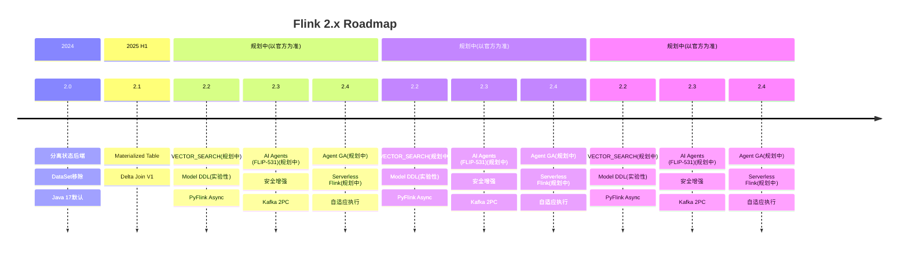
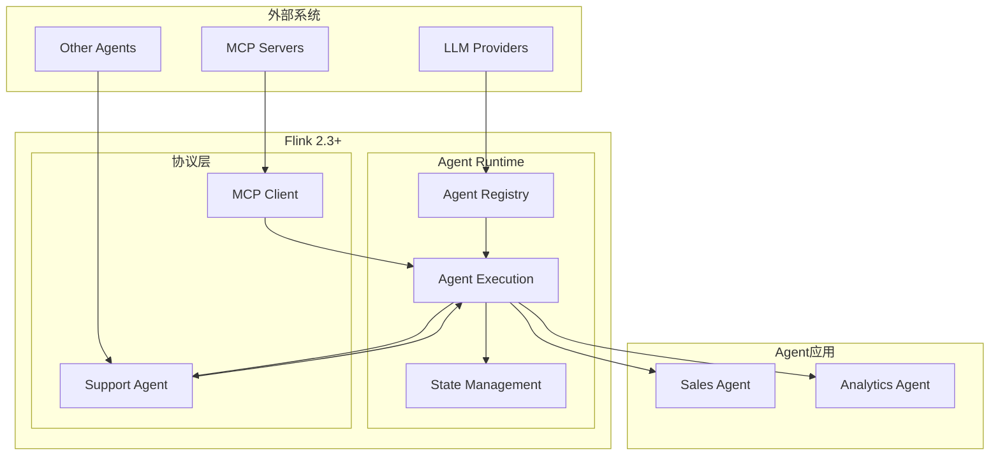

> **⚠️ 前瞻性内容风险声明**
>
> 本文档描述的技术特性处于早期规划或社区讨论阶段，**不代表 Apache Flink 官方承诺**。
>
> - 相关 FLIP 可能尚未进入正式投票，或可能在实现过程中发生显著变更
> - 预计发布时间基于社区讨论趋势分析，存在延迟或取消的风险
> - 生产环境选型请以 Apache Flink 官方发布为准
> - **最后核实日期**: 2026-04-19 | **信息来源**: 社区邮件列表/FLIP/官方博客
>\n# Flink 2.3/2.4 路线图与新特性全解

> **状态**: 前瞻 | **预计发布时间**: 2026-Q3 | **最后更新**: 2026-04-12
>
> ⚠️ 本文档描述的特性处于早期讨论阶段，尚未正式发布。实现细节可能变更。

> 所属阶段: Flink/08-roadmap | 前置依赖: [Flink 2.2前沿特性](../../02-core/flink-2.2-frontier-features.md) | 形式化等级: L3

## 1. 概念定义 (Definitions)

### Def-F-08-40: Flink 2.3 Release Scope

**Flink 2.3** 是2026年Q1-Q2发布的重要版本，聚焦：

```
发布周期: 预计发布时间(以官方为准)
主要主题: AI Agent支持、安全增强、性能优化
```

**关键改进领域**：

1. **AI/ML原生支持** (FLIP-531): Agent运行时
2. **安全增强**: TLS密码套件更新、SSL配置
3. **连接器生态**: Kafka 2PC改进、新Source/Sink
4. **SQL增强**: JSON函数、Hints优化
5. **运维改进**: 诊断工具、错误处理

### Def-F-08-41: FLIP-531 Flink AI Agents

**FLIP-531** 引入原生AI Agent支持：

```yaml
FLIP-531: "Building and Running AI Agents in Flink"
状态: MVP设计完成 (Q2 2025) → MVP实现 (Q3 2025)
目标: 提供企业级Agentic AI运行时
核心能力:
  - 事件驱动长运行Agent
  - MCP协议原生集成
  - A2A (Agent-to-Agent) 通信
  - 状态管理作为Agent记忆
  - 完全可重放性
API支持:
  - Java: Agent API / DataStream
  - Python: PyFlink Agent API
  - SQL: ~~CREATE AGENT~~ / ~~CREATE TOOL~~(未来可能的语法,概念设计阶段,实际尚未支持)
```

**路线图里程碑**：

| 阶段 | 时间 | 里程碑 |
|------|------|--------|
| MVP Design | Q2 2025 | 设计文档、API原型 |
| MVP Release | Q3 2025 | 模型支持、工具调用、可重放性 |
| Multi-Agent | Q4 2025 | A2A通信、示例Agent |
| GA | Late 2025 | 正式版发布、社区扩展 |

### Def-F-08-42: Security SSL Enhancement

**安全增强** (FLINK-39022)：

```
变更: security.ssl.algorithms 默认值更新
原因: JDK更新禁用 TLS_RSA_* 密码套件 (RFC 9325)
新默认值: TLS_ECDHE_RSA_WITH_AES_128_GCM_SHA256,TLS_ECDHE_RSA_WITH_AES_256_GCM_SHA384
影响: 支持JDK 11.0.30+, 17.0.18+, 21.0.10+, 24+
```

**兼容性**：

- 旧JDK: 自动降级兼容
- 新JDK: 强制前向安全

### Def-F-08-43: Kafka 2PC Integration

**Kafka两阶段提交改进** (FLIP-319)：

```
背景: KIP-939 (Kafka 2PC支持)
目标: 改进Flink Kafka Sink的exactly-once语义

当前问题:
  - 依赖Java反射调整事务处理
  - Kafka事务超时导致数据丢失风险

改进方案:
  - 原生支持Kafka 2PC参与
  - 消除反射调用
  - 更好的可维护性
```

### Def-F-08-44: Flink 2.4 Preview

**Flink 2.4预期特性** (基于路线图)：

```
预计时间: 2026 H2
核心主题:
  1. AI Agent GA (FLIP-531完成)
  2. 云原生增强:
     - Serverless Flink (按需扩容到0)
     - 更好的Kubernetes集成
  3. 性能优化:
     - 自适应执行引擎
     - 更智能的检查点策略
  4. SQL标准兼容:
     - ANSI SQL 2023
     - 更多标准函数
```

## 2. 属性推导 (Properties)

### Prop-F-08-40: Agent运行时扩展性

**命题**: Flink Agent支持水平扩展到数千个Agent实例：

$$
\text{Throughput} = n \cdot T_{single} \cdot (1 - \alpha)
$$

其中 $n$ 是TaskManager数量，$\alpha$ 是协调开销 (~5%)。

### Prop-F-08-41: SSL升级兼容性

**命题**: SSL配置更新保持向后兼容：

$$
\text{Compatible}(config_{old}, config_{new}) = \text{true}, \quad \forall JDK < 11.0.30
$$

### Lemma-F-08-40: Kafka 2PC延迟改进

**引理**: 原生2PC支持降低端到端延迟：

$$
L_{new} \leq L_{old} - L_{reflection} - L_{retry}
$$

预计减少 50-100ms 延迟。

## 3. 关系建立 (Relations)

### 3.1 Flink版本演进

```
Flink 1.x (2015-2024)
  ├── 1.17: 增量检查点改进
  ├── 1.18: Java 17支持、自适应调度
  └── 1.19: 最终1.x版本

Flink 2.x (2024+)
  ├── 2.0: 分离状态后端、DataSet移除、Java 17默认
  ├── 2.1: 物化表、Delta Join
  ├── 2.2: VECTOR_SEARCH、Model DDL、PyFlink Async
  ├── 2.3: AI Agents (FLIP-531)、安全增强、Kafka 2PC
  └── 2.4: Agent GA、Serverless、自适应执行 [预期]
```

### 3.2 AI生态集成

```
┌─────────────────────────────────────────────────────────────────┐
│                    AI Integration Landscape                     │
├─────────────────────────────────────────────────────────────────┤
│  Model Providers                                                │
│  ├── OpenAI (GPT-4/o1/o3)                                       │
│  ├── Anthropic (Claude)                                         │
│  ├── Google (Gemini)                                            │
│  └── Local Models (Llama/Qwen)                                  │
├─────────────────────────────────────────────────────────────────┤
│  Protocols                                                      │
│  ├── MCP (Model Context Protocol)                               │
│  ├── A2A (Agent-to-Agent)                                       │
│  └── Function Calling                                           │
├─────────────────────────────────────────────────────────────────┤
│  Flink Integration (2.3+)                                       │
│  ├── FLIP-531: Agent Runtime                                    │
│  ├── ML_PREDICT: SQL推理                                        │
│  ├── VECTOR_SEARCH: 向量检索                                     │
│  └── Async I/O: 大模型调用                                       │
└─────────────────────────────────────────────────────────────────┘
```

## 4. 论证过程 (Argumentation)

### 4.1 为什么Flink需要原生Agent支持？

**现有方案局限**：

1. **LangChain**: 单进程，无分布式状态
2. **Ray Serve**: 与Flink生态割裂
3. **自定义服务**: 需自建容错、扩展

**Flink Agent优势**：

1. **分布式状态**: RocksDB/ForSt持久化记忆
2. **事件驱动**: 毫秒级响应延迟
3. **水平扩展**: 自动负载均衡
4. **容错保证**: exactly-once语义
5. **生态集成**: Flink SQL/DataStream无缝衔接

### 4.2 迁移到Flink 2.3的考虑

**升级检查清单**：

```yaml
兼容性检查:
  - JDK版本: 确保 >= 11.0.30 或 < 11.0.30 有自定义SSL配置
  - Kafka版本: 如用2PC需 Kafka >= 3.0 (KIP-939)

新特性采用:
  - AI Agents: 需要模型API密钥、MCP Server配置
  - SQL Hints: 可选,用于性能调优

废弃功能检查:
  - DataSet API: 2.x已移除,需迁移到DataStream
  - Queryable State: 2.x已移除,使用远程状态查询
```

## 5. 形式证明 / 工程论证

### Thm-F-08-40: Agent可重放性定理

**定理**: Flink Agent执行完全可重放：

$$
\forall \text{Agent}, t_1, t_2: \text{Replay}(\text{Agent}, t_1, t_2) \equiv \text{Original}(t_1, t_2)
$$

**保证**：

- Checkpoint包含完整状态
- 输入事件可重放 (Kafka偏移量)
- LLM响应可Mock
- 工具调用可Stub

### Thm-F-08-41: SSL前向安全性定理

**定理**: 新SSL配置满足前向安全：

$$
\forall t: \text{Compromise}(key_t) \not\Rightarrow \text{Compromise}(traffic_{<t})
$$

**实现**: TLS_ECDHE_* 使用临时Diffie-Hellman密钥交换

## 6. 实例验证 (Examples)

### 6.1 Flink 2.3 升级配置

```yaml
# flink-conf.yaml 升级配置

# SSL安全更新 (必须)
security.ssl.algorithms: TLS_ECDHE_RSA_WITH_AES_128_GCM_SHA256,TLS_ECDHE_RSA_WITH_AES_256_GCM_SHA384

# 如需兼容旧JDK,显式添加旧套件
# security.ssl.algorithms: TLS_RSA_WITH_AES_128_GCM_SHA256,TLS_ECDHE_RSA_WITH_AES_128_GCM_SHA256

# AI Agent配置 (可选)
# 注: 以下为未来配置参数(概念),尚未正式实现
# 注意: 以下配置为预测/规划,实际版本可能不同
# ai.agent.enabled: true  (尚未确定)
ai.agent.model.provider: openai
ai.agent.model.endpoint: https://api.openai.com/v1
ai.agent.state.backend: rocksdb
ai.agent.checkpoint.interval: 60000

# Kafka 2PC配置 (可选)
sink.kafka.2pc.enabled: true
sink.kafka.transaction.timeout.ms: 900000
```

### 6.2 Maven依赖更新

```xml
<!-- Flink 2.3 BOM -->
<dependencyManagement>
    <dependencies>
        <dependency>
            <groupId>org.apache.flink</groupId>
            <artifactId>flink-bom</artifactId>
            <version>2.3.0</version>
            <type>pom</type>
            <scope>import</scope>
        </dependency>
    </dependencies>
</dependencyManagement>

<!-- AI Agent依赖 -->
<dependency>
    <groupId>org.apache.flink</groupId>
    <!-- 注: 以下为未来可能提供的模块(设计阶段),尚未正式发布 -->
<!-- 注意: 以下依赖为预测/规划,实际版本可能不同 -->
    <!-- <artifactId>flink-ai-agent</artifactId> (尚未确定) -->
</dependency>

<!-- MCP协议支持 -->
<dependency>
    <groupId>org.apache.flink</groupId>
    <!-- MCP连接器(规划中) -->
<artifactId>flink-mcp-connector</artifactId>
</dependency>

<!-- 更新Kafka连接器 -->
<dependency>
    <groupId>org.apache.flink</groupId>
    <artifactId>flink-connector-kafka</artifactId>
    <version>3.4.0</version>  <!-- 2PC支持版本 -->
</dependency>
```

### 6.3 Docker Compose部署 (2.3)

```yaml
version: '3.8'

services:
  jobmanager:
    image: flink:2.3.0-scala_2.12-java11
    ports:
      - "8081:8081"
    environment:
      - JOB_MANAGER_RPC_ADDRESS=jobmanager
      - FLINK_PROPERTIES=
          # 注: 未来配置参数(概念)
# 注意: 以下配置为预测/规划,实际版本可能不同
# ai.agent.enabled=true  (尚未确定)
          ai.agent.model.provider=openai
          ai.agent.model.api.key=${OPENAI_API_KEY}
    command: jobmanager

  taskmanager:
    image: flink:2.3.0-scala_2.12-java11
    depends_on:
      - jobmanager
    environment:
      - JOB_MANAGER_RPC_ADDRESS=jobmanager
      - FLINK_PROPERTIES=
          taskmanager.memory.network.fraction=0.2
          ai.agent.state.backend=rocksdb
    command: taskmanager
    volumes:
      - ./rocksdb-state:/opt/flink/state

  # MCP Server示例
  mcp-database:
    image: mcp/postgres-server:latest
    environment:
      - DATABASE_URL=postgresql://db:5432/analytics
    ports:
      - "3001:3000"
```

## 7. 可视化 (Visualizations)

### 7.1 Flink 2.x路线图



### 7.2 FLIP-531架构



## 8. 引用参考 (References)
