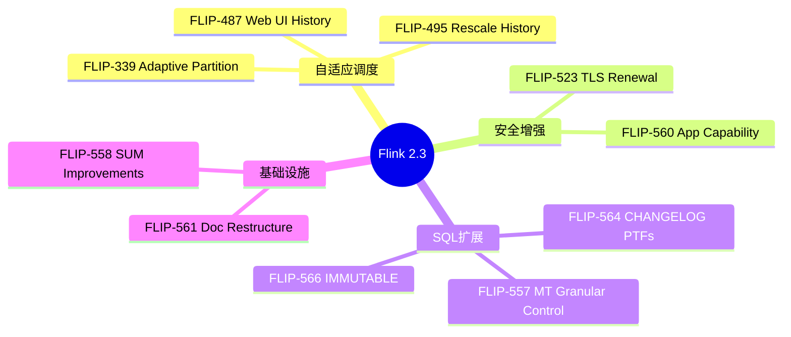
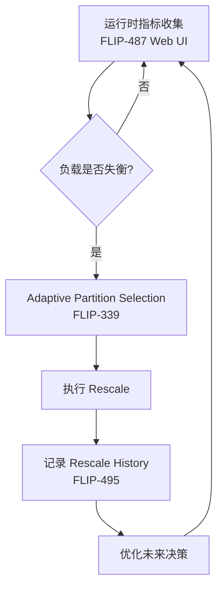

> **⚠️ 前瞻性内容风险声明**
>
> 本文档描述的技术特性处于早期规划或社区讨论阶段，**不代表 Apache Flink 官方承诺**。
>
> - 相关 FLIP 可能尚未进入正式投票，或可能在实现过程中发生显著变更
> - 预计发布时间基于社区讨论趋势分析，存在延迟或取消的风险
> - 生产环境选型请以 Apache Flink 官方发布为准
> - **最后核实日期**: 2026-04-21 | **信息来源**: 社区邮件列表/FLIP/官方博客
>
> ⚠️ **前瞻性声明 - 重要提示**
>
> **本文档内容为基于社区讨论的推测性分析，不代表 Apache Flink 官方承诺**
>
> | 属性 | 状态 |
> |------|------|
> | **Flink 2.3 官方状态** | 🟡 **Feature Freeze 进行中** - Feature Freeze 日期: 2026-03-31 |
> | **本文档性质** | 技术愿景 / 社区趋势分析 / 前瞻性预测 |
> | **发布时间预估** | 基于历史周期的推测 (2026 Q2-Q3) |
> | **特性确定性** | 中 - 取决于社区优先级和资源 |
>
> **说明**:
>
> - 本文档基于 Flink 社区邮件列表、FLIP 提案讨论和技术趋势进行分析
> - 所有特性描述均为**假设性设计**，实际版本可能完全不同
> - 如需了解 Flink 官方路线图，请参考 [Apache Flink 官方文档](https://nightlies.apache.org/flink/flink-docs-stable/roadmap/)
> - 当前稳定版本请参考 [Flink 2.2 官方发布说明](https://nightlies.apache.org/flink/flink-docs-stable/release-notes/flink-2.2/)
>
> | 最后更新 | 跟踪系统 |
> |----------|----------|
> | 2026-04-21 | [.tasks/flink-release-tracker.md](#) |

---

# Flink 2.3 版本完整跟踪文档

> 所属阶段: Flink/08-roadmap | 前置依赖: [Flink 2.2 Release](../flink-2.2-frontier-features.md), [Flink 2.3/2.4 路线图](flink-2.3-2.4-roadmap.md) | 形式化等级: L3
> **版本**: 2.3.0-preview | **状态**: 🔍 前瞻 | **Feature Freeze**: 2026-03-31

---

## 1. 概念定义 (Definitions)

### Def-F-08-80: Flink 2.3 Release Scope

**Flink 2.3** 是2026年中发布的版本，聚焦自适应调度增强、TLS证书热更新、SQL PTF扩展与文档重构：

```yaml
版本定位: "自适应与安全性增强版本"
预计发布周期: 2026 Q2-Q3
Feature Freeze: 2026-03-31
主要主题:
  1. 自适应调度: FLIP-495 Rescale History, FLIP-339 Adaptive Partition Selection
  2. 安全增强: FLIP-523 TLS Certificate Renewal
  3. SQL扩展: FLIP-564 FROM_CHANGELOG/TO_CHANGELOG PTFs
  4. 数据完整性: FLIP-558 SinkUpsertMaterializer Improvements
  5. 文档重构: FLIP-561 Restructure Flink Documentation
```

### Def-F-08-81: AdaptiveScheduler Rescale History (FLIP-495)

**FLIP-495** 允许 AdaptiveScheduler 记录和查询 rescale 历史：

$$
\mathcal{H}_{rescale} = \langle \mathcal{T}_{rescale}, \mathcal{M}_{before}, \mathcal{M}_{after}, \mathcal{R}_{reason} \rangle
$$

其中：

| 组件 | 符号 | 定义 | 描述 |
|------|------|------|------|
| 时间戳 | $\mathcal{T}_{rescale}$ | $\mathbb{R}^+$ | rescale 发生时间 |
| 变更前指标 | $\mathcal{M}_{before}$ | Metrics 快照 | rescale 前的性能指标 |
| 变更后指标 | $\mathcal{M}_{after}$ | Metrics 快照 | rescale 后的性能指标 |
| 触发原因 | $\mathcal{R}_{reason}$ | $\{load, failure, manual, policy\}$ | rescale 触发原因分类 |

**工程价值**：

- 用户可基于历史 rescale 行为优化未来扩缩容决策
- Web UI 展示 rescale 历史趋势（FLIP-487）

---

### Def-F-08-82: TLS Certificate Renewal (FLIP-523)

**FLIP-523** 提供 TLS 证书热更新能力：

$$
\mathcal{C}_{tls}(t) = \langle cert(t), keystore(t), truststore(t), \delta_{reload} \rangle
$$

其中 $\delta_{reload}$ 为证书变更检测到重新加载的最大延迟。

**核心能力**：

- 当底层 truststore/keystore 更新时自动重载证书
- 无需系统重启即可应用新证书
- 支持短期 TLS 证书的持续运行集群

---

### Def-F-08-83: FROM_CHANGELOG / TO_CHANGELOG PTFs (FLIP-564)

**FLIP-564** 引入内置 PTF（Polymorphic Table Function）支持 CDC 变更日志处理：

| PTF | 方向 | 语义 |
|-----|------|------|
| `FROM_CHANGELOG` | 输入 | 将自定义 CDC 格式解析为标准 changelog 流 |
| `TO_CHANGELOG` | 输出 | 将 retract/upsert 流转换为 append 流 |

**形式化定义**：

$$
\text{FROM_CHANGELOG}: \mathcal{S}_{cdc}^{custom} \rightarrow \mathcal{S}_{changelog}^{standard}
$$

$$
\text{TO_CHANGELOG}: \mathcal{S}_{retract/upsert} \rightarrow \mathcal{S}_{append}
$$

**意义**：`TO_CHANGELOG` 是第一个能将 retract/upsert 流变回 append 流的算子，解锁了新的流处理模式。

---

### Def-F-08-84: IMMUTABLE Columns Constraint (FLIP-566)

**FLIP-566** 引入不可变列约束，对 Delta Join 稳定性至关重要：

$$
\mathcal{C}_{immutable}(T, K, C) \equiv \forall r \in T, \forall r' \in \Delta T: r.K = r'.K \rightarrow r.C = r'.C
$$

即：对于给定主键 $K$，构成 Join Key 的列 $C$ 的值不可修改。

---

## 2. 属性推导 (Properties)

### Lemma-F-08-80: FLIP-495 历史查询单调性

**陈述**: Rescale 历史记录随时间单调增长：

$$
\forall t_1 < t_2: |\mathcal{H}_{rescale}(t_1)| \leq |\mathcal{H}_{rescale}(t_2)|
$$

**例外**: 显式历史清理操作可打破单调性。

---

### Lemma-F-08-81: FLIP-523 证书更新零停机

**陈述**: 在 FLIP-523 实现下，证书更新操作不会导致活跃连接中断：

$$
\forall c \in \text{Connections}_{active}: \text{downtime}(c, \Delta_{cert}) = 0
$$

**条件**: $\delta_{reload} < \text{TTL}_{cert_{old}}$，即新证书加载完成前旧证书仍有效。

---

### Prop-F-08-80: FLIP-564 的 CDC 表达能力等价性

**命题**: `FROM_CHANGELOG` + `TO_CHANGELOG` 组合可表达任意 CDC 流转换：

$$
\forall S_{in}, S_{out} \in \{\text{append}, \text{retract}, \text{upsert}\}: \exists PTF_{seq}: S_{in} \rightarrow S_{out}
$$

**工程意义**: 用户可在 SQL 层自由转换 changelog 模式，无需 DataStream API。

---

## 3. 关系建立 (Relations)

### 3.1 Flink 2.3 特性与版本映射

```
┌──────────────────────────────────────────────────────────────┐
│                 Flink 2.3 特性版本映射                          │
├──────────────────────────────────────────────────────────────┤
│                                                              │
│  Flink 2.3 (Feature Freeze: 2026-03-31)                      │
│  ├── FLIP-495: AdaptiveScheduler Rescale History (Accepted)  │
│  ├── FLIP-339: Adaptive Partition Selection (Accepted)       │
│  ├── FLIP-487: Rescale History in Web UI (Accepted)          │
│  ├── FLIP-523: TLS Certificate Renewal (讨论中)               │
│  ├── FLIP-558: SinkUpsertMaterializer Improvements (Accepted)│
│  ├── FLIP-560: Application Capability Enhancement (Accepted) │
│  ├── FLIP-561: Restructure Flink Documentation (Accepted)    │
│  ├── FLIP-564: FROM_CHANGELOG/TO_CHANGELOG PTFs (讨论中)      │
│  ├── FLIP-566: IMMUTABLE Columns Constraint (讨论中)          │
│  └── FLIP-557: Materialized Table Granular Control (讨论中)   │
│                                                              │
└──────────────────────────────────────────────────────────────┘
```

### 3.2 Flink 2.3 与 2.2 的关系

| 维度 | Flink 2.2 | Flink 2.3 |
|------|-----------|-----------|
| 发布日期 | 2025-12-04 | 预计 2026 Q2-Q3 |
| 核心主题 | AI/Vector/Delta Join GA | 自适应调度/安全/SQL PTF |
| 重大 FLIP | FLIP-531 MVP | FLIP-495/558/560/561 |
| 状态 | ✅ Released | 🔍 Feature Freeze |

---

## 4. 论证过程 (Argumentation)

### 4.1 为什么 Flink 2.3 聚焦自适应与安全？

Flink 2.2 完成了 AI 能力的 GA 化（VECTOR_SEARCH、ML_PREDICT、Delta Join），2.3 转向**基础设施成熟化**：

1. **自适应调度**（FLIP-495/339/487）: 2.2 的负载变化需要更智能的响应机制
2. **安全加固**（FLIP-523）: 生产环境对证书管理的要求日益严格
3. **SQL 表达力**（FLIP-564/566）: 补齐 SQL 层 CDC 处理能力

### 4.2 风险分析

| 风险 | 可能性 | 影响 | 缓解措施 |
|------|--------|------|----------|
| Feature Freeze 延期 | 中 | 中 | 社区已有明确日期，延期不超过2周 |
| FLIP-564 设计变更 | 高 | 低 | PTF 语法仍在讨论，API 可能调整 |
| FLIP-523 实现复杂度 | 中 | 中 | 分阶段实现，先支持 keystore 更新 |

---

## 5. 形式证明 / 工程论证

### Thm-F-08-80: Flink 2.3 自适应调度闭环正确性

**定理**: 在 FLIP-495 + FLIP-339 + FLIP-487 组合下，Flink 自适应调度形成**观察-决策-执行-学习**的完整闭环：

$$
\mathcal{L}_{adaptive} = \langle \mathcal{O}, \mathcal{D}, \mathcal{E}, \mathcal{H} \rangle
$$

其中：

- $\mathcal{O}$ (Observe): FLIP-487 Web UI 收集运行时指标
- $\mathcal{D}$ (Decide): FLIP-339 基于下游负载动态分区
- $\mathcal{E}$ (Execute): AdaptiveScheduler 执行 rescale
- $\mathcal{H}$ (Learn): FLIP-495 记录历史优化未来决策

**证明概要**:

1. **观察完整性**: Web UI metrics 覆盖所有 TaskManager 和 JobManager 状态
2. **决策收敛性**: 分区选择基于负载反馈，存在不动点
3. **执行原子性**: Rescale 通过 Checkpoint 保证状态一致性
4. **学习单调性**: Lemma-F-08-80 保证历史记录不丢失

$$
\therefore \mathcal{L}_{adaptive} \text{ 形成正确闭环}
$$

---

## 6. 实例验证 (Examples)

### 6.1 FLIP-495 Rescale History 查询示例

```java
// 通过 REST API 查询 rescale 历史
GET /jobs/{job-id}/rescale-history

Response:
{
  "rescales": [
    {
      "timestamp": "2026-04-21T10:30:00Z",
      "trigger": "load",
      "before": {"parallelism": 4, "cpu": 0.45},
      "after": {"parallelism": 8, "cpu": 0.38},
      "duration_ms": 12500
    }
  ]
}
```

### 6.2 FLIP-564 TO_CHANGELOG 使用示例

```sql
-- 将 upsert 流转换为 append 流
SELECT * FROM TO_CHANGELOG(
  SELECT user_id, latest_status
  FROM user_activities
  GROUP BY user_id
);
```

### 6.3 FLIP-523 TLS 热更新配置

```yaml
security.ssl.algorithms: TLSv1.3
security.ssl.cert-auto-reload: true
security.ssl.cert-check-interval: 5m
```

---

## 7. 可视化 (Visualizations)

### 7.1 Flink 2.3 特性雷达图



### 7.2 FLIP-495/339/487 自适应闭环



---

## 8. 引用参考 (References)
