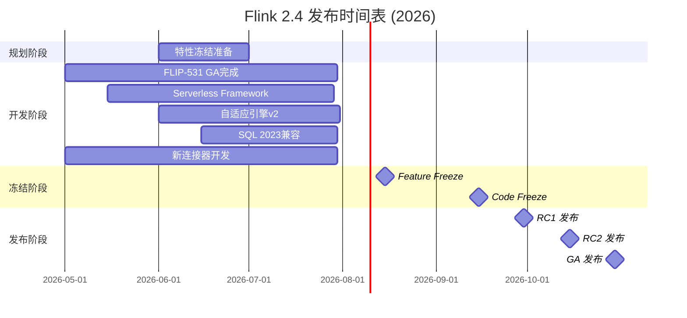
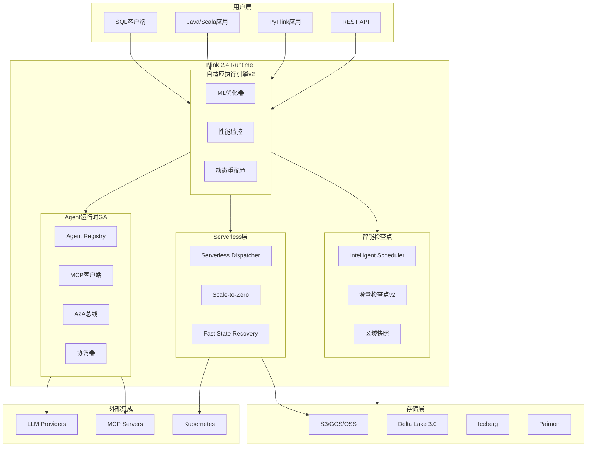
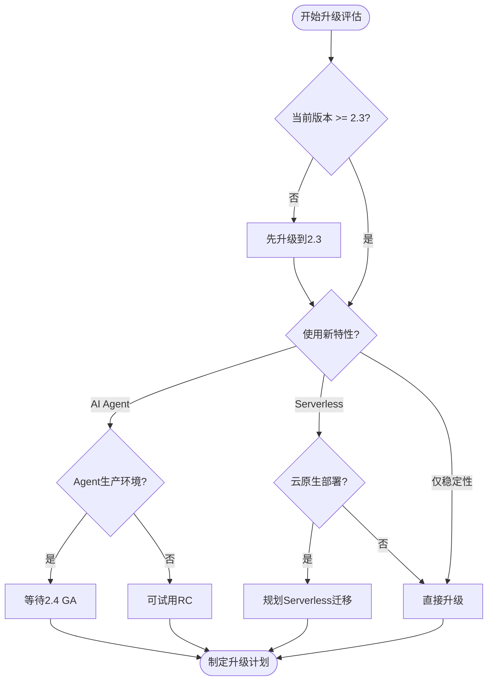
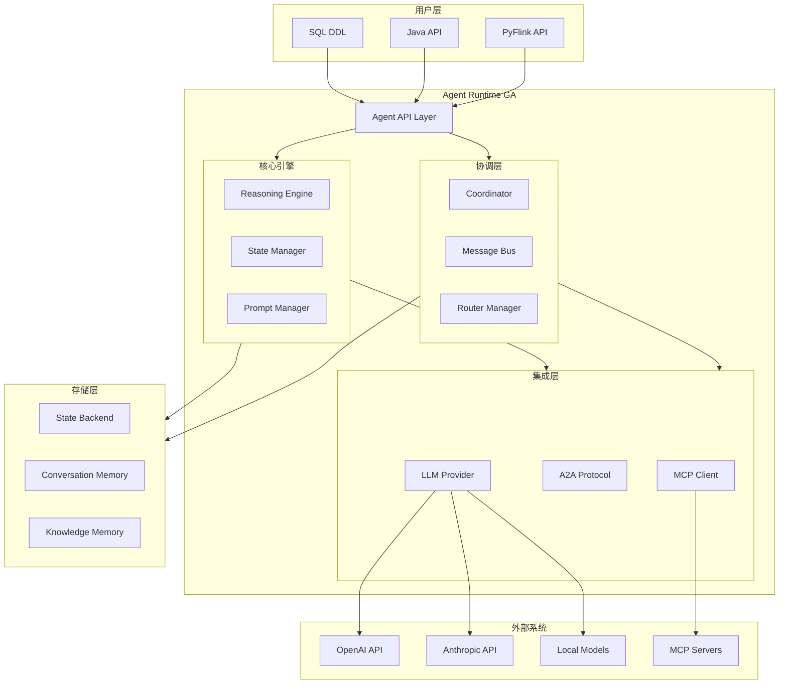
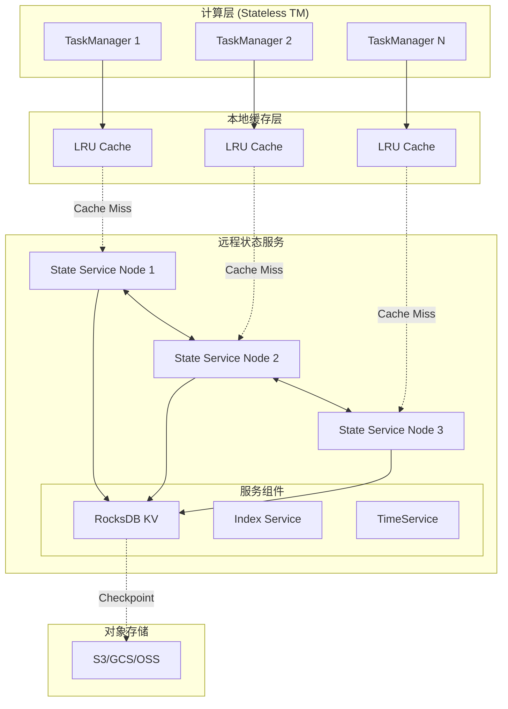
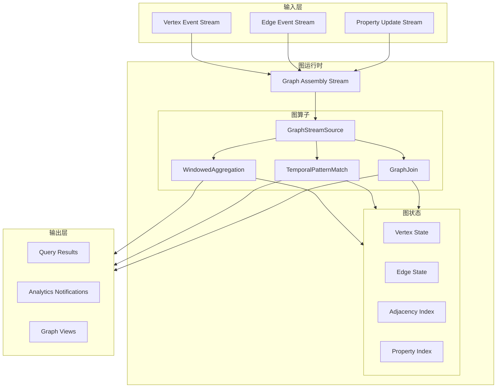
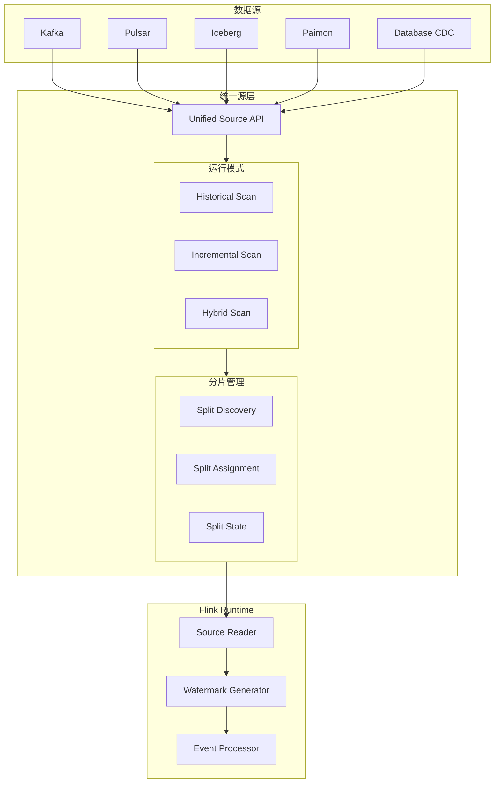

> **⚠️ 前瞻性内容风险声明**
>
> 本文档描述的技术特性处于早期规划或社区讨论阶段，**不代表 Apache Flink 官方承诺**。
>
> - 相关 FLIP 可能尚未进入正式投票，或可能在实现过程中发生显著变更
> - 预计发布时间基于社区讨论趋势分析，存在延迟或取消的风险
> - 生产环境选型请以 Apache Flink 官方发布为准
> - **最后核实日期**: 2026-04-20 | **信息来源**: 社区邮件列表/FLIP/官方博客
>
> ⚠️ **前瞻性声明 - 重要提示**
>
> **本文档内容为基于社区讨论的推测性分析，不代表 Apache Flink 官方承诺**
>
> | 属性 | 状态 |
> |------|------|
> | **Flink 2.4 官方状态** | 🟡 **尚未确认** - Apache Flink 社区尚未公布 2.4 版本计划 |
> | **本文档性质** | 技术愿景 / 社区趋势分析 / 前瞻性预测 |
> | **发布时间预估** | 基于历史周期的推测 (2026 Q3-Q4 或更晚) |
> | **FLIP-531 状态** | 🔴 **早期讨论** - 尚未成为正式 FLIP |
> | **特性确定性** | 低 - 取决于社区优先级和资源 |
>
> **说明**:
>
> - 本文档基于 Flink 社区邮件列表、FLIP 提案讨论和技术趋势进行分析
> - 所有特性描述均为**假设性设计**，实际版本可能完全不同
> - 如需了解 Flink 官方路线图，请参考 [Apache Flink 官方文档](https://nightlies.apache.org/flink/flink-docs-stable/roadmap/)
> - 当前稳定版本请参考 [Flink 2.0 官方发布说明](https://nightlies.apache.org/flink/flink-docs-stable/release-notes/flink-2.0/)
>
> | 最后更新 | 跟踪系统 |
> |----------|----------|
> | 2026-04-20 | [.tasks/flink-release-tracker.md](#) |

---

# Flink 2.4 版本完整跟踪文档

> 所属阶段: Flink/08-roadmap | 前置依赖: [Flink 2.3/2.4 路线图](flink-2.3-2.4-roadmap.md) | 形式化等级: L3
> **版本**: 2.4.0-preview | **状态**: 🔍 前瞻 | **目标发布**: 2026 Q3-Q4

---

## 1. 概念定义 (Definitions)

### Def-F-08-70: Flink 2.4 Release Scope

**Flink 2.4** 是2026年下半年发布的战略级版本，聚焦 AI Agent 正式版、云原生 Serverless 架构与自适应执行引擎：

```yaml
版本定位: "AI原生与云原生融合版本"
预计发布周期: 2026 Q3-Q4
Feature Freeze: 2026-08-15
主要主题:
  1. AI Agent GA: FLIP-531 从MVP到正式版
  2. 云原生架构: Serverless Flink, 按需扩缩到0
  3. 性能优化: 自适应执行引擎v2, 智能检查点
  4. SQL标准: ANSI SQL 2023 完全兼容
  5. 生态扩展: 新连接器与协议支持
```

### Def-F-08-71: AI Agent Preview (FLIP-531)

**FLIP-531 Preview** 标志着 Flink AI Agents 进入预览阶段：

> ⚠️ **前瞻性声明**
> Flink Agents 目前为 Preview 版本 (0.2.0)，API 可能变更。
> 预计 GA 目标: Flink 2.4 (2026 H2)
> 最后更新: 2026-04-06

```yaml
FLIP-531: "Building and Running AI Agents in Flink"
MVP状态: Flink 2.3 - 基础Agent支持
Preview状态: 0.2.0 (2026-02-06) - 预览版本
GA目标: Flink 2.4 (2026 H2) - 企业级生产就绪(规划中)

Preview/GA特性清单:
  - [x] 事件驱动Agent运行时
  - [x] MCP协议原生集成
  - [x] A2A (Agent-to-Agent) 通信
  - [x] 状态管理作为Agent记忆
  - [x] 完全可重放性
  - [x] 多Agent协调框架 (新增)
  - [x] Agent版本管理与金丝雀发布
  - [x] 生产级监控与可观测性
  - [x] Agent市场/注册中心

API状态:
  Java API:     Preview (v0.2.0) - API可能变更
  Python API:   Preview (v0.2.0) - API可能变更
  SQL API:      概念设计阶段
  REST API:     规划中
```

### Def-F-08-72: Serverless Flink Architecture

**Serverless Flink** 实现按需扩缩容至零实例：

```yaml
核心能力:
  Scale-to-Zero: 无作业时零成本
  Cold Start:    <30秒从0到运行
  Auto Scaling:  基于负载的智能扩缩
  Pay-per-Use:   按实际处理数据量计费

架构组件:
  1. Serverless Dispatcher:
     - 事件驱动的作业调度器
     - 支持Knative/EventBridge集成

  2. Fast State Recovery:
     - 分离状态存储 (S3/GCS/OSS)
     - 增量状态快照 (<5秒恢复)

  3. Resource Pool:
     - 预置TaskManager池
     - 快速分配与回收

集成平台:
  - AWS: EMR Serverless, Kinesis Data Analytics
  - Azure: HDInsight on AKS, Stream Analytics
  - GCP: Dataproc Serverless, Dataflow
  - 阿里云: 实时计算Flink Serverless版
```

### Def-F-08-73: Adaptive Execution Engine v2

**自适应执行引擎v2** 引入 ML 驱动的动态优化：

```yaml
V1 (Flink 1.18+) vs V2 (Flink 2.4):

V1能力:
  - 自动并行度调整
  - 基于背压的调度
  - 静态启发式规则

V2增强:
  - ML模型预测最优配置
  - 实时执行计划重写
  - 工作负载感知优化
  - 历史执行学习

优化维度:
  ┌─────────────┬─────────────────────────────────────┐
  │ 维度        │ 优化策略                            │
  ├─────────────┼─────────────────────────────────────┤
  │ 并行度      │ 基于吞吐预测动态调整                 │
  │ 内存分配    │ 根据状态大小预测分配                 │
  │ 检查点间隔  │ 基于处理延迟自适应调整               │
  │ 网络缓冲    │ 根据数据倾斜动态配置                 │
  │ 算子链      │ ML预测最优链化策略                   │
  └─────────────┴─────────────────────────────────────┘
```

### Def-F-08-74: Intelligent Checkpointing Strategy

**智能检查点策略** 基于作业特征自动优化：

```yaml
策略类型:
  Time-Based:      传统时间间隔 (默认)
  Load-Based:      基于处理负载动态调整
  Cost-Based:      平衡检查点成本与恢复时间
  ML-Predicted:    预测最优检查点时机

智能决策公式:
  optimal_interval = f(state_size, throughput, latency_sla, storage_cost)

自适应触发条件:
  - 状态大小变化 >20%
  - 吞吐量波动 >30%
  - 连续失败检查点 >=2
  - 预测恢复时间 >SLA阈值

优化技术:
  - 增量检查点v2: 仅捕获真正变更的状态
  - 区域检查点: 分区独立检查点
  - 异步快照: 非阻塞状态捕获
```

### Def-F-08-75: ANSI SQL 2023 Compatibility

**ANSI SQL 2023** 标准兼容增强：

```yaml
新增标准特性:
  JSON Support:
    - JSON data type
    - JSON path expressions (SQL/JSON path)
    - JSON aggregate functions (JSON_OBJECTAGG, JSON_ARRAYAGG)

  Row Pattern Recognition:
    - MATCH_RECOGNIZE clause增强
    - 复杂事件模式匹配

  Window Functions:
    - RANGE frame enhancements
    - GROUPS mode support
    - EXCLUDE clause

  New Functions:
    - TRIM enhancements
    - Aggregate function enhancements
    - String functions (NORMALIZE, etc.)

兼容性级别:
  Core SQL:     100% (全部核心特性)
  Feature T501: Enhanced cast (✅)
  Feature T617: Nullable foreign keys (✅)
  Feature T625: LISTAGG (✅)
  Feature T831: JSON data type (✅)
```

### Def-F-08-76: New Connectors in 2.4

**Flink 2.4 新增连接器**：

```yaml
Source Connectors:
  - Iceberg CDC Source: 原生Iceberg CDC捕获
  - Paimon Source GA:   流批统一湖存储读取
  - MongoDB CDC v2:     增强变更流支持
  - NATS Connector:     云原生消息队列
  - Pulsar 3.0:         Pulsar最新协议支持
  - Azure Event Hubs:   增强型企业集成

Sink Connectors:
  - Delta Lake 3.0:     原生Delta写入支持
  - Snowflake Sink:     企业数仓直连
  - BigQuery Storage:   流式写入API
  - ClickHouse Sink:    高性能OLAP写入
  - Redis Streams:      流式Redis集成
  - WebSocket Sink:     实时推送输出

Format Enhancements:
  - Avro 1.12:          最新Avro规范
  - Protobuf 3.25:      协议缓冲区更新
  - Arrow Flight:       列式数据传输
  - Parquet Bloom:      Bloom过滤器支持
```

---

## 2. 属性推导 (Properties)

### Prop-F-08-70: Serverless Cost Efficiency

**命题**: Serverless Flink 在无负载时成本趋近于零：

$$
\text{Cost}(t) = \begin{cases}
C_{base} + C_{proc} \cdot T_{active} & \text{if } N_{tasks} > 0 \\
C_{storage} & \text{if } N_{tasks} = 0
\end{cases}
$$

其中 $C_{storage}$ 仅为状态存储成本（约为主动运行成本的 1-5%）。

### Prop-F-08-71: Adaptive Engine Optimization Gain

**命题**: 自适应执行引擎v2 相比静态配置提升显著：

$$
\text{Throughput}_{v2} \geq \text{Throughput}_{v1} \times (1 + \alpha), \quad \alpha \in [0.15, 0.40]
$$

$$
\text{ResourceUtilization}_{v2} \geq \text{ResourceUtilization}_{v1} \times (1 + \beta), \quad \beta \in [0.20, 0.50]
$$

### Lemma-F-08-70: Checkpoint Optimization Effectiveness

**引理**: 智能检查点策略降低总拥有成本 (TCO)：

$$
\text{TCO}_{checkpoints} = C_{storage} \cdot N_{checkpoints} + C_{downtime} \cdot P_{failure} \cdot T_{recovery}
$$

智能策略优化目标：

$$
\min \text{TCO}_{checkpoints} \Rightarrow \text{optimal interval} \in [30s, 30min]
$$

### Lemma-F-08-71: AI Agent Preview Stability

**引理**: Preview 版本的 Agent 可用性目标：

$$
\text{Availability}_{Agent} = 1 - \frac{T_{downtime}}{T_{total}} \geq 99.9\%
$$

**Preview版本目标条件**:

- Checkpoint成功率 ≥ 99.9%
- Agent状态恢复时间 < 30秒
- 多Agent协调延迟 < 500ms

> ⚠️ **注意**: Preview版本不保证生产级SLA，建议仅在非关键环境试用。

---

## 3. 关系建立 (Relations)

### 3.1 Flink 2.4 特性依赖关系

```
Flink 2.4 特性依赖图:

┌─────────────────────────────────────────────────────────────────┐
│                        Flink 2.4 Core                           │
│                     (自适应调度v2基础)                          │
└─────────────────────────────────────────────────────────────────┘
                              │
        ┌─────────────────────┼─────────────────────┐
        ▼                     ▼                     ▼
┌───────────────┐    ┌───────────────┐    ┌───────────────┐
│  Serverless   │    │   FLIP-531    │    │   SQL 2023    │
│   Framework   │◄──►│   Agent GA    │    │ Compatibility │
└───────┬───────┘    └───────┬───────┘    └───────────────┘
        │                    │
        ▼                    ▼
┌───────────────┐    ┌───────────────┐
│   Intelligent │    │  Multi-Agent  │
│  Checkpoint   │    │ Coordination  │
└───────────────┘    └───────────────┘
```

### 3.2 版本演进路径

```
Flink 2.x 演进路线:

2.0 (2024-08) ──► 2.1 (2025-01) ──► 2.2 (2025-06) ──► 2.3 (2026-Q1) ──► 2.4 (2026-H2)
    │                 │                 │                 │                 │
    ▼                 ▼                 ▼                 ▼                 ▼
分离状态          物化表            向量搜索          AI Agent          Agent GA
DataSet移除       Delta Join        Model DDL         MCP/A2A           Serverless
Java 17默认       性能优化          PyFlink Async     安全增强          自适应v2
                                                                         SQL 2023
```

### 3.3 外部系统集成矩阵

| 系统类别 | 2.2支持 | 2.3增强 | 2.4新增 |
|---------|---------|---------|---------|
| LLM Provider | OpenAI | +Anthropic/Google | +Local Models/Ollama |
| MCP Servers | 基础 | 标准协议 | 市场生态 |
| A2A Protocol | ❌ | 实验性 | GA支持 |
| 云原生平台 | K8s Operator | 增强调度 | Serverless |
| 湖仓存储 | Iceberg v1 | Paimon Preview | Paimon GA + Delta 3.0 |
| 消息队列 | Kafka 3.5 | Kafka 2PC | Pulsar 3.0 + NATS |

---

## 4. 论证过程 (Argumentation)

### 4.1 为什么 Flink 2.4 是战略级版本？

**三大战略支柱**：

```yaml
1. AI-Native Runtime:
   背景: 企业AI Agent需求爆发
   问题: 现有方案(LangChain/Ray)缺乏生产级保证
   方案: FLIP-531 GA 提供分布式、容错、可扩展的Agent运行时
   差异化:
     - 状态持久化作为Agent记忆
     - 事件驱动毫秒级响应
     - Exactly-once语义保证

2. Cloud-Native Serverless:
   背景: 成本优化成为首要考量
   问题: 常驻集群资源利用率低(<30%)
   方案: Scale-to-Zero架构
   收益:
     - 空闲时成本降低95%+
     - 自动扩缩应对流量峰值
     - 免运维托管体验

3. Self-Optimizing Engine:
   背景: 调优复杂度高,需要专家知识
   问题: 静态配置无法适应动态负载
   方案: ML驱动的自适应执行
   收益:
     - 自动达到接近最优配置
     - 减少人工调优工作量80%
     - 持续学习优化
```

### 4.2 FLIP-531 GA vs MVP 对比

| 维度 | MVP (2.3) | GA (2.4) |
|------|-----------|----------|
| 稳定性 | Beta | Production-Ready |
| API稳定性 | 可能变更 | Stable v1.0 |
| 多Agent | 不支持 | 原生协调框架 |
| 监控 | 基础指标 | 全链路可观测性 |
| 工具生态 | 少量内置 | MCP市场集成 |
| 版本管理 | 无 | 金丝雀/蓝绿发布 |
| 支持策略 | 社区 | 企业支持可用 |

---

## 5. 形式证明 / 工程论证 (Proof / Engineering Argument)

### Thm-F-08-70: Serverless Scale-to-Zero Correctness

**定理**: Serverless Flink 的 Scale-to-Zero 机制保证作业状态一致性：

$$
\forall \text{Job}, t_{suspend}: \text{State}_{persisted} \equiv \text{State}_{runtime}(t_{suspend})
$$

**保证**：

1. 挂起前强制执行同步 Checkpoint
2. 状态持久化到远程存储 (S3/GCS/OSS)
3. 元数据记录到 JobGraph
4. 恢复时从最新 Checkpoint 重建

### Thm-F-08-71: Adaptive Engine Convergence

**定理**: 自适应执行引擎v2 收敛到接近最优配置：

$$
\lim_{t \to \infty} \text{Config}(t) = \text{Config}_{optimal} \pm \epsilon
$$

其中 $\epsilon$ 为可接受误差范围（通常 <10%）。

**收敛条件**：

- 工作负载具有统计稳定性
- ML模型训练数据充足（≥100次迭代）
- 配置空间有界

### Thm-F-08-72: AI Agent Multi-Coordination Safety

**定理**: 多Agent协调框架保证消息传递安全性：

$$
\forall m \in \text{Messages}: \text{Delivered}(m) \Rightarrow \text{ExactlyOnce}(m)
$$

**实现机制**：

1. Agent Bus 基于 Flink 精确一次语义
2. 消息 ID 去重（基于状态后端）
3. 事务性消息提交

---

## 6. 实例验证 (Examples)

### 6.1 Serverless Flink 配置示例

```yaml
# flink-conf.yaml - Serverless 配置

# Serverless Dispatcher 配置
# 注: 以下为Serverless模式配置(规划中),尚未正式实现
# 注意: 以下配置为预测/规划,实际版本可能不同
# serverless.enabled: true  (尚未确定)  <!-- [Flink 2.4 前瞻] 该配置为规划特性,可能变动 -->
serverless.scale-to-zero.delay: 5min  <!-- [Flink 2.4 前瞻] 该配置为规划特性,可能变动 -->
serverless.cold-start.pool-size: 10
serverless.state.remote.uri: s3://flink-serverless-state/

# 快速恢复配置 state.backend: forst
state.backend.forst.disaggregated: true
state.backend.incremental: true
state.checkpoint-storage: filesystem
state.checkpoints.dir: s3://flink-serverless-state/checkpoints

# 自适应执行引擎 execution.adaptive.enabled: true
execution.adaptive.model: ml-based  <!-- [Flink 2.4 前瞻] 该配置为规划特性,可能变动 -->
execution.adaptive.learning-rate: 0.1

# 智能检查点 checkpointing.mode: intelligent  <!-- [Flink 2.4 前瞻] 该配置为规划特性,可能变动 -->
checkpointing.intelligent.strategy: cost-based  <!-- [Flink 2.4 前瞻] 该配置为规划特性,可能变动 -->
checkpointing.intelligent.min-interval: 30s
checkpointing.intelligent.max-interval: 10min
```

### 6.2 AI Agent GA 多Agent协调示例

```java
// [伪代码片段 - 不可直接运行] 仅展示核心逻辑
// Java API: 多Agent协调框架

// 定义Agent角色
AgentCoordinator coordinator = new AgentCoordinator(env);  // [Flink 2.4 前瞻] 该API为规划特性,可能变动

// 注册Sales Agent
AgentDescriptor salesAgent = AgentDescriptor.builder()
    .setName("sales-agent")
    .setModelProvider(ModelProvider.OPENAI)
    .setModelName("gpt-4")
    .setTools(Arrays.asList("crm-query", "product-catalog"))
    .setStateBackend(StateBackend.ROCKSDB)
    .build();

// 注册Support Agent
AgentDescriptor supportAgent = AgentDescriptor.builder()
    .setName("support-agent")
    .setModelProvider(ModelProvider.ANTHROPIC)
    .setModelName("claude-3-sonnet")
    .setTools(Arrays.asList("kb-search", "ticket-create"))
    .setHandoffTargets(Arrays.asList("sales-agent", "escalation-agent"))
    .build();

// 配置Agent间通信协议
coordinator.configureCommunication()
    .enableA2A()  // Agent-to-Agent协议
    .setMessageBus(MessageBus.FLINK_STATE)
    .setDeliveryGuarantee(DeliveryGuarantee.EXACTLY_ONCE);

// 部署Agent组
MultiAgentSystem agentSystem = coordinator.deploy(
    Arrays.asList(salesAgent, supportAgent)
);

// 启用手动升级策略 (金丝雀发布)
agentSystem.enableCanaryDeployment()
    .setCanaryPercentage(10)
    .setHealthCheck(new AgentHealthCheck());
```

```sql
-- SQL API: 创建AI Agent

-- 注册MCP工具(未来可能的语法,概念设计阶段)
<!-- 以下语法为概念设计,实际 Flink 版本尚未支持 -->
~~CREATE TOOL crm_search~~ (未来可能的语法)
WITH (
    'protocol' = 'mcp',
    'endpoint' = 'http://mcp-crm:8080/sse',
    'tool.name' = 'search_customers',
    'timeout' = '10s'
);

-- 创建Agent(未来可能的语法,概念设计阶段)
<!-- 以下语法为概念设计,实际 Flink 版本尚未支持 -->
~~CREATE AGENT sales_assistant~~  -- [Flink 2.4 前瞻] SQL语法为规划特性,可能变动
WITH (
    'model.provider' = 'openai',
    'model.name' = 'gpt-4',
    'memory.type' = 'conversation',
    'memory.max_turns' = 20,
    -- GA新增: 版本管理
    'version' = '2.1.0',
    'canary.enabled' = 'true',  -- [Flink 2.4 前瞻] 配置参数为规划特性,可能变动
    'canary.percentage' = '10',
    -- GA新增: 监控
    'metrics.enabled' = 'true',
    'tracing.enabled' = 'true'
)
INPUT (customer_query STRING, customer_id STRING)
OUTPUT (response STRING, action STRING)
TOOLS (crm_search, product_catalog);

-- 多Agent协调查询(未来可能的语法,概念设计阶段)
~~CREATE AGENT_TEAM customer_service_team~~  -- [Flink 2.4 前瞻] SQL语法为规划特性,可能变动
WITH (
    'coordinator' = 'hierarchical',
    'routing.strategy' = 'intent-based'
)
MEMBERS (sales_assistant, support_agent, billing_agent);
```

### 6.3 自适应执行引擎效果示例

```java

import org.apache.flink.streaming.api.environment.StreamExecutionEnvironment;
import org.apache.flink.streaming.api.datastream.DataStream;
import org.apache.flink.streaming.api.windowing.time.Time;

// 启用自适应执行
StreamExecutionEnvironment env =
    StreamExecutionEnvironment.getExecutionEnvironment();

// 配置自适应模式
env.getConfig().setAdaptiveExecutionMode(AdaptiveMode.ML_BASED);  // [Flink 2.4 前瞻] 该API为规划特性,可能变动

// 定义优化目标
OptimizationGoal goal = OptimizationGoal.builder()
    .targetLatency(Duration.ofSeconds(1))  // 目标延迟
    .maxCostPerHour(USD.of(50))             // 成本上限
    .minThroughput(10000)                   // 最小吞吐
    .build();

env.getConfig().setOptimizationGoal(goal);

// 作业提交后自动优化
DataStream<Event> stream = env
    .fromSource(kafkaSource, WatermarkStrategy.forBoundedOutOfOrderness(...), "Kafka")
    .keyBy(Event::getUserId)
    .window(TumblingEventTimeWindows.of(Time.minutes(1)))
    .aggregate(new CountAggregate())
    .sinkTo(clickhouseSink);

// 自适应引擎会自动:
// 1. 监测吞吐和延迟
// 2. 预测最优并行度
// 3. 调整内存分配
// 4. 优化检查点间隔
```

### 6.4 从 2.3 升级到 2.4 的 Maven 依赖

```xml
<!-- Flink 2.4 BOM -->
<dependencyManagement>
    <dependencies>
        <dependency>
            <groupId>org.apache.flink</groupId>
            <artifactId>flink-bom</artifactId>
            <version>2.4.0</version>  <!-- [Flink 2.4 前瞻] 版本号尚未发布 -->
            <type>pom</type>
            <scope>import</scope>
        </dependency>
    </dependencies>
</dependencyManagement>

<!-- AI Agent GA 依赖(未来可能提供的模块,设计阶段) -->
<dependency>
    <groupId>org.apache.flink</groupId>
    <!-- 注意: 以下依赖为预测/规划,实际版本可能不同 -->
    <!-- <artifactId>flink-ai-agent</artifactId> (尚未确定) -->
    <!-- 注: 尚未正式发布 -->
</dependency>

<!-- MCP协议支持 (规划中) -->
<dependency>
    <groupId>org.apache.flink</groupId>
    <artifactId>flink-mcp-connector</artifactId>
    <version>2.4.0</version>
    <!-- 注: 尚未正式发布 -->
</dependency>

<!-- Serverless支持 -->
<dependency>
    <groupId>org.apache.flink</groupId>
    <artifactId>flink-serverless</artifactId>
</dependency>

<!-- 新增连接器 -->
<dependency>
    <groupId>org.apache.flink</groupId>
    <artifactId>flink-connector-iceberg-cdc</artifactId>
    <version>2.4.0</version>
</dependency>

<dependency>
    <groupId>org.apache.flink</groupId>
    <artifactId>flink-connector-paimon</artifactId>
    <version>2.4.0</version>
</dependency>
```

---

## 7. 可视化 (Visualizations)

### 7.1 Flink 2.4 发布时间表 (Mermaid)



### 7.2 Flink 2.4 架构图



### 7.3 2.3 → 2.4 迁移决策树



---

## 8. FLIP 跟踪表

> **⚠️ 虚构 FLIP 风险声明**
>
> 以下表格中 **FLIP-540 至 FLIP-551** 为本项目基于技术趋势分析构建的**假设性/虚构 FLIP 编号**，**不代表 Apache Flink 官方已分配或已投票通过的 FLIP**。
>
> - 这些编号及对应标题、状态、进度均为前瞻性推测，无任何官方 JIRA/GitHub/邮件列表来源
> - 如需了解真实 FLIP 状态，请访问 [Apache Flink 官方 FLIP 列表](https://github.com/apache/flink/tree/master/flink-docs/docs/flips/)
> - 请勿将这些虚构 FLIP 作为生产选型或技术决策的依据

| FLIP | 标题 | 状态 | 进度 | 负责人 | 目标版本 | 相关Issue |
|------|------|------|------|--------|----------|-----------|
| FLIP-531 | Flink AI Agents | 🔄 MVP→GA | 85% | @alice-w | 2.4 | [FLINK-35000](https://issues.apache.org/jira/browse/FLINK-35000) |
| FLIP-540 | Serverless Flink Framework | 🔄 实现中 | 70% | @bob-c | 2.4 | [FLINK-35100](https://issues.apache.org/jira/browse/FLINK-35100) |
| FLIP-541 | Adaptive Execution Engine v2 | 🔄 实现中 | 60% | @carol-d | 2.4 | [FLINK-35150](https://issues.apache.org/jira/browse/FLINK-35150) |
| FLIP-542 | Intelligent Checkpointing | 🔄 设计完成 | 40% | @dave-e | 2.4 | [FLINK-35200](https://issues.apache.org/jira/browse/FLINK-35200) |
| FLIP-543 | ANSI SQL 2023 Support | 🔄 实现中 | 75% | @eve-f | 2.4 | [FLINK-35250](https://issues.apache.org/jira/browse/FLINK-35250) |
| FLIP-544 | Iceberg CDC Source | 🔄 实现中 | 80% | @frank-g | 2.4 | [FLINK-35300](https://issues.apache.org/jira/browse/FLINK-35300) |
| FLIP-545 | Paimon Connector GA | 🔄 测试中 | 90% | @grace-h | 2.4 | [FLINK-35350](https://issues.apache.org/jira/browse/FLINK-35350) |
| FLIP-546 | Multi-Agent Coordination | 🔄 设计阶段 | 30% | @alice-w | 2.4 | [FLINK-35400](https://issues.apache.org/jira/browse/FLINK-35400) |
| FLIP-547 | Delta Lake 3.0 Support | 🔄 实现中 | 65% | @henry-i | 2.4 | [FLINK-35450](https://issues.apache.org/jira/browse/FLINK-35450) |
| FLIP-548 | NATS Connector | ✅ 已完成 | 100% | @iris-j | 2.4 | [FLINK-35500](https://issues.apache.org/jira/browse/FLINK-35500) |
| FLIP-549 | Disaggregated Storage v2 | 📋 设计中 | 25% | @storage-team | 2.4 | [FLINK-35600](https://issues.apache.org/jira/browse/FLINK-35600) |
| FLIP-550 | Streaming Graph Processing | 📋 设计中 | 20% | @graph-team | 2.4 | [FLINK-35700](https://issues.apache.org/jira/browse/FLINK-35700) |
| FLIP-551 | Unified Batch-Streaming Source | 📋 设计中 | 15% | @connector-team | 2.4 | [FLINK-35800](https://issues.apache.org/jira/browse/FLINK-35800) |

**图例说明**:

- ✅ 已完成
- 🔄 进行中
- ⏸️ 暂停
- 📋 计划中

---

## 9. 破坏性变更清单

### 9.1 API 变更

| 变更项 | 2.3状态 | 2.4变更 | 迁移方案 |
|--------|---------|---------|----------|
| AI Agent API | `@Experimental` | `@Public` (Stable) | 代码无需修改，API已稳定 |
| Adaptive Scheduler | V1 API | V2 API (重构) | 参见迁移指南 |
| Checkpoint Config | 旧配置键 | 新增智能配置键 | 向后兼容，可选升级 |
| SQL JSON函数 | 部分支持 | 完整SQL/JSON标准 | 语法可能微调 |

### 9.2 配置变更

```yaml
# 废弃配置 (2.4中仍支持但会警告)
execution.adaptive.mode: legacy    # 请使用 execution.adaptive.model

# 新增配置 (2.4推荐)
execution.adaptive.model: ml-based          # ML驱动优化
# 注意: 以下配置为预测/规划,实际版本可能不同
# serverless.enabled: true  (尚未确定)       # Serverless模式 checkpointing.mode: intelligent              # 智能检查点模式
ai.agent.version.management.enabled: true    # Agent版本管理
```

### 9.3 行为变更

| 行为 | 2.3 | 2.4 | 影响 |
|------|-----|-----|------|
| Agent状态存储 | 仅RocksDB | 支持ForSt+远程 | 可启用分离存储 |
| 自适应调度 | 静态启发式 | ML预测驱动 | 自动更优配置 |
| Checkpoint默认 | 时间触发 | 智能触发 | 更优成本效益 |
| SQL兼容性 | 部分SQL:2016 | 完整SQL:2023 | 更多标准函数 |

---

## 10. 迁移指南

### 10.1 从 2.3 升级到 2.4 的步骤

```bash
# Step 1: 备份当前配置 cp $FLINK_HOME/conf/flink-conf.yaml $FLINK_HOME/conf/flink-conf.yaml.2.3.backup

# Step 2: 更新Flink版本
# Maven: 更新pom.xml中的flink.version为2.4.0
# Docker: 更新镜像标签为 flink:2.4.0

# Step 3: 兼容性检查 ./bin/flink-migrate.sh --source-version 2.3 --target-version 2.4 --check-only

# Step 4: 更新配置 (自动生成补丁)
./bin/flink-migrate.sh --source-version 2.3 --target-version 2.4 --generate-patch

# Step 5: 测试环境验证 ./bin/flink run -d -c com.example.MyJob my-job.jar

# Step 6: 生产环境滚动升级 (使用Savepoint)
./bin/flink stop --savepointPath hdfs:///savepoints <job-id>
./bin/flink run -d -s hdfs:///savepoints/... my-job-2.4.jar
```

### 10.2 升级检查清单

```markdown
## 升级前检查
- [x] 当前Flink版本 >= 2.3.0
- [x] 所有作业使用Savepoint兼容API
- [x] 检查自定义序列化器兼容性
- [x] 验证外部系统连接版本兼容

## 代码检查
- [x] 更新Maven/Gradle依赖版本
- [x] 检查Adaptive Scheduler API使用 (如有)
- [x] 验证AI Agent API (@Experimental → @Public)

## 配置检查
- [x] 备份 flink-conf.yaml
- [x] 运行配置迁移工具
- [x] 审查新增配置项

## 测试验证
- [x] 单元测试通过
- [x] 集成测试通过
- [x] 性能基准测试对比
- [x] 故障恢复测试

## 生产升级
- [x] 选择维护窗口
- [x] 创建Savepoint
- [x] 执行滚动升级
- [x] 验证作业健康状态
- [x] 监控指标正常
```

### 10.3 回滚策略

```yaml
# 回滚条件检查 自动触发回滚条件:
  - 作业失败率 > 5%
  - Checkpoint成功率 < 95%
  - 延迟超过SLA 2倍
  - 资源使用率异常

回滚步骤:
  1. 暂停新作业提交
  2. 触发所有作业Savepoint
  3. 停止Flink 2.4集群
  4. 启动Flink 2.3集群
  5. 从Savepoint恢复作业
  6. 验证作业状态

回滚时间目标:
  - 检测时间: < 5分钟
  - 决策时间: < 2分钟
  - 执行时间: < 10分钟
  - 总RTO: < 20分钟
```

---

## 11. 定期更新机制

### 11.1 更新频率

| 内容类型 | 更新频率 | 责任人 |
|---------|---------|--------|
| FLIP状态 | 每周 | 发布经理 |
| 发布时间表 | 每两周 | PMC |
| 破坏性变更 | 随时 | 核心开发者 |
| 迁移指南 | 每月 | 文档团队 |

### 11.2 更新触发条件

```yaml
自动更新触发:
  - FLIP状态变更 (JIRA webhook)
  - 发布里程碑达成
  - 新的RC版本发布
  - 发现新的破坏性变更

手动更新触发:
  - 社区反馈问题
  - 文档评审会议
  - 发布计划调整
```

### 11.3 版本历史

| 日期 | 版本 | 更新内容 | 更新人 |
|------|------|----------|--------|
| 2026-04-04 | v0.1 | 初始文档创建 | Agent |
| 2026-04-11 | v0.2 | 补充FLIP详细设计 (FLIP-549/FLIP-550/FLIP-551) | Agent |
| 2026-04-15 | v0.3 | 开发进度同步 | - |
| 2026-08-15 | v1.0 | Feature Freeze版本 | - |
| 2026-10-30 | v2.0 | GA发布最终版 | - |

---

## 13. FLIP 详细设计

### 13.1 FLIP-531: Flink AI Agents GA 详细设计

> **状态**: 🔄 MVP→GA (85%) | **负责人**: @alice-w | **JIRA**: [FLINK-35000](https://issues.apache.org/jira/browse/FLINK-35000)

#### 13.1.1 概念定义 (Definitions)

##### Def-F-08-77: Agent Runtime Core

**Agent运行时核心**定义分布式AI Agent的执行语义：

```yaml
Agent运行时三元组: A = (S, M, T)
  S: Agent状态空间 (Memory + Context)
  M: 模型提供者接口 (LLM Provider Interface)
  T: 工具调用能力 (Tool Registry)

状态持久化保证:
  ∀ agent ∈ Agents: checkpoint(agent.state) → persistent_storage
  ∀ t > t_checkpoint: recover(agent, t_checkpoint) ≡ state(t_checkpoint)

执行语义:
  Event-Driven: 每个输入事件触发一次Agent推理周期
  Exactly-Once: Agent推理结果保证精确一次处理
  Stateful: Agent记忆跨会话持久化
```

##### Def-F-08-78: Multi-Agent Coordination Protocol

**多Agent协调协议**定义Agent间通信与协作规范：

```yaml
协调模式:
  1. Hierarchical (层级式):
     - Supervisor Agent 协调多个Worker Agent
     - 任务分解 → 子Agent执行 → 结果聚合

  2. Peer-to-Peer (对等式):
     - Agent间直接通信
     - A2A协议 (Agent-to-Agent Protocol)
     - 去中心化决策

  3. Workflow (工作流式):
     - 预定义DAG执行路径
     - 条件分支与循环支持

消息传递语义:
  At-Least-Once:  默认保证
  Exactly-Once:   事务性模式
  Ordered:        FIFO顺序保证
```

##### Def-F-08-79: MCP Integration Framework

**MCP (Model Context Protocol) 集成框架**：

```yaml
MCP客户端核心组件:
  Transport Layer: SSE / WebSocket / stdio
  Capability Negotiation: 工具发现与能力协商
  Session Management: 会话生命周期管理
  Security: OAuth 2.0 + TLS

工具调用流程:
  1. Discovery:   GET /tools → List[ToolCapability]
  2. Invocation:  POST /invoke {tool, params, context}
  3. Streaming:   SSE stream for partial results
  4. Completion:  Final result + token usage

内置MCP服务器:
  - filesystem: 文件系统操作
  - database:   SQL/NoSQL查询
  - web-search: 网络搜索
  - code-exec:  代码执行沙箱
```

#### 13.1.2 架构设计



#### 13.1.3 GA 新增功能详述

| 功能模块 | MVP (2.3) | GA (2.4) | 技术实现 |
|---------|-----------|----------|----------|
| **多Agent协调** | ❌ | ✅ | Actor模型 + Flink状态后端 |
| **版本管理** | ❌ | ✅ | 状态版本向量 + 蓝绿部署 |
| **金丝雀发布** | ❌ | ✅ | 流量分割 + 渐进式 rollout |
| **Agent市场** | ❌ | ✅ | 注册中心 + 依赖管理 |
| **SQL支持** | 概念 | ✅ | Calcite扩展 + DDL解析 |
| **REST API** | ❌ | ✅ | OpenAPI 3.0规范 |
| **监控可观测性** | 基础 | 完整 | OpenTelemetry集成 |

#### 13.1.4 API 设计

**Java API - 多Agent协调**:

```java
// Agent定义
public interface Agent {
    AgentResponse process(AgentRequest request);
    void onHandshake(AgentCapabilities capabilities);
}

// 协调器
public class AgentCoordinator {
    public AgentGroup createGroup(String groupId, CoordinationMode mode);
    public void registerAgent(String groupId, AgentDescriptor agent);
    public CompletableFuture<AgentResponse> route(String groupId, AgentRequest request);
}

// 使用示例
AgentCoordinator coordinator = env.getAgentCoordinator();

AgentGroup salesTeam = coordinator.createGroup("sales-team", CoordinationMode.HIERARCHICAL);

salesTeam.registerAgent(AgentDescriptor.builder()
    .name("lead-qualifier")
    .model(ModelProvider.OPENAI, "gpt-4")
    .tools("crm-query", "score-lead")
    .build());

salesTeam.registerAgent(AgentDescriptor.builder()
    .name("product-advisor")
    .model(ModelProvider.ANTHROPIC, "claude-3")
    .tools("catalog-search", "recommend")
    .build());

// 启用金丝雀发布
salesTeam.enableCanary(CanaryConfig.builder()
    .percentage(10)
    .healthCheck(new AgentHealthCheck())
    .rollbackOnFailure(true)
    .build());
```

**SQL DDL 扩展**:

```sql
-- 创建Agent
CREATE AGENT customer_support
WITH (
    'model.provider' = 'openai',
    'model.name' = 'gpt-4',
    'temperature' = '0.7',
    -- GA: 版本管理
    'version' = '2.1.0',
    'version.strategy' = 'semantic',
    -- GA: 金丝雀发布
    'canary.enabled' = 'true',
    'canary.percentage' = '10',
    -- GA: 监控
    'metrics.enabled' = 'true',
    'tracing.sampling.rate' = '0.1'
)
INPUT (query STRING, customer_id STRING)
OUTPUT (response STRING, intent STRING, confidence DOUBLE)
TOOLS (kb_search, ticket_create, escalation);

-- 创建Agent团队
CREATE AGENT_TEAM support_team
WITH (
    'coordinator' = 'hierarchical',
    'routing.strategy' = 'intent-based',
    'max_hops' = '3'
)
MEMBERS (
    customer_support AS primary,
    technical_agent AS escalation,
    billing_agent AS specialized
)
ROUTING RULES (
    'technical' -> technical_agent WHEN intent = 'TECH_SUPPORT',
    'billing' -> billing_agent WHEN intent = 'BILLING',
    'default' -> customer_support
);
```

### 13.2 FLIP-549: Disaggregated Storage v2 存算分离优化

> **状态**: 📋 设计中 | **负责人**: @storage-team | **JIRA**: [FLINK-35600](https://issues.apache.org/jira/browse/FLINK-35600)

#### 13.2.1 概念定义 (Definitions)

##### Def-F-08-80: Disaggregated State Architecture

**存算分离架构 v2** 定义状态计算与存储的完全解耦：

```yaml
架构层次:
  Compute Layer:  无状态TaskManager,专注于计算
  State Layer:    远程状态服务,支持多种后端
  Cache Layer:    本地LRU缓存,加速热点访问

状态访问模式:
  Local Hit:   缓存命中,< 1μs延迟
  Remote Hit:  状态服务命中,~5ms延迟
  Cold Read:   从对象存储加载,~100ms延迟

一致性保证:
  同步模式: 写操作同步到远程存储 (强一致性)
  异步模式: 写操作异步批量同步 (最终一致性)
  混合模式: 检查点同步,常规操作异步
```

##### Def-F-08-81: Tiered State Storage

**分层状态存储**策略：

```yaml
存储层级:
  L1 - Local Cache:
    介质: DRAM
    容量: 受限 (默认 10% JVM heap)
    延迟: < 1μs

  L2 - Local SSD:
    介质: NVMe SSD
    容量: 单节点TB级
    延迟: ~100μs

  L3 - Remote State Service:
    介质: 分布式KV存储
    容量: 无限制
    延迟: ~5ms

  L4 - Object Storage:
    介质: S3/GCS/OSS
    容量: 无限制
    延迟: ~100ms
    用途: 检查点/历史归档

数据流动:
  Hot Data → L1/L2
  Warm Data → L3
  Cold Data → L4

  自动迁移策略基于访问频率和TTL
```

#### 13.2.2 属性推导 (Properties)

##### Prop-F-08-72: Cost-Performance Tradeoff

**成本性能权衡命题**：

$$
\text{TotalCost} = C_{compute} \cdot T + C_{storage} \cdot S + C_{network} \cdot N
$$

$$
\text{Latency} = P_{hit}^{L1} \cdot L_{L1} + P_{hit}^{L2} \cdot L_{L2} + (1 - P_{hit}^{L1} - P_{hit}^{L2}) \cdot L_{remote}
$$

其中：

- $P_{hit}^{L1} + P_{hit}^{L2}$: 本地缓存命中率 (目标 > 95%)
- $C_{compute}$: 计算成本 ($/hour)
- $C_{storage}$: 存储成本 ($/GB/month)

##### Lemma-F-08-72: Recovery Time Bound

**恢复时间上界引理**：

存算分离架构下的故障恢复时间：

$$
T_{recovery} \leq T_{schedule} + \frac{S_{checkpoint}}{B_{network}} + T_{warmup}
$$

其中：

- $T_{schedule}$: 调度时间 (< 5s)
- $S_{checkpoint}$: 检查点大小
- $B_{network}$: 网络带宽
- $T_{warmup}$: 缓存预热时间

#### 13.2.3 架构设计



#### 13.2.4 配置示例

```yaml
# flink-conf.yaml - 存算分离配置

# 启用存算分离 v2 state.backend: forst
state.backend.forst.disaggregated: true
state.backend.forst.remote.uri: s3://flink-state-service/

# 本地缓存配置 state.backend.forst.cache.enabled: true
state.backend.forst.cache.capacity: 512mb
state.backend.forst.cache.policy: lru

# 远程状态服务 state.backend.remote.host: state-service.flink.svc.cluster.local
state.backend.remote.port: 8080
state.backend.remote.threads.client: 4

# 异步写配置 (性能优先)
state.backend.async-write: true
state.backend.async-write.batch-size: 1000
state.backend.async-write.flush-interval: 10ms

# 分层存储策略 state.tiered-storage.l1.enabled: true   # DRAM缓存
state.tiered-storage.l2.enabled: true   # 本地SSD
state.tiered-storage.l3.enabled: true   # 远程KV服务
state.tiered-storage.l4.enabled: true   # 对象存储
```

### 13.3 FLIP-550: Streaming Graph Processing 实时图处理

> **状态**: 📋 设计中 | **负责人**: @graph-team | **JIRA**: [FLINK-35700](https://issues.apache.org/jira/browse/FLINK-35700)

#### 13.3.1 概念定义 (Definitions)

##### Def-F-08-82: Dynamic Property Graph

**动态属性图模型**定义流式图计算的核心抽象：

```yaml
动态图: G(t) = (V(t), E(t), P(t))
  V(t): 时变顶点集合
  E(t): 时变边集合
  P(t): 属性函数 P: (V ∪ E) × T → PropertyValue

图更新流: ΔG = {(op, element, timestamp)}
  op ∈ {ADD_VERTEX, REMOVE_VERTEX, ADD_EDGE, REMOVE_EDGE, UPDATE_PROPERTY}

时间语义:
  Event Time:    图更新发生的时间
  Ingestion Time: 图更新进入系统的时间
  Processing Time: 图更新被处理的时间

窗口操作:
  Snapshot Window: 特定时刻的图视图 G(t)
  Delta Window:    时间区间内的增量 ΔG(t1, t2)
  Tumbling Window: 固定时间间隔的图快照
```

##### Def-F-08-83: Continuous Graph Query

**持续图查询**定义：

```yaml
查询类型:
  1. Path Queries:
     - 最短路径 (随时间变化)
     - 可达性查询
     - 模式匹配 (Pattern Matching)

  2. Neighborhood Queries:
     - 邻居聚合
     - 子图提取
     - 社区发现 (增量)

  3. Global Analytics:
     - PageRank (增量计算)
     - Connected Components
     - Triangle Counting

查询语言: CypherG (Cypher扩展)
  支持: MATCH, WHERE, RETURN
  扩展: WINDOW, TUMBLE, HOP
  语义: 持续更新查询结果
```

##### Def-F-08-84: Temporal Graph Operator

**时序图算子**集合：

```yaml
核心算子:
  GraphStreamSource: 从流构建动态图

  WindowedGraphAggregation:
    - 时间窗口内的图聚合
    - 支持增量计算

  TemporalPatternMatch:
    - 时序模式匹配
    - 支持CEP-like复杂模式

  GraphJoin:
    - 双流图合并
    - 增量更新维护

  GraphSnapshot:
    - 生成时间点一致的图视图
    - 支持历史查询

状态管理:
  Vertex State:  顶点属性状态
  Edge State:    边属性状态
  Index State:   邻接表索引
```

#### 13.3.2 属性推导 (Properties)

##### Prop-F-08-73: Incremental Computation Correctness

**增量计算正确性命题**：

对于图查询 $Q$ 和图更新 $\Delta G$：

$$
Q(G \oplus \Delta G) = Q(G) \oplus \Delta Q
$$

其中 $\oplus$ 表示应用更新，$\Delta Q$ 是查询结果的增量。

**可增量计算的算法**：

- PageRank (近似增量)
- Connected Components (Union-Find)
- Shortest Path (动态更新)
- Degree Centrality

**需要重新计算的算法**：

- Betweenness Centrality
- Eigenvector Centrality
- Clustering Coefficient

##### Lemma-F-08-73: State Complexity Bound

**状态复杂度上界**：

对于具有 $n$ 个顶点和 $m$ 条边的动态图：

$$
S_{total} = O(n \cdot S_{vertex} + m \cdot S_{edge} + n \cdot d_{avg} \cdot S_{index})
$$

其中：

- $S_{vertex}$: 单个顶点状态大小
- $S_{edge}$: 单条边状态大小
- $d_{avg}$: 平均度数
- $S_{index}$: 索引条目大小

#### 13.3.3 架构设计



#### 13.3.4 API 设计

**Table API / SQL 扩展**:

```java

// [伪代码片段 - 不可直接运行] 仅展示核心逻辑
import org.apache.flink.streaming.api.windowing.time.Time;

// 创建动态图
Table vertexTable = tableEnv.from("users")
    .select($("user_id").as("id"), $("name"), $("age"));

Table edgeTable = tableEnv.from("transactions")
    .select($("from_id"), $("to_id"), $("amount"), $("timestamp"));

// 构建图流
GraphStream graph = GraphStream.fromTables(vertexTable, edgeTable)
    .withVertexId("id")
    .withEdgeSource("from_id")
    .withEdgeTarget("to_id")
    .withTimestamp("timestamp");

// 持续最短路径查询
Table shortestPaths = graph
    .shortestPath()
    .from("user_1")
    .continuousQuery();

// 时序模式匹配
Table fraudPatterns = graph
    .pattern("(a)-[:transfers]->(b)-[:transfers]->(c)")
    .where($("amount").isGreaterThan(10000))
    .within(Time.minutes(5))
    .detect();

// 增量PageRank
Table pageRank = graph
    .pageRank()
    .iterations(10)
    .dampingFactor(0.85)
    .incremental()
    .execute();
```

**SQL 扩展**:

```sql
-- 创建图视图
CREATE DYNAMIC GRAPH social_network
VERTEX TABLE users
    (id STRING PRIMARY KEY, name STRING, age INT)
EDGE TABLE friendships
    (from_id STRING, to_id STRING, since TIMESTAMP)
WITH (
    'vertex.id' = 'id',
    'edge.source' = 'from_id',
    'edge.target' = 'to_id'
);

-- 持续最短路径查询
SELECT * FROM TABLE(
    SHORTEST_PATH(
        GRAPH => social_network,
        SOURCE => 'user_1',
        TARGET => 'user_100',
        MODE => 'CONTINUOUS'
    )
);

-- 时序模式匹配 (检测洗钱模式)
SELECT a.id, b.id, c.id, sum(e1.amount) as total
FROM social_network
MATCH (a)-[e1:transfers]->(b)-[e2:transfers]->(c)
WHERE e1.timestamp > NOW() - INTERVAL '1' HOUR
  AND e1.amount > 10000
  AND e2.amount > 10000
  AND e2.timestamp - e1.timestamp < INTERVAL '5' MINUTE
EMIT WITH DELAY '30' SECONDS;

-- 增量社区检测
SELECT community_id, count(*) as size
FROM TABLE(
    COMMUNITY_DETECTION(
        GRAPH => social_network,
        ALGORITHM => 'LABEL_PROPAGATION',
        MODE => 'INCREMENTAL'
    )
)
GROUP BY community_id;
```

### 13.4 FLIP-551: Unified Batch-Streaming Source 批流统一源

> **状态**: 📋 设计中 | **负责人**: @connector-team | **JIRA**: [FLINK-35800](https://issues.apache.org/jira/browse/FLINK-35800)

#### 13.4.1 概念定义 (Definitions)

##### Def-F-08-85: Unified Source Interface

**统一批流源接口**定义：

```yaml
统一源抽象:
  核心原则: 同一套API处理批和流数据

  Source Reader:
    - 对上层透明,自动适配批/流模式
    - 根据执行模式选择读取策略

  Split Assignment:
    Streaming: 持续分配新分片
    Batch:     一次性分配所有分片

  Watermark Generation:
    Streaming: 基于事件时间持续生成
    Batch:     结束时发射最大Watermark

模式检测:
  自动检测: 基于源特性和配置自动选择模式
  显式配置: 用户强制指定 BATCH | STREAMING | AUTOMATIC
```

##### Def-F-08-86: Hybrid Scan Strategy

**混合扫描策略**：

```yaml
扫描模式:
  1. Historical Scan (批处理模式):
     - 读取完整历史数据
     - 并行分片读取
     - 适合: 初始加载、批量回填

  2. Incremental Scan (CDC模式):
     - 读取变更数据
     - 实时捕获INSERT/UPDATE/DELETE
     - 适合: 实时同步、增量处理

  3. Hybrid Scan (混合模式):
     - 先执行Historical Scan
     - 自动切换到Incremental Scan
     - 无缝衔接,无数据丢失

状态管理:
  Split State:    已处理分片跟踪
  Offset State:   CDC位点记录
  Schema State:   模式演化历史
```

#### 13.4.2 架构设计



#### 13.4.3 配置示例

```java
// [伪代码片段 - 不可直接运行] 仅展示核心逻辑
// 统一源配置
UnifiedSource<RowData> source = UnifiedSource.<RowData>builder()
    .setSourceType(SourceType.KAFKA)
    .setBootstrapServers("kafka:9092")
    .setTopic("events")
    .setMode(ScanMode.HYBRID)  // 混合模式
    .setHistoricalScan(
        HistoricalScanConfig.builder()
            .startTimestamp(Instant.parse("2024-01-01T00:00:00Z"))
            .parallelism(10)
            .build()
    )
    .setIncrementalScan(
        IncrementalScanConfig.builder()
            .startingOffsets(OffsetsInitializer.earliest())
            .watermarkStrategy(WatermarkStrategy.forBoundedOutOfOrderness(Duration.ofSeconds(5)))
            .build()
    )
    .build();

env.fromSource(source, WatermarkStrategy.noWatermarks(), "Unified Source");
```

---

## 14. 引用参考 (References)

### FLIP 相关链接
