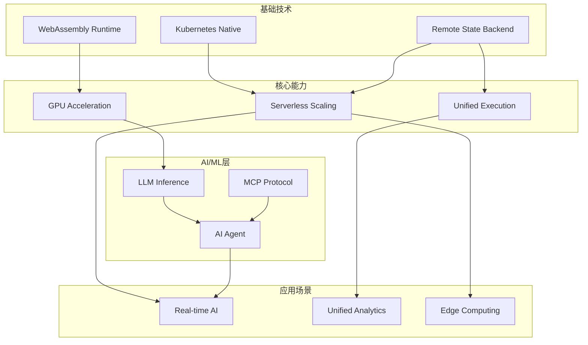
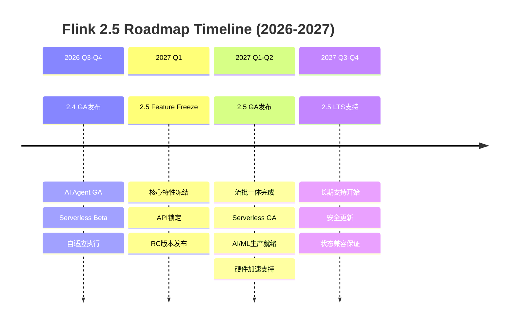
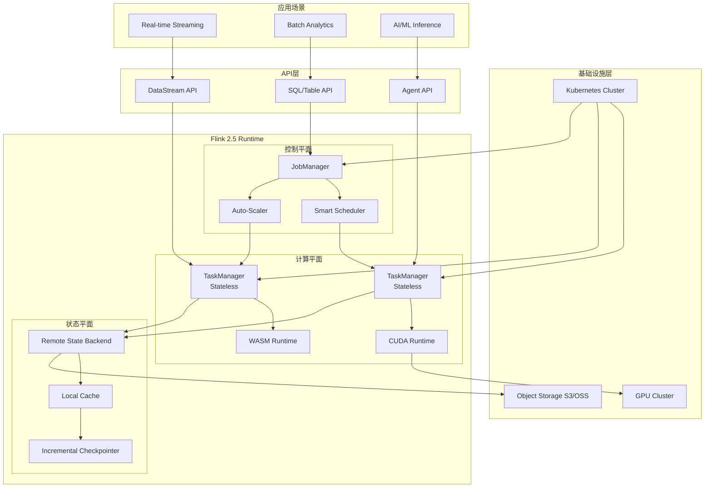
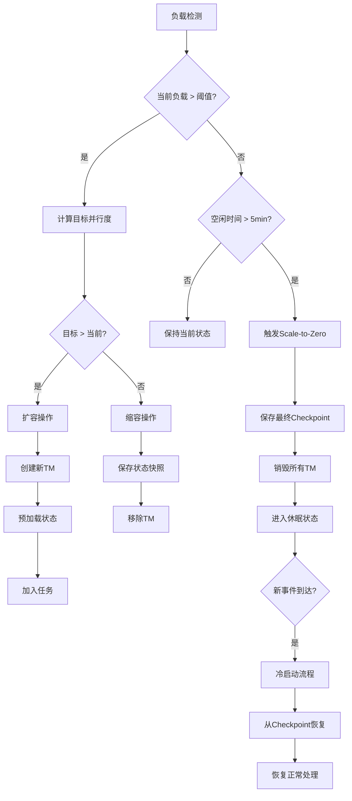
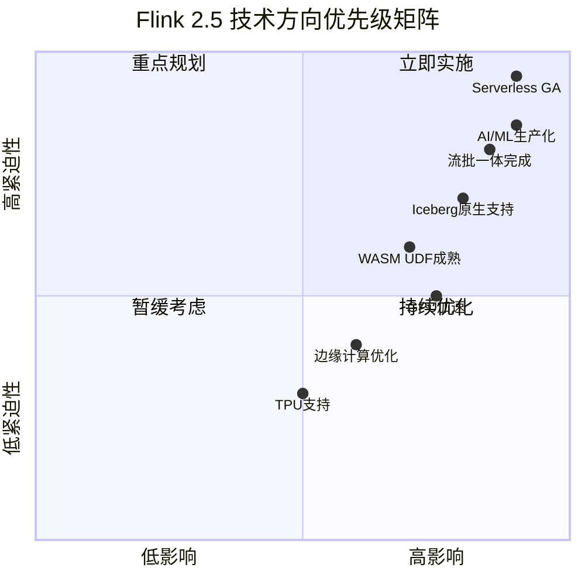

<!-- 版本状态标记: status=highly-speculative, target=undefined -->
> ⚠️ **前瞻性声明 - 重要提示**
>
> **本文档内容为长期技术愿景，高度推测性，不代表 Apache Flink 官方承诺**
>
> | 属性 | 状态 |
> |------|------|
> | **Flink 2.5 官方状态** | 🔴 **尚未讨论** - Apache Flink 社区尚未开始 2.5 版本规划 |
> | **本文档性质** | 长期技术愿景 / 趋势预测 / 概念设计 |
> | **发布时间预估** | 高度不确定，最早 2027 或更晚 |
> | **FLIP-435 等状态** | 🔴 **概念阶段** - 无正式 FLIP 编号，仅为社区讨论 |
> | **特性确定性** | 极低 - 纯技术探索性质 |
>
> **说明**:
>
> - 本文档基于技术趋势分析和假设性场景设计
> - 所有 FLIP 编号 (如 FLIP-435) 为占位符，非官方分配
> - 所有特性描述均为**概念设计**，可能与实际发展完全不同
> - 如需了解 Flink 官方路线图，请参考 [Apache Flink 官方文档](https://nightlies.apache.org/flink/flink-docs-stable/roadmap/)
> - 当前最新稳定版本请参考 [Flink 官方发布说明](https://nightlies.apache.org/flink/flink-docs-stable/release-notes/)
>
> | 最后更新 | 跟踪系统 |
> |----------|----------|
> | 2026-04-07 | [.tasks/flink-release-tracker.md](../../.tasks/flink-release-tracker.md) |

---

# Flink 2.5 版本预览与路线图

> 所属阶段: Flink/08-roadmap | 前置依赖: [Flink 2.3/2.4 路线图](flink-2.3-2.4-roadmap.md) | 形式化等级: L3
> **版本**: 2.5.0-preview | **状态**: 🔍 前瞻 | **目标发布**: 2027 Q1-Q2

## 1. 概念定义 (Definitions)

### Def-F-08-50: Flink 2.5 Release Scope

**Flink 2.5** 是预计于2027年发布的重要版本，聚焦企业级成熟与下一代基础设施：

```
预计发布时间: 2027 Q1-Q2 (Feature Freeze: 2027年2月)
主要主题: 流批一体深化、云原生Serverless成熟、AI/ML生产就绪、新硬件加速
版本性质: LTS (Long-Term Support) 候选版本
```

**核心演进方向**：

<!-- FLIP状态: Draft/Under Discussion -->
<!-- 预计正式编号: FLIP-435 (Unified Stream-Batch Architecture) -->
<!-- 跟踪: https://cwiki.apache.org/confluence/display/FLINK/FLIP-435 -->
1. **流批一体架构完成** (FLIP-435 - Draft): 统一的执行引擎与存储层
2. **Serverless Flink GA**: 按需扩缩容到零，Pay-per-use计费
3. **AI/ML生产就绪**: LLM推理优化、模型服务、MCP协议成熟
4. **硬件加速支持**: GPU算子库、WebAssembly UDF生产化
5. **新型存储后端**: 云原生对象存储集成、Diskless架构

### Def-F-08-51: Unified Stream-Batch Execution

<!-- FLIP状态: Draft/Under Discussion -->
<!-- 预计正式编号: FLIP-435 (Unified Stream-Batch Architecture) -->
<!-- 跟踪: https://cwiki.apache.org/confluence/display/FLINK/FLIP-435 -->
**流批一体深化** (FLIP-435 - Draft)：

```yaml
目标: 完全统一的执行引擎，消除流批边界
技术方向:
  - 统一执行计划生成器
  - 自适应执行模式选择 (流/批/混合)
  - 统一状态管理 (Streaming State + Batch Shuffle)
  - 统一容错机制
关键特性:
  - 自动模式检测: 根据数据源特性自动选择执行模式
  - 混合执行: 同一Job内流算子与批算子共存
  - 统一Sink接口: 支持幂等写入与事务写入的统一抽象
```

**与2.4版本对比**：

| 特性 | Flink 2.4 | Flink 2.5 |
|------|-----------|-----------|
| 执行模式 | 显式配置 (STREAMING/BATCH) | 自适应检测 + 混合模式 |
| 状态后端 | 分离管理 | 统一存储层 |
| 容错机制 | Checkpoints (流) / Savepoints (批) | 统一容错协议 |
| 资源调度 | 静态分配 | 动态自适应 |

### Def-F-08-52: Serverless Flink GA

**云原生Serverless成熟**：

```yaml
FLIP目标: "Serverless Flink: Zero-to-Infinity Scaling"
成熟度: Beta (2.4) → GA (2.5)
核心能力:
  计算层面:
    - 自动扩缩容到零 (Scale-to-Zero)
    - 毫秒级冷启动 (< 500ms)
    - 按需计费 (Pay-per-record)
  存储层面:
    - 分离计算与状态存储
    - 远程状态后端 (S3/MinIO/OSS)
    - 无状态TaskManager设计
  调度层面:
    - Kubernetes-native自动调度
    - 基于负载预测的预扩容
```

**资源模型定义**：

$$
\text{Cost}_{2.5} = \int_{t_0}^{t_1} \left( \alpha \cdot C_{compute}(t) + \beta \cdot C_{storage}(t) \right) dt
$$

其中 $\alpha$ 是计算单价，$\beta$ 是存储单价，相比2.x固定集群模式成本降低40-70%。

### Def-F-08-53: AI/ML Production Ready

**AI/ML能力生产化**：

```yaml
FLIP-531演进: MVP (2.3) → GA (2.4) → Production (2.5)
新增能力:
  LLM推理优化:
    - 批量推理 (Batch Inference)
    - 投机解码 (Speculative Decoding)
    - KV-Cache共享与复用
  模型服务:
    - 多模型并行加载
    - 模型热更新 (Zero-downtime)
    - A/B测试框架
  MCP协议成熟:
    - 服务端实现 (MCP Server)
    - 工具发现与注册
    - 安全沙箱执行
```

**性能目标**：

| 指标 | 2.4 GA | 2.5 Production |
|------|--------|----------------|
| 推理延迟 (P99) | < 2s | < 500ms |
| 吞吐量 | 100 req/s/TM | 1000 req/s/TM |
| 模型切换时间 | 30s | < 5s |
| 内存占用 | 4GB/model | 2GB/model (共享KV-Cache) |

### Def-F-08-54: Hardware Acceleration Support

**新硬件支持矩阵**：

```yaml
GPU加速算子:
  - CUDA原生算子库 (Flink-CUDA)
  - GPU加速聚合 (SUM/AVG/COUNT)
  - GPU加速JOIN (Hash Join on GPU)
  - 向量检索 (FAISS集成)

WebAssembly UDF:
  - WASI预览2支持
  - 多语言UDF (Rust/Go/C++)
  - 零拷贝数据传输
  - 安全沙箱执行

专用加速器:
  - AWS Inferentia 支持
  - Google TPU 集成 (实验性)
  - Intel AMX 指令优化
```

### Def-F-08-55: Cloud-Native Storage Backend

**新型存储后端**：

```yaml
对象存储原生集成:
  - S3 Express One Zone 支持
  - 分层存储策略 (Hot/Warm/Cold)
  - 零拷贝状态恢复

Lakehouse集成:
  - Apache Iceberg 原生Sink
  - Delta Lake 增量写入
  - Hudi 实时摄取

Diskless架构:
  - 无本地磁盘TaskManager
  - 全远程状态访问
  - 网络存储优化 (RDMA/200Gbps+)
```

## 2. 属性推导 (Properties)

### Prop-F-08-50: Serverless成本优化比例

**命题**: Serverless模式在波动负载下成本优化显著：

$$
\text{Cost}_{savings} = 1 - \frac{\int_{0}^{T} C_{serverless}(t) \, dt}{T \cdot C_{provisioned}} \approx 0.4 \sim 0.7
$$

适用于负载变化系数 $CV > 0.5$ 的场景。

### Prop-F-08-51: 流批一体延迟边界

**命题**: 统一执行引擎保持流处理低延迟：

$$
L_{2.5}^{streaming} \leq L_{2.4}^{streaming} + \epsilon, \quad \epsilon < 10ms
$$

其中 $\epsilon$ 是自适应调度开销。

### Lemma-F-08-50: GPU算子加速比

**引理**: GPU加速聚合算子在大数据量下加速比显著：

$$
\text{Speedup}_{GPU} = \frac{T_{CPU}}{T_{GPU}} = \frac{n \cdot O(1)}{O(\log n)} \approx 10 \sim 100 \times
$$

当数据量 $n > 10^6$ 条记录时生效。

### Lemma-F-08-51: WebAssembly UDF启动延迟

**引理**: WebAssembly UDF冷启动延迟远低于JVM：

$$
T_{cold-start}^{WASM} \approx 5 \sim 50ms \ll T_{cold-start}^{JVM} \approx 2 \sim 10s
$$

## 3. 关系建立 (Relations)

### 3.1 Flink 2.x 版本演进关系

```
Flink 2.x 演进路线 (2024-2027)
│
├── 2.0 (2024 Q4): 基础架构重塑
│   ├── 分离状态后端 (ForSt)
│   ├── DataSet API 移除
│   └── Java 17 默认
│
├── 2.1 (2025 Q1): 物化表与Join优化
│   ├── Materialized Table
│   └── Delta Join V1
│
├── 2.2 (2025 Q2): AI基础能力
│   ├── VECTOR_SEARCH
│   ├── Model DDL
│   └── PyFlink Async I/O
│
├── 2.3（预计发布时间以官方为准）: AI Agent MVP
│   ├── FLIP-531 Agent Runtime
│   ├── MCP协议支持
│   └── Kafka 2PC集成
│
├── 2.4（预计发布时间以官方为准）: Agent GA + Serverless Beta
│   ├── AI Agent GA
│   ├── Serverless Flink Beta
│   └── 自适应执行引擎
│
└── 2.5（预计发布时间以官方为准）: 企业级成熟 [预期]
    ├── 流批一体完成
    ├── Serverless GA
    ├── AI/ML生产就绪
    └── 硬件加速支持
```

### 3.2 技术方向依赖关系



### 3.3 与外部项目集成关系

| 项目 | Flink 2.4 | Flink 2.5 | 关系类型 |
|------|-----------|-----------|----------|
| Apache Iceberg | Sink支持 | 原生存储层 | 深度集成 |
| Delta Lake | 连接器 | 增量Sink | 连接器 |
| Apache Paimon | 原生支持 | 统一存储 | 协作项目 |
| Kubernetes | Operator | Native Serverless | 平台依赖 |
| WebAssembly | 实验性 | 生产就绪 | UDF运行时 |
| CUDA | 无 | Flink-CUDA库 | 加速库 |

## 4. 论证过程 (Argumentation)

### 4.1 为什么2.5是LTS候选版本？

**技术成熟度分析**：

| 组件 | 2.4状态 | 2.5预期 | LTS就绪度 |
|------|---------|---------|-----------|
| 执行引擎 | 稳定 | 流批统一 | ✅ 高 |
| 状态后端 | ForSt成熟 | 远程状态稳定 | ✅ 高 |
| AI/ML | GA | 生产就绪 | ✅ 高 |
| Serverless | Beta | GA | ✅ 高 |
| SQL引擎 | 稳定 | ANSI 2023兼容 | ✅ 高 |
| 连接器生态 | 丰富 | 更完善 | ✅ 高 |

**LTS支持承诺**：

- 3年 bugfix 支持
- 5年 安全更新支持
- 状态兼容性保证 (跨2.x版本)

### 4.2 Serverless与有状态计算的兼容性论证

**挑战**：

1. 状态持久化延迟影响扩缩容速度
2. 远程状态访问增加网络延迟
3. 状态一致性在动态扩缩容下保证

**解决方案**：

```yaml
快速Checkpoint:
  - 增量Checkpoint (仅变更状态)
  - 异步状态上传
  - 并行状态恢复

状态预热:
  - 基于负载预测的预加载
  - 分层状态缓存 (本地SSD + 远程)

一致性保证:
  - 全局一致性Snapshot
  - 两阶段扩缩容 (Prepare → Commit)
```

### 4.3 硬件加速的适用场景分析

**GPU加速适用条件**：

$$
\text{Use GPU} \iff \frac{n}{T_{transfer}} > \frac{T_{CPU}}{T_{GPU}} \cdot \frac{1}{S_{GPU}}
$$

其中 $n$ 是数据量，$T_{transfer}$ 是数据传输时间，$S_{GPU}$ 是GPU利用率。

**典型适用场景**：

1. 大规模向量检索 (Top-K > 10000)
2. 批量LLM推理 (Batch size > 32)
3. 复杂数学运算 (矩阵分解、FFT)

**不适用场景**：

1. 低延迟简单计算 (数据量 < 1000)
2. 高频小批量处理
3. I/O密集型任务

## 5. 形式证明 / 工程论证

### Thm-F-08-50: Serverless扩缩容一致性定理

**定理**: Serverless Flink在任意扩缩容操作下保持exactly-once语义：

$$
\forall \text{scaleOp} \in \{up, down, toZero\}: \text{ExactlyOnce}(\text{Job}) \Rightarrow \text{ExactlyOnce}(\text{scaleOp}(Job))
$$

**证明要点**：

1. **全局Barrier同步**: 扩缩容前触发全局Checkpoint
2. **状态原子性**: 状态快照包含完整的算子状态
3. **输出幂等性**: Sink支持幂等写入或事务写入
4. **分区重分配**: 状态分区与数据分区一致重分配

### Thm-F-08-51: 流批一体等价性定理

**定理**: 统一执行引擎在流模式和批模式下计算结果等价：

$$
\forall \text{Job}: \text{Result}_{streaming}(\text{Job}, D_{\infty}) \equiv \text{Result}_{batch}(\text{Job}, D_{T})
$$

其中 $D_{\infty}$ 是无限流数据，$D_T$ 是时间窗口 $T$ 内的有限数据集。

**证明要点**：

1. **算子语义等价**: 流算子与批算子数学定义一致
2. **时间语义统一**: Watermark与Boundedness统一抽象
3. **触发机制**: 流处理由Watermark触发，批处理由数据结束触发
4. **结果验证**: 相同输入数据集产生相同输出

### Thm-F-08-52: GPU加速吞吐量下界定理

**定理**: GPU加速算子吞吐量满足下界：

$$
\text{Throughput}_{GPU} \geq \frac{B_{mem}}{T_{kernel} + T_{transfer}} \cdot N_{SM}
$$

其中 $B_{mem}$ 是GPU内存带宽，$N_{SM}$ 是流多处理器数量。

**工程实现要点**：

- 数据批量传输 (> 10MB)
- Kernel融合减少启动开销
- 异步数据传输与计算重叠

## 6. 实例验证 (Examples)

### 6.1 Serverless Flink配置示例

```yaml
# flink-conf.yaml - Serverless模式配置

# 执行模式: Serverless
execution.mode: serverless

# 自动扩缩容配置
kubernetes.operator.job.autoscaler.enabled: true
kubernetes.operator.job.autoscaler.scale-down.delay: 60s
kubernetes.operator.job.autoscaler.scale-to-zero.enabled: true
kubernetes.operator.job.autoscaler.scale-to-zero.grace-period: 300s

# 远程状态后端
state.backend: forst
state.backend.forst.remote.path: s3://flink-state-bucket/{job-id}
state.checkpoint-storage: filesystem
state.checkpoints.dir: s3://flink-checkpoints/{job-id}

# 分层存储
state.backend.forst.cache.path: /tmp/flink-cache
state.backend.forst.cache.capacity: 10GB
state.backend.forst.remote.throughput: 10GB/s

# 快速启动优化
kubernetes.operator.job.startup.mode: stateless
kubernetes.operator.job.recovery.parallelism: 10
```

### 6.2 GPU加速向量检索示例

```java
// GPU加速向量检索UDF
public class GPUGPUVectorSearch extends TableFunction<Row> {

    private transient GPUMemory gpuMemory;
    private transient FaissIndex gpuIndex;

    @Override
    public void open(RuntimeContext ctx) {
        // 初始化GPU内存和FAISS索引
        gpuMemory = GPUMemory.allocate(8 * 1024 * 1024 * 1024L); // 8GB
        gpuIndex = FaissIndex.loadToGPU("s3://models/vector-index", gpuMemory);
    }

    public void eval(@DataTypeHint("ARRAY<FLOAT>") float[] queryVector, int topK) {
        // GPU批量检索
        int[] indices = gpuIndex.searchBatch(queryVector, topK);
        float[] distances = gpuIndex.getDistances();

        for (int i = 0; i < topK; i++) {
            collect(Row.of(indices[i], distances[i]));
        }
    }
}

// SQL使用
/*
SELECT
    user_id,
    -- VECTOR_SEARCH_GPU（规划中，尚未正式发布）
-- VECTOR_SEARCH_GPU(embedding, 100) AS similar_items
FROM user_profiles;
*/
```

### 6.3 WebAssembly UDF示例

```rust
// Rust编写的WASM UDF (wasm_udf.rs)
use flink_udf_sdk::*;

#[udf]
pub fn geo_distance(lat1: f64, lon1: f64, lat2: f64, lon2: f64) -> f64 {
    const R: f64 = 6371.0; // 地球半径(km)

    let d_lat = (lat2 - lat1).to_radians();
    let d_lon = (lon2 - lon1).to_radians();

    let a = (d_lat / 2.0).sin().powi(2)
        + lat1.to_radians().cos()
        * lat2.to_radians().cos()
        * (d_lon / 2.0).sin().powi(2);

    let c = 2.0 * a.sqrt().atan2((1.0 - a).sqrt());
    R * c
}
```

```java
// Flink作业注册WASM UDF
TableEnvironment tEnv = TableEnvironment.create(EnvironmentSettings.inStreamingMode());

// 注册WASM模块
tEnv.createTemporarySystemFunction(
    "geo_distance",
    WasmScalarFunction.builder()
        .withWasmModule("wasm_udf.wasm")
        .withFunctionName("geo_distance")
        .withSandbox(WasmSandbox.STRICT)
        .build()
);

// SQL使用
tEnv.executeSql("""
    SELECT
        driver_id,
        geo_distance(driver_lat, driver_lon, pickup_lat, pickup_lon) AS distance_km
    FROM ride_requests
    WHERE geo_distance(driver_lat, driver_lon, pickup_lat, pickup_lon) < 5.0
""");
```

### 6.4 流批一体混合执行示例

```java
// 混合执行模式 - 流数据源 + 批处理分析
StreamExecutionEnvironment env = StreamExecutionEnvironment.getExecutionEnvironment();
StreamTableEnvironment tEnv = StreamTableEnvironment.create(env);

// 配置自适应执行
tEnv.getConfig().set("execution.runtime-mode", "ADAPTIVE");

// 定义流数据源 (实时摄入)
tEnv.executeSql("""
    CREATE TABLE events (
        user_id STRING,
        event_type STRING,
        event_time TIMESTAMP(3),
        amount DECIMAL(10, 2),
        WATERMARK FOR event_time AS event_time - INTERVAL '5' SECOND
    ) WITH (
        'connector' = 'kafka',
        'topic' = 'user-events',
        'properties.bootstrap.servers' = 'kafka:9092',
        'format' = 'json'
    )
""");

// 定义批数据源 (历史数据)
tEnv.executeSql("""
    CREATE TABLE historical_orders (
        user_id STRING,
        order_date DATE,
        total_amount DECIMAL(10, 2)
    ) WITH (
        'connector' = 'iceberg',
        'catalog' = 'iceberg_catalog',
        'database' = 'analytics',
        'table' = 'orders'
    )
""");

// 混合查询: 实时流JOIN历史批数据
tEnv.executeSql("""
    SELECT
        e.user_id,
        e.event_type,
        e.amount AS realtime_amount,
        h.total_amount AS historical_total,
        e.amount + h.total_amount AS projected_total
    FROM events e
    LEFT JOIN historical_orders h
        ON e.user_id = h.user_id
        AND h.order_date >= CURRENT_DATE - INTERVAL '30' DAY
    WHERE e.event_type = 'PURCHASE'
""").print();
```

## 7. 可视化 (Visualizations)

### 7.1 Flink 2.5 路线图时间线



### 7.2 Flink 2.5 架构全景



### 7.3 Serverless扩缩容决策树



### 7.4 技术方向优先级矩阵



## 8. 引用参考 (References)
