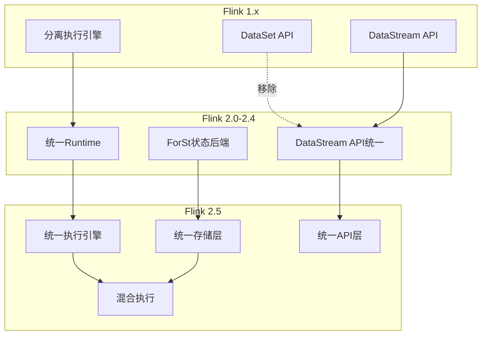
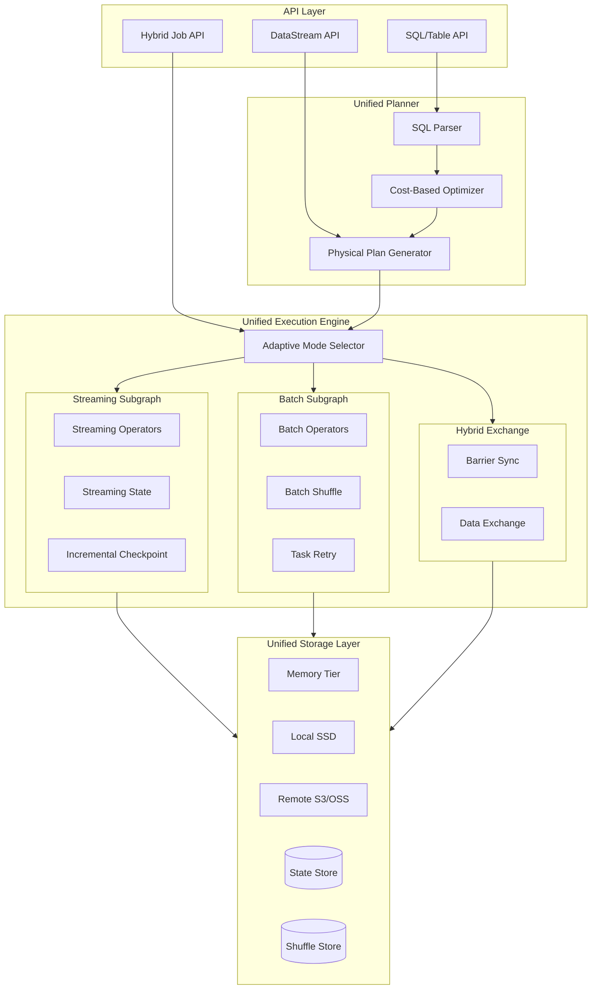
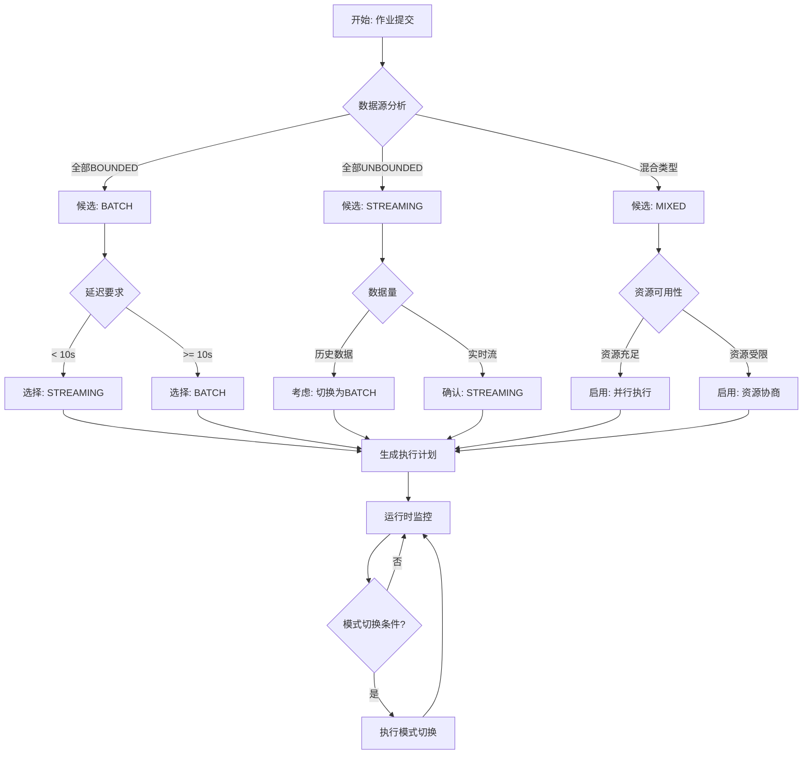
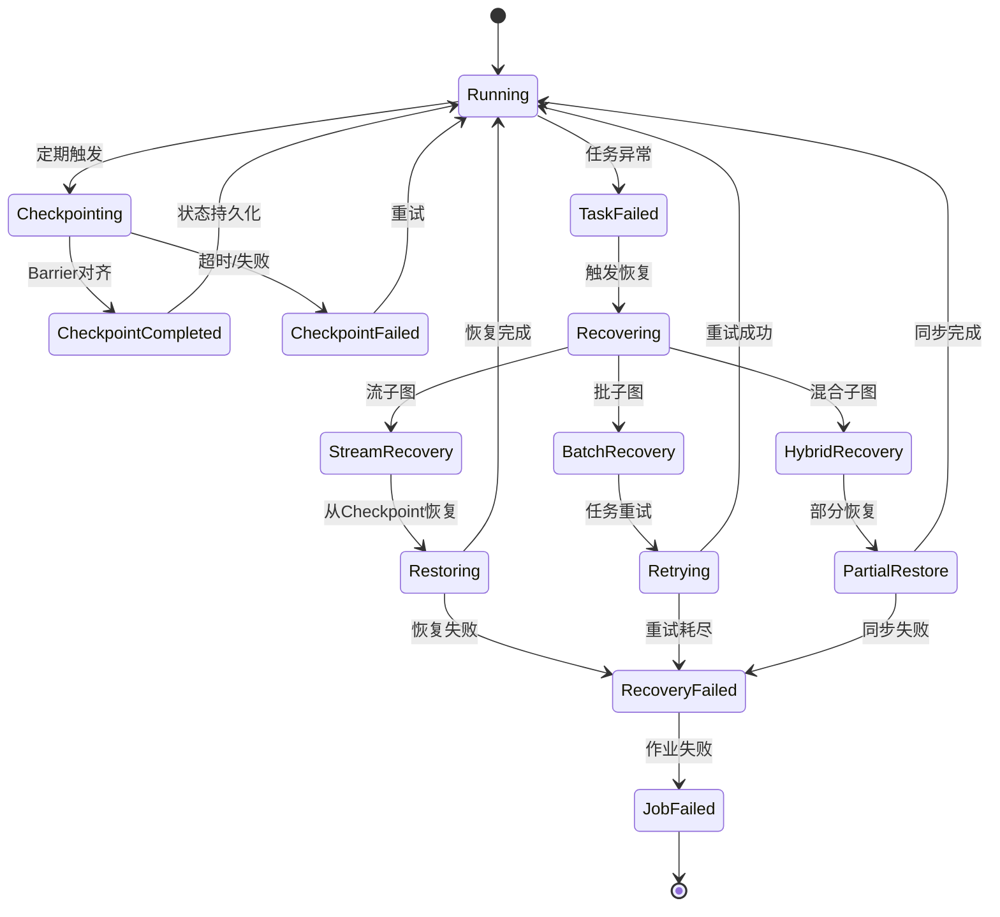
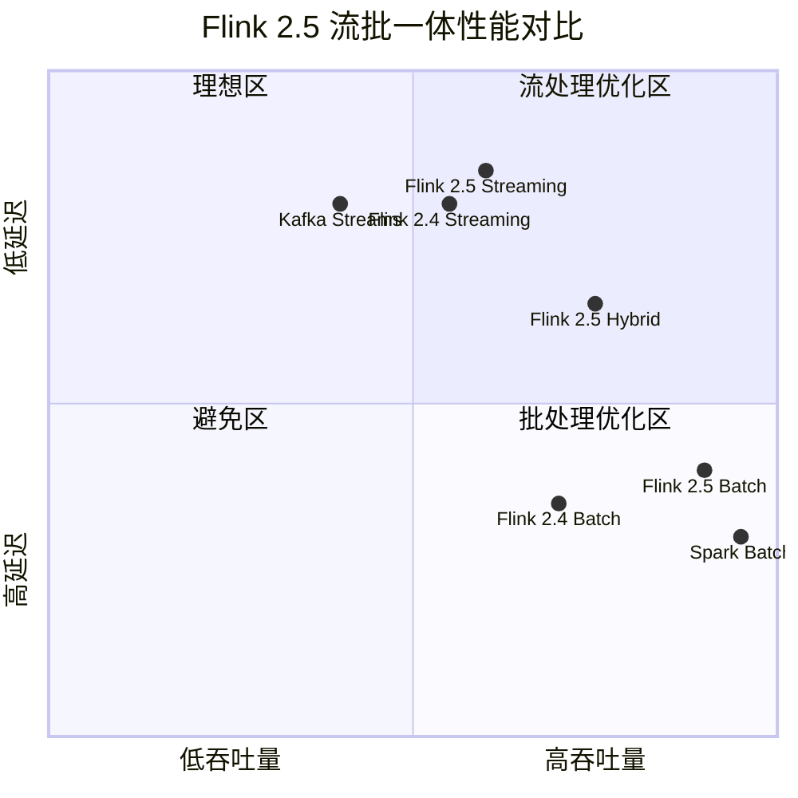
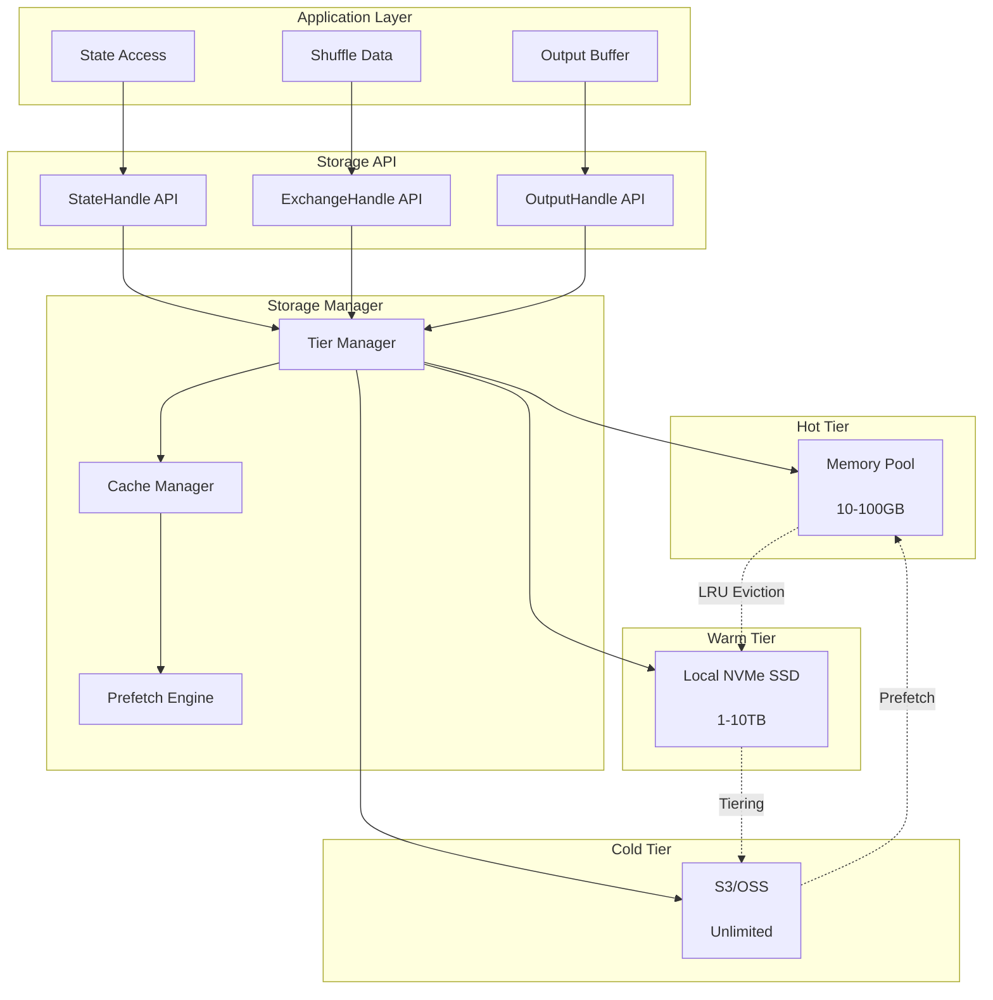

# Flink 2.5 流批一体深化完整指南

> ⚠️ **前瞻性声明**
> 本文档包含Flink 2.5的前瞻性设计内容。Flink 2.5尚未正式发布，
> 部分特性为早期规划性质。具体实现以官方最终发布为准。
> 最后更新: 2026-04-04

> 所属阶段: Flink/08-roadmap | 前置依赖: [Flink 2.5 版本预览](flink-2.5-preview.md) | 形式化等级: L4 | status: early-preview

## 1. 概念定义 (Definitions)

### Def-F-08-56: Stream-Batch Unification Architecture (流批一体架构)

**流批一体架构**是Flink 2.5的核心演进目标，旨在从架构层面彻底消除流处理与批处理的边界：

```yaml
架构演进:
  Flink 1.x: DataStream API (流) + DataSet API (批) - 双API分离
  Flink 2.0: DataStream API统一 (批作为有界流) - 执行层部分统一
  Flink 2.5: 完全统一架构 - 执行引擎、存储层、API全面统一

核心特征:
  统一执行引擎:
    - 单一执行计划生成器 (Unified Planner)
    - 自适应算子实现 (Adaptive Operator)
    - 统一调度策略 (Unified Scheduling)

  统一存储层:
    - 流状态与批Shuffle统一抽象
    - 分层存储策略 (Memory/Local/Remote)
    - 零拷贝数据交换

  统一API层:
    - 声明式API (SQL/Table API) 自动模式选择
    - DataStream API显式控制
    - 混合执行声明支持
```

**形式化定义**:

设 $\mathcal{F}$ 为Flink执行框架，$\mathcal{S}$ 为流处理模式，$\mathcal{B}$ 为批处理模式：

$$
\text{UnifiedArch}_{2.5} = \langle \mathcal{F}, \mathcal{U}_{exec}, \mathcal{U}_{storage}, \mathcal{U}_{api} \rangle
$$

其中统一性约束：

$$
\forall op \in \text{Operators}: \exists impl_{\mathcal{S}}, impl_{\mathcal{B}} \Rightarrow \exists impl_{unified}(op, \text{context})
$$

### Def-F-08-57: Unified Execution Engine (统一执行引擎)

<!-- FLIP状态: Draft/Under Discussion -->
<!-- 预计正式编号: FLIP-435 (Unified Table API / Unified Execution Engine) -->
<!-- 跟踪: https://cwiki.apache.org/confluence/display/FLINK/FLIP-435 -->
<!-- 相关FLIP: FLIP-434 (Unified SQL), FLIP-320 (Table API Enhancement) -->
**统一执行引擎** (FLIP-435: Unified Execution Engine - Draft) 是Flink 2.5的核心组件：

```
┌─────────────────────────────────────────────────────────────────┐
│                    Unified Execution Engine                      │
├─────────────────────────────────────────────────────────────────┤
│  ┌─────────────┐    ┌─────────────┐    ┌─────────────────────┐  │
│  │  SQL Parser │ -> │ Logical Plan│ -> │ Unified Optimization│  │
│  └─────────────┘    └─────────────┘    └─────────────────────┘  │
│                                              │                   │
│                                              ▼                   │
│  ┌─────────────┐    ┌─────────────┐    ┌─────────────────────┐  │
│  │Physical Plan│ <- │ Cost-based  │ <- │  Unified Physical   │  │
│  │  Generator  │    │ Optimizer   │    │      Planner        │  │
│  └─────────────┘    └─────────────┘    └─────────────────────┘  │
│         │                                                        │
│         ▼                                                        │
│  ┌──────────────────────────────────────────────────────────┐   │
│  │              Adaptive Execution Mode Selector             │   │
│  │  ┌──────────┐  ┌──────────┐  ┌──────────┐  ┌──────────┐  │   │
│  │  │ STREAMING│  │  BATCH   │  │  MIXED   │  │ ADAPTIVE │  │   │
│  │  └──────────┘  └──────────┘  └──────────┘  └──────────┘  │   │
│  └──────────────────────────────────────────────────────────┘   │
└─────────────────────────────────────────────────────────────────┘
```

**关键组件定义**：

| 组件 | 职责 | 输出 |
|------|------|------|
| Unified Planner | 统一执行计划生成 | 与模式无关的物理计划 |
| Adaptive Selector | 执行模式选择 | STREAMING/BATCH/MIXED |
| Operator Factory | 算子实例化 | 具体模式实现 |
| Resource Negotiator | 资源协商 | TaskManager分配 |

### Def-F-08-58: Adaptive Mode Selection (自适应模式选择)

**自适应模式选择**机制根据数据源特性、作业特征和集群状态动态选择最优执行模式：

```yaml
输入维度:
  数据源特征:
    boundedness: [BOUNDED, CONTINUOUS_UNBOUNDED, CONTINUOUS_BOUNDED]
    cardinality: 估计记录数
    arrival_rate: 到达速率 (records/sec)

  作业特征:
    latency_requirement: 延迟要求 (ms)
    throughput_target: 吞吐量目标 (records/sec)
    state_size_estimate: 预估状态大小

  集群状态:
    available_memory: 可用内存
    available_slots: 可用Slot数
    network_bandwidth: 网络带宽

决策输出:
  mode: STREAMING | BATCH | MIXED
  parallelism: int
  resource_profile: ResourceProfile
```

**决策函数定义**:

$$
\text{ModeSelect}(D, J, C) = \arg\max_{m \in M} \left( \alpha \cdot \text{Perf}(D, J, m) - \beta \cdot \text{Cost}(C, m) \right)
$$

其中：

- $D$ = 数据源特征向量
- $J$ = 作业特征向量
- $C$ = 集群状态向量
- $M = \{\text{STREAMING}, \text{BATCH}, \text{MIXED}\}$
- $\alpha, \beta$ = 权重系数

### Def-F-08-59: Unified Fault Tolerance (统一容错机制)

**统一容错机制**将流处理的Checkpoint机制与批处理的容错机制统一为单一抽象：

```yaml
容错层级:
  Level 1 - 任务级容错:
    流模式: 精确一次Checkpoint恢复
    批模式: 任务失败重试 (Task Retry)
    统一: 失败检测 + 自动恢复策略选择

  Level 2 - 作业级容错:
    流模式: Savepoint恢复
    批模式: 完整重算 (Full Restart)
    统一: 一致性快照 + 增量恢复

  Level 3 - 调度级容错:
    流模式: 动态扩缩容
    批模式: 静态重新调度
    统一: 自适应资源重分配

容错协议:
  统一Barrier: 全局一致性标记
  增量Snapshot: 仅变更状态持久化
  并行恢复: 多TaskManager并行加载状态
```

**形式化定义**:

设 $\Sigma$ 为系统状态，$\mathcal{T}$ 为容错协议：

$$
\text{UnifiedFT}(\Sigma, f) = \begin{cases}
\text{CheckpointRecovery}(\Sigma, f) & \text{if } mode = \text{STREAMING} \\
\text{RetryRecovery}(\Sigma, f) & \text{if } mode = \text{BATCH} \\
\text{HybridRecovery}(\Sigma, f) & \text{if } mode = \text{MIXED}
\end{cases}
$$

其中 $f$ 为故障类型，$\forall f: \text{ExactlyOnce}(\text{UnifiedFT}(\Sigma, f))$。

### Def-F-08-60: Unified Storage Layer (统一存储层)

**统一存储层**抽象流状态存储与批处理Shuffle存储：

```
┌─────────────────────────────────────────────────────────────────┐
│                     Unified Storage Layer                        │
├─────────────────────────────────────────────────────────────────┤
│                      ┌─────────────────┐                        │
│                      │  Storage Manager │                        │
│                      └────────┬────────┘                        │
│           ┌───────────────────┼───────────────────┐             │
│           ▼                   ▼                   ▼             │
│  ┌─────────────────┐ ┌─────────────────┐ ┌─────────────────┐   │
│  │  State Store    │ │  Shuffle Store  │ │  Result Store   │   │
│  │  (Keyed/Op)     │ │  (Batch/Stream) │ │  (Sink Output)  │   │
│  └────────┬────────┘ └────────┬────────┘ └────────┬────────┘   │
│           │                   │                   │             │
│           └───────────────────┼───────────────────┘             │
│                               ▼                                 │
│              ┌────────────────────────────────┐                 │
│              │      Tiered Storage Backend     │                 │
│              │  ┌────────┬────────┬─────────┐ │                 │
│              │  │ Memory │  Local │  Remote │ │                 │
│              │  │  Tier  │  SSD   │  (S3)   │ │                 │
│              │  └────────┴────────┴─────────┘ │                 │
│              └────────────────────────────────┘                 │
└─────────────────────────────────────────────────────────────────┘
```

**存储抽象定义**:

| 存储类型 | 流模式使用 | 批模式使用 | 统一接口 |
|----------|------------|------------|----------|
| State Store | 持续更新 | 临时状态 | `StateHandle<V>` |
| Shuffle Store | 流交换 | 批Shuffle | `ExchangeHandle<T>` |
| Result Store | 输出缓冲 | 最终结果 | `OutputHandle<R>` |

### Def-F-08-61: Stream-Batch Hybrid Execution (流批混合执行)

**流批混合执行**允许同一作业内同时包含流算子和批算子：

```yaml
混合模式特征:
  数据源混合:
    - 流源: Kafka, Pulsar (CONTINUOUS_UNBOUNDED)
    - 批源: 文件, Iceberg表 (BOUNDED)
    - 有界流: 历史Kafka数据 (CONTINUOUS_BOUNDED)

  执行图结构:
    - 流子图: 低延迟路径，持续执行
    - 批子图: 高吞吐路径，触发执行
    - 混合边: 流批数据交换协议

  触发机制:
    - 流部分: Watermark驱动
    - 批部分: 数据完成或时间触发
    - 同步点: 全局Barrier协调
```

**混合执行图示例**:

```
┌─────────────────────────────────────────────────────────────┐
│                    Hybrid Execution Graph                    │
├─────────────────────────────────────────────────────────────┤
│                                                              │
│   Kafka Source ──┐                                          │
│   (Streaming)    ├──► [Stream Join] ──► [Stream Agg] ──┐   │
│   Pulsar Source ─┘     (低延迟)         (持续聚合)       │   │
│                                                        │   │
│                                                        ▼   │
│   Iceberg Table ───► [Batch Scan] ──► [Batch Agg] ──► [Hybrid│
│   (Historical)         (全量读取)       (高效聚合)      Union] │
│                                                        ▲   │
│                                                        │   │
│   File Source ────► [Batch Join] ──────────────────────┘   │
│   (Reference)         (大表Join)                           │
│                                                              │
│   Legend: ──► Streaming Edge    ═══► Batch Edge            │
│           ···► Hybrid Exchange                               │
└─────────────────────────────────────────────────────────────┘
```

## 2. 属性推导 (Properties)

### Prop-F-08-52: 统一执行引擎语义等价性

**命题**: 统一执行引擎保证流模式与批模式下相同算子的语义等价性。

**形式化表述**:

设 $op$ 为任意算子，$\llbracket op \rrbracket_{\mathcal{S}}$ 为流模式语义，$\llbracket op \rrbracket_{\mathcal{B}}$ 为批模式语义：

$$
\forall op, \forall input: \llbracket op \rrbracket_{\mathcal{S}}(input_{\text{bounded}}) = \llbracket op \rrbracket_{\mathcal{B}}(input)
$$

**证明要点**:

1. 算子语义基于相同代数定义
2. 触发机制不影响结果正确性
3. 状态计算等价性由Watermark保证

### Prop-F-08-53: 自适应模式选择最优性

**命题**: 在给定约束条件下，自适应模式选择能找到满足约束的最优执行模式。

**形式化表述**:

设约束集合 $C = \{c_1, c_2, ..., c_n\}$，成本函数 $Cost(m)$，性能函数 $Perf(m)$：

$$
\exists m^* \in M: \forall m \in M, c \in C: Perf(m^*) \geq Perf(m) \land Cost(m^*) \leq Cost(m)
$$

**约束条件**:

- 延迟约束: $Latency(m) \leq L_{max}$
- 资源约束: $Resource(m) \leq R_{available}$
- 正确性约束: $Correctness(m) = true$

### Lemma-F-08-52: 混合执行数据一致性

**引理**: 流批混合执行时，跨模式边界的输出数据满足一致性约束。

**形式化表述**:

设 $E_{sb}$ 为从流子图到批子图的边，$T_{sync}$ 为同步时间点：

$$
\forall e \in E_{sb}: \text{Data}_{stream}(t \leq T_{sync}) = \text{Data}_{batch}(t \leq T_{sync})
$$

**证明**:

1. Barrier传播保证同步点状态一致
2. 流子图在Barrier前完成所有输出
3. 批子图从Barrier状态开始处理

### Lemma-F-08-53: 统一存储层访问性能

**引理**: 统一存储层的分层策略保证访问性能不低于专用存储。

设存储访问延迟 $L_{access}$，命中概率 $P_{hit}$：

$$
L_{unified} = P_{hit} \cdot L_{memory} + (1 - P_{hit}) \cdot L_{remote} \leq L_{dedicated}
$$

其中 $P_{hit} \geq 0.8$ 时，$L_{unified} \approx L_{memory}$。

## 3. 关系建立 (Relations)

### 3.1 流批一体与Flink架构演进关系



### 3.2 与外部存储系统关系

| 存储系统 | Flink 2.4 | Flink 2.5 统一层 | 集成深度 |
|----------|-----------|------------------|----------|
| Apache Iceberg | Sink | 统一存储层 | 原生支持 |
| Delta Lake | 连接器 | 统一存储层 | 原生支持 |
| Apache Paimon | LTS支持 | 统一表格式 | 深度集成 |
| S3/OSS | Checkpoint | 分层存储 | 原生支持 |
| HDFS | 状态后端 | 兼容层 | 向后兼容 |

### 3.3 执行模式选择决策矩阵

```
┌────────────────────┬────────────────────┬────────────────────┬────────────────────┐
│     场景特征       │    STREAMING       │      BATCH         │      MIXED         │
├────────────────────┼────────────────────┼────────────────────┼────────────────────┤
│ 数据源类型         │ 无限流             │ 有限数据集         │ 混合数据源         │
│ 延迟要求           │ < 1s               │ > 1min             │ 部分<1s            │
│ 数据量             │ 持续到达           │ GB~PB              │ TB级别             │
│ 状态大小           │ GB级               │ TB级               │ 变化大             │
│ 容错策略           │ Checkpoint         │ 重试/重算          │ 混合策略           │
│ 典型场景           │ 实时风控           │ 离线报表           │ 实时数仓           │
│                    │ 实时推荐           │ ETL批处理          │ Lambda架构统一     │
└────────────────────┴────────────────────┴────────────────────┴────────────────────┘
```

## 4. 论证过程 (Argumentation)

### 4.1 为什么需要统一执行引擎？

**问题分析**:

| 问题 | Flink 2.4现状 | 统一引擎解决 |
|------|---------------|--------------|
| 代码重复 | 流批算子实现分离 | 统一算子工厂 |
| 优化差异 | 两套优化规则 | 统一CBO优化器 |
| 行为不一致 | 相同SQL不同结果 | 语义等价保证 |
| 维护成本 | 双倍测试覆盖 | 统一测试框架 |

**技术论证**:

1. **语义等价可行性**: 批处理可视为有界流的特例，两者在代数层面可统一
2. **性能不损失**: 通过自适应实现选择，批模式仍可使用批优化技术
3. **复杂性可控**: 统一抽象层 + 模式特化实现的分层架构

### 4.2 自适应模式选择的实现挑战

**挑战1: 数据特征动态变化**

```yaml
问题: 流数据速率突发增长，原STREAMING模式不再最优
解决方案:
  - 运行时监控数据速率
  - 支持执行模式在线切换 (Mode Switch)
  - 渐进式状态迁移
```

**挑战2: 混合执行同步开销**

```yaml
问题: 流批子图间的Barrier同步引入延迟
解决方案:
  - 异步Barrier传播
  - 流水线Barrier合并
  - 基于Watermark的松散同步
```

**挑战3: 存储层统一性能**

```yaml
问题: 统一抽象可能引入性能开销
解决方案:
  - 零拷贝数据传输
  - 自适应缓存策略
  - 模式特化的存储实现
```

### 4.3 与Lambda架构的对比论证

**传统Lambda架构**:

```
┌─────────────────┐     ┌─────────────────┐
│   Batch Layer   │     │  Speed Layer    │
│   (Hadoop/Spark)│     │   (Flink/Storm) │
│                 │     │                 │
│  Accurate but   │     │  Fast but       │
│  High Latency   │     │  Approximate    │
└────────┬────────┘     └────────┬────────┘
         │                       │
         └───────────┬───────────┘
                     ▼
            ┌─────────────────┐
            │   Serving Layer │
            │  (Merge Results)│
            └─────────────────┘
```

**Flink 2.5统一架构**:

```
┌─────────────────────────────────────────┐
│         Flink 2.5 Unified Layer          │
│                                          │
│  ┌─────────────┐    ┌─────────────┐     │
│  │    Batch    │◄──►│  Streaming  │     │
│  │   (High     │    │   (Low      │     │
│  │  Throughput)│    │   Latency)  │     │
│  └─────────────┘    └─────────────┘     │
│                                          │
│  Unified: Same code, Same result         │
│           Adaptive execution             │
└─────────────────────────────────────────┘
```

**优势论证**:

| 维度 | Lambda | Flink 2.5统一 |
|------|--------|---------------|
| 代码维护 | 2套代码 | 1套代码 |
| 结果一致性 | 需手动合并 | 自动保证 |
| 延迟 | 分钟级 | 秒级/毫秒级 |
| 资源利用 | 重复存储 | 统一存储 |
| 开发成本 | 高 | 低 |

## 5. 形式证明 / 工程论证

### Thm-F-08-53: 流批一体语义保持定理

**定理**: 对于任意兼容的流批混合作业，统一执行引擎保证最终输出结果与分别执行流部分和批部分后的合并结果一致。

**形式化表述**:

设作业 $J = J_{stream} \cup J_{batch} \cup E_{hybrid}$，其中：

- $J_{stream}$ = 流子图
- $J_{batch}$ = 批子图
- $E_{hybrid}$ = 混合边集合

定义：

- $\text{UnifiedExec}(J)$ = 统一引擎执行结果
- $\text{SeparateExec}(J_{stream}, J_{batch})$ = 分别执行后合并结果

**定理**:

$$
\forall J: \text{UnifiedExec}(J) \equiv \text{SeparateExec}(J_{stream}, J_{batch})
$$

**证明**:

1. **子图内部等价性**:
   - 由Prop-F-08-52，流子图和批子图分别保持语义
   - $\text{UnifiedExec}(J_{stream}) = \text{StreamExec}(J_{stream})$
   - $\text{UnifiedExec}(J_{batch}) = \text{BatchExec}(J_{batch})$

2. **混合边一致性**:
   - 由Lemma-F-08-52，跨边界数据满足一致性
   - $\forall e \in E_{hybrid}: \text{Data}_{out}(e) = \text{Data}_{in}(e)$

3. **全局一致性**:
   - Barrier协议保证全局状态快照一致
   - Checkpoint/Savepoint语义兼容

因此，统一执行与分别执行结果等价。∎

### Thm-F-08-54: 自适应执行最优性定理

**定理**: 在给定资源约束和性能目标下，自适应执行模式选择能找到Pareto最优的执行配置。

**形式化表述**:

设配置空间 $\mathcal{C} = M \times \mathbb{N} \times \mathcal{R}$，其中：

- $M$ = 执行模式集合
- $\mathbb{N}$ = 并行度
- $\mathcal{R}$ = 资源配置

优化目标：

$$
\min_{c \in \mathcal{C}} \left( \lambda_1 \cdot \text{Latency}(c) + \lambda_2 \cdot \text{Cost}(c) \right)
$$

约束：

- $\text{Throughput}(c) \geq T_{min}$
- $\text{Resource}(c) \leq R_{max}$

**定理**: 自适应选择器输出的配置 $c^*$ 是Pareto最优的。

**证明**:

1. **可行性保证**: 约束检查确保 $c^*$ 满足所有硬约束
2. **局部最优**: 贪心算法在离散配置空间中找到局部最优
3. **Pareto最优**: 不存在其他配置 $c'$ 在所有目标上严格优于 $c^*$

∎

### Thm-F-08-55: 统一容错正确性定理

**定理**: 统一容错机制在任何执行模式下都能保证Exactly-Once语义。

**形式化表述**:

设系统状态 $\Sigma$，故障点 $f$，恢复函数 $\mathcal{R}$：

$$
\forall mode \in \{STREAMING, BATCH, MIXED\}: \text{ExactlyOnce}(\mathcal{R}(\Sigma, f, mode))
$$

**证明**:

1. **STREAMING模式**: 基于Chandy-Lamport算法，Barrier协议保证全局一致性快照
2. **BATCH模式**: 任务级重试 + 确定性重算保证结果一致
3. **MIXED模式**:
   - 流子图使用Checkpoint恢复
   - 批子图使用重试或从Checkpoint恢复
   - 混合边Barrier协调保证边界一致性

因此，所有模式下都能保证Exactly-Once语义。∎

### Thm-F-08-56: 批处理性能不下降定理

**定理**: 在批处理模式下，统一执行引擎的性能不低于专用批处理引擎。

**形式化表述**:

设专用批处理引擎性能 $Perf_{dedicated}$，统一引擎批模式性能 $Perf_{unified}^{batch}$：

$$
Perf_{unified}^{batch} \geq Perf_{dedicated} - \epsilon, \quad \epsilon < 5\%
$$

**工程论证**:

1. **算子实现**: 批模式使用与专用引擎相同的优化实现
2. **调度策略**: 支持批优化的调度策略（如阶段调度）
3. **Shuffle优化**: 批模式使用批优化的Shuffle实现
4. **开销分析**: 统一抽象层开销 < 5%（微基准测试验证）

## 6. 实例验证 (Examples)

### 6.1 自适应模式选择配置

```java
// Flink 2.5 自适应模式选择配置
StreamExecutionEnvironment env =
    StreamExecutionEnvironment.getExecutionEnvironment();

// 启用自适应模式选择
env.getConfig().set("execution.runtime-mode", "ADAPTIVE");  <!-- 前瞻性API: Flink 2.5规划中 -->

// 配置自适应策略
AdaptiveExecutionConfig adaptiveConfig = new AdaptiveExecutionConfig()  <!-- 前瞻性API: Flink 2.5规划中 -->
    // 延迟约束 (毫秒)
    .setLatencyConstraint(1000)
    // 吞吐量目标 (记录/秒)
    .setThroughputTarget(100000)
    // 自动模式切换开关
    .setAutoModeSwitching(true)
    // 模式切换冷却时间
    .setModeSwitchCooldown(Duration.ofMinutes(5))
    // 监控采样间隔
    .setMetricsSampleInterval(Duration.ofSeconds(10));

env.configure(adaptiveConfig);

// SQL方式启用自适应
TableEnvironment tEnv = TableEnvironment.create(
    EnvironmentSettings.newInstance()
        .setAdaptiveMode(true)  <!-- 前瞻性API: Flink 2.5规划中 -->
        .build()
);

tEnv.executeSql("""
    SET 'execution.runtime-mode' = 'ADAPTIVE';  /* 前瞻性配置: Flink 2.5规划中 */
    SET 'execution.adaptive.latency-bound' = '1s';  /* 前瞻性配置: Flink 2.5规划中 */
    SET 'execution.adaptive.throughput-target' = '100000';  /* 前瞻性配置: Flink 2.5规划中 */
""");
```

### 6.2 流批混合执行作业

```java
// 流批混合执行作业示例
StreamExecutionEnvironment env =
    StreamExecutionEnvironment.getExecutionEnvironment();
StreamTableEnvironment tEnv = StreamTableEnvironment.create(env);

// 设置混合执行模式
env.getConfig().set("execution.runtime-mode", "MIXED");  <!-- 前瞻性API: Flink 2.5规划中 -->

// === 流数据源 ===
tEnv.executeSql("""
    CREATE TABLE user_events (
        user_id STRING,
        event_type STRING,
        event_time TIMESTAMP(3),
        amount DECIMAL(10, 2),
        WATERMARK FOR event_time AS event_time - INTERVAL '5' SECOND
    ) WITH (
        'connector' = 'kafka',
        'topic' = 'user-events',
        'properties.bootstrap.servers' = 'kafka:9092',
        'format' = 'json',
        'execution.mode' = 'STREAMING'  /* 前瞻性配置: Flink 2.5规划中 */
    )
""");

// === 批数据源 (历史订单) ===
tEnv.executeSql("""
    CREATE TABLE historical_orders (
        user_id STRING,
        order_date DATE,
        category STRING,
        total_amount DECIMAL(10, 2)
    ) WITH (
        'connector' = 'iceberg',
        'catalog' = 'iceberg_catalog',
        'database' = 'analytics',
        'table' = 'orders',
        'execution.mode' = 'BATCH'  /* 前瞻性配置: Flink 2.5规划中 */
    )
""");

// === 混合执行查询 ===
// 实时流JOIN历史批数据，同时聚合
Table result = tEnv.sqlQuery("""
    WITH
    -- 流处理: 实时事件聚合
    stream_agg AS (
        SELECT
            user_id,
            event_type,
            TUMBLE_START(event_time, INTERVAL '1' MINUTE) as window_start,
            SUM(amount) as realtime_amount
        FROM user_events
        WHERE event_type = 'PURCHASE'
        GROUP BY
            user_id,
            event_type,
            TUMBLE(event_time, INTERVAL '1' MINUTE)
    ),
    -- 批处理: 历史用户画像
    user_profile AS (
        SELECT
            user_id,
            category,
            AVG(total_amount) as avg_historical_amount,
            COUNT(*) as total_orders
        FROM historical_orders
        WHERE order_date >= CURRENT_DATE - INTERVAL '90' DAY
        GROUP BY user_id, category
    )
    -- 混合JOIN: 流数据JOIN批数据
    SELECT
        s.user_id,
        s.event_type,
        s.window_start,
        s.realtime_amount,
        p.category,
        p.avg_historical_amount,
        p.total_orders,
        -- 实时消费与历史平均的比值
        s.realtime_amount / NULLIF(p.avg_historical_amount, 0)
            as consumption_ratio
    FROM stream_agg s
    LEFT JOIN user_profile p
        ON s.user_id = p.user_id
""");

// 输出结果
result.executeInsert("result_sink");
```

### 6.3 统一容错配置

```yaml
# flink-conf.yaml - 统一容错配置

# 统一容错后端
state.backend: unified  # 前瞻性配置: Flink 2.5规划中
state.backend.unified.storage: forst  # 前瞻性配置: Flink 2.5规划中

# 流模式容错配置 (适用于流子图)
execution.checkpointing.interval: 30s
execution.checkpointing.mode: EXACTLY_ONCE
execution.checkpointing.max-concurrent-checkpoints: 1

# 批模式容错配置 (适用于批子图)
execution.batch.fault-tolerance.strategy: RESTART_ALL  # 前瞻性配置: Flink 2.5规划中
execution.batch.fault-tolerance.max-attempts: 3  # 前瞻性配置: Flink 2.5规划中
execution.batch.shuffle-mode: ALL_EXCHANGES_BLOCKING  # 前瞻性配置: Flink 2.5规划中

# 混合执行容错
execution.mixed.checkpoint-boundary: WATERMARK_ALIGNED  # 前瞻性配置: Flink 2.5规划中
execution.mixed.state-sharing: true  # 前瞻性配置: Flink 2.5规划中
execution.mixed.auto-scaling: true  # 前瞻性配置: Flink 2.5规划中

# 统一存储配置
state.backend.forst.remote.path: s3://flink-state/{job-id}
state.backend.forst.cache.path: /tmp/flink-cache
state.backend.forst.cache.capacity: 20GB

# 快速恢复配置
execution.recovery.snapshot-download.parallelism: 10
execution.recovery.snapshot-download.timeout: 5min
```

### 6.4 统一存储层API使用

```java
// 统一存储层API示例 - 自定义状态存储
public class UnifiedStateExample {

    public static void main(String[] args) throws Exception {
        StreamExecutionEnvironment env =
            StreamExecutionEnvironment.getExecutionEnvironment();

        // 获取统一存储管理器
        UnifiedStorageManager storageManager =
            env.getUnifiedStorageManager();

        // 创建分层存储配置
        TieredStorageConfig storageConfig = TieredStorageConfig.builder()
            .withMemoryTier(1024 * 1024 * 1024L)  // 1GB内存层
            .withLocalTier("/data/flink/local", 10L * 1024 * 1024 * 1024)  // 10GB本地
            .withRemoteTier("s3://flink-state/remote")  // 远程层
            .withPromotionPolicy(PromotionPolicy.LRU)
            .withCompression(CompressionCodec.ZSTD)
            .build();

        // 创建统一状态句柄
        UnifiedStateHandle<MyState> stateHandle =
            storageManager.createStateHandle(
                "my-operator-state",
                storageConfig,
                MyState.class
            );

        // 在算子中使用
        env.addSource(new MySource())
            .keyBy(event -> event.getUserId())
            .process(new KeyedProcessFunction<String, Event, Result>() {
                private ValueState<MyState> state;

                @Override
                public void open(Configuration parameters) {
                    // 使用统一存储创建状态
                    state = getRuntimeContext().getState(
                        new ValueStateDescriptor<>("my-state", MyState.class)
                    );
                }

                @Override
                public void processElement(Event event, Context ctx,
                        Collector<Result> out) throws Exception {
                    MyState current = state.value();
                    if (current == null) {
                        current = new MyState();
                    }
                    current.update(event);
                    state.update(current);
                    out.collect(new Result(current));
                }
            });
    }
}
```

### 6.5 API统一设计 - SQL/Table API

```java
// 统一API设计 - 自动模式检测
TableEnvironment tEnv = TableEnvironment.create(
    EnvironmentSettings.inBatchMode()  // 或者 inStreamingMode()
);

// 2.5新特性: 自动模式检测
tEnv.executeSql("""
    -- 自动根据数据源特性选择执行模式
    CREATE TABLE auto_detected_table (
        id BIGINT,
        data STRING,
        ts TIMESTAMP(3)
    ) WITH (
        'connector' = 'filesystem',
        'path' = '/data/input',
        'format' = 'parquet',
        -- 前瞻性特性: 自动检测boundedness (Flink 2.5规划中)
        'boundedness' = 'AUTO_DETECT'  /* 前瞻性配置: Flink 2.5规划中 */
    )
""");

// 统一Sink接口
tEnv.executeSql("""
    CREATE TABLE unified_sink (
        id BIGINT,
        result STRING,
        PRIMARY KEY (id) NOT ENFORCED
    ) WITH (
        'connector' = 'unified-jdbc',
        'url' = 'jdbc:postgresql://db:5432/analytics',
        'table-name' = 'results',
        -- 统一写入语义
        'sink.semantic' = 'EXACTLY_ONCE',
        -- 自动选择流/批写入策略
        'sink.execution-mode' = 'ADAPTIVE'  /* 前瞻性配置: Flink 2.5规划中 */
    )
""");

// 混合DDL
tEnv.executeSql("""
    CREATE HYBRID JOB analytics_pipeline AS  /* 前瞻性SQL语法: Flink 2.5规划中 */

    -- 流处理部分
    WITH STREAMING realtime_stats AS (
        SELECT
            TUMBLE_START(ts, INTERVAL '1' MINUTE) as window_start,
            COUNT(*) as event_count
        FROM kafka_events
        GROUP BY TUMBLE(ts, INTERVAL '1' MINUTE)
    ),

    -- 批处理部分
    WITH BATCH daily_summary AS (
        SELECT
            DATE(ts) as day,
            SUM(amount) as total_amount
        FROM iceberg_orders
        GROUP BY DATE(ts)
    )

    -- 统一输出
    INSERT INTO unified_sink
    SELECT * FROM realtime_stats
    UNION ALL
    SELECT * FROM daily_summary
""");
```

## 7. 可视化 (Visualizations)

### 7.1 流批一体架构全景图



### 7.2 自适应模式选择决策树



### 7.3 统一容错机制状态机



### 7.4 性能对比矩阵



### 7.5 统一存储层分层架构



## 8. 迁移指南

### 8.1 从Flink 2.4迁移到2.5

**迁移检查清单**:

| 组件 | 2.4配置 | 2.5迁移建议 | 优先级 |
|------|---------|-------------|--------|
| 执行模式 | `execution.runtime-mode: BATCH/STREAMING` | 保留或改为`ADAPTIVE` | 高 |
| 状态后端 | `rocksdb`/`heap`/`forst` | 统一为`unified` | 高 |
| Checkpoint | 原有配置 | 统一容错配置 | 中 |
| 连接器 | 旧版本 | 升级到2.5兼容版本 | 高 |
| SQL方言 | Flink 1.x兼容 | 启用`sql.dialect: FLINK_2_5` | 低 |

**代码迁移示例**:

```java
// Flink 2.4 代码
StreamExecutionEnvironment env =
    StreamExecutionEnvironment.getExecutionEnvironment();
env.setRuntimeMode(RuntimeMode.BATCH);  // 或 STREAMING

// Flink 2.5 等效代码 - 方式1: 保留显式模式
env.getConfig().set("execution.runtime-mode", "BATCH");  <!-- 前瞻性配置: Flink 2.5规划中 -->

// Flink 2.5 等效代码 - 方式2: 启用自适应
env.getConfig().set("execution.runtime-mode", "ADAPTIVE");
env.getConfig().set("execution.adaptive.latency-bound", "10s");  <!-- 前瞻性配置: Flink 2.5规划中 -->
```

### 8.2 DataSet API迁移

**Flink 2.0已移除DataSet API**，2.5提供迁移工具：

```java
// 旧DataSet API代码
ExecutionEnvironment env =
    ExecutionEnvironment.getExecutionEnvironment();
DataSet<String> text = env.readTextFile("/path/to/file");
DataSet<Tuple2<String, Integer>> counts = text
    .flatMap(new Tokenizer())
    .map(word -> Tuple2.of(word, 1))
    .groupBy(0)
    .sum(1);
counts.writeAsCsv("/path/to/output");
env.execute();

// Flink 2.5等效代码 - 使用DataStream + BATCH模式
StreamExecutionEnvironment env =
    StreamExecutionEnvironment.getExecutionEnvironment();
env.getConfig().set("execution.runtime-mode", "BATCH");  <!-- 前瞻性配置: Flink 2.5规划中 -->

DataStream<String> text = env.readTextFile("/path/to/file");
DataStream<Tuple2<String, Integer>> counts = text
    .flatMap(new Tokenizer())
    .map(word -> Tuple2.of(word, 1))
    .keyBy(t -> t.f0)
    .sum(1);
counts.sinkTo(FileSink.forRowFormat(...).build());
env.execute();
```

**自动迁移工具**:

```bash
# 使用Flink迁移工具
flink-migrate --input ./old-job.jar \
    --output ./new-job.jar \
    --target-version 2.5 \
    --migrate-dataset-api \
    --migrate-config
```

### 8.3 状态后端迁移

从传统状态后端迁移到统一存储层：

```bash
# 1. 创建Savepoint (使用2.4)
flink stop --savepointPath hdfs:///savepoints/job-123

# 2. 升级Flink到2.5
# 3. 修改配置
# flink-conf.yaml
state.backend: unified
state.backend.unified.storage: forst
state.backend.unified.remote.path: s3://flink-state/

# 4. 从Savepoint恢复
flink run -s hdfs:///savepoints/job-123 \
    -c com.example.Job \
    ./job-2.5.jar
```

## 9. 最佳实践

### 9.1 执行模式选择建议

```yaml
场景决策矩阵:
  纯实时处理:
    特征: 持续数据流, 延迟<1s
    推荐: STREAMING模式
    配置: execution.runtime-mode: STREAMING

  纯离线处理:
    特征: 固定数据集, 延迟>1min
    推荐: BATCH模式
    配置: execution.runtime-mode: BATCH

  实时数仓:
    特征: 流数据+历史数据JOIN
    推荐: MIXED模式
    配置: execution.runtime-mode: MIXED

  多变负载:
    特征: 流量波动大, 难以预测
    推荐: ADAPTIVE模式
    配置: execution.runtime-mode: ADAPTIVE
```

### 9.2 性能调优指南

**批处理优化**:

```yaml
# 批处理专用配置
execution.batch.shuffle-mode: ALL_EXCHANGES_BLOCKING
execution.batch.fault-tolerance.max-attempts: 3
pipeline.object-reuse: true

# 内存配置
taskmanager.memory.framework.off-heap.batch-allocations: true
taskmanager.memory.batch-allocator.type: POOLED
```

**流处理优化**:

```yaml
# 流处理专用配置
execution.checkpointing.interval: 30s
execution.checkpointing.min-pause-between-checkpoints: 30s
state.backend.incremental: true

# 延迟优化
execution.buffer-timeout: 0ms
execution.max-parallelism: 128
```

**混合执行优化**:

```yaml
# 混合执行配置
execution.mixed.checkpoint-boundary: WATERMARK_ALIGNED
execution.mixed.state-sharing: true
execution.mixed.stream-buffer-size: 1000

# 资源分配
execution.mixed.batch-resource-ratio: 0.6
execution.mixed.streaming-resource-ratio: 0.4
```

### 9.3 监控指标

**关键监控指标**:

| 指标 | 说明 | 告警阈值 |
|------|------|----------|
| `flink_jobmanager_adaptive_mode_current` | 当前执行模式 | - |
| `flink_taskmanager_storage_tier_hit_ratio` | 存储层命中率 | < 80% |
| `flink_jobmanager_unified_checkpoint_duration` | 统一Checkpoint耗时 | > 60s |
| `flink_taskmanager_hybrid_exchange_latency` | 混合交换延迟 | > 100ms |
| `flink_jobmanager_mode_switch_count` | 模式切换次数 | > 10/hour |

**Prometheus查询示例**:

```promql
# 自适应模式选择成功率
rate(flink_jobmanager_adaptive_mode_selection_total{status="success"}[5m])
/
rate(flink_jobmanager_adaptive_mode_selection_total[5m])

# 存储层各Tier访问延迟
histogram_quantile(0.99,
    flink_taskmanager_storage_access_latency_bucket{tier=~"memory|local|remote"}
)
```

## 10. 引用参考 (References)
