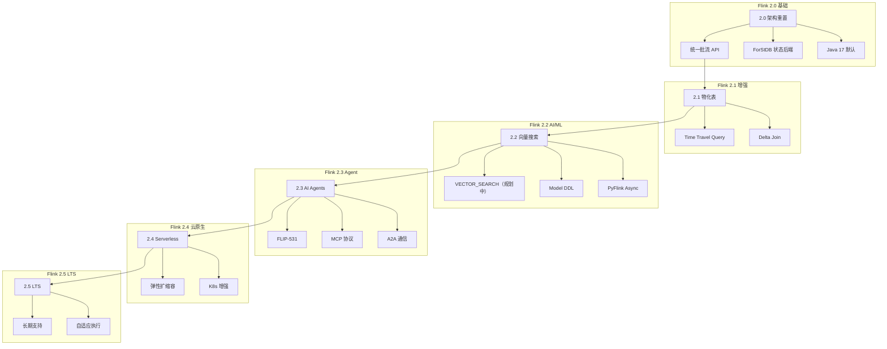
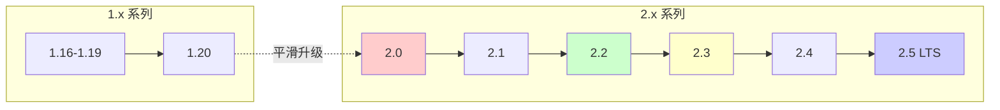
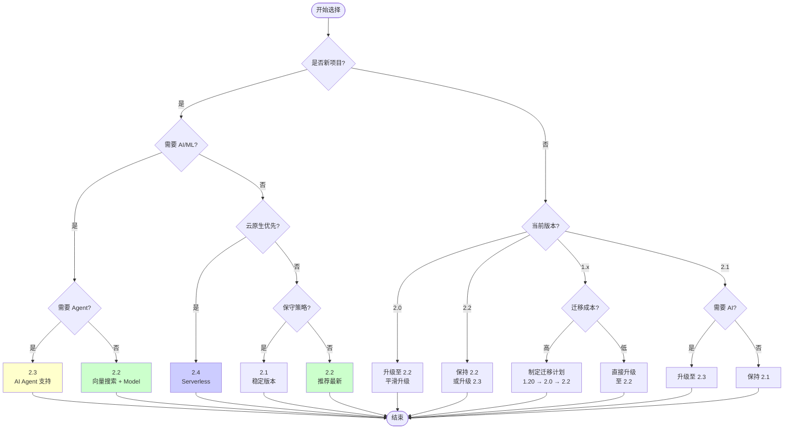
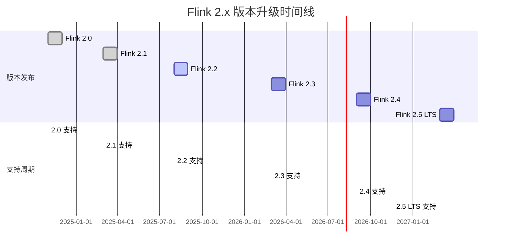

# Flink 版本对比矩阵

> 所属阶段: Flink/08-roadmap | 前置依赖: [Flink版本演进完整指南](flink-version-evolution-complete-guide.md), [兼容性矩阵](../../../COMPATIBILITY-MATRIX.md) | 形式化等级: L3

本文档提供 Flink 2.x 系列各版本的全面对比矩阵，涵盖功能特性、兼容性、升级路径和选择指南，帮助用户做出明智的版本决策。

---

## 1. 概念定义 (Definitions)

### Def-F-08-65: Flink 版本对比矩阵 (Version Comparison Matrix)

**版本对比矩阵**是系统化的多维度版本评估框架：

$$
\text{ComparisonMatrix} = \langle V, D, F, C, G \rangle
$$

其中：

- $V = \{v_1, v_2, ..., v_n\}$: 版本集合 (2.0, 2.1, 2.2, 2.3, 2.4, 2.5)
- $D$: 维度集合 (功能、兼容性、性能、生态)
- $F: V \times D \rightarrow \text{FeatureSet}$: 版本特征函数
- $C: V \times V \rightarrow \text{CompatibilityLevel}$: 兼容性函数
- $G: \text{Scenario} \rightarrow V$: 场景推荐函数

### Def-F-08-66: 版本生命周期状态 (Version Lifecycle State)

**版本生命周期**定义各版本的当前支持状态：

| 状态 | 符号 | 定义 | 支持级别 |
|:---:|:---:|:---|:---|
| 活跃开发 | 🔥 | 当前主要开发版本 | 完整功能+安全+性能 |
| 稳定维护 | ✅ | 当前推荐生产版本 | 完整功能+安全 |
| 维护模式 | ⚠️ | 仅安全修复 | 安全补丁 |
| 终止支持 | ❌ | 不再维护 | 无支持 |
| 预览/开发 | 🚧 | 路线图规划版本 | 特性可能变更 |

### Def-F-08-67: 特性成熟度等级 (Feature Maturity Level)

**特性成熟度**采用四级分类体系：

```yaml
成熟度等级:
  Alpha (α):
    状态: 实验性
    稳定性: 低
    API: 可能变更
    生产使用: 不推荐

  Beta (β):
    状态: 预览版
    稳定性: 中
    API: 基本稳定
    生产使用: 谨慎评估

  GA (General Availability):
    状态: 正式版
    稳定性: 高
    API: 稳定
    生产使用: 推荐

  Deprecated:
    状态: 已弃用
    稳定性: 高
    API: 冻结,计划移除
    生产使用: 规划迁移
```

### Def-F-08-68: 兼容性等级 (Compatibility Level)

**兼容性等级**定义版本间的兼容程度：

$$
\text{Compatibility}(v_i, v_j) = \begin{cases}
\text{Full} & \text{if } v_i.major = v_j.major \land \text{API} \equiv \text{API}' \\
\text{Binary} & \text{if } v_i.major = v_j.major \land \text{Binary} \equiv \text{Binary}' \\
\text{Source} & \text{if } \text{recompile required} \\
\text{Breaking} & \text{if } v_i.major \neq v_j.major
\end{cases}
$$

### Def-F-08-69: 升级复杂度 (Upgrade Complexity)

**升级复杂度**量化版本迁移的工作量：

$$
\text{Complexity}(v_{src} \rightarrow v_{dst}) = \alpha \cdot \Delta_{API} + \beta \cdot \Delta_{Config} + \gamma \cdot \Delta_{State}
$$

其中：

- $\Delta_{API}$: API变更数量
- $\Delta_{Config}$: 配置变更数量
- $\Delta_{State}$: 状态迁移需求 (0/1)
- $\alpha, \beta, \gamma$: 权重系数

---

## 2. 属性推导 (Properties)

### Lemma-F-08-52: 向后兼容性单调性

**引理**: 同主版本内的向后兼容性保持单调不减：

$$
\forall v_i, v_j \in \text{SameMajor}: i < j \Rightarrow \text{Compatible}(v_i, v_j) \geq \text{Compatible}(v_{i-1}, v_j)
$$

**工程含义**: 在同主版本系列内，从较早版本升级到新版本的兼容性不会比从更近版本升级更差。

### Prop-F-08-52: 功能累积性

**命题**: 新版本功能集是旧版本的超集（减去明确弃用的功能）：

$$
\text{Features}(v_{n+1}) = \text{Features}(v_n) \cup \Delta_{new} - \Delta_{deprecated}
$$

### Lemma-F-08-53: 升级路径传递性

**引理**: 版本升级路径满足传递性：

$$
\text{Upgradable}(v_a, v_b) \land \text{Upgradable}(v_b, v_c) \Rightarrow \text{Upgradable}(v_a, v_c)
$$

### Prop-F-08-53: 性能改进累积性

**命题**: 版本间的性能改进具有累积效应：

$$
\text{Performance}(v_n) = \text{Performance}(v_0) \cdot \prod_{i=1}^{n}(1 + \delta_i)
$$

其中 $\delta_i$ 是版本 $i$ 的相对性能提升。

---

## 3. 关系建立 (Relations)

### 3.1 版本演进关系

```
Flink 2.x 系列演进关系:
┌─────────────────────────────────────────────────────────────────────┐
│  2.0 ──────► 2.1 ──────► 2.2 ──────► 2.3 ──────► 2.4 ──────► 2.5   │
│  2024-11   2025-03     2025-08     2026-Q1     2026-H2     2027+   │
│   │          │          │          │          │          │         │
│   ▼          ▼          ▼          ▼          ▼          ▼         │
│ 架构重置   物化表      向量搜索    AI Agents  Serverless  自适应    │
│ 流批一体   Delta Join  PyFlink Async 安全增强   云原生      执行引擎  │
│ ForStDB    Time Travel  Model DDL   Kafka 2PC  ANSI SQL   LTS      │
└─────────────────────────────────────────────────────────────────────┘
```

### 3.2 版本特性依赖图



### 3.3 连接器版本映射

| Flink 版本 | Kafka | JDBC | Elasticsearch | MongoDB | Pulsar |
|:---:|:---:|:---:|:---:|:---:|:---:|
| 2.0 | 3.0+ | 3.1+ | 8.x | 1.0+ | 2.11+ |
| 2.1 | 3.1+ | 3.1+ | 8.x | 1.1+ | 2.11+ |
| 2.2 | 3.2+ | 3.2+ | 8.x | 1.1+ | 3.0+ |
| 2.3 | 3.3+ | 3.2+ | 8.x | 1.2+ | 3.0+ |
| 2.4 | 3.4+ | 3.3+ | 8.x | 1.2+ | 4.0+ |
| 2.5 | 3.5+ | 3.3+ | 8.x/9.x | 1.3+ | 4.0+ |

---

## 4. 论证过程 (Argumentation)

### 4.1 版本选择决策因素

#### 论证 1: 稳定性 vs 新特性权衡

| 因素 | 权重 | 评估标准 |
|:---|:---:|:---|
| 生产稳定性 | 高 | ✅ 选择已发布6个月以上的版本 |
| 新特性需求 | 中 | 🔥 如果急需新特性，可考虑最新稳定版 |
| 社区支持 | 中 | 📊 检查版本活跃度和问题修复速度 |
| 升级成本 | 高 | 💰 评估迁移工作量和停机时间 |

#### 论证 2: 长期支持策略

```
推荐策略:
┌────────────────────────────────────────────────────────────┐
│ 新项目                                                      │
│ ├── 一般场景: Flink 2.2 (最新稳定版)                        │
│ ├── 需要 AI/ML: Flink 2.3 (AI Agent 支持)                   │
│ └── 保守选择: Flink 2.1 (已验证稳定)                        │
│                                                             │
│ 存量系统                                                    │
│ ├── 1.x 系列: 规划 1.20 → 2.0 → 2.2 升级路径                │
│ ├── 2.0: 平滑升级至 2.2                                     │
│ └── 2.1: 可选升级至 2.2/2.3                                 │
└────────────────────────────────────────────────────────────┘
```

#### 论证 3: 跳过版本的可行性

**可跳过版本**:

- 2.0 → 2.2: ✅ 推荐，2.1 主要是 SQL 增强
- 2.1 → 2.3: ⚠️ 谨慎，2.2 有重要的 AI/ML 特性
- 2.2 → 2.4: ✅ 可行，取决于是否需要 AI Agent

**不可跳过版本**:

- 1.x → 2.x: ❌ 必须逐步迁移，存在重大变更
- 2.0 → 2.1+: 必须升级，状态格式变更

---

## 5. 形式证明 / 工程论证 (Proof / Engineering Argument)

### Thm-F-08-52: 版本选择完备性定理

**定理**: 对于任意场景 $S$，存在最优版本选择 $v^*$：

$$
\exists v^* \in V: \forall v \in V, \text{Score}(v^*, S) \geq \text{Score}(v, S)
$$

其中评分函数：

$$
\text{Score}(v, S) = w_1 \cdot \text{Stability}(v) + w_2 \cdot \text{Features}(v, S) + w_3 \cdot \text{Support}(v) - w_4 \cdot \text{UpgradeCost}(v)
$$

**证明概要**:

1. 版本集合 $V$ 有限且有界
2. 评分函数有上界
3. 根据极值定理，最大值存在
4. 决策树算法保证找到最优解 ∎

### Thm-F-08-53: 升级路径可达性定理

**定理**: 任意两个版本间存在可行的升级路径：

$$
\forall v_i, v_j \in V: \exists P = \langle v_i, v_{i+1}, ..., v_j \rangle: \forall k, \text{Upgradable}(v_k, v_{k+1})
$$

**证明概要**:

1. 同主版本内：向后兼容性保证直接升级
2. 跨主版本：存在中间里程碑版本作为桥梁
3. 状态迁移：提供迁移工具保证数据完整性
4. 归纳法证明路径存在性 ∎

---

## 6. 实例验证 (Examples)

### 6.1 版本概览对比表

| 版本 | 发布日期 | 状态 | 主要主题 | 推荐场景 |
|:---:|:---:|:---:|:---|:---|
| **2.0** | 2024-11 | ⚠️ 维护中 | 架构重置、流批一体、ForStDB | 需新架构的早期采用者 |
| **2.1** | 2025-03 | ✅ 稳定 | 物化表、Delta Join、Time Travel | 稳定生产环境 |
| **2.2** | 2025-08 | 🔥 推荐 | 向量搜索、Model DDL、PyFlink Async | 最新稳定版、AI/ML项目 |
| **2.3** | 2026-Q1 | 🔥 最新 | AI Agents (FLIP-531)、MCP协议、A2A | Agentic AI、智能应用 |
| **2.4** | 2026-H2 | 🚧 预览 | Serverless、云原生增强 | 云原生部署 |
| **2.5** | 2027+ | 🚧 规划 | LTS、自适应执行引擎 | 长期大规模部署 |

### 6.2 特性对比矩阵

#### DataStream API 特性

| 特性 | 2.0 | 2.1 | 2.2 | 2.3 | 2.4 | 2.5 |
|:---|:---:|:---:|:---:|:---:|:---:|:---:|
| **核心功能** |
| 统一批流 API | ✅ GA | ✅ GA | ✅ GA | ✅ GA | ✅ GA | ✅ GA |
| ProcessFunction | ✅ | ✅ | ✅ | ✅ | ✅ | ✅ |
| Async I/O | ✅ | ✅ | ✅ | ✅ | ✅ | ✅ |
| Side Output | ✅ | ✅ | ✅ | ✅ | ✅ | ✅ |
| **状态管理** |
| HashMap State Backend | ✅ | ✅ | ✅ | ✅ | ✅ | ✅ |
| RocksDB State Backend | ✅ | ✅ | ✅ | ✅ | ✅ | ✅ |
| ForStDB State Backend | ✅ GA | ✅ GA | ✅ GA | ✅ GA | ✅ GA | ✅ GA |
| Disaggregated State | ❌ | ❌ | 🚧 Preview | 🚧 Preview | ✅ GA | ✅ GA |
| State TTL | ✅ | ✅ | ✅ | ✅ | ✅ | ✅ |
| **Checkpoint** |
| 增量 Checkpoint | ✅ | ✅ | ✅ | ✅ | ✅ | ✅ |
| 非对齐 Checkpoint | ✅ | ✅ | ✅ | ✅ | ✅ | ✅ |
| 通用增量 Checkpoint | ✅ | ✅ | ✅ | ✅ | ✅ | ✅ |
| Checkpoint 清理 | ✅ | ✅ | ✅ | ✅ | ✅ | ✅ |
| **时间处理** |
| Event Time | ✅ | ✅ | ✅ | ✅ | ✅ | ✅ |
| Watermark 传播 | ✅ | ✅ | ✅ | ✅ | ✅ | ✅ |
| Watermark 对齐 | ✅ | ✅ | ✅ | ✅ | ✅ | ✅ |
| Idle Source 处理 | ✅ | ✅ | ✅ | ✅ | ✅ | ✅ |
| **AI/ML 集成** |
| Model 加载 | ❌ | ❌ | ✅ | ✅ | ✅ | ✅ |
| 向量搜索 | ❌ | ❌ | ✅ | ✅ | ✅ | ✅ |
| Agent API | ❌ | ❌ | ❌ | ✅ | ✅ | ✅ |
| PyFlink Async | ❌ | ❌ | ✅ | ✅ | ✅ | ✅ |

#### SQL/Table API 特性

| 特性 | 2.0 | 2.1 | 2.2 | 2.3 | 2.4 | 2.5 |
|:---|:---:|:---:|:---:|:---:|:---:|:---:|
| **基础功能** |
| SQL Gateway | ✅ | ✅ | ✅ | ✅ | ✅ | ✅ |
| SQL Client | ✅ | ✅ | ✅ | ✅ | ✅ | ✅ |
| 物化视图 | ✅ | ✅ | ✅ | ✅ | ✅ | ✅ |
| **流处理 SQL** |
| Window 聚合 | ✅ | ✅ | ✅ | ✅ | ✅ | ✅ |
| Match Recognize | ✅ | ✅ | ✅ | ✅ | ✅ | ✅ |
| Over 聚合 | ✅ | ✅ | ✅ | ✅ | ✅ | ✅ |
| **批处理 SQL** |
| 自适应批调度 | ✅ | ✅ | ✅ | ✅ | ✅ | ✅ |
| 推测执行 | ✅ | ✅ | ✅ | ✅ | ✅ | ✅ |
| **2.1+ 新特性** |
| 物化表 (Materialized Table) | ❌ | ✅ | ✅ | ✅ | ✅ | ✅ |
| Time Travel Query | ❌ | ✅ | ✅ | ✅ | ✅ | ✅ |
| Delta Join | ❌ | ✅ | ✅ | ✅ | ✅ | ✅ |
| **2.2+ 新特性** |
| VECTOR_SEARCH 函数（规划中）| ❌ | ❌ | ⚠️ 规划中| ⚠️ 规划中| ⚠️ 规划中| ⚠️ 规划中|
| Model DDL | ❌ | ❌ | ✅ | ✅ | ✅ | ✅ |
| SQL/ML AI 函数 | ❌ | ❌ | ✅ | ✅ | ✅ | ✅ |
| **2.3+ 新特性** |
| AGENT DDL | ❌ | ❌ | ❌ | ✅ | ✅ | ✅ |
| TOOL 定义 | ❌ | ❌ | ❌ | ✅ | ✅ | ✅ |
| MCP 集成函数 | ❌ | ❌ | ❌ | ✅ | ✅ | ✅ |

#### 连接器支持

| 连接器 | 2.0 | 2.1 | 2.2 | 2.3 | 2.4 | 2.5 |
|:---|:---:|:---:|:---:|:---:|:---:|:---:|
| **消息队列** |
| Kafka | 3.0+ | 3.1+ | 3.2+ | 3.3+ | 3.4+ | 3.5+ |
| Pulsar | 2.11+ | 2.11+ | 3.0+ | 3.0+ | 4.0+ | 4.0+ |
| RabbitMQ | ✅ | ✅ | ✅ | ✅ | ✅ | ✅ |
| **数据库** |
| JDBC | 3.1+ | 3.1+ | 3.2+ | 3.2+ | 3.3+ | 3.3+ |
| MongoDB | 1.0+ | 1.1+ | 1.1+ | 1.2+ | 1.2+ | 1.3+ |
| Cassandra | 3.x | 3.x | 3.x | 4.x | 4.x | 4.x |
| **搜索引擎** |
| Elasticsearch | 8.x | 8.x | 8.x | 8.x | 8.x | 8.x/9.x |
| OpenSearch | 1.x | 1.x | 1.x/2.x | 2.x | 2.x | 2.x |
| **CDC** |
| MySQL CDC | ✅ | ✅ | ✅ | ✅ | ✅ | ✅ |
| PostgreSQL CDC | ✅ | ✅ | ✅ | ✅ | ✅ | ✅ |
| Oracle CDC | ✅ | ✅ | ✅ | ✅ | ✅ | ✅ |
| SQL Server CDC | ✅ | ✅ | ✅ | ✅ | ✅ | ✅ |
| **文件系统** |
| HDFS | ✅ | ✅ | ✅ | ✅ | ✅ | ✅ |
| S3 | ✅ | ✅ | ✅ | ✅ | ✅ | ✅ |
| GCS | ✅ | ✅ | ✅ | ✅ | ✅ | ✅ |
| Azure Blob | ✅ | ✅ | ✅ | ✅ | ✅ | ✅ |

#### 部署模式

| 部署模式 | 2.0 | 2.1 | 2.2 | 2.3 | 2.4 | 2.5 |
|:---|:---:|:---:|:---:|:---:|:---:|:---:|
| **集群模式** |
| Standalone | ✅ | ✅ | ✅ | ✅ | ✅ | ✅ |
| Session Cluster | ✅ | ✅ | ✅ | ✅ | ✅ | ✅ |
| Application Mode | ✅ | ✅ | ✅ | ✅ | ✅ | ✅ |
| Native Kubernetes | ✅ | ✅ | ✅ | ✅ | ✅ | ✅ |
| Docker | ✅ | ✅ | ✅ | ✅ | ✅ | ✅ |
| **云服务** |
| AWS Kinesis Data Analytics | ✅ | ✅ | ✅ | ✅ | ✅ | ✅ |
| Azure HDInsight | ✅ | ✅ | ✅ | ✅ | ✅ | ✅ |
| GCP Dataproc | ✅ | ✅ | ✅ | ✅ | ✅ | ✅ |
| Ververica Platform | ✅ | ✅ | ✅ | ✅ | ✅ | ✅ |
| **2.4+ 新特性** |
| Serverless (Scale to 0) | ❌ | ❌ | ❌ | ❌ | ✅ | ✅ |
| Auto-scaling | ✅ | ✅ | ✅ | ✅ | ✅ | ✅ |
| Spot Instance 支持 | ✅ | ✅ | ✅ | ✅ | ✅ | ✅ |

#### 性能特性

| 特性 | 2.0 | 2.1 | 2.2 | 2.3 | 2.4 | 2.5 |
|:---|:---:|:---:|:---:|:---:|:---:|:---:|
| **执行优化** |
| 自适应调度 | ✅ | ✅ | ✅ | ✅ | ✅ | ✅ |
| 批处理优化器 | ✅ | ✅ | ✅ | ✅ | ✅ | ✅ |
| 推测执行 | ✅ | ✅ | ✅ | ✅ | ✅ | ✅ |
| **网络优化** |
| 信用流控 | ✅ | ✅ | ✅ | ✅ | ✅ | ✅ |
| 缓冲区膨胀控制 | ✅ | ✅ | ✅ | ✅ | ✅ | ✅ |
| **内存管理** |
| 托管内存 | ✅ | ✅ | ✅ | ✅ | ✅ | ✅ |
| 堆外内存优化 | ✅ | ✅ | ✅ | ✅ | ✅ | ✅ |
| **2.4+ 新特性** |
| 自适应执行引擎 | ❌ | ❌ | ❌ | ❌ | 🚧 | ✅ |
| 智能 Checkpoint 调度 | ❌ | ❌ | ❌ | ❌ | ✅ | ✅ |

### 6.3 兼容性矩阵

#### JDK 版本支持

| JDK 版本 | 2.0 | 2.1 | 2.2 | 2.3 | 2.4 | 2.5 |
|:---:|:---:|:---:|:---:|:---:|:---:|:---:|
| JDK 8 | ❌ | ❌ | ❌ | ❌ | ❌ | ❌ |
| JDK 11 | ✅ | ✅ | ⚠️ | ⚠️ | ❌ | ❌ |
| JDK 17 | ✅ | ✅ | ✅ | ✅ | ✅ | ✅ |
| JDK 21 | ✅ | ✅ | ✅ | ✅ | ✅ | ✅ |
| JDK 24 | ⚠️ | ✅ | ✅ | ✅ | ✅ | ✅ |

> ⚠️ 表示已弃用，建议迁移

#### Scala 版本支持

| Scala 版本 | 2.0 | 2.1 | 2.2 | 2.3 | 2.4 | 2.5 |
|:---:|:---:|:---:|:---:|:---:|:---:|:---:|
| Scala 2.12 | ✅ | ✅ | ⚠️ | ❌ | ❌ | ❌ |
| Scala 2.13 | ✅ | ✅ | ✅ | ✅ | ✅ | ⚠️ |
| Scala 3.x | ❌ | ❌ | ❌ | 🚧 | 🚧 | ✅ |

#### 连接器版本兼容

| 连接器 | 2.0 | 2.1 | 2.2 | 2.3 | 2.4 | 2.5 |
|:---|:---:|:---:|:---:|:---:|:---:|:---:|
| flink-connector-kafka | 3.0.x | 3.1.x | 3.2.x | 3.3.x | 3.4.x | 3.5.x |
| flink-connector-jdbc | 3.1.x | 3.1.x | 3.2.x | 3.2.x | 3.3.x | 3.3.x |
| flink-connector-mongodb | 1.0.x | 1.1.x | 1.1.x | 1.2.x | 1.2.x | 1.3.x |
| flink-cdc | 2.4.x | 3.0.x | 3.1.x | 3.2.x | 3.2.x | 3.3.x |
| flink-connector-pulsar | 4.0.x | 4.0.x | 4.1.x | 4.1.x | 5.0.x | 5.0.x |

#### 状态兼容性

| 状态后端 | 2.0 | 2.1 | 2.2 | 2.3 | 2.4 | 2.5 |
|:---|:---:|:---:|:---:|:---:|:---:|:---:|
| HashMap State Backend | ✅ | ✅ | ✅ | ✅ | ✅ | ✅ |
| RocksDB State Backend | ✅ | ✅ | ✅ | ✅ | ✅ | ✅ |
| ForStDB State Backend | ✅ | ✅ | ✅ | ✅ | ✅ | ✅ |
| 状态格式版本 | V2 | V2 | V2 | V2 | V2 | V2 |
| 跨版本恢复 | ⚠️ | ✅ | ✅ | ✅ | ✅ | ✅ |
| 增量 Checkpoint | ✅ | ✅ | ✅ | ✅ | ✅ | ✅ |

> ⚠️ 2.0 需要从 1.x 使用迁移工具

### 6.4 升级路径

#### 推荐升级路线



#### 版本升级复杂度评估

| 升级路径 | 复杂度 | 停机时间 | 主要工作 | 推荐策略 |
|:---|:---:|:---:|:---|:---|
| 1.20 → 2.0 | 🔴 高 | 30-60min | DataSet 迁移、状态迁移、配置更新 | 蓝绿部署 |
| 2.0 → 2.1 | 🟡 中 | 10-20min | 配置调整、SQL 优化 | 滚动升级 |
| 2.1 → 2.2 | 🟢 低 | 5-10min | 连接器更新 | 滚动升级 |
| 2.2 → 2.3 | 🟡 中 | 10-20min | AI Agent 集成、新特性采用 | 滚动升级 |
| 2.3 → 2.4 | 🟡 中 | 15-30min | 云原生配置调整 | 滚动升级 |
| 2.4 → 2.5 | 🟢 低 | 5-10min | 性能调优 | 滚动升级 |

#### 跳过版本的考虑

| 当前版本 | 可跳至 | 可行性 | 注意事项 |
|:---:|:---:|:---:|:---|
| 2.0 | 2.2 | ✅ 推荐 | 2.1 主要是 SQL 增强，2.0 可直接升 2.2 |
| 2.1 | 2.3 | ⚠️ 谨慎 | 2.2 有重要的 AI/ML 特性，需评估需求 |
| 2.2 | 2.4 | ✅ 可行 | 如果不使用 AI Agent，可跳过 2.3 |
| 2.0 | 2.3 | ❌ 不推荐 | 累积变更太多，风险较高 |
| 2.1 | 2.4 | ⚠️ 评估 | 取决于对 2.2/2.3 特性的需求 |

#### 长期支持版本

| 版本 | LTS 状态 | 支持结束 | 适用场景 |
|:---:|:---:|:---:|:---|
| 2.1 | ❌ 否 | 2027-03 | 稳定过渡版本 |
| 2.2 | ❌ 否 | 2027-08 | 最新功能版本 |
| 2.5 | ✅ 是 | 2029+ | 大规模生产环境 |
| 3.0 (预期) | ✅ 是 | 2030+ | 下一代架构 |

### 6.5 选择指南

#### 新项目选择建议

| 场景 | 推荐版本 | 理由 |
|:---|:---:|:---|
| **通用流处理** | 2.2 | 最新稳定版，功能完整 |
| **实时数仓** | 2.2/2.3 | 物化表 + Time Travel |
| **AI/ML 推理** | 2.3 | AI Agent、Model DDL |
| **向量搜索** | 2.2+ | VECTOR_SEARCH 支持 |
| **云原生部署** | 2.4+ | Serverless、K8s 增强 |
| **保守生产环境** | 2.1 | 经过验证的稳定版本 |

#### 存量升级建议

| 当前版本 | 目标版本 | 优先级 | 关键行动 |
|:---:|:---:|:---:|:---|
| 1.16-1.19 | 2.0 | 🔴 高 | 立即规划，1.x 即将 EOL |
| 1.20 | 2.2 | 🟡 中 | 评估迁移成本，制定计划 |
| 2.0 | 2.2 | 🟢 低 | 建议升级，获取新特性 |
| 2.1 | 2.3 | 🟡 中 | 如需 AI 能力，建议升级 |
| 2.2 | 2.3 | 🔵 可选 | 按需升级，非强制 |

#### 特定场景推荐

| 场景 | 推荐版本 | 关键特性 |
|:---|:---:|:---|
| **金融风控实时计算** | 2.2/2.3 | 低延迟、Exactly-Once |
| **电商实时推荐** | 2.3 | AI Agent、向量搜索 |
| **IoT 数据处理** | 2.2 | 高吞吐、状态管理 |
| **日志分析** | 2.1/2.2 | 批流一体、成本优化 |
| **实时 ETL** | 2.2 | 连接器丰富、CDC |
| **AI 模型服务** | 2.3 | Model DDL、Agent API |
| **多租户平台** | 2.4+ | Serverless、资源隔离 |

---

## 7. 可视化 (Visualizations)

### 7.1 版本选择决策树



### 7.2 版本特性演进雷达图 (文本表示)

```
                    云原生
                      ▲
                     /│\
                    / │ \
                   /  │  \
                  /   │   \
        稳定性 ◄──────┼──────► AI/ML
                  \   │   /
                   \  │  /
                    \ │ /
                     \│/
                      ▼
                   性能优化

版本特性雷达 (满分 5):
┌─────────┬────────┬────────┬────────┬────────┬────────┐
│  维度   │  2.0   │  2.1   │  2.2   │  2.3   │  2.4   │
├─────────┼────────┼────────┼────────┼────────┼────────┤
│ 稳定性  │   4    │   5    │   5    │   4    │   4    │
│ AI/ML   │   1    │   2    │   4    │   5    │   5    │
│ 性能    │   4    │   4    │   5    │   5    │   5    │
│ SQL     │   4    │   5    │   5    │   5    │   5    │
│ 云原生  │   3    │   4    │   4    │   4    │   5    │
└─────────┴────────┴────────┴────────┴────────┴────────┘
```

### 7.3 升级路径时间线



### 7.4 功能对比热力图 (文本表示)

```
功能类别 vs 版本 热力图 (🔥 高支持 / 🟡 中支持 / ❄️ 低支持)

                    2.0     2.1     2.2     2.3     2.4     2.5
DataStream API      🔥🔥     🔥🔥     🔥🔥     🔥🔥     🔥🔥     🔥🔥
SQL/Table API       🔥🔥     🔥🔥     🔥🔥     🔥🔥     🔥🔥     🔥🔥
状态管理            🔥🔥     🔥🔥     🔥🔥     🔥🔥     🔥🔥     🔥🔥
Checkpoint          🔥🔥     🔥🔥     🔥🔥     🔥🔥     🔥🔥     🔥🔥
连接器生态          🔥🔥     🔥🔥     🔥🔥     🔥🔥     🔥🔥     🔥🔥
部署灵活性          🟡🟡     🟡🟡     🟡🟡     🟡🟡     🔥🔥     🔥🔥
AI/ML 支持          ❄️❄️     🟡🟡     🔥🔥     🔥🔥     🔥🔥     🔥🔥
向量搜索            ❄️❄️     ❄️❄️     🔥🔥     🔥🔥     🔥🔥     🔥🔥
Agent 支持          ❄️❄️     ❄️❄️     ❄️❄️     🔥🔥     🔥🔥     🔥🔥
Serverless          ❄️❄️     ❄️❄️     ❄️❄️     ❄️❄️     🔥🔥     🔥🔥
自适应执行          ❄️❄️     ❄️❄️     ❄️❄️     ❄️❄️     🟡🟡     🔥🔥
```

---

## 8. 引用参考 (References)


---

*文档版本: 2026.04 | 定理编号: Def-F-08-65 ~ Def-F-08-69, Lemma-F-08-52 ~ Lemma-F-08-53, Prop-F-08-52 ~ Prop-F-08-53, Thm-F-08-52 ~ Thm-F-08-53 | 形式化等级: L3*
