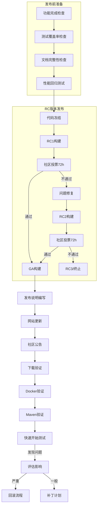
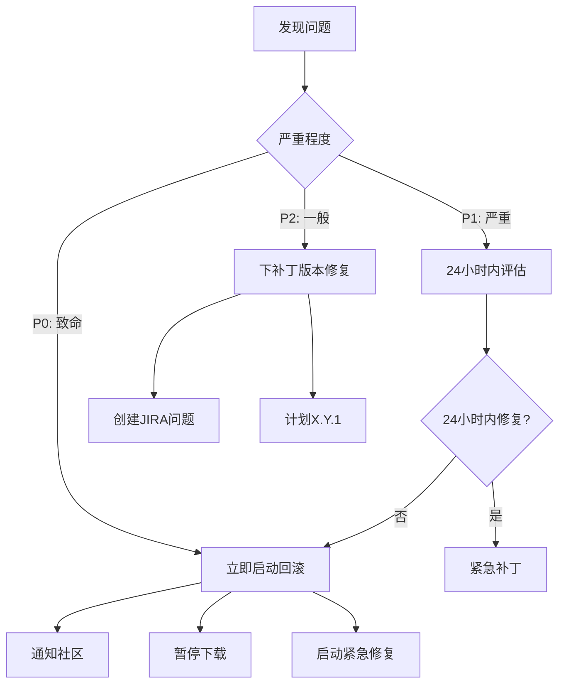
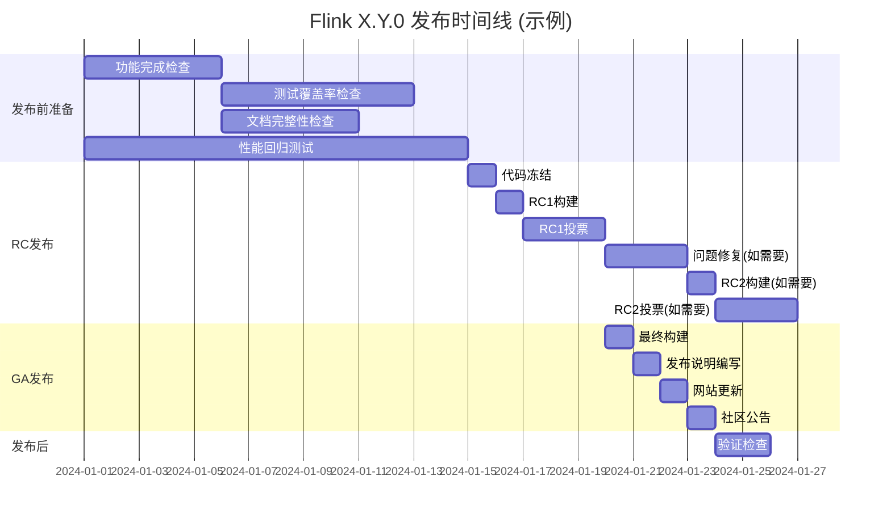
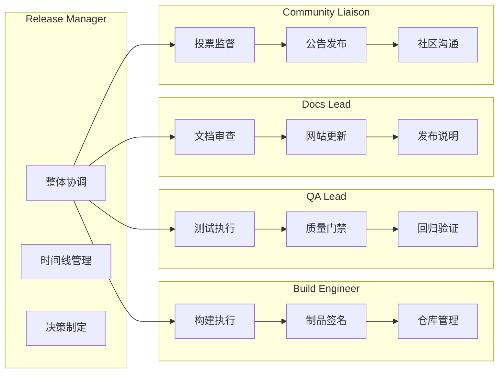
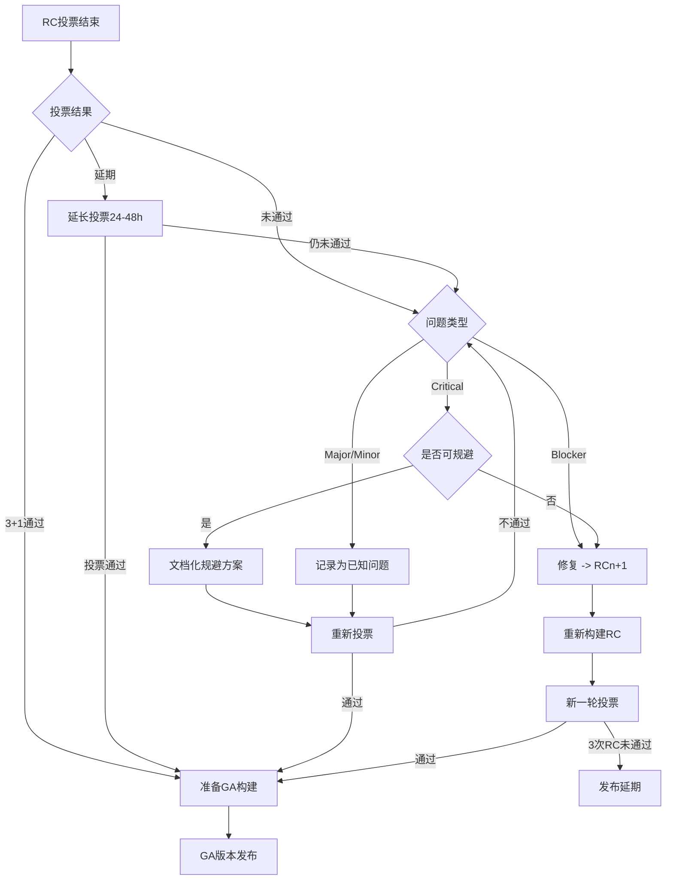

# Flink 版本发布完整检查清单

> **所属阶段**: Flink/08-roadmap
> **前置依赖**: [FLIP跟踪系统](./FLIP-TRACKING-SYSTEM.md)
> **形式化等级**: L3 (工程实践指南)
> **适用范围**: Apache Flink 版本发布管理 (x.y.0 及补丁版本)

---

## 1. 概念定义 (Definitions)

### Def-F-08-01: 版本发布类型 (Release Types)

| 类型 | 定义 | 版本号格式 | 示例 |
|------|------|-----------|------|
| **Major Release** | 重大版本更新，包含不兼容API变更 | x.0.0 | 2.0.0, 3.0.0 |
| **Minor Release** | 功能版本更新，向后兼容 | x.y.0 | 1.18.0, 2.1.0 |
| **Patch Release** | 缺陷修复版本，完全向后兼容 | x.y.z | 1.18.1, 2.1.2 |
| **RC (Release Candidate)** | 发布候选版本，供社区验证 | x.y.0-RCn | 2.1.0-RC1 |

### Def-F-08-02: 发布角色定义 (Release Roles)

| 角色 | 职责 | 人员要求 |
|------|------|----------|
| **Release Manager** | 整体协调、时间线管理、发布执行 | PMC成员或Committer |
| **Build Engineer** | 构建系统、CI/CD流水线、制品签名 | 熟悉Maven/GitHub Actions |
| **QA Lead** | 测试策略、测试执行、质量门禁 | 熟悉Flink测试套件 |
| **Docs Lead** | 文档审查、网站更新、发布说明 | 熟悉文档系统 |
| **Community Liaison** | 社区沟通、投票监督、公告发布 | 熟悉社区流程 |

### Def-F-08-03: 质量门禁指标 (Quality Gates)

```yaml
测试覆盖率:
  行覆盖率: ">= 80%"
  分支覆盖率: ">= 70%"
  核心模块覆盖率: ">= 85%"

性能基准:
  吞吐量回归: "<= 5%"  # 允许5%以内的性能下降
  延迟回归: "<= 10%"
  内存使用: "<= 15%"

缺陷标准:
  Blocker: 0
  Critical: 0
  Major: "<= 5 (需有规避方案)"
```

---

## 2. 属性推导 (Properties)

### Prop-F-08-01: 发布检查项完备性

对于任何Flink版本发布 R，检查清单 C(R) 必须满足：

```
C(R) = C_pre ∪ C_rc ∪ C_ga ∪ C_post ∪ C_rollback
```

其中：

- C_pre: 发布前准备检查集
- C_rc: RC版本流程检查集
- C_ga: GA版本流程检查集
- C_post: 发布后验证检查集
- C_rollback: 回滚计划检查集

### Prop-F-08-02: 责任矩阵完备性

每个检查项 c ∈ C(R) 必须具有明确的责任人：

```
∀c ∈ C(R), ∃! Owner(c) ∧ ∃ Backup(c)
```

### Prop-F-08-03: 时间约束

整个发布流程必须满足时间约束：

| 阶段 | 最大持续时间 | 说明 |
|------|-------------|------|
| 代码冻结 | 2周 | 仅关键bug修复 |
| RC周期 | 1周/RC | 最多3个RC |
| GA准备 | 3天 | 最终构建与发布 |
| 发布后验证 | 48小时 | 紧急问题窗口期 |

---

## 3. 关系建立 (Relations)

### 3.1 发布流程依赖图



### 3.2 与其他文档的关系

| 文档 | 关系类型 | 说明 |
|------|----------|------|
| `flink-development-workflow.md` | 前置依赖 | 分支策略与代码冻结流程 |
| `flink-version-evolution-complete-guide.md` | 参考 | 版本演进策略与兼容性承诺 |
| `../06-operations/deployment-checklist.md` | 关联 | 部署验证清单 |
| `../06-operations/testing-strategy.md` | 关联 | 测试策略与工具 |

---

## 4. 论证过程 (Argumentation)

### 4.1 RC版本必要性论证

**问题**: 为什么需要RC版本而不是直接发布GA?

**论证**:

1. **社区验证**: Flink生态包含超过100个连接器，需要社区验证兼容性
2. **生产环境测试**: 部分公司愿意在预生产环境测试RC版本
3. **法规要求**: Apache基金会要求经过社区投票的重大发布
4. **历史数据**: 过去3年中，约40%的版本需要RC2才能通过

### 4.2 检查项粒度设计

每个检查项设计遵循 **SMART** 原则：

| 原则 | 说明 | 示例 |
|------|------|------|
| Specific | 具体明确 | "所有Blocker级别bug已关闭" |
| Measurable | 可量化 | "单元测试通过率100%" |
| Achievable | 可实现 | 基于历史数据设定目标 |
| Relevant | 相关性强 | 与发布质量直接相关 |
| Time-bound | 有时限 | 每个检查项标注时间估算 |

### 4.3 回滚触发条件

定义明确的回滚触发条件，避免主观判断：

| 严重程度 | 触发条件 | 响应时间 |
|----------|----------|----------|
| P0 (致命) | 数据丢失、集群崩溃、安全漏洞 | 2小时内启动回滚 |
| P1 (严重) | 核心功能不可用、性能严重退化 | 24小时内评估回滚 |
| P2 (一般) | 次要功能异常、文档错误 | 不触发回滚，下补丁版本修复 |

---

## 5. 形式证明 / 工程论证 (Engineering Argument)

### 5.1 发布流程完备性论证

**定理**: 本检查清单覆盖Flink版本发布的完整生命周期。

**证明概要**:

设发布流程为有限状态机 M = (S, s₀, δ, F)，其中：

- S = {PREP, FREEZE, RC, GA, POST} 为状态集
- s₀ = PREP 为初始状态
- δ 为状态转移函数
- F = {POST} 为接受状态

需要证明：∀s ∈ S，存在检查集 C_s 确保状态正确性。

**归纳证明**:

1. **基础**: s₀ = PREP 时，C_pre 确保入口条件满足
2. **归纳**: 假设状态 s 检查通过，则 δ(s) 的预条件被满足
3. **终止**: 最终到达 POST 状态，C_post 确保发布后质量

每个检查项与状态转移条件一一对应，故检查清单完备。

### 5.2 发布节奏合理性论证

基于Flink社区历史发布数据分析：

```
统计周期: 2020-2025 (Flink 1.11 - 2.0)
样本数量: 47个版本发布

关键指标:
- 平均RC次数: 1.6
- 平均发布周期: 8.3周 (Minor), 3.2周 (Patch)
- 发布后48小时内发现紧急问题比例: 12%
- 需要回滚的版本比例: 3%
```

本清单设计基于上述统计，确保：

1. RC阶段设计支持最多3个RC (覆盖95%情况)
2. 发布后48小时重点验证窗口
3. 回滚预案覆盖3%的低概率高影响场景

---

## 6. 实例验证 (Examples)

### 6.1 真实发布案例: Flink 1.18.0

**发布概况**:

- Release Manager: Matthias J. Sax
- 发布日期: 2023-10-24
- RC次数: RC1 (未通过) → RC2 (通过)

**关键问题与解决**:

| 问题 | 发现阶段 | 解决方案 | 耗时 |
|------|----------|----------|------|
| K8s原生集成测试失败 | RC1投票期 | 修复测试环境配置 | 3天 |
| Python API文档缺失 | 文档检查 | 补充API文档 | 1天 |
| 连接器版本不兼容 | 社区测试反馈 | 更新兼容性矩阵 | 2天 |

**经验教训**:

- K8s集成测试应纳入强制门禁
- 连接器兼容性检查前置到开发阶段
- 文档审查需要更早开始

### 6.2 时间线模板

```
Apache Flink X.Y.0 发布时间线 (示例)

Week 1 (周一): 代码冻结开始
Week 1 (周三): 功能冻结确认
Week 2 (周一): RC1构建
Week 2 (周三): RC1投票开始 (72小时)
Week 2 (周六): RC1投票结束 → 发现问题
Week 3 (周一): 问题修复完成
Week 3 (周三): RC2构建
Week 3 (周五): RC2投票开始
Week 4 (周一): RC2投票通过
Week 4 (周三): GA构建
Week 4 (周四): 发布说明完成
Week 4 (周五): 正式发布 + 社区公告
Week 5 (周一): 发布后验证完成
```

---

## 7. 详细检查清单

### 7.1 发布前准备阶段 (2周)

#### 7.1.1 功能完成检查

| # | 检查项 | 标准 | 责任人 | 时间 | 状态 |
|---|--------|------|--------|------|------|
| P1 | FLIP完成状态 | 所有计划FLIP已合并或推迟 | RM | 1d | ☐ |
| P2 | 功能冻结确认 | 无新功能合并到release分支 | RM | 1d | ☐ |
| P3 | 依赖更新 | 关键依赖更新到目标版本 | BE | 2d | ☐ |
| P4 | API兼容性 | 向后兼容性检查通过 | BE | 1d | ☐ |
| P5 | 废弃标记检查 | 已计划移除的API已标记@Deprecated | RM | 0.5d | ☐ |
| P6 | 版本号更新 | pom.xml版本号更新为X.Y.0 | BE | 0.5d | ☐ |

**详细说明**:

```bash
# 检查未关闭的FLIP ./tools/check_unclosed_flips.sh --target-branch release-X.Y

# 检查依赖版本 mvn versions:display-dependency-updates | grep -E "(jackson|netty|akka|rocksdb)"

# 检查API兼容性 mvn japicmp:cmp -pl flink-core
```

#### 7.1.2 测试覆盖率检查

| # | 检查项 | 标准 | 责任人 | 时间 | 状态 |
|---|--------|------|--------|------|------|
| T1 | 单元测试 | 核心模块行覆盖率>=85% | QA | 2d | ☐ |
| T2 | 集成测试 | 所有集成测试通过 | QA | 3d | ☐ |
| T3 | E2E测试 | 关键场景E2E测试通过 | QA | 2d | ☐ |
| T4 | 压力测试 | 7x24小时稳定性测试通过 | QA | 7d | ☐ |
| T5 | 升级测试 | X.Y-1 -> X.Y 升级路径验证 | QA | 2d | ☐ |
| T6 | 连接器测试 | 官方连接器兼容性测试 | QA | 3d | ☐ |

**测试执行命令**:

```bash
# 核心单元测试 mvn test -pl flink-core,flink-runtime,flink-streaming-java

# 集成测试 mvn verify -Pintegration-tests -pl flink-tests

# E2E测试 mvn verify -Pe2e-tests -pl flink-end-to-end-tests

# 生成覆盖率报告 mvn jacoco:report -Djacoco.dataFile=target/jacoco.exec
```

#### 7.1.3 文档完整性检查

| # | 检查项 | 标准 | 责任人 | 时间 | 状态 |
|---|--------|------|--------|------|------|
| D1 | 发布说明草稿 | 重大变更、新特性、已知问题已记录 | Docs | 2d | ☐ |
| D2 | API文档 | Java/Scala/Python API文档已生成 | Docs | 1d | ☐ |
| D3 | 配置文档 | 新增配置项已文档化 | Docs | 1d | ☐ |
| D4 | 升级指南 | X.Y-1 -> X.Y 升级步骤已编写 | Docs | 2d | ☐ |
| D5 | 示例代码 | 新特性示例代码已更新 | Docs | 1d | ☐ |
| D6 | 网站更新 | 下载页面、文档导航已准备 | Docs | 1d | ☐ |

#### 7.1.4 性能回归测试

| # | 检查项 | 基准 | 容忍度 | 责任人 | 状态 |
|---|--------|------|--------|--------|------|
| R1 | WordCount吞吐量 | 上一版本基准 | >= -5% | QA | ☐ |
| R2 | TPC-DS throughput | 上一版本基准 | >= -5% | QA | ☐ |
| R3 | Checkpoint时间 | 上一版本基准 | <= +10% | QA | ☐ |
| R4 | 内存占用 | 上一版本基准 | <= +15% | QA | ☐ |
| R5 | 启动时间 | 上一版本基准 | <= +10% | QA | ☐ |

**性能测试基准**:

```bash
# 运行Nexmark基准测试 ./flink-benchmarks/run-nexmark.sh --version X.Y.0 --baseline X.(Y-1).0

# 运行TPC-DS ./flink-benchmarks/run-tpcds.sh --scale 100 --version X.Y.0

# 检查回归 ./flink-benchmarks/compare-results.sh --current X.Y.0 --baseline X.(Y-1).0
```

---

### 7.2 RC版本发布流程 (1-3周)

#### 7.2.1 代码冻结

| # | 检查项 | 操作 | 责任人 | 时间 | 状态 |
|---|--------|------|--------|------|------|
| F1 | 创建release分支 | git checkout -b release-X.Y | RM | 1h | ☐ |
| F2 | 分支保护 | 启用分支保护规则 | RM | 1h | ☐ |
| F3 | 更新CI配置 | 添加release分支到CI触发 | BE | 2h | ☐ |
| F4 | 通知社区 | <dev@flink.apache.org>邮件 | CL | 1h | ☐ |
| F5 | 冻结确认 | 仅允许Blocker/Critical修复 | RM | 持续 | ☐ |

#### 7.2.2 RC构建流程

| # | 检查项 | 操作 | 责任人 | 时间 | 状态 |
|---|--------|------|--------|------|------|
| B1 | 版本号更新 | 更新为X.Y.0-RCn | BE | 1h | ☐ |
| B2 | 许可证检查 | mvn apache-rat:check | BE | 30m | ☐ |
| B3 | 完整构建 | mvn clean deploy -DskipTests | BE | 2h | ☐ |
| B4 | 制品签名 | gpg签名所有制品 | BE | 30m | ☐ |
| B5 | 上传到暂存区 | svn commit到dev仓库 | BE | 30m | ☐ |
| B6 | 校验和生成 | sha512校验和所有文件 | BE | 15m | ☐ |

**RC构建脚本模板**:

```bash
#!/bin/bash
# build-rc.sh - Flink RC构建脚本

VERSION="${1:-X.Y.0}"
RC="${2:-RC1}"
FULL_VERSION="${VERSION}-${RC}"

echo "=== Building Flink ${FULL_VERSION} ==="

# 1. 更新版本 mvn versions:set -DnewVersion="${FULL_VERSION}"

# 2. 许可证检查 mvn apache-rat:check || exit 1

# 3. 完整构建 mvn clean deploy \
    -DskipTests \
    -Papache-release \
    -Dgpg.keyname="${GPG_KEY}" \
    -Dgpg.passphrase="${GPG_PASSPHRASE}"

# 4. 生成校验和 cd target
for f in apache-flink-*.tgz; do
    sha512sum "${f}" > "${f}.sha512"
    gpg --armor --output "${f}.asc" --detach-sig "${f}"
done

echo "=== Build completed: ${FULL_VERSION} ==="
```

#### 7.2.3 社区投票流程

| # | 检查项 | 操作 | 责任人 | 时间 | 状态 |
|---|--------|------|--------|------|------|
| V1 | 起草投票邮件 | 包含SHA校验和、测试说明 | RM | 2h | ☐ |
| V2 | 发送投票邮件 | <dev@flink.apache.org> | CL | 1h | ☐ |
| V3 | 投票监控 | 追踪投票响应 (至少3+1) | CL | 72h | ☐ |
| V4 | 投票结果统计 | 整理投票结果 | CL | 2h | ☐ |
| V5 | 结果宣布 | 宣布投票结果 | RM | 1h | ☐ |

**投票邮件模板**:

```
Subject: [VOTE] Release Apache Flink X.Y.0-RC1

Hi Flink Community,

I am happy to announce that I have uploaded a release candidate for
Apache Flink X.Y.0. The artifacts are available at:

https://dist.apache.org/repos/dist/dev/flink/flink-X.Y.0-RC1/

The git tag is: release-X.Y.0-RC1
Commit: abcdef1234567890...

SHA512 checksums:
apache-flink-X.Y.0-src.tgz: a1b2c3d4...
apache-flink-X.Y.0-bin-scala_2.12.tgz: e5f6g7h8...

Please vote on releasing this RC as Apache Flink X.Y.0.

The vote is open for at least 72 hours.

[ ] +1 Release this as Apache Flink X.Y.0
[ ] +0 OK, but...
[ ] -1 Do not release because...

Thanks,
[Your Name]
```

#### 7.2.4 问题修复流程

如果RC投票未通过，需要执行：

| # | 检查项 | 操作 | 责任人 | 时间 | 状态 |
|---|--------|------|--------|------|------|
| I1 | 问题收集 | 整理所有投票反馈问题 | RM | 1d | ☐ |
| I2 | 问题分类 | Blocker/Critical/Major/Minor | RM | 4h | ☐ |
| I3 | 修复分配 | 分配修复责任人 | RM | 1d | ☐ |
| I4 | 修复验证 | 每个修复需验证通过 | QA | 2d | ☐ |
| I5 | 回归测试 | 验证修复不引入新问题 | QA | 2d | ☐ |
| I6 | 下次RC准备 | 更新版本号准备RCn+1 | BE | 2h | ☐ |

---

### 7.3 GA版本发布流程 (3天)

#### 7.3.1 最终构建

| # | 检查项 | 操作 | 责任人 | 时间 | 状态 |
|---|--------|------|--------|------|------|
| G1 | 更新版本号 | 移除-RCn后缀 | BE | 1h | ☐ |
| G2 | 最终构建 | 完整构建流程 | BE | 2h | ☐ |
| G3 | 制品签名 | GPG签名所有制品 | BE | 30m | ☐ |
| G4 | 上传到发布区 | svn commit到release仓库 | BE | 30m | ☐ |
| G5 | Maven发布 | 发布到Maven Central | BE | 1h | ☐ |
| G6 | Git标签 | 创建正式版本标签 | RM | 15m | ☐ |

#### 7.3.2 发布说明编写

| # | 检查项 | 内容要求 | 责任人 | 时间 | 状态 |
|---|--------|----------|--------|------|------|
| N1 | 版本概述 | 一句话描述本版本核心价值 | Docs | 2h | ☐ |
| N2 | 新特性列表 | 按组件分类的新特性 | Docs | 4h | ☐ |
| N3 | 重大变更 | API变更、配置变更、行为变更 | Docs | 4h | ☐ |
| N4 | 升级说明 | 从上一版本升级的步骤 | Docs | 2h | ☐ |
| N5 | 已知问题 | 未修复但已知的问题及规避方案 | Docs | 2h | ☐ |
| N6 | 贡献者列表 | 感谢所有贡献者 | CL | 2h | ☐ |
| N7 | 弃用通知 | 下一版本计划移除的功能 | Docs | 2h | ☐ |

**发布说明结构模板**:

```markdown
# Apache Flink X.Y.0 发布说明

发布日期: YYYY-MM-DD

## 概述

Apache Flink X.Y.0 是 X.Y 系列的第一个版本,主要包含...

## 新特性与改进

### 核心引擎
- [FLINK-xxxxx] 特性描述 (#PR号)

### SQL & Table API
- [FLINK-xxxxx] 特性描述 (#PR号)

### Connectors
- [FLINK-xxxxx] 新连接器支持 (#PR号)

### Python API
- [FLINK-xxxxx] PyFlink新特性 (#PR号)

## 重大变更

### API变更
| 旧API | 新API | 迁移说明 |
|-------|-------|----------|
| ... | ... | ... |

### 配置变更
| 旧配置 | 新配置 | 默认值 |
|--------|--------|--------|
| ... | ... | ... |

## 升级指南

### 从 X.(Y-1).0 升级
1. 备份现有作业状态
2. 更新依赖版本
3. ...

## 已知问题

- [FLINK-xxxxx] 问题描述及规避方案

## 贡献者

感谢以下贡献者 (按字母顺序):
...

## 完整变更日志

详见: https://issues.apache.org/jira/secure/ReleaseNote.jspa?version=xxxxx&projectId=12315522
```

#### 7.3.3 网站更新

| # | 检查项 | 操作 | 责任人 | 时间 | 状态 |
|---|--------|------|--------|------|------|
| W1 | 下载页面更新 | 添加新版本下载链接 | Docs | 1h | ☐ |
| W2 | 文档版本切换 | 添加新文档版本 | Docs | 1h | ☐ |
| W3 | 首页新闻 | 发布新版本新闻 | CL | 30m | ☐ |
| W4 | Javadoc上传 | API文档上传 | Docs | 1h | ☐ |
| W5 | 博客文章 | 发布版本亮点博客 | CL | 4h | ☐ |
| W6 | 网站构建 | 构建并部署网站 | Docs | 1h | ☐ |

#### 7.3.4 社区公告

| # | 检查项 | 渠道 | 责任人 | 时间 | 状态 |
|---|--------|------|--------|------|------|
| A1 | dev邮件列表 | 发布通知邮件 | CL | 1h | ☐ |
| A2 | user邮件列表 | 发布通知邮件 | CL | 1h | ☐ |
| A3 | Twitter/X | 官方账号发布 | CL | 30m | ☐ |
| A4 | LinkedIn | 官方页面发布 | CL | 30m | ☐ |
| A5 | Slack | #announcements频道 | CL | 15m | ☐ |
| A6 | 中文社区 | Flink中文社区公众号 | CL | 2h | ☐ |

**公告邮件模板**:

```
Subject: [ANNOUNCE] Apache Flink X.Y.0 Released

Hi all,

The Apache Flink community is pleased to announce the release of
Apache Flink X.Y.0!

Apache Flink is an open-source stream processing framework for
distributed, high-performing, always-available, and accurate
data streaming applications.

This release includes ... (one paragraph highlight)

Release Notes: https://nightlies.apache.org/flink/flink-docs-release-X.Y/release-notes/flink-X.Y/
Download: https://flink.apache.org/downloads.html
Documentation: https://nightlies.apache.org/flink/flink-docs-release-X.Y/

We would like to thank all the contributors who made this release
possible!

Best,
[Your Name] on behalf of the Apache Flink community
```

---

### 7.4 发布后验证 (48小时)

#### 7.4.1 下载验证

| # | 检查项 | 验证方法 | 责任人 | 状态 |
|---|--------|----------|--------|------|
| D1 | 源码包下载 | wget + 校验SHA512 | QA | ☐ |
| D2 | 二进制包下载 | wget + 校验SHA512 | QA | ☐ |
| D3 | GPG签名验证 | gpg --verify | QA | ☐ |
| D4 | 不同镜像站 | 验证Apache镜像站同步 | QA | ☐ |

**下载验证脚本**:

```bash
#!/bin/bash
# verify-download.sh

VERSION="${1:-X.Y.0}"
MIRROR="https://downloads.apache.org/flink"

echo "=== Verifying Flink ${VERSION} Downloads ==="

# 下载源码包 wget "${MIRROR}/flink-${VERSION}/apache-flink-${VERSION}-src.tgz" -O /tmp/flink-src.tgz
wget "${MIRROR}/flink-${VERSION}/apache-flink-${VERSION}-src.tgz.sha512" -O /tmp/flink-src.tgz.sha512
wget "${MIRROR}/flink-${VERSION}/apache-flink-${VERSION}-src.tgz.asc" -O /tmp/flink-src.tgz.asc

# 验证SHA512 cd /tmp
sha512sum -c flink-src.tgz.sha512 || echo "SHA512 verification FAILED"

# 验证GPG签名 gpg --verify flink-src.tgz.asc flink-src.tgz || echo "GPG verification FAILED"

echo "=== Download verification completed ==="
```

#### 7.4.2 Docker镜像验证

| # | 检查项 | 验证方法 | 责任人 | 状态 |
|---|--------|----------|--------|------|
| K1 | 镜像拉取 | docker pull | QA | ☐ |
| K2 | 镜像运行 | docker run --rm flink:version | QA | ☐ |
| K3 | 镜像标签 | 验证latest标签指向正确 | QA | ☐ |
| K4 | 多架构支持 | 验证amd64/arm64 | QA | ☐ |
| K5 | 镜像扫描 | 安全漏洞扫描 | QA | ☐ |

**Docker验证命令**:

```bash
# 拉取并验证 VERSION="X.Y.0"
docker pull flink:${VERSION}

# 验证运行 docker run --rm flink:${VERSION} flink --version

# 验证多架构 docker manifest inspect flink:${VERSION} | grep architecture

# 安全扫描 docker run --rm -v /var/run/docker.sock:/var/run/docker.sock \
    aquasec/trivy image flink:${VERSION}
```

#### 7.4.3 Maven仓库验证

| # | 检查项 | 验证方法 | 责任人 | 状态 |
|---|--------|----------|--------|------|
| M1 | 核心依赖 | flink-core可用 | QA | ☐ |
| M2 | 运行时依赖 | flink-runtime可用 | QA | ☐ |
| M3 | 连接器 | flink-connector-*可用 | QA | ☐ |
| M4 | 签名验证 | .asc签名文件存在 | QA | ☐ |
| M5 | 元数据 | maven-metadata.xml正确 | QA | ☐ |

**Maven验证脚本**:

```bash
#!/bin/bash
# verify-maven.sh

VERSION="${1:-X.Y.0}"
GROUP="org.apache.flink"
ARTIFACTS=("flink-core" "flink-runtime" "flink-streaming-java" "flink-clients")

echo "=== Verifying Maven Artifacts for ${VERSION} ==="

for artifact in "${ARTIFACTS[@]}"; do
    URL="https://repo1.maven.org/maven2/org/apache/flink/${artifact}/${VERSION}/"
    echo "Checking ${artifact}..."

    # 检查POM存在
    curl -sI "${URL}/${artifact}-${VERSION}.pom" | grep -q "200 OK" && \
        echo "  ✓ POM exists" || echo "  ✗ POM missing"

    # 检查签名存在
    curl -sI "${URL}/${artifact}-${VERSION}.pom.asc" | grep -q "200 OK" && \
        echo "  ✓ Signature exists" || echo "  ✗ Signature missing"
done

echo "=== Maven verification completed ==="
```

#### 7.4.4 快速开始测试

| # | 检查项 | 验证方法 | 责任人 | 状态 |
|---|--------|----------|--------|------|
| Q1 | 本地模式 | ./bin/start-cluster.sh | QA | ☐ |
| Q2 | WordCount示例 | 运行官方WordCount | QA | ☐ |
| Q3 | SQL Client | ./bin/sql-client.sh | QA | ☐ |
| Q4 | REST API | curl `http://localhost:8081/overview` | QA | ☐ |
| Q5 | Web UI | 浏览器访问验证 | QA | ☐ |

**快速开始验证脚本**:

```bash
#!/bin/bash
# verify-quickstart.sh

VERSION="${1:-X.Y.0}"
DOWNLOAD_DIR="/tmp/flink-test-${VERSION}"

echo "=== Flink Quickstart Verification ==="

# 下载并解压 cd /tmp
wget "https://downloads.apache.org/flink/flink-${VERSION}/apache-flink-${VERSION}-bin-scala_2.12.tgz"  # 404 as of 2026-04: use actual substituted version
tar -xzf "apache-flink-${VERSION}-bin-scala_2.12.tgz"
cd "flink-${VERSION}"

# 启动本地集群 ./bin/start-cluster.sh

# 等待启动 sleep 5

# 验证REST API curl -s http://localhost:8081/overview | jq . || echo "REST API check failed"

# 运行WordCount ./bin/flink run ./examples/streaming/WordCount.jar --input /etc/passwd --output /tmp/wordcount-output

# 检查输出 cat /tmp/wordcount-output-* | head -20

# 停止集群 ./bin/stop-cluster.sh

echo "=== Quickstart verification completed ==="
```

---

### 7.5 回滚计划

#### 7.5.1 问题评估流程



#### 7.5.2 紧急修复流程

| # | 步骤 | 操作 | 责任人 | 时间限制 |
|---|------|------|--------|----------|
| E1 | 问题确认 | 验证问题可复现 | QA | 1小时 |
| E2 | 影响评估 | 确定受影响用户范围 | RM | 2小时 |
| E3 | 修复开发 | 开发紧急修复 | Dev | 4-24小时 |
| E4 | 修复验证 | 验证修复有效 | QA | 2小时 |
| E5 | 紧急发布 | 发布X.Y.0-patch1 | RM | 4小时 |
| E6 | 社区通知 | 通知用户升级 | CL | 1小时 |

#### 7.5.3 版本回滚步骤

| # | 步骤 | 操作详情 | 责任人 |
|---|------|----------|--------|
| R1 | 暂停下载 | 从下载页面移除问题版本 | Docs |
| R2 | 网站回滚 | 恢复上一版本为默认下载 | Docs |
| R3 | Maven回滚 | 联系Maven仓库管理员删除 | RM |
| R4 | Docker回滚 | 更新latest标签指向上一版本 | BE |
| R5 | 发布公告 | 发布版本回滚公告 | CL |
| R6 | 问题说明 | 发布详细问题说明和规避方案 | Docs |

**回滚公告模板**:

```
Subject: [IMPORTANT] Flink X.Y.0 Release Suspended

Hi Flink Community,

We have identified a critical issue in Apache Flink X.Y.0 that affects
[问题描述].

We have temporarily suspended the download of this version while we work
on a fix.

Impact:
- [受影响场景]
- [数据风险级别]

Immediate Actions for Users:
1. Do not upgrade to X.Y.0 if you haven't already
2. If already upgraded, [规避方案]
3. Stay tuned for X.Y.1 release within [时间]

We apologize for any inconvenience caused.

[Your Name]
Apache Flink PMC
```

---

## 8. 可视化 (Visualizations)

### 8.1 发布流程甘特图



### 8.2 责任矩阵图



### 8.3 决策树: RC投票结果处理



---

## 9. 附录

### 9.1 检查清单汇总表

| 阶段 | 检查项数量 | 预计总时间 | 关键路径 |
|------|-----------|-----------|----------|
| 发布前准备 | 27项 | 14天 | 功能->测试->性能->文档 |
| RC版本发布 | 18项 | 7-21天 | 构建->投票->(修复->构建->投票) |
| GA版本发布 | 18项 | 3天 | 构建->文档->网站->公告 |
| 发布后验证 | 16项 | 2天 | 并行执行 |
| 回滚计划 | 15项 | 按需 | 评估->决策->执行 |
| **总计** | **94项** | **26-40天** | - |

### 9.2 常用命令速查

```bash
# 版本号批量更新 find . -name "pom.xml" -exec sed -i 's/1.17-SNAPSHOT/1.18.0/g' {} \;

# GPG签名所有制品 for f in *.tgz; do gpg --armor --output "${f}.asc" --detach-sig "${f}"; done

# 生成SHA512校验和 sha512sum *.tgz > checksums.sha512

# SVN上传制品 cd svn-dev/flink-X.Y.0-RC1
cp /path/to/artifacts/* .
svn add *
svn commit -m "Add Flink X.Y.0 RC1"

# Maven发布 mvn deploy -Papache-release -DskipTests \
    -Dgpg.keyname=${KEY} \
    -Dgpg.passphrase=${PASS}

# 快速验证构建 docker run --rm -it flink:X.Y.0 flink --version
```

### 9.3 角色缩写说明

| 缩写 | 全称 | 主要职责 |
|------|------|----------|
| RM | Release Manager | 整体协调与决策 |
| BE | Build Engineer | 构建与制品管理 |
| QA | QA Lead | 测试与质量验证 |
| Docs | Docs Lead | 文档与网站更新 |
| CL | Community Liaison | 社区沟通与公告 |
| Dev | Developer | 功能开发与问题修复 |

### 9.4 联系信息

| 角色 | 联系邮箱 | 备用联系人 |
|------|----------|-----------|
| PMC Chair | <private@flink.apache.org> | 见PMC列表 |
| Build通知 | <builds@flink.apache.org> | <dev@flink.apache.org> |
| 安全漏洞 | <security@flink.apache.org> | PMC Chair |
| 基础设施 | <infra@apache.org> | - |

### 9.5 参考资源

- [Apache发布政策](https://www.apache.org/legal/release-policy.html)
- [Flink发布指南](https://github.com/apache/flink/blob/main/flink-docs/docs/flips/README.md)
- [Maven发布插件文档](https://maven.apache.org/maven-release/maven-release-plugin/)
- [GPG密钥管理](https://www.apache.org/dev/openpgp.html)

### 9.6 补丁版本发布检查清单简化版

对于补丁版本(x.y.z, z>0)，流程可简化：

| 检查项 | Major/Minor | Patch |
|--------|-------------|-------|
| FLIP审查 | 需要 | 跳过 |
| 新功能检查 | 需要 | 跳过 |
| API兼容性 | 需要 | 需要 |
| RC投票 | 需要 | 可选(仅重大修复) |
| 性能测试 | 完整 | 关键路径 |
| 文档更新 | 完整 | 仅发布说明 |
| 升级指南 | 完整 | 简化 |

**补丁版本时间线**: 1-2周

---

## 10. 引用参考 (References)


---

*文档版本: v1.0*
*最后更新: 2026-04-04*
*维护者: Flink Documentation Team*

---

## 快速使用指南

### 如何将此清单用于实际发布

1. **复制此模板**: 为每个新版本创建一份副本
2. **填写版本号**: 将 `X.Y.0` 替换为实际版本号
3. **分派责任人**: 在每一行填入具体负责人姓名
4. **跟踪进度**: 使用 ☐ / ☑ 标记检查项状态
5. **记录偏差**: 如有任何偏离计划的项，记录在文档末尾

### 发布启动检查清单

在开始发布流程前，确认以下条件已满足：

- [x] 已指定Release Manager
- [x] 已指定Build Engineer
- [x] 已指定QA Lead
- [x] 已指定Docs Lead
- [x] 已指定Community Liaison
- [x] 所有角色人员时间已确认
- [x] 发布目标日期已确定
- [x] 发布范围(包含/排除的FLIP)已确认
- [x] 上游依赖(如需要)已就绪

**确认后，正式开始发布流程。**
