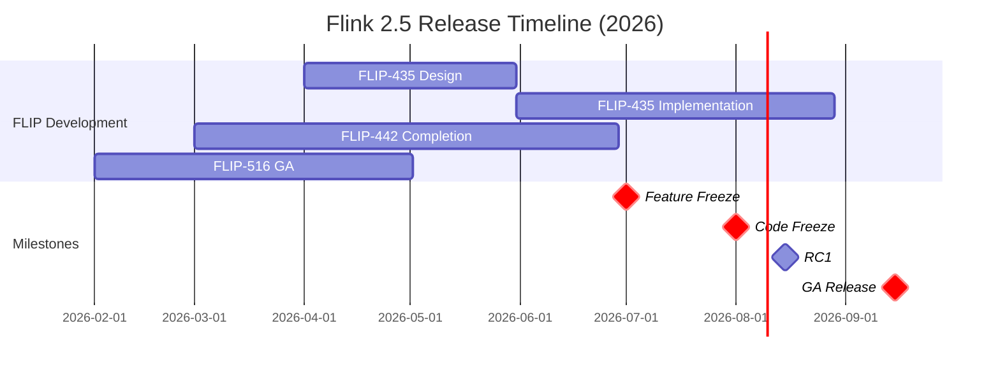

> **⚠️ 前瞻性内容风险声明**
>
> 本文档描述的技术特性处于早期规划或社区讨论阶段，**不代表 Apache Flink 官方承诺**。
>
> - 相关 FLIP 可能尚未进入正式投票，或可能在实现过程中发生显著变更
> - 预计发布时间基于社区讨论趋势分析，存在延迟或取消的风险
> - 生产环境选型请以 Apache Flink 官方发布为准
> - **最后核实日期**: 2026-04-20 | **信息来源**: 社区邮件列表/FLIP/官方博客
>
# Flink 2.5 完整路线图

> **状态**: 前瞻 | **预计发布时间**: 2026-Q3 | **最后更新**: 2026-04-12
>
> ⚠️ 本文档描述的特性处于早期讨论阶段，尚未正式发布。实现细节可能变更。

> 所属阶段: Flink/08-roadmap | 前置依赖: [Flink 2.4 跟踪](../08.01-flink-24/flink-2.4-tracking.md) | 形式化等级: L3
> **版本**: 2.5.0 | **状态**: 🟡 规划中 | **目标发布**: 2026 Q3

---

## 1. 版本概览

### 1.1 发布信息

```yaml
版本: Flink 2.5.0
预计发布时间: 2026年第三季度
  - Feature Freeze: 2026-07
  - RC 发布: 2026-08
  - GA 发布: 2026-09
版本类型: 特性版本 (非 LTS)
前置版本: Flink 2.4.x
后续版本: Flink 2.6 (规划中)
```

### 1.2 版本主题

Flink 2.5 聚焦三大核心主题：

| 主题 | 核心 FLIP | 目标 | 状态 |
|------|----------|------|------|
| **流批一体深化** | FLIP-435 | 统一执行引擎 GA | 🔄 设计中 |
| **Serverless 成熟** | FLIP-442 | Serverless Flink GA | 🔄 实现中 |
| **AI/ML 生产就绪** | FLIP-531-ext | 推理优化与模型服务 | 🔄 设计中 |

---

## 2. 详细特性路线图

### 2.1 FLIP-435: 统一流批执行引擎

**目标**: 消除流处理和批处理的执行引擎差异，实现真正的统一执行。

```yaml
核心组件:
  StreamBatchUnifiedOptimizer:
    - 统一执行计划生成器
    - 统一 Cost Model
    - 自适应执行策略选择
    状态: 🔄 设计中 (40%)

  UnifiedTaskExecutor:
    - 统一 Task 执行模型
    - 统一状态访问接口
    - 统一 Checkpoint 机制
    状态: 📋 规划中 (20%)

  AdaptiveModeSelector:
    - 自动执行模式检测
    - 运行时模式切换
    - 混合执行支持
    状态: 📋 规划中 (10%)
```

**里程碑**:

| 里程碑 | 预计时间 | 交付物 |
|--------|----------|--------|
| Design Doc | 2026-04 | FLIP-435 正式提案 |
| Prototype | 2026-05 | 原型实现 |
| Integration | 2026-06 | 与主分支集成 |
| Testing | 2026-07 | 完整测试覆盖 |
| GA | 2026-09 | 随 2.5 发布 |

### 2.2 FLIP-442: Serverless Flink GA

**目标**: 将 Serverless Flink 从 Beta 推进到 GA，实现真正的按需计算。

```yaml
核心能力:
  Scale-to-Zero:
    - 无流量时资源释放至 0
    - 自动休眠与唤醒
    - 成本优化报告
    状态: 🔄 实现中 (70%)

  Fast Cold Start:
    - 冷启动 < 500ms
    - 预置镜像优化
    - 增量状态恢复
    状态: 🔄 实现中 (60%)

  Predictive Scaling:
    - 基于负载预测的扩缩容
    - 减少扩缩容抖动
    - 智能预热
    状态: 📋 规划中 (20%)
```

**性能目标**:

| 指标 | 2.4 Beta | 2.5 GA 目标 | 提升 |
|------|----------|-------------|------|
| 冷启动时间 | ~2s | <500ms | 4x |
| 扩缩容延迟 | ~30s | <10s | 3x |
| Scale-to-Zero 时间 | ~60s | <10s | 6x |

### 2.3 FLIP-531 扩展: AI 推理优化

**目标**: 将 FLIP-531 (AI Agent) 扩展到生产级推理服务。

```yaml
核心优化:
  Batch Inference:
    - 动态批处理
    - 批大小自适应
    - 延迟-吞吐权衡
    状态: 🔄 设计中 (30%)

  Speculative Decoding:
    - 投机解码加速
    - Draft Model 支持
    - 接受率优化
    状态: 📋 规划中 (10%)

  KV-Cache 优化:
    - 跨请求 KV-Cache 共享
    - 前缀缓存 (Prefix Caching)
    - 内存池化管理
    状态: 🔄 实现中 (50%)
```

### 2.4 其他重要特性

#### FLIP-516: 物化表 GA

| 特性 | 2.4 状态 | 2.5 目标 | 进度 |
|------|----------|----------|------|
| 自动刷新 | Preview | GA | 🔄 测试中 (85%) |
| 增量更新 | Preview | GA | 🔄 实现中 (70%) |
| 分区裁剪 | Preview | GA | 🔄 测试中 (80%) |
| Iceberg 集成 | 实验性 | 稳定 | 🔄 实现中 (60%) |

#### FLIP-448: WebAssembly UDF GA

| 特性 | 2.4 状态 | 2.5 目标 | 进度 |
|------|----------|----------|------|
| WASI Preview 2 | 实验性 | GA | 🔄 实现中 (65%) |
| 多语言支持 | Rust/Java | +Go/C++ | 🔄 实现中 (70%) |
| UDF 市场 | 无 | 基础版 | 📋 设计中 (15%) |
| 性能优化 | Preview | 生产就绪 | 🔄 测试中 (75%) |

---

## 3. FLIP 状态跟踪

### 3.1 活跃 FLIP

| FLIP | 标题 | 负责人 | 状态 | 进度 | 预计完成 |
|------|------|--------|------|------|----------|
| FLIP-435 | 统一流批执行 | TBD | 🔄 Draft | 40% | 2026-07 |
| FLIP-442 | Serverless GA | TBD | 🔄 实现中 | 70% | 2026-06 |
| FLIP-448 | WASM UDF GA | TBD | 🔄 实现中 | 75% | 2026-06 |
| FLIP-516 | 物化表 GA | TBD | 🔄 测试中 | 85% | 2026-05 |

### 3.2 规划中 FLIP

| FLIP | 标题 | 预计开始 | 依赖 |
|------|------|----------|------|
| FLIP-531-ext | AI 推理优化 | 2026-05 | FLIP-531 |
| FLIP-520 | 自适应资源配置 | 2026-06 | FLIP-442 |
| FLIP-521 | 增强型 Checkpoint | 2026-06 | FLIP-435 |

---

## 4. 发布时间表



---

## 5. 风险评估

### 5.1 技术风险

| 风险 | 可能性 | 影响 | 缓解措施 |
|------|--------|------|----------|
| FLIP-435 延期 | 中 | 高 | 分阶段交付，核心功能优先 |
| Serverless 稳定性 | 中 | 高 | 扩展测试矩阵，灰度发布 |
| 性能回退 | 低 | 高 | 全面性能基准测试 |

### 5.2 依赖风险

| 依赖 | 风险等级 | 备用方案 |
|------|----------|----------|
| Kubernetes Operator | 低 | 社区协作 |
| ForSt 稳定性 | 中 | 回退到 RocksDB |

---

## 6. 相关文档

- [Flink 2.5 特性预览](./flink-25-features-preview.md)
- [Flink 2.5 迁移指南](./flink-25-migration-guide.md)
- [Flink 2.4 跟踪](../08.01-flink-24/flink-2.4-tracking.md)
- [Flink 3.0 愿景](../08.01-flink-24/flink-30-architecture-redesign.md)

---

*最后更新: 2026-04-08*
