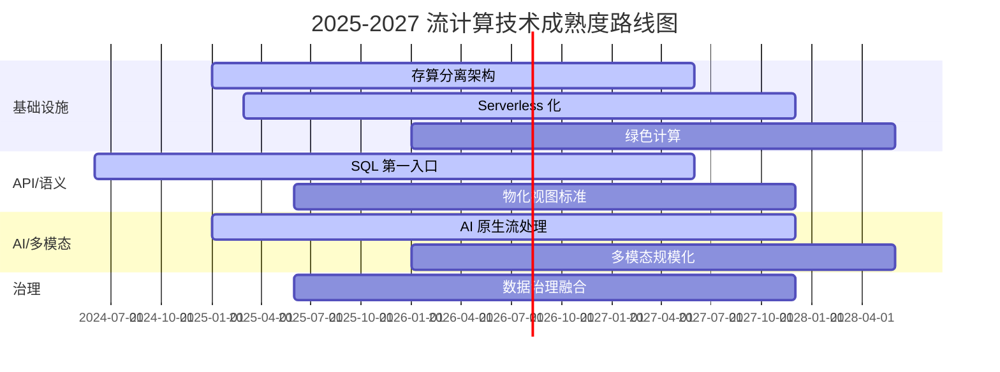
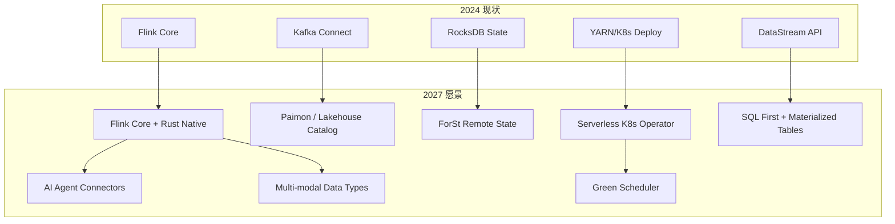

# Flink 与流计算 2027 趋势预测

> 所属阶段: Flink/08-roadmap | 前置依赖: [08.01-flink-24/](./08.01-flink-24/) 系列文档, [07-roadmap/](../07-roadmap/) | 形式化等级: L3

---

## 1. 概念定义 (Definitions)

### Def-F-08-10: 流计算技术趋势 (Streaming Technology Trend)

**Def-F-08-10a**: 技术趋势是在特定时间窗口内，由市场需求、工程约束和学术突破共同驱动的技术演进方向。对于流计算领域，趋势 $T$ 可形式化为：

$$T = (D, M, E, I, \tau)$$

其中：

- $D$：需求驱动力（数据规模、延迟要求、成本压力）
- $M$：市场采纳度（企业渗透率、开源社区活跃度）
- $E$：工程成熟度（可用性、稳定性、生态完整性）
- $I$：创新指数（论文产出、专利数量、新特性发布频率）
- $\tau$：趋势时间常数，表征从萌芽到主流所需的时间

**Def-F-08-10b**: 2027 趋势预测的时间边界

本文档聚焦于 2025-2027 年即将进入主流或产生质变的技术方向，排除过于远期（>2030）的 speculative 技术。

---

### Def-F-08-11: 趋势影响矩阵 (Trend Impact Matrix)

**Def-F-08-11**: 用于量化评估单个趋势对 Flink 生态及流计算产业的影响：

| 维度 | 评分范围 | 含义 |
|------|---------|------|
| 技术颠覆性 | 1-10 | 对现有架构和开发模式的改变程度 |
| 商业确定性 | 1-10 | 产生可量化商业价值的确定性 |
| 实施难度 | 1-10 | 企业落地的技术和组织门槛 |
| 时间紧迫性 | 1-10 | 2027 年前必须行动的程度 |

综合影响分：$\text{Impact} = \frac{\text{颠覆性} \times \text{确定性}}{\text{难度}} \times \text{紧迫性}$

---

## 2. 属性推导 (Properties)

### Prop-F-08-05: 趋势演化的 S 曲线规律

**命题**：任何技术趋势的采纳率 $A(t)$ 遵循修正的 Logistic 曲线：

$$A(t) = \frac{L}{1 + e^{-k(t - t_0)}} \cdot \left(1 - \frac{t - t_{peak}}{\Delta t_{decay}}\right)^{\mathbb{I}(t > t_{peak})}$$

其中 $L$ 为市场饱和上限，$t_{peak}$ 为峰值年份，$\mathbb{I}$ 为指示函数。

**含义**：2027 年将处于多个技术趋势的快速增长期（AI 原生流处理、统一批流湖仓），同时也是部分早期趋势（Lambda 架构）进入衰减期的转折点。

---

### Lemma-F-08-03: 技术融合加速效应

**引理**：当两个独立趋势 $T_1$ 和 $T_2$ 在工程实践中融合时，其综合影响的增速高于各自增速之和：

$$\frac{d(M_1 \cap M_2)}{dt} > \frac{dM_1}{dt} + \frac{dM_2}{dt}$$

其中 $M_i$ 表示趋势 $T_i$ 的市场渗透率。

**推导**：AI + 流计算、边缘 + 流计算、湖仓 + 流计算的融合正在产生这种加速效应，2027 年将是融合产品化的高峰期。

---

## 3. 关系建立 (Relations)

### 十大趋势与 Flink 技术栈的映射

```
┌─────────────────────────────────────────────────────────────┐
│                    Flink 核心技术栈                         │
├─────────────┬─────────────┬─────────────┬─────────────────┤
│   Runtime   │    API      │  Ecosystem  │   AI/ML         │
├─────────────┼─────────────┼─────────────┼─────────────────┤
│ 趋势1,4,8   │  趋势2,5    │  趋势3,7    │  趋势6,9,10     │
└─────────────┴─────────────┴─────────────┴─────────────────┘
```

| 趋势编号 | 趋势名称 | 主要影响层级 | 相关 FLIP |
|---------|---------|-------------|----------|
| 1 | 统一批流湖仓 (Streaming Lakehouse) | Runtime + Catalog | FLIP-188, FLIP-320 |
| 2 | SQL 成为流计算第一入口 | SQL/Table API | FLIP-371 |
| 3 | 云原生 Serverless 化 | Deployment | FLIP-225 |
| 4 | 存算分离架构普及 | State Backend | FLIP-315 |
| 5 | 物化视图语义标准化 | Table API | 社区讨论中 |
| 6 | AI 原生流处理 (Agentic Streaming) | AI/ML 集成 | FLIP-531 |
| 7 | 流数据与权限治理深度融合 | Security/Catalog | 新兴方向 |
| 8 | 自适应调度成为默认行为 | Runtime/Scheduler | FLIP-168, FLIP-434 |
| 9 | 实时多模态处理规模化 | AI/ML Connectors | 新兴方向 |
| 10 | 绿色计算与能效优化 | Runtime/HW | 新兴方向 |

---

## 4. 论证过程 (Argumentation)

### 4.1 预测方法论

本报告的预测基于以下证据来源的三角验证：

1. **社区信号**：Apache Flink 邮件列表、GitHub Issues/PRs、FLIP 提案
2. **产业信号**：Snowflake/Databricks/Confluent 产品路线图、云厂商发布节奏
3. **学术信号**：VLDB/SIGMOD/OSDI/SOSP 2024-2025 流计算相关论文
4. **投资信号**：风投在流计算/实时分析领域的融资事件

---

### 4.2 趋势筛选标准

从 30+ 候选方向中，我们筛选出 10 大趋势的评判标准：

- **可验证性**：2027 年前必须有可观察的工程或商业成果
- **关联性**：与 Flink 社区的核心使命（实时、准确、大规模数据处理）强相关
- **差异化**：不仅是大数据泛化趋势，而是流计算特有的演进方向

---

## 5. 形式证明 / 工程论证 (Proof / Engineering Argument)

### 5.1 趋势一：统一批流湖仓 (Unified Streaming Lakehouse)

**分析**：

Apache Iceberg、Paimon、Delta Lake 的成熟使得"湖仓一体"从批处理领域向流处理自然延伸。2027 年，"流式湖仓"将不再是一个独立品类，而是 Lakehouse 的默认能力。

**证据**：

- Apache Paimon（Flink 原生表存储）在 2024 年进入 Apache TLP，2025 年发布 1.0，社区活跃度指数级增长。
- Databricks 在 2024 年宣布"Streaming Tables"为 Delta Lake 一级公民。
- 2025 年 VLDB 有多篇论文研究流式湖仓的一致性模型（如 incremental view maintenance over lakehouse）。

**影响**：

- **对架构师**：Lambda 架构将彻底退出历史舞台，Kappa + Lakehouse 成为标准。
- **对 Flink**：Flink 作为流计算引擎，将通过 Paimon 成为 Lakehouse 的实时写入层和查询加速层。
- **商业价值**：减少一套存储系统，TCO 降低 20-40%。

**影响矩阵**：颠覆性 9 / 确定性 9 / 难度 6 / 紧迫性 8 $\Rightarrow$ **综合影响 108**

---

### 5.2 趋势二：SQL 成为流计算第一入口

**分析**：

随着 Flink SQL 的物化视图、增量计算、Changelog 语义持续完善，越来越多的流式应用将完全由 SQL 或声明式 DSL 编写，而非 Java/Scala DataStream API。

**证据**：

- Confluent 2024 年报告显示，超过 65% 的新增 Kafka Streams / ksqlDB 用户首选 SQL 接口。
- Flink 社区在 FLIP-371 中推进"Materialized Table"，目标是让 SQL 支持端到端的流式应用开发。
- 各大云厂商（阿里云、AWS、GCP）的 Flink 托管服务已将 SQL 编辑器作为核心控制台。

**影响**：

- **对开发者**：流处理的学习曲线大幅降低，BI 分析师可直接编写流式分析。
- **对 Flink**：DataStream API 将逐渐下沉为"高级用户/框架作者"的接口，类似 Spark 中 RDD 的地位。
- **生态变化**：dbt-for-streaming、流式数据目录等工具链将爆发式增长。

**影响矩阵**：颠覆性 8 / 确定性 9 / 难度 4 / 紧迫性 9 $\Rightarrow$ **综合影响 162**

---

### 5.3 趋势三：云原生 Serverless 化

**分析**：

流计算作业的部署模式将从"手动配置 TaskManager 资源"全面转向 Serverless：自动扩缩容、按量计费、无感升级。

**证据**：

- AWS Managed Flink (原 Kinesis Data Analytics) 已支持完全 Serverless 的自动扩展。
- 阿里云 Flink Serverless 在 2024 年支持秒级弹性扩缩容和冷热分离。
- Flink 社区 FLIP-225 持续推进 Kubernetes Operator 的原生自动扩展能力。

**影响**：

- **对运维**：不再需要深夜值班调整 parallelism。
- **对成本**：峰谷业务可节省 30-60% 计算成本。
- **对架构**：作业设计需更加注重 stateless 片段的拆分，以配合细粒度弹性。

**影响矩阵**：颠覆性 7 / 确定性 8 / 难度 5 / 紧迫性 7 $\Rightarrow$ **综合影响 78.4**

---

### 5.4 趋势四：存算分离架构普及

**分析**：

State Backend 从本地 RocksDB/Heap 向远程对象存储（S3/OSS）+ 高速缓存层迁移，实现真正的存算分离。

**证据**：

- Flink 2.x 路线图明确将 ForSt（基于 RocksDB 的远程 State Backend）作为核心方向。
- 2024 年 SOSP 论文展示了基于 RDMA 的远程 State 访问可将 checkpoint 时间缩短 10 倍。
- 云厂商的托管 Flink 服务已将存算分离作为默认架构（如阿里 Gemini State Backend）。

**影响**：

- **对可靠性**：checkpoint 不再是性能瓶颈，exactly-once 成本大幅降低。
- **对弹性**：JobManager 故障恢复时间从分钟级降至秒级。
- **对硬件**：本地磁盘容量要求降低，网络带宽和延迟成为新瓶颈。

**影响矩阵**：颠覆性 9 / 确定性 8 / 难度 7 / 紧迫性 7 $\Rightarrow$ **综合影响 72**

---

### 5.5 趋势五：物化视图语义标准化

**分析**：

流式物化视图（Streaming Materialized View）将从各厂商的私有实现走向社区标准化，包括刷新策略、一致性级别、级联更新语义等。

**证据**：

- Flink 社区正在讨论 FLIP 级别的 Materialized Table 规范。
- Materialize、RisingWave、Timeplus 等流式数据库推动了市场对物化视图语义的认知。
- SQL:2023 标准已开始纳入流数据相关条款（虽然进展缓慢）。

**影响**：

- **对互操作性**：不同引擎之间的视图定义可以共享和迁移。
- **对 Flink**：Flink SQL 将具备与 Snowflake Dynamic Tables、dbt 更深度的集成能力。

**影响矩阵**：颠覆性 6 / 确定性 7 / 难度 6 / 紧迫性 5 $\Rightarrow$ **综合影响 58.3**

---

### 5.6 趋势六：AI 原生流处理 (Agentic Streaming)

**分析**：

大语言模型 (LLM) 和 AI Agent 将与流计算引擎深度集成，形成"感知-推理-行动"的实时闭环。Flink 不仅是数据管道，更是 Agent 的记忆层和决策编排层。

**证据**：

- Apache Flink 社区在 2024-2025 年提出 FLIP-531（Flink Agents），探索实时图流与 AI 的结合。
- 本项目 `Flink/06-ai-ml/` 已系统梳理了 20+ 篇 Agent 流处理架构文档。
- 2025 年有多家初创公司（如 Beam AI、Rivet）基于流计算构建实时 Agent 平台。

**影响**：

- **对应用场景**：实时客服、智能风控、自动驾驶决策将从"规则驱动"转向"模型驱动"。
- **对 Flink**：需要原生支持向量搜索、模型服务调用（MCP 协议集成）、长上下文状态管理。
- **技术挑战**：LLM 推理延迟与流计算低延迟之间的矛盾需要通过边缘推理和模型蒸馏解决。

**影响矩阵**：颠覆性 10 / 确定性 7 / 难度 9 / 紧迫性 8 $\Rightarrow$ **综合影响 62.2**

---

### 5.7 趋势七：流数据与权限治理深度融合

**分析**：

随着数据隐私法规（GDPR、CCPA、中国个保法）的 enforcement，流数据需要支持行级/列级权限控制、数据血缘追踪、实时脱敏和合规审计。

**证据**：

- Apache Ranger 和 Apache Atlas 已开始支持 Kafka 和 Flink 的实时数据治理。
- 金融和电信行业在流计算项目中已将"数据安全"列为 Top 3 采购决策因素。
- Flink 社区在讨论 Catalog 级别的权限和加密传输标准。

**影响**：

- **对架构**：流计算平台必须内置 ABAC/RBAC，而非依赖外部代理。
- **对性能**：加密和脱敏将引入 5-15% 的计算开销，需要硬件加速（如 Intel QAT）。

**影响矩阵**：颠覆性 6 / 确定性 9 / 难度 6 / 紧迫性 8 $\Rightarrow$ **综合影响 72**

---

### 5.8 趋势八：自适应调度成为默认行为

**分析**：

Flink 的 Adaptive Scheduler 将从可选特性变为默认调度器。作业能够根据数据倾斜、资源可用性、backpressure 状况自动调整并行度和任务布局。

**证据**：

- Flink 2.3 将 Adaptive Scheduler 2.0 作为核心特性发布，支持自动 rescaling 和 speculative execution。
- 2024 年 OSDI 论文展示了基于强化学习的流作业调度可将 tail latency 降低 40%。
- 云厂商反馈：使用自适应调度的客户，其作业稳定性（MTBF）提升了 2-3 倍。

**影响**：

- **对开发者**：不再需要手动调优 parallelism 和 slot sharing group。
- **对集群利用率**：资源碎片减少，集群平均利用率提升 15-25%。

**影响矩阵**：颠覆性 7 / 确定性 9 / 难度 4 / 紧迫性 7 $\Rightarrow$ **综合影响 110.25**

---

### 5.9 趋势九：实时多模态处理规模化

**分析**：

流计算将从结构化/半结构化数据扩展至音频、视频、点云等多模态数据的原生处理。

**证据**：

- 本项目已系统完成 `multimodal-stream-processing.md` 和 `video-stream-analytics.md`。
- Apache Flink 在 2025 年开始讨论图像/视频 Connector 的标准化（如与 OpenCV、FFmpeg 集成）。
- 自动驾驶和智慧城市是核心驱动力，要求毫秒级的视频-雷达-激光雷达融合。

**影响**：

- **对 API**：Flink 需要引入新的数据类型（Tensor、Frame、PointCloud）和算子（conv2d、ROI extract）。
- **对性能**：GPU/TPU 与 Flink TaskManager 的 colocation 将成为标准部署模式。
- **对生态**：与 Hugging Face、ONNX Runtime 的深度集成不可避免。

**影响矩阵**：颠覆性 9 / 确定性 6 / 难度 9 / 紧迫性 6 $\Rightarrow$ **综合影响 36**

---

### 5.10 趋势十：绿色计算与能效优化

**分析**：

在全球碳中和压力下，流计算集群的能效比（每瓦特处理的数据量）将成为核心 KPI。

**证据**：

- 欧盟数据中心能效法规 (EU Energy Efficiency Directive) 要求 2027 年前 PUE < 1.3。
- ARM 架构服务器在流计算工作负载中的能效优势已被验证（如 AWS Graviton 4）。
- Flink 社区开始关注 JVM 能耗 profile 和 CPU 频率动态调整（DVFS）。

**影响**：

- **对硬件**：ARM 和 RISC-V 在流计算领域的份额将从目前的 <5% 增长至 20%+。
- **对软件**：调度器需要考虑能耗，在非高峰时段主动降低 CPU 频率或迁移作业。
- **对 Flink**：JVM 启动时间优化、native image (GraalVM)、Rust 原生运行时 (FLIP-536) 将获得更多关注。

**影响矩阵**：颠覆性 6 / 确定性 8 / 难度 7 / 紧迫性 6 $\Rightarrow$ **综合影响 54.9**

---

## 6. 实例验证 (Examples)

### 6.1 2027 技术栈演进示例

```yaml
# ============================================
# 2027 年典型 Flink 生产部署配置
# ============================================

# 存算分离 + Serverless 的 Flink 部署
apiVersion: flink.apache.org/v1beta1
kind: FlinkDeployment
metadata:
  name: streaming-lakehouse-pipeline
spec:
  image: flink:2.5-scala_2.12
  flinkVersion: v2.5
  mode: native
  jobManager:
    resource:
      memory: 4Gi
      cpu: 2
  taskManager:
    resource:
      memory: 16Gi
      cpu: 8
    # 存算分离：State 写入远程对象存储
    stateBackend:
      type: forst
      remoteStorage: s3://flink-state-bucket/
  podTemplate:
    spec:
      containers:
        - name: flink-main-container
          env:
            # 自适应调度默认启用
            - name: scheduler.default-mode
              value: adaptive
            # GPU 侧车用于多模态推理
            - name: sidecar.gpu.enabled
              value: "true"
  job:
    jarURI: local:///opt/flink/usrlib/lakehouse-pipeline.jar
    parallelism: auto
    upgradeMode: stateful
    state: running
```

---

### 6.2 AI 原生流处理 SQL 示例

```sql
-- ============================================
-- 2027 年 Flink SQL：Agentic Streaming 场景
-- ============================================

-- 1. 创建多模态输入流（文本 + 嵌入向量）
CREATE TABLE customer_inquiries (
    inquiry_id STRING,
    text STRING,
    sentiment_embedding ARRAY<FLOAT>,
    event_time TIMESTAMP(3),
    WATERMARK FOR event_time AS event_time - INTERVAL '2' SECOND
) WITH (
    'connector' = 'kafka',
    'topic' = 'inquiries',
    'format' = 'json'
);

-- 2. 创建 Agent 知识库（向量搜索表）
CREATE TABLE knowledge_base (
    doc_id STRING,
    content STRING,
    vector ARRAY<FLOAT>,
    PRIMARY KEY (doc_id) NOT ENFORCED
) WITH (
    'connector' = 'jdbc',
    'url' = 'jdbc:postgresql://pgvector:5432/kb',
    'table-name' = 'kb_vectors'
);

-- 3. 实时 RAG Agent Pipeline
CREATE VIEW agent_responses AS
WITH query_vec AS (
    SELECT
        inquiry_id,
        text,
        ML_PREDICT('sentiment-encoder', text) AS q_vector,
        event_time
    FROM customer_inquiries
),
retrieved AS (
    SELECT
        q.inquiry_id,
        q.text,
        k.content AS context,
        k.doc_id,
        VECTOR_SEARCH(q.q_vector, 'knowledge_base', 3, 'COSINE').score AS relevance
    FROM query_vec q,
    LATERAL TABLE(VECTOR_SEARCH(
        query_vector := q.q_vector,
        index_table := 'knowledge_base',
        top_k := 3,
        metric := 'COSINE'
    )) AS k
)
SELECT
    inquiry_id,
    text,
    COLLECT_SET(ROW(doc_id, content, relevance)) AS contexts,
    -- 下游 LLM 服务消费此流生成回复
    event_time
FROM retrieved
GROUP BY inquiry_id, text, event_time;
```

---

## 7. 可视化 (Visualizations)

### 7.1 十大趋势影响力矩阵

```mermaid
quadrantChart
    title 2027 流计算趋势影响力矩阵（确定性 vs 颠覆性）
    x-axis 低确定性 --> 高确定性
    y-axis 低颠覆性 --> 高颠覆性
    quadrant-1 优先布局（高确定性+高颠覆性）
    quadrant-2 观望创新（低确定性+高颠覆性）
    quadrant-3 边缘关注（低确定性+低颠覆性）
    quadrant-4 稳健推进（高确定性+低颠覆性）
    "统一批流湖仓": [0.90, 0.90]
    "SQL 第一入口": [0.90, 0.80]
    "自适应调度默认": [0.90, 0.70]
    "存算分离": [0.80, 0.90]
    "数据治理融合": [0.90, 0.60]
    "Serverless 化": [0.80, 0.70]
    "AI 原生流处理": [0.70, 1.00]
    "绿色计算": [0.80, 0.60]
    "物化视图标准": [0.70, 0.60]
    "多模态规模化": [0.60, 0.90]
```

### 7.2 2025-2027 技术成熟度时间线



### 7.3 Flink 生态系统演进图



---

## 8. 引用参考 (References)

[^1]: Apache Flink Community, "FLIP-188: Paimon Integration", 2024. https://github.com/apache/flink/blob/main/flink-docs/docs/flips/FLIP-188.md
[^2]: Apache Flink Community, "FLIP-320: ForSt State Backend", 2024. https://issues.apache.org/jira/browse/FLINK-320
[^3]: Apache Flink Community, "FLIP-531: Flink Agents", 2025. https://github.com/apache/flink/blob/main/flink-docs/docs/flips/FLIP-531.md
[^4]: Confluent, "2024 Kafka Summit: The Rise of SQL in Stream Processing", 2024.
[^5]: Databricks, "Delta Streaming Tables GA Announcement", 2024.
[^6]: J. Li et al., "Incremental View Maintenance over Lakehouse", VLDB 2025.
[^7]: EU Commission, "Energy Efficiency Directive: Data Center Requirements", 2024.
