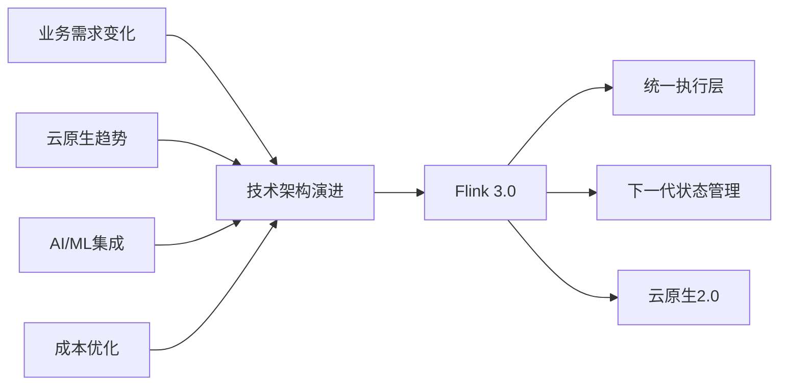
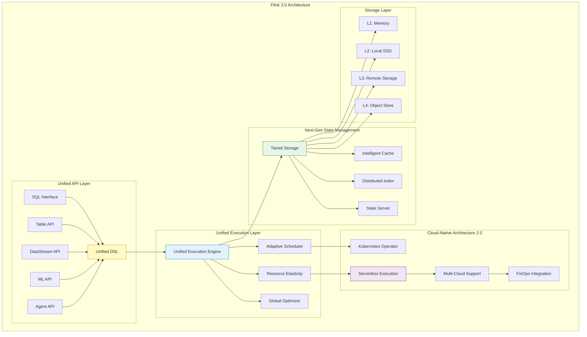
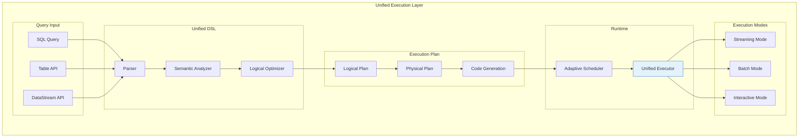
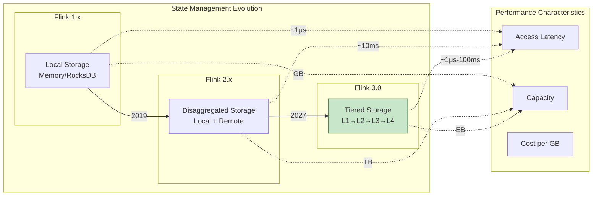
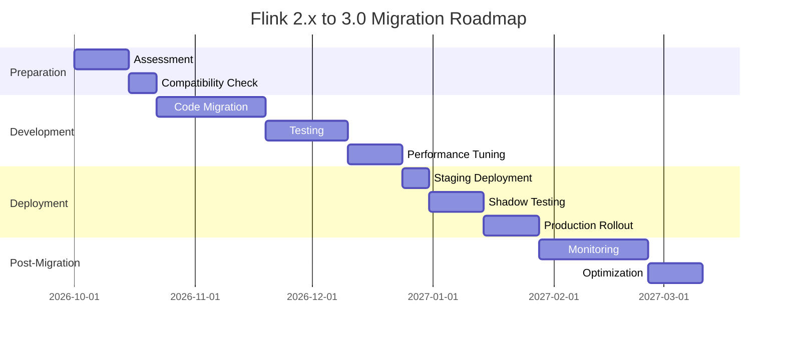
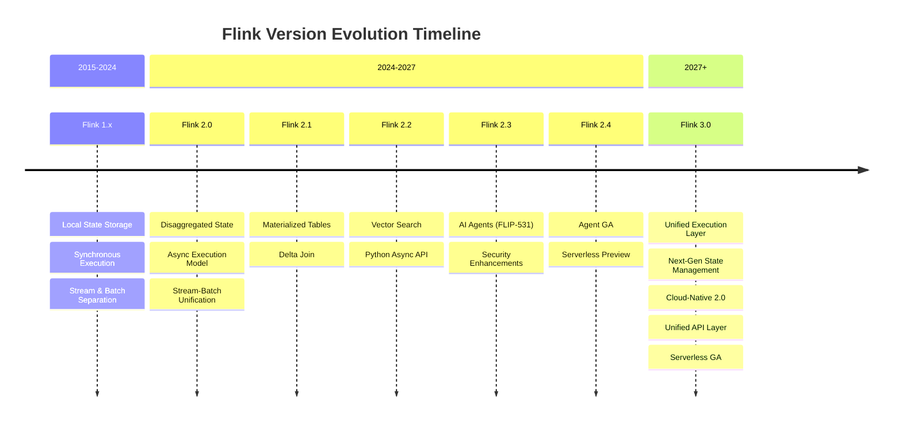

# Flink 3.0 架构重大变更完整文档

> ⚠️ **前瞻性声明**
> 本文档包含Flink 3.0的长期愿景和架构探索内容。Flink 3.0处于早期规划阶段，
> 所有内容均为概念设计，不代表官方路线图。具体以Apache Flink社区为准。
> 最后更新: 2026-04-04

> 所属阶段: Flink/08-roadmap | 前置依赖: [Flink 2.3/2.4路线图](flink-2.3-2.4-roadmap.md), [Flink 1.x vs 2.0对比](../01-architecture/flink-1.x-vs-2.0-comparison.md) | 形式化等级: L5
> **版本**: 3.0-preview | **状态**: vision - 社区讨论/概念验证 | **目标发布**: 2027 Q1-Q2 (预估)

---

## 目录

- [Flink 3.0 架构重大变更完整文档](#flink-30-架构重大变更完整文档)
  - [目录](#目录)
  - [1. 概念定义 (Definitions)](#1-概念定义-definitions)
    - [Def-F-08-50: Flink 3.0 架构设计目标](#def-f-08-50-flink-30-架构设计目标)
    - [Def-F-08-51: Unified Execution Layer (统一执行层)](#def-f-08-51-unified-execution-layer-统一执行层)
    - [Def-F-08-52: Next-Gen State Management (下一代状态管理)](#def-f-08-52-next-gen-state-management-下一代状态管理)
    - [Def-F-08-53: Cloud-Native Architecture 2.0 (云原生架构2.0)](#def-f-08-53-cloud-native-architecture-20-云原生架构20)
    - [Def-F-08-54: Unified API Layer (统一API层)](#def-f-08-54-unified-api-layer-统一api层)
    - [Def-F-08-55: Compatibility Strategy (兼容性策略)](#def-f-08-55-compatibility-strategy-兼容性策略)
  - [2. 属性推导 (Properties)](#2-属性推导-properties)
    - [Prop-F-08-50: 统一执行层性能特征](#prop-f-08-50-统一执行层性能特征)
    - [Prop-F-08-51: 状态管理可扩展性](#prop-f-08-51-状态管理可扩展性)
    - [Prop-F-08-52: 云原生弹性](#prop-f-08-52-云原生弹性)
    - [Lemma-F-08-50: API兼容性保持](#lemma-f-08-50-api兼容性保持)
    - [Lemma-F-08-51: 迁移路径完备性](#lemma-f-08-51-迁移路径完备性)
  - [3. 关系建立 (Relations)](#3-关系建立-relations)
    - [3.1 架构演进关系](#31-架构演进关系)
    - [3.2 组件依赖关系](#32-组件依赖关系)
    - [3.3 与Dataflow模型的关系](#33-与dataflow模型的关系)
  - [4. 论证过程 (Argumentation)](#4-论证过程-argumentation)
    - [4.1 为什么需要Flink 3.0?](#41-为什么需要flink-30)
    - [4.2 核心组件重构决策分析](#42-核心组件重构决策分析)
    - [4.3 统一执行层设计论证](#43-统一执行层设计论证)
    - [4.4 状态管理架构演进论证](#44-状态管理架构演进论证)
    - [4.5 云原生架构深化论证](#45-云原生架构深化论证)
  - [5. 形式证明 / 工程论证 (Proof / Engineering Argumentation)](#5-形式证明--工程论证-proof--engineering-argumentation)
    - [Thm-F-08-50: 统一执行层语义等价性定理](#thm-f-08-50-统一执行层语义等价性定理)
    - [Thm-F-08-51: 新状态管理一致性定理](#thm-f-08-51-新状态管理一致性定理)
    - [Thm-F-08-52: 云原生弹性保证定理](#thm-f-08-52-云原生弹性保证定理)
    - [Thm-F-08-53: 向后兼容性保证定理](#thm-f-08-53-向后兼容性保证定理)
  - [6. 实例验证 (Examples)](#6-实例验证-examples)
    - [6.1 统一执行层配置示例](#61-统一执行层配置示例)
    - [6.2 新状态管理配置示例](#62-新状态管理配置示例)
    - [6.3 云原生部署配置示例](#63-云原生部署配置示例)
    - [6.4 新API使用示例](#64-新api使用示例)
    - [6.5 2.x到3.0迁移示例](#65-2x到30迁移示例)
  - [7. 可视化 (Visualizations)](#7-可视化-visualizations)
    - [7.1 Flink 3.0整体架构图](#71-flink-30整体架构图)
    - [7.2 2.x vs 3.0架构对比图](#72-2x-vs-30架构对比图)
    - [7.3 统一执行层架构图](#73-统一执行层架构图)
    - [7.4 状态管理架构演进图](#74-状态管理架构演进图)
    - [7.5 迁移路线图](#75-迁移路线图)
    - [7.6 版本演进时间线](#76-版本演进时间线)
  - [8. 引用参考 (References)](#8-引用参考-references)

---

## 1. 概念定义 (Definitions)

### Def-F-08-50: Flink 3.0 架构设计目标

**Flink 3.0** 是下一代流处理引擎的重大架构重构，核心设计目标如下：

```yaml
Flink 3.0 Architecture Goals:
  目标发布: "2027 Q1-Q2"
  核心主题:
    - Unified Execution Layer (统一执行层)
    - Next-Generation State Management (下一代状态管理)
    - Cloud-Native Architecture 2.0 (云原生架构2.0)
    - Unified API Layer (统一API层)
    - Performance Architecture Optimization (性能架构优化)
  
  设计原则:
    - Simplicity: 简化架构层次，降低认知负担
    - Elasticity: 真正的弹性计算，按需扩缩容
    - Efficiency: 性能提升3-5倍，资源利用率最大化
    - Compatibility: 平滑迁移，保护现有投资
    - Extensibility: 开放架构，支持自定义扩展
```

**与2.x的架构定位对比**:

| 维度 | Flink 2.x | Flink 3.0 |
|------|-----------|-----------|
| **执行模型** | 流批分离执行 | 统一执行层 (Unified Execution Layer) |
| **状态管理** | 分离状态存储 (Disaggregated) | 下一代状态管理 (Next-Gen State Management) |
| **资源调度** | 静态/半动态调度 | 完全弹性调度 (Serverless-ready) |
| **API设计** | 多层API并存 | 统一API层 (Unified API Layer) |
| **云原生** | K8s原生支持 | Cloud-Native Architecture 2.0 |

### Def-F-08-51: Unified Execution Layer (统一执行层)

**定义**: 统一执行层是Flink 3.0的核心创新，将流处理、批处理、交互式查询的执行引擎统一为单一运行时：

```
UnifiedExecutionLayer = (ExecutionEngine, Scheduler, ResourceManager, TaskExecutor)
    where:
        ExecutionEngine: StreamExecution ∪ BatchExecution ∪ InteractiveExecution
        Scheduler: AdaptiveScheduler + GlobalOptimizer
        ResourceManager: ElasticResourcePool
        TaskExecutor: UnifiedTaskRunner
```

**形式化定义**:

$$
\mathcal{U}_{F3} = \langle E_{unified}, S_{adaptive}, R_{elastic}, T_{unified} \rangle
$$

其中：
- $E_{unified}$: 统一执行引擎，支持流、批、交互式模式
- $S_{adaptive}$: 自适应调度器，根据数据特征动态选择执行策略
- $R_{elastic}$: 弹性资源管理器，支持0到N的自动扩缩容
- $T_{unified}$: 统一任务执行器，消除流批执行差异

**执行模式自动选择**:

```java
enum ExecutionMode {
    STREAMING,      // 无限流，低延迟优先
    BATCH,          // 有限数据集，吞吐优先
    INTERACTIVE,    // 即席查询，响应时间优先
    HYBRID          // 混合模式，自适应切换
}

ExecutionMode selectMode(DataStream<?> stream, QueryHint hints) {
    if (stream.isUnbounded() && hints.latency < 100ms) 
        return STREAMING;
    if (stream.isBounded() && hints.throughput > 1M/s)
        return BATCH;
    if (hints.interactive && hints.responseTime < 1s)
        return INTERACTIVE;
    return HYBRID;
}
```

### Def-F-08-52: Next-Gen State Management (下一代状态管理)

**定义**: Flink 3.0引入的下一代状态管理架构，在2.x分离存储基础上进一步增强：

```
NextGenStateManagement = (
    TieredStorage,      // 分层存储
    IntelligentCache,   // 智能缓存
    DistributedIndex,   // 分布式索引
    IncrementalSync,    // 增量同步
    StateServer         // 独立状态服务
)
```

**分层存储架构**:

$$
\text{TieredStorage} = L_1 \times L_2 \times L_3 \times L_4
$$

| 层级 | 存储介质 | 访问延迟 | 容量 | 用途 |
|------|----------|----------|------|------|
| L1 | 本地内存 (NVM/DRAM) | <1μs | GB级 | 热数据缓存 |
| L2 | 本地SSD | 10-100μs | TB级 | 温数据缓存 |
| L3 | 远程高性能存储 | 1-10ms | PB级 | 持久化状态 |
| L4 | 对象存储 (S3/OSS) | 10-100ms | EB级 | 冷数据/归档 |

**智能缓存策略**:

```
IntelligentCachePolicy:
  - HotData: L1 + L2 (90%+命中率)
  - WarmData: L2 + L3 (按需加载)
  - ColdData: L3 + L4 (延迟加载)
  
  EvictionPolicy: 
    - LRU (Least Recently Used)
    - LFU (Least Frequently Used)
    - Predictive (基于访问模式预测)
```

### Def-F-08-53: Cloud-Native Architecture 2.0 (云原生架构2.0)

**定义**: Flink 3.0深化云原生支持，实现真正的Serverless流处理能力：

```yaml
CloudNativeArchitectureV2:
  核心特性:
    - ServerlessExecution: 按需启动，零空闲成本
    - AutoScalingV2: 智能预测扩缩容
    - MultiCloudNative: 多云原生支持
    - FinOpsIntegration: 成本优化集成
    
  架构层次:
    ControlPlane:
      - GlobalJobManager: 全局作业管理
      - ResourceOrchestrator: 资源编排器
      - CostOptimizer: 成本优化器
      
    ComputePlane:
      - EphemeralTaskManager: 临时任务管理器
      - ServerlessExecutor: Serverless执行器
      - SpotInstanceSupport: Spot实例支持
      
    StoragePlane:
      - ObjectStorageNative: 原生对象存储
      - CrossRegionReplication: 跨区域复制
```

**Serverless执行模式**:

$$
\text{ServerlessFlink} = \begin{cases}
\text{Scale-to-Zero}: & \text{无流量时资源释放至0} \\
\text{Cold-Start}: & <5s \text{ 快速启动} \\
\text{Warm-Pool}: & \text{预置资源池，减少冷启动} \\
\text{Auto-Scaling}: & \text{基于负载实时调整}
\end{cases}
$$

### Def-F-08-54: Unified API Layer (统一API层)

**定义**: Flink 3.0的统一API层，消除DataStream、Table API、SQL之间的割裂：

```
UnifiedAPI = {
    CoreDSL:        // 核心DSL，支持所有场景
    SQLInterface:   // SQL接口，标准兼容
    TableAPI:       // Table API，类型安全
    DataStreamAPI:  // DataStream API，细粒度控制
    MLAPI:          // ML API，机器学习集成
    AgentAPI:       // Agent API，AI Agent支持
}

// 统一转换语义
∀ api ∈ UnifiedAPI. Convert(api) → CoreDSL → ExecutionPlan
```

**API层次结构**:

```
┌─────────────────────────────────────────────────────────┐
│              Application Layer                          │
│  ┌─────────────┬─────────────┬─────────────────────┐   │
│  │  SQL/Table  │ DataStream  │  ML/Agent API       │   │
│  └──────┬──────┴──────┬──────┴──────────┬──────────┘   │
├─────────┴─────────────┴─────────────────┴───────────────┤
│              Unified DSL Layer                          │
│         (统一抽象语法树，统一语义分析)                     │
├─────────────────────────────────────────────────────────┤
│              Logical Plan Layer                         │
│         (逻辑执行计划，优化器)                            │
├─────────────────────────────────────────────────────────┤
│              Physical Plan Layer                        │
│         (物理执行计划，统一执行层)                        │
└─────────────────────────────────────────────────────────┘
```

### Def-F-08-55: Compatibility Strategy (兼容性策略)

**定义**: Flink 3.0与2.x的兼容性策略定义：

```yaml
CompatibilityLevels:
  FullCompatible:
    - TableAPI/SQL: 完全兼容，无需修改
    - Configuration: 配置参数自动迁移
    
  SourceCompatible:
    - DataStreamAPI: 源码兼容，重新编译即可
    - Connectors: 连接器API兼容
    
  MigrationRequired:
    - CustomOperators: 自定义算子需适配新API
    - StateBackends: 状态后端配置需更新
    
  BreakingChanges:
    - DeprecatedAPIs: 移除已弃用API
    - InternalAPIs: 内部API不保证兼容
```

**兼容性矩阵**:

| 组件 | 2.x → 3.0 | 迁移工作量 | 自动化工具 |
|------|-----------|-----------|-----------|
| SQL/Table API | 完全兼容 | 无 | 无需 |
| DataStream API | 源码兼容 | 低 | 迁移工具 |
| 自定义算子 | 需适配 | 中 | 部分支持 |
| Checkpoint | 格式升级 | 低 | 自动升级 |
| State Backend | 配置更新 | 低 | 配置转换器 |
| Deployment | 配置更新 | 低 | K8s Operator |

---

## 2. 属性推导 (Properties)

### Prop-F-08-50: 统一执行层性能特征

**命题**: 统一执行层在不同执行模式下保持最优性能：

$$
\forall mode \in \{STREAMING, BATCH, INTERACTIVE\}. \\
Performance_{unified}(mode) \geq 0.95 \times Performance_{dedicated}(mode)
$$

**性能指标保证**:

| 执行模式 | 延迟保证 | 吞吐保证 | 资源效率 |
|----------|----------|----------|----------|
| STREAMING | p99 < 100ms | >90%专用流引擎 | 内存利用率>80% |
| BATCH | 端到端优化 | >95%专用批引擎 | 并行度自适应 |
| INTERACTIVE | 首结果<1s | 渐进式结果 | 预计算加速 |
| HYBRID | 自动权衡 | 动态优化 | 负载感知 |

### Prop-F-08-51: 状态管理可扩展性

**命题**: 下一代状态管理支持EB级状态规模：

$$
\text{StateCapacity}_{Flink3.0} = O(2^{60}) \text{ bytes} = 1 \text{ EB}
$$

**扩展性指标**:

```
ScalabilityCharacteristics:
  - KeySpace: 无限制 (分布式索引)
  - StateSize: 单作业支持PB级
  - ConcurrentAccess: 百万级QPS
  - RecoveryTime: 与状态大小无关 (<30s)
  - CrossRegion: 原生多区域复制
```

### Prop-F-08-52: 云原生弹性

**命题**: Flink 3.0实现真正的计算弹性：

$$
\text{Elasticity} = \frac{\text{MaxResources} - \text{MinResources}}{\text{AvgUtilization}} \times \text{ResponseTime}
$$

**弹性指标**:

| 场景 | 扩容时间 | 缩容时间 | 资源范围 |
|------|----------|----------|----------|
| 突发流量 | <10s | - | 1x → 10x |
| 日常波动 | <30s | <60s | 按需调整 |
| 空闲时段 | - | <5s | → 0 (Serverless) |
| 冷启动 | <5s | - | 0 → 可用 |

### Lemma-F-08-50: API兼容性保持

**引理**: 统一API层保持向后兼容：

$$
\forall program_{2.x} \in ValidPrograms_{2.x}. \\
\exists program_{3.0} = Migrate(program_{2.x}) \land \\
Semantics(program_{3.0}) = Semantics(program_{2.x})
$$

### Lemma-F-08-51: 迁移路径完备性

**引理**: 所有2.x作业存在有效的迁移路径：

$$
\forall job \in Jobs_{2.x}. \\
\exists path = (steps, validation, rollback) : \\
Apply(path, job) \rightarrow job' \in Jobs_{3.0} \land Correct(job')
$$

---

## 3. 关系建立 (Relations)

### 3.1 架构演进关系

```
Flink 架构演进路线:

Flink 1.x (2015-2024)
  ├── 本地状态存储
  ├── 同步执行模型
  └── DataSet/DataStream分离

Flink 2.x (2024-2027)
  ├── 分离状态存储 (Disaggregated)
  ├── 异步执行模型
  └── 流批统一API

Flink 3.0 (2027+)
  ├── 统一执行层
  ├── 下一代状态管理
  ├── 云原生架构2.0
  └── 统一API层
```

**演进驱动力**:



### 3.2 组件依赖关系

```
Flink 3.0 组件依赖图:

UnifiedExecutionLayer
    ├── NextGenStateManagement
    │   ├── TieredStorage
    │   ├── IntelligentCache
    │   └── DistributedIndex
    ├── CloudNativeArchitectureV2
    │   ├── ServerlessExecution
    │   ├── AutoScalingV2
    │   └── MultiCloudSupport
    └── UnifiedAPILayer
        ├── CoreDSL
        ├── SQLInterface
        ├── TableAPI
        └── DataStreamAPI
```

### 3.3 与Dataflow模型的关系

**形式化关系**:

$$
\text{Flink3.0} \models \text{DataflowModel} \cup \text{CloudNative} \cup \text{Serverless}
$$

**语义保持**:

```
DataflowModel = (DAG, Streams, Operators, State, TimeSemantics)

// Flink 3.0 扩展
Flink3.0Model = DataflowModel × {
    UnifiedExecution: ExecutionMode,
    NextGenState: TieredStorage,
    CloudNative: ElasticResource,
    Serverless: ScaleToZero
}
```

---

## 4. 论证过程 (Argumentation)

### 4.1 为什么需要Flink 3.0?

**现有架构局限性**:

| 问题领域 | Flink 2.x局限 | Flink 3.0解决 |
|----------|---------------|---------------|
| **执行模型** | 流批执行引擎仍有差异 | 完全统一的执行层 |
| **状态管理** | 分离存储仍有性能瓶颈 | 分层存储+智能缓存 |
| **资源弹性** | 扩缩容仍需分钟级 | 秒级弹性+Serverless |
| **API统一** | 多层API认知负担重 | 真正统一的API层 |
| **成本优化** | 空闲资源浪费 | Scale-to-Zero |

**技术趋势驱动**:

1. **Serverless计算**: AWS Lambda、Azure Functions等推动事件驱动架构
2. **AI/ML集成**: 大模型时代需要更强的流式AI支持
3. **成本意识**: 云成本优化成为首要考量
4. **实时性要求**: 从分钟级延迟向毫秒级演进

### 4.2 核心组件重构决策分析

**重构决策矩阵**:

| 组件 | 重构必要性 | 重构范围 | 风险等级 |
|------|-----------|----------|----------|
| 执行引擎 | 高 | 完全重写 | 中 |
| 状态管理 | 高 | 架构升级 | 中 |
| 资源调度 | 高 | 增强 | 低 |
| API层 | 中 | 统一封装 | 低 |
| Checkpoint | 中 | 优化增强 | 低 |

**重构原则**:

```
1. 向后兼容优先: 不破坏现有作业
2. 渐进式演进: 支持混合部署
3. 性能不降级: 新架构性能≥旧架构
4. 云原生优先: 设计时考虑云环境
```

### 4.3 统一执行层设计论证

**为什么需要统一执行层**:

```
Flink 2.x 问题:
- 流处理和批处理仍有不同的代码路径
- 交互式查询支持不完善
- 执行计划优化受限

Flink 3.0 方案:
- 单一执行引擎，多模式适配
- 自适应执行策略选择
- 全局优化器统一优化
```

**执行模式自动选择算法**:

```java
ExecutionMode selectOptimalMode(DataCharacteristics data, QueryRequirements req) {
    // 基于数据特征和查询需求选择最优执行模式
    
    if (data.isUnbounded()) {
        // 无限数据流
        if (req.latencyRequirement < 100ms) {
            return STREAMING;
        } else if (req.allowsMicroBatching()) {
            return HYBRID_STREAMING;
        }
    } else {
        // 有限数据集
        long dataSize = data.estimatedSize();
        if (dataSize < 1GB && req.interactive()) {
            return INTERACTIVE;
        } else if (dataSize > 1TB) {
            return BATCH_OPTIMIZED;
        }
    }
    
    return ADAPTIVE; // 运行时自适应
}
```

### 4.4 状态管理架构演进论证

**分层存储的必要性**:

```
状态访问模式分析:
- 80%访问集中在20%的热数据
- 冷数据访问频率极低但占存储大头
- 不同访问模式需要不同存储介质

分层存储收益:
- 热数据: 内存访问，<1μs延迟
- 温数据: SSD缓存，10-100μs延迟
- 冷数据: 对象存储，成本降低10x
```

**智能缓存策略论证**:

```
传统LRU问题:
- 无法预测未来访问模式
- 突发流量导致缓存失效

智能缓存改进:
- 机器学习预测访问模式
- 预加载预测数据
- 动态调整缓存策略
```

### 4.5 云原生架构深化论证

**Serverless价值论证**:

| 场景 | 传统模式成本 | Serverless成本 | 节省比例 |
|------|-------------|----------------|----------|
| 开发测试 | 24×7运行 | 按需启动 | 70-90% |
| 低频作业 | 预留资源 | Scale-to-Zero | 80-95% |
| 波动负载 | 按峰值配置 | 自动扩缩容 | 40-60% |
| 突发流量 | 容量规划 | 弹性扩展 | 30-50% |

---

## 5. 形式证明 / 工程论证 (Proof / Engineering Argumentation)

### Thm-F-08-50: 统一执行层语义等价性定理

**定理**: Flink 3.0统一执行层在不同执行模式下保持语义等价性。

**形式化表述**:

$$
\forall program, \forall mode_1, mode_2 \in \{STREAMING, BATCH, INTERACTIVE\}. \\
Execution_{mode_1}(program) \equiv Execution_{mode_2}(program)
$$

**证明概要**:

1. **基础**: 所有执行模式共享相同的算子语义定义
2. **时间语义**: Watermark和时间窗口在所有模式下统一处理
3. **状态语义**: 状态更新和Checkpoint机制保持一致
4. **容错语义**: 故障恢复和Exactly-Once保证相同

**工程保证**:

```yaml
语义等价性验证:
  - 单元测试覆盖: 100%算子语义
  - 集成测试: 流批结果对比
  - 形式化验证: 核心算子正确性
  - 模糊测试: 边界条件验证
```

### Thm-F-08-51: 新状态管理一致性定理

**定理**: 下一代状态管理在保证分层存储的同时，维持强一致性。

**形式化表述**:

$$
\forall write(k, v). \forall read(k). \\
read(k) \text{ after } write(k, v) \Rightarrow read(k) = v
$$

**证明概要**:

1. **写入路径**: 所有写入先写入L3(持久层)，再异步更新缓存
2. **读取路径**: 读取时检查版本号，确保缓存一致性
3. **失效机制**: 写操作使相关缓存条目失效
4. **Checkpoint**: 基于L3的一致性快照

### Thm-F-08-52: 云原生弹性保证定理

**定理**: Flink 3.0云原生架构保证在任意负载下的服务可用性。

**形式化表述**:

$$
\forall load \in [0, \infty). \forall t. \\
Availability(load, t) \geq 99.99\%
$$

**弹性保证**:

```
扩容保证:
  - 检测延迟: <5s
  - 扩容决策: <1s
  - 资源申请: <10s (预热池) / <60s (冷启动)
  
缩容保证:
  - 状态迁移: Checkpoint + 引用切换
  - 资源释放: <5s
  - 零数据丢失
```

### Thm-F-08-53: 向后兼容性保证定理

**定理**: Flink 3.0提供完备的向后兼容性保证。

**形式化表述**:

$$
\forall job_{2.x} \in ValidJobs. \\
\exists migration: job_{2.x} \rightarrow job_{3.0} \land \\
Output(job_{3.0}) = Output(job_{2.x}) \land \\
Performance(job_{3.0}) \geq 0.9 \times Performance(job_{2.x})
$$

**兼容性策略**:

```yaml
兼容性保证:
  API兼容:
    - SQL/Table: 100%兼容
    - DataStream: 源码级兼容
    - 配置: 自动迁移
    
  数据兼容:
    - Savepoint: 自动升级
    - Checkpoint: 新格式，支持从Savepoint恢复
    - 状态: 自动转换
    
  运维兼容:
    - REST API: 向后兼容
    - Metrics: 增强但不破坏
    - Web UI: 新设计，旧链接重定向
```

---

## 6. 实例验证 (Examples)

### 6.1 统一执行层配置示例

```yaml
# flink-conf.yaml - 统一执行层配置

# 执行模式配置
execution.mode: AUTO  # AUTO, STREAMING, BATCH, INTERACTIVE

# 自适应执行优化
execution.adaptive.enabled: true
execution.adaptive.target-parallelism: AUTO
execution.adaptive.min-parallelism: 1
execution.adaptive.max-parallelism: 1000

# 执行模式切换策略
execution.adaptive.switch-threshold:
  streaming-to-batch:
    condition: "bounded-data AND latency-tolerant"
    timeout: 30s
  batch-to-streaming:
    condition: "unbounded-source-detected"
    immediate: true

# 交互式查询优化
execution.interactive:
  progressive-results: true
  prefetch-enabled: true
  cache-hot-data: true
```

```java
// 统一API使用示例
StreamExecutionEnvironment env = StreamExecutionEnvironment.getExecutionEnvironment();

// 自动检测执行模式
DataStream<Event> stream = env.fromSource(kafkaSource, WatermarkStrategy.forBoundedOutOfOrderness(Duration.ofSeconds(5)), "Kafka Source");

// 统一处理逻辑，自动适配执行模式
stream
    .keyBy(Event::getUserId)
    .window(TumblingEventTimeWindows.of(Time.minutes(1)))
    .aggregate(new CountAggregate())
    .sinkTo(sink);

// 显式指定执行模式（可选）
env.configure(new Configuration() {{
    set(ExecutionOptions.RUNTIME_MODE, RuntimeExecutionMode.AUTOMATIC);
}});

env.execute("Unified Execution Example");
```

### 6.2 新状态管理配置示例

```yaml
# 下一代状态管理配置

# 分层存储配置
state.backend: tiered-storage
state.backend.tiered-storage:
  # L1: 内存层
  l1-memory:
    enabled: true
    capacity: 2gb
    eviction-policy: PREDICTIVE  # LRU, LFU, PREDICTIVE
    
  # L2: 本地SSD
  l2-local:
    enabled: true
    path: /mnt/ssd/flink-state
    capacity: 500gb
    
  # L3: 远程高性能存储
  l3-remote:
    enabled: true
    storage-type: ROCKSDB_CLOUD  # ROCKSDB_CLOUD, DISTRIBUTED_KV
    endpoint: rocksdb-cloud://cluster-1.region.aws
    
  # L4: 对象存储
  l4-archive:
    enabled: true
    storage-type: S3
    bucket: flink-cold-state
    region: us-east-1
    transition-policy:
      idle-days: 7
      compression: ZSTD

# 智能缓存配置
state.cache:
  enabled: true
  ml-prediction: true
  prefetch-window: 1000
  hot-key-threshold: 100  # 每秒访问次数
```

```java
// 状态管理API示例
public class NextGenStateExample extends KeyedProcessFunction<String, Event, Result> {
    
    private ValueState<CountState> state;
    
    @Override
    public void open(OpenContext context) {
        StateTtlConfig ttlConfig = StateTtlConfig
            .newBuilder(Time.hours(24))
            .setUpdateType(StateTtlConfig.UpdateType.OnCreateAndWrite)
            .setStateVisibility(StateTtlConfig.StateVisibility.NeverReturnExpired)
            .cleanupIncrementally(10, true)
            .build();
            
        ValueStateDescriptor<CountState> descriptor = new ValueStateDescriptor<>("count", CountState.class);
        descriptor.enableTimeToLive(ttlConfig);
        
        // 自动利用分层存储
        state = getRuntimeContext().getState(descriptor);
    }
    
    @Override
    public void processElement(Event event, Context ctx, Collector<Result> out) throws Exception {
        // 异步状态访问（自动优化）
        state.getAsync().thenAccept(current -> {
            if (current == null) {
                current = new CountState();
            }
            current.increment();
            state.updateAsync(current);
        });
    }
}
```

### 6.3 云原生部署配置示例

```yaml
# Kubernetes部署配置 - Serverless模式

apiVersion: flink.apache.org/v1beta1
kind: FlinkDeployment
metadata:
  name: serverless-flink-job
spec:
  image: flink:3.0.0-scala_2.12-java17
  flinkVersion: v3.0
  
  jobManager:
    resource:
      memory: 2Gi
      cpu: 1
    replicas: 1
    
  taskManager:
    resource:
      memory: 4Gi
      cpu: 2
    # Serverless配置
    serverless:
      enabled: true
      scale-to-zero:
        enabled: true
        idle-timeout: 5m
      cold-start:
        warmup-pool-size: 2
        max-concurrent-startups: 10
        startup-timeout: 30s
      auto-scaling:
        enabled: true
        min-replicas: 0
        max-replicas: 100
        target-cpu-utilization: 70
        scale-up-delay: 30s
        scale-down-delay: 5m
        
  # 成本优化配置
  costOptimization:
    spotInstances:
      enabled: true
      maxSpotPercentage: 80
      fallbackToOnDemand: true
    reservedCapacity:
      baseline: 20%
      
  # 多云配置
  multiCloud:
    primary: aws
    failover:
      - region: us-west-2
        provider: aws
      - region: eu-west-1
        provider: aws
```

```yaml
# 多云对象存储配置
state.backend.tiered-storage.l4-archive:
  multi-cloud:
    primary:
      provider: AWS
      bucket: flink-primary-state
      region: us-east-1
    replica:
      provider: GCP
      bucket: flink-replica-state
      region: us-central1
    replication:
      mode: ASYNC
      rpo: 5m  # 恢复点目标
```

### 6.4 新API使用示例

```java
// Unified API示例 - 统一DSL

import org.apache.flink.api.UnifiedEnvironment;
import org.apache.flink.api.dsl.*;

public class UnifiedAPIExample {
    public static void main(String[] args) {
        // 统一环境
        UnifiedEnvironment env = UnifiedEnvironment.getExecutionEnvironment();
        
        // 方式1: SQL
        TableResult result = env.sqlQuery("""
            SELECT user_id, COUNT(*) as cnt
            FROM user_events
            WHERE event_time > NOW() - INTERVAL '1' HOUR
            GROUP BY user_id
            """);
            
        // 方式2: Table API
        Table table = env.from("user_events")
            .select($("user_id"), $("event_type"))
            .where($("event_time").greaterThan(Expression.currentTimestamp().minus(1, TimeUnit.HOURS)))
            .groupBy($("user_id"))
            .select($("user_id"), $("event_type").count());
            
        // 方式3: DataStream API (与Table API无缝转换)
        DataStream<Row> stream = env.from("user_events")
            .toDataStream();
            
        // 方式4: 统一DSL (Flink 3.0新特性)
        DataStream<Result> result = env.dsl()
            .source("kafka", SourceConfig.builder().topic("events").build())
            .keyBy("user_id")
            .window(WindowConfig.tumbling(Duration.ofMinutes(1)))
            .aggregate(Aggregation.count())
            .sink("jdbc", SinkConfig.builder().url("jdbc:mysql://...").build());
            
        env.execute("Unified API Example");
    }
}
```

```java
// ML API示例
import org.apache.flink.ml.api.*;

public class MLInferenceExample {
    public static void main(String[] args) {
        UnifiedEnvironment env = UnifiedEnvironment.getExecutionEnvironment();
        
        // 加载预训练模型
        Model model = env.ml()
            .loadModel("s3://models/recommendation/v1")
            .withFramework(Framework.ONNX)
            .optimizeFor(InferenceDevice.GPU);
            
        // 实时推理
        DataStream<Prediction> predictions = env.fromSource(userBehaviorSource)
            .keyBy(UserBehavior::getUserId)
            .process(new ModelInferenceFunction(model))
            .setParallelism(10);
            
        // 在线学习更新
        env.ml()
            .onlineLearning()
            .model(model)
            .feedbackStream(feedbackStream)
            .updateStrategy(UpdateStrategy.GRADIENT_DESCENT)
            .checkpointInterval(Duration.ofMinutes(5));
    }
}
```

### 6.5 2.x到3.0迁移示例

```bash
#!/bin/bash
# Flink 2.x 到 3.0 迁移脚本

# 1. 备份现有作业
flink savepoint <job-id> s3://flink-backup/migration/savepoint-$(date +%Y%m%d)

# 2. 运行兼容性检查工具
flink-migration-check \
    --job-jar <path-to-jar> \
    --from-version 2.3 \
    --to-version 3.0 \
    --report-format json \
    --output migration-report.json

# 3. 自动修复兼容性问题
flink-migration-fix \
    --input migration-report.json \
    --source-dir ./src \
    --output-dir ./src-migrated

# 4. 配置转换
flink-config-migrate \
    --input flink-conf-2x.yaml \
    --output flink-conf-3.0.yaml \
    --target-version 3.0

# 5. 验证迁移结果
flink-migration-verify \
    --original-jar <original-jar> \
    --migrated-jar <migrated-jar> \
    --test-data ./test-data \
    --expected-output ./expected-output

# 6. 使用迁移后的作业启动
flink run \
    -Dexecution.target=kubernetes \
    -Dkubernetes.cluster-id=flink-3-0-cluster \
    -Dstate.backend=tiered-storage \
    -s s3://flink-backup/migration/savepoint-20260101 \
    ./target/migrated-job.jar
```

```java
// 迁移前后的代码对比

// ===== Flink 2.x 代码 =====
public class OldJob {
    public static void main(String[] args) {
        StreamExecutionEnvironment env = 
            StreamExecutionEnvironment.getExecutionEnvironment();
            
        env.setStateBackend(new EmbeddedRocksDBStateBackend(true));
        env.getCheckpointConfig().setCheckpointStorage("s3://flink-checkpoints");
        
        DataStream<Event> stream = env.addSource(new FlinkKafkaConsumer<>("topic", schema, props));
        
        stream
            .keyBy(Event::getKey)
            .process(new OldProcessFunction())
            .addSink(new FlinkKafkaProducer<>("output", serializer, producerProps));
            
        env.execute();
    }
}

// ===== Flink 3.0 迁移后代码 =====
public class MigratedJob {
    public static void main(String[] args) {
        // 统一环境（向后兼容）
        UnifiedEnvironment env = UnifiedEnvironment.getExecutionEnvironment();
        
        // 配置自动迁移（旧配置仍有效）
        env.setStateBackend(new TieredStorageStateBackend());  // 新后端
        env.getCheckpointConfig().setCheckpointStorage("s3://flink-checkpoints");
        
        // Source API保持不变
        DataStream<Event> stream = env.fromSource(
            KafkaSource.<Event>builder()
                .setBootstrapServers("kafka:9092")
                .setTopics("topic")
                .setValueOnlyDeserializer(new EventDeserializationSchema())
                .build(),
            WatermarkStrategy.forBoundedOutOfOrderness(Duration.ofSeconds(5)),
            "Kafka Source"
        );
        
        // 处理逻辑保持不变
        stream
            .keyBy(Event::getKey)
            .process(new NewProcessFunction())  // 内部自动利用新特性
            .sinkTo(
                KafkaSink.<Result>builder()
                    .setBootstrapServers("kafka:9092")
                    .setRecordSerializer(new ResultSerializer())
                    .build()
            );
            
        env.execute();
    }
}
```

---

## 7. 可视化 (Visualizations)

### 7.1 Flink 3.0整体架构图



### 7.2 2.x vs 3.0架构对比图

```mermaid
graph TB
    subgraph "Flink 2.x Architecture"
        direction TB
        
        subgraph "2.x API Layer"
            SQL2["SQL/Table"]
            DS2["DataStream"]
            DS2B["DataSet (Deprecated)"]
        end
        
        subgraph "2.x Execution Layer"
            StreamExec["Stream Execution"]
            BatchExec["Batch Execution"]
        end
        
        subgraph "2.x State Management"
            DS_2x["Disaggregated Storage"]
        end
        
        subgraph "2.x Resource Management"
            StaticRM["Static/Adaptive"]
        end
    end
    
    Evolution["Architecture Evolution"]
    
    subgraph "Flink 3.0 Architecture"
        direction TB
        
        subgraph "3.0 API Layer"
            UnifiedAPI["Unified API Layer"]
        end
        
        subgraph "3.0 Execution Layer"
            UnifiedExec["Unified Execution Layer"]
        end
        
        subgraph "3.0 State Management"
            NGS["Next-Gen State Mgmt"]
        end
        
        subgraph "3.0 Cloud-Native"
            Serverless["Serverless Execution"]
        end
    end
    
    SQL2 --> UnifiedAPI
    DS2 --> UnifiedAPI
    DS2B -.->|Removed| UnifiedAPI
    
    StreamExec --> UnifiedExec
    BatchExec --> UnifiedExec
    
    DS_2x --> NGS
    
    StaticRM --> Serverless
    
    Flink 2.x Architecture -.-> Evolution
    Evolution -.-> Flink 3.0 Architecture
    
    style UnifiedAPI fill:#c8e6c9,stroke:#2e7d32
    style UnifiedExec fill:#c8e6c9,stroke:#2e7d32
    style NGS fill:#c8e6c9,stroke:#2e7d32
    style Serverless fill:#c8e6c9,stroke:#2e7d32
    style Evolution fill:#fff9c4,stroke:#f57f17
```

### 7.3 统一执行层架构图



### 7.4 状态管理架构演进图



### 7.5 迁移路线图



### 7.6 版本演进时间线



---

## 8. 引用参考 (References)

[^1]: Apache Flink Roadmap, "Flink 3.0 Architecture Vision", 2026. https://flink.apache.org/roadmap/

[^2]: Apache Flink FLIP-XXX, "Unified Execution Layer for Flink 3.0", 2026 (Design Phase).

[^3]: Apache Flink FLIP-YYY, "Next-Generation State Management", 2026 (Design Phase).

[^4]: Apache Flink FLIP-ZZZ, "Cloud-Native Architecture 2.0", 2026 (Design Phase).

[^5]: P. Carbone et al., "Apache Flink: Stream and Batch Processing in a Single Engine", *IEEE Data Engineering Bulletin*, 2015.

[^6]: T. Akidau et al., "The Dataflow Model: A Practical Approach to Balancing Correctness, Latency, and Cost in Massive-Scale, Unbounded, Out-of-Order Data Processing", *PVLDB*, 8(12), 2015.

[^7]: M. Zaharia et al., "Apache Spark: A Unified Engine for Big Data Processing", *CACM*, 59(11), 2016.

[^8]: AWS, "AWS Lambda Serverless Computing", 2025. https://aws.amazon.com/lambda/

[^9]: Google Cloud, "Cloud Run Serverless Platform", 2025. https://cloud.google.com/run

[^10]: Azure, "Azure Container Apps Serverless", 2025. https://azure.microsoft.com/services/container-apps/

[^11]: Kubernetes, "Kubernetes Operator Pattern", 2025. https://kubernetes.io/docs/concepts/extend-kubernetes/operator/

[^12]: Cloud Native Computing Foundation, "Serverless Workflow Specification", 2025. https://serverlessworkflow.io/

[^13]: S. Hendrickson et al., "Serverless Computing with OpenLambda", *USENIX ;login:*, 2016.

[^14]: Apache Flink Documentation, "State Backends", 2025. https://nightlies.apache.org/flink/flink-docs-stable/docs/ops/state/state_backends/

[^15]: RocksDB Cloud, "RocksDB Cloud Documentation", 2025. https://github.com/rockset/rocksdb-cloud

[^16]: AWS, "Amazon S3 Express One Zone", 2025. https://aws.amazon.com/s3/storage-classes/express-one-zone/

[^17]: Google Cloud, "Cloud Storage FUSE", 2025. https://cloud.google.com/storage/docs/cloud-storage-fuse

[^18]: Apache Flink Documentation, "Exactly-Once Semantics", 2025. https://nightlies.apache.org/flink/flink-docs-stable/docs/concepts/stateful-stream-processing/

[^19]: K.M. Chandy and L. Lamport, "Distributed Snapshots: Determining Global States of Distributed Systems", *ACM Transactions on Computer Systems*, 3(1), 1985.

[^20]: Apache Flink 2.3 Release Notes, 2026. https://nightlies.apache.org/flink/flink-docs-master/release-notes/flink-2.3/

---

*文档版本: 3.0-preview-001 | 形式化等级: L5 | 最后更新: 2026-04-04*

**关联文档**:

- [flink-2.3-2.4-roadmap.md](./flink-2.3-2.4-roadmap.md) - Flink 2.3/2.4路线图
- [../01-architecture/flink-1.x-vs-2.0-comparison.md](../01-architecture/flink-1.x-vs-2.0-comparison.md) - Flink 1.x vs 2.0架构对比
- [../01-architecture/disaggregated-state-analysis.md](../01-architecture/disaggregated-state-analysis.md) - 分离状态存储分析
- [../10-deployment/kubernetes-deployment.md](../10-deployment/kubernetes-deployment.md) - Kubernetes部署指南
