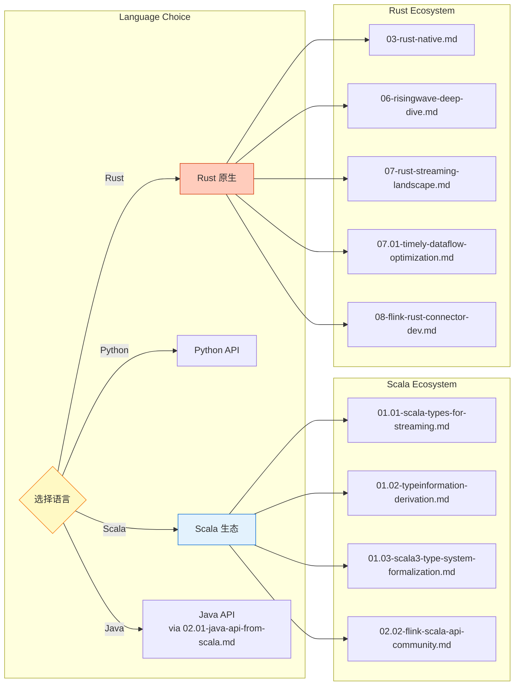
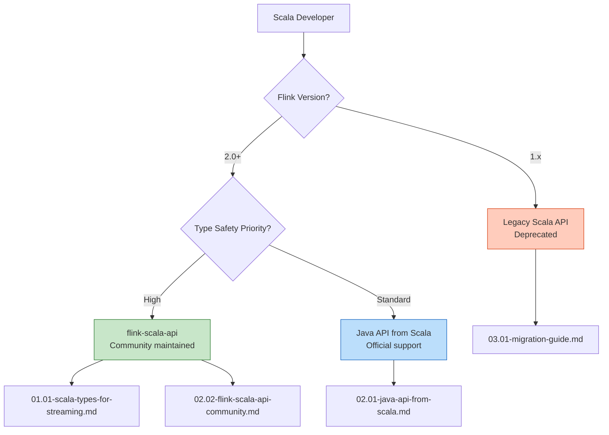
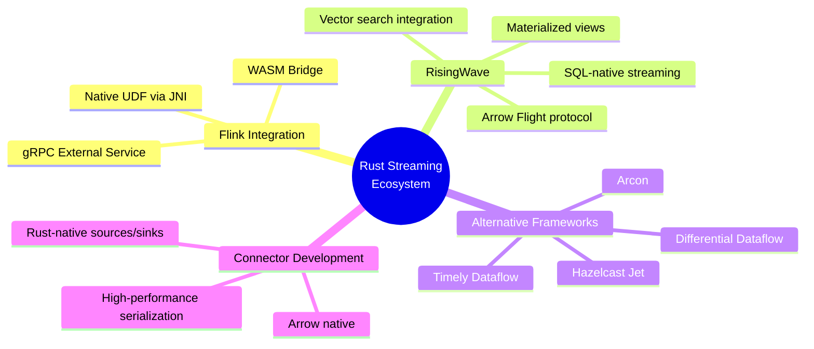
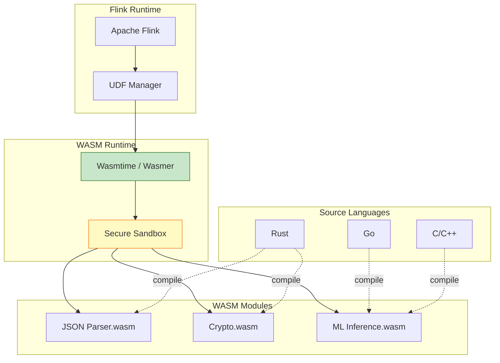
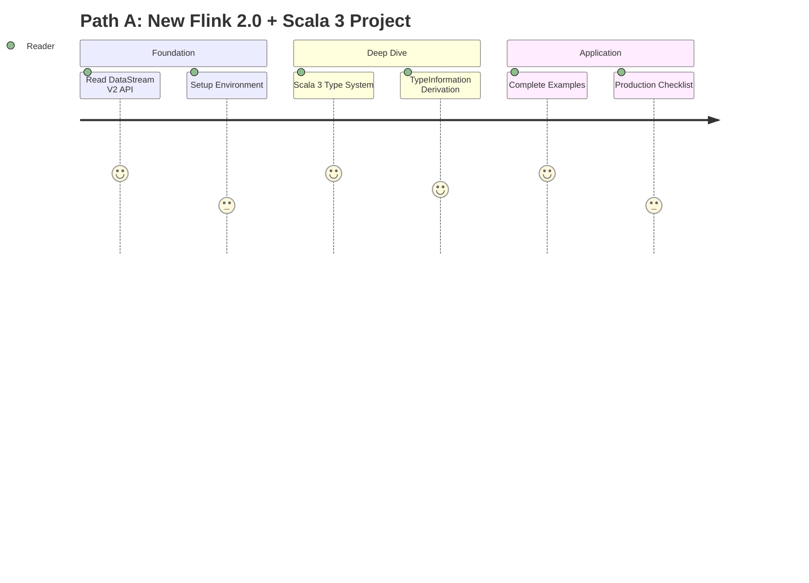
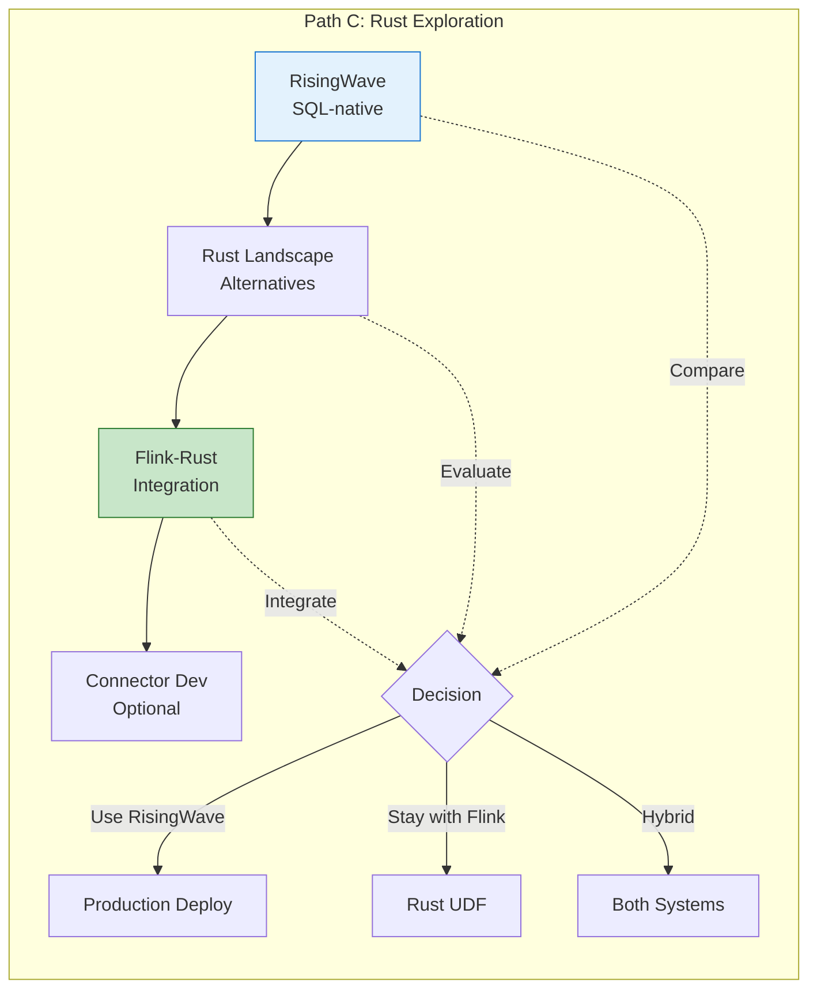
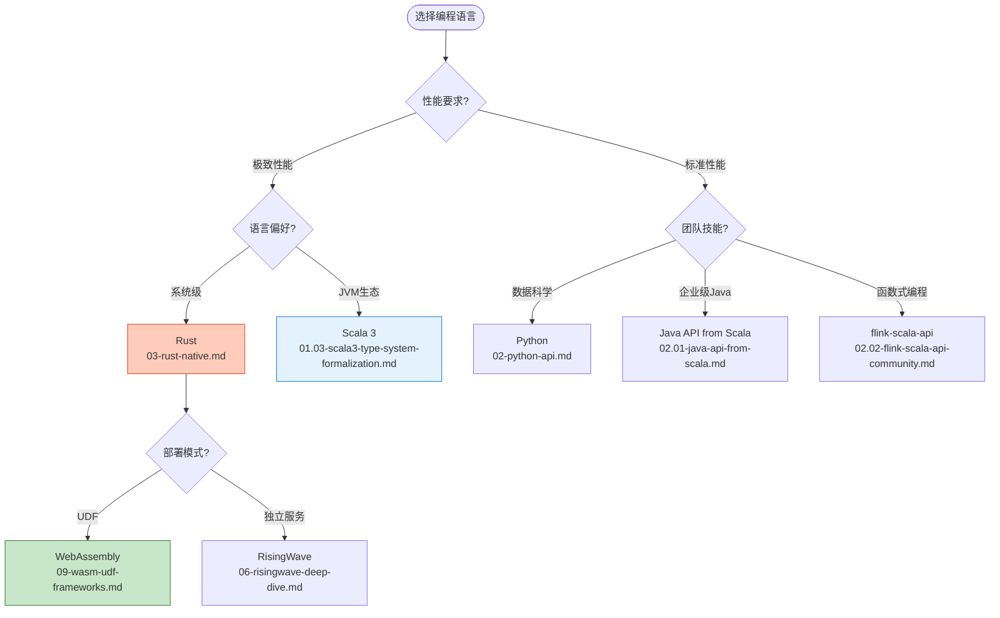
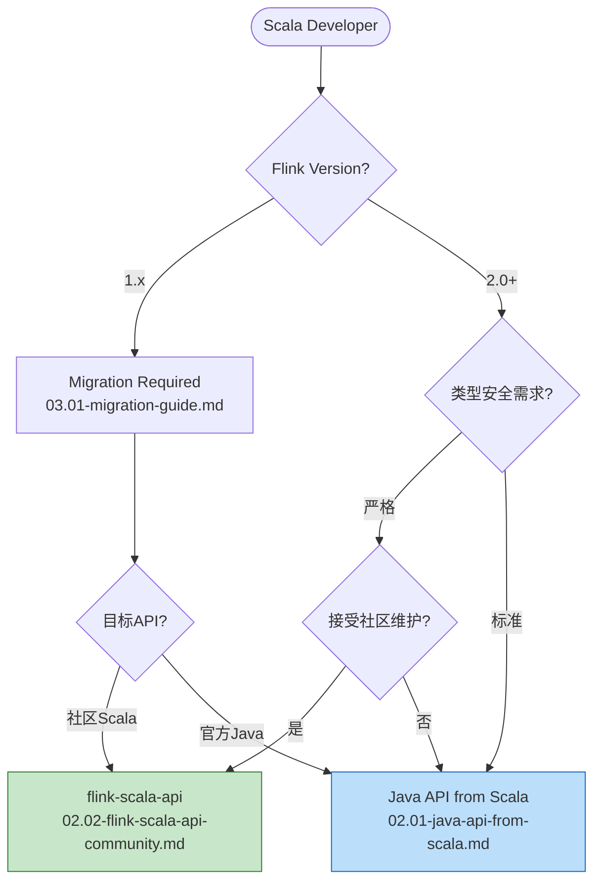
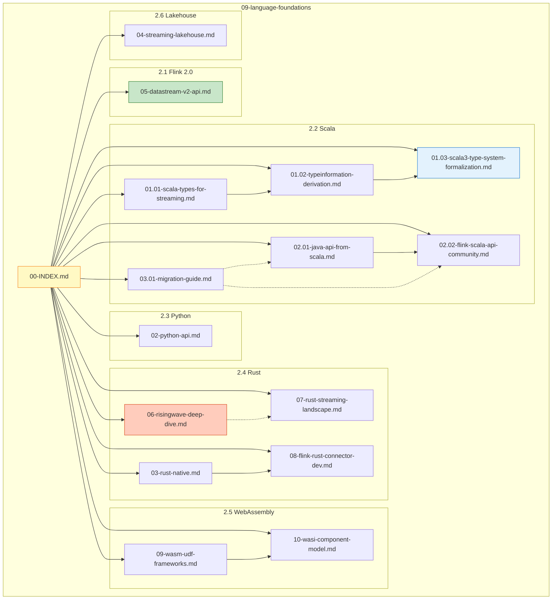
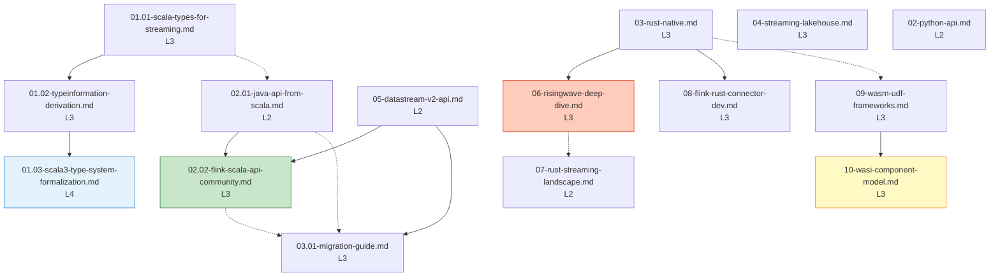

# Flink 多语言编程基础模块索引

> **所属阶段**: Flink/ | **前置依赖**: [Flink/00-INDEX.md](../00-INDEX.md), [Struct/01-foundation/01.02-type-system-hierarchy.md](../../Struct/01-foundation/01.02-type-system-hierarchy.md) | **形式化等级**: L2-L4 | **版本**: Flink 1.18+ / 2.0+

---

## Section 1: Quick Navigation

### 1.1 By Flink Version

| Version | Status | Recommended API | Key Documents |
|---------|--------|-----------------|---------------|
| **Flink 1.x** | Maintenance | Java API / Scala API (deprecated) | [Migration Guide](03.01-migration-guide.md) |
| **Flink 2.0** | Active | DataStream V2 / Java API | [DataStream V2 API](05-datastream-v2-api.md), [Migration Guide](03.01-migration-guide.md) |

### 1.2 By Programming Language



### 1.3 By Use Case

| Use Case | Entry Point | Difficulty | Time |
|----------|-------------|------------|------|
| **New Flink 2.0 Project** | [05-datastream-v2-api.md](05-datastream-v2-api.md) | L2 | 30 min |
| **Migration from 1.x** | [03.01-migration-guide.md](03.01-migration-guide.md) | L3 | 45 min |
| **Scala Type System Deep Dive** | [01.03-scala3-type-system-formalization.md](01.03-scala3-type-system-formalization.md) | L4 | 60 min |
| **Rust UDF Development** | [03-rust-native.md](03-rust-native.md) | L3 | 40 min |
| **WASM UDF Framework** | [09-wasm-udf-frameworks.md](09-wasm-udf-frameworks.md) | L3 | 35 min |
| **Streaming Lakehouse** | [04-streaming-lakehouse.md](04-streaming-lakehouse.md) | L3 | 45 min |

---

## Section 2: Document Categories

### 2.1 Flink 2.0 New Features ⭐ NEW

> **Status**: New section for Flink 2.0+ features

| Document | Status | Description | Formality |
|----------|--------|-------------|-----------|
| [05-datastream-v2-api.md](05-datastream-v2-api.md) | 🆕 NEW | DataStream V2 API with Scala 3 support | L3 |
| [flink-datastream-api-complete-guide.md](flink-datastream-api-complete-guide.md) | 🆕 NEW | DataStream API 完整特性指南 (V1 & V2) | L3-L4 |
| Flink 2.0 Migration Overview | 🆕 NEW | High-level migration strategy and breaking changes | L2 |

**Key Features of Flink 2.0:**

- DataStream V2 API with improved type inference
- Removal of official Scala API (community migration)
- Enhanced checkpointing and state management
- Native Kubernetes improvements

### 2.2 Scala Programming

> **Status**: Core Scala documentation with Flink 2.0 updates

| Document | Status | Description | Formality |
|----------|--------|-------------|-----------|
| [01.01-scala-types-for-streaming.md](01.01-scala-types-for-streaming.md) | ✅ | Scala types for streaming applications | L3 |
| [01.02-typeinformation-derivation.md](01.02-typeinformation-derivation.md) | ✅ | TypeInformation derivation mechanisms | L3 |
| [01.03-scala3-type-system-formalization.md](01.03-scala3-type-system-formalization.md) | 🆕 NEW | DOT calculus formalization for streaming | L4 |
| [02.01-java-api-from-scala.md](02.01-java-api-from-scala.md) | ✅ | Using Java API from Scala | L2 |
| [02.02-flink-scala-api-community.md](02.02-flink-scala-api-community.md) | 📝 UPDATED | Community flink-scala-api guide | L3 |
| [03.01-migration-guide.md](03.01-migration-guide.md) | 📝 UPDATED | Flink 1.x to 2.0 migration guide | L3 |

**Scala Ecosystem Decision Matrix:**



### 2.3 Python Programming

| Document | Status | Description | Formality |
|----------|--------|-------------|-----------|
| [02-python-api.md](02-python-api.md) | ✅ | PyFlink API and integration patterns | L2 |
| [02.03-python-async-api.md](02.03-python-async-api.md) | 🆕 NEW | Python Async DataStream API (Flink 2.2) | L3 |

### 2.4 Rust Programming ⭐ NEW SECTION

> **Status**: New section covering Rust-native streaming and Flink integration

| Document | Status | Description | Formality |
|----------|--------|-------------|-----------|
| [03-rust-native.md](03-rust-native.md) | ✅ | High-performance native UDF with Rust | L3 |
| [06-risingwave-deep-dive.md](06-risingwave-deep-dive.md) | ✅ | RisingWave streaming database deep dive with vector search | L3 |
| [07-rust-streaming-landscape.md](07-rust-streaming-landscape.md) | 🆕 NEW | Rust streaming ecosystem overview | L2 |
| [07.01-timely-dataflow-optimization.md](07.01-timely-dataflow-optimization.md) | 🆕 NEW | Materialize 100x performance optimization analysis | L4-L5 |
| [08-flink-rust-connector-dev.md](08-flink-rust-connector-dev.md) | 🆕 NEW | Developing Flink connectors in Rust | L3 |

**Rust Ecosystem Overview:**



### 2.5 WebAssembly ⭐ NEW SECTION

> **Status**: New section for WASM-based UDF frameworks

| Document | Status | Description | Formality |
|----------|--------|-------------|-----------|
| [09-wasm-udf-frameworks.md](09-wasm-udf-frameworks.md) | 🆕 NEW | WASM UDF frameworks and integration | L3 |
| [10-wasi-component-model.md](10-wasi-component-model.md) | 🆕 NEW | WASI Component Model for portable UDFs | L3 |

**WASM Integration Architecture:**



### 2.6 Streaming Lakehouse

| Document | Status | Description | Formality |
|----------|--------|-------------|-----------|
| [04-streaming-lakehouse.md](04-streaming-lakehouse.md) | ✅ | Streaming lakehouse architecture | L3 |

---

## Section 3: Reading Paths

### Path A: New Flink 2.0 + Scala 3 Project 🚀

> **Target**: Starting a greenfield project with Flink 2.0 and Scala 3

**Step-by-Step Guide:**

1. **Start with DataStream V2 API** (30 min)
   - Read: [05-datastream-v2-api.md](05-datastream-v2-api.md)
   - Focus: New API patterns, type inference improvements

2. **Setup flink-scala-api** (20 min)
   - Read: [02.02-flink-scala-api-community.md](02.02-flink-scala-api-community.md)
   - Focus: Dependency setup, basic configuration

3. **Understand Scala 3 Type System** (45 min)
   - Read: [01.03-scala3-type-system-formalization.md](01.03-scala3-type-system-formalization.md)
   - Focus: DOT calculus, path-dependent types for streaming

4. **Follow Complete Examples** (40 min)
   - Read: [01.01-scala-types-for-streaming.md](01.01-scala-types-for-streaming.md)
   - Focus: End-to-end streaming job examples

**Total Time**: ~2.5 hours



### Path B: Migrating from Flink 1.x 🔄

> **Target**: Migrating existing Flink 1.x applications to 2.0

**Step-by-Step Guide:**

1. **Migration Guide Overview** (30 min)
   - Read: [03.01-migration-guide.md](03.01-migration-guide.md)
   - Focus: Breaking changes, compatibility matrix

2. **API Comparison** (25 min)
   - Read: [02.01-java-api-from-scala.md](02.01-java-api-from-scala.md) vs [02.02-flink-scala-api-community.md](02.02-flink-scala-api-community.md)
   - Focus: API differences, feature parity

3. **Type System Adaptation** (35 min)
   - Read: [01.02-typeinformation-derivation.md](01.02-typeinformation-derivation.md)
   - Focus: TypeInformation changes, migration patterns

4. **Testing Strategies** (30 min)
   - Focus: Compatibility testing, validation approaches

**Total Time**: ~2 hours

### Path C: Exploring Rust Alternatives 🦀

> **Target**: Evaluating Rust-based streaming solutions and Flink integration

**Step-by-Step Guide:**

1. **RisingWave Deep Dive** (40 min)
   - Read: [06-risingwave-deep-dive.md](06-risingwave-deep-dive.md)
   - Focus: SQL-native streaming, materialized views architecture

2. **Rust Streaming Landscape** (30 min)
   - Read: [07-rust-streaming-landscape.md](07-rust-streaming-landscape.md)
   - Focus: Timely Dataflow, Differential Dataflow, Arcon comparison

3. **Flink-Rust Integration** (35 min)
   - Read: [03-rust-native.md](03-rust-native.md)
   - Focus: JNI vs WASM bridge, performance characteristics

4. **Connector Development** (45 min) - Optional
   - Read: [08-flink-rust-connector-dev.md](08-flink-rust-connector-dev.md)
   - Focus: Building native connectors in Rust

**Total Time**: ~2.5 hours (~3.5 with optional)



### Path D: Advanced WASM UDFs 🔷

> **Target**: Implementing portable, secure UDFs using WebAssembly

**Step-by-Step Guide:**

1. **WASM Frameworks Overview** (30 min)
   - Read: [09-wasm-udf-frameworks.md](09-wasm-udf-frameworks.md)
   - Focus: Wasmtime, Wasmer, language support matrix

2. **WASI Component Model** (35 min)
   - Read: [10-wasi-component-model.md](10-wasi-component-model.md)
   - Focus: Portable component interfaces, wit-bindgen

3. **Production Deployment** (40 min)
   - Focus: Security hardening, performance tuning, monitoring

**Total Time**: ~1.75 hours

---

## Section 4: Formality Levels

### L2: Quick Start Guides

> **Accessible introductions for immediate productivity**

| Document | Topic | Prerequisites |
|----------|-------|---------------|
| [02-python-api.md](02-python-api.md) | PyFlink basics | Python, basic streaming concepts |
| [02.01-java-api-from-scala.md](02.01-java-api-from-scala.md) | Java API from Scala | Scala basics |
| [05-datastream-v2-api.md](05-datastream-v2-api.md) | DataStream V2 quick start | Basic Flink knowledge |

### L3: API Documentation

> **Detailed technical documentation with examples**

| Document | Topic | Prerequisites |
|----------|-------|---------------|
| [01.01-scala-types-for-streaming.md](01.01-scala-types-for-streaming.md) | Scala types for streaming | Scala, Flink basics |
| [01.02-typeinformation-derivation.md](01.02-typeinformation-derivation.md) | TypeInformation derivation | Scala implicits |
| [02.02-flink-scala-api-community.md](02.02-flink-scala-api-community.md) | Community Scala API | Scala 3, Flink |
| [03.01-migration-guide.md](03.01-migration-guide.md) | Migration guide | Flink 1.x experience |
| [03-rust-native.md](03-rust-native.md) | Rust UDF development | Rust, basic Flink |
| [04-streaming-lakehouse.md](04-streaming-lakehouse.md) | Streaming lakehouse | Lakehouse concepts |
| [09-wasm-udf-frameworks.md](09-wasm-udf-frameworks.md) | WASM UDF frameworks | WASM basics |
| [10-wasi-component-model.md](10-wasi-component-model.md) | WASI Component Model | WASM, component design |

### L4: Type System Formalization

> **Rigorous theoretical foundations**

| Document | Topic | Prerequisites |
|----------|-------|---------------|
| [01.03-scala3-type-system-formalization.md](01.03-scala3-type-system-formalization.md) | DOT calculus for streaming | Type theory, Scala 3 |
| [06-risingwave-deep-dive.md](06-risingwave-deep-dive.md) | RisingWave internals with vector search | Database internals, streaming theory |
| [07-rust-streaming-landscape.md](07-rust-streaming-landscape.md) | Comparative analysis | Multiple streaming frameworks |
| [07.01-timely-dataflow-optimization.md](07.01-timely-dataflow-optimization.md) | Timely Dataflow optimization (100x perf) | Rust, differential dataflow |
| [08-flink-rust-connector-dev.md](08-flink-rust-connector-dev.md) | Advanced connector patterns | Rust, Flink internals |

---

## Section 5: Cross-References

### 5.1 Links to Struct/ Type Theory

| Struct/ Document | Flink/09 Document | Relationship |
|------------------|-------------------|--------------|
| [Struct/01-foundation/01.02-type-system-hierarchy.md](../../Struct/01-foundation/01.02-type-system-hierarchy.md) | [01.03-scala3-type-system-formalization.md](01.03-scala3-type-system-formalization.md) | DOT calculus → Scala 3 type system |
| [Struct/01-foundation/01.03-type-safety-boundaries.md](../../Struct/01-foundation/01.03-type-safety-boundaries.md) | [01.02-typeinformation-derivation.md](01.02-typeinformation-derivation.md) | Type boundaries → TypeInformation |
| [Struct/02-concurrency/02.01-actor-model-semantics.md](../../Struct/02-concurrency/02.01-actor-model-semantics.md) | [03-rust-native.md](03-rust-native.md) | Actor semantics → Rust async |

### 5.2 Links to Knowledge/ Patterns

| Knowledge/ Document | Flink/09 Document | Relationship |
|---------------------|-------------------|--------------|
| [Knowledge/03-patterns/stream-processing-patterns.md](../../Knowledge/03-patterns/stream-processing-patterns.md) | [01.01-scala-types-for-streaming.md](01.01-scala-types-for-streaming.md) | Patterns → Type-safe implementation |
| [Knowledge/04-business/real-time-analytics.md](../../Knowledge/04-business/real-time-analytics.md) | [04-streaming-lakehouse.md](04-streaming-lakehouse.md) | Business patterns → Lakehouse architecture |
| [Knowledge/05-case-studies/financial-risk.md](../../Knowledge/05-case-studies/financial-risk.md) | [03-rust-native.md](03-rust-native.md) | Financial use cases → High-performance UDF |

### 5.3 Links to Flink/ Core Mechanisms

| Flink/ Document | Flink/09 Document | Relationship |
|-----------------|-------------------|--------------|
| [Flink/01-architecture/datastream-v2-semantics.md](../01-architecture/datastream-v2-semantics.md) | [05-datastream-v2-api.md](05-datastream-v2-api.md) | V2 semantics → V2 API usage |
| [Flink/02-mechanisms/checkpointing.md](../02-mechanisms/checkpointing.md) | [03.01-migration-guide.md](03.01-migration-guide.md) | Checkpointing → Migration considerations |
| [Flink/13-wasm/wasm-streaming.md](../13-wasm/wasm-streaming.md) | [09-wasm-udf-frameworks.md](09-wasm-udf-frameworks.md) | WASM streaming → UDF frameworks |

---

## Section 6: Decision Trees

### 6.1 Language Selection Decision Tree



### 6.2 API Selection for Scala Developers



---

## Section 7: Module Visualization

### 7.1 Complete Module Structure



### 7.2 Document Dependency Graph



---

## Section 8: Quick Reference Tables

### 8.1 All Documents Summary

| # | Document | Language | Level | Status | Reading Time |
|---|----------|----------|-------|--------|--------------|
| 01.01 | [scala-types-for-streaming.md](01.01-scala-types-for-streaming.md) | Scala | L3 | ✅ | 35 min |
| 01.02 | [typeinformation-derivation.md](01.02-typeinformation-derivation.md) | Scala | L3 | ✅ | 40 min |
| 01.03 | [scala3-type-system-formalization.md](01.03-scala3-type-system-formalization.md) | Scala | L4 | 🆕 | 60 min |
| 02 | [python-api.md](02-python-api.md) | Python | L2 | ✅ | 30 min |
| 02.01 | [java-api-from-scala.md](02.01-java-api-from-scala.md) | Scala | L2 | ✅ | 25 min |
| 02.02 | [flink-scala-api-community.md](02.02-flink-scala-api-community.md) | Scala | L3 | 📝 | 35 min |
| 03 | [rust-native.md](03-rust-native.md) | Rust | L3 | ✅ | 45 min |
| 03.01 | [migration-guide.md](03.01-migration-guide.md) | Scala | L3 | 📝 | 40 min |
| 04 | [streaming-lakehouse.md](04-streaming-lakehouse.md) | Multi | L3 | ✅ | 45 min |
| 05 | [datastream-v2-api.md](05-datastream-v2-api.md) | Scala/Java | L2 | 🆕 | 30 min |
| 06 | [risingwave-deep-dive.md](06-risingwave-deep-dive.md) | Rust/SQL | L4 | ✅ | 50 min |
| 07 | [rust-streaming-landscape.md](07-rust-streaming-landscape.md) | Rust | L2 | 🆕 | 35 min |
| 07.01 | [07.01-timely-dataflow-optimization.md](07.01-timely-dataflow-optimization.md) | Rust | L4-L5 | 🆕 | 60 min |
| 08 | [flink-rust-connector-dev.md](08-flink-rust-connector-dev.md) | Rust | L3 | 🆕 | 55 min |
| 09 | [wasm-udf-frameworks.md](09-wasm-udf-frameworks.md) | WASM | L3 | 🆕 | 35 min |
| 10 | [wasi-component-model.md](10-wasi-component-model.md) | WASM | L3 | 🆕 | 40 min |
| 11 | [flink-datastream-api-complete-guide.md](flink-datastream-api-complete-guide.md) | Java/Scala | L3-L4 | 🆕 | 120 min |

**Legend:**

- ✅ Available
- 🆕 New (planned/to be created)
- 📝 Updated

### 8.2 Formality Level Distribution

```
L2 (Quick Start):     ███████░░░░░░░░░░░░░  4 docs (22%)
L3 (API/Technical):   ███████████████░░░░░  11 docs (58%)
L4 (Formalization):   ████░░░░░░░░░░░░░░░░  4 docs (21%)
                      Total: 18 documents
```

---

## Section 9: References


---

*索引更新时间: 2026-04-02*
*适用版本: Flink 1.18+ / 2.0+ / 2.2+ | Scala 3.x | Python 3.9+ | Rust 1.75+*
*文档统计: 18 文档 | 4 L2 | 11 L3 | 4 L4 | 新增: Flink DataStream API 完整特性指南*
