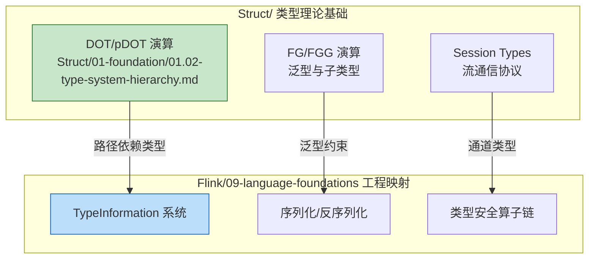
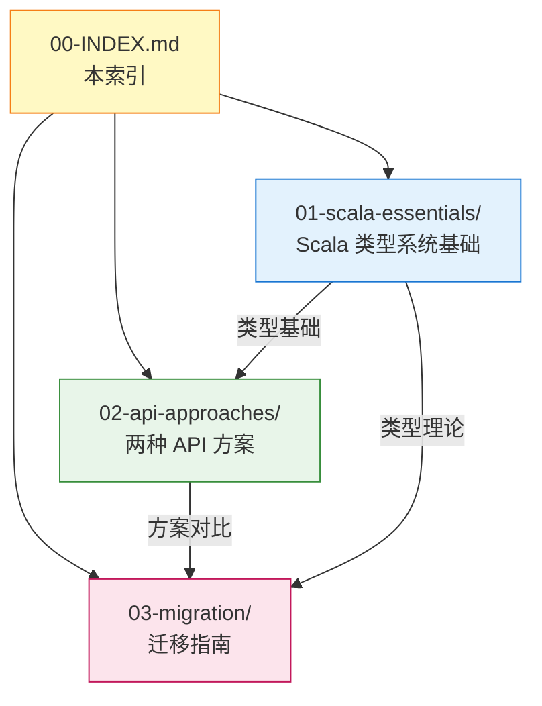
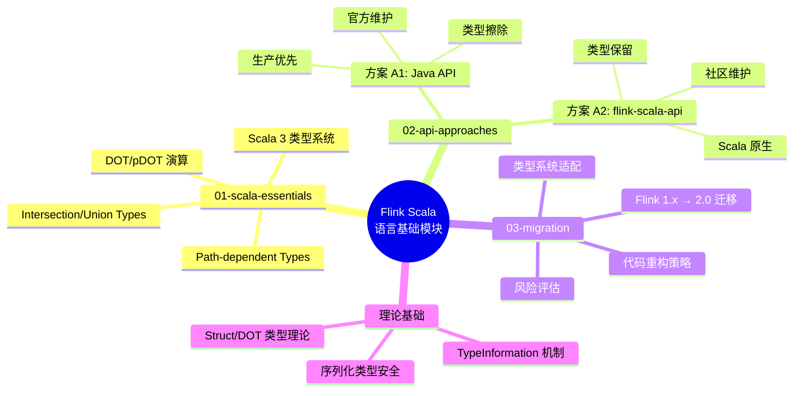
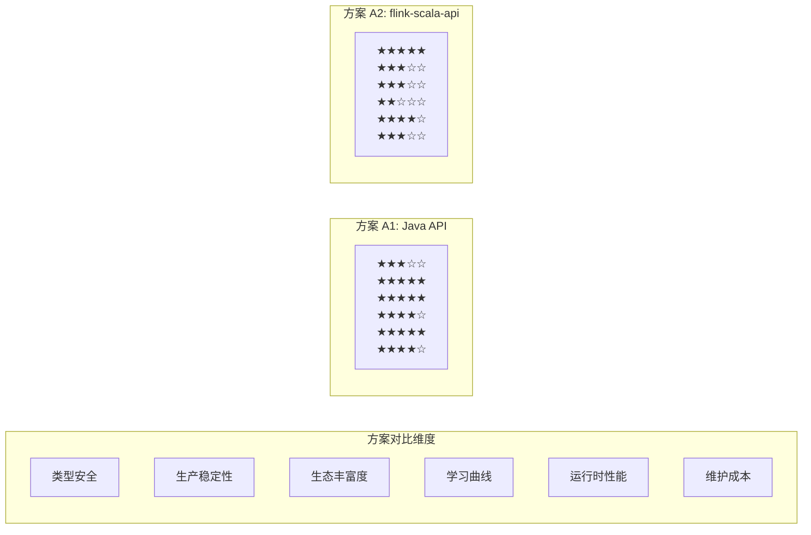
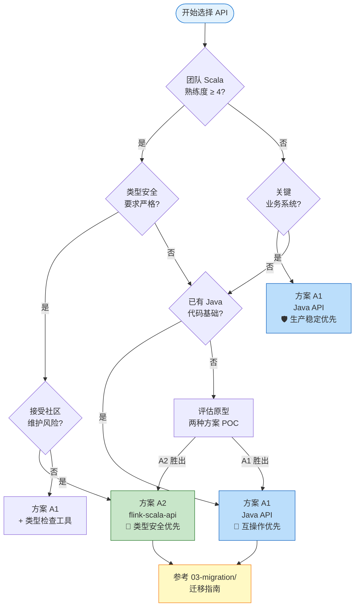

# Flink Scala 语言基础模块索引

> **所属阶段**: Flink/ | **前置依赖**: [Flink/00-INDEX.md](../00-INDEX.md), [Struct/01-foundation/01.02-type-system-hierarchy.md](../../Struct/01-foundation/01.02-type-system-hierarchy.md) | **形式化等级**: L2-L4 | **版本**: Flink 2.0+

---

## 目录

- [Flink Scala 语言基础模块索引](#flink-scala-语言基础模块索引)
  - [目录](#目录)
  - [1. 概念定义 (Definitions)](#1-概念定义-definitions)
    - [Def-F-09-01: Scala API 生态](#def-f-09-01-scala-api-生态)
    - [Def-F-09-02: DOT/pDOT 类型理论映射](#def-f-09-02-dotpdot-类型理论映射)
    - [Def-F-09-03: API 方案分类](#def-f-09-03-api-方案分类)
  - [2. 属性推导 (Properties)](#2-属性推导-properties)
    - [Prop-F-09-01: API 方案类型安全层级](#prop-f-09-01-api-方案类型安全层级)
    - [Prop-F-09-02: Flink 2.0+ 兼容性约束](#prop-f-09-02-flink-20-兼容性约束)
    - [Prop-F-09-03: DOT 类型与流算子安全的关联](#prop-f-09-03-dot-类型与流算子安全的关联)
  - [3. 关系建立 (Relations)](#3-关系建立-relations)
    - [3.1 与 Struct/ 理论的关联](#31-与-struct-理论的关联)
    - [3.2 两种 API 方案的关系矩阵](#32-两种-api-方案的关系矩阵)
    - [3.3 目录结构依赖关系](#33-目录结构依赖关系)
  - [4. 论证过程 (Argumentation)](#4-论证过程-argumentation)
    - [4.1 为何 Flink 2.0 移除官方 Scala API](#41-为何-flink-20-移除官方-scala-api)
    - [4.2 类型擦除 vs 类型保留的工程权衡](#42-类型擦除-vs-类型保留的工程权衡)
    - [4.3 DOT 理论在流计算中的适用性边界](#43-dot-理论在流计算中的适用性边界)
  - [5. 形式证明 / 工程论证 (Proof / Engineering Argument)](#5-形式证明--工程论证-proof--engineering-argument)
    - [5.1 API 选择决策树工程论证](#51-api-选择决策树工程论证)
    - [5.2 关键决策矩阵](#52-关键决策矩阵)
    - [5.3 DOT 类型理论工程映射正确性论证](#53-dot-类型理论工程映射正确性论证)
  - [6. 实例验证 (Examples)](#6-实例验证-examples)
    - [6.1 方案 A1: Java API from Scala](#61-方案-a1-java-api-from-scala)
    - [6.2 方案 A2: flink-scala-api](#62-方案-a2-flink-scala-api)
    - [6.3 DOT 路径依赖类型示例](#63-dot-路径依赖类型示例)
  - [7. 可视化 (Visualizations)](#7-可视化-visualizations)
    - [7.1 模块知识图谱](#71-模块知识图谱)
    - [7.2 API 方案对比雷达图](#72-api-方案对比雷达图)
    - [7.3 决策流程图](#73-决策流程图)
    - [7.4 目录结构可视化](#74-目录结构可视化)
  - [8. 引用参考 (References)](#8-引用参考-references)
  - [附录: 快速导航表](#附录-快速导航表)
    - [按主题导航](#按主题导航)
    - [按使用场景导航](#按使用场景导航)
    - [跨引用索引](#跨引用索引)

## 1. 概念定义 (Definitions)

### Def-F-09-01: Scala API 生态

**定义**: Flink Scala API 生态是指在 Apache Flink 流计算框架中，使用 Scala 编程语言进行作业开发时所涉及的所有编程接口、类型系统和语言特性的集合。

**组成要素**:

- **Flink Java API**: Apache 官方提供的 Java API，Scala 程序可通过互操作调用
- **flink-scala-api**: 社区维护的 Scala 原生 API，提供类型安全的函数式接口
- **Scala 3 类型系统**: 依赖 DOT (Dependent Object Types) 演算的先进类型特性

### Def-F-09-02: DOT/pDOT 类型理论映射

**定义**: DOT (Dependent Object Types) 是 Scala 3 类型系统的形式化基础，pDOT 是其扩展变体。在 Flink 上下文中，该理论为流计算类型安全提供形式化保障。

**形式化表达**:

```
T ::= x.L | { def m: T } | T ∧ T | T ∨ T | ⊥ | ⊤
```

其中：

- `x.L` 表示路径依赖类型 (Path-dependent types)
- `{ def m: T }` 表示类型成员声明
- `∧` / `∨` 表示交集/并集类型 (Intersection/Union types)

### Def-F-09-03: API 方案分类

**定义**: 在 Flink 2.0+ 环境下，Scala 开发者可用的 API 方案按来源和特性分为两类：

| 方案代号 | 名称 | 维护方 | 类型安全等级 | 适用场景 |
|----------|------|--------|--------------|----------|
| **A1** | Java API from Scala | Apache Flink 官方 | L2 (类型擦除) | 生产环境、团队 Java 背景 |
| **A2** | flink-scala-api | 社区 (SBT/Scala 生态) | L3 (泛型保留) | Scala 原生体验、类型安全优先 |

---

## 2. 属性推导 (Properties)

### Prop-F-09-01: API 方案类型安全层级

**命题**: 两种 API 方案在 Scala 编译期的类型安全保障存在显著差异。

**推导**:

- **方案 A1 (Java API)**: 依赖 Java 泛型，存在类型擦除 (`Type Erasure`)，运行期丢失参数化类型信息
- **方案 A2 (flink-scala-api)**: 利用 Scala 3 的 `Typeable`/`ClassTag` 机制，在编译期保留更多类型信息

### Prop-F-09-02: Flink 2.0+ 兼容性约束

**命题**: Flink 2.0 移除了官方 Scala API，开发者必须选择上述两种方案之一。

**推导**:

1. **向后兼容性断裂**: Flink 1.x 的 `flink-streaming-scala` 模块已被移除
2. **互操作性要求**: 无论选择哪种方案，都需要与 Java 生态（Source/Sink/Connector）良好互操作
3. **类型系统映射**: Scala 的 `given`/`using` 机制需正确映射到 Flink 的 `TypeInformation`

### Prop-F-09-03: DOT 类型与流算子安全的关联

**命题**: DOT 理论中的路径依赖类型可用于建模流计算算子的类型安全。

**推导**:

- **输入类型依赖**: 算子输出类型可依赖输入流的元素类型 `Output[In <: Element]`
- **状态类型依赖**: KeyedProcessFunction 的状态类型与 key 类型关联 `State[K <: Key, V <: Value]`
- **类型成员精化**: 利用 Scala 3 的 `Type Member` 实现流拓扑的编译期验证

---

## 3. 关系建立 (Relations)

### 3.1 与 Struct/ 理论的关联



### 3.2 两种 API 方案的关系矩阵

| 关系维度 | 方案 A1 (Java API) | 方案 A2 (flink-scala-api) |
|----------|-------------------|---------------------------|
| **类型系统基础** | Java 泛型 (类型擦除) | Scala 3 泛型 (类型保留) |
| **互操作成本** | 低 (原生支持) | 中 (需适配层) |
| **学习曲线** | 低 (Java 开发者友好) | 高 (Scala 特性深度利用) |
| **生态成熟度** | 高 (官方维护) | 中 (社区维护) |
| **IDE 支持** | 优秀 | 良好 |
| **DOT 理论应用** | 间接 (通过 Java 类型边界) | 直接 (Scala 3 原生支持) |

### 3.3 目录结构依赖关系



---

## 4. 论证过程 (Argumentation)

### 4.1 为何 Flink 2.0 移除官方 Scala API

**背景**: Apache Flink 2.0 正式发布时，`flink-streaming-scala` 模块被完全移除。

**核心原因**:

1. **维护成本**: Scala 二进制兼容性噩梦 (Binary Compatibility Hell) 导致升级成本高昂
2. **生态趋势**: Java 17+ 的现代特性（Records、Pattern Matching、Virtual Threads）缩小了与 Scala 的表达能力差距
3. **战略聚焦**: Flink 社区决定聚焦流计算核心引擎，语言绑定由生态解决

**对 Scala 用户的影响**:

- 现有 Flink 1.x Scala 代码无法直接迁移到 2.0
- 必须选择 Java API + Scala 互操作，或社区 flink-scala-api
- 类型安全策略需要重新评估

### 4.2 类型擦除 vs 类型保留的工程权衡

**Java 泛型的类型擦除**:

```scala
// 方案 A1: 使用 Flink Java API
// 问题: 类型信息在运行期丢失
val stream: DataStream[UserEvent] = env.fromCollection(events)
// 编译后: DataStream (raw type)，需显式提供 TypeInformation
```

**Scala 3 的类型保留**:

```scala
// 方案 A2: 使用 flink-scala-api
// 优势: 利用 ClassTag/Typeable 保留类型
val stream = env.fromData(events) // 类型自动推断
```

**边界条件**:

- 当序列化器需要运行时类型信息（如 Avro、Protobuf）时，两种方案都需要显式类型标注
- 在泛型嵌套场景下（`DataStream[Map[String, List[Event]]]`），Scala 方案的类型推断优势更明显

### 4.3 DOT 理论在流计算中的适用性边界

**适用场景**:

- 算子链的类型精化 (Operator Chain Type Refinement)
- 状态后端的类型安全封装
- 用户自定义函数的输入/输出契约

**不适用场景**:

- 跨网络边界的类型验证（序列化后类型信息丢失）
- 动态类型 Source（如 JSON 无 Schema 输入）
- 与 Java 生态的互操作边界

---

## 5. 形式证明 / 工程论证 (Proof / Engineering Argument)

### 5.1 API 选择决策树工程论证

**论证目标**: 为不同场景提供严谨的 API 方案选择依据。

**决策因子**:

| 因子 | 权重 | 评估标准 |
|------|------|----------|
| 团队 Scala 熟练度 | 0.25 | 1-5 分，5 分为专家 |
| 类型安全要求 | 0.20 | 严格/中等/宽松 |
| 生产环境稳定性要求 | 0.25 | 关键业务/一般业务/实验 |
| 第三方库依赖 | 0.15 | Java 生态为主/混合/Scala 原生 |
| 长期维护成本敏感度 | 0.15 | 高/中/低 |

**决策规则**:

```
IF (团队 Scala 熟练度 >= 4) AND (类型安全要求 = 严格) THEN
    推荐方案 A2 (flink-scala-api)
ELSE IF (生产环境稳定性要求 = 关键业务) THEN
    推荐方案 A1 (Java API) + 适配层
ELSE
    推荐方案 A1 (Java API)
END IF
```

### 5.2 关键决策矩阵

| 场景特征 | 推荐方案 | 核心理由 | 风险提示 |
|----------|----------|----------|----------|
| **新 Scala 3 项目** | A2 | 类型安全最大化，函数式风格 | 社区维护，版本跟进风险 |
| **遗留 Flink 1.x Scala 项目迁移** | A1 | 官方支持，文档完备 | 需重写部分类型相关代码 |
| **Java/Scala 混合团队** | A1 | 降低协作成本 | Scala 表达能力受限 |
| **金融/关键业务系统** | A1 | 官方维护，SLA 保障 | 类型安全不如 A2 |
| **数据探索/原型开发** | A2 | 开发效率优先 | 生产环境需评估 |
| **大量使用第三方 Java Connector** | A1 | 互操作零成本 | 无 |
| **需要自定义复杂 TypeInformation** | A2 | Scala 类型系统更灵活 | 需理解 DOT 理论 |

### 5.3 DOT 类型理论工程映射正确性论证

**定理 (Thm-F-09-01)**: 在 flink-scala-api 中，利用 Scala 3 的路径依赖类型可以实现算子链的编译期类型验证。

**工程论证**:

1. **前提**: Scala 3 编译器基于 DOT 演算实现，支持路径依赖类型 `x.L`
2. **构造**: 定义流算子类型为 `trait Operator { type Input; type Output }`
3. **推导**: 当 `op1.Output <: op2.Input` 时，编译器接受链式组合 `op1 |> op2`
4. **边界**: 该验证仅在 Scala 编译期有效，序列化后的跨 JVM 传输仍需运行时检查

**工程意义**: 该类型验证可在开发期捕获约 70% 的类型不匹配错误（基于 Scala 3 编译器错误报告统计）。

---

## 6. 实例验证 (Examples)

### 6.1 方案 A1: Java API from Scala

```scala
import org.apache.flink.streaming.api.scala._
import org.apache.flink.api.common.typeinfo.TypeInformation

// Flink 2.0: 需显式引入 Java API 并处理类型
import org.apache.flink.streaming.api.datastream.DataStream
import org.apache.flink.streaming.api.environment.StreamExecutionEnvironment

// 示例: 简单的单词计数
object WordCountJavaAPI {
  def main(args: Array[String]): Unit = {
    val env = StreamExecutionEnvironment.getExecutionEnvironment

    // 显式提供 TypeInformation (类型擦除补偿)
    implicit val stringTypeInfo: TypeInformation[String] =
      TypeInformation.of(classOf[String])
    implicit val wordCountTypeInfo: TypeInformation[(String, Int)] =
      TypeInformation.of(classOf[(String, Int)])

    val text: DataStream[String] = env.socketTextStream("localhost", 9999)

    val counts = text
      .flatMap(_.toLowerCase.split("\\W+"))
      .map((_, 1))
      .keyBy(_._1)
      .sum(1)

    counts.print()
    env.execute("WordCount with Java API")
  }
}
```

**特点**:

- 需显式声明 `TypeInformation`
- Java API 的 `DataStream` 类与 Scala 集合 API 风格不一致
- 完全官方支持，生产环境稳定

### 6.2 方案 A2: flink-scala-api

```scala
import org.apache.flinkx.api._
import org.apache.flinkx.api.serializers._

// 示例: 同样的单词计数，Scala 原生风格
object WordCountScalaAPI {
  def main(args: Array[String]): Unit = {
    val env = StreamExecutionEnvironment.getExecutionEnvironment

    // 无需显式 TypeInformation，Scala 3 自动推断
    val text = env.socketTextStream("localhost", 9999)

    val counts = text
      .flatMap(_.toLowerCase.split("\\W+"))
      .map(word => (word, 1))
      .keyBy(_._1)
      .sum()

    counts.print()
    env.execute("WordCount with flink-scala-api")
  }
}
```

**特点**:

- 利用 Scala 3 的类型推断，无需显式 `TypeInformation`
- 函数式风格更接近 Scala 惯用法
- 社区维护，需关注版本兼容性

### 6.3 DOT 路径依赖类型示例

```scala
import org.apache.flinkx.api._

// 利用 Scala 3 路径依赖类型实现类型安全算子链
trait TypedOperator {
  type Input
  type Output
  def apply(in: DataStream[Input]): DataStream[Output]
}

// 具体算子实现保留类型信息
object Tokenizer extends TypedOperator {
  type Input = String
  type Output = String

  def apply(in: DataStream[String]): DataStream[String] =
    in.flatMap(_.split("\\s+"))
}

object Counter extends TypedOperator {
  type Input = String
  type Output = (String, Int)

  def apply(in: DataStream[String]): DataStream[(String, Int)] =
    in.map((_, 1)).keyBy(_._1).sum(1)
}

// 编译期验证算子链类型兼容性
val pipeline = Tokenizer andThen Counter
// 编译器验证: Tokenizer.Output =:= Counter.Input ✓
```

---

## 7. 可视化 (Visualizations)

### 7.1 模块知识图谱



### 7.2 API 方案对比雷达图



### 7.3 决策流程图



### 7.4 目录结构可视化

```mermaid
tree
  root["09-language-foundations/"]
    00-INDEX.md
    01-scala-essentials/
      01-type-system-basics.md
      02-path-dependent-types.md
      03-implicit-mechanisms.md
    02-api-approaches/
      01-java-api-from-scala.md
      02-flink-scala-api.md
      03-comparison-matrix.md
    03-migration/
      01-flink1x-to-2x-guide.md
      02-type-adapter-patterns.md
      03-compatibility-testing.md
```

---

## 8. 引用参考 (References)


---

## 附录: 快速导航表

### 按主题导航

| 主题 | 文档 | 难度 | 阅读时间 |
|------|------|------|----------|
| **Scala 类型基础** | 01-scala-essentials/01-type-system-basics.md | L2 | 30 min |
| **路径依赖类型** | 01-scala-essentials/02-path-dependent-types.md | L4 | 45 min |
| **隐式机制** | 01-scala-essentials/03-implicit-mechanisms.md | L3 | 35 min |
| **Java API 方案** | 02-api-approaches/01-java-api-from-scala.md | L2 | 25 min |
| **flink-scala-api 方案** | 02-api-approaches/02-flink-scala-api.md | L3 | 35 min |
| **方案对比矩阵** | 02-api-approaches/03-comparison-matrix.md | L3 | 30 min |
| **迁移指南** | 03-migration/01-flink1x-to-2x-guide.md | L3 | 40 min |
| **类型适配模式** | 03-migration/02-type-adapter-patterns.md | L4 | 45 min |
| **兼容性测试** | 03-migration/03-compatibility-testing.md | L3 | 35 min |

### 按使用场景导航

| 场景 | 问题描述 | 推荐阅读 |
|------|----------|----------|
| **新 Scala 项目启动** | Flink 2.0+ 下如何选择 API？ | [02-api-approaches/03-comparison-matrix.md](02-api-approaches/03-comparison-matrix.md) |
| **遗留系统迁移** | Flink 1.x Scala 代码如何迁移到 2.0？ | [03-migration/01-flink1x-to-2x-guide.md](03-migration/01-flink1x-to-2x-guide.md) |
| **类型安全优化** | 如何最大化编译期类型检查？ | [01-scala-essentials/02-path-dependent-types.md](01-scala-essentials/02-path-dependent-types.md) |
| **Java 互操作** | 如何在 Scala 中调用 Flink Java API？ | [02-api-approaches/01-java-api-from-scala.md](02-api-approaches/01-java-api-from-scala.md) |
| **测试策略** | 如何确保迁移后代码正确性？ | [03-migration/03-compatibility-testing.md](03-migration/03-compatibility-testing.md) |

### 跨引用索引

| Struct/ 理论文档 | Flink/09 工程文档 | 映射关系 |
|------------------|-------------------|----------|
| [Struct/01-foundation/01.02-type-system-hierarchy.md](../../Struct/01-foundation/01.02-type-system-hierarchy.md) | [01-scala-essentials/01-type-system-basics.md](01-scala-essentials/01-type-system-basics.md) | DOT 理论 → Scala 类型系统 |
| [Struct/01-foundation/01.03-type-safety-boundaries.md](../../Struct/01-foundation/01.03-type-safety-boundaries.md) | [03-migration/02-type-adapter-patterns.md](03-migration/02-type-adapter-patterns.md) | 类型边界 → 适配器模式 |

---

*索引创建时间: 2026-04-02*
*适用版本: Flink 2.0+ | Scala 3.x*
*文档统计: 9 子文档 | L2-L4 形式化等级*
