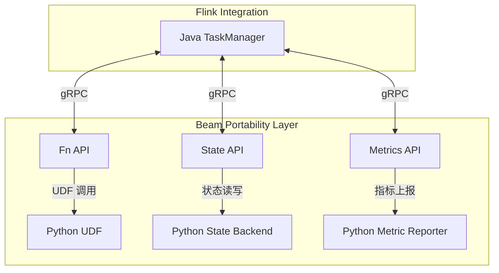
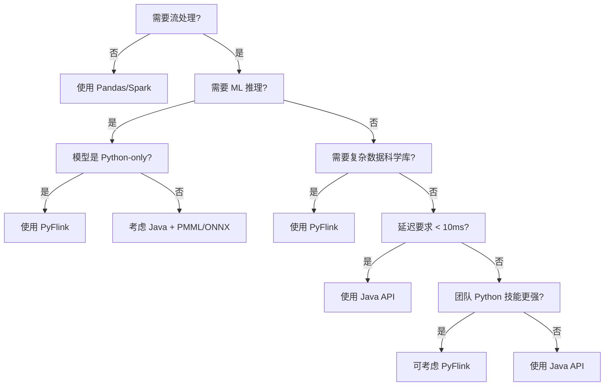
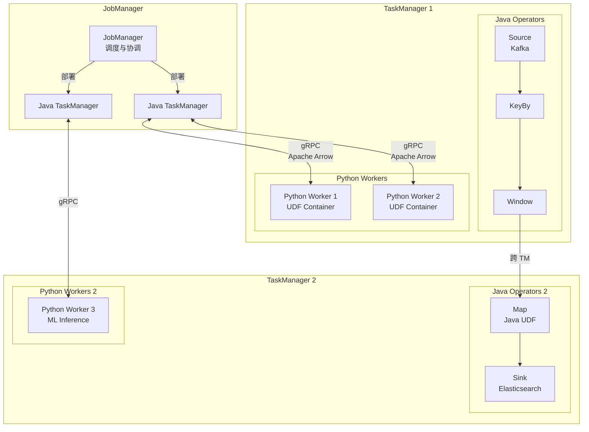
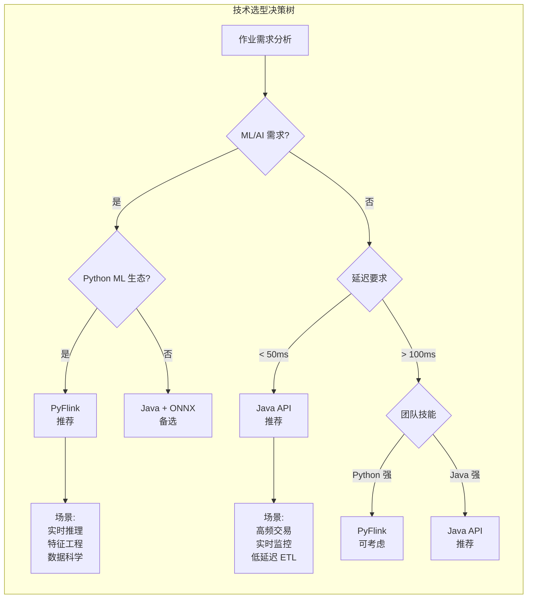
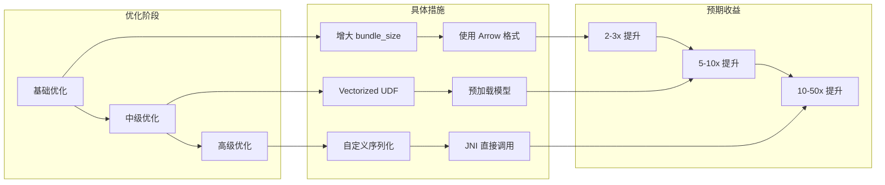

# PyFlink深度 - Python DataStream API

> 所属阶段: Flink | 前置依赖: [09.01-java-api.md](./01-java-api.md) | 形式化等级: L3

## 1. 概念定义 (Definitions)

### Def-F-09-17: PyFlink 架构 (Python→Java Bridge)

**形式化定义**

PyFlink 的架构可形式化为一个桥接系统 \( \mathcal{P} = (P_{vm}, J_{vm}, B_{proto}, S_{udf}) \)，其中：

- \( P_{vm} \): Python 虚拟机执行层，运行用户 Python 代码
- \( J_{vm} \): Java 虚拟机执行层，运行 Flink 核心引擎
- \( B_{proto} \): 双向通信桥接协议 (gRPC-based)
- \( S_{udf} \): UDF 序列化/反序列化层

**架构分层**

```
┌─────────────────────────────────────────────────────────────┐
│                    User Python Code                        │
│              (DataStream API / Table API)                  │
├─────────────────────────────────────────────────────────────┤
│              PyFlink Python API Layer                      │
│         (pyflink.datastream / pyflink.table)               │
├─────────────────────────────────────────────────────────────┤
│              Beam Portability Framework                    │
│              (Fn API / State API / Metrics)                │
├─────────────────────────────────────────────────────────────┤
│           gRPC Communication Channel                       │
│         (Bundle Processing / Cross-lang IPC)               │
├─────────────────────────────────────────────────────────────┤
│              Flink Java Runtime                            │
│      (TaskManager / Network Stack / Checkpoint)            │
└─────────────────────────────────────────────────────────────┘
```

**直观解释**

PyFlink 并非将 Flink 引擎用 Python 重写，而是通过 Apache Beam 的 Portability Framework 构建了 Python 与 Java 之间的双向桥接。用户编写的 Python UDF 运行在独立的 Python Worker 进程中，通过 gRPC 与 Java TaskManager 通信，实现跨语言的无缝集成。

---

### Def-F-09-18: UDF 序列化 (PyFlink UDF)

**形式化定义**

UDF 序列化定义为四元组 \( \mathcal{U} = (F_{py}, C_{pickle}, D_{arrow}, E_{exec}) \)：

- \( F_{py} \): Python 函数对象，包含用户业务逻辑
- \( C_{pickle} \): Pickle/cloudpickle 序列化机制
- \( D_{arrow} \): Apache Arrow 数据序列化格式
- \( E_{exec} \): 远程执行环境配置

**序列化流程**

$$
\text{Python UDF} \xrightarrow{\text{cloudpickle}} \text{Serialized Bytes} \xrightarrow{\text{gRPC}} \text{Java TM} \xrightarrow{\text{分发}} \text{Python Worker}
$$

**数据交换协议**

| 组件 | 序列化方式 | 适用场景 |
|------|-----------|----------|
| UDF 代码 | cloudpickle | 函数对象、闭包、依赖 |
| 输入数据 | Apache Arrow | 批量数据传输 |
| 状态数据 | Protobuf | 状态快照、Checkpoint |
| 控制消息 | gRPC + Protobuf | 指令、心跳、Metrics |

---

### Def-F-09-19: Python 环境管理 (Conda/Pip)

**形式化定义**

Python 环境管理定义为 \( \mathcal{E} = (E_{base}, M_{dep}, I_{iso}, D_{dist}) \)：

- \( E_{base} \): 基础 Python 解释器版本
- \( M_{dep} \): 依赖管理器 (pip/conda/poetry)
- \( I_{iso} \): 环境隔离机制 (venv/conda env)
- \( D_{dist} \): 依赖分发策略

**环境配置层次**

```
┌────────────────────────────────────────┐
│      Cluster-wide Python Env           │
│   (TaskManager 全局 Python 解释器)      │
├────────────────────────────────────────┤
│      Job-level Python Env              │
│   (py-files / py_requirements.txt)     │
├────────────────────────────────────────┤
│      Per-UDF Virtual Env               │
│   (conda env / venv per operator)      │
├────────────────────────────────────────┤
│      Container Image                   │
│   (Docker with pre-installed deps)     │
└────────────────────────────────────────┘
```

---

## 2. 属性推导 (Properties)

### Prop-F-09-01: 跨语言序列化开销

**命题**: PyFlink UDF 执行存在不可避免的序列化开销 \( O_{ser} \)。

**推导**:

设单条记录处理时间为 \( T_{proc} \)，序列化/反序列化时间为 \( T_{ser} \)，网络传输时间为 \( T_{net} \)。

则 PyFlink UDF 总处理时间：

$$
T_{pyflink} = T_{ser}^{in} + T_{net}^{in} + T_{proc} + T_{net}^{out} + T_{ser}^{out}
$$

相比原生 Java UDF：

$$
T_{java} = T_{proc}
$$

**结论**: \( T_{pyflink} > T_{java} \)，且开销与数据复杂度正相关。

---

### Prop-F-09-02: Bundle 处理摊销效应

**命题**: Apache Beam 的 Bundle 处理机制可摊销跨语言开销。

**证明**:

设 Bundle 大小为 \( N \) 条记录，单次 gRPC 调用开销为 \( C_{grpc} \)。

逐条处理总开销：

$$
O_{naive} = N \times (C_{grpc} + T_{ser})
$$

Bundle 处理总开销：

$$
O_{bundle} = C_{grpc} + N \times T_{ser} + O_{batch\_proc}
$$

当 \( N \to \infty \) 时：

$$
\lim_{N \to \infty} \frac{O_{bundle}}{O_{naive}} = \frac{T_{ser}}{C_{grpc} + T_{ser}} < 1
$$

**工程意义**: 增大 `bundle_size` 可降低单位记录开销，但会增加延迟。

---

### Prop-F-09-03: Python GIL 限制

**命题**: 单个 Python Worker 受 GIL (Global Interpreter Lock) 限制，无法利用多核。

**推导**:

PyFlink Python Worker 的执行模型：

$$
\text{Parallelism}_{effective} = \text{Parallelism}_{task} \times \text{Parallelism}_{thread\_per\_worker}
$$

但由于 GIL：

$$
\text{Parallelism}_{thread\_per\_worker} = 1 \quad (\text{CPU-bound})
$$

**解决方案**: 增加 TaskManager 上的 Python Worker 进程数：

```python
env.get_config().set_python_executable("/path/to/python")
# 通过增加 slot 数量提升并行度
```

---

## 3. 关系建立 (Relations)

### 3.1 Beam Portability Framework 集成

PyFlink 深度集成了 Apache Beam 的 Portability Framework，其核心组件映射关系：

| Beam 组件 | PyFlink 实现 | 功能 |
|-----------|-------------|------|
| Fn API | PythonFnRunner | UDF 执行 |
| State API | PythonStatelessFunctionRunner | 状态管理 |
| Metrics API | PythonMetricGroup | 指标收集 |
| Bundle Processor | BeamFnDataService | 数据流处理 |



### 3.2 Python 算子与 Java 算子混合

**混合执行策略**

PyFlink 支持在同一作业中混合使用 Python 和 Java 算子：

```python
# Python DataStream
stream = env.from_collection([1, 2, 3])

# Java 算子 (通过 JVM 调用)
stream = stream.map(lambda x: x * 2)  # Python UDF

# 切回 Java 生态
stream = stream.key_by(lambda x: x % 2)  # Java 分组
stream = stream.sum(0)  # Java 聚合

# 再切到 Python
stream = stream.map(lambda x: f"result: {x}")  # Python UDF
```

**执行位置决策矩阵**

| 算子类型 | 执行位置 | 数据交换 |
|---------|---------|---------|
| Java Source | Java TM | 无 |
| Python Map | Python Worker | Arrow 序列化 |
| Java KeyBy | Java TM | Arrow 反序列化 |
| Java Window | Java TM | 无 |
| Python Sink | Python Worker | Arrow 序列化 |

### 3.3 与 Java API 对比

| 特性 | Java API | Python DataStream API |
|------|----------|----------------------|
| **性能** | 原生 JVM 执行，无序列化开销 | 跨语言桥接，有 10-100x overhead |
| **UDF 完整性** | 完整支持所有算子 | 部分算子受限 (如 Async I/O) |
| **类型系统** | 强类型，泛型支持 | 动态类型，类型推断受限 |
| **调试体验** | IDE 原生支持，单步调试 | 需跨进程调试，复杂性高 |
| **生态集成** | JVM 生态 (Kafka, JDBC, etc.) | Python ML 生态 (Pandas, NumPy, PyTorch) |
| **部署模型** | 单一 JVM 进程 | Python + Java 双进程 |
| **状态后端** | 完整支持 RocksDB/Heap | 有限支持，部分 API 差异 |

---

## 4. 论证过程 (Argumentation)

### 4.1 性能瓶颈分析

**瓶颈来源分解**

PyFlink 的性能损失主要来自以下环节：

```
┌─────────────────────────────────────────────────────────┐
│  Data Serialization (Apache Arrow)           ~30-40%    │
├─────────────────────────────────────────────────────────┤
│  gRPC Communication Overhead                   ~20-30%  │
├─────────────────────────────────────────────────────────┤
│  Python GIL & Interpreter Overhead            ~20-25%   │
├─────────────────────────────────────────────────────────┤
│  Memory Copy (Java Heap ↔ Native ↔ Python)    ~10-15%   │
├─────────────────────────────────────────────────────────┤
│  Actual UDF Processing                         ~5-10%   │
└─────────────────────────────────────────────────────────┘
```

**优化空间**

1. **Arrow Zero-Copy**: 通过 Arrow 的 Plasma Store 减少内存拷贝
2. **Vectorized UDF**: 批量处理减少 Python 调用次数
3. **Cython 加速**: 关键路径使用 Cython 编译

### 4.2 反例分析：何时不应使用 PyFlink

**场景 1: 高频低延迟处理**

```python
# 反例：微秒级延迟要求的金融交易
env.from_collection(ticks) \
    .map(lambda tick: calc_spread(tick))  # 延迟不可接受
```

**场景 2: 纯数据管道无 ML 需求**

```python
# 反例：简单的 ETL 转换
stream.map(lambda row: transform(row)) \
      .filter(lambda row: row.value > 0) \
      .add_sink(kafka_producer)
# 应使用 Java 或 SQL API
```

**场景 3: 复杂状态操作**

```python
# 反例：大规模状态访问
class MyUDF(MapFunction):
    def map(self, value):
        # Python UDF 状态 API 有限
        state = self.get_runtime_context().get_state(...)
```

---

## 5. 工程论证 (Engineering Argument)

### 5.1 最佳实践：何时选择 PyFlink

**决策树**



### 5.2 UDF 性能优化策略

**策略 1: Vectorized UDF**

```python
from pyflink.datastream import StreamExecutionEnvironment
from pyflink.table import StreamTableEnvironment
import pandas as pd

# 使用 Pandas UDF 进行向量化计算
@udf(result_type=DataTypes.FLOAT(), func_type="pandas")
def vectorized_normalize(df: pd.Series) -> pd.Series:
    """
    批量处理而非逐条处理
    性能提升: 10-100x
    """
    mean = df.mean()
    std = df.std()
    return (df - mean) / std
```

**策略 2: 缓存与预加载**

```python
class MLInferenceUDF(MapFunction):
    def __init__(self):
        self.model = None
        self.cache = {}

    def open(self, runtime_context):
        # 预加载模型到内存
        self.model = load_model("/shared/model.pkl")

    def map(self, value):
        # 使用本地缓存避免重复计算
        if value.id in self.cache:
            return self.cache[value.id]
        result = self.model.predict(value.features)
        self.cache[value.id] = result
        return result
```

**策略 3: 资源调优**

```python
# flink-conf.yaml 优化
# python.fn-execution.bundle.size: 10000
# python.fn-execution.bundle.time: 1000
# python.fn-execution.memory.managed: true

env.get_config().get_configuration().set_string(
    "python.fn-execution.bundle.size", "10000"
)
```

### 5.3 依赖管理最佳实践

**层次化依赖策略**

```yaml
# 1. 基础依赖 (所有作业共享)
# Dockerfile
FROM flink:1.18-scala_2.12
RUN pip install numpy pandas pyarrow

# 2. 作业级依赖
# requirements.txt
scikit-learn==1.3.0
transformers==4.30.0
torch==2.0.1

# 3. 动态依赖 (运行时加载)
# pyflink 配置
env.add_python_file("/path/to/custom_lib.py")
env.set_python_requirements("/path/to/requirements.txt")
```

**Conda 环境打包**

```python
# 创建隔离的 Conda 环境
# conda-pack 打包后上传到 DFS
env.set_python_archive(
    "hdfs:///envs/ml_env.tar.gz#ml_env",
    target_dir="ml_env"
)
env.get_config().set_python_executable("ml_env/bin/python")
```

---

## 6. 实例验证 (Examples)

### 6.1 ML 推理 Pipeline

**场景**: 实时特征工程 + 模型推理

```python
from pyflink.datastream import StreamExecutionEnvironment
from pyflink.datastream.functions import MapFunction, FlatMapFunction
from pyflink.common.typeinfo import Types
import pickle
import numpy as np

class FeatureExtractor(MapFunction):
    """
    特征提取 UDF
    使用 Pandas 进行高效的向量化计算
    """

    def __init__(self):
        self.scaler = None

    def open(self, runtime_context):
        # 从分布式缓存加载预处理模型
        with open('/tmp/scaler.pkl', 'rb') as f:
            self.scaler = pickle.load(f)

    def map(self, raw_event):
        # 特征工程
        features = np.array([
            raw_event['amount'],
            raw_event['timestamp'].hour,
            raw_event['category_encoded'],
            raw_event['user_history_mean']
        ])
        normalized = self.scaler.transform(features.reshape(1, -1))
        return (raw_event['user_id'], normalized.flatten())


class ModelInference(MapFunction):
    """
    模型推理 UDF
    支持批处理优化
    """

    def __init__(self):
        self.model = None
        self.batch = []
        self.batch_size = 32

    def open(self, runtime_context):
        import onnxruntime as ort
        self.model = ort.InferenceSession('/tmp/fraud_model.onnx')

    def map(self, user_feature):
        user_id, features = user_feature
        self.batch.append((user_id, features))

        if len(self.batch) >= self.batch_size:
            return self._infer_batch()
        return None

    def _infer_batch(self):
        if not self.batch:
            return []

        user_ids = [x[0] for x in self.batch]
        features = np.stack([x[1] for x in self.batch])

        # 批量推理
        inputs = {self.model.get_inputs()[0].name: features}
        predictions = self.model.run(None, inputs)[0]

        results = []
        for uid, pred in zip(user_ids, predictions):
            results.append({
                'user_id': uid,
                'fraud_probability': float(pred[1]),
                'is_fraud': bool(pred[1] > 0.8)
            })

        self.batch = []
        return results


# 构建 Pipeline
env = StreamExecutionEnvironment.get_execution_environment()

# 配置 Python 环境
env.add_python_file("/app/feature_utils.py")
env.set_python_requirements("/app/requirements.txt")

# 数据源 (Kafka)
stream = env.add_source(KafkaSource(...))

# 特征工程
features = stream.map(FeatureExtractor())

# 模型推理 (Python UDF)
predictions = features.map(ModelInference()).flat_map(
    lambda x: x,  # 展开批量结果
    result_type=Types.MAP(Types.STRING(), Types.PICKLED_BYTE_ARRAY())
)

# 结果输出
predictions.add_sink(KafkaSink(...))

env.execute("Real-time ML Inference")
```

**性能指标**:

- 吞吐量: ~5000 TPS (单 TaskManager, 4 slots)
- 端到端延迟: P99 < 200ms (含推理)
- 对比 Java + ONNX Runtime: 吞吐量约为 30-40%

### 6.2 数据科学工作流

**场景**: 实时数据探索与异常检测

```python
from pyflink.datastream import StreamExecutionEnvironment
from pyflink.datastream.window import TumblingProcessingTimeWindows
from pyflink.common.time import Time
from pyflink.datastream.functions import AggregateFunction
import pandas as pd
from scipy import stats

class StreamingStatsAggregate(AggregateFunction):
    """
    流式统计分析 AggregateFunction
    使用 Pandas 进行窗口内统计
    """

    def create_accumulator(self):
        return []

    def add(self, value, accumulator):
        accumulator.append(value)
        return accumulator

    def get_result(self, accumulator):
        if not accumulator:
            return None

        df = pd.DataFrame(accumulator)

        # 统计计算
        stats_result = {
            'count': len(df),
            'mean': df['value'].mean(),
            'std': df['value'].std(),
            'zscore_max': stats.zscore(df['value']).max(),
            'outliers': df[
                np.abs(stats.zscore(df['value'])) > 3
            ].to_dict('records')
        }
        return stats_result

    def merge(self, a, b):
        return a + b


# 数据科学工作流
env = StreamExecutionEnvironment.get_execution_environment()

sensor_stream = env.add_source(IoTSensorSource())

# 窗口统计 + 异常检测
stats_stream = sensor_stream \
    .key_by(lambda x: x['sensor_id']) \
    .window(TumblingProcessingTimeWindows.of(Time.minutes(1))) \
    .aggregate(StreamingStatsAggregate()) \
    .filter(lambda x: x['zscore_max'] > 3)  # 异常窗口

# 输出到告警系统
stats_stream.add_sink(AlertSink())

env.execute("Streaming Data Science")
```

---

## 7. 可视化 (Visualizations)

### 7.1 PyFlink 执行架构图



### 7.2 PyFlink vs Java API 决策矩阵



### 7.3 PyFlink 性能优化路线图



---

## 8. 引用参考 (References)
