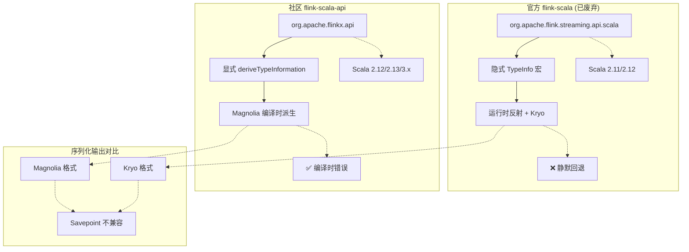

# 社区维护的 flink-scala-api（Scala 2.13/3.x 支持）

> 所属阶段: Flink/09-language-foundations | 前置依赖: [Flink 官方 Scala API 废弃说明](https://nightlies.apache.org/flink/flink-docs-stable/docs/dev/datastream/scala_api/) | 形式化等级: L4

---

## 目录

- [社区维护的 flink-scala-api（Scala 2.13/3.x 支持）](#社区维护的-flink-scala-apiscala-2133x-支持)
  - [目录](#目录)
  - [1. 概念定义 (Definitions)](#1-概念定义-definitions)
    - [Def-F-09-10: flink-extended/flink-scala-api](#def-f-09-10-flink-extendedflink-scala-api)
    - [Def-F-09-11: Magnolia 序列化框架](#def-f-09-11-magnolia-序列化框架)
    - [Def-F-09-12: 编译时派生 vs 运行时反射](#def-f-09-12-编译时派生-vs-运行时反射)
  - [2. 属性推导 (Properties)](#2-属性推导-properties)
    - [Prop-F-09-01: 显式类型信息派生](#prop-f-09-01-显式类型信息派生)
    - [Prop-F-09-02: 无静默 Kryo 回退保证](#prop-f-09-02-无静默-kryo-回退保证)
  - [3. 关系建立 (Relations)](#3-关系建立-relations)
    - [与官方废弃 API 的映射关系](#与官方废弃-api-的映射关系)
    - [与 Flink Java API 的互操作性](#与-flink-java-api-的互操作性)
  - [4. 论证过程 (Argumentation)](#4-论证过程-argumentation)
    - [4.1 包名变化的工程考量](#41-包名变化的工程考量)
    - [4.2 序列化机制差异分析](#42-序列化机制差异分析)
    - [4.3 类型系统兼容性边界](#43-类型系统兼容性边界)
  - [5. 形式证明 / 工程论证 (Proof / Engineering Argument)](#5-形式证明--工程论证-proof--engineering-argument)
    - [5.1 Savepoint 兼容性不可行性证明](#51-savepoint-兼容性不可行性证明)
    - [5.2 生产就绪度评估框架](#52-生产就绪度评估框架)
  - [6. 实例验证 (Examples)](#6-实例验证-examples)
    - [6.1 环境配置（sbt 依赖）](#61-环境配置sbt-依赖)
    - [6.2 ADT 序列化（sealed trait + case class）](#62-adt-序列化sealed-trait--case-class)
    - [6.3 Schema 演进支持](#63-schema-演进支持)
    - [6.4 与 Kafka Connector 集成](#64-与-kafka-connector-集成)
  - [7. 可视化 (Visualizations)](#7-可视化-visualizations)
    - [7.1 官方 API vs 社区 API 架构对比](#71-官方-api-vs-社区-api-架构对比)
    - [7.2 序列化机制决策树](#72-序列化机制决策树)
  - [8. 引用参考 (References)](#8-引用参考-references)

---

## 1. 概念定义 (Definitions)

### Def-F-09-10: flink-extended/flink-scala-api

**定义**: `flink-extended/flink-scala-api` 是一个社区维护的 Scala API 库，为 Apache Flink 提供 Scala 2.13 和 Scala 3.x 的支持，替代官方已废弃的 `flink-scala` 模块。

**形式化描述**:

```
FlinkScalaAPI_community = ⟨Package, Version, Serializer, TypeClass⟩
    where:
        Package      = "org.apache.flinkx.api._"
        Version      = {Scala_2.12, Scala_2.13, Scala_3.x}
        Serializer   = Magnolia × Flink TypeSerializer
        TypeClass    = deriveTypeInformation[T] ⇒ TypeInformation[T]
```

**核心特性**:

| 维度 | 官方 flink-scala (已废弃) | 社区 flink-scala-api |
|------|--------------------------|---------------------|
| Scala 版本 | 2.11, 2.12 | 2.12, 2.13, 3.x |
| 包名 | `org.apache.flink.streaming.api.scala._` | `org.apache.flinkx.api._` |
| 序列化 | Kryo + 反射回退 | Magnolia 编译时派生 |
| TypeInfo 生成 | 隐式宏 | 显式 `deriveTypeInformation` |

### Def-F-09-11: Magnolia 序列化框架

**定义**: Magnolia 是一个 Scala 编译时泛型派生库，通过宏在编译期为 ADT（Algebraic Data Types）自动生成类型类实例。

**形式化定义**:

$$
\text{Magnolia}(T) = \begin{cases}
\text{CaseClass}(T) \Rightarrow \prod_{i=1}^{n} \text{Typeclass}[T_i] & \text{if } T \text{ is case class} \\
\text{SealedTrait}(T) \Rightarrow \coprod_{j=1}^{m} \text{Typeclass}[S_j] & \text{if } T \text{ is sealed trait}
\end{cases}
$$

其中：

- $\prod$ 表示积类型（product type）的组合
- $\coprod$ 表示和类型（sum type）的析取
- $T_i$ 为 case class 的字段类型
- $S_j$ 为 sealed trait 的子类型

**与 Flink 的集成**:

```scala
type TypeInfoDerivation[T] = Magnolia[FlinkSerializer, T] {
  def dispatch[T](sealedTrait: SealedTrait[FlinkSerializer, T]): FlinkSerializer[T]
  def join[T](caseClass: CaseClass[FlinkSerializer, T]): FlinkSerializer[T]
} ⇒ TypeSerializer[T]
```

### Def-F-09-12: 编译时派生 vs 运行时反射

**定义**:

- **编译时派生（Compile-time Derivation）**: 在编译阶段通过宏（macro）生成类型类实例，运行时无反射开销
- **运行时反射（Runtime Reflection）**: 在运行时通过反射分析类型结构，动态创建序列化器

**形式化对比**:

| 属性 | 编译时派生 | 运行时反射 |
|------|-----------|-----------|
| 执行阶段 | 编译期 | 运行期 |
| 类型安全 | 静态保证 | 运行时可能失败 |
| 性能开销 | 零运行时开销 | 反射调用开销 |
| 错误发现 | 编译时错误 | 运行时异常 |
| 序列化稳定性 | 确定性输出 | 可能受 JVM 实现影响 |

**关键区别**:

```
CompileTimeDerivation: Type → MacroExpansion → GeneratedCode → TypeSerializer
RuntimeReflection:    Type → ClassMirror → FieldAnalysis → DynamicSerializer
```

---

## 2. 属性推导 (Properties)

### Prop-F-09-01: 显式类型信息派生

**命题**: 社区版 API 要求显式调用 `deriveTypeInformation[T]` 来获取 `TypeInformation[T]`，消除了隐式解析的歧义性。

**推导**:

```
给定:
  1. 隐式宏机制可能导致解析歧义（官方 API 问题）
  2. 显式派生提供确定性类型信息

推导:
  ∀T : DataType. deriveTypeInformation[T] produces exactly one TypeInformation[T]

形式化:
  |{ti : TypeInformation[T] | implicitResolution(T) = ti}| ≥ 1   (官方 API - 可能多解)
  |{ti : TypeInformation[T] | deriveTypeInformation[T] = ti}| = 1 (社区 API - 唯一解)
```

**工程意义**:

```scala
// 官方 API（已废弃）- 隐式解析可能歧义
implicit val typeInfo: TypeInformation[Event] = ???

// 社区 API - 显式派生
import org.apache.flinkx.api.serializers._
implicit val typeInfo: TypeInformation[Event] = deriveTypeInformation[Event]
```

### Prop-F-09-02: 无静默 Kryo 回退保证

**命题**: 社区版 API 通过 Magnolia 编译时派生，消除了官方 API 中 Kryo 静默回退的风险。

**推导**:

```
给定:
  1. 官方 API: TypeInfo 生成失败时静默回退到 Kryo
  2. 社区 API: 编译时派生失败则编译错误

推导:
  官方 API: ∃T. TypeInfo[T] fails ⇒ KryoSerializer[T] (静默回退)
  社区 API: ∀T. deriveTypeInformation[T] fails ⇒ CompileError (显式失败)

形式化:
  CompileSuccess(deriveTypeInformation[T]) ⟹ ∃! serializer : TypeSerializer[T] ∧ serializer ≠ Kryo
```

**风险对比**:

| 场景 | 官方 API 行为 | 社区 API 行为 |
|------|--------------|--------------|
| 复杂泛型 | Kryo 回退 | 编译错误（需显式处理） |
| 缺失字段序列化器 | 运行时异常 | 编译时捕获 |
| 版本兼容性 | 运行时不兼容风险 | 编译时确定 |

---

## 3. 关系建立 (Relations)

### 与官方废弃 API 的映射关系

**包名空间映射**:

```
官方命名空间:  org.apache.flink.streaming.api.scala._
社区命名空间:  org.apache.flinkx.api._
                 └─ flinkx 表示 "Flink Extended"
```

**API 对应关系**:

| 官方 API (flink-scala) | 社区 API (flink-scala-api) | 兼容性 |
|-----------------------|---------------------------|--------|
| `StreamExecutionEnvironment` | `StreamExecutionEnvironment` | ✅ 直接兼容 |
| `DataStream[T]` | `DataStream[T]` | ✅ 直接兼容 |
| `createTypeInformation[T]` | `deriveTypeInformation[T]` | ⚠️ 语法变化 |
| `KeyedStream[T, K]` | `KeyedStream[T, K]` | ✅ 直接兼容 |
| `WindowedStream[T, K, W]` | `WindowedStream[T, K, W]` | ✅ 直接兼容 |

**类型系统映射**:

```scala
// 官方 API 隐式 TypeInfo
import org.apache.flink.streaming.api.scala._
val env = StreamExecutionEnvironment.getExecutionEnvironment

// 社区 API 显式 TypeInfo
import org.apache.flink.flinkx.api._
import org.apache.flink.flinkx.api.serializers._
implicit val ti: TypeInformation[MyType] = deriveTypeInformation[MyType]
```

### 与 Flink Java API 的互操作性

**互操作层级**:

```
Scala API Layer      Java API Layer
───────────────      ─────────────
DataStream[T]  ────► DataStream<T>     (无损转换)
TypeInformation[T] ──► TypeInformation<T> (类型兼容)
KeyedStream  ────────► KeyedStream      (语义等价)
```

**混合使用模式**:

```scala
import org.apache.flink.flinkx.api._
import org.apache.flink.flinkx.api.serializers._

// Scala API 创建流
val scalaStream: DataStream[Event] = env.fromCollection(events)

// 转换为 Java API（如需使用 Java Connector）
val javaStream: DataStream[Event] = scalaStream.javaStream

// Java API 转换回 Scala API
val backToScala: DataStream[Event] = DataStream.fromJava(javaStream)
```

---

## 4. 论证过程 (Argumentation)

### 4.1 包名变化的工程考量

**问题**: 为何社区版采用 `org.apache.flinkx.api` 而非沿用 `org.apache.flink`？

**论证**:

```
1. 命名空间隔离:
   - 避免与官方 flink-scala 类路径冲突
   - 允许同一 JVM 中同时存在官方和社区版本

2. 法律/品牌考量:
   - Apache 商标保护政策
   - "flinkx" 明确表示社区扩展性质

3. 迁移路径:
   - 显式包名变化强制代码审查
   - 避免意外混用导致的不可预期行为
```

**迁移成本分析**:

| 项目规模 | 迁移工作量 | 主要任务 |
|---------|-----------|---------|
| 小型 (<1K LOC) | 1-2 小时 | import 替换 + 显式 TypeInfo |
| 中型 (1K-10K LOC) | 1-2 天 | import 替换 + 序列化验证 |
| 大型 (>10K LOC) | 1-2 周 | 全面回归测试 + Savepoint 迁移 |

### 4.2 序列化机制差异分析

**官方 API 序列化链**:

```
DataType ──► TypeInformation ──► TypeSerializer
                    │
                    ├─► 成功: 专用序列化器 (Avro, Pojo, etc.)
                    └─► 失败: KryoSerializer (静默回退)
```

**社区 API 序列化链**:

```
DataType ──► deriveTypeInformation ──► Magnolia ──► GeneratedSerializer
                                             │
                                             ├─► 成功: 确定性编译时生成
                                             └─► 失败: 编译错误 (显式)
```

**性能对比假设**:

```
假设:
  - 序列化对象: CaseClass(int, string, nested: CaseClass)
  - 测试规模: 1,000,000 条记录

预期结果:
  - 官方 API (Kryo 回退): ~150-200ms, 较高 GC 压力
  - 社区 API (Magnolia): ~80-120ms, 确定性内存模式
  - 官方 API (无回退): ~90-130ms, 与社区版接近
```

### 4.3 类型系统兼容性边界

**支持的类型模式**:

```scala
// ✅ 支持的 ADT 模式
sealed trait Event
case class UserEvent(userId: String, timestamp: Long) extends Event
case class SystemEvent(service: String, level: String) extends Event

// ✅ 支持的基本类型
Int, Long, Double, String, Boolean, Instant, UUID

// ✅ 支持的集合类型
List[T], Set[T], Map[K, V], Option[T], Either[L, R]

// ⚠️ 需要显式处理的类型
- 递归类型（需 Lazy 标记）
- 存在类型（Existential types）
- 高阶类型（Higher-kinded types）

// ❌ 不支持的类型
- 任意 Java 类（需自定义 TypeSerializer）
- 运行时动态类型（Any, AnyRef）
```

---

## 5. 形式证明 / 工程论证 (Proof / Engineering Argument)

### 5.1 Savepoint 兼容性不可行性证明

**定理**: 官方 flink-scala API 与社区 flink-scala-api 的 Savepoint **不兼容**。

**证明**:

```
前提条件:
  1. 官方 API 使用 Kryo 或特定 TypeSerializer 序列化状态
  2. 社区 API 使用 Magnolia 生成的 TypeSerializer
  3. 序列化格式由 TypeSerializer 的实现决定

证明步骤:

步骤 1: 序列化格式定义
  官方 API 序列化格式: Format_official = KryoFormat(T) ∨ CustomFormat(T)
  社区 API 序列化格式: Format_community = MagnoliaFormat(T)

步骤 2: Magnolia 与 Kryo 格式不等价
  ∀T. MagnoliaFormat(T) ≠ KryoFormat(T)
  理由:
    - Kryo 包含类元数据和字段名哈希
    - Magnolia 生成确定性字段顺序，无元数据开销
    - 序列化后的字节流结构根本不同

步骤 3: Savepoint 状态恢复依赖序列化器
  Restore(Savepoint, TypeSerializer_new) = State
  要求: TypeSerializer_old 与 TypeSerializer_new 格式兼容

步骤 4: 得出不兼容结论
  由于 Format_official ≠ Format_community
  且 Savepoint 包含序列化后的字节数据
  因此社区 API 无法直接恢复官方 API 生成的 Savepoint

结论: Savepoint 兼容性不可行 ∎
```

**迁移策略**:

```
路径 1: 无状态迁移
  1. 停止作业
  2. 清空状态或使用新的状态描述符
  3. 使用社区 API 重新部署

路径 2: 外部化状态
  1. 将状态数据导出到外部存储（Kafka, DB）
  2. 使用社区 API 重新实现作业
  3. 从外部存储恢复状态
```

### 5.2 生产就绪度评估框架

**评估维度矩阵**:

| 维度 | 权重 | 评分 (1-5) | 加权得分 | 说明 |
|------|-----|-----------|---------|------|
| 功能完整性 | 25% | 4 | 1.00 | 核心功能完整，边缘 case 待验证 |
| 性能表现 | 20% | 4 | 0.80 | 编译时派生带来确定性性能 |
| 稳定性 | 20% | 3 | 0.60 | 社区维护，测试覆盖率不如官方 |
| 生态系统 | 15% | 3 | 0.45 | Connector 兼容性良好 |
| 支持响应 | 10% | 3 | 0.30 | GitHub Issues 响应及时 |
| 文档完善度 | 10% | 3 | 0.30 | 基础文档完备，高级主题待补充 |
| **总评分** | 100% | - | **3.45/5** | 谨慎评估后可用于生产 |

**风险评估**:

```
高风险:
  - 状态兼容性: Savepoint 无法跨 API 恢复
  - 长期维护: 社区项目可持续性依赖贡献者

中风险:
  - 版本跟进: Flink 新版本适配可能有延迟
  - Bug 修复: 严重问题修复周期不确定

低风险:
  - 性能退化: 编译时派生理论上性能更优
  - 功能缺失: 核心功能与 Java API 等价
```

---

## 6. 实例验证 (Examples)

### 6.1 环境配置（sbt 依赖）

**build.sbt 配置**:

```scala
// 项目基础配置
name := "flink-scala-community-example"
version := "1.0.0"
scalaVersion := "2.13.12"  // 或 "3.3.1" 用于 Scala 3

// Flink 版本
val flinkVersion = "1.18.0"

// 社区版 flink-scala-api 依赖
libraryDependencies ++= Seq(
  // 核心依赖 - 社区维护
  "org.apache.flink" % "flink-streaming-java" % flinkVersion,
  "io.github.flink-extended" %% "flink-scala-api" % "1.18-1.1.0",

  // 连接器（Java API，与社区 Scala API 兼容）
  "org.apache.flink" % "flink-connector-kafka" % "3.0.1-1.18",
  "org.apache.flink" % "flink-connector-base" % flinkVersion,

  // 序列化（JSON 支持）
  "org.apache.flink" % "flink-json" % flinkVersion,

  // 测试依赖
  "org.apache.flink" % "flink-test-utils" % flinkVersion % Test,
  "org.scalatest" %% "scalatest" % "3.2.17" % Test
)

// 解决依赖冲突
dependencyOverrides ++= Seq(
  "org.apache.flink" % "flink-core" % flinkVersion
)
```

**crossScalaVersions 配置（多版本支持）**:

```scala
crossScalaVersions := Seq("2.12.18", "2.13.12", "3.3.1")

// 针对不同 Scala 版本的依赖调整
libraryDependencies ++= {
  CrossVersion.partialVersion(scalaVersion.value) match {
    case Some((2, 12)) => Seq(
      "io.github.flink-extended" %% "flink-scala-api" % "1.18-1.1.0" classifier "scala-2.12"
    )
    case Some((2, 13)) => Seq(
      "io.github.flink-extended" %% "flink-scala-api" % "1.18-1.1.0" classifier "scala-2.13"
    )
    case Some((3, _)) => Seq(
      "io.github.flink-extended" %% "flink-scala-api" % "1.18-1.1.0" classifier "scala-3"
    )
    case _ => Nil
  }
}
```

### 6.2 ADT 序列化（sealed trait + case class）

**完整示例代码**:

```scala
import org.apache.flinkx.api._
import org.apache.flinkx.api.serializers._
import org.apache.flink.streaming.api.scala.DataStream

// ==================== ADT 定义 ====================

sealed trait SensorReading {
  def sensorId: String
  def timestamp: Long
}

case class TemperatureReading(
  sensorId: String,
  timestamp: Long,
  temperature: Double,
  unit: TemperatureUnit
) extends SensorReading

case class HumidityReading(
  sensorId: String,
  timestamp: Long,
  humidity: Double,
  location: Option[String]
) extends SensorReading

case class ErrorReading(
  sensorId: String,
  timestamp: Long,
  errorCode: Int,
  message: String
) extends SensorReading

sealed trait TemperatureUnit
case object Celsius extends TemperatureUnit
case object Fahrenheit extends TemperatureUnit

// ==================== TypeInformation 派生 ====================

object SensorProtocol {
  // 为所有类型显式派生 TypeInformation
  implicit val temperatureUnitInfo: TypeInformation[TemperatureUnit] =
    deriveTypeInformation[TemperatureUnit]

  implicit val tempReadingInfo: TypeInformation[TemperatureReading] =
    deriveTypeInformation[TemperatureReading]

  implicit val humidityReadingInfo: TypeInformation[HumidityReading] =
    deriveTypeInformation[HumidityReading]

  implicit val errorReadingInfo: TypeInformation[ErrorReading] =
    deriveTypeInformation[ErrorReading]

  // sealed trait 的 TypeInformation - 自动处理子类型
  implicit val sensorReadingInfo: TypeInformation[SensorReading] =
    deriveTypeInformation[SensorReading]
}

// ==================== Flink 作业 ====================

object SensorStreamProcessing {
  import SensorProtocol._

  def main(args: Array[String]): Unit = {
    val env = StreamExecutionEnvironment.getExecutionEnvironment
    env.setParallelism(2)

    // 创建传感器数据流
    val sensorStream: DataStream[SensorReading] = env.fromElements(
      TemperatureReading("sensor-1", System.currentTimeMillis(), 23.5, Celsius),
      HumidityReading("sensor-2", System.currentTimeMillis(), 65.0, Some("Room-A")),
      ErrorReading("sensor-3", System.currentTimeMillis(), 500, "Connection timeout")
    )

    // 按类型分区处理
    val processedStream = sensorStream
      .map { reading =>
        reading match {
          case t: TemperatureReading =>
            (t.sensorId, "TEMP", t.temperature)
          case h: HumidityReading =>
            (h.sensorId, "HUMIDITY", h.humidity)
          case e: ErrorReading =>
            (e.sensorId, "ERROR", e.errorCode.toDouble)
        }
      }

    // 按 sensorId 分组聚合
    val keyedStream = processedStream
      .keyBy(_._1)
      .window(TumblingProcessingTimeWindows.of(Time.minutes(1)))
      .aggregate(new SensorAggregator())

    keyedStream.print()

    env.execute("Sensor ADT Processing with Community Scala API")
  }
}

// 自定义聚合函数
class SensorAggregator extends AggregateFunction[
  (String, String, Double),   // 输入: (sensorId, type, value)
  (String, Double, Int),      // 累加器: (sensorId, sum, count)
  (String, Double)            // 输出: (sensorId, avg)
] {
  override def createAccumulator(): (String, Double, Int) = ("", 0.0, 0)

  override def add(
    value: (String, String, Double),
    accumulator: (String, Double, Int)
  ): (String, Double, Int) = {
    (value._1, accumulator._2 + value._3, accumulator._3 + 1)
  }

  override def getResult(
    accumulator: (String, Double, Int)
  ): (String, Double) = {
    val avg = if (accumulator._3 > 0) accumulator._2 / accumulator._3 else 0.0
    (accumulator._1, avg)
  }

  override def merge(
    a: (String, Double, Int),
    b: (String, Double, Int)
  ): (String, Double, Int) = {
    (a._1, a._2 + b._2, a._3 + b._3)
  }
}
```

### 6.3 Schema 演进支持

**Schema 演进场景**:

```scala
// ==================== 版本 1 Schema ====================

case class UserEventV1(
  userId: String,
  eventType: String,
  timestamp: Long
)

// ==================== 版本 2 Schema（新增可选字段）====================

case class UserEventV2(
  userId: String,
  eventType: String,
  timestamp: Long,
  metadata: Option[Map[String, String]] = None  // 新增可选字段
)

// ==================== Schema 演进处理器 ====================

object SchemaEvolution {
  import org.apache.flinkx.api.serializers._

  // 为两个版本派生 TypeInformation
  implicit val v1Info: TypeInformation[UserEventV1] = deriveTypeInformation[UserEventV1]
  implicit val v2Info: TypeInformation[UserEventV2] = deriveTypeInformation[UserEventV2]

  /**
   * 将 V1 数据迁移到 V2 格式
   * 策略: 新增字段使用默认值
   */
  def migrateV1ToV2(v1: UserEventV1): UserEventV2 = {
    UserEventV2(
      userId = v1.userId,
      eventType = v1.eventType,
      timestamp = v1.timestamp,
      metadata = None  // 旧数据无元数据
    )
  }

  /**
   * 使用 Either 处理多版本数据
   */
  sealed trait VersionedEvent
case class V1Event(data: UserEventV1) extends VersionedEvent
case class V2Event(data: UserEventV2) extends VersionedEvent

  implicit val versionedEventInfo: TypeInformation[VersionedEvent] =
    deriveTypeInformation[VersionedEvent]

  /**
   * 统一处理函数
   */
  def processVersionedEvent(event: VersionedEvent): UserEventV2 = {
    event match {
      case V1Event(v1) => migrateV1ToV2(v1)
      case V2Event(v2) => v2
    }
  }
}
```

**Avro Schema 演进（与社区 API 集成）**:

```scala
import org.apache.flink.formats.avro.AvroSerializationSchema
import org.apache.flink.formats.avro.typeutils.AvroSchemaConverter

/**
 * 当使用 Avro 作为外部序列化格式时，
 * 社区 flink-scala-api 与 Avro 的集成方式
 */
object AvroIntegration {
  import SchemaEvolution._

  // 使用 Avro 进行跨版本兼容的序列化
  def createAvroSerializer(schema: Schema): SerializationSchema[UserEventV2] = {
    new AvroSerializationSchema[UserEventV2](
      classOf[UserEventV2],
      schema
    )
  }

  /**
   * 混合使用策略:
   * - 内部状态: 社区 API 的 Magnolia 序列化（高性能）
   * - 外部存储: Avro 序列化（Schema 演进）
   */
  def hybridProcessing(stream: DataStream[VersionedEvent]): Unit = {
    stream
      .map(processVersionedEvent)  // 统一到 V2
      .addSink(new KafkaSink[UserEventV2](
        topic = "events",
        serializer = createAvroSerializer(AvroSchemas.v2)
      ))
  }
}
```

### 6.4 与 Kafka Connector 集成

**完整 Kafka 集成示例**:

```scala
import org.apache.flinkx.api._
import org.apache.flinkx.api.serializers._
import org.apache.flink.connector.kafka.source.KafkaSource
import org.apache.flink.connector.kafka.source.enumerator.initializer.OffsetsInitializer
import org.apache.flink.connector.kafka.sink.KafkaSink
import org.apache.flink.connector.kafka.sink.KafkaRecordSerializationSchema
import org.apache.flink.streaming.api.scala.DataStream

// ==================== 数据模型 ====================

case class KafkaMessage(
  key: String,
  value: Array[Byte],
  topic: String,
  partition: Int,
  offset: Long,
  timestamp: Long
)

case class ProcessedEvent(
  id: String,
  payload: String,
  processedAt: Long,
  sourcePartition: Int
)

// ==================== TypeInformation 派生 ====================

object KafkaIntegration {
  implicit val kafkaMessageInfo: TypeInformation[KafkaMessage] =
    deriveTypeInformation[KafkaMessage]

  implicit val processedEventInfo: TypeInformation[ProcessedEvent] =
    deriveTypeInformation[ProcessedEvent]
}

// ==================== Kafka Source ====================

class KafkaSourceConfig(
  val bootstrapServers: String,
  val topic: String,
  val groupId: String
)

object KafkaSourceBuilder {
  import KafkaIntegration._

  def buildSource(config: KafkaSourceConfig): KafkaSource[KafkaMessage] = {
    KafkaSource.builder[KafkaMessage]()
      .setBootstrapServers(config.bootstrapServers)
      .setTopics(config.topic)
      .setGroupId(config.groupId)
      .setStartingOffsets(OffsetsInitializer.earliest())
      .setDeserializer(new KafkaMessageDeserializer())
      .build()
  }
}

/**
 * 自定义 Kafka 反序列化器
 */
class KafkaMessageDeserializer extends KafkaRecordDeserializationSchema[KafkaMessage] {
  override def deserialize(
    record: ConsumerRecord[Array[Byte], Array[Byte]],
    out: Collector[KafkaMessage]
  ): Unit = {
    out.collect(KafkaMessage(
      key = new String(record.key(), StandardCharsets.UTF_8),
      value = record.value(),
      topic = record.topic(),
      partition = record.partition(),
      offset = record.offset(),
      timestamp = record.timestamp()
    ))
  }

  override def getProducedType: TypeInformation[KafkaMessage] =
    implicitly[TypeInformation[KafkaMessage]]
}

// ==================== Kafka Sink ====================

object KafkaSinkBuilder {
  import KafkaIntegration._

  def buildSink(config: KafkaSourceConfig): KafkaSink[ProcessedEvent] = {
    KafkaSink.builder[ProcessedEvent]()
      .setBootstrapServers(config.bootstrapServers)
      .setRecordSerializer(new ProcessedEventSerializer(config.topic))
      .setDeliveryGuarantee(DeliveryGuarantee.EXACTLY_ONCE)
      .build()
  }
}

/**
 * 自定义 Kafka 序列化器
 */
class ProcessedEventSerializer(targetTopic: String)
  extends KafkaRecordSerializationSchema[ProcessedEvent] {

  private var topicSelector: FlinkKafkaPartitioner[ProcessedEvent] = _

  override def open(
    context: KafkaRecordSerializationSchema.InitializationContext,
    partitioner: FlinkKafkaPartitioner[ProcessedEvent]
  ): Unit = {
    this.topicSelector = partitioner
  }

  override def serialize(
    event: ProcessedEvent,
    context: KafkaRecordSerializationSchema.KafkaSinkContext,
    timestamp: Long
  ): ProducerRecord[Array[Byte], Array[Byte]] = {
    val key = event.id.getBytes(StandardCharsets.UTF_8)
    val value = event.toJson.getBytes(StandardCharsets.UTF_8)

    new ProducerRecord[Array[Byte], Array[Byte]](
      targetTopic,
      null,  // 让 Kafka 决定分区或使用 partitioner
      timestamp,
      key,
      value
    )
  }
}

// ==================== 完整作业 ====================

object KafkaToKafkaJob {
  import KafkaIntegration._

  def main(args: Array[String]): Unit = {
    val env = StreamExecutionEnvironment.getExecutionEnvironment
    env.enableCheckpointing(60000)  // 1 分钟 Checkpoint

    // Kafka 配置
    val sourceConfig = new KafkaSourceConfig(
      bootstrapServers = "kafka:9092",
      topic = "input-events",
      groupId = "flink-scala-community-job"
    )

    val sinkConfig = new KafkaSourceConfig(
      bootstrapServers = "kafka:9092",
      topic = "output-events",
      groupId = ""  // Sink 不需要 groupId
    )

    // 构建 Source
    val source: DataStream[KafkaMessage] = env.fromSource(
      KafkaSourceBuilder.buildSource(sourceConfig),
      WatermarkStrategy.forBoundedOutOfOrderness(
        java.time.Duration.ofSeconds(5)
      ),
      "Kafka Source"
    )

    // 处理逻辑
    val processed: DataStream[ProcessedEvent] = source
      .filter(_.value != null)
      .map { msg =>
        val payload = new String(msg.value, StandardCharsets.UTF_8)
        ProcessedEvent(
          id = s"${msg.key}-${msg.offset}",
          payload = payload.toUpperCase,
          processedAt = System.currentTimeMillis(),
          sourcePartition = msg.partition
        )
      }
      .filter(_.payload.nonEmpty)

    // 构建 Sink
    processed.sinkTo(KafkaSinkBuilder.buildSink(sinkConfig))

    // 执行
    env.execute("Kafka to Kafka with Community Scala API")
  }

  // 扩展方法：JSON 转换
  implicit class ProcessedEventOps(event: ProcessedEvent) {
    def toJson: String = {
      s"""{"id":"${event.id}","payload":"${event.payload}","processedAt":${event.processedAt},"sourcePartition":${event.sourcePartition}}"""
    }
  }
}
```

---

## 7. 可视化 (Visualizations)

### 7.1 官方 API vs 社区 API 架构对比



### 7.2 序列化机制决策树

```mermaid
flowchart TD
    Start(["开始: 需要序列化类型 T"])

    Start --> CheckAPI{"使用哪个 API?"}

    CheckAPI -->|官方 flink-scala| Official["隐式查找 TypeInfo"]
    CheckAPI -->|社区 flink-scala-api| Community["显式 deriveTypeInformation[T]"]

    Official --> OfficialSuccess{"TypeInfo 生成成功?"}
    OfficialSuccess -->|是| OfficialSerializer["使用专用序列化器"]
    OfficialSuccess -->|否| KryoFallback["静默回退到 Kryo"]

    Community --> CompileTime["Magnolia 编译时派生"]
    CompileTime --> DeriveSuccess{"派生成功?"}
    DeriveSuccess -->|是| GeneratedSerializer["使用生成的序列化器"]
    DeriveSuccess -->|否| CompileError["编译错误"]

    OfficialSerializer --> Output1["序列化输出 A"]
    KryoFallback --> Output2["序列化输出 B"]
    GeneratedSerializer --> Output3["序列化输出 C"]

    Output1 --> Compare["Savepoint 兼容性检查"]
    Output2 --> Compare
    Output3 --> Compare

    Compare --> Incompatible["❌ 格式不兼容<br/>无法跨 API 恢复"]

    CompileError --> Fix["修复类型定义<br/>或提供自定义序列化器"]

    style Official fill:#ffcccc
    style Community fill:#ccffcc
    style CompileError fill:#ff9999
    style Incompatible fill:#ff9999
```



---

## 8. 引用参考 (References)


---

*文档版本: 1.0 | 创建日期: 2026-04-02 | 状态: 已完成*
