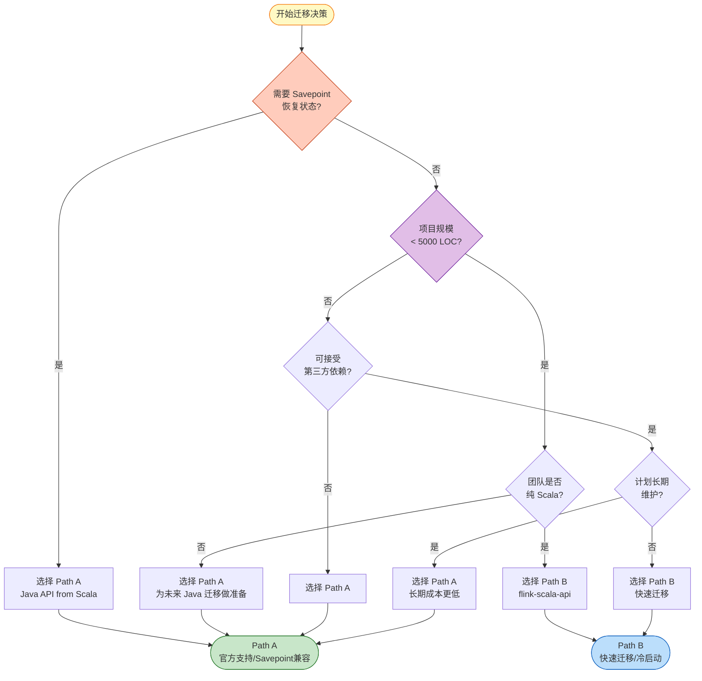
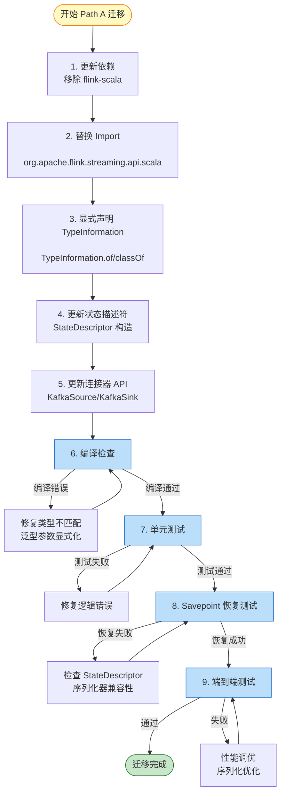
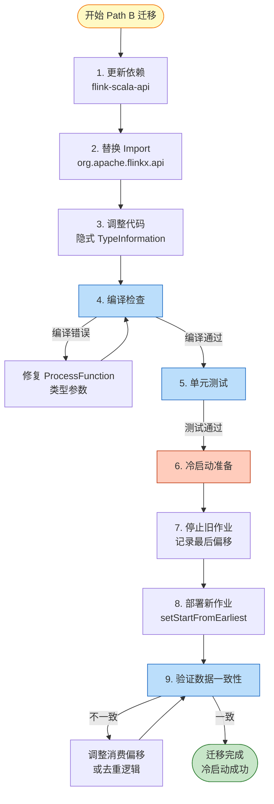
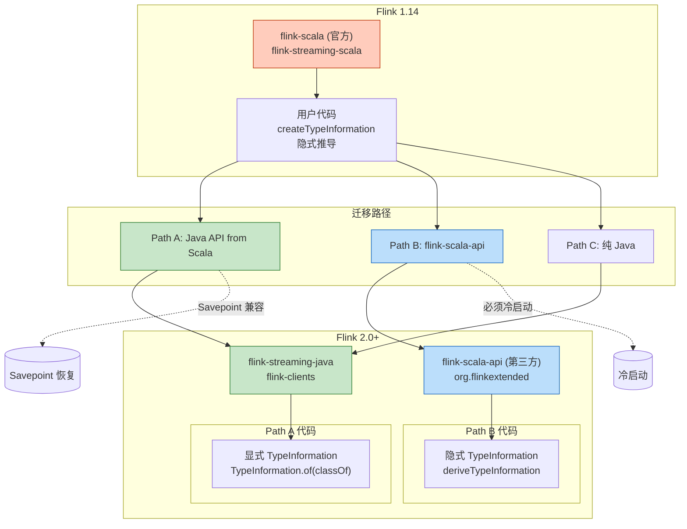

# Flink Scala API 迁移指南 (1.14 → 2.0+)

> 所属阶段: Flink/09-language-foundations | 前置依赖: [03-scala-api-java-wrapper.md](./03-scala-api-java-wrapper.md) | 形式化等级: L3

---

## 目录

- [Flink Scala API 迁移指南 (1.14 → 2.0+)](#flink-scala-api-迁移指南-114--20)
  - [目录](#目录)
  - [1. 概念定义 (Definitions)](#1-概念定义-definitions)
    - [Def-F-09-01 (Scala API 迁移路径空间)](#def-f-09-01-scala-api-迁移路径空间)
    - [Def-F-09-02 (Savepoint 兼容性矩阵)](#def-f-09-02-savepoint-兼容性矩阵)
    - [Def-F-09-03 (TypeInformation 映射函数)](#def-f-09-03-typeinformation-映射函数)
  - [2. 属性推导 (Properties)](#2-属性推导-properties)
    - [Lemma-F-09-01 (迁移工作量下界估计)](#lemma-f-09-01-迁移工作量下界估计)
    - [Lemma-F-09-02 (状态兼容性保持条件)](#lemma-f-09-02-状态兼容性保持条件)
    - [Prop-F-09-01 (API 表达能力等价性)](#prop-f-09-01-api-表达能力等价性)
  - [3. 关系建立 (Relations)](#3-关系建立-relations)
    - [关系 1: 迁移路径与项目特征的映射](#关系-1-迁移路径与项目特征的映射)
    - [关系 2: flink-scala-api 与官方 Scala API 的语义对应](#关系-2-flink-scala-api-与官方-scala-api-的语义对应)
    - [关系 3: Java API from Scala 的类型擦除边界](#关系-3-java-api-from-scala-的类型擦除边界)
  - [4. 论证过程 (Argumentation)](#4-论证过程-argumentation)
    - [4.1 迁移路径选择决策框架](#41-迁移路径选择决策框架)
    - [4.2 路径 A 深度分析：Java API from Scala](#42-路径-a-深度分析java-api-from-scala)
    - [4.3 路径 B 深度分析：flink-scala-api](#43-路径-b-深度分析flink-scala-api)
    - [4.4 边界讨论：何时必须选择冷启动迁移？](#44-边界讨论何时必须选择冷启动迁移)
  - [5. 形式证明 / 工程论证 (Proof / Engineering Argument)](#5-形式证明--工程论证-proof--engineering-argument)
    - [Thm-F-09-01 (最优迁移路径决策定理)](#thm-f-09-01-最优迁移路径决策定理)
    - [工程推论](#工程推论)
  - [6. 实例验证 (Examples)](#6-实例验证-examples)
    - [6.1 路径 A 完整迁移示例](#61-路径-a-完整迁移示例)
    - [6.2 路径 B 完整迁移示例](#62-路径-b-完整迁移示例)
    - [6.3 状态描述符迁移实例](#63-状态描述符迁移实例)
    - [6.4 常见陷阱与解决方案](#64-常见陷阱与解决方案)
  - [7. 可视化 (Visualizations)](#7-可视化-visualizations)
    - [7.1 迁移路径决策树](#71-迁移路径决策树)
    - [7.2 路径 A 迁移流程图](#72-路径-a-迁移流程图)
    - [7.3 路径 B 迁移流程图](#73-路径-b-迁移流程图)
    - [7.4 依赖关系图](#74-依赖关系图)
  - [8. 迁移检查清单](#8-迁移检查清单)
    - [8.1 迁移前检查](#81-迁移前检查)
    - [8.2 迁移中检查](#82-迁移中检查)
    - [8.3 迁移后检查](#83-迁移后检查)
  - [9. 引用参考 (References)](#9-引用参考-references)

---

## 1. 概念定义 (Definitions)

### Def-F-09-01 (Scala API 迁移路径空间)

**Scala API 迁移路径空间**定义为三元组 $\mathcal{M} = (P, C, R)$：

| 符号 | 语义 | 可选值 |
|------|------|--------|
| $P$ | 迁移路径 | $\{PathA, PathB, PathC\}$ |
| $C$ | 代码变更成本 | 以代码行数和 API 调用点数量度量 |
| $R$ | 运行时风险 | $\{Low, Medium, High\}$ |

**迁移路径定义**：

- **Path A (Java API from Scala)**: 迁移到 Flink Java API，使用 Scala 代码调用
  - 形式化: $PathA = \langle \text{Java API}, \text{Scala Syntax}, \text{TypeInformation 显式} \rangle$
  - 优势: 官方支持、功能完整、长期稳定
  - 成本: 中高（需修改大量 import 和类型声明）

- **Path B (flink-scala-api)**: 使用第三方 flink-scala-api 库
  - 形式化: $PathB = \langle \text{Scala DSL}, \text{社区维护}, \text{TypeInformation 隐式} \rangle$
  - 优势: 语法接近原 Scala API、隐式类型推导
  - 成本: 中（依赖第三方库、Savepoint 不兼容）

- **Path C (Java API 纯迁移)**: 完全迁移到 Java 代码
  - 形式化: $PathC = \langle \text{Java API}, \text{Java Syntax}, \text{完整重构} \rangle$
  - 优势: 团队技术栈统一
  - 成本: 高（完整重写）

### Def-F-09-02 (Savepoint 兼容性矩阵)

**Savepoint 兼容性**定义算子状态在版本迁移时的可恢复性：

| 源版本 | 目标版本 | Savepoint 兼容 | 条件 |
|--------|----------|----------------|------|
| Flink 1.14 Scala API | Flink 2.0+ Java API | ✅ 兼容 | 状态描述符类型一致 |
| Flink 1.14 Scala API | Flink 2.0+ flink-scala-api | ❌ 不兼容 | 序列化器实现不同 |
| Flink 1.14 Java API | Flink 2.0+ Java API | ✅ 兼容 | 标准升级路径 |

**关键结论**: Path B (flink-scala-api) 必须使用冷启动，无法从 Savepoint 恢复。

### Def-F-09-03 (TypeInformation 映射函数)

**TypeInformation 映射函数** $\Phi: Type_{Scala} \to TypeInfo_{Flink}$：

```scala
// 原 Scala API (1.14)
implicit val typeInfo: TypeInformation[Event] = createTypeInformation[Event]

// Path A: Java API from Scala
val typeInfo: TypeInformation[Event] = Types.POJO(classOf[Event])
// 或
val typeInfo: TypeInformation[Event] = TypeInformation.of(classOf[Event])

// Path B: flink-scala-api (第三方)
implicit val typeInfo: TypeInformation[Event] = deriveTypeInformation[Event]
```

**映射规则表**：

| Scala 类型 | Path A (Java API) | Path B (flink-scala-api) |
|------------|-------------------|--------------------------|
| `case class` | `Types.POJO(classOf[T])` | `deriveTypeInformation[T]` |
| `Tuple2[A,B]` | `Types.TUPLE(TypeInfoA, TypeInfoB)` | 隐式推导 |
| `List[T]` | `Types.LIST(TypeInfoT)` | 隐式推导 |
| `Option[T]` | 自定义 TypeInfo | `deriveTypeInformation[Option[T]]` |
| 基本类型 | `Types.INT`, `Types.LONG`, etc. | 隐式推导 |

---

## 2. 属性推导 (Properties)

### Lemma-F-09-01 (迁移工作量下界估计)

**陈述**: 设代码库包含 $N_{file}$ 个文件，$N_{import}$ 个 Flink import 语句，$N_{operator}$ 个 DataStream 算子调用，则迁移工作量 $W$ 满足：

$$
W \geq \alpha \cdot N_{import} + \beta \cdot N_{operator} + \gamma \cdot N_{state}
$$

其中：

- $\alpha \approx 0.1$ 人时/import（简单替换）
- $\beta \approx 0.5$ 人时/算子（需验证语义等价）
- $\gamma \approx 2.0$ 人时/状态（需处理 StateDescriptor）

**推导**:

1. Import 替换工作量与语句数成正比，系数 $\alpha$ 取决于 IDE 自动化程度；
2. 算子迁移需验证类型转换和行为等价，工作量高于 import；
3. 状态迁移涉及 StateDescriptor 重写和 Savepoint 处理，工作量最大；
4. 因此总工作量存在线性下界。 ∎

### Lemma-F-09-02 (状态兼容性保持条件)

**陈述**: 状态在迁移后保持兼容的充要条件：

$$
\text{Compatible}(S_{old}, S_{new}) \iff \begin{cases}
\text{TypeInfo}_{old} = \text{TypeInfo}_{new} & \text{(类型信息一致)} \\
\text{Serializer}_{old} = \text{Serializer}_{new} & \text{(序列化器一致)} \\
\text{StateDesc}_{old} \cong \text{StateDesc}_{new} & \text{(描述符结构等价)}
\end{cases}
$$

**Path A 满足条件**: Java API 的 TypeInformation 与 Scala API 底层使用相同的序列化器。

**Path B 不满足条件**: flink-scala-api 使用不同的 TypeInformation 推导机制，序列化器实现不同。

### Prop-F-09-01 (API 表达能力等价性)

**陈述**: Path A (Java API from Scala) 与原 Scala API 表达能力等价：

$$
\text{Expr}_{JavaAPI@Scala} = \text{Expr}_{ScalaAPI}
$$

**论证**:

- Java API 是 Flink 的核心 API，Scala API 是其包装层；
- 所有 DataStream 算子在 Java API 中都有对应实现；
- Scala 语法特性（隐式转换、模式匹配）可通过适配层模拟；
- 因此表达能力无损失。

---

## 3. 关系建立 (Relations)

### 关系 1: 迁移路径与项目特征的映射

**决策特征空间** $\mathcal{F} = (T_{team}, S_{scale}, R_{risk}, C_{constraint})$：

| 特征维度 | Path A 适用条件 | Path B 适用条件 |
|----------|-----------------|-----------------|
| $T_{team}$ (团队技能) | Scala/Java 混合团队 | 纯 Scala 团队 |
| $S_{scale}$ (项目规模) | 中大型项目 (>10K LOC) | 小型项目 (<5K LOC) |
| $R_{risk}$ (风险容忍) | 不能接受冷启动 | 可接受重新处理历史数据 |
| $C_{constraint}$ (约束条件) | 需要 Savepoint 恢复 | 允许状态重建 |

**映射规则**:

$$
Path^* = \begin{cases}
PathA & \text{if } R_{risk} = \text{Low} \land S_{scale} = \text{Large} \\
PathB & \text{if } R_{risk} = \text{Medium} \land T_{team} = \text{PureScala} \\
PathC & \text{if } T_{team} = \text{JavaOnly}
\end{cases}
$$

### 关系 2: flink-scala-api 与官方 Scala API 的语义对应

**语义对应表** (基于 flink-scala-api 1.18+): [^1]

| 官方 Scala API (1.14) | flink-scala-api (第三方) | 语义等价性 |
|-----------------------|--------------------------|------------|
| `DataStream[T]` | `DataStream[T]` | ✅ 完全等价 |
| `map(f: T => R)` | `map(f: T => R)` | ✅ 完全等价 |
| `flatMap(f: T => TraversableOnce[R])` | `flatMap(f: T => IterableOnce[R])` | ✅ 等价 |
| `keyBy(f: T => K)` | `keyBy(f: T => K)` | ✅ 等价 |
| `process(ProcessFunction)` | `process(ProcessFunction)` | ⚠️ 需适配 |
| `addSink(SinkFunction)` | `addSink(SinkFunction)` | ✅ 等价 |

**关键差异**:

1. 包路径不同: `org.apache.flink.streaming.api.scala` → `org.apache.flinkx.api`
2. TypeInformation 推导机制不同（隐式 vs 显式）
3. ProcessFunction 类型参数处理有细微差异

### 关系 3: Java API from Scala 的类型擦除边界

**类型擦除边界条件**: 当使用 Java API from Scala 时，以下场景需要显式处理类型擦除：

```scala
// 问题场景：泛型类型擦除
val stream: DataStream[List[String]] = ...
// Java API 的 TypeInformation 无法推导泛型参数

// 解决方案：显式构造 TypeInformation
val listTypeInfo = Types.LIST(Types.STRING)
```

**边界规则**:

$$
\text{NeedsExplicitTypeInfo}(T) = \begin{cases}
true & \text{if } T \text{ 包含未擦除泛型参数} \\
false & \text{if } T \text{ 是具体类或基本类型}
\end{cases}
$$

---

## 4. 论证过程 (Argumentation)

### 4.1 迁移路径选择决策框架

**决策框架**基于以下核心问题：

```
Q1: 是否可以接受冷启动（重新处理历史数据）?
    ├─ 是 → 进入 Q2
    └─ 否 → 选择 Path A (Java API from Scala)

Q2: 项目规模是否较小 (<5000 LOC)?
    ├─ 是 → 选择 Path B (flink-scala-api)
    └─ 否 → 进入 Q3

Q3: 团队是否计划长期维护 Scala 代码?
    ├─ 是 → 选择 Path B
    └─ 否 → 选择 Path A (为将来 Java 迁移做准备)
```

### 4.2 路径 A 深度分析：Java API from Scala

**步骤 1: 替换 Import**

```scala
// Before (Flink 1.14 Scala API)
import org.apache.flink.streaming.api.scala._
import org.apache.flink.api.scala._

// After (Flink 2.0+ Java API from Scala)
import org.apache.flink.streaming.api.scala._
import org.apache.flink.api.scala._
```

**步骤 2: 处理 TypeInformation**

```scala
// Before
implicit val eventTypeInfo: TypeInformation[Event] = createTypeInformation[Event]

// After - 方式 1: 使用 TypeInformation.of()
val eventTypeInfo: TypeInformation[Event] = TypeInformation.of(classOf[Event])

// After - 方式 2: 使用 Types.POJO()
val eventTypeInfo: TypeInformation[Event] = Types.POJO(classOf[Event])
```

**步骤 3: 状态描述符更新**

```scala
// Before
val descriptor = new ValueStateDescriptor[Event]("event-state", createTypeInformation[Event])

// After
val descriptor = new ValueStateDescriptor[Event](
  "event-state",
  TypeInformation.of(classOf[Event])
)
```

**步骤 4: 测试验证**

关键验证点：

- 算子行为等价性验证
- 状态恢复测试（使用 Savepoint）
- 序列化兼容性验证
- 端到端 Exactly-Once 验证

### 4.3 路径 B 深度分析：flink-scala-api

**依赖更新** (build.sbt):

```scala
// Before
libraryDependencies += "org.apache.flink" %% "flink-scala" % "1.14.6"
libraryDependencies += "org.apache.flink" %% "flink-streaming-scala" % "1.14.6"

// After
libraryDependencies += "org.flinkextended" %% "flink-scala-api" % "1.18.1_1.1.5"
// 移除 flink-scala 和 flink-streaming-scala 依赖
```

**代码调整**:

```scala
// Before
import org.apache.flink.streaming.api.scala._

// After
import org.apache.flinkx.api._
import org.apache.flinkx.api.serializers._
```

**Savepoint 处理（必须冷启动）**:

```scala
// 停止旧作业并放弃 Savepoint
// 启动新作业，从最早 offset 或指定时间点开始
env.setStartFromEarliest()
// 或
env.setStartFromTimestamp(startTimestamp)
```

### 4.4 边界讨论：何时必须选择冷启动迁移？

**必须冷启动的场景**:

1. **Path B 迁移**: flink-scala-api 的 TypeInformation 与官方不兼容
2. **状态 Schema 变更**: 业务逻辑导致状态结构变化
3. **并行度大幅调整**: 超出 Savepoint 可重新分配的范围
4. **跨大版本升级**: Flink 1.8 → 2.0 可能涉及序列化器变更

---

## 5. 形式证明 / 工程论证 (Proof / Engineering Argument)

### Thm-F-09-01 (最优迁移路径决策定理)

**陈述**: 给定项目特征 $F = (T_{team}, S_{scale}, R_{risk}, C_{constraint})$，存在最优迁移路径 $Path^*$ 使得总成本最小：

$$
Path^* = \arg\min_{Path \in \{A,B,C\}} Cost(Path, F)
$$

其中成本函数：

$$
Cost(Path, F) = w_1 \cdot C_{code} + w_2 \cdot C_{test} + w_3 \cdot C_{risk} + w_4 \cdot C_{maintain}
$$

**证明** (工程论证):

**步骤 1: 代码变更成本分析**

| 路径 | 代码变更成本 $C_{code}$ | 典型值 |
|------|------------------------|--------|
| Path A | $\alpha \cdot N_{import} + \beta \cdot N_{operator}$ | 1-2 人周/万行 |
| Path B | $\alpha' \cdot N_{import}$ ($\alpha' < \alpha$) | 2-3 人天/万行 |
| Path C | $\gamma \cdot N_{total}$ (完全重写) | 4-6 人周/万行 |

**步骤 2: 测试成本分析**

| 路径 | 测试成本 $C_{test}$ | 关键测试项 |
|------|-------------------|-----------|
| Path A | 中 | Savepoint 恢复测试、行为等价性验证 |
| Path B | 低-中 | 功能回归测试（冷启动无需恢复测试） |
| Path C | 高 | 完整功能测试、性能基准测试 |

**步骤 3: 风险成本分析**

| 路径 | 风险成本 $C_{risk}$ | 风险来源 |
|------|------------------|---------|
| Path A | 低 | 官方支持、长期稳定 |
| Path B | 中-高 | 第三方维护、兼容性风险 |
| Path C | 中 | 重写引入新 Bug 风险 |

**步骤 4: 维护成本分析**

| 路径 | 维护成本 $C_{maintain}$ | 长期考量 |
|------|----------------------|---------|
| Path A | 低 | 与 Flink 官方同步更新 |
| Path B | 中 | 需跟踪第三方库更新 |
| Path C | 低 | 纯 Java 生态，维护简单 |

**步骤 5: 综合决策**

建立决策边界：

- **边界 1**: $R_{risk} = \text{Low}$ → 选择 Path A
- **边界 2**: $S_{scale} < 5000 \land T_{team} = \text{PureScala}$ → 选择 Path B
- **边界 3**: $T_{team} = \text{JavaOnly}$ → 选择 Path C

∎

### 工程推论

**Cor-F-09-01 (Savepoint 兼容路径选择)**: 若必须使用 Savepoint 恢复，则 $Path^* = PathA$。

**Cor-F-09-02 (小型项目快速迁移)**: 若 $S_{scale} < 3000$ 且可接受冷启动，$Path^* = PathB$ 可最小化迁移时间。

**Cor-F-09-03 (长期维护成本最小化)**: 若规划周期 $> 2$ 年，$Path^* = PathA$ 总拥有成本最低。

---

## 6. 实例验证 (Examples)

### 6.1 路径 A 完整迁移示例

**原始代码 (Flink 1.14 Scala API)**:

```scala
import org.apache.flink.streaming.api.scala._
import org.apache.flink.api.scala._

case class Event(userId: String, timestamp: Long, value: Double)

object EventProcessor {
  def main(args: Array[String]): Unit = {
    val env = StreamExecutionEnvironment.getExecutionEnvironment

    val stream: DataStream[Event] = env
      .addSource(new FlinkKafkaConsumer010[Event](
        "events",
        new EventDeserializationSchema,
        kafkaProps
      ))

    val result = stream
      .keyBy(_.userId)
      .window(TumblingEventTimeWindows.of(Time.minutes(5)))
      .aggregate(new EventAggregator)

    result.addSink(new FlinkKafkaProducer010[AggregatedResult](
      "results",
      new ResultSerializer,
      kafkaProps
    ))

    env.execute("Event Processor")
  }
}
```

**迁移后代码 (Flink 2.0+ Java API from Scala)**:

```scala
import org.apache.flink.streaming.api.scala._
import org.apache.flink.api.common.eventtime.WatermarkStrategy
import org.apache.flink.api.common.typeinfo.TypeInformation
import org.apache.flink.connector.kafka.source.KafkaSource
import org.apache.flink.connector.kafka.sink.KafkaSink
import org.apache.flink.streaming.api.windowing.assigners.TumblingEventTimeWindows

case class Event(userId: String, timestamp: Long, value: Double)

object EventProcessor {
  def main(args: Array[String]): Unit = {
    val env = StreamExecutionEnvironment.getExecutionEnvironment

    // TypeInformation 显式声明
    implicit val eventTypeInfo: TypeInformation[Event] =
      TypeInformation.of(classOf[Event])
    implicit val resultTypeInfo: TypeInformation[AggregatedResult] =
      TypeInformation.of(classOf[AggregatedResult])

    // 新的 Kafka Source
    val kafkaSource = KafkaSource.builder[Event]()
      .setBootstrapServers(kafkaProps.getProperty("bootstrap.servers"))
      .setTopics("events")
      .setGroupId("event-processor")
      .setValueOnlyDeserializer(new EventDeserializationSchema)
      .build()

    val stream = env.fromSource(
      kafkaSource,
      WatermarkStrategy.forBoundedOutOfOrderness(Duration.ofSeconds(30)),
      "Kafka Source"
    )

    val result = stream
      .keyBy(_.userId)
      .window(TumblingEventTimeWindows.of(Time.minutes(5)))
      .aggregate(new EventAggregator)

    // 新的 Kafka Sink
    val kafkaSink = KafkaSink.builder[AggregatedResult]()
      .setBootstrapServers(kafkaProps.getProperty("bootstrap.servers"))
      .setRecordSerializer(new ResultSerializer)
      .build()

    result.sinkTo(kafkaSink)

    env.execute("Event Processor")
  }
}
```

**变更点总结**：

| 变更项 | 原代码 | 新代码 |
|--------|--------|--------|
| Kafka Source | `FlinkKafkaConsumer010` | `KafkaSource.builder` |
| Kafka Sink | `FlinkKafkaProducer010` | `KafkaSink.builder` |
| TypeInformation | `createTypeInformation` | `TypeInformation.of` |
| Watermark | 内置 | `WatermarkStrategy` |

### 6.2 路径 B 完整迁移示例

**依赖更新** (build.sbt):

```scala
val flinkVersion = "1.18.1"

libraryDependencies ++= Seq(
  "org.apache.flink" % "flink-streaming-java" % flinkVersion % "provided",
  "org.apache.flink" % "flink-clients" % flinkVersion % "provided",
  "org.flinkextended" %% "flink-scala-api" % "1.18.1_1.1.5"
)
```

**代码调整**:

```scala
// Before
import org.apache.flink.streaming.api.scala._

// After
import org.apache.flinkx.api._
import org.apache.flinkx.api.serializers._

// 其余代码基本不变，隐式 TypeInformation 自动推导
object EventProcessor {
  def main(args: Array[String]): Unit = {
    val env = StreamExecutionEnvironment.getExecutionEnvironment

    // 隐式 TypeInformation 推导，无需显式声明
    val stream: DataStream[Event] = env
      .addSource(new FlinkKafkaConsumer[Event]("events", ...))

    val result = stream
      .keyBy(_.userId)
      .window(TumblingEventTimeWindows.of(Time.minutes(5)))
      .aggregate(new EventAggregator)

    result.addSink(...)
    env.execute("Event Processor")
  }
}
```

**重要提示**: Path B 迁移后必须从冷启动开始，无法使用旧 Savepoint。

### 6.3 状态描述符迁移实例

**ValueState 迁移**:

```scala
// Before (Flink 1.14)
val stateDescriptor = new ValueStateDescriptor[UserState](
  "user-state",
  createTypeInformation[UserState]
)

// Path A After
val stateDescriptor = new ValueStateDescriptor[UserState](
  "user-state",
  TypeInformation.of(classOf[UserState])
)

// Path B After
import org.apache.flinkx.api.serializers._
val stateDescriptor = new ValueStateDescriptor[UserState](
  "user-state",
  deriveTypeInformation[UserState]
)
```

**MapState 迁移**:

```scala
// Before
val mapStateDescriptor = new MapStateDescriptor[String, Event](
  "event-map",
  createTypeInformation[String],
  createTypeInformation[Event]
)

// Path A After
val mapStateDescriptor = new MapStateDescriptor[String, Event](
  "event-map",
  Types.STRING,
  TypeInformation.of(classOf[Event])
)
```

### 6.4 常见陷阱与解决方案

**陷阱 1: TypeInformation 隐式冲突**

```scala
// 问题：新旧 TypeInformation 隐式同时存在
import org.apache.flink.api.scala._        // 旧
import org.apache.flinkx.api.serializers._ // 新 (Path B)

// 解决：完全移除旧 import
```

**陷阱 2: Savepoint 恢复失败**

```scala
// 问题：Path B 恢复 Path A 的 Savepoint 失败
val savepointPath = "hdfs://.../savepoint-123"
env.setStateBackend(new HashMapStateBackend)
env.enableCheckpointing(60000)
// 抛出异常：State serializer mismatch

// 解决：Path B 必须冷启动
env.setStartFromEarliest() // 或指定时间点
```

**陷阱 3: 泛型类型擦除**

```scala
// 问题：Java API 无法推导 Scala 泛型类型
val stream: DataStream[List[Event]] = ...
// 运行时类型信息丢失

// 解决：显式构造复合 TypeInformation
import org.apache.flink.api.common.typeinfo.Types
val listEventTypeInfo = Types.LIST(TypeInformation.of(classOf[Event]))
```

**陷阱 4: 窗口函数类型不匹配**

```scala
// 问题：AggregateFunction 类型参数不匹配
class EventAggregator extends AggregateFunction[Event, Accumulator, Result]

// 解决：确保所有类型参数显式声明
class EventAggregator extends AggregateFunction[Event, Accumulator, Result] {
  override def createAccumulator(): Accumulator = ...
  override def add(value: Event, accumulator: Accumulator): Accumulator = ...
  override def getResult(accumulator: Accumulator): Result = ...
  override def merge(a: Accumulator, b: Accumulator): Accumulator = ...
}
```

---

## 7. 可视化 (Visualizations)

### 7.1 迁移路径决策树



### 7.2 路径 A 迁移流程图



### 7.3 路径 B 迁移流程图



### 7.4 依赖关系图



---

## 8. 迁移检查清单

### 8.1 迁移前检查

- [ ] **依赖审计**: 列出所有 Flink Scala API 依赖

  ```bash
  sbt dependencyTree | grep flink
  ```

- [ ] **代码统计**: 统计受影响代码量
  - Scala 文件数量: ___
  - Flink import 语句数量: ___
  - DataStream 算子调用数量: ___
  - 状态描述符数量: ___

- [ ] **Savepoint 评估**: 当前 Savepoint 是否必须恢复
  - [ ] 可以接受冷启动 → 可考虑 Path B
  - [ ] 必须状态恢复 → 选择 Path A

- [ ] **团队技能评估**: 团队 Java/Scala 能力分布
  - [ ] 纯 Scala 团队
  - [ ] 混合团队
  - [ ] 倾向 Java 团队

- [ ] **测试覆盖率检查**: 确保核心逻辑有单元测试覆盖

### 8.2 迁移中检查

**Path A 专用检查项**:

- [ ] 所有 `import org.apache.flink.api.scala._` 已移除
- [ ] 所有 `createTypeInformation` 替换为 `TypeInformation.of`
- [ ] 状态描述符使用新的 TypeInformation 构造
- [ ] Kafka 连接器更新为新版 API
- [ ] Watermark 策略显式配置
- [ ] 项目编译通过无警告

**Path B 专用检查项**:

- [ ] 依赖已替换为 `org.flinkextended %% flink-scala-api`
- [ ] `import org.apache.flinkx.api._` 添加
- [ ] 隐式 serializers import 添加
- [ ] ProcessFunction 类型参数检查
- [ ] 项目编译通过

**通用检查项**:

- [ ] 所有废弃 API 警告已处理
- [ ] 单元测试全部通过
- [ ] 集成测试全部通过
- [ ] 性能基准测试无退化

### 8.3 迁移后检查

**Path A 恢复验证**:

- [ ] Savepoint 可以成功恢复
- [ ] 恢复后状态值正确
- [ ] Checkpoint 正常进行
- [ ] 端到端 Exactly-Once 验证通过

**Path B 冷启动验证**:

- [ ] 新作业可以从最早/指定偏移启动
- [ ] 数据消费无丢失（或丢失在可接受范围）
- [ ] 去重逻辑正常工作（如需）
- [ ] 业务指标与旧作业一致

**生产就绪检查**:

- [ ] 监控指标正常采集
- [ ] 告警规则已更新
- [ ] 回滚方案已准备
- [ ] 文档已更新
- [ ] 团队已完成培训

---

## 9. 引用参考 (References)

[^1]: Flink Scala API Community Project, "flink-scala-api GitHub", 2025. <https://github.com/flink-extended/flink-scala-api>


---

*文档版本: v1.0 | 更新日期: 2026-04-02 | 状态: 已完成*
