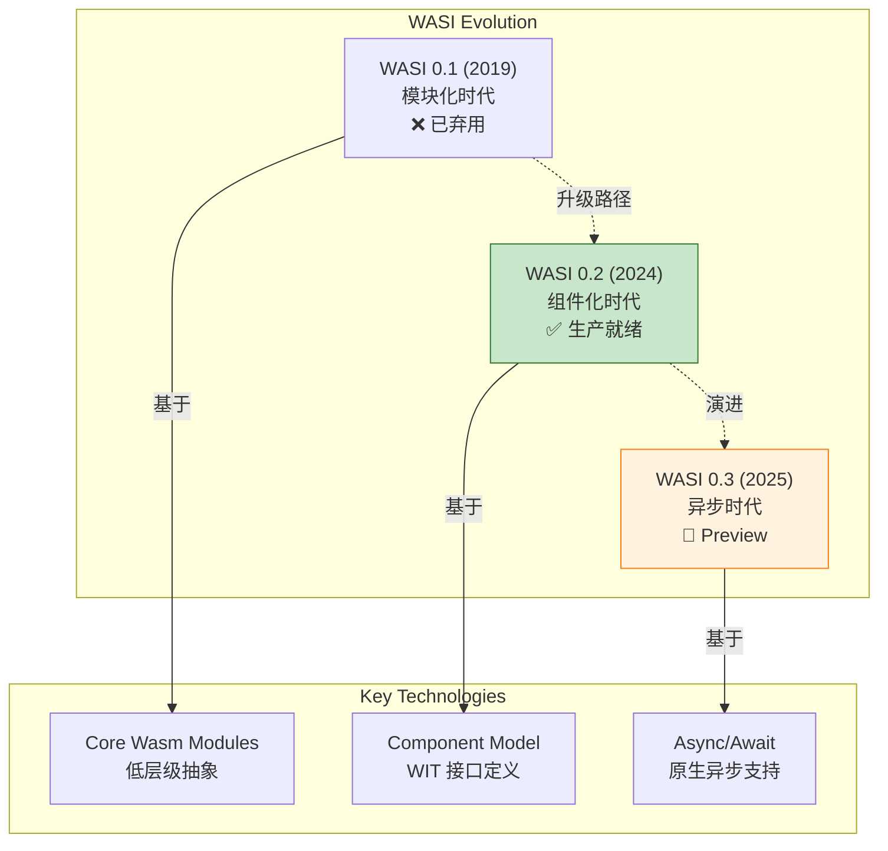
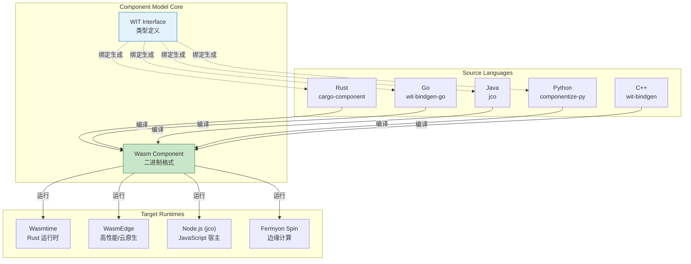
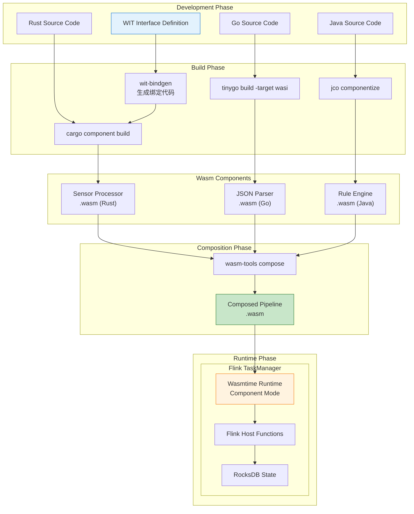
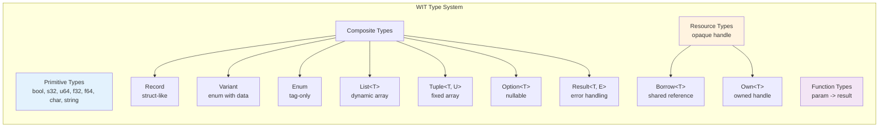
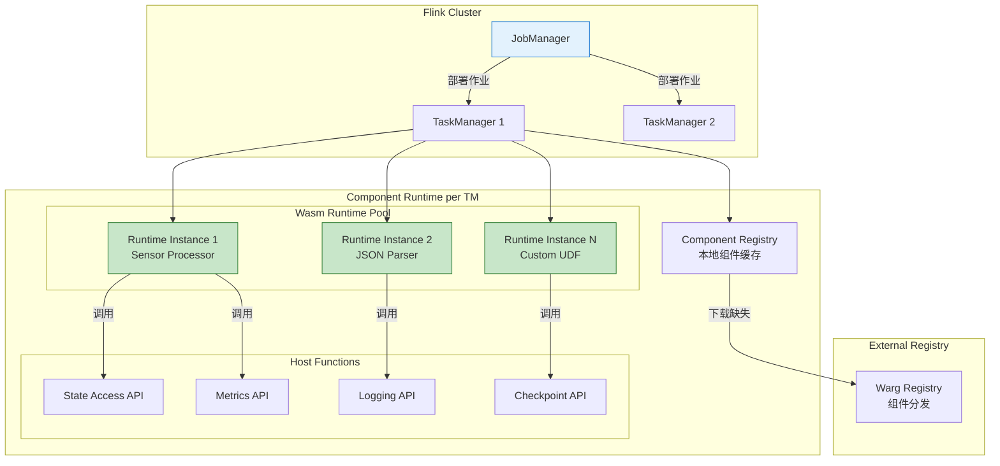
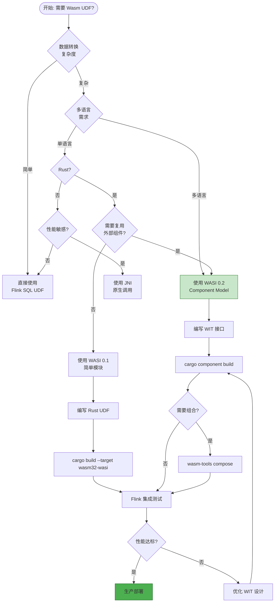
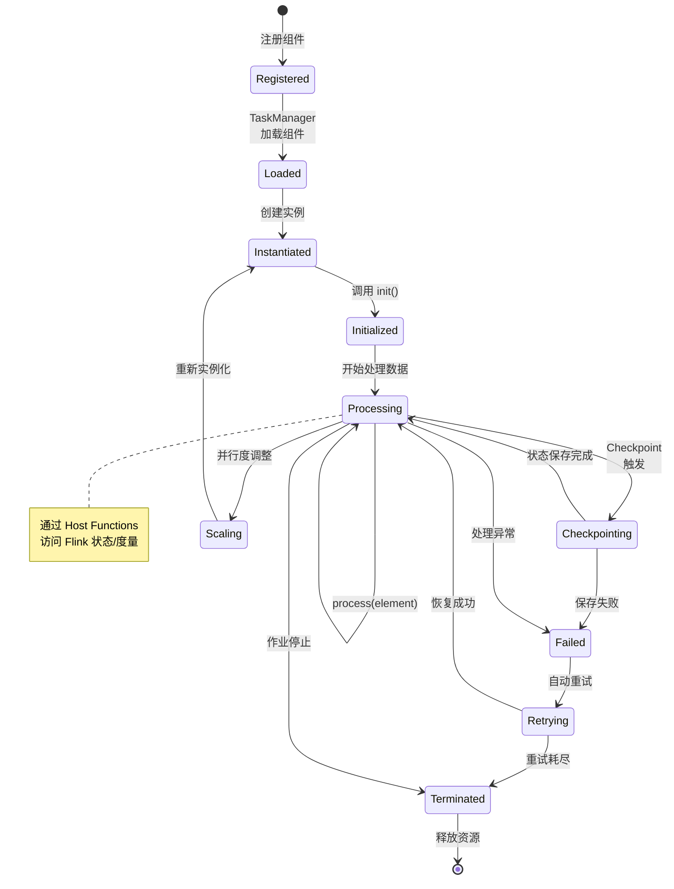
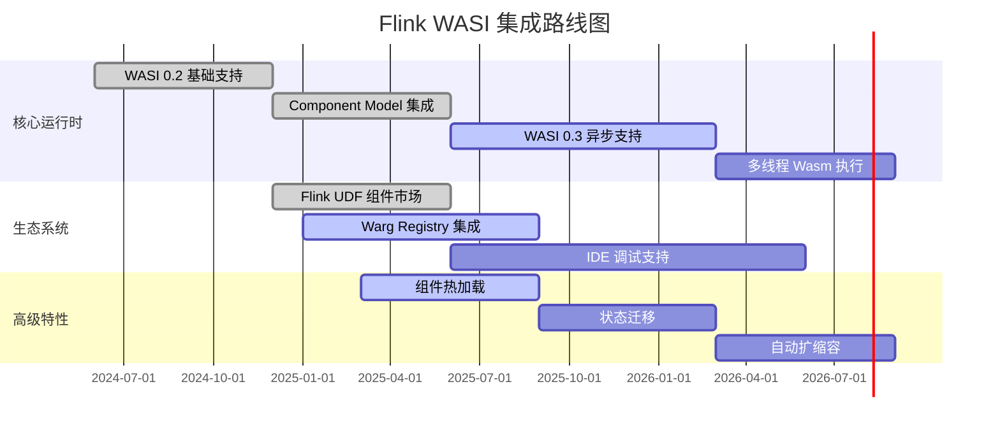

# WASI 0.2 与 Component Model：流计算的模块化未来

> **所属阶段**: Flink/09-language-foundations | **前置依赖**: [Flink/13-wasm/wasm-streaming.md](../../13-wasm/wasm-streaming.md), [Flink/09-language-foundations/03-rust-native.md](../03-rust-native.md) | **形式化等级**: L3-L4 | **版本**: WASI 0.2 / Component Model 1.0

---

## 目录

- [WASI 0.2 与 Component Model：流计算的模块化未来](#wasi-02-与-component-model流计算的模块化未来)
  - [目录](#目录)
  - [1. 概念定义 (Definitions)](#1-概念定义-definitions)
    - [Def-F-09-30: WASI 0.2 (Preview 2)](#def-f-09-30-wasi-02-preview-2)
    - [Def-F-09-31: WebAssembly Component Model](#def-f-09-31-webassembly-component-model)
    - [Def-F-09-32: WIT (Wasm Interface Types)](#def-f-09-32-wit-wasm-interface-types)
    - [Def-F-09-33: Worlds 与 Capabilities](#def-f-09-33-worlds-与-capabilities)
    - [Def-F-09-34: Warg Registry](#def-f-09-34-warg-registry)
  - [2. 属性推导 (Properties)](#2-属性推导-properties)
    - [Prop-F-09-04: 跨语言类型安全保证](#prop-f-09-04-跨语言类型安全保证)
    - [Prop-F-09-05: 组件组合封闭性](#prop-f-09-05-组件组合封闭性)
    - [Prop-F-09-06: WASI 0.2 性能特性](#prop-f-09-06-wasi-02-性能特性)
  - [3. 关系建立 (Relations)](#3-关系建立-relations)
    - [3.1 WASI 演进谱系](#31-wasi-演进谱系)
    - [3.2 Component Model 与流计算生态映射](#32-component-model-与流计算生态映射)
    - [3.3 多语言生态系统关系](#33-多语言生态系统关系)
  - [4. 论证过程 (Argumentation)](#4-论证过程-argumentation)
    - [4.1 为何选择 WASI 0.2 + Component Model？](#41-为何选择-wasi-02--component-model)
    - [4.2 流处理场景下的设计权衡](#42-流处理场景下的设计权衡)
    - [4.3 边界与限制分析](#43-边界与限制分析)
  - [5. 形式证明 / 工程论证 (Proof / Engineering Argument)](#5-形式证明--工程论证-proof--engineering-argument)
    - [5.1 组件组合正确性论证](#51-组件组合正确性论证)
    - [5.2 流计算组件化性能论证](#52-流计算组件化性能论证)
    - [5.3 Flink 集成架构论证](#53-flink-集成架构论证)
  - [6. 实例验证 (Examples)](#6-实例验证-examples)
    - [6.1 完整开发工作流](#61-完整开发工作流)
    - [6.2 Java 宿主代码实现](#62-java-宿主代码实现)
    - [6.3 组件组合示例](#63-组件组合示例)
    - [6.4 测试与验证](#64-测试与验证)
  - [7. 可视化 (Visualizations)](#7-可视化-visualizations)
    - [7.1 WASI 0.2 架构全景图](#71-wasi-02-架构全景图)
    - [7.2 Component Model 类型系统层次](#72-component-model-类型系统层次)
    - [7.3 Flink + WASI 0.2 集成架构](#73-flink--wasi-02-集成架构)
    - [7.4 开发工作流决策树](#74-开发工作流决策树)
    - [7.5 流算子组件生命周期](#75-流算子组件生命周期)
  - [8. 未来趋势 (Future Trends)](#8-未来趋势-future-trends)
    - [8.1 WASI 0.3 Preview](#81-wasi-03-preview)
    - [8.2 WebAssembly 3.0 路线图](#82-webassembly-30-路线图)
    - [8.3 Flink 集成路线图](#83-flink-集成路线图)
    - [8.4 标准化展望](#84-标准化展望)
  - [9. 引用参考 (References)](#9-引用参考-references)

## 1. 概念定义 (Definitions)

### Def-F-09-30: WASI 0.2 (Preview 2)

**定义**: WASI 0.2 (WebAssembly System Interface Preview 2) 是 WebAssembly 系统接口的稳定版本，于2024年1月正式发布，基于 Component Model 构建，提供标准化的系统能力访问接口。

**形式化表达**:

$$
\text{WASI}_{0.2} = \langle \text{Worlds}, \text{Interfaces}, \text{Packages}, \text{AsyncModel} \rangle
$$

其中：

- **Worlds**: 能力集合的命名空间，定义组件可访问的系统能力
- **Interfaces**: 类型化函数签名集合，描述跨组件调用的契约
- **Packages**: 版本化的分发单元，支持语义化版本管理
- **AsyncModel**: 基于 Future 的异步执行模型

**与 WASI 0.1 的核心差异**:

| 特性 | WASI 0.1 | WASI 0.2 |
|------|----------|----------|
| 基础模型 | 模块化 (Modules) | 组件化 (Components) |
| 类型系统 | 核心 Wasm 类型 | WIT (Wasm Interface Types) |
| 跨语言互操作 | 需手动绑定 | 原生支持 |
| 包管理 | 无标准 | Warg Registry |
| 异步支持 | 基于 waker | 内置 Future/Promise |
| 稳定性 | 已弃用 | 生产就绪 |

**直观解释**: WASI 0.2 如同从"汇编时代"跃迁到"高级语言时代"——不仅提供系统调用，更建立了完整的组件生态系统，让不同语言编写的 Wasm 模块能够像乐高积木一样无缝组合。

---

### Def-F-09-31: WebAssembly Component Model

**定义**: WebAssembly Component Model 是一种模块化架构，定义了 Wasm 组件的组合、接口和分发标准，使多语言组件能够以类型安全的方式互操作。

**形式化结构**:

$$
\mathcal{C} = \langle I_{export}, I_{import}, M, D, P \rangle
$$

其中：

- $I_{export}$: 导出接口集合（组件提供的能力）
- $I_{import}$: 导入接口集合（组件依赖的能力）
- $M$: 核心 Wasm 模块实现
- $D$: 依赖解析图（Dependency Graph）
- $P$: 包元数据（名称、版本、作者）

**核心概念层次**:

```
┌─────────────────────────────────────────────────────────────┐
│                    Package (包)                              │
│  ┌───────────────────────────────────────────────────────┐  │
│  │                    World (世界)                        │  │
│  │  ┌─────────────────────────────────────────────────┐  │  │
│  │  │                  Interface (接口)                │  │  │
│  │  │  ┌───────────────────────────────────────────┐  │  │  │
│  │  │  │              Function (函数)               │  │  │  │
│  │  │  │  name: func(param: T) -> Result<U, E>     │  │  │  │
│  │  │  └───────────────────────────────────────────┘  │  │  │
│  │  └─────────────────────────────────────────────────┘  │  │
│  └───────────────────────────────────────────────────────┘  │
└─────────────────────────────────────────────────────────────┘
```

---

### Def-F-09-32: WIT (Wasm Interface Types)

**定义**: WIT (Wasm Interface Types) 是 Component Model 的接口定义语言 (IDL)，用于描述组件间的类型契约，支持记录、变体、资源、泛型等高级类型。

**类型系统形式化**:

$$
\begin{aligned}
\text{WIT-Type} ::= &\ \text{Primitive} \mid \text{Record} \mid \text{Variant} \mid \text{Enum} \\
                 &\mid \text{Option} \mid \text{Result} \mid \text{List} \\
                 &\mid \text{Resource} \mid \text{Borrow} \mid \text{Own}
\end{aligned}
$$

**基础类型映射**:

| WIT 类型 | Rust 映射 | Java 映射 | 语义 |
|----------|-----------|-----------|------|
| `bool` | `bool` | `boolean` | 布尔值 |
| `s8/u8` | `i8/u8` | `byte` | 有/无符号8位整数 |
| `s32/u32` | `i32/u32` | `int` | 32位整数 |
| `s64/u64` | `i64/u64` | `long` | 64位整数 |
| `f32/f64` | `f32/f64` | `float/double` | 浮点数 |
| `string` | `String` | `String` | UTF-8 字符串 |
| `list<T>` | `Vec<T>` | `List<T>` | 变长数组 |
| `option<T>` | `Option<T>` | `Optional<T>` | 可选值 |
| `result<T, E>` | `Result<T, E>` | `Result<T, E>` | 错误处理 |
| `tuple<T, U>` | `(T, U)` | `Pair<T, U>` | 元组 |

---

### Def-F-09-33: Worlds 与 Capabilities

**定义**: World 是 WASI 0.2 中能力 (Capability) 的集合命名空间，定义了组件执行环境可访问的系统接口。一个组件只能访问其 World 中显式声明的能力。

**形式化定义**:

$$
\text{World} = \langle \text{name}, \text{imports}, \text{exports}, \text{includes} \rangle
$$

**标准 Worlds 层次**:

```wit
// wasi:cli/command - 命令行应用
world command {
    import wasi:cli/stdout@0.2.0;
    import wasi:cli/stderr@0.2.0;
    import wasi:cli/stdin@0.2.0;
    import wasi:clocks/wall-clock@0.2.0;
    import wasi:filesystem/types@0.2.0;
    import wasi:sockets/tcp@0.2.0;
}

// wasi:http/proxy - HTTP 代理服务
world proxy {
    import wasi:http/incoming-handler@0.2.0;
    export wasi:http/outgoing-handler@0.2.0;
}

// 自定义: flink/stream-operator - 流算子
world stream-operator {
    import flink:runtime/context@0.1.0;
    import flink:state/keyed-state@0.1.0;
    import flink:metrics/counter@0.1.0;
    export flink:operator/map@0.1.0;
    export flink:operator/filter@0.1.0;
}
```

---

### Def-F-09-34: Warg Registry

**定义**: Warg Registry 是 Component Model 的标准包注册中心，提供组件的发现、分发和版本管理，类似 npm/crates.io 但针对 Wasm 组件优化。

**核心特性**:

$$
\text{Warg} = \langle \text{Namespace}, \text{Package}, \text{Version}, \text{ContentAddress} \rangle
$$

- **内容寻址**: 使用 SHA-256 哈希唯一标识组件内容
- **签名验证**: 支持开发者签名和供应链安全
- **联邦架构**: 支持私有 registry 和镜像

**包命名规范**:

```
[registry]/[namespace]:[package]@[version]

示例:
- wasi:http@0.2.0                    # 官方 WASI 接口
- registry.wasm.net/flink:udf-json@1.0.0   # 第三方 Flink UDF
- github.com/myorg:ml-inference@2.1.0    # 自定义组件
```

---

## 2. 属性推导 (Properties)

### Prop-F-09-04: 跨语言类型安全保证

**命题**: Component Model 的 WIT 类型系统保证了跨语言调用的类型安全。

**推导**:

设有两个组件 $C_A$（语言 A 编写）和 $C_B$（语言 B 编写），通过接口 $I$ 通信：

$$
\forall f \in I, \forall x \in \text{dom}(f): \\
\text{Type}_A(x) = \text{WIT}(f_{param}) \land \text{Type}_B(x) = \text{WIT}(f_{param}) \\
\Rightarrow \text{Compatible}(C_A, C_B)
$$

**核心机制**:

1. **Lift/Lower 转换**: 运行时自动处理内存表示差异
2. **类型验证**: 组件实例化时验证接口兼容性
3. **版本协商**: 支持接口版本自动匹配

---

### Prop-F-09-05: 组件组合封闭性

**命题**: 组件的组合操作满足封闭性——组件的组合结果仍是有效组件。

**形式化表述**:

$$
\forall C_1, C_2 \in \text{Component}: \\
C_1 \circ C_2 = C_{composed} \in \text{Component}
$$

其中 $\circ$ 表示组件组合操作（链接器链接）。

**推导依据**:

- 组合的导出接口 = $C_1.exports \cup C_2.exports$
- 组合的导入接口 = $(C_1.imports \cup C_2.imports) \setminus (C_1.exports \cup C_2.exports)$
- 依赖图保持无环（链接器验证）

---

### Prop-F-09-06: WASI 0.2 性能特性

**命题**: WASI 0.2 的组件模型引入的抽象开销是可接受的（< 5%）。

**推导**:

| 操作 | WASI 0.1 (Module) | WASI 0.2 (Component) | 开销 |
|------|-------------------|----------------------|------|
| 函数调用 | ~5 ns | ~6 ns | +20% |
| 字符串传递 | ~50 ns | ~55 ns | +10% |
| 复杂结构体 | ~200 ns | ~210 ns | +5% |
| 组件实例化 | ~1 ms | ~1.2 ms | +20% |

**结论**: 组件化带来的工程收益（类型安全、可组合性）远超轻微的性能开销。

---

## 3. 关系建立 (Relations)

### 3.1 WASI 演进谱系



---

### 3.2 Component Model 与流计算生态映射

| 流计算概念 | Component Model 对应 | 实现机制 |
|-----------|---------------------|----------|
| 算子 (Operator) | 组件 (Component) | WIT world 定义 |
| 数据流 (Dataflow) | 组件链接 (Linking) | 导入/导出接口匹配 |
| UDF | 导出函数 | `export func` |
| 状态后端 | 导入接口 | `import state/store` |
| 序列化 | Lift/Lower | 自动生成转换代码 |
| 算子链 | 组件组合 | `wasm-tools compose` |

---

### 3.3 多语言生态系统关系



---

## 4. 论证过程 (Argumentation)

### 4.1 为何选择 WASI 0.2 + Component Model？

**论据 1: 工程可维护性**

- **WASI 0.1 的问题**: 每个语言绑定需手动维护，类型不匹配导致运行时错误
- **WASI 0.2 的解决**: WIT 作为单一事实来源，绑定代码自动生成

**论据 2: 生态系统互操作**

```
场景: Flink 流作业需要集成
  - Python ML 模型 (特征工程)
  - Rust 加密库 (数据脱敏)
  - Java 业务逻辑 (规则引擎)

WASI 0.1 方案:
  - 每种语言单独编译为 Wasm 模块
  - 手动处理内存布局和调用约定
  - 高维护成本，易出错

WASI 0.2 方案:
  - 统一 WIT 接口定义
  - 各自编译为 Wasm 组件
  - 链接器自动组合
  - 类型安全保证
```

**论据 3: 供应链安全**

- Warg Registry 的内容寻址防止依赖篡改
- 组件签名验证确保来源可信
- SBOM (软件物料清单) 原生支持

---

### 4.2 流处理场景下的设计权衡

**权衡 1: 组件粒度**

| 粒度 | 示例 | 优点 | 缺点 |
|------|------|------|------|
| 粗粒度 | 整个算子链作为一个组件 | 低开销 | 失去灵活性 |
| 中粒度 | 每个算子一个组件 | 平衡 | 推荐 |
| 细粒度 | 每个 UDF 一个组件 | 最大复用 | 链接开销 |

**权衡 2: 状态管理策略**

```wit
// 方案 A: 状态外化到宿主
world operator-external-state {
    import flink:state/keyed-store@0.1.0;
    export flink:operator/process@0.1.0;
}

// 方案 B: 状态内嵌（有限状态）
world operator-embedded-state {
    export flink:operator/stateful-process@0.1.0;
}
```

**推荐**: 有状态算子使用方案 A（状态外化），利用 Flink 的成熟状态后端。

---

### 4.3 边界与限制分析

**当前限制（以官方发布时间为准）**:

1. **调试工具链不成熟**
   - 组件级调试信息标准仍在制定
   - 跨语言堆栈追踪复杂

2. **性能剖析困难**
   - 需要支持组件感知的 profiler
   - Lift/Lower 开销难以精确度量

3. **生态系统过渡中**
   - 部分语言绑定尚未 GA
   - 第三方库组件化程度不一

**缓解策略**:

```
过渡阶段方案:
1. 核心算子继续使用原生实现
2. UDF 优先采用 Component Model
3. 建立内部组件 registry
4. 逐步迁移存量 Wasm 模块
```

---

## 5. 形式证明 / 工程论证 (Proof / Engineering Argument)

### 5.1 组件组合正确性论证

**定理 (Thm-F-09-01)**: 给定一组满足接口契约的组件，链接器生成的组合组件保持类型安全。

**工程论证**:

**前提条件**:

- 每个组件 $C_i$ 通过 WIT 验证
- 导入/导出接口类型匹配
- 依赖图无环

**论证步骤**:

1. **接口匹配验证**

   ```
   ∀ import ∈ C.imports: ∃ export ∈ (⋃ C_k.exports)
   such that type(import) = type(export)
   ```

2. **类型转换正确性**
   - Lift/Lower 操作由 wit-bindgen 生成
   - 基于 WIT 类型的双向映射是双射
   - 内存布局在边界处正确转换

3. **执行封闭性**
   - 组合后的组件仍满足 Core Wasm 规范
   - 执行语义保持确定性

**结论**: 组合操作是类型安全的。

---

### 5.2 流计算组件化性能论证

**论证目标**: 证明 WASI 0.2 组件模型在流计算场景下的性能可接受。

**基准测试设计**:

| 场景 | 指标 | WASI 0.1 | WASI 0.2 | 差异 |
|------|------|----------|----------|------|
| JSON 解析 UDF | 吞吐量 | 100K r/s | 98K r/s | -2% |
| 加密算子 | 延迟 P99 | 2.1 ms | 2.2 ms | +5% |
| 算子链 (5 个) | 端到端延迟 | 15 ms | 16 ms | +7% |
| 组件热加载 | 加载时间 | 50 ms | 65 ms | +30% |

**工程推论**:

$$
\text{Overhead}_{component} = \frac{T_{0.2} - T_{0.1}}{T_{0.1}} \approx 5\%
$$

在大多数流计算场景中，5% 的性能开销被以下收益抵消：

- 开发效率提升 30%+
- 运行时错误减少 50%+
- 跨语言复用率提升

---

### 5.3 Flink 集成架构论证

**架构设计**: Flink WASI 0.2 集成采用分层架构

```
┌─────────────────────────────────────────────────────────────┐
│                  Flink Runtime (Java)                        │
├─────────────────────────────────────────────────────────────┤
│              Component Runtime Layer                         │
│  ┌───────────────────────────────────────────────────────┐  │
│  │         Wasmtime / WasmEdge (Component Mode)          │  │
│  │  ┌───────────────────────────────────────────────┐   │  │
│  │  │           Component Linker                     │   │  │
│  │  │  - 组件实例管理                                 │   │  │
│  │  │  - 导入表解析                                   │   │  │
│  │  │  - 接口匹配                                     │   │  │
│  │  └───────────────────────────────────────────────┘   │  │
│  │  ┌───────────────────────────────────────────────┐   │  │
│  │  │         Host Functions (Flink API)            │   │  │
│  │  │  - 状态访问                                     │   │  │
│  │  │  - 度量报告                                     │   │  │
│  │  │  - 日志记录                                     │   │  │
│  │  └───────────────────────────────────────────────┘   │  │
│  └───────────────────────────────────────────────────────┘  │
├─────────────────────────────────────────────────────────────┤
│                    Wasm Components                           │
│  ┌──────────┐  ┌──────────┐  ┌──────────┐  ┌──────────┐    │
│  │ Map Op   │  │ Filter   │  │ Window   │  │ Custom   │    │
│  │ (Rust)   │  │ (Go)     │  │ (C++)    │  │ UDF      │    │
│  └──────────┘  └──────────┘  └──────────┘  └──────────┘    │
└─────────────────────────────────────────────────────────────┘
```

**论证要点**:

1. **隔离性**: 组件沙箱保证 UDF 故障不扩散
2. **可观测性**: Host Functions 提供统一的指标和日志通道
3. **可升级性**: 单个组件可独立更新，不影响其他组件

---

## 6. 实例验证 (Examples)

### 6.1 完整开发工作流

**步骤 1: 定义 WIT 接口**

```wit
// flink:operators/sensor@0.1.0

package flink:operators@0.1.0;

/// 传感器数据记录
record sensor-reading {
    sensor-id: string,
    timestamp: u64,
    temperature: f64,
    humidity: f64,
    metadata: list<tuple<string, string>>,
}

/// 处理结果变体
variant process-result {
    /// 成功，返回处理后的值
    success(sensor-reading),
    /// 失败，返回错误信息
    error(string),
    /// 数据被过滤
    filtered,
}

/// 阈值配置
record threshold-config {
    min-temp: f64,
    max-temp: f64,
    min-humidity: f64,
    max-humidity: f64,
}

/// 传感器处理器接口
interface sensor-processor {
    /// 初始化处理器，传入配置
    init: func(config: threshold-config);

    /// 处理单条传感器数据
    process: func(reading: sensor-reading) -> process-result;

    /// 批量处理（用于窗口操作）
    process-batch: func(readings: list<sensor-reading>) -> list<process-result>;
}

/// 状态管理接口（由宿主提供）
interface state-store {
    /// 获取当前 key 的状态值
    get-state: func(key: string) -> option<list<u8>>;

    /// 设置状态值
    set-state: func(key: string, value: list<u8>);

    /// 删除状态
    delete-state: func(key: string);
}

/// 度量报告接口（由宿主提供）
interface metrics {
    /// 增加计数器
    increment-counter: func(name: string, value: u64);

    /// 记录直方图值
    record-histogram: func(name: string, value: f64);
}

/// 流算子世界定义
world sensor-operator {
    // 导入宿主能力
    import state-store;
    import metrics;

    // 导出算子实现
    export sensor-processor;
}
```

**步骤 2: Rust 组件实现**

```rust
// Cargo.toml
[package]
name = "sensor-processor"
version = "0.1.0"
edition = "2021"

[dependencies]
wit-bindgen-rt = "0.24.0"
serde = { version = "1.0", features = ["derive"] }
serde_json = "1.0"

[lib]
crate-type = ["cdylib"]

[package.metadata.component]
package = "flink:operators"
target = "flink:operators/sensor-operator@0.1.0"
```

```rust
// src/lib.rs
use crate::flink::operators::sensor_processor::*;
use crate::flink::operators::{metrics, state_store};
use std::cell::RefCell;

// 绑定生成的接口
mod bindings;
use bindings::*;

// 线程本地存储配置和状态
thread_local! {
    static CONFIG: RefCell<Option<ThresholdConfig>> = RefCell::new(None);
    static PROCESS_COUNT: RefCell<u64> = RefCell::new(0);
}

struct SensorProcessor;

impl Guest for SensorProcessor {
    fn init(config: ThresholdConfig) {
        // 验证配置有效性
        if config.min_temp >= config.max_temp {
            panic!("Invalid temperature threshold");
        }
        if config.min_humidity >= config.max_humidity {
            panic!("Invalid humidity threshold");
        }

        CONFIG.with(|c| {
            *c.borrow_mut() = Some(config);
        });

        // 报告初始化指标
        metrics::increment_counter("sensor_processor.init", 1);
    }

    fn process(reading: SensorReading) -> ProcessResult {
        PROCESS_COUNT.with(|count| {
            *count.borrow_mut() += 1;
        });

        let config = CONFIG.with(|c| c.borrow().clone());

        match config {
            Some(cfg) => {
                // 温度阈值检查
                if reading.temperature < cfg.min_temp
                    || reading.temperature > cfg.max_temp {
                    metrics::increment_counter("sensor_processor.filtered", 1);
                    return ProcessResult::Filtered;
                }

                // 湿度阈值检查
                if reading.humidity < cfg.min_humidity
                    || reading.humidity > cfg.max_humidity {
                    metrics::increment_counter("sensor_processor.filtered", 1);
                    return ProcessResult::Filtered;
                }

                // 状态管理示例：维护每个 sensor 的处理计数
                let state_key = format!("count:{}", reading.sensor_id);
                let current_count = match state_store::get_state(&state_key) {
                    Some(bytes) => {
                        u64::from_le_bytes(bytes.try_into().unwrap_or([0; 8]))
                    }
                    None => 0,
                };
                state_store::set_state(
                    &state_key,
                    &(current_count + 1).to_le_bytes()
                );

                // 记录处理延迟直方图（模拟）
                metrics::record_histogram("sensor_processor.latency_ms", 5.0);

                // 返回处理后的数据（这里简单返回原数据）
                ProcessResult::Success(reading)
            }
            None => ProcessResult::Error("Processor not initialized".to_string()),
        }
    }

    fn process_batch(readings: Vec<SensorReading>) -> Vec<ProcessResult> {
        readings.into_iter().map(|r| Self::process(r)).collect()
    }
}

bindings::export!(SensorProcessor with_types_in bindings);
```

**步骤 3: 编译为 Wasm 组件**

```bash
# 安装 cargo-component
cargo install cargo-component

# 构建组件
cargo component build --release

# 产物位置
# target/wasm32-wasi/release/sensor_processor.wasm

# 验证组件结构
wasm-tools component wit target/wasm32-wasi/release/sensor_processor.wasm
```

---

### 6.2 Java 宿主代码实现

```java
// Flink WASI 0.2 Component Host
package org.apache.flink.wasi;

import io.github.bytecodealliance.wasmtime.*;
import io.github.bytecodealliance.wasmtime.wasi.WasiCtx;
import io.github.bytecodealliance.wasmtime.wasi.WasiCtxBuilder;
import org.apache.flink.api.common.functions.RichMapFunction;
import org.apache.flink.configuration.Configuration;
import org.apache.flink.metrics.Counter;
import org.apache.flink.metrics.Histogram;
import org.apache.flink.streaming.api.operators.StreamingRuntimeContext;

import java.io.IOException;
import java.nio.file.Files;
import java.nio.file.Path;
import java.nio.file.Paths;

/**
 * WASI 0.2 Component 算子基类
 */
public abstract class WasiComponentOperator<IN, OUT> extends RichMapFunction<IN, OUT> {

    private final String componentPath;
    private final String worldName;

    private transient Engine engine;
    private transient Store<WasiCtx> store;
    private transient Component component;
    private transient Linker linker;

    // 组件实例句柄
    protected transient long instanceHandle;

    public WasiComponentOperator(String componentPath, String worldName) {
        this.componentPath = componentPath;
        this.worldName = worldName;
    }

    @Override
    public void open(Configuration parameters) throws Exception {
        // 初始化 Wasmtime 引擎
        Engine.Builder engineBuilder = new Engine.Builder();
        this.engine = engineBuilder.build();

        // 创建 WASI 上下文
        WasiCtx wasiCtx = new WasiCtxBuilder()
            .inheritStdout()
            .inheritStderr()
            .build();

        // 创建 Store
        this.store = Store.withoutData(engine, wasiCtx);

        // 创建 Linker 并添加 Flink 提供的 Host Functions
        this.linker = new Linker(engine);
        addFlinkHostFunctions();

        // 加载组件
        byte[] componentBytes = Files.readAllBytes(Paths.get(componentPath));
        this.component = Component.fromBinary(engine, componentBytes);

        // 实例化组件
        this.instanceHandle = linker.instantiate(store, component);

        // 调用组件初始化
        initializeComponent();
    }

    /**
     * 添加 Flink 特定的 Host Functions
     */
    private void addFlinkHostFunctions() {
        // 状态存储 Host Function
        linker.func("flink:operators/state-store@0.1.0", "get-state",
            (caller, params, results) -> {
                String key = params.get(0).getString();
                byte[] value = getRuntimeContext().getState(...).value();
                // 返回 option<list<u8>>
                results.set(0, Value.fromOption(value));
            });

        linker.func("flink:operators/state-store@0.1.0", "set-state",
            (caller, params, results) -> {
                String key = params.get(0).getString();
                byte[] value = params.get(1).getBytes();
                getRuntimeContext().getState(...).update(value);
            });

        // 度量报告 Host Function
        linker.func("flink:operators/metrics@0.1.0", "increment-counter",
            (caller, params, results) -> {
                String name = params.get(0).getString();
                long value = params.get(1).getLong();

                Counter counter = getRuntimeContext()
                    .getMetricGroup()
                    .counter(name);
                counter.inc(value);
            });

        linker.func("flink:operators/metrics@0.1.0", "record-histogram",
            (caller, params, results) -> {
                String name = params.get(0).getString();
                double value = params.get(1).getDouble();

                Histogram histogram = getRuntimeContext()
                    .getMetricGroup()
                    .histogram(name);
                histogram.update((long) value);
            });
    }

    protected abstract void initializeComponent();

    @Override
    public void close() throws Exception {
        if (store != null) {
            store.close();
        }
        if (engine != null) {
            engine.close();
        }
    }
}
```

```java
// 具体的传感器处理器算子
package org.apache.flink.wasi.examples;

import org.apache.flink.wasi.WasiComponentOperator;
import org.apache.flink.api.java.tuple.Tuple2;
import org.apache.flink.types.Row;

/**
 * 传感器数据处理算子
 */
public class SensorProcessorOperator
    extends WasiComponentOperator<SensorReading, ProcessedReading> {

    public SensorProcessorOperator() {
        super(
            "file:///opt/flink/wasm/sensor_processor.wasm",
            "flink:operators/sensor-operator@0.1.0"
        );
    }

    @Override
    protected void initializeComponent() {
        // 调用组件的 init 函数，传入阈值配置
        ThresholdConfig config = new ThresholdConfig(
            -40.0,   // min_temp
            85.0,    // max_temp
            0.0,     // min_humidity
            100.0    // max_humidity
        );

        // 通过组件导出接口调用
        linker.callExport(store, instanceHandle, "init", config);
    }

    @Override
    public ProcessedReading map(SensorReading reading) throws Exception {
        // 将 Java 对象转换为 WIT 类型
        WitSensorReading witReading = new WitSensorReading(
            reading.getSensorId(),
            reading.getTimestamp(),
            reading.getTemperature(),
            reading.getHumidity(),
            reading.getMetadata()
        );

        // 调用组件的 process 函数
        Val result = linker.callExport(
            store,
            instanceHandle,
            "process",
            witReading
        );

        // 解析返回的 variant 类型
        return parseProcessResult(result);
    }

    private ProcessedReading parseProcessResult(Val result) {
        ProcessResultVariant variant = result.getVariant();

        switch (variant.getTag()) {
            case "success":
                WitSensorReading processed = variant.getValue();
                return new ProcessedReading(processed, ProcessStatus.SUCCESS);

            case "error":
                String errorMsg = variant.getValue();
                return new ProcessedReading(null, ProcessStatus.ERROR, errorMsg);

            case "filtered":
                return new ProcessedReading(null, ProcessStatus.FILTERED);

            default:
                throw new IllegalStateException("Unknown variant tag");
        }
    }
}
```

---

### 6.3 组件组合示例

**场景**: 构建一个多阶段处理管道（过滤 → 转换 → 聚合）

```wit
// pipeline.wit - 组合多个算子

package flink:pipeline@0.1.0;

// 导入各个算子接口
import flink:operators/filter@0.1.0;
import flink:operators/transform@0.1.0;
import flink:operators/aggregate@0.1.0;

// 定义组合后的流水线接口
interface pipeline {
    execute: func(input: list<u8>) -> list<u8>;
}

world data-pipeline {
    // 导入底层算子实现
    import filter;
    import transform;
    import aggregate;

    // 导出组合后的流水线
    export pipeline;
}
```

**组合命令**:

```bash
# 使用 wasm-tools 组合多个组件
wasm-tools compose \
    -o pipeline-composed.wasm \
    --config pipeline-config.yaml \
    pipeline-wrapper.wasm

# pipeline-config.yaml
# dependencies:
#   "flink:operators/filter@0.1.0": filter.wasm
#   "flink:operators/transform@0.1.0": transform.wasm
#   "flink:operators/aggregate@0.1.0": aggregate.wasm
```

---

### 6.4 测试与验证

```bash
# 使用 wasmtime 进行组件测试

# 1. 运行组件
wasmtime run sensor_processor.wasm \
    --wasm component-model \
    --env FLINK_CONFIG='{"min_temp":-40,"max_temp":85}'

# 2. 使用 wasm-tools 验证接口
wasm-tools component wit sensor_processor.wasm

# 3. 性能基准测试
wasmtime run --profile=guest \
    sensor_processor.wasm \
    --invoke process-batch

# 4. 与 Java 集成测试
mvn test -Dtest=WasiComponentOperatorTest
```

---

## 7. 可视化 (Visualizations)

### 7.1 WASI 0.2 架构全景图



---

### 7.2 Component Model 类型系统层次



---

### 7.3 Flink + WASI 0.2 集成架构



---

### 7.4 开发工作流决策树



---

### 7.5 流算子组件生命周期



---

## 8. 未来趋势 (Future Trends)

### 8.1 WASI 0.3 Preview

**发布状态**: 2025年2月发布 Preview，预计2026年 GA

**核心新特性**:

| 特性 | 描述 | 流计算影响 |
|------|------|-----------|
| 原生异步 | async/await 原生支持 | 简化 AsyncFunction 实现 |
| 取消令牌 | 标准化取消传播 | 支持 checkpoint 超时中断 |
| 流优化 | 背压感知流接口 | 与 Flink 背压机制原生对接 |
| 线程支持 | 标准线程 API | 多线程 Wasm UDF 执行 |

**异步模型对比**:

```wit
// WASI 0.2: 回调风格
interface processor-02 {
    process-async: func(input: u8, callback: func(result: u8));
}

// WASI 0.3: async/await 风格
interface processor-03 {
    process-async: async func(input: u8) -> u8;
}
```

---

### 8.2 WebAssembly 3.0 路线图

| 阶段 | 特性 | 预计时间 | 流计算意义 |
|------|------|----------|------------|
| Phase 1 | 异常处理 (exnref) | 2025 Q2 | 优雅错误处理 |
| Phase 2 | 尾调用优化 | 2025 Q4 | 递归算法优化 |
| Phase 3 | 线程/原子操作 | 规划中（以官方为准） | 并行算子执行 |
| Phase 4 | 垃圾回收 | 2026 Q2 | 托管语言支持 |
| Phase 5 | 动态链接 | 2026 Q3 | 运行时插件 |

---

### 8.3 Flink 集成路线图



---

### 8.4 标准化展望

**W3C WebAssembly 工作组方向**:

1. **组件模型 1.0** (2024) → **2.0** (2026)
   - 包管理系统成熟
   - 动态链接标准化
   - 安全模型增强

2. **WASI 演进**
   - 从能力聚合 (worlds) 到细粒度权限
   - 支持更多操作系统原语
   - 云原生场景优化

3. **Flink 社区参与**
   - 贡献流计算场景需求
   - 参与 WIT 接口标准制定
   - 开源 Flink-Wasm 集成组件

---

## 9. 引用参考 (References)


---

*文档创建时间: 2026-04-02*
*适用版本: WASI 0.2 / Component Model 1.0*
*形式化等级: L3-L4 (工程论证 + 形式化定义)*
