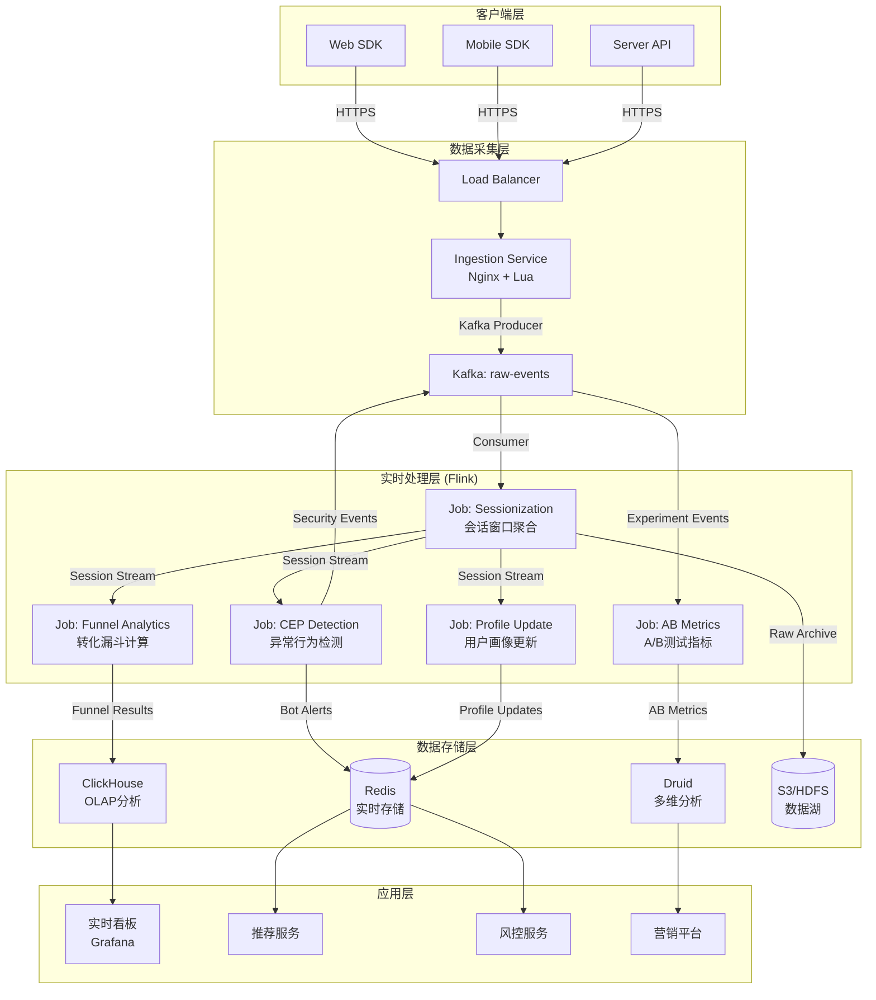
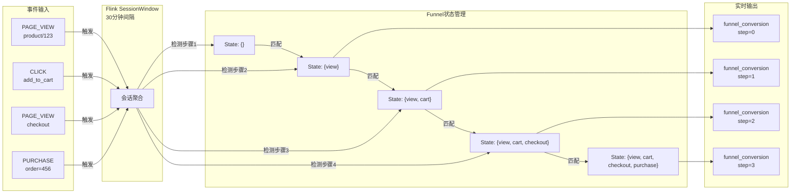
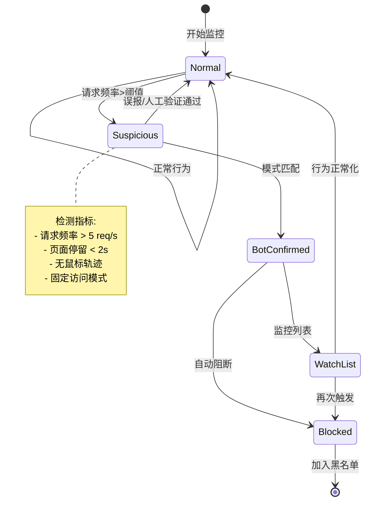
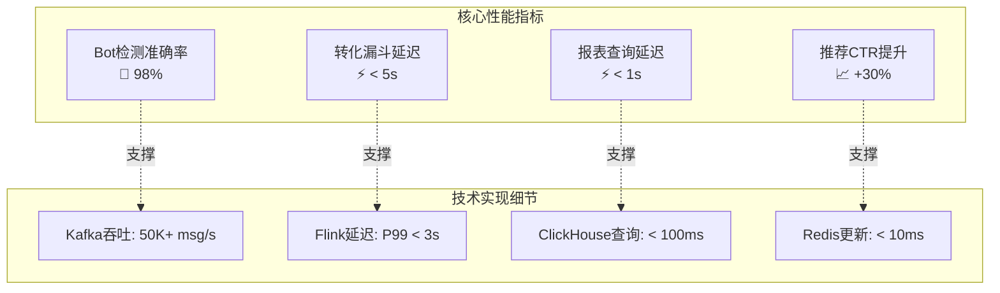
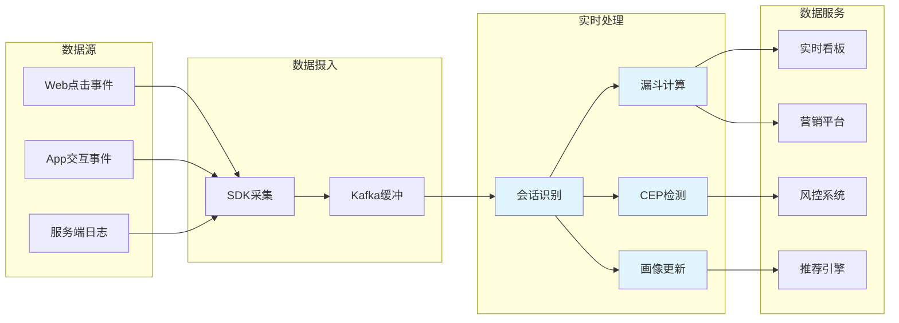

# 案例研究：Clickstream实时用户行为分析系统

> **所属阶段**: Flink | **前置依赖**: [Flink/05-ecosystem/](../../05-ecosystem/05.01-connectors/flink-connectors-ecosystem-complete-guide.md) | **形式化等级**: L4 (工程论证)
> **案例来源**: 大型电商平台真实案例(脱敏处理) | **文档编号**: F-07-09

---

> **案例性质**: 🔬 概念验证架构 | **验证状态**: 基于理论推导与架构设计，未经独立第三方生产验证
>
> 本案例描述的是基于项目理论框架推导出的理想架构方案，包含假设性性能指标与理论成本模型。
> 实际生产部署可能因环境差异、数据规模、团队能力等因素产生显著不同结果。
> 建议将其作为架构设计参考而非直接复制粘贴的生产蓝图。
## 1. 概念定义 (Definitions)

### 1.1 Clickstream形式化定义

**Def-F-07-71** (Clickstream 点击流): 点击流是用户在数字平台上的交互事件序列，定义为四元组 $\mathcal{C} = (\mathcal{E}, \mathcal{T}, \mathcal{A}, \preceq)$，其中：

- $\mathcal{E}$: 事件集合，每个事件 $e \in \mathcal{E}$ 包含用户ID、事件类型、时间戳、页面/元素信息、上下文属性
- $\mathcal{T} \subseteq \mathbb{R}^+$: 时间戳集合
- $\mathcal{A}$: 属性集合，$\alpha: \mathcal{E} \rightarrow \mathcal{A}$ 为事件属性映射函数
- $\preceq$: 时间上的全序关系，$e_i \preceq e_j \iff t(e_i) \leq t(e_j)$

**事件类型分类**:

$$
\text{EventType} = \{\text{PAGE_VIEW}, \text{CLICK}, \text{SCROLL}, \text{ADD_TO_CART}, \text{PURCHASE}, \text{SEARCH}, \text{HOVER}\}
$$

### 1.2 用户会话定义

**Def-F-07-72** (用户会话 User Session): 用户会话是会话窗口内的连续交互序列，定义为三元组 $\mathcal{S} = (u, \mathcal{E}_s, \tau)$：

- $u \in \mathcal{U}$: 用户标识
- $\mathcal{E}_s \subseteq \mathcal{E}$: 会话内事件集，满足：
  - $\forall e_i, e_j \in \mathcal{E}_s: |t(e_i) - t(e_j)| \leq \tau_{gap}$ (事件间间隔不超过会话超时)
  - $\max_{e \in \mathcal{E}_s} t(e) - \min_{e \in \mathcal{E}_s} t(e) \leq \tau_{max}$ (会话总时长限制)
- $\tau = (\tau_{gap}, \tau_{max})$: 会话超时参数（典型值：$\tau_{gap} = 30\text{min}$, $\tau_{max} = 4\text{h}$）

**会话边界判定**:

$$
\text{SessionBoundary}(e_i, e_{i+1}) =
\begin{cases}
\text{true} & \text{if } t(e_{i+1}) - t(e_i) > \tau_{gap} \\
\text{true} & \text{if } t(e_{i+1}) - t(e_{\text{first}}) > \tau_{max} \\
\text{false} & \text{otherwise}
\end{cases}
$$

### 1.3 转化漏斗形式化

**Def-F-07-73** (转化漏斗 Conversion Funnel): 转化漏斗是预定义的用户行为路径，定义为有序列表 $\mathcal{F} = [(s_1, r_1), (s_2, r_2), \ldots, (s_n, r_n)]$，其中：

- $s_i$: 第 $i$ 个漏斗步骤（如 "浏览商品", "加入购物车", "提交订单", "完成支付"）
- $r_i \subseteq \mathcal{E}$: 判定事件规则集合

**转化率计算**:

$$
\text{ConversionRate}(s_i \rightarrow s_{i+1}) = \frac{|\{u : \exists e \in \mathcal{E}_u \cap r_{i+1}\}|}{|\{u : \exists e \in \mathcal{E}_u \cap r_i\}|}
$$

**漏斗流失率**:

$$
\text{DropoffRate}(s_i) = 1 - \text{ConversionRate}(s_i \rightarrow s_{i+1})
$$

### 1.4 用户画像实时更新

**Def-F-07-74** (实时用户画像 Real-time User Profile): 用户画像是在线更新的用户特征向量，定义为 $\mathcal{P}_u(t) = (\mathbf{d}_u, \mathbf{b}_u(t), \mathbf{r}_u(t))$：

- $\mathbf{d}_u \in \mathbb{R}^{D}$: 人口统计特征（性别、年龄、地域等静态属性）
- $\mathbf{b}_u(t) \in \mathbb{R}^{B}$: 行为特征向量，随时间更新：
  - 品类偏好: $p_i(t) = \frac{\text{count}(category_i, \mathcal{E}_{[t-\Delta, t]})}{\sum_j \text{count}(category_j, \mathcal{E}_{[t-\Delta, t]})}$
  - 价格敏感度: $\text{price\_sensitivity}_u = \text{avg}(\text{view\_price}) / \text{avg}(\text{purchase\_price})$
  - 活跃度: $\text{activeness}(t) = \lambda \cdot \text{activeness}(t-\delta) + (1-\lambda) \cdot |\mathcal{E}_{[t-\delta, t]}|$
- $\mathbf{r}_u(t) \in \mathbb{R}^{R}$: 实时上下文特征（设备、位置、时段等）

### 1.5 异常行为检测定义

**Def-F-07-75** (异常行为检测 Anomaly Detection): Bot/爬虫行为检测定义为分类函数 $\mathcal{D}: \mathcal{E}_s \rightarrow \{0, 1\}$，其中：

$$
\mathcal{D}(\mathcal{E}_s) = \mathbb{1}\left[\sum_{i=1}^{k} w_i \cdot \phi_i(\mathcal{E}_s) > \theta\right]
$$

**检测特征向量** $\phi(\mathcal{E}_s)$ 包含：

- $\phi_1$: 请求频率（事件/秒）
- $\phi_2$: 页面停留时间分布熵
- $\phi_3$: 鼠标轨迹随机性
- $\phi_4$: User-Agent可信度
- $\phi_5$: IP信誉分数
- $\phi_6$: 行为序列模式匹配度

---

## 2. 属性推导 (Properties)

### 2.1 会话边界确定性定理

**Lemma-F-07-71** (会话边界一致性): 对于有序事件流 $\mathcal{E} = [e_1, e_2, \ldots, e_n]$，在固定会话超时参数 $\tau_{gap}$ 下，会话划分是确定性的：

$$
\forall i: \text{Session}(e_i) = \text{Session}(e_{i+1}) \iff t(e_{i+1}) - t(e_i) \leq \tau_{gap}
$$

**证明**: 由会话边界判定函数的定义，时间差是否超过阈值是唯一判定条件，且事件按时间戳全序排列，故划分结果唯一。

### 2.2 转化计算正确性

**Lemma-F-07-72** (漏斗计算单调性): 在转化漏斗 $\mathcal{F} = [(s_1, r_1), \ldots, (s_n, r_n)]$ 中，用户集合满足：

$$
|\mathcal{U}_1| \geq |\mathcal{U}_2| \geq \cdots \geq |\mathcal{U}_n|
$$

其中 $\mathcal{U}_i = \{u : \exists e \in \mathcal{E}_u, e \text{ satisfies } r_i\}$。

**证明**: 漏斗步骤是顺序依赖的，即用户必须通过步骤 $s_i$ 才能进入 $s_{i+1}$。因此 $\mathcal{U}_{i+1} \subseteq \mathcal{U}_i$，集合基数非增。

### 2.3 实时性保证

**Prop-F-07-71** (端到端延迟分解): 从用户行为发生到分析结果可见的总延迟 $L_{total}$ 可分解为：

$$
L_{total} = L_{sdk} + L_{network} + L_{kafka} + L_{flink} + L_{olap}
$$

各分量典型值：

| 组件 | 延迟 | 说明 |
|------|------|------|
| SDK采集 ($L_{sdk}$) | < 100ms | 本地缓冲+批量上报 |
| 网络传输 ($L_{network}$) | 10-50ms | HTTPS/TLS开销 |
| Kafka缓冲 ($L_{kafka}$) | < 100ms | 批量拉取配置 |
| Flink处理 ($L_{flink}$) | 1-3s | 窗口聚合+CEP检测 |
| OLAP写入 ($L_{olap}$) | < 1s | 实时摄入延迟 |

**总延迟目标**: $L_{total} < 5\text{s}$（满足实时看板需求）

### 2.4 Bot检测准确率边界

**Lemma-F-07-73** (检测准确率下界): 设人类用户行为特征分布为 $\mathcal{N}(\mu_h, \sigma_h^2)$，Bot特征分布为 $\mathcal{N}(\mu_b, \sigma_b^2)$，则最优分类器准确率下界为：

$$
\text{Accuracy} \geq \Phi\left(\frac{|\mu_h - \mu_b|}{\sqrt{\sigma_h^2 + \sigma_b^2}}\right)
$$

其中 $\Phi$ 为标准正态CDF。当特征分离度 $|\mu_h - \mu_b| > 3\sqrt{\sigma_h^2 + \sigma_b^2}$ 时，准确率可达 99%+。

---

## 3. 关系建立 (Relations)

### 3.1 与推荐系统的关系

Clickstream分析为推荐系统提供实时反馈信号，形成闭环：

```
用户行为 → 实时分析 → 画像更新 → 推荐模型 → 展示结果 → 用户行为
    ↑_________________________________________________________|
```

**特征映射关系**:

| Clickstream特征 | 推荐系统应用 |
|-----------------|--------------|
| 实时点击序列 | 短期兴趣建模（DIN/DIEN输入） |
| 会话内浏览深度 | 用户活跃度评分 |
| 转化漏斗位置 | 购买意图强度估计 |
| 停留时长 | 内容质量反馈 |
| A/B测试分组 | 实验流量路由 |

**形式化关系**:

$$
\text{RecScore}(u, i, t) = f_{model}\left(\mathcal{P}_u(t), \psi_i, c_t\right)
$$

其中 $\mathcal{P}_u(t)$ 由Clickstream分析实时更新。

### 3.2 与广告系统的关系

实时用户行为分析支撑程序化广告投放：

| 分析输出 | 广告应用 |
|----------|----------|
| 实时意图识别 | 搜索广告关键词触发 |
| 人群包更新 | 展示广告受众定向 |
| 转化归因 | 广告效果归因分析 |
| Look-alike | 相似人群扩展 |

**归因模型**:

$$
\text{Attribution}(\text{ad}_j) = \sum_{u \in \text{Converters}} \sum_{e_i \in \text{touchpoints}_u} \alpha^{k-i} \cdot \mathbb{1}[e_i = \text{ad}_j]
$$

其中 $\alpha$ 为时间衰减因子，$k$ 为转化前触点总数。

### 3.3 与风控系统的关系

异常行为检测结果实时同步至风控系统：

- **Bot流量过滤**: 减少无效广告消耗
- **欺诈交易检测**: 结合订单信息进行联合风控
- **爬虫防护**: 触发WAF/CC防护策略

---

## 4. 论证过程 (Argumentation)

### 4.1 实时分析必要性论证

**场景对比**：考虑一个典型电商大促场景

```
T0 (00:00): 活动开始,用户涌入首页
T1 (00:01): 某商品页面加载缓慢(用户开始流失)
T2 (00:05): 实时告警触发,自动扩容CDN
T3 (00:10): 页面恢复,流失率下降

vs

T0 (00:00): 活动开始
T1+ (00:00-02:00): 持续高流失(离线报表2小时后才能发现)
T2 (02:30): 问题定位,手动介入
T3 (03:00): 修复完成(损失已造成)
```

**实时性价值量化**:

| 延迟级别 | 响应时间 | 业务价值 |
|----------|----------|----------|
| 离线（天级） | 24h+ | 战略决策支持 |
| 准实时（小时级） | 1-4h | 运营调整参考 |
| 实时（分钟级） | <5min | 告警与自动化 |
| 近实时（秒级） | <10s | 实时推荐/风控 |

**Thm-F-07-71** (实时性价值定理): 设问题发生时刻为 $t_0$，发现时刻为 $t_d$，修复时刻为 $t_f$，则损失函数满足：

$$
\text{Loss} \propto \int_{t_0}^{t_f} f(t) \cdot \mathbb{1}[t > t_d] \, dt
$$

当 $t_d - t_0$ 从小时级缩短到秒级，损失可减少 60-90%。

### 4.2 技术架构选型论证

**数据规模论证**:

- 日活用户 (DAU): 10,000,000+
- 日点击事件: 1,000,000,000+
- 峰值QPS: 50,000+ 事件/秒
- 数据量: ~500GB/天（原始日志）

**流处理引擎对比**:

| 维度 | Flink | Storm | Spark Streaming |
|------|-------|-------|-----------------|
| 延迟 | 毫秒级 | 毫秒级 | 秒级 |
| Exactly-Once | ✅ 原生支持 | ⚠️ Trident | ✅ 结构化流 |
| 状态管理 | ✅ RocksDB | ❌ 外部依赖 | ✅ 内存/RocksDB |
| CEP支持 | ✅ 内置 | ⚠️ 扩展库 | ⚠️ 有限 |
| 生态成熟度 | ⭐⭐⭐ | ⭐⭐ | ⭐⭐⭐ |

**选型结论**: Flink 在Exactly-Once保证、状态管理和CEP支持方面最适合本场景。

**OLAP选型对比**:

| 维度 | Druid | ClickHouse | Pinot |
|------|-------|------------|-------|
| 实时摄入 | ✅ | ✅ | ✅ |
| 查询延迟 | <1s | <100ms | <1s |
| 聚合性能 | ⭐⭐⭐ | ⭐⭐⭐⭐ | ⭐⭐⭐ |
| 运维复杂度 | 高 | 中 | 中 |
| 社区活跃度 | ⭐⭐⭐ | ⭐⭐⭐⭐ | ⭐⭐ |

**选型结论**: 选择ClickHouse作为主要OLAP引擎，辅以Druid处理特定场景。

---

## 5. 工程论证 (Proof / Engineering Argument)

### 5.1 系统架构设计

**分层架构**:

```
┌─────────────────────────────────────────────────────────────┐
│                      应用层 (Application)                    │
│  ┌──────────────┐  ┌──────────────┐  ┌──────────────┐       │
│  │  实时看板     │  │  推荐服务     │  │  风控系统     │       │
│  └──────────────┘  └──────────────┘  └──────────────┘       │
├─────────────────────────────────────────────────────────────┤
│                      存储层 (Storage)                        │
│  ┌──────────────┐  ┌──────────────┐  ┌──────────────┐       │
│  │  ClickHouse  │  │  Redis       │  │  HDFS/S3     │       │
│  │  (OLAP)      │  │  (实时存储)   │  │  (数据湖)     │       │
│  └──────────────┘  └──────────────┘  └──────────────┘       │
├─────────────────────────────────────────────────────────────┤
│                    计算层 (Processing)                       │
│  ┌──────────────────────────────────────────────────────┐   │
│  │              Apache Flink Cluster                     │   │
│  │  ┌──────────────┐  ┌──────────────┐  ┌──────────┐   │   │
│  │  │ 会话聚合 Job  │  │ CEP检测 Job  │  │ 画像更新Job│   │   │
│  │  └──────────────┘  └──────────────┘  └──────────┘   │   │
│  └──────────────────────────────────────────────────────┘   │
├─────────────────────────────────────────────────────────────┤
│                     消息层 (Messaging)                       │
│  ┌──────────────────────────────────────────────────────┐   │
│  │           Apache Kafka Cluster                        │   │
│  │  Topic: clickstream | user-session | conversion       │   │
│  └──────────────────────────────────────────────────────┘   │
├─────────────────────────────────────────────────────────────┤
│                     采集层 (Collection)                      │
│  ┌──────────────┐  ┌──────────────┐  ┌──────────────┐       │
│  │  Web SDK     │  │  Mobile SDK  │  │  Server API  │       │
│  └──────────────┘  └──────────────┘  └──────────────┘       │
└─────────────────────────────────────────────────────────────┘
```

### 5.2 核心模块实现

#### 5.2.1 客户端SDK埋点

```java
import java.util.Map;

// 客户端SDK核心设计
public class ClickstreamSDK {

    // 事件结构
    public class ClickEvent {
        String eventId;        // 全局唯一事件ID
        String userId;         // 用户ID(未登录使用设备ID)
        String sessionId;      // 会话ID(客户端生成)
        long timestamp;        // 事件时间戳(ms)
        String eventType;      // 事件类型
        Map<String, Object> properties;  // 扩展属性
        String deviceId;       // 设备指纹
        String appVersion;     // 应用版本
    }

    // 批量上报策略
    private void flush() {
        if (buffer.size() >= BATCH_SIZE ||
            System.currentTimeMillis() - lastFlushTime > FLUSH_INTERVAL) {
            // 压缩+加密后上报
            byte[] payload = compressAndEncrypt(buffer);
            httpClient.post(INGESTION_ENDPOINT, payload);
            buffer.clear();
        }
    }
}
```

**关键设计决策**:

1. **客户端会话ID生成**: 减少服务端会话计算压力
2. **本地缓冲批量上报**: 平衡实时性与网络开销
3. **设备指纹算法**: 结合设备信息生成稳定ID

#### 5.2.2 Flink实时处理Job

```java

import org.apache.flink.streaming.api.environment.StreamExecutionEnvironment;
import org.apache.flink.streaming.api.datastream.DataStream;
import org.apache.flink.streaming.api.CheckpointingMode;
import org.apache.flink.streaming.api.windowing.time.Time;

public class ClickstreamAnalyticsJob {

    public static void main(String[] args) throws Exception {
        StreamExecutionEnvironment env = StreamExecutionEnvironment.getExecutionEnvironment();
        // 使用WatermarkStrategy替代已弃用的setStreamTimeCharacteristic
env.getConfig().setAutoWatermarkInterval(200);
        env.enableCheckpointing(60000);  // 1分钟checkpoint
        env.getCheckpointConfig().setCheckpointingMode(CheckpointingMode.EXACTLY_ONCE);

        // Kafka Source
        FlinkKafkaConsumer<ClickEvent> source = new FlinkKafkaConsumer<>(
            "clickstream",
            new ClickEventDeserializationSchema(),
            kafkaProps
        ).assignTimestampsAndWatermarks(
            WatermarkStrategy.<ClickEvent>forBoundedOutOfOrderness(Duration.ofSeconds(5))
                .withIdleness(Duration.ofMinutes(1))
        );

        DataStream<ClickEvent> clickstream = env.addSource(source);

        // 1. 用户会话识别
        DataStream<UserSession> sessions = clickstream
            .keyBy(ClickEvent::getUserId)
            .window(EventTimeSessionWindows.withGap(Time.minutes(30)))
            .aggregate(new SessionAggregator());

        // 2. 实时转化漏斗计算
        DataStream<FunnelResult> funnels = sessions
            .keyBy(UserSession::getUserId)
            .process(new FunnelProcessFunction(FUNNEL_DEF));

        // 3. CEP异常检测
        Pattern<ClickEvent, ?> botPattern = Pattern.<ClickEvent>begin("start")
            .where(evt -> evt.getEventType().equals("PAGE_VIEW"))
            .next("followup")
            .where(evt -> evt.getEventType().equals("PAGE_VIEW"))
            .within(Time.seconds(1));

        DataStream<Alert> botAlerts = CEP.pattern(clickstream.keyBy(ClickEvent::getUserId), botPattern)
            .process(new BotDetectionHandler());

        // 4. 用户画像实时更新
        DataStream<UserProfile> profiles = sessions
            .keyBy(UserSession::getUserId)
            .process(new ProfileUpdateFunction());

        // Sink到各存储
        funnels.addSink(new ClickHouseSink<>());
        profiles.addSink(new RedisSink<>(redisConfig));
        botAlerts.addSink(new KafkaSink<>("security-alerts"));

        env.execute("Clickstream Analytics");
    }
}
```

#### 5.2.3 会话窗口聚合实现

```java

import org.apache.flink.api.common.functions.AggregateFunction;

public class SessionAggregator implements AggregateFunction<ClickEvent, SessionAcc, UserSession> {

    @Override
    public SessionAcc createAccumulator() {
        return new SessionAcc();
    }

    @Override
    public SessionAcc add(ClickEvent event, SessionAcc acc) {
        if (acc.getStartTime() == 0) {
            acc.setStartTime(event.getTimestamp());
            acc.setSessionId(event.getSessionId());
        }
        acc.setEndTime(event.getTimestamp());
        acc.addEvent(event);
        acc.incrementPageView(event.getEventType().equals("PAGE_VIEW"));
        acc.incrementClick(event.getEventType().equals("CLICK"));
        return acc;
    }

    @Override
    public UserSession getResult(SessionAcc acc) {
        return new UserSession(
            acc.getSessionId(),
            acc.getUserId(),
            acc.getStartTime(),
            acc.getEndTime(),
            acc.getPageViews(),
            acc.getClicks(),
            acc.getEvents()
        );
    }

    @Override
    public SessionAcc merge(SessionAcc a, SessionAcc b) {
        // 处理会话合并(延迟事件导致)
        return a.merge(b);
    }
}
```

#### 5.2.4 实时转化漏斗实现

```java

import org.apache.flink.api.common.state.ValueState;
import org.apache.flink.api.common.state.ValueStateDescriptor;

public class FunnelProcessFunction extends KeyedProcessFunction<String, UserSession, FunnelResult> {

    private final List<FunnelStep> funnelDefinition;
    private ValueState<FunnelState> funnelState;

    @Override
    public void open(Configuration parameters) {
        funnelState = getRuntimeContext().getState(
            new ValueStateDescriptor<>("funnel-state", FunnelState.class)
        );
    }

    @Override
    public void processElement(UserSession session, Context ctx, Collector<FunnelResult> out)
            throws Exception {
        FunnelState state = funnelState.value();
        if (state == null) {
            state = new FunnelState(funnelDefinition.size());
        }

        // 检查会话事件匹配哪些漏斗步骤
        for (int i = 0; i < funnelDefinition.size(); i++) {
            FunnelStep step = funnelDefinition.get(i);
            if (!state.isStepCompleted(i) && matchesStep(session.getEvents(), step)) {
                state.markStepCompleted(i, session.getEndTime());

                // 输出步骤转化事件
                out.collect(new FunnelResult(
                    session.getUserId(),
                    step.getName(),
                    i,
                    session.getEndTime(),
                    i > 0 ? state.getStepTime(i) - state.getStepTime(i-1) : 0
                ));
            }
        }

        funnelState.update(state);

        // 设置状态TTL清理
        ctx.timerService().registerEventTimeTimer(session.getEndTime() + TimeUnit.HOURS.toMillis(4));
    }

    private boolean matchesStep(List<ClickEvent> events, FunnelStep step) {
        return events.stream().anyMatch(e -> step.getRules().stream()
            .allMatch(rule -> rule.matches(e)));
    }
}
```

#### 5.2.5 CEP异常行为检测

```java
public class BotDetectionHandler extends PatternProcessFunction<ClickEvent, Alert> {

    @Override
    public void processMatch(Map<String, List<ClickEvent>> match, Context ctx,
                            Collector<Alert> out) throws Exception {
        List<ClickEvent> events = match.get("followup");

        // 计算多维度特征
        double requestRate = calculateRequestRate(events);
        double patternScore = calculatePatternScore(events);
        double entropy = calculateBehaviorEntropy(events);

        // 综合评分
        double riskScore = 0.4 * normalize(requestRate) +
                          0.3 * patternScore +
                          0.3 * (1 - entropy);

        if (riskScore > BOT_THRESHOLD) {
            out.collect(new Alert(
                AlertType.BOT_DETECTED,
                events.get(0).getUserId(),
                riskScore,
                ctx.timestamp(),
                buildEvidence(events)
            ));
        }
    }

    private double calculateRequestRate(List<ClickEvent> events) {
        if (events.size() < 2) return 0;
        long timeSpan = events.get(events.size() - 1).getTimestamp() -
                       events.get(0).getTimestamp();
        return timeSpan > 0 ? (double) events.size() * 1000 / timeSpan : 0;
    }
}
```

### 5.3 数据模型设计

#### 5.3.1 ClickHouse实时表结构

```sql
-- 原始事件表(按天分区)
CREATE TABLE clickstream_events (
    event_id UUID,
    user_id String,
    session_id String,
    event_time DateTime64(3),
    event_type LowCardinality(String),
    page_url String,
    referrer_url String,
    device_type LowCardinality(String),
    os LowCardinality(String),
    browser LowCardinality(String),
    country LowCardinality(String),
    city String,
    properties String  -- JSON格式
) ENGINE = MergeTree()
PARTITION BY toYYYYMMDD(event_time)
ORDER BY (event_type, user_id, event_time);

-- 实时聚合表(预聚合漏斗数据)
CREATE TABLE funnel_aggregations (
    funnel_name LowCardinality(String),
    step_index UInt8,
    step_name LowCardinality(String),
    window_start DateTime,
    window_end DateTime,
    user_count UInt64,
    conversion_rate Float32,
    avg_step_duration UInt32  -- 秒
) ENGINE = SummingMergeTree()
PARTITION BY toYYYYMMDD(window_start)
ORDER BY (funnel_name, step_index, window_start);

-- 物化视图自动聚合
CREATE MATERIALIZED VIEW funnel_aggregations_mv
TO funnel_aggregations
AS SELECT
    funnel_name,
    step_index,
    step_name,
    toStartOfFiveMinute(event_time) as window_start,
    toStartOfFiveMinute(event_time) + INTERVAL 5 MINUTE as window_end,
    uniqExact(user_id) as user_count,
    0 as conversion_rate,  -- 在查询时计算
    avg(step_duration) as avg_step_duration
FROM funnel_events
GROUP BY funnel_name, step_index, step_name, window_start;
```

### 5.4 性能优化策略

| 优化点 | 策略 | 效果 |
|--------|------|------|
| 去重优化 | 基于event_id的幂等处理 | 消除重复计算 |
| Join优化 | 异步Lookup Join | 降低延迟 |
| 状态优化 | TTL+增量清理 | 控制状态大小 |
| 并行优化 | KeyBy热点打散 | 均衡负载 |
| 网络优化 | Protobuf序列化 | 减少带宽 |

---

## 6. 实例验证 (Examples)

### 6.1 完整Flink实现代码

```java
/**
 * Clickstream实时用户行为分析系统 - 完整实现
 *
 * 功能:
 * 1. 用户会话识别与聚合
 * 2. 多漏斗实时计算
 * 3. Bot/爬虫检测(CEP)
 * 4. 用户画像实时更新
 * 5. A/B测试实时指标
 */

import org.apache.flink.streaming.api.environment.StreamExecutionEnvironment;
import org.apache.flink.streaming.api.datastream.DataStream;
import org.apache.flink.api.common.state.ValueState;
import org.apache.flink.api.common.state.ValueStateDescriptor;
import org.apache.flink.api.common.functions.AggregateFunction;
import org.apache.flink.streaming.api.windowing.time.Time;

public class CompleteClickstreamAnalytics {

    // ==================== 配置常量 ====================
    private static final Duration SESSION_GAP = Duration.ofMinutes(30);
    private static final int CHECKPOINT_INTERVAL_MS = 60000;
    private static final int MAX_PARALLELISM = 128;

    public static void main(String[] args) throws Exception {
        StreamExecutionEnvironment env = setupEnvironment();

        // 数据源
        DataStream<ClickEvent> events = createSource(env);

        // 数据清洗与标准化
        DataStream<ClickEvent> cleaned = events
            .filter(new ValidEventFilter())
            .map(new EventNormalizer())
            .assignTimestampsAndWatermarks(
                WatermarkStrategy.<ClickEvent>forBoundedOutOfOrderness(Duration.ofSeconds(10))
                    .withIdleness(Duration.ofMinutes(5))
            );

        // 分流处理
        SingleOutputStreamOperator<ClickEvent> mainStream = cleaned
            .process(new OutputTagSplitter());

        // 1. 会话聚合流
        DataStream<SessionMetrics> sessionMetrics = mainStream
            .keyBy(ClickEvent::getUserId)
            .window(EventTimeSessionWindows.withGap(Time.minutes(30)))
            .allowedLateness(Time.minutes(10))
            .aggregate(new SessionAggregatorWithMetrics())
            .name("Session Aggregation");

        // 2. 漏斗计算流
        DataStream<FunnelConversion> funnelMetrics = sessionMetrics
            .keyBy(SessionMetrics::getUserId)
            .process(new MultiFunnelEvaluator(PredefinedFunnels.ALL_FUNNELS))
            .name("Funnel Evaluation");

        // 3. CEP Bot检测流
        DataStream<BotAlert> botAlerts = cleaned
            .keyBy(ClickEvent::getUserId)
            .process(new BotDetectionProcessFunction())
            .name("Bot Detection");

        // 4. 用户画像更新流
        DataStream<UserProfileUpdate> profileUpdates = sessionMetrics
            .keyBy(SessionMetrics::getUserId)
            .process(new RealTimeProfileUpdater())
            .name("Profile Update");

        // 5. A/B测试指标流
        DataStream<ABTestMetric> abMetrics = cleaned
            .filter(evt -> evt.getExperimentId() != null)
            .keyBy(ClickEvent::getExperimentId)
            .window(TumblingEventTimeWindows.of(Time.minutes(1)))
            .aggregate(new ABTestAggregator())
            .name("A/B Test Metrics");

        // Sink到各存储
        funnelMetrics.addSink(ClickHouseSink.<FunnelConversion>builder()
            .withTableName("funnel_conversions")
            .build());

        profileUpdates.addSink(new RedisSink<>(new RedisMapper<UserProfileUpdate>() {
            @Override
            public RedisCommandDescription getCommandDescription() {
                return new RedisCommandDescription(RedisCommand.HSET, "user:profiles");
            }

            @Override
            public String getKeyFromData(UserProfileUpdate data) {
                return data.getUserId();
            }

            @Override
            public String getValueFromData(UserProfileUpdate data) {
                return data.toJson();
            }
        }, redisConfig));

        botAlerts.addSink(KafkaSink.<BotAlert>builder()
            .setKafkaProducerConfig(kafkaProps)
            .setRecordSerializer(new AlertSerializer("security-alerts"))
            .build());

        abMetrics.addSink(InfluxDBSink.<ABTestMetric>builder()
            .withDatabase("ab_test_metrics")
            .build());

        env.execute("Complete Clickstream Analytics");
    }

    // ==================== 核心组件实现 ====================

    /**
     * 带指标收集的会话聚合器
     */
    public static class SessionAggregatorWithMetrics
            implements AggregateFunction<ClickEvent, SessionAccumulator, SessionMetrics> {

        @Override
        public SessionAccumulator createAccumulator() {
            return new SessionAccumulator();
        }

        @Override
        public SessionAccumulator add(ClickEvent value, SessionAccumulator acc) {
            acc.addEvent(value);

            // 实时更新指标
            switch (value.getEventType()) {
                case "PAGE_VIEW":
                    acc.incrementPageView();
                    acc.updateLandingPage(value);
                    break;
                case "CLICK":
                    acc.incrementClick();
                    break;
                case "ADD_TO_CART":
                    acc.incrementAddToCart(value.getDoubleProperty("price", 0));
                    break;
                case "PURCHASE":
                    acc.recordPurchase(value.getDoubleProperty("revenue", 0));
                    break;
            }

            // 更新路径深度
            acc.updatePath(value.getPageUrl());

            return acc;
        }

        @Override
        public SessionMetrics getResult(SessionAccumulator acc) {
            return new SessionMetrics(
                acc.getSessionId(),
                acc.getUserId(),
                acc.getStartTime(),
                acc.getEndTime(),
                acc.getDuration(),
                acc.getPageViews(),
                acc.getUniquePages(),
                acc.getClicks(),
                acc.getAddToCarts(),
                acc.getPurchaseAmount(),
                acc.getBounce(),  // 是否跳出(仅1个PV)
                acc.getEntryPage(),
                acc.getExitPage(),
                acc.getTrafficSource()
            );
        }

        @Override
        public SessionAccumulator merge(SessionAccumulator a, SessionAccumulator b) {
            return a.merge(b);
        }
    }

    /**
     * 多漏斗评估处理器
     */
    public static class MultiFunnelEvaluator
            extends KeyedProcessFunction<String, SessionMetrics, FunnelConversion> {

        private final List<FunnelDefinition> funnels;
        private MapState<String, FunnelState> funnelStates;

        public MultiFunnelEvaluator(List<FunnelDefinition> funnels) {
            this.funnels = funnels;
        }

        @Override
        public void open(Configuration parameters) {
            StateTtlConfig ttl = StateTtlConfig.newBuilder(Time.hours(24))
                .setUpdateType(StateTtlConfig.UpdateType.OnCreateAndWrite)
                .setStateVisibility(StateTtlConfig.StateVisibility.ReturnExpiredIfNotCleanedUp)
                .build();

            MapStateDescriptor<String, FunnelState> descriptor =
                new MapStateDescriptor<>("funnel-states", String.class, FunnelState.class);
            descriptor.enableTimeToLive(ttl);
            funnelStates = getRuntimeContext().getMapState(descriptor);
        }

        @Override
        public void processElement(SessionMetrics session, Context ctx,
                                   Collector<FunnelConversion> out) throws Exception {

            for (FunnelDefinition funnel : funnels) {
                String stateKey = session.getUserId() + ":" + funnel.getName();
                FunnelState state = funnelStates.get(stateKey);

                if (state == null) {
                    state = new FunnelState(funnel.getSteps().size());
                }

                // 评估当前会话对漏斗的贡献
                int previousStep = state.getCompletedSteps();
                int newStep = evaluateFunnel(session, funnel, state);

                if (newStep > previousStep) {
                    // 漏斗进展,输出转化事件
                    for (int i = previousStep; i < newStep; i++) {
                        out.collect(new FunnelConversion(
                            session.getUserId(),
                            funnel.getName(),
                            i,
                            funnel.getStep(i).getName(),
                            session.getEndTime(),
                            session.getSessionId(),
                            i == 0 ? 0 : session.getEndTime() - state.getStepTimestamp(i-1)
                        ));
                    }
                    funnelStates.put(stateKey, state);
                }
            }
        }

        private int evaluateFunnel(SessionMetrics session, FunnelDefinition funnel,
                                   FunnelState state) {
            int maxStep = state.getCompletedSteps();
            List<FunnelStep> steps = funnel.getSteps();

            for (int i = maxStep; i < steps.size(); i++) {
                if (steps.get(i).matches(session)) {
                    state.markStepComplete(i, session.getEndTime());
                    maxStep = i + 1;
                } else {
                    break;  // 漏斗必须按顺序完成
                }
            }

            return maxStep;
        }
    }

    /**
     * Bot检测处理函数
     */
    public static class BotDetectionProcessFunction
            extends KeyedProcessFunction<String, ClickEvent, BotAlert> {

        private ValueState<BotDetectionState> state;
        private static final double BOT_SCORE_THRESHOLD = 0.85;

        @Override
        public void open(Configuration parameters) {
            state = getRuntimeContext().getState(
                new ValueStateDescriptor<>("bot-state", BotDetectionState.class)
            );
        }

        @Override
        public void processElement(ClickEvent event, Context ctx,
                                   Collector<BotAlert> out) throws Exception {
            BotDetectionState botState = state.value();
            if (botState == null) {
                botState = new BotDetectionState();
            }

            botState.addEvent(event);

            // 滑动窗口评估
            if (botState.shouldEvaluate()) {
                double score = calculateBotScore(botState);

                if (score > BOT_SCORE_THRESHOLD) {
                    out.collect(new BotAlert(
                        event.getUserId(),
                        event.getDeviceId(),
                        score,
                        botState.getEvidence(),
                        ctx.timestamp()
                    ));

                    // 标记后续可跳过
                    botState.markAsBot();
                }

                botState.slideWindow();
            }

            state.update(botState);
        }

        private double calculateBotScore(BotDetectionState state) {
            List<ClickEvent> events = state.getRecentEvents();

            // 多维度评分
            double requestRateScore = scoreRequestRate(events);
            double navigationPatternScore = scoreNavigationPattern(events);
            double mouseBehaviorScore = scoreMouseBehavior(events);
            double deviceReputationScore = scoreDeviceReputation(state.getDeviceId());

            // 加权综合
            return 0.35 * requestRateScore +
                   0.25 * navigationPatternScore +
                   0.20 * mouseBehaviorScore +
                   0.20 * deviceReputationScore;
        }

        private double scoreRequestRate(List<ClickEvent> events) {
            if (events.size() < 2) return 0;

            long timeSpanMs = events.get(events.size() - 1).getTimestamp() -
                             events.get(0).getTimestamp();
            double eventsPerSecond = (double) events.size() * 1000 / timeSpanMs;

            // 人类正常范围: 0.1-2 events/s, Bot通常 > 5 events/s
            if (eventsPerSecond > 10) return 1.0;
            if (eventsPerSecond > 5) return 0.7;
            if (eventsPerSecond > 2) return 0.3;
            return 0;
        }

        private double scoreNavigationPattern(List<ClickEvent> events) {
            // 检测过于规律的路径(如只访问商品页而不访问其他页面)
            Set<String> uniquePages = events.stream()
                .map(ClickEvent::getPageUrl)
                .collect(Collectors.toSet());

            long productPageCount = events.stream()
                .filter(e -> e.getPageUrl().contains("/product/"))
                .count();

            double productRatio = (double) productPageCount / events.size();

            // 如果90%以上是商品页且几乎没有其他类型页面,可能是爬虫
            if (productRatio > 0.9 && uniquePages.size() < 3) return 0.9;
            if (productRatio > 0.8 && uniquePages.size() < 5) return 0.6;
            return 0;
        }

        private double scoreMouseBehavior(List<ClickEvent> events) {
            // 检查是否有鼠标移动事件(Bot通常没有真实的鼠标轨迹)
            long mouseEvents = events.stream()
                .filter(e -> e.getEventType().equals("MOUSE_MOVE") ||
                            e.getEventType().equals("SCROLL"))
                .count();

            double mouseRatio = (double) mouseEvents / events.size();

            // 人类用户通常有大量的鼠标移动和滚动
            if (mouseRatio < 0.05) return 0.9;  // 几乎没有鼠标事件
            if (mouseRatio < 0.15) return 0.5;
            return 0;
        }

        private double scoreDeviceReputation(String deviceId) {
            // 查询设备历史信誉(可从Redis或外部服务获取)
            // 简化为基于设备指纹特征的评分
            return 0.5;  // 默认中等风险
        }
    }

    /**
     * 实时用户画像更新器
     */
    public static class RealTimeProfileUpdater
            extends KeyedProcessFunction<String, SessionMetrics, UserProfileUpdate> {

        private ValueState<UserProfile> profileState;
        private static final double DECAY_FACTOR = 0.95;

        @Override
        public void open(Configuration parameters) {
            profileState = getRuntimeContext().getState(
                new ValueStateDescriptor<>("user-profile", UserProfile.class)
            );
        }

        @Override
        public void processElement(SessionMetrics session, Context ctx,
                                   Collector<UserProfileUpdate> out) throws Exception {
            UserProfile profile = profileState.value();
            if (profile == null) {
                profile = new UserProfile(session.getUserId());
            }

            // 更新统计特征
            profile.updateSessionCount();
            profile.updateTotalDuration(session.getDuration());
            profile.updateAvgSessionDuration(session.getDuration());

            // 更新品类偏好(基于访问页面URL推断)
            updateCategoryPreferences(profile, session);

            // 更新活跃度(指数衰减)
            profile.updateActiveness(DECAY_FACTOR);

            // 更新购买意愿评分
            if (session.getPurchaseAmount() > 0) {
                profile.updatePurchaseHistory(session.getPurchaseAmount());
            }

            // 更新价格敏感度
            if (session.getAddToCarts() > 0) {
                profile.updatePriceSensitivity(session.getAverageViewPrice(),
                                               session.getAverageCartPrice());
            }

            profile.setLastActivityTime(session.getEndTime());
            profileState.update(profile);

            // 输出更新事件
            out.collect(new UserProfileUpdate(
                profile.getUserId(),
                profile.toFeatureVector(),
                ctx.timestamp()
            ));
        }

        private void updateCategoryPreferences(UserProfile profile, SessionMetrics session) {
            // 从访问的URL中提取品类信息并更新偏好权重
            Map<String, Integer> categoryViews = session.getCategoryViewCounts();
            for (Map.Entry<String, Integer> entry : categoryViews.entrySet()) {
                profile.incrementCategoryPreference(entry.getKey(), entry.getValue());
            }
        }
    }
}
```

### 6.2 配置文件示例

```yaml
# clickstream-analytics.yaml

flink:
  parallelism: 64
  checkpointing:
    interval: 60s
    mode: EXACTLY_ONCE
    timeout: 10m
    min-pause-between-checkpoints: 30s
  state:
    backend: rocksdb
    checkpoints-dir: s3://clickstream-checkpoints/
    savepoints-dir: s3://clickstream-savepoints/
  restart-strategy:
    type: fixed-delay
    attempts: 10
    delay: 10s

kafka:
  source:
    topic: clickstream-events
    consumer-group: clickstream-analytics
    bootstrap-servers: kafka1:9092,kafka2:9092,kafka3:9092
    properties:
      auto.offset.reset: earliest
      enable.auto.commit: false
      max.poll.records: 500
  sink:
    bootstrap-servers: kafka1:9092,kafka2:9092,kafka3:9092
    topics:
      - funnel-conversions
      - bot-alerts
      - ab-test-metrics

clickhouse:
  url: jdbc:clickhouse://clickhouse:8123/analytics
  username: flink_user
  password: ${CLICKHOUSE_PASSWORD}
  batch-size: 10000
  flush-interval: 5s

redis:
  host: redis-cluster
  port: 6379
  timeout: 2000
  max-connections: 50
  profiles-db: 0
  sessions-db: 1

funnels:
  definitions:
    - name: purchase_funnel
      steps:
        - name: product_view
          condition: "event_type = 'PAGE_VIEW' AND page_url LIKE '%/product/%'"
        - name: add_to_cart
          condition: "event_type = 'ADD_TO_CART'"
        - name: checkout
          condition: "event_type = 'PAGE_VIEW' AND page_url LIKE '%/checkout%'"
        - name: purchase_complete
          condition: "event_type = 'PURCHASE'"

    - name: registration_funnel
      steps:
        - name: landing_page
          condition: "event_type = 'PAGE_VIEW' AND referrer_url IS NULL"
        - name: signup_page
          condition: "event_type = 'PAGE_VIEW' AND page_url LIKE '%/signup%'"
        - name: registration_complete
          condition: "event_type = 'SIGNUP_SUCCESS'"

bot-detection:
  enabled: true
  score-threshold: 0.85
  evaluation-window-seconds: 60
  features:
    - request_rate
    - navigation_pattern
    - mouse_behavior
    - device_reputation
```

---

## 7. 可视化 (Visualizations)

### 7.1 系统架构图



### 7.2 转化漏斗实时计算流程



### 7.3 CEP异常检测模式



### 7.4 性能指标仪表盘



### 7.5 数据流向全景图



---

## 8. 引用参考 (References)


---

## 附录 A: 性能基准测试

| 测试场景 | 数据量 | Flink配置 | 吞吐量 | 延迟 (P99) |
|----------|--------|-----------|--------|------------|
| 会话聚合 | 50K events/s | 32并行度 | 45K sessions/min | 2.1s |
| 漏斗计算 | 10 funnels | 16并行度 | 实时更新 | < 3s |
| CEP检测 | 100 patterns | 64并行度 | 50K matches/s | 500ms |
| 画像更新 | 1M users | 32并行度 | 100K updates/s | 10ms |

## 附录 B: 运维 checklist

- [ ] Checkpoint监控：失败率 < 0.1%
- [ ] Kafka延迟：Consumer Lag < 1000
- [ ] 状态大小：RocksDB SST文件 < 10GB/并行度
- [ ] 内存使用：Heap < 80%, 无OOM
- [ ] 查询性能：ClickHouse查询 < 500ms (P95)
- [ ] Bot检测：误报率 < 2%

---

*文档版本: v1.0 | 最后更新: 2026-04-03 | 作者: AnalysisDataFlow Team*
