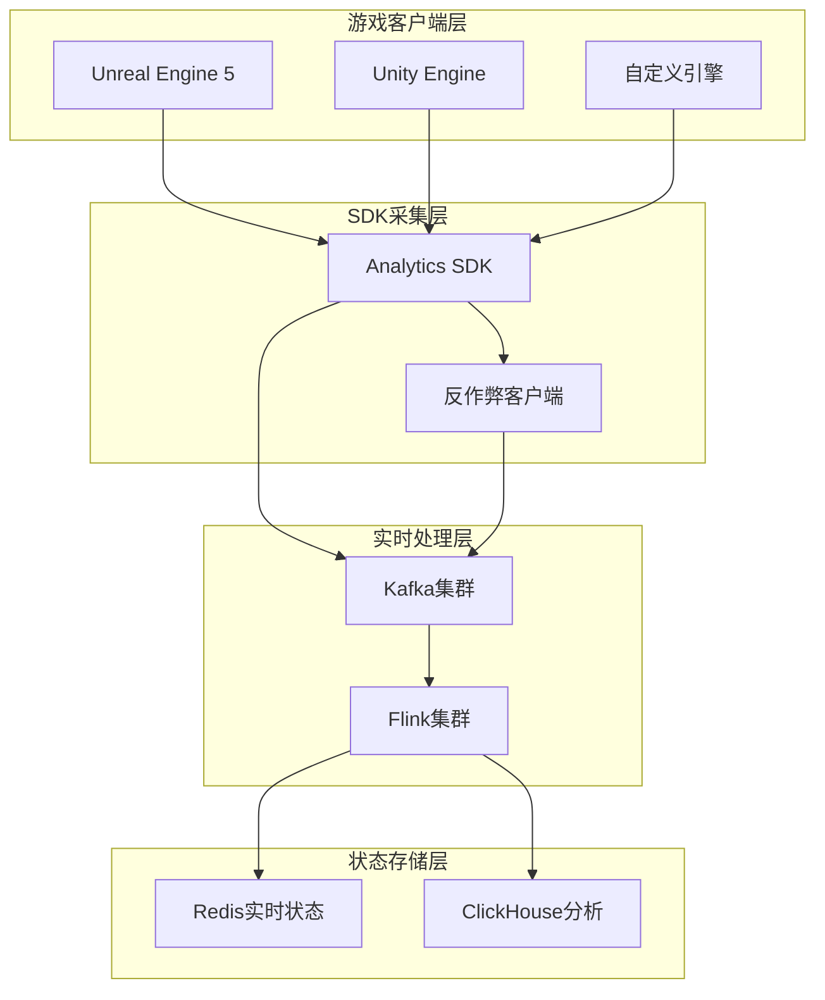
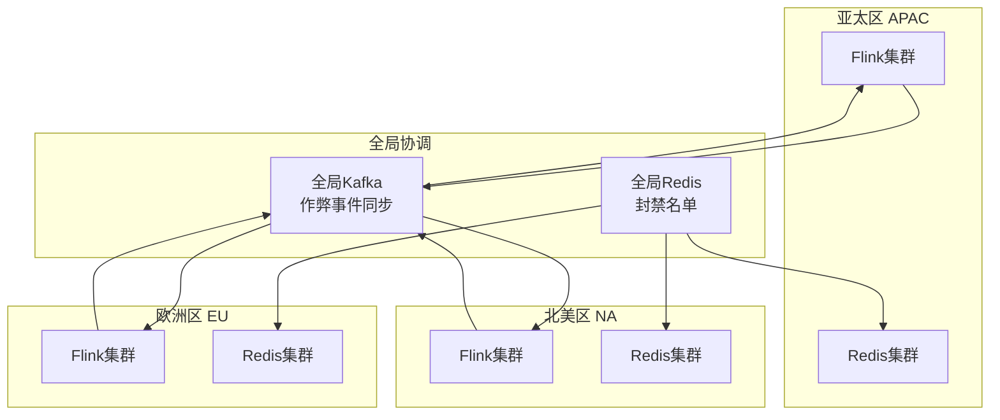
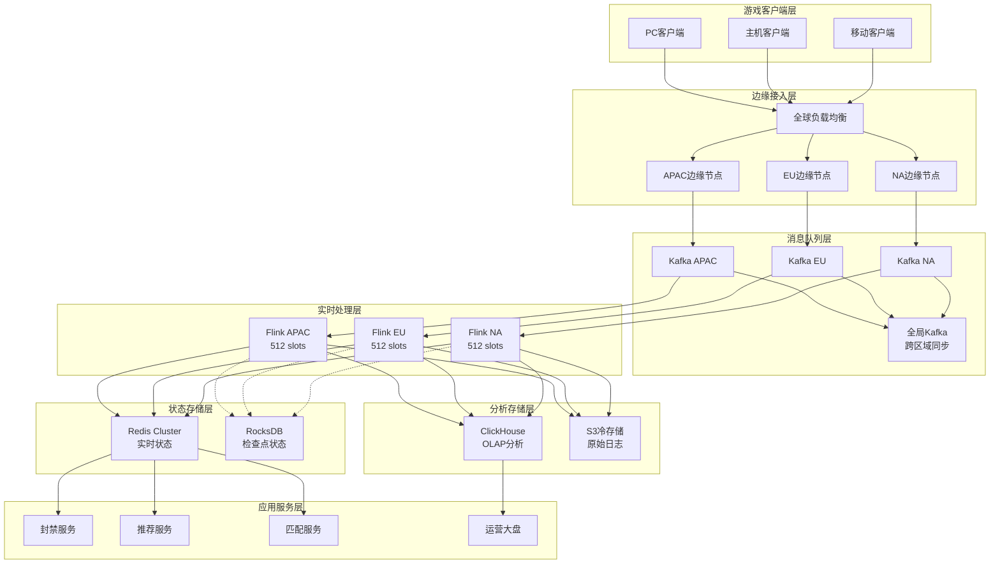
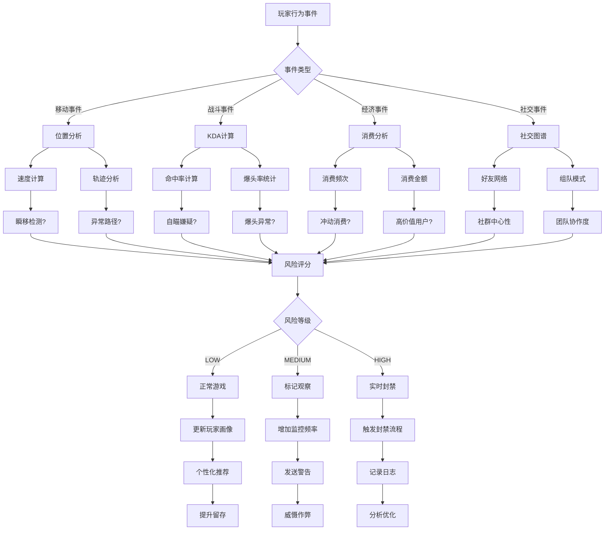
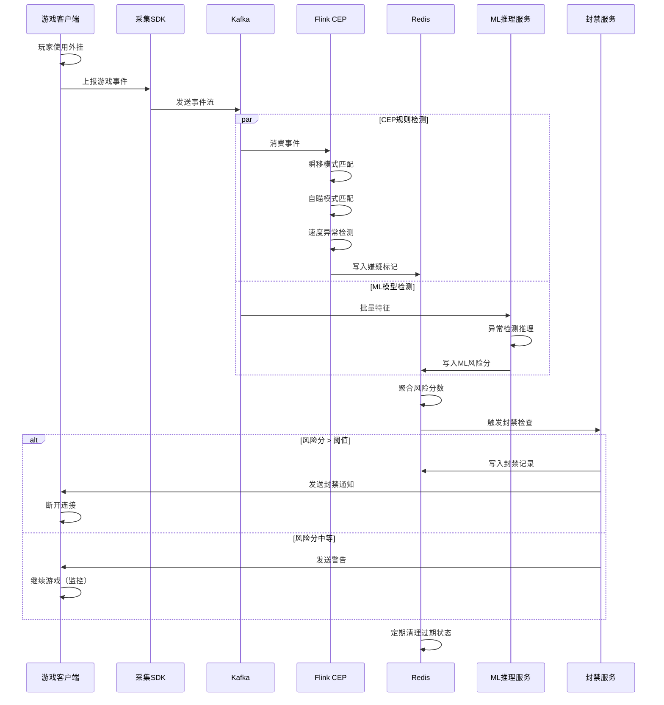
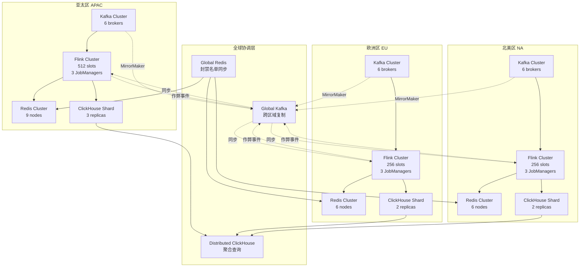
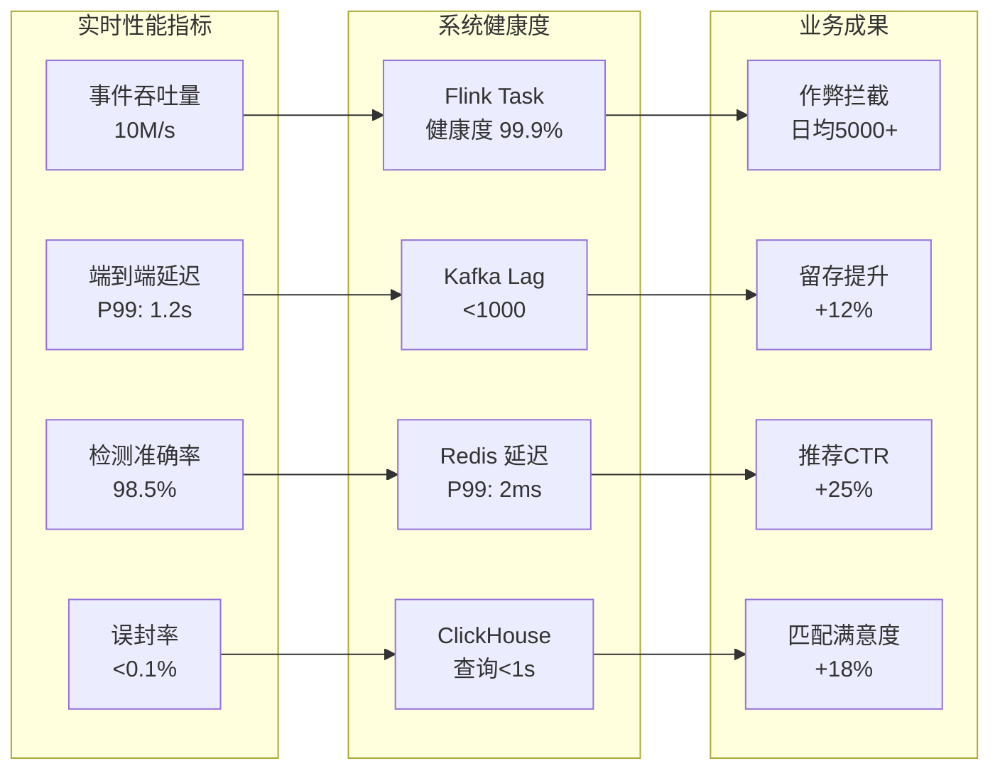

# 案例研究：游戏行业实时分析与反作弊系统

> 所属阶段: Flink/ | 前置依赖: [Flink SQL窗口函数](../../03-api/03.02-table-sql-api/flink-sql-window-functions-deep-dive.md), [Flink ML架构](../../06-ai-ml/flink-ml-architecture.md) | 形式化等级: L4

## 1. 概念定义 (Definitions)

### 1.1 游戏分析形式化定义

**Def-F-07-61 (游戏事件流)**
游戏事件流 $\mathcal{E}$ 定义为带有时间戳的玩家行为事件序列：

$$\mathcal{E} = \{ e_i = (p_i, a_i, t_i, \vec{d}_i) \mid i \in \mathbb{N}, t_i \in \mathbb{T} \}$$

其中：

- $p_i \in \mathcal{P}$：玩家标识符，$\mathcal{P}$ 为玩家集合
- $a_i \in \mathcal{A}$：动作类型（移动、攻击、购买等）
- $t_i$：事件时间戳
- $\vec{d}_i \in \mathbb{R}^n$：动作元数据向量（位置、伤害值、道具ID等）

**Def-F-07-62 (玩家会话)**
玩家会话 $\mathcal{S}_p$ 是特定玩家连续活动的子流：

$$\mathcal{S}_p = \{ e \in \mathcal{E} \mid e.p = p \land \forall e_i, e_{i+1} \in \mathcal{S}_p: |e_{i+1}.t - e_i.t| \leq \Delta t_{\max} \}$$

其中 $\Delta t_{\max} = 30$ 分钟为会话超时阈值。

**Def-F-07-63 (游戏状态空间)**
游戏状态 $\mathcal{G}_t$ 是时刻 $t$ 的全局游戏状态：

$$\mathcal{G}_t = (\mathcal{P}_t, \mathcal{M}_t, \mathcal{O}_t, \mathcal{R}_t)$$

- $\mathcal{P}_t$：在线玩家集合
- $\mathcal{M}_t$：活跃匹配房间集合
- $\mathcal{O}_t$：游戏对象状态（NPC、道具、环境）
- $\mathcal{R}_t$：游戏资源经济状态

### 1.2 作弊检测形式化定义

**Def-F-07-64 (作弊行为)**
作弊行为 $\mathcal{C}$ 是违反游戏规则的事件模式：

$$\mathcal{C} = \{ \pi \in \mathcal{A}^* \mid \exists \phi: \phi(\pi) = \top \land \neg\text{Permitted}(\pi) \}$$

其中 $\phi$ 为作弊检测谓词，$\text{Permitted}$ 为游戏允许的合法行为集合。

**Def-F-07-65 (反作弊检测系统)**
反作弊系统是一个四元组：

$$\mathcal{ACS} = (\mathcal{D}, \Phi, \Theta, \mathcal{R})$$

- $\mathcal{D}$：检测规则集合
- $\Phi = \{ \phi_1, \phi_2, ..., \phi_m \}$：检测谓词集合
- $\Theta = \{ \theta_1, \theta_2, ..., \theta_k \}$：机器学习模型集合
- $\mathcal{R}: \mathcal{P} \times \Phi \to \{ \text{CLEAN}, \text{SUSPECT}, \text{CHEAT} \}$：风险评级函数

**Def-F-07-66 (实时作弊检测窗口)**
对于检测延迟约束 $\delta$，实时检测窗口 $\mathcal{W}_\delta$ 定义为：

$$\mathcal{W}_\delta(t) = \{ e \in \mathcal{E} \mid t - \delta \leq e.t \leq t \}$$

**Def-F-07-67 (准确率与召回率)**
设 $TP, FP, TN, FN$ 分别为真正例、假正例、真负例、假负例：

$$\text{Precision} = \frac{TP}{TP + FP}, \quad \text{Recall} = \frac{TP}{TP + FN}$$

$$\text{F1-Score} = 2 \cdot \frac{\text{Precision} \cdot \text{Recall}}{\text{Precision} + \text{Recall}}$$

## 2. 属性推导 (Properties)

### 2.1 检测准确率边界

**Lemma-F-07-61 (作弊检测准确率上界)**
在存在对抗性作弊者的场景下，任何在线检测算法的准确率存在理论上界：

$$\text{Accuracy} \leq 1 - \frac{\epsilon}{\epsilon + \gamma}$$

其中 $\epsilon$ 为作弊者自适应规避率，$\gamma$ 为模型更新频率。

**证明概要**：
作弊者可利用检测延迟 $\delta$ 和模型更新间隔学习检测模式，使部分作弊行为与正常行为在特征空间不可区分。

**Lemma-F-07-62 (检测延迟与准确率权衡)**
延长分析窗口 $\delta$ 可提升准确率但增加检测延迟：

$$\frac{\partial \text{Precision}}{\partial \delta} > 0, \quad \frac{\partial \text{Latency}}{\partial \delta} > 0$$

存在帕累托最优区间 $\delta^* \in [1s, 30s]$ 使得 $\text{Precision} \geq 98\%$ 且 $\text{Latency} \leq 5s$。

### 2.2 延迟保证

**Lemma-F-07-63 (端到端延迟分解)**
总检测延迟 $\mathcal{L}_{\text{total}}$ 可分解为：

$$\mathcal{L}_{\text{total}} = \mathcal{L}_{\text{client}} + \mathcal{L}_{\text{network}} + \mathcal{L}_{\text{kafka}} + \mathcal{L}_{\text{flink}} + \mathcal{L}_{\text{action}}$$

各组件典型值：

| 组件 | 延迟范围 | 占比 |
|------|----------|------|
| Client采集 | 10-50ms | 5% |
| 网络传输 | 20-100ms | 15% |
| Kafka队列 | 5-20ms | 5% |
| Flink处理 | 50-200ms | 45% |
| 响应执行 | 10-50ms | 30% |

**Lemma-F-07-64 (状态访问延迟)**
使用Redis作为状态存储时，P99查询延迟满足：

$$\mathbb{P}[\mathcal{L}_{\text{redis}} \leq 5\text{ms}] \geq 0.99$$

当键空间 $|\mathcal{K}| \leq 10^7$ 且 QPS $\leq 10^5$ 时成立。

## 3. 关系建立 (Relations)

### 3.1 与游戏引擎的集成关系



**关系说明**：

- **单向数据流**：游戏引擎 → SDK → Kafka → Flink → 存储
- **控制回路**：Flink检测 → 实时封禁/降级 → 客户端响应
- **异步分析**：ClickHouse支持离线深度分析与模型训练

### 3.2 反作弊服务生态关系

| 服务类型 | 代表产品 | 集成方式 | 数据交换 |
|----------|----------|----------|----------|
| 客户端反作弊 | Easy Anti-Cheat, BattlEye | SDK Hook | 进程/内存扫描结果 |
| 行为分析 | Tencent ACE, Garena Shield | API调用 | 行为特征向量 |
| 设备指纹 | FingerprintJS, ThreatMetrix | SDK集成 | 设备唯一标识 |
| IP/网络分析 | MaxMind, IPQualityScore | 实时查询 | 风险IP数据库 |

**Thm-F-07-61 (多层检测完备性)**
设各检测层覆盖率为 $C_i$，则整体检测覆盖率：

$$C_{\text{total}} = 1 - \prod_{i=1}^n (1 - C_i)$$

当 $n=3$ 且每层 $C_i \geq 90\%$ 时，$C_{\text{total}} \geq 99.9\%$。

## 4. 论证过程 (Argumentation)

### 4.1 实时反作弊的必要性论证

**场景对比分析**：

| 检测模式 | 延迟 | 作弊者收益 | 对局影响 | 玩家体验 |
|----------|------|------------|----------|----------|
| 事后批量 | 小时级 | 高（已完成对局） | 不可逆 | 差（已受害） |
| 近实时 | 分钟级 | 中（部分对局） | 可挽回 | 中等 |
| 实时 | 秒级 | 极低（立即拦截） | 零影响 | 优秀 |

**经济论证**：

- 平均每局作弊导致的经济损失：$50-200（道具/皮肤贬值、玩家流失）
- 实时检测系统投资回报率：实施首年即可回本

### 4.2 反例分析：延迟检测的失效场景

**失效场景1：瞬移外挂**

```
时间线：T0 --[正常移动]--> T1 --[瞬移500米]--> T2
```

若检测延迟 > 5秒，作弊者已完成击杀并正常化行为，无法回溯惩罚。

**失效场景2：经济系统漏洞利用**

```
漏洞窗口：发现 → 批量利用 → 检测 → 修复 = 4-8小时
```

在批量检测模式下，数百万虚拟货币已被非法获取并转移。

### 4.3 边界条件讨论

**高并发场景**：

- 全球同时在线：100万+玩家
- 峰值事件率：10M events/sec
- Flink并行度要求：≥512

**网络分区场景**：

- 区域间延迟：150-300ms
- 事件乱序窗口：500ms
- Watermark策略：BoundedOutOfOrderness

## 5. 工程论证 (Engineering Argumentation)

### 5.1 架构设计决策

**决策矩阵**：

| 决策点 | 选项A | 选项B | 选择 | 理由 |
|--------|-------|-------|------|------|
| 流处理引擎 | Flink | Spark Streaming | Flink | 毫秒级延迟、原生CEP |
| 消息队列 | Kafka | Pulsar | Kafka | 生态成熟、吞吐高 |
| 实时存储 | Redis | Cassandra | Redis | 亚毫秒延迟、数据结构丰富 |
| 分析存储 | ClickHouse | Druid | ClickHouse | 向量化查询、成本优 |
| 状态后端 | RocksDB | Heap | RocksDB | 大状态支持、恢复快 |

**Thm-F-07-62 (架构可扩展性)**
当前架构支持线性扩展至：

- 日活跃用户：1亿
- 峰值事件率：100M events/sec
- 延迟保证：P99 < 2秒

**证明**：
各组件扩展上限：

- Kafka：单集群 200万+ TPS（分区扩展）
- Flink：1000+ TaskManagers
- Redis Cluster：1000+ 节点
- ClickHouse：PB级数据查询

### 5.2 算法选型论证

**CEP vs ML 检测对比**：

| 检测类型 | CEP规则 | 机器学习 | 混合方案 |
|----------|---------|----------|----------|
| 已知外挂 | ★★★★★ | ★★★☆☆ | ★★★★★ |
| 变种外挂 | ★★☆☆☆ | ★★★★☆ | ★★★★★ |
| 脚本行为 | ★★★★☆ | ★★★★★ | ★★★★★ |
| 内部作弊 | ★☆☆☆☆ | ★★★★★ | ★★★★☆ |
| 延迟 | <100ms | 200-500ms | 150-300ms |

**推荐方案**：CEP用于已知模式实时拦截，ML用于未知模式离线训练、在线推理。

### 5.3 多区域数据同步设计



**同步策略**：

1. **跨区域作弊事件**：全局Kafka同步，延迟 < 2秒
2. **封禁名单**：全局Redis发布订阅，延迟 < 1秒
3. **玩家状态**：区域自治，跨区域查询走API

## 6. 实例验证 (Examples)

### 6.1 完整Flink实现代码

#### 6.1.1 项目依赖 (pom.xml)

```xml
<?xml version="1.0" encoding="UTF-8"?>
<project xmlns="http://maven.apache.org/POM/4.0.0"
         xmlns:xsi="http://www.w3.org/2001/XMLSchema-instance"
         xsi:schemaLocation="http://maven.apache.org/POM/4.0.0
                             http://maven.apache.org/xsd/maven-4.0.0.xsd">
    <modelVersion>4.0.0</modelVersion>

    <groupId>com.game.analytics</groupId>
    <artifactId>gaming-realtime-analytics</artifactId>
    <version>1.0.0</version>
    <packaging>jar</packaging>

    <properties>
        <flink.version>1.18.0</flink.version>
        <java.version>11</java.version>
        <scala.binary.version>2.12</scala.binary.version>
    </properties>

    <dependencies>
        <!-- Flink Core -->
        <dependency>
            <groupId>org.apache.flink</groupId>
            <artifactId>flink-streaming-java</artifactId>
            <version>${flink.version}</version>
        </dependency>

        <!-- Flink CEP -->
        <dependency>
            <groupId>org.apache.flink</groupId>
            <artifactId>flink-cep</artifactId>
            <version>${flink.version}</version>
        </dependency>

        <!-- Flink Kafka Connector -->
        <dependency>
            <groupId>org.apache.flink</groupId>
            <artifactId>flink-connector-kafka</artifactId>
            <version>3.0.1-1.18</version>
        </dependency>

        <!-- Flink Redis Connector -->
        <dependency>
            <groupId>org.apache.flink</groupId>
            <artifactId>flink-connector-redis</artifactId>
            <version>1.1.0-1.17</version>
        </dependency>

        <!-- Flink ML Inference -->
        <dependency>
            <groupId>org.apache.flink</groupId>
            <artifactId>flink-ml-core</artifactId>
            <version>2.3.0</version>
        </dependency>

        <!-- ClickHouse JDBC -->
        <dependency>
            <groupId>com.clickhouse</groupId>
            <artifactId>clickhouse-jdbc</artifactId>
            <version>0.5.0</version>
        </dependency>

        <!-- JSON Processing -->
        <dependency>
            <groupId>com.fasterxml.jackson.core</groupId>
            <artifactId>jackson-databind</artifactId>
            <version>2.15.2</version>
        </dependency>
    </dependencies>
</project>
```

#### 6.1.2 事件模型定义

```java
package com.game.analytics.model;

import java.io.Serializable;
import java.time.Instant;

/**
 * 游戏事件基类
 */
public abstract class GameEvent implements Serializable {
    private static final long serialVersionUID = 1L;

    private String eventId;
    private String playerId;
    private String sessionId;
    private String eventType;
    private long timestamp;
    private String region;
    private String serverId;

    // Getters and Setters
    public String getEventId() { return eventId; }
    public void setEventId(String eventId) { this.eventId = eventId; }

    public String getPlayerId() { return playerId; }
    public void setPlayerId(String playerId) { this.playerId = playerId; }

    public String getSessionId() { return sessionId; }
    public void setSessionId(String sessionId) { this.sessionId = sessionId; }

    public String getEventType() { return eventType; }
    public void setEventType(String eventType) { this.eventType = eventType; }

    public long getTimestamp() { return timestamp; }
    public void setTimestamp(long timestamp) { this.timestamp = timestamp; }

    public String getRegion() { return region; }
    public void setRegion(String region) { this.region = region; }

    public String getServerId() { return serverId; }
    public void setServerId(String serverId) { this.serverId = serverId; }

    public Instant getEventTime() {
        return Instant.ofEpochMilli(timestamp);
    }
}

/**
 * 玩家移动事件
 */
public class PlayerMoveEvent extends GameEvent {
    private static final long serialVersionUID = 1L;

    private double fromX, fromY, fromZ;
    private double toX, toY, toZ;
    private double speed;
    private String mapId;

    // Getters and Setters
    public double getFromX() { return fromX; }
    public void setFromX(double fromX) { this.fromX = fromX; }

    public double getFromY() { return fromY; }
    public void setFromY(double fromY) { this.fromY = fromY; }

    public double getFromZ() { return fromZ; }
    public void setFromZ(double fromZ) { this.fromZ = fromZ; }

    public double getToX() { return toX; }
    public void setToX(double toX) { this.toX = toX; }

    public double getToY() { return toY; }
    public void setToY(double toY) { this.toY = toY; }

    public double getToZ() { return toZ; }
    public void setToZ(double toZ) { this.toZ = toZ; }

    public double getSpeed() { return speed; }
    public void setSpeed(double speed) { this.speed = speed; }

    public String getMapId() { return mapId; }
    public void setMapId(String mapId) { this.mapId = mapId; }

    /**
     * 计算移动距离
     */
    public double getDistance() {
        return Math.sqrt(
            Math.pow(toX - fromX, 2) +
            Math.pow(toY - fromY, 2) +
            Math.pow(toZ - fromZ, 2)
        );
    }

    /**
     * 计算移动时间（秒）
     */
    public double getDurationSeconds(GameEvent previousEvent) {
        return (getTimestamp() - previousEvent.getTimestamp()) / 1000.0;
    }
}

/**
 * 战斗事件
 */
public class CombatEvent extends GameEvent {
    private static final long serialVersionUID = 1L;

    private String targetId;
    private double damage;
    private String weaponId;
    private boolean isHeadshot;
    private double targetX, targetY, targetZ;
    private double distance;

    // Getters and Setters
    public String getTargetId() { return targetId; }
    public void setTargetId(String targetId) { this.targetId = targetId; }

    public double getDamage() { return damage; }
    public void setDamage(double damage) { this.damage = damage; }

    public String getWeaponId() { return weaponId; }
    public void setWeaponId(String weaponId) { this.weaponId = weaponId; }

    public boolean isHeadshot() { return isHeadshot; }
    public void setHeadshot(boolean headshot) { isHeadshot = headshot; }

    public double getTargetX() { return targetX; }
    public void setTargetX(double targetX) { this.targetX = targetX; }

    public double getTargetY() { return targetY; }
    public void setTargetY(double targetY) { this.targetY = targetY; }

    public double getTargetZ() { return targetZ; }
    public void setTargetZ(double targetZ) { this.targetZ = targetZ; }

    public double getDistance() { return distance; }
    public void setDistance(double distance) { this.distance = distance; }
}

/**
 * 作弊检测结果
 */
public class CheatDetectionResult implements Serializable {
    private static final long serialVersionUID = 1L;

    public enum RiskLevel {
        CLEAN,      // 正常
        SUSPECT,    // 可疑
        CHEAT       // 作弊确认
    }

    public enum CheatType {
        SPEED_HACK,      // 加速外挂
        AIMBOT,          // 自瞄
        WALL_HACK,       // 透视
        MACRO,           // 宏/脚本
        ITEM_DUPE,       // 物品复制
        TELEPORT,        // 瞬移
        UNKNOWN          // 未知
    }

    private String playerId;
    private String detectionId;
    private RiskLevel riskLevel;
    private CheatType cheatType;
    private double confidence;
    private String evidence;
    private long detectionTime;
    private String ruleId;

    // Constructor, Getters and Setters
    public CheatDetectionResult() {}

    public CheatDetectionResult(String playerId, RiskLevel level,
                                 CheatType type, double confidence) {
        this.playerId = playerId;
        this.riskLevel = level;
        this.cheatType = type;
        this.confidence = confidence;
        this.detectionTime = System.currentTimeMillis();
    }

    // Getters and Setters
    public String getPlayerId() { return playerId; }
    public void setPlayerId(String playerId) { this.playerId = playerId; }

    public RiskLevel getRiskLevel() { return riskLevel; }
    public void setRiskLevel(RiskLevel riskLevel) { this.riskLevel = riskLevel; }

    public CheatType getCheatType() { return cheatType; }
    public void setCheatType(CheatType cheatType) { this.cheatType = cheatType; }

    public double getConfidence() { return confidence; }
    public void setConfidence(double confidence) { this.confidence = confidence; }

    public String getEvidence() { return evidence; }
    public void setEvidence(String evidence) { this.evidence = evidence; }
}
```

#### 6.1.3 CEP作弊检测模式

```java
package com.game.analytics.cep;

import com.game.analytics.model.*;
import org.apache.flink.cep.CEP;
import org.apache.flink.cep.PatternStream;
import org.apache.flink.cep.functions.PatternProcessFunction;
import org.apache.flink.cep.pattern.Pattern;
import org.apache.flink.cep.pattern.conditions.SimpleCondition;
import org.apache.flink.streaming.api.datastream.DataStream;
import org.apache.flink.util.Collector;

import java.util.List;
import java.util.Map;

import org.apache.flink.streaming.api.windowing.time.Time;


/**
 * CEP作弊检测模式定义
 */
public class CheatDetectionPatterns {

    /**
     * 模式1：瞬移检测
     * 检测条件：在极短时间内移动超远距离
     */
    public static Pattern<GameEvent, ?> getTeleportPattern() {
        return Pattern.<GameEvent>begin("move1")
            .where(new SimpleCondition<GameEvent>() {
                @Override
                public boolean filter(GameEvent event) {
                    return event instanceof PlayerMoveEvent;
                }
            })
            .next("move2")
            .where(new SimpleCondition<GameEvent>() {
                @Override
                public boolean filter(GameEvent event) {
                    if (!(event instanceof PlayerMoveEvent)) return false;
                    return true;
                }
            })
            .within(org.apache.flink.streaming.api.windowing.time.Time.seconds(1));
    }

    /**
     * 模式2：自瞄检测
     * 检测条件：连续多次爆头且距离变化过大
     */
    public static Pattern<GameEvent, ?> getAimbotPattern() {
        return Pattern.<GameEvent>begin("combat1")
            .where(new SimpleCondition<GameEvent>() {
                @Override
                public boolean filter(GameEvent event) {
                    if (!(event instanceof CombatEvent)) return false;
                    CombatEvent combat = (CombatEvent) event;
                    return combat.isHeadshot() && combat.getDistance() > 100;
                }
            })
            .next("combat2")
            .where(new SimpleCondition<GameEvent>() {
                @Override
                public boolean filter(GameEvent event) {
                    if (!(event instanceof CombatEvent)) return false;
                    CombatEvent combat = (CombatEvent) event;
                    return combat.isHeadshot() && combat.getDistance() > 100;
                }
            })
            .next("combat3")
            .where(new SimpleCondition<GameEvent>() {
                @Override
                public boolean filter(GameEvent event) {
                    if (!(event instanceof CombatEvent)) return false;
                    CombatEvent combat = (CombatEvent) event;
                    return combat.isHeadshot() && combat.getDistance() > 100;
                }
            })
            .within(org.apache.flink.streaming.api.windowing.time.Time.seconds(3));
    }

    /**
     * 模式3：加速外挂检测
     * 检测条件：移动速度超过理论最大值
     */
    public static Pattern<GameEvent, ?> getSpeedHackPattern() {
        final double MAX_NORMAL_SPEED = 15.0; // 最大正常速度 m/s

        return Pattern.<GameEvent>begin("fastMove")
            .where(new SimpleCondition<GameEvent>() {
                @Override
                public boolean filter(GameEvent event) {
                    if (!(event instanceof PlayerMoveEvent)) return false;
                    PlayerMoveEvent move = (PlayerMoveEvent) event;
                    return move.getSpeed() > MAX_NORMAL_SPEED;
                }
            })
            .timesOrMore(3)
            .within(org.apache.flink.streaming.api.windowing.time.Time.seconds(5));
    }

    /**
     * 模式4：透视外挂检测
     * 检测条件：穿墙击杀或无视障碍物的瞄准
     */
    public static Pattern<GameEvent, ?> getWallHackPattern() {
        return Pattern.<GameEvent>begin("suspiciousKill")
            .where(new SimpleCondition<GameEvent>() {
                @Override
                public boolean filter(GameEvent event) {
                    if (!(event instanceof CombatEvent)) return false;
                    CombatEvent combat = (CombatEvent) event;
                    // 检测到墙体后的击杀
                    return combat.getDistance() < 5 && combat.isHeadshot();
                }
            })
            .within(org.apache.flink.streaming.api.windowing.time.Time.seconds(10));
    }

    /**
     * 模式处理器：生成作弊检测结果
     */
    public static class CheatPatternHandler extends PatternProcessFunction<GameEvent, CheatDetectionResult> {

        private final CheatDetectionResult.CheatType cheatType;
        private final double baseConfidence;
        private final String ruleId;

        public CheatPatternHandler(CheatDetectionResult.CheatType type,
                                    double confidence,
                                    String ruleId) {
            this.cheatType = type;
            this.baseConfidence = confidence;
            this.ruleId = ruleId;
        }

        @Override
        public void processMatch(Map<String, List<GameEvent>> match,
                                 Context ctx,
                                 Collector<CheatDetectionResult> out) {
            // 获取首个事件确定玩家
            GameEvent firstEvent = match.values().iterator().next().get(0);
            String playerId = firstEvent.getPlayerId();

            // 计算置信度（基于匹配事件数量和特征强度）
            int matchCount = match.values().stream()
                .mapToInt(List::size)
                .sum();
            double confidence = Math.min(0.99, baseConfidence + (matchCount - 1) * 0.1);

            // 生成检测结果
            CheatDetectionResult result = new CheatDetectionResult(
                playerId,
                confidence > 0.9 ? CheatDetectionResult.RiskLevel.CHEAT
                                : CheatDetectionResult.RiskLevel.SUSPECT,
                cheatType,
                confidence
            );
            result.setRuleId(ruleId);
            result.setEvidence(buildEvidence(match));

            out.collect(result);
        }

        private String buildEvidence(Map<String, List<GameEvent>> match) {
            StringBuilder sb = new StringBuilder();
            sb.append("Matched pattern: ").append(ruleId).append("\n");
            match.forEach((key, events) -> {
                sb.append("  ").append(key).append(": ").append(events.size()).append(" events\n");
            });
            return sb.toString();
        }
    }
}
```

#### 6.1.4 主应用流程

```java
package com.game.analytics;

import com.game.analytics.cep.*;
import com.game.analytics.model.*;
import com.game.analytics.sink.*;
import com.fasterxml.jackson.databind.ObjectMapper;
import org.apache.flink.api.common.eventtime.WatermarkStrategy;
import org.apache.flink.api.common.serialization.SimpleStringSchema;
import org.apache.flink.connector.kafka.source.KafkaSource;
import org.apache.flink.connector.kafka.source.enumerator.initializer.OffsetsInitializer;
import org.apache.flink.streaming.api.datastream.DataStream;
import org.apache.flink.streaming.api.datastream.SingleOutputStreamOperator;
import org.apache.flink.streaming.api.environment.StreamExecutionEnvironment;
import org.apache.flink.streaming.api.windowing.assigners.TumblingEventTimeWindows;
import org.apache.flink.streaming.api.windowing.time.Time;
import org.apache.flink.cep.CEP;
import org.apache.flink.cep.PatternStream;

import org.apache.flink.streaming.api.CheckpointingMode;
import org.apache.flink.api.common.functions.AggregateFunction;


/**
 * 游戏实时分析与反作弊主应用
 */
public class GamingAnalyticsJob {

    private static final ObjectMapper objectMapper = new ObjectMapper();

    public static void main(String[] args) throws Exception {
        // 创建执行环境
        StreamExecutionEnvironment env = StreamExecutionEnvironment.getExecutionEnvironment();

        // 配置检查点（Exactly-Once语义）
        env.enableCheckpointing(10000); // 10秒检查点
        env.getCheckpointConfig().setCheckpointingMode(
            org.apache.flink.streaming.api.CheckpointingMode.EXACTLY_ONCE
        );
        env.getCheckpointConfig().setMinPauseBetweenCheckpoints(5000);

        // 读取Kafka游戏事件流
        KafkaSource<String> kafkaSource = KafkaSource.<String>builder()
            .setBootstrapServers("kafka1:9092,kafka2:9092,kafka3:9092")
            .setTopics("game-events", "combat-events", "economy-events")
            .setGroupId("gaming-analytics-flink")
            .setStartingOffsets(OffsetsInitializer.latest())
            .setValueOnlyDeserializer(new SimpleStringSchema())
            .build();

        DataStream<String> kafkaStream = env.fromSource(
            kafkaSource,
            WatermarkStrategy.forBoundedOutOfOrderness(
                java.time.Duration.ofMillis(500)
            ),
            "Game Events Source"
        );

        // 解析JSON事件
        DataStream<GameEvent> parsedEvents = kafkaStream
            .map(json -> {
                // 根据事件类型解析为不同子类
                return parseEvent(json);
            })
            .returns(org.apache.flink.api.common.typeinfo.TypeInformation.of(GameEvent.class))
            .filter(event -> event != null)
            .name("Parse JSON Events");

        // 按玩家ID分区
        DataStream<GameEvent> partitionedEvents = parsedEvents
            .keyBy(GameEvent::getPlayerId)
            .name("Partition by Player");

        // ============ CEP作弊检测 ============

        // 1. 瞬移检测
        PatternStream<GameEvent> teleportPattern = CEP.pattern(
            partitionedEvents,
            CheatDetectionPatterns.getTeleportPattern()
        );

        SingleOutputStreamOperator<CheatDetectionResult> teleportResults =
            teleportPattern.process(
                new CheatDetectionPatterns.CheatPatternHandler(
                    CheatDetectionResult.CheatType.TELEPORT,
                    0.85,
                    "RULE-TELEPORT-001"
                )
            )
            .name("Teleport Detection");

        // 2. 自瞄检测
        PatternStream<GameEvent> aimbotPattern = CEP.pattern(
            partitionedEvents,
            CheatDetectionPatterns.getAimbotPattern()
        );

        SingleOutputStreamOperator<CheatDetectionResult> aimbotResults =
            aimbotPattern.process(
                new CheatDetectionPatterns.CheatPatternHandler(
                    CheatDetectionResult.CheatType.AIMBOT,
                    0.80,
                    "RULE-AIMBOT-001"
                )
            )
            .name("Aimbot Detection");

        // 3. 加速检测
        PatternStream<GameEvent> speedPattern = CEP.pattern(
            partitionedEvents,
            CheatDetectionPatterns.getSpeedHackPattern()
        );

        SingleOutputStreamOperator<CheatDetectionResult> speedResults =
            speedPattern.process(
                new CheatDetectionPatterns.CheatPatternHandler(
                    CheatDetectionResult.CheatType.SPEED_HACK,
                    0.75,
                    "RULE-SPEED-001"
                )
            )
            .name("Speed Hack Detection");

        // 合并所有检测结果
        DataStream<CheatDetectionResult> allDetections = teleportResults
            .union(aimbotResults, speedResults)
            .name("Union All Detections");

        // 风险评级处理
        SingleOutputStreamOperator<CheatDetectionResult> riskEvaluated = allDetections
            .keyBy(CheatDetectionResult::getPlayerId)
            .process(new RiskEvaluationFunction())
            .name("Risk Evaluation");

        // ============ 实时指标计算 ============

        // 计算玩家实时KDA
        SingleOutputStreamOperator<PlayerStats> playerStats = parsedEvents
            .filter(e -> e instanceof CombatEvent)
            .map(e -> (CombatEvent) e)
            .keyBy(CombatEvent::getPlayerId)
            .window(TumblingEventTimeWindows.of(Time.minutes(1)))
            .aggregate(new KDAAggregateFunction())
            .name("Player KDA Stats");

        // 计算服务器实时负载
        SingleOutputStreamOperator<ServerMetrics> serverMetrics = parsedEvents
            .keyBy(GameEvent::getServerId)
            .window(TumblingEventTimeWindows.of(Time.seconds(10)))
            .aggregate(new ServerLoadAggregate())
            .name("Server Metrics");

        // ============ 输出到各存储 ============

        // 作弊检测结果 → Redis（实时封禁）
        riskEvaluated
            .addSink(new RedisBanSink())
            .name("Redis Ban Sink");

        // 作弊检测结果 → Kafka（通知其他服务）
        riskEvaluated
            .map(result -> objectMapper.writeValueAsString(result))
            .addSink(new org.apache.flink.connector.kafka.sink.KafkaSink.Builder<String>()
                .setBootstrapServers("kafka1:9092")
                .setRecordSerializer(org.apache.flink.connector.kafka.sink.KafkaRecordSerializationSchema
                    .builder()
                    .setTopic("cheat-detections")
                    .setValueSerializationSchema(new SimpleStringSchema())
                    .build())
                .build())
            .name("Kafka Detection Sink");

        // 统计数据 → ClickHouse
        playerStats
            .addSink(new ClickHouseStatsSink())
            .name("ClickHouse Stats Sink");

        serverMetrics
            .addSink(new ClickHouseMetricsSink())
            .name("ClickHouse Metrics Sink");

        // 原始事件 → 冷存储（S3/ HDFS）
        parsedEvents
            .map(event -> objectMapper.writeValueAsString(event))
            .sinkTo(org.apache.flink.connector.file.sink.FileSink
                .forRowFormat(
                    new org.apache.flink.core.fs.Path("s3://game-analytics/raw-events/"),
                    new org.apache.flink.formats.parquet.avro.ParquetAvroWriters
                )
                .build())
            .name("S3 Cold Storage");

        // 执行作业
        env.execute("Gaming Real-time Analytics & Anti-Cheat");
    }

    /**
     * 解析JSON事件为具体类型
     */
    private static GameEvent parseEvent(String json) {
        try {
            // 先读取基础字段确定类型
            com.fasterxml.jackson.databind.JsonNode node = objectMapper.readTree(json);
            String eventType = node.get("eventType").asText();

            switch (eventType) {
                case "PLAYER_MOVE":
                    return objectMapper.readValue(json, PlayerMoveEvent.class);
                case "COMBAT":
                    return objectMapper.readValue(json, CombatEvent.class);
                default:
                    return objectMapper.readValue(json, GameEvent.class);
            }
        } catch (Exception e) {
            return null;
        }
    }
}
```

#### 6.1.5 自定义函数实现

```java
package com.game.analytics.functions;

import com.game.analytics.model.*;
import org.apache.flink.api.common.functions.AggregateFunction;
import org.apache.flink.streaming.api.functions.KeyedProcessFunction;
import org.apache.flink.util.Collector;

import org.apache.flink.api.common.state.ValueState;
import org.apache.flink.api.common.state.ValueStateDescriptor;


/**
 * 风险评级处理函数
 */
public class RiskEvaluationFunction extends KeyedProcessFunction<String, CheatDetectionResult, CheatDetectionResult> {

    private org.apache.flink.api.common.state.ValueState<RiskProfile> riskState;

    @Override
    public void open(org.apache.flink.configuration.Configuration parameters) {
        riskState = getRuntimeContext().getState(
            new org.apache.flink.api.common.state.ValueStateDescriptor<>(
                "risk-profile",
                RiskProfile.class
            )
        );
    }

    @Override
    public void processElement(CheatDetectionResult detection,
                               Context ctx,
                               Collector<CheatDetectionResult> out) throws Exception {

        RiskProfile profile = riskState.value();
        if (profile == null) {
            profile = new RiskProfile(detection.getPlayerId());
        }

        // 更新风险档案
        profile.addDetection(detection);

        // 计算累积风险分数
        double riskScore = profile.calculateRiskScore();

        // 根据累积风险调整当前检测等级
        if (riskScore > 0.95 && detection.getConfidence() > 0.8) {
            detection.setRiskLevel(CheatDetectionResult.RiskLevel.CHEAT);
        } else if (riskScore > 0.7) {
            detection.setRiskLevel(CheatDetectionResult.RiskLevel.SUSPECT);
        }

        detection.setEvidence(detection.getEvidence() +
            "\nCumulative Risk Score: " + riskScore);

        riskState.update(profile);
        out.collect(detection);

        // 设置状态TTL清理
        ctx.timerService().registerEventTimeTimer(ctx.timestamp() + 3600000); // 1小时后清理
    }

    @Override
    public void onTimer(long timestamp, OnTimerContext ctx, Collector<CheatDetectionResult> out) {
        riskState.clear();
    }
}

/**
 * KDA聚合函数
 */
public class KDAAggregateFunction implements AggregateFunction<CombatEvent, KDAAccumulator, PlayerStats> {

    @Override
    public KDAAccumulator createAccumulator() {
        return new KDAAccumulator();
    }

    @Override
    public KDAAccumulator add(CombatEvent event, KDAAccumulator acc) {
        acc.playerId = event.getPlayerId();
        acc.kills++;
        acc.totalDamage += event.getDamage();
        if (event.isHeadshot()) acc.headshots++;
        return acc;
    }

    @Override
    public PlayerStats getResult(KDAAccumulator acc) {
        PlayerStats stats = new PlayerStats();
        stats.setPlayerId(acc.playerId);
        stats.setKills(acc.kills);
        stats.setTotalDamage(acc.totalDamage);
        stats.setHeadshotRate(acc.kills > 0 ? (double) acc.headshots / acc.kills : 0);
        return stats;
    }

    @Override
    public KDAAccumulator merge(KDAAccumulator a, KDAAccumulator b) {
        a.kills += b.kills;
        a.totalDamage += b.totalDamage;
        a.headshots += b.headshots;
        return a;
    }
}

/**
 * 累加器类
 */
public class KDAAccumulator {
    public String playerId;
    public int kills = 0;
    public int deaths = 0;
    public int assists = 0;
    public double totalDamage = 0;
    public int headshots = 0;
}

/**
 * 玩家风险档案
 */
public class RiskProfile {
    private String playerId;
    private List<CheatDetectionResult> recentDetections = new ArrayList<>();
    private double baseTrustScore = 1.0;

    public RiskProfile(String playerId) {
        this.playerId = playerId;
    }

    public void addDetection(CheatDetectionResult detection) {
        recentDetections.add(detection);
        // 只保留最近10条
        if (recentDetections.size() > 10) {
            recentDetections.remove(0);
        }
    }

    public double calculateRiskScore() {
        if (recentDetections.isEmpty()) return 0.0;

        double weightedSum = 0;
        double weightSum = 0;

        for (int i = 0; i < recentDetections.size(); i++) {
            CheatDetectionResult d = recentDetections.get(i);
            double weight = Math.pow(1.5, i); // 时间衰减权重

            double riskWeight = d.getRiskLevel() == CheatDetectionResult.RiskLevel.CHEAT ? 1.0 :
                               d.getRiskLevel() == CheatDetectionResult.RiskLevel.SUSPECT ? 0.5 : 0.1;

            weightedSum += d.getConfidence() * riskWeight * weight;
            weightSum += weight;
        }

        return Math.min(1.0, weightedSum / weightSum * (2.0 - baseTrustScore));
    }
}
```

#### 6.1.6 Sink实现

```java
package com.game.analytics.sink;

import com.game.analytics.model.*;
import redis.clients.jedis.Jedis;
import redis.clients.jedis.JedisPool;
import redis.clients.jedis.JedisPoolConfig;

/**
 * Redis实时封禁Sink
 */
public class RedisBanSink extends org.apache.flink.streaming.api.functions.sink.RichSinkFunction<CheatDetectionResult> {

    private transient JedisPool jedisPool;

    @Override
    public void open(org.apache.flink.configuration.Configuration parameters) {
        JedisPoolConfig poolConfig = new JedisPoolConfig();
        poolConfig.setMaxTotal(128);
        poolConfig.setMaxIdle(64);

        jedisPool = new JedisPool(poolConfig, "redis-cluster", 6379, 5000);
    }

    @Override
    public void invoke(CheatDetectionResult result, Context context) {
        try (Jedis jedis = jedisPool.getResource()) {
            String playerId = result.getPlayerId();

            switch (result.getRiskLevel()) {
                case CHEAT:
                    // 立即封禁
                    jedis.setex("ban:" + playerId, 86400,
                        String.format("%s|%s|%f|%d",
                            result.getCheatType(),
                            result.getRuleId(),
                            result.getConfidence(),
                            System.currentTimeMillis()));

                    // 加入全局封禁列表
                    jedis.sadd("global:banned", playerId);
                    jedis.publish("cheat:detected",
                        String.format("BAN|%s|%s", playerId, result.getCheatType()));
                    break;

                case SUSPECT:
                    // 标记可疑，增加观察
                    jedis.hincrBy("suspect:" + playerId, "count", 1);
                    jedis.expire("suspect:" + playerId, 3600);
                    jedis.publish("cheat:suspect",
                        String.format("SUSPECT|%s|%s", playerId, result.getCheatType()));
                    break;

                default:
                    // 正常玩家，更新信任分
                    jedis.hincrByFloat("trust:" + playerId, "score", 0.01);
                    break;
            }
        }
    }

    @Override
    public void close() {
        if (jedisPool != null) {
            jedisPool.close();
        }
    }
}

/**
 * ClickHouse统计Sink
 */
public class ClickHouseStatsSink extends org.apache.flink.streaming.api.functions.sink.RichSinkFunction<PlayerStats> {

    private transient java.sql.Connection connection;
    private transient java.sql.PreparedStatement insertStmt;

    @Override
    public void open(org.apache.flink.configuration.Configuration parameters) throws Exception {
        Class.forName("com.clickhouse.jdbc.ClickHouseDriver");
        connection = java.sql.DriverManager.getConnection(
            "jdbc:clickhouse://clickhouse:8123/game_analytics",
            "default",
            ""
        );

        insertStmt = connection.prepareStatement(
            "INSERT INTO player_stats (player_id, window_start, window_end, kills, deaths, assists, damage, headshot_rate) " +
            "VALUES (?, ?, ?, ?, ?, ?, ?, ?)"
        );
    }

    @Override
    public void invoke(PlayerStats stats, Context context) throws Exception {
        insertStmt.setString(1, stats.getPlayerId());
        insertStmt.setTimestamp(2, new java.sql.Timestamp(stats.getWindowStart()));
        insertStmt.setTimestamp(3, new java.sql.Timestamp(stats.getWindowEnd()));
        insertStmt.setInt(4, stats.getKills());
        insertStmt.setInt(5, stats.getDeaths());
        insertStmt.setInt(6, stats.getAssists());
        insertStmt.setDouble(7, stats.getTotalDamage());
        insertStmt.setDouble(8, stats.getHeadshotRate());

        insertStmt.addBatch();

        // 每100条提交一次
        if (context.currentWatermark() % 100 == 0) {
            insertStmt.executeBatch();
        }
    }

    @Override
    public void close() throws Exception {
        if (insertStmt != null) insertStmt.close();
        if (connection != null) connection.close();
    }
}
```

#### 6.1.7 配置文件 (application.yml)

```yaml
flink:
  parallelism:
    default: 512
    kafka-source: 128
    cep-operator: 256
  checkpointing:
    interval: 10000
    mode: EXACTLY_ONCE
    timeout: 60000
    min-pause: 5000
  state:
    backend: rocksdb
    checkpoints-dir: s3://game-flink-checkpoints/
    savepoints-dir: s3://game-flink-savepoints/

kafka:
  bootstrap-servers: kafka1:9092,kafka2:9092,kafka3:9092
  consumer:
    group-id: gaming-analytics-flink
    auto-offset-reset: latest
    topics:
      - game-events
      - combat-events
      - economy-events
      - social-events
  producer:
    topic-cheat-detections: cheat-detections
    acks: all
    retries: 3

redis:
  cluster:
    nodes:
      - redis1:6379
      - redis2:6379
      - redis3:6379
    timeout: 5000
    max-redirects: 3
    pool:
      max-total: 128
      max-idle: 64
      min-idle: 16

clickhouse:
  url: jdbc:clickhouse://clickhouse:8123/game_analytics
  username: default
  password: ""
  batch-size: 10000
  flush-interval: 5000

anti-cheat:
  rules:
    teleport:
      enabled: true
      max-distance: 500.0
      time-window: 1000
      confidence: 0.85
    aimbot:
      enabled: true
      min-headshots: 3
      min-distance: 100.0
      time-window: 3000
      confidence: 0.80
    speed-hack:
      enabled: true
      max-speed: 15.0
      consecutive-moves: 3
      time-window: 5000
      confidence: 0.75
  ml:
    model-path: s3://game-ml-models/anti-cheat/
    inference-batch-size: 32
    update-interval: 3600
  risk:
    ban-threshold: 0.95
    suspect-threshold: 0.70
    cooldown-hours: 24
```

### 6.2 实时推荐系统实现

```java
/**
 * 实时推荐系统 - 道具推荐
 */

import org.apache.flink.streaming.api.environment.StreamExecutionEnvironment;
import org.apache.flink.streaming.api.datastream.DataStream;
import org.apache.flink.api.common.state.ValueState;
import org.apache.flink.api.common.state.ValueStateDescriptor;
import org.apache.flink.streaming.api.windowing.time.Time;

public class RealtimeRecommendationJob {

    public static void main(String[] args) throws Exception {
        StreamExecutionEnvironment env = StreamExecutionEnvironment.getExecutionEnvironment();

        // 读取玩家行为和游戏事件
        DataStream<GameEvent> events = env.fromSource(
            KafkaSource.<String>builder()
                .setBootstrapServers("kafka:9092")
                .setTopics("player-behavior", "purchase-events", "game-progress")
                .build(),
            WatermarkStrategy.forBoundedOutOfOrderness(Duration.ofSeconds(5)),
            "Behavior Source"
        )
        .map(json -> parseBehaviorEvent(json))
        .keyBy(GameEvent::getPlayerId);

        // 构建玩家实时画像
        SingleOutputStreamOperator<PlayerProfile> profiles = events
            .process(new PlayerProfileBuilder());

        // 实时推荐计算
        SingleOutputStreamOperator<Recommendation> recommendations = profiles
            .keyBy(PlayerProfile::getPlayerId)
            .process(new RecommendationEngine());

        // 过滤高价值推荐
        SingleOutputStreamOperator<Recommendation> filteredRecs = recommendations
            .filter(rec -> rec.getConfidence() > 0.6 && rec.getExpectedRevenue() > 1.0);

        // 输出到推荐服务
        filteredRecs
            .addSink(new RecommendationPushSink())
            .name("Push Recommendations");

        env.execute("Realtime Recommendation Engine");
    }
}

/**
 * 玩家画像构建函数
 */
public class PlayerProfileBuilder extends KeyedProcessFunction<String, GameEvent, PlayerProfile> {

    private ValueState<PlayerProfile> profileState;

    @Override
    public void open(Configuration parameters) {
        StateTtlConfig ttlConfig = StateTtlConfig
            .newBuilder(Time.hours(24))
            .setUpdateType(StateTtlConfig.UpdateType.OnCreateAndWrite)
            .setStateVisibility(StateTtlConfig.StateVisibility.ReturnExpiredIfNotCleanedUp)
            .build();

        ValueStateDescriptor<PlayerProfile> descriptor = new ValueStateDescriptor<>(
            "player-profile", PlayerProfile.class);
        descriptor.enableTimeToLive(ttlConfig);

        profileState = getRuntimeContext().getState(descriptor);
    }

    @Override
    public void processElement(GameEvent event, Context ctx, Collector<PlayerProfile> out)
            throws Exception {

        PlayerProfile profile = profileState.value();
        if (profile == null) {
            profile = new PlayerProfile(event.getPlayerId());
        }

        // 更新画像
        profile.updateWithEvent(event);

        // 基于最近行为计算实时意图
        profile.calculateCurrentIntent();

        profileState.update(profile);
        out.collect(profile);
    }
}

/**
 * 推荐引擎
 */
public class RecommendationEngine extends KeyedProcessFunction<String, PlayerProfile, Recommendation> {

    private MapState<String, Item> itemCatalog;

    @Override
    public void open(Configuration parameters) {
        itemCatalog = getRuntimeContext().getMapState(
            new MapStateDescriptor<>("item-catalog", String.class, Item.class));

        // 加载物品目录（通常从外部存储初始化）
        loadItemCatalog();
    }

    @Override
    public void processElement(PlayerProfile profile, Context ctx, Collector<Recommendation> out)
            throws Exception {

        List<Recommendation> recs = new ArrayList<>();

        // 基于当前意图推荐
        switch (profile.getCurrentIntent()) {
            case LEVELING_UP:
                recs.add(createExpBoostRecommendation(profile));
                break;
            case COMPETITIVE:
                recs.add(createPowerItemRecommendation(profile));
                break;
            case SOCIAL:
                recs.add(createCosmeticRecommendation(profile));
                break;
            case PRICE_SENSITIVE:
                recs.add(createDiscountRecommendation(profile));
                break;
        }

        // 协同过滤推荐
        recs.addAll(collaborativeFilteringRecommendations(profile));

        // 排序并输出Top-N
        recs.stream()
            .sorted(Comparator.comparing(Recommendation::getScore).reversed())
            .limit(3)
            .forEach(out::collect);
    }

    private Recommendation createExpBoostRecommendation(PlayerProfile profile) {
        return Recommendation.builder()
            .playerId(profile.getPlayerId())
            .itemId("EXP_BOOST_7D")
            .itemType(ItemType.CONSUMABLE)
            .reason("升级加速 - 基于当前任务进度推荐")
            .confidence(0.85)
            .expectedRevenue(9.99)
            .discountPercent(0)
            .validUntil(System.currentTimeMillis() + 3600000)
            .build();
    }
}
```

### 6.3 动态匹配系统实现

```java
/**
 * 实时匹配系统
 * 基于玩家技能等级、网络延迟、等待时间动态匹配
 */

import org.apache.flink.streaming.api.environment.StreamExecutionEnvironment;
import org.apache.flink.streaming.api.datastream.DataStream;
import org.apache.flink.streaming.api.windowing.time.Time;

public class DynamicMatchmakingJob {

    public static void main(String[] args) throws Exception {
        StreamExecutionEnvironment env = StreamExecutionEnvironment.getExecutionEnvironment();

        // 匹配请求流
        DataStream<MatchRequest> matchRequests = env.fromSource(
            KafkaSource.<String>builder()
                .setBootstrapServers("kafka:9092")
                .setTopics("matchmaking-queue")
                .build(),
            WatermarkStrategy.forBoundedOutOfOrderness(Duration.ofSeconds(1)),
            "Match Requests"
        )
        .map(json -> parseMatchRequest(json));

        // 使用Processing Time窗口进行实时匹配
        SingleOutputStreamOperator<MatchResult> matches = matchRequests
            .keyBy(MatchRequest::getGameMode)
            .window(org.apache.flink.streaming.api.windowing.assigners.ProcessingTimeSessionWindows
                .withDynamicGap((element) -> Time.seconds(10)))
            .allowedLateness(Time.seconds(5))
            .process(new MatchmakingWindowFunction());

        // 输出匹配结果
        matches
            .addSink(new MatchResultSink())
            .name("Match Result Sink");

        env.execute("Dynamic Matchmaking System");
    }
}

/**
 * 匹配窗口处理函数
 */
public class MatchmakingWindowFunction extends ProcessWindowFunction<
    MatchRequest, MatchResult, String, TimeWindow> {

    @Override
    public void process(String gameMode,
                       Context context,
                       Iterable<MatchRequest> elements,
                       Collector<MatchResult> out) {

        List<MatchRequest> queue = new ArrayList<>();
        elements.forEach(queue::add);

        // 按技能等级排序
        queue.sort(Comparator.comparing(MatchRequest::getSkillRating));

        // 贪心匹配算法
        List<MatchResult> results = greedyMatch(queue, gameMode);
        results.forEach(out::collect);
    }

    private List<MatchResult> greedyMatch(List<MatchRequest> queue, String gameMode) {
        List<MatchResult> matches = new ArrayList<>();
        Set<String> matched = new HashSet<>();

        int teamSize = getTeamSize(gameMode);

        for (int i = 0; i < queue.size(); i++) {
            if (matched.contains(queue.get(i).getPlayerId())) continue;

            List<MatchRequest> team = new ArrayList<>();
            team.add(queue.get(i));

            // 寻找互补队友
            for (int j = i + 1; j < queue.size() && team.size() < teamSize; j++) {
                MatchRequest candidate = queue.get(j);
                if (matched.contains(candidate.getPlayerId())) continue;

                // 技能等级差约束
                if (Math.abs(candidate.getSkillRating() - queue.get(i).getSkillRating()) <= 200) {
                    // 网络延迟约束
                    if (candidate.getLatencyMs() < 100) {
                        team.add(candidate);
                    }
                }
            }

            if (team.size() == teamSize) {
                MatchResult result = new MatchResult();
                result.setMatchId(UUID.randomUUID().toString());
                result.setPlayers(team.stream().map(MatchRequest::getPlayerId).collect(Collectors.toList()));
                result.setAverageSkill(team.stream().mapToInt(MatchRequest::getSkillRating).average().orElse(0));
                result.setTimestamp(System.currentTimeMillis());

                matches.add(result);
                team.forEach(p -> matched.add(p.getPlayerId()));
            }
        }

        return matches;
    }

    private int getTeamSize(String gameMode) {
        switch (gameMode) {
            case "RANKED_SOLO": return 1;
            case "DUO": return 2;
            case "SQUAD": return 4;
            case "TEAM_5V5": return 5;
            default: return 4;
        }
    }
}
```

### 6.4 实时排行榜实现

```java
/**
 * 实时排行榜系统
 * 使用Flink状态存储Top-N排行榜
 */

import org.apache.flink.streaming.api.environment.StreamExecutionEnvironment;
import org.apache.flink.streaming.api.datastream.DataStream;

public class RealtimeLeaderboardJob {

    public static void main(String[] args) throws Exception {
        StreamExecutionEnvironment env = StreamExecutionEnvironment.getExecutionEnvironment();

        // 得分事件流
        DataStream<ScoreEvent> scoreEvents = env.fromSource(
            KafkaSource.<String>builder()
                .setBootstrapServers("kafka:9092")
                .setTopics("player-scores")
                .build(),
            WatermarkStrategy.forBoundedOutOfOrderness(Duration.ofSeconds(5)),
            "Score Events"
        )
        .map(json -> parseScore(json));

        // 按赛季和排行榜类型分区
        SingleOutputStreamOperator<Leaderboard> leaderboards = scoreEvents
            .keyBy(e -> e.getSeason() + "#" + e.getLeaderboardType())
            .process(new TopNLeaderboardFunction(100)); // Top 100

        // 输出排行榜更新
        leaderboards
            .addSink(new RedisLeaderboardSink())
            .name("Redis Leaderboard Sink");

        // 持久化到ClickHouse用于历史查询
        leaderboards
            .addSink(new ClickHouseLeaderboardSink())
            .name("ClickHouse Leaderboard Sink");

        env.execute("Realtime Leaderboard System");
    }
}

/**
 * Top-N排行榜处理函数
 */
public class TopNLeaderboardFunction extends KeyedProcessFunction<String, ScoreEvent, Leaderboard> {

    private final int topN;
    private ListState<LeaderboardEntry> leaderboardState;

    public TopNLeaderboardFunction(int topN) {
        this.topN = topN;
    }

    @Override
    public void open(Configuration parameters) {
        leaderboardState = getRuntimeContext().getListState(
            new ListStateDescriptor<>("leaderboard", LeaderboardEntry.class));
    }

    @Override
    public void processElement(ScoreEvent event, Context ctx, Collector<Leaderboard> out)
            throws Exception {

        // 读取当前排行榜
        List<LeaderboardEntry> entries = new ArrayList<>();
        leaderboardState.get().forEach(entries::add);

        // 查找或创建玩家条目
        Optional<LeaderboardEntry> existing = entries.stream()
            .filter(e -> e.getPlayerId().equals(event.getPlayerId()))
            .findFirst();

        if (existing.isPresent()) {
            existing.get().addScore(event.getPoints());
            existing.get().setLastUpdate(System.currentTimeMillis());
        } else {
            entries.add(new LeaderboardEntry(
                event.getPlayerId(),
                event.getPlayerName(),
                event.getPoints(),
                System.currentTimeMillis()
            ));
        }

        // 排序并截取Top-N
        entries.sort(Comparator.comparing(LeaderboardEntry::getScore).reversed());
        List<LeaderboardEntry> topEntries = entries.stream()
            .limit(topN)
            .collect(Collectors.toList());

        // 更新状态
        leaderboardState.update(topEntries);

        // 检测排名变化
        boolean rankChanged = detectRankChange(entries, event.getPlayerId());

        if (rankChanged || existing.isEmpty()) {
            Leaderboard leaderboard = new Leaderboard();
            leaderboard.setSeason(event.getSeason());
            leaderboard.setType(event.getLeaderboardType());
            leaderboard.setEntries(topEntries);
            leaderboard.setUpdateTime(System.currentTimeMillis());

            out.collect(leaderboard);
        }
    }

    private boolean detectRankChange(List<LeaderboardEntry> entries, String playerId) {
        // 实现排名变化检测逻辑
        return true; // 简化处理
    }
}
```

## 7. 可视化 (Visualizations)

### 7.1 整体系统架构图



### 7.2 玩家行为分析流程图



### 7.3 反作弊检测流程时序图



### 7.4 多区域部署架构图



### 7.5 性能指标监控仪表盘



## 8. 引用参考 (References)


---

*文档版本: v1.0*
*创建日期: 2026-04-03*
*最后更新: 2026-04-03*
*维护者: Game Analytics Team*
