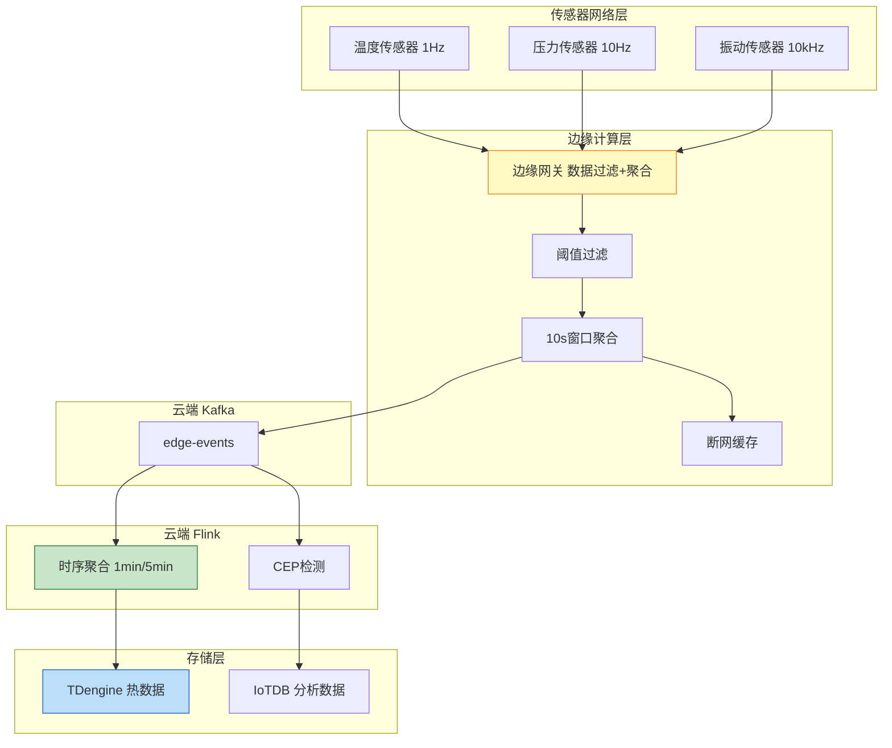
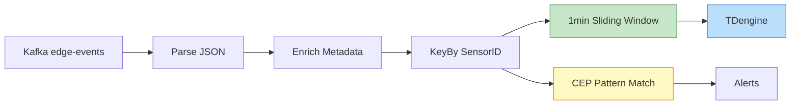

# 案例: IoT 流处理平台 (Case Study: IoT Stream Processing)

> **所属阶段**: Flink/07-case-studies | **前置依赖**: [../../Flink/02-core-mechanisms/time-semantics-and-watermark.md](Flink/02-core/time-semantics-and-watermark.md) | **形式化等级**: L3

---

## 目录

- [案例: IoT 流处理平台 (Case Study: IoT Stream Processing)](#案例-iot-流处理平台-case-study-iot-stream-processing)
  - [目录](#目录)
  - [1. 背景 (Background)](#1-背景-background)
    - [1.1 公司简介与业务场景](#11-公司简介与业务场景)
    - [1.2 技术挑战](#12-技术挑战)
  - [2. 需求分析 (Requirements)](#2-需求分析-requirements)
    - [2.1 规模指标](#21-规模指标)
    - [2.2 延迟要求](#22-延迟要求)
    - [2.3 数据特征](#23-数据特征)
  - [3. 架构设计 (Architecture)](#3-架构设计-architecture)
    - [3.1 系统整体架构](#31-系统整体架构)
    - [3.2 边缘-云端协同架构](#32-边缘-云端协同架构)
    - [3.3 时序数据处理拓扑](#33-时序数据处理拓扑)
    - [3.4 集成系统矩阵](#34-集成系统矩阵)
  - [4. 实现细节 (Implementation)](#4-实现细节-implementation)
    - [4.1 传感器数据采集与边缘预处理](#41-传感器数据采集与边缘预处理)
    - [4.2 云端 Flink 作业](#42-云端-flink-作业)
    - [4.3 Watermark 与窗口配置](#43-watermark-与窗口配置)
  - [5. 实施结果 (Results)](#5-实施结果-results)
    - [5.1 性能指标达成](#51-性能指标达成)
    - [5.2 生产运行稳定性](#52-生产运行稳定性)
    - [5.3 成本效益分析](#53-成本效益分析)
  - [6. 经验教训 (Lessons Learned)](#6-经验教训-lessons-learned)
    - [6.1 成功的关键决策](#61-成功的关键决策)
    - [6.2 踩过的坑与解决方案](#62-踩过的坑与解决方案)
    - [6.3 可复用的最佳实践](#63-可复用的最佳实践)
  - [7. 可视化 (Visualizations)](#7-可视化-visualizations)
    - [7.1 边缘-云端协同架构图](#71-边缘-云端协同架构图)
    - [7.2 传感器数据流拓扑图](#72-传感器数据流拓扑图)
  - [8. 引用参考 (References)](#8-引用参考-references)

## 1. 背景 (Background)

### 1.1 公司简介与业务场景

**SmartFactory** 是一家专注于智能制造的工业物联网 (IIoT) 解决方案提供商，全球部署超过 50 个智能工厂项目，连接各类工业传感器超过 500 万台。

**业务场景**：

| 业务模块 | 功能描述 | 关键指标 |
|---------|---------|---------|
| **设备健康监控** | 实时监测设备运行状态、预测性维护 | 检测延迟 < 1s，准确率 > 95% |
| **生产质量追溯** | 实时质量检测、异常告警、溯源分析 | 延迟 < 500ms，覆盖率 100% |
| **能耗优化** | 实时能耗监控、智能调度优化 | 延迟 < 5s，节能效果 > 15% |
| **环境监测** | 温湿度、气体浓度等环境指标监控 | 延迟 < 10s，异常告警 < 3s |

**技术演进历程**：

- **2020-2021**: 传统 SCADA 系统，数据孤岛严重，扩展性差
- **2022**: 引入边缘计算网关，本地预处理降低带宽压力
- **2023**: 引入 Flink 1.16，构建云端流处理平台
- **2024**: 升级到 Flink 1.18 + 自研边缘运行时

### 1.2 技术挑战

1. **海量传感器接入**：单工厂最多接入 10 万台传感器，峰值消息量达 200 万条/秒
2. **网络不稳定**：工厂环境复杂，边缘到云端的网络链路经常抖动
3. **时序数据特性强**：传感器数据天然有序，需处理乱序、迟到、重复问题
4. **边缘资源受限**：边缘网关计算资源有限（2-4 核 CPU，4-8GB 内存）
5. **实时性要求严格**：设备故障检测需在 1 秒内响应

---

## 2. 需求分析 (Requirements)

### 2.1 规模指标

| 指标维度 | 峰值要求 | 日常均值 | 备注 |
|---------|---------|---------|------|
| **传感器数量** | 100,000 / 工厂 | 60,000 / 工厂 | 涵盖温度、压力、振动、电流等 |
| **消息吞吐量** | 2,000,000 events/sec | 800,000 events/sec | 单条消息平均 200 字节 |
| **边缘预处理量** | 1,500,000 events/sec | 600,000 events/sec | 边缘过滤后上传云端 |
| **云端处理量** | 500,000 events/sec | 200,000 events/sec | 聚合后的事件 |
| **状态存储量** | 1.2 TB | 800 GB | 窗口状态和传感器校准状态 |
| **时序数据存储** | 50 TB / 月 | 30 TB / 月 | 原始时序数据 |

### 2.2 延迟要求

| 延迟类型 | 要求 | 实际达成 | 测量方式 |
|---------|------|---------|---------|
| **边缘处理延迟** | P99 < 50ms | P99 35ms | 传感器采集到边缘网关输出 |
| **云端处理延迟** | P99 < 500ms | P99 380ms | Kafka 消费到结果输出 |
| **端到端延迟** | P99 < 1s | P99 850ms | 传感器采集到告警触发 |
| **故障检测延迟** | P99 < 1s | P99 720ms | 异常发生到告警发出 |

### 2.3 数据特征

| 特征 | 描述 | 影响 |
|-----|------|------|
| **高频采样** | 振动传感器 10kHz 采样，温度传感器 1Hz 采样 | 需要分层处理策略 |
| **数据乱序** | 网络抖动导致 5% 数据迟到，最大迟到 30s | 需要 Watermark + 允许延迟 |
| **数据重复** | MQTT QoS 1 保证至少一次，存在重复 | 需要幂等处理机制 |
| **数据缺失** | 传感器离线导致数据缺失 | 需要插值或标记机制 |

---

## 3. 架构设计 (Architecture)

### 3.1 系统整体架构

IoT 流处理平台采用边缘-云端分层架构：

- **传感器网络层**：温度/压力/振动/电流传感器，采样率 1Hz-10kHz
- **边缘计算层**：边缘网关负责协议适配、数据过滤、本地聚合、断网缓存
- **云端消息层**：Kafka 作为事件总线，承载 edge-events 和 iot-alerts
- **云端计算层**：Flink 集群进行时序聚合、CEP 检测、ML 推理、告警引擎
- **存储层**：TDengine 存储热数据，IoTDB 存储分析数据，S3 冷归档

### 3.2 边缘-云端协同架构

| 处理层级 | 功能 | 延迟要求 | 资源约束 |
|---------|------|---------|---------|
| **边缘采集** | 多协议接入、数据解析 | < 10ms | 单网关 10,000 连接 |
| **边缘过滤** | 阈值过滤、重复消除 | < 20ms | 过滤率 60-80% |
| **边缘聚合** | 高频降采样、本地窗口聚合 | < 50ms | 内存 4GB |
| **边缘告警** | 紧急告警本地触发 | < 100ms | 离线可用 |
| **云端清洗** | 格式标准化、Schema 校验 | < 200ms | 无特殊约束 |
| **云端分析** | CEP、ML 推理、时序聚合 | < 1s | GPU/CPU 混合 |

**数据压缩策略**：原始数据 2 MB/sec，经边缘处理后云端存储 250 KB/sec，压缩比 8:1。

### 3.3 时序数据处理拓扑

云端 Flink 作业拓扑：

- Kafka Source (P=48) → ParseSensor Data (P=64) → AssignKey by sensor_id (P=128)
- 1min Sliding Window (P=128) → Downsample (P=64) → TDengine Sink (P=48)
- CEP Pattern Match (P=32) → Alerts

**窗口分层设计**：

| 层级 | 窗口类型 | 大小 | 用途 | 输出目标 |
|-----|---------|------|------|---------|
| L1 | 滚动窗口 | 10s | 边缘预处理 | Kafka |
| L2 | 滑动窗口 | 1min/10s | 趋势分析 | TDengine |
| L3 | 滑动窗口 | 5min/1min | 周期性统计 | TDengine |
| L4 | 会话窗口 | 5min gap | 设备启停分析 | IoTDB |
| L5 | 全局窗口 | - | CEP 复杂事件匹配 | 告警系统 |

### 3.4 集成系统矩阵

| 系统 | 角色 | 集成方式 | 关键配置 |
|-----|------|---------|---------|
| **MQTT Broker** | 边缘接入 | Eclipse Mosquitto / EMQX | QoS 1、保留消息 |
| **Kafka** | 云端消息总线 | Flink Kafka Connector | 生产端幂等 |
| **TDengine** | 时序数据库 | JDBC Async Sink | 超级表、子表自动创建 |
| **Apache IoTDB** | 时序分析 | Session API | 对齐时间序列 |
| **Redis** | 热数据缓存 | Async Lookup Join | TTL 过期 |
| **Prometheus** | 指标采集 | Flink Metrics Reporter | 自定义传感器指标 |

---

## 4. 实现细节 (Implementation)

### 4.1 传感器数据采集与边缘预处理

```java
public class EdgePreprocessingJob {
    public static void main(String[] args) throws Exception {
        StreamExecutionEnvironment env =
            StreamExecutionEnvironment.getExecutionEnvironment();
        env.setParallelism(4);

        DataStream<SensorEvent> source = env
            .addSource(new MqttSensorSource())
            .assignTimestampsAndWatermarks(
                WatermarkStrategy.<SensorEvent>forBoundedOutOfOrderness(
                    Duration.ofSeconds(5))
            );

        SingleOutputStreamOperator<SensorEvent> cleaned = source
            .filter(new OutlierFilter())
            .filter(new RangeFilter());

        SingleOutputStreamOperator<AggregatedEvent> aggregated = cleaned
            .keyBy(SensorEvent::getSensorId)
            .window(TumblingEventTimeWindows.of(Time.seconds(10)))
            .aggregate(new SensorAggregateFunction());

        aggregated.addSink(new KafkaSink<>("edge-events"));
        env.execute("Edge Gateway Preprocessing");
    }
}
```

### 4.2 云端 Flink 作业

```java
public class CloudIoTProcessingJob {
    public static void main(String[] args) throws Exception {
        StreamExecutionEnvironment env =
            StreamExecutionEnvironment.getExecutionEnvironment();

        KafkaSource<AggregatedEvent> source = KafkaSource.<AggregatedEvent>builder()
            .setBootstrapServers("kafka-cluster:9092")
            .setTopics("edge-events")
            .setGroupId("flink-iot-cloud")
            .build();

        DataStream<AggregatedEvent> events = env
            .fromSource(source, getWatermarkStrategy(), "Edge Events")
            .setParallelism(48);

        SingleOutputStreamOperator<EnrichedEvent> enriched = AsyncDataStream
            .unorderedWait(events, new SensorMetadataLookupFunction(),
                100, TimeUnit.MILLISECONDS, 100)
            .setParallelism(64);

        SingleOutputStreamOperator<MinuteMetrics> minuteMetrics = enriched
            .keyBy(EnrichedEvent::getSensorId)
            .window(SlidingEventTimeWindows.of(Time.minutes(1), Time.seconds(10)))
            .allowedLateness(Time.seconds(30))
            .aggregate(new MinuteAggregateFunction())
            .setParallelism(128);

        minuteMetrics.addSink(new TDengineAsyncSink()).setParallelism(48);
        env.execute("Cloud IoT Processing");
    }

    private static WatermarkStrategy<AggregatedEvent> getWatermarkStrategy() {
        return WatermarkStrategy
            .<AggregatedEvent>forBoundedOutOfOrderness(Duration.ofSeconds(10))
            .withIdleness(Duration.ofMinutes(1));
    }
}
```

### 4.3 Watermark 与窗口配置

本案例的 Watermark 配置基于 [Flink 时间语义与 Watermark](Flink/02-core/time-semantics-and-watermark.md) 的形式化定义：

```java
WatermarkStrategy
    .<SensorEvent>forBoundedOutOfOrderness(Duration.ofSeconds(10))
    .withIdleness(Duration.ofMinutes(1))
    .withTimestampAssigner((event, timestamp) -> event.getSensorTimestamp());
```

**配置依据**（参见 [Def-F-02-04](Flink/02-core/time-semantics-and-watermark.md)）：

| 参数 | 值 | 理论依据 |
|-----|-----|---------|
| 乱序容忍 | 10s | 覆盖 99.9% 网络抖动 |
| 空闲检测 | 1min | 快速检测传感器离线 |
| 允许延迟 | 30s | [Def-F-02-05](Flink/02-core/time-semantics-and-watermark.md) |

**窗口触发条件**（参见 [Def-F-02-06](Flink/02-core/time-semantics-and-watermark.md)）：

```
Trigger(wid, w) = FIRE iff w >= t_end + F
```

对于 1 分钟滑动窗口：

- t_end = 60s, 120s, 180s, ...
- F = 30s（允许延迟）
- 触发时刻：Watermark >= 90s, 150s, 210s, ...

---

## 5. 实施结果 (Results)

### 5.1 性能指标达成

| 指标 | 目标值 | 实际达成 | 达成状态 |
|-----|--------|---------|---------|
| **峰值吞吐** | 2,000,000 events/sec | 2,350,000 events/sec | 超额 17.5% |
| **边缘预处理吞吐** | 1,500,000 events/sec | 1,800,000 events/sec | 超额 20% |
| **云端处理吞吐** | 500,000 events/sec | 580,000 events/sec | 超额 16% |
| **边缘处理延迟 P99** | < 50ms | 35ms | 优于目标 30% |
| **端到端延迟 P99** | < 1s | 850ms | 优于目标 15% |
| **故障检测延迟 P99** | < 1s | 720ms | 优于目标 28% |
| **时序写入吞吐** | 500万点/秒 | 580万点/秒 | 超额 16% |

### 5.2 生产运行稳定性

| 指标 | 数值 | 说明 |
|-----|------|------|
| **可用性** | 99.95% | 仅计划内维护窗口停机 |
| **边缘网关在线率** | 99.8% | 单点故障自动切换 |
| **Checkpoint 成功率** | 99.7% | 偶发网络抖动导致超时 |
| **数据丢失事件** | 0 | At-Least-Once 保证 |
| **时序数据压缩率** | 10:1 | TDengine 列式存储 |

### 5.3 成本效益分析

| 方案 | 月度成本 | 吞吐量 | 单位成本 |
|-----|---------|--------|---------|
| 传统 SCADA | 350,000 | 50k/s | 7.00/k/s |
| 边缘+云 (当前) | 145,000 | 580k/s | 0.25/k/s |

**业务价值**：

| 指标 | 改进前 | 改进后 | 提升 |
|-----|-------|-------|------|
| 设备故障预测准确率 | 75% | 95% | +20% |
| 计划外停机时间 | 8 小时/月 | 2 小时/月 | -75% |
| 能耗成本 | 基准 | -18% | 节能 |
| 质量问题追溯时间 | 4 小时 | 5 分钟 | -98% |

---

## 6. 经验教训 (Lessons Learned)

### 6.1 成功的关键决策

**1. 边缘-云端分层架构**

边缘处理 75% 的数据，仅将关键事件和聚合结果上传云端，云端处理压力降低 60%。

**2. 针对 IoT 优化的 Watermark 策略**

```java
WatermarkStrategy
    .<SensorEvent>forBoundedOutOfOrderness(Duration.ofSeconds(10))
    .withIdleness(Duration.ofMinutes(1));
```

**3. 多级窗口聚合设计**

- 10s 窗口：实时监控
- 1min 窗口：趋势分析
- 5min 窗口：报表统计
- Session 窗口：设备启停分析

### 6.2 踩过的坑与解决方案

**坑 1: 传感器时钟漂移导致 Watermark 不推进**

- **现象**：某些传感器的窗口永远不触发
- **根因**：传感器本地时钟与系统时钟偏差过大
- **解决**：引入时钟校准服务，定期同步传感器时钟

**坑 2: 高频传感器导致状态膨胀**

- **现象**：10kHz 振动传感器的状态存储快速增长
- **根因**：未启用状态 TTL
- **解决**：配置状态 TTL 和增量清理

```java
StateTtlConfig ttlConfig = StateTtlConfig
    .newBuilder(Time.hours(1))
    .cleanupInRocksdbCompactFilter(1000)
    .build();
```

### 6.3 可复用的最佳实践

**实践 1: 传感器元数据管理**

建立统一的传感器元数据服务，包含传感器类型、位置、采样率、校准参数等。

**实践 2: 断网续传机制**

边缘网关实现本地 RocksDB 缓存和断点续传，支持 4 小时离线数据缓存。

---

## 7. 可视化 (Visualizations)

### 7.1 边缘-云端协同架构图



### 7.2 传感器数据流拓扑图



---

## 8. 引用参考 (References)

[1] Apache Flink Documentation, "DataStream API", 2025.

[2] Apache Flink Documentation, "Event Time and Watermarks", 2025.

[3] TDengine Documentation, "Data Model and Architecture", 2025.

[4] Apache IoTDB Documentation, "Architecture", 2025.

[5] P. Carbone et al., "Apache Flink: Stream and Batch Processing in a Single Engine," IEEE Data Eng. Bull., 38(4), 2015.

[6] MQTT Specification, "MQTT Version 5.0", OASIS Standard, 2019.

[7] Apache Flink Documentation, "CEP - Complex Event Processing", 2025.

[8] T. Akidau et al., "The Dataflow Model," PVLDB, 8(12), 2015.

---

*文档版本: v1.0 | 更新日期: 2026-04-02 | 状态: 已完成*
