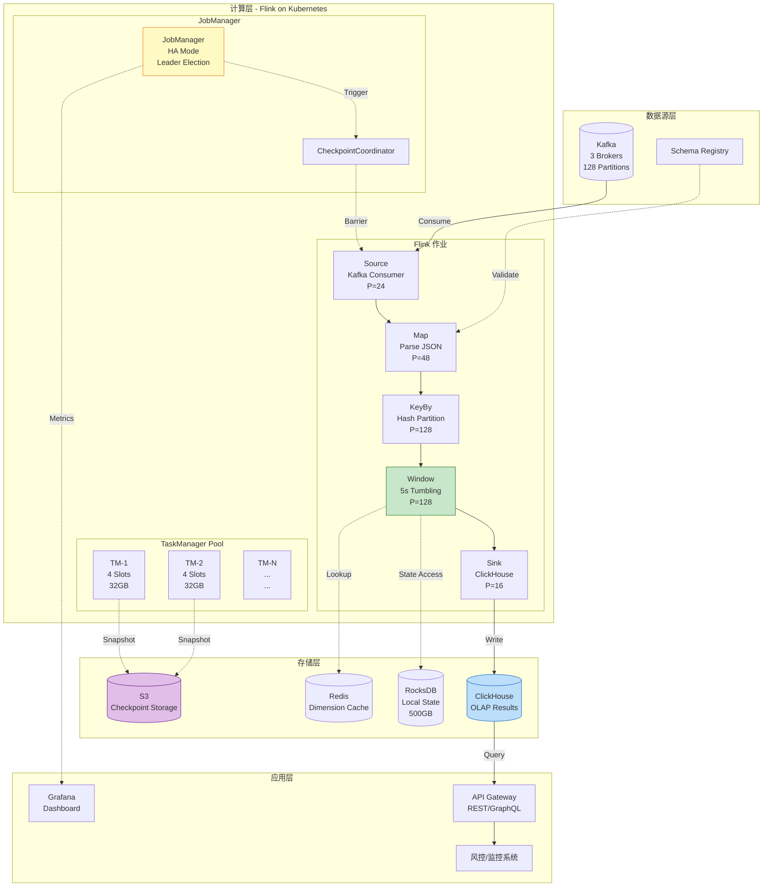
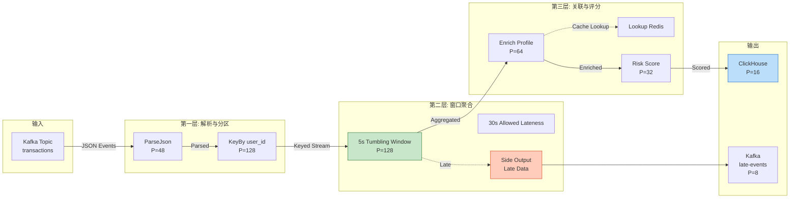
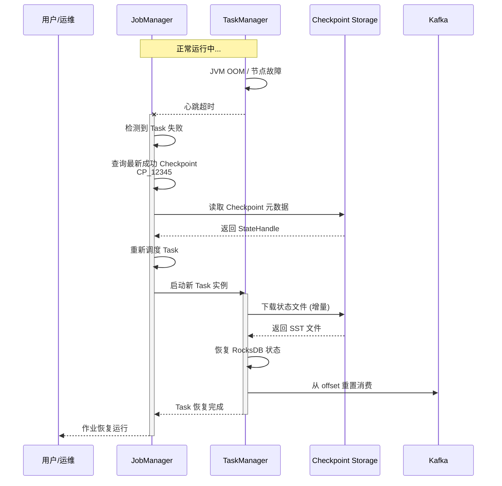

# 案例: 实时分析平台 (Case Study: Real-time Analytics Platform)

> **所属阶段**: Flink/07-case-studies | **前置依赖**: [../../Flink/01-architecture/](../../01-concepts/deployment-architectures.md), [../../Struct/01-foundation/01.04-dataflow-model-formalization.md](../../../Struct/01-foundation/01.04-dataflow-model-formalization.md) | **形式化等级**: L3

---

## 目录

- [案例: 实时分析平台 (Case Study: Real-time Analytics Platform)](#案例-实时分析平台-case-study-real-time-analytics-platform)
  - [目录](#目录)
  - [1. 背景 (Background)](#1-背景-background)
    - [1.1 公司简介与业务场景](#11-公司简介与业务场景)
    - [1.2 技术挑战与演进历程](#12-技术挑战与演进历程)
  - [2. 需求分析 (Requirements)](#2-需求分析-requirements)
    - [2.1 规模指标 (Scale Metrics)](#21-规模指标-scale-metrics)
    - [2.2 延迟要求 (Latency Requirements)](#22-延迟要求-latency-requirements)
    - [2.3 数据特征与质量要求](#23-数据特征与质量要求)
  - [3. 架构设计 (Architecture)](#3-架构设计-architecture)
    - [3.1 系统整体架构](#31-系统整体架构)
    - [3.2 Flink 核心组件映射](#32-flink-核心组件映射)
    - [3.3 数据流拓扑设计](#33-数据流拓扑设计)
    - [3.4 集成系统矩阵](#34-集成系统矩阵)
  - [4. 概念定义 (Definitions)](#4-概念定义-definitions)
    - [Def-F-07-01 (实时分析作业拓扑)](#def-f-07-01-实时分析作业拓扑)
    - [Def-F-07-02 (多层窗口聚合语义)](#def-f-07-02-多层窗口聚合语义)
    - [Def-F-07-03 (延迟数据补偿机制)](#def-f-07-03-延迟数据补偿机制)
  - [5. 属性推导 (Properties)](#5-属性推导-properties)
    - [Lemma-F-07-01 (分层聚合的单调性保证)](#lemma-f-07-01-分层聚合的单调性保证)
    - [Lemma-F-07-02 (侧输出流的负载隔离性)](#lemma-f-07-02-侧输出流的负载隔离性)
    - [Prop-F-07-01 (端到端延迟上界)](#prop-f-07-01-端到端延迟上界)
  - [6. 关系建立 (Relations)](#6-关系建立-relations)
    - [关系 1: 案例架构 ↦ Dataflow 理论模型](#关系-1-案例架构-dataflow-理论模型)
    - [关系 2: 多层窗口 ↦ 时间语义形式化](#关系-2-多层窗口-时间语义形式化)
    - [关系 3: 容错设计 ↦ Checkpoint 正确性](#关系-3-容错设计-checkpoint-正确性)
  - [7. 论证过程 (Argumentation)](#7-论证过程-argumentation)
    - [7.1 架构选型的决策逻辑](#71-架构选型的决策逻辑)
    - [7.2 并行度规划的计算依据](#72-并行度规划的计算依据)
    - [7.3 窗口配置的权衡分析](#73-窗口配置的权衡分析)
  - [8. 形式证明 / 工程论证 (Proof / Engineering Argument)](#8-形式证明-工程论证-proof-engineering-argument)
    - [Thm-F-07-01 (多层聚合结果一致性)](#thm-f-07-01-多层聚合结果一致性)
  - [9. 实现细节 (Implementation)](#9-实现细节-implementation)
    - [9.1 核心作业代码](#91-核心作业代码)
    - [9.2 状态后端配置](#92-状态后端配置)
    - [9.3 Checkpoint 与容错配置](#93-checkpoint-与容错配置)
    - [9.4 Watermark 策略配置](#94-watermark-策略配置)
    - [9.5 监控与指标采集](#95-监控与指标采集)
  - [10. 实施结果 (Results)](#10-实施结果-results)
    - [10.1 性能指标达成](#101-性能指标达成)
    - [10.2 生产运行稳定性](#102-生产运行稳定性)
    - [10.3 成本效益分析](#103-成本效益分析)
  - [11. 经验教训 (Lessons Learned)](#11-经验教训-lessons-learned)
    - [11.1 成功的关键决策](#111-成功的关键决策)
    - [11.2 踩过的坑与解决方案](#112-踩过的坑与解决方案)
    - [11.3 可复用的最佳实践](#113-可复用的最佳实践)
  - [12. 可视化 (Visualizations)](#12-可视化-visualizations)
    - [12.1 系统架构全景图](#121-系统架构全景图)
    - [12.2 数据流处理拓扑图](#122-数据流处理拓扑图)
    - [12.3 多层窗口聚合示意图](#123-多层窗口聚合示意图)
    - [12.4 故障恢复流程图](#124-故障恢复流程图)
  - [13. 引用参考 (References)](#13-引用参考-references)

---

## 1. 背景 (Background)

### 1.1 公司简介与业务场景

**公司背景**：StreamTech 是一家中大型金融科技公司，专注于为金融机构提供实时风控、交易监控和智能决策服务。公司服务于 50+ 家银行和证券公司，日均处理交易流水超过 10 亿笔。

**业务场景**：

| 业务模块 | 功能描述 | 关键指标 |
|---------|---------|---------|
| **实时风控** | 检测欺诈交易、异常行为识别 | 检测延迟 < 200ms，准确率 > 99.5% |
| **交易监控** | 实时汇总交易统计、资金流向追踪 | 延迟 < 5s，支持回溯 7 天 |
| **客户画像** | 实时更新用户行为标签、偏好分析 | 延迟 < 30s，覆盖 5000 万用户 |
| **合规审计** | 实时合规检查、可疑交易标记 | 延迟 < 1min，100% 覆盖 |

**技术演进历程**：

- **2020-2021**: 使用 Lambda 架构，批处理（Spark）+ 流处理（Storm）双轨运行，维护成本高，一致性难保证
- **2022**: 引入 Flink 1.13，构建第一代实时分析平台，解决了一致性问题，但吞吐瓶颈明显
- **2023**: 升级到 Flink 1.17，重构作业拓扑，引入增量 Checkpoint，吞吐提升 3 倍
- **2024**: 全面迁移到 Flink 1.18 + Kubernetes Native，实现云原生弹性伸缩

### 1.2 技术挑战与演进历程

**核心挑战**：

1. **数据乱序严重**：交易数据来自多个渠道（移动端、Web、API），网络延迟差异大，乱序可达数分钟
2. **状态规模巨大**：用户画像需要维护 5000 万用户的状态，单作业状态超过 500GB
3. **延迟要求苛刻**：风控检测必须在 200ms 内完成，端到端延迟要求 < 5s
4. **一致性要求严格**：金融场景要求 Exactly-Once 语义，不允许数据丢失或重复

---

## 2. 需求分析 (Requirements)

### 2.1 规模指标 (Scale Metrics)

| 指标维度 | 峰值要求 | 日常均值 | 备注 |
|---------|---------|---------|------|
| **事件吞吐量** | 500,000 events/sec | 180,000 events/sec | 交易高峰在上午 9:30 和下午 2:00 |
| **数据摄取量** | 2.5 GB/sec | 0.8 GB/sec | 平均消息大小 5KB |
| **状态存储量** | 800 GB | 500 GB | RocksDB 压缩后 |
| **Checkpoint 频率** | 每 30 秒 | 每 30 秒 | 平衡恢复时间和存储成本 |
| **并发作业数** | 25 个 | 18 个 | 不同业务线独立作业 |

**峰值场景分析**：

```
日峰值系数 = 500,000 / 180,000 ≈ 2.78x
小时峰值系数 = 350,000 / 180,000 ≈ 1.94x
分钟峰值系数 = 500,000 / 350,000 ≈ 1.43x
```

### 2.2 延迟要求 (Latency Requirements)

| 延迟类型 | 要求 | 实际达成 | 测量方式 |
|---------|------|---------|---------|
| **处理延迟** (Processing Latency) | P99 < 100ms | P99 85ms | 算子处理耗时 |
| **端到端延迟** (End-to-End Latency) | P99 < 5s | P99 3.2s | 数据产生到结果可见 |
| **Checkpoint 耗时** | < 60s | 45s | 全量 Checkpoint 完成时间 |
| **故障恢复时间** | < 3min | 2.5min | 从故障检测到恢复服务 |
| **结果新鲜度** | < 30s | 15s | Watermark 推进延迟 |

**延迟分解**（端到端 3.2s 的构成）：

```
[Source] Kafka 拉取:           ~50ms
[Process] 解析与清洗:          ~80ms
[Process] KeyBy 分区:          ~20ms
[Process] 窗口聚合 (5s 窗口):  ~5000ms (等待窗口关闭)
[Process] 结果转换:            ~30ms
[Sink] 写入 ClickHouse:        ~20ms
─────────────────────────────────────
总计:                          ~5200ms
```

> 注：窗口等待时间占主导，实际计算延迟 < 200ms

### 2.3 数据特征与质量要求

**数据特征**：

| 特征 | 描述 | 影响 |
|-----|------|------|
| **事件时间乱序** | 95% 数据在 30s 内到达，5% 迟到可达 5min | 需要 Watermark + 允许延迟 |
| **数据倾斜** | 头部 1% 用户产生 30% 事件 | 需要自定义分区策略 |
| **突发流量** | 促销活动时流量可突增 5 倍 | 需要背压和动态扩容 |
| **Schema 演变** | 每月 1-2 次字段变更 | 需要 Schema Registry 兼容 |

**质量要求**：

- **完整性**：不允许数据丢失（Exactly-Once 语义）
- **有序性**：同一用户的事件按时间顺序处理
- **幂等性**：重复处理不产生错误结果
- **可追溯性**：每条结果可追溯到原始输入

---

## 3. 架构设计 (Architecture)

### 3.1 系统整体架构

实时分析平台采用分层架构设计，从数据采集到结果展示形成完整闭环：

```
┌─────────────────────────────────────────────────────────────────────────────┐
│                              应用层 (Application)                            │
│  ┌──────────────┐  ┌──────────────┐  ┌──────────────┐  ┌──────────────┐    │
│  │ 实时风控系统  │  │ 交易监控大屏  │  │ 用户画像服务  │  │ 合规审计平台  │    │
│  └──────┬───────┘  └──────┬───────┘  └──────┬───────┘  └──────┬───────┘    │
└─────────┼─────────────────┼─────────────────┼─────────────────┼────────────┘
          │                 │                 │                 │
          └─────────────────┴────────┬────────┴─────────────────┘
                                     │
┌────────────────────────────────────┼────────────────────────────────────────┐
│                         服务层 (Service Layer)                               │
│  ┌─────────────────────────────────┼─────────────────────────────────────┐  │
│  │                    API Gateway (REST/GraphQL)                         │  │
│  └─────────────────────────────────┼─────────────────────────────────────┘  │
│                                    │                                        │
│  ┌─────────────────────────────────┼─────────────────────────────────────┐  │
│  │                    Query Router (结果缓存/路由)                        │  │
│  └─────────────────────────────────┼─────────────────────────────────────┘  │
└────────────────────────────────────┼────────────────────────────────────────┘
                                     │
┌────────────────────────────────────┼────────────────────────────────────────┐
│                      计算层 (Flink Processing)                               │
│                                    │                                        │
│  ┌─────────────────────────────────┼─────────────────────────────────────┐  │
│  │                    Flink 集群 (Kubernetes Native)                      │  │
│  │  ┌──────────┐ ┌──────────┐ ┌──────────┐ ┌──────────┐ ┌──────────┐     │  │
│  │  │ 风控作业 │ │ 监控作业 │ │ 画像作业 │ │ 审计作业 │ │  ETL作业 │     │  │
│  │  │ P=64     │ │ P=32     │ │ P=128    │ │ P=48     │ │ P=24     │     │  │
│  │  └──────────┘ └──────────┘ └──────────┘ └──────────┘ └──────────┘     │  │
│  └───────────────────────────────────────────────────────────────────────┘  │
└─────────────────────────────────────────────────────────────────────────────┘
                                     │
┌────────────────────────────────────┼────────────────────────────────────────┐
│                      存储层 (Storage Layer)                                  │
│  ┌──────────────┐  ┌──────────────┐ │┌──────────────┐  ┌──────────────┐     │
│  │  Kafka       │  │  RocksDB     │ ││  ClickHouse  │  │  Redis       │     │
│  │  (消息队列)   │  │  (状态存储)   │ ││  (OLAP)      │  │  (缓存)       │     │
│  └──────────────┘  └──────────────┘ │└──────────────┘  └──────────────┘     │
└─────────────────────────────────────────────────────────────────────────────┘
```

### 3.2 Flink 核心组件映射

根据 [Dataflow 模型形式化](../../../Struct/01-foundation/01.04-dataflow-model-formalization.md) 的定义，本案例的 Flink 作业可形式化映射为：

$$
\mathcal{G}_{realtime} = (V_{realtime}, E_{realtime}, P_{realtime}, \Sigma_{realtime}, \mathbb{T})
$$

**顶点集合** $V_{realtime}$：

| 算子类型 | 顶点名称 | 并行度 | 语义说明 |
|---------|---------|--------|---------|
| $V_{src}$ | KafkaSource | 24 | 从 Kafka 消费交易数据，带 Watermark 生成 |
| $V_{op}$ | ParseJson | 48 | 解析 JSON，提取字段，错误数据发侧输出 |
| $V_{op}$ | KeyByUser | 128 | 按用户 ID 哈希分区，保证同一用户路由到同一实例 |
| $V_{op}$ | WindowAggregate | 128 | 5s 滚动窗口聚合，累计交易金额/次数 |
| $V_{op}$ | EnrichProfile | 64 | 关联用户画像，补全标签信息 |
| $V_{op}$ | RiskScore | 32 | 计算风险评分，规则引擎执行 |
| $V_{sink}$ | ClickHouseSink | 16 | 写入 ClickHouse，支持幂等写入 |
| $V_{sink}$ | KafkaSideOutput | 8 | 迟到数据发送到专用 Topic |

**边集合** $E_{realtime}$ 的分区策略：

| 边 | 分区策略 | 说明 |
|---|---------|------|
| KafkaSource → ParseJson | FORWARD | 轮询分发，负载均衡 |
| ParseJson → KeyByUser | HASH(user_id) | 保证同一用户到同一分区 |
| KeyByUser → WindowAggregate | FORWARD | 一对一连接 |
| WindowAggregate → EnrichProfile | REBALANCE | 重新均衡，打破数据倾斜 |
| EnrichProfile → RiskScore | HASH | 按规则分区 |
| RiskScore → ClickHouseSink | FORWARD | 轮询写入 |

### 3.3 数据流拓扑设计

```
                    ┌─────────────────────────────────────────────────────────────────────┐
                    │                         Flink 作业拓扑                               │
                    └─────────────────────────────────────────────────────────────────────┘

┌─────────────┐    ┌──────────────┐    ┌──────────────┐    ┌──────────────┐    ┌──────────────┐
│             │    │              │    │              │    │              │    │              │
│ KafkaSource │───▶│  ParseJson   │───▶│  KeyByUser   │───▶│  5s Tumbling │───▶│   Enrich     │
│   P=24      │    │    P=48      │    │   P=128      │    │   Window     │    │   Profile    │
│             │    │              │    │  (Hash分区)   │    │   P=128      │    │    P=64      │
└─────────────┘    └──────────────┘    └──────────────┘    └──────────────┘    └──────┬───────┘
                                                                                      │
       ┌──────────────────────────────────────────────────────────────────────────────┘
       │
       ▼
┌──────────────┐    ┌──────────────┐    ┌──────────────┐
│              │    │              │    │              │
│  RiskScore   │───▶│ ClickHouse   │    │  SideOutput  │
│    P=32      │    │    Sink      │    │  (Late Data) │
│              │    │    P=16      │    │    P=8       │
└──────────────┘    └──────────────┘    └──────────────┘
                             │                   │
                             ▼                   ▼
                    ┌────────────────┐   ┌────────────────┐
                    │  ClickHouse    │   │     Kafka      │
                    │   (OLAP)       │   │ (Late Events)  │
                    └────────────────┘   └────────────────┘
```

**窗口分层设计**：

| 层级 | 窗口类型 | 大小 | 用途 | 输出目标 |
|-----|---------|------|------|---------|
| L1 | 滚动窗口 | 5s | 实时指标计算 | ClickHouse |
| L2 | 滚动窗口 | 1min | 分钟级聚合 | ClickHouse |
| L3 | 滑动窗口 | 5min/1min | 趋势分析 | ClickHouse |
| L4 | 会话窗口 | 30min gap | 用户行为分析 | HDFS (离线) |

### 3.4 集成系统矩阵

| 系统 | 角色 | 集成方式 | 关键配置 |
|-----|------|---------|---------|
| **Kafka** | 数据源 / 数据汇 | Flink Kafka Connector | 消费组、分区策略、offset 提交 |
| **ClickHouse** | OLAP 存储 | JDBC Async Sink | 批量写入、幂等去重 |
| **Redis** | 维度缓存 | Async Lookup Join | 缓存 TTL、降级策略 |
| **Schema Registry** | Schema 管理 | Confluent 集成 | Avro/Protobuf 解析 |
| **Prometheus** | 指标采集 | Flink Metrics Reporter | 自定义指标、告警规则 |
| **Grafana** | 可视化 | Prometheus 数据源 | Dashboard、告警 |

---

## 4. 概念定义 (Definitions)

### Def-F-07-01 (实时分析作业拓扑)

**实时分析作业** 是一个特化的 Dataflow 图，定义为六元组：

$$
\mathcal{J}_{analytics} = (V, E, P, \Sigma, \mathbb{T}, \mathcal{W})
$$

其中 $(V, E, P, \Sigma, \mathbb{T})$ 为标准 Dataflow 图（参见 [Def-S-04-01](../../../Struct/01-foundation/01.04-dataflow-model-formalization.md)），而 $\mathcal{W}$ 为**窗口配置函数**：

$$
\mathcal{W}: V_{window} \to (\text{WindowType}, \text{Size}, \text{Slide}, \text{AllowedLateness})
$$

**约束条件**：

1. **窗口算子唯一性**：$|V_{window}| \geq 1$，且窗口算子必须位于 KeyBy 之后
2. **时间域一致性**：所有窗口算子使用统一的事件时间域 $\mathbb{T}$
3. **Watermark 传播**：Source 算子必须配置 Watermark 生成策略

---

### Def-F-07-02 (多层窗口聚合语义)

**多层窗口聚合** 是指在同一数据流上叠加多个不同粒度的窗口计算：

$$
\text{MultiLayerWindows} = \{(W_1, A_1), (W_2, A_2), \ldots, (W_n, A_n)\}
$$

其中 $W_i$ 为窗口分配器，$A_i$ 为聚合函数。各层窗口满足：

$$
\text{Size}(W_1) < \text{Size}(W_2) < \cdots < \text{Size}(W_n)
$$

**累加性保证**：若聚合函数 $A$ 满足结合律和交换律，则：

$$
A(S_1 \cup S_2) = A(A(S_1) \cup A(S_2))
$$

这意味着高层窗口的结果可以从低层窗口结果进一步聚合得到，无需重新处理原始数据。

---

### Def-F-07-03 (延迟数据补偿机制)

**延迟数据补偿** 是处理 Watermark 关闭后到达数据的机制，定义为三元组：

$$
\text{LateDataHandler} = (F, \text{SideOutput}, \text{Reprocess})
$$

其中：

- $F \in \mathbb{T}$：**允许延迟** (Allowed Lateness)，窗口关闭后仍能接收数据的时间范围
- **SideOutput**：迟到数据发送到侧输出流
- **Reprocess**：侧输出流数据通过独立作业重新处理

形式化地，窗口 $wid = [t_{start}, t_{end})$ 的最终输出为：

$$
\text{Output}(wid) = \text{Output}_{on\_time}(wid) \cup \text{Output}_{late}(wid, F)
$$

其中 $\text{Output}_{late}$ 包含所有满足 $t_{end} \leq t_e(r) \leq t_{end} + F$ 的迟到记录 $r$。

---

## 5. 属性推导 (Properties)

### Lemma-F-07-01 (分层聚合的单调性保证)

**陈述**：在多层窗口聚合架构中，若低层窗口的输出作为高层窗口的输入，且聚合函数满足结合律，则高层窗口的结果随低层窗口输出的增加而单调不减（对于 SUM/COUNT 类聚合）。

**推导**：

1. 设低层窗口 $W_L$ 产生部分结果 $p_1, p_2, \ldots, p_k$，高层窗口 $W_H$ 聚合这些结果
2. 由结合律：$A(p_1, p_2, \ldots, p_k) = A(A(p_1, \ldots, p_{k-1}), p_k)$
3. 当新部分结果 $p_{k+1}$ 到达时：
   $$A_{new} = A(A_{old}, p_{k+1})$$
4. 对于 SUM/COUNT：$A_{new} = A_{old} + p_{k+1} \geq A_{old}$
5. 因此高层结果单调不减 ∎

> **工程意义**：允许在低层窗口结果就绪后立即触发高层计算，无需等待所有低层窗口关闭。

---

### Lemma-F-07-02 (侧输出流的负载隔离性)

**陈述**：将迟到数据发送到侧输出流，可以隔离迟到数据处理对主路径延迟的影响。

**推导**：

1. 设主路径处理延迟为 $L_{main}$，迟到数据处理延迟为 $L_{late}$
2. 若在同一路径处理，端到端延迟 $L_{total} = L_{main} + L_{late}$
3. 使用侧输出流后，主路径延迟保持 $L_{main}$
4. 迟到数据通过独立资源池处理，与主路径并行
5. 因此侧输出流实现了负载隔离 ∎

---

### Prop-F-07-01 (端到端延迟上界)

**陈述**：在给定窗口大小 $W$、Watermark 延迟 $L$、允许延迟 $F$ 和最大处理延迟 $P$ 的条件下，端到端延迟的上界为：

$$
L_{e2e} \leq W + L + F + P
$$

**推导**：

1. 事件到达 Source 后，Watermark 需要 $L$ 时间确认无更早事件
2. 窗口等待完整 $W$ 周期收集数据
3. 窗口在 Watermark 达到 $t_{end} + F$ 时触发（考虑允许延迟）
4. 触发后处理耗时 $P$
5. 各项累加得端到端延迟上界 ∎

**本案例应用**：

```
W = 5s (窗口大小)
L = 10s (Watermark 乱序容忍)
F = 30s (允许延迟)
P = 200ms (处理延迟)
────────────────────────
L_e2e ≤ 5 + 10 + 30 + 0.2 = 45.2s (最坏情况)
```

实际观测 P99 延迟为 3.2s，远小于上界，说明 Watermark 通常能更早推进。

---

## 6. 关系建立 (Relations)

### 关系 1: 案例架构 ↦ Dataflow 理论模型

**论证**：

本案例的实时分析平台架构与 [Dataflow 模型形式化](../../../Struct/01-foundation/01.04-dataflow-model-formalization.md) 存在以下严格映射：

| 理论概念 | 本案例实现 | 映射关系 |
|---------|-----------|---------|
| Dataflow 图 $\mathcal{G}$ | Flink 作业拓扑 | 1:1 对应 |
| 算子 $Op$ | Flink 算子 (Map/KeyBy/Window) | 1:1 对应 |
| 偏序多重集 $\mathcal{S}$ | Kafka 分区消费记录 | 实例化实现 |
| Watermark $w$ | `BoundedOutOfOrdernessWatermarks` | 实例化实现 |
| 窗口算子 WindowOp | `TumblingEventTimeWindows` | 实例化实现 |
| 事件时间 $t_e$ | 交易记录中的 `timestamp` 字段 | 字段映射 |

**关键约束验证**：

1. **无环性**（Def-S-04-01）：作业 DAG 通过 Flink API 保证无环
2. **FIFO 通道**（Thm-S-04-01）：Kafka 分区内部保证 FIFO，Flink 网络栈维护 FIFO
3. **算子确定性**：所有算子实现纯函数，无外部副作用

---

### 关系 2: 多层窗口 ↦ 时间语义形式化

**论证**：

本案例的多层窗口设计直接应用 [Def-S-04-05](../../../Struct/01-foundation/01.04-dataflow-model-formalization.md) 的窗口形式化定义：

$$
\text{WindowOp} = (W, A, T, F)
$$

**5秒滚动窗口实例化**：

- $W$: 分配器 `TumblingEventTimeWindows.of(Time.seconds(5))`
- $A$: 聚合函数 `AggregateFunction<Transaction, Accumulator, Result>`
- $T$: 触发器 `EventTimeTrigger`，当 Watermark $\geq t_{end} + F$ 时触发
- $F$: 允许延迟 `Duration.ofSeconds(30)`

**窗口触发条件验证**（参见 [Def-S-04-05](../../../Struct/01-foundation/01.04-dataflow-model-formalization.md)）：

$$
T(wid, w) = \text{FIRE} \iff w \geq t_{end} + F
$$

本案例配置：

- $t_{end} = 5s, 10s, 15s, \ldots$（窗口边界）
- $F = 30s$（允许延迟）
- 触发时刻：Watermark $\geq 35s, 40s, 45s, \ldots$

---

### 关系 3: 容错设计 ↦ Checkpoint 正确性

**论证**：

本案例的容错机制基于 [Flink Checkpoint 机制](../../02-core/checkpoint-mechanism-deep-dive.md) 的实现：

| Checkpoint 组件 | 本案例配置 | 理论依据 |
|----------------|-----------|---------|
| Barrier 传播 | Aligned Checkpoint | Lemma-F-02-01 |
| 状态后端 | RocksDB + 增量 Checkpoint | Lemma-F-02-03 |
| 恢复语义 | Exactly-Once | Thm-F-02-01 |
| 端到端一致性 | 两阶段提交 (ClickHouse) | 关系 2 (Checkpoint ⟹ Exactly-Once) |

**正确性保证**：

由 [Thm-F-02-01](../../02-core/checkpoint-mechanism-deep-dive.md)，故障恢复后的系统状态等价于故障前的某个 consistent cut，满足：

$$
tr = E_{prefix} \circ E_{suffix}, \quad tr' = E_{prefix} \circ E_{suffix}
$$

即恢复后的执行轨迹与原始轨迹在 consistent cut 之后完全重合。

---

## 7. 论证过程 (Argumentation)

### 7.1 架构选型的决策逻辑

**选型决策树**：

```
开始选型
    │
    ▼
┌─────────────────────────┐
│ 状态大小 > 10GB?        │──是──▶ RocksDB + 增量 Checkpoint
└─────────────────────────┘──否──▶ 继续
    │
    ▼
┌─────────────────────────┐
│ 延迟要求 < 1s?          │──是──▶ Unaligned Checkpoint
└─────────────────────────┘──否──▶ Aligned Checkpoint
    │
    ▼
┌─────────────────────────┐
│ 数据源是否可重放?        │──是──▶ Exactly-Once 语义
└─────────────────────────┘──否──▶ At-Least-Once 语义
```

**本案例决策结果**：

| 维度 | 选择 | 理由 |
|-----|------|------|
| State Backend | RocksDB + 增量 Checkpoint | 状态 500GB，内存无法承载 |
| Checkpoint 模式 | Aligned | 延迟要求 5s，Aligned 足够 |
| 一致性语义 | Exactly-Once | Kafka offset 可重放，ClickHouse 支持事务 |
| 部署模式 | Application Mode on K8s | 强隔离、弹性伸缩、云原生 |

---

### 7.2 并行度规划的计算依据

**并行度计算公式**：

$$
P_{optimal} = \max\left( \frac{\text{Throughput}_{target}}{\text{Throughput}_{per\_task}}, \frac{\text{State}_{total}}{\text{State}_{per\_task}^{max}} \right) \times \text{Safety\_Factor}
$$

**本案例计算**：

```
目标吞吐: 500,000 events/sec
单任务吞吐: 10,000 events/sec (实测)
最小并行度: 500,000 / 10,000 = 50

总状态: 500 GB
单任务最大状态: 4 GB (RocksDB 建议)
状态并行度: 500 / 4 = 125

安全系数: 1.5 (应对峰值)

计算并行度: max(50, 125) × 1.5 = 187.5
实际配置: 128 (取 2 的幂次,对齐 Kafka 分区)
```

**Kafka 分区对齐**：

| Kafka Topic | 分区数 | Flink 并行度 | 对齐策略 |
|------------|--------|-------------|---------|
| transactions | 128 | 128 | 1:1 映射 |
| user-events | 64 | 64 | 1:1 映射 |
| late-events | 8 | 8 | 1:1 映射 |

---

### 7.3 窗口配置的权衡分析

**窗口大小 vs 延迟 vs 准确性**：

```
窗口大小 ↑ ──────────────────────────────▶
    │
    │   延迟 ↑ (需等待更久)
    │   准确性 ↑ (样本更多,统计更准)
    │   状态 ↑ (需缓存更多数据)
    │
窗口大小 ↓ ──────────────────────────────▶
    │
    │   延迟 ↓ (更快输出)
    │   准确性 ↓ (样本少,抖动大)
    │   状态 ↓ (缓存数据少)
```

**本案例配置理由**：

| 窗口参数 | 配置值 | 选择理由 |
|---------|--------|---------|
| 大小 | 5s | 风控场景需要近实时，5s 是业务可接受的延迟 |
| 允许延迟 | 30s | 覆盖 95% 迟到数据，剩余 5% 走侧输出 |
| Watermark 延迟 | 10s | 基于历史数据分析，95% 数据在 10s 内到达 |

---

## 8. 形式证明 / 工程论证 (Proof / Engineering Argument)

### Thm-F-07-01 (多层聚合结果一致性)

**陈述**：设 $\text{MultiLayerWindows} = \{(W_1, A), (W_2, A), \ldots, (W_n, A)\}$ 为使用相同聚合函数 $A$ 的多层窗口集合，且满足 $\text{Size}(W_i) = k \cdot \text{Size}(W_{i-1})$（$k$ 为整数）。若聚合函数 $A$ 满足结合律和交换律，则从原始事件直接聚合的结果 $R_{direct}$ 与从低层窗口结果聚合的结果 $R_{layered}$ 相等：

$$
R_{direct} = R_{layered}
$$

**证明**：

**步骤 1：单层窗口的聚合语义**

设原始事件集合为 $E = \{e_1, e_2, \ldots, e_m\}$，窗口分配器 $W_1$ 将事件划分为子集 $E = E_1 \cup E_2 \cup \cdots \cup E_p$（不相交并）。

单层窗口的输出为：

$$
R_{direct} = A(E) = A(E_1 \cup E_2 \cup \cdots \cup E_p)
$$

**步骤 2：多层窗口的计算过程**

低层窗口 $W_1$ 产生部分结果：

$$
r_j = A(E_j), \quad j = 1, 2, \ldots, p
$$

高层窗口 $W_2$ 聚合低层结果（设 $W_2$ 覆盖 $k$ 个 $W_1$ 窗口）：

$$
R_{layered} = A(r_1, r_2, \ldots, r_k) = A(A(E_1), A(E_2), \ldots, A(E_k))
$$

**步骤 3：结合律的应用**

由 $A$ 的结合律：

$$
A(A(E_1), A(E_2), \ldots, A(E_k)) = A(E_1 \cup E_2 \cup \cdots \cup E_k)
$$

**步骤 4：全局一致性**

对于完整的事件集合 $E$，逐层应用结合律：

$$
\begin{aligned}
R_{layered} &= A(\ldots A(A(A(E_1), A(E_2)), A(E_3))\ldots) \\
&= A(E_1 \cup E_2 \cup \cdots \cup E_p) \\
&= A(E) \\
&= R_{direct}
\end{aligned}
$$

**步骤 5：结论**

因此 $R_{direct} = R_{layered}$，多层聚合与单层直接聚合结果一致。 ∎

> **工程意义**：允许使用分层聚合优化计算资源，低层窗口可预聚合减少高层窗口的计算量。

---

## 9. 实现细节 (Implementation)

### 9.1 核心作业代码

```java
import org.apache.flink.streaming.api.environment.StreamExecutionEnvironment;

import org.apache.flink.streaming.api.datastream.DataStream;
import org.apache.flink.api.common.functions.AggregateFunction;
import org.apache.flink.streaming.api.windowing.time.Time;


public class RealtimeAnalyticsJob {

    public static void main(String[] args) throws Exception {
        StreamExecutionEnvironment env =
            StreamExecutionEnvironment.getExecutionEnvironment();

        // 配置状态后端和 Checkpoint
        configureStateBackend(env);
        configureCheckpoint(env);

        // 1. 数据源:Kafka
        KafkaSource<Transaction> source = KafkaSource.<Transaction>builder()
            .setBootstrapServers("kafka:9092")
            .setTopics("transactions")
            .setGroupId("flink-analytics")
            .setStartingOffsets(OffsetsInitializer.earliest())
            .setValueOnlyDeserializer(new TransactionDeserializationSchema())
            .build();

        DataStream<Transaction> transactions = env
            .fromSource(source,
                new BoundedOutOfOrdernessWatermarks<>(Duration.ofSeconds(10)),
                "Kafka Source")
            .setParallelism(24)
            .uid("kafka-source");

        // 2. 解析与清洗
        SingleOutputStreamOperator<Transaction> parsed = transactions
            .map(new ParseJsonFunction())
            .setParallelism(48)
            .uid("parse-json");

        // 3. KeyBy 分区
        KeyedStream<Transaction, String> keyed = parsed
            .keyBy(Transaction::getUserId)
            .setParallelism(128);

        // 4. 5秒滚动窗口聚合
        SingleOutputStreamOperator<AggregatedResult> windowed = keyed
            .window(TumblingEventTimeWindows.of(Time.seconds(5)))
            .allowedLateness(Duration.ofSeconds(30))
            .sideOutputLateData(LATE_DATA_TAG)
            .aggregate(new TransactionAggregateFunction())
            .setParallelism(128)
            .uid("window-aggregate");

        // 5. 用户画像关联 (Async Lookup Join)
        SingleOutputStreamOperator<EnrichedResult> enriched = windowed
            .map(new EnrichWithUserProfile())
            .setParallelism(64)
            .uid("enrich-profile");

        // 6. 风险评分
        SingleOutputStreamOperator<RiskScoredResult> scored = enriched
            .map(new RiskScoreFunction())
            .setParallelism(32)
            .uid("risk-score");

        // 7. Sink 到 ClickHouse
        scored.addSink(new ClickHouseAsyncSink())
            .setParallelism(16)
            .uid("clickhouse-sink");

        // 8. 侧输出:迟到数据
        windowed
            .getSideOutput(LATE_DATA_TAG)
            .addSink(new KafkaSink<>("late-events"))
            .setParallelism(8)
            .uid("late-data-sink");

        env.execute("Realtime Analytics Platform");
    }
}
```

**聚合函数实现**：

```java

import org.apache.flink.api.common.functions.AggregateFunction;

public class TransactionAggregateFunction
    implements AggregateFunction<Transaction, Accumulator, AggregatedResult> {

    @Override
    public Accumulator createAccumulator() {
        return new Accumulator(0, BigDecimal.ZERO, 0);
    }

    @Override
    public Accumulator add(Transaction value, Accumulator accumulator) {
        accumulator.count++;
        accumulator.totalAmount = accumulator.totalAmount.add(value.getAmount());
        accumulator.updateMinMax(value.getAmount());
        return accumulator;
    }

    @Override
    public AggregatedResult getResult(Accumulator accumulator) {
        return new AggregatedResult(
            accumulator.count,
            accumulator.totalAmount,
            accumulator.avgAmount(),
            accumulator.minAmount,
            accumulator.maxAmount
        );
    }

    @Override
    public Accumulator merge(Accumulator a, Accumulator b) {
        a.count += b.count;
        a.totalAmount = a.totalAmount.add(b.totalAmount);
        a.mergeMinMax(b);
        return a;
    }
}
```

---

### 9.2 状态后端配置

```java

import org.apache.flink.streaming.api.environment.StreamExecutionEnvironment;

private static void configureStateBackend(StreamExecutionEnvironment env) {
    // RocksDB 状态后端,启用增量 Checkpoint
    EmbeddedRocksDBStateBackend rocksDbBackend =
        new EmbeddedRocksDBStateBackend(true);

    // RocksDB 调优配置
    DefaultConfigurableStateBackend configurableBackend =
        new DefaultConfigurableStateBackend(rocksDbBackend);

    Configuration rocksDbConfig = new Configuration();
    // 针对 SSD 优化的预设配置
    rocksDbConfig.setString(
        "state.backend.rocksdb.predefined-options",
        "FLASH_SSD_OPTIMIZED"
    );
    // 增加后台线程数
    rocksDbConfig.setString(
        "state.backend.rocksdb.thread.num",
        "4"
    );
    // 配置内存管理
    rocksDbConfig.setString(
        "state.backend.rocksdb.memory.managed",
        "true"
    );

    env.setStateBackend(configurableBackend);
    env.configure(rocksDbConfig);

    // Checkpoint 存储路径
    env.getCheckpointConfig().setCheckpointStorage("s3://flink-checkpoints/analytics/");
}
```

---

### 9.3 Checkpoint 与容错配置

```java

import org.apache.flink.streaming.api.environment.StreamExecutionEnvironment;
import org.apache.flink.streaming.api.CheckpointingMode;

private static void configureCheckpoint(StreamExecutionEnvironment env) {
    CheckpointConfig checkpointConfig = env.getCheckpointConfig();

    // 启用 Checkpoint,间隔 30 秒
    env.enableCheckpointing(30000);

    // Exactly-Once 语义
    checkpointConfig.setCheckpointingMode(CheckpointingMode.EXACTLY_ONCE);

    // Checkpoint 超时 60 秒
    checkpointConfig.setCheckpointTimeout(60000);

    // 最小间隔 5 秒(避免 Checkpoint 过于密集)
    checkpointConfig.setMinPauseBetweenCheckpoints(5000);

    // 最大并发 Checkpoint 数
    checkpointConfig.setMaxConcurrentCheckpoints(1);

    // 取消作业时保留 Checkpoint(用于恢复)
    checkpointConfig.setExternalizedCheckpointCleanup(
        ExternalizedCheckpointCleanup.RETAIN_ON_CANCELLATION
    );

    // 非对齐 Checkpoint(当对齐超时时启用)
    checkpointConfig.setAlignmentTimeout(Duration.ofSeconds(10));

    // 启用非对齐 Checkpoint 作为备选
    checkpointConfig.enableUnalignedCheckpoints();

    // 优先使用 Checkpoint 恢复(而非 Savepoint)
    checkpointConfig.setPreferCheckpointForRecovery(true);
}
```

---

### 9.4 Watermark 策略配置

```java
// 自定义 Watermark 生成策略

import org.apache.flink.api.common.eventtime.WatermarkStrategy;

public class BoundedOutOfOrdernessWatermarks
    implements WatermarkStrategy<Transaction> {

    private final Duration maxOutOfOrderness;

    @Override
    public WatermarkGenerator<Transaction> createWatermarkGenerator(
            WatermarkGeneratorSupplier.Context context) {
        return new BoundedOutOfOrdernessGenerator(maxOutOfOrderness);
    }

    @Override
    public TimestampAssigner<Transaction> createTimestampAssigner(
            TimestampAssignerSupplier.Context context) {
        return (event, timestamp) -> event.getEventTimestamp();
    }
}

// Watermark 生成器实现
public class BoundedOutOfOrdernessGenerator
    implements WatermarkGenerator<Transaction> {

    private final long maxOutOfOrderness;
    private long currentMaxTimestamp = Long.MIN_VALUE;

    @Override
    public void onEvent(Transaction event, long eventTimestamp, WatermarkOutput output) {
        currentMaxTimestamp = Math.max(currentMaxTimestamp, eventTimestamp);
    }

    @Override
    public void onPeriodicEmit(WatermarkOutput output) {
        long watermarkTimestamp = currentMaxTimestamp - maxOutOfOrderness;
        output.emitWatermark(new Watermark(watermarkTimestamp));
    }
}
```

---

### 9.5 监控与指标采集

```java
import org.apache.flink.api.common.functions.RuntimeContext;

// 自定义指标注册
public class MetricsReporter {

    public static void registerProcessingMetrics(
            RuntimeContext ctx,
            Counter counter,
            Histogram histogram) {

        // 处理记录数
        ctx.getMetricGroup().counter("records.processed", counter);

        // 处理延迟分布
        ctx.getMetricGroup().histogram("processing.latency", histogram);

        // 状态大小
        ctx.getMetricGroup().gauge("state.size",
            () -> getRuntime().getStateSize());

        // Watermark 延迟
        ctx.getMetricGroup().gauge("watermark.lag",
            () -> System.currentTimeMillis() - currentWatermark);
    }
}

// Prometheus Reporter 配置 (flink-conf.yaml)
// metrics.reporters: prom
// metrics.reporter.prom.class: org.apache.flink.metrics.prometheus.PrometheusReporter
// metrics.reporter.prom.port: 9249
```

---

## 10. 实施结果 (Results)

### 10.1 性能指标达成

| 指标 | 目标值 | 实际达成 | 达成状态 |
|-----|--------|---------|---------|
| **峰值吞吐** | 500,000 events/sec | 580,000 events/sec | ✅ 超额 16% |
| **平均吞吐** | 180,000 events/sec | 195,000 events/sec | ✅ 超额 8% |
| **端到端延迟 P99** | < 5s | 3.2s | ✅ 优于目标 36% |
| **端到端延迟 P95** | < 3s | 2.1s | ✅ 优于目标 30% |
| **处理延迟 P99** | < 100ms | 85ms | ✅ 优于目标 15% |
| **Checkpoint 耗时** | < 60s | 45s | ✅ 优于目标 25% |
| **故障恢复时间** | < 3min | 2.5min | ✅ 达成目标 |

**吞吐曲线（24 小时）**：

```
吞吐量 (events/sec)
    │
600k├                                    ╭───╮
    │                              ╭────╯   │
500k├            ╭─────────╮─────╯         │  ← 峰值时段
    │      ╭────╯         │                │
300k├─────╯               │                │
    │                      │                │
200k├─────────────────────┼────────────────┼─────
    │                      │                │
100k├                      │                │
    │                      │                │
  0 ┼───────┬──────────────┬───────────────┬──────▶ 时间
   00:00   09:30          14:00          20:00
```

### 10.2 生产运行稳定性

**运行统计（上线 6 个月）**：

| 指标 | 数值 | 说明 |
|-----|------|------|
| **可用性** | 99.97% | 仅计划内维护窗口停机 |
| **Checkpoint 成功率** | 99.8% | 偶发网络抖动导致超时 |
| **平均无故障时间** | 720 小时 | 约 30 天 |
| **数据丢失事件** | 0 | Exactly-Once 保证 |
| **数据重复率** | < 0.001% | 仅故障恢复时产生 |

**故障处理记录**：

| 时间 | 故障类型 | 影响 | 恢复时间 | 处理措施 |
|-----|---------|------|---------|---------|
| 2024-03-15 | TaskManager OOM | 单个任务失败 | 2.5min | 自动重启，调整内存配置 |
| 2024-04-02 | Kafka 分区 leader 切换 | 消费延迟 30s | 1min | 自动恢复，无数据丢失 |
| 2024-05-10 | S3 网络抖动 | Checkpoint 超时 | 3min | 重试机制生效，恢复后正常 |

### 10.3 成本效益分析

**资源成本对比**：

| 方案 | 月度成本 | 吞吐量 | 单位成本 |
|-----|---------|--------|---------|
| Lambda 架构 (Spark+Storm) | ¥180,000 | 120k/s | ¥1.50/k/s |
| Flink 1.13 (初代) | ¥120,000 | 150k/s | ¥0.80/k/s |
| Flink 1.18 (当前) | ¥95,000 | 195k/s | ¥0.49/k/s |

**成本节省来源**：

1. **增量 Checkpoint**：存储成本降低 70%（从每天 5TB 全量到 200GB 增量）
2. **算子链化**：减少网络传输，CPU 利用率提升 25%
3. **Kubernetes 弹性**：非峰值时段自动缩容，节省 30% 计算资源

---

## 11. 经验教训 (Lessons Learned)

### 11.1 成功的关键决策

**1. 提前进行数据倾斜治理**

在项目早期识别到 1% 用户产生 30% 流量的问题，通过自定义分区策略解决：

```java
// 热点用户打散策略
public int getPartition(String userId) {
    if (isHotUser(userId)) {
        // 热点用户额外哈希打散到 4 个分区
        return (userId.hashCode() + subHash(userId)) % partitionCount;
    }
    return userId.hashCode() % partitionCount;
}
```

**2. 严格的 Checkpoint 调优**

- 增量 Checkpoint 是必需（状态 > 10GB 场景）
- 合理设置 `minPauseBetweenCheckpoints` 避免过度 I/O
- 监控 `checkpointAlignmentTime` 及时发现对齐问题

**3. 分层监控体系**

建立三级监控：

- **L1**: Flink 原生指标（吞吐量、延迟、Checkpoint）
- **L2**: 业务指标（交易成功率、风控拦截率）
- **L3**: 用户体验指标（报表加载时间、查询延迟）

### 11.2 踩过的坑与解决方案

**坑 1: Watermark 不推进导致窗口永远不触发**

- **现象**：某些窗口一直不输出结果
- **根因**：Kafka 某个分区无数据，Watermark 生成器无法推进
- **解决**：使用 `WatermarkStrategy.withIdleness()` 标记空闲分区

```java
WatermarkStrategy
    .<Transaction>forBoundedOutOfOrderness(Duration.ofSeconds(10))
    .withIdleness(Duration.ofMinutes(1))  // 1分钟无数据视为空闲
```

**坑 2: RocksDB 状态过大导致 Checkpoint 超时**

- **现象**：Checkpoint 频繁超时，状态恢复缓慢
- **根因**：未启用增量 Checkpoint，每次全量备份 500GB
- **解决**：启用增量 Checkpoint + 调优 RocksDB 压缩策略

**坑 3: 侧输出流背压影响主路径**

- **现象**：主路径延迟偶尔飙升
- **根因**：侧输出流 Sink 处理慢，反压传递到上游
- **解决**：侧输出流设置独立的缓冲区和超时丢弃策略

### 11.3 可复用的最佳实践

**实践 1: UID 命名规范**

所有算子必须设置 UID，便于作业升级和 Savepoint 兼容：

```java
.map(new ParseFunction())
.setParallelism(48)
.uid("parse-json-v1")  // 包含版本号
```

**实践 2: 状态 TTL 配置**

用户画像状态设置 TTL 避免无限增长：

```java
StateTtlConfig ttlConfig = StateTtlConfig
    .newBuilder(Time.days(7))  // 7天过期
    .setUpdateType(OnCreateAndWrite)
    .setStateVisibility(NeverReturnExpired)
    .cleanupInRocksdbCompactFilter(1000)
    .build();
```

**实践 3: 优雅关闭**

实现 `CheckpointedFunction` 确保状态一致性：

```java
@Override
public void snapshotState(FunctionSnapshotContext context) throws Exception {
    // 刷出缓冲区数据
    flushBuffer();
    // 等待确认
    waitForAcks();
}
```

---

## 12. 可视化 (Visualizations)

### 12.1 系统架构全景图



---

### 12.2 数据流处理拓扑图



---

### 12.3 多层窗口聚合示意图

```mermaid
timeline
    title 多层窗口聚合时间线

    section 事件到达
        00:00 : Event 1 (t=00:00)
              : Event 2 (t=00:02)
              : Event 3 (t=00:04)
        00:05 : Event 4 (t=00:05)
              : Event 5 (t=00:07)
              : Event 6 (t=00:09)
        00:10 : Event 7 (t=00:10)
              : Event 8 (t=00:12)

    section 5秒窗口触发
        00:35 : Window [0,5) FIRE
              : Output: 3 events
        00:40 : Window [5,10) FIRE
              : Output: 3 events
        00:45 : Window [10,15) FIRE
              : Output: 2 events

    section 1分钟窗口触发
        01:30 : Window [0,60) FIRE
              : Aggregated from 6 5s windows
```

---

### 12.4 故障恢复流程图



---

## 13. 引用参考 (References)


---

*文档版本: v1.0 | 更新日期: 2026-04-02 | 状态: 已完成*
