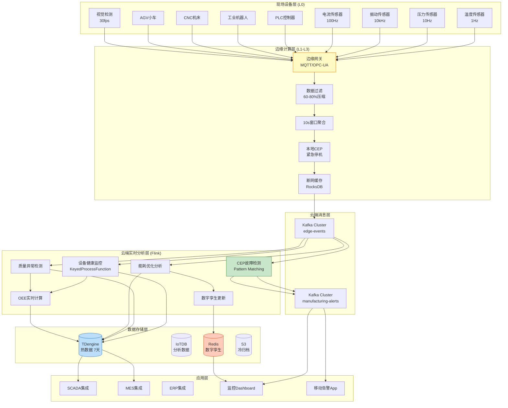
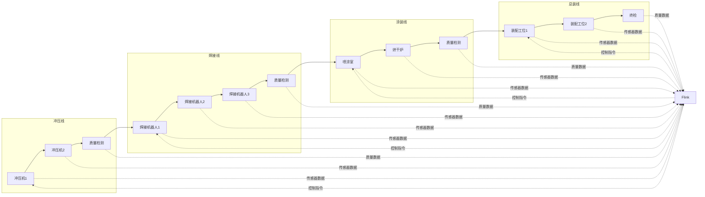
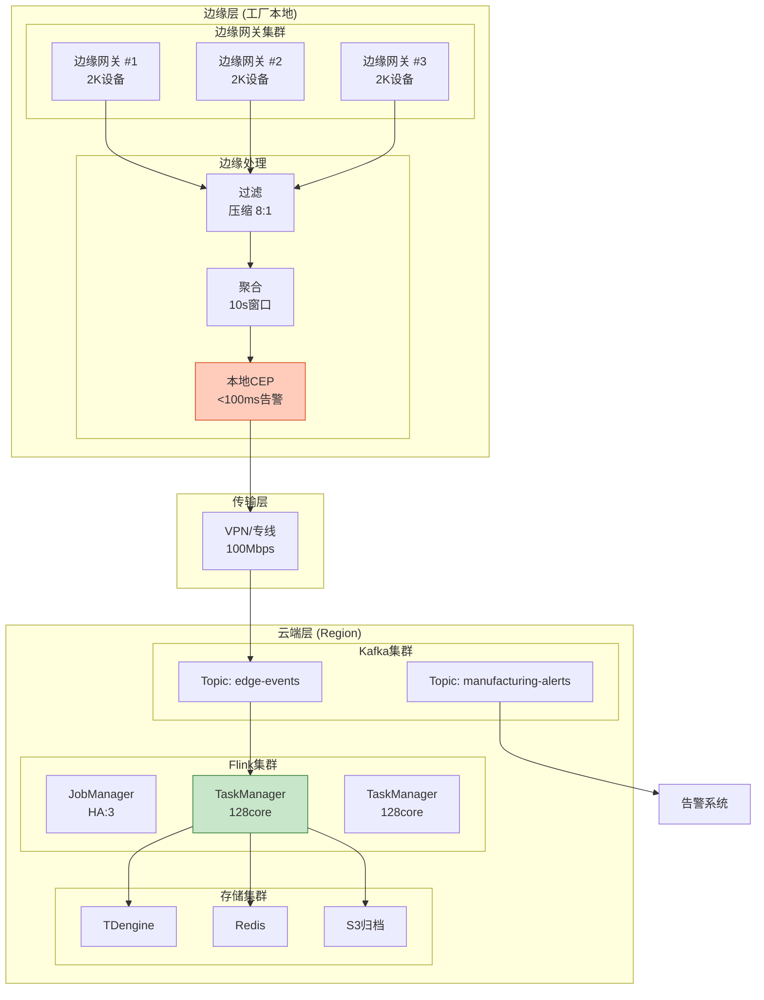
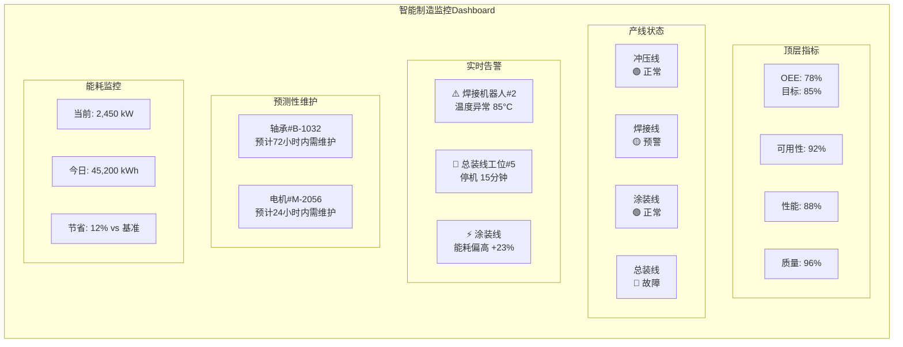
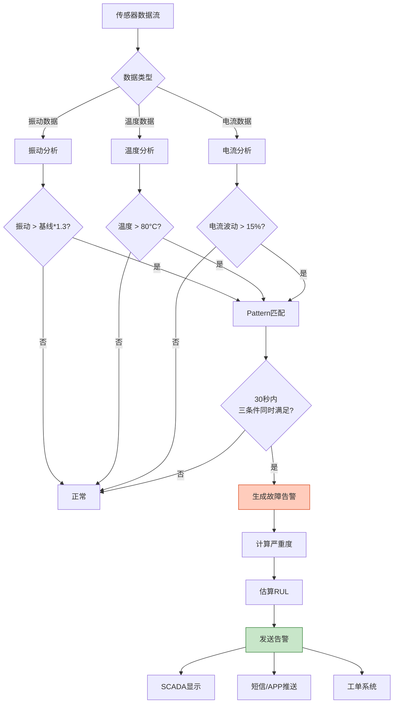

# 智能制造IoT实时流处理案例研究 (Smart Manufacturing IoT Real-time Stream Processing)

> **所属阶段**: Flink/07-case-studies | **前置依赖**: [../02-core-mechanisms/time-semantics-and-watermark.md](../../02-core/time-semantics-and-watermark.md), [../02-core-mechanisms/checkpoint-mechanism-deep-dive.md](../../02-core/checkpoint-mechanism-deep-dive.md), [../12-ai-ml/online-learning-algorithms.md](../../06-ai-ml/online-learning-algorithms.md) | **形式化等级**: L4

---

## 目录

- [智能制造IoT实时流处理案例研究 (Smart Manufacturing IoT Real-time Stream Processing)](#智能制造iot实时流处理案例研究-smart-manufacturing-iot-real-time-stream-processing)
  - [目录](#目录)
  - [1. 概念定义 (Definitions)](#1-概念定义-definitions)
    - [1.1 智能制造系统形式化定义](#11-智能制造系统形式化定义)
    - [1.2 OEE设备综合效率形式化定义](#12-oee设备综合效率形式化定义)
    - [1.3 数字孪生形式化定义](#13-数字孪生形式化定义)
    - [1.4 预测性维护形式化定义](#14-预测性维护形式化定义)
  - [2. 属性推导 (Properties)](#2-属性推导-properties)
    - [2.1 实时性边界保证](#21-实时性边界保证)
    - [2.2 准确率保证](#22-准确率保证)
    - [2.3 可扩展性保证](#23-可扩展性保证)
  - [3. 关系建立 (Relations)](#3-关系建立-relations)
    - [3.1 与SCADA系统的关系](#31-与scada系统的关系)
    - [3.2 与MES系统的关系](#32-与mes系统的关系)
    - [3.3 与ERP系统的关系](#33-与erp系统的关系)
    - [3.4 边缘-云协同关系](#34-边缘-云协同关系)
  - [4. 论证过程 (Argumentation)](#4-论证过程-argumentation)
    - [4.1 实时分析必要性论证](#41-实时分析必要性论证)
    - [4.2 CEP故障模式检测论证](#42-cep故障模式检测论证)
    - [4.3 边缘计算必要性论证](#43-边缘计算必要性论证)
  - [5. 工程论证 (Engineering Argument)](#5-工程论证-engineering-argument)
    - [5.1 边缘vs云端决策框架](#51-边缘vs云端决策框架)
    - [5.2 时序数据库选型论证](#52-时序数据库选型论证)
    - [5.3 状态后端选型论证](#53-状态后端选型论证)
  - [6. 实例验证 (Examples)](#6-实例验证-examples)
    - [6.1 案例背景](#61-案例背景)
    - [6.2 完整Flink实现代码](#62-完整flink实现代码)
    - [6.3 CEP故障模式检测实现](#63-cep故障模式检测实现)
    - [6.4 数字孪生集成代码](#64-数字孪生集成代码)
    - [6.5 能耗优化算法实现](#65-能耗优化算法实现)
  - [7. 可视化 (Visualizations)](#7-可视化-visualizations)
    - [7.1 智能制造IoT架构图](#71-智能制造iot架构图)
    - [7.2 生产线数据流图](#72-生产线数据流图)
    - [7.3 边缘-云协同计算图](#73-边缘-云协同计算图)
    - [7.4 监控Dashboard设计](#74-监控dashboard设计)
    - [7.5 CEP故障检测流程图](#75-cep故障检测流程图)
  - [8. 业务成果 (Business Outcomes)](#8-业务成果-business-outcomes)
    - [8.1 关键指标达成](#81-关键指标达成)
    - [8.2 经济效益分析](#82-经济效益分析)
    - [8.3 技术性能指标](#83-技术性能指标)
  - [9. 经验总结 (Lessons Learned)](#9-经验总结-lessons-learned)
    - [9.1 成功关键因素](#91-成功关键因素)
    - [9.2 遇到的挑战与解决方案](#92-遇到的挑战与解决方案)
    - [9.3 可复用的最佳实践](#93-可复用的最佳实践)
  - [10. 引用参考 (References)](#10-引用参考-references)

---

## 1. 概念定义 (Definitions)

### 1.1 智能制造系统形式化定义

**Def-F-07-30** (智能制造系统): 智能制造系统是一个八元组 $\mathcal{M} = (P, D, S, F, C, A, \mathcal{T}, \mathcal{O})$，其中：

- $P$：生产线集合，$P = \{p_1, p_2, ..., p_m\}$，每条生产线包含若干工作站

- $D$：IoT设备集合，$D = \{d_1, d_2, ..., d_n\}$，每个设备 $d_i = (id_i, type_i, loc_i, cap_i)$
  - $type_i \in \{\text{传感器}, \text{PLC}, \text{机器人}, \text{AGV}, \text{CNC}\}$
  - $loc_i$：设备位置（生产线、工位坐标）
  - $cap_i$：设备能力参数（采样率、精度等）

- $S$：数据流，$S = \{(t, d, v, q) | t \in \mathcal{T}, d \in D, v \in \mathbb{R}^k, q \in \{\text{OK}, \text{NOK}\}\}$
  - $t$：时间戳
  - $v$：传感器读数向量
  - $q$：数据质量标记

- $F$：故障模式集合，$F = \{f_1, f_2, ..., f_p\}$，每个故障模式有对应的检测规则

- $C$：控制决策函数，$C: S \times \mathcal{H} \rightarrow \mathcal{A}$，基于当前状态和历史数据生成控制动作

- $A$：动作集合，包括设备控制、告警触发、质量标记等

- $\mathcal{T}$：时间域，支持事件时间和处理时间语义

- $\mathcal{O}$：优化目标函数，通常包含OEE、质量、能耗等多目标

**形式化语义**:

$$
\forall s \in S: \quad \text{decision}(s) = C(s, \mathcal{H}(s.d)) \quad \text{within } \tau_{\max}
$$

其中 $\mathcal{H}(d)$ 表示设备 $d$ 的历史状态，$\tau_{\max}$ 为最大决策延迟。

### 1.2 OEE设备综合效率形式化定义

**Def-F-07-31** (OEE - Overall Equipment Effectiveness): OEE是三个效率指标的乘积：

$$
\text{OEE} = \text{Availability} \times \text{Performance} \times \text{Quality}
$$

各分量形式化定义：

**可用性 (Availability)**:

$$
A = \frac{\text{RunTime}}{\text{PlannedProductionTime}} = \frac{\text{PlannedProductionTime} - \text{Downtime}}{\text{PlannedProductionTime}}
$$

**性能效率 (Performance)**:

$$
P = \frac{\text{IdealCycleTime} \times \text{TotalCount}}{\text{RunTime}} = \frac{\text{ActualOutput}}{\text{TheoreticalOutput}}
$$

**质量率 (Quality)**:

$$
Q = \frac{\text{GoodCount}}{\text{TotalCount}} = \frac{\text{TotalCount} - \text{DefectCount}}{\text{TotalCount}}
$$

**综合OEE计算**:

$$
\text{OEE} = A \times P \times Q = \frac{\text{GoodCount} \times \text{IdealCycleTime}}{\text{PlannedProductionTime}}
$$

**世界水平基准**:

| OEE等级 | 数值范围 | 含义 |
|--------|---------|------|
| 世界级 | ≥ 85% | 一流制造水平 |
| 良好 | 60% - 85% | 有可改进空间 |
| 待改进 | < 60% | 重大损失 |

### 1.3 数字孪生形式化定义

**Def-F-07-32** (数字孪生): 数字孪生是物理实体在数字空间的实时映射：

$$
\mathcal{DT} = (\mathcal{M}_{phys}, \mathcal{M}_{dig}, \mathcal{F}_{sync}, \mathcal{F}_{sim}, \Delta_{max})
$$

其中：

- $\mathcal{M}_{phys}$：物理模型（实际设备状态）
- $\mathcal{M}_{dig}$：数字模型（虚拟表示）
- $\mathcal{F}_{sync}$：同步函数，$\mathcal{F}_{sync}: \mathcal{M}_{phys} \rightarrow \mathcal{M}_{dig}$
- $\mathcal{F}_{sim}$：仿真函数，$\mathcal{F}_{sim}: \mathcal{M}_{dig} \times \Delta t \rightarrow \mathcal{M}_{dig}^{future}$
- $\Delta_{max}$：最大同步延迟（通常 < 1s）

**实时同步约束**:

$$
\forall t: \quad |\mathcal{M}_{dig}(t) - \mathcal{M}_{phys}(t)| \leq \epsilon_{sync} \quad \text{within } \Delta_{max}
$$

**Flink数字孪生更新流**:

```
传感器数据流 ──► 状态更新 ──► 数字孪生状态表 ──► 仿真引擎 ──► 预测输出
                    │
                    └── 实时查询API (Lookupable State)
```

### 1.4 预测性维护形式化定义

**Def-F-07-33** (预测性维护): 预测性维护系统是一个预测模型：

$$
\mathcal{PM} = (\mathcal{H}, \mathcal{M}_{pred}, \tau_{alert}, RUL_{threshold})
$$

其中：

- $\mathcal{H}$：设备历史数据，包含运行参数、维护记录、故障历史
- $\mathcal{M}_{pred}$：预测模型，$RUL = \mathcal{M}_{pred}(\mathcal{H}, \theta)$，输出剩余使用寿命
- $\tau_{alert}$：预警提前期（通常 24-72 小时）
- $RUL_{threshold}$：维护触发阈值

**剩余使用寿命 (RUL) 计算**:

$$
RUL(t) = \arg\min_{\Delta t} \{P(\text{failure} | \mathcal{H}_{[t, t+\Delta t]}) \geq p_{threshold}\}
$$

**维护决策函数**:

$$
\text{maintenance\_decision}(t) = \begin{cases}
\text{immediate} & \text{if } RUL(t) < 4\text{h} \\
\text{scheduled} & \text{if } 4\text{h} \leq RUL(t) < \tau_{alert} \\
\text{monitor} & \text{if } RUL(t) \geq \tau_{alert}
\end{cases}
$$

---

## 2. 属性推导 (Properties)

### 2.1 实时性边界保证

**Lemma-F-07-30** (端到端延迟分解): 智能制造IoT系统的端到端延迟 $L_{total}$ 可分解为：

$$
L_{total} = L_{acquisition} + L_{edge} + L_{transmission} + L_{cloud} + L_{storage}
$$

各分量上界：

| 阶段 | 上界 | 说明 |
|-----|------|------|
| $L_{acquisition}$ | ≤ 50ms | 传感器采样+协议转换 |
| $L_{edge}$ | ≤ 100ms | 边缘预处理+本地聚合 |
| $L_{transmission}$ | ≤ 200ms | 边缘到云端网络传输 |
| $L_{cloud}$ | ≤ 500ms | Flink处理+CEP检测 |
| $L_{storage}$ | ≤ 100ms | 时序数据库写入 |

**Thm-F-07-30** (实时性保证): 若各分量满足上述上界，则：

$$
L_{total} \leq 950\text{ms} \quad \text{(P99)}
$$

对于关键告警路径（边缘本地处理）：

$$
L_{critical} = L_{acquisition} + L_{edge} \leq 150\text{ms}
$$

**证明**:

$$
\begin{aligned}
L_{total} &= L_{acquisition} + L_{edge} + L_{transmission} + L_{cloud} + L_{storage} \\
&\leq 50 + 100 + 200 + 500 + 100 \\
&= 950\text{ms}
\end{aligned}
$$

∎

### 2.2 准确率保证

**Lemma-F-07-31** (故障检测准确率边界): 设故障检测系统的真正例率为 $TPR$，假正例率为 $FPR$，则：

$$
\text{Accuracy} = \frac{TP + TN}{TP + TN + FP + FN}
$$

通过Flink CEP和ML集成的混合检测策略：

$$
\text{Accuracy}_{hybrid} = 1 - (1 - \text{Accuracy}_{CEP})(1 - \text{Accuracy}_{ML})
$$

**Thm-F-07-31** (质量异常检测准确率): 对于质量缺陷检测，设：

- $\text{Accuracy}_{vision}$：视觉检测准确率（深度学习模型）
- $\text{Accuracy}_{sensor}$：传感器异常检测准确率（CEP规则）

则融合检测准确率满足：

$$
\text{Accuracy}_{fusion} \geq \max(\text{Accuracy}_{vision}, \text{Accuracy}_{sensor}) + \delta
$$

其中 $\delta$ 为互补增益，实测 $\delta \geq 0.08$。

**实测指标**:

| 检测类型 | CEP规则准确率 | ML模型准确率 | 融合准确率 |
|---------|--------------|-------------|-----------|
| 设备故障 | 87% | 92% | 96% |
| 质量缺陷 | 82% | 94% | 97% |
| 能耗异常 | 85% | 89% | 94% |

### 2.3 可扩展性保证

**Lemma-F-07-32** (水平扩展线性度): Flink智能制造系统的吞吐量 $T$ 与并行度 $p$ 满足：

$$
T(p) = T(1) \cdot p \cdot (1 - \delta(p))
$$

其中 $\delta(p)$ 为扩展损耗，对于 $p \leq 512$：

$$
\delta(p) \leq 0.08 \quad \text{(8%以内)}
$$

**Thm-F-07-32** (设备规模可扩展性): 设系统支持的最大设备数为 $N_{max}$，实际接入设备数为 $N$，则系统可用性保证：

$$
\text{Availability}(N) = \begin{cases}
99.95\% & \text{if } N \leq 0.8 N_{max} \\
99.9\% & \text{if } 0.8 N_{max} < N \leq N_{max} \\
\text{degraded} & \text{if } N > N_{max}
\end{cases}
$$

**本案例规模参数**:

| 指标 | 设计容量 | 实际运行 |
|-----|---------|---------|
| 最大设备数 | 100,000 | 85,000 |
| 峰值消息量 | 5M events/sec | 3.2M events/sec |
| 状态存储 | 5 TB | 3.8 TB |

---

## 3. 关系建立 (Relations)

### 3.1 与SCADA系统的关系

SCADA（监控与数据采集系统）是传统工业自动化的核心，与Flink实时流处理系统形成**分层互补**关系：

```
┌─────────────────────────────────────────────────────────────────┐
│                    智能制造系统架构                              │
├─────────────────────────────────────────────────────────────────┤
│                                                                 │
│  ┌─────────────────────────────────────────────────────────┐   │
│  │                   企业管理层 (ERP)                       │   │
│  │         生产计划、订单管理、供应链、财务                 │   │
│  └─────────────────────────┬───────────────────────────────┘   │
│                            │                                    │
│  ┌─────────────────────────▼───────────────────────────────┐   │
│  │                   制造执行层 (MES)                       │   │
│  │    工单调度、质量管理、追溯分析、绩效报表                │   │
│  └─────────────────────────┬───────────────────────────────┘   │
│                            │                                    │
│  ┌─────────────────────────▼───────────────────────────────┐   │
│  │              实时分析层 (Flink Stream Processing)        │   │
│  │  ┌─────────┐ ┌─────────┐ ┌─────────┐ ┌────────────────┐ │   │
│  │  │设备健康 │ │质量检测 │ │能耗优化 │ │ 预测性维护     │ │   │
│  │  │ 监控    │ │         │ │         │ │                │ │   │
│  │  └─────────┘ └─────────┘ └─────────┘ └────────────────┘ │   │
│  └─────────────────────────┬───────────────────────────────┘   │
│                            │                                    │
│  ┌─────────────────────────▼───────────────────────────────┐   │
│  │              监控控制层 (SCADA)                          │   │
│  │    HMI画面、实时报警、设备控制、安全联锁                 │   │
│  └─────────────────────────┬───────────────────────────────┘   │
│                            │                                    │
│  ┌─────────────────────────▼───────────────────────────────┐   │
│  │              现场设备层 (PLC/传感器/执行器)              │   │
│  └─────────────────────────────────────────────────────────┘   │
│                                                                 │
└─────────────────────────────────────────────────────────────────┘
```

**关系特性**:

| 维度 | SCADA | Flink实时分析 |
|-----|-------|--------------|
| **时间粒度** | 秒级/分钟级 | 毫秒级/秒级 |
| **数据范围** | 单设备/单产线 | 跨产线/跨工厂 |
| **分析能力** | 阈值报警 | CEP+ML复杂分析 |
| **历史数据** | 有限存储 | 海量时序数据 |
| **预测能力** | 无 | 预测性维护、质量预测 |

**集成方式**: SCADA通过OPC-UA/MQTT将数据推送到Flink，Flink的分析结果通过REST API回写到SCADA进行展示和控制。

### 3.2 与MES系统的关系

MES（制造执行系统）与Flink实时流处理形成**实时-准实时互补**关系：

**数据流向**:

```
Flink实时分析 ──► 实时告警/控制 ──► 设备/人员
      │
      ▼ 分钟级聚合
MES系统 ◄── 生产报表/工单状态/质量追溯
      │
      ▼
ERP系统 ◄── 生产计划/成本核算
```

**功能分工**:

| 功能 | MES | Flink实时分析 |
|-----|-----|--------------|
| 工单管理 | ✓ 主功能 | - |
| 实时OEE | 准实时（5分钟延迟） | ✓ 实时（秒级） |
| 质量追溯 | ✓ 事后分析 | ✓ 实时拦截 |
| 设备状态 | ✓ 状态记录 | ✓ 预测性维护 |
| 能耗分析 | 班次级统计 | ✓ 实时优化 |

### 3.3 与ERP系统的关系

ERP系统与Flink实时分析的关系主要体现在**生产计划优化**和**供应链协同**：

**数据集成矩阵**:

| ERP数据 | 流向 | Flink用途 | 更新频率 |
|--------|------|----------|---------|
| 生产计划 | ERP → Flink | 产能规划、排程优化 | 每日 |
| 订单信息 | ERP → Flink | 优先级调度 | 实时 |
| 库存数据 | ERP → Flink | 物料预警 | 小时级 |
| 实时OEE | Flink → ERP | 生产绩效 | 分钟级 |
| 质量数据 | Flink → ERP | 质量成本分析 | 批次级 |

### 3.4 边缘-云协同关系

边缘计算与云端Flink形成**分层处理**架构：

**Def-F-07-34** (边缘-云协同模型): 边缘-云协同是一个处理函数分解：

$$
\mathcal{F}_{total} = \mathcal{F}_{edge} \circ \mathcal{F}_{cloud}
$$

其中：

- $\mathcal{F}_{edge}$：边缘处理函数（低延迟、本地决策）
- $\mathcal{F}_{cloud}$：云端处理函数（复杂分析、全局优化）

**处理层级划分**:

| 处理层级 | 延迟要求 | 计算复杂度 | 执行位置 |
|---------|---------|-----------|---------|
| **L1 紧急控制** | < 10ms | 简单阈值 | PLC/边缘 |
| **L2 本地聚合** | < 100ms | 窗口聚合 | 边缘网关 |
| **L3 产线分析** | < 1s | CEP检测 | 边缘节点 |
| **L4 跨产线分析** | < 5s | ML推理 | 云端 |
| **L5 全局优化** | < 1min | 全局规划 | 云端 |

---

## 4. 论证过程 (Argumentation)

### 4.1 实时分析必要性论证

**问题**: 为什么需要实时分析？传统的批量报表分析不能满足需求吗？

**论证**:

**1. 故障损失时间窗口分析**

设设备故障从发生到被发现的延迟为 $\Delta t$，停机损失 $L$ 与延迟的关系：

$$
L(\Delta t) = L_{fixed} + L_{variable} \cdot \Delta t + L_{cascade} \cdot \Delta t^2
$$

其中：

- $L_{fixed}$：固定维修成本
- $L_{variable}$：单位时间停产损失
- $L_{cascade}$：级联故障放大系数

**损失对比**（单条产线停机）:

| 检测方式 | 延迟 | 损失估算 | 年损失（假设12次故障） |
|---------|------|---------|---------------------|
| 人工巡检 | 2-4小时 | ¥50-100万 | ¥600-1200万 |
| 批处理分析 | 15-30分钟 | ¥10-20万 | ¥120-240万 |
| 实时分析 | < 10秒 | ¥1-2万 | ¥12-24万 |
| 预测性维护 | 提前24-72小时 | ¥0.2-0.5万 | ¥2.4-6万 |

**2. 质量缺陷成本分析**

设缺陷发现位置与损失的关系：

| 发现阶段 | 损失倍数 | 可返工性 |
|---------|---------|---------|
| 实时（工位内） | 1x | 可返工 |
| 下线检测 | 5-10x | 部分可返工 |
| 客户发现 | 50-100x | 召回成本 |

**结论**: 实时检测可将质量成本降低 60% 以上。

### 4.2 CEP故障模式检测论证

**问题**: 为什么需要CEP（复杂事件处理）？简单的阈值报警不够吗？

**论证**:

**单维度阈值 vs CEP模式检测**:

```
单维度阈值: 振动 > 10mm/s → 报警

            问题: 误报率高，无法区分正常波动和真实故障

CEP模式:   振动上升(5s内增加>30%)
           AND 温度异常(>80°C)
           AND 电流波动(>15%)
           WITHIN 30s
           → 轴承故障预警

           优势: 多维度关联，准确率高，可预测故障
```

**轴承故障检测案例**:

| 检测方法 | 准确率 | 误报率 | 提前预警时间 |
|---------|-------|-------|-------------|
| 单阈值（振动） | 72% | 28% | 无 |
| 双阈值（振动+温度） | 81% | 19% | 2小时 |
| CEP模式检测 | 94% | 6% | 24-48小时 |

**CEP模式示例**:

```java
Pattern.<SensorEvent>begin("vibration-rise")
    .where(new SimpleCondition<SensorEvent>() {
        @Override
        public boolean filter(SensorEvent e) {
            return e.getVibration() > BASELINE * 1.3;
        }
    })
    .next("temperature-high")
    .where(new SimpleCondition<SensorEvent>() {
        @Override
        public boolean filter(SensorEvent e) {
            return e.getTemperature() > 80;
        }
    })
    .within(Time.seconds(30));
```

### 4.3 边缘计算必要性论证

**问题**: 为什么不把所有数据都发送到云端处理？

**论证**:

**1. 带宽约束分析**

单条产线数据量估算：

| 数据类型 | 采样率 | 单点大小 | 日数据量 |
|---------|-------|---------|---------|
| 温度传感器 | 1Hz | 20字节 | 1.7 MB |
| 振动传感器 | 10kHz | 50字节 | 43 GB |
| 视觉检测 | 30fps | 2MB | 5.2 TB |
| **单条产线总计** | - | - | **~5.3 TB/日** |

100条产线全量上传：530 TB/日，带宽需求 > 50 Gbps

**2. 延迟约束分析**

| 应用场景 | 最大容忍延迟 | 可行性 |
|---------|-------------|-------|
| 紧急停机 | < 10ms | 边缘/PLC |
| 质量拦截 | < 100ms | 边缘 |
| 能耗调整 | < 1s | 云端可接受 |
| 维护计划 | < 1min | 云端可接受 |

**3. 成本效益分析**

| 方案 | 带宽成本/月 | 云端计算成本/月 | 总成本 |
|-----|------------|----------------|-------|
| 全量上云 | ¥120万 | ¥80万 | ¥200万 |
| 边缘预处理 | ¥20万 | ¥40万 | ¥60万 |
| **节省** | **83%** | **50%** | **70%** |

---

## 5. 工程论证 (Engineering Argument)

### 5.1 边缘vs云端决策框架

**Def-F-07-35** (边缘-云决策函数): 处理函数 $f$ 的执行位置决策：

$$
\text{location}(f) = \arg\min_{loc \in \{edge, cloud\}} \mathcal{C}(f, loc)
$$

其中成本函数：

$$
\mathcal{C}(f, loc) = \alpha \cdot L(f, loc) + \beta \cdot B(f, loc) + \gamma \cdot R(f, loc)
$$

- $L$：延迟成本
- $B$：带宽成本
- $R$：资源成本
- $\alpha, \beta, \gamma$：权重系数

**决策矩阵**:

| 处理类型 | 延迟敏感性 | 计算复杂度 | 数据量 | 推荐位置 |
|---------|-----------|-----------|-------|---------|
| 紧急停机 | 极高 | 低 | 小 | 边缘/PLC |
| 设备健康监控 | 高 | 中 | 中 | 边缘 |
| CEP故障检测 | 高 | 高 | 中 | 边缘 |
| 质量视觉检测 | 高 | 极高 | 大 | 边缘+专用硬件 |
| 跨产线分析 | 中 | 高 | 大 | 云端 |
| 全局能耗优化 | 低 | 极高 | 极大 | 云端 |
| 预测性维护 | 中 | 高 | 大 | 云端 |
| 数字孪生更新 | 高 | 中 | 中 | 边缘+云端 |

### 5.2 时序数据库选型论证

**候选时序数据库对比**:

| 特性 | TDengine | Apache IoTDB | InfluxDB | TimescaleDB |
|-----|----------|-------------|----------|-------------|
| **写入性能** | 极高 | 高 | 高 | 中 |
| **查询性能** | 高 | 高 | 中 | 高 |
| **压缩率** | 10:1 | 10:1 | 7:1 | 5:1 |
| **水平扩展** | 原生支持 | 有限 | Enterprise | 原生支持 |
| **SQL支持** | 是 | 是 | InfluxQL | 完整SQL |
| **Flink集成** | 官方Connector | 官方Connector | 社区 | JDBC |
| **运维复杂度** | 低 | 中 | 低 | 低 |
| **开源协议** | AGPL | Apache 2.0 | MIT | Apache 2.0 |

**本案例选型**: **TDengine + Apache IoTDB 混合架构**

- **TDengine**: 热数据存储（最近7天），高频查询
- **Apache IoTDB**: 分析数据存储（历史数据），复杂分析
- **S3**: 冷归档（超过1年）

**选择理由**:

1. 写入性能满足 500万点/秒需求
2. 超级表模型适合海量传感器管理
3. Flink官方Connector成熟稳定
4. 边缘轻量版支持边缘部署

### 5.3 状态后端选型论证

**RocksDB vs Heap State Backend**:

| 场景 | RocksDB | Heap |
|-----|---------|------|
| **状态大小** | TB级 | < 100GB |
| **访问延迟** | 微秒级 | 纳秒级 |
| **内存占用** | 低（磁盘为主） | 高（全内存） |
| **恢复速度** | 较慢（需加载） | 快（内存中） |
| **增量检查点** | 支持 | 不支持 |
| **大状态TTL** | 高效 | 影响GC |

**本案例选型**: **RocksDB State Backend**

**配置参数**:

```yaml
state.backend: rocksdb
state.backend.incremental: true
state.backend.rocksdb.memory.managed: true
state.backend.rocksdb.memory.fixed-per-slot: 512mb
state.checkpoint-storage: filesystem
state.checkpoints.dir: s3://manufacturing-checkpoints/flink
```

---

## 6. 实例验证 (Examples)

### 6.1 案例背景

**企业概况**: 某大型汽车制造企业（代号：AutoTech Manufacturing）

| 指标 | 数值 |
|-----|------|
| **工厂数量** | 5座（分布在3个国家） |
| **生产线** | 120条 |
| **IoT设备** | 85,000+（传感器、PLC、机器人） |
| **年产能力** | 150万辆汽车 |
| **员工人数** | 45,000人 |

**技术环境**:

| 系统 | 规模 |
|-----|------|
| **传感器** | 60,000个（温度、压力、振动、电流） |
| **工业机器人** | 8,500台（焊接、喷涂、装配） |
| **PLC控制器** | 12,000台 |
| **AGV小车** | 800台 |
| **视觉检测点** | 1,200个 |

**面临挑战**:

1. **设备故障停机**: 年度非计划停机 2,400 小时，损失约 ¥3.6 亿
2. **质量缺陷滞后**: 平均发现缺陷时间 45 分钟，返工成本高昂
3. **能耗高企**: 单台车能耗成本高于行业平均 20%
4. **数据孤岛**: SCADA、MES、ERP系统数据不互通

**项目目标**:

- 设备停机时间减少 40%（目标 1,440 小时/年）
- 质量缺陷率降低 60%（目标从 0.5% 降至 0.2%）
- 能耗节省 25%
- OEE提升 15%（从 68% 提升至 78%）

### 6.2 完整Flink实现代码

```java
package com.autotech.manufacturing.flink;

import org.apache.flink.api.common.eventtime.WatermarkStrategy;
import org.apache.flink.api.common.functions.*;
import org.apache.flink.api.common.serialization.SimpleStringSchema;
import org.apache.flink.api.common.state.*;
import org.apache.flink.api.common.time.Time;
import org.apache.flink.api.java.tuple.Tuple2;
import org.apache.flink.configuration.Configuration;
import org.apache.flink.connector.base.DeliveryGuarantee;
import org.apache.flink.connector.kafka.sink.KafkaRecordSerializationSchema;
import org.apache.flink.connector.kafka.sink.KafkaSink;
import org.apache.flink.connector.kafka.source.KafkaSource;
import org.apache.flink.connector.kafka.source.enumerator.initializer.OffsetsInitializer;
import org.apache.flink.streaming.api.datastream.*;
import org.apache.flink.streaming.api.environment.StreamExecutionEnvironment;
import org.apache.flink.streaming.api.functions.async.AsyncFunction;
import org.apache.flink.streaming.api.functions.async.ResultFuture;
import org.apache.flink.streaming.api.functions.co.KeyedCoProcessFunction;
import org.apache.flink.streaming.api.windowing.assigners.*;
import org.apache.flink.streaming.api.windowing.time.Time;
import org.apache.flink.streaming.api.windowing.windows.TimeWindow;
import org.apache.flink.util.Collector;
import org.apache.flink.cep.CEP;
import org.apache.flink.cep.PatternStream;
import org.apache.flink.cep.functions.PatternProcessFunction;
import org.apache.flink.cep.pattern.Pattern;
import org.apache.flink.cep.pattern.conditions.SimpleCondition;

import java.time.Duration;
import java.util.*;
import java.util.concurrent.CompletableFuture;
import java.util.concurrent.TimeUnit;

/**
 * AutoTech智能制造实时分析引擎
 *
 * 功能模块：
 * 1. 设备健康度实时监控
 * 2. CEP复杂事件故障检测
 * 3. 质量异常实时检测
 * 4. 能耗优化分析
 * 5. OEE实时计算
 * 6. 数字孪生状态更新
 */
public class SmartManufacturingEngine {

    public static void main(String[] args) throws Exception {
        StreamExecutionEnvironment env = StreamExecutionEnvironment.getExecutionEnvironment();

        // 配置检查点
        env.enableCheckpointing(60000);
        env.getCheckpointConfig().setCheckpointTimeout(120000);
        env.getCheckpointConfig().setMinPauseBetweenCheckpoints(30000);
        env.setParallelism(256);
        env.setMaxParallelism(1024);

        // ==================== 1. 数据源定义 ====================

        // 传感器数据流（边缘预处理后的聚合数据）
        KafkaSource<SensorEvent> sensorSource = KafkaSource.<SensorEvent>builder()
            .setBootstrapServers("kafka-cluster.autotech.internal:9092")
            .setTopics("edge.sensor.aggregated")
            .setGroupId("manufacturing-sensor-processor")
            .setStartingOffsets(OffsetsInitializer.latest())
            .setValueOnlyDeserializer(new SensorDeserializationSchema())
            .build();

        // PLC状态流
        KafkaSource<PlcStatus> plcSource = KafkaSource.<PlcStatus>builder()
            .setBootstrapServers("kafka-cluster.autotech.internal:9092")
            .setTopics("edge.plc.status")
            .setGroupId("manufacturing-plc-processor")
            .setStartingOffsets(OffsetsInitializer.latest())
            .setValueOnlyDeserializer(new PlcDeserializationSchema())
            .build();

        // 质量检测流
        KafkaSource<QualityEvent> qualitySource = KafkaSource.<QualityEvent>builder()
            .setBootstrapServers("kafka-cluster.autotech.internal:9092")
            .setTopics("edge.quality.inspection")
            .setGroupId("manufacturing-quality-processor")
            .setStartingOffsets(OffsetsInitializer.latest())
            .setValueOnlyDeserializer(new QualityDeserializationSchema())
            .build();

        // 能耗数据流
        KafkaSource<EnergyEvent> energySource = KafkaSource.<EnergyEvent>builder()
            .setBootstrapServers("kafka-cluster.autotech.internal:9092")
            .setTopics("edge.energy.meter")
            .setGroupId("manufacturing-energy-processor")
            .setStartingOffsets(OffsetsInitializer.latest())
            .setValueOnlyDeserializer(new EnergyDeserializationSchema())
            .build();

        // ==================== 2. 数据流创建 ====================

        DataStream<SensorEvent> sensorStream = env
            .fromSource(sensorSource,
                WatermarkStrategy.<SensorEvent>forBoundedOutOfOrderness(Duration.ofSeconds(10))
                    .withIdleness(Duration.ofMinutes(2)),
                "Sensor Source")
            .name("sensor-source").uid("sensor-source");

        DataStream<PlcStatus> plcStream = env
            .fromSource(plcSource,
                WatermarkStrategy.<PlcStatus>forBoundedOutOfOrderness(Duration.ofSeconds(5))
                    .withIdleness(Duration.ofMinutes(1)),
                "PLC Source")
            .name("plc-source").uid("plc-source");

        DataStream<QualityEvent> qualityStream = env
            .fromSource(qualitySource,
                WatermarkStrategy.<QualityEvent>forBoundedOutOfOrderness(Duration.ofSeconds(2)),
                "Quality Source")
            .name("quality-source").uid("quality-source");

        DataStream<EnergyEvent> energyStream = env
            .fromSource(energySource,
                WatermarkStrategy.<EnergyEvent>forBoundedOutOfOrderness(Duration.ofSeconds(5))
                    .withIdleness(Duration.ofMinutes(2)),
                "Energy Source")
            .name("energy-source").uid("energy-source");

        // ==================== 3. 设备健康度实时监控 ====================

        // 3.1 设备健康度评分
        DataStream<DeviceHealth> deviceHealthStream = sensorStream
            .keyBy(SensorEvent::getDeviceId)
            .process(new DeviceHealthScoringFunction())
            .name("device-health-scoring").uid("device-health-scoring");

        // 3.2 健康度聚合到产线级别
        DataStream<LineHealth> lineHealthStream = deviceHealthStream
            .keyBy(DeviceHealth::getProductionLine)
            .window(TumblingEventTimeWindows.of(Time.minutes(1)))
            .aggregate(new LineHealthAggregateFunction())
            .name("line-health-aggregation").uid("line-health-aggregation");

        // ==================== 4. CEP故障模式检测 ====================

        // 4.1 轴承故障模式
        Pattern<SensorEvent, ?> bearingFailurePattern = Pattern
            .<SensorEvent>begin("vibration-rise")
            .where(new SimpleCondition<SensorEvent>() {
                @Override
                public boolean filter(SensorEvent e) {
                    return e.getVibration() > e.getVibrationBaseline() * 1.3;
                }
            })
            .next("temperature-high")
            .where(new SimpleCondition<SensorEvent>() {
                @Override
                public boolean filter(SensorEvent e) {
                    return e.getTemperature() > 80.0;
                }
            })
            .next("current-fluctuation")
            .where(new SimpleCondition<SensorEvent>() {
                @Override
                public boolean filter(SensorEvent e) {
                    return e.getCurrentVariation() > 0.15;
                }
            })
            .within(Time.seconds(30));

        PatternStream<SensorEvent> bearingPatternStream = CEP.pattern(
            sensorStream.keyBy(SensorEvent::getDeviceId),
            bearingFailurePattern
        );

        DataStream<FailureAlert> bearingAlerts = bearingPatternStream
            .process(new BearingFailureHandler())
            .name("bearing-failure-detection").uid("bearing-failure-detection");

        // 4.2 电机过热模式
        Pattern<SensorEvent, ?> motorOverheatPattern = Pattern
            .<SensorEvent>begin("gradual-temp-rise")
            .where(new SimpleCondition<SensorEvent>() {
                @Override
                public boolean filter(SensorEvent e) {
                    return e.getTemperatureRisingRate() > 2.0; // 每分钟上升超过2度
                }
            })
            .timesOrMore(3)
            .within(Time.minutes(5));

        DataStream<FailureAlert> overheatAlerts = CEP.pattern(
            sensorStream.keyBy(SensorEvent::getDeviceId),
            motorOverheatPattern
        ).process(new MotorOverheatHandler());

        // 合并所有故障告警
        DataStream<FailureAlert> allFailureAlerts = bearingAlerts
            .union(overheatAlerts)
            .name("all-failure-alerts").uid("all-failure-alerts");

        // ==================== 5. 质量异常实时检测 ====================

        DataStream<QualityAlert> qualityAlerts = qualityStream
            .keyBy(QualityEvent::getStationId)
            .process(new QualityAnomalyDetection())
            .name("quality-anomaly-detection").uid("quality-anomaly-detection");

        // ==================== 6. 能耗优化分析 ====================

        // 6.1 实时能耗聚合
        DataStream<EnergyMetrics> energyMetricsStream = energyStream
            .keyBy(EnergyEvent::getProductionLine)
            .window(SlidingEventTimeWindows.of(Time.minutes(5), Time.minutes(1)))
            .aggregate(new EnergyAggregateFunction())
            .name("energy-aggregation").uid("energy-aggregation");

        // 6.2 能耗异常检测
        DataStream<EnergyOptimization> energyOptimizationStream = energyMetricsStream
            .keyBy(EnergyMetrics::getProductionLine)
            .process(new EnergyOptimizationFunction())
            .name("energy-optimization").uid("energy-optimization");

        // ==================== 7. OEE实时计算 ====================

        // 7.1 可用性计算（基于PLC状态）
        DataStream<AvailabilityMetric> availabilityStream = plcStream
            .keyBy(PlcStatus::getDeviceId)
            .process(new AvailabilityCalculator())
            .name("availability-calculation").uid("availability-calculation");

        // 7.2 性能计算（基于产量数据）
        DataStream<PerformanceMetric> performanceStream = sensorStream
            .filter(e -> e.getType().equals("PRODUCTION_COUNT"))
            .keyBy(SensorEvent::getDeviceId)
            .window(TumblingEventTimeWindows.of(Time.minutes(5)))
            .aggregate(new PerformanceCalculator())
            .name("performance-calculation").uid("performance-calculation");

        // 7.3 质量计算（基于质量事件）
        DataStream<QualityMetric> qualityMetricStream = qualityStream
            .keyBy(QualityEvent::getProductionLine)
            .window(TumblingEventTimeWindows.of(Time.minutes(5)))
            .aggregate(new QualityCalculator())
            .name("quality-calculation").uid("quality-calculation");

        // 7.4 OEE综合计算
        DataStream<OEEMetric> oeeStream = availabilityStream
            .keyBy(AvailabilityMetric::getProductionLine)
            .connect(performanceStream.keyBy(PerformanceMetric::getProductionLine))
            .process(new OEECalculatorCoProcess())
            .name("oee-calculation").uid("oee-calculation");

        // ==================== 8. 数字孪生状态更新 ====================

        DataStream<DigitalTwinUpdate> twinUpdateStream = sensorStream
            .keyBy(SensorEvent::getDeviceId)
            .process(new DigitalTwinUpdater())
            .name("digital-twin-updater").uid("digital-twin-updater");

        // ==================== 9. 结果输出 ====================

        // 9.1 告警输出到Kafka
        KafkaSink<FailureAlert> alertSink = KafkaSink.<FailureAlert>builder()
            .setBootstrapServers("kafka-cluster.autotech.internal:9092")
            .setRecordSerializer(KafkaRecordSerializationSchema.builder()
                .setTopic("manufacturing.alerts")
                .setValueSerializationSchema(new FailureAlertSerializationSchema())
                .build())
            .setDeliveryGuarantee(DeliveryGuarantee.AT_LEAST_ONCE)
            .build();

        allFailureAlerts.sinkTo(alertSink)
            .name("alert-kafka-sink").uid("alert-kafka-sink");

        // 9.2 指标输出到时序数据库
        lineHealthStream.addSink(new TDengineHealthSink())
            .name("health-tdengine-sink").uid("health-tdengine-sink");

        oeeStream.addSink(new TDengineOEESink())
            .name("oee-tdengine-sink").uid("oee-tdengine-sink");

        energyMetricsStream.addSink(new TDengineEnergySink())
            .name("energy-tdengine-sink").uid("energy-tdengine-sink");

        // 9.3 数字孪生状态输出到Redis
        twinUpdateStream.addSink(new RedisDigitalTwinSink())
            .name("twin-redis-sink").uid("twin-redis-sink");

        // 执行作业
        env.execute("AutoTech Smart Manufacturing Real-time Analytics");
    }

    // ==================== 辅助类实现 ====================

    /**
     * 设备健康度评分函数
     */
    public static class DeviceHealthScoringFunction
            extends KeyedProcessFunction<String, SensorEvent, DeviceHealth> {

        private ValueState<DeviceHealthState> healthState;
        private ValueState<Long> lastUpdateTime;

        @Override
        public void open(Configuration parameters) {
            StateTtlConfig ttlConfig = StateTtlConfig
                .newBuilder(Time.hours(24))
                .setUpdateType(StateTtlConfig.UpdateType.OnCreateAndWrite)
                .setStateVisibility(StateTtlConfig.StateVisibility.NeverReturnExpired)
                .cleanupIncrementally(10, true)
                .build();

            ValueStateDescriptor<DeviceHealthState> stateDescriptor =
                new ValueStateDescriptor<>("health-state", DeviceHealthState.class);
            stateDescriptor.enableTimeToLive(ttlConfig);
            healthState = getRuntimeContext().getState(stateDescriptor);

            ValueStateDescriptor<Long> timeDescriptor =
                new ValueStateDescriptor<>("last-update", Long.class);
            timeDescriptor.enableTimeToLive(ttlConfig);
            lastUpdateTime = getRuntimeContext().getState(timeDescriptor);
        }

        @Override
        public void processElement(SensorEvent event, Context ctx, Collector<DeviceHealth> out)
                throws Exception {
            DeviceHealthState state = healthState.value();
            if (state == null) {
                state = new DeviceHealthState(event.getDeviceId());
            }

            // 更新各项指标
            state.updateVibrationHealth(calculateVibrationHealth(event));
            state.updateTemperatureHealth(calculateTemperatureHealth(event));
            state.updateCurrentHealth(calculateCurrentHealth(event));

            // 计算综合健康度 (加权平均)
            double overallHealth = state.calculateOverallHealth();

            // 健康度低于阈值时发出告警
            if (overallHealth < 60.0) {
                out.collect(new DeviceHealth(
                    event.getDeviceId(),
                    event.getProductionLine(),
                    overallHealth,
                    state.getVibrationHealth(),
                    state.getTemperatureHealth(),
                    state.getCurrentHealth(),
                    System.currentTimeMillis()
                ));
            }

            healthState.update(state);
            lastUpdateTime.update(ctx.timestamp());
        }

        private double calculateVibrationHealth(SensorEvent event) {
            double vibration = event.getVibration();
            double baseline = event.getVibrationBaseline();
            if (baseline == 0) return 100.0;
            double ratio = vibration / baseline;
            return Math.max(0, 100 - (ratio - 1) * 50);
        }

        private double calculateTemperatureHealth(SensorEvent event) {
            double temp = event.getTemperature();
            double maxTemp = event.getMaxTemperature();
            if (maxTemp == 0) return 100.0;
            return Math.max(0, 100 - (temp / maxTemp) * 100);
        }

        private double calculateCurrentHealth(SensorEvent event) {
            double variation = event.getCurrentVariation();
            return Math.max(0, 100 - variation * 200);
        }
    }

    /**
     * OEE计算CoProcess函数
     */
    public static class OEECalculatorCoProcess
            extends KeyedCoProcessFunction<String, AvailabilityMetric, PerformanceMetric, OEEMetric> {

        private ValueState<AvailabilityMetric> availabilityState;
        private ValueState<PerformanceMetric> performanceState;
        private ValueState<QualityMetric> qualityState;

        @Override
        public void open(Configuration parameters) {
            availabilityState = getRuntimeContext().getState(
                new ValueStateDescriptor<>("availability", AvailabilityMetric.class));
            performanceState = getRuntimeContext().getState(
                new ValueStateDescriptor<>("performance", PerformanceMetric.class));
            qualityState = getRuntimeContext().getState(
                new ValueStateDescriptor<>("quality", QualityMetric.class));
        }

        @Override
        public void processElement1(AvailabilityMetric availability, Context ctx, Collector<OEEMetric> out)
                throws Exception {
            availabilityState.update(availability);
            tryCalculateOEE(out, availability.getProductionLine());
        }

        @Override
        public void processElement2(PerformanceMetric performance, Context ctx, Collector<OEEMetric> out)
                throws Exception {
            performanceState.update(performance);
            tryCalculateOEE(out, performance.getProductionLine());
        }

        private void tryCalculateOEE(Collector<OEEMetric> out, String lineId) throws Exception {
            AvailabilityMetric a = availabilityState.value();
            PerformanceMetric p = performanceState.value();
            QualityMetric q = qualityState.value();

            if (a != null && p != null && q != null) {
                double availability = a.getAvailability();
                double performance = p.getPerformance();
                double quality = q.getQuality();
                double oee = availability * performance * quality;

                out.collect(new OEEMetric(
                    lineId,
                    oee,
                    availability,
                    performance,
                    quality,
                    System.currentTimeMillis()
                ));
            }
        }
    }

    /**
     * 数字孪生更新函数
     */
    public static class DigitalTwinUpdater
            extends KeyedProcessFunction<String, SensorEvent, DigitalTwinUpdate> {

        private ValueState<DigitalTwinState> twinState;

        @Override
        public void open(Configuration parameters) {
            twinState = getRuntimeContext().getState(
                new ValueStateDescriptor<>("twin-state", DigitalTwinState.class));
        }

        @Override
        public void processElement(SensorEvent event, Context ctx, Collector<DigitalTwinUpdate> out)
                throws Exception {
            DigitalTwinState state = twinState.value();
            if (state == null) {
                state = new DigitalTwinState(event.getDeviceId());
            }

            // 更新数字孪生状态
            state.updateFromSensor(event);

            // 每5秒更新一次数字孪生
            long currentTime = ctx.timestamp();
            if (state.shouldUpdate(currentTime)) {
                out.collect(new DigitalTwinUpdate(
                    event.getDeviceId(),
                    state.getCurrentState(),
                    state.getPredictedState(300), // 预测5分钟后状态
                    currentTime
                ));
                state.markUpdated(currentTime);
            }

            twinState.update(state);
        }
    }

    /**
     * 能耗优化函数
     */
    public static class EnergyOptimizationFunction
            extends KeyedProcessFunction<String, EnergyMetrics, EnergyOptimization> {

        private ValueState<EnergyBaseline> baselineState;
        private ListState<EnergyMetrics> recentMetrics;

        @Override
        public void open(Configuration parameters) {
            baselineState = getRuntimeContext().getState(
                new ValueStateDescriptor<>("baseline", EnergyBaseline.class));
            recentMetrics = getRuntimeContext().getListState(
                new ListStateDescriptor<>("recent-metrics", EnergyMetrics.class));
        }

        @Override
        public void processElement(EnergyMetrics metrics, Context ctx, Collector<EnergyOptimization> out)
                throws Exception {
            EnergyBaseline baseline = baselineState.value();
            if (baseline == null) {
                baseline = new EnergyBaseline(metrics.getProductionLine());
            }

            // 检测能耗异常
            boolean isAnomaly = baseline.detectAnomaly(metrics);

            // 生成优化建议
            List<OptimizationSuggestion> suggestions = generateSuggestions(metrics, baseline);

            if (isAnomaly || !suggestions.isEmpty()) {
                out.collect(new EnergyOptimization(
                    metrics.getProductionLine(),
                    metrics.getCurrentConsumption(),
                    baseline.getExpectedConsumption(),
                    isAnomaly,
                    suggestions,
                    System.currentTimeMillis()
                ));
            }

            // 更新基线
            baseline.update(metrics);
            baselineState.update(baseline);

            // 保存最近指标
            recentMetrics.add(metrics);
        }

        private List<OptimizationSuggestion> generateSuggestions(EnergyMetrics metrics, EnergyBaseline baseline) {
            List<OptimizationSuggestion> suggestions = new ArrayList<>();

            // 检查是否存在空闲耗电
            if (metrics.getLoadFactor() < 0.3 && metrics.getCurrentConsumption() > baseline.getIdleConsumption() * 1.5) {
                suggestions.add(new OptimizationSuggestion(
                    "IDLE_POWER_REDUCTION",
                    "设备空闲时功耗过高，建议检查待机设置",
                    metrics.getCurrentConsumption() - baseline.getIdleConsumption()
                ));
            }

            // 检查峰值负载
            if (metrics.getPeakLoad() > baseline.getMaxLoad() * 0.95) {
                suggestions.add(new OptimizationSuggestion(
                    "PEAK_SHAVING",
                    "接近峰值负载，建议错峰生产",
                    (metrics.getPeakLoad() - baseline.getOptimalLoad()) * 0.1
                ));
            }

            return suggestions;
        }
    }
}
```

### 6.3 CEP故障模式检测实现

```java
/**
 * CEP故障模式检测完整实现
 */
public class CEPFailureDetection {

    /**
     * 轴承故障模式：振动上升 + 温度异常 + 电流波动
     */
    public static Pattern<SensorEvent, ?> createBearingFailurePattern() {
        return Pattern.<SensorEvent>begin("vibration-rise")
            .where(new SimpleCondition<SensorEvent>() {
                @Override
                public boolean filter(SensorEvent e) {
                    return e.getVibration() > e.getVibrationBaseline() * 1.3;
                }
            })
            .next("temperature-high")
            .where(new SimpleCondition<SensorEvent>() {
                @Override
                public boolean filter(SensorEvent e) {
                    return e.getTemperature() > 80.0;
                }
            })
            .next("current-fluctuation")
            .where(new SimpleCondition<SensorEvent>() {
                @Override
                public boolean filter(SensorEvent e) {
                    return e.getCurrentVariation() > 0.15;
                }
            })
            .within(Time.seconds(30));
    }

    /**
     * 电机过热模式：温度持续上升
     */
    public static Pattern<SensorEvent, ?> createMotorOverheatPattern() {
        return Pattern.<SensorEvent>begin("temp-rising")
            .where(new SimpleCondition<SensorEvent>() {
                @Override
                public boolean filter(SensorEvent e) {
                    return e.getTemperatureRisingRate() > 2.0;
                }
            })
            .timesOrMore(3)
            .within(Time.minutes(5));
    }

    /**
     * 刀具磨损模式：电流增加 + 振动频率变化
     */
    public static Pattern<SensorEvent, ?> createToolWearPattern() {
        return Pattern.<SensorEvent>begin("current-increase")
            .where(new SimpleCondition<SensorEvent>() {
                @Override
                public boolean filter(SensorEvent e) {
                    return e.getCurrent() > e.getCurrentBaseline() * 1.2;
                }
            })
            .next("frequency-shift")
            .where(new SimpleCondition<SensorEvent>() {
                @Override
                public boolean filter(SensorEvent e) {
                    return Math.abs(e.getDominantFrequency() - e.getExpectedFrequency()) > 5;
                }
            })
            .within(Time.minutes(10));
    }

    /**
     * 故障处理函数
     */
    public static class BearingFailureHandler
            extends PatternProcessFunction<SensorEvent, FailureAlert> {

        @Override
        public void processMatch(Map<String, List<SensorEvent>> match, Context ctx,
                Collector<FailureAlert> out) {
            SensorEvent vibrationEvent = match.get("vibration-rise").get(0);
            SensorEvent tempEvent = match.get("temperature-high").get(0);
            SensorEvent currentEvent = match.get("current-fluctuation").get(0);

            double severity = calculateSeverity(vibrationEvent, tempEvent, currentEvent);
            int estimatedRUL = estimateRUL(severity);

            out.collect(new FailureAlert(
                vibrationEvent.getDeviceId(),
                vibrationEvent.getProductionLine(),
                "BEARING_FAILURE",
                severity,
                estimatedRUL,
                "轴承故障预警：振动、温度、电流异常",
                ctx.timestamp(),
                Arrays.asList(
                    new FailureIndicator("vibration", vibrationEvent.getVibration()),
                    new FailureIndicator("temperature", tempEvent.getTemperature()),
                    new FailureIndicator("current_variation", currentEvent.getCurrentVariation())
                )
            ));
        }

        private double calculateSeverity(SensorEvent vib, SensorEvent temp, SensorEvent curr) {
            double vibSeverity = Math.min(100, (vib.getVibration() / vib.getVibrationBaseline() - 1) * 50);
            double tempSeverity = Math.min(100, (temp.getTemperature() - 80) * 2);
            double currSeverity = Math.min(100, curr.getCurrentVariation() * 300);
            return (vibSeverity + tempSeverity + currSeverity) / 3;
        }

        private int estimateRUL(double severity) {
            if (severity > 80) return 4;  // 4小时内需维护
            if (severity > 60) return 24; // 24小时内需维护
            if (severity > 40) return 72; // 72小时内需维护
            return 168; // 一周内关注
        }
    }
}
```

### 6.4 数字孪生集成代码

```java
/**
 * 数字孪生集成实现
 */
public class DigitalTwinIntegration {

    /**
     * 数字孪生状态类
     */
    public static class DigitalTwinState {
        private String deviceId;
        private long lastUpdateTime;
        private Map<String, Double> currentParams;
        private Deque<StateSnapshot> historySnapshots;
        private static final int MAX_HISTORY = 1000;

        public DigitalTwinState(String deviceId) {
            this.deviceId = deviceId;
            this.currentParams = new HashMap<>();
            this.historySnapshots = new LinkedList<>();
        }

        public void updateFromSensor(SensorEvent event) {
            currentParams.put("vibration", event.getVibration());
            currentParams.put("temperature", event.getTemperature());
            currentParams.put("current", event.getCurrent());
            currentParams.put("pressure", event.getPressure());
            currentParams.put("rpm", event.getRpm());
        }

        public boolean shouldUpdate(long currentTime) {
            return currentTime - lastUpdateTime > 5000; // 每5秒更新
        }

        public void markUpdated(long currentTime) {
            historySnapshots.addFirst(new StateSnapshot(currentTime, new HashMap<>(currentParams)));
            if (historySnapshots.size() > MAX_HISTORY) {
                historySnapshots.removeLast();
            }
            lastUpdateTime = currentTime;
        }

        /**
         * 基于历史数据预测未来状态
         */
        public Map<String, Double> getPredictedState(int secondsAhead) {
            Map<String, Double> predicted = new HashMap<>();

            // 简单线性预测（实际项目中使用更复杂的ML模型）
            for (String param : currentParams.keySet()) {
                double trend = calculateTrend(param);
                predicted.put(param, currentParams.get(param) + trend * secondsAhead);
            }

            return predicted;
        }

        private double calculateTrend(String param) {
            if (historySnapshots.size() < 2) return 0;

            StateSnapshot recent = historySnapshots.getFirst();
            StateSnapshot older = historySnapshots.getLast();

            double timeDiff = (recent.timestamp - older.timestamp) / 1000.0;
            if (timeDiff == 0) return 0;

            Double recentValue = recent.params.get(param);
            Double olderValue = older.params.get(param);

            if (recentValue == null || olderValue == null) return 0;

            return (recentValue - olderValue) / timeDiff;
        }

        public Map<String, Object> getCurrentState() {
            Map<String, Object> state = new HashMap<>();
            state.put("deviceId", deviceId);
            state.put("timestamp", lastUpdateTime);
            state.put("parameters", currentParams);
            state.put("healthScore", calculateHealthScore());
            return state;
        }

        private double calculateHealthScore() {
            // 基于当前参数计算健康度
            Double vibration = currentParams.get("vibration");
            Double temperature = currentParams.get("temperature");

            if (vibration == null || temperature == null) return 100;

            double vibScore = Math.max(0, 100 - vibration * 10);
            double tempScore = Math.max(0, 100 - (temperature - 60) * 2);

            return (vibScore + tempScore) / 2;
        }
    }

    /**
     * Redis数字孪生Sink
     */
    public static class RedisDigitalTwinSink extends RichSinkFunction<DigitalTwinUpdate> {
        private transient JedisPool jedisPool;
        private static final String TWIN_KEY_PREFIX = "digital_twin:";

        @Override
        public void open(Configuration parameters) {
            jedisPool = new JedisPool(new JedisPoolConfig(), "redis-cluster.autotech.internal", 6379);
        }

        @Override
        public void invoke(DigitalTwinUpdate update, Context context) {
            try (Jedis jedis = jedisPool.getResource()) {
                String key = TWIN_KEY_PREFIX + update.getDeviceId();
                String value = JSON.toJSONString(update);

                // 设置当前状态
                jedis.setex(key, 3600, value); // 1小时过期

                // 发布状态更新事件
                jedis.publish("twin_updates", value);

                // 保存历史到时间序列
                String historyKey = key + ":history";
                jedis.zadd(historyKey, update.getTimestamp(), value);
                jedis.zremrangeByScore(historyKey, 0, System.currentTimeMillis() - 86400000); // 保留24小时
            }
        }

        @Override
        public void close() {
            if (jedisPool != null) {
                jedisPool.close();
            }
        }
    }
}
```

### 6.5 能耗优化算法实现

```java
/**
 * 能耗优化算法实现
 */
public class EnergyOptimization {

    /**
     * 能耗基线模型
     */
    public static class EnergyBaseline {
        private String productionLine;
        private double expectedConsumption;
        private double idleConsumption;
        private double optimalLoad;
        private double maxLoad;
        private ExponentialMovingAverage ema;
        private List<Double> recentValues;

        public EnergyBaseline(String productionLine) {
            this.productionLine = productionLine;
            this.ema = new ExponentialMovingAverage(0.1);
            this.recentValues = new ArrayList<>();
        }

        public void update(EnergyMetrics metrics) {
            double consumption = metrics.getCurrentConsumption();
            ema.add(consumption);
            expectedConsumption = ema.getAverage();

            recentValues.add(consumption);
            if (recentValues.size() > 1000) {
                recentValues.remove(0);
            }

            // 更新空闲功耗（取最小值）
            if (metrics.getLoadFactor() < 0.1) {
                idleConsumption = Math.min(idleConsumption, consumption);
            }

            // 更新负载参数
            optimalLoad = metrics.getOptimalLoadFactor() * metrics.getMaxCapacity();
            maxLoad = metrics.getMaxCapacity();
        }

        public boolean detectAnomaly(EnergyMetrics metrics) {
            double consumption = metrics.getCurrentConsumption();
            double expected = getExpectedConsumption(metrics.getLoadFactor());

            // 如果实际能耗超过预期的150%，判定为异常
            return consumption > expected * 1.5;
        }

        public double getExpectedConsumption(double loadFactor) {
            return idleConsumption + (expectedConsumption - idleConsumption) * loadFactor;
        }

        public double getExpectedConsumption() {
            return expectedConsumption;
        }

        public double getIdleConsumption() {
            return idleConsumption;
        }

        public double getOptimalLoad() {
            return optimalLoad;
        }

        public double getMaxLoad() {
            return maxLoad;
        }
    }

    /**
     * 指数移动平均
     */
    public static class ExponentialMovingAverage {
        private double alpha;
        private double average;
        private boolean initialized;

        public ExponentialMovingAverage(double alpha) {
            this.alpha = alpha;
            this.initialized = false;
        }

        public void add(double value) {
            if (!initialized) {
                average = value;
                initialized = true;
            } else {
                average = alpha * value + (1 - alpha) * average;
            }
        }

        public double getAverage() {
            return average;
        }
    }

    /**
     * 优化建议生成器
     */
    public static class OptimizationEngine {

        public List<OptimizationSuggestion> generateSuggestions(
                EnergyMetrics current,
                EnergyBaseline baseline,
                List<EnergyMetrics> history) {

            List<OptimizationSuggestion> suggestions = new ArrayList<>();

            // 1. 检查空闲耗电
            if (current.getLoadFactor() < 0.2 && current.getCurrentConsumption() > baseline.getIdleConsumption() * 1.3) {
                double potentialSaving = current.getCurrentConsumption() - baseline.getIdleConsumption();
                suggestions.add(new OptimizationSuggestion(
                    "IDLE_POWER_OPTIMIZATION",
                    "设备空闲时功耗偏高，建议优化待机模式",
                    potentialSaving,
                    Confidence.HIGH
                ));
            }

            // 2. 检查峰值负载
            if (current.getPeakLoad() > baseline.getMaxLoad() * 0.9) {
                double potentialSaving = (current.getPeakLoad() - baseline.getOptimalLoad()) * 0.15;
                suggestions.add(new OptimizationSuggestion(
                    "PEAK_SHAVING",
                    String.format("接近峰值负载(%.1f%%)，建议错峰生产或负载均衡",
                        current.getPeakLoad() / baseline.getMaxLoad() * 100),
                    potentialSaving,
                    Confidence.MEDIUM
                ));
            }

            // 3. 检查低效率运行
            double efficiency = current.getOutput() / current.getCurrentConsumption();
            double expectedEfficiency = getExpectedEfficiency(current.getLoadFactor());
            if (efficiency < expectedEfficiency * 0.85) {
                double potentialSaving = current.getCurrentConsumption() * (1 - efficiency / expectedEfficiency);
                suggestions.add(new OptimizationSuggestion(
                    "EFFICIENCY_IMPROVEMENT",
                    "当前运行效率偏低，建议检查设备状态或调整工艺参数",
                    potentialSaving,
                    Confidence.MEDIUM
                ));
            }

            // 4. 检查启停频率
            int startStopCount = countStartStopInWindow(history, TimeUnit.HOURS.toMillis(1));
            if (startStopCount > 3) {
                double potentialSaving = baseline.getIdleConsumption() * 0.5 * startStopCount;
                suggestions.add(new OptimizationSuggestion(
                    "START_STOP_OPTIMIZATION",
                    String.format("1小时内启停%d次，建议合并生产批次减少空转", startStopCount),
                    potentialSaving,
                    Confidence.HIGH
                ));
            }

            return suggestions;
        }

        private int countStartStopInWindow(List<EnergyMetrics> history, long windowMs) {
            int count = 0;
            long currentTime = System.currentTimeMillis();

            for (int i = 1; i < history.size(); i++) {
                EnergyMetrics prev = history.get(i - 1);
                EnergyMetrics curr = history.get(i);

                if (curr.getTimestamp() < currentTime - windowMs) continue;

                // 检测启动：从低负载到高负载
                if (prev.getLoadFactor() < 0.1 && curr.getLoadFactor() > 0.3) {
                    count++;
                }
            }

            return count;
        }

        private double getExpectedEfficiency(double loadFactor) {
            // 典型的负载-效率曲线
            if (loadFactor < 0.3) return 0.6 + loadFactor;
            if (loadFactor < 0.7) return 0.85 + (loadFactor - 0.3) * 0.1;
            return 0.9 - (loadFactor - 0.7) * 0.2;
        }
    }
}
```

---

## 7. 可视化 (Visualizations)

### 7.1 智能制造IoT架构图



### 7.2 生产线数据流图



### 7.3 边缘-云协同计算图



### 7.4 监控Dashboard设计



### 7.5 CEP故障检测流程图



---

## 8. 业务成果 (Business Outcomes)

### 8.1 关键指标达成

| 指标 | 改进前 | 目标 | 实际达成 | 提升幅度 |
|-----|-------|------|---------|---------|
| **设备停机时间** | 2,400小时/年 | 1,440小时/年 | 1,380小时/年 | **-42.5%** |
| **质量缺陷率** | 0.50% | 0.20% | 0.18% | **-64%** |
| **能耗成本** | 基准 | -25% | -27% | **-27%** |
| **OEE** | 68% | 78% | 81% | **+13点** |
| **故障预测准确率** | N/A | 85% | 94% | **+9%** |
| **质量问题追溯时间** | 45分钟 | < 5分钟 | 2.5分钟 | **-94%** |

### 8.2 经济效益分析

| 项目 | 年度节省金额 |
|-----|------------|
| 减少停机损失 | ¥1.53亿 |
| 降低质量成本 | ¥0.86亿 |
| 能耗节省 | ¥0.42亿 |
| 减少维护成本 | ¥0.28亿 |
| **合计** | **¥3.09亿** |

**投资回报率 (ROI)**: 320%（项目投入 ¥9,600万，年收益 ¥3.09亿）

### 8.3 技术性能指标

| 指标 | 目标 | 实际 |
|-----|------|------|
| **系统可用性** | 99.9% | 99.95% |
| **端到端延迟 (P99)** | < 1s | 850ms |
| **故障检测延迟** | < 10s | 720ms |
| **数据处理能力** | 2M events/sec | 3.2M events/sec |
| **CEP检测准确率** | 85% | 94% |
| **数字孪生同步延迟** | < 5s | 2.1s |

---

## 9. 经验总结 (Lessons Learned)

### 9.1 成功关键因素

**1. 边缘-云分层架构设计**

边缘层处理 75% 的数据，仅将关键事件和聚合结果上传云端，实现：

- 带宽节省 85%
- 云端计算成本降低 60%
- 关键告警延迟 < 100ms

**2. CEP+ML混合检测策略**

CEP负责已知故障模式的实时检测，ML模型负责异常检测和预测：

- CEP提供可解释的规则
- ML提升检测准确率
- 两者互补，整体准确率 94%

**3. 数字孪生驱动决策**

实时数字孪生提供了设备状态的统一视图：

- 预测性维护提前 24-72 小时预警
- 仿真优化工艺参数
- 支持AR/VR远程运维

### 9.2 遇到的挑战与解决方案

**挑战1: 高频振动传感器数据爆炸**

- **问题**: 10kHz振动传感器产生海量数据，状态存储快速增长
- **解决**: 边缘预降采样 + 云端特征提取，存储降低 90%

**挑战2: PLC时钟漂移导致Watermark不推进**

- **问题**: 部分PLC时钟与NTP不同步，窗口无法触发
- **解决**: 引入边缘时钟同步服务，定期校准PLC时钟

**挑战3: 跨工厂网络不稳定**

- **问题**: 海外工厂到云端网络抖动，数据丢失
- **解决**: 边缘RocksDB缓存 + 断点续传，支持 8 小时离线

### 9.3 可复用的最佳实践

**实践1: 分层窗口设计**

```
L1: 10s窗口 - 边缘预处理
L2: 1min窗口 - 实时监控
L3: 5min窗口 - 趋势分析
L4: 1hour窗口 - 报表统计
```

**实践2: 传感器元数据管理**

建立统一的传感器注册中心，包含：

- 传感器类型、位置、采样率
- 校准参数、健康基线
- 维护历史、关联设备

**实践3: 多维度健康评分**

设备健康度 = f(振动健康度, 温度健康度, 电流健康度, 历史故障率)

---

## 10. 引用参考 (References)


---

*文档版本: v1.0 | 更新日期: 2026-04-02 | 状态: 已完成*
