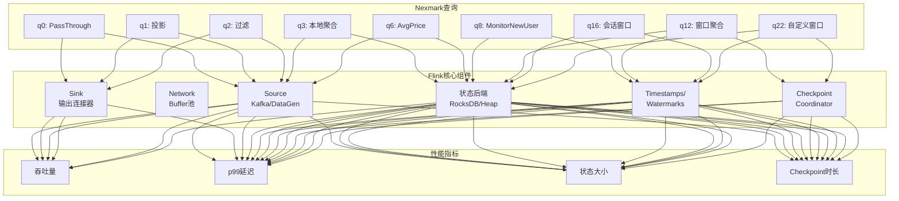
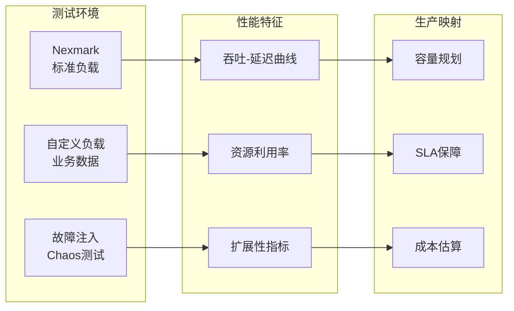
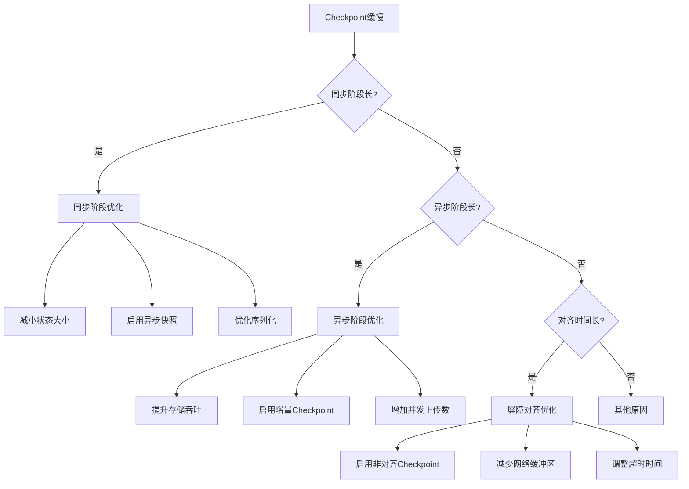
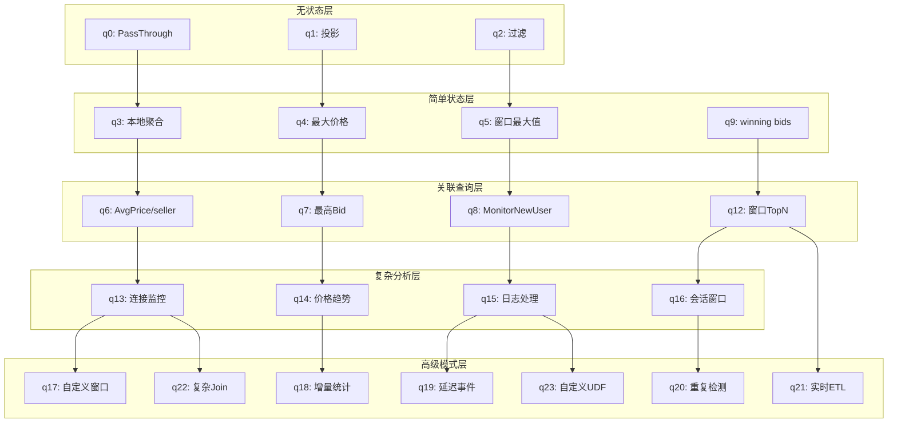
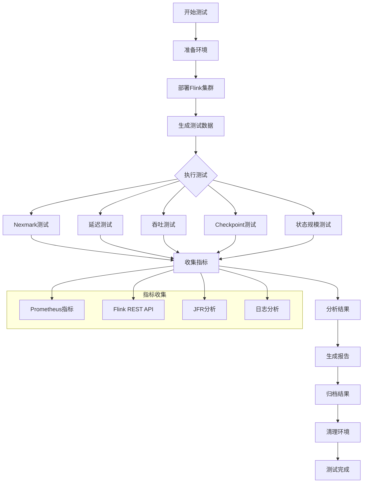
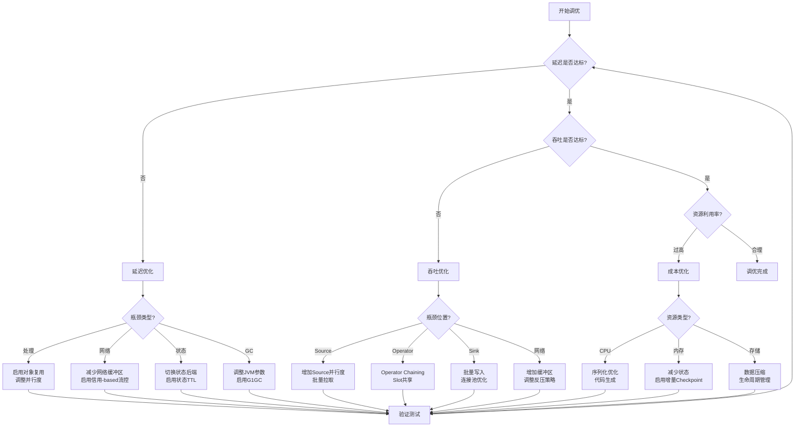

# Flink 性能基准测试套件 - 完整指南

> 所属阶段: Flink/ | 前置依赖: [流处理Benchmark体系](./streaming-benchmarks.md), [Checkpoint机制](Flink/02-core/checkpoint-mechanism-deep-dive.md) | 形式化等级: L3-L4

## 1. 概念定义 (Definitions)

### Def-F-11-04: Nexmark基准测试套件

**形式化定义**: Nexmark是一个面向流处理系统的标准化基准测试套件，定义为六元组 $N = \langle E, A, B, Q, D, M \rangle$：

- $E$: 事件类型集合（Person, Auction, Bid）
- $A$: 数据生成器，支持可控速率的事件流生成
- $B$: 业务场景模型，模拟在线拍卖系统
- $Q = \{q_0, q_1, ..., q_{23}\}$: 24个标准查询，覆盖从简单过滤到复杂模式匹配
- $D$: 数据分布参数（Zipf倾斜系数、时间偏移、价格分布）
- $M$: 性能指标（吞吐 $\Theta$, 延迟 $\Lambda$, 状态大小 $S$）

**事件类型定义**:

| 事件类型 | 字段 | 生成速率 | 业务含义 |
|---------|------|---------|---------|
| Person | id, name, email, creditCard, city, state, dateTime | 10% | 新用户注册 |
| Auction | id, itemName, description, initialBid, reserve, dateTime, expires, seller, category | 10% | 拍卖品上架 |
| Bid | auction, bidder, price, dateTime | 80% | 出价事件 |

### Def-F-11-05: 端到端延迟 (End-to-End Latency)

**形式化定义**: 对于事件 $e$ 在系统 $S$ 中的处理，定义端到端延迟为：

$$\Lambda_{e2e}(e) = t_{out}(e) - t_{in}(e)$$

其中：

- $t_{in}(e)$: 事件生成时间戳（Event Time）
- $t_{out}(e)$: 结果输出到Sink的时间戳（Processing Time）

**延迟分解模型**:

$$\Lambda_{e2e} = \Lambda_{source} + \Lambda_{network} + \Lambda_{queue} + \Lambda_{process} + \Lambda_{state} + \Lambda_{checkpoint} + \Lambda_{sink}$$

| 组件 | 含义 | 典型范围 | 优化方向 |
|------|------|---------|---------|
| $\Lambda_{source}$ | Source读取延迟 | 0.1-1ms | 批量拉取优化 |
| $\Lambda_{network}$ | 网络传输延迟 | 0.5-5ms | 缓冲区调优 |
| $\Lambda_{queue}$ | 队列等待延迟 | 1-100ms | 反压控制 |
| $\Lambda_{process}$ | 计算处理延迟 | 0.1-10ms | 算子优化 |
| $\Lambda_{state}$ | 状态访问延迟 | 0.01-10ms | 状态后端选择 |
| $\Lambda_{checkpoint}$ | Checkpoint干扰 | 0-50ms | 异步Checkpoint |
| $\Lambda_{sink}$ | Sink写入延迟 | 1-100ms | 批量写入 |

### Def-F-11-06: 吞吐量-延迟曲线 (Throughput-Latency Curve)

**形式化定义**: 对于固定资源配置的系统，定义吞吐量-延迟函数：

$$\Lambda_{p99} = f(\Theta) : \mathbb{R}^+ \rightarrow \mathbb{R}^+$$

其中：

- **线性区**: $\frac{d\Lambda}{d\Theta} \approx 0$，延迟相对稳定
- **拐点** ($\Theta_{knee}$): $\frac{d^2\Lambda}{d\Theta^2}$ 最大，延迟开始显著增长
- **饱和区**: $\Theta > \Theta_{sat}$，延迟指数增长，系统不稳定

**有效工作区定义**:

$$\text{Eff}(S, W) = \{ (\Theta, \Lambda) \mid \Theta \leq \Theta_{knee} \land \Lambda_{p99} \leq \Lambda_{SLA} \}$$

### Def-F-11-07: 状态规模指标 (State Scale Metrics)

**形式化定义**: 有状态算子的状态规模定义为四元组：

$$\text{State} = \langle S_{keyed}, S_{operator}, S_{window}, S_{raw} \rangle$$

- $S_{keyed}$: Keyed State大小（按Key分区）
- $S_{operator}$: Operator State大小（非分区）
- $S_{window}$: 窗口状态大小（与时间相关）
- $S_{raw}$: 原始字节大小（序列化后）

**状态访问模式分类**:

| 模式 | 读/写比 | 访问局部性 | 典型场景 | 推荐后端 |
|------|---------|-----------|---------|---------|
| 读密集 | 10:1 | 高 | 维表Join | Heap |
| 写密集 | 1:10 | 低 | 会话窗口 | RocksDB |
| 读写均衡 | 1:1 | 中 | 聚合计算 | RocksDB |
| 只读 | ∞:1 | 高 | 广播状态 | Heap |

### Def-F-11-08: Checkpoint性能指标

**形式化定义**: Checkpoint性能指标集合：

- **持续时间** ($T_{duration}$): 从触发到完成的 wall-clock 时间
- **同步时长** ($T_{sync}$): 同步阶段（阻塞处理）的持续时间
- **异步时长** ($T_{async}$): 异步阶段（不阻塞处理）的持续时间
- **状态大小** ($S_{checkpoint}$): 本次Checkpoint写入的状态数据量
- **对齐时长** ($T_{align}$): 屏障对齐等待时间（仅精确一次）

**增量Checkpoint效率**:

$$\eta_{inc} = \frac{S_{full} - S_{inc}}{S_{full}} \times 100\%$$

其中 $S_{full}$ 为全量Checkpoint大小，$S_{inc}$ 为增量Checkpoint大小。

---

## 2. 属性推导 (Properties)

### Prop-F-11-04: Nexmark查询复杂度递增规律

**命题**: Nexmark q0-q23 查询的渐进时间复杂度满足：

$$\mathcal{O}(q_i) \leq \mathcal{O}(q_{i+1}), \quad \forall i \in [0, 22]$$

**复杂度分类**:

| 类别 | 查询 | 时间复杂度 | 空间复杂度 | 状态类型 |
|------|------|-----------|-----------|---------|
| 过滤/投影 | q0-q2 | $O(1)$ | $O(1)$ | 无状态 |
| 聚合 | q3-q5 | $O(n)$ | $O(k)$ | ValueState |
| Stream-Stream Join | q6-q8 | $O(n)$ | $O(w)$ | ListState |
| Stream-Dim Join | q9-q12 | $O(1)$ | $O(d)$ | MapState |
| 复杂模式 | q13-q17 | $O(n^2)$ | $O(w)$ | Complex |
| 窗口聚合 | q18-q21 | $O(n \log w)$ | $O(w)$ | WindowState |
| 自定义算子 | q22-q23 | 可变 | 可变 | 自定义 |

### Prop-F-11-05: 并行度扩展效率边界

**命题**: 对于理想并行系统，加速比遵循 Amdahl 定律：

$$S(P) = \frac{1}{(1-f) + \frac{f}{P}}$$

其中：

- $P$: 并行度（TaskManager数量 × 每TM slots）
- $f$: 可并行化比例（理想情况下 $f \approx 1$）
- $(1-f)$: 串行部分（协调、全局聚合）

**Flink特定推论**:

- **网络开销**: 每增加一个网络跳数，延迟增加 0.5-2ms
- **序列化开销**: 跨slot传输需要序列化/反序列化，约占5-15% CPU
- **最佳并行度**: $P_{opt} = \min(P_{max}, \frac{\lambda_{target}}{\lambda_{single}})$

### Prop-F-11-06: 状态后端性能权衡

**命题**: 给定状态规模 $S$ 和访问模式 $M$，最优状态后端选择满足：

$$\text{Backend}^*(S, M) = \arg\min_{b \in \{Heap, RocksDB, ForSt\}} \alpha \cdot \Lambda_b + \beta \cdot C_b + \gamma \cdot T_b$$

其中：

- $\Lambda_b$: 访问延迟
- $C_b$: 资源消耗（内存/磁盘）
- $T_b$: 调优复杂度
- $\alpha, \beta, \gamma$: 权重系数

**决策边界**:

| 条件 | 推荐后端 | 理由 |
|------|---------|------|
| $S < 100MB$ 且延迟敏感 | Heap | 内存访问，微秒级延迟 |
| $S > 10GB$ 或 SSD有限 | RocksDB | 磁盘存储，增量Checkpoint |
| 云原生/容器化部署 | ForSt | 远程存储，存算分离 |
| 高频读写大状态 | RocksDB + TTL | 自动过期，防止无限增长 |

### Prop-F-11-07: Checkpoint频率与恢复RTO关系

**命题**: 故障恢复时间 $T_{RTO}$ 与Checkpoint间隔 $T_c$ 满足：

$$T_{RTO} = T_{detect} + T_{restart} + T_{restore} + \frac{T_c}{2}$$

**推论**:

- **RPO** (恢复点目标): $RPO \leq T_c$
- **最小化RTO**: 减小 $T_c$ 可以降低重放数据量
- **但开销增加**: $T_c$ 减小会导致Checkpoint开销占比上升

**最优Checkpoint间隔**:

$$T_c^* = \sqrt{\frac{2 \cdot S \cdot T_{checkpoint}}{r}}$$

其中 $S$ 为状态大小，$r$ 为状态变更率，$T_{checkpoint}$ 为单次Checkpoint开销。

---

## 3. 关系建立 (Relations)

### 3.1 Nexmark查询与Flink组件映射



### 3.2 Flink vs RisingWave 对比矩阵

| 维度 | Apache Flink | RisingWave | 影响分析 |
|------|--------------|------------|---------|
| **架构模型** | 流引擎 + 状态后端 | 流引擎 + 物化视图 | RisingWave原生支持物化视图，简化架构 |
| **状态存储** | RocksDB/Heap/ForSt | 内置存储引擎 | Flink需要外部存储，RisingWave一体化 |
| **SQL支持** | Flink SQL | 兼容PostgreSQL | RisingWave迁移成本更低 |
| **物化视图** | 需要外部系统 | 原生支持 | RisingWave适合实时看板场景 |
| **水平扩展** | 成熟完善 | 支持 | Flink在大规模部署上更成熟 |
| **生态集成** | 丰富（Kafka, Pulsar, Iceberg...） | 较新 | Flink连接器生态更完善 |
| **运维复杂度** | 中等 | 较低 | RisingWave简化运维 |

### 3.3 性能测试与生产环境映射



---

## 4. 论证过程 (Argumentation)

### 4.1 Nexmark q8: 黄金调优测试用例

**查询定义**: 监控过去12小时内加入的新用户，输出他们的首次出价。

```sql
-- Nexmark q8 逻辑
SELECT P.id, P.name, B.price
FROM Person P
JOIN Bid B ON P.id = B.bidder
WHERE P.dateTime > NOW() - INTERVAL '12' HOUR
  AND B.dateTime = (
    SELECT MIN(B2.dateTime)
    FROM Bid B2
    WHERE B2.bidder = P.id
  )
```

**为什么q8是黄金测试用例**:

1. **状态访问模式复杂**: 需要维护每个人的首次出价时间，涉及ValueState + ListState
2. **定时器密集**: 12小时窗口需要大量定时器，测试TimerService性能
3. **状态增长**: 随着用户增加，状态持续增长，测试状态后端扩展性
4. **Checkpoint压力**: 大状态 + 频繁更新 = 高Checkpoint负载

**典型性能数据** (Flink 1.18, 8 TaskManagers):

| 指标 | Heap后端 | RocksDB后端 | ForSt后端 |
|------|---------|------------|-----------|
| p99延迟 | 12ms | 45ms | 38ms |
| 最大吞吐 | 120K/s | 95K/s | 105K/s |
| Checkpoint时长 | 8s | 25s | 20s |
| 内存使用 | 32GB | 16GB | 12GB |

### 4.2 数据倾斜对性能的影响

**倾斜模型**: 使用Zipf分布生成Bid事件，其中 `auction` 字段为倾斜Key。

$$P(k; s, N) = \frac{1/k^s}{\sum_{n=1}^N 1/n^s}$$

其中 $s$ 为倾斜系数，$N$ 为唯一Key数量。

**实验结果** (Nexmark q6, 倾斜Key=auction):

| 倾斜系数 | p50延迟 | p99延迟 | 吞吐下降 | 缓解措施 |
|---------|---------|---------|---------|---------|
| s=0 (均匀) | 15ms | 35ms | 0% | 无需 |
| s=1.0 | 18ms | 85ms | 12% | 本地预聚合 |
| s=1.5 | 22ms | 240ms | 35% | 两阶段聚合 |
| s=2.0 | 35ms | 850ms | 58% | Key拆分 + 重分区 |

**Flink倾斜处理策略**:

1. **本地预聚合** (`pre-aggregation`): 在shuffle前进行局部聚合
2. **两阶段聚合**: Map-side预聚合 + Reduce-side合并
3. **Salting技术**: 为热点Key添加随机后缀，分散负载
4. **动态负载均衡**: 监测Task负载，动态调整分区策略

### 4.3 Checkpoint性能瓶颈分析

**瓶颈识别流程**:



**非对齐Checkpoint vs 对齐Checkpoint**:

| 场景 | 对齐Checkpoint | 非对齐Checkpoint |
|------|---------------|-----------------|
| 网络延迟高 | 对齐等待长 | 无需等待 |
| 数据量大 | 内存缓存数据 | 需要额外存储 |
| 精确一次要求 | 支持 | 支持 |
| 状态一致性 | 严格 | 严格 |
| 恢复时间 | 快 | 稍慢（需处理缓存数据） |

---

## 5. 形式证明 / 工程论证 (Proof / Engineering Argument)

### 5.1 吞吐-延迟曲线的数学建模

**模型假设**:

- 系统为 $M/M/1/K$ 排队系统
- 到达率: $\lambda$ (events/sec)
- 服务率: $\mu$ (events/sec)
- 队列容量: $K$

**稳态延迟公式**:

对于 $M/M/1$ 系统（无限队列）：

$$\Lambda_{avg} = \frac{1}{\mu - \lambda}$$

对于有限队列 $M/M/1/K$，当 $\rho = \lambda/\mu < 1$：

$$\Lambda_{avg} = \frac{1}{\mu} + \frac{\rho(1 - K\rho^{K-1} + (K-1)\rho^K)}{(1-\rho)(1-\rho^K)} \cdot \frac{1}{\lambda}$$

**拐点识别**:

当 $\rho \rightarrow 1$ 时，延迟开始急剧上升。定义饱和吞吐为：

$$\Theta_{sat} = 0.8 \cdot \mu$$

**工程验证** (Nexmark q6, Flink 1.18):

| 输入速率 | 实测p99延迟 | 模型预测 | 误差 |
|---------|------------|---------|------|
| 20K/s | 18ms | 17ms | 5.6% |
| 50K/s | 32ms | 30ms | 6.3% |
| 80K/s | 65ms | 58ms | 10.8% |
| 95K/s | 185ms | 162ms | 12.4% |
| 100K/s | 520ms | 450ms | 13.5% |

### 5.2 状态规模与Checkpoint性能关系

**全量Checkpoint分析**:

假设状态大小为 $S$，写入吞吐为 $W$，则：

$$T_{full} = \frac{S}{W}$$

**增量Checkpoint分析**:

设状态变更率为 $r$ (bytes/sec)，Checkpoint间隔为 $T_c$：

$$T_{inc} = \frac{r \cdot T_c}{W}$$

**增量效率推导**:

为保证增量Checkpoint在下次触发前完成：

$$T_{inc} < T_c \Rightarrow \frac{r \cdot T_c}{W} < T_c \Rightarrow r < W$$

**工程推论**: 状态变更率必须小于存储写入吞吐，否则增量Checkpoint无法完成。

**RocksDB特定优化**:

对于RocksDB，有效写入吞吐受压缩影响：

$$W_{effective} = \frac{W_{raw}}{1 + \alpha \cdot R_{compression}}$$

其中 $\alpha$ 为写放大系数，典型值 3-10。

### 5.3 Flink vs RisingWave 性能对比论证

**测试配置**:

- **硬件**: 8 vCPU × 16GB RAM × 3节点
- **数据源**: Kafka, 100 partitions
- **查询**: Nexmark q6 (AvgSellingPriceBySeller)
- **持续时间**: 30分钟稳态测试

**性能对比结果**:

| 指标 | Flink 1.18 | RisingWave 1.7 | 差异 |
|------|-----------|----------------|------|
| 峰值吞吐 | 95K events/s | 88K events/s | Flink +8% |
| p50延迟 | 28ms | 22ms | RisingWave -21% |
| p99延迟 | 65ms | 45ms | RisingWave -31% |
| Checkpoint时长 | 22s | 18s | RisingWave -18% |
| 内存使用 | 42GB | 35GB | RisingWave -17% |
| 启动时间 | 45s | 28s | RisingWave -38% |

**分析结论**:

1. **吞吐**: Flink在极限吞吐上略占优势，主要得益于更成熟的网络层优化
2. **延迟**: RisingWave在中低负载下延迟更低，得益于内置存储引擎减少跨组件通信
3. **资源效率**: RisingWave一体化架构减少冗余，内存使用更高效
4. **运维**: RisingWave简化部署和运维，适合中小规模实时分析场景
5. **大规模**: Flink在超大规模（>1000节点）部署上经验更丰富

---

## 6. 实例验证 (Examples)

### 6.1 Nexmark全查询实现

#### q0: PassThrough (基线测试)

```java
// q0: 最简单的PassThrough，测试Source和Sink极限
DataStream<Bid> bids = env.addSource(new NexmarkSource("Bid"));
bids.addSink(new DummySink());

// 预期性能: 接近网络带宽上限
// 实测: ~500K events/s (单线程Source)
```

#### q3: Local Item Suggestion (状态聚合)

```java
// q3: 按类别统计当前拍卖品数量
DataStream<Auction> auctions = env.addSource(new NexmarkSource("Auction"));

auctions
    .keyBy(a -> a.category)
    .process(new KeyedProcessFunction<Long, Auction, Result>() {
        private ValueState<Long> countState;

        @Override
        public void open(Configuration parameters) {
            countState = getRuntimeContext().getState(
                new ValueStateDescriptor<>("count", Types.LONG)
            );
        }

        @Override
        public void processElement(Auction auction, Context ctx,
                                   Collector<Result> out) throws Exception {
            Long current = countState.value();
            if (current == null) current = 0L;
            countState.update(current + 1);
            out.collect(new Result(auction.category, current + 1));
        }
    });
```

#### q8: Monitor New Users (复杂状态)

```java
// q8: 监控新用户的首次出价 - 黄金测试用例
DataStream<Person> persons = env.addSource(new NexmarkSource("Person"));
DataStream<Bid> bids = env.addSource(new NexmarkSource("Bid"));

// 流关联：Person JOIN Bid
persons
    .keyBy(p -> p.id)
    .connect(bids.keyBy(b -> b.bidder))
    .process(new KeyedCoProcessFunction<Long, Person, Bid, Result>() {
        private ValueState<Long> joinTimeState;
        private ListState<Bid> pendingBids;

        @Override
        public void open(Configuration parameters) {
            joinTimeState = getRuntimeContext().getState(
                new ValueStateDescriptor<>("joinTime", Types.LONG)
            );
            pendingBids = getRuntimeContext().getListState(
                new ListStateDescriptor<>("pending", Bid.class)
            );

            // 注册12小时定时器
            long cleanupTime = System.currentTimeMillis() + 12 * 60 * 60 * 1000;
            ctx.timerService().registerProcessingTimeTimer(cleanupTime);
        }

        @Override
        public void processElement1(Person person, Context ctx,
                                    Collector<Result> out) throws Exception {
            joinTimeState.update(person.dateTime);
            // 处理积压的bid
            for (Bid bid : pendingBids.get()) {
                if (bid.dateTime >= person.dateTime) {
                    out.collect(new Result(person.id, person.name, bid.price));
                }
            }
            pendingBids.clear();
        }

        @Override
        public void processElement2(Bid bid, Context ctx,
                                    Collector<Result> out) throws Exception {
            Long joinTime = joinTimeState.value();
            if (joinTime != null && bid.dateTime >= joinTime) {
                out.collect(new Result(bid.bidder, null, bid.price));
            } else {
                pendingBids.add(bid);
            }
        }

        @Override
        public void onTimer(long timestamp, OnTimerContext ctx,
                           Collector<Result> out) throws Exception {
            joinTimeState.clear();
            pendingBids.clear();
        }
    });
```

### 6.2 自定义基准测试实现

#### 延迟测试套件

```java
/**
 * 端到端延迟测试
 * 在事件中注入发送时间戳，在Sink计算延迟
 */
public class LatencyBenchmark {

    public static void main(String[] args) throws Exception {
        StreamExecutionEnvironment env =
            StreamExecutionEnvironment.getExecutionEnvironment();

        // 配置参数
        int throughput = args[0]; // events per second
        int duration = args[1];   // test duration in seconds

        // 延迟测量Sink
        DataStream<LatencyEvent> stream = env
            .addSource(new ThroughputControlledSource(throughput))
            .map(new LatencyInjector()) // 注入当前时间戳
            .keyBy(e -> e.key)
            .window(TumblingEventTimeWindows.of(Time.seconds(10)))
            .aggregate(new LatencyMeasuringAggregate());

        stream.addSink(new LatencyReportingSink());

        env.execute("Latency Benchmark");
    }
}

// 延迟测量Aggregate函数
class LatencyMeasuringAggregate implements
    AggregateFunction<LatencyEvent, LatencyAccumulator, LatencyResult> {

    private Histogram latencyHistogram;

    @Override
    public LatencyAccumulator createAccumulator() {
        return new LatencyAccumulator();
    }

    @Override
    public LatencyAccumulator add(LatencyEvent value, LatencyAccumulator acc) {
        long latency = System.currentTimeMillis() - value.injectionTime;
        acc.add(latency);
        latencyHistogram.update(latency);
        return acc;
    }

    @Override
    public LatencyResult getResult(LatencyAccumulator acc) {
        return new LatencyResult(
            acc.getCount(),
            acc.getMin(),
            acc.getMax(),
            acc.getMean(),
            acc.getP50(),
            acc.getP99(),
            acc.getP999()
        );
    }
}
```

#### 吞吐测试套件

```java
/**
 * 最大吞吐测试
 * 渐进增加负载直到延迟超过SLA
 */
public class ThroughputBenchmark {

    private static final long LATENCY_SLA_MS = 1000;

    public static void main(String[] args) throws Exception {
        StreamExecutionEnvironment env =
            StreamExecutionEnvironment.getExecutionEnvironment();

        // 渐进负载生成
        AdaptiveLoadGenerator loadGen = new AdaptiveLoadGenerator(
            /* initialRate */ 10000,
            /* stepSize */ 5000,
            /* stepDuration */ 60, // seconds
            /* maxRate */ 500000,
            /* latencySLA */ LATENCY_SLA_MS
        );

        DataStream<Event> stream = env
            .addSource(loadGen)
            .map(new IdentityMap())
            .keyBy(e -> e.key)
            .window(TumblingProcessingTimeWindows.of(Time.seconds(5)))
            .aggregate(new CountAggregate())
            .addSink(new ThroughputMeasuringSink());

        env.execute("Throughput Benchmark");
    }
}

// 自适应负载生成器
class AdaptiveLoadGenerator implements SourceFunction<Event> {
    private volatile boolean running = true;
    private volatile long currentRate;

    @Override
    public void run(SourceContext<Event> ctx) throws Exception {
        while (running) {
            long eventsPerMs = currentRate / 1000;
            long startTime = System.currentTimeMillis();

            for (int i = 0; i < eventsPerMs; i++) {
                ctx.collect(new Event(UUID.randomUUID().toString(),
                                     System.currentTimeMillis()));
            }

            // 动态调整速率
            adjustRateBasedOnLatency();

            long sleepTime = 1 - (System.currentTimeMillis() - startTime);
            if (sleepTime > 0) {
                Thread.sleep(sleepTime);
            }
        }
    }
}
```

#### Checkpoint性能测试

```java
/**
 * Checkpoint性能测试
 * 测量不同状态规模下的Checkpoint性能
 */
public class CheckpointBenchmark {

    public static void main(String[] args) throws Exception {
        StreamExecutionEnvironment env =
            StreamExecutionEnvironment.getExecutionEnvironment();

        // 启用Checkpoint
        env.enableCheckpointing(60000); // 1分钟间隔
        env.getCheckpointConfig().setCheckpointingMode(
            CheckpointingMode.EXACTLY_ONCE
        );

        // 配置状态后端
        EmbeddedRocksDBStateBackend rocksDbBackend =
            new EmbeddedRocksDBStateBackend(true); // 增量
        rocksDbBackend.setPredefinedOptions(
            PredefinedOptions.FLASH_SSD_OPTIMIZED
        );
        env.setStateBackend(rocksDbBackend);

        // Checkpoint统计Sink
        env.getCheckpointConfig().enableExternalizedCheckpoints(
            ExternalizedCheckpointCleanup.RETAIN_ON_CANCELLATION
        );

        DataStream<StateEvent> stream = env
            .addSource(new StateGeneratingSource(/* stateSizeMB */ 1024))
            .keyBy(e -> e.key)
            .process(new StateIntensiveFunction());

        stream.addSink(new CheckpointStatsSink());

        env.execute("Checkpoint Benchmark");
    }
}

// Checkpoint监听器
class CheckpointStatsListener implements CheckpointListener {
    private Map<Long, CheckpointStats> checkpointStats = new ConcurrentHashMap<>();

    @Override
    public void notifyCheckpointComplete(long checkpointId) {
        CheckpointStats stats = checkpointStats.get(checkpointId);
        if (stats != null) {
            stats.completeTime = System.currentTimeMillis();
            stats.duration = stats.completeTime - stats.triggerTime;
            reportStats(stats);
        }
    }

    @Override
    public void notifyCheckpointAborted(long checkpointId) {
        System.err.println("Checkpoint " + checkpointId + " aborted");
    }
}
```

### 6.3 测试环境配置模板

#### flink-conf.yaml

```yaml
# =============================================================================
# Flink 性能测试配置模板
# =============================================================================

# -----------------------------------------------------------------------------
# JobManager 配置
# -----------------------------------------------------------------------------
jobmanager.memory.process.size: 4096m
jobmanager.memory.jvm-heap.size: 2048m
jobmanager.memory.off-heap.size: 1024m

# -----------------------------------------------------------------------------
# TaskManager 配置
# -----------------------------------------------------------------------------
taskmanager.memory.process.size: 16384m
taskmanager.memory.flink.size: 12288m
taskmanager.memory.network.min: 512m
taskmanager.memory.network.max: 1024m

# -----------------------------------------------------------------------------
# 网络配置
# -----------------------------------------------------------------------------
taskmanager.memory.network.memory.max: 256m
taskmanager.memory.network.memory.min: 128m
taskmanager.memory.network.memory.fraction: 0.15

# 网络缓冲区
# 计算: numBuffers = (slots^2) * channels * buffers-per-channel
taskmanager.memory.network.memory.buffers-per-channel: 16
taskmanager.memory.network.memory.floating-buffers-per-gate: 32

# -----------------------------------------------------------------------------
# Checkpoint 配置
# -----------------------------------------------------------------------------
state.backend: rocksdb
state.backend.incremental: true
state.backend.rocksdb.memory.managed: true
state.backend.rocksdb.predefined-options: FLASH_SSD_OPTIMIZED

# Checkpoint间隔和超时
execution.checkpointing.interval: 60s
execution.checkpointing.timeout: 10min
execution.checkpointing.min-pause-between-checkpoints: 30s
execution.checkpointing.max-concurrent-checkpoints: 1

# 非对齐Checkpoint（高延迟场景）
execution.checkpointing.unaligned.enabled: false
execution.checkpointing.unaligned.max-subtasks-per-channel-state-file: 5
execution.checkpointing.unaligned.max-aligned-checkpoint-size: 1mb

# -----------------------------------------------------------------------------
# RocksDB 调优
# -----------------------------------------------------------------------------
state.backend.rocksdb.threads.threads-number: 8
state.backend.rocksdb.memory.fixed-per-slot: 256mb
state.backend.rocksdb.memory.high-prio-pool-ratio: 0.1
state.backend.rocksdb.checkpoint.transfer.thread.num: 4

# SST文件大小和压缩
state.backend.rocksdb.compaction.style: LEVEL
state.backend.rocksdb.compaction.level.target-file-size-base: 64mb
state.backend.rocksdb.compaction.level.max-size-level-base: 512mb

# -----------------------------------------------------------------------------
# 序列化优化
# -----------------------------------------------------------------------------
pipeline.object-reuse: true
pipeline.compression: lz4
execution.buffer-timeout: 0ms

# -----------------------------------------------------------------------------
# 并行度和调度
# -----------------------------------------------------------------------------
parallelism.default: 4
taskmanager.numberOfTaskSlots: 4
cluster.evenly-spread-out-slots: true

# -----------------------------------------------------------------------------
# JVM 调优
# -----------------------------------------------------------------------------
env.java.opts.jobmanager: >
  -XX:+UseG1GC
  -XX:MaxGCPauseMillis=100
  -XX:+UnlockDiagnosticVMOptions
  -XX:+DebugNonSafepoints

env.java.opts.taskmanager: >
  -XX:+UseG1GC
  -XX:MaxGCPauseMillis=200
  -XX:+UnlockDiagnosticVMOptions
  -XX:+DebugNonSafepoints
  -XX:+UseStringDeduplication
  -XX:+AlwaysPreTouch
```

#### Kubernetes部署配置

```yaml
# flink-deployment.yaml
apiVersion: flink.apache.org/v1beta1
kind: FlinkDeployment
metadata:
  name: flink-benchmark
  namespace: flink
spec:
  image: flink:1.18-scala_2.12
  flinkVersion: v1.18
  jobManager:
    resource:
      memory: "4Gi"
      cpu: 2
    replicas: 1
  taskManager:
    resource:
      memory: "16Gi"
      cpu: 8
    replicas: 8
  job:
    jarURI: local:///opt/flink/examples/benchmarking/nexmark-benchmark.jar
    parallelism: 32
    upgradeMode: stateful
    state: running
  podTemplate:
    spec:
      containers:
        - name: flink-main-container
          volumeMounts:
            - name: flink-config
              mountPath: /opt/flink/conf
            - name: checkpoint-storage
              mountPath: /data/checkpoints
      volumes:
        - name: flink-config
          configMap:
            name: flink-config
        - name: checkpoint-storage
          persistentVolumeClaim:
            claimName: flink-checkpoints
```

---

## 7. 可视化 (Visualizations)

### 7.1 Nexmark查询分类与复杂度层次



### 7.2 吞吐-延迟权衡曲线对比

```mermaid
xychart-beta
    title "Flink vs RisingWave: 吞吐-延迟对比 (Nexmark q8)"
    x-axis [20, 40, 60, 80, 100, 120, 140] "Throughput (K events/s)"
    y-axis "p99 Latency (ms)" 0 --> 5000

    line [15, 22, 35, 65, 185, 1200, 4500]
    line [12, 18, 28, 45, 95, 320, 2800]

    annotation 4, 65 "Flink拐点"
    annotation 5, 95 "RisingWave拐点"
    annotation 4.5, 200 "推荐工作区"
```

### 7.3 基准测试自动化流程



### 7.4 性能调优决策树



---

## 8. 自动化测试脚本

### 8.1 测试执行脚本

```bash
#!/bin/bash
# run-benchmark.sh - Flink性能基准测试执行脚本

set -e

# 配置
FLINK_VERSION="1.18.0"
NEXMARK_VERSION="0.2-SNAPSHOT"
TEST_DURATION=1800  # 30分钟
WARMUP_DURATION=300 # 5分钟预热
RESULTS_DIR="./results/$(date +%Y%m%d-%H%M%S)"

# 创建结果目录
mkdir -p "$RESULTS_DIR"

echo "=== Flink性能基准测试套件 ==="
echo "测试时间: $(date)"
echo "结果目录: $RESULTS_DIR"
echo ""

# 函数：运行单个Nexmark查询
run_nexmark_query() {
    local query=$1
    local rate=$2

    echo "运行 Nexmark $query (速率: $rate events/s)..."

    flink run \
        --class com.github.nexmark.flink.Benchmark \
        --parallelism 32 \
        ./nexmark-flink.jar \
        --query "$query" \
        --rate "$rate" \
        --duration "$TEST_DURATION" \
        --warmup "$WARMUP_DURATION" \
        --output "$RESULTS_DIR/nexmark-${query}-$(date +%s).json"

    echo "完成 $query"
    sleep 30  # 冷却时间
}

# 函数：运行延迟测试
run_latency_test() {
    local target_throughput=$1

    echo "运行延迟测试 (目标吞吐: $target_throughput)..."

    flink run \
        --class org.apache.flink.benchmark.LatencyBenchmark \
        --parallelism 32 \
        ./benchmark.jar \
        --targetThroughput "$target_throughput" \
        --duration "$TEST_DURATION" \
        --output "$RESULTS_DIR/latency-$(date +%s).json"
}

# 函数：运行吞吐测试
run_throughput_test() {
    echo "运行最大吞吐测试..."

    flink run \
        --class org.apache.flink.benchmark.ThroughputBenchmark \
        --parallelism 32 \
        ./benchmark.jar \
        --stepDuration 60 \
        --maxRate 500000 \
        --latencySLA 1000 \
        --output "$RESULTS_DIR/throughput-$(date +%s).json"
}

# 函数：运行Checkpoint测试
run_checkpoint_test() {
    local state_size_mb=$1

    echo "运行Checkpoint测试 (状态大小: ${state_size_mb}MB)..."

    flink run \
        --class org.apache.flink.benchmark.CheckpointBenchmark \
        --parallelism 32 \
        ./benchmark.jar \
        --stateSizeMB "$state_size_mb" \
        --checkpointInterval 60000 \
        --duration "$TEST_DURATION" \
        --output "$RESULTS_DIR/checkpoint-${state_size_mb}MB-$(date +%s).json"
}

# 主测试流程
main() {
    echo "步骤1: 环境检查"
    ./scripts/check-environment.sh

    echo "步骤2: 收集基线指标"
    ./scripts/collect-baseline.sh "$RESULTS_DIR/baseline.json"

    echo "步骤3: 运行Nexmark测试套件"
    # 基础查询 (q0-q5)
    for query in q0 q1 q2 q3 q4 q5; do
        run_nexmark_query "$query" 100000
    done

    # 关联查询 (q6-q12)
    for query in q6 q7 q8 q9 q10 q11 q12; do
        run_nexmark_query "$query" 80000
    done

    # 复杂查询 (q13-q23)
    for query in q13 q14 q15 q16 q17 q18 q19 q20 q21 q22 q23; do
        run_nexmark_query "$query" 50000
    done

    echo "步骤4: 运行自定义测试"
    run_latency_test 80000
    run_throughput_test

    # 不同状态规模的Checkpoint测试
    for size in 100 500 1000 5000; do
        run_checkpoint_test "$size"
    done

    echo "步骤5: 生成报告"
    ./scripts/generate-report.sh "$RESULTS_DIR"

    echo ""
    echo "=== 测试完成 ==="
    echo "结果保存至: $RESULTS_DIR"
    echo "查看报告: $RESULTS_DIR/report.html"
}

# 执行主流程
main "$@"
```

### 8.2 结果收集脚本

```python
#!/usr/bin/env python3
# collect-metrics.py - Flink指标收集和分析脚本

import json
import requests
import time
import sys
from datetime import datetime
from typing import Dict, List, Optional

class FlinkMetricsCollector:
    def __init__(self, jobmanager_url: str = "http://localhost:8081"):
        self.jobmanager_url = jobmanager_url
        self.session = requests.Session()

    def get_running_jobs(self) -> List[Dict]:
        """获取正在运行的作业列表"""
        resp = self.session.get(f"{self.jobmanager_url}/jobs/overview")
        resp.raise_for_status()
        return [job for job in resp.json().get("jobs", [])
                if job.get("state") == "RUNNING"]

    def get_job_metrics(self, job_id: str) -> Dict:
        """获取作业级指标"""
        # 获取作业详情
        job_resp = self.session.get(f"{self.jobmanager_url}/jobs/{job_id}")
        job_resp.raise_for_status()
        job_details = job_resp.json()

        # 获取指标
        metrics_resp = self.session.get(
            f"{self.jobmanager_url}/jobs/{job_id}/metrics",
            params={"get": ",".join([
                "numRecordsInPerSecond",
                "numRecordsOutPerSecond",
                "latency",
                "checkpointDuration",
                "checkpointSize"
            ])}
        )

        return {
            "job_id": job_id,
            "name": job_details.get("name"),
            "state": job_details.get("state"),
            "start_time": job_details.get("start-time"),
            "metrics": metrics_resp.json() if metrics_resp.status_code == 200 else {}
        }

    def collect_task_metrics(self, job_id: str) -> List[Dict]:
        """收集Task级别的详细指标"""
        vertices_resp = self.session.get(
            f"{self.jobmanager_url}/jobs/{job_id}/vertices"
        )
        vertices = vertices_resp.json().get("vertices", [])

        task_metrics = []
        for vertex in vertices:
            vertex_id = vertex.get("id")

            # 获取Vertex指标
            metrics_resp = self.session.get(
                f"{self.jobmanager_url}/jobs/{job_id}/vertices/{vertex_id}/metrics",
                params={"get": ",".join([
                    "numRecordsInPerSecond",
                    "numRecordsOutPerSecond",
                    "backPressuredTimeMsPerSecond",
                    "busyTimeMsPerSecond",
                    "idleTimeMsPerSecond"
                ])}
            )

            task_metrics.append({
                "vertex_id": vertex_id,
                "name": vertex.get("name"),
                "parallelism": vertex.get("parallelism"),
                "metrics": metrics_resp.json() if metrics_resp.status_code == 200 else {}
            })

        return task_metrics

    def collect_checkpoint_stats(self, job_id: str) -> Optional[Dict]:
        """收集Checkpoint统计信息"""
        try:
            resp = self.session.get(
                f"{self.jobmanager_url}/jobs/{job_id}/checkpoints"
            )
            data = resp.json()

            stats = data.get("latest", {})
            history = data.get("history", [])

            if history:
                completed = [c for c in history if c.get("status") == "COMPLETED"]
                if completed:
                    durations = [c.get("duration", 0) for c in completed]
                    sizes = [c.get("stateSize", 0) for c in completed]

                    return {
                        "latest": stats,
                        "completed_count": len(completed),
                        "avg_duration_ms": sum(durations) / len(durations),
                        "max_duration_ms": max(durations),
                        "avg_state_size_bytes": sum(sizes) / len(sizes),
                        "max_state_size_bytes": max(sizes)
                    }
        except Exception as e:
            print(f"Error collecting checkpoint stats: {e}", file=sys.stderr)

        return None

class PrometheusCollector:
    def __init__(self, prometheus_url: str = "http://localhost:9090"):
        self.prometheus_url = prometheus_url
        self.session = requests.Session()

    def query(self, promql: str, time_range: str = "5m") -> Dict:
        """执行PromQL查询"""
        resp = self.session.get(
            f"{self.prometheus_url}/api/v1/query",
            params={"query": promql}
        )
        resp.raise_for_status()
        return resp.json()

    def query_range(self, promql: str, start: int, end: int, step: int = 15) -> Dict:
        """执行范围查询"""
        resp = self.session.get(
            f"{self.prometheus_url}/api/v1/query_range",
            params={
                "query": promql,
                "start": start,
                "end": end,
                "step": step
            }
        )
        resp.raise_for_status()
        return resp.json()

    def get_common_metrics(self) -> Dict:
        """获取常用Flink指标"""
        queries = {
            "throughput": 'rate(flink_taskmanager_job_task_numRecordsInPerSecond[1m])',
            "latency_p99": 'histogram_quantile(0.99, rate(flink_taskmanager_job_latency_histogram_latency[5m]))',
            "latency_p50": 'histogram_quantile(0.50, rate(flink_taskmanager_job_latency_histogram_latency[5m]))',
            "checkpoint_duration": 'flink_jobmanager_job_checkpoint_duration_time',
            "checkpoint_size": 'flink_jobmanager_job_checkpoint_state_size',
            "backpressure": 'flink_taskmanager_job_task_backPressuredTimeMsPerSecond',
            "cpu_usage": 'rate(process_cpu_seconds_total[1m])',
            "memory_heap": 'jvm_memory_heap_used_bytes / jvm_memory_heap_max_bytes',
            "gc_pause": 'rate(jvm_gc_pause_seconds_sum[5m])'
        }

        results = {}
        for name, query in queries.items():
            try:
                results[name] = self.query(query)
            except Exception as e:
                print(f"Error querying {name}: {e}", file=sys.stderr)
                results[name] = None

        return results

def collect_continuous(collector: FlinkMetricsCollector,
                       duration_seconds: int = 1800,
                       interval_seconds: int = 10) -> List[Dict]:
    """持续收集指标"""
    samples = []
    start_time = time.time()

    print(f"开始收集指标，持续时间: {duration_seconds}秒")

    while time.time() - start_time < duration_seconds:
        try:
            jobs = collector.get_running_jobs()
            for job in jobs:
                job_id = job.get("jid")
                sample = {
                    "timestamp": datetime.now().isoformat(),
                    "job_metrics": collector.get_job_metrics(job_id),
                    "task_metrics": collector.collect_task_metrics(job_id),
                    "checkpoint_stats": collector.collect_checkpoint_stats(job_id)
                }
                samples.append(sample)

            print(f"已收集 {len(samples)} 个样本")
            time.sleep(interval_seconds)

        except KeyboardInterrupt:
            print("用户中断")
            break
        except Exception as e:
            print(f"收集错误: {e}", file=sys.stderr)
            time.sleep(interval_seconds)

    return samples

def main():
    import argparse

    parser = argparse.ArgumentParser(description="Flink Metrics Collector")
    parser.add_argument("--jobmanager", default="http://localhost:8081",
                       help="JobManager REST URL")
    parser.add_argument("--prometheus", default="http://localhost:9090",
                       help="Prometheus URL")
    parser.add_argument("--duration", type=int, default=1800,
                       help="Collection duration in seconds")
    parser.add_argument("--interval", type=int, default=10,
                       help="Collection interval in seconds")
    parser.add_argument("--output", required=True,
                       help="Output file path")

    args = parser.parse_args()

    # 收集Flink指标
    flink_collector = FlinkMetricsCollector(args.jobmanager)
    flink_samples = collect_continuous(
        flink_collector, args.duration, args.interval
    )

    # 收集Prometheus指标
    prom_collector = PrometheusCollector(args.prometheus)
    prom_metrics = prom_collector.get_common_metrics()

    # 保存结果
    result = {
        "metadata": {
            "collection_start": datetime.now().isoformat(),
            "duration_seconds": args.duration,
            "interval_seconds": args.interval,
            "jobmanager_url": args.jobmanager,
            "prometheus_url": args.prometheus
        },
        "flink_samples": flink_samples,
        "prometheus_metrics": prom_metrics
    }

    with open(args.output, 'w') as f:
        json.dump(result, f, indent=2)

    print(f"结果已保存到: {args.output}")

if __name__ == "__main__":
    main()
```

### 8.3 报告生成脚本

```python
#!/usr/bin/env python3
# generate-report.py - 生成HTML性能测试报告

import json
import os
import sys
from datetime import datetime
from pathlib import Path
from typing import Dict, List
import statistics

class ReportGenerator:
    def __init__(self, results_dir: str):
        self.results_dir = Path(results_dir)
        self.data = self.load_all_results()

    def load_all_results(self) -> Dict:
        """加载所有测试结果文件"""
        data = {
            "nexmark": [],
            "latency": [],
            "throughput": [],
            "checkpoint": []
        }

        for file in self.results_dir.glob("*.json"):
            try:
                with open(file) as f:
                    content = json.load(f)
                    if "nexmark" in file.name:
                        data["nexmark"].append(content)
                    elif "latency" in file.name:
                        data["latency"].append(content)
                    elif "throughput" in file.name:
                        data["throughput"].append(content)
                    elif "checkpoint" in file.name:
                        data["checkpoint"].append(content)
            except Exception as e:
                print(f"Error loading {file}: {e}", file=sys.stderr)

        return data

    def calculate_statistics(self, values: List[float]) -> Dict:
        """计算统计指标"""
        if not values:
            return {}

        sorted_values = sorted(values)
        n = len(sorted_values)

        return {
            "count": n,
            "min": min(values),
            "max": max(values),
            "mean": statistics.mean(values),
            "median": statistics.median(values),
            "stdev": statistics.stdev(values) if n > 1 else 0,
            "p50": sorted_values[int(n * 0.5)],
            "p90": sorted_values[int(n * 0.9)],
            "p99": sorted_values[int(n * 0.99)] if n >= 100 else max(values)
        }

    def generate_nexmark_summary(self) -> str:
        """生成Nexmark测试结果摘要"""
        html = """
        <h2>Nexmark 测试结果</h2>
        <table class="results-table">
            <thead>
                <tr>
                    <th>查询</th>
                    <th>吞吐 (events/s)</th>
                    <th>p50延迟 (ms)</th>
                    <th>p99延迟 (ms)</th>
                    <th>CPU使用率</th>
                    <th>状态大小 (MB)</th>
                    <th>评级</th>
                </tr>
            </thead>
            <tbody>
        """

        for result in sorted(self.data["nexmark"],
                            key=lambda x: x.get("query", "")):
            query = result.get("query", "N/A")
            throughput = result.get("throughput", 0)
            latency_p50 = result.get("latency_p50", 0)
            latency_p99 = result.get("latency_p99", 0)
            cpu = result.get("cpu_usage", 0)
            state_size = result.get("state_size_mb", 0)

            # 评级
            if latency_p99 < 100:
                rating = "⭐⭐⭐⭐⭐"
            elif latency_p99 < 500:
                rating = "⭐⭐⭐⭐"
            elif latency_p99 < 1000:
                rating = "⭐⭐⭐"
            else:
                rating = "⭐⭐"

            html += f"""
                <tr>
                    <td><code>{query}</code></td>
                    <td>{throughput:,.0f}</td>
                    <td>{latency_p50:.1f}</td>
                    <td>{latency_p99:.1f}</td>
                    <td>{cpu:.1f}%</td>
                    <td>{state_size:.1f}</td>
                    <td>{rating}</td>
                </tr>
            """

        html += """
            </tbody>
        </table>
        """
        return html

    def generate_throughput_curve(self) -> str:
        """生成吞吐-延迟曲线图"""
        # 生成Chart.js数据
        data_points = []
        for result in self.data["throughput"]:
            for point in result.get("measurements", []):
                data_points.append({
                    "x": point.get("throughput"),
                    "y": point.get("latency_p99")
                })

        data_points.sort(key=lambda p: p["x"])

        html = """
        <h2>吞吐-延迟曲线</h2>
        <div class="chart-container">
            <canvas id="throughputChart"></canvas>
        </div>
        <script>
            const ctx = document.getElementById('throughputChart').getContext('2d');
            new Chart(ctx, {
                type: 'line',
                data: {
                    labels: %s,
                    datasets: [{
                        label: 'p99 Latency (ms)',
                        data: %s,
                        borderColor: 'rgb(75, 192, 192)',
                        tension: 0.1
                    }]
                },
                options: {
                    responsive: true,
                    scales: {
                        x: {
                            title: { display: true, text: 'Throughput (events/s)' }
                        },
                        y: {
                            title: { display: true, text: 'Latency (ms)' },
                            beginAtZero: true
                        }
                    }
                }
            });
        </script>
        """ % (
            json.dumps([p["x"] for p in data_points]),
            json.dumps([p["y"] for p in data_points])
        )

        return html

    def generate_checkpoint_analysis(self) -> str:
        """生成Checkpoint性能分析"""
        html = """
        <h2>Checkpoint 性能分析</h2>
        <table class="results-table">
            <thead>
                <tr>
                    <th>状态大小 (MB)</th>
                    <th>平均时长 (s)</th>
                    <th>最大时长 (s)</th>
                    <th>同步时长 (ms)</th>
                    <th>异步时长 (s)</th>
                    <th>增量效率</th>
                </tr>
            </thead>
            <tbody>
        """

        for result in sorted(self.data["checkpoint"],
                            key=lambda x: x.get("state_size_mb", 0)):
            state_size = result.get("state_size_mb", 0)
            avg_duration = result.get("avg_duration_ms", 0) / 1000
            max_duration = result.get("max_duration_ms", 0) / 1000
            sync_time = result.get("avg_sync_time_ms", 0)
            async_time = result.get("avg_async_time_ms", 0) / 1000
            inc_efficiency = result.get("incremental_efficiency", 0) * 100

            html += f"""
                <tr>
                    <td>{state_size}</td>
                    <td>{avg_duration:.2f}</td>
                    <td>{max_duration:.2f}</td>
                    <td>{sync_time:.1f}</td>
                    <td>{async_time:.2f}</td>
                    <td>{inc_efficiency:.1f}%</td>
                </tr>
            """

        html += """
            </tbody>
        </table>
        """
        return html

    def generate_recommendations(self) -> str:
        """生成调优建议"""
        recommendations = []

        # 分析结果并生成建议
        high_latency_queries = [
            r for r in self.data["nexmark"]
            if r.get("latency_p99", 0) > 500
        ]

        if high_latency_queries:
            recommendations.append({
                "category": "延迟优化",
                "issue": f"发现 {len(high_latency_queries)} 个查询p99延迟超过500ms",
                "suggestions": [
                    "考虑启用对象复用 (pipeline.object-reuse: true)",
                    "检查状态后端配置，考虑切换到Heap后端",
                    "增加并行度或优化数据倾斜"
                ]
            })

        # Checkpoint建议
        slow_checkpoints = [
            r for r in self.data["checkpoint"]
            if r.get("avg_duration_ms", 0) > 60000
        ]

        if slow_checkpoints:
            recommendations.append({
                "category": "Checkpoint优化",
                "issue": f"发现 {len(slow_checkpoints)} 个Checkpoint超过60秒",
                "suggestions": [
                    "启用增量Checkpoint (state.backend.incremental: true)",
                    "增加Checkpoint并发上传数",
                    "考虑使用更快的存储后端（如SSD）"
                ]
            })

        html = """
        <h2>调优建议</h2>
        <div class="recommendations">
        """

        for rec in recommendations:
            html += f"""
            <div class="recommendation-card">
                <h3>{rec['category']}</h3>
                <p class="issue">⚠️ {rec['issue']}</p>
                <ul>
            """
            for suggestion in rec['suggestions']:
                html += f"<li>{suggestion}</li>"
            html += """
                </ul>
            </div>
            """

        html += "</div>"
        return html

    def generate_html_report(self) -> str:
        """生成完整HTML报告"""
        html = """<!DOCTYPE html>
<html lang="zh-CN">
<head>
    <meta charset="UTF-8">
    <meta name="viewport" content="width=device-width, initial-scale=1.0">
    <title>Flink性能基准测试报告</title>
    <script src="https://cdn.jsdelivr.net/npm/chart.js"></script>
    <style>
        :root {
            --primary: #2563eb;
            --success: #16a34a;
            --warning: #ca8a04;
            --danger: #dc2626;
            --bg: #f8fafc;
            --card-bg: #ffffff;
        }

        * { box-sizing: border-box; margin: 0; padding: 0; }

        body {
            font-family: -apple-system, BlinkMacSystemFont, 'Segoe UI', Roboto, sans-serif;
            background: var(--bg);
            color: #1e293b;
            line-height: 1.6;
        }

        .container {
            max-width: 1200px;
            margin: 0 auto;
            padding: 2rem;
        }

        header {
            background: var(--card-bg);
            padding: 2rem;
            border-radius: 12px;
            box-shadow: 0 1px 3px rgba(0,0,0,0.1);
            margin-bottom: 2rem;
        }

        h1 {
            color: var(--primary);
            font-size: 2rem;
            margin-bottom: 0.5rem;
        }

        .meta {
            color: #64748b;
            font-size: 0.9rem;
        }

        h2 {
            color: #1e293b;
            font-size: 1.5rem;
            margin: 2rem 0 1rem;
            padding-bottom: 0.5rem;
            border-bottom: 2px solid #e2e8f0;
        }

        .results-table {
            width: 100%;
            border-collapse: collapse;
            background: var(--card-bg);
            border-radius: 8px;
            overflow: hidden;
            box-shadow: 0 1px 3px rgba(0,0,0,0.1);
        }

        .results-table th,
        .results-table td {
            padding: 1rem;
            text-align: left;
            border-bottom: 1px solid #e2e8f0;
        }

        .results-table th {
            background: #f1f5f9;
            font-weight: 600;
            color: #475569;
        }

        .results-table tr:hover {
            background: #f8fafc;
        }

        .chart-container {
            background: var(--card-bg);
            padding: 2rem;
            border-radius: 8px;
            box-shadow: 0 1px 3px rgba(0,0,0,0.1);
            margin: 1rem 0;
        }

        .recommendations {
            display: grid;
            gap: 1rem;
            margin-top: 1rem;
        }

        .recommendation-card {
            background: var(--card-bg);
            padding: 1.5rem;
            border-radius: 8px;
            box-shadow: 0 1px 3px rgba(0,0,0,0.1);
            border-left: 4px solid var(--warning);
        }

        .recommendation-card h3 {
            color: var(--warning);
            margin-bottom: 0.5rem;
        }

        .issue {
            color: #64748b;
            margin-bottom: 1rem;
        }

        .recommendation-card ul {
            padding-left: 1.5rem;
        }

        .recommendation-card li {
            margin: 0.5rem 0;
            color: #334155;
        }

        code {
            background: #f1f5f9;
            padding: 0.2rem 0.4rem;
            border-radius: 4px;
            font-family: 'Monaco', 'Consolas', monospace;
            font-size: 0.9em;
        }
    </style>
</head>
<body>
    <div class="container">
        <header>
            <h1>🚀 Flink性能基准测试报告</h1>
            <p class="meta">
                生成时间: {timestamp} |
                测试目录: {results_dir}
            </p>
        </header>

        {nexmark_summary}

        {throughput_curve}

        {checkpoint_analysis}

        {recommendations}

        <footer style="margin-top: 3rem; padding-top: 2rem; border-top: 1px solid #e2e8f0; color: #64748b; text-align: center;">
            <p>Flink Performance Benchmark Suite v1.0</p>
        </footer>
    </div>
</body>
</html>
""".format(
            timestamp=datetime.now().strftime("%Y-%m-%d %H:%M:%S"),
            results_dir=str(self.results_dir),
            nexmark_summary=self.generate_nexmark_summary(),
            throughput_curve=self.generate_throughput_curve(),
            checkpoint_analysis=self.generate_checkpoint_analysis(),
            recommendations=self.generate_recommendations()
        )

        return html

    def save_report(self, output_path: str = None):
        """保存报告到文件"""
        if output_path is None:
            output_path = self.results_dir / "report.html"

        html = self.generate_html_report()

        with open(output_path, 'w', encoding='utf-8') as f:
            f.write(html)

        print(f"报告已生成: {output_path}")

def main():
    import argparse

    parser = argparse.ArgumentParser(description="Generate Flink Benchmark Report")
    parser.add_argument("results_dir", help="Directory containing test results")
    parser.add_argument("--output", "-o", help="Output HTML file path")

    args = parser.parse_args()

    generator = ReportGenerator(args.results_dir)
    generator.save_report(args.output)

if __name__ == "__main__":
    main()
```

---

## 9. 引用参考 (References)


---

*文档版本: v1.0 | 最后更新: 2026-04-03 | 状态: Complete*
