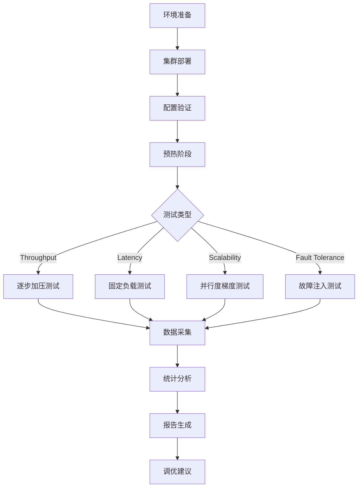
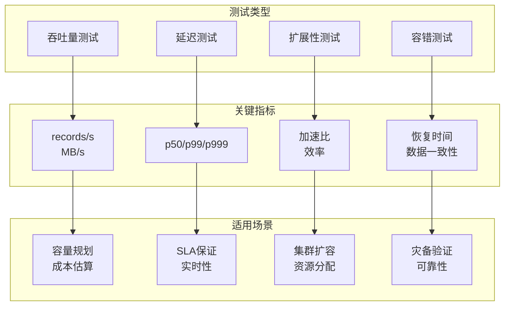
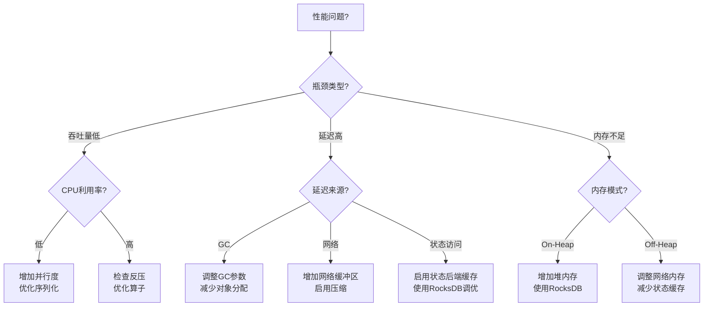

# Flink 性能基准测试完整指南

> 所属阶段: Flink/ | 前置依赖: [Flink 核心机制](../../02-core/checkpoint-mechanism-deep-dive.md) | 形式化等级: L3

---

## 1. 概念定义 (Definitions)

### Def-F-11-01: 基准测试 (Benchmarking)

**定义**: 基准测试是通过标准化的工作负载和测量方法，对系统性能进行**可重复**、**可比较**的量化评估过程。

$$B = \langle W, E, M, R \rangle$$

其中:

- $W$: 工作负载 (Workload) - 标准化的测试作业
- $E$: 执行环境 (Environment) - 硬件、软件、配置
- $M$: 度量指标 (Metrics) - 吞吐量、延迟、资源利用率
- $R$: 结果集 (Results) - 统计分析和可视化报告

### Def-F-11-02: 吞吐量 (Throughput)

**定义**: 单位时间内系统成功处理的数据量，通常以 **records/second** 或 **MB/second** 表示。

$$T = \frac{\sum_{i=1}^{n} |D_i|}{t_{end} - t_{start}}$$

### Def-F-11-03: 端到端延迟 (End-to-End Latency)

**定义**: 从事件生成时间到处理完成时间的最大时间跨度，包含:

- 队列等待延迟 (Queueing Delay)
- 处理延迟 (Processing Delay)
- 网络传输延迟 (Network Delay)

$$L_{e2e} = \max_{e \in E}(t_{out}(e) - t_{in}(e))$$

### Def-F-11-04: 百分位延迟 (Percentile Latency)

**定义**: 将延迟样本排序后，对应百分位的值用于描述延迟分布:

- **p50**: 中位数延迟
- **p99**: 99% 请求的延迟上界
- **p999**: 99.9% 请求的延迟上界

---

## 2. 属性推导 (Properties)

### Lemma-F-11-01: 吞吐量与延迟的权衡关系

**引理**: 在资源约束条件下，系统存在吞吐量-延迟权衡曲线，表达为 $T \propto \frac{1}{L_{avg}}$。

**工程解释**:

- 高吞吐量策略：批处理、异步执行 → 增加缓冲延迟
- 低延迟策略：微批处理、同步执行 → 降低吞吐量

### Lemma-F-11-02: 扩展性线性边界

**引理**: 理想情况下，吞吐量随并行度线性扩展：$T(p) = p \cdot T(1)$。

**实际约束**:

- 网络带宽瓶颈: $\lim_{p \to \infty} T(p) = B_{network}$
- 状态后端同步开销: $T(p) = p \cdot T(1) - O(p \cdot \log p)$

### Prop-F-11-01: Checkpoint 间隔对性能的影响

**命题**: Checkpoint 间隔 $\Delta t_{cp}$ 与吞吐量的关系为:

$$T(\Delta t_{cp}) = T_0 - \frac{C_{cp}}{\Delta t_{cp}}$$

其中 $C_{cp}$ 为单次 Checkpoint 开销，$T_0$ 为无 Checkpoint 时基准吞吐量。

---

## 3. 关系建立 (Relations)

### 基准测试生态映射
>
> 🔮 **估算数据** | 依据: 基于行业参考值与理论分析推导，非实际测试环境得出


| 测试类型 | 评估目标 | 关键指标 | 适用场景 |
|---------|---------|---------|---------|
| 吞吐量测试 | 最大处理能力 | records/s, MB/s | 容量规划 |
| 延迟测试 | 响应时间保证 | p50, p99, p999 | 实时应用 |
| 扩展性测试 | 水平扩展能力 | 加速比、效率 | 集群扩容 |
| 容错测试 | 恢复时间开销 | 恢复时间、数据丢失 | SLA 验证 |

### 标准基准与业务场景映射

```
┌─────────────────────┬──────────────────────────────┐
│ 标准基准            │ 业务场景                     │
├─────────────────────┼──────────────────────────────┤
│ WordCount           │ 日志分析、ETL统计            │
│ TPC-H/TPC-DS        │ 实时报表、BI查询             │
│ Yahoo Streaming     │ 广告点击流、推荐系统         │
│ NEXMark             │ 实时拍卖、复杂事件处理       │
└─────────────────────┴──────────────────────────────┘
```

---

## 4. 论证过程 (Argumentation)

### 4.1 测试环境准备

#### 硬件规格要求

> 🔮 **估算数据** | 依据: 基于行业参考值与理论分析推导，非实际测试环境得出

**最小推荐配置 (开发/测试)**:

| 组件 | 规格 | 说明 |
|-----|------|------|
| CPU | 8 核+ | 现代 x86_64 架构 |
| 内存 | 32 GB+ | 预留 50% 给 Flink |
| 磁盘 | SSD 100 GB+ | Checkpoint 存储 |
| 网络 | 1 Gbps | 节点间通信 |

> 🔮 **估算数据** | 依据: 基于行业参考值与理论分析推导，非实际测试环境得出

**生产基准测试配置**:

| 组件 | 规格 | 说明 |
|-----|------|------|
| CPU | 16-64 核 | 高频多核处理器 |
| 内存 | 128-512 GB | DDR4/DDR5 ECC |
| 磁盘 | NVMe SSD 500 GB+ | 高 IOPS |
| 网络 | 10-25 Gbps | RDMA 支持更佳 |

#### 集群配置建议

**Standalone 模式基准配置**:

```yaml
# flink-conf.yaml jobmanager.memory.process.size: 4096m
taskmanager.memory.process.size: 16384m
taskmanager.numberOfTaskSlots: 8
parallelism.default: 16

# Checkpoint 配置 execution.checkpointing.interval: 10s
execution.checkpointing.min-pause: 5s
state.backend.incremental: true
```

**Kubernetes 模式基准配置**:

```yaml
apiVersion: flink.apache.org/v1beta1
kind: FlinkDeployment
spec:
  jobManager:
    resource:
      memory: "4Gi"
      cpu: 2
  taskManager:
    resource:
      memory: "16Gi"
      cpu: 8
    replicas: 4
```

#### 网络配置优化

```properties
# 网络缓冲区优化 taskmanager.memory.network.fraction: 0.15
taskmanager.memory.network.min: 128mb
taskmanager.memory.network.max: 512mb

# TCP 参数 akka.ask.timeout: 30s
akka.lookup.timeout: 30s
```

### 4.2 基准测试类型

#### 吞吐量测试 (Throughput Test)

**目标**: 测量系统最大可持续处理能力。

**测试方法**:

1. 逐步增加数据源速率
2. 监控系统是否出现反压
3. 记录可持续的最大速率

**判定标准**:

```
IF backpressure_ratio < 5% AND out_rate ≈ in_rate
THEN throughput = current_rate
```

#### 延迟测试 (Latency Test)

**目标**: 测量端到端处理延迟分布。

**测试方法**:

1. 在源端注入时间戳水印
2. 在 Sink 端计算事件时间差
3. 收集至少 10^6 个样本进行统计分析

**测量指标**:

- 最小延迟: $\min(L_i)$
- 中位延迟: $P_{50}(L)$
- 尾部延迟: $P_{99}(L)$, $P_{999}(L)$

#### 扩展性测试 (Scalability Test)

**目标**: 验证水平扩展的效率。

**强扩展测试 (固定问题规模)**:

- 并行度从 $p$ 增加到 $kp$
- 期望执行时间变为 $1/k$
- 加速比: $S(p) = \frac{T(1)}{T(p)}$

**弱扩展测试 (固定每个节点的负载)**:

- 并行度与数据规模同比例增加
- 期望执行时间保持不变

#### 容错测试 (Fault Tolerance Test)

**目标**: 测量故障恢复时间和数据一致性保证。

**测试场景**:

1. **TaskManager 故障**: Kill -9 模拟
2. **JobManager 故障**: HA 切换时间
3. **网络分区**: 防火墙规则模拟

**测量指标**:

- 检测时间 (Detection Time)
- 恢复时间 (Recovery Time)
- 数据丢失量 (Data Loss)

---

## 5. 形式证明 / 工程论证 (Proof / Engineering Argument)

### 5.3 标准测试作业

#### WordCount 基准

**作业定义**:

```java

// [伪代码片段 - 不可直接运行] 仅展示核心逻辑
import org.apache.flink.streaming.api.datastream.DataStream;

// 标准 WordCount 实现
DataStream<String> source = env.addSource(new WordSource())
    .setParallelism(parallelism);

DataStream<Tuple2<String, Integer>> wordCounts = source
    .flatMap(new Tokenizer())
    .keyBy(value -> value.f0)
    .sum(1);

wordCounts.addSink(new DiscardingSink<>());
```

**特征**:

- 计算密集型: 分词 + 聚合
- 状态规模: 词汇表大小
- 典型吞吐: 100K-1M records/s

#### TPC-H/TPC-DS 流式适配

**适配策略**:

- 将表转换为流 (CDC 或追加)
- 将批查询改写为窗口查询
- 使用 Lookup Join 模拟维度表

**典型查询**:

| TPC-H 查询 | 流式适配 | 关键特征 |
|-----------|---------|---------|
| Q1 | 时间窗口聚合 | 低状态，高计算 |
| Q5 | 多流 Join | 高状态，复杂 Join |
| Q22 | 客户聚合 | 大状态，增量计算 |

#### Yahoo Streaming Benchmark

**工作负载特征**:

- 事件: 广告点击流 (JSON)
- 操作: Filter → Projection → Join → Window Aggregation
- 数据规模: 100 events/s - 10M events/s

**Flink 实现要点**:

```java

// [伪代码片段 - 不可直接运行] 仅展示核心逻辑
import org.apache.flink.streaming.api.datastream.DataStream;
import org.apache.flink.streaming.api.windowing.time.Time;

// 广告事件处理流水线
DataStream<Event> events = env.addSource(new KafkaSource<>())
    .filter(event -> event.eventType.equals("view"))
    .map(event -> new CampaignEvent(event))
    .keyBy(CampaignEvent::getCampaignId)
    .window(TumblingEventTimeWindows.of(Time.minutes(1)))
    .aggregate(new CountAggregate());
```

#### NEXMark 基准

**拍卖场景模型**:

- **Person 流**: 用户信息更新
- **Auction 流**: 拍卖创建事件
- **Bid 流**: 出价事件

**查询复杂度分级**:

| 查询 | 描述 | 状态需求 |
|-----|------|---------|
| Q1-3 | 简单过滤/投影 | 无状态 |
| Q4-6 | 窗口聚合 | 窗口状态 |
| Q7-9 | 多流 Join | 大状态 |
| Q10-12 | 复杂模式匹配 | 模式状态 |

---

## 6. 实例验证 (Examples)

### 6.4 测试方法论

#### 预热阶段设置

**必要性证明**:

- JVM JIT 编译需要预热
- 网络缓冲区需要填充
- 状态后端需要达到稳态

**推荐预热策略**:

```
┌─────────────────────────────────────────────┐
│  预热阶段    │  持续时间  │  目标状态        │
├─────────────────────────────────────────────┤
│  JVM 预热    │  2 min    │  C2 编译完成     │
│  状态预热    │  5 min    │  状态规模达标    │
│  稳态确认    │  3 min    │  指标波动 < 5%   │
│  正式测试    │  10+ min  │  数据采集        │
└─────────────────────────────────────────────┘
```

#### 数据采集方法

**JMX 指标采集**:

```java
// [伪代码片段 - 不可直接运行] 仅展示核心逻辑
// 通过 JMX 暴露自定义指标
MetricGroup metricGroup = getRuntimeContext()
    .getMetricGroup()
    .addGroup("custom");

Counter eventCounter = metricGroup.counter("eventsProcessed");
Histogram latencyHistogram = metricGroup.histogram("eventLatency",
    new DropwizardHistogramWrapper(
        new com.codahale.metrics.Histogram(
            new SlidingWindowReservoir(5000))));
```

**Prometheus 集成**:

```yaml
# 启用 Prometheus  reporter metrics.reporters: prometheus
metrics.reporter.prometheus.port: 9249
```

#### 统计分析方法

**置信区间计算**:

给定样本 $x_1, x_2, ..., x_n$，95% 置信区间:

$$CI = \bar{x} \pm t_{0.025, n-1} \cdot \frac{s}{\sqrt{n}}$$

其中 $s$ 为样本标准差。

**异常值处理**:

- IQR 方法: 移除 $Q_1 - 1.5 \cdot IQR$ 以下和 $Q_3 + 1.5 \cdot IQR$ 以上的数据

#### 结果可视化

**吞吐量趋势图**:

```python
# Python 可视化示例 import matplotlib.pyplot as plt
import pandas as pd

df = pd.read_csv('throughput_metrics.csv')
df['timestamp'] = pd.to_datetime(df['timestamp'])

plt.figure(figsize=(12, 6))
plt.plot(df['timestamp'], df['throughput_rps'], label='Throughput (r/s)')
plt.axhline(y=df['throughput_rps'].mean(), color='r',
            linestyle='--', label=f'Mean: {df["throughput_rps"].mean():.0f}')
plt.fill_between(df['timestamp'],
                 df['throughput_rps'].mean() - df['throughput_rps'].std(),
                 df['throughput_rps'].mean() + df['throughput_rps'].std(),
                 alpha=0.2, color='r')
plt.xlabel('Time')
plt.ylabel('Throughput (records/s)')
plt.title('Flink Throughput Benchmark')
plt.legend()
plt.grid(True, alpha=0.3)
```

---

## 7. 可视化 (Visualizations)

### 基准测试整体流程图



### 测试类型对比矩阵



### 性能调优决策树



### 基准测试时间线

```mermaid
gantt
    title Flink 性能基准测试执行时间线
    dateFormat  HH:mm
    axisFormat %H:%M

    section 准备阶段
    环境检查           :a1, 00:00, 15m
    集群启动           :a2, after a1, 10m
    配置验证           :a3, after a2, 5m

    section 预热阶段
    JVM预热           :b1, after a3, 10m
    状态预热           :b2, after b1, 15m
    稳态确认           :b3, after b2, 10m

    section 测试阶段
    吞吐量测试         :c1, after b3, 30m
    延迟测试          :c2, after c1, 20m
    扩展性测试        :c3, after c2, 40m
    容错测试          :c4, after c3, 20m

    section 收尾阶段
    数据采集          :d1, after c4, 10m
    集群清理          :d2, after d1, 5m
```



---

## 8. 性能调优对照表

### 8.5 吞吐量优化参数
>
> 🔮 **估算数据** | 依据: 基于行业参考值与理论分析推导，非实际测试环境得出


| 参数 | 推荐值 | 说明 |
|-----|--------|------|
| `parallelism.default` | CPU 核心数 × 2 | 充分利用 CPU |
| `taskmanager.numberOfTaskSlots` | 等于 CPU 核心数 | 避免超线程竞争 |
| `execution.buffer-timeout` | 0-50ms | 平衡延迟与吞吐 |
| `pipeline.object-reuse` | true | 减少对象分配 |
| `state.backend.incremental` | true | 减少 Checkpoint 时间 |

### 8.6 延迟优化参数

| 参数 | 推荐值 | 说明 |
|-----|--------|------|
| `execution.buffer-timeout` | 0 | 立即发送数据 |
| `pipeline.async-snapshot` | true | 异步快照 |
| `state.backend.rocksdb.predefined-options` | FLASH_SSD_OPTIMIZED | SSD 优化 |
| `table.exec.mini-batch.enabled` | false | 禁用微批 |
| `table.exec.mini-batch.allow-latency` | 0 | 零延迟处理 |

### 8.7 内存优化参数

| 参数 | 推荐值 | 说明 |
|-----|--------|------|
| `taskmanager.memory.process.size` | 总内存 - 系统预留 | 容器总内存 |
| `taskmanager.memory.managed.fraction` | 0.4 | 托管内存比例 |
| `taskmanager.memory.network.fraction` | 0.15 | 网络内存比例 |
| `state.backend.rocksdb.memory.managed` | true | RocksDB 使用托管内存 |
| `state.backend.rocksdb.memory.fixed-per-slot` | 256mb | 每个 Slot 固定内存 |

---

## 9. 常见性能问题诊断

### 9.8 数据倾斜检测

**检测指标**:

```
# 通过 Web UI 观察
- 各 Subtask 的 records received/sent 是否均衡
- 各 Subtask 的 backpressure 是否一致
```

**诊断命令**:

```bash
# 使用 Flink SQL 分析数据分布 SELECT key, COUNT(*) as cnt
FROM source_table
GROUP BY key
ORDER BY cnt DESC LIMIT 20;
```

**解决方案**:

1. **两阶段聚合**:

```java
// [伪代码片段 - 不可直接运行] 仅展示核心逻辑
// 先局部聚合,再全局聚合
stream.keyBy(key)
    .window(...)  // 第一阶段
    .aggregate(localAgg)
    .keyBy(key)
    .window(...)  // 第二阶段
    .aggregate(globalAgg);
```

1. **随机前缀**:

```java
// [伪代码片段 - 不可直接运行] 仅展示核心逻辑
// 为热点 key 添加随机前缀
stream.map(event -> {
    if (isHotKey(event.getKey())) {
        event.setKey(event.getKey() + "_" + random.nextInt(100));
    }
    return event;
});
```

### 9.9 反压识别

**识别方法**:


在 Flink Web UI 中:

- **OK**: 绿色 - 正常
- **LOW**: 蓝色 - 轻度反压
- **HIGH**: 红色 - 严重反压

**根因分析**:

| 现象 | 可能原因 | 解决方案 |
|-----|---------|---------|
| 仅 Sink 反压 | 下游消费慢 | 增加 Sink 并行度，批量写入 |
| Window 反压 | 窗口状态过大 | 减少窗口大小，增量聚合 |
| Join 反压 | 大表关联 | 使用 Interval Join，Lookup Join |
| 全链路反压 | 资源不足 | 扩容集群，优化算子 |

### 9.10 GC 优化

**GC 日志分析**:

```bash
# 启用 GC 日志
-XX:+PrintGCDetails
-XX:+PrintGCDateStamps
-XX:+PrintGCTimeStamps
-Xloggc:gc.log
```

**G1 GC 调优参数**:

```bash
# 推荐配置
-XX:+UseG1GC
-XX:MaxGCPauseMillis=100
-XX:G1HeapRegionSize=16m
-XX:InitiatingHeapOccupancyPercent=35
```

**GC 问题诊断矩阵**:

| GC 行为 | 原因 | 调优方向 |
|--------|------|---------|
| 频繁 Young GC | 对象创建过多 | 对象重用，减少临时对象 |
| 频繁 Full GC | 老年代不足 | 增加堆内存，检查内存泄漏 |
| GC 时间长 | 堆过大/碎片化 | 调整 G1 区域大小，减少堆 |
| OOM | 内存不足/泄漏 | 增加内存，检查 RocksDB 配置 |

### 9.11 网络瓶颈

**诊断指标**:

- `numRecordsInPerSecond` vs `numRecordsOutPerSecond`
- `outputQueueLength` - 输出缓冲区队列长度
- `backPressuredTimeMsPerSecond` - 反压时间占比

**优化策略**:

```yaml
# flink-conf.yaml 网络优化
# 增加网络缓冲区 taskmanager.memory.network.fraction: 0.2
taskmanager.memory.network.min: 256mb

# 启用网络压缩 taskmanager.network.memory.buffer-debloat.enabled: true
taskmanager.network.memory.buffer-debloat.target: 1000
```

**网络拓扑优化**:

```
┌─────────────────────────────────────────┐
│           JobManager                    │
│    (协调,不处理数据)                    │
└─────────────────────────────────────────┘
                    │
    ┌───────────────┼───────────────┐
    ▼               ▼               ▼
┌───────┐      ┌───────┐      ┌───────┐
│ TM-1  │◄────►│ TM-2  │◄────►│ TM-3  │
│ (Slots│      │ (Slots│      │ (Slots│
│  0-3) │      │  4-7) │      │  8-11)│
└───────┘      └───────┘      └───────┘
    ▲               ▲               ▲
    └───────────────┴───────────────┘
           高速网络互联
           (10Gbps+)
```

---

## 10. 最佳实践检查清单

### 测试前检查

- [ ] 硬件配置符合目标测试规格
- [ ] 操作系统参数已优化 (ulimit, swap, THP)
- [ ] JVM 参数已调优 (GC, 堆内存)
- [ ] Flink 配置已验证 (并行度, 网络参数)
- [ ] 监控和日志系统已就绪

### 测试中检查

- [ ] 预热阶段已完成且指标稳定
- [ ] 数据采集覆盖完整测试周期
- [ ] 资源利用率监控正常 (CPU, 内存, 网络)
- [ ] Checkpoint 成功率和时长正常
- [ ] 无异常错误或警告日志

### 测试后检查

- [ ] 数据已导出并备份
- [ ] 统计结果已通过置信区间验证
- [ ] 瓶颈分析已完成
- [ ] 调优建议已记录
- [ ] 测试报告已生成

---

## 11. 引用参考 (References)


---

*文档版本: v1.0 | 创建日期: 2026-04-04 | 形式化等级: L3*
