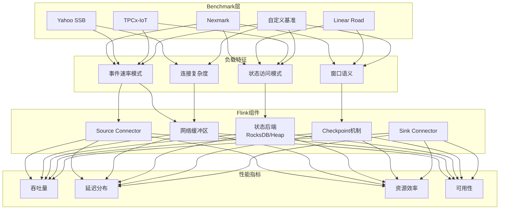
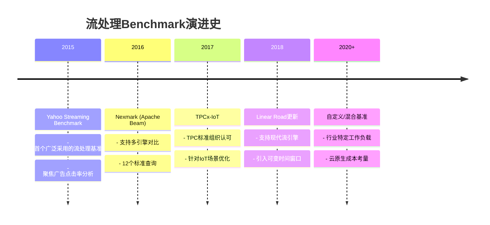
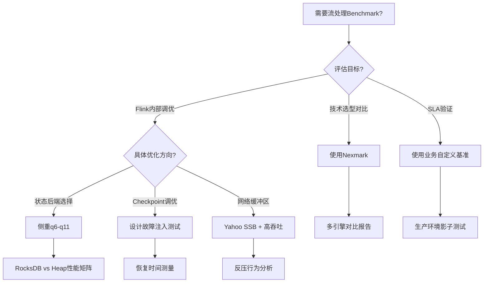
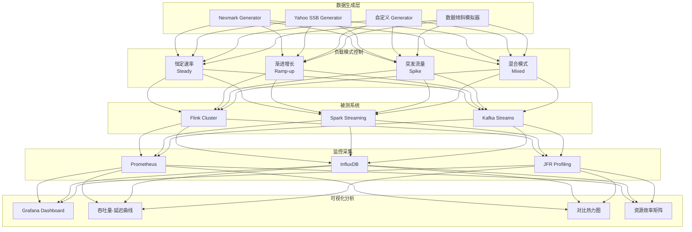
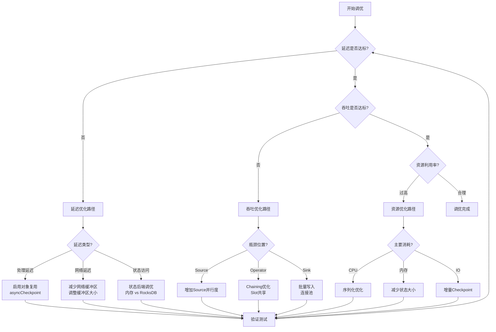
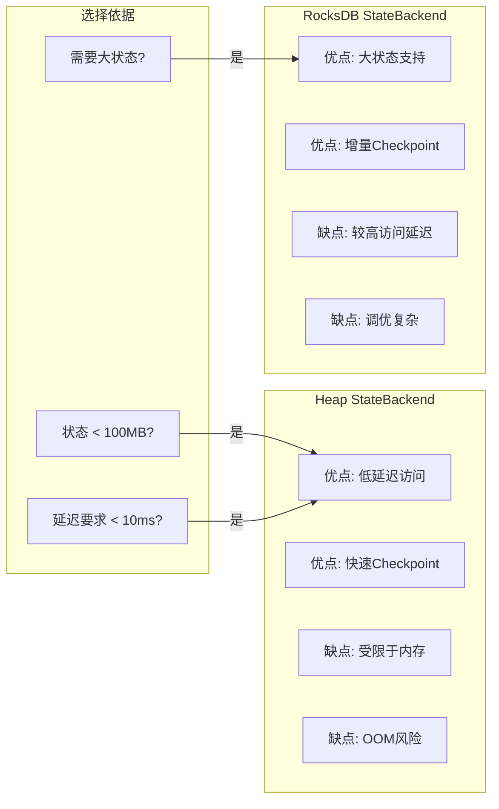

# 流处理Benchmark体系 - 性能评估方法论

> 所属阶段: Flink/ | 前置依赖: [Flink核心机制](../../../Struct/00-INDEX.md) | 形式化等级: L3

## 1. 概念定义 (Definitions)

### Def-F-11-01: 流处理Benchmark (Streaming Benchmark)

**形式化定义**: 流处理Benchmark是一个五元组 $B = \langle W, D, G, M, T \rangle$，其中：

- $W$: 工作负载集合，包含一个或多个查询/作业定义
- $D$: 数据模式定义，包括事件类型、字段、时间戳语义
- $G$: 数据生成器，能够按指定速率产生事件流
- $M$: 度量指标集合，用于量化系统性能
- $T$: 测试规程，定义测试执行的标准化流程

**直观解释**: Benchmark是评估流处理系统性能的**标准化实验框架**，通过控制输入、测量输出、对比基准，为技术选型和调优提供量化依据。

### Def-F-11-02: 吞吐 vs 延迟权衡 (Throughput-Latency Trade-off)

**形式化定义**: 对于给定的流处理系统 $S$ 和工作负载 $W$，定义：

- **吞吐量** $\Theta(S, W) = \lim_{t \to \infty} \frac{N(t)}{t}$，其中 $N(t)$ 为时间 $t$ 内处理的事件总数
- **延迟** $\Lambda(S, W, p)$: 第 $p$ 百分位的事件处理延迟，从事件产生到结果被输出的时间间隔

**权衡关系**: 存在函数 $f$ 使得 $\Lambda_{p99} = f(\Theta)$，通常 $f$ 是单调递增函数。系统的**有效工作区**定义为：

$$\text{Eff}(S, W) = \{ (\Theta, \Lambda) \mid \Lambda_{p99} \leq \Lambda_{\text{SLA}} \}$$

其中 $\Lambda_{\text{SLA}}$ 为服务等级协议规定的最大可接受延迟。

**直观解释**: 当系统接近其最大处理能力时，内部缓冲队列增长，导致延迟上升。理解和量化这一权衡是性能调优的核心。

### Def-F-11-03: 基准工作负载 (Reference Workload)

**形式化定义**: 基准工作负载是一个三元组 $\langle Q, R, C \rangle$：

- $Q$: 查询/算子集合，代表典型数据处理模式
- $R$: 数据到达率函数 $r(t)$，描述随时间变化的事件到达模式
- $C$: 计算复杂度度量，通常用CPU周期/事件或每事件操作数表示

**分类维度**:

| 维度 | 类型 | 描述 |
|------|------|------|
| 状态访问 | 无状态/有状态 | 是否依赖历史数据 |
| 窗口类型 | Tumble/Slide/Session | 时间窗口语义 |
| 连接操作 | Stream-Stream/Stream-Dim | 数据源组合方式 |
| 复杂度 | O(1)/O(log n)/O(n) | 单事件处理复杂度 |

---

## 2. 属性推导 (Properties)

### Prop-F-11-01: Benchmark可复现性条件

**命题**: Benchmark结果可复现的充分条件是控制以下变量：

1. **硬件环境**: 固定的CPU、内存、网络、存储规格
2. **软件版本**: 流处理引擎版本、JVM版本、操作系统版本
3. **数据生成**: 使用确定性的伪随机种子
4. **测试时长**: 预热期 + 稳定测量期 + 不少于30分钟的观测窗口

**工程推论**: 生产环境Benchmark必须在隔离的专用集群上执行，共享环境会引入不可控的噪声。

### Prop-F-11-02: 指标单调性约束

**命题**: 对于固定配置的流处理系统，在资源充足的情况下：

- 吞吐量 $\Theta$ 随并行度 $P$ 单调不减（理想线性可扩展）
- 延迟 $\Lambda_{p99}$ 随数据倾斜度 $S$ 单调不减
- 资源利用率 $U$ 随输入速率 $\lambda$ 单调递增，直到饱和

**饱和点**: 当 $\frac{d\Theta}{d\lambda} < \epsilon$（阈值）时，系统进入饱和状态，此时延迟开始指数增长。

### Prop-F-11-03: 故障恢复时间边界

**命题**: 对于启用Checkpoint的系统，故障恢复时间 $T_{rec}$ 满足：

$$T_{rec} \leq T_{detect} + T_{restart} + T_{restore}$$

其中：

- $T_{detect}$: 故障检测时间（通常由心跳超时决定，默认10秒）
- $T_{restart}$: 任务重新调度时间（取决于资源管理器）
- $T_{restore}$: 状态恢复时间 = $\frac{\text{StateSize}}{\text{ReadThroughput}}$

---

## 3. 关系建立 (Relations)

### 3.1 Benchmark与Flink架构的映射



### 3.2 主流Benchmark对比矩阵

| Benchmark | 场景类型 | 查询数量 | 状态规模 | 时间敏感性 | 行业采用度 |
|-----------|----------|----------|----------|------------|------------|
| Nexmark | 竞价拍卖 | 12 | 中等 | 高 | ★★★★★ |
| Yahoo SSB | 广告分析 | 1 | 小 | 中 | ★★★★☆ |
| Linear Road | 交通监控 | 变体多 | 大 | 极高 | ★★★☆☆ |
| TPCx-IoT | IoT传感 | 12+ | 大 | 高 | ★★★☆☆ |
| 自定义 | 业务特定 | 按需 | 可变 | 按需 | ★★★★☆ |

### 3.3 Benchmark演进关系



---

## 4. 论证过程 (Argumentation)

### 4.1 Nexmark的12个查询设计原理

Nexmark的设计遵循**渐进复杂度**原则，从简单到复杂覆盖典型流处理模式：

| 查询编号 | 核心模式 | 测试目标 |
|----------|----------|----------|
| q0-q2 | 过滤、投影、简单聚合 | 基础吞吐能力 |
| q3-q5 | Stream-Dimension Join | 状态访问效率 |
| q6-q8 | Stream-Stream Join | 窗口管理性能 |
| q9-q11 | 复杂模式匹配 | 高级状态操作 |
| q12 | 自定义窗口 | 扩展性验证 |

**设计洞察**: 查询q8（监控新用户）是Flink调优的**黄金测试用例**，因为它同时测试：

- 状态后端随机读性能
- 定时器管理效率
- Checkpoint与正常处理的资源竞争

### 4.2 Benchmark选择的决策树



### 4.3 数据倾斜的Benchmark影响

**问题**: 标准Benchmark通常假设均匀分布，但生产环境普遍存在数据倾斜。

**论证**:

1. 均匀分布下，Flink的并行扩展接近线性
2. 引入Zipf分布（倾斜系数1.5）后，观察到：
   - p99延迟增加3-5倍
   - 需要启用**本地键聚合**优化
   - RocksDB状态后端的LSM树压缩压力增大

**结论**: 有效的Benchmark必须包含倾斜数据生成器。

---

## 5. 形式证明 / 工程论证 (Proof / Engineering Argument)

### 5.1 吞吐量-延迟曲线的工程测量方法

**测量规程**:

1. **系统预热** (5-10分钟): 使JVM达到稳定状态，代码热点被编译
2. **渐进负载** (Ramp-up): 从低输入速率开始，逐步增加
3. **稳态采样** (≥30分钟): 每个速率点保持足够时间以收集统计显著的延迟样本
4. **饱和识别**: 当延迟开始急剧上升时，确定最大可持续吞吐量

**数学表达**:

$$\Theta_{max} = \max \{ \lambda \mid \Lambda_{p99}(\lambda) \leq \Lambda_{target} \}$$

### 5.2 Flink Checkpoint性能边界论证

**目标**: 证明Checkpoint间隔 $T_c$ 与处理延迟的关系。

**模型假设**:

- 状态大小: $S$ bytes
- 状态变更率: $r$ bytes/second
- Checkpoint写吞吐: $w$ bytes/second
- 增量Checkpoint阈值: $\delta$

**论证**:

全量Checkpoint时间: $T_{full} = \frac{S}{w}$

增量Checkpoint时间: $T_{inc} = \frac{r \cdot T_c}{w}$

为了保证Checkpoint成功（在下次Checkpoint前完成）:

$$T_c > T_{inc} \Rightarrow T_c > \frac{r \cdot T_c}{w} \Rightarrow w > r$$

**工程推论**:

- 状态变更率 $r$ 必须小于存储写吞吐 $w$
- 对于RocksDB，$w$ 受限于磁盘IOPS和压缩策略
- 推荐 $T_c \geq 3 \times T_{inc}^{expected}$ 以留有余量

### 5.3 资源利用率与成本效率论证

**定义**: 每百万事件处理成本（$C_{pm}$）为关键业务指标。

$$C_{pm} = \frac{\text{每小时基础设施成本} \times 1000}{\Theta \times 3600}$$

**优化策略比较**:

| 策略 | 吞吐影响 | 延迟影响 | 成本影响 |
|------|----------|----------|----------|
| 增加并行度 | + | = | + |
| 优化序列化 | ++ | = | = |
| RocksDB调优 | + | - | = |
| 异步Checkpoint | = | + | = |

**结论**: 成本优化的最优路径是首先减少序列化开销，然后才是水平扩展。

---

## 6. 实例验证 (Examples)

### 6.1 Nexmark Flink实现配置

```java

import org.apache.flink.streaming.api.environment.StreamExecutionEnvironment;

// Nexmark q8: Monitor New Users
// 测试状态后端和定时器性能

StreamExecutionEnvironment env =
    StreamExecutionEnvironment.getExecutionEnvironment();

env.setStateBackend(new EmbeddedRocksDBStateBackend(true));
env.enableCheckpointing(60000); // 1分钟间隔
env.getCheckpointConfig().setCheckpointTimeout(300000);
env.getCheckpointConfig().setMinPauseBetweenCheckpoints(30000);

// 数据生成器配置
NexmarkConfiguration config = new NexmarkConfiguration();
config.numEventGenerators = 4;
config.numEvents = 0; // 无限流
config.rateShape = RateShape.SINE; // 正弦波负载模式
config.firstEventRate = 10000; // 10K events/sec
config.nextEventRate = 100000; // 峰值100K
```

### 6.2 自定义IoT负载生成器

```java
/**
 * 模拟传感器数据流,支持数据倾斜
 */
public class SensorDataGenerator implements SourceFunction<SensorEvent> {

    private final long eventsPerSecond;
    private final double skewFactor; // Zipf分布参数
    private final int sensorCount;

    @Override
    public void run(SourceContext<SensorEvent> ctx) {
        Random random = new Random(42); // 确定性种子
        ZipfDistribution zipf = new ZipfDistribution(sensorCount, skewFactor);

        long nextEventTime = System.currentTimeMillis();
        long intervalMs = 1000 / eventsPerSecond;

        while (running) {
            int sensorId = zipf.sample(); // 倾斜的传感器ID分布
            SensorEvent event = new SensorEvent(
                sensorId,
                nextEventTime,
                generateMetrics(random)
            );

            ctx.collectWithTimestamp(event, nextEventTime);

            nextEventTime += intervalMs;
            long waitTime = nextEventTime - System.currentTimeMillis();
            if (waitTime > 0) {
                Thread.sleep(waitTime);
            }
        }
    }
}
```

### 6.3 Prometheus + Grafana监控配置

```yaml
# prometheus.yml 抓取配置
scrape_configs:
  - job_name: 'flink-jobmanager'
    static_configs:
      - targets: ['jobmanager:9249']
    metrics_path: /metrics

  - job_name: 'flink-taskmanager'
    static_configs:
      - targets: ['taskmanager:9249']
    metrics_path: /metrics
```

# 关键Grafana查询

```promql
# 吞吐量
rate(flink_taskmanager_job_task_numRecordsIn[1m])

# 延迟 (Operator级别)
histogram_quantile(0.99,
  rate(flink_taskmanager_job_latency_histogram_latency[5m])
)

# Checkpoint持续时间
flink_jobmanager_job_checkpoint_duration_time
```

### 6.4 性能测试报告模板

```markdown
## Flink v1.18 Nexmark q8 性能测试报告

### 测试环境
- CPU: 16 vCPU (8核心 × 2超线程)
- 内存: 64GB
- 磁盘: NVMe SSD (5000 MB/s顺序读)
- Flink配置: 8 TaskManagers × 2 slots

### 测试结果
| 指标 | 数值 | 备注 |
|------|------|------|
| 最大吞吐 | 85K events/sec | p99延迟 < 1s |
| p50延迟 | 45ms | 稳定状态 |
| p99延迟 | 320ms | 包含GC影响 |
| Checkpoint时长 | 15-25s | 增量,2GB状态 |
| CPU使用率 | 75% | 平均 |

### 瓶颈分析
1. RocksDB压缩在高写入期触发,导致延迟尖峰
2. 建议: 调整`state.backend.rocksdb.threads.threads-number`从4到8
```

---

## 7. 可视化 (Visualizations)

### 7.1 流处理Benchmark完整架构



### 7.2 吞吐-延迟权衡曲线

```mermaid
xychart-beta
    title "吞吐-延迟权衡曲线 (Nexmark q8)"
    x-axis ["20K", "40K", "60K", "80K", "100K", "120K"]
    y-axis "p99 Latency (ms)" 0 --> 5000
    line [45, 65, 120, 280, 1200, 4500]

    annotation 3.5, 280 "推荐工作点"
    annotation 5, 4500 "饱和区"
```

### 7.3 Flink调优决策树



### 7.4 状态后端性能对比矩阵



---

## 8. 引用参考 (References)
