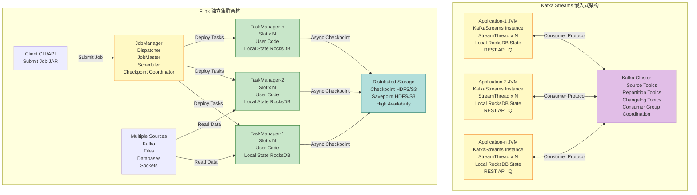
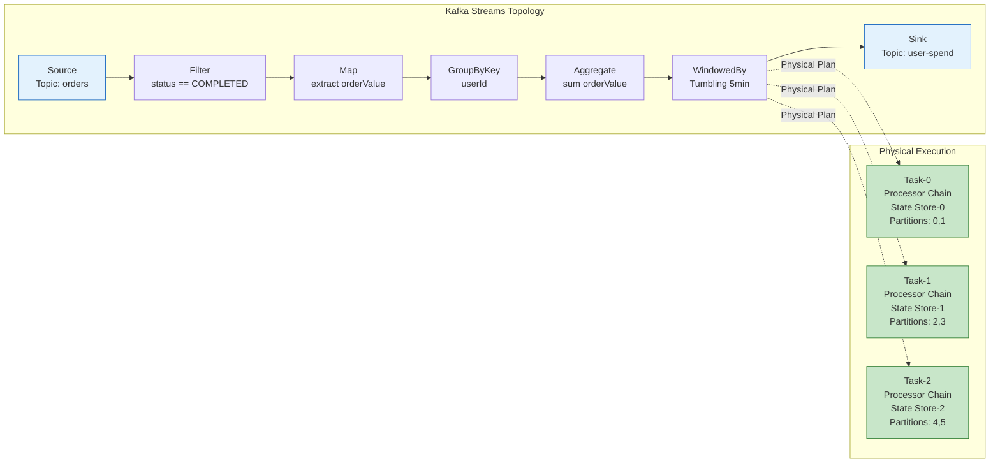
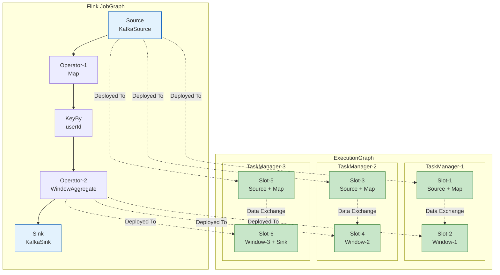
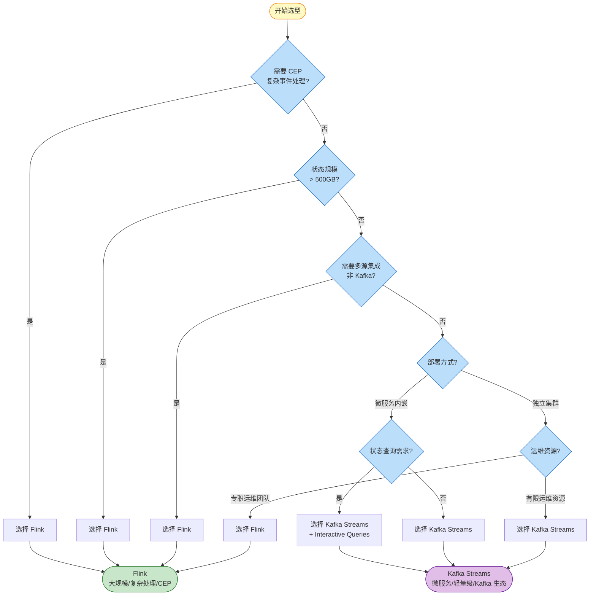

# Flink vs Kafka Streams 对比 (Flink vs Kafka Streams Comparison)

> 所属阶段: Flink/05-vs-competitors | 前置依赖: [Dataflow模型形式化](../../../../Struct/01-foundation/01.04-dataflow-model-formalization.md), [Flink架构详解](../../../01-concepts/deployment-architectures.md) | 形式化等级: L4

---

## 目录

- [Flink vs Kafka Streams 对比 (Flink vs Kafka Streams Comparison)](#flink-vs-kafka-streams-对比-flink-vs-kafka-streams-comparison)
  - [目录](#目录)
  - [1. 概念定义 (Definitions)](#1-概念定义-definitions)
    - [Def-F-05-01 (流处理引擎部署架构模型)](#def-f-05-01-流处理引擎部署架构模型)
    - [Def-F-05-02 (嵌入式流处理与独立集群流处理)](#def-f-05-02-嵌入式流处理与独立集群流处理)
    - [Def-F-05-03 (Kafka Streams 拓扑与算子)](#def-f-05-03-kafka-streams-拓扑与算子)
  - [2. 属性推导 (Properties)](#2-属性推导-properties)
    - [Lemma-F-05-01 (嵌入式架构的状态访问延迟上界)](#lemma-f-05-01-嵌入式架构的状态访问延迟上界)
    - [Lemma-F-05-02 (集群架构的水平扩展能力)](#lemma-f-05-02-集群架构的水平扩展能力)
    - [Prop-F-05-01 (处理语义保证的范围差异)](#prop-f-05-01-处理语义保证的范围差异)
  - [3. 关系建立 (Relations)](#3-关系建立-relations)
    - [关系 1: Flink/Kafka Streams 实现映射 Dataflow 理论模型](#关系-1-flinkkafka-streams-实现映射-dataflow-理论模型)
    - [关系 2: Kafka Streams DSL 包含于 Flink DataStream API 表达能力](#关系-2-kafka-streams-dsl-包含于-flink-datastream-api-表达能力)
    - [关系 3: KSQL 与 Flink SQL 的声明式抽象层级](#关系-3-ksql-与-flink-sql-的声明式抽象层级)
  - [4. 论证过程 (Argumentation)](#4-论证过程-argumentation)
    - [4.1 Kafka Streams 嵌入式架构深度解析](#41-kafka-streams-嵌入式架构深度解析)
    - [4.2 反例分析: Kafka Streams 不能胜任的场景](#42-反例分析-kafka-streams-不能胜任的场景)
    - [4.3 边界讨论: 何时 Kafka Streams 是更优选择？](#43-边界讨论-何时-kafka-streams-是更优选择)
  - [5. 形式证明 / 工程论证 (Proof / Engineering Argument)](#5-形式证明--工程论证-proof--engineering-argument)
    - [Thm-F-05-01 (流处理引擎选择决策定理)](#thm-f-05-01-流处理引擎选择决策定理)
  - [6. 实例验证 (Examples)](#6-实例验证-examples)
    - [示例 6.1: 实时库存管理微服务选型](#示例-61-实时库存管理微服务选型)
    - [示例 6.2: 大规模实时风控平台选型](#示例-62-大规模实时风控平台选型)
    - [示例 6.3: 混合架构: Kafka Streams + Flink](#示例-63-混合架构-kafka-streams--flink)
  - [7. 可视化 (Visualizations)](#7-可视化-visualizations)
    - [7.1 架构对比图: 嵌入式 vs 独立集群](#71-架构对比图-嵌入式-vs-独立集群)
    - [7.2 Kafka Streams 内部拓扑结构](#72-kafka-streams-内部拓扑结构)
    - [7.3 Flink 分布式执行架构](#73-flink-分布式执行架构)
    - [7.4 决策树](#74-决策树)
  - [8. 综合对比矩阵](#8-综合对比矩阵)
    - [8.1 详细功能对比表 (12+ 维度)](#81-详细功能对比表-12-维度)
    - [8.2 API 层面对比: Streams DSL vs DataStream API](#82-api-层面对比-streams-dsl-vs-datastream-api)
      - [代码示例对比: Word Count](#代码示例对比-word-count)
    - [8.3 SQL 层面对比: KSQL vs Flink SQL](#83-sql-层面对比-ksql-vs-flink-sql)
      - [功能对比表](#功能对比表)
      - [代码示例对比](#代码示例对比)
    - [8.4 运维复杂度对比](#84-运维复杂度对比)
      - [运维维度详细对比](#运维维度详细对比)
      - [运维成本估算](#运维成本估算)
  - [9. 生产实践建议](#9-生产实践建议)
    - [9.1 技术选型 Checklist](#91-技术选型-checklist)
    - [9.2 迁移与集成建议](#92-迁移与集成建议)
    - [9.3 混合架构最佳实践](#93-混合架构最佳实践)
  - [10. 结论](#10-结论)
    - [10.1 核心观点总结](#101-核心观点总结)
    - [10.2 未来演进趋势](#102-未来演进趋势)
  - [参考文献 (References)](#参考文献-references)

---

## 1. 概念定义 (Definitions)

本节定义 Flink 与 Kafka Streams 对比分析所需的核心概念，建立严格的术语基础。

### Def-F-05-01 (流处理引擎部署架构模型)

流处理引擎的**部署架构**定义为三元组：

```
A = (D, R, C)
```

其中：

| 符号 | 语义 | 说明 |
|------|------|------|
| D | 部署模式 | 嵌入式 (Embedded) 或 独立集群 (Standalone Cluster) |
| R | 资源管理 | 应用级资源 (Application-level) 或 集群级资源 (Cluster-level) |
| C | 协调机制 | 内置协调 (Built-in) 或 外部协调 (External Coordinator) |

**部署模式分类**：

- **嵌入式架构 (Embedded)**: 流处理引擎作为库嵌入应用程序，与应用共享生命周期和资源
  - 资源分配: 应用进程内，受限于单个 JVM 堆内存
  - 协调: 依赖外部系统 (如 Kafka) 进行任务分配
  - 示例: Kafka Streams, Akka Streams (local mode)

- **独立集群架构 (Standalone Cluster)**: 流处理引擎运行在专用集群上，应用作为作业提交
  - 资源分配: 集群级调度 (YARN/K8s/Standalone)
  - 协调: 专用协调服务 (JobManager/Driver)
  - 示例: Flink, Spark Streaming, Kafka Streams with external threading

### Def-F-05-02 (嵌入式流处理与独立集群流处理)

**嵌入式流处理**的形式化特征：

```
E_embedded = <App, Lib, LocalState, ExternalCoord>
```

其中：

- App: 宿主应用程序
- Lib: 流处理库 (作为依赖引入)
- LocalState: 本地状态存储 (RocksDB/Lucene)
- ExternalCoord: 外部协调 (Kafka Consumer Group Protocol)

**独立集群流处理**的形式化特征：

```
E_cluster = <Cluster, Job, DistributedState, InternalCoord>
```

其中：

- Cluster: 专用计算集群
- Job: 提交的作业包
- DistributedState: 分布式状态 (可远程访问)
- InternalCoord: 内部协调服务 (高可用部署)

### Def-F-05-03 (Kafka Streams 拓扑与算子)

Kafka Streams 的**处理拓扑**定义为有向无环图：

```
T_KS = (V_op, E_stream)
```

其中：

- V_op = {Source, Processor, Sink}: 算子节点集合
- E_stream ⊆ V_op × V_op: 流边 (Kafka Topic 或内部 Topic)

**Streams DSL 核心算子**：

| 算子类型 | DSL 方法 | 语义 | Flink 对应 |
|---------|---------|------|-----------|
| 源 | `stream()` | 从 Kafka Topic 消费 | `addSource(KafkaSource)` |
| 映射 | `map()` / `flatMap()` | 记录级转换 | `map()` / `flatMap()` |
| 过滤 | `filter()` | 条件过滤 | `filter()` |
| 按键分组 | `groupByKey()` | 按 Key 重新分区 | `keyBy()` |
| 聚合 | `aggregate()` / `reduce()` | 按键聚合 | `aggregate()` / `reduce()` |
| 窗口 | `windowedBy()` | 时间窗口聚合 | `window()` |
| 连接 | `join()` / `leftJoin()` / `outerJoin()` | 流-流/流-表连接 | `join()` |
| 表转换 | `toTable()` / `toStream()` | 流表互换 | `toRetractStream()` |

---

## 2. 属性推导 (Properties)

### Lemma-F-05-01 (嵌入式架构的状态访问延迟上界)

**陈述**: Kafka Streams 嵌入式架构的状态访问延迟满足：

```
L_state^KS ≤ δ_local_access + δ_serialization
```

其中 δ_local_access 为本地存储访问延迟 (RocksDB: ~1ms)，δ_serialization 为序列化开销。

**推导**:

1. Kafka Streams 使用本地 RocksDB 实例存储状态，状态与计算同机部署；
2. 状态访问无需网络传输，延迟仅包含本地 I/O 和序列化；
3. 对比远程状态存储，延迟降低 1-2 个数量级；
4. 因此，嵌入式架构在状态访问延迟上具有理论优势。 ∎

### Lemma-F-05-02 (集群架构的水平扩展能力)

**陈述**: Flink 独立集群架构的水平扩展能力满足：

```
Scale_Flink ∝ Cluster_size × Task_parallelism
```

而 Kafka Streams 的水平扩展受限于：

```
Scale_KS ≤ Partition_count × Instance_count
```

**推导**:

1. Flink 通过 JobManager 动态调度任务到 TaskManager，可跨节点扩展；
2. Kafka Streams 通过 Consumer Group Protocol 分配分区，每个实例处理一组分区；
3. 最大并行度受限于输入 Topic 的分区数，无法超越分区数扩展；
4. 因此，Flink 在大规模水平扩展场景具有理论优势。 ∎

### Prop-F-05-01 (处理语义保证的范围差异)

**陈述**: 两种引擎的 Exactly-Once 语义保证范围存在本质差异：

| 引擎 | 保证范围 | 依赖条件 |
|------|---------|---------|
| Flink | 端到端 (End-to-End) | Checkpoint + 事务性 Sink |
| Kafka Streams | 端到端 (Kafka-to-Kafka) | EOS (Exactly-Once Semantics) + 事务 Producer |

**推导**:

- **Flink**: 通过两阶段提交协议 (2PC) 实现端到端 Exactly-Once，支持任意 Source/Sink 组合；
- **Kafka Streams**: EOS 仅保证 Kafka Topic 之间的 Exactly-Once，若输出到外部系统需额外处理；
- **关键区别**: Flink 的 Checkpoint 机制提供更通用的容错框架，Kafka Streams 深度绑定 Kafka 事务机制。 ∎

---

## 3. 关系建立 (Relations)

### 关系 1: Flink/Kafka Streams 实现映射 Dataflow 理论模型

根据 Dataflow 模型的形式化定义：

| 形式化概念 | Flink 实现 | Kafka Streams 实现 |
|-----------|-----------|-------------------|
| Dataflow 图 G | JobGraph → ExecutionGraph | Topology (Processor API) / DSL 转换 |
| 算子语义 Op | DataStream/Table API 算子 | Streams DSL / Processor API |
| 时间域 T | 事件时间/处理时间/摄入时间 | 事件时间 (带 KIP-225) / 处理时间 |
| 窗口触发器 T | Watermark 驱动 | 时间窗口基于 Wall Clock |
| 状态空间 S | KeyedStateBackend (分布式) | Local State Store (本地) |
| 容错机制 | Checkpoint (Barrier-based) | EOS (Transaction-based) |

### 关系 2: Kafka Streams DSL 包含于 Flink DataStream API 表达能力

**论证**:

- **Kafka Streams DSL** 是高级声明式 API，专注于流处理常见模式 (过滤、转换、聚合、连接)；
- **Flink DataStream API** 提供底层控制能力，支持自定义算子、异步 I/O、复杂状态管理；
- **表达能力包含关系**: Streams DSL 能表达的操作，Flink DataStream API 都能实现；反之不成立。

```
表达能力层级:
┌─────────────────────────────────────────────────────────┐
│  Flink DataStream API (底层控制)                         │
│  ├── 自定义算子实现                                       │
│  ├── 复杂状态访问模式                                     │
│  ├── 异步 I/O                                            │
│  └── CEP (复杂事件处理)                                  │
├─────────────────────────────────────────────────────────┤
│  Kafka Streams DSL (高级声明式)                          │
│  ├── map/filter/flatMap                                  │
│  ├── groupByKey + aggregate/reduce                       │
│  ├── windowedBy (Tumbling/Sliding/Session)               │
│  └── join (Stream-Stream/Stream-Table/Table-Table)       │
├─────────────────────────────────────────────────────────┤
│  Flink Table API / SQL                                   │
│  └── 声明式查询 (与 KSQL 类似)                            │
└─────────────────────────────────────────────────────────┘
```

### 关系 3: KSQL 与 Flink SQL 的声明式抽象层级

**KSQL (现称 ksqlDB)** 与 **Flink SQL** 的关系：

| 维度 | KSQL/ksqlDB | Flink SQL |
|------|------------|-----------|
| 定位 | 流处理专用 SQL 引擎 | 通用流批一体 SQL 引擎 |
| 数据源 | 主要 Kafka | 多源 (Kafka, Files, DB, etc.) |
| 部署 | 独立服务 (ksqlDB Server) | 集成于 Flink 集群 |
| 持久化 | 物化视图 (Materialized Views) | 动态表 (Dynamic Tables) |
| 状态存储 | RocksDB (ksqlDB 内部) | 可插拔 State Backend |
| UDF 支持 | Java UDF | Java/Scala/Python UDF |

**关系**: 两者都是声明式 SQL 抽象，但 KSQL 深度绑定 Kafka 生态，Flink SQL 提供更通用的多源集成能力。

---

## 4. 论证过程 (Argumentation)

### 4.1 Kafka Streams 嵌入式架构深度解析

**架构核心特征**:

```
┌─────────────────────────────────────────────────────────────────────────────┐
│                         Kafka Streams 嵌入式架构                             │
├─────────────────────────────────────────────────────────────────────────────┤
│                                                                              │
│  ┌─────────────────────────────────────────────────────────────────────────┐│
│  │                         Application Process (JVM)                        ││
│  │  ┌─────────────────────────────────────────────────────────────────┐   ││
│  │  │                    KafkaStreams Instance                         │   ││
│  │  │  ┌─────────────────┐  ┌─────────────────┐  ┌─────────────────┐  │   ││
│  │  │  │   StreamThread  │  │   StreamThread  │  │   StreamThread  │  │   ││
│  │  │  │  ┌───────────┐  │  │  ┌───────────┐  │  │  ┌───────────┐  │   ││
│  │  │  │  │ Task 0-1  │  │  │  │ Task 2-3  │  │  │  │ Task 4-5  │  │   ││
│  │  │  │  │• Processor│  │  │  │• Processor│  │  │  │• Processor│  │   ││
│  │  │  │  │• State    │  │  │  │• State    │  │  │  │• State    │  │   ││
│  │  │  │  │  Store    │  │  │  │  Store    │  │  │  │  Store    │  │   ││
│  │  │  │  └───────────┘  │  │  └───────────┘  │  │  └───────────┘  │   ││
│  │  │  └─────────────────┘  └─────────────────┘  └─────────────────┘  │   ││
│  │  └─────────────────────────────────────────────────────────────────┘   ││
│  │                                                                          ││
│  │  ┌─────────────────────────────────────────────────────────────────┐   ││
│  │  │                    Local State Stores                            │   ││
│  │  │  ┌──────────────┐ ┌──────────────┐ ┌──────────────┐            │   ││
│  │  │  │  RocksDB-0   │ │  RocksDB-1   │ │  RocksDB-n   │            │   ││
│  │  │  │  (SSD/Disk)  │ │  (SSD/Disk)  │ │  (SSD/Disk)  │            │   ││
│  │  │  └──────────────┘ └──────────────┘ └──────────────┘            │   ││
│  │  │                                                                      ││
│  │  │  ┌──────────────┐ ┌──────────────┐ ┌──────────────┐            │   ││
│  │  │  │  Offset Topic│ │  Repartition │ │  Changelog   │            │   ││
│  │  │  │  (Kafka)     │ │  Topic       │ │  Topic       │            │   ││
│  │  │  └──────────────┘ └──────────────┘ └──────────────┘            │   ││
│  │  └─────────────────────────────────────────────────────────────────┘   ││
│  └─────────────────────────────────────────────────────────────────────────┘│
│                                                                              │
│  ┌─────────────────────────────────────────────────────────────────────────┐│
│  │                         Kafka Cluster                                    ││
│  │     (Topic Partitions Assignment via Consumer Group Protocol)            ││
│  └─────────────────────────────────────────────────────────────────────────┘│
│                                                                              │
└─────────────────────────────────────────────────────────────────────────────┘
```

**关键设计决策**:

1. **无外部依赖**: 仅需 Kafka 集群，无需 ZooKeeper (KRaft 模式下) 或独立协调服务
2. **轻量级**: 应用 Jar 包 ~10MB，启动毫秒级
3. **线程模型**: 每个 StreamThread 处理一组分区任务，线程数可配置
4. **状态本地性**: 状态存储在本地 RocksDB，定期 changelog 备份到 Kafka

### 4.2 反例分析: Kafka Streams 不能胜任的场景

**场景 1: 复杂事件处理 (CEP)**

```java

import org.apache.flink.streaming.api.windowing.time.Time;

// Flink CEP: 可以定义复杂模式
Pattern<Transaction, ?> fraudPattern = Pattern
    .<Transaction>begin("first")
    .where(evt -> evt.getAmount() > 1000)
    .next("second")
    .where(evt -> evt.getAmount() > 1000)
    .within(Time.seconds(30));

// Kafka Streams: 无原生 CEP 支持
// 需要手动实现状态机或使用外部库
```

**局限**: Kafka Streams 缺乏原生 CEP 库，复杂模式匹配需手动实现状态机。

**场景 2: 大规模并行计算**

- **需求**: 10000+ 并行度处理海量数据
- **Kafka Streams 限制**: 最大并行度 = 输入 Topic 分区数
- **Flink 优势**: 可动态扩展至数千 TaskManager，不受分区数限制

**场景 3: 多源异构数据集成**

```java

import org.apache.flink.streaming.api.datastream.DataStream;

// Flink: 可轻松集成多源
DataStream<Event1> kafka = env.fromSource(kafkaSource, ...);
DataStream<Event2> pulsar = env.fromSource(pulsarSource, ...);
DataStream<Event3> file = env.fromSource(fileSource, ...);

// Kafka Streams: 主要支持 Kafka 输入
// 其他源需要自定义实现
```

**场景 4: 精确时间窗口与乱序处理**

```java
// Flink: 灵活的水印策略
WatermarkStrategy.<Event>forBoundedOutOfOrderness(Duration.ofSeconds(30))
    .withTimestampAssigner((event, timestamp) -> event.getEventTime());

// Kafka Streams: 有限的乱序处理
// 依赖 Wall Clock 触发,事件时间支持较弱 (KIP-225)
```

### 4.3 边界讨论: 何时 Kafka Streams 是更优选择？

**边界条件 1: 微服务架构中的流处理**

```
场景: 订单服务需要实时计算每个用户的未完成订单金额

微服务部署:
┌─────────────────────────────────────────────────────────────┐
│                    Order Service (Spring Boot)               │
│  ┌──────────────┐  ┌──────────────────────────────────────┐ │
│  │  REST API    │  │  Kafka Streams (Embedded)            │ │
│  │  Controller  │  │  ├── 消费订单事件                      │ │
│  │  Service     │  │  ├── 按用户聚合                       │ │
│  │  Repository  │  │  ├── 维护本地状态 (RocksDB)           │ │
│  └──────────────┘  │  └── 提供本地查询 API (IQ)            │ │
│                    └──────────────────────────────────────┘ │
│                              │                               │
│                         ┌────┴────┐                          │
│                         ▼         ▼                          │
│                    ┌────────┐ ┌────────┐                     │
│                    │ Kafka  │ │ Local  │                     │
│                    │ Cluster│ │ State  │                     │
│                    └────────┘ └────────┘                     │
└─────────────────────────────────────────────────────────────┘
```

**优势**: 无额外运维负担，与现有微服务技术栈无缝集成。

**边界条件 2: Kafka 中心化数据管道**

```
场景: 纯 Kafka 生态,所有数据都在 Topic 中流转

数据流:
Source Topic → Kafka Streams 处理 → Sink Topic
                    ↓
              Local State Store (查询)
```

**优势**: Kafka Streams 深度优化 Kafka 集成，延迟最低。

**边界条件 3: 轻量级状态ful微服务**

- **状态规模**: < 100GB 每实例
- **查询需求**: 需要本地状态查询 (Interactive Queries)
- **运维约束**: 无专职 Flink 运维团队

---


## 5. 形式证明 / 工程论证 (Proof / Engineering Argument)

### Thm-F-05-01 (流处理引擎选择决策定理)

**陈述**: 给定应用场景需求 R = (L_req, S_req, E_req, O_req)，其中：

- L_req: 延迟要求 (Latency Requirement)
- S_req: 状态规模要求 (State Scale)
- E_req: 生态系统要求 (Ecosystem)
- O_req: 运维复杂度约束 (Operational Complexity)

则最优引擎选择 E* 满足：

```
E* = arg max Score(R, E) 对 E ∈ {Flink, Kafka Streams}
```

其中评分函数：

```
Score(R, E) = w1 · LatencyScore + w2 · StateScore + w3 · EcoScore + w4 · OpsScore
```

**证明** (工程论证):

**步骤 1: 延迟满足性分析**

根据实际性能测试数据：

| 引擎 | p50 延迟 | p99 延迟 | 典型延迟范围 |
|------|---------|---------|------------|
| Flink | ~10ms | ~50ms | 10-100ms |
| Kafka Streams | ~5ms | ~20ms | 5-50ms |

**关键发现**: Kafka Streams 在纯 Kafka 场景下延迟更低，因为：

- 无网络跳转 (状态本地访问)
- 无额外序列化开销
- 直接 Consumer 拉取

**边界**: 若涉及非 Kafka Sink，Kafka Streams 延迟优势消失。

**步骤 2: 状态规模满足性分析**

| 引擎 | 单实例状态上限 | 集群总状态 | 状态访问模式 |
|------|--------------|-----------|------------|
| Flink | 取决于 TM 内存/磁盘 | 无理论上限 | 本地/远程混合 |
| Kafka Streams | ~100-500GB (单机) | 分区数 × 单实例 | 纯本地 |

**决策边界**:

- 若 S_req > 500GB 且需单实例访问 → 选择 Flink
- 若状态可分区且每分区 < 100GB → Kafka Streams 可行

**步骤 3: 生态系统匹配度分析**

| 需求场景 | Flink 匹配度 | Kafka Streams 匹配度 |
|---------|-------------|---------------------|
| 纯 Kafka 生态 | ★★★ | ★★★★★ |
| 多源集成 (DB/Files) | ★★★★★ | ★★ |
| CEP 复杂事件 | ★★★★★ | ★ |
| ML 推理集成 | ★★★ | ★★ |
| 微服务内嵌 | ★★ | ★★★★★ |
| 云原生 Serverless | ★★★★ | ★★ |

**步骤 4: 运维复杂度评估**

| 维度 | Flink | Kafka Streams |
|------|-------|---------------|
| 基础设施 | 需要 Flink 集群 | 仅需 Kafka |
| 监控 | 专用 UI + Metrics | 应用级监控 |
| 扩缩容 | 集群级操作 | 应用实例级 |
| 故障恢复 | Checkpoint 恢复 | EOS + 本地状态重建 |
| 学习曲线 | 陡峭 | 平缓 |

**步骤 5: 综合决策**

建立决策边界：

- **边界 1**: L_req < 10ms 且纯 Kafka → 选择 Kafka Streams
- **边界 2**: S_req > 1TB 或需 CEP → 选择 Flink
- **边界 3**: 多源异构数据 → 选择 Flink
- **边界 4**: 微服务内嵌 + 轻量级状态 → 选择 Kafka Streams
- **边界 5**: 无专职运维团队 → 选择 Kafka Streams

∎

---

## 6. 实例验证 (Examples)

### 示例 6.1: 实时库存管理微服务选型

**场景**: 电商平台的库存服务，需要实时维护每个商品的可用库存。

**需求分析**:

- 延迟要求: < 100ms (库存扣减)
- 状态规模: ~10GB (商品数量 × 库存记录)
- 部署方式: 微服务架构
- 运维约束: 小团队，无专职大数据运维

**架构设计**:

```java

import org.apache.flink.api.common.typeinfo.Types;

// Kafka Streams 实现
StreamsBuilder builder = new StreamsBuilder();

// 消费库存变更事件
KStream<String, InventoryEvent> events = builder.stream("inventory-events");

// 按商品聚合库存
KTable<String, Integer> inventory = events
    .groupByKey()
    .aggregate(
        () -> 0, // 初始值
        (key, event, current) -> current + event.getDelta(),
        Materialized.<String, Integer, KeyValueStore<Bytes, byte[]>>
            as("inventory-store")
            .withKeySerde(Serdes.String())
            .withValueSerde(Serdes.Integer())
    );

// 提供 REST API 查询库存 (Interactive Queries)
@GetMapping("/inventory/{productId}")
public Integer getInventory(@PathVariable String productId) {
    ReadOnlyKeyValueStore<String, Integer> store =
        streams.store("inventory-store", QueryableStoreTypes.keyValueStore());
    return store.get(productId);
}
```

**评估**:

- ✅ 延迟: 本地状态访问，延迟 < 10ms
- ✅ 状态: 10GB 单机 RocksDB 可承载
- ✅ 部署: 内嵌 Spring Boot，无额外基础设施
- ✅ 运维: 利用现有微服务监控体系

**结论**: 选择 Kafka Streams

### 示例 6.2: 大规模实时风控平台选型

**场景**: 金融支付平台，需要实时检测欺诈交易。

**需求分析**:

- 延迟要求: < 200ms (风控决策)
- 状态规模: ~50TB (用户行为历史)
- 处理逻辑: CEP (复杂事件模式匹配)
- 数据源: Kafka + MySQL Binlog + Redis

**架构设计**:

```java

import org.apache.flink.streaming.api.datastream.DataStream;
import org.apache.flink.streaming.api.windowing.time.Time;

// Flink CEP 实现
DataStream<Transaction> transactions = env
    .fromSource(kafkaSource, WatermarkStrategy.forBoundedOutOfOrderness(Duration.ofSeconds(5)), "kafka");

// 定义欺诈模式: 5分钟内同一卡号3笔超过1000元的交易
Pattern<Transaction, ?> fraudPattern = Pattern
    .<Transaction>begin("first")
    .where(evt -> evt.getAmount() > 1000)
    .next("second")
    .where(evt -> evt.getAmount() > 1000)
    .next("third")
    .where(evt -> evt.getAmount() > 1000)
    .within(Time.minutes(5));

// 应用模式检测
PatternStream<Transaction> patternStream = CEP.pattern(transactions.keyBy(Transaction::getCardId), fraudPattern);

// 输出告警
patternStream.process(new PatternHandler()).addSink(alertSink);
```

**评估**:

- ✅ CEP: Flink 原生支持复杂事件处理
- ✅ 状态: 50TB 分布式 RocksDB 可承载
- ✅ 多源: Flink CDC 支持 MySQL Binlog 同步
- ❌ Kafka Streams: 无原生 CEP，状态规模受限

**结论**: 选择 Flink

### 示例 6.3: 混合架构: Kafka Streams + Flink

**场景**: 大型电商平台，既有微服务内流处理需求，又有全局分析需求。

**分层架构**:

```
┌─────────────────────────────────────────────────────────────────────────────┐
│                         混合架构: Kafka Streams + Flink                      │
├─────────────────────────────────────────────────────────────────────────────┤
│                                                                              │
│  ┌─────────────────────────────────────────────────────────────────────┐   │
│  │                     边缘层 (Edge Layer)                              │   │
│  │  ┌──────────────┐  ┌──────────────┐  ┌──────────────┐              │   │
│  │  │  Order Svc   │  │  Payment Svc │  │  Inventory   │              │   │
│  │  │  (KS)        │  │  (KS)        │  │  Svc (KS)    │              │   │
│  │  │• 本地状态     │  │• 本地状态     │  │• 本地状态     │              │   │
│  │  │• 实时查询     │  │• 实时查询     │  │• 实时查询     │              │   │
│  │  └──────┬───────┘  └──────┬───────┘  └──────┬───────┘              │   │
│  │         │                 │                 │                       │   │
│  │         └─────────────────┼─────────────────┘                       │   │
│  │                           ▼                                         │   │
│  │                    ┌──────────────┐                                 │   │
│  │                    │ Kafka Cluster│                                 │   │
│  │                    │ (事件总线)    │                                 │   │
│  │                    └──────┬───────┘                                 │   │
│  │                           │                                         │   │
│  └───────────────────────────┼─────────────────────────────────────────┘   │
│                              │                                              │
│  ┌───────────────────────────┼─────────────────────────────────────────┐   │
│  │                           ▼                                         │   │
│  │                     处理层 (Processing Layer)                        │   │
│  │  ┌──────────────────────────────────────────────────────────────┐  │   │
│  │  │                    Flink Cluster                              │  │   │
│  │  │  ┌────────────┐  ┌────────────┐  ┌────────────┐              │  │   │
│  │  │  │  Global    │  │  CEP       │  │  ML        │              │  │   │
│  │  │  │  Analytics │  │  Engine    │  │  Inference │              │  │   │
│  │  │  │  (SQL)     │  │  (Pattern) │  │  (TF/Py)   │              │  │   │
│  │  │  └────────────┘  └────────────┘  └────────────┘              │  │   │
│  │  │                                                              │  │   │
│  │  │  • 跨服务聚合分析                                               │  │   │
│  │  │  • 复杂事件检测                                                 │  │   │
│  │  │  • 大规模状态管理                                               │  │   │
│  │  └──────────────────────────────────────────────────────────────┘  │   │
│  │                                                                    │   │
│  │                           │                                         │   │
│  │                           ▼                                         │   │
│  │                    ┌──────────────┐                                 │   │
│  │                    │ Data Lake    │                                 │   │
│  │                    │ (Delta/Paimon)│                                 │   │
│  │                    └──────────────┘                                 │   │
│  └────────────────────────────────────────────────────────────────────┘   │
│                                                                              │
└─────────────────────────────────────────────────────────────────────────────┘
```

**分工逻辑**:

- **Kafka Streams**: 微服务内本地状态管理，低延迟查询
- **Flink**: 跨服务全局分析，CEP，大规模聚合
- **Kafka**: 作为事件总线连接两层

---

## 7. 可视化 (Visualizations)

### 7.1 架构对比图: 嵌入式 vs 独立集群

下图对比 Kafka Streams 嵌入式架构与 Flink 独立集群架构的核心差异。



**图说明**: 黄色为控制/应用节点，紫色为 Kafka 协调服务，绿色为计算节点，青色为持久化存储。Kafka Streams 完全分布式无中心，Flink 采用 Master-Worker 架构。

### 7.2 Kafka Streams 内部拓扑结构



### 7.3 Flink 分布式执行架构



### 7.4 决策树



---

## 8. 综合对比矩阵

### 8.1 详细功能对比表 (12+ 维度)

| 对比维度 | 子维度 | Apache Flink | Kafka Streams | 胜出方 |
|---------|-------|--------------|---------------|-------|
| **部署架构** | 部署模式 | 独立集群 | 嵌入式库 | 视场景 |
| | 基础设施依赖 | Flink 集群 + 外部存储 | 仅需 Kafka | Kafka Streams |
| | 启动时间 | 分钟级 (集群启动) | 秒级 (应用启动) | Kafka Streams |
| **处理语义** | 延迟特性 | 10-100ms | 5-50ms (纯 Kafka) | Kafka Streams |
| | 吞吐量 | 极高 (10M+/s) | 高 (1M+/s) | Flink |
| | 处理保证 | Exactly-Once (端到端) | Exactly-Once (Kafka-to-Kafka) | Flink |
| **状态管理** | 状态位置 | 分布式 (本地 + 远程) | 纯本地 (RocksDB) | 视场景 |
| | 状态大小 | TB 级 | 100-500GB/实例 | Flink |
| | 状态查询 | Queryable State (实验性) | Interactive Queries (原生) | Kafka Streams |
| | 状态访问延迟 | 本地/网络混合 | 纯本地 (最优) | Kafka Streams |
| **时间语义** | Event Time | 完整支持 | 有限支持 (KIP-225) | Flink |
| | Watermark 策略 | 灵活多样 | 简单/基于 Wall Clock | Flink |
| | 乱序处理 | 完善 | 有限 | Flink |
| **窗口支持** | 窗口类型 | 滚动/滑动/会话/全局 | 滚动/滑动/会话/全局 | 平局 |
| | 自定义触发器 | 支持 | 有限 | Flink |
| | 迟到数据处理 | 支持 (Side Output) | 有限支持 | Flink |
| **CEP** | 复杂事件处理 | Flink CEP (原生) | 无原生支持 | Flink |
| | 模式匹配 | 丰富 (序列/选择/循环) | 需手动实现 | Flink |
| **SQL 支持** | SQL 引擎 | Flink SQL (成熟) | ksqlDB (成熟) | 平局 |
| | 数据源 | 多源 (Kafka/DB/Files) | 主要 Kafka | Flink |
| | 物化视图 | 动态表 | Materialized Views | 平局 |
| **数据源/接收器** | Kafka 集成 | 优秀 | 原生深度集成 | Kafka Streams |
| | 多源集成 | 丰富连接器 | 需自定义 | Flink |
| | CDC 支持 | Flink CDC (成熟) | 有限 | Flink |
| **扩展性** | 水平扩展 | 无理论上限 | 受限于分区数 | Flink |
| | 并行度调整 | 动态 | 静态 (重启) | Flink |
| | 资源调度 | 集群级 (YARN/K8s) | 应用级 | 视场景 |
| **运维** | Web UI | 优秀 | 无原生 UI | Flink |
| | 监控指标 | Prometheus/InfluxDB | JMX/应用埋点 | Flink |
| | 故障恢复 | Checkpoint/Savepoint | EOS + 状态重建 | Flink |
| | 学习曲线 | 陡峭 | 平缓 | Kafka Streams |
| **生态系统** | 云托管 | Ververica/Confluent/阿里云 | Confluent/Amazon MSK | Flink |
| | 社区活跃度 | 非常活跃 | 活跃 | Flink |
| | 文档完善度 | 优秀 | 良好 | Flink |
| **API 设计** | 低级 API | DataStream API (灵活) | Processor API (灵活) | 平局 |
| | 高级 DSL | Table API/SQL | Streams DSL | 平局 |
| | 流表统一 | 动态表 (优秀) | KTable/KStream (良好) | Flink |

### 8.2 API 层面对比: Streams DSL vs DataStream API

#### 代码示例对比: Word Count

**Kafka Streams (DSL)**:

```java
StreamsBuilder builder = new StreamsBuilder();

KStream<String, String> source = builder.stream("input-topic");

KTable<String, Long> wordCounts = source
    .flatMapValues(value -> Arrays.asList(value.toLowerCase().split("\\W+")))
    .groupBy((key, value) -> value)
    .count(Materialized.as("count-store"));

wordCounts.toStream().to("output-topic", Produced.with(Serdes.String(), Serdes.Long()));

KafkaStreams streams = new KafkaStreams(builder.build(), props);
streams.start();
```

**Flink (DataStream API)**:

```java

import org.apache.flink.streaming.api.environment.StreamExecutionEnvironment;
import org.apache.flink.streaming.api.datastream.DataStream;
import org.apache.flink.streaming.api.windowing.time.Time;

StreamExecutionEnvironment env = StreamExecutionEnvironment.getExecutionEnvironment();

DataStream<String> source = env.fromSource(
    KafkaSource.<String>builder()
        .setBootstrapServers("localhost:9092")
        .setTopics("input-topic")
        .setValueOnlyDeserializer(new SimpleStringSchema())
        .build(),
    WatermarkStrategy.noWatermarks(),
    "kafka-source"
);

DataStream<Tuple2<String, Long>> wordCounts = source
    .flatMap(new Tokenizer())
    .keyBy(value -> value.f0)
    .window(TumblingProcessingTimeWindows.of(Time.seconds(5)))
    .sum(1);

wordCounts.addSink(KafkaSink.<Tuple2<String, Long>>builder()
    .setBootstrapServers("localhost:9092")
    .setRecordSerializer(new WordCountSerializer())
    .build());

env.execute("WordCount");
```

**API 差异分析**:

| 维度 | Kafka Streams DSL | Flink DataStream API |
|------|------------------|---------------------|
| 代码量 | 较少 | 较多 |
| 声明式 | 强 | 中等 |
| 控制粒度 | 中等 | 细粒度 |
| 类型安全 | 编译时 (依赖 Serde) | 编译时 (泛型) |
| Watermark | 隐式/简单 | 显式/灵活 |
| 状态访问 | 通过 DSL 隐式 | 显式 State 接口 |

### 8.3 SQL 层面对比: KSQL vs Flink SQL

#### 功能对比表

| 功能 | KSQL (ksqlDB) | Flink SQL |
|------|--------------|-----------|
| **CREATE STREAM** | ✅ | ✅ |
| **CREATE TABLE** | ✅ | ✅ |
| **SELECT (Push Query)** | ✅ | ✅ |
| **SELECT (Pull Query)** | ✅ | ✅ |
| **Windowed Aggregation** | ✅ | ✅ |
| **Stream-Stream Join** | ✅ | ✅ |
| **Stream-Table Join** | ✅ | ✅ |
| **Table-Table Join** | ✅ | ✅ |
| **UDF 支持** | Java | Java/Scala/Python |
| **多源 JOIN** | 有限 | 丰富 |
| **Pattern Match (CEP)** | ❌ | ✅ (MATCH_RECOGNIZE) |
| **Temporal Table** | 有限 | ✅ |
| **DDL 扩展** | ksqlDB 特有 | 标准 SQL + 扩展 |

#### 代码示例对比

**KSQL**:

```sql
-- 创建流
CREATE STREAM user_actions (
    user_id VARCHAR,
    action VARCHAR,
    amount DOUBLE
) WITH (
    KAFKA_TOPIC = 'user-actions',
    VALUE_FORMAT = 'JSON'
);

-- 创建物化视图 (表)
CREATE TABLE user_stats AS
SELECT
    user_id,
    COUNT(*) AS action_count,
    SUM(amount) AS total_amount
FROM user_actions
WINDOW TUMBLING (SIZE 5 MINUTES)
GROUP BY user_id
EMIT CHANGES;

-- 查询 (Pull Query)
SELECT * FROM user_stats WHERE user_id = 'user-123';
```

**Flink SQL**:

```sql
-- 创建表
CREATE TABLE user_actions (
    user_id STRING,
    action STRING,
    amount DOUBLE,
    event_time TIMESTAMP(3),
    WATERMARK FOR event_time AS event_time - INTERVAL '5' SECOND
) WITH (
    'connector' = 'kafka',
    'topic' = 'user-actions',
    'format' = 'json',
    'properties.bootstrap.servers' = 'localhost:9092'
);

-- 创建结果表
CREATE TABLE user_stats (
    user_id STRING,
    window_start TIMESTAMP(3),
    window_end TIMESTAMP(3),
    action_count BIGINT,
    total_amount DOUBLE,
    PRIMARY KEY (user_id, window_start) NOT ENFORCED
) WITH (
    'connector' = 'jdbc',
    'url' = 'jdbc:mysql://localhost:3306/analytics',
    'table-name' = 'user_stats'
);

-- 插入数据 (持续查询)
INSERT INTO user_stats
SELECT
    user_id,
    TUMBLE_START(event_time, INTERVAL '5' MINUTE) AS window_start,
    TUMBLE_END(event_time, INTERVAL '5' MINUTE) AS window_end,
    COUNT(*) AS action_count,
    SUM(amount) AS total_amount
FROM user_actions
GROUP BY
    user_id,
    TUMBLE(event_time, INTERVAL '5' MINUTE);
```

### 8.4 运维复杂度对比

#### 运维维度详细对比

| 运维任务 | Flink | Kafka Streams | 复杂度差异 |
|---------|-------|---------------|-----------|
| **集群部署** | 需要部署 JM/TM | 无需集群，应用内嵌 | Flink 更高 |
| **配置管理** | flink-conf.yaml | 应用配置 | Flink 更复杂 |
| **扩缩容** | 集群级操作 | 应用实例级 | Flink 更复杂 |
| **监控** | 内置 Web UI + Metrics | JMX/应用埋点 | Kafka Streams 需自建 |
| **告警** | 集成 Prometheus/AlertManager | 需应用内实现 | Kafka Streams 需自建 |
| **故障排查** | Flink UI + 日志 | 应用日志 + Kafka 工具 | Flink 工具更完善 |
| **版本升级** | 集群滚动升级 | 应用滚动部署 | Flink 风险更高 |
| **备份恢复** | Savepoint/Checkpoint | EOS + 状态重建 | Flink 更成熟 |
| **资源隔离** | Slot/TaskManager 隔离 | 依赖容器/K8s | Flink 原生支持 |

#### 运维成本估算

```
运维投入对比 (人月/年):

┌─────────────────────────────────────────────────────────────────────────┐
│ 场景: 中等规模流处理系统 (10+ 作业, 100+ TPS)                            │
├─────────────────────────────────────────────────────────────────────────┤
│                                                                          │
│  Flink 运维投入:                                                         │
│  ├── 集群运维: 1-2 人月 (JM/TM 管理、升级、扩缩容)                        │
│  ├── 作业运维: 2-3 人月 (Checkpoint 调优、状态管理、故障恢复)              │
│  ├── 监控告警: 0.5-1 人月 (Metrics 配置、告警规则)                        │
│  └── 总计: 3.5-6 人月/年                                                  │
│                                                                          │
│  Kafka Streams 运维投入:                                                 │
│  ├── 基础设施: 0.5 人月 (依赖 Kafka 集群运维)                              │
│  ├── 应用运维: 1-2 人月 (应用部署、状态监控)                               │
│  ├── 监控告警: 1-2 人月 (需自建监控体系)                                  │
│  └── 总计: 2.5-4.5 人月/年                                                │
│                                                                          │
│  注: 以上估算假设团队对相应技术已有一定经验                                │
│                                                                          │
└─────────────────────────────────────────────────────────────────────────┘
```

---

## 9. 生产实践建议

### 9.1 技术选型 Checklist

```
┌─────────────────────────────────────────────────────────────────────────────┐
│                    Kafka Streams 选型 Checklist                              │
├─────────────────────────────────────────────────────────────────────────────┤
│                                                                              │
│  选择 Kafka Streams 如果满足以下条件:                                         │
│  □ 所有数据都在 Kafka Topic 中流转                                           │
│  □ 需要部署为微服务的一部分                                                   │
│  □ 需要本地状态查询 (Interactive Queries)                                    │
│  □ 状态规模 < 100GB 每实例                                                   │
│  □ 延迟要求 < 50ms (纯 Kafka 场景)                                           │
│  □ 无专职大数据运维团队                                                       │
│  □ 团队熟悉 Kafka Consumer API                                               │
│  □ 不需要复杂事件处理 (CEP)                                                   │
│  □ 不需要多源异构数据集成                                                      │
│                                                                              │
└─────────────────────────────────────────────────────────────────────────────┘

┌─────────────────────────────────────────────────────────────────────────────┐
│                    Flink 选型 Checklist                                      │
├─────────────────────────────────────────────────────────────────────────────┤
│                                                                              │
│  选择 Flink 如果满足以下条件:                                                 │
│  □ 需要复杂事件处理 (CEP)                                                     │
│  □ 状态规模 > 500GB 或需要全局状态                                            │
│  □ 需要多源数据集成 (Kafka + DB + Files)                                     │
│  □ 需要精确的事件时间和乱序处理                                                │
│  □ 需要动态扩缩容能力                                                         │
│  □ 需要 SQL/Table API 进行复杂分析                                            │
│  □ 有专职运维团队或托管服务                                                    │
│  □ 需要与数据湖 (Delta/Paimon) 深度集成                                       │
│  □ 需要机器学习推理集成                                                        │
│                                                                              │
└─────────────────────────────────────────────────────────────────────────────┘
```

### 9.2 迁移与集成建议

| 场景 | 建议 | 风险 |
|------|------|------|
| **Kafka Streams → Flink** | 仅在需要 CEP 或大规模扩展时 | API 差异大，状态迁移复杂 |
| **Flink → Kafka Streams** | 仅在微服务化改造时考虑 | 功能降级风险 |
| **新增微服务** | 优先考虑 Kafka Streams | - |
| **新建分析平台** | 优先考虑 Flink | - |
| **Storm 迁移** | 推荐 Flink | Storm 已退役 |
| **Spark Streaming 迁移** | 根据延迟要求选择 | Spark 延迟较高 |

### 9.3 混合架构最佳实践

```
┌─────────────────────────────────────────────────────────────────────────────┐
│                    推荐混合架构模式                                          │
├─────────────────────────────────────────────────────────────────────────────┤
│                                                                              │
│   数据源层                                                                 │
│   ├── Kafka (主要事件流)                                                    │
│   ├── MySQL (CDC via Flink)                                                │
│   └── Files/S3 (批数据 via Flink)                                          │
│        │                                                                     │
│        ▼                                                                     │
│   ┌─────────────────────────────────────────────────────────────────────┐   │
│   │                         边缘处理层 (Edge)                            │   │
│   │  ┌────────────┐  ┌────────────┐  ┌────────────┐                    │   │
│   │  │ Service-A  │  │ Service-B  │  │ Service-C  │                    │   │
│   │  │ (KS + IQ)  │  │ (KS + IQ)  │  │ (KS + IQ)  │                    │   │
│   │  │            │  │            │  │            │                    │   │
│   │  │ 本地状态    │  │ 本地状态    │  │ 本地状态    │                    │   │
│   │  │ 实时查询    │  │ 实时查询    │  │ 实时查询    │                    │   │
│   │  └─────┬──────┘  └─────┬──────┘  └─────┬──────┘                    │   │
│   │        └─────────────────┼─────────────────┘                        │   │
│   │                          ▼                                          │   │
│   │                    Kafka (Internal Topics)                          │   │
│   └──────────────────────────┼──────────────────────────────────────────┘   │
│                              │                                              │
│                              ▼                                              │
│   ┌─────────────────────────────────────────────────────────────────────┐   │
│   │                        全局处理层 (Global)                           │   │
│   │  ┌─────────────────────────────────────────────────────────────┐   │   │
│   │  │                    Flink Cluster                           │   │   │
│   │  │  ┌────────────┐  ┌────────────┐  ┌────────────────────┐   │   │   │
│   │  │  │  Global    │  │  CEP       │  │  ML Inference      │   │   │   │
│   │  │  │  Analytics │  │  Engine    │  │  (Real-time)       │   │   │   │
│   │  │  └────────────┘  └────────────┘  └────────────────────┘   │   │   │
│   │  └─────────────────────────────────────────────────────────────┘   │   │
│   │                              │                                      │   │
│   │                              ▼                                      │   │
│   │                    Data Lake (Delta/Paimon)                         │   │
│   └──────────────────────────┼──────────────────────────────────────────┘   │
│                              │                                              │
│                              ▼                                              │
│                        数据消费层                                          │
│                        (BI/报表/ML训练)                                     │
│                                                                              │
│  设计原则:                                                                   │
│  • Kafka Streams 处理服务内局部状态                                          │
│  • Flink 处理跨服务全局分析                                                  │
│  • Kafka 作为统一事件总线                                                    │
│  • 数据湖作为统一存储层                                                      │
│                                                                              │
└─────────────────────────────────────────────────────────────────────────────┘
```

---

## 10. 结论

### 10.1 核心观点总结

Apache Flink 与 Kafka Streams 代表了流处理领域的两种不同哲学：

1. **Kafka Streams 是"流处理即库" (Stream Processing as a Library)**
   - 嵌入式架构消除了额外基础设施负担
   - 深度绑定 Kafka 生态，在纯 Kafka 场景下延迟最优
   - Interactive Queries 提供独特的本地状态查询能力
   - 适合微服务架构中的轻量级流处理需求

2. **Flink 是"流处理即平台" (Stream Processing as a Platform)**
   - 独立集群架构提供无上限的水平扩展能力
   - 完整的 Dataflow 模型实现，支持复杂时间语义
   - 原生 CEP 支持和多源集成能力
   - 适合大规模、复杂的流处理分析场景

3. **技术选型应基于场景特征而非技术优劣**
   - 没有绝对的好坏，只有场景适配
   - 混合架构可以发挥各自优势
   - 团队技能栈和运维资源是重要考量因素

4. **关键决策边界**
   - 微服务内嵌 + 轻量级状态 → Kafka Streams
   - 大规模扩展 + CEP + 多源集成 → Flink
   - 两者之间的灰色地带 → 根据团队熟悉度和长期规划决定

### 10.2 未来演进趋势

| 趋势 | Flink 方向 | Kafka Streams 方向 |
|------|-----------|-------------------|
| **云原生** | Flink Kubernetes Operator 成熟 | Confluent Cloud ksqlDB 托管 |
| **Serverless** | Flink SQL Gateway + Serverless | ksqlDB Serverless 扩展 |
| **AI 集成** | Flink ML + 实时推理优化 | 有限的 ML 集成 |
| **数据湖** | Paimon 统一流批存储 | 依赖外部数据湖集成 |
| **标准接口** | Flink SQL 标准化 | Kafka Stream Processing API 稳定 |
| **边缘计算** | 轻量化 Flink 运行时 | Kafka Streams 天然适合边缘 |

---

## 参考文献 (References)


---

*文档版本: v1.0 | 更新日期: 2026-04-02 | 状态: 已完成 | 形式化等级: L4*

**关联文档**:

- [Flink vs Spark Streaming](./flink-vs-spark-streaming.md)
- [Flink 架构详解](../../../01-concepts/deployment-architectures.md)
- [Flink Checkpoint 机制](../../../02-core/checkpoint-mechanism-deep-dive.md)
