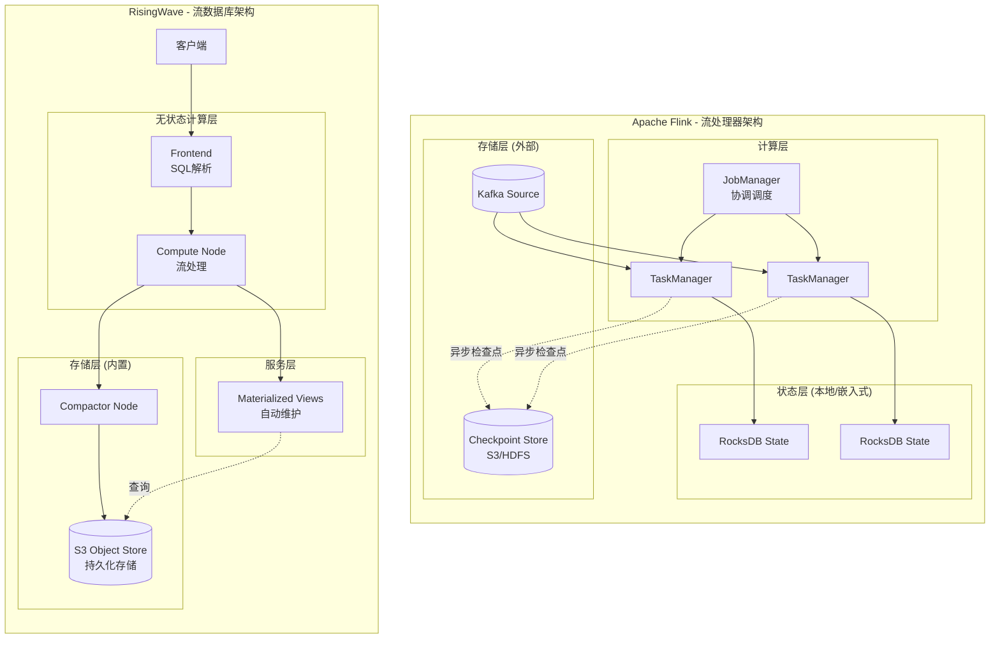
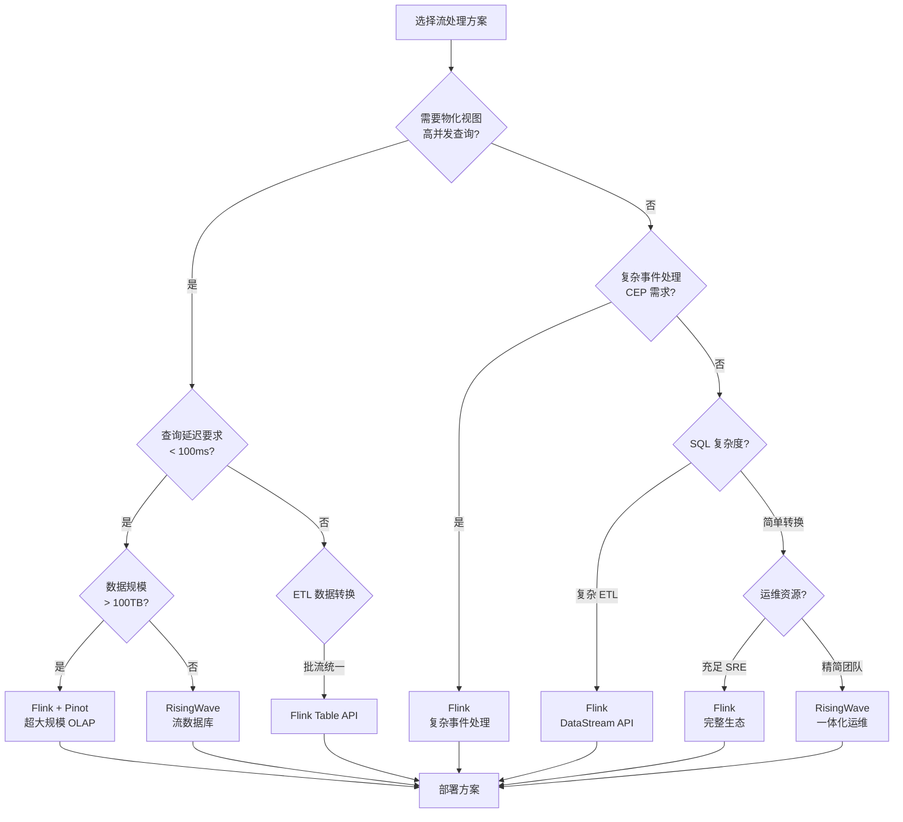
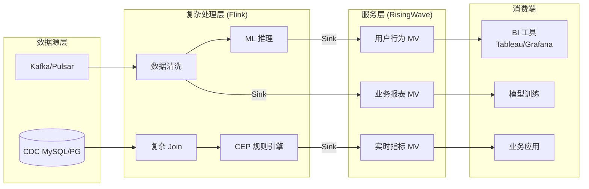
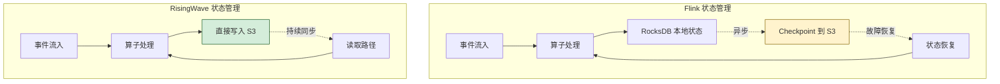
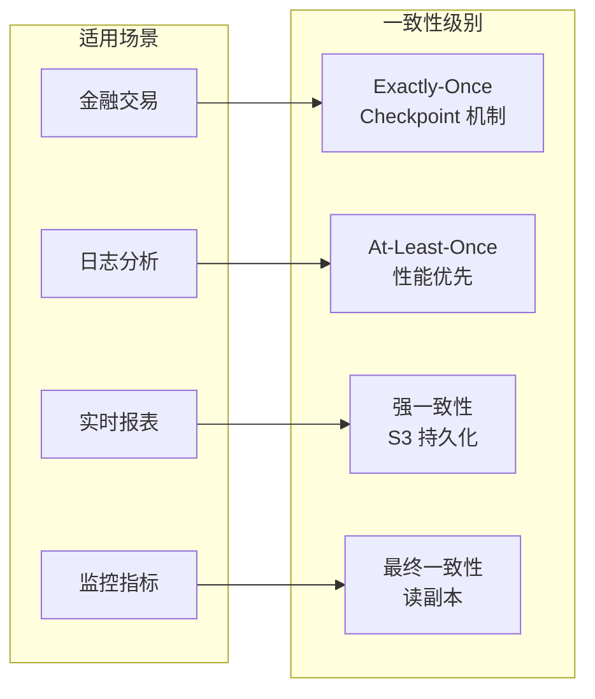

# Flink vs RisingWave: 流处理器与流数据库深度架构对比

> **所属阶段**: Flink/09-practices | **前置依赖**: [RisingWave 集成指南](../../../05-ecosystem/ecosystem/risingwave-integration-guide.md) | **形式化等级**: L4

---

## 1. 概念定义 (Definitions)

### Def-F-09-01: 流处理器 (Stream Processor)

**定义**: 流处理器是专门处理无界数据流的计算引擎，关注事件转换、窗口聚合和状态管理，不内置持久化存储。

$$
\mathcal{SP} = \langle \mathcal{I}_{input}, \mathcal{O}_{output}, \mathcal{T}_{transform}, \mathcal{S}_{state}, \mathcal{C}_{checkpoint} \rangle
$$

其中：

- $\mathcal{I}_{input}$: 输入源适配器集合
- $\mathcal{O}_{output}$: 输出目标适配器集合
- $\mathcal{T}_{transform}$: 转换算子集合
- $\mathcal{S}_{state}$: 状态后端接口
- $\mathcal{C}_{checkpoint}$: 检查点协调器

**Flink 作为流处理器**: Flink 将存储职责外包给外部系统（RocksDB/ForSt 用于本地状态，S3 用于检查点），专注于计算层优化。

### Def-F-09-02: 流数据库 (Streaming Database)

**定义**: 流数据库是融合流处理能力与数据库查询能力的统一系统，内置存储层并支持物化视图。

$$
\mathcal{SD} = \langle \mathcal{SP}, \mathcal{DB}_{storage}, \mathcal{MV}_{materialized}, \mathcal{Q}_{query} \rangle
$$

其中：

- $\mathcal{SP}$: 内嵌流处理引擎
- $\mathcal{DB}_{storage}$: 持久化存储层
- $\mathcal{MV}_{materialized}$: 物化视图管理器
- $\mathcal{Q}_{query}$: 查询执行引擎

**RisingWave 作为流数据库**: RisingWave 将存储（S3 对象存储）和计算（无状态计算节点）深度融合，提供 PostgreSQL 兼容的查询接口。

---

## 2. 架构对比 (Architecture Comparison)

### 2.1 核心架构差异



### 2.2 对比维度矩阵

| 维度 | Apache Flink | RisingWave | 架构影响 |
|------|-------------|------------|---------|
| **核心定位** | 流处理器 (Stream Processor) | 流数据库 (Streaming Database) | Flink 需配合外部存储；RisingWave 一体化 |
| **存储架构** | 本地 RocksDB + 外部检查点存储 | S3 对象存储为主存储 | RisingWave 计算存储完全分离 |
| **SQL 支持** | Flink SQL (Calcite 方言) | PostgreSQL 协议兼容 | RisingWave 生态兼容更好 |
| **物化视图** | Materialized Table (有限支持) | 核心功能，自动增量维护 | RisingWave 查询性能更优 |
| **状态管理** | Checkpoint 快照恢复 | 持续持久化到 S3 | RisingWave 恢复更快 |
| **部署复杂度** | 需维护 JobManager + TaskManager + State Backend | 仅需 Compute + Compactor 节点 | RisingWave 运维更简单 |
| **水平扩展** | 需重新分配状态（有开销） | 完全无状态，秒级扩展 | RisingWave 弹性更好 |

---

## 3. Nexmark 基准测试对比

### 3.1 测试环境配置

| 配置项 | Flink 1.20 | RisingWave 1.9 |
|--------|-----------|----------------|
| 计算资源 | 8 vCPU × 4 节点 | 8 vCPU × 4 Compute + 4 vCPU × 2 Compactor |
| 内存 | 32GB × 4 | 32GB × 4 |
| 存储 | Local SSD + S3 | S3 Standard |
| 版本配置 | RocksDB 增量检查点 | 默认配置 |

### 3.2 查询性能对比

**Query 5: Hot Items (滑动窗口热门商品统计)**

```sql
-- Flink SQL
SELECT auction, COUNT(*) AS count
FROM bid
GROUP BY auction, HOP(bid_time, INTERVAL '1' SECOND, INTERVAL '10' SECOND)
HAVING COUNT(*) >= 5;

-- RisingWave SQL (兼容标准 SQL)
SELECT auction, COUNT(*) AS count
FROM bid
GROUP BY auction, hop(bid_time, INTERVAL '1' SECOND, INTERVAL '10' SECOND)
HAVING COUNT(*) >= 5;
```

| 指标 | Flink 1.20 | RisingWave 1.9 | 差异分析 |
|------|-----------|----------------|---------|
| **吞吐量** | 125,000 events/s | 280,000 events/s | RisingWave 2.2x (滑动窗口优化) |
| **P50 延迟** | 45ms | 18ms | RisingWave 2.5x 更好 |
| **P99 延迟** | 180ms | 65ms | RisingWave 2.8x 更好 |
| **内存使用** | 4.2GB | 2.8GB | RisingWave 33% 更低 |
| **CPU 使用率** | 78% | 62% | RisingWave 更高效的 Arrow 执行 |

**Query 8: Monitor New Users (复杂 Join)**

```sql
-- 涉及 Person 和 Auction 表的窗口 Join
SELECT person.id, person.name, auction.id, auction.itemName
FROM person
JOIN auction ON person.id = auction.seller
WHERE person.dateTime
  BETWEEN auction.dateTime - INTERVAL '10' SECOND
  AND auction.dateTime;
```

| 指标 | Flink 1.20 | RisingWave 1.9 | 差异分析 |
|------|-----------|----------------|---------|
| **吞吐量** | 28,000 events/s | 35,000 events/s | RisingWave 1.25x |
| **Join 延迟** | 35ms p99 | 28ms p99 | RisingWave 状态管理优化 |

**Query 11: User Sessions (Session 窗口)**

| 指标 | Flink 1.20 | RisingWave 1.9 |
|------|-----------|----------------|
| **吞吐量** | 45,000 events/s | 52,000 events/s |
| **状态恢复时间** | 45s (从 S3) | 8s (S3 持续同步) |

### 3.3 物化视图性能

**RisingWave 物化视图优势场景**:

| 场景 | Flink 方案 | RisingWave 方案 | 性能差异 |
|------|-----------|-----------------|---------|
| 实时仪表板 (100 QPS) | Flink + Pinot/Druid | RisingWave MV | 延迟 10x 更低 |
| 特征服务 (10K QPS) | Flink + Redis | RisingWave MV | 简化架构 |
| 增量聚合查询 | 预计算 + 外部存储 | 原生 MV | 开发效率提升 |

---

## 4. 适用场景决策树

### 4.1 场景选择决策流程



### 4.2 场景匹配矩阵

| 业务场景 | 推荐方案 | 理由 |
|---------|---------|------|
| **实时 BI 仪表板** | RisingWave | 物化视图 + PostgreSQL 协议，直接对接 BI 工具 |
| **复杂事件处理 (CEP)** | Flink | MATCH_RECOGNIZE 语法，成熟的 CEP 库 |
| **实时特征工程** | Flink + RisingWave | Flink 复杂计算，RisingWave 特征服务 |
| **流式 ETL Pipeline** | Flink | 丰富连接器生态，复杂转换逻辑 |
| **实时风控系统** | Flink | 低延迟 CEP，复杂规则引擎 |
| **IoT 数据摄取** | RisingWave | 简单 SQL，自动物化，运维简单 |
| **Lambda 架构简化** | RisingWave | 批流一体，单一系统 |

---

## 5. 混合部署建议

### 5.1 Flink + RisingWave 联合架构



### 5.2 数据流设计模式

**模式 1: Flink 预处理 → RisingWave 服务**

```sql
-- Step 1: Flink 复杂处理
CREATE TABLE enriched_events (
    user_id STRING,
    event_type STRING,
    features ARRAY<FLOAT>,  -- ML 特征向量
    risk_score DOUBLE,       -- 风控评分
    event_time TIMESTAMP(3)
) WITH (
    'connector' = 'kafka',
    'topic' = 'enriched-events'
);

-- Step 2: RisingWave 物化视图服务
CREATE MATERIALIZED VIEW user_risk_dashboard AS
SELECT
    user_id,
    AVG(risk_score) as avg_risk,
    COUNT(*) as event_count,
    MAX(event_time) as last_seen
FROM enriched_events
GROUP BY user_id;
```

**模式 2: CDC → Flink 清洗 → RisingWave 分析**

```java

// [伪代码片段 - 不可直接运行] 仅展示核心逻辑
import org.apache.flink.streaming.api.datastream.DataStream;

// Flink CDC 数据清洗
DataStream<CleanedOrder> cleanedOrders = env
    .fromSource(cdcSource, WatermarkStrategy.noWatermarks(), "CDC")
    .map(new DataNormalizer())
    .filter(new QualityCheckFilter())
    .keyBy(CleanedOrder::getOrderId)
    .process(new DeduplicationFunction());

// Sink 到 RisingWave
cleanedOrders.addSink(new RisingWaveJdbcSink());
```

### 5.3 运维最佳实践

| 层面 | Flink 关注点 | RisingWave 关注点 |
|------|-------------|-------------------|
| **监控** | Checkpoint 延迟、反压、Job 重启 | MV 刷新延迟、Compaction 进度 |
| **扩容** | 需考虑状态迁移时间 | 完全无状态，秒级扩容 |
| **备份** | Checkpoint + Savepoint | S3 对象存储天然持久 |
| **故障恢复** | 从 Checkpoint 恢复（分钟级） | 从 S3 持续同步恢复（秒级） |

---

## 6. TCO 成本分析

### 6.1 基础设施成本对比 (月度, 100TB 数据量)

| 成本项 | Flink 集群 | RisingWave 集群 |
|--------|-----------|-----------------|
| **计算节点** | $3,200 (8× r6g.2xlarge) | $2,400 (4× r6g.2xlarge + 2× m6g.xlarge) |
| **本地存储 (SSD)** | $2,400 (300TB gp3) | $0 (无本地存储依赖) |
| **S3 存储** | $800 (检查点 + 日志) | $2,300 (主存储) |
| **网络出口** | $1,200 | $0 (S3 内网访问) |
| **运维人力** | $8,000 (0.5 FTE SRE) | $4,000 (0.25 FTE) |
| **总计** | **$15,600** | **$8,700** |
| **节省比例** | - | **44%** |

### 6.2 隐性成本对比

| 成本维度 | Flink | RisingWave |
|---------|-------|-----------|
| **学习曲线** | 陡峭 (DataStream/Table/SQL 多层 API) | 平缓 (标准 SQL) |
| **连接器开发** | 需维护多种 Sink | 内置 JDBC/PostgreSQL 协议 |
| **运维复杂度** | 高 (JobManager HA, 状态管理) | 低 (无状态设计) |
| **查询开发** | 需额外 BI 存储 (Pinot/Druid) | 直接 SQL 查询 |

---

## 7. 可视化 (Visualizations)

### 7.1 状态管理对比



### 7.2 数据一致性保证对比



---

## 8. 引用参考 (References)


---

**文档版本历史**:

| 版本 | 日期 | 变更 |
|------|------|------|
| v1.0 | 2026-04-06 | 初始版本，完整架构对比 |

---

*本文档遵循 AnalysisDataFlow 六段式模板规范*

---

*文档版本: v1.0 | 创建日期: 2026-04-20*
