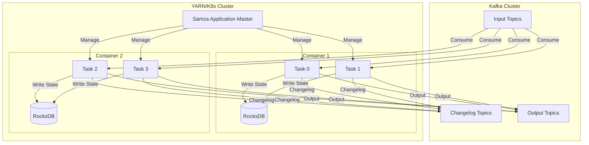
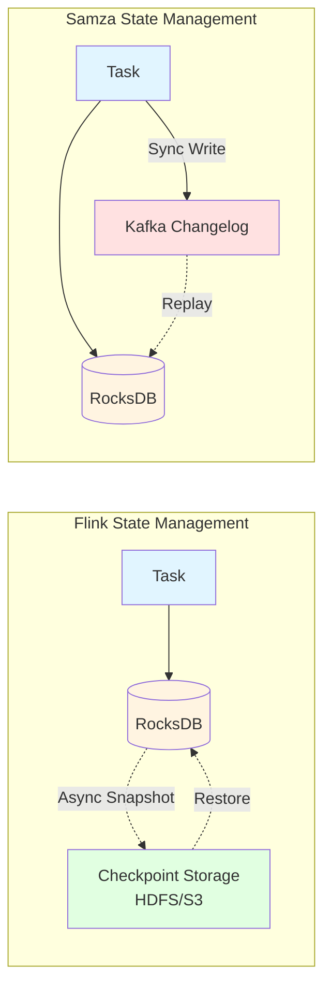
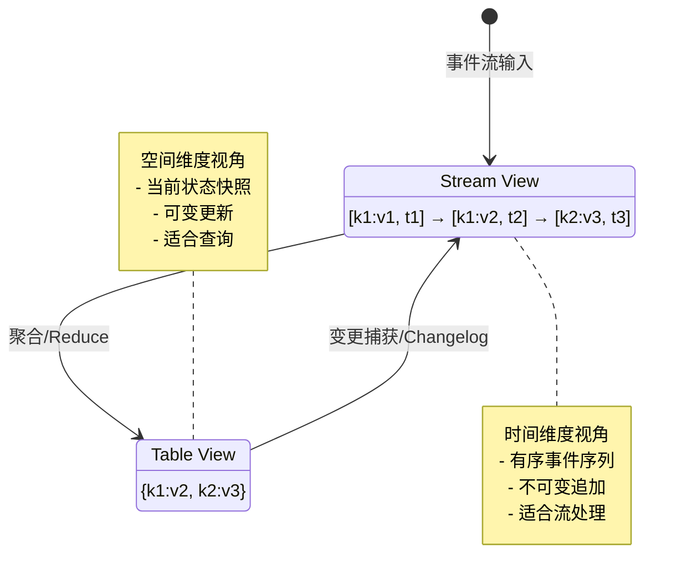

# LinkedIn Samza 深度分析

> 所属阶段: Flink/ | 前置依赖: [Flink架构详解](../../../01-concepts/deployment-architectures.md), [竞品对比](./flink-vs-spark-streaming.md) | 形式化等级: L3

## 1. 概念定义 (Definitions)

### Def-F-05-03: Samza架构模型

**Samza（Streaming Application Manager for ZooKeeper Architecture）** 是LinkedIn开源的分布式流处理框架，其架构模型由三个核心抽象层构成：

$$
\text{Samza} = \langle \text{Stream}, \text{Job}, \text{Container} \rangle
$$

其中：

| 组件 | 定义 | 职责 |
|------|------|------|
| **Stream** | 分区、有序、不可变、可重放的消息序列 | 数据抽象，通常由Kafka提供 |
| **Job** | 用户逻辑的执行单元，包含输入/输出流和任务逻辑 | 计算抽象 |
| **Container** | 进程级资源分配单元，承载多个任务(Task) | 资源抽象 |

Samza采用**单层处理模型**（Single-layer Processing Model）：

```
┌─────────────────────────────────────────────┐
│              Samza Application              │
├─────────────────────────────────────────────┤
│  Task 0  │  Task 1  │  ...  │  Task N-1    │  ← 线程级并行
├─────────────────────────────────────────────┤
│         Samza Container (JVM进程)           │
├─────────────────────────────────────────────┤
│    Kafka Consumer    │    RocksDB State     │
└─────────────────────────────────────────────┘
```

**关键特性**：Samza不实现自己的流存储，而是完全依赖Kafka作为消息队列和持久化层。

---

### Def-F-05-04: 本地状态与Kafka日志

Samza的状态管理采用**本地状态+远程日志**的混合架构：

**Def-F-05-04-a: 状态存储层级**

$$
\text{State}_{\text{Samza}} = \langle \text{LocalStore}, \text{Changelog}, \text{Snapshot} \rangle
$$

1. **LocalStore（本地存储）**：嵌入式的RocksDB实例，提供低延迟的键值访问
2. **Changelog（变更日志）**：每条状态变更写入Kafka changelog topic，实现持久化
3. **Snapshot（快照）**：定期将RocksDB状态备份到HDFS/S3等远程存储

**Def-F-05-04-b: 流表对偶性 (Stream-Table Duality)**

Samza支持将流(Stream)和表(Table)视为同一抽象的两种视图：

```
Stream View:  [event1] → [event2] → [event3] → ...  (时间序列)
                ↓         ↓         ↓
Table View:   {k1:v1}   {k2:v2}   {k3:v3}  ...  (当前状态)
```

形式化表述：

- **表转流**：表的变更操作（INSERT/UPDATE/DELETE）产生变更流(Changelog Stream)
- **流转表**：流通过按key聚合得到当前状态，即表视图

---

### Def-F-05-05: YARN与Kubernetes部署

Samza支持两种资源管理器的部署模式：

**Def-F-05-05-a: YARN部署模式**

```
┌──────────────────────────────────────────────────────────┐
│                        YARN RM                           │
├──────────────────────────────────────────────────────────┤
│  ┌─────────────┐  ┌─────────────┐  ┌─────────────────┐  │
│  │  NM Node 1  │  │  NM Node 2  │  │   NM Node N     │  │
│  │ ┌─────────┐ │  │ ┌─────────┐ │  │ ┌─────────────┐ │  │
│  │ │Samza AM │ │  │ │Container│ │  │ │  Container  │ │  │
│  │ │(Job管理)│ │  │ │ Task 0,1│ │  │ │ Task N-2,N-1│ │  │
│  │ └─────────┘ │  │ └─────────┘ │  │ └─────────────┘ │  │
│  │  Kafka +    │  │  Kafka +    │  │   Kafka +       │  │
│  │  RocksDB    │  │  RocksDB    │  │   RocksDB       │  │
│  └─────────────┘  └─────────────┘  └─────────────────┘  │
└──────────────────────────────────────────────────────────┘
```

**Def-F-05-05-b: Kubernetes部署模式（Samza 1.5+）**

```yaml
apiVersion: samza.apache.org/v1
kind: SamzaJob
metadata:
  name: stream-processing-job
spec:
  jobCoordinator:
    replicas: 1
  containers:
    replicas: 3
    resources:
      memory: "4Gi"
      cpu: "2"
  stores:
    - name: local-store
      type: rocksdb
      changelog: input-topic-changelog
```

**部署对比**：

| 维度 | YARN模式 | Kubernetes模式 |
|------|----------|----------------|
| 适用场景 | 传统Hadoop生态 | 云原生环境 |
| 资源调度 | YARN Scheduler | K8s Scheduler |
| 服务发现 | ZooKeeper | K8s DNS/Headless Service |
| 配置管理 | Hadoop配置 | ConfigMap/Secret |
| 版本支持 | 完整成熟 | 1.5+实验性支持 |

## 2. 属性推导 (Properties)

### Lemma-F-05-01: 状态持久化延迟特性

Samza的本地状态+changelog架构导致以下特性：

$$
\text{WriteLatency}_{\text{Samza}} = \max(\text{RocksDB}_{write}, \text{Kafka}_{produce})
$$

由于状态变更必须同步写入Kafka changelog，写延迟受Kafka produce延迟制约。

**推论**：Samza的本地状态访问虽然读延迟低（微秒级），但写路径存在额外开销。

---

### Lemma-F-05-02: 故障恢复时间下界

Samza任务重启时，状态恢复需要从Kafka changelog replay：

$$
T_{recovery} \geq \frac{|\text{State}|}{\text{KafkaThroughput}} + T_{RocksDB\_restore}
$$

其中 $|\text{State}|$ 是待恢复的状态大小。

**推论**：状态规模与恢复时间呈线性关系，大状态恢复可能成为瓶颈。

---

### Prop-F-05-01: Exactly-Once语义实现

Samza通过Kafka事务API实现端到端的Exactly-Once：

1. **生产者事务**：Kafka Producer事务保证输出写入的原子性
2. **消费者位置提交**：将offset与输出一起作为事务提交
3. **幂等处理**：通过事务ID实现重复检测

$$
\text{Samza-Exactly-Once} = \text{Kafka-Transactions} + \text{Transactional-Offset-Commit}
$$

**限制**：仅当输入输出均为Kafka时，Exactly-Once语义才能完全保证。

## 3. 关系建立 (Relations)

### 与Flink架构对比

**层次结构映射**：

```
Flink:           Samza:
┌─────────┐      ┌─────────┐
│ JobGraph│      │ Job     │
├─────────┤      ├─────────┤
│ Task    │  ↔   │ Task    │
├─────────┤      ├─────────┤
│ Subtask │      │ (无对应) │
├─────────┤      ├─────────┤
│ Slot    │  ↔   │Container│
├─────────┤      ├─────────┤
│ TM/JM   │      │ AM/Container│
└─────────┘      └─────────┘
```

### 状态管理对比矩阵

| 特性 | Flink | Samza |
|------|-------|-------|
| **状态后端** | RocksDB/Heap/JM | RocksDB(嵌入) |
| **状态位置** | 本地+Checkpoint | 本地+Changelog |
| **快照机制** | 异步增量Checkpoint | Kafka changelog重放 |
| **快照存储** | 分布式存储(HDFS/S3) | Kafka topic |
| **状态共享** | Queryable State | 不支持 |
| **状态TTL** | 原生支持 | 应用层实现 |

### 容错机制对比

| 机制 | Flink | Samza |
|------|-------|-------|
| **故障检测** | JM心跳超时 | AM心跳+ZooKeeper |
| **状态恢复** | 从Checkpoint恢复 | 从changelog replay |
| **恢复粒度** | 整个Job/Region | 单个Container |
| **恢复时间** | $O(1)$（取决于快照大小） | $O(n)$（取决于changelog长度） |
| **语义保证** | Checkpoint barrier对齐 | Kafka事务 |

## 4. 论证过程 (Argumentation)

### 延迟与吞吐权衡分析

**Samza设计哲学**：优化处理延迟，牺牲部分恢复性能

```
设计权衡空间:
                    高吞吐
                      ↑
                      │
    Flink ────────────┼─────────────► (平衡型)
                      │
                      │     Samza (延迟优化型)
                      │
                      ↓
                    低延迟
```

**延迟分析**：

Samza的处理延迟优势来源于：

1. **无序列化开销**：状态在本地RocksDB，无需网络传输
2. **无barrier对齐**：无Checkpoint barrier引入的处理暂停
3. **直接Kafka消费**：原生Kafka Consumer优化，无额外封装层

**吞吐分析**：

Samza的吞吐限制因素：

1. **双写开销**：每条记录需写入输出topic和changelog topic
2. **无批量优化**：相比Flink的Mini-batch，单条处理开销相对更高
3. **事务开销**：Exactly-Once模式下，事务协调增加延迟

### 边界条件讨论

**场景1：小状态 + 高吞吐**

- Samza优势：低延迟处理，快速响应
- Flink优势：Checkpoint机制更成熟，恢复更快

**场景2：大状态 + 复杂计算**

- Samza劣势：changelog replay时间随状态规模线性增长
- Flink优势：增量Checkpoint，恢复时间与状态变更率相关而非总状态大小

**场景3：Kafka-only生态**

- Samza优势：与Kafka深度集成，配置简单
- Flink优势：生态更开放，支持多种source/sink

## 5. 工程论证 (Engineering Argument)

### 状态管理架构工程对比

**Flink的嵌入式RocksDB vs Samza的嵌入式RocksDB**：

虽然两者都使用RocksDB作为状态后端，但架构决策差异显著：

| 决策点 | Flink | Samza |
|--------|-------|-------|
| **状态所有权** | TaskManager持有 | Container持有 |
| **持久化策略** | 异步Checkpoint到远程存储 | 同步写入Kafka changelog |
| **状态迁移** | 支持任务重分配后的状态迁移 | 依赖changelog重放重建 |
| **多任务状态** | 单个TM可服务多个subtask | 每个Container独立状态 |

**工程论证**：

1. **可靠性论证**：
   - Flink：双副本（本地+远程Checkpoint），本地失效可从远程恢复
   - Samza：单副本逻辑（Kafka changelog），RocksDB仅为缓存

2. **一致性论证**：
   - Flink：Checkpoint barrier保证快照一致性
   - Samza：依赖Kafka的offset管理和事务保证

3. **可运维性论证**：
   - Flink：Checkpoint监控、回溯、增量清理完整
   - Samza：依赖Kafka监控工具，状态管理透明度较低

### 迁移策略：Samza to Flink

**迁移场景识别**：

| 场景 | 迁移必要性 | 复杂度 |
|------|------------|--------|
| 状态规模 > 100GB | 高（恢复时间过长） | 中 |
| 需要SQL/Table API | 高（Samza无原生支持） | 低 |
| 需要CEP | 高（Samza无模式匹配） | 中 |
| Kafka-only生态 | 低 | - |
| 团队熟悉Java Stream API | 低 | - |

**迁移策略矩阵**：

```
┌────────────────────────────────────────────────────────────┐
│                    迁移策略决策树                           │
├────────────────────────────────────────────────────────────┤
│                                                            │
│  1. 是否有复杂状态管理?                                    │
│     ├─ 是 → 使用Flink State API重写状态逻辑                │
│     └─ 否 → 进入步骤2                                      │
│                                                            │
│  2. 是否有时间窗口计算?                                    │
│     ├─ 是 → 迁移到Flink Window API                        │
│     └─ 否 → 进入步骤3                                      │
│                                                            │
│  3. 是否需要Exactly-Once?                                  │
│     ├─ 是 → 启用Flink Checkpoint + 两阶段提交              │
│     └─ 否 → At-Least-Once即可                              │
│                                                            │
│  4. 部署环境?                                              │
│     ├─ K8s → Flink Native K8s部署                         │
│     └─ YARN → Flink on YARN                               │
│                                                            │
└────────────────────────────────────────────────────────────┘
```

**代码迁移示例**：

```java
// Samza 代码
class WordCountTask implements StreamTask {
    @Override
    public void process(IncomingMessageEnvelope envelope,
                       MessageCollector collector,
                       TaskCoordinator coordinator) {
        String word = (String) envelope.getMessage();
        KeyValueStore<String, Integer> store =
            (KeyValueStore<String, Integer>) context.getStore("word-count");

        int count = store.getOrDefault(word, 0) + 1;
        store.put(word, count);
        collector.send(new OutgoingMessageEnvelope(outputStream, word, count));
    }
}

// Flink 等价代码
DataStream<Tuple2<String, Integer>> wordCounts =
    input
        .keyBy(value -> value.f0)
        .process(new KeyedProcessFunction<String, String, Tuple2<String, Integer>>() {
            private ValueState<Integer> countState;

            @Override
            public void open(Configuration parameters) {
                countState = getRuntimeContext().getState(
                    new ValueStateDescriptor<>("count", Types.INT));
            }

            @Override
            public void processElement(String word, Context ctx,
                                     Collector<Tuple2<String, Integer>> out) throws Exception {
                Integer current = countState.value();
                if (current == null) current = 0;
                current++;
                countState.update(current);
                out.collect(new Tuple2<>(word, current));
            }
        });
```

## 6. 实例验证 (Examples)

### 示例1：LinkedIn会员活跃度实时监控

**场景**：统计每分钟内每个会员的页面浏览事件数

**Samza实现**：

```java
public class MemberActivityTask implements WindowTask {
    @Override
    public void processWindow(MessageCollector collector,
                             TaskCoordinator coordinator,
                             IncomingMessageEnvelope envelope,
                             TimerCallback callback) {
        MemberEvent event = (MemberEvent) envelope.getMessage();
        String memberId = event.getMemberId();
        long minute = event.getTimestamp() / 60000;

        KeyValueStore<String, Integer> store =
            (KeyValueStore<String, Integer>) context.getStore("activity-count");

        String key = memberId + ":" + minute;
        int count = store.getOrDefault(key, 0) + 1;
        store.put(key, count);

        // 输出到下游Kafka topic
        collector.send(new OutgoingMessageEnvelope(
            outputStream, memberId, new MemberActivity(memberId, minute, count)));
    }
}
```

**Flink等价实现**：

```java
DataStream<MemberActivity> activityStream = events
    .keyBy(MemberEvent::getMemberId)
    .window(TumblingEventTimeWindows.of(Time.minutes(1)))
    .aggregate(new CountAggregate())
    .addSink(new KafkaSink<>("member-activity-output"));
```

### 示例2：流表Join（会员信息与活动关联）

**Samza的流表对偶性应用**：

```java
// 将会员信息作为"表"存储在RocksDB
KeyValueStore<String, MemberProfile> profileStore =
    (KeyValueStore<String, MemberProfile>) context.getStore("member-profile");

// 流处理：关联活动事件与会员资料
public void processActivity(MemberEvent event, MessageCollector collector) {
    MemberProfile profile = profileStore.get(event.getMemberId());
    if (profile != null) {
        EnrichedEvent enriched = new EnrichedEvent(event, profile);
        collector.send(new OutgoingMessageEnvelope(enrichedStream, enriched));
    }
}
```

**Flink等价实现（使用Temporal Table Join）**：

```java
Table memberProfile = tableEnv.fromDataStream(profileStream)
    .createTemporalTableFunction("updateTime", "memberId");

Table result = tableEnv.sqlQuery(
    "SELECT a.*, p.* " +
    "FROM activity AS a " +
    "LEFT JOIN LATERAL TABLE(memberProfile(a.eventTime)) AS p " +
    "ON a.memberId = p.memberId"
);
```

## 7. 可视化 (Visualizations)

### Samza整体架构图

Samza的各组件协作关系如下：



### Samza vs Flink 对比决策树

技术选型时的决策流程：

```mermaid
flowchart TD
    Start([技术选型]) --> Q1{是否纯Kafka生态?}
    Q1 -->|是| Q2{状态规模?}
    Q1 -->|否| Flink1[选择Flink]

    Q2 -->|< 10GB| Q3{是否需要复杂窗口/CEP?}
    Q2 -->|>= 10GB| Q4{恢复时间要求?}

    Q3 -->|是| Flink2[选择Flink]
    Q3 -->|否| Samza1[选择Samza]

    Q4 -->|< 30秒| Flink3[选择Flink]
    Q4 -->|>= 30秒| Q5{团队熟悉度?}

    Q5 -->|熟悉Samza| Samza2[选择Samza]
    Q5 -->|熟悉Flink| Flink4[选择Flink]
    Q5 -->|无偏好| Flink5[选择Flink<br/>生态更丰富]

    Flink1 --> End1([Flink部署])
    Flink2 --> End1
    Flink3 --> End1
    Flink4 --> End1
    Flink5 --> End1
    Samza1 --> End2([Samza部署])
    Samza2 --> End2
```



### 状态管理架构对比



### 流表对偶性可视化



## 8. 引用参考 (References)


---

*文档版本: 1.0 | 最后更新: 2026-04-02 | 维护者: AnalysisDataFlow Project*
