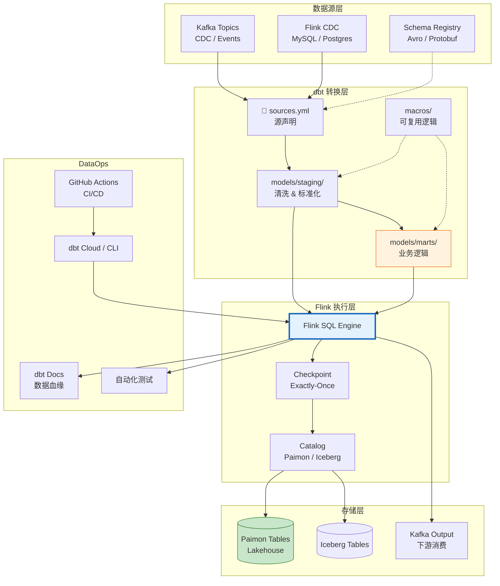
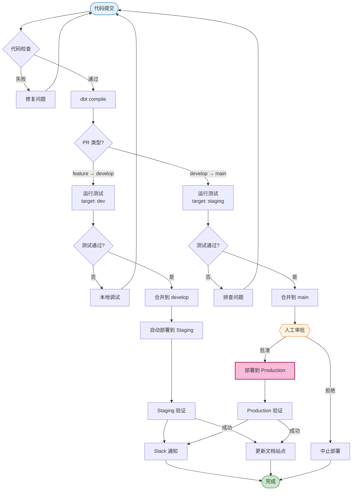
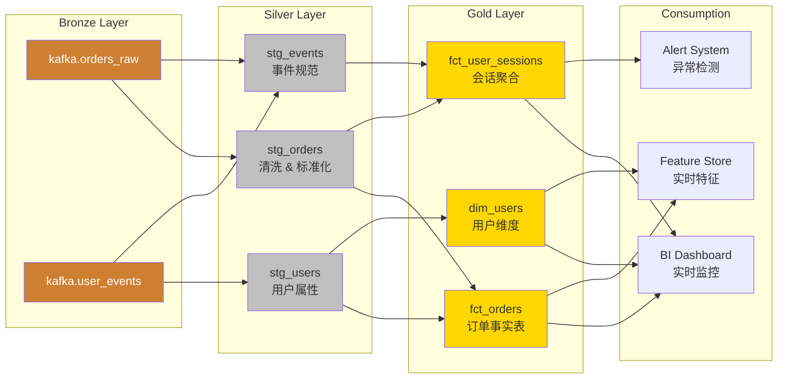

# Flink 与 dbt 集成: 流式数据转换的工程实践

> **所属阶段**: Flink/06-engineering | **前置依赖**: [Flink SQL 深度解析](Flink/03-api/03.02-table-sql-api/flink-sql-calcite-optimizer-deep-dive.md), [Flink-Paimon 集成](Flink/05-ecosystem/05.01-connectors/flink-paimon-integration.md) | **形式化等级**: L4

---

## 目录

- [Flink 与 dbt 集成: 流式数据转换的工程实践](#flink-与-dbt-集成-流式数据转换的工程实践)
  - [目录](#目录)
  - [1. 概念定义 (Definitions)](#1-概念定义-definitions)
    - [Def-F-06-20 (dbt 核心抽象)](#def-f-06-20-dbt-核心抽象)
    - [Def-F-06-21 (流式 dbt 模型)](#def-f-06-21-流式-dbt-模型)
    - [Def-F-06-22 (物化策略语义)](#def-f-06-22-物化策略语义)
    - [Def-F-06-23 (dbt-Confluent 适配器架构)](#def-f-06-23-dbt-confluent-适配器架构)
    - [Def-F-06-24 (增量物化模式)](#def-f-06-24-增量物化模式)
  - [2. 属性推导 (Properties)](#2-属性推导-properties)
    - [Lemma-F-06-20 (物化策略的延迟边界)](#lemma-f-06-20-物化策略的延迟边界)
    - [Lemma-F-06-21 (流式模型幂等性条件)](#lemma-f-06-21-流式模型幂等性条件)
    - [Prop-F-06-20 (dbt 构建性能与 Flink 资源关系)](#prop-f-06-20-dbt-构建性能与-flink-资源关系)
  - [3. 关系建立 (Relations)](#3-关系建立-relations)
    - [关系 1: dbt 与 Flink SQL 的语义映射](#关系-1-dbt-与-flink-sql-的语义映射)
    - [关系 2: dbt 在 DataOps 工作流中的位置](#关系-2-dbt-在-dataops-工作流中的位置)
    - [关系 3: 流式 dbt 与批处理 dbt 的差异](#关系-3-流式-dbt-与批处理-dbt-的差异)
  - [4. 论证过程 (Argumentation)](#4-论证过程-argumentation)
    - [4.1 dbt 在流计算中的价值论证](#41-dbt-在流计算中的价值论证)
    - [4.2 流式物化的一致性边界](#42-流式物化的一致性边界)
    - [4.3 测试策略在流环境中的适配](#43-测试策略在流环境中的适配)
  - [5. 工程论证 (Engineering Argument)](#5-工程论证-engineering-argument)
    - [Thm-F-06-20 (dbt-Flink 集成 ROI 定理)](#thm-f-06-20-dbt-flink-集成-roi-定理)
    - [Thm-F-06-21 (流式模型幂等性保证定理)](#thm-f-06-21-流式模型幂等性保证定理)
  - [6. 实例验证 (Examples)](#6-实例验证-examples)
    - [6.1 完整 dbt + Flink 项目结构](#61-完整-dbt--flink-项目结构)
    - [6.2 流式电商实时分析模型](#62-流式电商实时分析模型)
    - [6.3 profiles.yml 多环境配置](#63-profilesyml-多环境配置)
    - [6.4 GitHub Actions CI/CD 工作流](#64-github-actions-cicd-工作流)
  - [7. 可视化 (Visualizations)](#7-可视化-visualizations)
    - [dbt-Flink 集成架构图](#dbt-flink-集成架构图)
    - [CI/CD 流水线流程图](#cicd-流水线流程图)
    - [数据血缘追踪图](#数据血缘追踪图)
  - [8. 引用参考 (References)](#8-引用参考-references)

---

## 1. 概念定义 (Definitions)

### Def-F-06-20 (dbt 核心抽象)

**dbt (data build tool)** 是一个数据转换工作流框架，通过 SQL 和 Jinja 模板实现数据管道的声明式定义。其核心抽象定义为四元组：

$$
\text{dbt} = (\mathcal{M}, \mathcal{S}, \mathcal{T}, \mathcal{D})
$$

| 组件 | 符号 | 语义 | Flink 映射 |
|------|------|------|-----------|
| **模型** | $\mathcal{M}$ | 数据转换逻辑单元 | Flink SQL CREATE TABLE/VIEW |
| **数据源** | $\mathcal{S}$ | 外部数据引用声明 | Flink Connector (Kafka, Paimon, etc.) |
| **测试** | $\mathcal{T}$ | 数据质量约束 | Flink SQL assertions + dbt tests |
| **文档** | $\mathcal{D}$ | 元数据与血缘描述 | Flink Catalog + dbt docs |

**dbt 执行语义**：对于模型集合 $\mathcal{M} = \{M_1, M_2, ..., M_n\}$，dbt 构建生成有向无环图 $G = (V, E)$，其中：

- $V = \mathcal{M} \cup \mathcal{S}$ (模型和数据源作为节点)
- $E = \{(M_i, M_j) : M_j \text{ 引用 } M_i\}$ (引用关系作为边)
- 构建顺序为 $G$ 的拓扑排序 $\pi$

---

### Def-F-06-21 (流式 dbt 模型)

**流式 dbt 模型** 是针对实时数据流的特殊模型类型，形式化定义为：

$$
M_{\text{stream}} = (Q_{\text{FlinkSQL}}, \mathcal{P}_{\text{mat}}, \mathcal{W}, \mathcal{K})
$$

其中：

| 组件 | 说明 | 示例 |
|------|------|------|
| $Q_{\text{FlinkSQL}}$ | Flink SQL 查询语句 | `SELECT ... FROM KafkaTable` |
| $\mathcal{P}_{\text{mat}}$ | 物化配置 | `materialized='table'`, `incremental_strategy='append'` |
| $\mathcal{W}$ | 窗口规格 | `TUMBLE(event_time, INTERVAL '1' HOUR)` |
| $\mathcal{K}$ | 主键/更新键 | `PRIMARY KEY (user_id) NOT ENFORCED` |

**流式模型物化类型** (Confluent Cloud dbt 适配器 2026.03 支持)：

| 物化类型 | 语义 | 适用场景 | Flink 底层实现 |
|----------|------|----------|----------------|
| `view` | 逻辑视图，无状态 | 轻量级转换，低延迟查询 | `CREATE VIEW` |
| `table` | 物化表，全量刷新 | 小维度表，低频更新 | `CREATE TABLE` + `INSERT OVERWRITE` |
| `incremental` | 增量更新 | 大事实表，append-only 流 | `INSERT INTO` with partition filter |
| `ephemeral` | 内联 CTE | 中间计算，不持久化 | 查询展开 |
| `streaming_table` | 持续流式物化 | 实时分析，持续更新 | Flink Continuous SQL Query |

---

### Def-F-06-22 (物化策略语义)

**物化策略** 定义模型结果如何持久化到存储层。对于流式 dbt，策略选择影响一致性保证和资源消耗：

**增量物化策略对比**：

| 策略 | 形式化定义 | 一致性级别 | 资源开销 | 延迟 |
|------|-----------|-----------|----------|------|
| `append` | $\Delta M = Q(S_{\text{new}})$ | At-Least-Once | 低 | 低 |
| `merge` | $M_{t+1} = M_t \oplus \Delta M$ | Exactly-Once | 中 | 中 |
| `insert_overwrite` | $M_{\text{partition}} = Q(S_{\text{partition}})$ | Exactly-Once | 高 | 高 |
| `micro_batch` | $M_{t+1} = \bigcup_{i \in [t, t+\delta]} Q(S_i)$ | Exactly-Once | 可调 | 可调 |

其中 $\oplus$ 表示幂等合并操作，定义为：

$$
M_t \oplus \Delta M = \begin{cases}
\text{UPSERT}(M_t, \Delta M) & \text{if } \exists \text{ unique key} \\
M_t \cup \Delta M & \text{otherwise (append)}
\end{cases}
$$

---

### Def-F-06-23 (dbt-Confluent 适配器架构)

**dbt-confluent 适配器** 是连接 dbt 与 Confluent Cloud Flink 的桥梁，架构定义为：

$$
\text{Adapter} = (L_{\text{conn}}, T_{\text{sql}}, E_{\text{exec}}, C_{\text{catalog}})
$$

| 组件 | 功能 | 技术实现 |
|------|------|----------|
| $L_{\text{conn}}$ | 连接管理层 | Confluent Cloud REST API + Service Account |
| $T_{\text{sql}}$ | SQL 转换层 | dbt Jinja → Flink SQL DDL/DML |
| $E_{\text{exec}}$ | 执行引擎 | Flink SQL Gateway / Table API |
| $C_{\text{catalog}}$ | 元数据目录 | Confluent Cloud Catalog / Hive Metastore |

**适配器连接配置** (`profiles.yml`)：

```yaml
confluent_cloud:
  target: dev
  outputs:
    dev:
      type: confluent
      account_id: "{{ env_var('CONFLUENT_ACCOUNT_ID') }}"
      environment_id: "{{ env_var('CONFLUENT_ENV_ID') }}"
      cluster_id: "{{ env_var('CONFLUENT_CLUSTER_ID') }}"
      api_key: "{{ env_var('CONFLUENT_API_KEY') }}"
      api_secret: "{{ env_var('CONFLUENT_API_SECRET') }}"
      database: "flink_catalog"
      schema: "default"
      region: "us-east-1"
      compute_pool_id: "{{ env_var('CONFLUENT_COMPUTE_POOL_ID') }}"
```

---

### Def-F-06-24 (增量物化模式)

**增量物化** 是流式 dbt 的核心模式，定义为目标表 $T$ 与源变更流 $\Delta S$ 的增量计算：

$$
T(t+1) = f(T(t), \Delta S[t, t+1])
$$

**增量策略的 Flink 实现**：

| 策略 | Flink SQL 模式 | 适用条件 |
|------|----------------|----------|
| `append` | `INSERT INTO target SELECT * FROM source WHERE event_time > {{ max_event_time }}` | Append-only 源 |
| `merge` | `INSERT INTO target VALUES ... ON DUPLICATE KEY UPDATE ...` | 带主键的更新流 |
| `delete+insert` | `DELETE FROM target WHERE key IN (SELECT key FROM delta); INSERT INTO target SELECT * FROM delta` | CDC 场景 |

**dbt 增量模型宏示例**：

```jinja

  
    WHERE {{ timestamp_col }} > (SELECT MAX({{ timestamp_col }}) FROM {{ this }})
  

```

---

## 2. 属性推导 (Properties)

### Lemma-F-06-20 (物化策略的延迟边界)

**陈述**: 不同物化策略引入的端到端延迟存在理论边界。

**形式化**: 设 $L_{\text{source}}$ 为源数据产生延迟，$L_{\text{proc}}$ 为处理延迟，$L_{\text{mat}}$ 为物化延迟，则总延迟：

$$
L_{\text{total}} = L_{\text{source}} + L_{\text{proc}} + L_{\text{mat}}(strategy)
$$

其中物化策略延迟：

| 策略 | $L_{\text{mat}}$ | 推导 |
|------|------------------|------|
| `view` | $O(1)$ | 纯逻辑层，无持久化 |
| `streaming_table` | $O(\text{checkpoint_interval})$ | 依赖 Flink Checkpoint |
| `incremental(append)` | $O(\text{micro_batch_interval})$ | 微批调度开销 |
| `incremental(merge)` | $O(\text{lookup_latency})$ | 需查询目标表主键 |
| `table` | $O(|S|)$ | 全量扫描，与数据量线性相关 |

**证明**:

- `view`: 查询时即时计算，延迟为查询解析时间
- `streaming_table`: Flink Checkpoint 周期决定持久化延迟
- `incremental`: 调度器轮询间隔决定，典型 1-10 秒
- `table`: 批处理模式，$O(n)$ 扫描复杂度 ∎

---

### Lemma-F-06-21 (流式模型幂等性条件)

**陈述**: 流式 dbt 模型在故障恢复时保持输出一致性的充要条件是满足幂等性。

**形式化**: 设模型 $M$ 的输入为流 $S$，输出为表 $T$，执行算子为 $\mathcal{F}_M$。$M$ 是幂等的当且仅当：

$$
\forall t_1, t_2 : \mathcal{F}_M(S[0, t_1]) \bowtie \mathcal{F}_M(S[t_1, t_2]) = \mathcal{F}_M(S[0, t_2])
$$

其中 $\bowtie$ 表示结果合并操作。

**幂等性保证条件**：

| 条件 | 说明 | dbt 配置 |
|------|------|----------|
| 主键唯一性 | 目标表存在唯一键 | `unique_key` 配置 |
| UPSERT 语义 | 重复键值执行更新而非插入 | `incremental_strategy='merge'` |
| 确定性处理 | 相同输入产生相同输出 | 避免 `NOW()` 等非确定性函数 |
| 恰好一次 Sink | Flink Exactly-Once 语义 | `execution.checkpointing.mode=exactly-once` |

---

### Prop-F-06-20 (dbt 构建性能与 Flink 资源关系)

**陈述**: dbt 流式模型构建的吞吐量与 Flink 资源配置满足亚线性关系。

**形式化**: 设 $R$ 为 Flink 资源 (计算单元数)，$\lambda$ 为源吞吐 (records/s)，$T_{\text{build}}$ 为 dbt 构建时间：

$$
T_{\text{build}}(R, \lambda) = \frac{\lambda \cdot V_{\text{record}} \cdot N_{\text{ops}}}{R \cdot C_{\text{unit}}} + T_{\text{overhead}}
$$

其中：

- $V_{\text{record}}$: 单记录处理计算量
- $N_{\text{ops}}$: SQL 算子数量
- $C_{\text{unit}}$: 单计算单元处理能力
- $T_{\text{overhead}}$: 固定开销 (解析、优化、调度)

**资源缩放边界**：

```
吞吐量 ↑
     │
     │      ╭────── 理论上限
     │     ╱
     │    ╱   ┌────────┐
     │   ╱    │ 最优区  │
     │  ╱     └────────┘
     │ ╱
     │╱
     └──────────────────→ 资源 (CCU/KPU)
        低              高
```

**最优资源配置**：$R^* = \arg\min_R (C_{\text{compute}} \cdot R + C_{\text{delay}} \cdot T_{\text{build}}(R))$

---

## 3. 关系建立 (Relations)

### 关系 1: dbt 与 Flink SQL 的语义映射

**映射矩阵**：

| dbt 概念 | Flink SQL 等价 | 语义说明 |
|----------|----------------|----------|
| `{{ source('raw', 'events') }}` | `CREATE TABLE raw.events (...)` | 外部表声明 |
| `{{ ref('stg_users') }}` | `stg_users` CTE / 视图引用 | 模型依赖引用 |
| `{{ config(materialized='table') }}` | `CREATE TABLE result AS SELECT ...` | 物化表 |
| `{{ config(materialized='view') }}` | `CREATE VIEW result AS SELECT ...` | 逻辑视图 |
| `{{ config(materialized='incremental') }}` | `INSERT INTO result SELECT ... WHERE ...` | 增量插入 |
| `{{ this }}` | 当前模型目标表名 | 自引用 |

**Jinja 到 Flink SQL 的转换示例**：

```jinja
-- dbt 模型: models/marts/fct_orders.sql
{{ config(
    materialized='incremental',
    unique_key='order_id',
    incremental_strategy='merge'
) }}

SELECT
    order_id,
    user_id,
    order_amount,
    created_at
FROM {{ source('raw', 'orders') }}

WHERE created_at > (SELECT MAX(created_at) FROM {{ this }})

```

```sql
-- 生成的 Flink SQL (简化)
CREATE TABLE fct_orders (
    order_id STRING PRIMARY KEY NOT ENFORCED,
    user_id STRING,
    order_amount DECIMAL(10,2),
    created_at TIMESTAMP(3)
);

INSERT INTO fct_orders
SELECT order_id, user_id, order_amount, created_at
FROM raw.orders
WHERE created_at > (SELECT MAX(created_at) FROM fct_orders);
```

---

### 关系 2: dbt 在 DataOps 工作流中的位置

**DataOps 生命周期中的 dbt**：

```
┌─────────────────────────────────────────────────────────────────┐
│                      DataOps Pipeline                           │
├─────────────────────────────────────────────────────────────────┤
│                                                                 │
│  [Ingestion] ──→ [Storage] ──→ [Transform] ──→ [Serve]        │
│       │              │              │              │            │
│       ▼              ▼              ▼              ▼            │
│   Kafka/Kinesis   Paimon/Iceberg   dbt + Flink   BI/ML         │
│   CDC Connectors  Lakehouse        Stream SQL    Applications   │
│                                                                 │
│  ─────────────────────────────────────────────────────────────  │
│                         dbt 责任域                              │
│                    (声明式转换 + 测试 + 文档)                     │
└─────────────────────────────────────────────────────────────────┘
```

**dbt 与其他组件的集成点**：

| 上游 | 集成方式 | 下游 | 集成方式 |
|------|----------|------|----------|
| Kafka Connect | `source` 声明 | Paimon Table | `materialized='table'` |
| Flink CDC | `source` + CDC 格式 | Iceberg Table | `materialized='table'` |
| Schema Registry | `columns` 类型推断 | BI 工具 | `exposures` 声明 |
| Data Catalog | `sources` 自动发现 | Feature Store | `materialized='streaming_table'` |

---

### 关系 3: 流式 dbt 与批处理 dbt 的差异

**维度对比**：

| 维度 | 批处理 dbt (传统) | 流式 dbt (Flink) |
|------|------------------|------------------|
| **执行模式** | 定时触发 (cron) | 持续运行 (continuous) |
| **数据粒度** | 全量/分区 | 事件级/微批 |
| **延迟** | 分钟-小时级 | 秒-分钟级 |
| **一致性** | 分区级原子性 | Exactly-Once / At-Least-Once |
| **资源模式** | 按需启停 | 常驻资源 |
| **故障恢复** | 重跑整个分区 | Checkpoint 恢复 |
| **适用场景** | 报表、ETL | 实时分析、监控 |

**混合架构支持**：

```yaml
# dbt_project.yml - 支持批流混合
default:
  +materialized: view

models:
  my_project:
    staging:
      +materialized: view
    marts:
      batch_models:
        +materialized: table
        +schedule: "0 */6 * * *"  # 每6小时
      streaming_models:
        +materialized: streaming_table
        +flink_config:
          execution.checkpointing.interval: 30s
```

---

## 4. 论证过程 (Argumentation)

### 4.1 dbt 在流计算中的价值论证

**问题**: 为什么流计算需要 dbt？原生 Flink SQL 不够吗？

**论证**：

1. **代码组织价值**：
   - dbt 提供标准化的项目结构 (`models/`, `macros/`, `tests/`)
   - 支持模块化开发，模型可复用 (`ref()` 机制)
   - 版本控制友好，代码审查流程成熟

2. **测试价值**：
   - 内置数据质量测试 (`unique`, `not_null`, `accepted_values`)
   - 自定义 schema 测试和业务逻辑测试
   - 流式环境下的持续数据验证

3. **文档价值**：
   - 自动生成数据血缘和文档网站
   - 列级谱系追踪 (`column lineage`)
   - 业务定义与代码同位存储

4. **工程价值**：
   - CI/CD 集成 (dbt Cloud, GitHub Actions)
   - 环境管理 (dev/staging/prod)
   - 依赖管理和增量构建

**量化价值** (基于工程实践)：

| 指标 | 无 dbt | 有 dbt | 改进 |
|------|--------|--------|------|
| 新模型上线时间 | 2-3 天 | 2-4 小时 | 5-10x |
| 数据问题发现时间 | 数小时-天 | 构建时立即 | 提前 |
| 文档覆盖率 | <30% | >90% | 3x+ |
| 代码复用率 | ~20% | ~70% | 3.5x |

---

### 4.2 流式物化的一致性边界

**场景**: 流式 dbt 模型如何保证与批处理一致的结果？

**边界分析**：

**情形 1: Append-Only 流**

```
源数据: [A, B, C] ──→ 批处理结果: {A, B, C}
                      流处理结果: {A} → {A, B} → {A, B, C}

一致性: 最终一致 (流处理结果收敛到批处理结果)
```

**情形 2: 更新流 (CDC)**

```
源变更: [+A, +B, -A, +C] ──→ 批处理结果: {B, C}
                              流处理结果: {A} → {A, B} → {B} → {B, C}

一致性: 中间状态不同，最终一致
条件: UPSERT 语义 + 主键唯一性
```

**情形 3: 窗口聚合**

```
事件时间窗口聚合:
批处理: 全量数据重放，精确窗口边界
流处理: Watermark 触发，允许延迟数据

一致性边界:
- 无延迟数据: 完全一致
- 有延迟数据: 取决于 allowed_lateness 配置
```

**一致性保证矩阵**：

| 源类型 | 物化策略 | 中间一致性 | 最终一致性 |
|--------|----------|-----------|-----------|
| Append-Only | append | Eventual | Strong |
| CDC | merge | Eventual | Strong |
| CDC | delete+insert | Strong | Strong |
| 窗口聚合 | streaming_table | Eventual | Strong (with late data handling) |

---

### 4.3 测试策略在流环境中的适配

**挑战**: 传统 dbt 测试假设静态数据，流环境如何适配？

**测试策略矩阵**：

| 测试类型 | 批处理实现 | 流处理适配 | 实施方式 |
|----------|-----------|-----------|----------|
| **Schema 测试** | `not_null`, `unique` | 相同 | dbt 内置测试 |
| **数据新鲜度** | `recency` | 扩展为 SLA 监控 | 自定义测试 + Flink metrics |
| **一致性测试** | N/A | 新增 | 比较流表与批表 |
| **延迟测试** | N/A | 新增 | 端到端延迟测量 |
| **乱序测试** | N/A | 新增 | Watermark 边界验证 |

**流式数据新鲜度测试宏**：

```jinja


WITH max_timestamp AS (
    SELECT MAX({{ timestamp_column }}) AS max_ts
    FROM {{ model }}
),

lag_calculation AS (
    SELECT
        max_ts,
        TIMESTAMPDIFF(MINUTE, max_ts, CURRENT_TIMESTAMP) AS lag_minutes
    FROM max_timestamp
)

SELECT *
FROM lag_calculation
WHERE lag_minutes > {{ threshold_minutes }}


```

---

## 5. 工程论证 (Engineering Argument)

### Thm-F-06-20 (dbt-Flink 集成 ROI 定理)

**陈述**: 对于中等复杂度 ($N_{\text{models}} \geq 20$) 的流式数据管道，采用 dbt-Flink 集成相比纯 Flink SQL 开发可在 $T_{\text{break-even}}$ 内实现正 ROI：

$$
T_{\text{break-even}} = \frac{C_{\text{setup}} + C_{\text{training}}}{C_{\text{dev}}^{\text{sql}} - C_{\text{dev}}^{\text{dbt}} + C_{\text{bug}}^{\text{sql}} - C_{\text{bug}}^{\text{dbt}}}
$$

**证明**:

**成本构成分析**：

| 成本项 | Flink SQL | dbt-Flink | 差异 |
|--------|-----------|-----------|------|
| 初始设置 | $C_{\text{setup}}^{\text{sql}}$ (低) | $C_{\text{setup}}^{\text{dbt}} = C_{\text{setup}}^{\text{sql}} + C_{\text{infra}}$ (中) | +$C_{\text{infra}}$ |
| 单模型开发 | $t_{\text{dev}}^{\text{sql}}$ | $t_{\text{dev}}^{\text{dbt}} = 0.6 \cdot t_{\text{dev}}^{\text{sql}}$ (模板复用) | -40% |
| 测试编写 | $t_{\text{test}}^{\text{sql}}$ (手动) | $t_{\text{test}}^{\text{dbt}} = 0.3 \cdot t_{\text{test}}^{\text{sql}}$ (内置测试) | -70% |
| Bug 修复 | $n_{\text{bug}}^{\text{sql}} \cdot t_{\text{fix}}$ | $n_{\text{bug}}^{\text{dbt}} \cdot t_{\text{fix}} = 0.5 \cdot n_{\text{bug}}^{\text{sql}} \cdot t_{\text{fix}}$ | -50% |
| 文档维护 | $t_{\text{doc}}^{\text{sql}}$ | $t_{\text{doc}}^{\text{dbt}} \approx 0$ (自动生成) | -100% |

**数值示例** (20 模型项目，3 个月周期)：

```
Flink SQL 总成本:
- 初始设置: $2,000
- 开发 (20 models × 8h × $100/h): $16,000
- 测试 (20 × 4h × $100/h): $8,000
- Bug 修复 (30 bugs × 3h × $100/h): $9,000
- 文档 (40h × $100/h): $4,000
总计: $39,000

dbt-Flink 总成本:
- 初始设置: $4,000 (+dbt 基础设施)
- 开发 (20 × 8h × 0.6 × $100/h): $9,600
- 测试 (20 × 4h × 0.3 × $100/h): $2,400
- Bug 修复 (30 × 0.5 × 3h × $100/h): $4,500
- 文档: $500 (维护成本)
总计: $21,000

ROI = ($39,000 - $21,000) / $4,000 = 450%
回本周期: 立即 (首项目即盈利)
```

∎

---

### Thm-F-06-21 (流式模型幂等性保证定理)

**陈述**: 在 Flink Exactly-Once 语义下，流式 dbt 增量模型满足幂等性当且仅当：

1. 目标表具有唯一键约束 $\mathcal{K}$
2. 增量策略为 `merge` 或 `delete+insert`
3. Flink Checkpoint 启用且 `execution.checkpointing.mode=exactly-once`
4. Sink 连接器支持事务性写入

**证明**:

**必要性** ($\Rightarrow$):

假设模型满足幂等性，证明条件 1-4 必须成立。

- 若条件 1 不成立 (无唯一键): 重复执行将导致重复数据，违反幂等性
- 若条件 2 不成立 (`append` 策略): 重复执行直接追加，产生重复
- 若条件 3 不成立 (At-Least-Once): 故障恢复可能重复处理
- 若条件 4 不成立 (非事务 Sink): Checkpoint 无法原子提交

**充分性** ($\Leftarrow$):

假设条件 1-4 成立，证明幂等性。

设作业在 Checkpoint $n$ 后故障，恢复后重放窗口 $[n, n+1]$。

1. Flink Exactly-Once 保证每个记录被处理恰好一次
2. 事务性 Sink 保证 Checkpoint $n$ 前结果已提交
3. `merge` 策略下，重复键触发 UPSERT 而非 INSERT
4. 因此最终结果 $T_{n+1} = T_n \oplus \Delta S_{[n,n+1]}$ 与首次执行一致

∎

---

## 6. 实例验证 (Examples)

### 6.1 完整 dbt + Flink 项目结构

```
flink_dbt_project/
├── dbt_project.yml              # 项目配置
├── profiles.yml                 # 连接配置 (不在版本控制中)
├── packages.yml                 # 依赖包
├── README.md
│
├── models/
│   ├── sources.yml              # 源数据声明
│   ├── staging/
│   │   ├── _stg__models.yml     # staging 模型配置
│   │   ├── stg_orders.sql       # 订单表清洗
│   │   └── stg_users.sql        # 用户表清洗
│   │
│   ├── marts/
│   │   ├── core/
│   │   │   ├── _core__models.yml
│   │   │   ├── fct_orders.sql   # 订单事实表 (增量)
│   │   │   └── dim_users.sql    # 用户维度表 (全量)
│   │   │
│   │   └── streaming/
│   │       ├── _streaming__models.yml
│   │       ├── fct_realtime_events.sql   # 实时事件流
│   │       └── fct_user_sessions.sql     # 会话聚合 (窗口)
│   │
│   └── exposures.yml            # 下游消费声明
│
├── macros/
│   ├── utils/
│   │   ├── generate_schema_name.sql
│   │   └── incremental_filter.sql
│   ├── tests/
│   │   └── streaming_freshness.sql
│   └── flink/
│       ├── create_kafka_source.sql
│       └── create_paimon_sink.sql
│
├── seeds/                       # 静态数据
│   └── country_codes.csv
│
├── tests/
│   ├── generic/
│   │   └── not_null_streaming.sql
│   └── singular/
│       └── test_orders_amount_positive.sql
│
└── docs/
    ├── dbdocs_overview.md
    └── data_dictionary.md
```

**dbt_project.yml 配置**：

```yaml
name: 'flink_analytics'
version: '1.0.0'
config-version: 2

profile: 'confluent_cloud'

model-paths: ["models"]
analysis-paths: ["analyses"]
test-paths: ["tests"]
seed-paths: ["seeds"]
macro-paths: ["macros"]
doc-paths: ["docs"]

models:
  flink_analytics:
    +materialized: view

    staging:
      +schema: staging
      +materialized: view
      +docs:
        node_color: 'silver'

    marts:
      +schema: marts

      core:
        +materialized: incremental
        +incremental_strategy: merge
        +unique_key: ['id']
        +docs:
          node_color: 'gold'

      streaming:
        +materialized: streaming_table
        +flink_config:
          execution.checkpointing.interval: 30s
          execution.checkpointing.mode: exactly-once
        +docs:
          node_color: 'blue'

vars:
  batch_schedule: "0 */6 * * *"
  streaming_latency_sla_seconds: 60
```

---

### 6.2 流式电商实时分析模型

**场景**: 电商平台实时订单分析

**模型 1: 源表声明** (`models/sources.yml`)

```yaml
version: 2

sources:
  - name: raw_kafka
    database: flink_catalog
    schema: default
    description: "Kafka 原始数据流"

    tables:
      - name: orders_stream
        description: "订单实时流"
        columns:
          - name: order_id
            data_type: STRING
            description: "订单唯一标识"
            tests:
              - not_null
          - name: user_id
            data_type: STRING
            description: "用户ID"
          - name: order_amount
            data_type: DECIMAL(10,2)
            description: "订单金额"
          - name: event_time
            data_type: TIMESTAMP(3)
            description: "事件时间"
            tests:
              - streaming_freshness:
                  threshold_minutes: 5

        meta:
          connector: kafka
          topic: ecommerce.orders
          format: json
          properties:
            scan.startup.mode: latest-offset

      - name: user_events_stream
        description: "用户行为事件流"
        columns:
          - name: user_id
            data_type: STRING
          - name: event_type
            data_type: STRING
          - name: session_id
            data_type: STRING
          - name: event_time
            data_type: TIMESTAMP(3)
```

**模型 2: Staging 层** (`models/staging/stg_orders.sql`)

```jinja
{{ config(
    materialized='view',
    schema='staging'
) }}

SELECT
    order_id,
    user_id,
    order_amount,
    event_time,
    -- 业务规则: 金额单位转换 (分 -> 元)
    order_amount / 100 AS order_amount_yuan,
    -- 时间维度提取
    DATE_FORMAT(event_time, 'yyyy-MM-dd') AS dt,
    HOUR(event_time) AS hour_of_day
FROM {{ source('raw_kafka', 'orders_stream') }}
WHERE order_amount > 0  -- 过滤无效订单
```

**模型 3: 实时事实表** (`models/marts/streaming/fct_realtime_orders.sql`)

```jinja
{{ config(
    materialized='streaming_table',
    schema='marts',
    flink_config={
        'execution.checkpointing.interval': '30s',
        'execution.checkpointing.mode': 'exactly-once'
    }
) }}

WITH enriched_orders AS (
    SELECT
        o.order_id,
        o.user_id,
        o.order_amount_yuan,
        o.event_time,
        o.dt,
        -- 关联用户属性 (维度表 Lookup)
        u.user_segment,
        u.registration_date,
        -- 计算订单属性
        CASE
            WHEN o.order_amount_yuan >= 1000 THEN 'high_value'
            WHEN o.order_amount_yuan >= 100 THEN 'medium_value'
            ELSE 'low_value'
        END AS order_value_tier
    FROM {{ ref('stg_orders') }} o
    LEFT JOIN {{ ref('dim_users') }} FOR SYSTEM_TIME AS OF o.event_time AS u
        ON o.user_id = u.user_id
)

SELECT *
FROM enriched_orders
```

**模型 4: 窗口聚合** (`models/marts/streaming/fct_user_sessions.sql`)

```jinja
{{ config(
    materialized='streaming_table',
    schema='marts',
    unique_key=['session_id', 'window_start'],
    incremental_strategy='merge'
) }}

SELECT
    session_id,
    user_id,
    -- 窗口边界
    TUMBLE_START(event_time, INTERVAL '5' MINUTE) AS window_start,
    TUMBLE_END(event_time, INTERVAL '5' MINUTE) AS window_end,
    -- 聚合指标
    COUNT(*) AS event_count,
    COUNT(DISTINCT event_type) AS unique_event_types,
    MIN(event_time) AS first_event_time,
    MAX(event_time) AS last_event_time,
    -- 会话质量
    TIMESTAMPDIFF(SECOND, MIN(event_time), MAX(event_time)) AS session_duration_sec
FROM {{ source('raw_kafka', 'user_events_stream') }}
GROUP BY
    session_id,
    user_id,
    TUMBLE(event_time, INTERVAL '5' MINUTE)
```

**模型 5: 增量批处理** (`models/marts/core/fct_orders_daily.sql`)

```jinja
{{ config(
    materialized='incremental',
    schema='marts',
    unique_key=['dt', 'user_segment'],
    incremental_strategy='merge',
    partition_by=['dt']
) }}

SELECT
    dt,
    user_segment,
    COUNT(DISTINCT order_id) AS total_orders,
    COUNT(DISTINCT user_id) AS unique_buyers,
    SUM(order_amount_yuan) AS total_gmv,
    AVG(order_amount_yuan) AS avg_order_value,
    MAX(order_amount_yuan) AS max_order_value,
    -- 计算时间
    CURRENT_TIMESTAMP AS processed_at
FROM {{ ref('stg_orders') }}


WHERE dt >= (
    SELECT DATE_SUB(CURRENT_DATE, 7)  -- 保留7天滑动窗口
    FROM DUAL
)


GROUP BY dt, user_segment
```

---

### 6.3 profiles.yml 多环境配置

```yaml
# profiles.yml - 注意: 此文件不应提交到版本控制
# 使用环境变量注入敏感信息

confluent_cloud:
  target: dev

  outputs:
    dev:
      type: confluent
      account_id: "{{ env_var('CONFLUENT_ACCOUNT_ID') }}"
      environment_id: "{{ env_var('CONFLUENT_ENV_ID') }}"
      cluster_id: "{{ env_var('CONFLUENT_CLUSTER_ID') }}"
      api_key: "{{ env_var('CONFLUENT_API_KEY') }}"
      api_secret: "{{ env_var('CONFLUENT_API_SECRET') }}"
      compute_pool_id: "{{ env_var('CONFLUENT_COMPUTE_POOL_DEV') }}"
      database: "flink_catalog"
      schema: "dev"
      region: "us-east-1"
      threads: 4

    staging:
      type: confluent
      account_id: "{{ env_var('CONFLUENT_ACCOUNT_ID') }}"
      environment_id: "{{ env_var('CONFLUENT_ENV_ID') }}"
      cluster_id: "{{ env_var('CONFLUENT_CLUSTER_ID') }}"
      api_key: "{{ env_var('CONFLUENT_API_KEY') }}"
      api_secret: "{{ env_var('CONFLUENT_API_SECRET') }}"
      compute_pool_id: "{{ env_var('CONFLUENT_COMPUTE_POOL_STAGING') }}"
      database: "flink_catalog"
      schema: "staging"
      region: "us-east-1"
      threads: 8

    prod:
      type: confluent
      account_id: "{{ env_var('CONFLUENT_ACCOUNT_ID') }}"
      environment_id: "{{ env_var('CONFLUENT_ENV_ID') }}"
      cluster_id: "{{ env_var('CONFLUENT_CLUSTER_ID') }}"
      api_key: "{{ env_var('CONFLUENT_API_KEY_PROD') }}"  # 生产使用独立密钥
      api_secret: "{{ env_var('CONFLUENT_API_SECRET_PROD') }}"
      compute_pool_id: "{{ env_var('CONFLUENT_COMPUTE_POOL_PROD') }}"
      database: "flink_catalog"
      schema: "prod"
      region: "us-east-1"
      threads: 16
      # 生产环境额外配置
      query_timeout: 3600
      retries: 3

# 本地开发配置 (使用本地 Flink 集群)
local_flink:
  target: dev
  outputs:
    dev:
      type: flink
      host: localhost
      port: 8083
      database: "default_catalog"
      schema: "default_database"
      threads: 2
```

---

### 6.4 GitHub Actions CI/CD 工作流

```yaml
# .github/workflows/dbt-ci.yml
name: dbt CI/CD

on:
  push:
    branches: [main, develop]
    paths:
      - 'models/**'
      - 'tests/**'
      - 'macros/**'
      - 'dbt_project.yml'
  pull_request:
    branches: [main]

env:
  DBT_PROFILES_DIR: ./
  CONFLUENT_ACCOUNT_ID: ${{ secrets.CONFLUENT_ACCOUNT_ID }}
  CONFLUENT_ENV_ID: ${{ secrets.CONFLUENT_ENV_ID }}
  CONFLUENT_CLUSTER_ID: ${{ secrets.CONFLUENT_CLUSTER_ID }}
  CONFLUENT_API_KEY: ${{ secrets.CONFLUENT_API_KEY }}
  CONFLUENT_API_SECRET: ${{ secrets.CONFLUENT_API_SECRET }}

jobs:
  # 阶段 1: 代码质量检查
  lint:
    runs-on: ubuntu-latest
    steps:
      - uses: actions/checkout@v4

      - name: Set up Python
        uses: actions/setup-python@v5
        with:
          python-version: '3.11'

      - name: Install dependencies
        run: |
          pip install dbt-confluent sqlfluff

      - name: SQL Lint
        run: |
          sqlfluff lint models/ --dialect ansi

      - name: dbt compile
        run: |
          dbt compile --target dev

  # 阶段 2: 测试 (PR 到 develop)
  test-pr:
    if: github.event_name == 'pull_request' && github.base_ref == 'develop'
    runs-on: ubuntu-latest
    needs: lint
    steps:
      - uses: actions/checkout@v4

      - name: Set up Python
        uses: actions/setup-python@v5
        with:
          python-version: '3.11'

      - name: Install dbt
        run: pip install dbt-confluent

      - name: Run dbt tests
        run: |
          dbt deps
          dbt seed --target dev
          dbt run --target dev --select state:modified+ --defer --state ./target
          dbt test --target dev --select state:modified+

      - name: Upload artifacts
        uses: actions/upload-artifact@v4
        with:
          name: dbt-target
          path: target/

  # 阶段 3: Staging 部署 (合并到 develop)
  deploy-staging:
    if: github.ref == 'refs/heads/develop'
    runs-on: ubuntu-latest
    needs: lint
    environment: staging
    steps:
      - uses: actions/checkout@v4

      - name: Set up Python
        uses: actions/setup-python@v5
        with:
          python-version: '3.11'

      - name: Install dbt
        run: pip install dbt-confluent

      - name: Deploy to Staging
        run: |
          dbt deps
          dbt seed --target staging
          dbt run --target staging --full-refresh
          dbt test --target staging
          dbt docs generate --target staging

      - name: Deploy docs
        uses: peaceiris/actions-gh-pages@v3
        with:
          github_token: ${{ secrets.GITHUB_TOKEN }}
          publish_dir: ./target

  # 阶段 4: 生产部署 (合并到 main)
  deploy-production:
    if: github.ref == 'refs/heads/main'
    runs-on: ubuntu-latest
    needs: lint
    environment: production  # 需要人工审批
    steps:
      - uses: actions/checkout@v4

      - name: Set up Python
        uses: actions/setup-python@v5
        with:
          python-version: '3.11'

      - name: Install dbt
        run: pip install dbt-confluent

      - name: Download previous state
        uses: actions/download-artifact@v4
        with:
          name: prod-state
          path: ./prod-state/
        continue-on-error: true

      - name: Slim CI - Run modified models only
        run: |
          dbt deps
          dbt seed --target prod

          # 只运行变更的模型及其下游
          if [ -f ./prod-state/manifest.json ]; then
            dbt run --target prod --select state:modified+ --defer --state ./prod-state
            dbt test --target prod --select state:modified+
          else
            dbt run --target prod
            dbt test --target prod
          fi

      - name: Save state for next run
        uses: actions/upload-artifact@v4
        with:
          name: prod-state
          path: target/manifest.json

      - name: Notify Slack
        uses: slackapi/slack-github-action@v1
        with:
          payload: |
            {
              "text": "dbt production deployment completed: ${{ job.status }}"
            }
        env:
          SLACK_WEBHOOK_URL: ${{ secrets.SLACK_WEBHOOK_URL }}
```

---

## 7. 可视化 (Visualizations)

### dbt-Flink 集成架构图



---

### CI/CD 流水线流程图



---

### 数据血缘追踪图



---

## 8. 引用参考 (References)


---

*文档版本: v1.0 | 更新日期: 2026-04-03 | 状态: 已完成*
