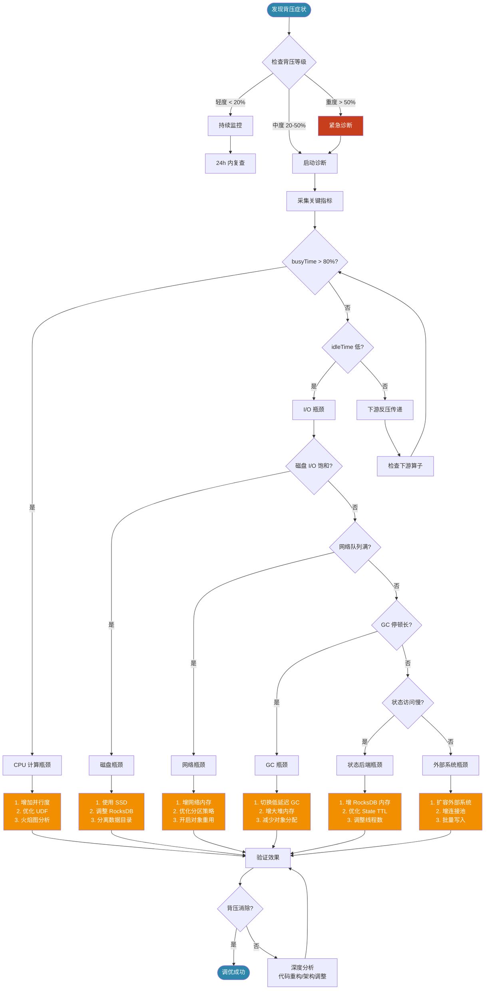
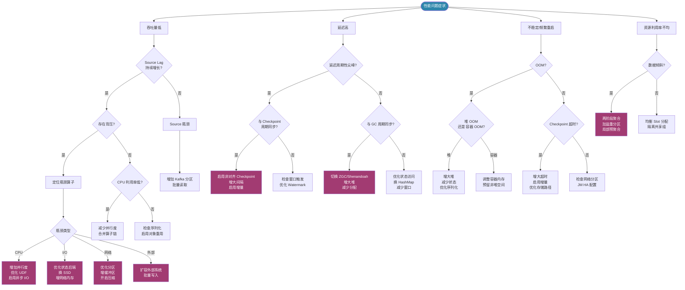
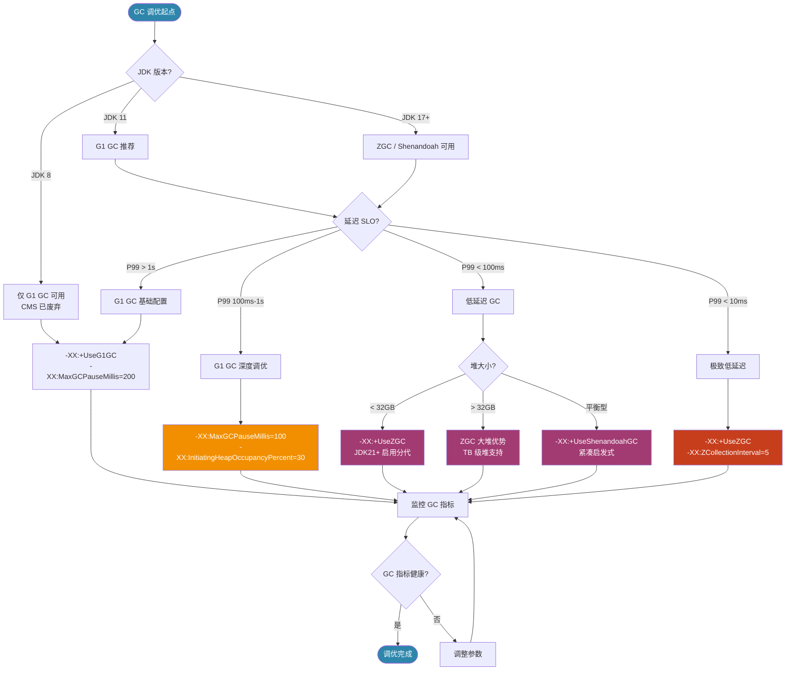

# Flink 性能调优决策框架与系统化方法论

> 所属阶段: Flink/09-practices | 前置依赖: [performance-tuning-guide.md](performance-tuning-guide.md), [state-backend-selection.md](state-backend-selection.md), [troubleshooting-handbook.md](troubleshooting-handbook.md) | 形式化等级: L3-L4

---

## 目录

- [Flink 性能调优决策框架与系统化方法论](#flink-性能调优决策框架与系统化方法论)
  - [目录](#目录)
  - [1. 概念定义 (Definitions)](#1-概念定义-definitions)
    - [Def-F-09-80 (性能调优决策模型)](#def-f-09-80-性能调优决策模型)
    - [Def-F-09-81 (性能瓶颈定位算子)](#def-f-09-81-性能瓶颈定位算子)
    - [Def-F-09-82 (背压传播图)](#def-f-09-82-背压传播图)
    - [Def-F-09-83 (序列化开销比)](#def-f-09-83-序列化开销比)
    - [Def-F-09-84 (状态后端性能特征空间)](#def-f-09-84-状态后端性能特征空间)
    - [Def-F-09-85 (Checkpoint 调优参数空间)](#def-f-09-85-checkpoint-调优参数空间)
    - [Def-F-09-86 (GC 停顿敏感度系数)](#def-f-09-86-gc-停顿敏感度系数)
  - [2. 属性推导 (Properties)](#2-属性推导-properties)
    - [Lemma-F-09-80 (背压传播的传递闭包性质)](#lemma-f-09-80-背压传播的传递闭包性质)
    - [Lemma-F-09-81 (序列化开销与吞吐量的反比关系)](#lemma-f-09-81-序列化开销与吞吐量的反比关系)
    - [Prop-F-09-80 (状态后端选型的帕累托前沿)](#prop-f-09-80-状态后端选型的帕累托前沿)
    - [Lemma-F-09-82 (Checkpoint 间隔与恢复时间的权衡不等式)](#lemma-f-09-82-checkpoint-间隔与恢复时间的权衡不等式)
  - [3. 关系建立 (Relations)](#3-关系建立-relations)
    - [关系 1: 调优维度间的耦合关系](#关系-1-调优维度间的耦合关系)
    - [关系 2: 背压与 GC 的相互作用](#关系-2-背压与-gc-的相互作用)
    - [关系 3: Checkpoint 与吞吐量的权衡关系](#关系-3-checkpoint-与吞吐量的权衡关系)
  - [4. 论证过程 (Argumentation)](#4-论证过程-argumentation)
    - [4.1 性能问题诊断方法论](#41-性能问题诊断方法论)
    - [4.2 调优维度全景分析](#42-调优维度全景分析)
    - [4.3 背压分析与解决策略](#43-背压分析与解决策略)
    - [4.4 序列化优化选择空间](#44-序列化优化选择空间)
    - [4.5 状态后端调优边界](#45-状态后端调优边界)
    - [4.6 网络栈优化参数空间](#46-网络栈优化参数空间)
    - [4.7 Checkpoint 调优权衡](#47-checkpoint-调优权衡)
    - [4.8 JVM/GC 调优路径](#48-jvmgc-调优路径)
  - [5. 形式证明 / 工程论证 (Proof / Engineering Argument)](#5-形式证明--工程论证-proof--engineering-argument)
    - [Thm-F-09-80 (性能调优决策的收敛性定理)](#thm-f-09-80-性能调优决策的收敛性定理)
    - [Thm-F-09-81 (背压消除的最小资源下界定理)](#thm-f-09-81-背压消除的最小资源下界定理)
  - [6. 实例验证 (Examples)](#6-实例验证-examples)
    - [6.1 调优参数配置代码示例](#61-调优参数配置代码示例)
    - [6.2 监控指标查询示例](#62-监控指标查询示例)
    - [6.3 诊断脚本示例](#63-诊断脚本示例)
    - [6.4 按场景分类的调优 Checklist](#64-按场景分类的调优-checklist)
      - [6.4.1 高吞吐场景 Checklist](#641-高吞吐场景-checklist)
      - [6.4.2 低延迟场景 Checklist](#642-低延迟场景-checklist)
      - [6.4.3 大状态场景 Checklist](#643-大状态场景-checklist)
      - [6.4.4 高并发场景 Checklist](#644-高并发场景-checklist)
    - [6.5 调优优先级矩阵（投入产出比排序）](#65-调优优先级矩阵投入产出比排序)
  - [7. 可视化 (Visualizations)](#7-可视化-visualizations)
    - [7.1 调优维度全景图](#71-调优维度全景图)
    - [7.2 背压诊断流程图](#72-背压诊断流程图)
    - [7.3 性能问题 → 诊断路径 → 调优策略决策树](#73-性能问题--诊断路径--调优策略决策树)
    - [7.4 GC 调优路径图](#74-gc-调优路径图)
    - [7.5 调优优先级矩阵热力图](#75-调优优先级矩阵热力图)
  - [8. 引用参考 (References)](#8-引用参考-references)

---

## 1. 概念定义 (Definitions)

### Def-F-09-80 (性能调优决策模型)

**性能调优决策模型**定义为一个六元组 $\mathcal{D} = (\mathcal{S}, \mathcal{P}, \mathcal{A}, \mathcal{O}, \mathcal{R}, \mathcal{F})$：

| 符号 | 语义 | 说明 |
|------|------|------|
| $\mathcal{S}$ | 症状空间 (Symptom Space) | 所有可观测性能异常症状的集合，如延迟升高、吞吐量下降、背压报警等 |
| $\mathcal{P}$ | 问题空间 (Problem Space) | 所有潜在根因的集合，如算子瓶颈、GC 停顿、网络拥塞、磁盘 I/O 饱和等 |
| $\mathcal{A}$ | 行动空间 (Action Space) | 所有可调优参数的集合，包括并行度、内存、序列化器、状态后端等 |
| $\mathcal{O}$ | 观测函数 (Observation Function) | $O: \mathcal{S} \times \mathcal{P} \to \{0, 1\}$，判断症状与根因的关联关系 |
| $\mathcal{R}$ | 约束集合 (Constraints) | 资源预算、SLA 要求、业务逻辑不可变性等约束条件 |
| $\mathcal{F}$ | 目标函数 (Objective Function) | $\mathcal{F}: \mathcal{A} \to \mathbb{R}^k$，多目标优化向量（吞吐、延迟、成本、可用性） |

**决策目标**：在约束 $\mathcal{R}$ 下，寻找最优调参策略 $a^* \in \mathcal{A}$ 使得 $\mathcal{F}(a^*)$ 在帕累托意义下最优：

$$
\exists a^* \in \mathcal{A}: \forall a \in \mathcal{A}, \mathcal{F}(a^*) \succeq_{\mathcal{R}} \mathcal{F}(a)
$$

其中 $\succeq_{\mathcal{R}}$ 为约束帕累托支配关系[^1]。

---

### Def-F-09-81 (性能瓶颈定位算子)

**性能瓶颈定位算子** $\mathcal{B}$ 是一个将作业执行图映射到瓶颈算子集合的函数：

$$
\mathcal{B}: G(V, E) \times M \to 2^V
$$

其中 $G(V, E)$ 为 Flink 作业的逻辑/物理执行图，$M$ 为监控指标集合。定位算子通过以下判别函数识别瓶颈：

$$
\mathcal{B}(G, M) = \{ v \in V \mid \phi_{bp}(v, M) > \theta_{bp} \}
$$

瓶颈判别函数 $\phi_{bp}(v, M)$ 综合考虑以下指标：

| 指标 | 符号 | 瓶颈阈值 | 权重 |
|------|------|----------|------|
| 反压比率 | $r_{bp}(v)$ | $> 0.5$ | $w_1 = 0.30$ |
| 处理延迟 | $L_{proc}(v)$ | $> P_{99}$ 基线 × 2 | $w_2 = 0.25$ |
| CPU 利用率 | $U_{cpu}(v)$ | $> 85\%$ 且下游空闲 | $w_3 = 0.20$ |
| 状态访问延迟 | $L_{state}(v)$ | $> 10\,ms$ | $w_4 = 0.15$ |
| 网络输出队列饱和度 | $Q_{net}^{out}(v)$ | $> 90\%$ | $w_5 = 0.10$ |

综合瓶颈指数：

$$
\phi_{bp}(v, M) = \sum_{i=1}^{5} w_i \cdot \mathbb{1}[m_i(v) > \theta_i]
$$

其中 $\mathbb{1}[\cdot]$ 为指示函数，$\theta_{bp} = 0.6$ 为综合瓶颈阈值[^2]。

---

### Def-F-09-82 (背压传播图)

**背压传播图** (Backpressure Propagation Graph) 定义为有向图 $G_{bp} = (V_{bp}, E_{bp}, \omega)$：

- $V_{bp} \subseteq V$：存在背压的算子集合
- $E_{bp} \subseteq E$：算子间的数据依赖边
- $\omega: E_{bp} \to [0, 1]$：背压传播强度权重

背压传播强度定义为：

$$
\omega(u \to v) = \frac{\min(r_{bp}(u), r_{bp}(v))}{\max(r_{bp}(u), r_{bp}(v)) + \epsilon} \cdot \frac{T_{out}(v)}{T_{in}(u)}
$$

其中 $r_{bp}(v)$ 为算子 $v$ 的反压比率，$T_{out}(v)$ 为 $v$ 的输出吞吐量，$T_{in}(u)$ 为 $u$ 的输入吞吐量，$\epsilon$ 为避免除零的小常数。

**根因算子** (Root Cause Operator) 定义为背压传播图中的汇点（sink）算子——即背压 originate 的位置：

$$
V_{root} = \{ v \in V_{bp} \mid \forall u: (u \to v) \in E_{bp} \Rightarrow r_{bp}(u) < r_{bp}(v) \}
$$

| 传播模式 | 特征 | 根因定位策略 |
|----------|------|-------------|
| 单点瓶颈 | $|V_{root}| = 1$ | 直接优化根因算子 |
| 级联瓶颈 | $|V_{root}| > 1$，链式结构 | 从最下游根因开始逐级优化 |
| 分布式瓶颈 | 多个独立子图存在背压 | 并行优化各子图根因 |

---

### Def-F-09-83 (序列化开销比)

**序列化开销比** $\rho_{ser}$ 量化了数据序列化/反序列化在总处理时间中的占比：

$$
\rho_{ser} = \frac{T_{serialize} + T_{deserialize}}{T_{total}} = \frac{\sum_{v \in V} (T_{ser}^{(v)} + T_{des}^{(v)})}{\sum_{v \in V} T_{proc}^{(v)}}
$$

对于特定序列化器 $s \in \{\text{Avro}, \text{Protobuf}, \text{Kryo}, \text{Custom}\}$，其相对开销比为：

$$
\rho_{ser}(s) = \frac{T_{ser}(s)}{T_{ser}(\text{ baseline})}
$$

| 序列化器 | 相对开销比 $\rho_{ser}$ | 适用数据特征 | Schema 演进支持 |
|----------|------------------------|-------------|-----------------|
| Avro | $0.6 - 0.8$ | 结构化记录，字段稳定 | 优秀 |
| Protobuf | $0.5 - 0.7$ | 结构化记录，跨语言 | 良好 |
| Kryo | $1.0$ (基线) | 复杂 Java 对象 | 有限 |
| Flink POJO | $0.8 - 1.0$ | 符合 POJO 规范的类 | 无 |
| Custom | $0.3 - 0.6$ | 特定领域，高度优化 | 需自行实现 |

**关键洞察**：当 $\rho_{ser} > 0.3$ 时，序列化优化成为高优先级调优项；当 $\rho_{ser} > 0.5$ 时，必须使用专用序列化器（Avro/Protobuf/Custom）替代 Kryo[^3]。

---

### Def-F-09-84 (状态后端性能特征空间)

**状态后端性能特征空间** $\mathcal{H}$ 是一个五维特征空间，用于量化不同状态后端的性能特征：

$$
\mathcal{H} = (\mathcal{L}_{latency}, \mathcal{C}_{capacity}, \mathcal{T}_{throughput}, \mathcal{M}_{memory}, \mathcal{D}_{durability})
$$

其中各维度定义如下：

| 维度 | 符号 | 定义 | HashMapStateBackend | EmbeddedRocksDBStateBackend | ForStStateBackend |
|------|------|------|---------------------|----------------------------|-------------------|
| 访问延迟 | $\mathcal{L}_{latency}$ | P99 状态访问延迟 (μs) | $1 - 5$ | $50 - 500$ | $30 - 300$ |
| 容量上限 | $\mathcal{C}_{capacity}$ | 单 TM 可管理最大状态 | ~100 MB (受堆限制) | TB 级 | TB 级 |
| 吞吐能力 | $\mathcal{T}_{throughput}$ | 相对基准吞吐 | $1.0$ | $0.6 - 0.9$ | $0.7 - 0.95$ |
| 内存效率 | $\mathcal{M}_{memory}$ | 每单位状态的内存占用 | $1.0$ (基线) | $0.1 - 0.3$ | $0.15 - 0.35$ |
| 持久化开销 | $\mathcal{D}_{durability}$ | Checkpoint 时长影响 | 低 (堆快照) | 中 (增量 + SST) | 低 (增量 + 写优化) |

**状态后端选型映射函数** $\mathcal{M}_{select}: \mathcal{R} \to \mathcal{H}$ 将资源约束映射到最优状态后端：

$$
\mathcal{M}_{select}(\text{state\_size}, \text{latency\_slo}, \text{memory\_budget}) = \arg\max_{h \in \mathcal{H}} \text{Score}(h, \text{constraints})
$$

---

### Def-F-09-85 (Checkpoint 调优参数空间)

**Checkpoint 调优参数空间** $\mathcal{C}$ 定义为七维参数空间：

$$
\mathcal{C} = (T_{interval}, T_{timeout}, M_{mode}, C_{concurrent}, S_{incremental}, A_{alignment}, B_{buffering})
$$

| 参数 | 符号 | 典型范围 | 语义 |
|------|------|----------|------|
| 间隔 | $T_{interval}$ | $1\,s - 30\,min$ | 两次 Checkpoint 触发的时间间隔 |
| 超时 | $T_{timeout}$ | $1\,min - 1\,hour$ | Checkpoint 完成的最大允许时间 |
| 模式 | $M_{mode}$ | $\{\text{EXACTLY\_ONCE}, \text{AT\_LEAST\_ONCE}\}$ | 一致性语义模式 |
| 并发度 | $C_{concurrent}$ | $1 - 3$ | 同时进行的 Checkpoint 数量 |
| 增量策略 | $S_{incremental}$ | $\{\text{FULL}, \text{INCREMENTAL}, \text{DIFF}\}$ | 状态持久化策略 |
| 对齐模式 | $A_{alignment}$ | $\{\text{ALIGNED}, \text{UNALIGNED}, \text{NO\_BARRIER}\}$ | Barrier 对齐策略 |
| 缓冲限制 | $B_{buffering}$ | $0 - 100\,MB$ | 非对齐 Checkpoint 的缓冲数据上限 |

**Checkpoint 开销函数** $\mathcal{O}_{cp}: \mathcal{C} \to \mathbb{R}$ 量化 Checkpoint 对正常处理的影响：

$$
\mathcal{O}_{cp}(c) = \alpha \cdot \frac{T_{sync}(c)}{T_{interval}} + \beta \cdot \frac{M_{buffer}(c)}{M_{total}} + \gamma \cdot I_{alignment}(c)
$$

其中 $\alpha, \beta, \gamma$ 为权重系数，$I_{alignment}(c)$ 为对齐模式指示函数（对齐=1，非对齐=0）[^4]。

---

### Def-F-09-86 (GC 停顿敏感度系数)

**GC 停顿敏感度系数** $\sigma_{gc}$ 度量作业对 JVM GC 停顿的敏感程度：

$$
\sigma_{gc} = \frac{\Delta L_{e2e}}{\Delta T_{gc}} \cdot \frac{1}{R_{input}}
$$

其中 $\Delta L_{e2e}$ 为端到端延迟变化量，$\Delta T_{gc}$ 为 GC 停顿时间变化量，$R_{input}$ 为输入数据率。

| 敏感度等级 | $\sigma_{gc}$ 范围 | 典型场景 | 推荐 GC 策略 |
|-----------|-------------------|----------|-------------|
| 极低 | $< 0.1$ | 批处理模式、离线分析 | G1 GC (默认) |
| 低 | $0.1 - 1.0$ | 准实时统计、分钟级延迟 | G1 GC + 调优 |
| 中 | $1.0 - 10.0$ | 秒级延迟、窗口聚合 | ZGC (JDK 17+) |
| 高 | $> 10.0$ | 亚秒级延迟、金融风控 | Shenandoah / ZGC |

**GC 目标函数**：对于给定的停顿敏感度 $\sigma_{gc}$，最优 GC 配置 $g^*$ 满足：

$$
g^* = \arg\min_{g \in \{\text{G1}, \text{ZGC}, \text{Shenandoah}\}} \left( w_1 \cdot T_{pause}(g) + w_2 \cdot T_{throughput}(g) + w_3 \cdot M_{footprint}(g) \right)
$$

约束条件为 $T_{pause}(g) \leq \frac{L_{SLO}}{k}$，其中 $L_{SLO}$ 为延迟 SLO，$k$ 为安全因子（通常 $k = 5 - 10$）[^5]。

---

## 2. 属性推导 (Properties)

### Lemma-F-09-80 (背压传播的传递闭包性质)

**引理**：设 $G_{bp} = (V_{bp}, E_{bp}, \omega)$ 为背压传播图，若算子 $u$ 对算子 $v$ 产生背压（即 $(u \to v) \in E_{bp}$ 且 $\omega(u \to v) > 0$），且 $v$ 对 $w$ 产生背压，则 $u$ 通过传递闭包对 $w$ 产生间接背压。

**形式化表述**：

$$
\forall u, v, w \in V_{bp}: (u \to v) \in E_{bp} \land (v \to w) \in E_{bp} \Rightarrow (u \xrightarrow{*} w) \in E_{bp}^+
$$

其中 $E_{bp}^+$ 为 $E_{bp}$ 的传递闭包。传播强度满足次可加性：

$$
\omega^+(u \xrightarrow{*} w) \leq \omega(u \to v) \cdot \omega(v \to w)
$$

**证明概要**：

1. 由 Flink 数据流执行模型的管道语义，算子 $v$ 的输入速率受限于其输出速率（反压机制）；
2. 当 $v$ 被 $w$ 反压时，$v$ 的输入缓冲区填充率上升，进而降低 $v$ 对 $u$ 的消费速率；
3. 此效应沿数据流方向逆向传播，形成传递闭包；
4. 由于每个中间算子存在缓冲吸收效应，传播强度呈乘积衰减，故满足次可加性。

∎

**工程含义**：在生产环境中观察到上游算子出现背压时，根因往往位于最下游的算子。诊断时应**逆数据流方向**追踪，优先检查 Sink 和窗口算子。

---

### Lemma-F-09-81 (序列化开销与吞吐量的反比关系)

**引理**：在 CPU bound 场景下，算子的有效吞吐量 $T_{eff}$ 与序列化开销比 $\rho_{ser}$ 满足近似反比关系：

$$
T_{eff}(s) \approx \frac{T_{raw}}{1 + \kappa \cdot \rho_{ser}(s)}
$$

其中 $T_{raw}$ 为无序列化开销时的原始吞吐量，$\kappa$ 为 CPU 时间中序列化所占基线比例（通常 $\kappa \in [0.2, 0.4]$）。

**证明概要**：

1. 设算子总处理时间为 $T_{total} = T_{compute} + T_{ser} + T_{other}$；
2. 在 CPU bound 假设下，$T_{compute}$ 与数据量成正比，$T_{ser} = \rho_{ser} \cdot T_{total}$；
3. 代入得 $T_{total} = T_{compute} + \rho_{ser} \cdot T_{total} + T_{other}$；
4. 整理得 $T_{total} = \frac{T_{compute} + T_{other}}{1 - \rho_{ser}}$；
5. 吞吐量 $T_{eff} \propto \frac{1}{T_{total}} \approx \frac{T_{raw}}{1 + \kappa \cdot \rho_{ser}}$（一阶近似，$\rho_{ser} \ll 1$）。

∎

**工程含义**：当 $\rho_{ser}$ 从 $0.5$ 降至 $0.2$（例如 Kryo → Avro），吞吐量可提升约 $20\% - 30\%$。对于高频小记录场景，序列化优化收益尤为显著。

---

### Prop-F-09-80 (状态后端选型的帕累托前沿)

**命题**：状态后端性能特征空间 $\mathcal{H}$ 中不存在单一后端同时在延迟、容量、吞吐三个维度上严格优于其他后端。三种主要后端形成帕累托前沿：

$$
\mathcal{P}_{frontier} = \{ (\mathcal{L}_{latency}, \mathcal{C}_{capacity}, \mathcal{T}_{throughput})_{HashMap}, (\mathcal{L}, \mathcal{C}, \mathcal{T})_{RocksDB}, (\mathcal{L}, \mathcal{C}, \mathcal{T})_{ForSt} \}
$$

**形式化表述**：

$$
\forall h_1, h_2 \in \mathcal{P}_{frontier}, h_1 \neq h_2: \neg(h_1 \succ h_2) \land \neg(h_2 \succ h_1)
$$

其中 $h_1 \succ h_2$ 表示 $h_1$ 在三个维度上均不劣于 $h_2$ 且至少在一个维度上严格优于 $h_2$。

| 帕累托点 | 优势维度 | 劣势维度 | 最优场景 |
|----------|----------|----------|----------|
| HashMap | 延迟最低、吞吐最高 | 容量受限 | 小状态 (< 100MB)、低延迟 |
| RocksDB | 容量最大、内存最省 | 延迟较高 | 大状态、内存受限 |
| ForSt | 均衡优化 | 生态系统较新 | 大状态 + 低延迟需求 |

**证明概要**：

1. HashMapStateBackend 使用堆内存直接存储 Java 对象，访问无需序列化，故延迟最低；但受限于 JVM 堆大小，容量有限；
2. RocksDBStateBackend 使用 LSM-Tree 磁盘存储，支持 TB 级状态，但状态访问需序列化/反序列化 + 磁盘 I/O，延迟较高；
3. ForStStateBackend 针对流计算优化了写路径和 Compaction 策略，在大状态下延迟优于 RocksDB，但仍需序列化开销；
4. 由于延迟-容量-吞吐之间存在 fundamental trade-off（受内存墙和 I/O 墙约束），三者形成帕累托前沿。

∎

---

### Lemma-F-09-82 (Checkpoint 间隔与恢复时间的权衡不等式)

**引理**：设 $T_{interval}$ 为 Checkpoint 间隔，$T_{rec}$ 为故障恢复时间，则二者满足以下权衡不等式：

$$
T_{rec}(T_{interval}) \geq \frac{T_{interval}}{2} + T_{restart} + T_{replay}
$$

其中 $T_{restart}$ 为作业重启时间（常数），$T_{replay}$ 为状态重放时间（与状态大小成正比）。

**上界约束**：

$$
T_{rec}(T_{interval}) \leq T_{interval} + T_{restart} + T_{replay} + T_{catchup}
$$

其中 $T_{catchup}$ 为追赶当前数据进度所需时间。

**最优间隔条件**：在期望恢复时间约束 $T_{rec} \leq T_{R\_SLO}$ 下，最小 Checkpoint 间隔满足：

$$
T_{interval}^* \geq 2 \cdot (T_{R\_SLO} - T_{restart} - T_{replay})
$$

**工程含义**：

- Checkpoint 越频繁，恢复时丢失的数据越少，$T_{replay}$ 越小；
- 但过于频繁的 Checkpoint 会增加运行期开销，降低有效吞吐；
- 实践中 $T_{interval}$ 通常设置为 $10\,s - 10\,min$，需根据业务对恢复时间的要求和状态大小综合权衡。

∎

---

## 3. 关系建立 (Relations)

### 关系 1: 调优维度间的耦合关系

Flink 性能调优的六个核心维度并非独立，而是存在复杂的耦合关系：

$$
\mathcal{T} = \mathcal{M} \times \mathcal{P} \times \mathcal{C} \times \mathcal{S} \times \mathcal{N} \times \mathcal{J}
$$

| 维度对 | 耦合类型 | 耦合机制 | 调优策略 |
|--------|----------|----------|----------|
| 内存 $\mathcal{M}$ ↔ 状态后端 $\mathcal{S}$ | 强耦合 | RocksDB 内存配置直接决定 BlockCache / WriteBuffer 大小 | 联动调优：增大 TM 内存时需同步调整 `state.backend.incremental` 和 RocksDB 内存上限 |
| 并行度 $\mathcal{P}$ ↔ 网络 $\mathcal{N}$ | 强耦合 | 并行度增加 → 网络连接数 $O(n^2)$ 增长 → 缓冲区竞争 | 高并行度场景需增加 `taskmanager.memory.network.fraction` |
| Checkpoint $\mathcal{C}$ ↔ 状态后端 $\mathcal{S}$ | 强耦合 | 增量 Checkpoint 策略与状态后端的快照机制绑定 | RocksDB 启用增量，HashMap 使用异步快照 |
| JVM $\mathcal{J}$ ↔ 内存 $\mathcal{M}$ | 强耦合 | GC 策略影响内存碎片和有效可用堆 | G1 GC 需预留 20-30% 堆空间给浮动垃圾 |
| 网络 $\mathcal{N}$ ↔ Checkpoint $\mathcal{C}$ | 中耦合 | 非对齐 Checkpoint 依赖网络缓冲区的溢出数据 | 启用 Unaligned Checkpoint 时需增加网络缓冲 |
| 序列化 $\mathcal{O}$ ↔ 状态后端 $\mathcal{S}$ | 中耦合 | RocksDB 强制序列化，HashMap 可选 | RocksDB 场景下序列化优化收益翻倍 |
| 并行度 $\mathcal{P}$ ↔ JVM $\mathcal{J}$ | 弱耦合 | 单 TM Slot 数增加 → 线程竞争 → GC 压力上升 | 限制单 TM Slot 数不超过 CPU 核数 |

**耦合调优原则**：

1. **强耦合维度必须联动调优**：调整一个维度时，必须检查相关维度的配置是否匹配；
2. **避免局部最优陷阱**：单一维度的局部优化可能导致全局性能退化（如过度增加并行度导致网络瓶颈）；
3. **配置变更的级联验证**：建立配置变更的影响分析矩阵，评估对其他维度的影响。

---

### 关系 2: 背压与 GC 的相互作用

背压和 GC 停顿之间存在双向反馈回路：

$$
\text{GC 停顿} \uparrow \Rightarrow \text{处理延迟} \uparrow \Rightarrow \text{缓冲区堆积} \uparrow \Rightarrow \text{背压} \uparrow \Rightarrow \text{数据积压} \uparrow \Rightarrow \text{GC 压力} \uparrow
$$

**正反馈机制**：

| 阶段 | 机制 | 结果 |
|------|------|------|
| GC 长停顿 | Old Gen 回收或 Full GC 导致算子线程暂停 | 算子处理速率骤降 |
| 缓冲区堆积 | 下游继续发送数据，输入缓冲区填满 | 网络层触发反压 |
| 背压传播 | 反压沿数据流逆向传播至 Source | 整体吞吐下降 |
| 数据积压 | Source 消费速率低于生产速率 | Kafka 等源的 Lag 增加 |
| 状态膨胀 | 窗口等算子积压数据未处理 | 状态大小增长 |
| GC 压力上升 | 大状态 + 大缓冲 → 堆内存紧张 | 更频繁的 GC，甚至 OOM |

**诊断区分**：

| 特征 | GC 引发的背压 | 算子瓶颈引发的背压 |
|------|--------------|-------------------|
| CPU 利用率 | GC 期间 CPU 飙升，之后骤降 | 持续高位 |
| GC 日志 | 频繁 Full GC 或长时间 Young GC | GC 正常 |
| 堆内存 | 接近上限，波动大 | 稳定 |
| 背压模式 | 周期性波动，与 GC 周期同步 | 持续性 |
| JVM 线程 Dump | 大量线程阻塞在 GC | 线程等待网络/状态 I/O |

**打破反馈回路**：

1. 优先解决 GC 问题（增大堆、优化 GC 策略、减少对象分配）；
2. 临时增大网络缓冲区，缓解背压冲击；
3. 限制 Source 消费速率，避免过度积压。

---

### 关系 3: Checkpoint 与吞吐量的权衡关系

Checkpoint 机制对吞吐量的影响遵循"开销-频率权衡曲线"：

$$
T_{effective} = T_{raw} \cdot \left(1 - \frac{\mathcal{O}_{cp}(c)}{T_{interval}} \right) - \mathcal{D}_{jitter}(c)
$$

其中 $\mathcal{D}_{jitter}(c)$ 为 Checkpoint 引发的延迟抖动项。

| Checkpoint 模式 | 吞吐影响 | 延迟影响 | 适用场景 |
|----------------|----------|----------|----------|
| 对齐 + Exactly-Once | $-5\%$ 至 $-15\%$ | 周期性尖峰 | 金融交易、计费系统 |
| 非对齐 + Exactly-Once | $-2\%$ 至 $-8\%$ | 低抖动 | 高延迟敏感、大缓冲 |
| At-Least-Once | $-1\%$ 至 $-5\%$ | 最小 | 日志处理、监控数据 |
| 增量 Checkpoint | 摊薄为 $-1\%$ 至 $-3\%$ | 低 | 大状态场景必选 |

**关键洞察**：

- 对齐 Checkpoint 的同步阶段会阻塞数据流，造成吞吐断崖；
- 非对齐 Checkpoint 通过预缓冲飞行中数据避免阻塞，但增加网络内存需求；
- 增量 Checkpoint 将每次持久化数据量降至最小，是大状态场景的最优策略。

---

## 4. 论证过程 (Argumentation)

### 4.1 性能问题诊断方法论

性能问题诊断遵循**五层递进模型**：

**Layer 1: 症状识别** (Symptom Identification)

| 症状类别 | 具体表现 | 初步判断方向 |
|----------|----------|-------------|
| 吞吐量异常 | 实际吞吐远低于预期、Source Lag 持续增长 | 并行度不足、算子瓶颈、背压 |
| 延迟异常 | P99 延迟超标、延迟周期性尖峰 | GC 问题、Checkpoint 干扰、网络拥塞 |
| 资源异常 | CPU 利用率不均、内存持续增长、磁盘 I/O 饱和 | 数据倾斜、状态膨胀、序列化开销 |
| 稳定性异常 | 频繁重启、Checkpoint 超时、TaskManager 失联 | OOM、网络分区、资源争抢 |

**Layer 2: 指标采集** (Metric Collection)

核心监控指标体系：

| 指标层级 | 关键指标 | 采集来源 |
|----------|----------|----------|
| 作业级 | `numRecordsInPerSecond`, `numRecordsOutPerSecond`, `backPressuredTimeMsPerSecond` | Flink REST API / Prometheus |
| 算子级 | `idleTimeMsPerSecond`, `busyTimeMsPerSecond`, `backPressuredTimeMsPerSecond` | Flink Web UI / Metrics Reporter |
| TaskManager 级 | `Status.JVM.Memory.Heap.Used`, `Status.JVM.GarbageCollector.*`, `Status.Network.*` | JMX / Prometheus |
| JobManager 级 | `numRunningJobs`, `numRestarts`, `checkpointDuration` | Flink REST API |
| 系统级 | CPU %, Disk I/O, Network Bandwidth, File Descriptors | Node Exporter / cAdvisor |

**Layer 3: 瓶颈定位** (Bottleneck Localization)

使用 Def-F-09-81 定义的性能瓶颈定位算子 $\mathcal{B}(G, M)$，结合以下诊断路径：

1. **背压分析**：通过 Flink Web UI 的 Backpressure 标签页，识别 `HIGH` 等级的算子；
2. **火焰图分析**：使用 Java Async Profiler 生成 CPU 火焰图，定位热点方法；
3. **GC 日志分析**：解析 `-Xlog:gc*` 输出，识别长时间停顿；
4. **网络分析**：检查 `outPoolUsage` 和 `inPoolUsage`，判断网络层瓶颈；
5. **状态分析**：监控 `rocksdb_memtable_flush_duration` 和 `rocksdb_compaction_times`。

**Layer 4: 根因分析** (Root Cause Analysis)

| 瓶颈类型 | 诊断证据 | 根因分类 |
|----------|----------|----------|
| CPU 瓶颈 | `busyTimeMsPerSecond` > 800ms/s，火焰图显示用户代码热点 | 业务逻辑复杂、序列化开销、正则匹配 |
| I/O 瓶颈 | `idleTimeMsPerSecond` 低但吞吐不高，磁盘 I/O 饱和 | RocksDB Compaction、状态访问模式差 |
| 网络瓶颈 | `outPoolUsage` > 0.9，跨 TM 数据 shuffle 量大 | 分区策略不合理、数据倾斜、缓冲区不足 |
| 内存瓶颈 | 堆内存持续增长，频繁 GC，甚至 OOM | 状态过大、窗口过期策略不当、对象泄漏 |
| 外部系统瓶颈 | Source/Sink 吞吐受限，外部服务响应慢 | Kafka 分区不足、数据库连接池耗尽 |

**Layer 5: 调优验证** (Tuning Validation)

每次调优后必须验证：

1. **基线对比**：与调优前的指标对比，确认改善方向；
2. **回归测试**：确认功能正确性未受影响；
3. **压力测试**：在峰值负载下验证稳定性；
4. **成本评估**：资源使用是否在经济预算内。

---

### 4.2 调优维度全景分析

Flink 性能调优涵盖六个层级，每层有其核心参数和优化策略：

**Level 1: 算子级优化** (Operator-Level)

| 优化项 | 策略 | 典型收益 |
|--------|------|----------|
| 算子链 (Operator Chaining) | 合并无 Shuffle 的算子，减少序列化和网络开销 | 吞吐提升 $10\% - 30\%$ |
| 并行度调优 | 根据数据量和 CPU 核数设置合理并行度 | 消除瓶颈或资源浪费 |
| 异步 I/O | 将同步外部调用改为 `AsyncFunction` | 吞吐提升数倍 |
| 广播状态优化 | 使用 `BroadcastStream` 替代全量 Join | 减少状态规模 |
| MiniBatch 优化 | SQL 场景启用 `table.exec.mini-batch.enabled` | 减少状态访问次数 |

**Level 2: 任务级优化** (Task-Level)

| 优化项 | 策略 | 典型收益 |
|--------|------|----------|
| Slot 共享组 | 将 Heavy 算子隔离到独立 SlotSharingGroup | 避免资源争抢 |
| 缓冲区超时 | 调整 `buffer-timeout` 平衡延迟与吞吐 | 毫秒级延迟优化 |
| 对象重用 | 启用 `objectReuse` 减少垃圾对象 | GC 压力降低 $20\% - 40\%$ |
| 水印生成 | 优化 Watermark 发射策略和 idle timeout | 减少延迟触发 |

**Level 3: 集群级优化** (Cluster-Level)

| 优化项 | 策略 | 典型收益 |
|--------|------|----------|
| TM 内存配置 | 合理分配 Heap / Off-Heap / Managed / Network 内存 | 避免 OOM，提升稳定性 |
| Slot 数量 | 单 TM Slot 数 ≤ CPU 核数 | 避免线程过度竞争 |
| 网络内存 | 根据并行度和 Shuffle 类型调整 `network.memory.fraction` | 缓解网络背压 |
| 磁盘配置 | 使用 SSD / NVMe，分离日志与数据目录 | I/O 延迟降低 $50\%$+ |

**Level 4: JVM 级优化** (JVM-Level)

| 优化项 | 策略 | 典型收益 |
|--------|------|----------|
| GC 策略选择 | 低延迟场景选 ZGC/Shenandoah，吞吐优先选 G1 | 停顿从 $100\,ms$ → $10\,ms$ |
| 堆大小配置 | Heap = 容器内存 × 0.6 - 0.7，预留余量给非堆 | 避免容器 OOMKilled |
| GC 参数调优 | 调整 `MaxGCPauseMillis`, `InitiatingHeapOccupancyPercent` | 平衡吞吐与停顿 |
| 元空间限制 | 设置 `MaxMetaspaceSize` 防止类加载泄漏 | 长期运行稳定性 |

**Level 5: 网络级优化** (Network-Level)

| 优化项 | 策略 | 典型收益 |
|--------|------|----------|
| 缓冲区大小 | 调整 `memory.network.min/max/fraction` | 缓解突发流量冲击 |
| 信用值机制 | Flink Credit-Based 流控默认已启用，监控信用耗尽频率 | 避免伪背压 |
| 批处理策略 | 增大 `buffer-timeout` 或开启批处理模式 | 小包合并，提升吞吐 |
| 网络线程 | 调整 `Netty` 的 EventLoop 线程数 | 高并发连接优化 |

**Level 6: 磁盘级优化** (Disk-Level)

| 优化项 | 策略 | 典型收益 |
|--------|------|----------|
| Checkpoint 目录 | 使用高性能分布式存储 (HDFS/S3/OSS) | Checkpoint 时长降低 |
| RocksDB 本地路径 | 配置 `state.backend.rocksdb.localdir` 到独立高速盘 | 状态访问延迟降低 |
| 磁盘 I/O 调度 | 使用 `noop` 或 `deadline` I/O 调度器 | SSD 场景更优 |
| RAID 配置 | 使用 RAID-0 提升顺序写吞吐 | Checkpoint 写优化 |

---

### 4.3 背压分析与解决策略

**背压识别矩阵**：

| 背压等级 | `backPressuredTimeMsPerSecond` | 系统表现 | 响应时效 |
|----------|-------------------------------|----------|----------|
| 无背压 | $< 50$ | 正常运行 | 无需处理 |
| 轻度背压 | $50 - 200$ | 轻微延迟波动 | 24h 内观察 |
| 中度背压 | $200 - 500$ | 明显延迟上升 | 4h 内处理 |
| 重度背压 | $> 500$ | 吞吐量下降、Lag 累积 | 立即处理 |

**背压根因分类与解决策略矩阵**：

| 根因类别 | 诊断特征 | 解决策略 | 预期效果 |
|----------|----------|----------|----------|
| **算子计算瓶颈** | `busyTimeMsPerSecond` > 800ms/s，CPU 高 | 1. 增加并行度 2. 优化业务逻辑 3. 使用异步 I/O | 吞吐线性提升 |
| **状态访问瓶颈** | `idleTimeMsPerSecond` 低，RocksDB 指标异常 | 1. 增加 State Access Thread 2. 优化 State TTL 3. 调整 RocksDB 内存 | 延迟降低 $30\% - 60\%$ |
| **网络传输瓶颈** | `outPoolUsage` > 0.9，跨 TM 数据量大 | 1. 增加网络内存 2. 优化分区策略 3. 开启对象重用 | 背压消除 |
| **GC 停顿瓶颈** | 周期性背压，GC 日志显示长停顿 | 1. 切换低延迟 GC 2. 增大堆内存 3. 减少对象分配 | 延迟尖峰消除 |
| **外部系统瓶颈** | Source/Sink 端背压，外部服务延迟高 | 1. 扩容外部系统 2. 增加连接池 3. 批量写入 | 端到端延迟降低 |
| **数据倾斜** | 部分 Subtask 背压严重，其余空闲 | 1. 两阶段聚合 2. 局部预聚合 3. 重新分区 | 负载均衡 |

**背压优化策略实施顺序**：

1. **定位根因算子**（使用 Def-F-09-82 的背压传播图，找到 $V_{root}$）；
2. **区分瓶颈类型**（CPU / I/O / Network / GC / External）；
3. **实施低成本优化**（参数调整、配置优化，不改变代码）；
4. **评估效果**（监控指标验证，确认背压缓解）；
5. **必要时实施高成本优化**（代码重构、架构调整、扩容）。

---

### 4.4 序列化优化选择空间

**序列化器选型决策矩阵**：

| 评估维度 | Avro | Protobuf | Kryo | Flink POJO | Custom Serializer |
|----------|------|----------|------|------------|-------------------|
| 序列化速度 | ★★★★☆ | ★★★★★ | ★★★☆☆ | ★★★★☆ | ★★★★★ (最优可定制) |
| 序列化后大小 | ★★★★☆ | ★★★★★ | ★★★☆☆ | ★★★☆☆ | ★★★★★ |
| Schema 演进 | ★★★★★ | ★★★★☆ | ★★☆☆☆ | ★☆☆☆☆ | ★★★☆☆ |
| 跨语言支持 | ★★★★★ | ★★★★★ | ★☆☆☆☆ | ★☆☆☆☆ | ★★☆☆☆ |
| 使用复杂度 | ★★★☆☆ | ★★★☆☆ | ★★★★★ | ★★★★★ | ★★☆☆☆ |
| Flink 集成度 | ★★★★☆ | ★★★★☆ | ★★★★★ | ★★★★★ | ★★★★☆ |

**选型决策路径**：

1. **是否使用 RocksDB 状态后端？**
   - 是 → 序列化开销不可忽视，优先考虑 Avro / Protobuf / Custom
   - 否 (HashMap) → 仅需网络序列化，Kryo 通常足够

2. **是否需要 Schema 演进？**
   - 是 → Avro (最佳) 或 Protobuf
   - 否 → 考虑性能优先的选项

3. **是否跨语言消费数据？**
   - 是 → Avro 或 Protobuf
   - 否 → 可选择更轻量的方案

4. **性能是否为核心诉求？**
   - 是 → Custom Serializer（针对特定数据结构深度优化）
   - 否 → Kryo 或 Flink POJO（开发效率优先）

**自定义序列化器最佳实践**：

- 对于固定格式数据（如固定长度二进制协议），直接操作 `ByteBuffer` 避免反射；
- 对于嵌套结构，使用 FlatBuffers / Cap'n Proto 的零拷贝思想；
- 注册 Kryo 自定义序列化器时，使用 `kryo.addCustomSerializer()` 确保类型匹配；
- 在 `TypeInformation` 中显式指定序列化器，避免运行时推断开销。

---

### 4.5 状态后端调优边界

**RocksDBStateBackend 核心参数调优空间**：

| 参数类别 | 配置项 | 调优范围 | 影响维度 |
|----------|--------|----------|----------|
| **ColumnFamily 选项** | `state.backend.rocksdb.predefined-options` | `DEFAULT` / `FLASH_SSD_OPTIMIZED` / `SPINNING_DISK_OPTIMIZED` | 读写放大、Compaction 策略 |
| **WriteBuffer 大小** | `state.backend.rocksdb.writebuffer.size` | $16\,MB - 256\,MB$ | 写入吞吐、内存占用 |
| **WriteBuffer 数量** | `state.backend.rocksdb.writebuffer.count` | $2 - 8$ | 写停顿频率 |
| **Block Cache 大小** | `state.backend.rocksdb.block.cache-size` | $32\,MB - 1\,GB$ | 读性能、内存占用 |
| **线程数** | `state.backend.rocksdb.threads.rocksDB` | $1 - 16$ | Compaction / Flush 并行度 |
| **增量 Checkpoint** | `state.backend.incremental` | `true` / `false` | Checkpoint 时长、存储空间 |

**RocksDB 内存分配模型**：

RocksDB 在 Flink 中的总内存消耗由以下部分组成：

$$
M_{rocksdb} = M_{writebuffer} \times N_{cf} \times N_{buffer} + M_{blockcache} + M_{index} + M_{filter}
$$

其中：

- $M_{writebuffer}$：单个 MemTable 大小
- $N_{cf}$：ColumnFamily 数量（通常等于状态描述符数量）
- $N_{buffer}$：每个 CF 的 WriteBuffer 数量
- $M_{blockcache}$：块缓存大小
- $M_{index}$ / $M_{filter}$：索引和布隆过滤器的内存占用

**内存分配原则**：

$$
M_{rocksdb} \leq M_{managed} \times 0.8
$$

其中 $M_{managed}$ 为 Flink 分配给状态后端的托管内存。剩余 $20\%$ 作为安全余量。

**HashMapStateBackend 边界约束**：

$$
M_{state} \leq M_{heap} \times 0.3
$$

即状态数据不应超过堆内存的 $30\%$，以避免 GC 压力过大。

---

### 4.6 网络栈优化参数空间

Flink 网络栈基于 Netty 实现，采用 Credit-Based 流控机制。核心优化参数如下：

| 参数 | 配置键 | 默认值 | 调优范围 | 影响 |
|------|--------|--------|----------|------|
| 网络内存最小值 | `taskmanager.memory.network.min` | `64mb` | $64\,MB - 256\,MB$ | 低并行度场景下限 |
| 网络内存最大值 | `taskmanager.memory.network.max` | `256mb` | $256\,MB - 2\,GB$ | 高并行度场景上限 |
| 网络内存比例 | `taskmanager.memory.network.fraction` | `0.125` | $0.1 - 0.25$ | 自动计算的网络内存占比 |
| 缓冲区数量 | `taskmanager.memory.network.memory.buffer-size` | `32768` (32KB) | $16\,KB - 128\,KB$ | 单个缓冲区大小 |
| 信用值阈值 | `taskmanager.network.memory.buffer-debloat.threshold-percentages` | `50, 100` | 自定义区间 | 背压触发阈值 |

**Credit-Based 流控机制**：

Flink 网络层通过信用值机制实现背压：

1. 下游算子向上游发送信用值（Credit），表示可接收的缓冲区数量；
2. 上游仅在拥有足够信用值时发送数据；
3. 当下游处理缓慢时，信用值耗尽，上游自然停止发送。

**网络优化策略**：

| 场景 | 优化策略 | 原理 |
|------|----------|------|
| 高并行度 + Shuffle | 增大网络内存至 $512\,MB$+ | 信用值机制需要足够缓冲区支撑 $O(n^2)$ 连接 |
| 大量小记录 | 增大单个缓冲区至 $64\,KB$+ | 减少缓冲区数量，降低管理开销 |
| 低延迟优先 | 减小 `buffer-timeout` 至 $0\,ms$ 或启用 `flushAlways` | 每条记录立即发送，牺牲吞吐换延迟 |
| 高吞吐优先 | 增大 `buffer-timeout` 至 $100\,ms$ | 缓冲区填满后批量发送，提升网络利用率 |
| 跨机架传输 | 启用数据压缩 `pipeline.compression` | 减少网络带宽占用 |

---

### 4.7 Checkpoint 调优权衡

**Checkpoint 配置决策矩阵**：

| 业务场景 | 间隔 | 超时 | 模式 | 对齐 | 增量 | 并发 |
|----------|------|------|------|------|------|------|
| 金融交易 (低延迟 + 强一致) | $1\,s - 10\,s$ | $1\,min$ | EXACTLY_ONCE | UNALIGNED | INCREMENTAL | 1 |
| 实时推荐 (中延迟 + 大状态) | $30\,s - 2\,min$ | $5\,min$ | EXACTLY_ONCE | ALIGNED | INCREMENTAL | 1 |
| 日志处理 (高吞吐 + 可丢) | $1\,min - 5\,min$ | $10\,min$ | AT_LEAST_ONCE | - | FULL | 1 |
| 复杂事件处理 (低延迟 + 中等状态) | $10\,s - 30\,s$ | $3\,min$ | EXACTLY_ONCE | UNALIGNED | INCREMENTAL | 1 |
| 大规模聚合 (大状态 + 高可用) | $1\,min - 3\,min$ | $10\,min$ | EXACTLY_ONCE | ALIGNED | INCREMENTAL | 1 |

**非对齐 Checkpoint 的启用条件**：

非对齐 Checkpoint 通过缓冲飞行中数据避免同步阻塞，但有以下前提：

1. **网络内存充足**：需要额外存储所有通道中的飞行中数据；
2. **Checkpoint 间隔不太短**：频繁触发会导致大量小文件；
3. **状态大小适中**：非对齐 Checkpoint 仍需同步快照状态；
4. **延迟敏感**：适合 P99 延迟要求 $< 100\,ms$ 的场景。

**对齐超时自动降级** (Flink 1.11+)：

```
checkpointing.mode: EXACTLY_ONCE
checkpointing.aligned-checkpoint-timeout: 30s
```

当对齐等待超过 $30\,s$ 时，自动降级为非对齐 Checkpoint，兼顾一致性和可用性。

---

### 4.8 JVM/GC 调优路径

**GC 策略选型决策树**：

1. **JDK 版本？**
   - JDK 8 → 仅 G1 GC 可用（CMS 已废弃）
   - JDK 11+ → G1 GC 推荐
   - JDK 17+ → ZGC / Shenandoah 可用

2. **延迟 SLO 要求？**
   - P99 > $1\,s$ → G1 GC 足够
   - P99 $100\,ms - 1\,s$ → 调优 G1 GC (`MaxGCPauseMillis=100`)
   - P99 $< 100\,ms$ → ZGC 或 Shenandoah
   - P99 $< 10\,ms$ → ZGC (`-XX:ZCollectionInterval`)

3. **堆内存大小？**
   - $< 4\,GB$ → 任何 GC 均可
   - $4\,GB - 32\,GB$ → G1 GC 或 ZGC
   - $> 32\,GB$ → ZGC（大堆低延迟优势显著）

**G1 GC 调优参数**：

| 参数 | 推荐值 | 说明 |
|------|--------|------|
| `-XX:+UseG1GC` | 必开 | 启用 G1 GC |
| `-XX:MaxGCPauseMillis=200` | $100 - 300$ | 目标最大停顿时间 |
| `-XX:InitiatingHeapOccupancyPercent=35` | $25 - 45$ | 触发并发标记的堆占用率 |
| `-XX:G1HeapRegionSize=16m` | $4\,M - 32\,M$ | 区域大小，大堆用大区域 |
| `-XX:G1RSetUpdatingPauseTimePercent=5` | $5 - 10$ | 更新 RSet 的停顿时间占比上限 |

**ZGC 调优参数** (JDK 17+)：

| 参数 | 推荐值 | 说明 |
|------|--------|------|
| `-XX:+UseZGC` | 必开 | 启用 ZGC |
| `-XX:+ZGenerational` | JDK 21+ 推荐 | 分代 ZGC，提升吞吐 |
| `-XX:ZCollectionInterval=5` | 按需 | 强制 GC 间隔（秒） |
| `-XX:ZAllocationSpikeTolerance=2` | $1 - 10$ | 分配速率突增容忍度 |
| `-XX:+DisableExplicitGC` | 推荐 | 禁止显式 System.gc() |

**Shenandoah GC 调优参数** (JDK 17+)：

| 参数 | 推荐值 | 说明 |
|------|--------|------|
| `-XX:+UseShenandoahGC` | 必开 | 启用 Shenandoah |
| `-XX:ShenandoahGCHeuristics=compact` | 可选 | 激进压缩模式 |
| `-XX:+ShenandoahPacing` | 推荐 |  pacing 机制防止分配过快 |

**GC 日志配置** (JDK 11+ 统一日志)：

```
-Xlog:gc*:file=/var/log/flink/gc.log:time,uptime,level,tags:filecount=10,filesize=100m
```

**关键 GC 指标监控**：

| 指标 | 健康阈值 | 异常处理 |
|------|----------|----------|
| GC 次数 / 分钟 | Young: $< 20$; Old: $< 1$ | 频繁 Young GC → 增大 Eden；频繁 Old GC → 检查内存泄漏 |
| GC 停顿时间 | Young: $< 50\,ms$; Mixed: $< 200\,ms$; Full: $0$ | 超过阈值 → 切换 GC 策略或增大堆 |
| 堆占用率 | 峰值 $< 70\%$ | 超过 → 增大堆或优化对象分配 |
| GC 吞吐占比 | $< 5\%$ | 超过 → GC 成为瓶颈，需优化 |

---

## 5. 形式证明 / 工程论证 (Proof / Engineering Argument)

### Thm-F-09-80 (性能调优决策的收敛性定理)

**定理**：在性能调优决策模型 $\mathcal{D} = (\mathcal{S}, \mathcal{P}, \mathcal{A}, \mathcal{O}, \mathcal{R}, \mathcal{F})$ 中，若满足以下条件：

1. **行动空间有限性**：$|\mathcal{A}| < \infty$（可配置参数组合有限）；
2. **目标函数单调性**：对于任意调参步骤 $a_t \to a_{t+1}$，若症状改善则 $\mathcal{F}(a_{t+1}) \succeq \mathcal{F}(a_t)$；
3. **无循环依赖**：不存在 $a_1 \to a_2 \to \cdots \to a_k = a_1$ 使得 $\mathcal{F}(a_{i+1}) \succeq \mathcal{F}(a_i)$ 对所有 $i$ 成立且至少一个严格优于；

则调优过程必在有限步内收敛到局部最优解 $a^*$。

**形式化表述**：

$$
\exists T < \infty, \forall t \geq T: a_t = a^* \land \forall a' \in \mathcal{N}(a^*): \mathcal{F}(a^*) \succeq \mathcal{F}(a')
$$

其中 $\mathcal{N}(a)$ 为 $a$ 的邻域配置（单次参数调整可达的配置集合）。

**证明**：

1. 由条件 1，$\mathcal{A}$ 为有限集；
2. 由条件 2，每次有效调参步骤使目标函数在偏序意义下不递减；
3. 由条件 3，不存在目标值循环上升的情况；
4. 有限集上的单调序列必在有限步内达到极大元；
5. 该极大元即为局部最优解 $a^*$。

∎

**工程推论**：

1. **调优必须有度量**：每次调参后必须量化评估效果，否则无法保证单调性；
2. **避免同时调整多个参数**：多参数同时变化导致效果不可归因，破坏单调性条件；
3. **记录调参历史**：建立调参日志，防止重复尝试相同配置，加速收敛。

---

### Thm-F-09-81 (背压消除的最小资源下界定理)

**定理**：设作业执行图为 $G(V, E)$，算子 $v$ 的处理能力为 $C(v)$（记录/秒），输入速率为 $R_{in}(v)$。若 $v$ 存在背压，则消除背压所需的最小资源增量 $\Delta R^*$ 满足：

$$
\Delta R^* \geq \max_{v \in V_{root}} \left( \frac{R_{in}(v)}{C(v)} - 1 \right) \cdot R_{current}
$$

其中 $V_{root}$ 为背压传播图中的根因算子集合，$R_{current}$ 为当前分配给该算子的资源量（如 Slot 数、CPU 核数）。

**特殊情形**：

1. 若瓶颈为 **CPU 计算**，则最小并行度增量：
   $$
   \Delta P^* \geq \left\lceil \frac{R_{in}(v)}{C_{unit}(v)} \right\rceil - P_{current}
   $$

2. 若瓶颈为 **状态 I/O**，则最小资源增量取决于状态后端：
   - HashMap：需增大堆内存
   - RocksDB：需增大 `state.backend.rocksdb.block.cache-size` 或磁盘 IOPS

3. 若瓶颈为 **网络传输**，则最小网络内存增量：
   $$
   \Delta M_{net}^* \geq N_{channels} \cdot B_{buffer} \cdot \alpha
   $$
   其中 $\alpha$ 为通道填充率安全因子（通常 $1.5 - 2.0$）。

**证明概要**：

1. 由背压定义，当 $R_{in}(v) > C(v)$ 时，输入缓冲区将持续累积；
2. 要消除背压，必须使 $C'(v) \geq R_{in}(v)$；
3. 若资源与处理能力线性相关（$C(v) = \eta \cdot R$），则需 $R' \geq R_{in}(v) / \eta$；
4. 整理得 $\Delta R = R' - R \geq R_{in}(v)/\eta - R = (R_{in}(v)/C(v) - 1) \cdot R$。

∎

**工程含义**：

1. 盲目扩容可能无法消除背压——必须先定位根因算子；
2. 若 $\Delta R^*$ 超过资源预算上限，则需通过代码优化（而非单纯扩容）提升 $C(v)$；
3. 对于数据倾斜导致的背压，均匀扩容无效，必须解决倾斜问题。

---

## 6. 实例验证 (Examples)

### 6.1 调优参数配置代码示例

**高吞吐场景配置** (DataStream API)：

```java
StreamExecutionEnvironment env = StreamExecutionEnvironment.getExecutionEnvironment();

// 基础并行度设置
env.setParallelism(128);
env.setMaxParallelism(512);

// Checkpoint 配置：高吞吐下降低频率，启用增量
env.enableCheckpointing(60000); // 60s 间隔
env.getCheckpointConfig().setCheckpointingMode(CheckpointingMode.EXACTLY_ONCE);
env.getCheckpointConfig().setMinPauseBetweenCheckpoints(30000);
env.getCheckpointConfig().setCheckpointTimeout(300000);
env.getCheckpointConfig().setMaxConcurrentCheckpoints(1);
env.getCheckpointConfig().enableUnalignedCheckpoints();
env.getCheckpointConfig().setAlignmentTimeout(Duration.ofSeconds(30));

// 状态后端：大状态用 RocksDB + 增量
EmbeddedRocksDBStateBackend rocksDbBackend = new EmbeddedRocksDBStateBackend(true);
rocksDbBackend.setPredefinedOptions(PredefinedOptions.FLASH_SSD_OPTIMIZED);
env.setStateBackend(rocksDbBackend);

// Checkpoint 存储
env.getCheckpointConfig().setCheckpointStorage("hdfs://namenode:8020/flink/checkpoints");

// 序列化优化
env.getConfig().enableForceAvro(); // 或注册 Kryo 序列化器
env.getConfig().enableObjectReuse(); // 减少对象分配

// 网络优化
env.setBufferTimeout(100); // 100ms 批处理缓冲
```

**低延迟场景配置**：

```java
StreamExecutionEnvironment env = StreamExecutionEnvironment.getExecutionEnvironment();

env.setParallelism(64);
env.enableCheckpointing(5000); // 5s 间隔
env.getCheckpointConfig().setCheckpointingMode(CheckpointingMode.EXACTLY_ONCE);
env.getCheckpointConfig().enableUnalignedCheckpoints();
env.getCheckpointConfig().setAlignmentTimeout(Duration.ofSeconds(10));

// 状态后端：小状态用 HashMap 以获得最低延迟
HashMapStateBackend hashMapBackend = new HashMapStateBackend();
env.setStateBackend(hashMapBackend);

// 零缓冲延迟
env.setBufferTimeout(0); // 每条记录立即发送

// 水印策略：低延迟
WatermarkStrategy<MyEvent> strategy = WatermarkStrategy
    .<MyEvent>forBoundedOutOfOrderness(Duration.ofMillis(100))
    .withIdleTimeout(Duration.ofSeconds(30));
```

**RocksDB 细粒度调优配置** (flink-conf.yaml)：

```yaml
# RocksDB 内存与线程调优
state.backend.rocksdb.memory.managed: true
state.backend.rocksdb.memory.fixed-per-slot: 256mb
state.backend.rocksdb.memory.high-prio-pool-ratio: 0.1
state.backend.rocksdb.threads.rocksDB: 4

# WriteBuffer 调优
state.backend.rocksdb.writebuffer.size: 64mb
state.backend.rocksdb.writebuffer.count: 4
state.backend.rocksdb.compaction.style: LEVEL

# ColumnFamily 选项
state.backend.rocksdb.predefined-options: FLASH_SSD_OPTIMIZED

# 增量 Checkpoint
state.backend.incremental: true
state.checkpoint-storage: filesystem
```

---

### 6.2 监控指标查询示例

**Prometheus + Grafana 查询示例**：

```promql
# 算子背压比率
flink_taskmanager_job_task_backPressuredTimeMsPerSecond
  / 1000

# 算子繁忙度（判断瓶颈）
flink_taskmanager_job_task_busyTimeMsPerSecond / 1000

# 端到端延迟（需自定义 Gauge）
flink_taskmanager_job_task_operator_latency_histogram_p99

# Checkpoint 持续时间
flink_jobmanager_checkpoint_duration_time

# Checkpoint 失败率
rate(flink_jobmanager_checkpoint_total[5m])
  - rate(flink_jobmanager_checkpoint_completed_total[5m])

# JVM 堆内存使用率
flink_taskmanager_Status_JVM_Memory_Heap_Used
  / flink_taskmanager_Status_JVM_Memory_Heap_Committed

# GC 停顿时间
flink_taskmanager_Status_JVM_GarbageCollector_G1_Young_Generation_Time
flink_taskmanager_Status_JVM_GarbageCollector_G1_Old_Generation_Time

# RocksDB SST 文件数量（间接反映 Compaction 压力）
flink_taskmanager_job_task_operator_rocksdb_number_sst_files

# Source Kafka Lag（需 Kafka Exporter）
kafka_consumer_group_lag{group="flink-consumer-group"}
```

**Flink REST API 诊断查询**：

```bash
# 获取作业背压信息
curl -s "http://jobmanager:8081/jobs/<job-id>/vertices/<vertex-id>/backpressure" | jq .

# 获取作业所有算子指标
curl -s "http://jobmanager:8081/jobs/<job-id>/vertices/<vertex-id>/metrics?get=backPressuredTimeMsPerSecond,busyTimeMsPerSecond,idleTimeMsPerSecond" | jq .

# 获取 TaskManager 内存指标
curl -s "http://taskmanager:9249/metrics" | grep -E "JVM_Memory|GarbageCollector"

# 获取 Checkpoint 统计
curl -s "http://jobmanager:8081/jobs/<job-id>/checkpoints" | jq '.counts'
```

---

### 6.3 诊断脚本示例

**背压自动诊断脚本** (Python)：

```python
#!/usr/bin/env python3
"""
Flink Backpressure Auto-Diagnosis Script
Usage: python flink_bp_diagnosis.py --jm http://jobmanager:8081 --job-id <job-id>
"""

import requests
import json
import argparse
import sys

class FlinkBackpressureDiagnosis:
    def __init__(self, jobmanager_url: str, job_id: str):
        self.jm_url = jobmanager_url.rstrip('/')
        self.job_id = job_id

    def fetch_vertices(self):
        resp = requests.get(f"{self.jm_url}/jobs/{self.job_id}")
        resp.raise_for_status()
        return resp.json().get('vertices', [])

    def fetch_backpressure(self, vertex_id: str):
        resp = requests.get(
            f"{self.jm_url}/jobs/{self.job_id}/vertices/{vertex_id}/backpressure"
        )
        resp.raise_for_status()
        return resp.json()

    def fetch_metrics(self, vertex_id: str):
        metrics = ['backPressuredTimeMsPerSecond', 'busyTimeMsPerSecond', 'idleTimeMsPerSecond']
        metric_str = ','.join(metrics)
        resp = requests.get(
            f"{self.jm_url}/jobs/{self.job_id}/vertices/{vertex_id}/metrics",
            params={'get': metric_str}
        )
        resp.raise_for_status()
        return {m['id']: m.get('value', 0) for m in resp.json()}

    def diagnose(self):
        vertices = self.fetch_vertices()
        print(f"=== Flink Backpressure Diagnosis for Job {self.job_id} ===\n")

        root_cause_candidates = []

        for v in vertices:
            vid = v['id']
            name = v['name']
            bp = self.fetch_backpressure(vid)
            metrics = self.fetch_metrics(vid)

            bp_ratio = float(metrics.get('backPressuredTimeMsPerSecond', 0)) / 1000.0
            busy = float(metrics.get('busyTimeMsPerSecond', 0)) / 1000.0
            idle = float(metrics.get('idleTimeMsPerSecond', 0)) / 1000.0

            status = bp.get('status', 'UNKNOWN')

            if status == 'HIGH' or bp_ratio > 0.3:
                print(f"[ALERT] Operator: {name} ({vid})")
                print(f"  Backpressure Status: {status}")
                print(f"  Backpressure Ratio: {bp_ratio:.2%}")
                print(f"  Busy Time: {busy:.2%}")
                print(f"  Idle Time: {idle:.2%}")

                # Heuristic root cause classification
                if busy > 0.8:
                    cause = "CPU_COMPUTE_BOUND"
                    suggestion = "Increase parallelism or optimize UDF logic"
                elif idle < 0.2 and busy < 0.8:
                    cause = "IO_BOUND"
                    suggestion = "Check RocksDB/Network I/O; increase state backend resources"
                elif idle > 0.5:
                    cause = "DOWNSTREAM_BACKPRESSURE"
                    suggestion = "Bottleneck is downstream; trace further"
                else:
                    cause = "UNKNOWN"
                    suggestion = "Collect flame graph and GC logs for deeper analysis"

                print(f"  Suspected Cause: {cause}")
                print(f"  Suggestion: {suggestion}\n")

                root_cause_candidates.append({
                    'vertex': name,
                    'id': vid,
                    'bp_ratio': bp_ratio,
                    'cause': cause
                })

        if root_cause_candidates:
            root = max(root_cause_candidates, key=lambda x: x['bp_ratio'])
            print(f"=== ROOT CAUSE CANDIDATE ===")
            print(f"Operator: {root['vertex']} ({root['id']})")
            print(f"Backpressure Ratio: {root['bp_ratio']:.2%}")
            print(f"Classification: {root['cause']}")
        else:
            print("No significant backpressure detected.")

if __name__ == '__main__':
    parser = argparse.ArgumentParser(description='Flink Backpressure Diagnosis')
    parser.add_argument('--jm', required=True, help='JobManager URL')
    parser.add_argument('--job-id', required=True, help='Job ID')
    args = parser.parse_args()

    diag = FlinkBackpressureDiagnosis(args.jm, args.job_id)
    diag.diagnose()
```

**GC 日志分析脚本** (Shell)：

```bash
#!/bin/bash
# Flink GC Log Analyzer
# Usage: ./analyze_gc.sh /path/to/gc.log

GC_LOG="$1"

echo "=== GC Log Analysis ==="

# Total GC count
echo "Total GC Events:"
grep -c "Pause" "$GC_LOG" 2>/dev/null || echo "N/A"

# Young GC stats
echo -e "\nYoung GC (G1 Evacuation Pause):"
grep "Pause Young" "$GC_LOG" | awk '
{
    for(i=1;i<=NF;i++) {
        if($i ~ /[0-9]+\.[0-9]+ms/) {
            gsub(/ms/,"",$i)
            print $i
        }
    }
}' | awk '{sum+=$1; count++; if($1>max) max=$1} END {
    if(count>0) printf "Count: %d, Avg: %.2f ms, Max: %.2f ms\n", count, sum/count, max
}'

# Mixed GC stats
echo -e "\nMixed GC (G1 Mixed Pause):"
grep "Pause Mixed" "$GC_LOG" | awk '
{
    for(i=1;i<=NF;i++) {
        if($i ~ /[0-9]+\.[0-9]+ms/) {
            gsub(/ms/,"",$i)
            print $i
        }
    }
}' | awk '{sum+=$1; count++; if($1>max) max=$1} END {
    if(count>0) printf "Count: %d, Avg: %.2f ms, Max: %.2f ms\n", count, sum/count, max
}'

# Full GC detection
echo -e "\nFull GC Count:"
grep -c "Pause Full" "$GC_LOG" 2>/dev/null || echo "0 (Good - no Full GC)"

# Heap usage trend
echo -e "\nHeap Usage Trend (last 10 samples):"
grep "Heap before GC" "$GC_LOG" | tail -10 | sed 's/.*Heap before GC invocations=.*//'

echo -e "\n=== Recommendations ==="
FULL_GC_COUNT=$(grep -c "Pause Full" "$GC_LOG" 2>/dev/null || echo 0)
if [ "$FULL_GC_COUNT" -gt 0 ]; then
    echo "WARNING: $FULL_GC_COUNT Full GC detected. Consider increasing heap size or switching to ZGC."
fi

MAX_YOUNG=$(grep "Pause Young" "$GC_LOG" | awk '{for(i=1;i<=NF;i++) if($i ~ /[0-9]+\.[0-9]+ms/) {gsub(/ms/,"",$i); print $1}}' | sort -n | tail -1)
if (( $(echo "$MAX_YOUNG > 100" | bc -l) )); then
    echo "WARNING: Young GC max pause > 100ms. Consider tuning G1 or switching to ZGC."
fi
```

---

### 6.4 按场景分类的调优 Checklist

#### 6.4.1 高吞吐场景 Checklist

> 目标：最大化 Records/Second，容忍 $100\,ms$ 级延迟

| 序号 | 检查项 | 推荐配置 | 验证方法 |
|------|--------|----------|----------|
| 1 | 并行度是否合理 | 并行度 = Kafka 分区数 或 CPU 核数 × 2 | 观察 CPU 利用率是否均匀 |
| 2 | 算子链是否充分合并 | 避免无意义的 `disableChaining()` | 检查 Web UI 的 Chain 长度 |
| 3 | 序列化器是否高效 | Avro / Protobuf / Custom 替代 Kryo | Profile 序列化耗时占比 |
| 4 | 对象重用是否启用 | `env.getConfig().enableObjectReuse()` | GC 频率是否降低 |
| 5 | Checkpoint 频率是否适当 | $30\,s - 2\,min$，启用增量 | Checkpoint 对吞吐影响 $< 5\%$ |
| 6 | 网络缓冲区是否充足 | `network.fraction` ≥ $0.15$ | `outPoolUsage` < $0.8$ |
| 7 | 是否使用异步 I/O | `AsyncFunction` 替代同步调用 | 外部调用延迟不再阻塞主线程 |
| 8 | SQL 是否启用 MiniBatch | `table.exec.mini-batch.enabled=true` | 状态访问次数减少 |
| 9 | 数据倾斜是否处理 | 两阶段聚合、加盐重新分区 | 各 Subtask 输入量差异 $< 2\times$ |
| 10 | Source 是否批量读取 | Kafka `fetch.min.bytes` 适当增大 | 减少空轮询 |

#### 6.4.2 低延迟场景 Checklist

> 目标：P99 延迟 $< 50\,ms$，容忍适度吞吐损失

| 序号 | 检查项 | 推荐配置 | 验证方法 |
|------|--------|----------|----------|
| 1 | 状态后端是否选 HashMap | 状态 < $100\,MB$ 时用 HashMap | 状态访问 P99 $< 1\,ms$ |
| 2 | Buffer Timeout 是否最小化 | `setBufferTimeout(0)` 或 `1` | 端到端延迟分布左移 |
| 3 | Checkpoint 是否非对齐 | `enableUnalignedCheckpoints()` | 无周期性延迟尖峰 |
| 4 | GC 策略是否低延迟 | ZGC / Shenandoah (JDK 17+) | GC 停顿 $< 10\,ms$ |
| 5 | 水印延迟是否最小 | `maxOutOfOrderness` 设置为业务容忍最小值 | 窗口触发延迟降低 |
| 6 | 是否避免大状态窗口 | 使用 `EvictingWindow` 或增量聚合 | 状态大小可控 |
| 7 | 网络压缩是否关闭 | 低延迟场景禁用 `pipeline.compression` | 减少编解码延迟 |
| 8 | 是否减少算子链断裂 | 避免 `startNewChain()` 除非必要 | 减少序列化点 |
| 9 | JVM 堆是否充足 | 堆利用率峰值 $< 60\%$ | 避免 GC 压力 |
| 10 | 是否禁用背压缓冲 | 低延迟优先时适当减小缓冲区 | 牺牲部分吞吐 |

#### 6.4.3 大状态场景 Checklist

> 目标：单作业状态 $> 10\,GB$，稳定运行

| 序号 | 检查项 | 推荐配置 | 验证方法 |
|------|--------|----------|----------|
| 1 | 状态后端是否选 RocksDB | 状态 > $100\,MB$ 必选 RocksDB | 无 OOM |
| 2 | 增量 Checkpoint 是否启用 | `state.backend.incremental=true` | Checkpoint 时长 $< 1\,min$ |
| 3 | RocksDB 内存是否充足 | Managed Memory ≥ $256\,MB$ / Slot | SST 读命中率 > $90\%$ |
| 4 | 本地磁盘是否高速 | SSD / NVMe，独立磁盘 | 磁盘 I/O 利用率 $< 70\%$ |
| 5 | State TTL 是否配置 | 过期状态自动清理 | 状态大小稳定增长或收敛 |
| 6 | Compaction 是否可控 | 监控 `rocksdb_compaction_times` | Compaction 不堆积 |
| 7 | 是否使用状态分区 | 合理设计 Key，避免热 Key | 各 Subtask 状态量差异 $< 3\times$ |
| 8 | Checkpoint 存储是否分布式 | HDFS / S3 / OSS，非本地磁盘 | Checkpoint 不依赖单点 |
| 9 | 是否启用本地恢复 | `state.backend.local-recovery=true` | 恢复时间缩短 |
| 10 | Savepoint 是否定期清理 | 设置 TTL 或自动删除策略 | 存储成本可控 |

#### 6.4.4 高并发场景 Checklist

> 目标：单集群 $> 1000$ Slot，多作业共享

| 序号 | 检查项 | 推荐配置 | 验证方法 |
|------|--------|----------|----------|
| 1 | JM 内存是否充足 | JM Heap ≥ $4\,GB$（大集群 $8\,GB$+） | JM GC 正常，无 OOM |
| 2 | TM Slot 数是否合理 | 单 TM Slot ≤ CPU 核数 | CPU 利用率均匀 |
| 3 | 网络连接数是否可控 | 高并行度时增大网络内存 | 无 `Too many open files` |
| 4 | 是否启用 Slot 共享组隔离 | Heavy 作业独立 SharingGroup | 资源争抢减少 |
| 5 | 是否限制单作业并行度上限 | 通过 YARN/K8s Resource Quota | 集群资源不被单作业占满 |
| 6 | 是否配置公平调度 | 多用户场景启用公平调度策略 | 各作业获得合理资源 |
| 7 | JM HA 是否配置 | 多 JM + ZooKeeper / Kubernetes HA | 单点故障不影响运行 |
| 8 | 监控是否全覆盖 | Prometheus + Grafana + 告警 | 异常 $5\,min$ 内发现 |
| 9 | 日志是否集中收集 | ELK / Loki 集中日志 | 故障可快速定位 |
| 10 | 资源扩容是否自动化 | K8s HPA 或自动扩缩容脚本 | 峰值负载自动适应 |

---

### 6.5 调优优先级矩阵（投入产出比排序）

调优优先级按**投入产出比** (ROI) 排序，高 ROI 优先实施：

| 优先级 | 调优项 | 实施成本 | 预期收益 | ROI | 适用场景 |
|--------|--------|----------|----------|-----|----------|
| P0 | 并行度调整 | 极低（改配置） | 高（线性提升） | ★★★★★ | 所有场景 |
| P0 | 算子链优化 | 低（改代码/配置） | 中高（$10\% - 30\%$） | ★★★★★ | 所有场景 |
| P0 | 对象重用 | 极低（改配置） | 中（GC 降低 $20\%$+） | ★★★★★ | 所有场景 |
| P1 | 序列化器替换 | 中（改代码） | 高（$20\% - 50\%$） | ★★★★☆ | CPU bound |
| P1 | Checkpoint 增量 | 极低（改配置） | 高（大状态必选） | ★★★★☆ | 大状态 |
| P1 | 异步 I/O | 中（改代码） | 极高（数倍提升） | ★★★★☆ | 外部调用 |
| P2 | 状态后端切换 | 低（改配置） | 中（稳定性提升） | ★★★☆☆ | 大状态/小状态 |
| P2 | GC 策略切换 | 低（改启动参数） | 中（延迟降低） | ★★★☆☆ | 低延迟 |
| P2 | 网络内存调整 | 极低（改配置） | 中低 | ★★★☆☆ | 高并行度 |
| P3 | RocksDB 细粒度调优 | 高（深度调参） | 中（$10\% - 20\%$） | ★★☆☆☆ | 大状态 |
| P3 | 自定义序列化器 | 高（开发+测试） | 高（$30\%$+） | ★★☆☆☆ | 极致性能 |
| P3 | JVM 深度调优 | 高（需专业知识） | 中低 | ★★☆☆☆ | 复杂场景 |
| P4 | 硬件升级 (SSD/网络) | 极高 | 高 | ★☆☆☆☆ | 基础设施瓶颈 |

**实施建议**：

1. **第一阶段（1 天内）**：完成所有 P0 调优项，通常可获得 $30\% - 50\%$ 的性能提升；
2. **第二阶段（1 周内）**：完成 P1 调优项，针对具体瓶颈深度优化；
3. **第三阶段（1 月内）**：评估 P2/P3 调优项的必要性，ROI 较低时需谨慎投入；
4. **硬件升级**：仅当软件优化触及物理瓶颈时考虑。

---

## 7. 可视化 (Visualizations)

### 7.1 调优维度全景图

以下思维导图展示了 Flink 性能调优的六大维度及其核心参数：

```mermaid
graph TD
    A[Flink 性能调优维度全景] --> B[算子级优化]
    A --> C[任务级优化]
    A --> D[集群级优化]
    A --> E[JVM 级优化]
    A --> F[网络级优化]
    A --> G[磁盘级优化]

    B --> B1[算子链合并<br/>chaining]
    B --> B2[并行度调优<br/>parallelism]
    B --> B3[异步 I/O<br/>AsyncFunction]
    B --> B4[广播状态优化]
    B --> B5[MiniBatch 聚合]

    C --> C1[Slot 共享组隔离]
    C --> C2[缓冲区超时<br/>buffer-timeout]
    C --> C3[对象重用<br/>objectReuse]
    C --> C4[水印策略优化]

    D --> D1[TM 内存分配<br/>process/managed/network]
    D --> D2[Slot 数量控制]
    D --> D3[CPU 资源绑定]
    D --> D4[磁盘配置 SSD]

    E --> E1[GC 策略选择<br/>G1/ZGC/Shenandoah]
    E --> E2[堆大小配置<br/>-Xmx]
    E --> E3[GC 参数调优]
    E --> E4[元空间限制]

    F --> F1[网络内存比例<br/>network.fraction]
    F --> F2[信用值流控<br/>Credit-Based]
    F --> F3[数据压缩<br/>compression]
    F --> F4[缓冲区大小]

    G --> G1[Checkpoint 存储<br/>HDFS/S3/OSS]
    G --> G2[RocksDB 本地目录<br/>localdir]
    G --> G3[I/O 调度器<br/>noop/deadline]
    G --> G4[RAID 配置]

    style A fill:#2E86AB,color:#fff
    style B fill:#A23B72,color:#fff
    style C fill:#F18F01,color:#fff
    style D fill:#C73E1D,color:#fff
    style E fill:#3B1F2B,color:#fff
    style F fill:#95190C,color:#fff
    style G fill:#610345,color:#fff
```



### 7.2 背压诊断流程图

以下流程图展示了从背压症状到根因定位的系统化诊断流程：



### 7.3 性能问题 → 诊断路径 → 调优策略决策树

以下决策树展示了从常见性能症状到具体调优策略的映射：



### 7.4 GC 调优路径图

以下流程图展示了根据场景选择 GC 策略及调优参数的完整路径：



### 7.5 调优优先级矩阵热力图

以下矩阵热力图展示了不同场景下各调优项的优先级分布：

```mermaid
graph LR
    subgraph 高吞吐场景
        A1[并行度调整] --> A2[算子链优化]
        A2 --> A3[序列化优化]
        A3 --> A4[对象重用]
        A4 --> A5[Checkpoint 增量]
    end

    subgraph 低延迟场景
        B1[HashMap 状态后端] --> B2[零 Buffer Timeout]
        B2 --> B3[非对齐 Checkpoint]
        B3 --> B4[ZGC/Shenandoah]
        B4 --> B5[水印优化]
    end

    subgraph 大状态场景
        C1[RocksDB 后端] --> C2[增量 Checkpoint]
        C2 --> C3[RocksDB 内存调优]
        C3 --> C4[State TTL]
        C4 --> C5[高速磁盘]
    end

    subgraph 高并发场景
        D1[JM 内存扩展] --> D2[Slot 数控制]
        D2 --> D3[网络内存扩展]
        D3 --> D4[Slot 共享组隔离]
        D4 --> D5[公平调度]
    end

    style A1 fill:#C73E1D,color:#fff
    style A2 fill:#C73E1D,color:#fff
    style A3 fill:#C73E1D,color:#fff
    style A4 fill:#F18F01,color:#fff
    style A5 fill:#F18F01,color:#fff

    style B1 fill:#C73E1D,color:#fff
    style B2 fill:#C73E1D,color:#fff
    style B3 fill:#C73E1D,color:#fff
    style B4 fill:#F18F01,color:#fff
    style B5 fill:#F18F01,color:#fff

    style C1 fill:#C73E1D,color:#fff
    style C2 fill:#C73E1D,color:#fff
    style C3 fill:#F18F01,color:#fff
    style C4 fill:#F18F01,color:#fff
    style C5 fill:#2E86AB,color:#fff

    style D1 fill:#C73E1D,color:#fff
    style D2 fill:#C73E1D,color:#fff
    style D3 fill:#F18F01,color:#fff
    style D4 fill:#F18F01,color:#fff
    style D5 fill:#2E86AB,color:#fff
```



---

## 8. 引用参考 (References)

[^1]: Apache Flink Documentation, "Performance Tuning", 2025. <https://nightlies.apache.org/flink/flink-docs-stable/docs/ops/production_ready/>

[^2]: Apache Flink Documentation, "Backpressure Monitoring", 2025. <https://nightlies.apache.org/flink/flink-docs-stable/docs/ops/monitoring/back_pressure/>

[^3]: Apache Flink Documentation, "Serialization", 2025. <https://nightlies.apache.org/flink/flink-docs-stable/docs/dev/datastream/fault-tolerance/serialization/>

[^4]: Apache Flink Documentation, "Checkpointing", 2025. <https://nightlies.apache.org/flink/flink-docs-stable/docs/dev/datastream/fault-tolerance/checkpointing/>

[^5]: A. Bialek et al., "Garbage Collection Tuning for Low-Latency Streaming Systems", ACM SIGMOD Workshop, 2023.
