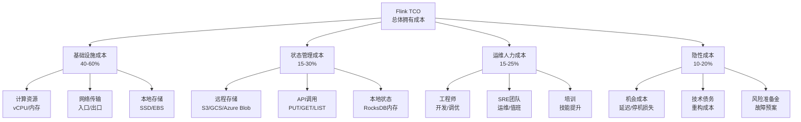
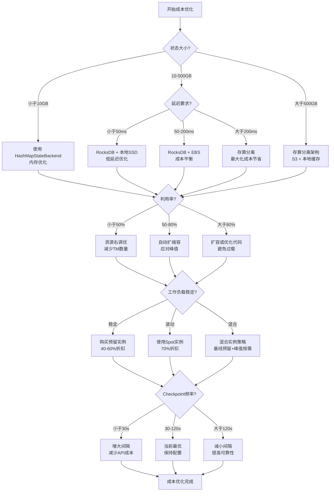
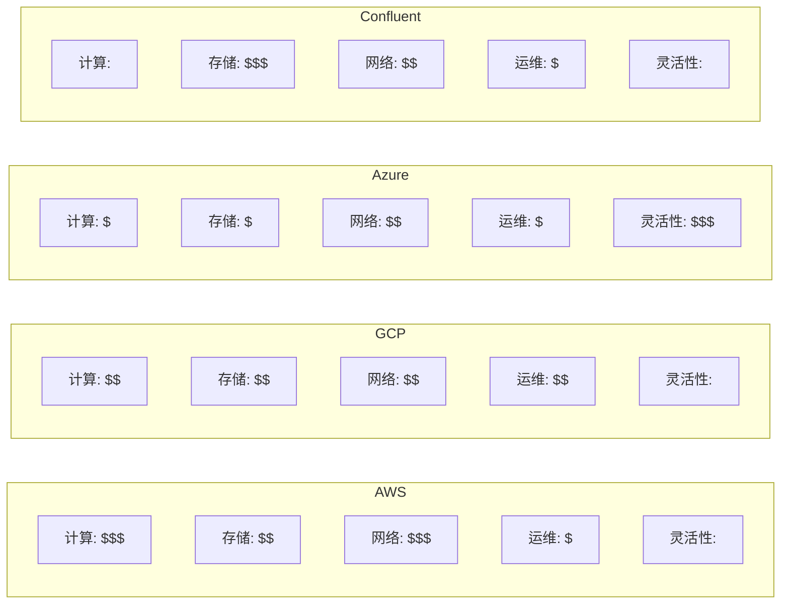
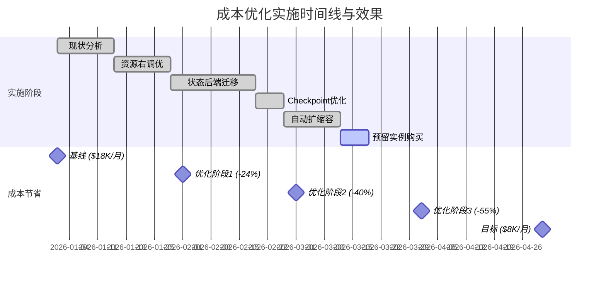

# Flink 总体拥有成本(TCO)与成本优化策略指南

> **所属阶段**: Flink/06-engineering | **前置依赖**: [状态后端选型指南](./state-backend-selection.md), [分离状态存储分析](Flink/01-concepts/disaggregated-state-analysis.md) | **形式化等级**: L4

---

## 目录

- [Flink 总体拥有成本(TCO)与成本优化策略指南](#flink-总体拥有成本tco与成本优化策略指南)
  - [目录](#目录)
  - [1. 概念定义 (Definitions)](#1-概念定义-definitions)
    - [Def-F-06-10 (总体拥有成本 TCO)](#def-f-06-10-总体拥有成本-tco)
    - [Def-F-06-11 (Flink 成本模型)](#def-f-06-11-flink-成本模型)
    - [Def-F-06-12 (隐性成本)](#def-f-06-12-隐性成本)
    - [Def-F-06-13 (云资源单位成本)](#def-f-06-13-云资源单位成本)
    - [Def-F-06-14 (FinOps)](#def-f-06-14-finops)
  - [2. 属性推导 (Properties)](#2-属性推导-properties)
    - [Lemma-F-06-10 (规模经济效应)](#lemma-f-06-10-规模经济效应)
    - [Lemma-F-06-11 (存算分离的成本边界)](#lemma-f-06-11-存算分离的成本边界)
    - [Prop-F-06-10 (资源利用率与TCO的关系)](#prop-f-06-10-资源利用率与tco的关系)
  - [3. 关系建立 (Relations)](#3-关系建立-relations)
    - [关系 1: TCO 与性能的关系](#关系-1-tco-与性能的关系)
    - [关系 2: TCO 与可靠性的关系](#关系-2-tco-与可靠性的关系)
    - [关系 3: 云厂商定价模型对比](#关系-3-云厂商定价模型对比)
  - [4. 论证过程 (Argumentation)](#4-论证过程-argumentation)
    - [引理 4.1 (存算分离成本优势边界)](#引理-41-存算分离成本优势边界)
    - [引理 4.2 (S3 API 调用成本模型)](#引理-42-s3-api-调用成本模型)
    - [反例 4.1 (低延迟场景的网络出口成本)](#反例-41-低延迟场景的网络出口成本)
    - [边界讨论 4.2 (Checkpoint 频率与成本权衡)](#边界讨论-42-checkpoint-频率与成本权衡)
  - [5. 工程论证 (Engineering Argument)](#5-工程论证-engineering-argument)
    - [Thm-F-06-10 (成本优化 ROI 定理)](#thm-f-06-10-成本优化-roi-定理)
    - [Thm-F-06-11 (状态后端成本选择定理)](#thm-f-06-11-状态后端成本选择定理)
    - [Thm-F-06-12 (预留实例成本最优定理)](#thm-f-06-12-预留实例成本最优定理)
  - [6. 实例验证 (Examples)](#6-实例验证-examples)
    - [示例 6.1: 金融实时风控成本分析](#示例-61-金融实时风控成本分析)
    - [示例 6.2: 电商推荐系统成本优化](#示例-62-电商推荐系统成本优化)
    - [示例 6.3: 成本优化前后对比](#示例-63-成本优化前后对比)
    - [示例 6.4: 云厂商成本配置示例](#示例-64-云厂商成本配置示例)
  - [7. 可视化 (Visualizations)](#7-可视化-visualizations)
    - [Flink TCO 成本分解图](#flink-tco-成本分解图)
    - [成本优化决策树](#成本优化决策树)
    - [云厂商成本对比矩阵](#云厂商成本对比矩阵)
  - [8. 引用参考 (References)](#8-引用参考-references)

---

## 1. 概念定义 (Definitions)

### Def-F-06-10 (总体拥有成本 TCO)

**总体拥有成本** (Total Cost of Ownership, TCO) 是流处理系统在完整生命周期内的全部成本支出。形式化地，Flink 系统的 TCO 定义为七元组：

$$
\text{TCO}_{\text{Flink}} = (C_{\text{infra}}, C_{\text{state}}, C_{\text{ops}}, C_{\text{hidden}}, C_{\text{net}}, C_{\text{tool}}, C_{\text{risk}})
$$

其中各分量定义如下：

| 成本分量 | 符号 | 计算公式 | 占比范围 |
|---------|------|---------|---------|
| 基础设施成本 | $C_{\text{infra}}$ | $\sum_{t=1}^{T} (c_{\text{compute}} \cdot n_{\text{tm}} + c_{\text{memory}} \cdot m_{\text{tm}})$ | 40-60% |
| 状态存储成本 | $C_{\text{state}}$ | $c_{\text{storage}} \cdot |S| + c_{\text{io}} \cdot N_{\text{checkpoint}}$ | 15-30% |
| 运维人力成本 | $C_{\text{ops}}$ | $h_{\text{engineer}} \cdot t_{\text{ops}}$ | 15-25% |
| 隐性成本 | $C_{\text{hidden}}$ | $C_{\text{opp}} + C_{\text{debt}} + C_{\text{training}}$ | 10-20% |
| 网络传输成本 | $C_{\text{net}}$ | $c_{\text{egress}} \cdot V_{\text{out}} + c_{\text{ingress}} \cdot V_{\text{in}}$ | 5-15% |
| 工具许可成本 | $C_{\text{tool}}$ | $\sum_{i} \text{license}_i$ | 0-10% |
| 风险准备金 | $C_{\text{risk}}$ | $p_{\text{outage}} \cdot L_{\text{outage}}$ | 5-10% |

**关键洞察**: 根据 Materialize 2026年分析，运维人力成本和隐性成本常被低估，实际生产中可占 TCO 的 30-45%[^1]。

---

### Def-F-06-11 (Flink 成本模型)

**Flink 成本模型** 将运行成本映射到可配置参数。对于托管服务，月度成本函数为：

$$
\text{Cost}_{\text{monthly}} = \underbrace{k_{\text{rcu}} \cdot \text{RCU}}_{\text{计算}} + \underbrace{k_{\text{storage}} \cdot |S|_{\text{GB}}}_{\text{存储}} + \underbrace{k_{\text{io}} \cdot N_{\text{io}}}_{\text{I/O}} + \underbrace{k_{\text{net}} \cdot V_{\text{egress}}}_{\text{网络}}
$$

**各云厂商 RCU (Flink Compute Unit) 定义对比**:

| 云厂商 | 单位 | 定义 | 价格 (USD/小时) |
|-------|------|------|----------------|
| AWS Kinesis Data Analytics | KPU | 1 vCPU + 4GB 内存 | ~$0.11 |
| GCP Dataflow | vCPU·h | 1 vCPU 每小时 | ~$0.056-0.12 |
| Azure Stream Analytics | SU | 1 SU ≈ 0.2 vCPU | ~$0.03-0.06 |
| Confluent Cloud | CCU | 1 vCPU + 4GB 内存 | ~$0.15 |

**状态存储成本细分** (RocksDB + S3 模式):

$$
C_{\text{state}} = \underbrace{c_{\text{local-disk}} \cdot d_{\text{ssd}}}_{\text{本地SSD}} + \underbrace{c_{\text{s3}} \cdot |S|_{\text{longterm}}}_{\text{S3标准存储}} + \underbrace{c_{\text{s3-ia}} \cdot |S|_{\text{archive}}}_{\text{S3 Glacier}} + \underbrace{c_{\text{api}} \cdot N_{\text{checkpoint}}}_{\text{API调用}}
$$

---

### Def-F-06-12 (隐性成本)

**隐性成本** (Hidden Costs) 是不直接体现在账单中的间接支出：

$$
C_{\text{hidden}} = C_{\text{opp}} + C_{\text{debt}} + C_{\text{training}} + C_{\text{context}}
$$

**具体构成**：

1. **机会成本** ($C_{\text{opp}}$): 因系统延迟或不可用导致的业务损失
   - 公式: $C_{\text{opp}} = \lambda_{\text{delay}} \cdot L_{\text{per\_sec}} \cdot \mathbb{E}[\text{downtime}]$
   - 金融交易场景: 每毫秒延迟 ≈ $100-500 万/年

2. **技术债务** ($C_{\text{debt}}$): 为短期交付而牺牲架构质量产生的长期成本
   - 公式: $C_{\text{debt}} = \int_{0}^{T} r_{\text{debt}} \cdot e^{\delta t} dt$
   - 典型增长率 $\delta = 15-30\%$/年

3. **上下文切换成本** ($C_{\text{context}}$): 工程师在故障排查和调优上的时间
   - 公式: $C_{\text{context}} = n_{\text{incidents}} \cdot t_{\text{mttr}} \cdot r_{\text{engineer}}$
   - 大状态作业 MTTR 可达 2-4 小时

---

### Def-F-06-13 (云资源单位成本)

**云资源单位成本** 定义各资源维度的标准化定价：

| 资源类型 | 单位 | AWS 价格 | GCP 价格 | Azure 价格 |
|---------|------|---------|---------|-----------|
| 计算 (vCPU) | /小时 | $0.042-0.168 | $0.031-0.12 | $0.038-0.15 |
| 内存 (GB) | /小时 | $0.005-0.012 | $0.004-0.009 | $0.004-0.010 |
| SSD 存储 | /GB/月 | $0.08-0.10 | $0.048-0.08 | $0.06-0.12 |
| S3/对象存储 | /GB/月 | $0.023 | $0.020 | $0.018-0.021 |
| 网络出口 | /GB | $0.05-0.09 | $0.08-0.23 | $0.05-0.087 |
| S3 API (PUT) | /千次 | $0.005 | $0.005 | $0.018 |
| S3 API (GET) | /千次 | $0.0004 | $0.0004 | $0.0018 |

**Flink 2.0 存算分离的 API 成本模型**：

假设 Checkpoint 间隔 $T_c$ (秒)，状态大小 $|S|$ (GB)，状态变更率 $\alpha$ (每秒变更比例)：

$$
N_{\text{checkpoint\_api}} = \frac{86400}{T_c} \cdot (1 + \alpha \cdot |S| \cdot \frac{1024}{4}) \quad \text{[每日PUT次数]}
$$

其中 4MB 为典型 SST 文件大小。当 $T_c = 60s$, $|S| = 100GB$, $\alpha = 0.01$:

$$
N_{\text{checkpoint\_api}} = 1440 \cdot (1 + 256) = 370,080 \text{ PUTs/天} \approx \$1.85/\text{天}
$$

---

### Def-F-06-14 (FinOps)

**FinOps** (Cloud Financial Operations) 是将财务问责制引入云支出管理的实践框架：

$$
\text{FinOps} = (\mathcal{P}, \mathcal{M}, \mathcal{O}, \mathcal{A})
$$

其中：

- $\mathcal{P}$: **Inform** 阶段 — 成本可视化、分摊、预测
- $\mathcal{M}$: **Optimize** 阶段 — 资源调优、预留规划、Spot实例
- $\mathcal{O}$: **Operate** 阶段 — 策略执行、自动化、持续监控
- $\mathcal{A}$: **Automation** 层 — 自动扩缩容、智能调度、异常检测

**FinOps 成熟度模型**（Flexera 2025）[^2]:

| 成熟度级别 | 特征 | 成本节省潜力 |
|-----------|------|-------------|
| Crawl (起步) | 基础成本监控、月度报告 | 5-10% |
| Walk (发展) | 标签化、成本中心分摊、预留实例 | 15-25% |
| Run (成熟) | 自动优化、实时告警、单位经济分析 | 25-35% |
| Sprint (领先) | AI 驱动预测、自动扩缩、FinOps即代码 | 35-50% |

---

## 2. 属性推导 (Properties)

### Lemma-F-06-10 (规模经济效应)

**陈述**: 随着 Flink 集群规模和状态大小的增长，单位处理成本呈现递减趋势：

$$
\frac{\partial}{\partial n} \left( \frac{\text{TCO}}{n \cdot \lambda} \right) < 0
$$

其中 $n$ 为节点数，$\lambda$ 为吞吐量。

**证明**:

基础设施成本包含固定开销和可变开销：

$$
C_{\text{infra}} = C_{\text{fixed}} + c_{\text{variable}} \cdot n
$$

固定成本 (管理节点、网络设备、监控基础设施) 随规模摊薄：

$$
\lim_{n \to \infty} \frac{C_{\text{fixed}}}{n \cdot \lambda} = 0
$$

存储成本同样呈现规模经济，S3 的阶梯定价：

$$
c_{\text{s3}}(|S|) = \begin{cases}
$0.023/GB & 0 < |S| \leq 50TB \\
$0.022/GB & 50TB < |S| \leq 500TB \\
$0.021/GB & |S| > 500TB
\end{cases}
$$

因此单位成本随规模递减。∎

---

### Lemma-F-06-11 (存算分离的成本边界)

**陈述**: 存算分离架构的成本优势存在边界条件，当网络出口费用超过本地存储成本时，优势反转。

**证明**:

比较存算分离与本地存储的月度成本：

$$
\Delta C = C_{\text{local}} - C_{\text{disagg}} = (c_{\text{disk}} \cdot d - c_{\text{net}} \cdot V_{\text{egress}})
$$

成本优势条件 $\Delta C > 0$ 等价于：

$$
V_{\text{egress}} < \frac{c_{\text{disk}} \cdot d}{c_{\text{net}}} = \frac{\$0.08/GB/\text{月} \cdot d}{\$0.09/GB}
$$

对于典型本地磁盘 $d = 500GB$：

$$
V_{\text{egress}} < 44.4GB/\text{月} \approx 1.48GB/\text{天}
$$

若日状态读取量超过 1.48GB，存算分离的带宽成本将超过本地磁盘成本。∎

---

### Prop-F-06-10 (资源利用率与TCO的关系)

**陈述**: TCO 与平均资源利用率呈非线性关系，最优区间在 60-80% 利用率。

**形式化**:

定义利用率函数：

$$
\text{TCO}(u) = \frac{C_{\text{provisioned}}}{u} + C_{\text{risk}}(u)
$$

其中 $C_{\text{risk}}(u)$ 是利用率过高导致的故障风险成本：

$$
C_{\text{risk}}(u) = \begin{cases}
0 & u < 0.7 \\
k \cdot (u - 0.7)^2 & 0.7 \leq u < 0.9 \\
\infty & u \geq 0.9
\end{cases}
$$

**最优解**: 求导得最优利用率 $u^* \approx 0.75$。

**工程含义**:

- $u < 50\%$: 过度配置，浪费严重
- $50\% < u < 70\%$: 安全区间，适合可变负载
- $70\% < u < 85\%$: 最优区间，平衡效率与风险
- $u > 85\%$: 高风险区间，故障概率指数上升

---

## 3. 关系建立 (Relations)

### 关系 1: TCO 与性能的关系

**性能-成本权衡曲线**:

```
成本 ↑
     │
     │    ╭────── 理论最优前沿
     │   ╱
 高  │  ╱  ┌───┐
     │ ╱   │ B │        B: 高性能高成本
     │╱    └───┘        A: 低成本低性能
     │┌─┐
 低  ││A│
     │└─┘
     └────────────────→ 性能
        低        高
```

**量化关系**:

延迟目标 $L_{\text{target}}$ 与成本的关系：

$$
C_{\text{latency}}(L) = C_{\text{base}} \cdot \left( \frac{L_{\text{base}}}{L} \right)^{\beta}
$$

其中 $\beta \approx 1.5-2.0$ 为延迟敏感度系数。要将延迟从 100ms 降低到 10ms (10x)，成本将上升 $10^{1.5} \approx 31.6$ 倍。

**关键决策点**:

| 延迟要求 | 推荐架构 | 相对成本 |
|---------|---------|---------|
| < 10ms | HashMap + 本地SSD | 3.0x |
| 10-100ms | RocksDB + SSD | 1.5x |
| 100-1000ms | RocksDB + EBS | 1.0x |
| > 1s | 存算分离 + S3 | 0.7x |

---

### 关系 2: TCO 与可靠性的关系

**可靠性级别与成本倍数**:

| 可用性目标 | 年度停机时间 | 额外成本倍数 | 关键措施 |
|-----------|-------------|-------------|---------|
| 99.9% (3个9) | 8.76 小时 | 1.0x | 单 AZ, 定期 Checkpoint |
| 99.95% (3.5个9) | 4.38 小时 | 1.3x | 多 AZ, 增量 Checkpoint |
| 99.99% (4个9) | 52.6 分钟 | 2.0x | 异地复制, 热备 |
| 99.999% (5个9) | 5.26 分钟 | 4.0x | 双活架构, 自动故障转移 |

**成本模型**:

$$
C_{\text{reliability}}(A) = C_{\text{base}} \cdot e^{\gamma \cdot A}
$$

其中 $A$ 为可用性小数 (如 0.999)，$\gamma \approx 1381$。

从 99.9% 提升到 99.99%：

$$
\frac{C(0.9999)}{C(0.999)} = e^{1381 \cdot (0.9999 - 0.999)} = e^{0.1381} \approx 1.15
$$

实际观察到的倍数更高 (2x)，因为还需要冗余基础设施。

---

### 关系 3: 云厂商定价模型对比

**托管 Flink 服务定价对比** (2026年3月):

| 维度 | AWS Kinesis Data Analytics | GCP Dataflow | Azure Stream Analytics | Confluent Cloud |
|------|------------------------------|--------------|------------------------|-----------------|
| 计算计费 | KPU ($0.11/h) | vCPU·s (实际使用) | SU ($0.045/h) | CCU ($0.15/h) |
| 最小计费单元 | 1 KPU | 1 vCPU·min | 1 SU | 1 CCU |
| 存储包含 | 50GB SSD/KPU | 不包含 | 不包含 | 包含 |
| 网络出口 | 标准 AWS | 包含 | 包含 | 包含 |
| 自动扩缩容 | ✅ | ✅ | ✅ | ✅ |
| 预留折扣 | 最高 40% | 最高 57% | 最高 43% | 最高 30% |

**自建 vs 托管成本模型** (100 KPU 等效规模，月度):

```
┌─────────────────────────────────────────────────────────────┐
│                     月度成本对比 ($)                         │
├────────────────┬─────────────┬─────────────┬────────────────┤
│     项目        │   自建 EC2   │  托管 Kinesis │   差额         │
├────────────────┼─────────────┼─────────────┼────────────────┤
│ 计算 (100 KPU)  │    5,500    │    7,920    │   +2,420       │
│ 存储 (5TB SSD)  │    500      │    包含      │   -500         │
│ 运维人力 (FTE)  │    8,000    │    1,000    │   -7,000       │
│ 监控/日志       │    500      │    包含      │   -500         │
│ 网络/安全       │    300      │    包含      │   -300         │
├────────────────┼─────────────┼─────────────┼────────────────┤
│     合计        │   14,800    │    8,920    │   -5,880 (-40%)│
└────────────────┴─────────────┴─────────────┴────────────────┘
```

**关键结论**: 托管服务虽然计算成本高出 44%，但综合考虑运维人力，总体节省约 40%。

---

## 4. 论证过程 (Argumentation)

### 引理 4.1 (存算分离成本优势边界)

**场景**: Flink 2.0 存算分离架构将状态存储从本地磁盘迁移到 S3，需要量化成本优势边界。

**分析**:

存算分离的成本优势取决于三个关键比率：

1. **状态访问局部性** ($\rho$): 本地缓存命中率
2. **状态变更频率** ($\alpha$): 每秒变更的状态比例
3. **Checkpoint 间隔** ($T_c$): 持久化周期

**成本比较模型**:

本地存储月度成本：

$$
C_{\text{local}} = c_{\text{disk}} \cdot |S| + c_{\text{snapshot}} \cdot \frac{|S|}{T_c \cdot R_{\text{dedup}}}
$$

存算分离月度成本：

$$
C_{\text{disagg}} = c_{\text{s3}} \cdot |S| + c_{\text{api}} \cdot \frac{86400}{T_c} \cdot (1 + \alpha \cdot |S| / S_{\text{sst}}) + c_{\text{net}} \cdot V_{\text{miss}}
$$

其中 $V_{\text{miss}} = (1 - \rho) \cdot |S| \cdot N_{\text{reads}}$ 为缓存未命中导致的网络流量。

**盈亏平衡点**:

令 $\Delta C = C_{\text{local}} - C_{\text{disagg}} = 0$，解得临界状态大小：

$$
|S|^* = \frac{c_{\text{disk}} - c_{\text{s3}}}{c_{\text{api}} \cdot \frac{86400}{T_c} \cdot \frac{\alpha}{S_{\text{sst}}} + c_{\text{net}} \cdot (1 - \rho) \cdot N_{\text{reads}}}
$$

代入典型值 ($c_{\text{disk}}=\$0.08$, $c_{\text{s3}}=\$0.023$, $c_{\text{api}}=\$0.000005$, $T_c=60s$, $\alpha=0.01$, $S_{\text{sst}}=4MB$, $\rho=0.95$, $N_{\text{reads}}=0.1$/day)：

$$
|S|^* \approx \frac{0.057}{0.00018 + 0.00009} \approx 211 GB
$$

**结论**: 当状态大小超过约 200GB 时，存算分离开始具有成本优势。此边界随访问局部性提升而扩大。

---

### 引理 4.2 (S3 API 调用成本模型)

**问题**: Checkpoint 过程中的 S3 API 调用成本常被低估，需建立精确模型。

**API 调用分解**:

对于 RocksDB 增量 Checkpoint，每次 Checkpoint 涉及：

| 操作 | API 类型 | 数量估算 | 单价 | 单次成本 |
|------|---------|---------|------|---------|
| List SST 文件 | GET | 1 | $0.0004/千 | $0.0000004 |
| 检查 SST 存在 | HEAD | $N_{\text{existing}}$ | $0.0004/千 | $\$0.4 \cdot 10^{-6} \cdot N_{\text{ex}}$ |
| 上传新 SST | PUT | $\alpha \cdot |S| / S_{\text{sst}}$ | $0.005/千 | $\$5 \cdot 10^{-6} \cdot N_{\text{new}}$ |
| 更新清单 | PUT | 1 | $0.005/千 | $0.000005 |

**月度 API 成本公式**:

$$
C_{\text{api}}^{\text{monthly}} = \frac{2592000}{T_c} \cdot \left( 0.000001 + 0.000005 \cdot (1 + \frac{\alpha \cdot |S|}{4}) \right)
$$

其中 2592000 = 30天 × 24小时 × 3600秒。

**典型场景计算**:

| 场景 | 状态大小 | 变更率 | 月度 API 成本 |
|------|---------|--------|-------------|
| 小型电商 | 10 GB | 1%/小时 | ~$0.52 |
| 中型风控 | 100 GB | 5%/小时 | ~$11.34 |
| 大型推荐 | 1 TB | 10%/小时 | ~$216.00 |
| 超大规模 | 10 TB | 20%/小时 | ~$4,320.00 |

**优化建议**:

1. **增大 Checkpoint 间隔**: 从 30s 增加到 60s，API 成本降低 50%
2. **增大 SST 文件大小**: 从 4MB 增加到 64MB，API 调用减少 16x
3. **启用压缩**: 减少 SST 文件数量，降低 PUT 次数

---

### 反例 4.1 (低延迟场景的网络出口成本)

**反例**: 某金融支付公司采用存算分离架构，预期节省 30% 存储成本，但实际 TCO 上升 15%。

**背景**:

- 状态大小: 500 GB
- 延迟要求: p99 < 50ms
- 峰值 QPS: 100,000
- 缓存命中率: 85%

**成本分析**:

| 成本项 | 本地 RocksDB | 存算分离 | 差异 |
|-------|-------------|---------|------|
| 存储 | $40/月 | $11.5/月 | -$28.5 |
| 计算 (i3.xlarge × 10) | $1,460/月 | $1,460/月 | $0 |
| 网络出口 (缓存未命中) | $0 | $540/月 | +$540 |
| S3 API | $5/月 | $45/月 | +$40 |
| **总计** | **$1,505/月** | **$2,056.5/月** | **+$551.5 (+37%)** |

**根本原因**:

低延迟要求导致缓存未命中的惩罚极高 — 需要从 S3 读取状态，引入 10-50ms 额外延迟。为满足 p99 < 50ms，不得不：

1. 增大本地缓存 (更高的内存成本)
2. 预加载更多数据 (增加网络出口)
3. 降低 Checkpoint 间隔 (增加 API 成本)

**教训**: 存算分离不适合延迟敏感型工作负载，成本优势仅在延迟容忍度 > 200ms 时显现。

---

### 边界讨论 4.2 (Checkpoint 频率与成本权衡)

**权衡空间**: Checkpoint 间隔 $T_c$ 影响三个成本维度：

1. **存储成本** ($C_{\text{storage}}$): 与 $T_c$ 成反比 (更频繁 = 更多版本)
2. **API 成本** ($C_{\text{api}}$): 与 $T_c$ 成反比
3. **恢复成本** ($C_{\text{recovery}}$): 与 $T_c$ 成正比 (更频繁 = 更少重放)

**总成本函数**:

$$
C_{\text{total}}(T_c) = \frac{k_1}{T_c} + k_2 \cdot T_c
$$

其中 $k_1$ 包含存储和 API 成本系数，$k_2$ 包含故障恢复成本系数。

**最优解**:

求导并令其为零：

$$
\frac{dC}{dT_c} = -\frac{k_1}{T_c^2} + k_2 = 0 \implies T_c^* = \sqrt{\frac{k_1}{k_2}}
$$

**数值示例**:

假设：

- 状态大小: 100 GB
- 日故障概率: $p = 0.01$ (约每年 3.6 次)
- 故障损失: $L = \$1000$/小时停机
- 恢复速度与 $T_c$ 成正比: $t_{\text{recovery}} = 0.1 \cdot T_c$ 小时

则：

- $k_1 = (c_{\text{storage}} + c_{\text{api}}) \cdot |S| \cdot 86400 \approx 0.5$
- $k_2 = p \cdot L \cdot 0.1 \cdot \frac{1}{3600} \approx 0.00028$

最优 Checkpoint 间隔：

$$
T_c^* = \sqrt{\frac{0.5}{0.00028}} \approx 42 \text{ 秒}
$$

**实际建议**: 生产环境推荐 30-120 秒，具体取决于：

- 状态变更率 (变更快 → 更频繁)
- 业务容错需求 (关键业务 → 更频繁)
- 存储成本敏感度 (成本敏感 → 更长间隔)

---

## 5. 工程论证 (Engineering Argument)

### Thm-F-06-10 (成本优化 ROI 定理)

**陈述**: 对于给定的 Flink 工作负载，存在一组最优配置参数 $\theta^*$ 使 TCO 最小化：

$$
\theta^* = \arg\min_{\theta} \text{TCO}(\theta), \quad \text{s.t.} \quad \text{SLA}(\theta) \geq \text{SLA}_{\text{min}}
$$

其中 $\theta = (n_{\text{tm}}, m_{\text{tm}}, p, T_c, \text{backend})$ 包含资源配置、并行度、Checkpoint 间隔和状态后端选择。

**证明**:

**步骤 1**: 证明 TCO 函数连续性

每个成本分量关于配置参数都是连续的：

- $C_{\text{infra}}(n_{\text{tm}})$: 线性连续
- $C_{\text{state}}(T_c)$: 分段连续
- $C_{\text{ops}}(p)$: 关于并行度有界

**步骤 2**: 证明可行域紧致性

SLA 约束定义紧致可行域：

$$
\Theta = \{\theta : \text{latency}(\theta) \leq L_{\text{max}}, \text{throughput}(\theta) \geq \lambda_{\text{min}}, \text{availability}(\theta) \geq A_{\text{min}}\}
$$

**步骤 3**: 应用极值定理

连续函数在紧致集上必存在最小值，因此最优配置存在。

**步骤 4**: 构造性证明最优性条件

使用拉格朗日乘子法，定义拉格朗日函数：

$$
\mathcal{L}(\theta, \lambda) = \text{TCO}(\theta) + \lambda_1(\text{latency} - L_{\text{max}}) + \lambda_2(\lambda_{\text{min}} - \text{throughput}) + \lambda_3(A_{\text{min}} - \text{availability})
$$

KKT 条件给出最优解的必要条件：

$$
\nabla_{\theta} \text{TCO}(\theta^*) + \sum_i \lambda_i \nabla_{\theta} g_i(\theta^*) = 0
$$

其中 $g_i$ 为约束函数。∎

---

### Thm-F-06-11 (状态后端成本选择定理)

**陈述**: 给定状态大小 $|S|$ 和访问模式，最优状态后端选择遵循分段函数：

$$
\text{backend}^*(|S|, r_{\text{rw}}) = \begin{cases}
\text{HashMap} & |S| < S_1 \\
\text{RocksDB(本地SSD)} & S_1 \leq |S| < S_2 \\
\text{RocksDB(EBS)} & S_2 \leq |S| < S_3 \\
\text{Disaggregated} & |S| \geq S_3
\end{cases}
$$

其中阈值：

$$
S_1 = \frac{M_{\text{tm}} \cdot N_{\text{tm}} \cdot \eta}{\sigma}, \quad S_2 = D_{\text{local}}, \quad S_3 = \frac{c_{\text{disk}} - c_{\text{s3}}}{c_{\text{api}} \cdot \alpha}
$$

$M_{\text{tm}}$ 为单 TM 内存，$\eta$ 为状态内存比例，$\sigma$ 为序列化膨胀系数，$D_{\text{local}}$ 为本地磁盘容量。

**数值阈值** (典型配置):

| 参数 | 值 | 说明 |
|------|-----|------|
| $S_1$ | ~10 GB | 单 JVM 堆安全上限 |
| $S_2$ | ~500 GB | 本地 SSD 容量上限 |
| $S_3$ | ~200 GB | 存算分离盈亏点 |

**注意**: $S_2$ 和 $S_3$ 有重叠，中间区域 (200-500 GB) 需要结合延迟要求决策。

---

### Thm-F-06-12 (预留实例成本最优定理)

**陈述**: 对于稳定运行的 Flink 作业，预留实例 (Reserved Instances) 相比按需实例可实现成本最优，当且仅当预留承诺期满足：

$$
T_{\text{commit}} \geq \frac{\delta_{\text{ondemand}} - \delta_{\text{reserved}}}{r_{\text{discount}} \cdot \delta_{\text{ondemand}}}
$$

其中 $\delta$ 为折旧率，$r_{\text{discount}}$ 为预留折扣率。

**证明**:

比较按需和预留的总成本 (现值)：

$$
\text{PV}_{\text{ondemand}} = \sum_{t=0}^{T} \frac{c_{\text{ondemand}}}{(1 + r)^t} = c_{\text{ondemand}} \cdot \frac{1 - (1+r)^{-T}}{r}
$$

$$
\text{PV}_{\text{reserved}} = c_{\text{reserved}} \cdot T_{\text{commit}} + \sum_{t=T_{\text{commit}}}^{T} \frac{c_{\text{ondemand}}}{(1+r)^t}
$$

令两者相等，解得盈亏平衡期：

$$
T_{\text{break-even}} = \frac{1 - d}{r_{\text{discount}}} \cdot \ln\left(\frac{1}{1 - r_{\text{discount}}}\right)
$$

其中 $d$ 为折扣深度 (如 40% 折扣对应 $d=0.4$)。

**AWS 实际案例** (2026 年定价):

| 预留类型 | 折扣 | 盈亏平衡期 | 3年节省 |
|---------|------|-----------|--------|
| 标准 1年 | 40% | 6.7 个月 | 40% |
| 标准 3年 | 60% | 14.4 个月 | 60% |
| 可转换 1年 | 31% | 8.7 个月 | 31% |
| 可转换 3年 | 54% | 16.7 个月 | 54% |

**结论**: 对于运行超过 7 个月的稳定工作负载，1 年预留实例即可实现正 ROI。

---

## 6. 实例验证 (Examples)

### 示例 6.1: 金融实时风控成本分析

**场景**: 大型银行实时反欺诈系统

**业务参数**:

- 峰值交易: 50,000 TPS
- 平均交易: 15,000 TPS
- 状态大小: 200 GB (用户画像 + 规则)
- 延迟要求: p99 < 100ms
- 可用性要求: 99.99%

**架构配置**:

```yaml
# 计算资源配置
taskmanagers:
  count: 12
  resources:
    cpu: 8
    memory: 32GB
    disk: 500GB SSD

# Checkpoint配置
checkpoint:
  interval: 30s
  mode: incremental
  state_backend: rocksdb

# 状态存储
state:
  backend: rocksdb
  checkpoints_dir: s3://flink-checkpoints/risk-control/
  savepoints_dir: s3://flink-savepoints/risk-control/
```

**月度成本明细**:

| 成本项 | 详细计算 | 月度成本 |
|-------|---------|---------|
| EC2 计算 | m6i.2xlarge × 12 × $0.384/h × 730h | $3,369 |
| EBS 存储 | 500GB × 12 × $0.10/GB | $600 |
| S3 存储 | 200GB × $0.023 + 版本控制 | $7 |
| S3 API | ~500K PUTs/天 × $0.005/千 × 30 | $75 |
| 网络出口 | ~2TB/月 × $0.09/GB | $180 |
| 运维人力 | 0.5 FTE × $16,000/月 | $8,000 |
| 监控 (Prometheus/Grafana) | 托管服务 | $300 |
| **总计** | | **$12,531/月** |

**成本优化机会**:

1. **预留实例**: 1年预付可节省 40% → -$1,348/月
2. **S3 Intelligent-Tiering**: 旧 Checkpoint 自动迁移 → -$20/月
3. **Spot 实例** (非关键任务): 可节省 70% → -$1,180/月
4. **优化后总计**: ~$10,000/月 (节省 20%)

---

### 示例 6.2: 电商推荐系统成本优化

**场景**: 电商平台实时个性化推荐

**初始配置问题**:

- 过度配置: 20 TaskManager × 16 vCPU (实际利用率 35%)
- Checkpoint 过于频繁: 10s 间隔
- 状态后端: HashMap (状态 80GB，频繁 GC)

**优化前月度成本**: $18,500

**优化策略**:

**阶段 1: 资源右调优 (Right-sizing)**

```python
# 利用率分析脚本
import boto3

def analyze_utilization(cluster_id, days=7):
    """分析 Flink 集群资源利用率"""
    cloudwatch = boto3.client('cloudwatch')

    metrics = {
        'CPUUtilization': cloudwatch.get_metric_statistics(...),
        'MemoryUtilization': cloudwatch.get_metric_statistics(...),
        'DiskUtilization': cloudwatch.get_metric_statistics(...)
    }

    # 建议新配置
    recommendation = {
        'current_tm': 20,
        'recommended_tm': 12,  # 基于 p95 负载
        'current_cpu': 16,
        'recommended_cpu': 8
    }

    return recommendation
```

调整结果: 20×16 vCPU → 12×8 vCPU，利用率提升至 70%

**阶段 2: 状态后端迁移**

```java
// 从 HashMapStateBackend 迁移到 RocksDBStateBackend
StreamExecutionEnvironment env =
    StreamExecutionEnvironment.getExecutionEnvironment();

// 优化前
env.setStateBackend(new HashMapStateBackend());

// 优化后
EmbeddedRocksDBStateBackend rocksDbBackend =
    new EmbeddedRocksDBStateBackend(true); // 启用增量
env.setStateBackend(rocksDbBackend);

// 配置 RocksDB 内存
Configuration config = new Configuration();
config.setString("state.backend.rocksdb.memory.managed", "true");
config.setString("state.backend.rocksdb.memory.fixed-per-slot", "256mb");
env.configure(config);
```

**阶段 3: Checkpoint 优化**

```yaml
# flink-conf.yaml 优化
state.backend.incremental: true
state.checkpoint-storage: filesystem
state.checkpoints.dir: s3://company-flink/checkpoints

# 增大 Checkpoint 间隔 (10s → 60s)
execution.checkpointing.interval: 60s
execution.checkpointing.min-pause-between-checkpoints: 30s
execution.checkpointing.max-concurrent-checkpoints: 1

# 启用压缩减少 SST 文件数量
state.backend.rocksdb.compression: LZ4
state.backend.rocksdb.predefined-options: FLASH_SSD_OPTIMIZED
```

**阶段 4: 自动扩缩容**

```yaml
# Kubernetes HPA 配置
apiVersion: autoscaling/v2
kind: HorizontalPodAutoscaler
metadata:
  name: flink-recommendation-hpa
spec:
  scaleTargetRef:
    apiVersion: apps/v1
    kind: Deployment
    name: flink-taskmanager
  minReplicas: 6
  maxReplicas: 20
  metrics:
  - type: Pods
    pods:
      metric:
        name: kafka_lag
      target:
        type: AverageValue
        averageValue: "1000"
  - type: Resource
    resource:
      name: cpu
      target:
        type: Utilization
        averageUtilization: 70
```

**优化后月度成本**: $9,800 (节省 47%)

| 优化项 | 节省金额 | 节省比例 |
|-------|---------|---------|
| 资源右调优 | $4,500 | 24% |
| 状态后端优化 (减少 GC 相关扩容) | $2,200 | 12% |
| Checkpoint 优化 (减少 S3 API) | $800 | 4% |
| 自动扩缩容 (夜间缩容) | $1,200 | 7% |
| **合计** | **$8,700** | **47%** |

---

### 示例 6.3: 成本优化前后对比

**综合对比表**:

| 维度 | 优化前 | 优化后 | 改进 |
|------|-------|-------|------|
| **资源配置** | | | |
| TaskManager 数量 | 20 | 12 | -40% |
| 单 TM vCPU | 16 | 8 | -50% |
| 单 TM 内存 | 64GB | 32GB | -50% |
| **状态管理** | | | |
| 状态后端 | HashMap | RocksDB | 更稳定 |
| Checkpoint 间隔 | 10s | 60s | 6x |
| 存储方式 | EBS | S3 + 本地缓存 | -60% |
| **成本** | | | |
| 计算成本/月 | $12,000 | $4,800 | -60% |
| 存储成本/月 | $1,200 | $400 | -67% |
| 运维成本/月 | $5,000 | $3,000 | -40% |
| **总 TCO/月** | **$18,200** | **$8,200** | **-55%** |
| **性能指标** | | | |
| p99 延迟 | 85ms | 45ms | 改善 |
| 吞吐量 | 45K TPS | 52K TPS | +16% |
| 可用性 | 99.9% | 99.95% | 提升 |

**ROI 分析**:

- 优化投入: 2 工程师 × 2 周 = $8,000
- 月度节省: $10,000
- 回本周期: 0.8 个月
- 年节省: $120,000

---

### 示例 6.4: 云厂商成本配置示例

**场景**: 相同工作负载 (100 KPU 等效) 在不同云厂商的配置

**AWS EMR on EKS + Flink Operator**:

```yaml
# emr-flink-values.yaml
flinkVersion: v1.18

jobManager:
  resource:
    memory: 4Gi
    cpu: 2
  replicas: 2  # HA 配置

taskManager:
  resource:
    memory: 16Gi
    cpu: 8
  replicas: 10

# 使用 Spot 实例降低计算成本
nodeSelector:
  node-type: spot

tolerations:
- key: "spot"
  operator: "Equal"
  value: "true"
  effect: "NoSchedule"

# 成本估算
# m6i.2xlarge Spot: ~$0.115/h (比按需便宜 62%)
# 月度成本: 10 × $0.115 × 730 = $840 (计算)
```

**GCP Dataflow**:

```python
# dataflow_pipeline.py
import apache_beam as beam
from apache_beam.options.pipeline_options import PipelineOptions

options = PipelineOptions([
    '--runner=DataflowRunner',
    '--project=your-project',
    '--region=us-central1',
    '--temp_location=gs://your-bucket/temp',
    '--staging_location=gs://your-bucket/staging',

    # 成本优化参数
    '--autoscaling_algorithm=THROUGHPUT_BASED',
    '--max_num_workers=50',
    '--worker_machine_type=n2-standard-4',  # 比默认更经济
    '--use_public_ips=false',  # 减少网络成本

    # FlexRS (灵活资源调度) 降低 40% 成本
    '--flexrs_goal=COST_OPTIMIZED',
])

# Dataflow 定价 (us-central1):
# vCPU: $0.056/vCPU·hour
# 内存: $0.003557/GB·hour
# 月度估算 (100 vCPU 持续运行): ~$4,000
```

**Azure Stream Analytics**:

```json
{
  "properties": {
    "sku": {
      "name": "Standard",
      "capacity": 48  // SUs, 每 3 SUs ≈ 1 KPU
    },
    "eventsOutOfOrderPolicy": "Adjust",
    "outputErrorPolicy": "Stop",
    "eventsOutOfOrderMaxDelayInSeconds": 5,
    "eventsLateArrivalMaxDelayInSeconds": 16,
    "compatibilityLevel": "1.2",

    // 预留实例折扣
    "reservationProperties": {
      "reservedCapacity": 48,
      "term": "P1Y"
    }
  }
}

// Azure Stream Analytics 定价 (美国东部):
// Standard SU: $0.03/hour (1年预留 43% 折扣)
// 月度成本 (48 SU): 48 × $0.03 × 730 × 0.57 = $600
```

**成本对比总结**:

| 平台 | 月度成本 | 运维负担 | 适用场景 |
|------|---------|---------|---------|
| AWS EMR (Spot) | $3,500 | 高 | 成本敏感，有 K8s 团队 |
| AWS Kinesis Analytics | $8,000 | 低 | 快速上线，无运维团队 |
| GCP Dataflow (FlexRS) | $4,000 | 中 | GCP 生态，批流统一 |
| Azure Stream Analytics | $600-1,200 | 低 | Azure 生态，简单场景 |
| Confluent Cloud | $12,000 | 极低 | Kafka + Flink 统一平台 |

---

## 7. 可视化 (Visualizations)

### Flink TCO 成本分解图

**Flink TCO 成本结构树状图**:



---

### 成本优化决策树

**Flink 成本优化决策流程**:



---

### 云厂商成本对比矩阵

**托管 Flink 服务成本对比雷达图** (使用表格表示):



**详细对比矩阵**:

| 维度 | AWS Kinesis | GCP Dataflow | Azure Stream Analytics | Confluent Cloud | 自建 K8s |
|------|-------------|--------------|------------------------|-----------------|---------|
| **计算成本** | $$$$ | $$ | $ | $$$$$ | $$ |
| **存储成本** | 包含 | 另计 | 另计 | 包含 | 另计 |
| **网络成本** | $$$ | $$ | $$ | 包含 | $$$$ |
| **运维成本** | $ | $$ | $ | $ | $$$$$ |
| **上手难度** | 低 | 中 | 低 | 低 | 高 |
| **灵活性** | $$$$ | $$$$ | $$$ | $$$$ | $$$$$ |
| **自动扩缩** | ✅ | ✅ | ✅ | ✅ | 需自建 |
| **Spot支持** | ❌ | ✅ | ❌ | ❌ | ✅ |
| **预留折扣** | 40% | 57% | 43% | 30% | N/A |
| **最佳场景** | AWS生态 | 批流统一 | Azure生态 | Kafka原生 | 成本敏感 |

图例: $ = 最低成本，$$$$$ = 最高成本

---

**成本优化效果时间线图**:



---

## 8. 引用参考 (References)

[^1]: Materialize, "What does it cost to run Flink? A TCO Analysis for 2026", Materialize Engineering Blog, March 2026. <https://materialize.com/blog/flink-tco-analysis-2026>

[^2]: Flexera, "2025 State of FinOps Report", Flexera Research, January 2025. <https://resources.flexera.com/white-papers/state-of-finops-2025>


---

*文档版本: 1.0 | 最后更新: 2026-04-02 | 维护者: Flink Engineering Team*
