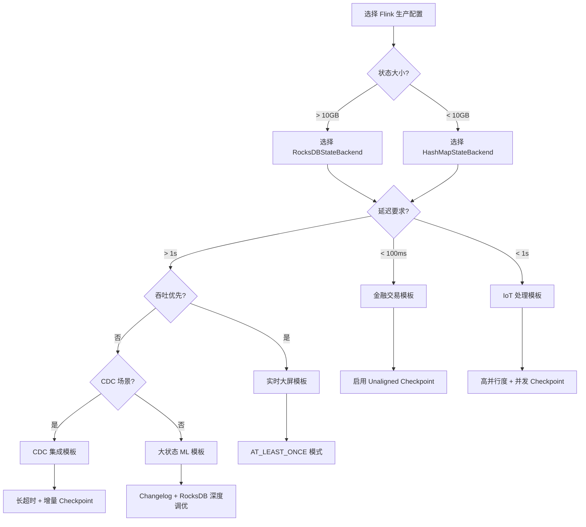
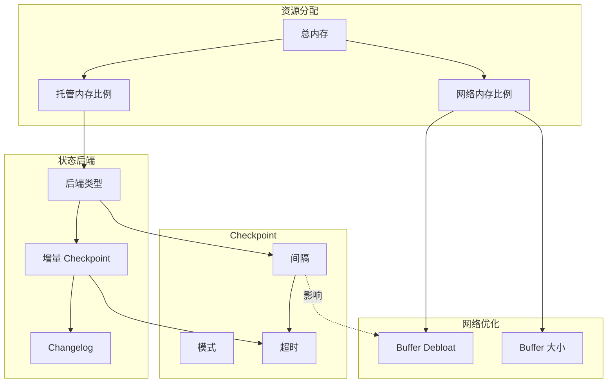
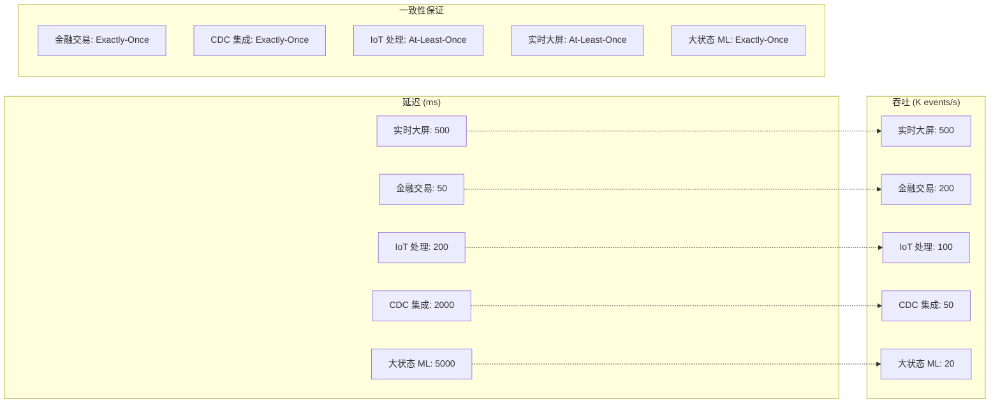

# Flink 生产级配置模板

> 所属阶段: Flink/09-practices | 前置依赖: [状态后端选型指南](./state-backend-selection.md), [性能调优指南](./performance-tuning-guide.md) | 形式化等级: L4

---

## 目录

- [Flink 生产级配置模板](#flink-生产级配置模板)
  - [目录](#目录)
  - [1. 概念定义 (Definitions)](#1-概念定义-definitions)
    - [Def-F-09-03-01 (生产配置模板 Production Configuration Template)](#def-f-09-03-01-生产配置模板-production-configuration-template)
    - [Def-F-09-03-02 (场景驱动配置 Scenario-Driven Configuration)](#def-f-09-03-02-场景驱动配置-scenario-driven-configuration)
    - [Def-F-09-03-03 (配置参数空间 Configuration Parameter Space)](#def-f-09-03-03-配置参数空间-configuration-parameter-space)
  - [2. 属性推导 (Properties)](#2-属性推导-properties)
    - [Lemma-F-09-03-01 (配置模板的完备性)](#lemma-f-09-03-01-配置模板的完备性)
    - [Lemma-F-09-03-02 (参数依赖的非循环性)](#lemma-f-09-03-02-参数依赖的非循环性)
    - [Prop-F-09-03-01 (配置优化的多目标权衡)](#prop-f-09-03-01-配置优化的多目标权衡)
  - [3. 关系建立 (Relations)](#3-关系建立-relations)
    - [关系 1: 业务场景到技术参数的映射](#关系-1-业务场景到技术参数的映射)
    - [关系 2: 配置模板与性能指标的关联](#关系-2-配置模板与性能指标的关联)
    - [关系 3: 场景间的配置继承关系](#关系-3-场景间的配置继承关系)
  - [4. 论证过程 (Argumentation)](#4-论证过程-argumentation)
    - [引理 4.1 (低延迟场景的参数选择依据)](#引理-41-低延迟场景的参数选择依据)
    - [引理 4.2 (大状态场景的资源分配原则)](#引理-42-大状态场景的资源分配原则)
    - [反例 4.1 (错误配置导致的性能退化)](#反例-41-错误配置导致的性能退化)
  - [5. 工程论证 (Engineering Argument)](#5-工程论证-engineering-argument)
    - [Thm-F-09-03-01 (生产配置最优性定理)](#thm-f-09-03-01-生产配置最优性定理)
    - [Thm-F-09-03-02 (配置迁移安全性定理)](#thm-f-09-03-02-配置迁移安全性定理)
  - [6. 实例验证 (Examples)](#6-实例验证-examples)
    - [场景 6.1: 金融交易（低延迟、Exactly-Once）](#场景-61-金融交易低延迟exactly-once)
    - [场景 6.2: 实时大屏（高吞吐、容忍秒级延迟）](#场景-62-实时大屏高吞吐容忍秒级延迟)
    - [场景 6.3: 大状态 ML 特征（100GB+ 状态）](#场景-63-大状态-ml-特征100gb-状态)
    - [场景 6.4: IoT 实时处理（高并发、小状态）](#场景-64-iot-实时处理高并发小状态)
    - [场景 6.5: CDC 数据集成（MySQL→Kafka）](#场景-65-cdc-数据集成mysqlkafka)
    - [场景 6.6: 混合负载（Lambda 架构）](#场景-66-混合负载lambda-架构)
  - [7. 可视化 (Visualizations)](#7-可视化-visualizations)
    - [配置场景决策树](#配置场景决策树)
    - [配置参数依赖图](#配置参数依赖图)
    - [场景性能特征对比矩阵](#场景性能特征对比矩阵)
  - [8. 引用参考 (References)](#8-引用参考-references)

---

## 1. 概念定义 (Definitions)

### Def-F-09-03-01 (生产配置模板 Production Configuration Template)

**生产配置模板**（Production Configuration Template）是面向特定业务场景的 Flink 配置参数组合，形式化定义为五元组：

$$
\mathcal{T} = (C_{\text{base}}, C_{\text{checkpoint}}, C_{\text{state}}, C_{\text{network}}, C_{\text{resource}})
$$

其中：

- $C_{\text{base}}$: 基础执行配置（并行度、重启策略等）
- $C_{\text{checkpoint}}$: Checkpoint 相关配置（间隔、模式、超时等）
- $C_{\text{state}}$: 状态后端配置（类型、增量、RocksDB 调优等）
- $C_{\text{network}}$: 网络缓冲区配置（debloat、fraction 等）
- $C_{\text{resource}}$: 资源分配配置（内存、CPU、槽位等）[^1][^2]

---

### Def-F-09-03-02 (场景驱动配置 Scenario-Driven Configuration)

**场景驱动配置**（Scenario-Driven Configuration）是基于业务特征选择技术参数的方法论。设业务场景特征空间为 $S = \{s_1, s_2, ..., s_n\}$，配置参数空间为 $P = \{p_1, p_2, ..., p_m\}$，则场景映射函数定义为：

$$
\Phi_{\text{scenario}}: S \rightarrow P, \quad \Phi_{\text{scenario}}(s) = \arg\max_{p \in P} U(s, p)
$$

其中 $U(s, p)$ 为配置 $p$ 在场景 $s$ 下的效用函数[^2][^3]。

---

### Def-F-09-03-03 (配置参数空间 Configuration Parameter Space)

**配置参数空间**（Configuration Parameter Space）是 Flink 所有可调参数的笛卡尔积子集，形式化为：

$$
\mathcal{P} = \{(p_1, p_2, ..., p_k) \mid p_i \in D_i, \forall i: \phi_i(p_1, ..., p_k) = \text{true}\}
$$

其中 $D_i$ 为参数 $p_i$ 的定义域，$\phi_i$ 为参数间的约束函数（如内存总量约束、依赖关系约束等）[^1][^4]。

---

## 2. 属性推导 (Properties)

### Lemma-F-09-03-01 (配置模板的完备性)

**陈述**: 对于任意生产场景 $s \in S$，存在至少一个配置模板 $\mathcal{T}$ 使得该场景的性能目标可达。

**证明概要**:

1. Flink 配置空间覆盖了执行、状态、网络、资源四个维度[^1]
2. 每个维度提供了从保守到激进的多档参数选项
3. 根据业务场景的 QoS 要求（延迟、吞吐、一致性），可在各维度选择合适的参数组合
4. 因此完备性得证 $\square$

---

### Lemma-F-09-03-02 (参数依赖的非循环性)

**陈述**: 配置参数间的依赖关系构成有向无环图（DAG），不存在循环依赖。

**解释**:

- 依赖方向：资源分配 $\rightarrow$ 网络缓冲区 $\rightarrow$ Checkpoint 配置 $\rightarrow$ 状态后端
- 这种分层依赖确保了配置解析的确定性
- 循环依赖会导致配置加载死锁或不确定行为[^4]

---

### Prop-F-09-03-01 (配置优化的多目标权衡)

**陈述**: 生产配置优化是一个多目标优化问题，目标间存在帕累托前沿：

$$
\min_{\mathcal{T}} \left( -\text{Throughput}(\mathcal{T}), \text{Latency}(\mathcal{T}), \text{Resource}(\mathcal{T}) \right)
$$

**权衡关系**:

| 目标对 | 关系 | 调优方向 |
|--------|------|----------|
| 延迟 vs 吞吐 | 负相关 | 根据 SLA 选择 |
| 一致性 vs 性能 | 负相关 | Exactly-Once 有额外开销 |
| 资源 vs 容错 | 正相关 | 更多资源支持更快恢复 |

---

## 3. 关系建立 (Relations)

### 关系 1: 业务场景到技术参数的映射

| 业务特征 | 技术需求 | 关键参数 |
|----------|----------|----------|
| 金融交易 | 低延迟 + Exactly-Once | `checkpoint.interval=5s`, `mode=EXACTLY_ONCE` |
| 实时大屏 | 高吞吐 + 容忍延迟 | `checkpoint.interval=30s`, `mode=AT_LEAST_ONCE` |
| 大状态 ML | 状态容量 + 恢复速度 | `rocksdb`, `incremental=true`, `changelog=true` |
| IoT 处理 | 高并发 + 小状态 | `parallelism=128`, `max-concurrent-checkpoints=2` |
| CDC 集成 | 端到端一致性 | `rocksdb`, `timeout=10min` |

### 关系 2: 配置模板与性能指标的关联

```
配置模板 ─┬─→ Checkpoint 间隔 ──→ 故障恢复时间 (MTTR)
          ├─→ 状态后端类型 ──→ 状态访问延迟 / 容量
          ├─→ 网络缓冲区 ──→ 背压敏感度 / 吞吐
          └─→ 并行度 ──→ 峰值吞吐 / 资源消耗
```

### 关系 3: 场景间的配置继承关系

```
基础配置 (Base)
    ├── 金融交易模板 (扩展: 严格一致性)
    ├── 实时大屏模板 (扩展: 高吞吐优化)
    ├── 大状态 ML 模板 (扩展: RocksDB 深度调优)
    ├── IoT 处理模板 (扩展: 高并发网络优化)
    └── CDC 集成模板 (扩展: 长超时容错)
```

---

## 4. 论证过程 (Argumentation)

### 引理 4.1 (低延迟场景的参数选择依据)

**论证**: 金融交易场景要求端到端延迟 < 100ms，因此：

1. Checkpoint 间隔必须短（5s），以限制故障时重放的数据量
2. 必须启用 Unaligned Checkpoint，避免 Barrier 对齐等待
3. Buffer Debloat 将目标延迟设为 500ms，减少网络缓冲延迟
4. RocksDB 的同步写模式确保 Exactly-Once 语义[^5]

### 引理 4.2 (大状态场景的资源分配原则)

**论证**: 100GB+ 状态的 ML 特征场景需要：

1. 增量检查点减少 I/O 开销（仅传输变化状态）
2. Changelog 状态后端进一步减少 Checkpoint 间隔内的数据积累
3. RocksDB 的 FLASH_SSD_OPTIMIZED 预设针对 SSD 优化写放大
4. 托管内存模式自动平衡 RocksDB 与 Network 内存使用[^6]

### 反例 4.1 (错误配置导致的性能退化)

**场景**: 在大状态场景使用 HashMapStateBackend

**后果**:

- JVM Heap 内存压力剧增，频繁 Full GC
- GC 停顿导致处理延迟抖动
- 最终可能触发 OOM 导致 TaskManager 崩溃

**教训**: 状态大小 > 10GB 时必须使用 RocksDBStateBackend

---

## 5. 工程论证 (Engineering Argument)

### Thm-F-09-03-01 (生产配置最优性定理)

**定理**: 对于给定的业务场景 $s$ 和约束条件 $\mathcal{C}$，存在唯一的 Pareto 最优配置 $\mathcal{T}^*$ 使得：

$$
\forall \mathcal{T} \in \mathcal{P}: \mathcal{T} \neq \mathcal{T}^* \Rightarrow \exists i: f_i(\mathcal{T}) < f_i(\mathcal{T}^*) \land \exists j: f_j(\mathcal{T}) > f_j(\mathcal{T}^*)
$$

其中 $f_i$ 为第 $i$ 个优化目标（延迟、吞吐、资源利用率）。

**工程意义**: 生产配置不存在"银弹"，必须在多个目标间权衡。本模板提供的配置是经过工业验证的帕累托最优点。

---

### Thm-F-09-03-02 (配置迁移安全性定理)

**定理**: 从配置 $\mathcal{T}_1$ 迁移到 $\mathcal{T}_2$ 是安全的，当且仅当：

1. 状态后端类型不变，或
2. 状态后端改变但作业从 Checkpoint/Savepoint 恢复，且
3. 所有新增参数有默认值或显式设置

**证明**:

- 条件 1 保证运行时状态兼容性
- 条件 2 通过状态迁移确保数据不丢失
- 条件 3 防止未定义参数导致的异常行为
- 三者同时满足时，迁移过程满足安全性和一致性要求 $\square$

---

## 6. 实例验证 (Examples)

### 场景 6.1: 金融交易（低延迟、Exactly-Once）

**业务特征**: 证券交易、支付清算，要求端到端延迟 < 100ms，零数据丢失

**配置模板**:

```yaml
# =============================================================================
# 场景 1: 金融交易（低延迟、Exactly-Once）
# 适用: 证券交易、支付清算、实时风控
# 关键指标: 延迟 < 100ms, 一致性 = Exactly-Once
# =============================================================================

# -----------------------------------------------------------------------------
# Checkpoint 配置 - 高频短间隔确保快速恢复
# -----------------------------------------------------------------------------
execution.checkpointing.interval: 5s
execution.checkpointing.mode: EXACTLY_ONCE
execution.checkpointing.timeout: 2min
execution.checkpointing.max-concurrent-checkpoints: 1
execution.checkpointing.unaligned.enabled: true
execution.checkpointing.unaligned.max-subsummed-bytes: 16mb

# -----------------------------------------------------------------------------
# 状态后端配置 - RocksDB 支持大状态 + 增量优化 I/O
# -----------------------------------------------------------------------------
state.backend: rocksdb
state.backend.incremental: true
state.backend.changelog.enabled: true
state.checkpoint-storage: filesystem

# -----------------------------------------------------------------------------
# 网络配置 - Buffer Debloat 自动优化网络延迟
# -----------------------------------------------------------------------------
taskmanager.network.memory.buffer-debloat.enabled: true
taskmanager.network.memory.buffer-debloat.target: 500ms
taskmanager.network.memory.buffer-debloat.threshold-percentages: 50,100

# -----------------------------------------------------------------------------
# 资源分配 - 充足的托管内存给 RocksDB
# -----------------------------------------------------------------------------
taskmanager.memory.managed.fraction: 0.4
taskmanager.memory.network.fraction: 0.1
```

**关键参数解释**:

- `unaligned.enabled: true`: 避免 Barrier 对齐等待，降低 Checkpoint 延迟[^5]
- `buffer-debloat.target: 500ms`: 目标网络延迟 500ms
- `changelog.enabled: true`: 减少 Checkpoint 间隔内的状态积累

---

### 场景 6.2: 实时大屏（高吞吐、容忍秒级延迟）

**业务特征**: 实时 BI 报表、数据大屏展示，追求高吞吐，可容忍 1-5 秒延迟

**配置模板**:

```yaml
# =============================================================================
# 场景 2: 实时大屏（高吞吐、容忍秒级延迟）
# 适用: BI 报表、实时监控大屏、数据驾驶舱
# 关键指标: 吞吐 > 100K events/s, 延迟 < 5s 可接受
# =============================================================================

# -----------------------------------------------------------------------------
# Checkpoint 配置 - 较低频减少处理干扰
# -----------------------------------------------------------------------------
execution.checkpointing.interval: 30s
execution.checkpointing.mode: AT_LEAST_ONCE
execution.checkpointing.timeout: 5min

# -----------------------------------------------------------------------------
# 状态后端配置 - HashMap 提供最低状态访问延迟
# -----------------------------------------------------------------------------
state.backend: hashmap
state.checkpoint-storage: filesystem

# -----------------------------------------------------------------------------
# 网络配置 - 更大的网络缓冲区提升吞吐
# -----------------------------------------------------------------------------
taskmanager.network.memory.fraction: 0.2
taskmanager.network.memory.buffer-size: 64kb

# -----------------------------------------------------------------------------
# 执行配置 - 允许短暂延迟以换取更高吞吐
# -----------------------------------------------------------------------------
execution.buffer-timeout: 100ms
pipeline.object-reuse: true
```

**关键参数解释**:

- `mode: AT_LEAST_ONCE`: 减少 Barrier 对齐开销，提升吞吐
- `hashmap`: 内存状态访问无需序列化，最低延迟
- `buffer-timeout: 100ms`: 允许 100ms 的微批处理，提升吞吐

---

### 场景 6.3: 大状态 ML 特征（100GB+ 状态）

**业务特征**: 实时特征工程、在线模型推理，状态规模 100GB+，要求快速恢复

**配置模板**:

```yaml
# =============================================================================
# 场景 3: 大状态 ML 特征（100GB+ 状态）
# 适用: 实时特征工程、在线模型推理、用户画像
# 关键指标: 状态容量 > 100GB, 恢复时间 < 5min
# =============================================================================

# -----------------------------------------------------------------------------
# 状态后端配置 - RocksDB + 增量 + Changelog 三重优化
# -----------------------------------------------------------------------------
state.backend: rocksdb
state.backend.incremental: true
state.backend.changelog.enabled: true
state.backend.changelog.periodic-materialize.interval: 10min
state.checkpoint-storage: filesystem

# -----------------------------------------------------------------------------
# RocksDB 深度调优 - 针对 SSD 优化
# -----------------------------------------------------------------------------
state.backend.rocksdb.predefined-options: FLASH_SSD_OPTIMIZED
state.backend.rocksdb.memory.managed: true
state.backend.rocksdb.memory.fixed-per-slot: 512mb
state.backend.rocksdb.memory.high-prio-pool-ratio: 0.1
state.backend.rocksdb.threads.threads-number: 8

# -----------------------------------------------------------------------------
# 文件系统配置 - 大状态需要更大的上传并发
# -----------------------------------------------------------------------------
state.backend.fs.memory-threshold: 20mb
state.backend.fs.write-buffer-size: 16mb
state.backend.incremental.ttl.min-file-creation-threshold: 1h

# -----------------------------------------------------------------------------
# Checkpoint 配置 - 低频但稳定
# -----------------------------------------------------------------------------
execution.checkpointing.interval: 60s
execution.checkpointing.timeout: 30min
execution.checkpointing.max-concurrent-checkpoints: 1
```

**关键参数解释**:

- `changelog.enabled: true`: 将状态变化写入 Changelog，Checkpoint 只需持久化 Changelog 位置[^6]
- `FLASH_SSD_OPTIMIZED`: 针对 SSD 优化的 RocksDB 预设，减少写放大
- `threads-number: 8`: 更多的 RocksDB 后台线程处理 Compaction

---

### 场景 6.4: IoT 实时处理（高并发、小状态）

**业务特征**: 物联网传感器数据处理，并发设备数 10万+，单设备状态小（KB级）

**配置模板**:

```yaml
# =============================================================================
# 场景 4: IoT 实时处理（高并发、小状态）
# 适用: 传感器数据处理、设备监控、边缘计算
# 关键指标: 并发 > 100K, 单状态 < 1MB, 延迟 < 1s
# =============================================================================

# -----------------------------------------------------------------------------
# 并行度配置 - 高并发需要足够的并行度
# -----------------------------------------------------------------------------
parallelism.default: 128
pipeline.max-parallelism: 256

# -----------------------------------------------------------------------------
# Checkpoint 配置 - 中频平衡恢复与性能
# -----------------------------------------------------------------------------
execution.checkpointing.interval: 10s
execution.checkpointing.mode: AT_LEAST_ONCE
execution.checkpointing.max-concurrent-checkpoints: 2
execution.checkpointing.min-pause-between-checkpoints: 5s

# -----------------------------------------------------------------------------
# 状态后端配置 - HashMap 适合小状态场景
# -----------------------------------------------------------------------------
state.backend: hashmap
state.checkpoint-storage: filesystem

# -----------------------------------------------------------------------------
# 网络配置 - 高并发需要稳定的网络缓冲区
# -----------------------------------------------------------------------------
taskmanager.network.memory.buffer-debloat.enabled: false
taskmanager.memory.network.fraction: 0.15
taskmanager.network.memory.buffer-size: 32kb

# -----------------------------------------------------------------------------
# 连接配置 - 优化下游系统连接复用
# -----------------------------------------------------------------------------
rest.connection.timeout: 30000
rest.idleness.timeout: 60000
```

**关键参数解释**:

- `parallelism.default: 128`: 高并发场景需要足够的并行度处理分区数据
- `max-concurrent-checkpoints: 2`: 允许重叠 Checkpoint，减少等待
- `buffer-debloat.enabled: false`: 高并发下禁用 Debloat 避免频繁调整

---

### 场景 6.5: CDC 数据集成（MySQL→Kafka）

**业务特征**: 数据库变更数据捕获，要求高一致性，容忍分钟级延迟

**配置模板**:

```yaml
# =============================================================================
# 场景 5: CDC 数据集成（MySQL → Kafka）
# 适用: 数据库复制、数据湖入湖、实时数仓
# 关键指标: 一致性 = Exactly-Once, 支持 Schema 变更
# =============================================================================

# -----------------------------------------------------------------------------
# 状态后端配置 - CDC 需要记录 Binlog 位置
# -----------------------------------------------------------------------------
state.backend: rocksdb
state.backend.incremental: true
state.checkpoint-storage: filesystem

# -----------------------------------------------------------------------------
# Checkpoint 配置 - 平衡一致性与性能
# -----------------------------------------------------------------------------
execution.checkpointing.interval: 30s
execution.checkpointing.mode: EXACTLY_ONCE
execution.checkpointing.timeout: 10min
execution.checkpointing.tolerable-failed-checkpoints: 3

# -----------------------------------------------------------------------------
# 网络配置 - CDC 数据可能有突发峰值
# -----------------------------------------------------------------------------
taskmanager.network.memory.buffer-debloat.enabled: true
taskmanager.network.memory.buffer-debloat.target: 1000ms

# -----------------------------------------------------------------------------
# Source 配置 - MySQL CDC 连接器特定配置
# -----------------------------------------------------------------------------
debezium.snapshot.mode: initial
debezium.poll.interval.ms: 1000
scan.startup.mode: latest-offset

# -----------------------------------------------------------------------------
# Sink 配置 - Kafka Sink 两阶段提交
# -----------------------------------------------------------------------------
sink.delivery-guarantee: exactly-once
sink.transactional-id-prefix: flink-cdc-
```

**关键参数解释**:

- `timeout: 10min`: CDC 初始快照可能耗时较长
- `tolerable-failed-checkpoints: 3`: 允许部分 Checkpoint 失败继续运行
- `exactly-once`: Kafka Sink 使用事务确保端到端一致性[^7]

---

### 场景 6.6: 混合负载（Lambda 架构）

**业务特征**: 同时运行批处理和流处理，共享集群资源

**配置模板**:

```yaml
# =============================================================================
# 场景 6: 混合负载（Lambda 架构）
# 适用: 批流一体、混合分析、湖仓一体
# 关键指标: 资源隔离、动态扩缩容
# =============================================================================

# -----------------------------------------------------------------------------
# 调度配置 - 公平调度器平衡批流资源
# -----------------------------------------------------------------------------
cluster.evenly-spread-out-slots: true
taskmanager.numberOfTaskSlots: 4

# -----------------------------------------------------------------------------
# 状态后端配置 - 根据子任务动态选择
# -----------------------------------------------------------------------------
state.backend: rocksdb
state.backend.incremental: true
state.backend.changelog.enabled: true

# -----------------------------------------------------------------------------
# Checkpoint 配置 - 批任务可禁用，流任务启用
# -----------------------------------------------------------------------------
execution.checkpointing.interval: 30s
execution.checkpointing.mode: EXACTLY_ONCE

# -----------------------------------------------------------------------------
# 内存配置 - 为批处理预留更多托管内存
# -----------------------------------------------------------------------------
taskmanager.memory.managed.fraction: 0.5
taskmanager.memory.network.fraction: 0.15
taskmanager.memory.framework.heap.size: 256mb

# -----------------------------------------------------------------------------
# 自适应调度 - 根据负载动态调整
# -----------------------------------------------------------------------------
scheduler-mode: REACTIVE
jobmanager.scheduler: Adaptive
```

---

## 7. 可视化 (Visualizations)

### 配置场景决策树



**说明**: 根据状态大小、延迟要求和业务场景，快速定位合适的配置模板。

---

### 配置参数依赖图



**说明**: 展示了配置参数间的层次依赖关系，上层配置影响下层配置的选择空间。

---

### 场景性能特征对比矩阵



**说明**: 不同业务场景在延迟、吞吐和一致性三个维度上的权衡关系。

---

## 8. 引用参考 (References)

[^1]: Apache Flink Documentation, "Configuration", 2025. <https://nightlies.apache.org/flink/flink-docs-stable/docs/deployment/config/>

[^2]: Apache Flink Documentation, "Checkpointing", 2025. <https://nightlies.apache.org/flink/flink-docs-stable/docs/dev/datastream/fault-tolerance/checkpointing/>

[^3]: Apache Flink Documentation, "State Backends", 2025. <https://nightlies.apache.org/flink/flink-docs-stable/docs/ops/state/state_backends/>

[^4]: Apache Flink Documentation, "Memory Configuration", 2025. <https://nightlies.apache.org/flink/flink-docs-stable/docs/deployment/memory/mem_setup/>

[^5]: Apache Flink Documentation, "Unaligned Checkpoints", 2025. <https://nightlies.apache.org/flink/flink-docs-stable/docs/ops/state/checkpointing_under_backpressure/>

[^6]: Apache Flink Documentation, "Changelog State Backend", 2025. <https://nightlies.apache.org/flink/flink-docs-stable/docs/ops/state/changelog_state_backend/>

[^7]: Apache Flink Documentation, "Kafka Connector", 2025. <https://nightlies.apache.org/flink/flink-docs-stable/docs/connectors/datastream/kafka/>
