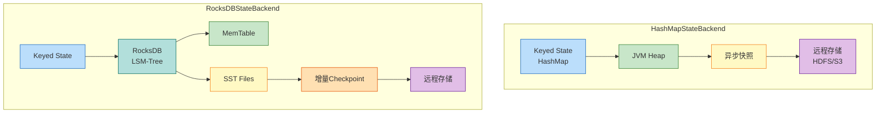
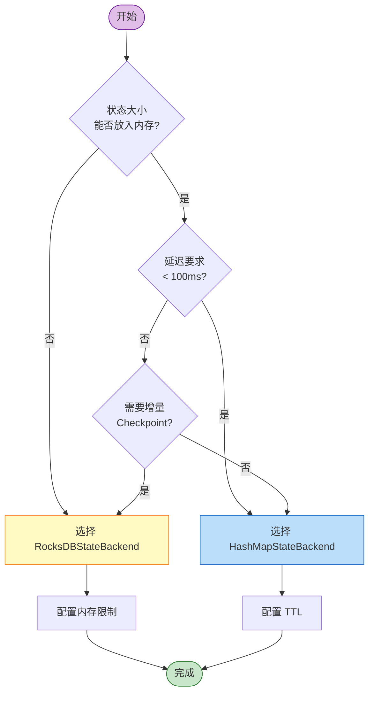

# Flink 状态后端选型指南 (State Backend Selection Guide)

> 所属阶段: Flink/06-engineering | 前置依赖: [一致性层级文档](../../../Struct/02-properties/02.02-consistency-hierarchy.md), [Checkpoint 机制深度解析](../../02-core/checkpoint-mechanism-deep-dive.md) | 形式化等级: L4

---

## 目录

- [Flink 状态后端选型指南 (State Backend Selection Guide)](#flink-状态后端选型指南-state-backend-selection-guide)
  - [目录](#目录)
  - [1. 概念定义 (Definitions)](#1-概念定义-definitions)
    - [Def-F-06-01 (状态后端 State Backend)](#def-f-06-01-状态后端-state-backend)
    - [Def-F-06-02 (HeapStateBackend / MemoryStateBackend)](#def-f-06-02-heapstatebackend-memorystatebackend)
    - [Def-F-06-03 (RocksDBStateBackend)](#def-f-06-03-rocksdbstatebackend)
    - [Def-F-06-04 (HashMapStateBackend)](#def-f-06-04-hashmapstatebackend)
    - [Def-F-06-05 (EmbeddedRocksDBStateBackend)](#def-f-06-05-embeddedrocksdbstatebackend)
    - [Def-F-06-06 (增量检查点 Incremental Checkpointing)](#def-f-06-06-增量检查点-incremental-checkpointing)
  - [2. 属性推导 (Properties)](#2-属性推导-properties)
    - [Lemma-F-06-01 (状态后端与一致性语义的独立性)](#lemma-f-06-01-状态后端与一致性语义的独立性)
    - [Lemma-F-06-02 (RocksDB 的内存-磁盘分层性质)](#lemma-f-06-02-rocksdb-的内存-磁盘分层性质)
    - [Lemma-F-06-03 (增量检查点的状态边界约束)](#lemma-f-06-03-增量检查点的状态边界约束)
    - [Prop-F-06-01 (状态后端选型的多目标优化)](#prop-f-06-01-状态后端选型的多目标优化)
  - [3. 关系建立 (Relations)](#3-关系建立-relations)
    - [关系 1: 状态后端与一致性层级的映射](#关系-1-状态后端与一致性层级的映射)
    - [关系 2: Checkpoint 机制与状态后端的耦合](#关系-2-checkpoint-机制与状态后端的耦合)
    - [关系 3: 状态后端演进路线图](#关系-3-状态后端演进路线图)
  - [4. 论证过程 (Argumentation)](#4-论证过程-argumentation)
    - [引理 4.1 (RocksDB 的序列化开销来源)](#引理-41-rocksdb-的序列化开销来源)
    - [引理 4.2 (Heap 状态的 GC 压力模型)](#引理-42-heap-状态的-gc-压力模型)
    - [反例 4.1 (大状态场景下 Heap 后端的内存溢出)](#反例-41-大状态场景下-heap-后端的内存溢出)
    - [边界讨论 4.2 (RocksDB 的磁盘 I/O 瓶颈)](#边界讨论-42-rocksdb-的磁盘-io-瓶颈)
  - [5. 工程论证 (Engineering Argument)](#5-工程论证-engineering-argument)
    - [Thm-F-06-01 (状态后端选择的完备性定理)](#thm-f-06-01-状态后端选择的完备性定理)
    - [Thm-F-06-02 (增量检查点优化界限定理)](#thm-f-06-02-增量检查点优化界限定理)
  - [6. 实例验证 (Examples)](#6-实例验证-examples)
    - [示例 6.1: HashMapStateBackend 基础配置](#示例-61-hashmapstatebackend-基础配置)
    - [示例 6.2: RocksDBStateBackend 生产配置](#示例-62-rocksdbstatebackend-生产配置)
    - [示例 6.3: 增量检查点配置与监控](#示例-63-增量检查点配置与监控)
    - [示例 6.4: 状态后端动态切换](#示例-64-状态后端动态切换)
    - [反例 6.5: 错误的 RocksDB 内存配置](#反例-65-错误的-rocksdb-内存配置)
  - [7. 可视化 (Visualizations)](#7-可视化-visualizations)
    - [状态后端架构对比图](#状态后端架构对比图)
    - [状态后端选型决策树](#状态后端选型决策树)
    - [状态后端 × 特性详细对比表](#状态后端-特性详细对比表)
  - [8. 引用参考 (References)](#8-引用参考-references)

## 1. 概念定义 (Definitions)

### Def-F-06-01 (状态后端 State Backend)

**状态后端**（State Backend）是 Flink 中负责管理算子状态和键控状态的持久化与访问接口的抽象层。形式化地，一个状态后端 $\mathcal{B}$ 是一个四元组：

$$
\mathcal{B} = (S_{\text{storage}}, \Phi_{\text{access}}, \Psi_{\text{snapshot}}, \Omega_{\text{recovery}})
$$

其中 $S_{\text{storage}}$ 为存储介质，$\Phi_{\text{access}}$ 为访问接口，$\Psi_{\text{snapshot}}$ 为快照函数，$\Omega_{\text{recovery}}$ 为恢复函数[^1][^3]。

---

### Def-F-06-02 (HeapStateBackend / MemoryStateBackend)

**HeapStateBackend**（亦称 MemoryStateBackend，Flink 1.x 遗留命名）将状态数据直接存储于 JVM Heap 内存中：

$$
\mathcal{B}_{\text{heap}} = (S_{\text{heap}}, \Phi_{\text{obj}}, \Psi_{\text{sync}}, \Omega_{\text{deserialize}})
$$

**特征**：状态以 Java 对象形式存储于 JVM Heap，访问无需序列化。

**约束**：受限于 `-Xmx`，建议单 TM 状态上限几十 MB。

**状态**：⚠️ **已弃用**。Flink 1.13+ 推荐使用 HashMapStateBackend。

---

### Def-F-06-03 (RocksDBStateBackend)

**RocksDBStateBackend** 基于嵌入式 RocksDB 数据库，将状态数据持久化到本地磁盘：

$$
\mathcal{B}_{\text{rocksdb}} = (S_{\text{disk}}, \Phi_{\text{lsm}}, \Psi_{\text{async}}, \Omega_{\text{restore}})
$$

**核心特性**：

1. **磁盘级容量**：支持 TB 级状态；
2. **增量检查点**：仅持久化变化的状态数据；
3. **内存-磁盘分层**：活跃数据缓存于内存，冷数据下沉至磁盘；
4. **异步快照**：Checkpoint 不阻塞数据流处理[^3][^5]。

---

### Def-F-06-04 (HashMapStateBackend)

**HashMapStateBackend** 是 Flink 1.13 引入的新一代内存状态后端：

$$
\mathcal{B}_{\text{hashmap}} = (S_{\text{heap}}, \Phi_{\text{obj}}, \Psi_{\text{async-fs}}, \Omega_{\text{deserialize}})
$$

与 HeapStateBackend 的区别：

- **异步快照**：支持异步写入 HDFS/S3，不阻塞数据流；
- **高效序列化**：使用 Flink TypeSerializer；
- **托管内存集成**：与 TaskManager 内存模型集成更好。

**适用场景**：状态可完全放入内存、追求极低访问延迟的作业。

---

### Def-F-06-05 (EmbeddedRocksDBStateBackend)

**EmbeddedRocksDBStateBackend** 是 Flink 1.13+ 对 RocksDBStateBackend 的重构实现：

$$
\mathcal{B}_{\text{embedded-rocksdb}} = (S_{\text{disk}}, \Phi_{\text{lsm}}, \Psi_{\text{async-incremental}}, \Omega_{\text{restore}})
$$

**改进**：原生增量检查点、精细化内存管理、多列族支持。

---

### Def-F-06-06 (增量检查点 Incremental Checkpointing)

**增量检查点**仅持久化自上次 Checkpoint 以来的状态变化部分（Delta）：

$$
\Delta_n = S_n \ominus S_{n-1}, \quad |\text{Checkpoint}_n^{\text{incremental}}| = |\Delta_n| \ll |S_n|
$$

**实现机制**（RocksDB）：

1. **SST 文件级增量**：只上传新产生的 SST 文件；
2. **引用计数共享**：未修改的 SST 文件在多个 Checkpoint 间共享；
3. **垃圾回收**：定期清理不再被引用的 SST 文件[^1][^5]。

---

## 2. 属性推导 (Properties)

### Lemma-F-06-01 (状态后端与一致性语义的独立性)

**陈述**：状态后端的选择不影响 Flink 作业能够达到的一致性语义级别。

**证明**：一致性语义由 Checkpoint 机制决定（参见 [02.02-consistency-hierarchy.md](../../../Struct/02-properties/02.02-consistency-hierarchy.md)）。无论使用何种后端，只要满足 Source 可重放、Barrier 对齐、Sink 原子性，端到端 Exactly-Once 即成立。状态后端仅影响性能，不改变正确性。∎

---

### Lemma-F-06-02 (RocksDB 的内存-磁盘分层性质)

**陈述**：RocksDBStateBackend 的访问延迟呈双峰分布——缓存命中时亚毫秒级，未命中时毫秒级。

**证明**：设 Block Cache 命中率为 $h$，则：

$$
E[t_{\text{access}}] = h \cdot t_{\text{mem}} + (1-h) \cdot t_{\text{disk}}
$$

其中 $t_{\text{mem}} \approx 0.1\mu s$，$t_{\text{disk}} \approx 0.1-10ms$，形成明显双峰。∎

---

### Lemma-F-06-03 (增量检查点的状态边界约束)

**陈述**：增量检查点的有效性依赖于状态变化的时间局部性。

**证明**：设 Checkpoint 周期为 $T$，变化率为 $r(t)$，则增量数据量 $|\Delta_n| = \int_{(n-1)T}^{nT} r(t) dt$。若所有状态每周期都更新，则 $|\Delta_n| \approx |S|$，增量退化为全量；若仅 1% 热键更新，则可节省 99% 存储。∎

---

### Prop-F-06-01 (状态后端选型的多目标优化)

**陈述**：状态后端选型是在**状态容量**、**访问延迟**、**Checkpoint 效率**、**资源成本**间的帕累托优化问题。

**帕累托前沿**：

| 后端 | 容量 | 延迟 | Checkpoint | 成本 |
|-----|------|------|-----------|------|
| HashMap | LOW | LOW | MEDIUM | LOW |
| RocksDB | HIGH | MEDIUM | LOW* | MEDIUM |

*注：RocksDB 增量模式下 Checkpoint 速度为 LOW（快），全量模式下为 HIGH（慢）。∎

---

## 3. 关系建立 (Relations)

### 关系 1: 状态后端与一致性层级的映射

根据 [02.02-consistency-hierarchy.md](../../../Struct/02-properties/02.02-consistency-hierarchy.md)，端到端 Exactly-Once 由三个子属性构成：

$$
\text{End-to-End-EO}(J) \iff \text{Replayable}(Src) \land \text{ConsistentCheckpoint}(Ops) \land \text{AtomicOutput}(Snk)
$$

| 子属性 | 状态后端作用 |
|-------|-------------|
| Source 可重放 | **无关**。由外部系统提供 |
| 一致 Checkpoint | **直接相关**。决定快照方式 |
| Sink 原子性 | **无关**。由 Sink 实现提供 |

状态后端是 Checkpoint 的实现载体，只要正确实现 `SnapshotStrategy`，即满足内部一致性。

---

### 关系 2: Checkpoint 机制与状态后端的耦合

| 耦合维度 | HashMapStateBackend | RocksDBStateBackend |
|---------|---------------------|---------------------|
| 同步阶段 | 创建 HashMap 快照视图 | 触发 RocksDB `checkpoint()` |
| 异步阶段 | 序列化到远程存储 | 上传 SST 文件到远程存储 |
| 增量支持 | ❌ 不支持 | ✅ 原生支持（SST 引用） |
| 一致性保证 | 快照视图保证 | LSM-Tree 不可变性保证 |

---

### 关系 3: 状态后端演进路线图

| 版本 | 状态后端 | 特征 |
|------|---------|------|
| 1.0-1.12 | MemoryStateBackend | Heap + JobManager 内存，< 5MB |
| 1.0-1.12 | FsStateBackend | Heap + 远程文件系统 |
| 1.0-1.12 | RocksDBStateBackend | 本地磁盘 + 远程文件系统 |
| 1.13+ | HashMapStateBackend | 统一替代 Memory/Fs |
| 1.13+ | EmbeddedRocksDBStateBackend | 新一代 RocksDB 实现 |

**演进动机**：API 简化、统一异步快照、为存算分离预留接口[^1][^4]。

---

## 4. 论证过程 (Argumentation)

### 引理 4.1 (RocksDB 的序列化开销来源)

**陈述**：RocksDB 访问延迟高于 HashMap，主要源于序列化/反序列化和 JNI 调用开销。

**分析**：

$$
t_{\text{RocksDB}} = t_{\text{serialize}} + t_{\text{jni}} + t_{\text{rocksdb}} + t_{\text{deserialize}}
$$
$$
t_{\text{HashMap}} = t_{\text{hash}} + t_{\text{reference}}
$$

| 组件 | RocksDB | HashMap |
|------|---------|---------|
| 序列化 | 1-10 μs | - |
| JNI | 0.5-2 μs | - |
| 内部访问 | 1-100 μs | 10-100 ns |

RocksDB 延迟通常是 HashMap 的 10-1000 倍。∎

---

### 引理 4.2 (Heap 状态的 GC 压力模型)

**陈述**：HashMapStateBackend 的大状态会导致频繁 GC，GC 压力与状态对象数量、存活时间、变更频率正相关。

**风险阈值**：Heap 状态占 50% → GC 时间 > 10%；占 70% → Full GC 风险显著。

---

### 反例 4.1 (大状态场景下 Heap 后端的内存溢出)

**场景**：1 亿用户 × 200B = 20GB 状态，10 TM × 4GB 堆。

**计算**：每 TM 分摊 2GB + 开销 ≈ 3GB（占 75% 堆内存）。

**结果**：频繁 OOM，被迫切换至 RocksDBStateBackend。

---

### 边界讨论 4.2 (RocksDB 的磁盘 I/O 瓶颈)

**场景**：RocksDB 部署在云容器（如 K8s Pod）中。

**问题**：

1. 本地磁盘可能是网络存储（如 EBS），I/O 延迟高；
2. 多 Pod 共享宿主机磁盘，I/O 竞争激烈；
3. 容器磁盘配额限制写入。

**缓解**：使用 SSD StorageClass，增加 Block Cache。

---

## 5. 工程论证 (Engineering Argument)

### Thm-F-06-01 (状态后端选择的完备性定理)

**陈述**：对于任意作业 $J$，存在唯一最优状态后端选择策略，由特征向量 $F(J) = (S_{\text{size}}, L_{\text{sla}}, U_{\text{pattern}}, R_{\text{budget}})$ 确定。

**决策规则**：

$$
\mathcal{D}(F(J)) = \begin{cases}
\text{HashMap} & \text{if } S_{\text{size}} < M_{\text{max}} \land L_{\text{sla}} < T_{\text{strict}} \\
\text{RocksDB} & \text{if } S_{\text{size}} \geq M_{\text{max}} \lor L_{\text{sla}} \geq T_{\text{relaxed}}
\end{cases}
$$

**典型阈值**：

- $M_{\text{max}}$：TM 堆内存的 30%（如 4GB 堆 → 1.2GB 状态上限）
- $T_{\text{strict}}$：< 100ms
- $T_{\text{relaxed}}$：> 500ms

**证明**：

1. 容量约束：若 $S_{\text{size}} \geq M_{\text{max}}$，HashMap GC 压力不可接受（引理 4.2），必选 RocksDB；
2. 延迟约束：若 $L_{\text{sla}} < T_{\text{strict}}$，RocksDB 序列化开销（引理 4.1）可能违反 SLA，优先 HashMap。∎

---

### Thm-F-06-02 (增量检查点优化界限定理)

**陈述**：增量检查点的存储节省率 $R_{\text{save}}$ 上界：

$$
R_{\text{save}} \leq 1 - \frac{r \cdot T}{|S|}
$$

**最优**：仅更新比例 $p$ 的状态，$R_{\text{save}} = 1 - p$。

**最差**：所有状态每周期更新，$R_{\text{save}} = 0$，退化为全量检查点。

**结论**：适合热点明显场景；不适合全量聚合；通过 `checkpointed_bytes` 监控节省率。∎

---

## 6. 实例验证 (Examples)

### 示例 6.1: HashMapStateBackend 基础配置

```java

import org.apache.flink.streaming.api.environment.StreamExecutionEnvironment;
import org.apache.flink.streaming.api.windowing.time.Time;

StreamExecutionEnvironment env =
    StreamExecutionEnvironment.getExecutionEnvironment();

// 设置 HashMapStateBackend
env.setStateBackend(new HashMapStateBackend());

// Checkpoint 配置
env.enableCheckpointing(60000);
env.getCheckpointConfig().setCheckpointStorage("hdfs:///checkpoints");

// TTL 配置
StateTtlConfig ttlConfig = StateTtlConfig
    .newBuilder(Time.hours(24))
    .cleanupFullSnapshot()
    .build();
```

---

### 示例 6.2: RocksDBStateBackend 生产配置

```java
// 创建 EmbeddedRocksDBStateBackend(启用增量 Checkpoint)
EmbeddedRocksDBStateBackend backend =
    new EmbeddedRocksDBStateBackend(true);

env.setStateBackend(backend);
env.getCheckpointConfig().setCheckpointStorage("hdfs:///checkpoints");

// RocksDB 内存配置
DefaultConfigurableOptionsFactory optionsFactory =
    new DefaultConfigurableOptionsFactory();
optionsFactory.setRocksDBOptions(
    "state.backend.rocksdb.memory.managed", "true");
optionsFactory.setRocksDBOptions(
    "state.backend.rocksdb.memory.fixed-per-slot", "256mb");
```

---

### 示例 6.3: 增量检查点配置与监控

```java
// 启用增量检查点
EmbeddedRocksDBStateBackend backend =
    new EmbeddedRocksDBStateBackend(true);

// Checkpoint 参数
env.enableCheckpointing(60000);
env.getCheckpointConfig().setMinPauseBetweenCheckpoints(30000);
env.getCheckpointConfig().setCheckpointTimeout(600000);
```

**监控指标**：

| 指标 | 含义 | 健康阈值 |
|------|------|---------|
| `checkpointed_bytes` | 实际写入字节 | 远小于状态总量 |
| `fullSizeBytes` | 状态全量大小 | 用于计算节省率 |

**节省率**：$1 - (\text{checkpointed\_bytes} / \text{fullSizeBytes})$

---

### 示例 6.4: 状态后端动态切换

```bash
# 创建 Savepoint
flink stop --savepointPath hdfs:///savepoints <job-id>

# 修改代码切换后端后,从 Savepoint 恢复
flink run -s hdfs:///savepoints/savepoint-xxxxx \
  -c com.example.MyJob my-job.jar
```

**注意**：HashMap → RocksDB 自动完成；RocksDB → HashMap 需确保状态大小 < TM 堆内存。

---

### 反例 6.5: 错误的 RocksDB 内存配置

**错误配置**：

```java
conf.setString("taskmanager.memory.managed.size", "64mb");  // 过小！
```

**问题**：Block Cache 和 MemTable 争抢内存 → 命中率下降 → 磁盘 I/O 激增 → Write Stall → 反压。

**正确做法**：

```java
conf.setString("taskmanager.memory.managed.fraction", "0.4");
// 或
optionsFactory.setRocksDBOptions(
    "state.backend.rocksdb.memory.fixed-per-slot", "512mb");
```

---

## 7. 可视化 (Visualizations)

### 状态后端架构对比图



---

### 状态后端选型决策树



---

### 状态后端 × 特性详细对比表

| 特性维度 | HeapStateBackend<br/>(Legacy) | HashMapStateBackend | RocksDBStateBackend<br/>/ EmbeddedRocksDB |
|---------|:----------------------------:|:-------------------:|:----------------------------------------:|
| **存储位置** | JVM Heap | JVM Heap | 本地磁盘 (LSM-Tree) |
| **状态容量** | 几 MB - 几十 MB | 几 MB - 几 GB | TB 级 |
| **访问延迟** | ~10-100 ns | ~10-100 ns | 1-100 μs（命中）<br/>0.1-10 ms（未命中） |
| **吞吐能力** | 极高 | 极高 | 中等 |
| **序列化开销** | Checkpoint 时 | Checkpoint 时 | 每次读写 |
| **Checkpoint 方式** | 全量同步/异步 | 全量异步 | 增量异步 |
| **Checkpoint 速度** | 中等 | 中等 | 快（仅变化） |
| **恢复速度** | 快 | 快 | 中等 |
| **内存效率** | 低（GC 压力） | 低（GC 压力） | 高（托管内存） |
| **磁盘依赖** | 无 | 无 | 强依赖 |
| **增量 Checkpoint** | ❌ | ❌ | ✅ |
| **大状态支持** | ❌ | ❌（>50% Heap 危险） | ✅ |
| **SSD 依赖** | 无 | 无 | 推荐 |
| **TTL 支持** | ✅ | ✅ | ✅（原生） |
| **适用场景** | 测试/极小状态 | 小状态 + 低延迟 | 大状态 + 增量 |
| **Flink 版本** | 1.x（已弃用） | 1.13+ | 1.13+ |

**选型速查**：状态 < 100MB 选 HashMap；状态 > 1GB 或需要增量 Checkpoint 选 RocksDB；写多选 HashMap，读多热点明显选 RocksDB。

---

## 8. 引用参考 (References)

[^1]: Apache Flink Documentation, "State Backends", 2025. <https://nightlies.apache.org/flink/flink-docs-stable/docs/ops/state/state_backends/>


[^3]: P. Carbone et al., "Apache Flink: Stream and Batch Processing in a Single Engine," *IEEE Data Engineering Bulletin*, 38(4), 2015.

[^4]: Apache Flink Documentation, "Incremental Checkpoints", 2025. <https://nightlies.apache.org/flink/flink-docs-release-1.20/docs/ops/state/incremental-checkpoints/> <!-- 404 as of 2026-04 on stable -->

[^5]: RocksDB Wiki, "RocksDB Basics", Meta Open Source, 2025. <https://github.com/facebook/rocksdb/wiki/RocksDB-Basics>


---

*文档版本: v1.0 | 日期: 2026-04-02 | 状态: 已完成*
