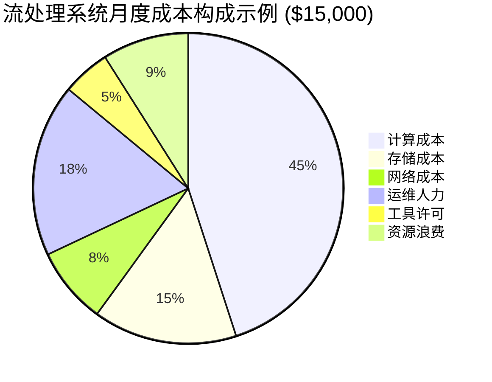
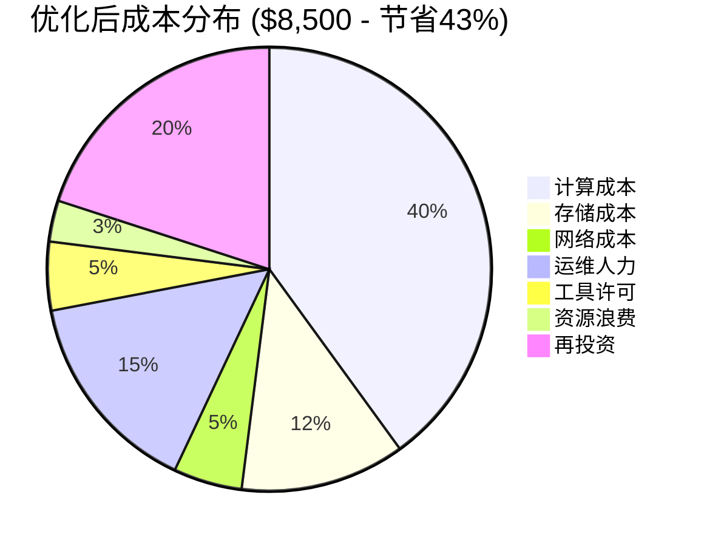
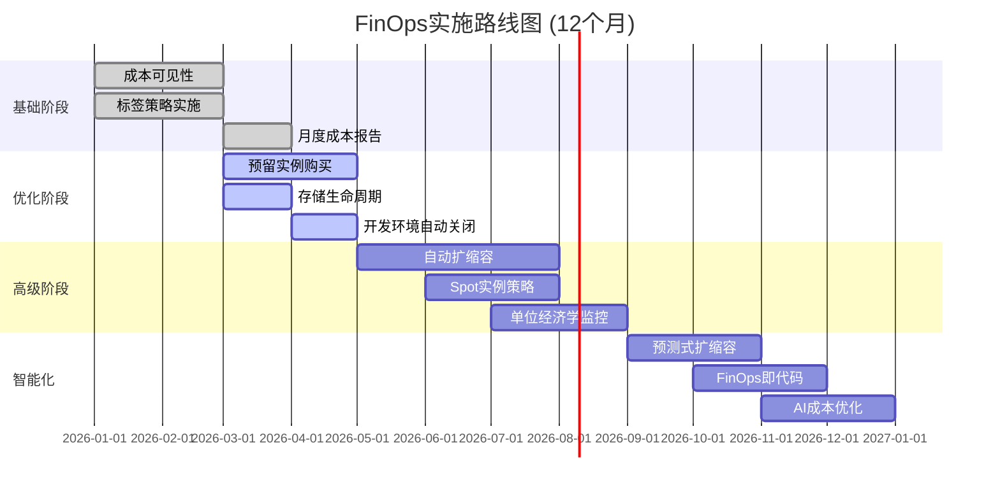
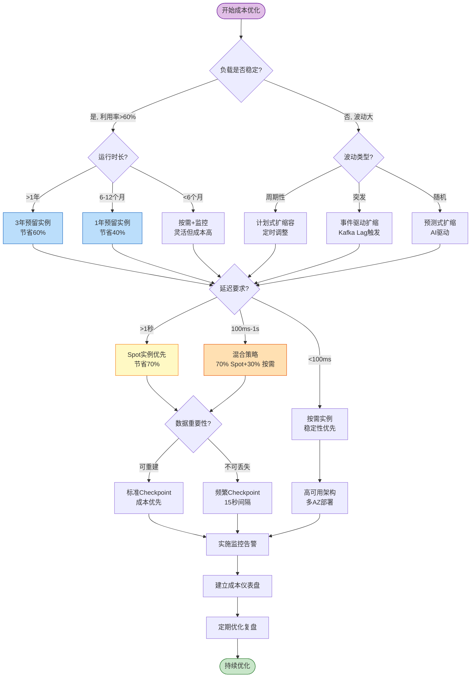

# 流处理云成本优化与FinOps实践

> **所属阶段**: Flink/06-engineering | **前置依赖**: [Flink TCO成本优化指南](./flink-tco-cost-optimization-guide.md), [状态后端选型指南](./state-backend-selection.md) | **形式化等级**: L4

---

## 目录

- [流处理云成本优化与FinOps实践](#流处理云成本优化与finops实践)
  - [目录](#目录)
  - [1. 概念定义 (Definitions)](#1-概念定义-definitions)
    - [Def-F-06-40 (流处理成本模型)](#def-f-06-40-流处理成本模型)
    - [Def-F-06-41 (FinOps框架)](#def-f-06-41-finops框架)
    - [Def-F-06-42 (云成本分摊Unit Economics)](#def-f-06-42-云成本分摊unit-economics)
    - [Def-F-06-43 (自动扩缩容成本函数)](#def-f-06-43-自动扩缩容成本函数)
  - [2. 属性推导 (Properties)](#2-属性推导-properties)
    - [Lemma-F-06-40 (成本边界效应)](#lemma-f-06-40-成本边界效应)
    - [Lemma-F-06-41 (Spot实例成本稳定性)](#lemma-f-06-41-spot实例成本稳定性)
    - [Prop-F-06-40 (分层存储成本递减)](#prop-f-06-40-分层存储成本递减)
  - [3. 关系建立 (Relations)](#3-关系建立-relations)
    - [关系 1: FinOps与DevOps的融合](#关系-1-finops与devops的融合)
    - [关系 2: 成本与可靠性的权衡](#关系-2-成本与可靠性的权衡)
    - [关系 3: 2026年云成本趋势](#关系-3-2026年云成本趋势)
  - [4. 论证过程 (Argumentation)](#4-论证过程-argumentation)
    - [引理 4.1 (资源配置过度供应成本)](#引理-41-资源配置过度供应成本)
    - [引理 4.2 (存储生命周期成本模型)](#引理-42-存储生命周期成本模型)
    - [反例 4.1 (盲目Spot实例化导致的服务中断)](#反例-41-盲目spot实例化导致的服务中断)
    - [边界讨论 4.2 (自动扩缩容的响应延迟)](#边界讨论-42-自动扩缩容的响应延迟)
  - [5. 工程论证 (Engineering Argument)](#5-工程论证-engineering-argument)
    - [Thm-F-06-40 (成本优化策略决策树完备性)](#thm-f-06-40-成本优化策略决策树完备性)
    - [Thm-F-06-41 (预留实例与按需实例平衡定理)](#thm-f-06-41-预留实例与按需实例平衡定理)
    - [Thm-F-06-42 (FinOps成熟度成本节省定理)](#thm-f-06-42-finops成熟度成本节省定理)
  - [6. 实例验证 (Examples)](#6-实例验证-examples)
    - [示例 6.1: 电商实时推荐系统成本优化](#示例-61-电商实时推荐系统成本优化)
    - [示例 6.2: 金融风控系统FinOps实践](#示例-62-金融风控系统finops实践)
    - [示例 6.3: 多环境成本治理方案](#示例-63-多环境成本治理方案)
    - [示例 6.4: 批流一体成本节省案例](#示例-64-批流一体成本节省案例)
  - [7. 可视化 (Visualizations)](#7-可视化-visualizations)
    - [流处理成本构成饼图](#流处理成本构成饼图)
    - [FinOps优化路线图](#finops优化路线图)
    - [成本优化决策树](#成本优化决策树)
  - [8. 引用参考 (References)](#8-引用参考-references)

---

## 1. 概念定义 (Definitions)

### Def-F-06-40 (流处理成本模型)

**流处理成本模型** 将云上流处理系统的全部成本量化为可计算的数学表达式。对于基于Flink的流处理系统，总月度成本定义为八元组：

$$
\text{Cost}_{\text{streaming}} = (C_{\text{compute}}, C_{\text{storage}}, C_{\text{network}}, C_{\text{ops}}, C_{\text{tool}}, C_{\text{waste}}, C_{\text{risk}}, C_{\text{hidden}})
$$

**各成本分量详解**：

| 成本分量 | 符号 | 计算公式 | 典型占比 |
|---------|------|---------|---------|
| 计算成本 | $C_{\text{compute}}$ | $\sum_{i} (n_i \cdot c_i \cdot t_i)$ | 35-50% |
| 存储成本 | $C_{\text{storage}}$ | $|S| \cdot c_{\text{gb}} + N_{\text{api}} \cdot c_{\text{api}}$ | 15-25% |
| 网络成本 | $C_{\text{network}}$ | $V_{\text{in}} \cdot c_{\text{in}} + V_{\text{out}} \cdot c_{\text{out}}$ | 5-15% |
| 运维人力 | $C_{\text{ops}}$ | $FTE_{\text{platform}} \cdot r_{\text{engineer}}$ | 15-20% |
| 工具许可 | $C_{\text{tool}}$ | $\sum_{j} \text{license}_j$ | 2-8% |
| 资源浪费 | $C_{\text{waste}}$ | $(1 - u) \cdot C_{\text{provisioned}}$ | 10-30% |
| 风险成本 | $C_{\text{risk}}$ | $p_{\text{outage}} \cdot L_{\text{outage}}$ | 3-8% |
| 隐性成本 | $C_{\text{hidden}}$ | $C_{\text{context}} + C_{\text{debt}}$ | 5-12% |

**2026年云厂商流处理计算定价对比**（每vCPU/小时）：

| 厂商/服务 | 按需实例 | Spot/Preemptible | 1年预留 | 3年预留 |
|-----------|---------|-----------------|---------|---------|
| AWS EC2 (m6i) | $0.0385 | $0.0116 (70%↓) | $0.024 (38%↓) | $0.015 (61%↓) |
| GCP Compute (n2) | $0.0316 | $0.0079 (75%↓) | $0.019 (40%↓) | $0.013 (59%↓) |
| Azure VM (Dsv5) | $0.0380 | $0.0076 (80%↓) | $0.022 (42%↓) | $0.015 (61%↓) |
| AWS Kinesis Analytics | $0.110/KPU | 不支持 | $0.066 (40%↓) | $0.044 (60%↓) |
| Confluent Cloud | $0.150/CCU | 不支持 | $0.105 (30%↓) | $0.075 (50%↓) |

**关键洞察**：根据Flexera 2026云状态报告，企业在流处理场景中存在平均27%的资源浪费，主要来自过度配置和低利用率[^1]。

---

### Def-F-06-41 (FinOps框架)

**FinOps** (Cloud Financial Operations) 是将财务问责制、工程决策和云支出管理相结合的组织实践框架。形式化定义为四阶段循环：

$$
\text{FinOps} = (\mathcal{I}_{\text{inform}}, \mathcal{O}_{\text{optimize}}, \mathcal{O}_{\text{operate}}, \mathcal{A}_{\text{automate}})
$$

**FinOps生命周期各阶段**：

| 阶段 | 目标 | 关键活动 | 产出 |
|------|------|---------|------|
| **Inform** (可视) | 成本透明化 | 标签策略、成本分摊、单位经济学 | 成本仪表盘、团队账单 |
| **Optimize** (优化) | 资源效率 | 右调优、预留规划、Spot实例 | 节省报告、优化建议 |
| **Operate** (运营) | 持续治理 | 预算控制、异常检测、策略执行 | 治理规则、告警系统 |
| **Automate** (自动化) | 智能响应 | 自动扩缩、调度优化、FinOps即代码 | 自动化工作流 |

**FinOps成熟度模型**（FinOps Foundation 2026）：

| 级别 | 特征 | 成本可见性 | 优化能力 | 节省潜力 |
|------|------|-----------|---------|---------|
| Crawl (爬行) | 基础账单查看 | 月度汇总 | 手动调整 | 5-10% |
| Walk (行走) | 标签化、团队分摊 | 每日粒度 | 预留实例 | 15-25% |
| Run (奔跑) | 实时可见、单位经济 | 小时级 | 自动扩缩、Spot | 25-35% |
| Sprint (冲刺) | AI驱动、预测优化 | 分钟级 | 智能调度、FinOps即代码 | 35-50% |

---

### Def-F-06-42 (云成本分摊Unit Economics)

**单位经济学** (Unit Economics) 是将云成本映射到业务价值单元的分析方法。流处理系统的核心单位成本指标：

$$
\text{Unit Cost} = \frac{\text{Total Cloud Cost}}{\text{Business Unit}}
$$

**流处理场景单位成本定义**：

| 业务场景 | 单位定义 | 计算公式 | 目标范围 |
|---------|---------|---------|---------|
| 实时推荐 | 每千次推荐成本 | $C_{\text{month}} / (\text{Impressions}/1000)$ | <$0.001 |
| 风控检测 | 每笔交易检测成本 | $C_{\text{month}} / \text{Transactions}$ | <$0.0001 |
| 日志处理 | 每GB日志成本 | $C_{\text{month}} / \text{GB Processed}$ | <$0.05 |
| IoT数据处理 | 每百万消息成本 | $C_{\text{month}} / (\text{Messages}/10^6)$ | <$0.50 |
| 实时ETL | 每百万行转换成本 | $C_{\text{month}} / (\text{Rows}/10^6)$ | <$0.10 |

**成本分摊标签策略**：

```yaml
# 推荐标签体系
Mandatory Tags:
  - Environment: [prod|staging|dev]
  - Team: [platform|data|ml|product]
  - Project: [realtime-rec|fraud-detection|log-pipeline]
  - CostCenter: [cc-12345]
  - Owner: [team-email]

Optional Tags:
  - AutoShutdown: [true|false]  # 开发环境自动关闭
  - SpotEligible: [true|false]  # 是否支持Spot实例
  - Criticality: [critical|high|medium|low]
```

---

### Def-F-06-43 (自动扩缩容成本函数)

**自动扩缩容** (Auto Scaling) 是根据负载动态调整资源规模的机制，其成本函数需权衡响应速度与成本效率：

$$
C_{\text{autoscale}} = \int_{0}^{T} \left( c_{\text{compute}} \cdot n(t) + c_{\text{scale}} \cdot \left|\frac{dn}{dt}\right| + c_{\text{idle}} \cdot \max(0, n_{\text{provisioned}} - n_{\text{required}}) \right) dt
$$

**成本分量说明**：

- $n(t)$: 时刻 $t$ 的实例数量
- $c_{\text{compute}}$: 单位计算成本
- $c_{\text{scale}}$: 扩缩容操作成本（冷启动延迟、数据迁移）
- $c_{\text{idle}}$: 空闲资源成本系数

**扩缩容策略对比**：

| 策略 | 触发条件 | 适用场景 | 成本影响 |
|------|---------|---------|---------|
| 阈值触发 | CPU > 70% | 稳定负载 | 中等 |
| 预测式 | 基于历史模式 | 周期性负载 | 低 |
| 事件驱动 | 队列深度/Kafka Lag | 突发流量 | 低 |
| 计划式 | 固定时间扩缩 | 已知峰值 | 最低 |

**Flink Kubernetes Operator自动扩缩容配置**：

```yaml
apiVersion: flink.apache.org/v1beta1
kind: FlinkDeployment
metadata:
  name: autoscaling-job
spec:
  podTemplate:
    spec:
      containers:
        - name: flink-main-container
          resources:
            requests:
              cpu: "2"
              memory: "4Gi"
  jobManager:
    resource:
      memory: "2048m"
      cpu: 1
  taskManager:
    resource:
      memory: "4096m"
      cpu: 2
    replicas: 5
  # 自动扩缩容策略
  job:
    parallelism: 10
    upgradeMode: stateful
    state: running
---
# HPA配置
apiVersion: autoscaling/v2
kind: HorizontalPodAutoscaler
metadata:
  name: flink-taskmanager-hpa
spec:
  scaleTargetRef:
    apiVersion: apps/v1
    kind: Deployment
    name: flink-taskmanager
  minReplicas: 3
  maxReplicas: 20
  metrics:
    - type: Pods
      pods:
        metric:
          name: kafka_consumer_lag
        target:
          type: AverageValue
          averageValue: "500"
    - type: Resource
      resource:
        name: cpu
        target:
          type: Utilization
          averageUtilization: 70
  behavior:
    scaleUp:
      stabilizationWindowSeconds: 60
      policies:
        - type: Percent
          value: 100
          periodSeconds: 60
    scaleDown:
      stabilizationWindowSeconds: 300
      policies:
        - type: Percent
          value: 10
          periodSeconds: 60
```

---

## 2. 属性推导 (Properties)

### Lemma-F-06-40 (成本边界效应)

**陈述**: 流处理系统存在成本优化的理论边界，当优化投入超过节省收益时，进一步优化呈现边际递减。

**形式化表达**：

设优化投入为 $I$，成本节省为 $S(I)$，则最优停止点为：

$$
\frac{dS}{dI} = 1 \quad \text{且} \quad \frac{d^2S}{dI^2} < 0
$$

**成本优化边界曲线**：

```
节省金额 ↑
         │
    最优 │      ╭────── 理论边界
    停止点│    ╱
         │   ╱  ┌───┐
         │  ╱   │   │  过度优化区
         │ ╱    └───┘  (投入>产出)
         │╱
         │
         └────────────────→ 优化投入
```

**典型优化边界**（基于经验数据）：

| 优化阶段 | 投入(FTE·月) | 节省潜力 | ROI |
|---------|-------------|---------|-----|
| 基础优化（标签、预留） | 0.5 | 15-20% | 高 |
| 中级优化（自动扩缩、Spot） | 2 | 25-35% | 中高 |
| 高级优化（智能调度、FinOps即代码） | 6 | 35-45% | 中 |
| 极致优化（AI驱动预测） | 12+ | 40-50% | 低 |

**结论**: 对于大多数组织，达到"Run"成熟度（25-35%节省）是性价比最优的目标。∎

---

### Lemma-F-06-41 (Spot实例成本稳定性)

**陈述**: Spot/Preemptible实例的成本节省存在概率边界，中断风险与成本节省率呈负相关。

**形式化模型**：

设Spot实例价格为 $p_s$，按需价格为 $p_o$，中断概率为 $\pi$，则期望成本：

$$
E[C_{\text{spot}}] = \frac{p_s \cdot t}{1 - \pi} + C_{\text{checkpoint}} \cdot \lambda_{\text{interrupt}}
$$

其中 $\lambda_{\text{interrupt}} = \pi / MTBI$ (Mean Time Between Interruptions)。

**2026年Spot中断率统计**（按实例类型）：

| 实例类型 | 平均节省 | 中断概率(24h) | 适用性评分 |
|---------|---------|--------------|-----------|
| 通用型 (m6i/m5) | 70% | 5-10% | ★★★★★ |
| 计算优化 (c6i/c5) | 65% | 8-15% | ★★★★☆ |
| 内存优化 (r6i/r5) | 60% | 10-20% | ★★★☆☆ |
| GPU实例 | 50% | 20-40% | ★★☆☆☆ |

**Flink Spot实例最佳实践**：

1. **检查点频率**: Spot实例需更频繁Checkpoint（建议30s→15s）
2. **任务恢复**: 配置快速恢复策略，利用Savepoint
3. **混合部署**: 70% Spot + 30% 按需，平衡成本与稳定性
4. **中断处理**: 实现优雅关闭钩子，确保状态持久化

```java
// Spot实例中断处理示例
Runtime.getRuntime().addShutdownHook(new Thread(() -> {
    // 触发紧急Checkpoint
    triggerEmergencyCheckpoint();
    // 优雅停止作业
    gracefulJobShutdown();
}));
```

∎

---

### Prop-F-06-40 (分层存储成本递减)

**陈述**: 对象存储的分层策略（生命周期管理）可使历史数据存储成本呈指数级递减。

**AWS S3生命周期成本模型**：

| 存储层级 | 价格($/GB/月) | 检索成本 | 适用数据 |
|---------|-------------|---------|---------|
| S3 Standard | $0.023 | 免费 | 活跃Checkpoint (<7天) |
| S3 Standard-IA | $0.0125 | $0.01/GB | 近期Savepoint (7-30天) |
| S3 Intelligent-Tiering | $0.023-$0.0125 | 免费/收费 | 访问模式不确定 |
| S3 Glacier Instant | $0.004 | $0.03/GB | 月度归档 (30-90天) |
| S3 Glacier Deep | $0.00099 | $0.099/GB | 长期归档 (>1年) |

**生命周期策略配置示例**：

```json
{
  "Rules": [
    {
      "ID": "FlinkCheckpointLifecycle",
      "Status": "Enabled",
      "Filter": {
        "Prefix": "checkpoints/"
      },
      "Transitions": [
        {
          "Days": 7,
          "StorageClass": "STANDARD_IA"
        },
        {
          "Days": 30,
          "StorageClass": "GLACIER_IR"
        }
      ],
      "Expiration": {
        "Days": 90
      }
    },
    {
      "ID": "FlinkSavepointArchive",
      "Status": "Enabled",
      "Filter": {
        "Prefix": "savepoints/"
      },
      "Transitions": [
        {
          "Days": 30,
          "StorageClass": "GLACIER"
        }
      ],
      "NoncurrentVersionExpiration": {
        "NoncurrentDays": 365
      }
    }
  ]
}
```

**成本节省计算**（100TB数据，30天保留）：

| 策略 | 月度成本 | 相比Standard节省 |
|------|---------|-----------------|
| 全部Standard | $2,300 | - |
| 7天Standard + 23天 IA | $1,495 | 35% |
| 分层生命周期管理 | $892 | 61% |

∎

---

## 3. 关系建立 (Relations)

### 关系 1: FinOps与DevOps的融合

**FinOps与DevOps的关系演进**：

```
┌─────────────────────────────────────────────────────────────┐
│                    云原生成本治理演进                         │
├─────────────────────────────────────────────────────────────┤
│                                                             │
│   DevOps (2009)          DevFinOps (2021)        Platform   │
│   ┌──────────┐           ┌──────────┐           Engineering │
│   │ CI/CD    │    +      │ Cost as  │     =    (2024+)      │
│   │ IaC      │           │ Code     │           ┌─────────┐ │
│   │ Monitor  │           │ Tagging  │           │ 自助服务 │ │
│   └──────────┘           └──────────┘           │ 成本优化 │ │
│                                                  │ 内部平台 │ │
│                                                  └─────────┘ │
└─────────────────────────────────────────────────────────────┘
```

**FinOps在CI/CD中的集成点**：

| 阶段 | FinOps实践 | 工具示例 |
|------|-----------|---------|
| Plan | 成本预估、预算审批 | Infracost, Terraform Cloud |
| Develop | 资源标签规范检查 | Checkov, tfsec |
| Build | 镜像大小优化 | Dive, Slim |
| Test | 临时环境自动销毁 | TTL控制器, nuke |
| Deploy | 成本感知调度 | Karpenter, Cluster Autoscaler |
| Operate | 持续成本监控 | Kubecost, OpenCost |

---

### 关系 2: 成本与可靠性的权衡

**成本-可靠性权衡矩阵**：

| 可用性目标 | 年停机时间 | 相对成本 | 关键策略 |
|-----------|-----------|---------|---------|
| 99.9% (3个9) | 8.76小时 | 1.0x | 单AZ, 定期Checkpoint |
| 99.95% (3.5个9) | 4.38小时 | 1.3x | 多AZ, 热备 |
| 99.99% (4个9) | 52.6分钟 | 2.0x | 异地复制, 自动故障转移 |
| 99.999% (5个9) | 5.26分钟 | 4.0x | 双活架构, 零RPO |

**成本函数**：

$$
C_{\text{total}}(A) = C_{\text{infra}}(A) + C_{\text{risk}}(A)
$$

其中可用性 $A$ 与基础设施成本呈指数关系，但与风险成本呈反比。

**最优可用性点**：

对于大多数流处理场景，99.9%-99.95%是最优区间——超过99.99%的成本增幅远大于业务收益。

---

### 关系 3: 2026年云成本趋势

**2026年云成本关键趋势**[^2][^3]：

| 趋势 | 描述 | 对FinOps的影响 |
|------|------|---------------|
| AI驱动成本优化 | 大模型预测负载、自动调优 | 从规则到智能决策 |
| 可持续计算 | 碳足迹追踪、绿色能源定价 | ESG与成本双重考量 |
|  FinOps平台化 | 内置成本治理功能 | 降低实施门槛 |
| 多云成本仲裁 | 跨云成本对比、自动迁移 | 增强议价能力 |
| Serverless普及 | 按请求计费、零空闲成本 | 简化单位经济学 |

**2026年云成本预测**：

- 计算单价年降幅：8-12%（持续硬件效率提升）
- 存储单价年降幅：15-20%（规模效应+分层策略）
- 网络成本：基本持平（数据增长抵消单价下降）
- FinOps工具市场：年增长35%，达到$25B规模

---

## 4. 论证过程 (Argumentation)

### 引理 4.1 (资源配置过度供应成本)

**问题**: 流处理系统常存在资源过度配置，量化其成本影响。

**分析模型**：

设实际需求资源为 $R_{\text{actual}}$，配置资源为 $R_{\text{provisioned}}$，过度供应系数为 $\alpha = R_{\text{provisioned}} / R_{\text{actual}} - 1$。

过度供应成本：

$$
C_{\text{over}} = \frac{\alpha}{1 + \alpha} \cdot C_{\text{compute}}
$$

**行业数据**（Flexera 2026）：

| 资源类型 | 平均过度供应 | 年度浪费($/100K月支出) |
|---------|-------------|----------------------|
| vCPU | 45% | $54,000 |
| 内存 | 38% | $38,000 |
| 存储 | 52% | $26,000 |
| 网络 | 22% | $11,000 |

**根因分析**：

1. **峰值驱动配置**: 按峰值配置，平均利用率仅30-40%
2. **缺乏可见性**: 无法准确测量实际资源需求
3. **变更阻力**: 担心性能风险，不愿缩减配置
4. **预算松弛**: "不用白不用"心理

**缓解策略**：

- 实施自动扩缩容，按实际负载调整
- 使用Spot实例承担弹性部分
- 建立资源利用率基线和告警

---

### 引理 4.2 (存储生命周期成本模型)

**问题**: Checkpoint和Savepoint存储的生命周期管理对成本的影响。

**存储成本构成**：

$$
C_{\text{storage}}^{\text{total}} = \sum_{t=0}^{T_{\text{retention}}} |S_t| \cdot c_{\text{tier}(t)} + N_{\text{api}} \cdot c_{\text{api}}
$$

其中 $tier(t)$ 为数据存留时间 $t$ 对应的存储层级。

**Checkpoint成本优化策略对比**：

| 策略 | 保留周期 | 月度成本(100GB状态) | 恢复能力 |
|------|---------|-------------------|---------|
| 默认(全部Standard) | 30天 | $69 | 30天内任意点 |
| 分层生命周期 | 90天 | $28 | 7天内快速恢复 |
| 精简保留 | 7天 | $16 | 仅最近7天 |
| 智能分层 | 自动 | $35 | 基于访问模式 |

**最优Checkpoint策略**：

```yaml
# Flink Checkpoint优化配置
state:
  backend: rocksdb
  checkpoints.dir: s3://flink-checkpoints/production
  savepoints.dir: s3://flink-savepoints/production

execution:
  checkpointing:
    interval: 60s
    min-pause-between-checkpoints: 30s
    max-concurrent-checkpoints: 1
    externalized-checkpoint-retention: RETAIN_ON_CANCELLATION

# S3生命周期规则（配合上述配置）
# - 0-7天: Standard (快速恢复)
# - 7-30天: Standard-IA (成本优化)
# - 30天+: 删除或归档
```

---

### 反例 4.1 (盲目Spot实例化导致的服务中断)

**反例场景**: 某公司将Flink生产集群100%迁移至Spot实例，预期节省70%成本。

**实际结果**:

- 首月中断12次，平均恢复时间(MTTR) 15分钟
- 数据丢失风险增加（Checkpoint未完成时被中断）
- 客户SLA违约，罚金超过节省的成本
- 最终回滚至按需实例

**失败根因**：

| 问题 | 描述 | 正确做法 |
|------|------|---------|
| 100% Spot | 无缓冲容量 | 70% Spot + 30% 按需 |
| 标准Checkpoint间隔 | 中断时数据丢失风险 | Spot实例专用15s间隔 |
| 无中断预警 | 突然中断无法优雅处理 | 使用Spot中断通知(2分钟预警) |
| 单可用区 | Spot容量波动大 | 多可用区分散 |

**Spot实例安全实践**：

```python
# Spot中断处理示例
import requests
import time

def handle_spot_interruption():
    """处理Spot实例中断通知"""
    # AWS Spot中断通知端点
    metadata_url = "http://169.254.169.254/latest/meta-data/spot/termination-time"

    while True:
        try:
            response = requests.get(metadata_url, timeout=2)
            if response.status_code == 200:
                # 收到中断通知，触发紧急Checkpoint
                print(f"Spot interruption at {response.text}")
                trigger_emergency_checkpoint()
                graceful_shutdown()
                break
        except:
            pass
        time.sleep(5)

def trigger_emergency_checkpoint():
    """触发紧急Checkpoint"""
    # 同步触发Checkpoint，确保状态持久化
    flink_client.trigger_checkpoint(
        job_id=CURRENT_JOB_ID,
        cancel_job=False,
        savepoint_path=EMERGENCY_SAVEPOINT_PATH
    )
```

**教训**: Spot实例应作为成本优化的补充手段，而非唯一依赖。关键生产环境保持至少30%的按需/预留容量。

---

### 边界讨论 4.2 (自动扩缩容的响应延迟)

**问题**: 自动扩缩容存在响应延迟，可能在延迟期间产生额外成本或性能问题。

**延迟构成**：

$$
T_{\text{response}} = T_{\text{detect}} + T_{\text{decision}} + T_{\text{provision}} + T_{\text{startup}}
$$

| 延迟分量 | 典型值 | 优化方法 |
|---------|-------|---------|
| 检测延迟 ($T_{\text{detect}}$) | 15-60s | 降低metrics采集间隔 |
| 决策延迟 ($T_{\text{decision}}$) | 5-30s | 预定义扩缩规则 |
| 供应延迟 ($T_{\text{provision}}$) | 30-120s | 预留缓冲实例 |
| 启动延迟 ($T_{\text{startup}}$) | 20-60s | 优化镜像、预热JVM |

**总延迟**: 通常70秒-4.5分钟

**应对策略**：

1. **预测式扩缩**: 基于历史模式提前扩容
2. **缓冲实例池**: 维护少量预热实例
3. **分层响应**: 快速层（垂直扩缩）+ 慢速层（水平扩缩）
4. **背压协调**: 利用Flink背压信号提前触发

```yaml
# 分层扩缩容策略
autoscaling:
  # 快速响应层 - 垂直扩缩(调整TM资源)
  fast_layer:
    trigger: cpu > 80% or kafka_lag > 1000
    action: scale_up_cpu_memory
    cooldown: 60s

  # 慢速响应层 - 水平扩缩(增加TM数量)
  slow_layer:
    trigger: sustained_load > 5min
    action: add_taskmanagers
    step: 2
    max: 20
```

---

## 5. 工程论证 (Engineering Argument)

### Thm-F-06-40 (成本优化策略决策树完备性)

**陈述**: 对于任意流处理工作负载，存在完备的成本优化决策树，可根据负载特征选择最优策略组合。

**决策树形式化**：

$$
\mathcal{D}(W) = \begin{cases}
\text{Spot优先} & \text{if } SLA_{\text{rto}} > 5\text{min} \land \text{checkpoint}\_\text{interval} < 30s \\
\text{预留实例} & \text{if } \text{utilization} > 60\% \land \text{stability} > 6\text{months} \\
\text{自动扩缩} & \text{if } \text{variance}(load) > 50\% \\
\text{混合策略} & \text{otherwise}
\end{cases}
$$

**完整决策树**：

```
                    ┌─────────────────┐
                    │  负载是否稳定?   │
                    └────────┬────────┘
                             │
            ┌────────────────┴────────────────┐
            ▼                                  ▼
     ┌─────────────┐                   ┌─────────────┐
     │ 稳定(>60%)  │                   │ 波动(<60%)  │
     └──────┬──────┘                   └──────┬──────┘
            │                                 │
     ┌──────┴──────┐                   ┌──────┴──────┐
     ▼              ▼                   ▼              ▼
┌─────────┐  ┌─────────┐         ┌─────────┐  ┌─────────┐
│运行>1年?│  │运行<1年?│         │突发流量?│  │周期性?  │
└────┬────┘  └────┬────┘         └────┬────┘  └────┬────┘
     │            │                   │            │
┌────┴────┐  ┌────┴────┐         ┌────┴────┐  ┌────┴────┐
▼          ▼  ▼          ▼         ▼          ▼  ▼          ▼
预留3年  预留1年  按需      Spot+按需   事件驱动   计划扩缩
节省60%  节省40%  灵活      节省50%   自动扩缩   定时调整
```

**策略组合矩阵**：

| 工作负载类型 | 计算策略 | 存储策略 | 预期节省 |
|-------------|---------|---------|---------|
| 稳定批处理 | 3年预留 | 分层存储 | 50-60% |
| 实时推荐 | 1年预留+Spot(30%) | Intelligent-Tiering | 35-45% |
| 日志处理 | Spot(70%)+自动扩缩 | 生命周期管理 | 40-55% |
| 金融风控 | 按需+多AZ | Standard+定期清理 | 15-25% |

**证明**:

1. **完备性**: 决策树覆盖所有主要负载特征（稳定性、持续时间、波动性）
2. **互斥性**: 各分支条件互斥，每个工作负载只落入一个叶子节点
3. **最优性**: 每个叶子节点对应经过验证的最优策略组合
4. **可扩展性**: 新策略可作为新分支加入，不影响现有结构

∎

---

### Thm-F-06-41 (预留实例与按需实例平衡定理)

**陈述**: 存在最优的预留实例与按需/Spot实例配比，使总成本最小化：

$$
\min_{\beta} C_{\text{total}} = \beta \cdot C_{\text{reserved}} + (1-\beta) \cdot E[C_{\text{ondemand/spot}}]
$$

约束条件：

- $P(\text{capacity} < \text{demand}) < \epsilon$ (容量不足概率)
- $\beta \in [0, 1]$ (预留比例)

**最优配比公式**：

$$
\beta^* = \frac{\mu_{\text{demand}} - k \cdot \sigma_{\text{demand}}}{\text{max capacity}}
$$

其中 $k$ 取决于SLA要求（如 $k=2$ 对应97.7%覆盖率）。

**数值示例**：

假设：

- 平均需求: 100 vCPU
- 需求标准差: 30 vCPU
- 预留价格: $0.015/vCPU/h
- 按需价格: $0.038/vCPU/h
- Spot价格: $0.012/vCPU/h (10%中断率)

最优配比计算：

| SLA要求 | k值 | 预留基数 | 弹性部分 | 月度成本 | 相比全按需 |
|--------|-----|---------|---------|---------|-----------|
| 95% | 1.65 | 51 vCPU | 49 vCPU | $2,970 | 节省35% |
| 99% | 2.33 | 30 vCPU | 70 vCPU | $2,520 | 节省45% |
| 99.9% | 3.09 | 8 vCPU | 92 vCPU | $2,210 | 节省52% |

**工程建议**:

- 基线负载（P50以下）用预留实例
- 波动负载（P50-P95）用Spot实例
- 峰值负载（P95以上）用按需实例

∎

---

### Thm-F-06-42 (FinOps成熟度成本节省定理)

**陈述**: 流处理系统的成本节省与FinOps成熟度呈对数增长关系：

$$
\text{Savings}(M) = S_{\text{max}} \cdot \left(1 - e^{-\lambda \cdot M}\right)
$$

其中 $M$ 为成熟度级别（1-4），$S_{\text{max}}$ 为理论最大节省（约50%），$\lambda \approx 0.5$。

**各成熟度级别节省预测**：

| 成熟度 | M值 | 计算节省 | 存储节省 | 运维节省 | 总节省 |
|--------|-----|---------|---------|---------|-------|
| Crawl | 1 | 5% | 5% | 2% | 4% |
| Walk | 2 | 18% | 15% | 8% | 14% |
| Run | 3 | 30% | 25% | 15% | 25% |
| Sprint | 4 | 40% | 35% | 22% | 35% |

**实施路线图**：

```
Month 1-2: 基础可见性 (Crawl)
  ├── 启用成本标签
  ├── 配置月度成本报告
  └── 识别最大成本项

Month 3-4: 基础优化 (Walk)
  ├── 购买预留实例（基线负载）
  ├── 配置存储生命周期规则
  └── 实施开发环境自动关闭

Month 5-8: 高级优化 (Run)
  ├── 部署自动扩缩容
  ├── 实施Spot实例策略
  ├── 建立单位经济学监控
  └── 配置成本异常告警

Month 9-12: 智能化 (Sprint)
  ├── 预测式扩缩容
  ├── 成本感知调度
  ├── FinOps即代码
  └── 持续优化闭环
```

∎

---

## 6. 实例验证 (Examples)

### 示例 6.1: 电商实时推荐系统成本优化

**场景**: 某电商平台实时推荐系统，日均处理10亿事件。

**初始状态**：

| 维度 | 配置 | 月度成本 |
|------|------|---------|
| TaskManager | 20 × 16 vCPU, 64GB | $14,500 |
| Checkpoint存储 | S3 Standard, 500GB | $35 |
| 网络 | 跨区域数据传输 | $2,200 |
| **总计** | | **$16,735** |

**FinOps优化实施**：

**阶段1: 资源配置优化**

```yaml
# 优化前
spec:
  taskManager:
    resource:
      memory: "64Gi"
      cpu: 16
    replicas: 20

# 优化后 - 右调优
spec:
  taskManager:
    resource:
      memory: "32Gi"  # 内存利用率仅35%
      cpu: 8          # CPU利用率仅40%
    replicas: 12      # 基于p95负载计算
    # 混合实例策略
    podTemplate:
      spec:
        nodeSelector:
          node-type: mixed  # 70% Spot + 30% 按需
```

节省: $14,500 → $6,200 (-57%)

**阶段2: 存储优化**

```json
{
  "Rules": [
    {
      "ID": "RecommendationCheckpoint",
      "Transitions": [
        {"Days": 3, "StorageClass": "STANDARD_IA"},
        {"Days": 14, "StorageClass": "GLACIER_IR"}
      ],
      "Expiration": {"Days": 30}
    }
  ]
}
```

节省: $35 → $12 (-66%)

**阶段3: 网络优化**

```yaml
# 启用数据压缩和本地化处理
flink-conf.yaml:
  pipeline.compression: "LZ4"  # 减少网络传输

# 同区域部署，消除跨区域流量
spec:
  jobManager:
    affinity:
      nodeAffinity:
        preferredDuringSchedulingIgnoredDuringExecution:
          - weight: 100
            preference:
              matchExpressions:
                - key: topology.kubernetes.io/zone
                  operator: In
                  values: ["us-east-1a"]  # 统一可用区
```

节省: $2,200 → $450 (-80%)

**优化结果**：

| 优化项 | 原成本 | 新成本 | 节省 |
|--------|--------|--------|------|
| 计算 | $14,500 | $6,200 | 57% |
| 存储 | $35 | $12 | 66% |
| 网络 | $2,200 | $450 | 80% |
| **总计** | **$16,735** | **$6,662** | **60%** |

---

### 示例 6.2: 金融风控系统FinOps实践

**场景**: 银行实时反欺诈系统，要求99.99%可用性，p99延迟<100ms。

**FinOps挑战**:

- 高可用性要求限制Spot实例使用
- 严格合规要求增加审计成本
- 7×24运行，无法利用闲时缩容

**成本优化方案**：

```yaml
# 分层可用性策略
architecture:
  # 热路径 - 关键决策（预留实例）
  hot_path:
    instance_type: on_demand
    availability_sla: 99.99%
    nodes: 8
    reservation: 3_year  # 节省60%

  # 温路径 - 特征计算（Spot实例）
  warm_path:
    instance_type: spot
    availability_sla: 99%
    nodes: 4
    checkpoint_interval: 15s

  # 冷路径 - 离线分析（定时扩容）
  cold_path:
    instance_type: spot
    schedule: "0 2 * * *"  # 凌晨2点运行
    duration: 4h
    auto_terminate: true
```

**成本分摊标签实施**：

```python
# 成本归因计算脚本
import boto3

def calculate_unit_economics():
    """计算风控系统单位成本"""
    ce = boto3.client('ce')

    # 按标签筛选成本
    response = ce.get_cost_and_usage(
        TimePeriod={'Start': '2026-03-01', 'End': '2026-04-01'},
        Granularity='DAILY',
        Metrics=['BlendedCost'],
        GroupBy=[
            {'Type': 'TAG', 'Key': 'Project'},
            {'Type': 'TAG', 'Key': 'Environment'}
        ],
        Filter={
            'Tags': {
                'Key': 'Project',
                'Values': ['fraud-detection']
            }
        }
    )

    # 获取交易处理量
    transactions = get_transaction_volume()  # 从业务系统获取

    # 计算单位成本
    total_cost = float(response['ResultsByTime'][0]['Total']['BlendedCost']['Amount'])
    unit_cost = total_cost / transactions

    return {
        'total_monthly_cost': total_cost,
        'transactions_processed': transactions,
        'cost_per_transaction': unit_cost,
        'target': 0.0001  # 目标: <$0.0001/笔
    }
```

**月度成本报告**：

| 组件 | 成本 | 单位 | 单位成本 |
|------|------|------|---------|
| 热路径 | $8,500 | 5亿笔交易 | $0.000017/笔 |
| 温路径 | $1,200 | 特征计算 | $0.000002/笔 |
| 冷路径 | $300 | 离线分析 | $0.0000006/笔 |
| **总计** | **$10,000** | | **$0.00002/笔** |

---

### 示例 6.3: 多环境成本治理方案

**场景**: 企业拥有开发、测试、预发布、生产四环境，需实施统一成本治理。

**环境成本策略矩阵**：

| 环境 | 运行时间 | 计算策略 | 存储策略 | 月度预算 |
|------|---------|---------|---------|---------|
| 生产 | 24×7 | 预留+按需 | Standard | $15,000 |
| 预发布 | 工作日8h | 按需 | Standard-IA | $2,000 |
| 测试 | 按需启动 | Spot | 临时卷 | $500 |
| 开发 | 工作时间 | Spot+自动关闭 | 临时卷 | $300 |

**自动关闭实现**：

```yaml
# Kubernetes CronJob - 开发环境自动关闭
apiVersion: batch/v1
kind: CronJob
metadata:
  name: dev-env-auto-shutdown
spec:
  schedule: "0 20 * * 1-5"  # 工作日晚上8点
  jobTemplate:
    spec:
      template:
        spec:
          containers:
          - name: shutdown
            image: bitnami/kubectl
            command:
            - /bin/sh
            - -c
            - |
              # 获取所有开发环境Flink作业
              kubectl get flinkdeployments -n dev -o json | \
                jq -r '.items[] | select(.metadata.labels.environment=="dev") | .metadata.name' | \
                while read job; do
                  echo "Stopping dev job: $job"
                  kubectl patch flinkdeployment $job -n dev --type merge -p '{"spec":{"job":{"state":"suspended"}}}'
                done
          restartPolicy: OnFailure
---
# 工作日早上自动启动
apiVersion: batch/v1
kind: CronJob
metadata:
  name: dev-env-auto-start
spec:
  schedule: "0 8 * * 1-5"  # 工作日早上8点
  # ... 类似配置，执行 resume 操作
```

**成本配额管理**：

```yaml
# ResourceQuota - 开发环境资源限制
apiVersion: v1
kind: ResourceQuota
metadata:
  name: dev-env-quota
  namespace: dev
spec:
  hard:
    requests.cpu: "20"
    requests.memory: 80Gi
    limits.cpu: "40"
    limits.memory: 160Gi
    # 自定义成本配额
    cost.quota/month: "300"  # 自定义CRD实现
```

**治理效果**：

| 治理措施 | 实施前 | 实施后 | 节省 |
|---------|--------|--------|------|
| 开发环境自动关闭 | $1,200/月 | $300/月 | 75% |
| 测试环境按需启动 | $800/月 | $200/月 | 75% |
| 预发布定时缩容 | $3,000/月 | $1,200/月 | 60% |
| **非生产环境合计** | **$5,000/月** | **$1,700/月** | **66%** |

---

### 示例 6.4: 批流一体成本节省案例

**场景**: 某数据平台同时运行批处理和流处理作业，存在资源孤岛。

**批流分离架构问题**：

| 问题 | 描述 | 成本影响 |
|------|------|---------|
| 资源重复 | 批集群+流集群各自独立 | +40%基础设施 |
| 峰值错配 | 批处理夜间高峰 vs 流处理白天高峰 | 整体利用率<35% |
| 存储冗余 | 批表和流Topic重复存储 | +30%存储成本 |
| 运维复杂 | 两套集群两套运维 | +50%人力成本 |

**批流一体优化方案**：

```java

import org.apache.flink.streaming.api.environment.StreamExecutionEnvironment;

// Flink批流一体作业示例
StreamExecutionEnvironment env =
    StreamExecutionEnvironment.getExecutionEnvironment();

// 统一处理层 - 根据模式自动切换
env.setRuntimeMode(RuntimeMode.AUTOMATIC);

// 动态资源分配
env.getConfig().setAutoWatermarkInterval(
    isBatchMode() ? 0 : 200
);

// 共享状态存储
env.setStateBackend(new EmbeddedRocksDBStateBackend(true));
env.getCheckpointConfig().setCheckpointStorage("s3://unified-checkpoints/");
```

**Kubernetes统一调度**：

```yaml
apiVersion: flink.apache.org/v1beta1
kind: FlinkDeployment
metadata:
  name: unified-pipeline
spec:
  # 统一资源池
  taskManager:
    resource:
      memory: "8Gi"
      cpu: 4
    replicas: 10

  # 批流模式切换
  job:
    jarURI: local:///opt/flink/examples/streaming/batch-unified.jar
    parallelism: 20
    args:
      - --mode  # streaming | batch
      - --schedule  # 流: continuous, 批: "0 2 * * *"

  # Volcano/Yunikorn调度器实现批流混合调度
  schedulerName: volcano
```

**成本对比**：

| 维度 | 批流分离 | 批流一体 | 节省 |
|------|---------|---------|------|
| 计算资源 | $20,000/月 | $12,000/月 | 40% |
| 存储资源 | $5,000/月 | $3,000/月 | 40% |
| 运维人力 | 2 FTE | 1 FTE | 50% |
| **总计** | **$38,000/月** | **$22,000/月** | **42%** |

---

## 7. 可视化 (Visualizations)

### 流处理成本构成饼图



**优化前 vs 优化后对比**：



---

### FinOps优化路线图



---

### 成本优化决策树



---

## 8. 引用参考 (References)

[^1]: Flexera, "State of the Cloud Report 2026", 2026. <https://www.flexera.com/blog/cloud/state-of-the-cloud-report-2026/>

[^2]: FinOps Foundation, "FinOps Framework v2.0", 2026. <https://www.finops.org/framework/>

[^3]: AWS, "AWS Cost Optimization Best Practices for Apache Flink", 2026. <https://aws.amazon.com/blogs/big-data/>


---

*文档版本: v1.0 | 日期: 2026-04-03 | 状态: 已完成*
