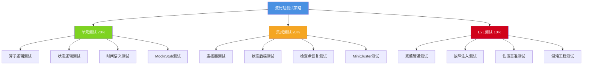
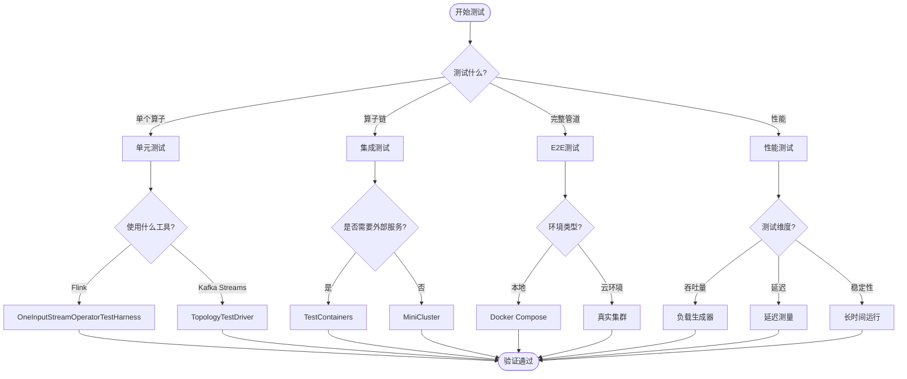
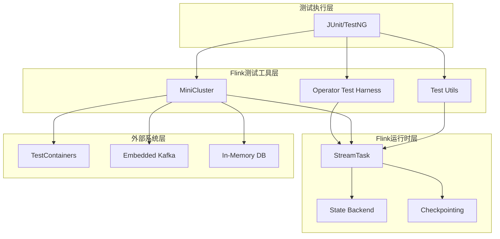
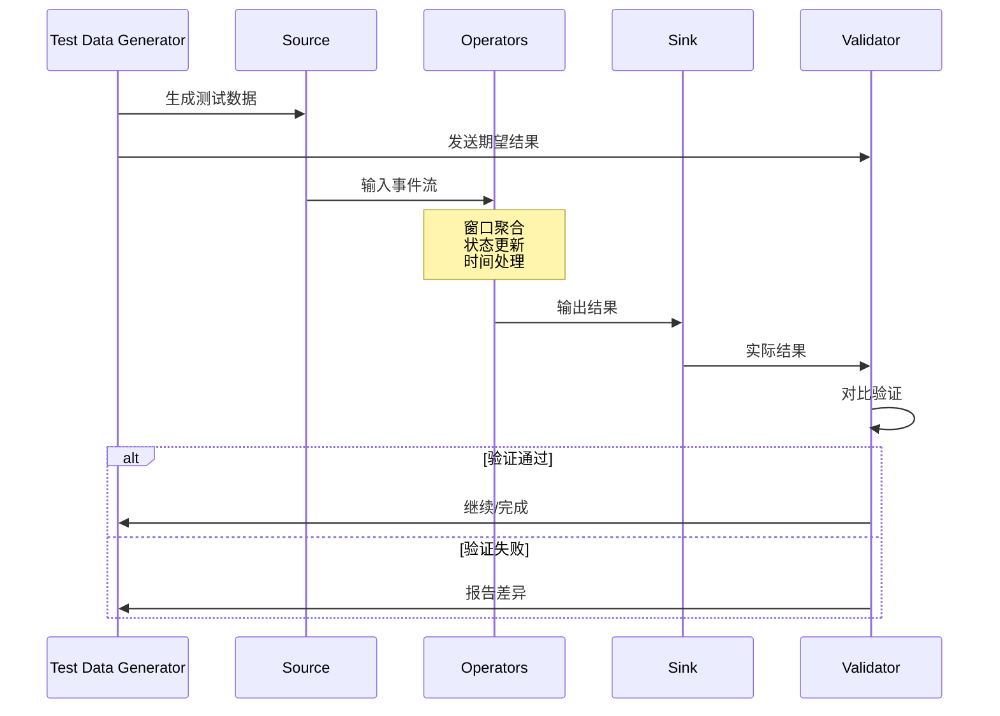

# 流处理测试策略与最佳实践

> 所属阶段: Flink/Engineering | 前置依赖: [Checkpoint机制深度解析](../../02-core/checkpoint-mechanism-deep-dive.md), [状态后端选择](./state-backend-selection.md) | 形式化等级: L3

---

## 1. 概念定义 (Definitions)

### 1.1 流处理测试的本质挑战

**Def-F-06-30** (流处理测试复杂度): 流处理系统的测试复杂度 $C_{stream}$ 定义为：

$$C_{stream} = C_{logic} \times C_{time} \times C_{state} \times C_{distribution}$$

其中：

- $C_{logic}$: 业务逻辑复杂度
- $C_{time}$: 时间语义复杂度（事件时间 vs 处理时间）
- $C_{state}$: 状态管理复杂度（有状态 vs 无状态）
- $C_{distribution}$: 分布式执行复杂度（并行度、分区、网络延迟）

**Def-F-06-31** (测试金字塔 - 流处理版本): 流处理测试金字塔包含三个层次：

| 层次 | 范围 | 执行时间 | 覆盖目标 | 成本 |
|------|------|----------|----------|------|
| 单元测试 | 单个算子/方法 | < 100ms | 逻辑正确性 | 低 |
| 集成测试 | 算子链/连接器 | 1-30s | 接口契约 | 中 |
| E2E测试 | 完整管道 | 30s-10min | 系统行为 | 高 |

### 1.2 核心测试概念

**Def-F-06-32** (确定性重放 - Deterministic Replay): 给定相同的输入事件序列 $E = \{e_1, e_2, ..., e_n\}$ 和系统配置 $C$，流处理系统 $S$ 的输出 $O$ 满足：

$$\forall t_1, t_2: S(E, C, t_1) = S(E, C, t_2) = O$$

即输出与执行时间无关，仅取决于输入和配置。

**Def-F-06-33** (水印边界 - Watermark Boundary): 对于事件时间窗口 $W = [start, end]$，当水印 $Wm \geq end$ 时，窗口被触发。

测试必须验证：
$$\forall e \in E: e.timestamp \in W \Rightarrow e \in Output(W)$$
$$\forall e \in Output(W): e.timestamp \in W$$

**Def-F-06-34** (状态一致性 - State Consistency): 在检查点 $cp$ 之后，系统状态 $State_{cp}$ 满足：

$$State_{post-recovery} = State_{cp} \land Output_{post-recovery} = Output_{expected}$$

**Def-F-06-35** (测试数据生成器): 测试数据生成器 $G$ 是一个函数：

$$G: (Schema, Volume, Distribution) \rightarrow Dataset$$

支持的模式包括：随机生成、基于历史、基于模式、基于属性。

---

## 2. 属性推导 (Properties)

**Lemma-F-06-01** (流处理测试完备性边界): 对于无限流数据，完备的测试覆盖是不可能的。测试策略必须针对以下边界：

1. **时间边界**: 窗口边界条件（窗口首/尾/空）
2. **状态边界**: 状态大小限制、TTL过期
3. **并发边界**: 并行度变化、分区重分配
4. **故障边界**: 检查点失败、任务失败、JM失败

**Lemma-F-06-02** (单元测试覆盖率): 算子逻辑单元测试应达到：

- 分支覆盖率 $\geq 80\%$
- 条件覆盖率 $\geq 70\%$
- 状态转换覆盖率 $100\%$

**Lemma-F-06-03** (集成测试数据量): 集成测试的最小数据量应满足：

$$N_{min} = \max(P \times 10, K \times 100)$$

其中 $P$ 为并行度，$K$ 为Key空间大小。

**Prop-F-06-01** (端到端测试延迟上界): E2E测试的执行时间 $T_{e2e}$ 受以下约束：

$$T_{e2e} \geq T_{startup} + \frac{N_{records}}{R_{throughput}} + T_{validation}$$

对于典型配置，$T_{e2e}$ 应在 30秒到5分钟之间。

---

## 3. 关系建立 (Relations)

### 3.1 与传统软件测试的映射

| 传统测试维度 | 流处理对应概念 | 关键差异 |
|--------------|----------------|----------|
| 输入/输出 | 事件流/结果流 | 无限流 vs 有限输入 |
| 状态 | 算子状态/键控状态 | 分布式、持久化 |
| 时间 | 事件时间/处理时间 | 多时间语义 |
| 并发 | 并行度/分区 | 数据分区驱动 |
| 故障 | 检查点/故障恢复 | 自动恢复机制 |

### 3.2 Flink测试生态系统关系

```
Flink测试体系
├── 单元测试层
│   ├── OneInputStreamOperatorTestHarness
│   ├── KeyedOneInputStreamOperatorTestHarness
│   └── TwoInputStreamOperatorTestHarness
├── 集成测试层
│   ├── MiniCluster (本地测试集群)
│   ├── TestContainer (容器化外部系统)
│   └── EmbeddedKafka/ZK
└── E2E测试层
    ├── 真实集群测试
    ├── Docker Compose集成
    └── 云环境测试
```

### 3.3 与其他流处理框架测试对比

| 特性 | Flink Test Harness | Kafka Streams TopologyTestDriver | Spark Structured Streaming |
|------|---------------------|----------------------------------|----------------------------|
| 测试粒度 | 算子级 | 拓扑级 | 微批次级 |
| 状态测试 | 原生支持 | 原生支持 | 原生支持 |
| 时间控制 | 手动水印推进 | 自动/手动 | 手动触发 |
| 异步支持 | 是 | 否 | 部分 |
| 外部依赖 | 可选MiniCluster | 无 | 可选 |

---

## 4. 论证过程 (Argumentation)

### 4.1 流处理测试的特殊性分析

**论证 1: 无限数据的测试困境**

流处理系统理论上处理无限数据流 $Stream = \{e_t | t \rightarrow \infty\}$，但测试必须是有限且可完成的。

**解决方案**:

1. 使用有界流模拟（Bounded Stream Simulation）
2. 基于属性的测试（Property-Based Testing）
3. 代表性窗口采样（Window Sampling）

**论证 2: 时间依赖性的非确定性**

处理时间 $T_{process}$ 依赖于执行环境，导致相同输入可能产生不同输出。

**解决方案**:

1. 测试中使用事件时间语义
2. 手动控制水印推进
3. 使用 `TestableStreamEnvironment`

**论证 3: 分布式状态的验证难题**

分布式状态存在于多个并行实例中，状态验证需要考虑：

- 分区策略的正确性
- 状态合并的一致性
- 检查点/恢复的正确性

### 4.2 测试策略选择决策树

```
需要测试什么?
├── 单个算子逻辑?
│   └── 使用: Operator Test Harness (单元测试)
├── 算子链/转换序列?
│   └── 使用: MiniCluster + DataStream API (集成测试)
├── Source/Sink连接器?
│   └── 使用: TestContainers + 真实服务 (集成测试)
├── 故障恢复行为?
│   └── 使用: MiniCluster + 故障注入 (混沌测试)
├── 完整业务管道?
│   └── 使用: Docker Compose E2E (E2E测试)
└── 性能基准?
    └── 使用: 负载测试框架 (性能测试)
```

---

## 5. 工程论证 / 测试策略选型 (Proof / Engineering Argument)

### 5.1 单元测试策略

**Thm-F-06-30** (算子单元测试完备性定理): 对于任意有状态流算子 $Op$，若满足以下条件，则其单元测试是完备的：

1. 所有状态转换路径被覆盖
2. 所有水印处理分支被覆盖
3. 所有时间语义分支（事件时间/处理时间）被覆盖
4. 所有异常处理路径被覆盖

**证明要点**: 通过构造有限状态机 $FSM_{Op}$，证明测试用例覆盖了 $FSM_{Op}$ 的所有可达状态。

#### 5.1.1 Flink Test Harness 使用

Flink 提供 `OneInputStreamOperatorTestHarness` 用于测试单输入算子：

```java

// [伪代码片段 - 不可直接运行] 仅展示核心逻辑
import org.apache.flink.streaming.api.environment.StreamExecutionEnvironment;

// 1. 创建测试环境
StreamExecutionEnvironment env =
    StreamExecutionEnvironment.getExecutionEnvironment();

// 2. 实例化算子
SumAggregator<Integer> aggregator = new SumAggregator<>();

// 3. 创建测试 harness
OneInputStreamOperatorTestHarness<Integer, Integer> testHarness =
    new OneInputStreamOperatorTestHarness<>(aggregator);

// 4. 配置和打开
testHarness.setup();
testHarness.open();

// 5. 输入事件(带时间戳)
testHarness.processElement(1, 100);  // 事件时间 = 100ms
testHarness.processElement(2, 200);
testHarness.processElement(3, 300);

// 6. 推进水印(触发窗口)
testHarness.processWatermark(500);

// 7. 验证输出
List<StreamRecord<Integer>> output = testHarness.extractOutputStreamRecords();
assertThat(output).hasSize(1);
assertThat(output.get(0).getValue()).isEqualTo(6);

// 8. 清理
testHarness.close();
```

#### 5.1.2 状态逻辑测试

```java

// [伪代码片段 - 不可直接运行] 仅展示核心逻辑
import org.apache.flink.api.common.typeinfo.Types;

@Test
public void testStatefulOperator() throws Exception {
    // 创建带状态的算子
    KeyedProcessFunction<String, Event, Result> function =
        new CountingFunction();

    KeyedOneInputStreamOperatorTestHarness<String, Event, Result> harness =
        new KeyedOneInputStreamOperatorTestHarness<>(
            new KeyedProcessOperator<>(function),
            Event::getKey,
            Types.STRING
        );

    harness.setup();
    harness.open();

    // 模拟不同 key 的事件
    harness.processElement(new Event("key1", 1), 100);
    harness.processElement(new Event("key1", 2), 200);
    harness.processElement(new Event("key2", 10), 150);

    // 验证各 key 的状态
    // key1 的状态应该是 2,key2 的状态应该是 1

    harness.close();
}
```

#### 5.1.3 Mock 与 Stub 使用

```java
// [伪代码片段 - 不可直接运行] 仅展示核心逻辑
// 使用 Mockito 模拟外部服务
@Mock
private ExternalServiceClient mockClient;

@Test
public void testEnrichmentOperatorWithMock() throws Exception {
    when(mockClient.lookup(anyString()))
        .thenReturn(new EnrichmentData("mocked"));

    EnrichmentOperator operator = new EnrichmentOperator(mockClient);
    OneInputStreamOperatorTestHarness<RawEvent, EnrichedEvent> harness =
        new OneInputStreamOperatorTestHarness<>(operator);

    harness.setup();
    harness.open();

    harness.processElement(new RawEvent("id1"), 100);

    List<EnrichedEvent> output = harness.extractOutputValues();
    assertThat(output.get(0).getData()).isEqualTo("mocked");

    harness.close();
}
```

### 5.2 集成测试策略

**Thm-F-06-31** (连接器集成测试正确性定理): 对于 Source/Sink 连接器 $C$，若集成测试通过以下条件验证，则连接器行为正确：

1. 数据完整性：$\forall d_{in} \in Input: d_{in} \in Output \lor d_{in} \in DeadLetter$
2. 顺序保持：对于有序分区，输出顺序与输入顺序一致
3. 精确一次：检查点边界内无重复记录
4. 故障恢复：模拟故障后数据不丢失

#### 5.2.1 连接器集成测试

```java

// [伪代码片段 - 不可直接运行] 仅展示核心逻辑
import org.apache.flink.streaming.api.environment.StreamExecutionEnvironment;
import org.apache.flink.streaming.api.datastream.DataStream;

@Test
public void testKafkaSourceIntegration() throws Exception {
    // 使用 EmbeddedKafkaCluster
    EmbeddedKafkaCluster kafka = new EmbeddedKafkaCluster(1);
    kafka.start();

    String topic = "test-topic";
    kafka.createTopic(topic, 2, 1);

    // 生产测试数据
    KafkaProducer<String, String> producer = createProducer(kafka);
    for (int i = 0; i < 1000; i++) {
        producer.send(new ProducerRecord<>(topic, "key" + i, "value" + i));
    }
    producer.flush();

    // 运行 Flink 作业消费数据
    StreamExecutionEnvironment env =
        StreamExecutionEnvironment.getExecutionEnvironment();
    env.setParallelism(2);

    FlinkKafkaConsumer<String> consumer = new FlinkKafkaConsumer<>(
        topic,
        new SimpleStringSchema(),
        kafka.getProperties()
    );

    DataStream<String> stream = env.addSource(consumer);

    // 收集结果
    stream.addSink(new CollectSink());

    JobClient jobClient = env.executeAsync();

    // 等待处理完成
    Thread.sleep(5000);
    jobClient.cancel();

    // 验证
    assertThat(CollectSink.getCollectedData()).hasSize(1000);

    kafka.shutdown();
}
```

#### 5.2.2 状态后端集成测试

```java

// [伪代码片段 - 不可直接运行] 仅展示核心逻辑
import org.apache.flink.streaming.api.environment.StreamExecutionEnvironment;

@Test
public void testRocksDBStateBackend() throws Exception {
    StreamExecutionEnvironment env =
        StreamExecutionEnvironment.getExecutionEnvironment();

    // 配置 RocksDB 状态后端
    env.setStateBackend(new EmbeddedRocksDBStateBackend(true));
    env.enableCheckpointing(1000);

    // 构建有状态作业
    env.addSource(new TestSource())
       .keyBy(event -> event.getKey())
       .process(new StatefulFunction())
       .addSink(new TestSink());

    // 使用 MiniCluster 执行
    Configuration config = new Configuration();
    config.setInteger(TaskManagerOptions.NUM_TASK_SLOTS, 4);

    MiniCluster miniCluster = new MiniCluster(
        new MiniClusterConfiguration.Builder()
            .setConfiguration(config)
            .setNumSlotsPerTaskManager(4)
            .build()
    );

    miniCluster.start();

    JobGraph jobGraph = env.getStreamGraph().getJobGraph();
    JobSubmissionResult result = miniCluster.submitJob(jobGraph);

    // 等待完成并验证
    miniCluster.requestJobResult(result.getJobID()).get();

    miniCluster.close();
}
```

#### 5.2.3 检查点恢复测试

```java
// [伪代码片段 - 不可直接运行] 仅展示核心逻辑
@Test
public void testCheckpointRecovery() throws Exception {
    // 创建 MiniCluster
    MiniCluster miniCluster = createMiniCluster();
    miniCluster.start();

    try {
        // 提交作业
        JobGraph jobGraph = createStatefulJobGraph();
        JobID jobId = miniCluster.submitJob(jobGraph).getJobID();

        // 等待作业运行
        waitForRunning(miniCluster, jobId);

        // 触发检查点
        long checkpointId = miniCluster.triggerCheckpoint(jobId).get();

        // 模拟故障 - 取消任务
        miniCluster.cancelJob(jobId).get();

        // 从检查点恢复
        JobGraph restoredJobGraph = createJobGraphFromCheckpoint(
            jobGraph, checkpointId
        );
        JobID newJobId = miniCluster.submitJob(restoredJobGraph).getJobID();

        // 验证状态恢复正确
        waitForRunning(miniCluster, newJobId);
        verifyStateRestored();

    } finally {
        miniCluster.close();
    }
}
```

### 5.3 端到端测试策略

**Thm-F-06-32** (E2E测试完备性定理): 端到端测试必须验证以下系统属性：

$$Completeness_{E2E} = \bigwedge_{i=1}^{4} Property_i$$

其中：

- $Property_1$: 功能正确性 - 输出符合业务逻辑
- $Property_2$: 数据完整性 - 无丢失、无重复
- $Property_3$: 故障恢复 - 故障后自动恢复并继续处理
- $Property_4$: 性能满足 - 延迟和吞吐量满足 SLA

#### 5.3.1 完整管道测试

```java

// [伪代码片段 - 不可直接运行] 仅展示核心逻辑
import org.apache.flink.streaming.api.environment.StreamExecutionEnvironment;

@Test
public void testEndToEndPipeline() throws Exception {
    // 使用 TestContainers 启动外部服务
    KafkaContainer kafka = new KafkaContainer(
        DockerImageName.parse("confluentinc/cp-kafka:7.5.0")
    );
    kafka.start();

    PostgreSQLContainer<?> postgres = new PostgreSQLContainer<>(
        DockerImageName.parse("postgres:15")
    );
    postgres.start();

    try {
        // 准备测试数据
        populateKafka(kafka, "input-topic", generateTestData(10000));

        // 提交 Flink 作业
        StreamExecutionEnvironment env =
            StreamExecutionEnvironment.getExecutionEnvironment();
        configureEnvironment(env, kafka, postgres);

        buildPipeline(env);

        JobClient client = env.executeAsync();

        // 等待处理完成
        await()
            .atMost(Duration.ofMinutes(5))
            .pollInterval(Duration.ofSeconds(5))
            .until(() -> getPostgresRowCount(postgres) >= 10000);

        // 验证结果
        validatePostgresResults(postgres);

        client.cancel();

    } finally {
        kafka.stop();
        postgres.stop();
    }
}
```

#### 5.3.2 数据正确性验证

```java
public class DataCorrectnessValidator {

    public ValidationResult validate(List<InputEvent> inputs,
                                      List<OutputEvent> outputs) {
        // 1. 完整性检查
        Set<String> inputIds = inputs.stream()
            .map(InputEvent::getId)
            .collect(Collectors.toSet());
        Set<String> outputIds = outputs.stream()
            .map(OutputEvent::getId)
            .collect(Collectors.toSet());

        Set<String> missingIds = Sets.difference(inputIds, outputIds);
        Set<String> extraIds = Sets.difference(outputIds, inputIds);

        // 2. 重复检查
        Map<String, Long> idCounts = outputs.stream()
            .collect(Collectors.groupingBy(
                OutputEvent::getId,
                Collectors.counting()
            ));
        List<String> duplicates = idCounts.entrySet().stream()
            .filter(e -> e.getValue() > 1)
            .map(Map.Entry::getKey)
            .collect(Collectors.toList());

        // 3. 顺序检查(如果业务要求)
        boolean orderPreserved = checkOrderPreserved(inputs, outputs);

        // 4. 业务逻辑验证
        List<String> logicErrors = validateBusinessLogic(inputs, outputs);

        return ValidationResult.builder()
            .missingIds(missingIds)
            .extraIds(extraIds)
            .duplicates(duplicates)
            .orderPreserved(orderPreserved)
            .logicErrors(logicErrors)
            .build();
    }
}
```

#### 5.3.3 故障注入测试

```java
// [伪代码片段 - 不可直接运行] 仅展示核心逻辑
@Test
public void testFailureRecovery() throws Exception {
    MiniCluster miniCluster = createMiniCluster();
    miniCluster.start();

    try {
        // 提交作业
        JobGraph jobGraph = createJobGraph();
        JobID jobId = miniCluster.submitJob(jobGraph).getJobID();

        // 等待一段时间
        Thread.sleep(10000);

        // 获取任务执行信息
        Collection<TaskExecutionAttemptInfo> attempts =
            miniCluster.getExecutionGraph(jobId)
                .get()
                .getAllExecutionAttempts();

        // 选择并杀死一个任务
        TaskExecutionAttemptInfo targetTask = attempts.iterator().next();
        miniCluster.triggerTaskFailure(
            jobId,
            targetTask.getVertexId(),
            targetTask.getAttemptNumber(),
            new RuntimeException("Injected failure")
        );

        // 验证作业恢复并继续
        await()
            .atMost(Duration.ofMinutes(2))
            .until(() -> {
                JobStatus status = miniCluster.getJobStatus(jobId).get();
                return status == JobStatus.RUNNING;
            });

        // 验证数据完整性
        verifyNoDataLoss();

    } finally {
        miniCluster.close();
    }
}
```

### 5.4 性能基准测试

```java

import org.apache.flink.streaming.api.environment.StreamExecutionEnvironment;
import org.apache.flink.streaming.api.windowing.time.Time;

public class PerformanceBenchmark {

    @Test
    public void benchmarkThroughput() throws Exception {
        // 配置测试参数
        int[] parallelismLevels = {1, 2, 4, 8};
        int[] recordRates = {1000, 10000, 50000, 100000};

        Map<String, BenchmarkResult> results = new HashMap<>();

        for (int parallelism : parallelismLevels) {
            for (int rate : recordRates) {
                String key = String.format("p%d-r%d", parallelism, rate);

                BenchmarkResult result = runBenchmark(parallelism, rate);
                results.put(key, result);

                // 断言 SLA
                assertThat(result.getP99Latency())
                    .isLessThan(Duration.ofMillis(100));
                assertThat(result.getThroughput())
                    .isGreaterThan(rate * 0.95);  // 至少达到95%
            }
        }

        // 输出报告
        generateReport(results);
    }

    private BenchmarkResult runBenchmark(int parallelism, int rate) {
        // 设置性能测试环境
        StreamExecutionEnvironment env =
            StreamExecutionEnvironment.getExecutionEnvironment();
        env.setParallelism(parallelism);
        env.disableOperatorChaining();  // 便于测量

        // 使用 Throttling Source 控制输入速率
        env.addSource(new ThrottlingSource(rate))
           .map(new BenchmarkMap())
           .keyBy(Event::getKey)
           .window(TumblingEventTimeWindows.of(Time.seconds(1)))
           .aggregate(new BenchmarkAggregate())
           .addSink(new MetricsCollectingSink());

        // 执行并收集指标
        // ...

        return BenchmarkResult.builder()
            .throughput(measuredThroughput)
            .p50Latency(measuredP50)
            .p99Latency(measuredP99)
            .cpuUsage(measuredCpu)
            .memoryUsage(measuredMemory)
            .build();
    }
}
```

---

## 6. 实例验证 (Examples)

### 6.1 完整单元测试示例

```java
/**
 * 窗口聚合算子的完整单元测试
 */
public class WindowedAggregationTest {

    private OneInputStreamOperatorTestHarness<Event, Result> testHarness;
    private TumblingEventTimeWindows windowAssigner;

    @Before
    public void setup() throws Exception {
        // 创建窗口算子
        WindowOperator<Event, Result, String, TimeWindow> windowOperator =
            new WindowOperator<>(
                windowAssigner,
                new TimeWindow.Serializer(),
                new EventKeySelector(),
                BasicTypeInfo.STRING_TYPE_INFO.createSerializer(new ExecutionConfig()),
                new EventStateDescriptor(),
                new InternalSingleValueWindowFunction<>(new ResultFunction()),
                PurgingTrigger.of(EventTimeTrigger.create()),
                LateFiringStrategy.FIRE_ONCE,
                0,  // allowedLateness
                null  // latenessCallback
            );

        testHarness = new OneInputStreamOperatorTestHarness<>(windowOperator);
        testHarness.setup();
        testHarness.open();
    }

    @Test
    public void testBasicWindowAggregation() throws Exception {
        // 窗口大小:1秒 [0, 1000)

        // 输入事件 - 窗口 [0, 1000)
        testHarness.processElement(new Event("key1", 10), 100);
        testHarness.processElement(new Event("key1", 20), 500);
        testHarness.processElement(new Event("key1", 30), 900);

        // 输入事件 - 窗口 [1000, 2000)
        testHarness.processElement(new Event("key1", 40), 1100);
        testHarness.processElement(new Event("key1", 50), 1500);

        // 推进水印触发第一个窗口
        testHarness.processWatermark(1000);

        // 验证第一个窗口输出
        List<StreamRecord<Result>> output = testHarness.extractOutputStreamRecords();
        assertThat(output).hasSize(1);
        assertThat(output.get(0).getValue().getSum()).isEqualTo(60);  // 10+20+30

        // 推进水印触发第二个窗口
        testHarness.processWatermark(2000);

        output = testHarness.extractOutputStreamRecords();
        assertThat(output).hasSize(2);
        assertThat(output.get(1).getValue().getSum()).isEqualTo(90);  // 40+50
    }

    @Test
    public void testLateDataHandling() throws Exception {
        // 设置允许延迟为 500ms
        // 窗口 [0, 1000),允许延迟到 1500

        testHarness.processElement(new Event("key1", 10), 100);
        testHarness.processWatermark(1000);  // 触发窗口

        // 迟到数据(在允许范围内)
        testHarness.processElement(new Event("key1", 20), 800);

        testHarness.processWatermark(1500);  // 延迟截止

        // 验证迟到数据被处理
        List<StreamRecord<Result>> output = testHarness.extractOutputStreamRecords();
        // 应该有更新后的结果
    }

    @Test
    public void testMultipleKeys() throws Exception {
        // 测试多 key 的并行处理
        testHarness.processElement(new Event("key1", 10), 100);
        testHarness.processElement(new Event("key2", 20), 200);
        testHarness.processElement(new Event("key1", 30), 300);
        testHarness.processElement(new Event("key2", 40), 400);

        testHarness.processWatermark(1000);

        List<StreamRecord<Result>> output = testHarness.extractOutputStreamRecords();
        assertThat(output).hasSize(2);

        // 验证每个 key 的结果
        Map<String, Integer> results = output.stream()
            .collect(Collectors.toMap(
                r -> r.getValue().getKey(),
                r -> r.getValue().getSum()
            ));

        assertThat(results.get("key1")).isEqualTo(40);  // 10+30
        assertThat(results.get("key2")).isEqualTo(60);  // 20+40
    }

    @After
    public void teardown() throws Exception {
        testHarness.close();
    }
}
```

### 6.2 完整集成测试示例

```java
/**
 * 使用 TestContainers 的集成测试
 */

import org.apache.flink.streaming.api.environment.StreamExecutionEnvironment;
import org.apache.flink.streaming.api.windowing.time.Time;

public class FlinkKafkaPostgresIntegrationTest {

    @ClassRule
    public static KafkaContainer kafka = new KafkaContainer(
        DockerImageName.parse("confluentinc/cp-kafka:7.5.0")
    );

    @ClassRule
    public static PostgreSQLContainer<?> postgres = new PostgreSQLContainer<>(
        DockerImageName.parse("postgres:15")
    );

    @Test
    public void testCompleteDataPipeline() throws Exception {
        // 1. 准备测试数据
        List<TestRecord> testData = IntStream.range(0, 5000)
            .mapToObj(i -> new TestRecord(
                "user" + (i % 100),  // 100 个不同用户
                i,
                System.currentTimeMillis()
            ))
            .collect(Collectors.toList());

        // 2. 写入 Kafka
        produceToKafka(testData);

        // 3. 准备 PostgreSQL
        initializePostgres();

        // 4. 运行 Flink 作业
        JobClient jobClient = submitFlinkJob();

        // 5. 等待并验证
        await().atMost(Duration.ofMinutes(5))
               .pollInterval(Duration.ofSeconds(5))
               .until(this::verifyResults);

        // 6. 清理
        jobClient.cancel();
    }

    private void produceToKafka(List<TestRecord> records) {
        Properties props = new Properties();
        props.put("bootstrap.servers", kafka.getBootstrapServers());
        props.put("key.serializer", StringSerializer.class.getName());
        props.put("value.serializer", JsonSerializer.class.getName());

        try (KafkaProducer<String, TestRecord> producer =
                new KafkaProducer<>(props)) {

            for (TestRecord record : records) {
                producer.send(new ProducerRecord<>(
                    "input-topic",
                    record.getUserId(),
                    record
                ));
            }
            producer.flush();
        }
    }

    private JobClient submitFlinkJob() throws Exception {
        StreamExecutionEnvironment env =
            StreamExecutionEnvironment.getExecutionEnvironment();

        // Source: Kafka
        FlinkKafkaConsumer<TestRecord> source = new FlinkKafkaConsumer<>(
            "input-topic",
            new TestRecordDeserializationSchema(),
            kafkaProps()
        );
        source.setStartFromEarliest();

        // Sink: PostgreSQL
        JdbcSink.sink(
            "INSERT INTO results (user_id, count, total) VALUES (?, ?, ?) " +
            "ON CONFLICT (user_id) DO UPDATE SET count = ?, total = ?",
            (ps, value) -> {
                ps.setString(1, value.getUserId());
                ps.setInt(2, value.getCount());
                ps.setLong(3, value.getTotal());
                ps.setInt(4, value.getCount());
                ps.setLong(5, value.getTotal());
            },
            jdbcExecOptions(),
            jdbcConnOptions()
        );

        // Pipeline
        env.addSource(source)
           .keyBy(TestRecord::getUserId)
           .window(TumblingProcessingTimeWindows.of(Time.seconds(5)))
           .aggregate(new CountAggregate())
           .addSink(jdbcSink);

        return env.executeAsync();
    }

    private boolean verifyResults() {
        try (Connection conn = DriverManager.getConnection(
                postgres.getJdbcUrl(),
                postgres.getUsername(),
                postgres.getPassword())) {

            Statement stmt = conn.createStatement();
            ResultSet rs = stmt.executeQuery(
                "SELECT COUNT(*) as total FROM results"
            );

            if (rs.next()) {
                int count = rs.getInt("total");
                return count == 100;  // 期望 100 个用户
            }
        } catch (SQLException e) {
            return false;
        }
        return false;
    }
}
```

### 6.3 属性测试示例

```java
import org.junit.runner.RunWith;

/**
 * 使用 JUnit-Quickcheck 进行属性测试
 */
@RunWith(JUnitQuickcheck.class)
public class WindowOperationProperties {

    /**
     * 属性1: 窗口输出的非负性
     * 对于所有输入事件,窗口聚合结果应该是非负的
     */
    @Property
    public void windowResultShouldBeNonNegative(
            @From(EventGenerator.class) List<Event> events,
            @InRange(minInt = 100, maxInt = 10000) int windowSize) {

        // 假设:所有事件值都是非负的
        assumeTrue(events.stream().allMatch(e -> e.getValue() >= 0));

        // 执行窗口聚合
        List<Result> results = runWindowAggregation(events, windowSize);

        // 断言:所有结果都是非负的
        assertTrue(results.stream().allMatch(r -> r.getSum() >= 0));
    }

    /**
     * 属性2: 窗口输出的完整性
     * 所有输入事件都应该被包含在某个窗口的输出中
     */
    @Property
    public void allEventsShouldBeAccounted(
            @From(EventGenerator.class) List<Event> events) {

        int inputSum = events.stream().mapToInt(Event::getValue).sum();

        List<Result> results = runWindowAggregation(events, 1000);
        int outputSum = results.stream().mapToInt(Result::getSum).sum();

        assertEquals(inputSum, outputSum);
    }

    /**
     * 属性3: 水印单调性
     * 水印应该单调递增
     */
    @Property
    public void watermarksShouldBeMonotonicallyIncreasing(
            @From(EventGenerator.class) List<Event> events) {

        List<Long> watermarks = extractWatermarks(events);

        for (int i = 1; i < watermarks.size(); i++) {
            assertTrue(watermarks.get(i) >= watermarks.get(i - 1));
        }
    }

    /**
     * 属性4: 迟到数据的处理
     * 在允许延迟范围内的事件应该被处理
     */
    @Property
    public void lateDataWithinAllowedLatenessShouldBeProcessed(
            @From(EventGenerator.class) List<Event> events,
            @InRange(minInt = 100, maxInt = 500) int allowedLateness) {

        List<Result> resultsWithLate = runWithLateness(events, allowedLateness);
        List<Result> resultsWithoutLate = runWithoutLateness(events);

        // 允许延迟的结果应该包含更多数据
        int sumWithLate = resultsWithLate.stream()
            .mapToInt(Result::getSum).sum();
        int sumWithoutLate = resultsWithoutLate.stream()
            .mapToInt(Result::getSum).sum();

        assertTrue(sumWithLate >= sumWithoutLate);
    }
}
```

### 6.4 混沌工程测试示例

```java
/**
 * 故障注入测试 - 混沌工程
 */
public class ChaosEngineeringTest {

    @Test
    public void testNetworkPartition() throws Exception {
        MiniCluster cluster = createClusterWithChaos();
        cluster.start();

        try {
            JobID jobId = submitStatefulJob(cluster);

            // 等待作业稳定
            Thread.sleep(10000);

            // 注入网络分区故障
            ChaosMonkey.injectNetworkPartition(
                cluster,
                jobId,
                ChaosPolicy.randomPartition(0.3)  // 30% 任务受影响
            );

            // 验证恢复
            await().atMost(Duration.ofMinutes(3))
                   .until(() -> cluster.getJobStatus(jobId).get()
                          == JobStatus.RUNNING);

            // 验证无数据丢失
            assertNoDataLoss();

        } finally {
            cluster.close();
        }
    }

    @Test
    public void testResourceExhaustion() throws Exception {
        MiniCluster cluster = createClusterWithLimitedResources();
        cluster.start();

        try {
            JobID jobId = submitJob(cluster);

            // 逐渐增加负载直到资源耗尽
            LoadGenerator generator = new LoadGenerator();
            generator.start();

            // 监控背压和检查点
            MetricsCollector collector = new MetricsCollector(cluster, jobId);

            await().atMost(Duration.ofMinutes(10))
                   .until(() -> collector.detectBackpressure()
                          || collector.detectCheckpointTimeout());

            // 验证系统在压力下不崩溃
            assertTrue(cluster.getJobStatus(jobId).get().isGloballyTerminalState());

            // 降低负载后应该恢复
            generator.reduceRate(0.5);

            await().atMost(Duration.ofMinutes(5))
                   .until(() -> !collector.detectBackpressure());

        } finally {
            cluster.close();
        }
    }

    @Test
    public void testJMFailover() throws Exception {
        // 使用 HA 配置启动集群
        MiniCluster cluster = createHACluster();
        cluster.start();

        try {
            JobID jobId = submitJob(cluster);

            // 杀死 JobManager
            cluster.killJobManager();

            // 等待新 JM 选举和恢复
            await().atMost(Duration.ofMinutes(2))
                   .until(() -> cluster.getJobStatus(jobId).get()
                          == JobStatus.RUNNING);

            // 验证作业继续处理
            assertJobProgressing(jobId);

        } finally {
            cluster.close();
        }
    }
}
```

---

## 7. 可视化 (Visualizations)

### 7.1 流处理测试金字塔



### 7.2 流处理测试决策流程



### 7.3 Flink 测试架构层次



### 7.4 测试数据流与验证点



---

## 8. 引用参考 (References)


---

## 附录

### 附录 A: 测试依赖配置 (Maven)

```xml
<!-- Flink 测试依赖 -->
<dependencies>
    <!-- 单元测试 -->
    <dependency>
        <groupId>org.apache.flink</groupId>
        <artifactId>flink-test-utils</artifactId>
        <version>${flink.version}</version>
        <scope>test</scope>
    </dependency>

    <dependency>
        <groupId>org.apache.flink</groupId>
        <artifactId>flink-streaming-java</artifactId>
        <version>${flink.version}</version>
        <scope>test</scope>
        <type>test-jar</type>
    </dependency>

    <dependency>
        <groupId>org.apache.flink</groupId>
        <artifactId>flink-runtime</artifactId>
        <version>${flink.version}</version>
        <scope>test</scope>
        <type>test-jar</type>
    </dependency>

    <!-- TestContainers -->
    <dependency>
        <groupId>org.testcontainers</groupId>
        <artifactId>testcontainers</artifactId>
        <version>1.19.0</version>
        <scope>test</scope>
    </dependency>

    <dependency>
        <groupId>org.testcontainers</groupId>
        <artifactId>kafka</artifactId>
        <version>1.19.0</version>
        <scope>test</scope>
    </dependency>

    <dependency>
        <groupId>org.testcontainers</groupId>
        <artifactId>postgresql</artifactId>
        <version>1.19.0</version>
        <scope>test</scope>
    </dependency>

    <!-- 属性测试 -->
    <dependency>
        <groupId>com.pholser</groupId>
        <artifactId>junit-quickcheck-core</artifactId>
        <version>1.0</version>
        <scope>test</scope>
    </dependency>

    <dependency>
        <groupId>com.pholser</groupId>
        <artifactId>junit-quickcheck-generators</artifactId>
        <version>1.0</version>
        <scope>test</scope>
    </dependency>

    <!-- 其他测试工具 -->
    <dependency>
        <groupId>org.assertj</groupId>
        <artifactId>assertj-core</artifactId>
        <version>3.24.2</version>
        <scope>test</scope>
    </dependency>

    <dependency>
        <groupId>org.awaitility</groupId>
        <artifactId>awaitility</artifactId>
        <version>4.2.0</version>
        <scope>test</scope>
    </dependency>

    <dependency>
        <groupId>org.mockito</groupId>
        <artifactId>mockito-core</artifactId>
        <version>5.5.0</version>
        <scope>test</scope>
    </dependency>
</dependencies>
```

### 附录 B: 测试数据生成器实现

```java
/**
 * 流处理测试数据生成器
 */
public class StreamTestDataGenerator {

    private final Random random = new Random(42);  // 固定种子保证可重复

    /**
     * 生成有序事件流
     */
    public List<Event> generateOrderedEvents(int count, long startTime) {
        List<Event> events = new ArrayList<>();
        long timestamp = startTime;

        for (int i = 0; i < count; i++) {
            events.add(new Event(
                "key" + (i % 10),
                random.nextInt(100),
                timestamp
            ));
            timestamp += random.nextInt(100);  // 递增时间戳
        }

        return events;
    }

    /**
     * 生成乱序事件流(模拟真实延迟)
     */
    public List<Event> generateOutOfOrderEvents(int count, long startTime,
                                                  long maxDelay) {
        List<Event> events = new ArrayList<>();

        for (int i = 0; i < count; i++) {
            long processingTime = startTime + i * 100;
            long eventTime = processingTime - random.nextInt((int) maxDelay);

            events.add(new Event(
                "key" + (i % 10),
                random.nextInt(100),
                eventTime
            ));
        }

        // 按事件时间排序(模拟乱序到达)
        events.sort(Comparator.comparingLong(Event::getTimestamp));

        return events;
    }

    /**
     * 生成带有延迟峰值的事件流
     */
    public List<Event> generateEventsWithLatencySpike(int count, long startTime,
                                                       int spikeStart, int spikeEnd,
                                                       long spikeDelay) {
        List<Event> events = new ArrayList<>();

        for (int i = 0; i < count; i++) {
            long delay = (i >= spikeStart && i < spikeEnd) ? spikeDelay : 0;
            long timestamp = startTime + i * 100 - delay;

            events.add(new Event(
                "key" + (i % 10),
                random.nextInt(100),
                timestamp
            ));
        }

        return events;
    }

    /**
     * 生成具有特定分布的事件
     */
    public List<Event> generateSkewedEvents(int count, long startTime,
                                            Map<String, Double> keyDistribution) {
        List<Event> events = new ArrayList<>();

        for (int i = 0; i < count; i++) {
            String key = selectKeyByDistribution(keyDistribution);
            events.add(new Event(
                key,
                random.nextInt(100),
                startTime + i * 10
            ));
        }

        return events;
    }

    private String selectKeyByDistribution(Map<String, Double> distribution) {
        double rand = random.nextDouble();
        double cumulative = 0.0;

        for (Map.Entry<String, Double> entry : distribution.entrySet()) {
            cumulative += entry.getValue();
            if (rand <= cumulative) {
                return entry.getKey();
            }
        }

        return distribution.keySet().iterator().next();
    }
}
```

### 附录 C: 测试性能基准模板

```java
import org.junit.runner.RunWith;

import org.apache.flink.streaming.api.environment.StreamExecutionEnvironment;
import org.apache.flink.streaming.api.windowing.time.Time;


/**
 * 流处理性能基准测试模板
 */
@RunWith(JUnit4.class)
public class StreamPerformanceBenchmark {

    @Rule
    public TestRule benchmarkRun = new BenchmarkRule();

    private static final int[] PARALLELISM_LEVELS = {1, 2, 4, 8};
    private static final int[] THROUGHPUT_LEVELS = {1000, 10000, 50000};

    @Test
    public void benchmarkWindowAggregation() throws Exception {
        for (int parallelism : PARALLELISM_LEVELS) {
            for (int targetThroughput : THROUGHPUT_LEVELS) {
                runBenchmark(parallelism, targetThroughput);
            }
        }
    }

    private void runBenchmark(int parallelism, int targetThroughput) throws Exception {
        String testName = String.format("p%d-t%d", parallelism, targetThroughput);

        // 配置环境
        StreamExecutionEnvironment env =
            StreamExecutionEnvironment.getExecutionEnvironment();
        env.setParallelism(parallelism);
        env.getConfig().disableSysoutLogging();

        // 收集指标
        MetricRegistry metricRegistry = new MetricRegistry();

        // 构建管道
        env.addSource(new RateControlledSource(targetThroughput))
           .map(new MetricsCollectingMap(metricRegistry))
           .keyBy(Event::getKey)
           .window(TumblingEventTimeWindows.of(Time.seconds(1)))
           .aggregate(new CountAggregate())
           .addSink(new DiscardingSink<>());

        // 执行
        long startTime = System.currentTimeMillis();
        JobExecutionResult result = env.execute(testName);
        long duration = System.currentTimeMillis() - startTime;

        // 计算指标
        double actualThroughput = result.getNetRuntime() > 0
            ? (double) result.getAccumulatorResult("record-count") / result.getNetRuntime() * 1000
            : 0;

        Duration p99Latency = metricRegistry.getP99Latency();
        double cpuUsage = metricRegistry.getCpuUsage();

        // 输出报告
        System.out.printf(
            "Benchmark %s: throughput=%.2f records/s, p99Latency=%s, cpu=%.2f%%%n",
            testName, actualThroughput, p99Latency, cpuUsage
        );

        // 验证 SLA
        assertThat(actualThroughput).isGreaterThan(targetThroughput * 0.9);
        assertThat(p99Latency).isLessThan(Duration.ofMillis(500));
    }
}
```

---

*文档版本: 1.0 | 最后更新: 2026-04-03 | 作者: AnalysisDataFlow Team*
