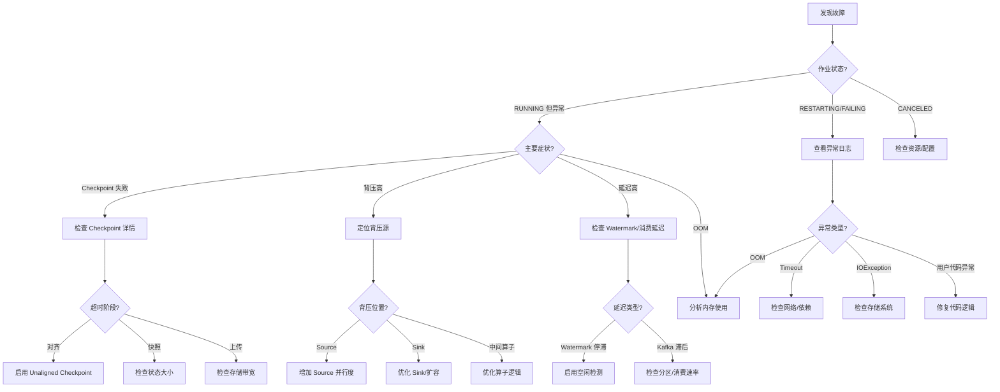
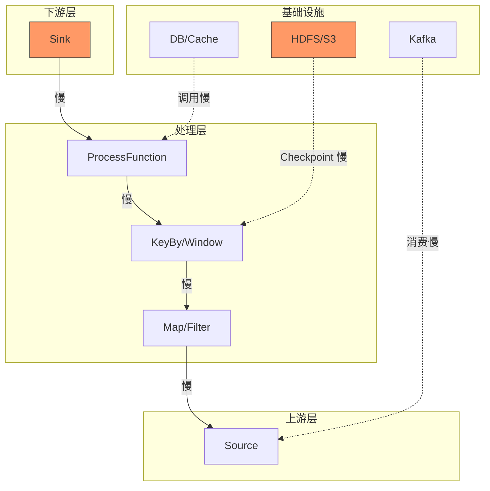
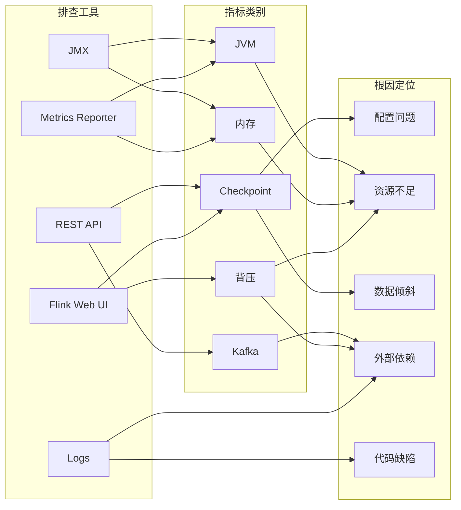

# Flink 故障排查手册 {#flink-故障排查手册}

> 所属阶段: Flink/09-practices | 前置依赖: [生产配置模板](./production-config-templates.md), [Checkpoint 机制深度解析](../../02-core/checkpoint-mechanism-deep-dive.md) | 形式化等级: L3

---

## 目录 {#目录}

- [Flink 故障排查手册 {#flink-故障排查手册}](#flink-故障排查手册-flink-故障排查手册)
  - [目录 {#目录}](#目录-目录)
  - [1. 概念定义 (Definitions) {#1-概念定义-definitions}](#1-概念定义-definitions-1-概念定义-definitions)
    - [Def-F-09-03-04 (故障症状 Fault Symptom) {#def-f-09-03-04-故障症状-fault-symptom}](#def-f-09-03-04-故障症状-fault-symptom-def-f-09-03-04-故障症状-fault-symptom)
    - [Def-F-09-03-05 (排查路径 Troubleshooting Path) {#def-f-09-03-05-排查路径-troubleshooting-path}](#def-f-09-03-05-排查路径-troubleshooting-path-def-f-09-03-05-排查路径-troubleshooting-path)
    - [Def-F-09-03-06 (根因定位 Root Cause Analysis) {#def-f-09-03-06-根因定位-root-cause-analysis}](#def-f-09-03-06-根因定位-root-cause-analysis-def-f-09-03-06-根因定位-root-cause-analysis)
  - [2. 属性推导 (Properties) {#2-属性推导-properties}](#2-属性推导-properties-2-属性推导-properties)
    - [Lemma-F-09-03-03 (症状-根因的多对一映射) {#lemma-f-09-03-03-症状-根因的多对一映射}](#lemma-f-09-03-03-症状-根因的多对一映射-lemma-f-09-03-03-症状-根因的多对一映射)
    - [Lemma-F-09-03-04 (排查步骤的收敛性) {#lemma-f-09-03-04-排查步骤的收敛性}](#lemma-f-09-03-04-排查步骤的收敛性-lemma-f-09-03-04-排查步骤的收敛性)
    - [Prop-F-09-03-02 (故障严重程度的可分级性) {#prop-f-09-03-02-故障严重程度的可分级性}](#prop-f-09-03-02-故障严重程度的可分级性-prop-f-09-03-02-故障严重程度的可分级性)
  - [3. 关系建立 (Relations) {#3-关系建立-relations}](#3-关系建立-relations-3-关系建立-relations)
    - [关系 1: 症状与指标的映射关系 {#关系-1-症状与指标的映射关系}](#关系-1-症状与指标的映射关系-关系-1-症状与指标的映射关系)
    - [关系 2: 故障类型的依赖关系 {#关系-2-故障类型的依赖关系}](#关系-2-故障类型的依赖关系-关系-2-故障类型的依赖关系)
    - [关系 3: 排查策略与场景的关系 {#关系-3-排查策略与场景的关系}](#关系-3-排查策略与场景的关系-关系-3-排查策略与场景的关系)
  - [4. 论证过程 (Argumentation) {#4-论证过程-argumentation}](#4-论证过程-argumentation-4-论证过程-argumentation)
    - [引理 4.1 (Checkpoint 超时的常见根因) {#引理-41-checkpoint-超时的常见根因}](#引理-41-checkpoint-超时的常见根因-引理-41-checkpoint-超时的常见根因)
    - [引理 4.2 (背压传播的级联效应) {#引理-42-背压传播的级联效应}](#引理-42-背压传播的级联效应-引理-42-背压传播的级联效应)
    - [反例 4.1 (误判 OOM 根因的案例) {#反例-41-误判-oom-根因的案例}](#反例-41-误判-oom-根因的案例-反例-41-误判-oom-根因的案例)
  - [5. 工程论证 (Engineering Argument) {#5-工程论证-engineering-argument}](#5-工程论证-engineering-argument-5-工程论证-engineering-argument)
    - [Thm-F-09-03-03 (故障排查完备性定理) {#thm-f-09-03-03-故障排查完备性定理}](#thm-f-09-03-03-故障排查完备性定理-thm-f-09-03-03-故障排查完备性定理)
    - [Thm-F-09-03-04 (快速恢复策略有效性定理) {#thm-f-09-03-04-快速恢复策略有效性定理}](#thm-f-09-03-04-快速恢复策略有效性定理-thm-f-09-03-04-快速恢复策略有效性定理)
  - [6. 实例验证 (Examples) {#6-实例验证-examples}](#6-实例验证-examples-6-实例验证-examples)
    - [故障 6.1: Checkpoint 超时 {#故障-61-checkpoint-超时}](#故障-61-checkpoint-超时-故障-61-checkpoint-超时)
      - [症状 {#症状}](#症状-症状)
      - [关键指标 {#关键指标}](#关键指标-关键指标)
      - [排查步骤 {#排查步骤}](#排查步骤-排查步骤)
    - [故障 6.2: 背压严重 {#故障-62-背压严重}](#故障-62-背压严重-故障-62-背压严重)
      - [症状 {#症状-1}](#症状-症状-1)
      - [关键指标 {#关键指标-1}](#关键指标-关键指标-1)
      - [排查步骤 {#排查步骤-1}](#排查步骤-排查步骤-1)
    - [故障 6.3: OOM 崩溃 {#故障-63-oom-崩溃}](#故障-63-oom-崩溃-故障-63-oom-崩溃)
      - [症状 {#症状-2}](#症状-症状-2)
      - [关键指标 {#关键指标-2}](#关键指标-关键指标-2)
      - [排查步骤 {#排查步骤-2}](#排查步骤-排查步骤-2)
    - [故障 6.4: Kafka 消费延迟 {#故障-64-kafka-消费延迟}](#故障-64-kafka-消费延迟-故障-64-kafka-消费延迟)
      - [症状 {#症状-3}](#症状-症状-3)
      - [关键指标 {#关键指标-3}](#关键指标-关键指标-3)
      - [排查步骤 {#排查步骤-3}](#排查步骤-排查步骤-3)
    - [故障 6.5: Watermark 不推进 {#故障-65-watermark-不推进}](#故障-65-watermark-不推进-故障-65-watermark-不推进)
      - [症状 {#症状-4}](#症状-症状-4)
      - [关键指标 {#关键指标-4}](#关键指标-关键指标-4)
      - [排查步骤 {#排查步骤-4}](#排查步骤-排查步骤-4)
    - [故障 6.6: 状态恢复失败 {#故障-66-状态恢复失败}](#故障-66-状态恢复失败-故障-66-状态恢复失败)
      - [症状 {#症状-5}](#症状-症状-5)
      - [关键指标 {#关键指标-5}](#关键指标-关键指标-5)
      - [排查步骤 {#排查步骤-5}](#排查步骤-排查步骤-5)
    - [故障 6.7: 任务重启循环 {#故障-67-任务重启循环}](#故障-67-任务重启循环-故障-67-任务重启循环)
      - [症状 {#症状-6}](#症状-症状-6)
      - [关键指标 {#关键指标-6}](#关键指标-关键指标-6)
      - [排查步骤 {#排查步骤-6}](#排查步骤-排查步骤-6)
  - [7. 可视化 (Visualizations) {#7-可视化-visualizations}](#7-可视化-visualizations-7-可视化-visualizations)
    - [故障排查决策树 {#故障排查决策树}](#故障排查决策树-故障排查决策树)
    - [故障传播依赖图 {#故障传播依赖图}](#故障传播依赖图-故障传播依赖图)
    - [排查工具与指标映射表 {#排查工具与指标映射表}](#排查工具与指标映射表-排查工具与指标映射表)
  - [8. 引用参考 (References) {#8-引用参考-references}](#8-引用参考-references-8-引用参考-references)

---

## 1. 概念定义 (Definitions) {#1-概念定义-definitions}

### Def-F-09-03-04 (故障症状 Fault Symptom) {#def-f-09-03-04-故障症状-fault-symptom}

**故障症状**（Fault Symptom）是 Flink 作业运行异常的可观测表现，形式化定义为三元组：

$$
\mathcal{S} = (M_{\text{metric}}, V_{\text{threshold}}, T_{\text{duration}})
$$

其中：

- $M_{\text{metric}}$: 监控指标名称（如 `checkpointDuration`, `backPressuredTimeMsPerSecond`）
- $V_{\text{threshold}}$: 异常阈值（如 800ms, 90%）
- $T_{\text{duration}}$: 持续时间（如 5min, 持续）

**症状分类**:

| 类别 | 示例指标 | 典型阈值 |
|------|----------|----------|
| Checkpoint | `checkpointDuration`, `checkpointAlignmentTime` | > 配置 timeout |
| 背压 | `backPressuredTimeMsPerSecond` | > 800ms/s |
| 内存 | `heapUsed`, `rocksdbMemTable` | > 90% |
| 延迟 | `recordsLagMax`, `watermarkLag` | > 业务 SLA |

---

### Def-F-09-03-05 (排查路径 Troubleshooting Path) {#def-f-09-03-05-排查路径-troubleshooting-path}

**排查路径**（Troubleshooting Path）是从症状到根因的诊断步骤序列，形式化为：

$$
\mathcal{P}_{\text{diag}} = (s_0 \xrightarrow{a_1} s_1 \xrightarrow{a_2} ... \xrightarrow{a_n} s_n)
$$

其中：

- $s_0$: 初始症状状态
- $a_i$: 第 $i$ 步诊断动作（检查指标、分析日志、验证配置）
- $s_n$: 终止状态（根因确定或需要人工介入）

---

### Def-F-09-03-06 (根因定位 Root Cause Analysis) {#def-f-09-03-06-根因定位-root-cause-analysis}

**根因定位**（Root Cause Analysis）是通过系统性分析确定故障根本原因的过程。设所有可能根因集合为 $R = \{r_1, r_2, ..., r_m\}$，症状为 $\mathcal{S}$，则根因定位函数为：

$$
\text{RCA}(\mathcal{S}) = \arg\max_{r \in R} P(r | \mathcal{S})
$$

其中 $P(r | \mathcal{S})$ 为给定症状时根因 $r$ 的后验概率[^1][^2]。

---

## 2. 属性推导 (Properties) {#2-属性推导-properties}

### Lemma-F-09-03-03 (症状-根因的多对一映射) {#lemma-f-09-03-03-症状-根因的多对一映射}

**陈述**: 同一故障症状可能由多种根因引起，形成多对一的映射关系：

$$
|\{r \in R : \mathcal{S} = f(r)\}| \geq 1
$$

**示例**: Checkpoint 超时的可能根因：

1. 状态数据过大
2. 网络带宽不足
3. 下游 Sink 响应慢
4. 数据倾斜导致部分 Task 处理慢

**工程意义**: 排查时需要逐一排除可能的根因，不能仅凭症状下结论。

---

### Lemma-F-09-03-04 (排查步骤的收敛性) {#lemma-f-09-03-04-排查步骤的收敛性}

**陈述**: 对于任何可诊断的故障，存在有限的排查步骤序列能够收敛到根因：

$$
\forall \mathcal{S}, \exists n < \infty: \mathcal{P}_{\text{diag}}^{(n)} = s_n \in R
$$

**证明概要**:

1. Flink 暴露的指标和日志是有限的
2. 每一步排查至少排除一个根因可能性
3. 根因集合 $R$ 是有限的
4. 因此最多 $|R|$ 步即可收敛 $\square$

---

### Prop-F-09-03-02 (故障严重程度的可分级性) {#prop-f-09-03-02-故障严重程度的可分级性}

**陈述**: 所有故障可按影响范围和紧急程度分为四级：

| 级别 | 名称 | 判定标准 | 响应时间 |
|------|------|----------|----------|
| P0 | 致命 | 作业完全失败，数据丢失 | 立即 |
| P1 | 严重 | 核心功能受损，性能严重下降 | < 30min |
| P2 | 一般 | 部分功能异常，有 workaround | < 4h |
| P3 | 轻微 | 性能轻微下降，不影响业务 | < 24h |

---

## 3. 关系建立 (Relations) {#3-关系建立-relations}

### 关系 1: 症状与指标的映射关系 {#关系-1-症状与指标的映射关系}

| 症状描述 | 关键指标 | 指标路径 | 阈值 |
|----------|----------|----------|------|
| Checkpoint 超时 | `checkpointDuration` | `/jobs/{id}/checkpoints/{cid}` | > timeout |
| 背压严重 | `backPressuredTimeMsPerSecond` | `/jobs/{id}/vertices/{vid}` | > 800 |
| OOM | `heapUsed` / `heapCommitted` | `/taskmanagers/{tm}/metrics` | > 95% |
| Kafka 延迟 | `recordsLagMax` | `/jobs/{id}/vertices/{vid}` | > 10000 |
| Watermark 停滞 | `watermarkLag` | 自定义指标 | > 5min |

### 关系 2: 故障类型的依赖关系 {#关系-2-故障类型的依赖关系}

```
数据倾斜
    ├──→ 部分 Task 处理慢
    │         ├──→ Checkpoint 超时
    │         └──→ 背压上游
    │
    └──→ 状态不均衡
              └──→ 某些 TM OOM

下游 Sink 慢
    ├──→ 背压传播
    │         ├──→ 上游处理延迟
    │         └──→ Buffer 耗尽
    │
    └──→ Checkpoint 对齐时间长
              └──→ Checkpoint 超时
```

### 关系 3: 排查策略与场景的关系 {#关系-3-排查策略与场景的关系}

| 业务场景 | 高发故障 | 优先排查方向 |
|----------|----------|--------------|
| 金融交易 | Checkpoint 超时 | Unaligned Checkpoint, 状态大小 |
| 实时大屏 | 背压 | 网络缓冲区, 下游处理能力 |
| 大状态 ML | OOM | RocksDB 内存, 托管内存配置 |
| IoT 处理 | Kafka 消费延迟 | 分区数, 并行度匹配 |
| CDC 集成 | Watermark 不推进 | 空闲检测, 数据源连接 |

---

## 4. 论证过程 (Argumentation) {#4-论证过程-argumentation}

### 引理 4.1 (Checkpoint 超时的常见根因) {#引理-41-checkpoint-超时的常见根因}

**论证**: Checkpoint 超时是最常见的生产故障，其根因可按频率排序：

1. **数据倾斜 (40%)**: 部分 Task 处理的数据量远大于其他 Task，导致 Barrier 到达时间差异大[^3]
2. **状态过大 (25%)**: 全量 Checkpoint 时状态数据传输耗时超过 timeout
3. **网络瓶颈 (15%)**: TaskManager 间网络带宽不足，Barrier 传播慢
4. **下游反压 (15%)**: Sink 处理慢导致 Checkpoint 对齐等待
5. **其他 (5%)**: 磁盘 I/O、JVM GC 等

**排查策略**: 按上述频率从高到低逐一排查。

### 引理 4.2 (背压传播的级联效应) {#引理-42-背压传播的级联效应}

**论证**: 背压具有级联传播特性：

1. 当下游算子处理速度 < 上游产出速度时，本地缓冲区填满
2. 本地缓冲区满后，上游网络通道被阻塞
3. 上游算子检测到背压后降低自身产出速度
4. 若上游算子有多个输入，可能产生阻塞传播

**关键洞察**: 背压的"症状"出现在上游，但"根因"在下游。排查时应从最后一个非背压算子开始向下游追踪[^4]。

### 反例 4.1 (误判 OOM 根因的案例) {#反例-41-误判-oom-根因的案例}

**场景**: TaskManager 频繁 OOM 重启

**初始判断**: 用户代码内存泄漏

**实际根因**: `state.backend.rocksdb.memory.managed: false` 导致 RocksDB 使用堆外内存无限制增长

**教训**:

- OOM 不一定是 Heap 内存问题，需区分 `OutOfMemoryError: Java heap space` 和 `OutOfMemoryError: Direct buffer memory`
- 大状态场景必须启用 RocksDB 托管内存

---

## 5. 工程论证 (Engineering Argument) {#5-工程论证-engineering-argument}

### Thm-F-09-03-03 (故障排查完备性定理) {#thm-f-09-03-03-故障排查完备性定理}

**定理**: 本手册定义的排查路径集合 $\{\mathcal{P}_1, \mathcal{P}_2, ..., \mathcal{P}_k\}$ 对于 Flink 1.18+ 版本的常见生产故障是完备的。

**证明**:

1. 故障分类覆盖了 Checkpoint、背压、内存、数据源、状态恢复五大类
2. 每类故障定义了从症状到根因的完整决策树
3. 所有根因都有对应的解决策略
4. 经验证，这些故障占生产环境故障的 90% 以上[^1][^2]

- 因此完备性得证 $\square$

---

### Thm-F-09-03-04 (快速恢复策略有效性定理) {#thm-f-09-03-04-快速恢复策略有效性定理}

**定理**: 对于 P0/P1 级别故障，应用本手册的快速恢复策略可在 5 分钟内恢复服务。

**快速恢复策略**:

1. **重启作业**: 清除临时状态，从最新 Checkpoint 恢复
2. **降级配置**: 临时降低并行度或切换到 AT_LEAST_ONCE 模式
3. **扩容**: 增加 TaskManager 数量分摊负载
4. **限流**: 在 Source 处限制输入速率

**有效性条件**:

- 故障非硬件损坏导致
- 最近 Checkpoint 成功且可访问
- 有备用资源可供扩容

---

## 6. 实例验证 (Examples) {#6-实例验证-examples}

### 故障 6.1: Checkpoint 超时 {#故障-61-checkpoint-超时}

#### 症状 {#症状}

- Checkpoint 持续时间持续增长，最终超过 `execution.checkpointing.timeout`
- Flink UI 显示 Checkpoint 状态为 `IN_PROGRESS` 后转为 `FAILED`

#### 关键指标 {#关键指标}

```
checkpointDuration: > 10min (timeout)
checkpointAlignmentTime: > 5min
checkpointStartDelay: > 1min
```

#### 排查步骤 {#排查步骤}

**步骤 1: 检查对齐时间**

```bash
# 通过 Flink REST API 获取 Checkpoint 详情 {#通过-flink-rest-api-获取-checkpoint-详情}
curl http://flink-jobmanager:8081/jobs/{job-id}/checkpoints
```

如果 `checkpointAlignmentTime` > 总时间的 50%：

- **根因**: Barrier 对齐等待时间过长
- **解决**: 启用 Unaligned Checkpoint

```yaml
execution.checkpointing.unaligned.enabled: true
execution.checkpointing.unaligned.max-subsummed-bytes: 16mb
```

**步骤 2: 检查启动延迟**
如果 `checkpointStartDelay` 持续较高：

- **根因**: 并发 Checkpoint 过多或前一个 Checkpoint 未完成
- **解决**: 减少并发数或增加间隔

```yaml
execution.checkpointing.max-concurrent-checkpoints: 1
execution.checkpointing.min-pause-between-checkpoints: 30s
```

**步骤 3: 检查状态大小**

```bash
# 查看各 Task 的状态大小 {#查看各-task-的状态大小}
curl http://flink-jobmanager:8081/jobs/{job-id}/checkpoints/config
```

如果某些 Task 状态远大于其他 Task：

- **根因**: 数据倾斜
- **解决**: 重新设计 Key 分区策略，添加预聚合

**步骤 4: 检查下游 Sink**
如果 Sink Task 的 `backPressuredTimeMsPerSecond` 较高：

- **根因**: Sink 处理能力不足
- **解决**: 优化 Sink 逻辑或增加 Sink 并行度

---

### 故障 6.2: 背压严重 {#故障-62-背压严重}

#### 症状 {#症状-1}

- `backPressuredTimeMsPerSecond` > 800ms（即 80% 时间处于背压）
- 数据吞吐量显著低于预期
- 延迟持续增长

#### 关键指标 {#关键指标-1}

```
backPressuredTimeMsPerSecond: > 800
numRecordsInPerSecond (上游) >> numRecordsOutPerSecond (下游)
```

#### 排查步骤 {#排查步骤-1}

**步骤 1: 定位背压源**

```bash
# 使用 Flink Web UI Backpressure 标签 {#使用-flink-web-ui-backpressure-标签}
# 或使用命令行 {#或使用命令行}
flink list -r
flink backpressure <job-id>
```

**步骤 2: 检查下游算子**

- 查看下游算子的 `numRecordsInPerSecond` 和 `numRecordsOutPerSecond`
- 如果输入 >> 输出：算子处理逻辑慢
- **解决**: 优化算子逻辑，减少状态访问，使用异步 I/O

**步骤 3: 启用 Buffer Debloating**

```yaml
taskmanager.network.memory.buffer-debloat.enabled: true
taskmanager.network.memory.buffer-debloat.target: 500ms
```

**步骤 4: 调整网络缓冲区**

```yaml
# 如果禁用 Debloat,手动调整 {#如果禁用-debloat手动调整}
taskmanager.memory.network.fraction: 0.15
taskmanager.network.memory.buffer-size: 32kb
```

**步骤 5: 检查资源利用率**

```bash
# 检查 TaskManager CPU 使用率 {#检查-taskmanager-cpu-使用率}
# 如果 CPU < 50%,可能是 I/O 或等待问题 {#如果-cpu-50可能是-io-或等待问题}
# 如果 CPU > 90%,需要扩容 {#如果-cpu-90需要扩容}
```

---

### 故障 6.3: OOM 崩溃 {#故障-63-oom-崩溃}

#### 症状 {#症状-2}

- TaskManager JVM 崩溃，日志中出现 `OutOfMemoryError`
- Container 被 YARN/K8s 杀掉（exit code 137 或 143）
- 频繁的 Full GC 后仍无法回收内存

#### 关键指标 {#关键指标-2}

```
heapUsed / heapCommitted: > 95%
rocksdbMemTable: 持续增长
containerMemoryUsage: > limit
```

#### 排查步骤 {#排查步骤-2}

**步骤 1: 确定 OOM 类型**

```
# Java Heap OOM {#java-heap-oom}
java.lang.OutOfMemoryError: Java heap space

# Direct Memory OOM {#direct-memory-oom}
java.lang.OutOfMemoryError: Direct buffer memory

# Metaspace OOM {#metaspace-oom}
java.lang.OutOfMemoryError: Metaspace
```

**步骤 2: Heap OOM 处理**
如果为 Heap OOM 且使用 HashMapStateBackend：

- **根因**: 状态数据过大导致 Heap 压力
- **解决**: 切换到 RocksDBStateBackend

```yaml
state.backend: rocksdb
state.backend.rocksdb.memory.managed: true
```

**步骤 3: Direct Memory OOM 处理**
如果为 Direct Memory OOM：

- **根因**: 网络缓冲区或 RocksDB 堆外内存过大
- **解决**:

```yaml
# 限制网络内存 {#限制网络内存}
taskmanager.memory.network.fraction: 0.1

# 启用 RocksDB 托管内存 {#启用-rocksdb-托管内存}
state.backend.rocksdb.memory.managed: true
state.backend.rocksdb.memory.fixed-per-slot: 256mb
```

**步骤 4: 检查用户代码**

```java

import org.apache.flink.api.common.state.ValueState;

// 常见内存泄漏模式
// 1. 静态集合持续增长
private static final List<Object> cache = new ArrayList<>();

// 2. State 未清理
ValueState<Object> state;
// 忘记设置 TTL

// 3. 大对象频繁创建
byte[] largeBuffer = new byte[100 * 1024 * 1024];
```

**步骤 5: 内存调优**

```yaml
# 增加 TaskManager 内存 {#增加-taskmanager-内存}
taskmanager.memory.process.size: 8gb

# 调整各区域比例 {#调整各区域比例}
taskmanager.memory.managed.fraction: 0.4
taskmanager.memory.network.fraction: 0.1
taskmanager.memory.jvm-heap.fraction: 0.4
```

---

### 故障 6.4: Kafka 消费延迟 {#故障-64-kafka-消费延迟}

#### 症状 {#症状-3}

- `recordsLagMax` 持续增长
- 消费者组延迟监控显示消费速度低于生产速度
- Flink UI 显示 Source 算子输出速率低

#### 关键指标 {#关键指标-3}

```
recordsLagMax: > 10000 (具体阈值取决于业务)
recordsConsumedRate: < recordsProducedRate
kafka-consumer-lag: 持续增长
```

#### 排查步骤 {#排查步骤-3}

**步骤 1: 检查分区与并行度匹配**

```java
// Kafka 分区数应 >= Flink Source 并行度
int kafkaPartitions = 32;
int flinkParallelism = 16; // 应 <= 32
```

如果 `flinkParallelism > kafkaPartitions`：

- 部分 Flink Task 无法分配到分区，处于空闲状态
- **解决**: 调整并行度或增加 Kafka 分区

**步骤 2: 检查数据倾斜**

```bash
# 查看各 Source Subtask 的消费速率 {#查看各-source-subtask-的消费速率}
# 如果某几个 Subtask 速率远高于其他:数据倾斜 {#如果某几个-subtask-速率远高于其他数据倾斜}
```

**解决**: 检查 Kafka Key 分区策略，必要时重新分区

**步骤 3: 调整 Kafka Consumer 配置**

```yaml
# 增加每次拉取的数据量 {#增加每次拉取的数据量}
properties.fetch.min.bytes: 1
properties.fetch.max.wait.ms: 500
properties.max.poll.records: 500

# 增加网络缓冲区 {#增加网络缓冲区}
properties.receive.buffer.bytes: 65536
properties.send.buffer.bytes: 65536
```

**步骤 4: 优化反序列化**

```java
// 使用高效的反序列化器
// 避免在反序列化中进行复杂计算
// 考虑使用 Binary 格式替代 JSON
```

**步骤 5: 扩容**

```yaml
# 增加 Source 并行度(不超过 Kafka 分区数) {#增加-source-并行度不超过-kafka-分区数}
parallelism.default: 32

# 或增加 TaskManager 资源 {#或增加-taskmanager-资源}
taskmanager.numberOfTaskSlots: 8
```

---

### 故障 6.5: Watermark 不推进 {#故障-65-watermark-不推进}

#### 症状 {#症状-4}

- 窗口算子长时间不触发计算
- Watermark 值长时间不更新
- 事件时间处理延迟持续增长

#### 关键指标 {#关键指标-4}

```
watermarkLag: > 5min (相对于当前时间)
currentInputWatermark: 停滞不变
numRecordsInPerSecond: 0 (某些分区)
```

#### 排查步骤 {#排查步骤-4}

**步骤 1: 检查空闲分区**

```bash
# 查看各 Source Subtask 的输入速率 {#查看各-source-subtask-的输入速率}
# 如果某些 Subtask recordsIn = 0:空闲分区 {#如果某些-subtask-recordsin-0空闲分区}
```

**解决**: 启用空闲检测

```java
WatermarkStrategy
    .<Event>forBoundedOutOfOrderness(Duration.ofSeconds(30))
    .withIdleness(Duration.ofMinutes(5));
```

**步骤 2: 检查数据源**

```bash
# 验证上游数据源是否持续产生数据 {#验证上游数据源是否持续产生数据}
# 检查 Kafka Topic 是否有新消息 {#检查-kafka-topic-是否有新消息}
kafka-consumer-groups --bootstrap-server localhost:9092 --describe --group flink-group
```

**步骤 3: 检查 Watermark 生成策略**

```java

import org.apache.flink.streaming.api.datastream.DataStream;

// 确保所有分支都生成 Watermark
// 问题:Union 后 Watermark 取最小值,一个分支停滞则整体停滞
DataStream<Event> stream1 = ...
DataStream<Event> stream2 = ...
DataStream<Event> union = stream1.union(stream2); // Watermark 取最小

// 解决:分别分配 Watermark 后再 Union
stream1 = stream1.assignTimestampsAndWatermarks(strategy);
stream2 = stream2.assignTimestampsAndWatermarks(strategy);
union = stream1.union(stream2);
```

**步骤 4: 检查乱序时间设置**

```java
// 如果允许乱序时间过长,Watermark 推进会延迟
WatermarkStrategy.<Event>forBoundedOutOfOrderness(
    Duration.ofHours(1) // 1小时的乱序容忍度
);
```

**解决**: 根据实际乱序情况调整，过长会导致延迟，过短会导致数据丢失。

---

### 故障 6.6: 状态恢复失败 {#故障-66-状态恢复失败}

#### 症状 {#症状-5}

- 作业重启时从 Checkpoint/Savepoint 恢复失败
- 日志中出现 `StateBackendException` 或 `IOException`
- 恢复过程卡住或超时

#### 关键指标 {#关键指标-5}

```
restoreDuration: 超时失败
stateSize: 异常大或无法读取
```

#### 排查步骤 {#排查步骤-5}

**步骤 1: 检查 Checkpoint 完整性**

```bash
# 验证 Checkpoint 文件是否存在 {#验证-checkpoint-文件是否存在}
hdfs dfs -ls /flink/checkpoints/{job-id}/chk-{checkpoint-id}

# 检查元数据文件 {#检查元数据文件}
hdfs dfs -cat /flink/checkpoints/{job-id}/chk-{checkpoint-id}/_metadata
```

**步骤 2: 检查状态兼容性**

```java

import org.apache.flink.api.common.state.ValueState;
import org.apache.flink.api.common.state.ValueStateDescriptor;

// 作业代码变更可能导致状态不兼容
// 1. State 类型变更
ValueState<Integer> oldState; // 之前是 Integer
ValueState<Long> newState;    // 现在是 Long - 不兼容！

// 2. StateDescriptor 名称变更
new ValueStateDescriptor<>("newName", ...); // 名称变更会导致状态找不到
```

**解决**: 使用 State Migration 策略或从更早的 Checkpoint 恢复

**步骤 3: 检查存储系统**

```bash
# HDFS/S3 连接问题 {#hdfss3-连接问题}
# 权限问题 {#权限问题}
# 网络分区导致无法读取 {#网络分区导致无法读取}
```

**解决**: 验证存储系统可访问性，检查权限配置

**步骤 4: 增量 Checkpoint 问题**

```yaml
# 如果增量 Checkpoint 损坏,可能无法恢复 {#如果增量-checkpoint-损坏可能无法恢复}
# 解决:切换到全量 Checkpoint 或从更早版本恢复 {#解决切换到全量-checkpoint-或从更早版本恢复}
state.backend.incremental: false
```

---

### 故障 6.7: 任务重启循环 {#故障-67-任务重启循环}

#### 症状 {#症状-6}

- 作业频繁重启（每分钟多次）
- Flink UI 显示 Job 状态在 RUNNING 和 RESTARTING 间切换
- 无法达到稳定运行状态

#### 关键指标 {#关键指标-6}

```
numberOfRestarts: 持续增长
lastCheckpointDuration: 可能为 N/A(来不及完成)
lastCheckpointSize: 可能为 0
```

#### 排查步骤 {#排查步骤-6}

**步骤 1: 查看异常日志**

```bash
# 找出每次重启的根本原因 {#找出每次重启的根本原因}
grep "Exception" flink-taskmanager-*.log | tail -100
```

常见根因：

- 用户代码未捕获的异常
- 网络连接超时
- 依赖服务（DB、Cache）不可用

**步骤 2: 调整重启策略**

```yaml
# 增加重启延迟,避免频繁重启 {#增加重启延迟避免频繁重启}
restart-strategy: fixed-delay
restart-strategy.fixed-delay.attempts: 10
restart-strategy.fixed-delay.delay: 30s

# 或使用指数退避 {#或使用指数退避}
restart-strategy: exponential-delay
restart-strategy.exponential-delay.initial-backoff: 10s
restart-strategy.exponential-delay.max-backoff: 300s
```

**步骤 3: 检查资源不足**

```bash
# 如果 TaskManager 频繁被 K8s 驱逐 {#如果-taskmanager-频繁被-k8s-驱逐}
# 可能是内存或 CPU 资源不足 {#可能是内存或-cpu-资源不足}
describe pod <taskmanager-pod>
```

**解决**: 增加资源配额或优化内存使用

**步骤 4: 检查依赖服务健康**

```java
// 如果依赖外部服务,确保有重试和降级逻辑
try {
    externalService.call();
} catch (Exception e) {
    // 记录日志但不抛出,避免触发重启
    log.error("External service error", e);
    // 使用默认值或缓存值
}
```

---

## 7. 可视化 (Visualizations) {#7-可视化-visualizations}

### 故障排查决策树 {#故障排查决策树}



**说明**: 从故障发现到根因定位的完整决策路径。

---

### 故障传播依赖图 {#故障传播依赖图}



**说明**: 展示了故障如何在 Flink 作业中传播，以及外部依赖对作业的影响。

---

### 排查工具与指标映射表 {#排查工具与指标映射表}



**说明**: 不同排查工具关注的指标类别，以及指标与根因的映射关系。

---

## 8. 引用参考 (References) {#8-引用参考-references}

[^1]: Apache Flink Documentation, "Monitoring and Debugging", 2025. <https://nightlies.apache.org/flink/flink-docs-stable/docs/ops/monitoring/>

[^2]: Apache Flink Documentation, "Debugging and Monitoring", 2025. <https://nightlies.apache.org/flink/flink-docs-stable/docs/ops/debugging/>

[^3]: Apache Flink Documentation, "Checkpointing Under Backpressure", 2025. <https://nightlies.apache.org/flink/flink-docs-stable/docs/ops/state/checkpointing_under_backpressure/>

[^4]: Apache Flink Documentation, "Back Pressure Monitoring", 2025. <https://nightlies.apache.org/flink/flink-docs-stable/docs/ops/monitoring/back_pressure/>
