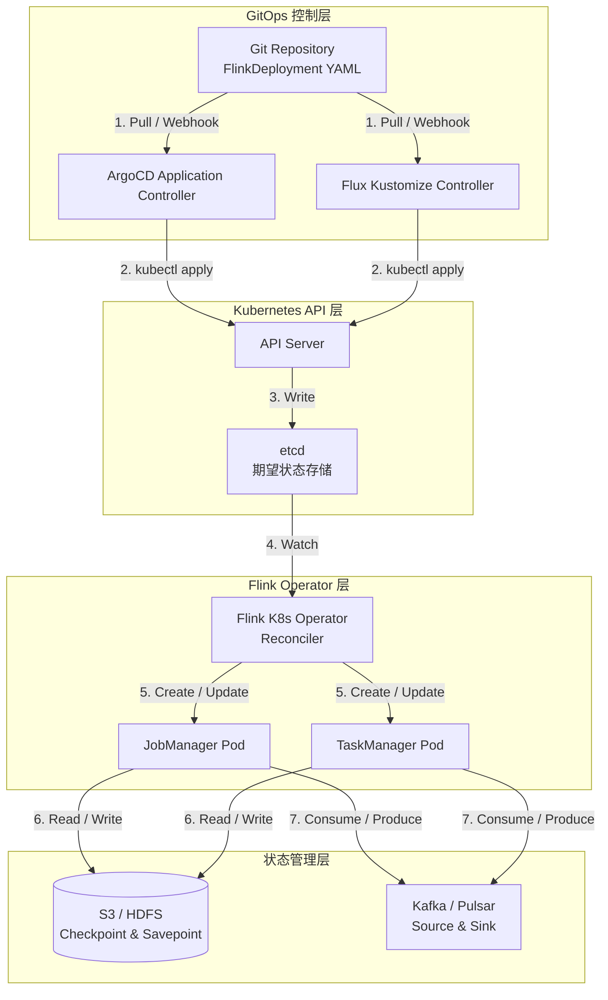
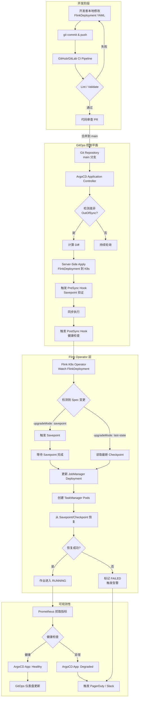
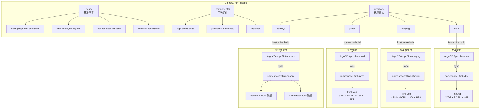
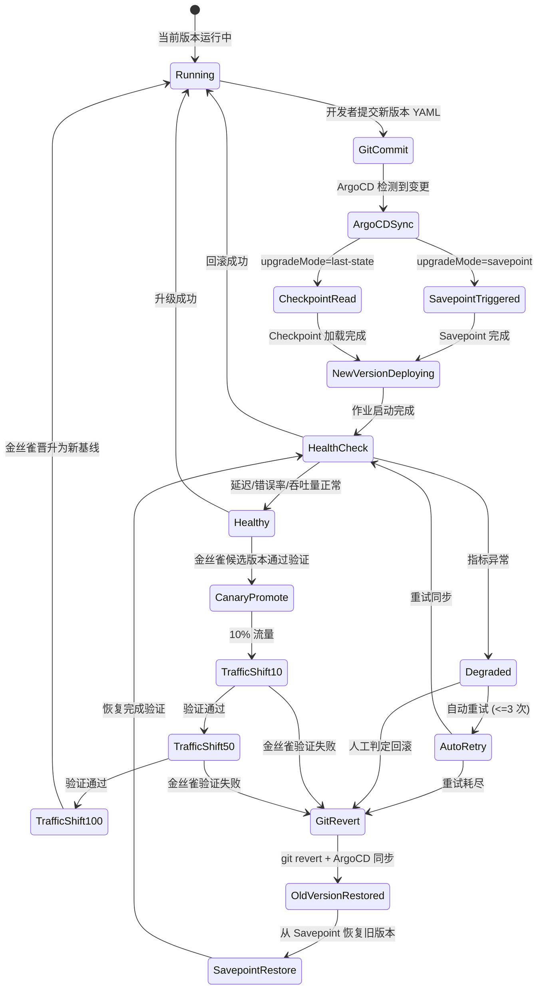
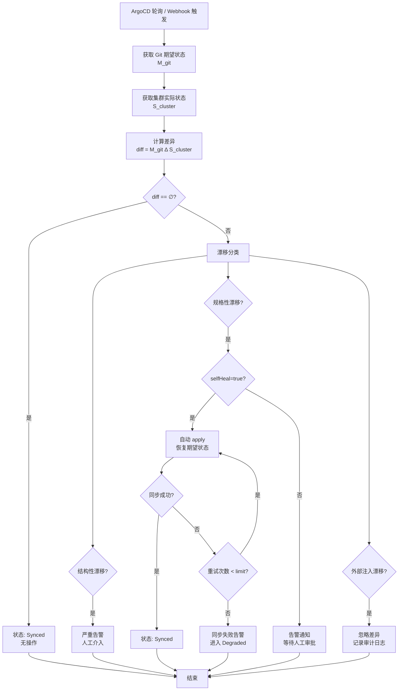
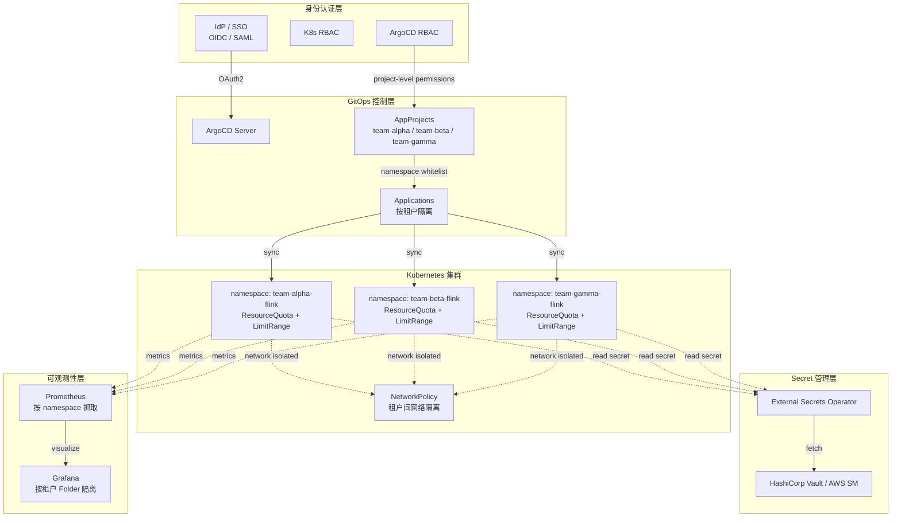

# Flink GitOps 生产部署深度指南

> **所属阶段**: Flink/09-practices/09.04-deployment | **前置依赖**: [flink-kubernetes-operator-1.14-guide.md](./flink-kubernetes-operator-1.14-guide.md) | **形式化等级**: L5 (生产级严格)
>
> **适用版本**: Apache Flink 2.0+ / Flink Kubernetes Operator 1.14+ / ArgoCD 2.10+ / Flux 2.2+ | **最后更新**: 2026-04-19

---

## 目录

- [Flink GitOps 生产部署深度指南](#flink-gitops-生产部署深度指南)
  - [目录](#目录)
  - [1. 概念定义 (Definitions)](#1-概念定义-definitions)
    - [Def-F-09-60: 流计算场景下的 GitOps (GitOps for Stream Processing)](#def-f-09-60-流计算场景下的-gitops-gitops-for-stream-processing)
    - [Def-F-09-61: FlinkDeployment CRD GitOps 工作流](#def-f-09-61-flinkdeployment-crd-gitops-工作流)
    - [Def-F-09-62: 配置漂移 (Configuration Drift)](#def-f-09-62-配置漂移-configuration-drift)
    - [Def-F-09-63: 金丝雀发布 (Canary Deployment in GitOps)](#def-f-09-63-金丝雀发布-canary-deployment-in-gitops)
    - [Def-F-09-64: GitOps 调和循环 (Reconciliation Loop)](#def-f-09-64-gitops-调和循环-reconciliation-loop)
    - [Def-F-09-65: 多环境 GitOps 策略 (Multi-Environment GitOps Strategy)](#def-f-09-65-多环境-gitops-策略-multi-environment-gitops-strategy)
    - [Def-F-09-66: GitOps 可观测性状态 (GitOps Observability State)](#def-f-09-66-gitops-可观测性状态-gitops-observability-state)
  - [2. 属性推导 (Properties)](#2-属性推导-properties)
    - [Lemma-F-09-60: GitOps 幂等同步的收敛性](#lemma-f-09-60-gitops-幂等同步的收敛性)
    - [Lemma-F-09-61: 配置漂移检测的完备性](#lemma-f-09-61-配置漂移检测的完备性)
    - [Prop-F-09-60: 多环境配置一致性命题](#prop-f-09-60-多环境配置一致性命题)
    - [Prop-F-09-61: 金丝雀发布的流量安全性](#prop-f-09-61-金丝雀发布的流量安全性)
    - [Lemma-F-09-62: 回滚操作的原子性边界](#lemma-f-09-62-回滚操作的原子性边界)
  - [3. 关系建立 (Relations)](#3-关系建立-relations)
    - [3.1 ArgoCD 与 Flux 在 Flink 场景中的集成模式对比](#31-argocd-与-flux-在-flink-场景中的集成模式对比)
    - [3.2 GitOps 控制器与 Flink K8s Operator 的协作关系](#32-gitops-控制器与-flink-k8s-operator-的协作关系)
    - [3.3 部署模式与 GitOps 策略映射矩阵](#33-部署模式与-gitops-策略映射矩阵)
  - [4. 论证过程 (Argumentation)](#4-论证过程-argumentation)
    - [4.1 为什么选择 GitOps 管理 Flink 部署](#41-为什么选择-gitops-管理-flink-部署)
    - [4.2 反例分析：手动部署的系统性风险](#42-反例分析手动部署的系统性风险)
    - [4.3 金丝雀发布 vs 蓝绿部署的决策分析](#43-金丝雀发布-vs-蓝绿部署的决策分析)
    - [4.4 多租户隔离策略的工程论证](#44-多租户隔离策略的工程论证)
  - [5. 形式证明 / 工程论证 (Proof / Engineering Argument)]()
    - [Thm-F-09-60: GitOps 模式下 Flink 作业升级的可恢复性定理](#thm-f-09-60-gitops-模式下-flink-作业升级的可恢复性定理)
  - [6. 实例验证 (Examples)](#6-实例验证-examples)
    - [6.1 完整 GitOps 仓库目录结构](#61-完整-gitops-仓库目录结构)
    - [6.2 ArgoCD Application 生产级配置](#62-argocd-application-生产级配置)
    - [6.3 FlinkDeployment 生产级 YAML](#63-flinkdeployment-生产级-yaml)
    - [6.4 Helm Chart values 多环境配置](#64-helm-chart-values-多环境配置)
    - [6.5 Kustomize Overlay 分层配置](#65-kustomize-overlay-分层配置)
    - [6.6 Flux Kustomization 与 HelmRelease 配置](#66-flux-kustomization-与-helmrelease-配置)
    - [6.7 金丝雀发布完整配置](#67-金丝雀发布完整配置)
    - [6.8 RBAC 最小权限配置](#68-rbac-最小权限配置)
    - [6.9 Secret 管理：External Secrets Operator 集成](#69-secret-管理external-secrets-operator-集成)
    - [6.10 配置漂移检测策略配置](#610-配置漂移检测策略配置)
    - [6.11 自动修复与自愈合策略](#611-自动修复与自愈合策略)
    - [6.12 多租户命名空间与资源配额配置](#612-多租户命名空间与资源配额配置)
    - [6.13 PrometheusRule：GitOps 状态同步监控告警](#613-prometheusrulegitops-状态同步监控告警)
    - [6.14 ArgoCD ApplicationSet 多集群配置](#614-argocd-applicationset-多集群配置)
  - [7. 可视化 (Visualizations)](#7-可视化-visualizations)
    - [7.1 GitOps 完整工作流](#71-gitops-完整工作流)
    - [7.2 多环境部署架构](#72-多环境部署架构)
    - [7.3 回滚与金丝雀策略](#73-回滚与金丝雀策略)
    - [7.4 配置漂移检测与自动修复](#74-配置漂移检测与自动修复)
    - [7.5 多租户 GitOps 安全架构](#75-多租户-gitops-安全架构)
  - [8. 引用参考 (References)](#8-引用参考-references)

---

## 1. 概念定义 (Definitions)

### Def-F-09-60: 流计算场景下的 GitOps (GitOps for Stream Processing)

**形式化定义**：

流计算场景下的 GitOps 是一个七元组：

```
GitOps_SP = ⟨ Repository, Manifest, Controller, Cluster, State, Reconcile, Audit ⟩
```

其中各元素的语义如下：

- **Repository** ($R$): 存储所有 Flink 部署声明的 Git 仓库集合，$R = \{r_{dev}, r_{staging}, r_{prod}, ...\}$，每个分支或目录对应一个环境的期望状态。
- **Manifest** ($M$): Kubernetes 原生资源清单集合，包括 `FlinkDeployment`、`ConfigMap`、`Secret`、`Service`、`Ingress`、`NetworkPolicy` 等，$M = \bigcup_{i} m_i$，其中每个 $m_i$ 是声明式配置片段。
- **Controller** ($C$): GitOps 控制器（ArgoCD Application Controller 或 Flux Kustomize/Helm Controller），负责持续监视 $R$ 的变化并驱动状态同步。
- **Cluster** ($K$): 目标 Kubernetes 集群集合，$K = \{k_1, k_2, ..., k_n\}$，每个集群可包含多个命名空间。
- **State** ($S$): 实际集群状态函数，$S: K \times T \rightarrow \mathcal{P}(M)$，表示在时刻 $t$ 集群 $k$ 上运行的全部资源实例。
- **Reconcile** ($\rho$): 调和函数，$\rho: M \times S \rightarrow \Delta$，将期望状态与实际状态的差异映射为补偿操作集合 $\Delta$。
- **Audit** ($A$): 审计轨迹，$A \subseteq \mathbb{N} \times R \times M \times S \times \Delta$，记录每一次状态变更的完整上下文。

**直观解释**：

在流计算场景中，GitOps 的核心挑战在于 Flink 作业是**有状态的长期运行服务**。与无状态 Web 应用不同，Flink 作业的升级、扩缩容、回滚都涉及 Checkpoint/Savepoint 的状态管理。因此，流计算 GitOps 必须在"声明式基础设施"之上叠加"状态感知的生命周期管理"。这意味着 Git 仓库不仅要存储 `FlinkDeployment` 的 YAML，还需包含升级策略（`upgradeMode`）、Savepoint 触发策略、状态后端配置等元数据，确保控制器能够协调 Flink K8s Operator 完成安全的状态迁移。

---

### Def-F-09-61: FlinkDeployment CRD GitOps 工作流

**形式化定义**：

FlinkDeployment CRD 的 GitOps 工作流是一个状态转换系统：

```
Workflow = ⟨ Q, q_0, \Sigma, \delta, F ⟩
```

- **状态集合** $Q = \{SYNCHRONIZED, OUT_OF_SYNC, SYNCING, SYNC_FAILED, HEALTHY, DEGRADED, ROLLING_BACK\}$
- **初始状态** $q_0 = \text{SYNCHRONIZED}$
- **输入字母表** $\Sigma = \{ \text{GIT_COMMIT}, \text{MANUAL_SYNC}, \text{DRIFT_DETECTED}, \text{HEALTH_CHECK_PASS}, \text{HEALTH_CHECK_FAIL}, \text{ROLLBACK_REQUEST} \}$
- **状态转移函数** $\delta: Q \times \Sigma \rightarrow Q$
- **终止状态** $F = \{ \text{HEALTHY}, \text{SYNC_FAILED} \}$

**关键状态转移规则**：

| 当前状态 | 输入事件 | 下一状态 | 动作 |
|---------|---------|---------|------|
| SYNCHRONIZED | GIT_COMMIT | OUT_OF_SYNC | 检测到 Git 与集群状态差异 |
| OUT_OF_SYNC | MANUAL_SYNC / 自动同步 | SYNCING | ArgoCD/Flux 开始同步 |
| SYNCING | HEALTH_CHECK_PASS | HEALTHY | 同步完成且健康检查通过 |
| SYNCING | HEALTH_CHECK_FAIL | DEGRADED | 同步完成但作业异常 |
| DEGRADED | ROLLBACK_REQUEST | ROLLING_BACK | 触发 Git revert + 重新同步 |
| ROLLING_BACK | HEALTH_CHECK_PASS | HEALTHY | 回滚成功，作业恢复 |
| ANY | DRIFT_DETECTED | OUT_OF_SYNC | 人工或外部修改导致漂移 |

**直观解释**：

该工作流描述了 FlinkDeployment 在 GitOps 控制下的完整生命周期。当开发者提交新的 `FlinkDeployment` YAML 到 Git 仓库时，ArgoCD 检测到 `OUT_OF_SYNC` 状态，触发同步。同步过程中，Flink K8s Operator 接管实际的 Pod 创建、Savepoint 触发、作业重启等操作。GitOps 控制器（ArgoCD）与 Flink Operator 之间形成"分层控制"：ArgoCD 负责"应该运行什么配置"，Flink Operator 负责"如何让作业安全地达到该配置"。

---

### Def-F-09-62: 配置漂移 (Configuration Drift)

**形式化定义**：

配置漂移是指在 Git 仓库中的期望状态与实际集群状态之间出现差异的现象。形式化地，设期望状态为 $M_{git} \subseteq M$，实际状态为 $S(k, t)$，则配置漂移度 $D$ 定义为：

```
D(k, t) = | M_{git} \Delta S(k, t) | / | M_{git} |
```

其中 $\Delta$ 表示对称差集。当 $D(k, t) > 0$ 时，存在配置漂移。

**漂移分类**：

- **结构性漂移** ($D_{struct}$): 资源类型、名称、命名空间等元数据不一致
- **规格性漂移** ($D_{spec}$): `spec` 字段（如资源请求、环境变量、镜像版本）不一致
- **状态性漂移** ($D_{state}$): Flink 作业运行状态（如 `RUNNING` vs `SUSPENDED`）与 Git 声明不一致
- **外部注入漂移** ($D_{ext}$): 由外部系统（如 HPA、VPA、Flink Autoscaler）自动修改导致的差异

**检测策略**：

GitOps 控制器通过持续轮询（ArgoCD 默认 3 分钟）或 Git Webhook 触发对比，计算 $D(k, t)$。对于 Flink 场景，需特殊处理由 Operator 自动注入的字段（如 `status.jobStatus.state`、`metadata.generation`），避免将这些正常的状态更新误判为漂移。

---

### Def-F-09-63: 金丝雀发布 (Canary Deployment in GitOps)

**形式化定义**：

金丝雀发布是一种渐进式流量切换策略，在 GitOps 语境下定义为四元组：

```
Canary = ⟨ Baseline, Candidate, TrafficSplit, PromotionCriteria ⟩
```

- **Baseline** ($B$): 当前生产运行的稳定版本 FlinkDeployment，承载 $(1 - w)$ 比例的流量，$w \in [0, 1]$
- **Candidate** ($C$): 新版本 FlinkDeployment，承载 $w$ 比例的流量
- **流量分割函数** $w(t): \mathbb{R}^+ \rightarrow [0, 1]$，随时间单调递增（理想情况下），表示候选版本的流量权重
- **晋升准则** $\phi: Metrics \times Threshold \rightarrow \{Promote, Hold, Rollback\}$，基于可观测性指标决定版本命运

**Flink 场景特殊性**：

不同于无状态 HTTP 服务的金丝雀（通过 Service Mesh 或 Ingress 权重切流），Flink 作业的金丝雀需处理**状态不兼容**问题。若候选版本修改了状态结构（如新增算子状态、变更 KeyedState 的序列化格式），则 Baseline 与 Candidate 的状态不能共享。此时金丝雀发布退化为"影子部署"（Shadow Deployment）：候选版本独立运行，消费相同输入但不输出到下游，仅用于验证行为正确性。

**升级模式选择**：

| 场景 | 推荐模式 | 状态兼容性要求 |
|------|---------|--------------|
| 仅业务逻辑变更（无状态变更） | 并行金丝雀 | 兼容 |
| 算子拓扑变更 | 影子部署 | 不兼容 |
| 状态后端变更（RocksDB → HashMap） | 全量切换 + Savepoint | 需迁移 |
| Flink 版本升级（1.20 → 2.0） | 蓝绿部署 | 需验证 |

---

### Def-F-09-64: GitOps 调和循环 (Reconciliation Loop)

**形式化定义**：

调和循环是 GitOps 控制器的核心控制机制，定义为一个带反馈的离散时间系统：

```
Reconcile(t+1) = K_p · e(t) + K_i · Σ_{τ=0}^{t} e(τ) + K_d · (e(t) - e(t-1))
```

其中：

- $e(t) = M_{git} - S(k, t)$ 为 $t$ 时刻的状态误差
- $K_p, K_i, K_d$ 分别为比例、积分、微分增益系数
- $Reconcile(t+1)$ 为下一时刻的补偿操作

在实际的 ArgoCD/Flux 实现中，这是一个简化的"Bang-Bang"控制器：

```
Reconcile(t) = {
  SYNC,    if e(t) ≠ ∅ and syncPolicy.automated = true
  ALERT,   if e(t) ≠ ∅ and syncPolicy.automated = false
  NOOP,    if e(t) = ∅
}
```

**调和深度**：

| 深度级别 | 行为 | 适用场景 |
|---------|------|---------|
| Level 1 (Soft) | 仅告警，不自动修复 | 生产核心作业，需人工审批 |
| Level 2 (Prune) | 自动同步新增/修改，删除需确认 | 预发布环境 |
| Level 3 (Self-Heal) | 全自动同步 + 自动删除孤儿资源 | 开发环境 |
| Level 4 (Deep) | 包含 Secret 轮换、ConfigMap 热更新 | 高级安全场景 |

对于 Flink 生产环境，推荐 **Level 2**（`prune: true, selfHeal: false`），因为自动删除 FlinkDeployment 会导致作业状态丢失，风险过高。

---

### Def-F-09-65: 多环境 GitOps 策略 (Multi-Environment GitOps Strategy)

**形式化定义**：

多环境 GitOps 策略是一个映射函数：

```
EnvStrategy: Environment × GitRef × Overlay → TargetCluster
```

其中：

- **Environment** ($E$): 环境标签集合，$E = \{dev, staging, prod, canary\}$
- **GitRef** ($G$): Git 引用类型，$G = \{branch, tag, commit, semver\}$
- **Overlay** ($O$): Kustomize overlay 或 Helm values 文件路径
- **TargetCluster** ($K$): 目标集群标识

**常见策略模式**：

1. **分支-per-环境 (Branch-per-Environment)**
   - $E_{dev} \rightarrow branch: develop$
   - $E_{staging} \rightarrow branch: release/*$
   - $E_{prod} \rightarrow branch: main$

2. **目录-per-环境 (Directory-per-Environment)**
   - 单分支（如 `main`），通过 `overlays/{dev,staging,prod}` 目录区分
   - 所有变更通过 PR 到 `main`，由 CODEOWNERS 控制各目录的审批权限

3. **仓库-per-环境 (Repo-per-Environment)**
   - 每个环境独立 Git 仓库
   - 通过上游仓库的 `git subtree` 或 CI Pipeline 分发变更

**Flink 推荐策略**：

采用 **目录-per-环境** 结合 **分支保护** 的混合模式。理由：

- Flink 作业的配置差异主要体现在资源规格（dev: 2Gi, prod: 32Gi），适合 Kustomize overlay
- 镜像版本升级需跨环境渐进推进，单分支 + Tag 管理更易于追踪
- 生产环境 `overlays/prod` 目录设置 CODEOWNERS，强制 SRE 团队审批

---

### Def-F-09-66: GitOps 可观测性状态 (GitOps Observability State)

**形式化定义**：

GitOps 可观测性状态是描述 GitOps 控制平面健康度的八元组：

```
ObsState = ⟨ SyncStatus, HealthStatus, ReconcileRate, ErrorRate, Latency, DriftCount, RollbackCount, AuditCompleteness ⟩
```

各维度定义：

- **SyncStatus** $\in \{Synced, OutOfSync, Unknown\}$: ArgoCD/Flux 最近一次同步的状态
- **HealthStatus** $\in \{Healthy, Progressing, Degraded, Suspended, Missing\}$: 应用整体健康度
- **ReconcileRate** ($\lambda_{rec}$): 单位时间内调和循环执行次数，正常值 $> 0.005$/s（约每 3 分钟一次）
- **ErrorRate** ($\lambda_{err}$): 同步失败率，$\lambda_{err} / \lambda_{rec} < 0.01$ 为健康阈值
- **Latency** ($L$): 从 Git commit 到集群状态一致的端到端延迟，$L < 5$ 分钟为 SLA 目标
- **DriftCount** ($N_{drift}$): 当前检测到的漂移资源数
- **RollbackCount** ($N_{rollback}$): 过去 24 小时内的回滚次数
- **AuditCompleteness** ($\alpha$): 审计日志覆盖率，$\alpha = \frac{|\text{logged events}|}{|\text{all state changes}|}$

**监控指标映射**：

| 维度 | Prometheus 指标 | Alert 阈值 |
|------|----------------|-----------|
| SyncStatus | `argocd_app_info{sync_status="OutOfSync"}` | > 0 持续 10m |
| HealthStatus | `argocd_app_info{health_status="Degraded"}` | > 0 持续 5m |
| ErrorRate | `argocd_app_sync_total{phase="Error"}` | > 3 次/小时 |
| Latency | `argocd_app_reconcile_bucket` | p99 > 300s |
| DriftCount | 自定义指标（通过 `kubectl diff` 计算）| > 5 |

---

## 2. 属性推导 (Properties)

### Lemma-F-09-60: GitOps 幂等同步的收敛性

**引理陈述**：

设 $M$ 为 Git 仓库中的 FlinkDeployment 期望状态，$S_0$ 为集群初始状态，$\rho$ 为调和函数。若 $\rho$ 满足：

1. 幂等性：$\rho(M, \rho(M, S)) = \rho(M, S)$
2. 单调性：$|\rho(M, S) - M| \leq |S - M|$

则重复应用 $\rho$ 必收敛：$\lim_{n \rightarrow \infty} \rho^n(M, S_0) = M$。

**证明概要**：

1. 由条件 1，$\rho$ 的不动点集 $\text{Fix}(\rho) = \{S | \rho(M, S) = S\}$ 非空，因为 $M \in \text{Fix}(\rho)$（期望状态本身就是不动点）。
2. 由条件 2，每次调和后状态与期望状态的差距不增，即序列 $\{|S_n - M|\}$ 单调递减且有下界 0。
3. 根据单调收敛定理，该序列必收敛。由于 $M$ 是离散空间（Kubernetes 资源对象）中的点，收敛意味着存在有限步 $N$ 使得 $S_N = M$。
4. 在 ArgoCD 实现中，幂等性由 Kubernetes 声明式 API 保证（`kubectl apply` 的 three-way merge）；单调性由 CRD 控制器的状态机保证（Flink Operator 仅在必要时触发 Pod 重建）。

**工程含义**：

该引理保证了即使 ArgoCD 控制器因网络分区暂时无法访问集群，一旦恢复连接，调和循环仍能收敛到正确状态，无需人工干预。对于 Flink 作业，这意味着在短暂的控制平面故障期间，正在运行的作业不受影响，控制器恢复后会自动将任何人工修改的配置还原为 Git 声明的状态。

---

### Lemma-F-09-61: 配置漂移检测的完备性

**引理陈述**：

给定集群状态 $S(k, t)$ 和 Git 期望状态 $M_{git}$，若漂移检测算法 $Detect$ 基于 Kubernetes Server-Side Apply 的字段所有权（Field Ownership）机制，则：

```
Detect(S, M_{git}) = true  ⟺  ∃ f ∈ Fields(M_{git}): Owner(f) = "kubectl-client-side-apply" ∧ S(f) ≠ M_{git}(f)
```

即检测算法能够完备地识别所有被非 GitOps 工具修改的字段。

**证明概要**：

1. Kubernetes Server-Side Apply (SSA) 为每个字段维护 `managedFields` 元数据，记录该字段的最近一次写入者。
2. ArgoCD 使用 SSA 应用资源时，其字段所有者为 ArgoCD 的服务账号。
3. 若某字段的实际值与 Git 声明不一致，且该字段的 Owner 不是 ArgoCD，则该字段被外部工具修改（如 `kubectl edit`、HPA、或人工直接修改）。
4. 反之，若所有不一致字段的 Owner 均为 ArgoCD，则这些差异属于正常的状态更新（如 `status` 字段由 Flink Operator 更新），不应被判定为漂移。
5. 因此，基于 SSA 字段所有权的漂移检测是完备的（无漏报）且相对精确的（低误报）。

**Flink 特殊处理**：

Flink Operator 会自动更新 `FlinkDeployment.status` 下的多个字段（如 `jobStatus.state`、`jobStatus.startTime`、`reconciliationStatus`）。ArgoCD 的 `resource.customizations` 需配置忽略规则：

```yaml
resource.customizations.ignoreDifferences.flinkdeployment:
  jsonPointers:
    - /status
    - /metadata/generation
    - /metadata/resourceVersion
```

---

### Prop-F-09-60: 多环境配置一致性命题

**命题陈述**：

设开发环境配置为 $M_{dev}$，生产环境配置为 $M_{prod}$，基准配置为 $M_{base}$。若两者均通过 Kustomize overlay 从同一 $M_{base}$ 派生：

```
M_{dev} = Kustomize(M_{base}, O_{dev})
M_{prod} = Kustomize(M_{base}, O_{prod})
```

则对于任意字段 $f \in \text{Fields}(M_{base})$，若 $O_{dev}(f) = \text{nil}$ 且 $O_{prod}(f) = \text{nil}$，必有 $M_{dev}(f) = M_{prod}(f) = M_{base}(f)$。

**直观解释**：

该命题保证了"未显式覆盖的字段在所有环境中保持一致"。这是防止"在我机器上能跑"类问题的关键机制。工程实践中，要求所有环境特定的差异（如资源规格、副本数、镜像 tag）必须显式声明在 overlay 中，而作业拓扑、Checkpoint 间隔、状态后端类型等"行为定义"字段必须保留在 $M_{base}$ 中且不被任何 overlay 修改。

**违反检测**：

可通过 CI Pipeline 中的 `kustomize build` + `dyff` 工具强制检查：

```bash
# 检查 prod overlay 是否修改了 base 中的关键字段
dyff between <(kustomize build overlays/dev) <(kustomize build overlays/prod) \
  --filter metadata.name,spec.job.jarURI,spec.flinkVersion
```

---

### Prop-F-09-61: 金丝雀发布的流量安全性

**命题陈述**：

在金丝雀发布过程中，设 Baseline 版本的处理语义为 $[[P]]_{B}$，Candidate 版本为 $[[P]]_{C}$。若两者满足**输出等价性**：

```
∀ input stream s: [[P]]_{B}(s) ≈_ε [[P]]_{C}(s)
```

其中 $\approx_\epsilon$ 表示在容忍度 $\epsilon$ 内的近似等价（考虑事件时间乱序和水印延迟），则对于任意流量分割权重 $w \in [0, 1]$，混合输出流 $s_{out} = (1-w) \cdot [[P]]_{B}(s) + w \cdot [[P]]_{C}(s)$ 仍满足下游消费者的语义一致性。

**证明概要**：

1. 若 $[[P]]_{B}$ 和 $[[P]]_{C}$ 均为确定性计算（相同的输入产生相同的输出），则 $s_{out}$ 的每个子流均正确，混合后仅改变事件的分流比例，不改变事件内容。
2. 若计算涉及窗口聚合，需保证两版本的水印生成逻辑一致。Flink 的 `WatermarkStrategy` 在 Git 中显式声明，确保 Baseline 和 Candidate 使用相同的水印策略。
3. 若 $[[P]]_{C}$ 引入了新的 KeyBy 维度，可能导致窗口状态结构变化，此时输出等价性不成立，金丝雀发布应退化为影子部署（不输出到下游）。

**工程约束**：

金丝雀发布前必须通过 CI 中的"状态兼容性检查"：对比 Baseline 和 Candidate 的 `JobGraph` 序列化表示，若 `KeyedStateBackend` 的 KeySerializer 或 StateDescriptor 发生变更，则禁止金丝雀，强制使用 Savepoint + 全量升级。

---

### Lemma-F-09-62: 回滚操作的原子性边界

**引理陈述**：

GitOps 回滚操作（`git revert` + 重新同步）在配置层面是原子的：要么集群完全恢复到历史版本的配置，要么保持当前配置不变（同步失败时）。但回滚操作**不构成端到端原子事务**，因为：

1. **配置原子性**：ArgoCD 的同步操作基于 Kubernetes 声明式 API，单个资源的 `apply` 是原子的。
2. **状态非原子性**：Flink 作业从 Savepoint 恢复需要非零时间 $T_{restore}$，在此期间作业处于 `RECONCILING` 状态。
3. **外部系统非原子性**：下游消费者、Kafka 消费位点、数据库事务等不受 GitOps 控制，回滚后可能已处理新版本的输出数据。

**形式化表述**：

设回滚操作为 $\text{Rollback}(M_{old}, S_{current})$，则：

```
∃ t_1: Config(S(t_1)) = M_{old}          (配置最终一致)
∄ t: State(S(t)) = State(S(t_{old}))     (状态无法完全回滚到历史时刻)
```

其中 $State(S(t))$ 包含作业的内部 KeyedState、OperatorState、以及外部系统的副作用。

**工程含义**：

回滚只能保证"配置回到旧版本"，不能保证"世界线回到旧版本"。因此，生产环境必须：

- 在升级前手动触发 Savepoint 并记录路径
- 下游系统具备幂等消费能力（如 Kafka 消费者使用 `read_committed` + 事务 ID 去重）
- 设置升级时间窗口，避免在业务高峰期执行回滚

---

## 3. 关系建立 (Relations)

### 3.1 ArgoCD 与 Flux 在 Flink 场景中的集成模式对比

| 维度 | ArgoCD | Flux |
|------|--------|------|
| **架构模式** | 中心式控制器 + UI | 分布式控制器（每集群一套） |
| **多集群管理** | 单实例管理多集群（推荐） | 每集群独立，通过 `GitOps Toolkit` 联邦 |
| **UI 与可视化** | 内置 Web UI，支持资源拓扑图 | 依赖 Weave GitOps 或 Grafana 插件 |
| **同步触发方式** | 轮询（默认 3min）+ Webhook + 手动 | 轮询 + Webhook + 事件驱动 |
| **Helm 支持** | 原生支持（Application/Apps） | 原生支持（HelmRelease + HelmChart） |
| **Kustomize 支持** | 原生支持（Application 中指定 path） | 原生支持（Kustomization CRD） |
| **Secret 管理** | 依赖 Sealed Secrets / External Secrets | 原生集成 SOPS + Mozilla SOPS |
| **策略引擎** | 支持 OPA/Gatekeeper（通过 Resource Hooks） | 支持 Kyverno / OPA（通过验证 Webhook） |
| **通知机制** | 内置 Notification Controller | 内置 Notification Controller |
| **Flink 场景推荐度** | ⭐⭐⭐⭐⭐（UI 便于运维调试） | ⭐⭐⭐⭐（更适合边缘/多集群联邦） |

**选型决策树**：

```
是否需要集中式多集群视图？
  ├─ 是 → ArgoCD
  └─ 否 → 是否需要原生 SOPS 加密？
        ├─ 是 → Flux
        └─ 否 → 团队熟悉哪个？
              ├─ 熟悉 Go/CDK → ArgoCD
              └─ 熟悉 GitOps Toolkit → Flux
```

**ArgoCD 的 Flink 特有优势**：

1. **Resource Hook 支持**：可在同步前/后执行 Job，用于 Flink Savepoint 验证
2. **Sync Wave**：控制资源创建顺序（先 Namespace → Secret → ConfigMap → FlinkDeployment）
3. **ApplicationSet**：基于生成器（Generator）自动为多环境/多集群创建 Application

**Flux 的 Flink 特有优势**：

1. **依赖管理**：`Kustomization` 可声明依赖其他 `Kustomization`，适合 Flink 作业的上下游依赖链
2. **镜像自动化**：`ImageUpdateAutomation` 可自动扫描镜像仓库并更新 Git 中的镜像 tag
3. **轻量级**：无中央数据库，完全基于 Git 和 K8s API，适合边缘场景

---

### 3.2 GitOps 控制器与 Flink K8s Operator 的协作关系



**分层职责边界**：

| 层级 | 负责实体 | 核心职责 | 状态范围 |
|------|---------|---------|---------|
| GitOps 控制层 | ArgoCD / Flux | 确保 Git 与 K8s API 之间的一致性 | `FlinkDeployment` 的 `spec` 字段 |
| K8s API 层 | API Server / etcd | 持久化声明式配置，提供 watch 机制 | 所有 K8s 资源的期望状态 |
| Flink Operator 层 | Flink K8s Operator | 将 `FlinkDeployment.spec` 翻译为实际 Pod 和作业生命周期 | `JobManager` / `TaskManager` Pod，作业状态 |
| 状态管理层 | S3 / Kafka | 持久化流计算的状态和事件数据 | Checkpoint, Savepoint, 消息队列 |

**关键洞察**：

GitOps 控制器**不应直接干预** Flink 作业的运行状态（如暂停、重启、触发 Savepoint）。这些操作属于 Flink Operator 的职责域。若需在 GitOps 流程中触发 Savepoint（如升级前），应通过以下方式：

1. **ArgoCD PreSync Hook**：在同步前执行一个 Kubernetes Job，该 Job 调用 Flink Operator 的 REST API 触发 Savepoint
2. **GitOps + CI 协作**：CI Pipeline 在构建镜像后、更新 Git 前，先触发 Savepoint 并验证成功，再将新镜像 tag 写入 Git
3. **FlinkDeployment 声明式触发**：利用 Operator 1.14+ 的 `spec.job.upgradeMode: savepoint` 特性，在 YAML 中声明升级策略，由 Operator 自动处理

---

### 3.3 部署模式与 GitOps 策略映射矩阵

| Flink 部署模式 | GitOps 同步策略 | 推荐工具 | 回滚复杂度 | 状态管理 |
|---------------|----------------|---------|-----------|---------|
| Application Mode (单作业) | 全自动同步 (`selfHeal: true`) | ArgoCD Application | 低（Savepoint 恢复） | 独立 |
| Session Mode (多作业共享 JM) | 半自动同步（需协调作业提交顺序） | ArgoCD App of Apps | 中（需考虑 JM 重启影响） | 共享 |
| Application Mode + SQL | 全自动同步 + SQL 版本管理 | Flux + GitRepository | 低 | 独立 |
| Session Mode + SQL Gateway | 手动同步（SQL Gateway 有状态连接池） | ArgoCD + Sync Window | 高 | 连接池状态 |
| Native K8s (无 Operator) | 全自动同步 | ArgoCD / Flux | 高（无 Savepoint 自动管理） | 手动 |

**推荐组合**：

生产环境最推荐 **Application Mode + ArgoCD ApplicationSet + Kustomize Overlay** 的组合：

- Application Mode：每个作业独立生命周期，隔离故障域
- ArgoCD ApplicationSet：自动为多环境生成 Application，减少重复配置
- Kustomize Overlay：清晰分离环境特定配置与共享基准配置

---

## 4. 论证过程 (Argumentation)

### 4.1 为什么选择 GitOps 管理 Flink 部署

传统 Flink 部署通常采用以下 imperative 方式：

```bash
# 方式 1: 命令行直接提交
flink run -d -c com.example.Job my-job.jar

# 方式 2: CI Pipeline 中 kubectl apply
kubectl apply -f flink-deployment.yaml

# 方式 3: Helm 一次性安装
helm upgrade --install flink-job ./chart
```

这些方式的系统性缺陷：

**1. 配置漂移（Configuration Drift）**

运维人员为排查问题临时修改了 Pod 资源限制（`kubectl edit flinkdeployment realtime-analytics`）。数周后，该修改被遗忘，下次 CI 部署时被覆盖，导致作业 OOM。GitOps 通过持续调和检测并告警/修复此类漂移。

**2. 审计困难（Auditability Gap）**

 imperative 部署的变更记录分散在 CI 日志、Shell 历史、工单系统中，无法形成完整的变更因果链。GitOps 将"谁、在什么时间、修改了什么"天然记录在 Git 提交历史中，满足合规审计要求（SOX、PCI-DSS）。

**3. 回滚复杂（Rollback Complexity）**

 imperative 回滚需要运维人员记住或查找历史版本的 YAML，手动执行 `kubectl apply`。在紧急故障场景下，人工操作引入错误的概率极高。GitOps 回滚仅需 `git revert <commit>`，ArgoCD 自动同步历史状态。

**4. 多环境不一致（Environment Skew）**

开发环境使用 `flink:1.20-scala_2.12`，生产环境误用 `flink:1.20-scala_2.11`，导致序列化兼容性问题。GitOps 通过 Kustomize overlay 强制所有环境从同一 base 派生，差异显式声明。

**GitOps 的核心价值主张**：

| 痛点 | GitOps 解决方案 | Flink 场景增强 |
|------|---------------|---------------|
| 配置漂移 | 持续调和 + 自动修复 | 与 Operator `status` 字段智能比对 |
| 审计困难 | Git 提交历史 = 审计日志 | 关联 Savepoint 路径到 Git commit |
| 回滚复杂 | `git revert` = 自动回滚 | 回滚自动触发 Savepoint 恢复 |
| 多环境不一致 | Kustomize overlay 强制一致性 | 环境差异 CODEOWNERS 审批 |
| 权限管理混乱 | RBAC + Git 权限双重控制 | Namespace 隔离 + ArgoCD Project |

---

### 4.2 反例分析：手动部署的系统性风险

**场景**：某金融公司使用 Jenkins Pipeline 部署 Flink 反欺诈作业到生产环境。

**事件时间线**：

- **T+0**: 开发团队提交 PR，将 `parallelism: 16` 改为 `parallelism: 32` 以应对双 11 流量
- **T+1**: SRE 审批通过，Jenkins 执行 `helm upgrade`
- **T+2**: 作业启动，但新 TaskManager Pod 因资源配额不足处于 `Pending`
- **T+3**: SRE 手动 `kubectl edit` 将 `parallelism` 改回 16，作业恢复
- **T+7（一周后）**: 开发团队提交新功能，Jenkins 再次部署，覆盖手动修改，作业再次 `Pending`
- **T+7+30min**: 反欺诈作业中断， fraudulent transactions 漏过，造成资金损失

**根因分析**：

1. **单点故障**：Jenkins 是唯一的部署入口，但同时也是唯一的部署记录者
2. **配置漂移未检测**：手动 `kubectl edit` 的修改未被记录，也未被检测
3. **回滚路径不清晰**：SRE 在 T+3 的修改是"热修复"而非"规范修复"，无文档、无审查
4. **环境差异未验证**：开发环境的资源配额充足，未暴露生产环境的配额问题

**GitOps 改进方案**：

- 所有变更通过 PR 到 Git 仓库，`overlays/prod/resources.yaml` 的修改需 SRE 团队 CODEOWNERS 审批
- ArgoCD 配置 `syncPolicy.automated.selfHeal: true`，任何手动 `kubectl edit` 在 3 分钟内被自动还原
- 在 Git 仓库中设置 `resourceQuota.yaml`，与 FlinkDeployment 同步审查，避免资源超售
- 回滚操作统一为 `git revert`，ArgoCD 自动从 Savepoint 恢复旧版本

---

### 4.3 金丝雀发布 vs 蓝绿部署的决策分析

**蓝绿部署 (Blue/Green)**：

- **机制**：同时运行两个完全相同的 Flink 集群（Blue = 当前生产，Green = 新版本），通过外部负载均衡器或 Kafka 消费者组切换流量
- **优点**：回滚瞬时（切换流量即可），无状态兼容性风险（两个集群独立）
- **缺点**：资源成本翻倍（两个集群同时运行），数据重复消费（Kafka 需支持多消费者组）
- **适用场景**：Flink 版本大升级（1.20 → 2.0）、状态后端迁移（RocksDB → ForSt）

**金丝雀发布 (Canary)**：

- **机制**：在同一集群内运行新版本的少量 TaskManager，逐步将流量从旧版本迁移到新版本
- **优点**：资源增量成本低，可基于实际指标（延迟、吞吐量、错误率）决定推广速度
- **缺点**：需要状态兼容，回滚需重新分配流量，存在混合状态窗口期
- **适用场景**：业务逻辑小迭代（无状态变更）、资源规格调整（CPU/Memory 微调）

**决策矩阵**：

```
状态结构是否变更？
  ├─ 是 → 蓝绿部署 或 全量切换 + Savepoint
  └─ 否 → 是否需要双倍资源预算？
        ├─ 是 → 蓝绿部署（瞬时回滚价值 > 成本）
        └─ 否 → 金丝雀发布（渐进验证）
```

**Flink K8s Operator 1.14+ 的支持**：

Operator 1.14 引入了 `FlinkDeploymentSet` CRD（Def-F-09-06），支持声明式多版本管理：

```yaml
apiVersion: flink.apache.org/v1beta1
kind: FlinkDeploymentSet
metadata:
  name: canary-deployment
spec:
  selector:
    matchLabels:
      app: realtime-analytics
  deployments:
    - name: baseline
      replicas: 4
      template:
        spec:
          image: flink-job:v1.2.0
    - name: candidate
      replicas: 1
      template:
        spec:
          image: flink-job:v1.3.0
```

结合 ArgoCD 的 `syncWave` 和 `postSync` hook，可实现：

1. `syncWave: 1` — 部署 Baseline
2. `syncWave: 2` — 部署 Candidate
3. `postSync` — 执行验证 Job，对比两版本的输出延迟和错误率
4. 验证通过后，手动或自动（通过 ArgoCD Notification 触发 CI）提升 Candidate 副本数

---

### 4.4 多租户隔离策略的工程论证

在多团队共享的 Kubernetes 集群上运行 Flink 作业，GitOps 平台需提供租户级别的隔离。

**隔离维度**：

| 维度 | 隔离机制 | GitOps 实现 |
|------|---------|------------|
| 网络 | NetworkPolicy | 每个租户的 `FlinkDeployment` 关联独立的 NetworkPolicy，仅允许同租户 Pod 通信 |
| 资源 | ResourceQuota + LimitRange | ArgoCD Project 绑定 ResourceQuota，超限拒绝同步 |
| RBAC | Role + RoleBinding | 每个租户独立的 ArgoCD Project，仅能访问特定 Git repo 路径和 K8s namespace |
| 数据 | 独立 Kafka Topic / DB Schema | Git 仓库中通过 Kustomize 注入租户特定的连接字符串 |
| 可观测性 | Prometheus  RecordingRule + Grafana Folder | 租户仅能查看自己 namespace 的指标和日志 |

**ArgoCD Project 的租户隔离配置**：

```yaml
apiVersion: argoproj.io/v1alpha1
kind: AppProject
metadata:
  name: team-alpha
  namespace: argocd
spec:
  description: "Team Alpha Flink Jobs"
  sourceRepos:
    - https://github.com/company/flink-gitops.git
  destinations:
    - namespace: team-alpha-flink
      server: https://kubernetes.default.svc
  clusterResourceWhitelist: []  # 禁止创建集群级资源
  namespaceResourceWhitelist:
    - group: flink.apache.org
      kind: FlinkDeployment
    - group: ""
      kind: ConfigMap
    - group: ""
      kind: Secret
  roles:
    - name: team-alpha-admin
      description: "Team Alpha 成员"
      policies:
        - p, proj:team-alpha:team-alpha-admin, applications, *, team-alpha/*, allow
      groups:
        - company:team-alpha
```

**风险与缓解**：

- **风险 1**：某租户提交过高的 `parallelism`，耗尽集群资源
  - **缓解**：ArgoCD Project 绑定 ResourceQuota，并通过 Admission Webhook 在 `FlinkDeployment` 创建时校验 `spec.job.parallelism × spec.taskManager.resource.cpu ≤ 限额`

- **风险 2**：租户 A 的 ArgoCD Application 误指向租户 B 的 namespace
  - **缓解**：ArgoCD Project 的 `destinations` 白名单限制，越界同步会被拒绝

- **风险 3**：租户的 Secret（如 Kafka SASL 密码）在 Git 中明文存储
  - **缓解**：强制使用 External Secrets Operator 或 Sealed Secrets，Git 中仅存储引用或加密数据

---

## 5. 形式证明 / 工程论证 (Proof / Engineering Argument)

### Thm-F-09-60: GitOps 模式下 Flink 作业升级的可恢复性定理

**定理陈述**：

在 GitOps 管理模式下，若 Flink 作业升级流程满足以下条件：

1. **Git 原子性**：所有配置变更通过 Git commit 原子提交，commit SHA 唯一标识一个部署版本
2. **声明式同步**：ArgoCD/Flux 使用 Server-Side Apply 将 `FlinkDeployment` 写入选定的集群，调和循环持续运行
3. **状态持久化**：升级前，Flink K8s Operator 自动触发 Savepoint，路径记录于 `status.jobStatus.savepointInfo`
4. **回滚触发**：回滚操作通过 Git revert 到历史 commit 并重新同步
5. **健康检查**：同步后通过自定义健康检查（Custom Health Check）验证作业进入 `RUNNING` 状态

则升级-回滚过程是**配置可恢复的**：对于任意升级操作 $U: M_{old} \rightarrow M_{new}$，存在对应的回滚操作 $R: M_{new} \rightarrow M_{old}$，使得应用 $R$ 后，集群配置恢复为 $M_{old}$，且作业从 Savepoint 恢复运行。

**工程论证**：

**前提验证**：

1. **Git 原子性**：Git 的 commit 模型天然保证原子性。每个 commit 包含完整的树对象（tree object），指向所有文件的 blob。因此，回退到某 commit 意味着获取该时刻的完整配置快照，不存在"部分回退"的中间状态。

2. **声明式同步**：ArgoCD 的同步引擎 `argocd-application-controller` 持续执行以下循环：

   ```
   for each Application:
     desired = gitRepo.GetManifests(app.Spec.Source)
     live = k8sClient.GetResources(app.Spec.Destination)
     diff = diff(desired, live)
     if diff != ∅:
       k8sClient.Apply(diff)
   ```

   该循环满足 Lemma-F-09-60 的收敛条件，确保期望状态最终生效。

3. **状态持久化**：Flink K8s Operator 在检测到 `spec.image` 或 `spec.job.parallelism` 变更时，根据 `spec.job.upgradeMode` 执行：
   - `savepoint`：触发 Savepoint → 等待完成 → 更新 JobManager Deployment → 从 Savepoint 恢复
   - `last-state`：从最近一次 Checkpoint 恢复（更快，但不跨版本兼容）
   - `stateless`：直接重启，不恢复状态
   Savepoint 路径写入 `status.jobStatus.savepointInfo.lastSavepoint.location`，ArgoCD 的 UI 中可直接查看。

4. **回滚触发**：`git revert <commit>` 生成一个新的 commit，其内容与目标历史 commit 一致。ArgoCD 检测到此变更后，重新计算 diff。由于 `FlinkDeployment` 的 `spec` 已回退，Operator 检测到镜像版本回退，再次触发 Savepoint（或复用上次 Savepoint，取决于配置），并从旧版本兼容的状态恢复。

5. **健康检查**：ArgoCD 支持自定义 Lua 脚本健康检查：

   ```lua
   -- custom health check for FlinkDeployment
   hs = {}
   if obj.status ~= nil and obj.status.jobStatus ~= nil then
     if obj.status.jobStatus.state == "RUNNING" then
       hs.status = "Healthy"
       hs.message = "Job is running"
     elseif obj.status.jobStatus.state == "FAILED" then
       hs.status = "Degraded"
       hs.message = "Job failed"
     else
       hs.status = "Progressing"
       hs.message = "Job is " .. obj.status.jobStatus.state
     end
   else
     hs.status = "Progressing"
     hs.message = "Waiting for job status"
   end
   return hs
   ```

   该脚本确保 ArgoCD 在作业真正运行前标记 Application 为 `Progressing`，避免过早判定同步成功。

**结论**：

上述五个条件共同构成一个**可恢复的升级闭环**。尽管状态层面（KeyedState 的具体内容）无法完全回滚到历史时刻（Lemma-F-09-62），但配置层面的可恢复性保证了"业务逻辑回退"的正确性。结合下游系统的幂等消费设计，端到端的可恢复性得以实现。

---

## 6. 实例验证 (Examples)

### 6.1 完整 GitOps 仓库目录结构

```text
flink-gitops/
├── README.md
├── CODEOWNERS                          # 各目录审批权限
├── .github/
│   └── workflows/
│       ├── validate-kustomize.yaml     # CI: 验证 Kustomize 构建
│       ├── validate-helm.yaml          # CI: Helm lint + template
│       └── diff-check.yaml             # CI: 检测 base 字段被 overlay 非法修改
├── base/                               # 基准配置（所有环境共享）
│   ├── kustomization.yaml
│   ├── namespace.yaml
│   ├── network-policy.yaml
│   ├── flink-deployment.yaml           # FlinkDeployment 基准模板
│   ├── configmap-flink-conf.yaml       # flink-conf.yaml
│   └── service-account.yaml
├── components/                         # Kustomize 可组合组件
│   ├── high-availability/              # HA 模式（ZK / K8s HA）
│   │   └── kustomization.yaml
│   ├── prometheus-metrics/             # 指标暴露
│   │   ├── service-monitor.yaml
│   │   └── kustomization.yaml
│   └── ingress/                        # Ingress 配置（如有 Web UI 外访需求）
│       ├── ingress.yaml
│       └── kustomization.yaml
├── overlays/
│   ├── dev/
│   │   ├── kustomization.yaml
│   │   ├── resources-patch.yaml        # 资源规格覆盖
│   │   ├── replicas-patch.yaml         # 副本数覆盖
│   │   └── image-patch.yaml            # 镜像 tag 覆盖
│   ├── staging/
│   │   ├── kustomization.yaml
│   │   ├── resources-patch.yaml
│   │   ├── replicas-patch.yaml
│   │   ├── image-patch.yaml
│   │   └── hpa-patch.yaml              # staging 启用 HPA 测试
│   └── prod/
│       ├── kustomization.yaml
│       ├── resources-patch.yaml
│       ├── replicas-patch.yaml
│       ├── image-patch.yaml
│       ├── pdb-patch.yaml              # PodDisruptionBudget
│       └── priority-class-patch.yaml   # 优先级保障
├── helm/
│   └── flink-job/
│       ├── Chart.yaml
│       ├── values.yaml                 # 默认值
│       ├── values-dev.yaml
│       ├── values-staging.yaml
│       ├── values-prod.yaml
│       └── templates/
│           ├── _helpers.tpl
│           ├── flinkdeployment.yaml
│           ├── configmap.yaml
│           ├── secret.yaml
│           └── networkpolicy.yaml
├── argocd/
│   ├── applications/                   # 单个 Application 定义
│   │   ├── flink-dev.yaml
│   │   ├── flink-staging.yaml
│   │   └── flink-prod.yaml
│   ├── applicationsets/                # ApplicationSet 定义
│   │   └── flink-multi-env.yaml
│   └── projects/                       # AppProject 定义
│       └── flink-teams.yaml
├── flux/
│   ├── kustomizations/
│   │   ├── dev.yaml
│   │   ├── staging.yaml
│   │   └── prod.yaml
│   └── helmreleases/
│       └── flink-job.yaml
├── secrets/
│   └── external-secrets/               # External Secrets Operator 配置
│       ├── cluster-secret-store.yaml
│       └── flink-kafka-credentials.yaml
└── policies/
    ├── kyverno/                        # Kyverno 策略
    │   └── restrict-parallelism.yaml
    └── gatekeeper/                     # OPA Gatekeeper 策略（备用）
        └── constraint-flink-resources.yaml
```

---

### 6.2 ArgoCD Application 生产级配置

```yaml
# argocd/applications/flink-prod.yaml
apiVersion: argoproj.io/v1alpha1
kind: Application
metadata:
  name: flink-realtime-analytics-prod
  namespace: argocd
  finalizers:
    - resources-finalizer.argocd.argoproj.io
  labels:
    team: data-platform
    environment: prod
    criticality: p0
spec:
  project: flink-production
  source:
    repoURL: https://github.com/company/flink-gitops.git
    targetRevision: main
    path: overlays/prod
    kustomize:
      # 启用 Helm 兼容模式（若 Kustomize 中引用 Helm Chart）
      helm:
        enabled: false
      # 强制使用 Server-Side Apply
      forceCommonLabels: true
      commonLabels:
        app.kubernetes.io/managed-by: argocd
        app.kubernetes.io/part-of: flink-realtime-analytics
  destination:
    server: https://kubernetes.default.svc
    namespace: flink-prod
  syncPolicy:
    automated:
      prune: true
      selfHeal: true
      allowEmpty: false
    syncOptions:
      - CreateNamespace=true
      - PrunePropagationPolicy=foreground
      - PruneLast=true
      - RespectIgnoreDifferences=true
      - ServerSideApply=true
    retry:
      limit: 5
      backoff:
        duration: 5s
        factor: 2
        maxDuration: 3m
    managedNamespaceMetadata:
      labels:
        environment: prod
        istio-injection: enabled
      annotations:
        scheduler.alpha.kubernetes.io/defaultTolerations: '[]'
  # 健康检查与同步窗口
  revisionHistoryLimit: 10
  ignoreDifferences:
    # 忽略 Operator 自动更新的状态字段
    - group: flink.apache.org
      kind: FlinkDeployment
      jsonPointers:
        - /status
        - /metadata/generation
        - /metadata/resourceVersion
        - /metadata/annotations/argocd.argoproj.io~1tracking-id
    # 忽略 HPA 自动修改的副本数（若启用 HPA）
    - group: apps
      kind: Deployment
      jsonPointers:
        - /spec/replicas
  # 资源钩子：同步前触发 Savepoint 验证
  syncWave:
    - -5  # PreSync: 验证依赖服务
    - 0   # 主资源同步
    - 5   # PostSync: 健康检查
  resourceHealthChecks:
    - group: flink.apache.org
      kind: FlinkDeployment
      check: |
        hs = {}
        if obj.status ~= nil and obj.status.jobStatus ~= nil then
          state = obj.status.jobStatus.state
          if state == "RUNNING" then
            hs.status = "Healthy"
            hs.message = "Flink job is running"
          elseif state == "FAILED" or state == "CANCELED" then
            hs.status = "Degraded"
            hs.message = "Flink job is " .. state
          else
            hs.status = "Progressing"
            hs.message = "Flink job state: " .. (state or "unknown")
          end
        else
          hs.status = "Progressing"
          hs.message = "Waiting for FlinkDeployment status"
        end
        return hs
```

---

### 6.3 FlinkDeployment 生产级 YAML

```yaml
# base/flink-deployment.yaml
apiVersion: flink.apache.org/v1beta1
kind: FlinkDeployment
metadata:
  name: realtime-analytics
  labels:
    app.kubernetes.io/name: realtime-analytics
    app.kubernetes.io/component: flink-job
spec:
  image: company/flink-realtime-analytics:v2.3.1
  flinkVersion: v2.0
  mode: native
  deploymentMode: application

  # 服务账号（需预先创建并绑定 RBAC）
  serviceAccount: flink-realtime-analytics

  jobManager:
    resource:
      memory: "4Gi"
      cpu: 2
    replicas: 1
    # Pod 模板扩展
    podTemplate:
      spec:
        containers:
          - name: flink-main-container
            env:
              - name: FLINK_ENVIRONMENT
                value: "production"
              - name: ENABLE_PROMETHEUS_METRICS
                value: "true"
            resources:
              requests:
                memory: "4Gi"
                cpu: "2"
              limits:
                memory: "4Gi"
                cpu: "2"
            volumeMounts:
              - name: flink-config-volume
                mountPath: /opt/flink/conf
        volumes:
          - name: flink-config-volume
            configMap:
              name: flink-conf
        affinity:
          podAntiAffinity:
            preferredDuringSchedulingIgnoredDuringExecution:
              - weight: 100
                podAffinityTerm:
                  labelSelector:
                    matchExpressions:
                      - key: app.kubernetes.io/name
                        operator: In
                        values:
                          - realtime-analytics
                  topologyKey: kubernetes.io/hostname
        topologySpreadConstraints:
          - maxSkew: 1
            topologyKey: topology.kubernetes.io/zone
            whenUnsatisfiable: ScheduleAnyway
            labelSelector:
              matchLabels:
                app.kubernetes.io/name: realtime-analytics

  taskManager:
    resource:
      memory: "16Gi"
      cpu: 8
    replicas: 8
    podTemplate:
      spec:
        containers:
          - name: flink-main-container
            env:
              - name: TASK_MANAGER_PROCESS_NETTY_SERVER_ENABLE_TC_OFFLOAD
                value: "false"
            resources:
              requests:
                memory: "16Gi"
                cpu: "8"
              limits:
                memory: "16Gi"
                cpu: "8"
            volumeMounts:
              - name: flink-config-volume
                mountPath: /opt/flink/conf
        volumes:
          - name: flink-config-volume
            configMap:
              name: flink-conf
        affinity:
          podAntiAffinity:
            requiredDuringSchedulingIgnoredDuringExecution:
              - labelSelector:
                  matchExpressions:
                    - key: app.kubernetes.io/component
                      operator: In
                      values:
                        - flink-taskmanager
                topologyKey: kubernetes.io/hostname

  job:
    jarURI: local:///opt/flink/usrlib/realtime-analytics.jar
    parallelism: 64
    upgradeMode: savepoint
    state: running
    # 启动参数
    args:
      - "--kafka.topic"
      - "events-raw"
      - "--kafka.bootstrap.servers"
      - "kafka-prod:9092"
      - "--checkpoint.interval"
      - "60000"
    # 额外依赖
    additionalDependencies:
      - "local:///opt/flink/usrlib/metrics-reporter.jar"

  # Flink 配置（合并到 flink-conf.yaml）
  flinkConfiguration:
    taskmanager.memory.process.size: "16gb"
    taskmanager.memory.flink.size: "12gb"
    taskmanager.numberOfTaskSlots: "4"
    parallelism.default: "64"
    restart-strategy: "fixed-delay"
    restart-strategy.fixed-delay.attempts: "10"
    restart-strategy.fixed-delay.delay: "30s"
    execution.checkpointing.interval: "60s"
    execution.checkpointing.min-pause-between-checkpoints: "30s"
    execution.checkpointing.max-concurrent-checkpoints: "1"
    execution.checkpointing.externalized-checkpoint-retention: "RETAIN_ON_CANCELLATION"
    state.backend: rocksdb
    state.backend.incremental: "true"
    state.checkpoints.dir: s3p://company-flink-checkpoints/realtime-analytics
    state.savepoints.dir: s3p://company-flink-savepoints/realtime-analytics
    # HA 配置
    high-availability: org.apache.flink.kubernetes.highavailability.KubernetesHaServicesFactory
    high-availability.cluster-id: realtime-analytics
    kubernetes.cluster-id: realtime-analytics
    # 网络配置
    taskmanager.memory.network.fraction: "0.15"
    taskmanager.memory.network.min: "512mb"
    taskmanager.memory.network.max: "2gb"
    # 指标配置
    metrics.reporters: prom
    metrics.reporter.prom.factory.class: org.apache.flink.metrics.prometheus.PrometheusReporterFactory
    metrics.reporter.prom.port: "9249"
```

---

### 6.4 Helm Chart values 多环境配置

```yaml
# helm/flink-job/values.yaml (默认值)
nameOverride: ""
fullnameOverride: ""

image:
  repository: company/flink-realtime-analytics
  tag: latest
  pullPolicy: IfNotPresent

flinkVersion: v2.0
mode: native
deploymentMode: application
serviceAccount:
  create: true
  annotations: {}

jobManager:
  replicas: 1
  resource:
    memory: "2Gi"
    cpu: 1
  podLabels: {}
  podAnnotations: {}
  nodeSelector: {}
  tolerations: []
  affinity: {}

taskManager:
  replicas: 2
  resource:
    memory: "4Gi"
    cpu: 2
  podLabels: {}
  podAnnotations: {}
  nodeSelector: {}
  tolerations: []
  affinity: {}

job:
  jarURI: local:///opt/flink/usrlib/job.jar
  parallelism: 4
  upgradeMode: savepoint
  state: running
  args: []
  additionalDependencies: []

flinkConfiguration:
  taskmanager.numberOfTaskSlots: "2"
  parallelism.default: "4"
  execution.checkpointing.interval: "60s"
  state.backend: rocksdb
  state.backend.incremental: "true"

networkPolicy:
  enabled: true
  ingress:
    - from:
        - namespaceSelector:
            matchLabels:
              name: monitoring
      ports:
        - protocol: TCP
          port: 9249

podDisruptionBudget:
  enabled: false

priorityClassName: ""

# 外部 Secret 引用（通过 External Secrets Operator 注入）
externalSecrets:
  enabled: false
  secretStoreRef:
    name: ""
    kind: ClusterSecretStore
  target:
    name: flink-job-secrets
  data: []
```

```yaml
# helm/flink-job/values-prod.yaml
image:
  tag: v2.3.1
  pullPolicy: Always

jobManager:
  replicas: 1
  resource:
    memory: "4Gi"
    cpu: 2
  affinity:
    podAntiAffinity:
      preferredDuringSchedulingIgnoredDuringExecution:
        - weight: 100
          podAffinityTerm:
            labelSelector:
              matchExpressions:
                - key: app.kubernetes.io/name
                  operator: In
                  values:
                    - realtime-analytics
            topologyKey: kubernetes.io/hostname

taskManager:
  replicas: 8
  resource:
    memory: "16Gi"
    cpu: 8

job:
  parallelism: 64
  args:
    - "--kafka.topic"
    - "events-raw"
    - "--kafka.bootstrap.servers"
    - "kafka-prod:9092"

flinkConfiguration:
  taskmanager.numberOfTaskSlots: "4"
  parallelism.default: "64"
  execution.checkpointing.interval: "60s"
  state.backend: rocksdb
  state.backend.incremental: "true"
  state.checkpoints.dir: s3p://company-flink-checkpoints/realtime-analytics
  state.savepoints.dir: s3p://company-flink-savepoints/realtime-analytics
  high-availability: org.apache.flink.kubernetes.highavailability.KubernetesHaServicesFactory

networkPolicy:
  enabled: true
  ingress:
    - from:
        - namespaceSelector:
            matchLabels:
              name: monitoring
      ports:
        - protocol: TCP
          port: 9249
    - from:
        - podSelector:
            matchLabels:
              app.kubernetes.io/part-of: flink-realtime-analytics

podDisruptionBudget:
  enabled: true
  minAvailable: 7

priorityClassName: production-critical

externalSecrets:
  enabled: true
  secretStoreRef:
    name: aws-secrets-manager
    kind: ClusterSecretStore
  target:
    name: flink-kafka-credentials
  data:
    - secretKey: KAFKA_SASL_USERNAME
      remoteRef:
        key: prod/flink/kafka
        property: username
    - secretKey: KAFKA_SASL_PASSWORD
      remoteRef:
        key: prod/flink/kafka
        property: password
```

---

### 6.5 Kustomize Overlay 分层配置

```yaml
# base/kustomization.yaml
apiVersion: kustomize.config.k8s.io/v1beta1
kind: Kustomization

namespace: flink-apps

resources:
  - namespace.yaml
  - service-account.yaml
  - configmap-flink-conf.yaml
  - network-policy.yaml
  - flink-deployment.yaml

commonLabels:
  app.kubernetes.io/part-of: realtime-analytics
  app.kubernetes.io/managed-by: kustomize

images:
  - name: company/flink-realtime-analytics
    newTag: v2.3.1
```

```yaml
# overlays/dev/kustomization.yaml
apiVersion: kustomize.config.k8s.io/v1beta1
kind: Kustomization

namespace: flink-dev

resources:
  - ../../base

components:
  - ../../components/prometheus-metrics

namePrefix: dev-

patches:
  - path: resources-patch.yaml
  - path: replicas-patch.yaml
  - path: image-patch.yaml

commonLabels:
  environment: dev
```

```yaml
# overlays/dev/resources-patch.yaml
apiVersion: flink.apache.org/v1beta1
kind: FlinkDeployment
metadata:
  name: realtime-analytics
spec:
  jobManager:
    resource:
      memory: "2Gi"
      cpu: 1
  taskManager:
    resource:
      memory: "4Gi"
      cpu: 2
```

```yaml
# overlays/dev/replicas-patch.yaml
apiVersion: flink.apache.org/v1beta1
kind: FlinkDeployment
metadata:
  name: realtime-analytics
spec:
  taskManager:
    replicas: 2
  job:
    parallelism: 8
```

```yaml
# overlays/dev/image-patch.yaml
apiVersion: flink.apache.org/v1beta1
kind: FlinkDeployment
metadata:
  name: realtime-analytics
spec:
  image: company/flink-realtime-analytics:dev-latest
```

```yaml
# overlays/prod/kustomization.yaml
apiVersion: kustomize.config.k8s.io/v1beta1
kind: Kustomization

namespace: flink-prod

resources:
  - ../../base

components:
  - ../../components/prometheus-metrics
  - ../../components/high-availability

namePrefix: prod-

patches:
  - path: resources-patch.yaml
  - path: replicas-patch.yaml
  - path: pdb-patch.yaml
  - path: priority-class-patch.yaml

commonLabels:
  environment: prod
```

```yaml
# overlays/prod/resources-patch.yaml
apiVersion: flink.apache.org/v1beta1
kind: FlinkDeployment
metadata:
  name: realtime-analytics
spec:
  jobManager:
    resource:
      memory: "4Gi"
      cpu: 2
  taskManager:
    resource:
      memory: "16Gi"
      cpu: 8
```

```yaml
# overlays/prod/replicas-patch.yaml
apiVersion: flink.apache.org/v1beta1
kind: FlinkDeployment
metadata:
  name: realtime-analytics
spec:
  taskManager:
    replicas: 8
  job:
    parallelism: 64
```

```yaml
# overlays/prod/pdb-patch.yaml
apiVersion: policy/v1
kind: PodDisruptionBudget
metadata:
  name: realtime-analytics
spec:
  minAvailable: 7
  selector:
    matchLabels:
      app.kubernetes.io/name: realtime-analytics
```

```yaml
# overlays/prod/priority-class-patch.yaml
apiVersion: scheduling.k8s.io/v1
kind: PriorityClass
metadata:
  name: production-critical
value: 1000000
preemptionPolicy: PreemptLowerPriority
description: "Production critical Flink jobs"
---
apiVersion: flink.apache.org/v1beta1
kind: FlinkDeployment
metadata:
  name: realtime-analytics
spec:
  podTemplate:
    spec:
      priorityClassName: production-critical
```

---

### 6.6 Flux Kustomization 与 HelmRelease 配置

```yaml
# flux/kustomizations/prod.yaml
apiVersion: kustomize.toolkit.fluxcd.io/v1
kind: Kustomization
metadata:
  name: flink-realtime-analytics-prod
  namespace: flux-system
spec:
  interval: 5m
  path: ./overlays/prod
  prune: true
  sourceRef:
    kind: GitRepository
    name: flink-gitops
  validation: server
  healthChecks:
    - apiVersion: flink.apache.org/v1beta1
      kind: FlinkDeployment
      name: prod-realtime-analytics
      namespace: flink-prod
  timeout: 10m
  dependsOn:
    - name: flink-operator
      namespace: flink-operator
    - name: flink-secrets-prod
      namespace: flux-system
  patches:
    - patch: |
        - op: add
          path: /metadata/annotations/fluxcd.io~1syncAt
          value: "2026-04-19T00:00:00Z"
      target:
        kind: FlinkDeployment
```

```yaml
# flux/helmreleases/flink-job.yaml
apiVersion: helm.toolkit.fluxcd.io/v2beta1
kind: HelmRelease
metadata:
  name: flink-realtime-analytics
  namespace: flink-prod
spec:
  interval: 10m
  chart:
    spec:
      chart: flink-job
      version: "1.2.x"
      sourceRef:
        kind: HelmRepository
        name: company-charts
        namespace: flux-system
  valuesFrom:
    - kind: ConfigMap
      name: flink-job-common-values
    - kind: ConfigMap
      name: flink-job-prod-values
  values:
    image:
      tag: v2.3.1
    job:
      parallelism: 64
  install:
    remediation:
      retries: 3
  upgrade:
    remediation:
      retries: 3
      remediateLastFailure: true
    cleanupOnFail: true
  test:
    enable: true
```

---

### 6.7 金丝雀发布完整配置

```yaml
# argocd/applicationsets/flink-canary.yaml
apiVersion: argoproj.io/v1alpha1
kind: ApplicationSet
metadata:
  name: flink-canary-rollout
  namespace: argocd
spec:
  generators:
    - list:
        elements:
          - env: baseline
            replicas: 8
            image: company/flink-realtime-analytics:v2.3.0
            weight: "90"
          - env: candidate
            replicas: 1
            image: company/flink-realtime-analytics:v2.3.1
            weight: "10"
  template:
    metadata:
      name: "flink-canary-{{env}}"
      labels:
        canary-group: realtime-analytics
    spec:
      project: flink-canary
      source:
        repoURL: https://github.com/company/flink-gitops.git
        targetRevision: main
        path: overlays/canary
        kustomize:
          commonLabels:
            canary.env: "{{env}}"
      destination:
        server: https://kubernetes.default.svc
        namespace: flink-canary
      syncPolicy:
        automated:
          prune: true
          selfHeal: false
        syncOptions:
          - CreateNamespace=true
```

```yaml
# overlays/canary/kustomization.yaml
apiVersion: kustomize.config.k8s.io/v1beta1
kind: Kustomization

namespace: flink-canary

resources:
  - ../../base

patches:
  - target:
      kind: FlinkDeployment
      name: realtime-analytics
    patch: |
      - op: replace
        path: /spec/taskManager/replicas
        value: ${REPLICAS}
      - op: replace
        path: /spec/image
        value: ${IMAGE}
      - op: add
        path: /metadata/labels/canary.weight
        value: "${WEIGHT}"
```

**金丝雀验证 Job（ArgoCD PostSync Hook）**：

```yaml
# overlays/canary/verify-job.yaml
apiVersion: batch/v1
kind: Job
metadata:
  name: canary-verification
  annotations:
    argocd.argoproj.io/hook: PostSync
    argocd.argoproj.io/hook-delete-policy: HookSucceeded
spec:
  template:
    spec:
      restartPolicy: OnFailure
      containers:
        - name: verify
          image: company/flink-canary-verifier:v1.0
          env:
            - name: BASELINE_JOB_NAME
              value: "flink-canary-baseline"
            - name: CANDIDATE_JOB_NAME
              value: "flink-canary-candidate"
            - name: PROMETHEUS_URL
              value: "http://prometheus.monitoring.svc:9090"
            - name: MAX_LATENCY_P99_MS
              value: "500"
            - name: MAX_ERROR_RATE
              value: "0.001"
            - name: MIN_THROUGHPUT_EPS
              value: "10000"
          command:
            - /bin/sh
            - -c
            - |
              echo "=== Canary Verification Started ==="
              sleep 120  # 等待指标稳定

              # 检查候选版本延迟
              LATENCY=$(curl -s "${PROMETHEUS_URL}/api/v1/query?query=\
                flink_taskmanager_job_latency_histogram_p99{job_name=\"${CANDIDATE_JOB_NAME}\"}" \
                | jq -r '.data.result[0].value[1]')

              # 检查候选版本错误率
              ERRORS=$(curl -s "${PROMETHEUS_URL}/api/v1/query?query=\
                rate(flink_taskmanager_job_error_count{job_name=\"${CANDIDATE_JOB_NAME}\"}[5m])" \
                | jq -r '.data.result[0].value[1]')

              # 检查候选版本吞吐量
              THROUGHPUT=$(curl -s "${PROMETHEUS_URL}/api/v1/query?query=\
                rate(flink_taskmanager_job_records_consumed_total{job_name=\"${CANDIDATE_JOB_NAME}\"}[5m])" \
                | jq -r '.data.result[0].value[1]')

              echo "Latency P99: ${LATENCY}ms (limit: ${MAX_LATENCY_P99_MS}ms)"
              echo "Error rate: ${ERRORS} (limit: ${MAX_ERROR_RATE})"
              echo "Throughput: ${THROUGHPUT} eps (min: ${MIN_THROUGHPUT_EPS})"

              FAILED=0
              if (( $(echo "$LATENCY > $MAX_LATENCY_P99_MS" | bc -l) )); then
                echo "ERROR: Latency exceeds threshold"
                FAILED=1
              fi
              if (( $(echo "$ERRORS > $MAX_ERROR_RATE" | bc -l) )); then
                echo "ERROR: Error rate exceeds threshold"
                FAILED=1
              fi
              if (( $(echo "$THROUGHPUT < $MIN_THROUGHPUT_EPS" | bc -l) )); then
                echo "ERROR: Throughput below threshold"
                FAILED=1
              fi

              if [ $FAILED -eq 1 ]; then
                echo "=== Canary FAILED ==="
                exit 1
              fi

              echo "=== Canary PASSED ==="
              exit 0
```

---

### 6.8 RBAC 最小权限配置

```yaml
# base/service-account.yaml
apiVersion: v1
kind: ServiceAccount
metadata:
  name: flink-realtime-analytics
  namespace: flink-apps
  annotations:
    # 绑定到具体的 GCP / AWS IAM 角色（如需访问云资源）
    iam.gke.io/gcp-service-account: flink-prod@company.iam.gserviceaccount.com
---
apiVersion: rbac.authorization.k8s.io/v1
kind: Role
metadata:
  name: flink-realtime-analytics
  namespace: flink-apps
rules:
  # Flink Operator 需要读写 Pod（用于创建 JM/TM）
  - apiGroups: [""]
    resources: ["pods"]
    verbs: ["get", "list", "watch", "create", "update", "patch", "delete"]
  # 读写 ConfigMap（用于 HA 配置）
  - apiGroups: [""]
    resources: ["configmaps"]
    verbs: ["get", "list", "watch", "create", "update", "patch", "delete"]
  # 读写 Event（用于记录 Operator 事件）
  - apiGroups: [""]
    resources: ["events"]
    verbs: ["create", "patch"]
  # 读写 Service（用于 JM 服务暴露）
  - apiGroups: [""]
    resources: ["services"]
    verbs: ["get", "list", "watch", "create", "update", "patch", "delete"]
  # 读写 Ingress（如需外部访问 Web UI）
  - apiGroups: ["networking.k8s.io"]
    resources: ["ingresses"]
    verbs: ["get", "list", "watch", "create", "update", "patch", "delete"]
  # 读写 Lease（用于 K8s HA 选举）
  - apiGroups: ["coordination.k8s.io"]
    resources: ["leases"]
    verbs: ["get", "list", "watch", "create", "update", "patch", "delete"]
  # 只读 Secret（用于读取 Kafka 凭证，实际通过 External Secrets 注入）
  - apiGroups: [""]
    resources: ["secrets"]
    verbs: ["get", "list", "watch"]
  # 读写 PersistentVolumeClaim（如需本地状态存储）
  - apiGroups: [""]
    resources: ["persistentvolumeclaims"]
    verbs: ["get", "list", "watch", "create", "update", "patch", "delete"]
---
apiVersion: rbac.authorization.k8s.io/v1
kind: RoleBinding
metadata:
  name: flink-realtime-analytics
  namespace: flink-apps
subjects:
  - kind: ServiceAccount
    name: flink-realtime-analytics
    namespace: flink-apps
roleRef:
  kind: Role
  name: flink-realtime-analytics
  apiGroup: rbac.authorization.k8s.io
```

**ArgoCD Project 级别的 RBAC**：

```yaml
# argocd/projects/flink-teams.yaml
apiVersion: argoproj.io/v1alpha1
kind: AppProject
metadata:
  name: flink-data-platform
  namespace: argocd
spec:
  description: "Data Platform Team Flink Jobs"
  sourceRepos:
    - https://github.com/company/flink-gitops.git
  destinations:
    - namespace: flink-dev
      server: https://kubernetes.default.svc
    - namespace: flink-staging
      server: https://kubernetes.default.svc
    - namespace: flink-prod
      server: https://kubernetes.default.svc
  # 禁止创建集群级资源
  clusterResourceWhitelist: []
  namespaceResourceWhitelist:
    - group: flink.apache.org
      kind: FlinkDeployment
    - group: flink.apache.org
      kind: FlinkSessionJob
    - group: ""
      kind: ConfigMap
    - group: ""
      kind: Secret
    - group: ""
      kind: Service
    - group: ""
      kind: ServiceAccount
    - group: rbac.authorization.k8s.io
      kind: Role
    - group: rbac.authorization.k8s.io
      kind: RoleBinding
    - group: networking.k8s.io
      kind: NetworkPolicy
    - group: policy
      kind: PodDisruptionBudget
    - group: scheduling.k8s.io
      kind: PriorityClass
  # 允许的资源操作
  roles:
    - name: developers
      description: "Data Platform 开发团队"
      policies:
        - p, proj:flink-data-platform:developers, applications, get, flink-data-platform/*, allow
        - p, proj:flink-data-platform:developers, applications, sync, flink-data-platform/*-dev, allow
        - p, proj:flink-data-platform:developers, applications, sync, flink-data-platform/*-staging, allow
        # 禁止直接同步生产环境（需通过 CI/CD Pipeline 触发）
      groups:
        - company:data-platform-developers
    - name: sre
      description: "SRE 团队（生产权限）"
      policies:
        - p, proj:flink-data-platform:sre, applications, *, flink-data-platform/*, allow
      groups:
        - company:sre-team
```

---

### 6.9 Secret 管理：External Secrets Operator 集成

```yaml
# secrets/external-secrets/cluster-secret-store.yaml
apiVersion: external-secrets.io/v1beta1
kind: ClusterSecretStore
metadata:
  name: aws-secrets-manager
spec:
  provider:
    aws:
      service: SecretsManager
      region: us-east-1
      auth:
        jwt:
          serviceAccountRef:
            name: external-secrets-sa
            namespace: external-secrets
```

```yaml
# secrets/external-secrets/flink-kafka-credentials.yaml
apiVersion: external-secrets.io/v1beta1
kind: ExternalSecret
metadata:
  name: flink-kafka-credentials
  namespace: flink-prod
spec:
  refreshInterval: 1h
  secretStoreRef:
    kind: ClusterSecretStore
    name: aws-secrets-manager
  target:
    name: flink-kafka-credentials
    creationPolicy: Owner
    template:
      type: Opaque
      data:
        kafka.sasl.jaas.config: |
          org.apache.kafka.common.security.plain.PlainLoginModule required \
            username="{{ .username }}" \
            password="{{ .password }}";
  data:
    - secretKey: username
      remoteRef:
        key: prod/flink/kafka
        property: username
    - secretKey: password
      remoteRef:
        key: prod/flink/kafka
        property: password
```

**在 FlinkDeployment 中引用 Secret**：

```yaml
apiVersion: flink.apache.org/v1beta1
kind: FlinkDeployment
metadata:
  name: realtime-analytics
spec:
  # ... 其他配置 ...
  podTemplate:
    spec:
      containers:
        - name: flink-main-container
          env:
            - name: KAFKA_SASL_JAAS_CONFIG
              valueFrom:
                secretKeyRef:
                  name: flink-kafka-credentials
                  key: kafka.sasl.jaas.config
```

**ArgoCD 中忽略 Secret 差异（因 ESO 会定期刷新）**：

```yaml
# 在 Application 或 AppProject 中配置
ignoreDifferences:
  - group: ""
    kind: Secret
    name: flink-kafka-credentials
    jsonPointers:
      - /data
```

---

### 6.10 配置漂移检测策略配置

```yaml
# argocd/applications/flink-prod-with-drift-detection.yaml
apiVersion: argoproj.io/v1alpha1
kind: Application
metadata:
  name: flink-realtime-analytics-prod
  namespace: argocd
spec:
  # ... 基础配置 ...
  syncPolicy:
    automated:
      prune: true
      # 关键：启用 selfHeal 以自动修复漂移
      selfHeal: true
    syncOptions:
      - ApplyOutOfSyncOnly=true
      - PruneLast=true
  # 深度漂移检测：对比 live 与 desired 的每一个细节
  ignoreDifferences:
    # 不忽略任何 spec 字段（严格模式）
    # 仅忽略正常的状态更新字段
    - group: flink.apache.org
      kind: FlinkDeployment
      jqPathExpressions:
        - ".status"
        - ".metadata.generation"
        - ".metadata.resourceVersion"
        - ".metadata.annotations.\"argocd.argoproj.io/tracking-id\""
        - ".metadata.annotations.\"kubectl.kubernetes.io/last-applied-configuration\""
  # 启用资源监控，漂移时触发通知
  notification:
    notifications:
      triggers:
        - name: on-out-of-sync
          enabled: true
          condition: app.status.sync.status == 'OutOfSync'
          template: flink-drift-alert
```

**自定义漂移检测脚本（CI Pipeline）**：

```bash
#!/bin/bash
# scripts/drift-detection.sh

set -euo pipefail

ENV=${1:-prod}
APP_NAME="flink-realtime-analytics-${ENV}"
NAMESPACE="flink-${ENV}"

echo "=== Drift Detection for ${APP_NAME} ==="

# 获取 ArgoCD 中的期望状态
argocd app manifests ${APP_NAME} --source=git > /tmp/desired.yaml

# 获取集群中的实际状态
kubectl get flinkdeployment -n ${NAMESPACE} -o yaml > /tmp/live.yaml

# 使用 dyff 进行结构化对比
echo "--- Diff Report ---"
if dyff between /tmp/desired.yaml /tmp/live.yaml \
   --filter "spec.image,spec.jobManager.resource,spec.taskManager.resource,spec.job.parallelism"; then
    echo "✅ No critical drift detected"
    exit 0
else
    echo "❌ Critical drift detected!"
    # 发送告警到 Slack / PagerDuty
    curl -X POST "${SLACK_WEBHOOK_URL}" \
         -H 'Content-Type: application/json' \
         -d "{\"text\":\"🚨 Flink ${ENV} drift detected! Check ArgoCD.\"}"
    exit 1
fi
```

---

### 6.11 自动修复与自愈合策略

```yaml
# 启用 ArgoCD 的自愈合（生产环境慎用，建议 staging/dev 启用）
syncPolicy:
  automated:
    prune: true
    selfHeal: true
```

**带熔断的自愈合策略**：

为了避免自愈合在 Flink 作业状态异常时反复触发无效同步（可能加剧问题），可以通过 ArgoCD 的 `retry` 配置实现"有限重试 + 告警"：

```yaml
syncPolicy:
  automated:
    prune: true
    selfHeal: true
  retry:
    limit: 3
    backoff:
      duration: 30s
      factor: 2
      maxDuration: 5m
```

**Flink 特定的自愈合增强**：

Flink 作业的同步不应过于激进，因为每次 `FlinkDeployment` 的 `spec` 变更都可能触发 Savepoint + 重启。建议：

1. **同步窗口**：仅在低峰期（如凌晨 2-4 点）允许自动同步

   ```yaml
   syncPolicy:
     syncWindows:
       - kind: allow
         schedule: "0 2 * * *"
         duration: 2h
         applications:
           - "flink-*-prod"
   ```

2. **PreSync Hook 健康检查**：同步前验证上游依赖（Kafka、S3）可用

   ```yaml
   syncWave:
     - -10  # 检查 Kafka 连通性
     - -5   # 检查 S3 桶可写
     - 0    # 同步 FlinkDeployment
   ```

3. **PostSync 验证**：同步后验证作业成功进入 RUNNING

   ```yaml
   hooks:
     - name: verify-running
       type: PostSync
       manifest: |
         apiVersion: batch/v1
         kind: Job
         metadata:
           name: verify-flink-running
         spec:
           template:
             spec:
               containers:
                 - name: verify
                   image: bitnami/kubectl:latest
                   command:
                     - /bin/sh
                     - -c
                     - |
                       for i in {1..30}; do
                         STATE=$(kubectl get flinkdeployment realtime-analytics -n flink-prod -o jsonpath='{.status.jobStatus.state}')
                         if [ "$STATE" = "RUNNING" ]; then
                           echo "✅ Job is RUNNING"
                           exit 0
                         fi
                         echo "Waiting for RUNNING, current: $STATE"
                         sleep 30
                       done
                       echo "❌ Timeout waiting for RUNNING"
                       exit 1
               restartPolicy: OnFailure
   ```

---

### 6.12 多租户命名空间与资源配额配置

```yaml
# base/namespace.yaml (通过 Kustomize namePrefix 区分租户)
apiVersion: v1
kind: Namespace
metadata:
  name: flink-apps
  labels:
    environment: base
    istio-injection: enabled
---
apiVersion: v1
kind: ResourceQuota
metadata:
  name: flink-compute-quota
  namespace: flink-apps
spec:
  hard:
    requests.cpu: "64"
    requests.memory: "512Gi"
    limits.cpu: "128"
    limits.memory: "1024Gi"
    pods: "100"
    services: "20"
    persistentvolumeclaims: "10"
---
apiVersion: v1
kind: LimitRange
metadata:
  name: flink-compute-limits
  namespace: flink-apps
spec:
  limits:
    - default:
        cpu: "4"
        memory: "16Gi"
      defaultRequest:
        cpu: "2"
        memory: "8Gi"
      type: Container
    - max:
        cpu: "16"
        memory: "64Gi"
      min:
        cpu: "100m"
        memory: "512Mi"
      type: Container
```

**NetworkPolicy 租户隔离**：

```yaml
# base/network-policy.yaml
apiVersion: networking.k8s.io/v1
kind: NetworkPolicy
metadata:
  name: flink-tenant-isolation
  namespace: flink-apps
spec:
  podSelector:
    matchLabels:
      app.kubernetes.io/part-of: realtime-analytics
  policyTypes:
    - Ingress
    - Egress
  ingress:
    # 允许同租户 Pod 通信
    - from:
        - podSelector:
            matchLabels:
              app.kubernetes.io/part-of: realtime-analytics
    # 允许 Prometheus 抓取指标
    - from:
        - namespaceSelector:
            matchLabels:
              name: monitoring
        - podSelector:
            matchLabels:
              app: prometheus
      ports:
        - protocol: TCP
          port: 9249
    # 允许 ArgoCD 访问（用于健康检查）
    - from:
        - namespaceSelector:
            matchLabels:
              name: argocd
      ports:
        - protocol: TCP
          port: 8081
  egress:
    # 允许访问 Kafka
    - to:
        - namespaceSelector:
            matchLabels:
              name: kafka
      ports:
        - protocol: TCP
          port: 9092
        - protocol: TCP
          port: 9093
    # 允许访问 S3
    - to:
        - namespaceSelector: {}
      ports:
        - protocol: TCP
          port: 443
    # 允许 DNS 查询
    - to:
        - namespaceSelector: {}
          podSelector:
            matchLabels:
              k8s-app: kube-dns
      ports:
        - protocol: UDP
          port: 53
```

---

### 6.13 PrometheusRule：GitOps 状态同步监控告警

```yaml
# components/prometheus-metrics/gitops-alerts.yaml
apiVersion: monitoring.coreos.com/v1
kind: PrometheusRule
metadata:
  name: flink-gitops-alerts
  namespace: monitoring
  labels:
    prometheus: kube-prometheus
    role: alert-rules
spec:
  groups:
    - name: flink-argocd.rules
      interval: 30s
      rules:
        # 告警 1: Flink Application 同步状态异常
        - alert: FlinkArgoCDOutOfSync
          expr: |
            argocd_app_info{namespace="argocd", sync_status="OutOfSync"}
            * on(name) group_left(label_environment)
            argocd_app_labels{label_app_kubernetes_io_part_of=~"flink-.*"}
          for: 10m
          labels:
            severity: warning
            team: data-platform
          annotations:
            summary: "Flink ArgoCD Application {{ $labels.name }} is OutOfSync"
            description: |
              Flink Application {{ $labels.name }} in environment {{ $labels.label_environment }}
              has been OutOfSync for more than 10 minutes.
              Drift count: {{ $value }}

        # 告警 2: Flink Application 健康状态降级
        - alert: FlinkArgoCDDegraded
          expr: |
            argocd_app_info{namespace="argocd", health_status="Degraded"}
            * on(name) group_left(label_environment)
            argocd_app_labels{label_app_kubernetes_io_part_of=~"flink-.*"}
          for: 5m
          labels:
            severity: critical
            team: data-platform
          annotations:
            summary: "Flink Application {{ $labels.name }} is Degraded"
            description: |
              Flink Application {{ $labels.name }} health status is Degraded.
              Immediate attention required.

        # 告警 3: 同步失败率过高
        - alert: FlinkArgoCDSyncFailureHigh
          expr: |
            (
              increase(argocd_app_sync_total{phase="Error"}[1h])
              /
              increase(argocd_app_sync_total[1h])
            ) > 0.1
          for: 5m
          labels:
            severity: warning
            team: platform
          annotations:
            summary: "Flink ArgoCD sync failure rate is high"
            description: "Sync failure rate is {{ $value | humanizePercentage }} in the last hour."

        # 告警 4: 同步延迟过高
        - alert: FlinkArgoCDSyncLatencyHigh
          expr: |
            histogram_quantile(0.99,
              rate(argocd_app_reconcile_bucket[5m])
            ) > 300
          for: 10m
          labels:
            severity: warning
            team: platform
          annotations:
            summary: "Flink ArgoCD reconcile latency P99 > 5 minutes"
            description: "P99 reconcile latency is {{ $value }}s."

        # 告警 5: Flink 作业状态异常（通过 Flink 自身指标）
        - alert: FlinkJobNotRunning
          expr: |
            flink_jobmanager_job_status{job_name=~".*"} != 1
          for: 5m
          labels:
            severity: critical
            team: data-platform
          annotations:
            summary: "Flink job {{ $labels.job_name }} is not in RUNNING state"
            description: |
              Job status value: {{ $value }}
              (0=CREATED, 2=FAILING, 3=FAILED, 4=CANCELLING, 5=CANCELED, 6=FINISHED, 7=RESTARTING, 8=SUSPENDED, 9=RECONCILING)

    - name: flink-flux.rules
      interval: 30s
      rules:
        # Flux 特定的告警
        - alert: FlinkFluxKustomizationNotReady
          expr: |
            kustomize_controller_status_condition{status="False", type="Ready"}
            * on(name) group_left()
            kustomize_controller_labels{label_app_kubernetes_io_part_of=~"flink-.*"}
          for: 10m
          labels:
            severity: warning
            team: data-platform
          annotations:
            summary: "Flux Kustomization {{ $labels.name }} is not ready"
            description: "Kustomization has been not ready for more than 10 minutes."
```

**Grafana Dashboard 关键面板**：

| 面板名称 | 查询（PromQL） | 用途 |
|---------|---------------|------|
| GitOps Sync Status | `argocd_app_info{sync_status="Synced"}` | 整体同步健康度 |
| Drift Detection | `count(argocd_app_info{sync_status="OutOfSync"})` | 漂移应用计数 |
| Reconcile Duration | `histogram_quantile(0.99, rate(argocd_app_reconcile_bucket[5m]))` | 同步延迟趋势 |
| Flink Job State | `flink_jobmanager_job_status` | 作业运行时状态 |
| Savepoint History | `flink_jobmanager_savepoint_duration_time` | Savepoint 触发历史 |

---

### 6.14 ArgoCD ApplicationSet 多集群配置

```yaml
# argocd/applicationsets/flink-multi-env.yaml
apiVersion: argoproj.io/v1alpha1
kind: ApplicationSet
metadata:
  name: flink-realtime-analytics
  namespace: argocd
spec:
  generators:
    # 生成器 1: 基于 Git 目录结构自动生成多环境 Application
    - git:
        repoURL: https://github.com/company/flink-gitops.git
        revision: main
        directories:
          - path: overlays/dev
          - path: overlays/staging
          - path: overlays/prod
    # 生成器 2: 基于集群列表生成（多集群联邦场景）
    - clusters:
        selector:
          matchLabels:
            environment: prod
            region: ap-northeast-1
  template:
    metadata:
      name: "flink-realtime-analytics-{{path.basename}}"
      labels:
        app.kubernetes.io/part-of: realtime-analytics
        environment: "{{path.basename}}"
    spec:
      project: flink-data-platform
      source:
        repoURL: https://github.com/company/flink-gitops.git
        targetRevision: main
        path: "{{path}}"
      destination:
        server: "{{server}}"
        namespace: "flink-{{path.basename}}"
      syncPolicy:
        automated:
          prune: true
          selfHeal: "{{selfHeal}}"  # dev=true, prod=false
        syncOptions:
          - CreateNamespace=true
          - ServerSideApply=true
  # 使用矩阵生成器组合多个维度
  ---
  # 更高级的配置：矩阵生成器（环境 × 集群）
  generators:
    - matrix:
        generators:
          - git:
              repoURL: https://github.com/company/flink-gitops.git
              revision: main
              directories:
                - path: overlays/dev
                - path: overlays/staging
                - path: overlays/prod
          - clusters:
              selector:
                matchLabels:
                  environment: "{{path.basename}}"
  template:
    metadata:
      name: "flink-rt-{{path.basename}}-{{name}}"
    spec:
      # ... 模板配置 ...
```

**集群 Secret 标签配置**：

```bash
# 为 ArgoCD 管理的集群打上标签
argocd cluster add prod-ap-northeast-1 \
  --label environment=prod \
  --label region=ap-northeast-1 \
  --label criticality=p0
```

---

## 7. 可视化 (Visualizations)

### 7.1 GitOps 完整工作流

以下图表展示了从开发者提交代码到 Flink 作业在生产环境运行的完整 GitOps 工作流：



### 7.2 多环境部署架构

以下图表展示了基于 Kustomize overlay 的多环境部署架构：



### 7.3 回滚与金丝雀策略

以下状态图展示了升级失败时的回滚决策流程和金丝雀流量切换策略：



### 7.4 配置漂移检测与自动修复

以下流程图展示了配置漂移的检测、分类和修复决策逻辑：



### 7.5 多租户 GitOps 安全架构

以下层次图展示了多租户场景下 GitOps 的安全隔离架构：



---

## 8. 引用参考 (References)
