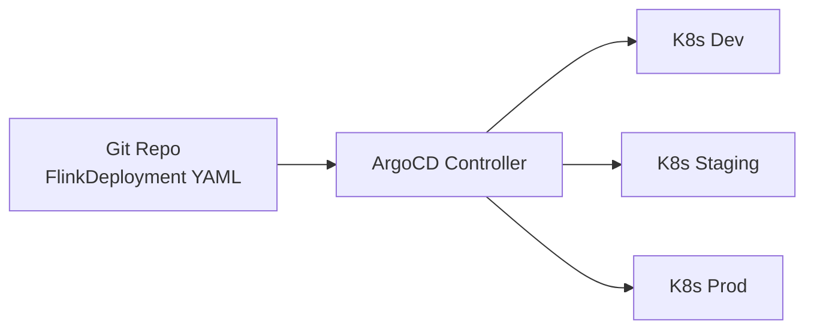
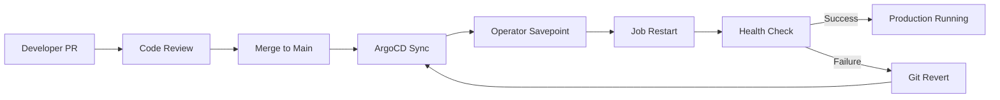

# Flink GitOps 部署模式

> **所属阶段**: Flink/09-practices/09.04-deployment/ | **前置依赖**: [flink-kubernetes-operator-1.14-guide.md](./flink-kubernetes-operator-1.14-guide.md) | **形式化等级**: L4

---

## 1. 概念定义 (Definitions)

**Def-F-Dep-01: GitOps**
GitOps 是一种以 Git 仓库为唯一事实来源（Single Source of Truth）的运维模式。所有基础设施配置和应用部署声明都存储在 Git 中，通过自动化控制器持续同步 Git 状态与实际集群状态。

**Def-F-Dep-02: ArgoCD**
ArgoCD 是一个为 Kubernetes 设计的声明式 GitOps 持续交付工具。它监控 Git 仓库中的 Kubernetes 清单变化，自动或手动将这些变化同步到目标集群。

**Def-F-Dep-03: FlinkDeployment CRD**
Flink Kubernetes Operator 提供的自定义资源定义，允许用户以声明式 YAML 描述 Flink 作业的生命周期和资源配置。

---

## 2. 属性推导 (Properties)

**Lemma-F-Dep-01: GitOps 的幂等同步**
ArgoCD 对 FlinkDeployment 的同步操作是幂等的：重复应用同一个 Git commit 对应的 YAML 不会产生副作用，除非 YAML 内容发生变化。

**Lemma-F-Dep-02: 回滚的原子性边界**
通过 Git 回退到历史 commit 并触发 ArgoCD 同步，可将 Flink 配置回滚到之前状态。但 Checkpoint/Savepoint 的回滚需要额外的存储层操作，GitOps 本身不管理状态文件。

**Prop-F-Dep-01: 多环境一致性**
在 GitOps 模式下，开发、测试、生产环境的 Flink 配置差异仅体现在 Git 分支或 Kustomize overlay 层，底层结构保持一致。

---

## 3. 关系建立 (Relations)



### 工具链对比

| 工具 | 同步策略 | 多集群支持 | 推荐场景 |
|------|---------|-----------|---------|
| ArgoCD | Pull-based | 优秀 | 企业级多环境部署 |
| Flux | Pull-based | 良好 | 与 GitLab/GitHub 深度集成 |
| Tekton | Push-based | 中等 | CI/CD Pipeline 复杂场景 |

---

## 4. 论证过程 (Argumentation)

传统 imperative 部署存在配置漂移、审计困难、回滚复杂等痛点。GitOps 通过"Git 即真相来源"解决这些问题：所有变更必须通过 PR，天然具备审计链；ArgoCD 持续监控并纠偏，防止配置漂移；`git revert` 即可触发自动回滚。

### 分支策略

| 分支 | 用途 | ArgoCD Application |
|------|------|-------------------|
| `main` | 生产环境 | `flink-prod` |
| `release/*` | 预发布/灰度 | `flink-staging` |
| `develop` | 开发联调 | `flink-dev` |
| `feature/*` | 临时实验 | 按需创建 |

---

## 5. 形式证明 / 工程论证

**定理 (Thm-F-Dep-01)**: 在 GitOps 模式下，若 Flink 作业升级遵循"先更新 Git → ArgoCD 同步 → 验证状态 → 删除旧版本"的流水线，且 Savepoint 路径在 Git 中显式声明，则升级过程是原子性和可恢复的。

**证明概要**：

1. Git commit 是原子操作
2. ArgoCD 同步基于 CRD 声明式更新，Operator 负责协调实际与期望状态
3. 检测到镜像或并行度变更时，Operator 触发 Savepoint 并重启作业
4. 若新版本失败，回退 Git commit 后 ArgoCD 重新应用旧配置，Operator 从 Savepoint 恢复
5. 因此升级-回滚闭环具备可恢复性

---

## 6. 实例验证

### 6.1 FlinkDeployment GitOps 配置

```yaml
apiVersion: flink.apache.org/v1beta1
kind: FlinkDeployment
metadata:
  name: realtime-analytics
  namespace: flink-apps
spec:
  image: flink:2.0.0
  flinkVersion: v2.0
  jobManager:
    resource:
      memory: "4Gi"
      cpu: 2
  taskManager:
    resource:
      memory: "8Gi"
      cpu: 4
    replicas: 4
  job:
    jarURI: local:///opt/flink/examples/streaming/StateMachineExample.jar
    parallelism: 16
    upgradeMode: savepoint
    state: running
```

### 6.2 ArgoCD Application 定义

```yaml
apiVersion: argoproj.io/v1alpha1
kind: Application
metadata:
  name: flink-prod
  namespace: argocd
spec:
  project: default
  source:
    repoURL: https://github.com/your-org/flink-gitops.git
    targetRevision: main
    path: overlays/prod
  destination:
    server: https://kubernetes.default.svc
    namespace: flink-apps
  syncPolicy:
    automated:
      prune: true
      selfHeal: true
```

### 6.3 Kustomize 多环境 overlay

```yaml
# overlays/prod/kustomization.yaml resources:
  - ../../base
patchesStrategicMerge:
  - resources-patch.yaml
```

```yaml
# overlays/prod/resources-patch.yaml spec:
  taskManager:
    resource:
      memory: "16Gi"
      cpu: 8
    replicas: 12
```

---

## 7. 可视化



---

## 8. 引用参考
