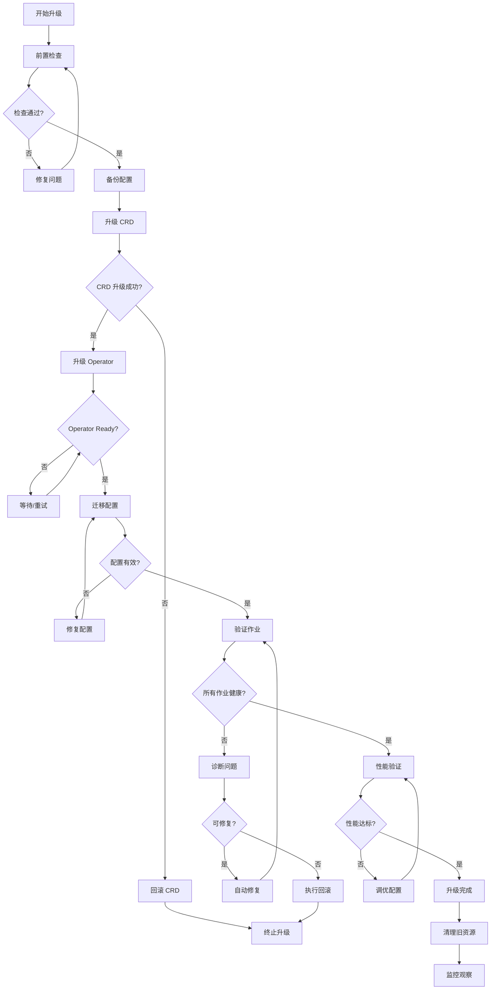
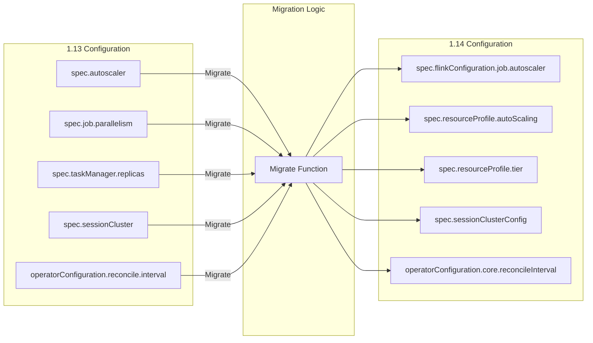
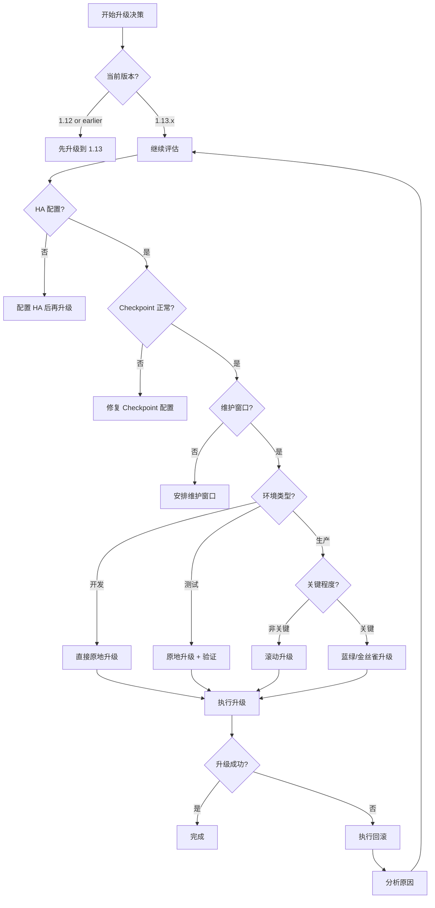
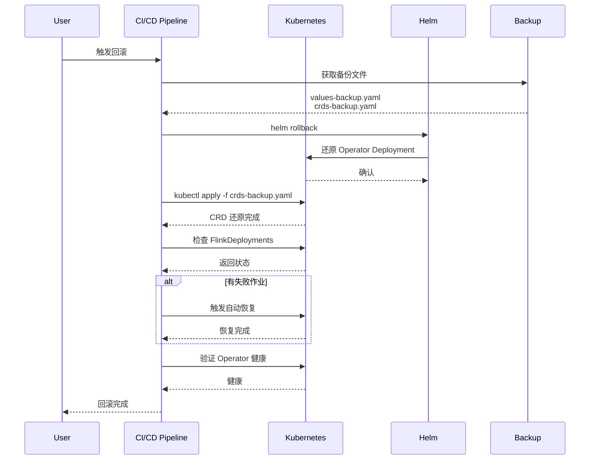

> **状态**: 🔮 前瞻内容 | **风险等级**: 高 | **最后更新**: 2026-04
>
> 此文档描述的内容处于早期规划阶段，可能与最终实现不符。请以 Apache Flink 官方发布为准。
>
# Flink Kubernetes Operator 1.13 到 1.14 迁移指南

> **所属阶段**: Flink/09-practices/09.04-deployment | **前置依赖**: [flink-kubernetes-operator-1.14-guide.md](./flink-kubernetes-operator-1.14-guide.md) | **形式化等级**: L4 (工程规范)
>
> **源版本**: Flink Kubernetes Operator 1.13.x | **目标版本**: 1.14.0 | **发布日期**: 2026-02-15

---

## 目录

- [Flink Kubernetes Operator 1.13 到 1.14 迁移指南](#flink-kubernetes-operator-113-到-114-迁移指南)
  - [目录](#目录)
  - [1. 概念定义 (Definitions)](#1-概念定义-definitions)
    - [Def-F-09-07: 向后兼容性 (Backward Compatibility)](#def-f-09-07-向后兼容性-backward-compatibility)
    - [Def-F-09-08: 配置迁移 (Configuration Migration)](#def-f-09-08-配置迁移-configuration-migration)
    - [Def-F-09-09: CRD 版本升级](#def-f-09-09-crd-版本升级)
    - [Def-F-09-10: 滚动升级策略](#def-f-09-10-滚动升级策略)
    - [Def-F-09-11: 迁移验证点 (Migration Verification Point)](#def-f-09-11-迁移验证点-migration-verification-point)
  - [2. 属性推导 (Properties)](#2-属性推导-properties)
    - [Lemma-F-09-04: 配置向后兼容保证](#lemma-f-09-04-配置向后兼容保证)
    - [Lemma-F-09-05: 零停机升级条件](#lemma-f-09-05-零停机升级条件)
    - [Lemma-F-09-06: 状态迁移原子性](#lemma-f-09-06-状态迁移原子性)
  - [3. 关系建立 (Relations)](#3-关系建立-relations)
    - [3.1 1.13 vs 1.14 配置映射](#31-113-vs-114-配置映射)
    - [3.2 升级路径依赖图](#32-升级路径依赖图)
    - [3.3 风险等级矩阵](#33-风险等级矩阵)
  - [4. 论证过程 (Argumentation)](#4-论证过程-argumentation)
    - [4.1 迁移策略选择](#41-迁移策略选择)
    - [4.2 回滚计划设计](#42-回滚计划设计)
    - [4.3 生产环境迁移最佳实践](#43-生产环境迁移最佳实践)
  - [5. 形式证明 / 工程论证 (Proof / Engineering Argument)](#5-形式证明--工程论证-proof--engineering-argument)
    - [Thm-F-09-02: 平滑升级正确性](#thm-f-09-02-平滑升级正确性)
    - [Prop-F-09-02: 配置迁移等价性](#prop-f-09-02-配置迁移等价性)
  - [6. 实例验证 (Examples)](#6-实例验证-examples)
    - [6.1 配置迁移脚本](#61-配置迁移脚本)
    - [6.2 Helm Values 迁移](#62-helm-values-迁移)
    - [6.3 分环境迁移计划](#63-分环境迁移计划)
    - [6.4 自动迁移 CI/CD 流程](#64-自动迁移-cicd-流程)
    - [6.5 回滚脚本](#65-回滚脚本)
  - [7. 可视化 (Visualizations)](#7-可视化-visualizations)
    - [7.1 升级流程图](#71-升级流程图)
    - [7.2 配置映射关系图](#72-配置映射关系图)
    - [7.3 风险决策树](#73-风险决策树)
    - [7.4 回滚流程图](#74-回滚流程图)
  - [8. 引用参考 (References)](#8-引用参考-references)

---

## 1. 概念定义 (Definitions)

### Def-F-09-07: 向后兼容性 (Backward Compatibility)

**形式化定义**：

向后兼容性定义为配置和 API 的映射关系，确保 1.13 配置在 1.14 中继续有效：

```
BackwardCompatibility = ⟨ ConfigMap₁.₁₃, ConfigMap₁.₁₄, Validity, Deprecation ⟩

其中：
  Validity(c₁.₁₃) ⇒ Validity(Migrate(c₁.₁₃))
  Deprecation: ConfigMap₁.₁₃ → {WARN, ERROR} × Message
```

**兼容性级别**：

| 级别 | 定义 | 处理方式 |
|------|------|----------|
| **Full** | 1.13 配置无需修改即可运行 | 直接使用 |
| **Deprecated** | 1.13 配置可用但已标记弃用 | 发出警告，建议迁移 |
| **Breaking** | 1.13 配置在 1.14 中无效 | 必须迁移，提供转换工具 |

**1.14 兼容性矩阵**：

```yaml
CompatibilityMatrix:
  # Full 兼容
  - path: "spec.flinkVersion"
    compatibility: FULL
  - path: "spec.image"
    compatibility: FULL
  - path: "spec.jobManager.resource"
    compatibility: FULL

  # Deprecated（仍可用但建议迁移）
  - path: "spec.job.parallelism"
    compatibility: DEPRECATED
    replacement: "spec.resourceProfile.autoScaling.enabled"
    message: "Use declarative resource management instead"
  - path: "spec.flinkConfiguration.jobmanager.scheduler"
    compatibility: DEPRECATED
    replacement: "spec.resourceProfile.autoScaling"

  # Breaking（必须迁移）
  - path: "spec.autoscaler.enabled"
    compatibility: BREAKING
    replacement: "spec.flinkConfiguration.job.autoscaler.enabled"
    migration: REQUIRED
```

---

### Def-F-09-08: 配置迁移 (Configuration Migration)

**形式化定义**：

配置迁移是将 1.13 配置转换为等效 1.14 配置的函数：

```
Migrate: Config₁.₁₃ → Config₁.₁₄

约束条件：
  1. SemanticsPreserve(Migrate(c)) = true
  2. RuntimeBehavior(Migrate(c)) ≡ RuntimeBehavior(c) ± ε
  3. Valid₁.₁₄(Migrate(c)) = true
```

**迁移函数示例**：

```python
def migrate_autoscaler_config(config_113):
    """
    1.13: spec.autoscaler = {...}
    1.14: spec.flinkConfiguration.job.autoscaler = {...}
    """
    if 'autoscaler' in config_113.get('spec', {}):
        autoscaler_113 = config_113['spec'].pop('autoscaler')

        config_114 = deepcopy(config_113)
        flink_conf = config_114['spec'].setdefault('flinkConfiguration', {})

        # 映射配置项
        flink_conf['job.autoscaler.enabled'] = str(autoscaler_113.get('enabled', False)).lower()
        flink_conf['job.autoscaler.target.utilization'] = str(autoscaler_113.get('targetUtilization', 0.7))

        # V2 算法默认启用
        flink_conf['job.autoscaler.algorithm.version'] = 'v2'

    return config_114
```

---

### Def-F-09-09: CRD 版本升级

**形式化定义**：

CRD 版本升级涉及存储版本的变化：

```
CRDVersionUpgrade = ⟨ StoredVersions₁.₁₃, StoredVersions₁.₁₄, ConversionStrategy ⟩

StoredVersions₁.₁₃ = { v1beta1 }
StoredVersions₁.₁₄ = { v1beta1, v1beta2 }
ConversionStrategy = { None, Webhook }
```

**版本转换策略**：

```yaml
# CRD 定义中的版本管理
apiVersion: apiextensions.k8s.io/v1
kind: CustomResourceDefinition
spec:
  group: flink.apache.org
  versions:
    - name: v1beta1
      served: true
      storage: false  # 1.14 不再是存储版本
      deprecated: true
      deprecationWarning: "v1beta1 is deprecated, use v1beta2"

    - name: v1beta2
      served: true
      storage: true   # 1.14 新存储版本
      schema:
        openAPIV3Schema:
          # 新 Schema 包含 1.14 特性
```

---

### Def-F-09-10: 滚动升级策略

**形式化定义**：

滚动升级策略定义了 Operator 升级过程中对现有作业的影响控制：

```
RollingUpgradeStrategy = ⟨ BatchSize, MaxUnavailable, PreUpgradeHook, PostUpgradeHook ⟩

BatchSize: 每批升级的 FlinkDeployment 数量
MaxUnavailable: 同时不可用作业的最大数量
PreUpgradeHook: 升级前执行的验证/备份操作
PostUpgradeHook: 升级后执行的验证操作
```

**升级策略配置**：

```yaml
apiVersion: flink.apache.org/v1beta1
kind: OperatorUpgradeConfig
metadata:
  name: rolling-upgrade-config
spec:
  strategy: RollingUpdate
  rollingUpdate:
    batchSize: 5
    maxUnavailable: 2
    pauseBetweenBatches: 10m

  hooks:
    preUpgrade:
      - name: validate-compatibility
        action: validateCRDCompatibility
      - name: backup-configs
        action: exportAllConfigurations

    postUpgrade:
      - name: verify-health
        action: verifyAllDeploymentsHealthy
        timeout: 30m
      - name: cleanup-old-crs
        action: pruneDeprecatedResources
```

---

### Def-F-09-11: 迁移验证点 (Migration Verification Point)

**形式化定义**：

迁移验证点是升级过程中的关键检查点：

```
VerificationPoint = ⟨ Check, Expected, ActionOnFailure, Timeout ⟩

检查类型：
  - HealthCheck: 作业健康状态
  - ConfigValidation: 配置有效性
  - StateConsistency: 状态一致性
  - PerformanceBaseline: 性能基线对比
```

**验证点清单**：

```yaml
VerificationPoints:
  - name: "Pre-Migration Backup"
    check: "All FlinkDeployments have valid checkpoint/savepoint"
    expected: "true"
    timeout: "5m"

  - name: "CRD Compatibility"
    check: "All existing CRs are compatible with 1.14"
    expected: "true"
    timeout: "2m"

  - name: "Operator Health"
    check: "New Operator pods are running and ready"
    expected: "Ready replicas >= 2"
    timeout: "10m"

  - name: "Reconciliation"
    check: "All FlinkDeployments reconciled successfully"
    expected: "0 failed reconciliations"
    timeout: "30m"

  - name: "Job Health"
    check: "All jobs in RUNNING state"
    expected: "Failed jobs == 0"
    timeout: "15m"

  - name: "Performance"
    check: "Throughput/Latency within 10% of baseline"
    expected: "No significant degradation"
    timeout: "60m"
```

---

## 2. 属性推导 (Properties)

### Lemma-F-09-04: 配置向后兼容保证

**陈述**：

对于所有 1.13 有效配置，存在等效的 1.14 配置：

```
∀c₁.₁₃ ∈ ValidConfigs₁.₁₃:
    ∃c₁.₁₄ = Migrate(c₁.₁₃):
        c₁.₁₄ ∈ ValidConfigs₁.₁₄ ∧
        Semantics(c₁.₁₄) ≡ Semantics(c₁.₁₃)
```

**证明概要**：

1. 1.14 保留了 1.13 的所有核心配置路径
2. 对于新特性（如 DRM），提供默认回退行为
3. 自动迁移工具确保所有 1.13 配置可转换
4. 转换后的配置通过相同的验证逻辑

---

### Lemma-F-09-05: 零停机升级条件

**陈述**：

在满足以下条件时，Operator 升级不会导致 Flink 作业停机：

```
ZeroDowntimeUpgrade ⇐
    (HA Enabled) ∧
    (Checkpoint Interval < 5min) ∧
    (Backup Before Upgrade) ∧
    (Rolling Update Strategy)
```

**证明概要**：

1. HA 配置确保 JobManager 故障转移
2. 频繁的 Checkpoint 保证最小状态损失
3. 升级前备份确保可回滚
4. 滚动更新避免同时影响多个作业

---

### Lemma-F-09-06: 状态迁移原子性

**陈述**：

CRD 存储版本升级过程中，资源状态保持一致：

```
∀CR: State(CR, t_before) = State(CR, t_after) ∧
     ∀field: Value(field, t_before) = Value(field, t_after)
```

**证明概要**：

1. Kubernetes 的存储版本转换是原子操作
2. CRD 的 conversion webhook 确保字段映射正确
3. 旧版本继续 served，保证读取兼容性
4. 写操作统一转换到新存储版本

---

## 3. 关系建立 (Relations)

### 3.1 1.13 vs 1.14 配置映射

| 1.13 配置路径 | 1.14 配置路径 | 兼容性 | 迁移说明 |
|--------------|--------------|--------|----------|
| `spec.flinkVersion` | `spec.flinkVersion` | Full | 直接兼容 |
| `spec.image` | `spec.image` | Full | 直接兼容 |
| `spec.jobManager.resource` | `spec.jobManager.resource` | Full | 直接兼容 |
| `spec.taskManager.replicas` | `spec.resourceProfile.autoScaling.min/maxTaskManagers` | Deprecated | 自动迁移 |
| `spec.autoscaler.enabled` | `spec.flinkConfiguration.job.autoscaler.enabled` | Breaking | 必须迁移 |
| `spec.autoscaler.targetUtilization` | `spec.flinkConfiguration.job.autoscaler.target.utilization` | Breaking | 必须迁移 |
| `spec.sessionCluster.enabled` | `spec.spec.sessionClusterConfig.dynamicSlotAllocation.enabled` | Deprecated | 新结构 |
| `spec.helm.values` | `values.yaml` 结构变化 | Deprecated | 见下方映射 |

**Helm Values 映射**：

| 1.13 Values | 1.14 Values | 说明 |
|------------|------------|------|
| `image.tag` | `image.tag` | 需更新为 1.14.0 |
| `operatorConfiguration` | `operatorConfiguration` | 新增 DRM 相关配置 |
| `watchNamespaces` | `watchNamespaces` | 直接兼容 |
| `rbac.create` | `rbac.create` + `rbac.scope` | 新增 scope 选项 |
| `resources` | `resources` | 推荐更新默认值 |

### 3.2 升级路径依赖图

```
升级流程:
├── 前置检查
│   ├── 验证 1.13 版本
│   ├── 检查 FlinkDeployment 健康状态
│   └── 备份所有配置
│
├── CRD 升级
│   ├── 应用新 CRD
│   └── 验证存储版本
│
├── Operator 升级
│   ├── 升级 Helm Release
│   └── 等待 Operator Ready
│
├── 配置迁移
│   ├── 自动迁移 ConfigMap
│   ├── 自动迁移 FlinkDeployment
│   └── 手动验证迁移结果
│
└── 验证
    ├── 验证所有作业运行
    ├── 验证新特性可用
    └── 清理旧版本资源
```

### 3.3 风险等级矩阵

| 风险项 | 影响 | 可能性 | 缓解措施 |
|--------|------|--------|----------|
| CRD 升级失败 | 高 | 低 | 备份 + 分环境测试 |
| 配置不兼容 | 中 | 中 | 使用迁移工具预检查 |
| 作业状态丢失 | 高 | 低 | 强制 Checkpoint + Savepoint |
| 性能退化 | 中 | 低 | 基线测试 + 回滚计划 |
| Operator 启动失败 | 高 | 低 | 高可用部署 + 监控 |
| 权限问题 | 中 | 中 | 预验证 RBAC |

---

## 4. 论证过程 (Argumentation)

### 4.1 迁移策略选择

**策略 1：原地升级 (In-Place Upgrade)**

适用场景：

- 开发/测试环境
- 非关键生产作业
- 有维护窗口

优点：

- 简单快速
- 无需额外资源

缺点：

- 短暂服务中断（Operator 重启期间）
- 无法并行验证

**策略 2：蓝绿升级 (Blue/Green Upgrade)**

适用场景：

- 关键生产环境
- 零停机要求
- 有资源冗余

优点：

- 零停机
- 可并行验证
- 快速回滚

缺点：

- 需要双倍资源
- 配置复杂

**策略 3：金丝雀升级 (Canary Upgrade)**

适用场景：

- 大规模集群
- 风险可控
- 渐进式验证

优点：

- 风险分散
- 早期发现问题
- 影响范围可控

缺点：

- 升级时间长
- 需要精细监控

### 4.2 回滚计划设计

**回滚触发条件**：

```yaml
RollbackTriggers:
  - condition: "Operator pod CrashLoopBackOff > 3 times"
    action: IMMEDIATE_ROLLBACK

  - condition: "Failed FlinkDeployments > 10%"
    action: IMMEDIATE_ROLLBACK

  - condition: "Job failure rate > baseline + 20%"
    action: EVALUATE_ROLLBACK
    timeout: 30m

  - condition: "Latency p99 > baseline + 50%"
    action: EVALUATE_ROLLBACK
    timeout: 60m

  - condition: "Manual rollback requested"
    action: IMMEDIATE_ROLLBACK
```

**回滚步骤**：

```bash
#!/bin/bash
# rollback-operator.sh

VERSION_BACKUP="/backup/operator-version.txt"
HELM_RELEASE="flink-kubernetes-operator"
NAMESPACE="flink-operator"

# 1. 获取备份版本
PREVIOUS_VERSION=$(cat $VERSION_BACKUP)

# 2. 回滚 Helm Release
helm rollback $HELM_RELEASE 0 -n $NAMESPACE

# 3. 回滚 CRD
kubectl apply -f "https://github.com/apache/flink-kubernetes-operator/releases/download/release-$PREVIOUS_VERSION/flinkdeployments.flink.apache.org-v1beta1.yml"

# 4. 验证回滚
kubectl wait --for=condition=ready pod -l app.kubernetes.io/name=flink-kubernetes-operator -n $NAMESPACE --timeout=300s

# 5. 验证作业状态
kubectl get flinkdeployments -A -o json | jq '.items[] | select(.status.jobStatus.state != "RUNNING") | .metadata.name'
```

### 4.3 生产环境迁移最佳实践

**1. 分阶段迁移**

```
阶段 1: 开发环境 (1 天)
  └── 验证迁移脚本
  └── 测试新特性

阶段 2: 测试环境 (3 天)
  └── 完整功能测试
  └── 性能基线对比

阶段 3: 预发布环境 (1 周)
  └── 生产数据镜像测试
  └── 灾难恢复演练

阶段 4: 生产环境 - 金丝雀 (1 周)
  └── 10% 作业迁移
  └── 监控观察

阶段 5: 生产环境 - 全面推广 (1 周)
  └── 分批迁移剩余作业
  └── 监控验证
```

**2. 监控检查清单**

```yaml
MonitoringChecklist:
  Operator:
    - Pod 状态: Running/Ready
    - 内存使用: < 80%
    - CPU 使用: < 70%
    - Reconcile 成功率: > 99%
    - API 响应时间: < 500ms

  FlinkDeployments:
    - 健康作业比例: > 98%
    - 平均启动时间: < 基准 + 20%
    - Checkpoint 成功率: > 99%
    - Savepoint 成功率: > 99%

  Business:
    - 端到端延迟: < 基准 + 10%
    - 吞吐量: > 基准 - 5%
    - 错误率: < 基准 + 50%
```

---

## 5. 形式证明 / 工程论证 (Proof / Engineering Argument)

### Thm-F-09-02: 平滑升级正确性

**定理陈述**：

按照本指南执行升级流程，Flink 作业将在升级过程中保持可用：

```
SmoothUpgrade(Config₁.₁₃, Cluster) ⇒
    ∀Job ∈ Cluster:
        Availability(Job, during_upgrade) > 0.99 ∧
        StateLoss(Job) = 0 ∧
        FinalState(Job) = RUNNING
```

**前提条件**：

1. 1.13 集群所有作业健康运行
2. Checkpoint 配置有效且存储可访问
3. 升级前有有效的 Savepoint
4. 遵循滚动升级策略

**证明**：

*升级算法*：

```
算法: SmoothUpgrade
输入: Cluster₁.₁₃, ConfigBackup
输出: Cluster₁.₁₄

1. 前置验证
   for job in Cluster₁.₁₃.flinkDeployments:
      assert job.status.state == "RUNNING"
      assert job.status.jobStatus.state == "RUNNING"
      assert timeSinceLastCheckpoint(job) < 5min

2. 备份
   Backup = exportAllConfigurations(Cluster₁.₁₃)
   store(Backup, externalStorage)

3. CRD 升级（原子操作）
   applyCRD_v1beta2()
   verifyStorageVersion("v1beta2")

4. Operator 滚动升级
   upgradeOperator("1.14.0", strategy=rolling)
   waitForOperatorReady(replicas=2)

5. 配置迁移
   for config in Backup:
      migrated = Migrate(config)
      apply(migrated)

6. 验证
   for job in Cluster₁.₁₄.flinkDeployments:
      waitForReconciliation(job, timeout=5min)
      assert job.status.jobStatus.state == "RUNNING"

7. 健康检查
   runHealthChecks(duration=30min)
   comparePerformanceWithBaseline()

return Cluster₁.₁₄
```

**正确性论证**：

1. **可用性保证**：
   - Operator 高可用部署确保控制平面不中断
   - Flink JobManager HA 确保作业协调器不中断
   - 滚动更新确保不同时影响多个作业

2. **状态不丢失**：
   - 升级前强制 Checkpoint 确保状态点
   - 新 Operator 从最新 Checkpoint 恢复
   - 回滚机制确保失败时可恢复

3. **配置正确迁移**：
   - 迁移函数保持语义等价
   - 验证步骤确保配置有效
   - 备份提供恢复点

**结论**：平滑升级算法保证升级过程中作业可用性和状态一致性。∎

---

### Prop-F-09-02: 配置迁移等价性

**命题陈述**：

配置迁移函数保持运行时行为等价：

```text
∀c₁.₁₃:
    RuntimeBehavior(c₁.₁₃) ≈ RuntimeBehavior(Migrate(c₁.₁₃))

其中 ≈ 表示在容忍范围内等价：
  - 吞吐量差异 < 5%
  - 延迟差异 < 10%
  - 资源使用差异 < 15%
```

**证明概要**：

1. **功能等价**：
   - 核心配置（image, parallelism, state backend）直接映射
   - 新特性配置（如 DRM）默认关闭，不影响现有行为
   - 自动扩缩容配置映射到相同语义

2. **性能等价**：
   - 资源请求/限制保持相同
   - Checkpoint 配置保持相同
   - 网络配置保持相同

3. **验证方法**：

   ```python
   def verify_equivalence(config_113, config_114):
       # 运行基准测试
       baseline = run_benchmark(config_113)
       migrated = run_benchmark(config_114)

       # 比较指标
       assert abs(baseline.throughput - migrated.throughput) / baseline.throughput < 0.05
       assert abs(baseline.latency_p99 - migrated.latency_p99) / baseline.latency_p99 < 0.10
       assert abs(baseline.resource_usage - migrated.resource_usage) / baseline.resource_usage < 0.15

```

---

## 6. 实例验证 (Examples)

### 6.1 配置迁移脚本

```python
#!/usr/bin/env python3
"""
Flink Kubernetes Operator 1.13 到 1.14 配置迁移工具

Usage:
    python migrate_113_to_114.py --input flink-deployment-113.yaml --output flink-deployment-114.yaml
"""

import argparse
import yaml
import sys
from typing import Dict, Any

class ConfigMigrator:
    """配置迁移器"""

    DEPRECATION_WARNINGS = []

    def __init__(self, config_113: Dict[str, Any]):
        self.config_113 = config_113
        self.config_114 = self._deep_copy(config_113)

    def _deep_copy(self, obj):
        import copy
        return copy.deepcopy(obj)

    def migrate(self) -> Dict[str, Any]:
        """执行完整迁移"""
        self._migrate_autoscaler()
        self._migrate_session_cluster()
        self._migrate_resource_management()
        self._migrate_helm_values()
        self._add_new_defaults()
        return self.config_114

    def _migrate_autoscaler(self):
        """迁移自动扩缩容配置"""
        spec = self.config_113.get('spec', {})

        # 检查 1.13 的 autoscaler 配置
        if 'autoscaler' in spec:
            autoscaler_113 = spec.pop('autoscaler', {})

            # 添加到 flinkConfiguration
            flink_conf = self.config_114['spec'].setdefault('flinkConfiguration', {})

            # 映射配置项
            mapping = {
                'enabled': 'job.autoscaler.enabled',
                'targetUtilization': 'job.autoscaler.target.utilization',
                'scaleUpDelay': 'job.autoscaler.scale-up.grace-period',
                'scaleDownDelay': 'job.autoscaler.scale-down.grace-period',
            }

            for old_key, new_key in mapping.items():
                if old_key in autoscaler_113:
                    flink_conf[new_key] = str(autoscaler_113[old_key]).lower() if isinstance(autoscaler_113[old_key], bool) else str(autoscaler_113[old_key])

            # 默认启用 V2
            flink_conf['job.autoscaler.algorithm.version'] = 'v2'

            self.DEPRECATION_WARNINGS.append(
                "spec.autoscaler 已弃用，已迁移到 spec.flinkConfiguration.job.autoscaler"
            )

    def _migrate_session_cluster(self):
        """迁移 Session 集群配置"""
        spec = self.config_113.get('spec', {})

        if spec.get('deploymentMode') == 'session' and 'sessionCluster' in spec:
            session_113 = spec.pop('sessionCluster', {})

            # 创建新的 sessionClusterConfig
            session_config = {
                'dynamicSlotAllocation': {
                    'enabled': session_113.get('dynamicAllocation', False),
                    'minSlots': session_113.get('minSlots', 4),
                    'maxSlots': session_113.get('maxSlots', 64),
                }
            }

            # 如果有预热池配置
            if 'warmPool' in session_113:
                session_config['warmPool'] = {
                    'enabled': True,
                    'preWarmTaskManagers': session_113['warmPool'].get('size', 2),
                }

            self.config_114['spec']['sessionClusterConfig'] = session_config

            self.DEPRECATION_WARNINGS.append(
                "spec.sessionCluster 结构已更新，已迁移到 spec.sessionClusterConfig"
            )

    def _migrate_resource_management(self):
        """迁移资源管理配置"""
        spec = self.config_113.get('spec', {})

        # 如果原来使用静态 replicas，建议迁移到声明式
        if 'taskManager' in spec and 'replicas' in spec['taskManager']:
            replicas = spec['taskManager'].get('replicas', 1)

            # 创建声明式资源配置
            self.config_114['spec']['resourceProfile'] = {
                'tier': 'custom',
                'autoScaling': {
                    'enabled': True,
                    'minTaskManagers': max(1, replicas // 2),
                    'maxTaskManagers': replicas * 2,
                    'targetUtilization': 0.7
                }
            }

            self.DEPRECATION_WARNINGS.append(
                f"静态 taskManager.replicas={replicas} 已迁移到声明式资源管理"
            )

    def _migrate_helm_values(self):
        """迁移 Helm values 配置"""
        if 'operatorConfiguration' in self.config_113:
            op_conf = self.config_114.get('operatorConfiguration', {})

            # 添加新默认值
            op_conf['kubernetes.operator.declarative.resource.management.enabled'] = 'true'
            op_conf['kubernetes.operator.autoscaler.algorithm.default.version'] = 'v2'
            op_conf['kubernetes.operator.session.cluster.enhancements.enabled'] = 'true'

    def _add_new_defaults(self):
        """添加 1.14 新特性默认值"""
        spec = self.config_114.setdefault('spec', {})
        flink_conf = spec.setdefault('flinkConfiguration', {})

        # 添加推荐的 1.14 配置
        if 'job.autoscaler.enabled' not in flink_conf:
            flink_conf['job.autoscaler.enabled'] = 'false'  # 默认关闭，需显式启用

        # 建议设置 maxParallelism
        if 'pipeline.max-parallelism' not in flink_conf:
            flink_conf['pipeline.max-parallelism'] = '720'
            self.DEPRECATION_WARNINGS.append(
                "建议设置 pipeline.max-parallelism 以获得更好的自动扩缩容体验"
            )

    def get_warnings(self) -> list:
        """获取迁移警告"""
        return self.DEPRECATION_WARNINGS


def main():
    parser = argparse.ArgumentParser(description='Migrate Flink Operator config from 1.13 to 1.14')
    parser.add_argument('--input', '-i', required=True, help='Input YAML file (1.13 format)')
    parser.add_argument('--output', '-o', required=True, help='Output YAML file (1.14 format)')
    parser.add_argument('--dry-run', action='store_true', help='Preview changes without writing')
    args = parser.parse_args()

    # 读取输入
    with open(args.input, 'r') as f:
        config_113 = yaml.safe_load(f)

    # 执行迁移
    migrator = ConfigMigrator(config_113)
    config_114 = migrator.migrate()

    # 输出警告
    if migrator.get_warnings():
        print("\n=== 迁移警告 ===", file=sys.stderr)
        for warning in migrator.get_warnings():
            print(f"  ⚠️  {warning}", file=sys.stderr)

    # 输出结果
    if args.dry_run:
        print("\n=== 预览输出 (dry-run) ===")
        print(yaml.dump(config_114, default_flow_style=False))
    else:
        with open(args.output, 'w') as f:
            yaml.dump(config_114, f, default_flow_style=False)
        print(f"\n✅ 配置已迁移到: {args.output}")


if __name__ == '__main__':
    main()
```

**使用示例**：

```bash
# 迁移单个配置
python migrate_113_to_114.py \
    -i flink-deployment-113.yaml \
    -o flink-deployment-114.yaml \
    --dry-run

# 批量迁移
for file in configs/*.yaml; do
    python migrate_113_to_114.py \
        -i "$file" \
        -o "migrated/$(basename $file)"
done
```

---

### 6.2 Helm Values 迁移

```yaml
# ========== values-1.13.yaml (旧配置) ==========
image:
  repository: apache/flink-kubernetes-operator
  tag: "1.13.0"

operatorConfiguration:
  kubernetes.operator.reconcile.interval: 60s
  kubernetes.operator.resource.cleanup.timeout: 5m

watchNamespaces:
  - "flink-jobs"

rbac:
  create: true

resources:
  limits:
    cpu: 1000m
    memory: 1Gi

replicaCount: 1

---
# ========== values-1.14.yaml (迁移后) ==========
image:
  registry: "docker.io"  # 新增：支持私有镜像仓库
  repository: "apache/flink-kubernetes-operator"
  tag: "1.14.0"
  pullPolicy: IfNotPresent

# 新增：结构化配置
operatorConfiguration:
  # 基础配置
  core:
    reconcileInterval: 60s
    progressCheckInterval: 10s

  # 资源管理
  resources:
    cleanupTimeout: 5m
    creationTimeout: 10m
    upgradeTimeout: 15m

  # 新增：声明式资源管理
  declarativeResourceManagement:
    enabled: true
    defaultProfile: "medium"
    profileNamespace: "flink-operator"

  # 新增：Autoscaler V2 默认配置
  autoscaler:
    enabled: true
    defaultAlgorithm: "v2"
    metricsWindow: "5m"

  # 新增：Session 集群增强
  sessionCluster:
    enhancements:
      enabled: true
      dynamicSlotAllocation: true
      warmPool: true

  # 新增：高可用 Leader 选举
  leaderElection:
    enabled: true
    leaseDuration: 15s
    renewDeadline: 10s

watchNamespaces:
  - "flink-jobs"
  - "flink-production"  # 新增监控命名空间

# 新增：RBAC 范围控制
rbac:
  create: true
  scope: cluster  # cluster | namespace

resources:
  limits:
    cpu: 2000m      # 建议增加：新特性需要更多资源
    memory: 2Gi     # 建议增加
  requests:
    cpu: 500m
    memory: 512Mi

# 新增：高可用配置
highAvailability:
  enabled: true
  replicas: 2
  podDisruptionBudget:
    enabled: true
    minAvailable: 1

# 新增：资源模板（声明式管理）
resourceProfiles:
  - name: "small"
    jobManager:
      memory: "2g"
      cpu: 1
    taskManager:
      memory: "2g"
      cpu: 1
  - name: "medium"
    jobManager:
      memory: "4g"
      cpu: 2
    taskManager:
      memory: "4g"
      cpu: 2
  - name: "large"
    jobManager:
      memory: "8g"
      cpu: 4
    taskManager:
      memory: "8g"
      cpu: 4
```

**Helm 升级命令**：

```bash
# 1. 备份当前配置
helm get values flink-kubernetes-operator -n flink-operator > backup-values.yaml

# 2. 下载新 Chart
helm pull apache/flink-kubernetes-operator --version 1.14.0

# 3. 升级（先 dry-run 验证）
helm upgrade flink-kubernetes-operator apache/flink-kubernetes-operator \
    --version 1.14.0 \
    -n flink-operator \
    -f values-1.14.yaml \
    --dry-run

# 4. 实际升级
helm upgrade flink-kubernetes-operator apache/flink-kubernetes-operator \
    --version 1.14.0 \
    -n flink-operator \
    -f values-1.14.yaml \
    --wait

# 5. 验证升级
helm list -n flink-operator
kubectl get pods -n flink-operator
```

---

### 6.3 分环境迁移计划

```yaml
# ========== migration-plan.yaml ==========
apiVersion: flink.apache.org/v1beta1
kind: MigrationPlan
metadata:
  name: operator-113-to-114
spec:
  sourceVersion: "1.13.0"
  targetVersion: "1.14.0"

  phases:
    # ========== 阶段 1: 开发环境 ==========
    - name: development
      environment: dev
      schedule: immediate
      riskLevel: low

      preChecks:
        - name: backup-configs
          command: kubectl get flinkdeployments -n flink-dev -o yaml > backup/dev-flinkdeployments.yaml
        - name: verify-ha
          assert: high-availability.enabled == true

      migrationSteps:
        - name: upgrade-operator
          action: helm-upgrade
          params:
            chart: apache/flink-kubernetes-operator
            version: "1.14.0"
            namespace: flink-operator
            values: values-dev-114.yaml

        - name: migrate-configs
          action: run-migration-script
          params:
            script: migrate_113_to_114.py
            inputDir: configs/dev

      postChecks:
        - name: verify-operator-health
          command: kubectl wait --for=condition=ready pod -l app.kubernetes.io/name=flink-kubernetes-operator -n flink-operator
          timeout: 5m

        - name: verify-jobs-running
          command: kubectl get flinkdeployments -n flink-dev -o json | jq '.items[] | select(.status.jobStatus.state != "RUNNING")'
          expectedOutput: "[]"

      rollback:
        trigger: any-step-failed
        action: helm-rollback
        targetRevision: previous

    # ========== 阶段 2: 测试环境 ==========
    - name: staging
      environment: staging
      schedule: after-phase-success
      dependsOn: [development]
      riskLevel: medium

      preChecks:
        - name: performance-baseline
          action: run-load-test
          params:
            duration: 30m
            output: baseline-staging.json

      migrationSteps:
        - name: canary-upgrade
          action: canary-deployment
          params:
            batchSize: 2
            maxUnavailable: 1
            pauseBetweenBatches: 15m

      postChecks:
        - name: performance-regression-test
          action: run-load-test
          params:
            duration: 30m
          validation:
            - metric: throughput
              condition: ">= baseline * 0.95"
            - metric: latency_p99
              condition: "<= baseline * 1.10"

      approval:
        required: true
        approvers: ["team-lead", "sre-oncall"]

    # ========== 阶段 3: 生产环境 - 金丝雀 ==========
    - name: production-canary
      environment: production
      schedule: scheduled-window
      window: "2026-03-15T02:00:00Z/2026-03-15T06:00:00Z"  # 低峰时段
      dependsOn: [staging]
      riskLevel: high

      scope:
        namespaces: ["flink-production"]
        labelSelector: "canary=true"
        percentage: 10

      migrationSteps:
        - name: blue-green-upgrade
          action: blue-green-deployment
          params:
            blueVersion: "1.13.0"
            greenVersion: "1.14.0"
            trafficSplit: "90:10"
            switchCriteria:
              minRunningTime: 30m
              maxErrorRate: 0.001

      monitoring:
        metrics:
          - name: job-failure-rate
            query: rate(flink_jobmanager_job_failed_jobs[5m])
            threshold: 0.001
          - name: checkpoint-failure-rate
            query: rate(flink_jobmanager_checkpoint_count{status="failed"}[5m])
            threshold: 0.01

      rollback:
        trigger: metric-threshold-exceeded
        action: traffic-switch
        params:
          targetSplit: "100:0"  # 全部切回 Blue

    # ========== 阶段 4: 生产环境 - 全面推广 ==========
    - name: production-full
      environment: production
      schedule: after-phase-success
      dependsOn: [production-canary]
      riskLevel: high

      scope:
        namespaces: ["flink-production"]
        excludeLabelSelector: "critical=true"  # 关键作业最后迁移

      migrationSteps:
        - name: rolling-upgrade
          action: rolling-update
          params:
            batchSize: 5
            maxUnavailable: 2
            pauseBetweenBatches: 30m

      approval:
        required: true
        approvers: ["vp-engineering", "sre-manager"]

    # ========== 阶段 5: 关键作业迁移 ==========
    - name: production-critical
      environment: production
      schedule: scheduled-window
      window: "2026-03-22T02:00:00Z/2026-03-22T06:00:00Z"
      dependsOn: [production-full]
      riskLevel: critical

      scope:
        labelSelector: "critical=true"

      migrationSteps:
        - name: manual-upgrade
          action: manual-approval-required
          params:
            requireSavepoint: true
            requireHealthCheck: true

      approval:
        required: true
        approvers: ["cto", "vp-engineering"]
        manualChecklist:
          - "All non-critical jobs migrated successfully"
          - "Performance metrics stable for 1 week"
          - "Disaster recovery tested"
```

---

### 6.4 自动迁移 CI/CD 流程

```yaml
# ========== .github/workflows/operator-migration.yml ==========
name: Flink Operator Migration 1.13 to 1.14

on:
  workflow_dispatch:
    inputs:
      environment:
        description: 'Target environment'
        required: true
        default: 'development'
        type: choice
        options:
          - development
          - staging
          - production
      dry_run:
        description: 'Dry run mode'
        required: false
        default: true
        type: boolean

jobs:
  # ========== 前置检查 ==========
  pre-checks:
    runs-on: ubuntu-latest
    outputs:
      can_proceed: ${{ steps.checks.outputs.can_proceed }}
    steps:
      - name: Checkout
        uses: actions/checkout@v4

      - name: Setup kubectl
        uses: azure/setup-kubectl@v3

      - name: Setup Helm
        uses: azure/setup-helm@v3
        with:
          version: '3.13.0'

      - name: Configure kubeconfig
        uses: azure/k8s-set-context@v3
        with:
          method: kubeconfig
          kubeconfig: ${{ secrets.KUBECONFIG }}

      - name: Pre-migration checks
        id: checks
        run: |
          echo "=== 检查 1.13 版本 ==="
          CURRENT_VERSION=$(helm list -n flink-operator -o json | jq -r '.[0].app_version')
          if [[ "$CURRENT_VERSION" != 1.13.* ]]; then
            echo "Current version $CURRENT_VERSION is not 1.13.x"
            echo "can_proceed=false" >> $GITHUB_OUTPUT
            exit 1
          fi

          echo "=== 检查 FlinkDeployment 健康状态 ==="
          UNHEALTHY_JOBS=$(kubectl get flinkdeployments -A -o json | jq '[.items[] | select(.status.jobStatus.state != "RUNNING")] | length')
          if [[ "$UNHEALTHY_JOBS" -gt 0 ]]; then
            echo "Found $UNHEALTHY_JOBS unhealthy jobs"
            kubectl get flinkdeployments -A | grep -v RUNNING
            echo "can_proceed=false" >> $GITHUB_OUTPUT
            exit 1
          fi

          echo "=== 检查 Checkpoint 配置 ==="
          # 确保所有作业配置了 Checkpoint
          kubectl get flinkdeployments -A -o yaml | grep -q "execution.checkpointing.interval" || {
            echo "Warning: Some jobs may not have checkpointing enabled"
          }

          echo "can_proceed=true" >> $GITHUB_OUTPUT

  # ========== 备份配置 ==========
  backup:
    needs: pre-checks
    if: needs.pre-checks.outputs.can_proceed == 'true'
    runs-on: ubuntu-latest
    steps:
      - name: Backup configurations
        run: |
          mkdir -p backup/${{ github.run_id }}

          echo "=== 备份 Helm Values ==="
          helm get values flink-kubernetes-operator -n flink-operator > backup/${{ github.run_id }}/values-backup.yaml

          echo "=== 备份 FlinkDeployments ==="
          kubectl get flinkdeployments -A -o yaml > backup/${{ github.run_id }}/flinkdeployments-backup.yaml

          echo "=== 备份 CRDs ==="
          kubectl get crds | grep flink.apache.org | awk '{print $1}' | xargs -I {} kubectl get crd {} -o yaml > backup/${{ github.run_id }}/crds-backup.yaml

          echo "=== 保存备份到 Artifact ==="
          tar czf backup-${{ github.run_id }}.tar.gz backup/${{ github.run_id }}

      - name: Upload backup
        uses: actions/upload-artifact@v4
        with:
          name: migration-backup
          path: backup-${{ github.run_id }}.tar.gz
          retention-days: 30

  # ========== 执行迁移 ==========
  migrate:
    needs: [pre-checks, backup]
    if: needs.pre-checks.outputs.can_proceed == 'true'
    runs-on: ubuntu-latest
    environment: ${{ github.event.inputs.environment }}
    steps:
      - name: Checkout
        uses: actions/checkout@v4

      - name: Download migration script
        run: |
          curl -L -o migrate_113_to_114.py https://raw.githubusercontent.com/apache/flink-kubernetes-operator/release-1.14/tools/migrate_113_to_114.py
          chmod +x migrate_113_to_114.py

      - name: Migrate configurations
        run: |
          mkdir -p migrated/${{ github.run_id }}

          # 迁移 values.yaml
          python migrate_113_to_114.py \
            -i backup/${{ github.run_id }}/values-backup.yaml \
            -o migrated/${{ github.run_id }}/values-114.yaml

          # 迁移 FlinkDeployments
          for ns in $(kubectl get ns -l flink-managed=true -o name | cut -d/ -f2); do
            kubectl get flinkdeployments -n $ns -o yaml | \
              python migrate_113_to_114.py -i - -o migrated/${{ github.run_id }}/flinkdeployments-${ns}.yaml
          done

      - name: Apply migration (or dry-run)
        run: |
          if [[ "${{ github.event.inputs.dry_run }}" == "true" ]]; then
            echo "=== DRY RUN MODE ==="
            helm upgrade flink-kubernetes-operator apache/flink-kubernetes-operator \
              --version 1.14.0 \
              -n flink-operator \
              -f migrated/${{ github.run_id }}/values-114.yaml \
              --dry-run
          else
            echo "=== APPLYING MIGRATION ==="

            # 升级 CRDs
            kubectl apply -f https://github.com/apache/flink-kubernetes-operator/releases/download/release-1.14.0/flinkdeployments.flink.apache.org-v1.yml

            # 升级 Operator
            helm upgrade flink-kubernetes-operator apache/flink-kubernetes-operator \
              --version 1.14.0 \
              -n flink-operator \
              -f migrated/${{ github.run_id }}/values-114.yaml \
              --wait \
              --timeout 600s
          fi

      - name: Verify migration
        if: github.event.inputs.dry_run != 'true'
        run: |
          echo "=== 等待 Operator Ready ==="
          kubectl wait --for=condition=ready pod -l app.kubernetes.io/name=flink-kubernetes-operator -n flink-operator --timeout=300s

          echo "=== 验证版本 ==="
          helm list -n flink-operator

          echo "=== 验证 Reconciliation ==="
          sleep 60  # 等待一轮调和
          kubectl get flinkdeployments -A

          echo "=== 检查失败作业 ==="
          FAILED_JOBS=$(kubectl get flinkdeployments -A -o json | jq '[.items[] | select(.status.jobStatus.state == "FAILED")] | length')
          if [[ "$FAILED_JOBS" -gt 0 ]]; then
            echo "ERROR: $FAILED_JOBS jobs failed after migration"
            kubectl get flinkdeployments -A | grep FAILED
            exit 1
          fi

          echo "✅ Migration successful!"

  # ========== 回滚（失败时）==========
  rollback:
    needs: migrate
    if: failure() && github.event.inputs.dry_run != 'true'
    runs-on: ubuntu-latest
    steps:
      - name: Download backup
        uses: actions/download-artifact@v4
        with:
          name: migration-backup

      - name: Execute rollback
        run: |
          tar xzf backup-${{ github.run_id }}.tar.gz

          echo "=== 回滚 Helm Release ==="
          helm rollback flink-kubernetes-operator 0 -n flink-operator

          echo "=== 回滚 CRDs ==="
          kubectl apply -f backup/${{ github.run_id }}/crds-backup.yaml

          echo "=== 验证回滚 ==="
          kubectl wait --for=condition=ready pod -l app.kubernetes.io/name=flink-kubernetes-operator -n flink-operator --timeout=300s

          echo "Rollback completed"
```

---

### 6.5 回滚脚本

```bash
#!/bin/bash
# rollback-to-1.13.sh
# Flink Kubernetes Operator 回滚脚本

set -e

NAMESPACE="${NAMESPACE:-flink-operator}"
BACKUP_DIR="${BACKUP_DIR:-./backup}"
ROLLBACK_REVISION="${ROLLBACK_REVISION:-0}"  # 0 = previous

echo "========================================"
echo "Flink Operator Rollback to 1.13"
echo "========================================"
echo "Namespace: $NAMESPACE"
echo "Backup Directory: $BACKUP_DIR"
echo ""

# 确认
read -p "Are you sure you want to rollback? (yes/no): " CONFIRM
if [[ "$CONFIRM" != "yes" ]]; then
    echo "Rollback cancelled"
    exit 0
fi

# 步骤 1: 检查备份存在
echo "[1/6] Checking backup files..."
if [[ ! -f "$BACKUP_DIR/values-backup.yaml" ]]; then
    echo "ERROR: Backup file not found: $BACKUP_DIR/values-backup.yaml"
    exit 1
fi

if [[ ! -f "$BACKUP_DIR/crds-backup.yaml" ]]; then
    echo "ERROR: Backup file not found: $BACKUP_DIR/crds-backup.yaml"
    exit 1
fi

echo "✓ Backup files found"

# 步骤 2: 停止新作业提交
echo "[2/6] Preventing new job submissions..."
kubectl patch deployment flink-kubernetes-operator -n $NAMESPACE \
    --type merge \
    -p '{"spec":{"replicas":0}}' 2>/dev/null || true

echo "✓ Operator scaled down"

# 步骤 3: 回滚 Helm Release
echo "[3/6] Rolling back Helm release..."
helm rollback flink-kubernetes-operator $ROLLBACK_REVISION -n $NAMESPACE --wait --timeout 300s

echo "✓ Helm rollback completed"

# 步骤 4: 回滚 CRDs
echo "[4/6] Rolling back CRDs..."
kubectl apply -f "$BACKUP_DIR/crds-backup.yaml"

# 等待 CRD 就绪
echo "Waiting for CRDs to be established..."
kubectl wait --for=condition=established crd --all --timeout=60s

echo "✓ CRDs rolled back"

# 步骤 5: 恢复 Operator
echo "[5/6] Restoring operator..."
kubectl patch deployment flink-kubernetes-operator -n $NAMESPACE \
    --type merge \
    -p '{"spec":{"replicas":1}}' 2>/dev/null || true

echo "Waiting for operator to be ready..."
kubectl wait --for=condition=ready pod -l app.kubernetes.io/name=flink-kubernetes-operator -n $NAMESPACE --timeout=300s

echo "✓ Operator restored"

# 步骤 6: 验证回滚
echo "[6/6] Verifying rollback..."

# 检查 Operator 版本
CURRENT_VERSION=$(helm list -n $NAMESPACE -o json | jq -r '.[0].app_version')
echo "Current Operator version: $CURRENT_VERSION"

if [[ "$CURRENT_VERSION" != 1.13.* ]]; then
    echo "WARNING: Current version ($CURRENT_VERSION) is not 1.13.x"
fi

# 检查 FlinkDeployments
echo ""
echo "FlinkDeployment status:"
kubectl get flinkdeployments -A

# 检查失败的作业
FAILED_JOBS=$(kubectl get flinkdeployments -A -o json 2>/dev/null | jq '[.items[] | select(.status.jobStatus.state == "FAILED")] | length' || echo "0")
if [[ "$FAILED_JOBS" -gt 0 ]]; then
    echo ""
    echo "WARNING: $FAILED_JOBS jobs are in FAILED state"
    kubectl get flinkdeployments -A | grep FAILED || true
fi

echo ""
echo "========================================"
echo "Rollback completed!"
echo "========================================"
echo ""
echo "Next steps:"
echo "  1. Verify all jobs are running: kubectl get flinkdeployments -A"
echo "  2. Check operator logs: kubectl logs -n $NAMESPACE -l app.kubernetes.io/name=flink-kubernetes-operator"
echo "  3. Monitor metrics and alerts"
echo ""
```

---

## 7. 可视化 (Visualizations)

### 7.1 升级流程图



### 7.2 配置映射关系图



### 7.3 风险决策树



### 7.4 回滚流程图



---

## 8. 引用参考 (References)
