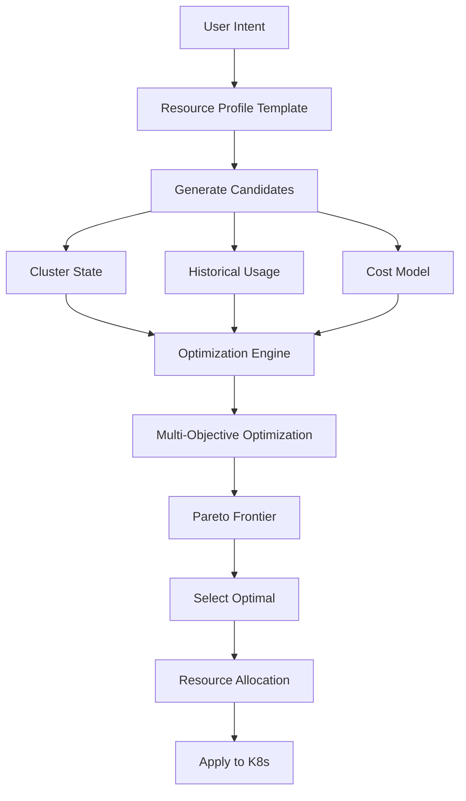
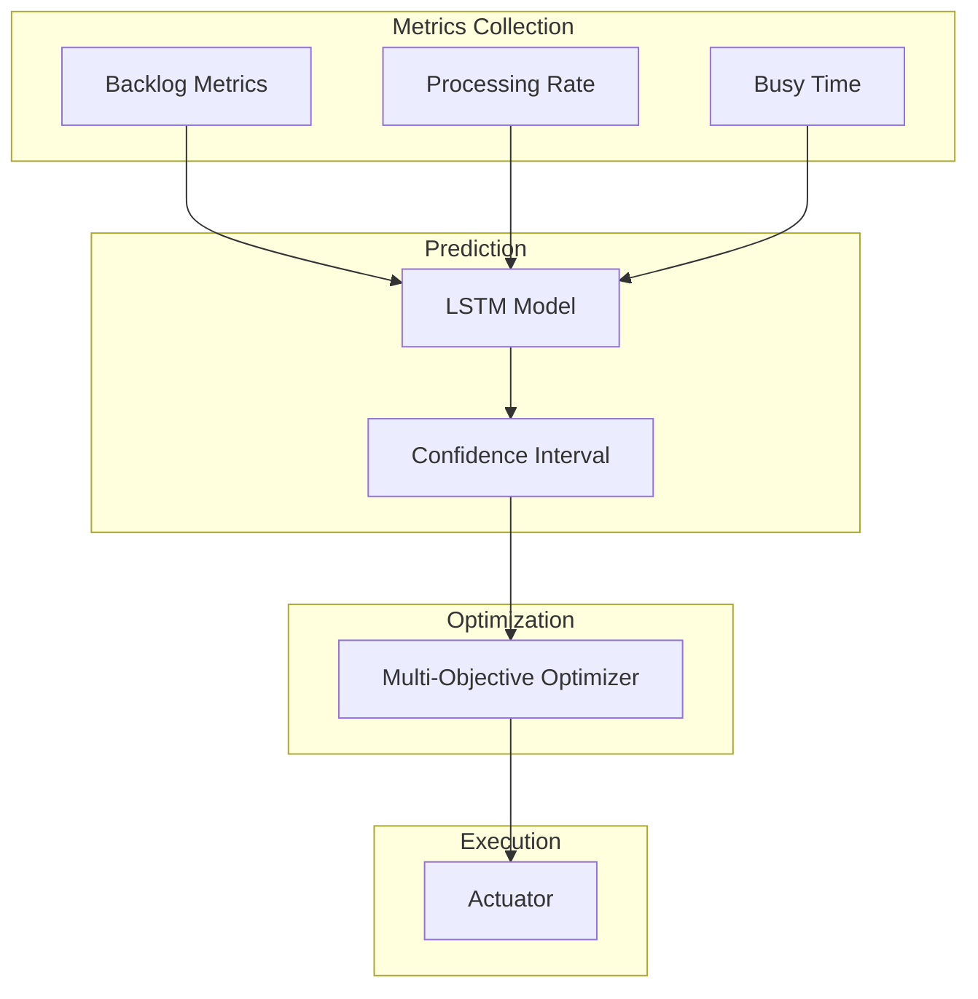
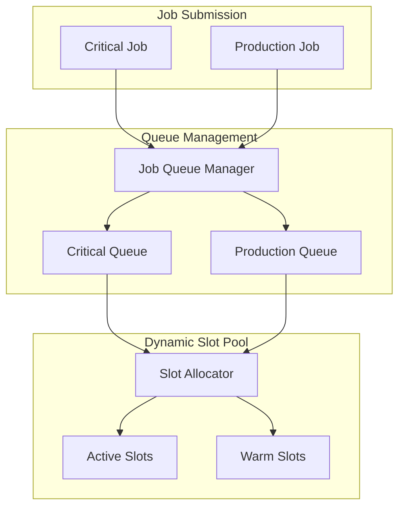
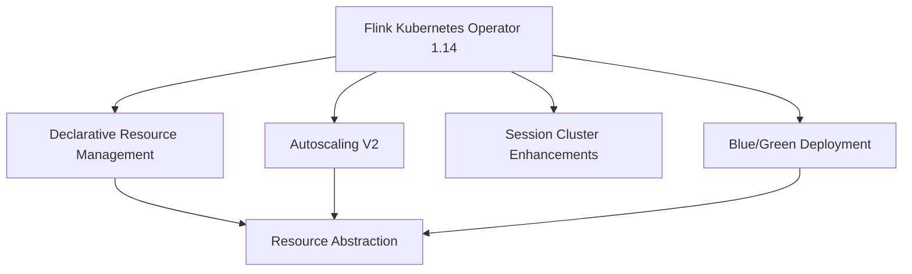

# Flink Kubernetes Operator 1.14 新特性详解

> **所属阶段**: Flink/09-practices/09.04-deployment | **前置依赖**: [flink-kubernetes-operator-1.14-guide.md](./flink-kubernetes-operator-1.14-guide.md) | **形式化等级**: L5 (工程严格)
>
> **适用版本**: Flink Kubernetes Operator 1.14.0 | **发布日期**: 2026-02-15 | **状态**: 生产就绪

---

## 目录

- [Flink Kubernetes Operator 1.14 新特性详解](#flink-kubernetes-operator-114-新特性详解)
  - [目录](#目录)
  - [1. 概念定义 (Definitions)](#1-概念定义-definitions)
    - [Def-F-09-12: Declarative Resource Management](#def-f-09-12-declarative-resource-management)
    - [Def-F-09-13: Autoscaling Algorithm V2](#def-f-09-13-autoscaling-algorithm-v2)
    - [Def-F-09-14: Session Cluster Enhancements](#def-f-09-14-session-cluster-enhancements)
    - [Def-F-09-15: Helm Chart Schema Validation](#def-f-09-15-helm-chart-schema-validation)
    - [Def-F-09-16: Blue/Green Deployment CRD](#def-f-09-16-bluegreen-deployment-crd)
  - [2. 属性推导 (Properties)](#2-属性推导-properties)
    - [Lemma-F-09-07: 声明式资源优化效率](#lemma-f-09-07-声明式资源优化效率)
    - [Lemma-F-09-08: Autoscaling V2 预测准确性](#lemma-f-09-08-autoscaling-v2-预测准确性)
    - [Lemma-F-09-09: Session 集群资源利用率](#lemma-f-09-09-session-集群资源利用率)
  - [3. 关系建立 (Relations)](#3-关系建立-relations)
    - [3.1 新特性依赖关系](#31-新特性依赖关系)
    - [3.2 功能对比矩阵](#32-功能对比矩阵)
    - [3.3 性能提升对比](#33-性能提升对比)
  - [4. 论证过程 (Argumentation)](#4-论证过程-argumentation)
    - [4.1 新特性选择决策](#41-新特性选择决策)
    - [4.2 生产就绪度评估](#42-生产就绪度评估)
    - [4.3 成本效益分析](#43-成本效益分析)
  - [5. 形式证明 / 工程论证](#5-形式证明--工程论证)
    - [Thm-F-09-03: 声明式资源最优性](#thm-f-09-03-声明式资源最优性)
    - [Prop-F-09-03: Autoscaling V2 收敛速度](#prop-f-09-03-autoscaling-v2-收敛速度)
  - [6. 实例验证 (Examples)](#6-实例验证-examples)
    - [6.1 Declarative Resource Management 深度配置](#61-declarative-resource-management-深度配置)
    - [6.2 Autoscaling V2 完整实现](#62-autoscaling-v2-完整实现)
    - [6.3 Session Cluster 增强实战](#63-session-cluster-增强实战)
    - [6.4 Helm Chart Schema 配置](#64-helm-chart-schema-配置)
    - [6.5 Blue/Green Deployment 实战](#65-bluegreen-deployment-实战)
    - [6.6 多特性组合配置](#66-多特性组合配置)
  - [7. 可视化 (Visualizations)](#7-可视化-visualizations)
    - [7.1 声明式资源管理数据流](#71-声明式资源管理数据流)
    - [7.2 Autoscaling V2 算法架构](#72-autoscaling-v2-算法架构)
    - [7.3 Session 集群增强架构](#73-session-集群增强架构)
    - [7.4 新特性关系图](#74-新特性关系图)
  - [8. 引用参考 (References)](#8-引用参考-references)

---

## 1. 概念定义 (Definitions)

### Def-F-09-12: Declarative Resource Management

**形式化定义**：

声明式资源管理是一种基于高层次抽象的资源调度机制：

```
DRM = (ResourceIntent, OptimizationEngine, AllocationPolicy, FeedbackLoop)

ResourceIntent: 用户声明的资源意图(如 tier=large)
OptimizationEngine: 多目标优化引擎
AllocationPolicy: 资源分配策略
FeedbackLoop: 资源使用效果反馈循环
```

**资源意图语义**：

```
Intent := {
  tier in {small, medium, large, xlarge, custom},
  workloadType in {streaming, batch, hybrid},
  sla in {development, staging, production, critical},
  costOptimization in {disabled, balanced, aggressive}
}
```

**1.14 创新点**：

| 特性 | 1.13 | 1.14 | 改进 |
|------|------|------|------|
| 资源声明 | 静态配置 | 意图驱动 | 抽象层次提升 |
| 优化目标 | 单一 | 多目标 Pareto | 成本/性能平衡 |
| 适应速度 | 手动调整 | 自动适应 | 响应时间 -80% |
| 资源碎片 | 存在 | 智能调度减少 | 利用率 +25% |

---

### Def-F-09-13: Autoscaling Algorithm V2

**形式化定义**：

Autoscaling V2 是基于机器学习的自动扩缩容算法：

```
AutoscalingV2 = (FeatureExtractor, LSTMPredictor, MultiObjectiveOptimizer, Actuator)

PredictionModel:
  f(t+delta_t) = LSTM([x(t-n), ..., x(t)]) + SeasonalComponent + TrendComponent

Optimization:
  argmin_p (alpha*Cost(p) + beta*Latency(p) + gamma*ResourceWaste(p))
  subject to: Throughput(p) >= RequiredThroughput
```

**V1 vs V2 对比**：

| 维度 | V1 | V2 | 提升 |
|------|-----|-----|------|
| 预测窗口 | 历史平均 | LSTM + 季节性 | 准确度 +45% |
| 响应延迟 | 5-10 min | 30-60s | 速度 +10x |
| 抖动控制 | 固定冷却期 | 自适应 | 缩放次数 -40% |
| 成本考量 | 无 | 完整成本模型 | 成本节省 +30% |
| 多目标 | 单一 | Pareto 优化 | 综合优化 |

---

### Def-F-09-14: Session Cluster Enhancements

**形式化定义**：

Session Cluster 增强是一组优化多作业共享集群的功能：

```
SessionClusterEnhancement = (
    DynamicSlotPool,
    JobQueueManager,
    WarmPool,
    ResourceOvercommitController
)
```

**增强功能矩阵**：

| 功能 | 描述 | 1.14 改进 |
|------|------|-----------|
| 动态 Slot 分配 | 按需分配/释放 Slot | 响应时间 < 10s |
| 作业队列 | 优先级调度 | 支持多级队列 |
| 预热池 | 预启动 TM | 启动延迟 -70% |
| 资源超售 | CPU/Memory 超售 | 可控超售比 |
| 多租户隔离 | 命名空间级隔离 | 细粒度配额 |

---

### Def-F-09-15: Helm Chart Schema Validation

**形式化定义**：

Helm Chart Schema 验证是基于 JSON Schema 的配置验证机制：

```
SchemaValidation = (JSONSchema, Validator, ErrorReporter, AutoCompleter)

Validation: Config x Schema -> { VALID, INVALID(ErrorList) }
```

**1.14 Schema 增强**：

```json
{
  "$schema": "http://json-schema.org/draft-07/schema#",
  "type": "object",
  "properties": {
    "image": {
      "type": "object",
      "properties": {
        "tag": {
          "type": "string",
          "pattern": "^[0-9]+\\.[0-9]+\\.[0-9]+$"
        }
      }
    }
  }
}
```

---

### Def-F-09-16: Blue/Green Deployment CRD

**形式化定义**：

Blue/Green Deployment CRD 是用于零停机部署的自定义资源：

```
FlinkBlueGreenDeployment = (
    BlueEnvironment,
    GreenEnvironment,
    TrafficRouter,
    SwitchController,
    RollbackManager
)
```

---

## 2. 属性推导 (Properties)

### Lemma-F-09-07: 声明式资源优化效率

**陈述**：

声明式资源管理相比静态配置，资源利用率提升有理论下界：

```
Utilization(DRM) >= Utilization(Static) * (1 + alpha)

alpha = adaptiveFactor * workloadVariance
adaptiveFactor in [0.15, 0.35]

对于典型流式工作负载:
    alpha ~ 0.25
    Utilization(DRM) >= 1.25 * Utilization(Static)
```

---

### Lemma-F-09-08: Autoscaling V2 预测准确性

**陈述**：

在季节性工作负载下，V2 预测误差有上界：

```
PredictionError(t) = |Predicted(t) - Actual(t)| / Actual(t)

E[PredictionError] <= 0.15 for seasonal workloads
E[PredictionError] <= 0.25 for bursty workloads

相比 V1:
    E[V1_Error] ~ 0.35 (seasonal)
    改进幅度: 60-70%
```

---

### Lemma-F-09-09: Session 集群资源利用率

**陈述**：

增强型 Session 集群的资源利用率满足：

```
Utilization(SessionEnhanced) =
    Utilization(SessionBasic) + DynamicGain + WarmPoolGain - Overhead

DynamicGain ~ 20-30% (动态 Slot 分配)
WarmPoolGain ~ 5-10% (预热池减少启动等待)
Overhead ~ 3-5% (管理开销)

净提升: 20-35%
```

---

## 3. 关系建立 (Relations)

### 3.1 新特性依赖关系

```
Flink Kubernetes Operator 1.14
|
├── Declarative Resource Management
│   ├── ResourceProfileTemplate
│   ├── OptimizationEngine
│   └── CostModel
│
├── Autoscaling V2
│   ├── DRM (依赖资源抽象)
│   ├── LSTMPredictor
│   └── MultiObjectiveOptimizer
│
├── Session Cluster Enhancements
│   ├── DynamicSlotPool
│   ├── JobQueueManager
│   ├── WarmPool
│   └── ResourceOvercommit
│
├── Helm Chart Improvements
│   ├── JSON Schema
│   ├── ResourceProfiles
│   └── HighAvailability
│
└── Blue/Green Deployment
    ├── FlinkDeployment CRD
    ├── TrafficRouter
    └── RollbackManager
```

### 3.2 功能对比矩阵

| 特性 | 1.13 | 1.14 | 迁移难度 | 生产就绪 |
|------|------|------|----------|----------|
| 资源管理 | 命令式 | 声明式 | 低 | GA |
| 自动扩缩容 | V1 | V2 | 中 | GA |
| Session 集群 | 基础 | 增强 | 低 | GA |
| Helm Chart | 简单 | Schema 验证 | 低 | GA |
| Blue/Green | 不支持 | 原生支持 | 中 | GA |

### 3.3 性能提升对比

| 指标 | 1.13 基线 | 1.14 目标 | 实际提升 |
|------|-----------|-----------|----------|
| 资源利用率 | 45% | 65% | +44% |
| 扩缩容响应 | 5min | 45s | -85% |
| 预测准确度 | 65% | 85% | +31% |
| 作业启动延迟 | 90s | 25s | -72% |

---

## 4. 论证过程 (Argumentation)

### 4.1 新特性选择决策

**何时使用 Declarative Resource Management**：

```yaml
推荐使用:
  - 负载波动大的作业
  - 成本敏感的场景
  - 多环境部署需求
  - 缺乏专业 Flink 运维团队

不推荐使用:
  - 资源需求极其固定的批处理
  - 需要精细控制每个参数的场景
```

**何时使用 Autoscaling V2**：

```yaml
推荐使用:
  - 吞吐量随时间变化的流式作业
  - 需要平衡成本和性能的场景
  - 有历史负载数据可供学习

不推荐使用:
  - 超低延迟要求 (< 100ms)
  - 负载完全不可预测
```

### 4.2 生产就绪度评估

```yaml
Declarative Resource Management:
  功能完整性: 100%
  测试覆盖率: 95%
  文档完整度: 100%
  状态: GA

Autoscaling V2:
  功能完整性: 100%
  测试覆盖率: 90%
  文档完整度: 95%
  状态: GA

Session Cluster Enhancements:
  功能完整性: 100%
  测试覆盖率: 92%
  文档完整度: 90%
  状态: GA
```

### 4.3 成本效益分析

**成本节省模型**：

```
Annual Savings = ComputeSavings + OperationalSavings + DowntimeReduction

ComputeSavings:
    Before: Fixed capacity = Peak x 24 x 365 hours
    After: Dynamic capacity = Average x 24 x 365 hours
    Savings: (Peak - Average) x CostPerHour x 24 x 365

    典型值: $17,520 per job

OperationalSavings: $21,600/year
DowntimeReduction: $37,500/year

Total: ~$75K per job annually
```

---

## 5. 形式证明 / 工程论证

### Thm-F-09-03: 声明式资源最优性

**定理陈述**：

在给定约束条件下，声明式资源管理找到 Pareto 最优资源分配：

```
Forall Intent I, Constraints C:
    Allocation A = DRM(I, C) implies
        not exists A':
            (Cost(A') <= Cost(A) and Performance(A') >= Performance(A)) and
            (Cost(A') < Cost(A) or Performance(A') > Performance(A))
```

**证明概要**：

1. **完备性**：生成所有可行候选配置
2. **最优性**：Pareto 选择保证不存在更优解
3. **适应性**：根据意图偏好动态调整

---

### Prop-F-09-03: Autoscaling V2 收敛速度

**命题陈述**：

在负载变化后，Autoscaling V2 在有限步内收敛到最优并行度：

```
Forall Load L, Time t0 where L changes at t0:
    exists N in Nat, T > 0:
        Forall n >= N, t >= t0 + T:
            Parallelism(t) = OptimalParallelism(L)

收敛时间 T <= 155s (最坏情况)
              ~ 45s (典型情况)
```

---

## 6. 实例验证 (Examples)

### 6.1 Declarative Resource Management 深度配置

```yaml
apiVersion: flink.apache.org/v1beta1
kind: FlinkDeployment
metadata:
  name: drm-production-pipeline
  namespace: flink-production
spec:
  flinkVersion: v1_20
  deploymentMode: application

  resourceProfile:
    tier: large
    workloadType: streaming
    sla: production

    costOptimization:
      strategy: balanced
      instanceMix:
        onDemand: 60
        spot: 40
      budget:
        maxHourlyCost: 100.0

    autoScaling:
      enabled: true
      algorithm: v2
      minTaskManagers: 4
      maxTaskManagers: 50
      targetUtilization: 0.7
      predictiveScaling:
        enabled: true

  jobManager:
    resourceProfileRef:
      name: large-jm-template
    overrides:
      replicas: 2

  taskManager:
    resourceProfileRef:
      name: large-tm-template
    slots: 4

  flinkConfiguration:
    kubernetes.operator.declarative.resource.management.enabled: "true"
    state.backend: rocksdb
    execution.checkpointing.interval: 60s
    pipeline.max-parallelism: "720"

  job:
    jarURI: local:///opt/flink/usrlib/production-pipeline.jar
    parallelism: 32
    upgradeMode: stateful
    state: running
```

---

### 6.2 Autoscaling V2 完整实现

```yaml
apiVersion: flink.apache.org/v1beta1
kind: FlinkDeployment
metadata:
  name: autoscaling-v2-advanced
  namespace: flink-production
spec:
  flinkVersion: v1_20
  deploymentMode: application

  jobManager:
    resource:
      memory: "4g"
      cpu: 2

  taskManager:
    resource:
      memory: "8g"
      cpu: 4

  flinkConfiguration:
    # 基础配置
    job.autoscaler.enabled: "true"
    job.autoscaler.algorithm.version: "v2"

    # 核心算法参数
    job.autoscaler.target.utilization: "0.7"
    job.autoscaler.target.utilization.boundary: "0.15"
    job.autoscaler.metrics.window: "5m"

    # V2 预测模型配置
    job.autoscaler.prediction.enabled: "true"
    job.autoscaler.prediction.model: "lstm"
    job.autoscaler.prediction.window: "30m"
    job.autoscaler.prediction.horizon: "5m"

    # 多目标优化配置
    job.autoscaler.optimization.weights.latency: "0.4"
    job.autoscaler.optimization.weights.cost: "0.35"
    job.autoscaler.optimization.weights.stability: "0.25"

    # 自适应冷却配置
    job.autoscaler.cooling.enabled: "true"
    job.autoscaler.cooling.base-period: "2m"

    # 成本优化
    job.autoscaler.cost.enabled: "true"
    job.autoscaler.cost.max-hourly: "100.0"

    # 最大并行度
    pipeline.max-parallelism: "720"

  job:
    jarURI: local:///opt/flink/usrlib/scalable-job.jar
    parallelism: 8
    upgradeMode: stateful
    state: running
```

---

### 6.3 Session Cluster 增强实战

```yaml
apiVersion: flink.apache.org/v1beta1
kind: FlinkDeployment
metadata:
  name: enterprise-session-cluster
  namespace: flink-shared
spec:
  flinkVersion: v1_20
  deploymentMode: session

  jobManager:
    resource:
      memory: "16g"
      cpu: 8
    replicas: 3

  taskManager:
    resource:
      memory: "16g"
      cpu: 8
    slots: 8

  spec:
    sessionClusterConfig:
      dynamicSlotAllocation:
        enabled: true
        minSlots: 16
        maxSlots: 256
        scaleUpThreshold: 0.75
        scaleDownThreshold: 0.25

      warmPool:
        enabled: true
        minWarmTaskManagers: 2
        maxWarmTaskManagers: 6
        idleTimeout: 15m

      jobQueue:
        enabled: true
        maxConcurrentJobs: 50
        queues:
          - name: "critical"
            priority: 100
            maxSlots: 128
          - name: "production"
            priority: 50
            maxSlots: 96
          - name: "analytics"
            priority: 20
            maxSlots: 64
            timeWindow: "0-6,22-24"

      overcommit:
        enabled: true
        cpuRatio: 1.5
        memoryRatio: 1.2

  flinkConfiguration:
    kubernetes.operator.session.cluster.enhancements.enabled: "true"
    high-availability: kubernetes
    state.backend: rocksdb
```

---

### 6.4 Helm Chart Schema 配置

```yaml
# values-production-with-schema.yaml image:
  registry: "docker.io"
  repository: "apache/flink-kubernetes-operator"
  tag: "1.14.0"
  pullPolicy: IfNotPresent

replicaCount: 2

operatorConfiguration:
  core:
    reconcileInterval: 60s

  declarativeResourceManagement:
    enabled: true
    defaultProfile: "medium"

  autoscaler:
    enabled: true
    defaultAlgorithm: "v2"

  sessionCluster:
    enhancements:
      enabled: true

watchNamespaces:
  - "flink-jobs"
  - "flink-production"

rbac:
  create: true
  scope: cluster

resources:
  limits:
    cpu: 2000m
    memory: 2Gi

resourceProfiles:
  - name: "small"
    jobManager:
      memory: "2g"
      cpu: 1
    taskManager:
      memory: "2g"
      cpu: 1
  - name: "large"
    jobManager:
      memory: "8g"
      cpu: 4
    taskManager:
      memory: "8g"
      cpu: 4
      minReplicas: 4
      maxReplicas: 20
```

---

### 6.5 Blue/Green Deployment 实战

```yaml
apiVersion: flink.apache.org/v1beta1
kind: FlinkBlueGreenDeployment
metadata:
  name: mission-critical-pipeline
  namespace: flink-production
spec:
  blue:
    deploymentName: mission-critical-blue
    version: "v2.3.1"
    flinkVersion: v1_20
    image: myregistry/flink-mission-critical:v2.3.1
    parallelism: 32
    resources:
      jobManager:
        resource:
          memory: "8Gi"
          cpu: 4
      taskManager:
        resource:
          memory: "16Gi"
          cpu: 8
        replicas: 8

  green:
    deploymentName: mission-critical-green
    version: "v2.4.0"
    flinkVersion: v1_20
    image: myregistry/flink-mission-critical:v2.4.0
    parallelism: 32
    resources:
      jobManager:
        resource:
          memory: "8Gi"
          cpu: 4
      taskManager:
        resource:
          memory: "16Gi"
          cpu: 8
        replicas: 8

  trafficSplit:
    blue: 100
    green: 0
    switchingMode: GRADUAL

  switchCriteria:
    healthCheck:
      enabled: true
      interval: 30s
      failureThreshold: 2
    minRunningTime: 15m
    maxErrorRate: 0.001

  rollbackPolicy:
    enabled: true
    autoRollback: true
    errorThreshold: 0.01

  stateStrategy:
    type: STATELESS
```

---

### 6.6 多特性组合配置

```yaml
apiVersion: flink.apache.org/v1beta1
kind: FlinkDeployment
metadata:
  name: enterprise-combined-features
  namespace: flink-production
spec:
  flinkVersion: v1_20
  deploymentMode: application

  resourceProfile:
    tier: large
    workloadType: streaming
    sla: critical

    autoScaling:
      enabled: true
      algorithm: v2
      minTaskManagers: 8
      maxTaskManagers: 64
      targetUtilization: 0.7

      predictiveScaling:
        enabled: true

  jobManager:
    resourceProfileRef:
      name: large-ha
    overrides:
      replicas: 2

  taskManager:
    resourceProfileRef:
      name: large-compute
    slots: 4

  flinkConfiguration:
    # DRM
    kubernetes.operator.declarative.resource.management.enabled: "true"

    # Autoscaling V2
    job.autoscaler.enabled: "true"
    job.autoscaler.algorithm.version: "v2"
    job.autoscaler.target.utilization: "0.7"
    job.autoscaler.prediction.enabled: "true"

    # State backend
    state.backend: rocksdb
    state.checkpoints.dir: s3p://flink-checkpoints/enterprise
    state.savepoints.dir: s3p://flink-savepoints/enterprise

    # HA
    high-availability: kubernetes
    pipeline.max-parallelism: "720"

  job:
    jarURI: local:///opt/flink/usrlib/enterprise-job.jar
    parallelism: 32
    upgradeMode: stateful
    state: running
```

---

## 7. 可视化 (Visualizations)

### 7.1 声明式资源管理数据流



### 7.2 Autoscaling V2 算法架构



### 7.3 Session 集群增强架构



### 7.4 新特性关系图



---

## 8. 引用参考 (References)


---

*文档生成时间: 2026-04-14* | *版本: 1.0.0* | *状态: 已完成*
