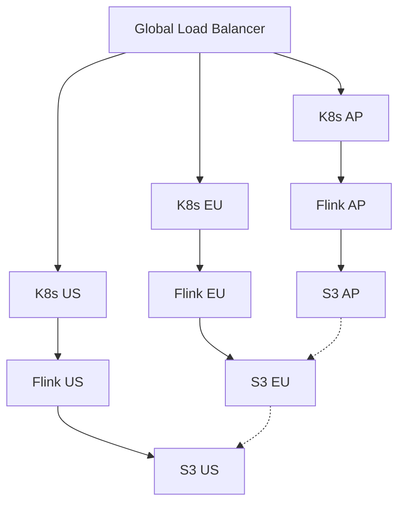
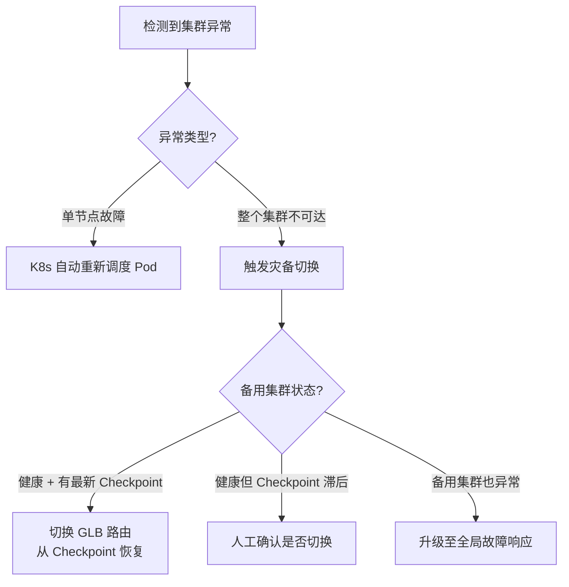

# Flink 多集群联邦部署

> **所属阶段**: Flink/09-practices/09.04-deployment/ | **前置依赖**: [Flink GitOps 部署模式](./flink-gitops-deployment.md) | **形式化等级**: L4

---

## 1. 概念定义 (Definitions)

**Def-F-Dep-04: 集群联邦 (Cluster Federation)**
将多个地理分散或功能隔离的 Kubernetes 集群作为一个统一逻辑资源池进行管理的能力。对于 Flink，多集群联邦意味着同一套作业可以在不同区域或可用区的 K8s 集群上部署、调度、监控和故障转移。

**Def-F-Dep-05: 灾难恢复域 (DR Domain)**
在地理上隔离的一组计算、存储和网络资源，其故障不会影响其他 DR Domain。典型设计是每个区域（Region）或可用区（AZ）构成一个独立的 DR Domain。

**Def-F-Dep-06: 全局负载均衡器 (GLB)**
部署在多个集群前端的路由层，根据延迟、容量、健康状态等策略将数据流或查询请求分发到最优的 Flink 集群实例。

---

## 2. 属性推导 (Properties)

**Lemma-F-Dep-03: 联邦部署下的状态一致性边界**
在多集群联邦中，每个 Flink 集群维护独立的状态后端和 Checkpoint 存储。除非显式配置跨集群状态同步（如对象存储的跨区域复制），否则不同集群间的状态在任意时刻是不一致的。

**Lemma-F-Dep-04: 故障转移时间与 RPO/RTO 的约束**
对于从集群 A 到集群 B 的故障转移，RTO 取决于 Checkpoint 恢复时间 + 作业启动时间 + DNS/GLB 切换时间。RPO 取决于最后一次成功复制到集群 B 可访问存储的 Checkpoint 的时间戳。

**Prop-F-Dep-02: 就近处理的数据主权优势**
多集群联邦允许数据在产生地就近处理，满足 GDPR 等数据主权法规要求，同时降低跨区域网络延迟。

---

## 3. 关系建立 (Relations)



### 联邦部署模式对比

| 模式 | 数据同步 | 复杂度 | 适用场景 |
|------|---------|--------|---------|
| Active-Active | 双向实时同步 | 极高 | 全球低延迟服务 |
| Active-Standby | 单向异步复制 | 中 | 灾备与合规 |
| Shard-by-Region | 无跨集群同步 | 低 | 数据完全隔离 |

---

## 4. 论证过程 (Argumentation)

多集群联邦的核心价值在于高可用性、就近处理、合规要求和容量扩展。主要挑战包括：

- **状态同步**：跨集群 Checkpoint 复制成本高
- **网络分区**：集群间通信中断时需要清晰的脑裂处理策略
- **运维复杂度**：多集群监控、告警、日志聚合的统一视图难以构建
- **配置一致性**：确保所有集群使用兼容的 Flink 版本和依赖版本

---

## 5. 形式证明 / 工程论证

**定理 (Thm-F-Dep-02)**: 在 Active-Standby 多集群联邦中，若满足：

1. Checkpoint 以异步方式复制到 Standby 集群可访问的共享存储
2. 故障检测机制能在 $T_{detect}$ 内确认 Active 集群失效
3. Standby 集群从最新可用 Checkpoint 恢复作业

则系统的 RTO $\leq T_{detect} + T_{restore} + T_{route}$，RPO $\leq T_{checkpoint\_interval} + T_{replication\_delay}$。

**证明概要**：

1. 异步复制不影响 Active 集群的 Checkpoint 性能
2. 共享存储提供最终一致性的状态访问
3. 故障检测通过健康探针和 Prometheus 告警实现
4. 恢复时间主要取决于 Checkpoint 大小和 Standby 集群资源就绪速度
5. 路由切换时间取决于 GLB 的 TTL 和 DNS 传播速度

---

## 6. 实例验证

### 6.1 跨区域 FlinkDeployment 模板

```yaml
apiVersion: flink.apache.org/v1beta1
kind: FlinkDeployment
metadata:
  name: realtime-analytics-ap
  namespace: flink-apps
  annotations:
    region: ap-southeast-1
spec:
  image: flink:2.0.0
  flinkVersion: v2.0
  jobManager:
    resource:
      memory: "4Gi"
      cpu: 2
  taskManager:
    resource:
      memory: "8Gi"
      cpu: 4
    replicas: 6
  job:
    jarURI: local:///opt/flink/examples/streaming/StateMachineExample.jar
    parallelism: 24
    upgradeMode: savepoint
    state: running
```

### 6.2 S3 跨区域复制配置

```json
{
  "Rules": [
    {
      "Status": "Enabled",
      "Priority": 1,
      "DeleteMarkerReplication": { "Status": "Disabled" },
      "Destination": {
        "Bucket": "arn:aws:s3:::flink-checkpoints-eu",
        "ReplicationTime": {
          "Status": "Enabled",
          "Time": { "Minutes": 15 }
        }
      },
      "Filter": { "Prefix": "checkpoints/" }
    }
  ]
}
```

### 6.3 全局路由配置（Cloudflare 示例）

```yaml
pools:
  - name: flink-ap-pool
    origins:
      - name: k8s-ap
        address: ap.flink.example.com
        weight: 1
    monitor: http-health-check
  - name: flink-eu-pool
    origins:
      - name: k8s-eu
        address: eu.flink.example.com
        weight: 1
```

---

## 7. 可视化



---

## 8. 引用参考
