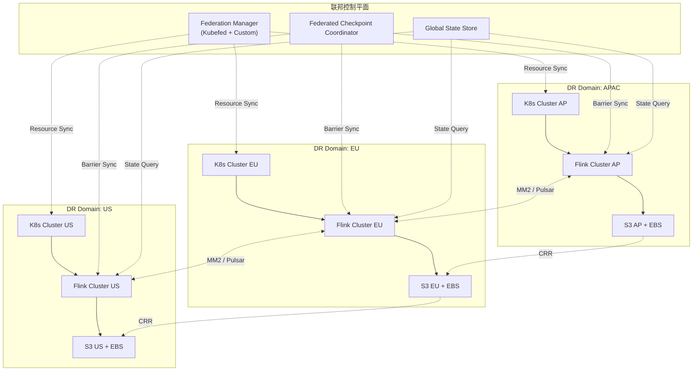
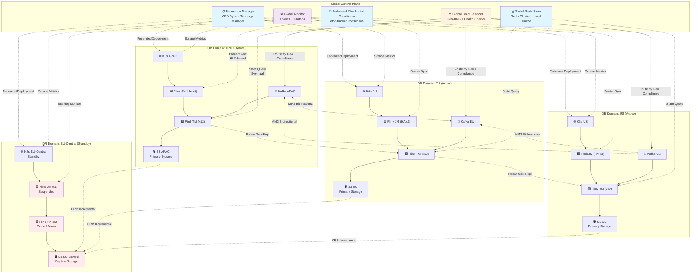
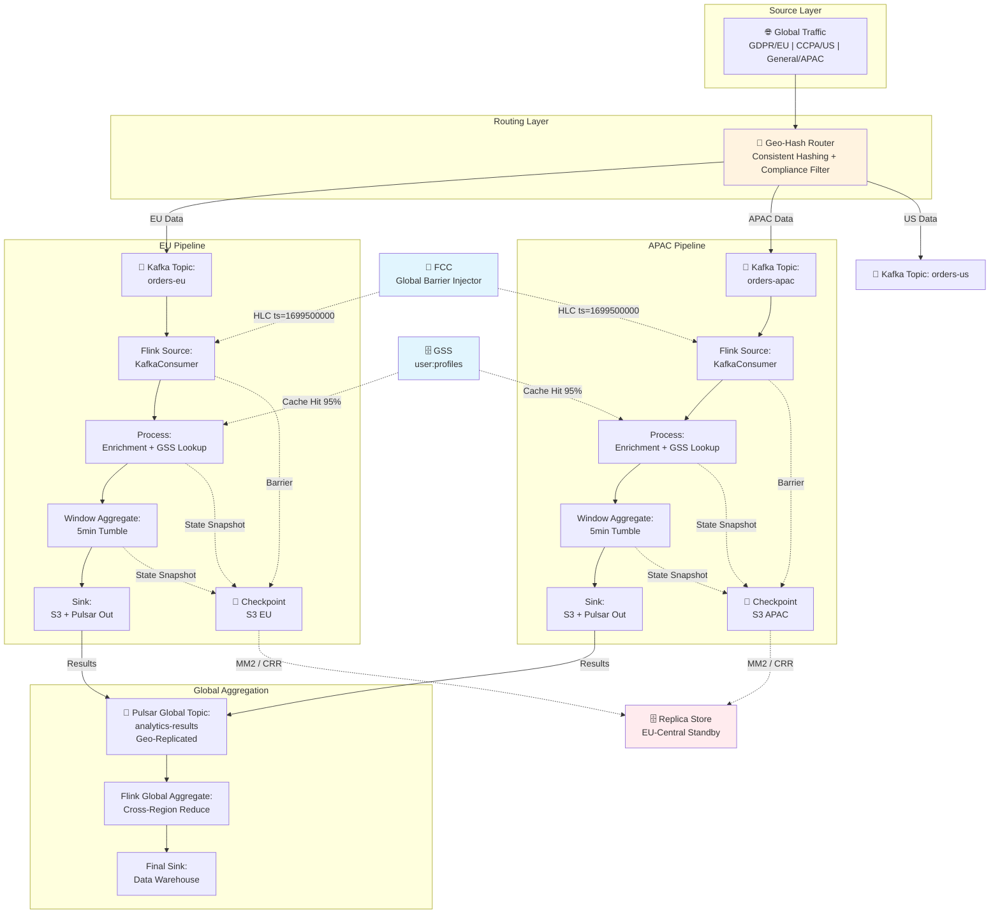
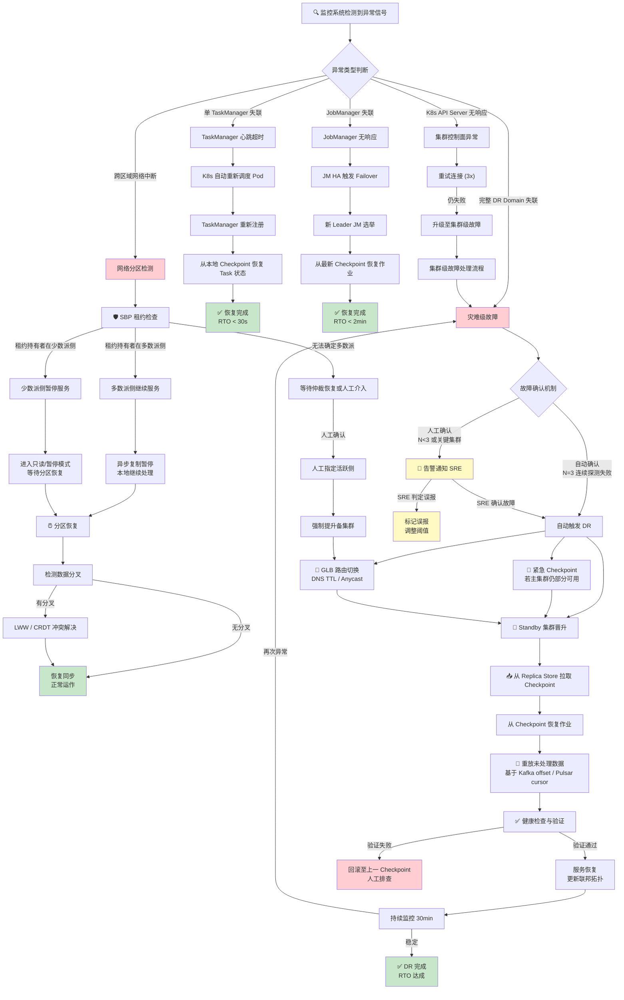
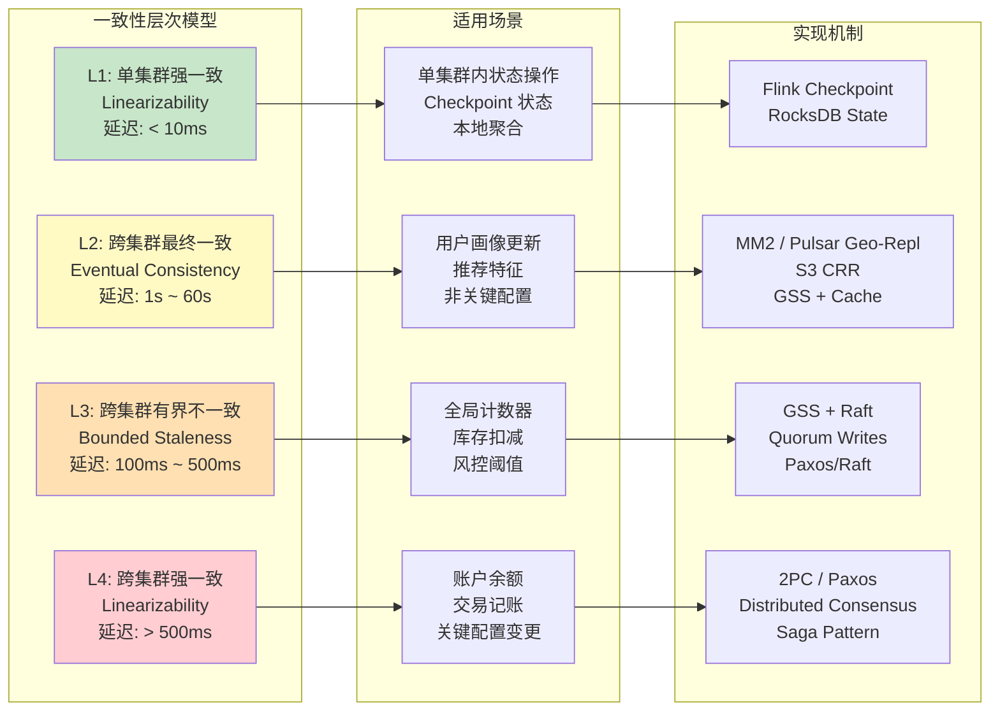

# Flink 多集群联邦架构深度指南

> **所属阶段**: Flink/09-practices/09.04-deployment | **前置依赖**: [Flink GitOps 部署模式](./flink-gitops-deployment.md), [Flink Kubernetes Operator 高级配置](../09.05-operations/flink-k8s-operator-advanced.md), [Flink 状态后端与 Checkpoint 机制](../../02-core/02.03-state-management/flink-checkpoint-internals.md) | **形式化等级**: L5

---

## 1. 概念定义 (Definitions)

**Def-F-09-71: 多集群联邦 (Multi-Cluster Federation)**

多集群联邦是指将两个或更多在地理上分散、管理上独立但逻辑上协同的 Flink 集群，通过统一的控制平面、全局元数据服务和跨集群协调协议，组织为一个单一逻辑数据处理域的架构模式。形式上，设集群集合为 $\mathcal{C} = \{C_1, C_2, \dots, C_n\}$，每个集群 $C_i = (J_i, S_i, K_i)$ 包含作业集合 $J_i$、状态存储 $S_i$ 和 Kubernetes 控制面 $K_i$。联邦系统 $\mathcal{F}$ 定义为一个三元组：

$$\mathcal{F} = (\mathcal{C}, \mathcal{G}, \Phi)$$

其中 $\mathcal{G}$ 为全局协调服务（Global Coordination Service），负责跨集群元数据同步、作业调度和故障检测；$\Phi$ 为联邦策略集合，包含数据路由策略 $\phi_{route}$、状态同步策略 $\phi_{sync}$ 和故障转移策略 $\phi_{failover}$。联邦的核心性质在于：对外呈现为单一逻辑集群，对内保持各成员集群的自治性与故障隔离性。

**Def-F-09-72: 联邦拓扑 (Federation Topology)**

联邦拓扑 $T_{fed}$ 描述集群间的连接关系与数据流向，是一个有向图：

$$T_{fed} = (V, E, \lambda, \tau)$$

其中顶点集合 $V = \mathcal{C}$ 表示联邦成员集群；边集合 $E \subseteq V \times V$ 表示集群间显式数据复制或控制信令通道；边标签函数 $\lambda: E \to \{\text{sync}, \text{async}, \text{control}\}$ 区分同步复制、异步复制和控制通道；顶点标签函数 $\tau: V \to \{\text{active}, \text{passive}, \text{shard}\}$ 标记集群在联邦中的角色。拓扑必须满足无环性约束当且仅当数据流不允许循环复制（即不存在有向环使得所有边标记为 sync 或 async）。

**Def-F-09-73: 全局状态存储 (Global State Store, GSS)**

全局状态存储是联邦架构中为跨集群状态共享而设计的统一存储抽象。GSS 提供跨集群的命名空间化键值访问接口，使得不同集群上的算子实例可以通过全局键（global key）访问共享状态。形式上，GSS 是一个分布式键值存储，支持以下操作：

- `get(k, cluster_id)`：读取键 $k$ 在指定集群视图下的值
- `put(k, v, consistency_level)`：按指定一致性级别写入
- `compareAndSet(k, expected, new, boundary)`：条件更新，支持跨集群边界条件

GSS 的一致性级别分为三种：`LOCAL`（仅本地集群可见）、`CROSS_REGION_EVENTUAL`（跨区域最终一致，RPO > 0）、`CROSS_REGION_STRONG`（跨区域强一致，需要两阶段提交，延迟显著增加）。

**Def-F-09-74: 跨集群一致性边界 (Cross-Cluster Consistency Boundary, CCB)**

跨集群一致性边界定义了在联邦系统中，状态一致性保证的拓扑范围。设集群 $C_i$ 和 $C_j$ 之间的网络延迟为 $d_{ij}$，状态同步通道的带宽为 $b_{ij}$，则 CCB 是联邦拓扑中的一个割集（cut），将该割集两侧的状态更新传播延迟界定为 $L_{sync}$。形式上：

$$CCB(\mathcal{F}) = \{(C_i, C_j) \in E \mid \forall s \in S_i, \text{propagate}(s, C_j) \leq L_{sync}\}$$

其中 $\text{propagate}(s, C_j)$ 表示状态 $s$ 的更新传播到集群 $C_j$ 的最长时间。CCB 决定了联邦系统的 RPO 上界：$RPO_{max} = \max_{(i,j) \in CCB} L_{sync}^{(i,j)}$。

**Def-F-09-75: 联邦 Checkpoint 协调器 (Federated Checkpoint Coordinator, FCC)**

联邦 Checkpoint 协调器是跨集群 Checkpoint 生命周期管理的中心化（或分布式共识）组件。FCC 维护一个全局 Checkpoint 时间线 $\mathcal{T}_{ckpt} = \{(t_k, \{ckpt_i^{(k)}\}_{i=1}^n)\}_{k=1}^m$，其中 $t_k$ 为全局逻辑时间戳，$ckpt_i^{(k)}$ 为集群 $C_i$ 在第 $k$ 轮产生的 Checkpoint 元数据。FCC 负责：

1. 触发跨集群对齐的 Checkpoint Barrier 注入
2. 收集各集群 Checkpoint 完成确认
3. 维护全局 Checkpoint 目录索引
4. 协调跨集群状态一致性校验（State Verification）

**Def-F-09-76: 灾难恢复域 (Disaster Recovery Domain, DR Domain)**

灾难恢复域是联邦拓扑中能够独立完成故障恢复的最小资源集合。每个 DR Domain $D_k$ 包含：独立的 Kubernetes 控制平面、独立的存储系统（如区域级 S3 Bucket）、独立的网络出口入口、以及独立的服务发现机制。形式上，联邦是 DR Domain 的不相交并集：$\mathcal{F} = \biguplus_{k=1}^m D_k$。DR Domain 之间通过低带宽、高延迟的广域网链路连接，其可用性假设为：任意单个 DR Domain 的完全故障不会导致其他 DR Domain 的服务中断。

**Def-F-09-77: 数据主权路由 (Data Sovereignty Routing)**

数据主权路由是一种基于数据产生地理位置和合规策略的数据分区与路由机制。设数据记录 $r$ 携带地理位置标签 $geo(r) \in \{\text{EU}, \text{APAC}, \text{US}, \dots\}$ 和合规等级 $compliance(r) \in \{\text{GDPR}, \text{CCPA}, \text{HIPAA}, \text{none}\}$，则路由函数定义为：

$$\text{route}(r) = \arg\min_{C_i \in \mathcal{C}} \{d_{network}(src(r), C_i) \mid \text{compliance}(C_i) \succeq compliance(r)\}$$

其中 $\succeq$ 表示合规能力偏序关系（即集群 $C_i$ 的合规认证覆盖记录 $r$ 的要求）。数据主权路由确保敏感数据仅在满足法规要求的地理边界内处理。

**Def-F-09-78: 脑裂防护 (Split-Brain Prevention, SBP)**

脑裂防护是联邦系统中防止网络分区导致多个集群同时认为自己拥有活跃主权的机制。SBP 基于分布式共识算法（如 Raft 或 ZooKeeper）实现，维护一个全局活跃的领导者租约（Leader Lease）。设租约超时时间为 $T_{lease}$，心跳间隔为 $T_{hb}$，则 SBP 保证：

$$\forall t, \text{Active}(t) \subseteq \mathcal{C}, |\text{Active}(t)| \leq 1 \iff T_{lease} > 2 \cdot T_{hb} + \max(d_{ij})$$

即任意时刻最多只有一个活跃主集群，前提是租约超时严格大于两倍心跳间隔加最大网络延迟。

---

## 2. 属性推导 (Properties)

**Lemma-F-09-15: 联邦一致性单调性**

在多集群联邦中，若每个成员集群 $C_i$ 内部满足 Exactly-Once 语义，且跨集群状态同步通道满足 FIFO 顺序保证，则联邦系统对单一键的更新操作满足跨集群的单调读一致性（Monotonic Read Consistency）。

*证明概要*：设客户端在时刻 $t_1$ 从集群 $C_i$ 读取键 $k$ 的值为 $v_1$，在时刻 $t_2 > t_1$ 从集群 $C_j$ 读取同一键。由于 $C_i$ 内部 Exactly-Once 保证本地状态机确定性推进，FIFO 同步通道保证更新按生成顺序到达 $C_j$，因此 $C_j$ 在 $t_2$ 时刻看到的值 $v_2$ 不可能早于 $v_1$ 对应的状态版本。∎

**Lemma-F-09-16: 跨集群延迟下界**

对于跨集群 Join 操作，设两个输入流分别位于集群 $C_i$ 和 $C_j$，网络延迟为 $d_{ij}$，则输出流的 watermark 推进延迟至少为 $d_{ij}$。

*证明概要*：跨集群 Join 要求双方数据到达同一物理位置才能进行匹配。即使采用乐观匹配策略，watermark 的推进仍需等待远端 watermark 的到达。根据 watermark 的定义，$W_{out}(t) = \min(W_{in}^i(t - d_{ij}), W_{in}^j(t - d_{ji}))$，因此输出 watermark 相对输入至少延迟 $\min(d_{ij}, d_{ji})$。∎

**Prop-F-09-12: Active-Active 联邦的线性扩展优势**

在 Active-Active 联邦架构中，若输入数据可按主键完美分区（无跨分区依赖），则联邦整体吞吐量随集群数量线性增长，即 $Throughput(\mathcal{F}) = \Theta(n) \cdot Throughput(C_{single})$。

*论证*：完美分区意味着每个数据记录可被唯一映射到单个集群处理，集群间无状态共享需求。此时各集群独立处理本地分区，总吞吐量为各集群之和。负载均衡器将请求均匀分发时，增长率为线性。实际场景中由于数据倾斜和全局聚合需求，增长率通常为亚线性。∎

**Prop-F-09-13: 分片联邦的数据隔离不变性**

在分片联邦（Shard-by-Region）模式下，若数据主权路由函数 $\text{route}(r)$ 是确定性的且联邦拓扑中不存在跨分片同步边（即 $E_{cross} = \emptyset$），则任意数据记录 $r$ 在其完整生命周期内仅被一个集群处理，满足处理位置不变性：$\forall r, |\{C_i \in \mathcal{C} \mid r \in Processed(C_i)\}| = 1$。

*论证*：确定性路由保证记录首次被分配到的集群唯一；无跨分片同步边保证记录不会通过系统内部机制流转到其他集群。因此记录的处理位置在其生命周期内保持不变。这一性质是分片联邦满足严格数据主权法规（如 GDPR Article 44）的基础。∎

**Prop-F-09-14: Checkpoint 复制成本与 RPO 的权衡关系**

在 Active-Passive 联邦中，设 Checkpoint 大小为 $|CK|$，复制带宽为 $B$，Checkpoint 间隔为 $\Delta_{ckpt}$，则 RPO 满足：

$$RPO \geq \max\left(\Delta_{ckpt}, \frac{|CK|}{B}\right)$$

*论证*：RPO 不可能小于 Checkpoint 间隔，因为两次 Checkpoint 之间的状态变更不会被捕获；同时 RPO 不可能小于完整 Checkpoint 的传输时间，因为 Standby 必须收到完整 Checkpoint 才能恢复。增量 Checkpoint 可将 $|CK|$ 降低为增量大小 $|\Delta CK|$，从而改善 RPO 至约 $\max(\Delta_{ckpt}, |\Delta CK|/B)$。∎

---

## 3. 关系建立 (Relations)

### 3.1 联邦架构与分布式系统理论的映射

Flink 多集群联邦与经典分布式系统理论存在深刻映射关系：

| 联邦组件 | 分布式系统概念 | 映射说明 |
|---------|--------------|---------|
| 联邦协调服务 $\mathcal{G}$ | 分布式元数据服务（如 ZooKeeper、etcd） | 维护全局拓扑视图和领导者租约 |
| 全局状态存储 GSS | 地理分布式数据库（如 CockroachDB、Spanner） | 跨区域状态共享，但延迟更高 |
| 联邦 Checkpoint 协调器 FCC | 两阶段提交协调者（2PC Coordinator） | 跨集群屏障对齐与一致性校验 |
| 数据主权路由 | 数据放置策略（Data Placement Policy） | 基于合规约束的延迟优化路由 |
| DR Domain | 故障域（Failure Domain） | 独立故障边界，保证单域失效不影响全局 |

### 3.2 与外部系统的集成关系

**与 Kafka MirrorMaker 2 的关系**

Kafka MirrorMaker 2 (MM2) 是 Active-Active 联邦中最常用的跨集群数据复制基础设施。MM2 在联邦中的角色是：

- 提供主题级别的双向异步复制（`MirrorSourceConnector` + `MirrorCheckpointConnector`）
- 维护消费者组偏移量的跨集群同步，支持消费者故障转移
- 通过 `IdentityReplicationPolicy` 保留消息分区映射关系

MM2 与 Flink 联邦的关系可形式化为：MM2 实现联邦拓扑中的异步边 $E_{async}$，即 $E_{async}^{MM2} \subseteq E$。MM2 的复制延迟直接贡献于联邦的 CCB 延迟上界。

**与 Apache Pulsar Geo-Replication 的关系**

Pulsar 的 Geo-Replication 在命名空间级别提供异步跨集群复制，其优势在于：

- 内置的复制管道无需额外部署 MirrorMaker
- 支持全网格（full-mesh）复制拓扑
- 消息去重机制减少跨集群重复处理

Pulsar Geo-Replication 与 Flink 联邦结合时，Flink 消费 Pulsar 订阅，利用 Pulsar 的 `replicated-subscriptions` 特性实现消费者状态（cursor）的跨集群同步。

**与 Kubernetes Federation v2 (Kubefed) 的关系**

Kubefed 提供跨 K8s 集群的资源分发与协调。在 Flink 联邦中：

- Kubefed 的 `FederatedDeployment` 可用于在多个集群间同步 FlinkDeployment CRD
- `FederatedConfigMap` 和 `FederatedSecret` 保证配置一致性
- `FederatedHPA` 支持跨集群的自动扩缩容协调

然而，Kubefed 不处理 Flink 特有的状态管理和 Checkpoint 协调，这部分需由 Flink 联邦层（FCC 和 GSS）独立实现。

**与 Flink Kubernetes Operator 的关系**

Flink K8s Operator 的联邦模式通过以下扩展支持多集群：

- `FlinkDeployment` CRD 增加 `federationRef` 字段指向联邦元数据
- Operator 支持多集群 `kubeconfig` 上下文切换
- Session 集群的跨集群注册与发现



### 3.3 三种联邦架构模式的对比矩阵

| 维度 | Active-Active | Active-Passive (Standby) | 分片联邦 (Shard-by-Region) |
|------|--------------|------------------------|--------------------------|
| 集群角色 | 所有集群同时处理流量 | 主集群处理，备集群待命 | 各集群处理独立数据分片 |
| 状态同步 | 双向实时/近实时 | 单向异步复制 | 无跨集群状态同步 |
| 数据一致性 | 最终一致，冲突需解决 | 主从一致，切换时有界不一致 | 强一致（单集群内） |
| RPO | 秒级 ~ 分钟级 | 分钟级 ~ 小时级 | 0（无复制） |
| RTO | 秒级（DNS/GLB切换） | 分钟级（Checkpoint恢复） | 分钟级（重定向流量） |
| 跨集群延迟敏感度 | 极高 | 中 | 低 |
| 运维复杂度 | 极高 | 高 | 中 |
| 适用场景 | 全球实时服务、金融交易 | 灾备、合规归档 | 数据主权、区域隔离 |
| 存储成本 | 高（多活全量状态） | 中（主全量+备快照） | 低（各存各的分片） |
| 扩展性 | 线性（无状态分片） | 固定（1+N备份） | 线性（分片独立扩展） |


---

## 4. 论证过程 (Argumentation)

### 4.1 架构模式选择的决策框架

选择联邦架构模式需要系统性地评估业务需求、技术约束和运维能力。以下是形式化的决策过程：

**步骤 1：一致性需求分析**

设业务对数据一致性的需求为 $ConsistencyReq \in \{\text{Eventual}, \text{Bounded}, \text{Strong}\}$，对延迟的需求为 $LatencyReq \leq L_{max}$。则：

- 若 $ConsistencyReq = \text{Strong}$ 且存在跨集群状态共享 $ o$ 排除纯分片联邦，需考虑 Active-Active + 分布式共识
- 若 $LatencyReq \leq 100ms$ 且集群间 RTT > $50ms$ $ o$ 排除跨集群实时 Join，需采用异步聚合或就近处理

**步骤 2：故障模式与可用性目标**

设可用性目标为 $A_{target}$（如 99.999%），单集群可用性为 $A_{single}$，则多集群联邦的理论可用性为：

$$A_{federation} = 1 - \prod_{i=1}^n (1 - A_i)$$

对于 Active-Passive 模式，$A_{federation} \approx A_{primary} + (1 - A_{primary}) \cdot A_{standby}$。若 $A_{single} = 99.9\%$，双集群联邦可达 $A_{federation} = 99.9999\%$。

**步骤 3：数据主权与合规约束**

若业务受 GDPR Article 44、中国《数据安全法》或美国 CLOUD Act 约束，则数据跨境传输需要：

- 明确的法律依据（如标准合同条款 SCC）
- 技术保障措施（如端到端加密）
- 审计与追溯能力

在此约束下，分片联邦通常是唯一可行的架构，因为 Active-Active 的双向复制本质上构成数据跨境传输。

### 4.2 跨集群状态同步策略的深度分析

#### 4.2.1 Global State Store (GSS) 策略

GSS 策略适用于需要跨集群共享少量热状态（如全局计数器、配置表、用户会话状态）的场景。其核心挑战在于：

**读写放大问题**：当 GSS 部署在某一中心区域时，远端集群的每次状态访问都产生跨域网络往返。设单条记录处理需要 $k$ 次状态访问，跨域 RTT 为 $d$，则每条记录的额外延迟为 $k \cdot d$。对于 $d = 150ms$（跨太平洋）、$k = 5$ 的场景，单条记录额外延迟达 750ms，这在实时流处理中通常不可接受。

**解决方案——状态缓存与一致性分层**：

- **L1 缓存**：每个集群本地维护 GSS 的读缓存，TTL 根据业务容忍度设置（如 1s ~ 30s）
- **L2 近线缓存**：在区域内部署 GSS 的只读副本，异步同步主副本
- **L3 全局主副本**：单一主副本处理写请求，通过共识协议保证线性一致性

形式上，缓存一致性模型可描述为：

$$\text{ staleness}_{max} = TTL_{L1} + \text{replication_delay}_{L2} + \text{clock_skew}_{max}$$

在绝大多数流处理场景中，若业务可容忍秒级状态滞后，分层缓存可将跨域访问占比从 100% 降低至 < 5%。

#### 4.2.2 Event Sourcing 策略

Event Sourcing 策略将状态变更表示为不可变事件流，通过跨集群复制事件日志实现状态重建。与 GSS 直接复制状态不同，Event Sourcing 复制的是导致状态变更的因果链。

**优势**：

1. **压缩效率**：事件通常比完整状态快照更小（尤其是增量变更）
2. **审计能力**：完整的事件日志提供无可抵赖的审计追踪
3. **时间旅行**：可通过重放事件到任意历史时刻重建状态

**挑战**：

1. **事件乱序**：跨集群网络延迟差异导致事件到达顺序与生成顺序不一致
2. **事件溯源的确定性重放**：要求所有副作用（如随机数生成、外部 API 调用）必须可记录和重放
3. **日志截断与快照**：无限增长的事件日志需要周期性快照截断

在 Flink 中，Event Sourcing 可通过以下方式实现：

- 利用 Flink 的 `Queryable State` 将状态变更输出为变更数据捕获（CDC）流
- 通过 Kafka Connect 或 Pulsar Functions 将 CDC 流路由到跨集群复制管道
- 远端集群通过 `ProcessFunction` 消费 CDC 流并重建本地状态视图

### 4.3 跨集群 Checkpoint 协调机制

跨集群 Checkpoint 是联邦架构中最复杂的协调问题之一。FCC 需要解决以下核心挑战：

**挑战 1：Barrier 对齐的时钟问题**

标准 Flink Checkpoint 假设所有算子实例位于同一集群，Barrier 传播延迟在毫秒级。在联邦场景中，跨集群 Barrier 注入面临：

- 集群间时钟 skew（即使使用 NTP，skew 仍可达 10~100ms）
- 网络抖动导致 Barrier 到达时间不确定
- 单集群内部 Barrier 已完成，但远端集群 Barrier 尚未到达

**解决方案——逻辑时钟与松弛对齐**：

FCC 采用混合逻辑时钟（HLC）为每个 Checkpoint 轮次分配全局逻辑时间戳 $t_k$。每个集群的 JobManager 在本地逻辑时间达到 $t_k$ 时注入 Barrier，而非等待物理同步信号。对齐精度通过松弛窗口 $w_{slack}$ 控制：

$$w_{slack} = \max(\text{clock_skew}) + 2 \cdot \max(\text{barrier_network_delay})$$

典型配置中 $w_{slack} = 500ms \sim 2s$，这意味着联邦 Checkpoint 的间隔通常不低于 30s（单集群可配置 10s）。

**挑战 2：Checkpoint 存储的跨区域一致性**

单集群 Checkpoint 写入本地对象存储（如 S3 Regional Bucket）。联邦场景下，Standby 集群需要访问主集群的 Checkpoint。选项包括：

| 方案 | 机制 | 优点 | 缺点 |
|------|------|------|------|
| S3 CRR | 跨区域复制 | 透明、无需 Flink 改动 | RPO 受复制延迟制约（通常 15min） |
| 全局命名空间存储 | 如 S3 Express One Zone / Global Accelerator | 低延迟全局访问 | 成本高、可用性依赖单一区域 |
| 双写策略 | 同时写入本地和远端存储 | RPO 最低 | 写入延迟增加、复杂度极高 |
| 惰性拉取 | Standby 按需拉取 Checkpoint | 节省带宽 | RTO 增加、首次恢复慢 |

**推荐实践**：对于 Active-Passive 场景，采用 S3 CRR + 增量 Checkpoint 的组合。CRR 的 15 分钟 RPO 可通过缩短 Checkpoint 间隔和启用 S3 事件通知（S3 Event Notification）来优化。增量 Checkpoint 仅复制变更文件，可将每次复制数据量减少 80%~95%。

### 4.4 数据分区与路由策略

#### 4.4.1 一致性哈希跨集群路由

当数据需要跨集群分布时（如用户会话按用户 ID 分片），一致性哈希（Consistent Hashing）是首选路由策略。设哈希环为 $[0, 2^{32} - 1]$，集群 $C_i$ 负责区间 $[h_i, h_{i+1})$，则记录 $r$ 的路由目标为：

$$\text{route}(r) = C_i \iff hash(key(r)) \in [h_i, h_{i+1})$$

一致性哈希的优势在于：当集群加入或退出时，仅影响相邻区间的数据迁移，数据迁移量为 $O(\frac{1}{n})$ 而非 $O(1)$（传统取模哈希）。

在联邦场景中，一致性哈希还需考虑：

- **虚拟节点（Virtual Nodes）**：每个物理集群映射为 $v$ 个虚拟节点，改善负载均衡。推荐 $v = 50 \sim 200$。
- **地理位置权重**：为距离数据源更近的集群分配更大权重，降低延迟。
- **权重动态调整**：根据集群实时负载和健康状态调整权重，实现负载均衡。

#### 4.4.2 地理位置感知路由

对于 IoT、边缘计算等场景，数据产生位置与处理集群的地理接近度直接影响延迟和成本。地理位置路由函数扩展了基本哈希路由：

$$\text{route}_{geo}(r) = \arg\min_{C_i} \{\alpha \cdot d_{network}(src(r), C_i) + \beta \cdot load(C_i) + \gamma \cdot compliance(C_i, r)\}$$

其中 $\alpha + \beta + \gamma = 1$ 为权重系数，$compliance(C_i, r)$ 为合规匹配度（匹配为 0，不匹配为 $\infty$）。

**典型场景配置**：

- **高实时性场景**（如自动驾驶 V2X）：$\alpha = 0.7, \beta = 0.2, \gamma = 0.1$，优先就近处理
- **合规敏感场景**（如医疗数据）：$\gamma = 0.9, \alpha = 0.05, \beta = 0.05$，合规优先
- **成本敏感场景**（如批量日志处理）：$\beta = 0.6, \alpha = 0.2, \gamma = 0.2$，优先低负载集群（可能利用 Spot 实例）

### 4.5 故障域隔离与灾难恢复

#### 4.5.1 故障检测机制

联邦系统的故障检测分为三个层次：

**L1：Pod/节点级**（集群内）

- Kubernetes Pod 健康探针（Liveness/Readiness Probe）
- Flink TaskManager 心跳超时检测
- 自动重启和重新调度

**L2：集群级**（单 DR Domain 内）

- Flink JobManager HA（基于 Kubernetes HA Services 或 ZooKeeper）
- 集群 API Server 健康检查
- 存储系统可用性监控

**L3：联邦级**（跨 DR Domain）

- FCC 定期心跳（建议间隔 5s，超时 15s）
- 跨集群数据流健康检查（如 MM2 复制延迟监控）
- 全局负载均衡器（GLB）健康探测

**故障检测的误判问题**：广域网链路的不稳定性可能导致暂时的连通性丧失（false positive）。解决方案包括：

- 累积故障计数器：连续 $N$ 次探测失败才判定故障（推荐 $N = 3 \sim 5$）
- 多路径探测：同时通过控制面通道和数据面通道探测
- 第三方仲裁者：引入独立于双方集群的仲裁节点（如云厂商的 Global Accelerator 健康检查）

#### 4.5.2 灾难恢复流程

灾难恢复（DR）流程定义了从故障检测到服务恢复的完整步骤：

**Phase 1：故障确认**（$T_0$ ~ $T_1$）

- 多源故障信号聚合（Prometheus Alertmanager + 自定义联邦健康探针）
- 人工或自动确认故障严重性
- 触发 FCC 的紧急 Checkpoint（若主集群仍部分可用）

**Phase 2：流量切换**（$T_1$ ~ $T_2$）

- GLB 将流量从故障集群移除（DNS TTL 影响传播时间）
- 若采用数据主权路由，更新路由表将新数据定向到健康集群
- 对于 Kafka MM2，切换消费者组到远端集群的镜像主题

**Phase 3：状态恢复**（$T_2$ ~ $T_3$）

- Standby 集群从最新可用 Checkpoint 恢复作业
- 若启用增量 Checkpoint，拉取基础快照 + 增量差异
- 对于 GSS 共享状态，验证状态版本兼容性

**Phase 4：数据重放与对齐**（$T_3$ ~ $T_4$）

- 确定故障期间的未处理数据范围（基于 Checkpoint 时间戳和 Kafka offset）
- 重放未处理数据（幂等处理保证 Exactly-Once）
- 对于 Event Sourcing 策略，重放事件日志补齐状态

**Phase 5：服务恢复与回切**（$T_4$ ~ $T_5$）

- 健康检查验证恢复后服务的正确性
- 逐步将流量切回（若原集群已恢复）
- 更新全局拓扑视图，标记故障集群为恢复

RTO 的完整表达式：

$$RTO = T_{detect} + T_{confirm} + T_{route} + T_{restore} + T_{replay} + T_{verify}$$

其中 $T_{detect}$ 为故障检测时间（通常 5~15s），$T_{confirm}$ 为确认时间（自动 0s，人工 1~5min），$T_{route}$ 为路由切换时间（DNS TTL 决定，30s ~ 5min），$T_{restore}$ 为 Checkpoint 恢复时间（取决于大小，10s ~ 10min），$T_{replay}$ 为重放时间（取决于积压量），$T_{verify}$ 为验证时间（自动化 30s ~ 2min）。

#### 4.5.3 网络分区与脑裂处理

网络分区（Network Partition）是联邦系统中最危险的故障模式。当主集群与 Standby 集群之间的网络中断时：

**场景 A：主集群可对外服务，但与 Standby 失联**

- 主集群继续处理数据，生成新的 Checkpoint
- Standby 因无法收到心跳，可能触发晋升（Promotion）
- 结果：双主（Split-Brain），数据分叉

**SBP 机制解决**：基于租约的领导者机制。主集群持有全局租约，租约有效期内 Standby 不得晋升。即使网络分区，租约超时后才允许重新选举。代价是：若主集群实际已故障但租约未超时，RTO 增加 $T_{lease}$。

**场景 B：集群间部分连通（非对称分区）**

- 集群 A 能看到集群 B，但集群 B 看不到集群 A
- 可能导致 A 认为 B 故障，B 认为 A 故障

**解决**：采用第三方仲裁（Quorum）。例如，基于 etcd 或 ZooKeeper 的集群（部署在第三个独立区域），只有能获得多数仲裁支持的集群才能持有活跃租约。

### 4.6 生产考量：延迟权衡与一致性边界

#### 4.6.1 延迟权衡分析

联邦架构引入的额外延迟来源：

| 延迟来源 | 典型值 | 优化手段 |
|---------|--------|---------|
| 跨集群 RTT | 30ms（同洲）~ 200ms（跨洲） | 就近部署、专线（AWS Direct Connect / Azure ExpressRoute） |
| Checkpoint 复制 | 1min ~ 15min | 增量 Checkpoint、S3 Transfer Acceleration |
| Barrier 对齐松弛 | 500ms ~ 2s | 逻辑时钟、异步 Checkpoint |
| GSS 状态访问 | 30ms ~ 200ms | 分层缓存、本地物化视图 |
| 数据序列化/反序列化 | 0.1ms ~ 1ms | Avro/Protobuf、Schema Registry |

**关键洞察**：联邦架构中，延迟与一致性存在不可调和的张力。强一致性（如跨集群 2PC）要求协调往返，延迟至少为 2 倍 RTT；最终一致性允许异步复制，但牺牲了故障时的状态确定性。

#### 4.6.2 一致性边界的形式化定义

联邦系统的一致性边界可分为三个层次：

**L1：单集群强一致（Single-Cluster Strong Consistency）**

同一集群内，Flink 的 Checkpoint 机制保证状态一致性。边界内满足线性一致性（Linearizability）对于状态读写操作。

**L2：跨集群最终一致（Cross-Cluster Eventual Consistency）**

跨集群状态同步通过异步管道（MM2、S3 CRR、Pulsar Geo-Replication）实现。存在明确的不一致窗口 $\Delta_{inconsistent}$，在此期间不同集群可能观察到不同的状态值。适用于：用户画像更新、推荐模型特征、非关键配置。

**L3：跨集群有界不一致（Cross-Cluster Bounded Inconsistency）**

通过同步复制或共识协议，保证不一致窗口有上界 $\Delta_{bounded}$。例如，基于 Raft 的 GSS 写操作，在多数派确认后保证所有集群在 $\Delta_{bounded}$ 内看到更新。适用于：全局计数器、库存扣减、金融风控阈值。

**L4：跨集群强一致（Cross-Cluster Strong Consistency）**

跨集群两阶段提交（2PC）或 Paxos/Raft 共识，保证所有集群的读写操作满足线性一致性。延迟极高（通常 > 500ms），仅适用于极低频、高价值的操作（如账户余额调整、关键配置变更）。


---

## 5. 形式证明 / 工程论证 (Proof / Engineering Argument)

### 5.1 Active-Passive 联邦的 RPO/RTO 上界定理

**Thm-F-09-15: Active-Passive 联邦故障恢复时间界**

在 Active-Passive 多集群联邦中，设主集群为 $C_{primary}$，备集群为 $C_{standby}$，若满足以下条件：

1. **Checkpoint 生成**：$C_{primary}$ 以固定间隔 $\Delta_{ckpt}$ 生成 Checkpoint，写入本地存储 $S_{primary}$
2. **异步复制**：$S_{primary}$ 通过跨区域复制机制以速率 $B$ 将 Checkpoint 异步复制到 $S_{standby}$
3. **故障检测**：联邦健康监测机制能在 $T_{detect}$ 时间内确认 $C_{primary}$ 完全不可达
4. **恢复启动**：$C_{standby}$ 从 $S_{standby}$ 上最新可用的 Checkpoint 恢复作业
5. **路由切换**：全局负载均衡器在 $T_{route}$ 时间内将流量切换到 $C_{standby}$

则系统的恢复时间目标（RTO）和恢复点目标（RPO）满足：

$$RTO \leq T_{detect} + T_{route} + T_{restore}(|CK_{max}|)$$

$$RPO \leq \Delta_{ckpt} + \frac{|CK_{max}|}{B}$$

其中 $|CK_{max}|$ 为最大 Checkpoint 大小，$T_{restore}(|CK|)$ 为恢复大小为 $|CK|$ 的 Checkpoint 所需时间。

**证明**：

*RPO 上界*：考虑最坏情况——故障发生在刚完成一次 Checkpoint 之后、下一次 Checkpoint 之前。此时，最后一次成功复制的 Checkpoint 是上一轮次生成的，其包含的状态最多滞后 $\Delta_{ckpt}$ 时间。此外，该 Checkpoint 从 $S_{primary}$ 复制到 $S_{standby}$ 需要时间 $\frac{|CK|}{B}$。因此，备集群恢复后可恢复到的最新状态点距离故障时刻的最大时间为 $\Delta_{ckpt} + \frac{|CK|}{B}$。

*RTO 上界*：故障发生后，检测机制需要 $T_{detect}$ 确认故障；GLB 更新路由需要 $T_{route}$；备集群从 Checkpoint 恢复需要 $T_{restore}$。这三项串行执行（在自动化故障转移流程中），因此 $RTO \leq T_{detect} + T_{route} + T_{restore}$。

*Q.E.D.*

**工程推论**：

- 将 $\Delta_{ckpt}$ 从 10min 缩短到 1min，RPO 改善 9 分钟，但 Checkpoint 开销增加约 10 倍
- 启用增量 Checkpoint 可将 $|CK|$ 降低为 $|\Delta CK| \approx 0.05 \cdot |CK|$，RPO 改善约 20 倍
- 使用 S3 Transfer Acceleration 或 CloudFront 可将有效 $B$ 提升 2~10 倍

### 5.2 分片联邦的数据隔离定理

**Thm-F-09-16: 分片联邦的处理位置不变性**

在分片联邦架构中，若满足：

1. 路由函数 $\text{route}(r)$ 是确定性的（即 $\forall r, \text{route}(r)$ 唯一且仅依赖于 $r$ 的内容）
2. 联邦拓扑中不存在任何跨分片的数据同步边（$E_{cross} = \emptyset$）
3. 每个集群 $C_i$ 内部满足 Exactly-Once 语义

则对于任意数据记录 $r$，其处理轨迹 $\text{trace}(r)$ 满足：

$$|\{C_i \in \mathcal{C} \mid r \in \text{Processed}(C_i)\}| = 1$$

且系统整体满足全局 Exactly-Once 语义。

**证明**：

*唯一性*：由条件 1，$r$ 被分配到的首个集群 $C_{first} = \text{route}(r)$ 是唯一的。由条件 2，不存在任何机制可将 $r$ 从 $C_{first}$ 传输到其他集群。因此 $r$ 仅被 $C_{first}$ 处理。

*Exactly-Once*：设 $r$ 在 $C_{first}$ 中被处理。由条件 3，$C_{first}$ 内部保证 $r$ 恰好被处理一次（Flink 的 Checkpoint 和幂等 Sink 保证）。由于 $r$ 不被任何其他集群处理，全局范围内 $r$ 也恰好被处理一次。

*Q.E.D.*

**工程意义**：分片联邦是唯一能在不引入分布式事务的情况下保证全局 Exactly-Once 的联邦架构。这一性质使其成为合规敏感场景的首选。

### 5.3 Active-Active 联邦的冲突解决定理

**Thm-F-09-17: Active-Active 冲突可判定性**

在 Active-Active 联邦中，设两个集群 $C_i$ 和 $C_j$ 同时处理涉及同一键 $k$ 的更新操作 $op_i$ 和 $op_j$。若：

1. 每个操作携带逻辑时间戳 $ts(op)$（来自 HLC）
2. 冲突解决策略为 Last-Writer-Wins（LWW）：$resolve(op_i, op_j) = op_{\max(ts)}$
3. 网络分区恢复后，所有更新最终同步到所有集群

则冲突解决结果满足：

- **终止性**（Termination）：每个冲突在有限时间内被解决
- **一致性**（Agreement）：所有集群对同一冲突做出相同裁决
- **有效性**（Validity）：裁决结果等于 $op_{\max(ts)}$

**证明概要**：

- *终止性*：LWW 策略是局部可计算的，无需全局协调。每个集群在收到冲突双方操作后即可独立裁决。
- *一致性*：所有集群使用相同的 HLC 时间戳比较。HLC 保证：若 $op_i$ 因果先于 $op_j$，则 $ts(op_i) < ts(op_j)$；若并发，则时间戳可能相等，此时通过附加的节点 ID 字典序仲裁。由于所有集群使用相同的仲裁规则，裁决一致。
- *有效性*：由 LWW 定义直接可得。

**局限**：LWW 可能导致更新丢失（update loss）——时间戳较小的操作被完全覆盖。对于不可交换的操作（如计数器递增），需采用 CRDT（Conflict-free Replicated Data Type）语义。Flink 可通过 `AggregateFunction` 实现 CRDT 的合并逻辑。

### 5.4 网络分区下的可用性定理

**Thm-F-09-18: CAP 权衡下的联邦可用性**

在存在网络分区的多集群联邦中，设分区将集群集合 $\mathcal{C}$ 划分为两个非空子集 $\mathcal{C}_1$ 和 $\mathcal{C}_2$（$\mathcal{C}_1 \cup \mathcal{C}_2 = \mathcal{C}$，$\mathcal{C}_1 \cap \mathcal{C}_2 = \emptyset$），则：

1. 若联邦要求跨分区强一致性（CP 系统），则至少有一个分区不可用于写操作
2. 若联邦要求全分区可用（AP 系统），则必须接受跨分区最终一致性
3. 若采用分片联邦且分区边界与分片边界对齐，则各分区可独立保持可用和一致

**工程论证**：

这是 CAP 定理在联邦场景的直接推论。Flink 单集群内部是 CP 系统（Checkpoint 保证一致性，分区时作业失败）。联邦扩展了这一性质：

- **Active-Passive**：整体表现为 CP。网络分区时，若主集群在多数仲裁侧，继续服务；否则不可用。
- **Active-Active**：整体表现为 AP。各集群独立服务，分区恢复后合并状态，接受短暂不一致。
- **分片联邦**：若分片策略使得每个分片完全位于单一分区内，则各分区表现为独立的 CP 系统，整体为 CP 且高可用。

**关键设计建议**：对于不能接受全局不可用的业务，分片联邦是唯一选择。Active-Active 适用于可容忍短暂数据分叉的分析场景，不适用于交易核心。

---

## 6. 实例验证 (Examples)

### 6.1 多集群 Flink 配置文件（flink-conf.yaml）

以下配置展示了跨区域联邦的核心参数设置：

```yaml
# =============================================================================
# Flink 多集群联邦配置示例 (flink-conf.yaml)
# =============================================================================

# --- 基础集群标识 ---
cluster.id: flink-apac-01
cluster.region: ap-southeast-1
cluster.dr-domain: apac-primary

# --- 状态后端配置 ---
state.backend: rocksdb
state.backend.incremental: true
state.checkpoint-storage: filesystem
state.checkpoints.dir: s3p://flink-checkpoints-apac/checkpoints
state.savepoints.dir: s3p://flink-checkpoints-apac/savepoints

# --- Checkpoint 配置（联邦优化） ---
execution.checkpointing.interval: 60s
execution.checkpointing.min-pause-between-checkpoints: 30s
execution.checkpointing.max-concurrent-checkpoints: 1
execution.checkpointing.externalized-checkpoint-retention: RETAIN_ON_CANCELLATION

# 联邦 Checkpoint 松弛窗口（跨集群对齐容忍）
execution.checkpointing.alignment-timeout: 30s
execution.checkpointing.unaligned: false

# --- 联邦协调服务配置 ---
federation.enabled: true
federation.coordinator.endpoint: https://fcc-control.flink-federation.internal:8443
federation.coordinator.heartbeat-interval: 5000
federation.coordinator.heartbeat-timeout: 15000

# 全局状态存储 (GSS) 配置
federation.gss.enabled: true
federation.gss.backend: redis-cluster
federation.gss.endpoints: redis-gss-apac.flink-federation.internal:6379
federation.gss.consistency-level: CROSS_REGION_EVENTUAL
federation.gss.local-cache-ttl: 5000

# --- 跨区域网络优化 ---
akka.ask.timeout: 30s
akka.lookup.timeout: 30s
akka.tcp.time-to-live: 120s

# 广域网优化的序列化
pipeline.compression: LZ4
pipeline.object-reuse: true
```

### 6.2 跨集群 Join 的 Flink SQL 示例

以下 SQL 展示了如何在联邦架构中实现跨集群流的 Join，通过全局状态存储共享维度表：

```sql
-- =============================================================================
-- Flink SQL: 跨集群实时 Join 示例
-- 场景：APAC 集群处理订单流，通过 GSS 共享 EU 集群维护的用户维度表
-- =============================================================================

-- 创建订单流表（APAC 本地 Kafka）
CREATE TABLE orders (
    order_id STRING,
    user_id STRING,
    amount DECIMAL(18, 2),
    currency STRING,
    order_time TIMESTAMP(3),
    WATERMARK FOR order_time AS order_time - INTERVAL '5' SECOND
) WITH (
    'connector' = 'kafka',
    'topic' = 'orders-apac',
    'properties.bootstrap.servers' = 'kafka-apac:9092',
    'properties.group.id' = 'order-processor-apac',
    'scan.startup.mode' = 'latest-offset',
    'format' = 'json'
);

-- 创建用户维度表（通过 GSS 全局共享，EU 集群为数据源）
CREATE TABLE users (
    user_id STRING,
    user_name STRING,
    country_code STRING,
    vip_level INT,
    last_updated TIMESTAMP(3),
    PRIMARY KEY (user_id) NOT ENFORCED
) WITH (
    'connector' = 'jdbc',
    'url' = 'jdbc:postgresql://gss-proxy.flink-federation.internal:5432/federation_db',
    'table-name' = 'users_dimension',
    'username' = 'flink_reader',
    'password' = '${GSS_PASSWORD}',
    'lookup.cache.max-rows' = '100000',
    'lookup.cache.ttl' = '10s',
    'driver' = 'org.postgresql.Driver'
);

-- 创建汇率表（全局配置表，通过 GSS 同步）
CREATE TABLE exchange_rates (
    from_currency STRING,
    to_currency STRING,
    rate DECIMAL(18, 6),
    update_time TIMESTAMP(3),
    PRIMARY KEY (from_currency, to_currency) NOT ENFORCED
) WITH (
    'connector' = 'jdbc',
    'url' = 'jdbc:postgresql://gss-proxy.flink-federation.internal:5432/federation_db',
    'table-name' = 'exchange_rates',
    'username' = 'flink_reader',
    'password' = '${GSS_PASSWORD}',
    'lookup.cache.max-rows' = '1000',
    'lookup.cache.ttl' = '60s'
);

-- 创建 enriched 订单输出表（写入本地 Kafka，同时通过 MirrorMaker 复制到 EU）
CREATE TABLE enriched_orders (
    order_id STRING,
    user_id STRING,
    user_name STRING,
    country_code STRING,
    amount_usd DECIMAL(18, 2),
    vip_level INT,
    processing_region STRING,
    event_time TIMESTAMP(3)
) WITH (
    'connector' = 'kafka',
    'topic' = 'enriched-orders-apac',
    'properties.bootstrap.servers' = 'kafka-apac:9092',
    'format' = 'json'
);

-- 跨集群 Join 查询：订单流 JOIN 用户维度表 JOIN 汇率表
INSERT INTO enriched_orders
SELECT
    o.order_id,
    o.user_id,
    u.user_name,
    u.country_code,
    o.amount * er.rate AS amount_usd,
    u.vip_level,
    'APAC' AS processing_region,
    o.order_time AS event_time
FROM orders o
LEFT JOIN users FOR SYSTEM_TIME AS OF o.order_time u
    ON o.user_id = u.user_id
LEFT JOIN exchange_rates FOR SYSTEM_TIME AS OF o.order_time er
    ON o.currency = er.from_currency AND er.to_currency = 'USD'
WHERE o.amount > 0;
```

**生产注意事项**：

- `lookup.cache.ttl` 需要根据业务对维度表延迟的容忍度调整。VIP 等级变更容忍 10s 延迟是合理的，但库存扣减可能需要 `CROSS_REGION_STRONG` 一致性。
- 对于高 QPS 场景（> 100K/s），直接通过 JDBC 查询 GSS 会成为瓶颈。建议将维度表物化为 Flink 的 `BroadcastStream` 或通过 `Temporal Table` 机制加载到本地状态。

### 6.3 Flink Kubernetes Operator 联邦模式配置

以下配置展示了使用 Flink K8s Operator 管理多集群联邦的完整 CRD 示例：

```yaml
# =============================================================================
# Flink Kubernetes Operator: 联邦模式配置
# =============================================================================

---
# 联邦元数据定义 (Federation 自定义资源)
apiVersion: flink.apache.org/v1beta1
kind: FlinkFederation
metadata:
  name: global-analytics-federation
  namespace: flink-federation
spec:
  version: "2.0"
  coordinationBackend:
    type: etcd
    endpoints:
      - https://etcd-0.federation-control.svc:2379
      - https://etcd-1.federation-control.svc:2379
      - https://etcd-2.federation-control.svc:2379
    tls:
      enabled: true
      secretName: etcd-client-tls

  globalStateStore:
    type: redis-cluster
    connectionString: redis://redis-gss.federation-control.svc:6379
    consistencyLevel: eventual
    cacheConfig:
      localCacheEnabled: true
      ttlMs: 5000

  drDomains:
    - name: apac-primary
      region: ap-southeast-1
      kubernetesContext: apac-prod
      priority: 1
      storageEndpoint: s3://flink-checkpoints-apac
    - name: eu-primary
      region: eu-west-1
      kubernetesContext: eu-prod
      priority: 1
      storageEndpoint: s3://flink-checkpoints-eu
    - name: us-primary
      region: us-east-1
      kubernetesContext: us-prod
      priority: 1
      storageEndpoint: s3://flink-checkpoints-us
    - name: eu-standby
      region: eu-central-1
      kubernetesContext: eu-standby
      priority: 2
      storageEndpoint: s3://flink-checkpoints-eu-standby
      replicationSource: eu-primary

  checkpointCoordination:
    enabled: true
    globalInterval: 120s
    alignmentSlack: 2000ms
    crossRegionReplication:
      enabled: true
      strategy: incremental
      maxReplicationLag: 300s

  routingPolicy:
    type: geo-hash
    geoHashPrecision: 6
    fallbackStrategy: nearest-healthy
    dataSovereigntyRules:
      - compliance: GDPR
        allowedRegions: [eu-west-1, eu-central-1]
      - compliance: CCPA
        allowedRegions: [us-east-1, us-west-2]
      - compliance: PIPL
        allowedRegions: [cn-north-1, cn-northwest-1]

---
# APAC 集群的 FlinkDeployment (联邦成员)
apiVersion: flink.apache.org/v1beta1
kind: FlinkDeployment
metadata:
  name: realtime-analytics-apac
  namespace: flink-apps
  labels:
    federationRef: global-analytics-federation
    drDomain: apac-primary
spec:
  image: flink:2.0.0-scala_2.12
  flinkVersion: v2.0
  mode: native

  jobManager:
    resource:
      memory: "8Gi"
      cpu: 4
    replicas: 3
    podTemplate:
      spec:
        affinity:
          podAntiAffinity:
            requiredDuringSchedulingIgnoredDuringExecution:
              - labelSelector:
                  matchLabels:
                    app: flink-jobmanager
                topologyKey: topology.kubernetes.io/zone
        containers:
          - name: flink-main-container
            env:
              - name: FEDERATION_ENABLED
                value: "true"
              - name: FEDERATION_CLUSTER_ID
                value: "apac-primary"
              - name: FEDERATION_COORDINATOR_ENDPOINT
                value: "https://fcc-control.flink-federation.internal:8443"
              - name: GSS_REDIS_ENDPOINT
                value: "redis-gss.federation-control.svc:6379"

  taskManager:
    resource:
      memory: "16Gi"
      cpu: 8
    replicas: 12
    podTemplate:
      spec:
        nodeSelector:
          workload-type: flink-taskmanager
        containers:
          - name: flink-main-container
            env:
              - name: TASK_MANAGER_PROCESS_NETTY_SERVER_ENABLE_TC
                value: "true"
            volumeMounts:
              - name: flink-checkpoint-volume
                mountPath: /opt/flink/checkpoints
        volumes:
          - name: flink-checkpoint-volume
            emptyDir:
              sizeLimit: 100Gi

  job:
    jarURI: local:///opt/flink/examples/streaming/federation-analytics.jar
    parallelism: 48
    upgradeMode: savepoint
    state: running
    args:
      - --federation-mode
      - active
      - --gss-cache-ttl
      - "5000"
      - --dr-domain
      - apac-primary

  podTemplate:
    spec:
      serviceAccountName: flink-federation-sa
      imagePullSecrets:
        - name: regcred

---
# EU Standby 集群的 FlinkDeployment (灾备角色)
apiVersion: flink.apache.org/v1beta1
kind: FlinkDeployment
metadata:
  name: realtime-analytics-eu-standby
  namespace: flink-apps
  labels:
    federationRef: global-analytics-federation
    drDomain: eu-standby
    role: standby
spec:
  image: flink:2.0.0-scala_2.12
  flinkVersion: v2.0
  mode: native

  jobManager:
    resource:
      memory: "4Gi"
      cpu: 2
    replicas: 1  # Standby 可缩容至单副本，故障时自动扩容

  taskManager:
    resource:
      memory: "8Gi"
      cpu: 4
    replicas: 3  # Standby 最小副本数

  job:
    jarURI: local:///opt/flink/examples/streaming/federation-analytics.jar
    parallelism: 24  # Standby 使用较小并行度，故障时自动调整
    upgradeMode: savepoint
    state: suspended  # Standby 初始状态为暂停，故障时由 FCC 触发启动
    args:
      - --federation-mode
      - standby
      - --primary-cluster
      - eu-primary
      - --auto-restore-from-checkpoint
      - "true"
```

### 6.4 Kafka MirrorMaker 2 联邦集成配置

```yaml
# =============================================================================
# Kafka MirrorMaker 2: 跨集群复制配置 (连接 Flink 联邦集群)
# =============================================================================

# MM2 Connect 集群配置
apiVersion: kafka.strimzi.io/v1beta2
kind: KafkaMirrorMaker2
metadata:
  name: flink-federation-mm2
  namespace: kafka-connect
spec:
  version: 3.7.0
  replicas: 3
  connectCluster: target
  clusters:
    - alias: source-apac
      bootstrapServers: kafka-apac.kafka.svc.cluster.local:9093
      tls:
        trustedCertificates:
          - secretName: kafka-apac-cluster-ca-cert
            certificate: ca.crt
      authentication:
        type: tls
        certificateAndKey:
          secretName: mm2-apac-auth
          certificate: user.crt
          key: user.key
      config:
        config.storage.replication.factor: 3
        offset.storage.replication.factor: 3
        status.storage.replication.factor: 3

    - alias: target-eu
      bootstrapServers: kafka-eu.kafka.svc.cluster.local:9093
      tls:
        trustedCertificates:
          - secretName: kafka-eu-cluster-ca-cert
            certificate: ca.crt
      authentication:
        type: tls
        certificateAndKey:
          secretName: mm2-eu-auth
          certificate: user.crt
          key: user.key

  mirrors:
    - sourceCluster: source-apac
      targetCluster: target-eu
      sourceConnector:
        tasksMax: 8
        config:
          replication.factor: 3
          offset-syncs.topic.replication.factor: 3
          sync.topic.acls.enabled: false
          replication.policy.class: org.apache.kafka.connect.mirror.IdentityReplicationPolicy
          # 关键：保留原始分区映射，确保 Flink KeyBy 的跨集群一致性
      checkpointConnector:
        tasksMax: 2
        config:
          checkpoints.topic.replication.factor: 3
          sync.group.offsets.enabled: true
          sync.group.offsets.interval.seconds: 60
          emit.checkpoints.enabled: true
      heartbeatConnector:
        tasksMax: 1
        config:
          heartbeats.topic.replication.factor: 3
      topicsPattern: "orders-.*|enriched-.*|cdc-.*"
      groupsPattern: "flink-.*"

---
# Flink 消费者配置：支持 MM2 偏移量同步的故障转移
apiVersion: flink.apache.org/v1beta1
kind: FlinkDeployment
metadata:
  name: failover-aware-consumer
spec:
  # ... 其他配置 ...
  job:
    jarURI: local:///opt/flink/app.jar
    parallelism: 24
    args:
      - --kafka.topic
      - orders-apac
      - --kafka.consumer.group
      - flink-order-processor
      # MM2 关键配置：支持从镜像集群恢复时读取同步的偏移量
      - --kafka.properties.isolation.level
      - read_committed
      - --kafka.properties.auto.offset.reset
      - earliest
      - --federation.failover.read-from-mirror
      - "true"
      - --federation.failover.mirror.topic.suffix
      - ""  # IdentityReplicationPolicy 不添加后缀
```

### 6.5 Apache Pulsar Geo-Replication 联邦集成

```java
// =============================================================================
// Flink + Pulsar Geo-Replication 集成示例
// =============================================================================

import org.apache.flink.streaming.api.environment.StreamExecutionEnvironment;
import org.apache.flink.connector.pulsar.source.PulsarSource;
import org.apache.flink.connector.pulsar.source.enumerator.cursor.StartCursor;
import org.apache.flink.connector.pulsar.common.config.PulsarOptions;

public class PulsarFederationJob {
    public static void main(String[] args) throws Exception {
        StreamExecutionEnvironment env = StreamExecutionEnvironment.getExecutionEnvironment();

        // Pulsar Geo-Replication 配置
        // 主题已在命名空间级别启用 geo-replication: apac <-> eu <-> us
        PulsarSource<String> source = PulsarSource.builder()
            .setServiceUrl("pulsar://pulsar-apac.pulsar.svc:6650")
            .setAdminUrl("http://pulsar-apac.pulsar.svc:8080")
            .setStartCursor(StartCursor.earliest())
            .setTopics("persistent://flink-federation/global/orders-events")
            .setSubscriptionName("flink-federation-sub")
            // 关键：启用 replicated subscription，支持跨集群消费者状态同步
            .setSubscriptionType(SubscriptionType.Exclusive)
            .setConfig(PulsarOptions.PULSAR_REPLICATE_SUBSCRIPTION_STATE, true)
            .setDeserializationSchema(new SimpleStringSchema())
            .build();

        env.fromSource(source, WatermarkStrategy.forBoundedOutOfOrderness(Duration.ofSeconds(5)), "Pulsar Geo-Source")
            .keyBy(event -> extractUserId(event))
            .process(new FederationEnrichmentFunction())
            .addSink(new PulsarSink<>()
                .setServiceUrl("pulsar://pulsar-apac.pulsar.svc:6650")
                .setTopic("persistent://flink-federation/global/analytics-results")
                // 结果自动通过 Pulsar Geo-Replication 同步到所有集群
            );

        env.execute("Pulsar Federation Analytics");
    }
}

// 联邦感知的状态处理函数
public class FederationEnrichmentFunction extends KeyedProcessFunction<String, String, EnrichedEvent> {

    // 本地状态：用户会话状态（仅本地集群使用）
    private ValueState<SessionState> sessionState;

    // GSS 查询：全局用户画像（跨集群共享）
    private transient GlobalStateStore gss;

    @Override
    public void open(Configuration parameters) {
        sessionState = getRuntimeContext().getState(
            new ValueStateDescriptor<>("session", SessionState.class));

        // 初始化 GSS 客户端
        gss = GlobalStateStoreClient.builder()
            .endpoint(System.getenv("GSS_REDIS_ENDPOINT"))
            .consistencyLevel(ConsistencyLevel.CROSS_REGION_EVENTUAL)
            .localCacheTtl(Duration.ofSeconds(5))
            .build();
    }

    @Override
    public void processElement(String event, Context ctx, Collector<EnrichedEvent> out)
            throws Exception {
        String userId = extractUserId(event);

        // 查询 GSS 获取全局用户画像（带本地缓存）
        UserProfile profile = gss.get("user:profile:" + userId, UserProfile.class);

        // 更新本地会话状态
        SessionState current = sessionState.value();
        if (current == null) {
            current = new SessionState();
        }
        current.update(event);
        sessionState.update(current);

        // 输出 enriched 事件
        out.collect(new EnrichedEvent(event, profile, current));
    }
}
```

### 6.6 跨集群一致哈希路由配置

```java
// =============================================================================
// 跨集群一致性哈希路由实现
// =============================================================================

import java.security.MessageDigest;
import java.util.*;

public class FederationConsistentHashRouter {

    // 虚拟节点数
    private static final int VIRTUAL_NODES = 128;

    // 哈希环: hash -> clusterId
    private final TreeMap<Long, String> hashRing = new TreeMap<>();

    // 集群权重配置
    private final Map<String, Integer> clusterWeights;

    public FederationConsistentHashRouter(Map<String, Integer> clusterWeights) {
        this.clusterWeights = clusterWeights;
        buildHashRing();
    }

    private void buildHashRing() {
        for (Map.Entry<String, Integer> entry : clusterWeights.entrySet()) {
            String clusterId = entry.getKey();
            int weight = entry.getValue();
            int vNodes = VIRTUAL_NODES * weight / 100;

            for (int i = 0; i < vNodes; i++) {
                String virtualKey = clusterId + "#" + i;
                long hash = md5Hash(virtualKey);
                hashRing.put(hash, clusterId);
            }
        }
    }

    public String route(String key) {
        long hash = md5Hash(key);
        // 顺时针找到第一个虚拟节点
        Map.Entry<Long, String> entry = hashRing.ceilingEntry(hash);
        if (entry == null) {
            // 环回
            entry = hashRing.firstEntry();
        }
        return entry.getValue();
    }

    // 地理位置感知路由：结合距离和负载
    public String routeGeoAware(String key, String sourceRegion,
                                 Map<String, Integer> regionLatencyMs,
                                 Map<String, Double> clusterLoad) {
        String baseCluster = route(key);

        // 获取候选集群（相同哈希槽附近的 N 个集群）
        List<String> candidates = getNearestClusters(key, 3);

        String bestCluster = baseCluster;
        double bestScore = Double.MAX_VALUE;

        for (String cluster : candidates) {
            int latency = regionLatencyMs.getOrDefault(cluster, 200);
            double load = clusterLoad.getOrDefault(cluster, 1.0);

            // 综合评分：延迟权重 0.6，负载权重 0.4
            double score = 0.6 * latency + 0.4 * load * 100;

            if (score < bestScore) {
                bestScore = score;
                bestCluster = cluster;
            }
        }

        return bestCluster;
    }

    private List<String> getNearestClusters(String key, int n) {
        long hash = md5Hash(key);
        List<String> result = new ArrayList<>();

        Map.Entry<Long, String> ceiling = hashRing.ceilingEntry(hash);
        Iterator<Map.Entry<Long, String>> iter =
            (ceiling != null) ? hashRing.tailMap(ceiling.getKey()).entrySet().iterator()
                              : hashRing.entrySet().iterator();

        while (iter.hasNext() && result.size() < n) {
            String cluster = iter.next().getValue();
            if (!result.contains(cluster)) {
                result.add(cluster);
            }
        }

        // 如果不够，从头部补充
        if (result.size() < n) {
            iter = hashRing.entrySet().iterator();
            while (iter.hasNext() && result.size() < n) {
                String cluster = iter.next().getValue();
                if (!result.contains(cluster)) {
                    result.add(cluster);
                }
            }
        }

        return result;
    }

    private long md5Hash(String key) {
        try {
            MessageDigest md = MessageDigest.getInstance("MD5");
            byte[] digest = md.digest(key.getBytes());
            long hash = 0;
            for (int i = 0; i < 8; i++) {
                hash = (hash << 8) | (digest[i] & 0xFF);
            }
            return hash;
        } catch (Exception e) {
            throw new RuntimeException(e);
        }
    }
}
```

### 6.7 联邦监控与告警配置（Prometheus + Grafana）

```yaml
# =============================================================================
# Prometheus 联邦监控配置
# =============================================================================

# prometheus-federation.yml
global:
  scrape_interval: 15s
  evaluation_interval: 15s
  external_labels:
    monitor: flink-federation

# 远程写入：将所有集群的指标聚合到全局 Thanos/Cortex
remote_write:
  - url: http://thanos-receive.federation-monitoring.svc:19291/api/v1/receive
    queue_config:
      max_samples_per_send: 1000
      max_shards: 200

scrape_configs:
  # APAC 集群 JobManager 指标
  - job_name: 'flink-apac-jobmanager'
    kubernetes_sd_configs:
      - role: pod
        namespaces:
          names: [flink-apps]
        selectors:
          - label: "app=flink-jobmanager"
    relabel_configs:
      - source_labels: [__meta_kubernetes_pod_annotation_prometheus_io_scrape]
        action: keep
        regex: true
      - source_labels: [__meta_kubernetes_pod_annotation_prometheus_io_port]
        action: replace
        target_label: __address__
        regex: ([^:]+)(?::\d+)?;(\d+)
        replacement: $1:$2
    metric_relabel_configs:
      - source_labels: [__name__]
        regex: 'flink_.*'
        action: keep

  # 联邦专属指标端点
  - job_name: 'federation-coordinator'
    static_configs:
      - targets: ['fcc-control.flink-federation.internal:9249']
    metrics_path: /metrics

# 告警规则
groups:
  - name: flink_federation_alerts
    rules:
      - alert: FederationClusterUnreachable
        expr: |
          flink_federation_cluster_last_heartbeat_seconds > 30
        for: 1m
        labels:
          severity: critical
        annotations:
          summary: "Federation cluster unreachable"
          description: "Cluster {{ $labels.cluster_id }} has not sent heartbeat for {{ $value }}s"

      - alert: CrossRegionCheckpointLag
        expr: |
          flink_federation_checkpoint_replication_lag_seconds > 300
        for: 2m
        labels:
          severity: warning
        annotations:
          summary: "Cross-region checkpoint replication lag high"
          description: "Checkpoint replication lag is {{ $value }}s for cluster {{ $labels.cluster_id }}"

      - alert: FederationSplitBrainDetected
        expr: |
          count by (federation_name) (
            flink_federation_cluster_active_leader == 1
          ) > 1
        for: 30s
        labels:
          severity: critical
        annotations:
          summary: "Split-brain detected in federation"
          description: "Multiple active leaders detected in federation {{ $labels.federation_name }}"

      - alert: GSSLatencyHigh
        expr: |
          histogram_quantile(0.99,
            rate(flink_gss_request_duration_seconds_bucket[5m])
          ) > 0.5
        for: 2m
        labels:
          severity: warning
        annotations:
          summary: "GSS latency p99 > 500ms"
          description: "Global State Store latency is degrading"

      - alert: MirrorMakerReplicationLag
        expr: |
          kafka_mirrormaker_offset_syncs_behind > 10000
        for: 5m
        labels:
          severity: warning
        annotations:
          summary: "MM2 replication lag high"
          description: "MM2 is {{ $value }} messages behind for topic {{ $labels.topic }}"
```

```yaml
# =============================================================================
# Grafana Dashboard 配置片段 (JSON 模型)
# =============================================================================

{
  "dashboard": {
    "title": "Flink Federation Global Overview",
    "panels": [
      {
        "title": "Global Cluster Health",
        "type": "stat",
        "targets": [
          {
            "expr": "flink_federation_cluster_health_status",
            "legendFormat": "{{ cluster_id }}"
          }
        ]
      },
      {
        "title": "Cross-Region Checkpoint Replication Lag",
        "type": "graph",
        "targets": [
          {
            "expr": "flink_federation_checkpoint_replication_lag_seconds",
            "legendFormat": "{{ source_cluster }} -> {{ target_cluster }}"
          }
        ]
      },
      {
        "title": "Federation-Wide Throughput",
        "type": "timeseries",
        "targets": [
          {
            "expr": "sum(rate(flink_taskmanager_job_task_numRecordsInPerSecond[1m])) by (cluster_id)",
            "legendFormat": "{{ cluster_id }}"
          }
        ]
      },
      {
        "title": "GSS Request Latency Heatmap",
        "type": "heatmap",
        "targets": [
          {
            "expr": "rate(flink_gss_request_duration_seconds_bucket[1m])",
            "format": "heatmap"
          }
        ]
      },
      {
        "title": "Network Partition Detection",
        "type": "table",
        "targets": [
          {
            "expr": "flink_federation_partition_detected",
            "format": "table"
          }
        ]
      }
    ]
  }
}
```


---

## 7. 可视化 (Visualizations)

### 7.1 联邦架构全景图

以下图谱展示了 Flink 多集群联邦的完整架构，包括四个 DR Domain、联邦控制平面、数据流管道和跨集群复制机制。



### 7.2 跨集群数据流与 Checkpoint 拓扑

以下图谱展示了 Active-Active 联邦中的数据流路径、Checkpoint 生命周期和状态同步机制。



### 7.3 灾难恢复与故障切换流程

以下决策树展示了从故障检测到完全恢复的完整流程，包括自动处理和人工确认的决策点。



### 7.4 一致性层次与延迟权衡矩阵



---

## 8. 引用参考 (References)


---

*文档版本: v2.0 | 最后更新: 2026-04 | 状态: Production | 对应 Flink 版本: 2.0+*
